# 7 充分利用浮动的全部力量

本章涵盖

+   使用浮动创建首字母下沉

+   使用浮动将文本环绕图像

+   使用 CSS 形状使文本跟随浮动图像的形状

网格和 Flexbox 使我们能够创建以前难以实现，甚至不可能实现的布局。最常见的一个例子是三列布局，其中所有三列的高度都相同，无论内容如何。另一种布局技术，与网格和 Flexbox 类似，已经存在了相当长的时间，就是浮动。作为 CSS 逻辑属性和值模块的一部分，*浮动*是专门为允许其他内容围绕被浮动的元素进行环绕而构建的；因此，它在处理文本中的图像和创建首字母下沉方面表现出色。

*首字母下沉*是一种用于样式化和强调文本的方法。它包括创建一个更大的（有时更华丽的）大写字母，通常位于页面或段落的开始处。在中世纪的装饰手稿中，首字母下沉经常被使用。图 7.1 段落开头的*F*就是 Carmina Burana 手稿中首字母下沉的一个例子。后来，随着印刷机的出现，这一概念被带到了印刷领域；印刷商创建了专门的符号和版面或简单地使用了更大的字体大小。在网络上，首字母下沉相对较少，但它们绝不是不可能创建的，而且它们是使我们的在线排版更加有趣的好方法。

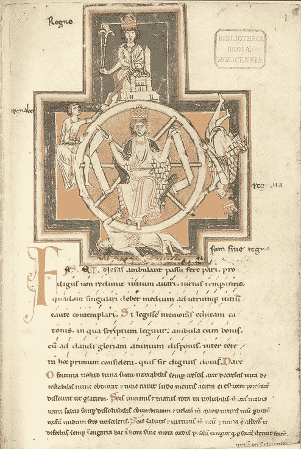

图 7.1 Carmina Burana 手稿中段落开头的首字母下沉

另一种使内容更具视觉冲击力的方法是调整我们的图像，使其在文本中看起来很合适。当我们向内容添加图像时，我们通常会添加我们的图像元素和可能的一些边距，而不会过多地考虑这个过程。然而，结合使用 CSS 形状和浮动，我们可以使文本围绕图像的实际形状进行环绕，从而创建一个更加引人注目的效果。我们可以将文本围绕我们创建的几乎任何形状进行环绕，甚至是曲线。

在本章中，我们将仔细审视我们的排版和图像，使我们的内容更具视觉吸引力，同时确保其可访问性。我们将从一个未加样式的摘录开始，摘自杰克·伦敦的《野性的呼唤》([`mng.bz/61WR`](http://mng.bz/61WR))。我们将使用浮动为我们的第一段添加首字母下沉。然后我们将文本围绕我们的图像（栅格和矢量）进行环绕，遵循图像的内容。图 7.2 显示了起点和成品。

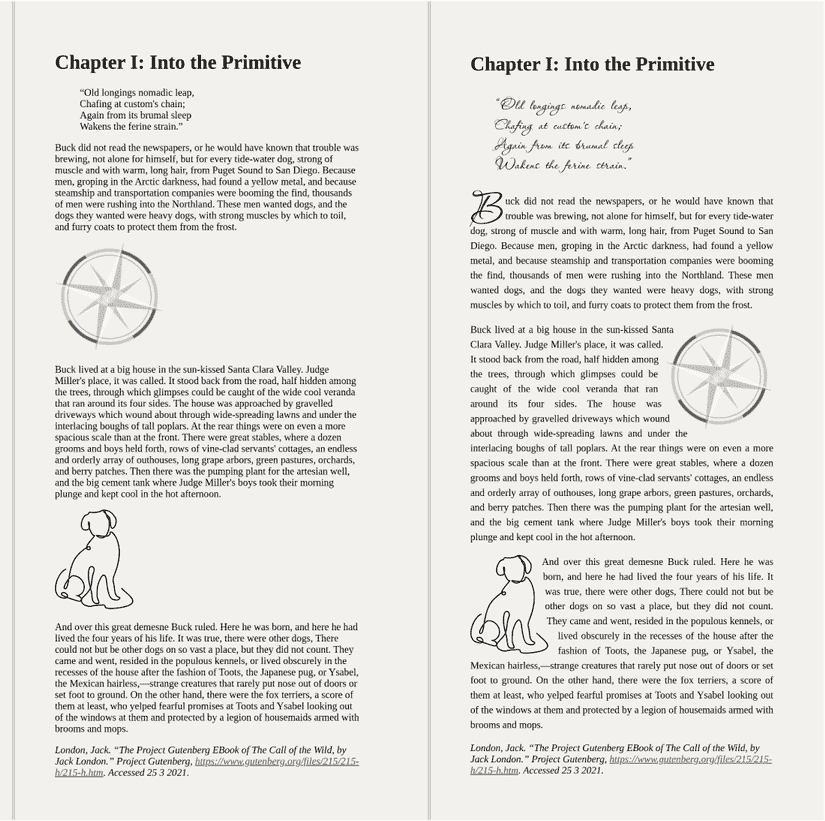

图 7.2 起点（左）和成品（右）

注意：*栅格图像*是通过使用像素网格创建的，而*矢量图像*是通过数学公式绘制的。关于栅格和矢量之间差异的深入了解，请参阅第三章。

列表 7.1 和列表 7.2 分别包含我们将在此章节中构建的页面的起始 HTML 和 CSS。要跟随我们为页面添加样式的过程，您可以从 GitHub 仓库 [`mng.bz/oJXD`](http://mng.bz/oJXD) 或 CodePen [`codepen.io/michaelgearon/pen/MWodXxM`](https://codepen.io/michaelgearon/pen/MWodXxM) 下载起始代码。我们的 HTML 包含一个 `<main>` 元素，其中包含一个标题 (`<h1>`)、块引用 (`<blockquote>`)、三个段落 (`<p>`)、两个图像 (``）和来源引用 (`<cite>`)。

列表 7.1 起始 HTML

```
<main>
  <h1>Chapter I: Into the Primitive</h1>
  <blockquote>"Old longings nomadic...</blockquote>
  <p>Buck did not read the newspapers, or he...</p>
      ①
  <p>Buck lived at a big house in the...</p>
                      ②
  <p>And over this great demesne Buck ruled...</p>
  <cite>London, Jack...</cite>
 </main>
```

① 方位图像

② 狗图像

我们的 CSS 包含一些基础样式来设置我们的页面，包括 `margin`、`padding` 和 `background-color`。`body` 的宽度限制为 `78ch`，并且当屏幕宽度超过最大值时，边距会居中内容。我们还设置了页面的默认字体，即 Times New Roman。最后，为了确保在小屏幕上图片不会溢出，我们给它们设置了最大宽度，设置为 `100%`。换句话说，图片的宽度不能超过其容器。

注意 注意到我们使用 `ch` 作为 `max-width`。`ch` 是一个基于所使用的字体家族的相对单位。`1ch` 等于或更准确地说，是符号 `0`（零）的宽度或水平占用空间。

列表 7.2 起始 CSS

```
html {
  padding: 0;
  margin: 0;
}

body {
  background-color: rgba(206, 194, 174, 0.24);
  padding: 4rem;
  font-size: 16px;
  max-width: 78ch;                                 ①
  margin: 0 auto;                                  ②
  font-family: 'Times New Roman', Times, serif;
  border-left: double 5px rgba(0,0,0,.16);
  min-height: 100vh;                               ③
  box-sizing: border-box;
}
img {
  max-width: 100%;
}
```

① 防止我们的内容变得过于宽

② 居中内容

③ 不论窗口大小，背景覆盖整个窗口。

## 7.1 添加首字母下沉

我们有一些基础 CSS 来设置页面样式，因此现在我们将关注文本。由于我们身体的宽度被限制在一个适合文本的宽度上，我们不需要担心行长。但我们确实需要处理行距。

### 7.1.1 行距

*行距*（发音为’le-diŋ）是行与行之间的空间。这个术语来自印刷机时代，当时排版工人使用各种宽度的铅条来调整文本行之间的间距。我们将使用 `line-height` 属性来实现相同的效果。这个属性可以接受一个数值（`line-height:` `2`）或一个带单位的数值（`line-height:` `5px`）。单位可以是相对的，如 ems，也可以是固定的，如像素。除非我们提供的单位相对于字体大小（例如 `em`），如果字体被缩放或子元素有不同的字体大小，行高可能看起来不正确，并可能对可读性产生负面影响。当我们使用无单位的数值时，行高会自动相对于元素的字体大小计算，从而消除这种担忧。因此，我们将使用无单位的 `line-height`。我们将通过创建一个专门针对段落元素的规则，并将高度设置为以下方式来设置所有段落的 `line-height`：`p` `{` `line-height:` `1.5;` `}`。

提示 研究表明，行高在 `1.5` 到 `2` 之间的文本对于认知障碍人士来说更容易进行行追踪（[`www.w3.org/TR/WCAG20-TECHS/C21.html`](https://www.w3.org/TR/WCAG20-TECHS/C21.html)）。

### 7.1.2 对齐

当文本紧随图像时，为了达到最佳效果，我们将使文本对齐。*对齐*文本意味着我们将使所有行具有相同的宽度——这是一种常用于报纸上使文本列的右边缘整齐而不是参差不齐的技术。

警告 网络内容可访问性指南（WCAG）包括三个相互依赖的符合级别：A、AA 和 AAA。A 是最不限制的，AAA 是最严格的。大多数情况下，网站的目标是达到 AA 级别的符合。但如果我们必须符合 AAA，值得注意的是，对齐文本违反了可访问性指南 1.4.5，这是 AAA 的要求（[`mng.bz/v1ja`](http://mng.bz/v1ja)）。

为了使文本对齐，我们将使用 `text-align` 属性，它可以接受 `left`、`right`、`center` 或 `justify` 的值。我们将向段落规则添加 `text-align:` `justify;`。现在该规则有两个属性，`text-align` 和 `line-height`，负责段落样式。以下列表显示了完成的段落规则，图 7.3 显示了结果。

列表 7.3 完成的段落规则

```
p {
  line-height: 1.5;
  text-align: justify;
}
```

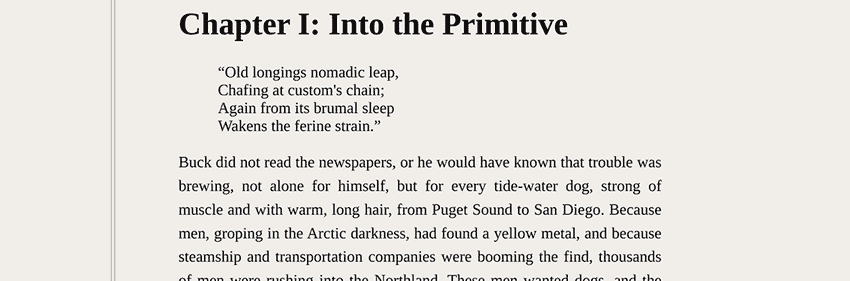

图 7.3 样式化段落

段落处理完毕后，我们可以专注于第一段的第一字母来创建我们的首字母下沉。

### 7.1.3 第一字母

我们不需要向 HTML 中添加任何元素来选择第一段的第一字母。我们可以使用伪类 :`first-of-type` 来选择第一段，然后使用伪元素 `::first-letter` 来获取字母，在这种情况下是一个 *B*，这两个都可以链式使用。在代码中，这些选择器转换为 `p:first-of-type::first-letter` `{}`。

注意 伪类被添加到选择器中以针对特定状态；伪元素允许我们选择元素的一部分。

字母被选中后，我们可以开始对其进行样式设计，使其看起来像首字母下沉。为了使其从其余文本中脱颖而出，我们将选择一个更华丽的字体。在这种情况下，我们将从 Google Fonts 导入 Passions Conflict ([`mng.bz/X5vE`](http://mng.bz/X5vE)；图 7.4)。

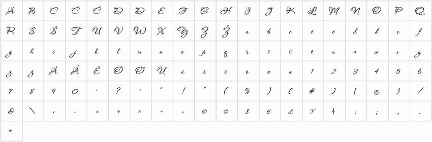

图 7.4 激情冲突符号

由于这种字体具有特别华丽的字母，它非常适合用作首字母。我们还将在此章的后面使用它来样式化文本开头处的引言。使用如此美丽的字体，如这一种，是装饰页面的一种美妙方式——但仅适用于短篇内容。手写体和显示字体可能很难阅读，因此它们不适合大块文本。然而，对于首字母、大标题或短引言，这些字体可以使元素与内容区分开来，并为页面增添一些个性。

这种字体中的符号比我们用于其余内容的 Times New Roman（字体）要小得多。由于我们正在创建首字母，根据定义，它比其余文本要大，因此我们需要调整字体大小。我们还将调整字母的行高，使其与文本很好地匹配。最后，我们将第一个字母向左浮动，以便文本围绕字母流动，达到我们期望的效果。

`float`属性根据传递给它的值将元素放置在其容器右侧或左侧。根据 Mozilla 开发者网络的说法，“元素从页面的正常流程中移除，尽管仍然属于流程的一部分”([`mng.bz/ydle`](http://mng.bz/ydle))。围绕它的内联元素（我们的文本）使用剩余的空间来围绕浮动元素包裹。

`float`属性可以取三个值之一：`left`、`right`和`none`（元素不浮动）。由于我们的文本是英文，从左到右流动，我们希望将字母*B*保持在左边，因此我们将通过添加`float:` `left;`到我们的规则中来将第一段的第一字母(*B*)向左浮动。以下列表显示了我们所创建的用于样式化首字母的完整 CSS 规则，以及导入 Passions Conflict 字体的过程。

列表 7.4 样式化和定位第一段的第一字母

```
@import url(
  'https:/ /fonts.googleapis.com/css2?
➥ family=Passions+Conflict&display=swap'                ①
);

p:first-of-type::first-letter {                          ②
  font-size: 6em;                                        ②
  float: left;                                           ②
  line-height: .5;                                       ②
  font-family: 'Passions Conflict', cursive;             ②
}                                                        ②
```

① 导入 Passions Conflict 字体

② 样式化我们第一段开头字母 B 的规则

注意，我们调整了第一字母的行高以调整*B*下面的空间。默认情况下，行高与字体大小成比例。由于我们的字母很大，所需的行高很高，因此我们将其降低以使文本在首字母下方流动得更自然。图 7.5 显示了生成的输出。

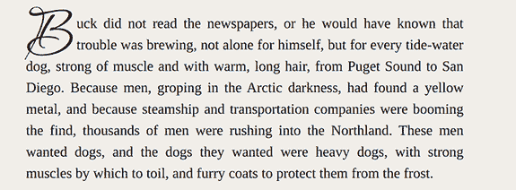

图 7.5 首字母

我们使用`em`和无单位的`line-height`，这样如果以后我们更改段落的字体大小，首字母将相应地缩放。`6em`的值是基于父元素的`font-size`设置的，在这种情况下是段落标签。

为了将我们的 *B* 重新定位以更好地与文本匹配，我们编辑了字母的 `line-height`。但我们可以使用另一种技术。我们可以将 *B* 的 `position` 设置为 `relative`，然后使用 `top`、`bottom`、`left` 和 `right` 来改变其相对于文本其余部分的位置。在我们创建好首字下沉后，我们将把注意力转向页面开头的引言。

## 7.2 引言的样式

页面顶部的引言目前相当单调，并且在与文本的其余部分中有些迷失。为了使其突出，我们将使用我们用于首字下沉的相同字体。由于之前提到的尺寸和行高差异，我们将调整这些参数，以便段落和引言具有统一的大小和间距。列表 7.5 显示了我们将添加的 CSS 以完成此任务，图 7.6 显示了输出。

列表 7.5 `<blockquote>` 格式化

```
blockquote {
  font-family: 'Passions Conflict', cursive;
  font-size: 2em;
  line-height: 1;
}
```

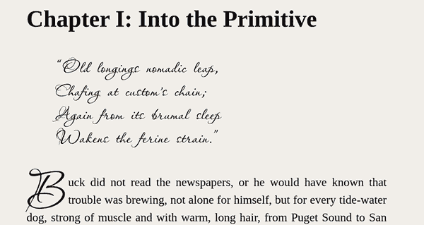

图 7.6 样式 `<blockquote>`

再次，我们使用相对单位，以便如果其余内容的字体大小发生变化，引言也会发生变化。你可能已经注意到，尽管我们之前（第 7.1.1 节）提到，为了最佳的可读性，行高应为 `1.5` 到 `2`，但我们在这里使用了 `line-height` 的 `1`。我们在这里做出例外，因为默认情况下，字体已经具有很大的行高；我们不需要增加大小。偶尔，我们会遇到默认情况下具有自然高行高的字体，尤其是在我们处理手写体或显示字体时。在这种情况下，有时我们必须根据字体的设计对行高可读性指南做出例外。

现在，我们的文本已经处理好了，我们可以专注于图像。

## 7.3 在指南针周围弯曲文本

我们需要做的第一件事是将指南针图像向右浮动，以便文本围绕它包裹。我们的指南针是一个 PNG 图像，因为它是一个矩形图像，所以文本在围绕图像包裹时遵循矩形路径。图 7.7 显示了浮动的指南针。已经应用了边框来显示其边界框。

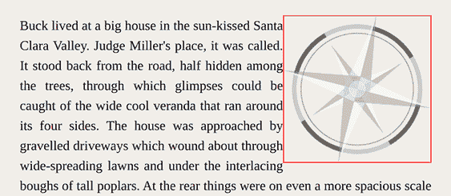

图 7.7 正方形指南针

### 7.3.1 添加 shape-outside：圆形

要使文本跟随指南针的曲线，我们需要在图像中添加一个曲线，以便文本可以围绕它包裹。我们将使用的属性是 `shape-outside`。这个属性允许我们定义一个形状，相邻的文本将围绕这个形状流动。形状不必是矩形的；相反，它可以下列形状中的任何一个：

+   圆形或椭圆形

+   多边形

+   从图像派生（使用图像的 alpha 通道 [透明度] 来确定形状应该是什么）

+   路径（在规范中，但截至本文写作时，任何浏览器都没有实现；见 [`mng.bz/aMWX`](http://mng.bz/aMWX)）

+   盒模型值（`margin-box`、`content-box`、`border-box` 和 `padding-box`）

+   线性渐变

由于我们有一个圆形图形，我们想要的目标形状是一个圆。这个决定给我们提供了几个选择：

+   使用 CSS 形状（[`mng.bz/aMWX`](http://mng.bz/aMWX)）。

+   使用 `border-radius`。

让我们先看看如何使用形状。为了定义我们的圆，我们将使用 `circle()` 函数，它接受一个可选的 `radius` 属性和一个可选的 `position` 属性来定义圆的中心开始的位置。如果没有提供 `radius`，则默认值为 `closest-side`。如果省略了 `position` 属性，则圆的起点默认为图像的中心：

```
circle(<shape-radius>, at <position> )
```

在我们的情况下，我们希望圆的中心位于图像的中间，所以我们不会传递一个 `position` 属性。然而，我们必须定义一个 `radius`，我们将将其设置为 `50%`。

数学原理

我们希望半径等于我们图像宽度的一半，这在底层将解析为宽度平方加高度平方的平方根除以 2：

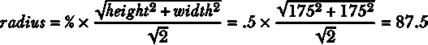

因为我们的图像是正方形，宽度为 175，当我们传递一个 `radius` 为 `50%` 时，我们的半径为 87.5 是合乎逻辑的。但如果图像是矩形的，理解基于百分比的半径是如何计算的对于理解最终输出将是什么样子非常重要。

如果我们有一个高度为 `100px`、宽度为 `300px` 的风景图像，当选择基于百分比的值时，所需的半径需要更明显。我们可以使用以下公式来计算半径是多少：

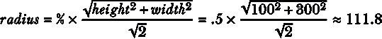

图 7.8 显示了当我们使用 `circle()` 函数中的 `50%` 值时，半径将如何应用于我们的正方形图像与矩形图像。

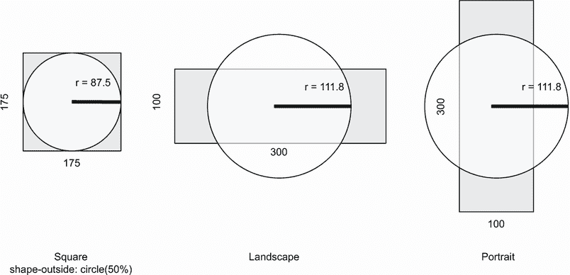

图 7.8 将半径应用于正方形图像与矩形图像

我们的图像是正方形，所以我们使用一个值为 `circle(50%)` 的 `shape-outside` 属性来设置我们的图像。列表 7.6 显示了 CSS 规则。我们的图像是正方形，因此它的宽高比为 1（宽度/高度 = 175 ÷ 175 = 1）。

**定义** 图像的**宽高比**是通过将宽度除以高度计算出的图像高度和宽度的比例关系。

添加宽高比并不是严格必要的，但有助于减少加载时的布局偏移。

**定义** 当一个元素被添加到页面或其大小发生变化时，页面上的所有元素都会移动以腾出空间给元素或填充留下的空白。页面元素的运动被称为**布局偏移**。

当图像具有固定的高度和宽度或已定义的宽高比时，浏览器可以在加载图像时为其预留空间，从而减少布局偏移。因此，定义图像的宽高比和/或高度和宽度是一个好的实践。

列表 7.6 `shape-outside`

```
img.compass {
  aspect-ratio: 1;                ①
  float: right;                   ②
  shape-outside: circle(50%);     ③
}
```

① 宽高比

② 将图像浮动到右侧

③ 添加一个值为 50%的圆

图 7.9 展示了我们的输出。文本围绕图像环绕并跟随曲线，但图像没有任何裁剪。这种效果之所以可行，是因为我们的图像有一个透明的背景。

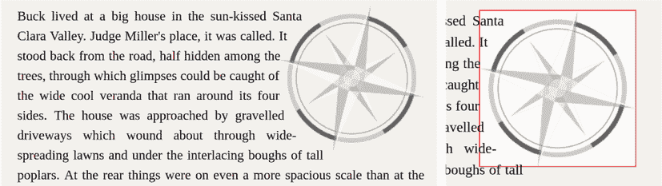

图 7.9 浮动指南针，文本弯曲

### 7.3.2 添加 clip-path

我们已经使文本弯曲，但图像仍然是方形的。如果我们给图像添加一个背景，这一点就会变得明显。要使图像看起来真正是圆形的，我们需要添加一个`clip-path`。`clip-path`属性也接受一个形状，所以我们将传递与传递给`shape-outside`相同的值。我们还将给我们的图像添加一些边距，以在图像和文本之间添加一些呼吸空间。列表 7.7 显示了我们的图像的完整 CSS。

列表 7.7 `clip-path`

```
img.compass {
  aspect-ratio: 1;
  float: right;
  shape-outside: circle(50%);
  clip-path: circle(50%);
  margin-left: 1rem;
}
```

我们添加了一个与`shape-outside`匹配的`clip-path`，并在图像的左侧添加了一些边距，以防止文本离图像太近，特别是因为指南针有从圆形轮廓突出来的箭头，而我们的`circle()`没有创建这样的轮廓。图 7.10 显示了最终的输出。

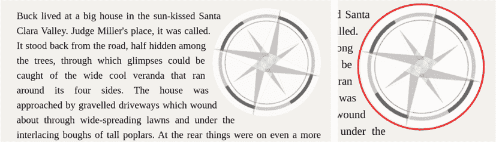

图 7.10 圆形浮动指南针

当我们添加`clip-path`时，我们会观察到现在图像本身，包括背景，看起来是圆形的。角落已经被裁剪，之前是方形的背景现在是圆形的。此外，增加的边距使文本围绕我们的指南针箭头移动，使其看起来不那么拥挤。

我们已经展示了我们可以通过使用 CSS 形状来创建圆形。现在让我们看看如何使用`border-radius`来创建圆形。

### 7.3.3 使用 border-radius 创建形状

当我们使用`border-radius`来塑造元素时，我们可以从元素的轮廓创建一个 CSS 形状。我们仍然使用`shape-outside`，但不是传递一个形状，而是指定我们想要形状形成的盒模型级别。我们的选项有

+   `margin-box`—形状跟随边距。

+   `border-box`—形状跟随边框。

+   `padding-box`—形状跟随填充。

+   `content-box`—形状跟随内容。

让我们从一张干净的画布开始，将我们的图像浮动到右边，并添加一些边距以防止文本拥挤图像。列表 7.8 包含我们的起始 CSS，图 7.11 显示了当前的显示。

列表 7.8 起点

```
img.compass {
  aspect-ratio: 1;
  float: right;
  margin-left: 1rem;
}
```

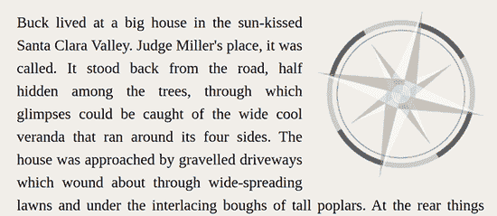

图 7.11 重置浮动并添加边距

现在，让我们添加一个`border-radius`为`50%`，这将使我们的图像成为圆形。然而，在这个时候，文本并没有跟随曲线。我们仍然需要添加`shape-outside`属性。

我们的图像有一个边距，理想情况下我们希望形状尊重这个边距，因此我们将使用`margin-box`值。接下来的列表显示了这一概念在代码中的应用。

列表 7.9 添加`border-radius`和`shape-outside`

```
img.compass {
  aspect-ratio: 1;
  float: right;
  margin-left: 1rem;
  border-radius: 50%;
  shape-outside: margin-box;
}
```

图 7.12 显示了带有白色背景和边框的输出，以强调图像的形状。

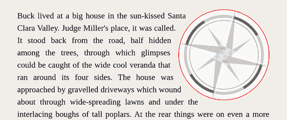

图 7.12 指南针形状，`border-radius`为`50%`，`shape-outside`值为`margin-box`

与我们使用 `shape-outside` 和 `circle()` 函数时不同，我们的图像已经裁剪成圆形形状，消除了使用 `clip-path` 的需要。这个结果是我们使用 `border-radius` 的直接结果，它为我们做了裁剪。

我们已经看到了两种实现相同结果的不同方法。CSS 提供了多种方法来处理许多问题，包括这个问题。这两种选项并没有特别优于对方。`border-radius` 需要稍微少一点的代码，这给它带来了一丝优势，但在这个情况下，选择是一个个人偏好的问题。

现在我们已经处理了指南针图像，我们将继续将文本环绕在狗的周围。

## 7.4 将文本环绕在狗的周围

与标准形状的指南针不同，狗有一个不规则的轮廓。这张图像是由单一路径组成的线条艺术，所以我们可能会想从 SVG 文件中抓取路径并使用 `path()` 函数来创建我们的形状。然而，正如我们即将看到的，尽管它在 CSS 规范中定义了（[`www.w3.org/TR/css-shapes`](https://www.w3.org/TR/css-shapes)），这种技术不会起作用。

### 7.4.1 使用 path()...或者尚未

让我们打开图像文件并在编辑器中检查代码。以下列表显示了为了简洁而省略的图像代码，以突出重要信息。

列表 7.10 `dog.svg`

```
<svg  viewBox="0 0 152 193">
  <defs>
    <style>
      .cls-1{
        fill:none;
        stroke:#000;
        stroke-miterlimit:10;
        stroke-width:2px;
      }
    </style>
  </defs>
  <path class="cls-1" d="M21.9135,115.62c-17.2115,4.7607-37.3354,..."/>
</svg>
```

我们有 `<defs>` 元素，它包括图像的样式。这部分定义了 SVG 中的单个元素将看起来是什么样子。然后我们有一个 `<path>`，这是显示狗的元素。这个元素有 1,988 个字符长，相当复杂，当 `shape-outside:` `path('M21.913...');` 被粘贴到 `path()` 函数中时，它似乎没有做任何事情。原因是当这本书被编写时，没有浏览器完全实现了 `path()`。

当这个功能实现时，使用图形编辑器创建我们的路径并将它们复制以创建我们的形状将是一种有价值的技巧。但这种方法有一个缺点：路径可能会相当长，使得维护变得可疑。与此同时，我们有一些替代方案：

+   创建一个大致匹配我们图像的多边形形状，类似于我们用于圆形的技术

+   使用 `url()` 函数，它将图像拉入并基于 alpha 通道创建形状

我们将选择第二种选项：`url()` 函数。

### 7.4.2 浮动图像

正如我们在处理指南针图像时所做的（第 7.3 节），我们将首先浮动图像，但这次我们将将其浮动到左侧，以打破我们页面上的视觉单调性。然后，为了创建形状，我们将使用 `url()` 函数并将图像路径传递给它。列表 7.11 展示了应用于狗图像的 CSS。

提供图像文件

当使用`shape-outside`的 URL 时，我们需要确保我们的代码通过服务器运行，这样浏览器会获取图像，而不是直接从文件系统中读取。这种方法与跨源资源共享（CORS）和浏览器设置的安全策略相关。你可以在 CSS 规范中找到详细的解释，链接为[`mng.bz/pdMw`](http://mng.bz/pdMw)。

为了减轻这个问题，GitHub 仓库中的示例代码使用了`http-server`，在`localhost:8080`上提供文件服务以完成此任务。另一个选择是使用`shape-outside:` `url("https:/ /raw.githubusercontent.com/michaelgearon/Tiny-CSS-Projects/` `main/chapter-07/before/img/dog.svg")`引用 GitHub 上的托管文件。

列表 7.11 狗向左浮动

```
img.dog {
  aspect-ratio: 126 / 161;
  float: left;
  shape-outside: url("https:/ /raw.githubusercontent.com/michaelgearon/Tiny-CSS-Projects/main/chapter-07/before/img/dog.svg");
}
```

我们将图像向左浮动，然后添加我们的`shape-outside`，传递对图像本身的引用。浏览器将查看图像的透明度，并根据透明度结束的位置确定创建形状的位置。图 7.13 显示了我们的输出。

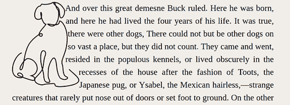

图 7.13 浮动狗

由于我们的图像有一个不透明的线条和透明的背景，裁剪是直接的。如果我们的图像有一个从不透明到透明的渐变，我们可以通过使用`shape-image-threshold`属性来调整裁剪。该属性接受介于`0`（完全透明）和`1`（完全不透明）之间的值。

### 7.4.3 添加 shape-margin

下一步是添加一些边距来将文本从图像推开，因为它看起来相当拥挤。我们不能简单地给图像添加边距，就像我们向右浮动时做的那样；如果我们尝试这样做，我们会注意到边距被忽略了。相反，我们需要使用`shape-margin`。`shape-margin`属性允许我们调整形状和其余内容之间的空间量。我们将添加`1em`的空间，如以下列表和图 7.14 所示。

列表 7.12 将`shape-margin`添加到我们的规则中

```
img.dog {
  aspect-ratio: 126 / 161;
  float: left;
  shape-outside: url("https:/ /raw.githubusercontent.com/michaelgearon/Tiny-CSS-Projects/main/chapter-07/before/img/dog.svg");
  shape-margin: 1em;
}
```

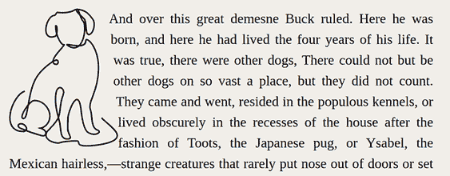

图 7.14 应用到图像的`shape-margin`

图像底部的文字仍然相当接近。在这个时候，我们可以添加一些边距来增加空间，只要添加的边距小于或等于`shape-margin`的数量。如果值大于`shape-margin`的数量，边距仍然会生效，但只会生效到`shape-margin`的数量。记住这个注意事项，我们将向图像的右侧添加`1em`的边距。下一个列表显示了狗图像完成的 CSS。

列表 7.13 完成的狗图像

```
img.dog {
  aspect-ratio: 126 / 161;
  float: left;
  shape-outside: url('img/dog.svg');
  shape-margin: 1em;
  margin-right: 1em;
}
```

`shape-margin`和`margin-right`的组合将文本从我们的图像推开，形成了我们在图 7.15 中看到的精致结果。

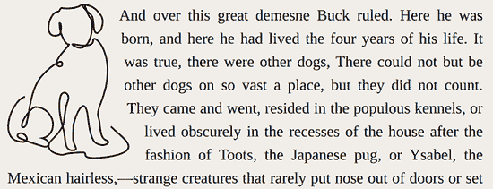

图 7.15 完成的浮动狗

完成最后这一部分后，我们已经完成了页面的样式设计（图 7.16）。我们有一个视觉上吸引人且比我们开始时更有趣的布局。

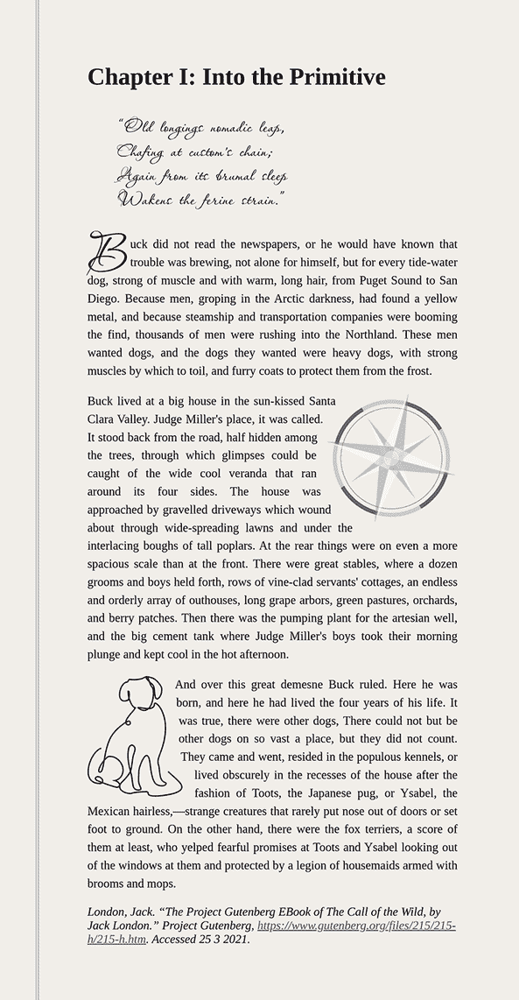

图 7.16 完成的布局

我们创建了一个由浮动的使用所实现的布局。如果我们使用 Flex 或 Grid，很难轻易地达到相同的效果。无论我们单独使用它，就像在我们的首字下沉示例中那样，还是与形状（虽然这些形状也相当新颖）结合使用，浮动继续是我们工具箱中的一个宝贵资产。

## 摘要

+   行距，即行与行之间的空间，对于可读性很重要。

+   可以将 `Float` 与 `::first-letter` 结合使用来创建首字下沉。

+   并非所有字体在给定相同大小值时都具有相同的大小和行高。

+   `shape-outside` 属性使用 CSS 形状来改变元素形状。

+   使用 `border-radius` 可以创建圆形形状。

+   与浮动的 CSS 形状相邻的内联内容将跟随形状。

+   当我们使用 `url()` 与 `shape-outside` 结合时，浏览器必须获取图像文件（托管或通过 `http-server` 或等效方式）。

+   `shape-margin` 属性设置了形状的边距。

+   有些布局没有使用浮动是无法创建的。
