# 8 设计结账购物车

本章涵盖

+   使用响应式表格

+   使用网格自动定位

+   格式化数字

+   基于视口大小通过媒体查询条件性地设置 CSS

+   使用 `nth-of-type()` 伪类

我们中的许多人经常上网购买从食物到书籍再到娱乐等所有事物。这种体验的共同点是结账购物车。我们通过将所选项目添加到虚拟购物车或篮子中来做出选择，在最终购买之前我们可以查看所选项目。在本章中，我们将探讨如何对结账购物车进行样式化，使其在窄屏和宽屏上都能正常工作。我们还将探讨如何处理窄屏和宽屏的表格。表格对于显示数据非常有用，但它们在移动设备上可能有点难以样式化，因此我们将探讨窄屏的 CSS 解决方案。

首先，我们将处理一些主题。无论屏幕宽度如何，我们的输入字段、链接和按钮等元素看起来都一样，因此我们将首先对它们进行样式化。在组装用户界面的过程中早期定义一个主题可以显著减少冗余代码。它还增加了我们保持样式一致的能力，因此无论我们是在创建结账购物车还是任何其他页面或应用程序，我们都可以将此过程应用于任何数量的设计。

接下来，我们将专注于布局，从窄屏到宽屏。在窄屏设备上，如手机，我们倾向于堆叠东西。随着屏幕变大，我们添加规则来利用我们可用的全部宽度。通常，从移动布局开始并随着屏幕变宽添加样式比从宽屏布局开始并在屏幕变小时覆盖之前设置的布局元素更容易。 

## 8.1 入门

我们将创建样式以适应三种屏幕尺寸：

+   *窄屏*（大多数手机）—最大宽度为 549 像素

+   *中屏*（平板电脑和小屏幕）—介于 500 到 955 像素之间

+   *宽屏*（桌面电脑和高分辨率平板电脑）—宽度超过 955 像素

图 8.1 显示了每个屏幕尺寸的起始点和最终输出。

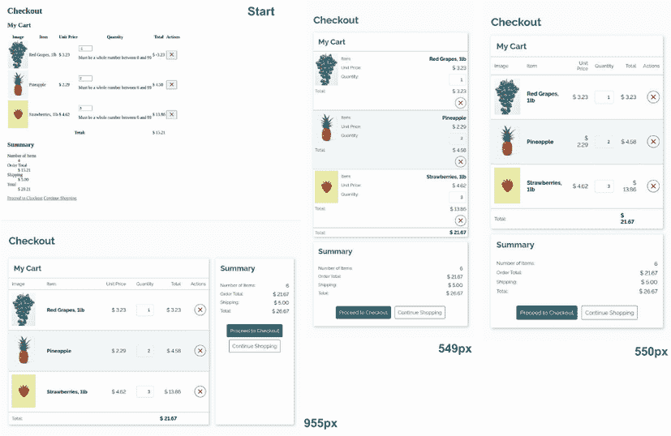

图 8.1 小、中、大屏幕的起始和结束输出

无论屏幕大小如何，我们都会使用相同的 HTML。我们将有一个样式表，并使用媒体查询来调整元素的外观，这取决于屏幕大小。我们的起始 HTML 在 GitHub 上 [`mng.bz/GRpJ`](http://mng.bz/GRpJ) 和 CodePen 上 [`codepen.io/michaelgearon/pen/ExmLNxL`](https://codepen.io/michaelgearon/pen/ExmLNxL) 可用。代码由两部分组成，一部分用于购物车，另一部分用于摘要，它们被包裹在一个容器中，我们将在宽屏上使用该容器将部分并排放置。购物车部分包括一个标题和一个包含购物车中每个项目的表格。摘要部分包含一个标题、一个描述列表和两个链接。图 8.2 示意图说明了 HTML 元素。

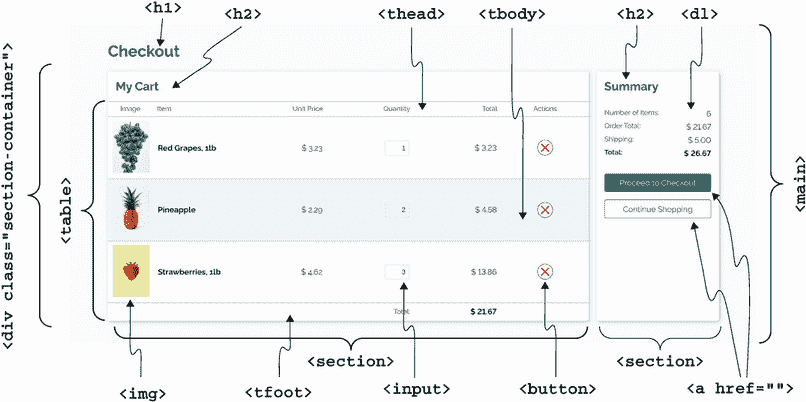

图 8.2 HTML 元素图

以下列表是我们开始时的 HTML 的简略版。

列表 8.1 起始 HTML

```
<body>
  <main>
    <h1>Checkout</h1>
    <div class="section-container">
      <section class="my-cart">
        <h2>My Cart</h2>
        <table>
          <thead>
            <tr>
              <th>Image</th>
              <th>Item</th>
              <th>Unit Price</th>
              <th>Quantity</th>
              <th>Total</th>
              <th>Actions</th>
            </tr>
          </thead>
          <tbody>
            <tr>
              <td>
                
              </td>
              <td data-name="Item">Red Grapes, 1lb</td>
              <td data-name="Unit Price">$ 3.23</td>
              <td data-name="Quantity">
                <input name="grapes" type="number"
                   aria-label="Pounds of grape baskets"
                   min="0" max="99"
                   value="1">

              </td>
              <td data-name="Total">
                <!-- value calculated & inserted by JS -->
              </td>
              <td>
                <button type="button" class="destructive">
                  
                </button>
              </td>
            </tr>
            ...
          <tfoot>
            <tr>
              <th colspan="4" scope="row">Total:</th>
              <td id="total">
                <!-- value calculated & inserted by JS -->
              </td>
            </tr>
          </tfoot>
        </table>
      </section>

      <section class="summary">
        <h2>Summary</h2>
        <dl>
          <dt>Number of Items</dt>
          <dd id="itemQty">
            <!-- value calculated & inserted by JS -->
          </dd>
      ...

        </dl>
        <div class="actions">
          <a href="#" class="button primary">
            Proceed to Checkout
          </a>
          <a href="#" class="button secondary">
            Continue Shopping
          </a>
        </div>
      </section>
    </div>
  </main>
  <script src="./script.js"></script>
</body>
```

除了起始的 HTML 代码，我们还会使用一个 JavaScript 文件（`script.js`）。我们不会编辑或与该文件交互；它仅仅用于更新总结部分的总额。

## 8.2 主题化

尽管我们的布局有两个明确定义的部分（购物车和总结）并且需要适应不同的屏幕尺寸，但某些样式无论它们在哪里或屏幕大小如何都不会改变。这些样式包括

+   字体

+   按钮和链接样式

+   输入和错误信息样式

+   标题大小和颜色

这些样式可以被称为我们的*主题*，为了在整个页面上保持一致性，我们通常希望只写一次并应用到每个地方。让我们从我们的字体开始。

### 8.2.1 字体排版

目前，我们的`font-family`是浏览器的默认字体。对于这个项目，我们将从 Google Fonts 导入 Raleway 并将其应用于 body。我们将导入常规和粗体，因为在这个项目中我们都需要它们。我们还将设置默认的文本颜色为`#171717`，这看起来几乎是黑色，用于我们的文本。我们在这个设计中不使用黑色，因为它是一个柔和的设计，纯黑色可能会显得相当刺眼。

接下来，我们将处理我们的数字。一个字体家族默认有旧式或现代数字。区别在于数字与平均线和基线的对齐方式，如图 8.3 所示。


图 8.3 旧式与现代图表对比

旧式数字有部分会超出基线；现代的则不会。因为我们正在创建一个购物车，我们想要堆叠数字以显示它们被添加以创建总额，我们希望使用现代数字以便它们对齐得很好。然而，我们选择的字体家族 Raleway 默认使用旧式数字。为了使我们的字体使用现代数字，我们可以使用`font-variant-numeric`属性，它允许我们设置我们希望数字如何显示。这个不太为人所知的属性在处理数字时很有用，因为它允许我们控制它们显示的多个方面，包括

+   零是否以斜杠显示

+   数字的对齐方式

+   分数的显示方式

我们将使用`font-variant-numeric:` `lining-nums`属性，这将把我们的数字从旧式改为现代。图 8.4 显示了应用`font-variant-numeric`到我们的 body 规则之前和之后的总结部分。在之前的版本中，数字大小不同；在之后的版本中，它们对齐且大小均匀。


图 8.4 应用`font-variant-numeric`属性前后的对比

最后，我们将更改我们标题的颜色为青色。在这次更改之后，我们将为我们的页面设置基本的排版。我们直接在`<body>`元素中应用了它，以便页面内的其他子元素可以继承这些值。列表 8.2 显示了到目前为止我们构建的规则。

列表 8.2 应用于`<body>`元素的排版相关样式

```
@import url('https:/ /fonts.googleapis.com/css2?
➥ family=Raleway:wght@400;700&display=swap');

body {
  font-family: 'Raleway', sans-serif;
  color: #171717;
  font-variant-numeric: lining-nums;
}

h1, h2 {
  color: #2c6c69;
}
```

图 8.5 展示了我们的更新后的输出。

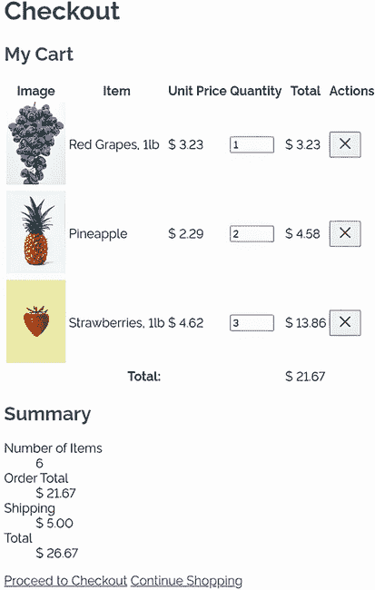

图 8.5 应用的排版

让我们把注意力转向链接和按钮。

### 8.2.2 链接和按钮

我们的页面有几个链接和按钮，但从风格上讲，所有这些元素看起来都像按钮。它们可以根据目的进行分类：

+   *主要行动号召*——前往结账链接

+   *次要行动号召*——继续购物链接

+   *破坏性*——带有*X*的按钮用于从购物车中删除项目

我们将使用这些类别来命名我们的类，以便我们的规则可以轻松重用。

链接与按钮

在我们的项目中，我们既有链接也有按钮。使用哪一个并不是基于个人喜好；它基于预期的功能或目的。对于导航，我们应该使用链接。对于执行操作，例如从我们的购物车中删除项目，我们应该使用按钮。我们可以随意设计这些元素，但底层元素应该与预期的使用场景相匹配。

区分的原因是链接和按钮自动由浏览器关联了信息和行为。这些行为包括它们能够聚焦的能力，更重要的是，它们的角色。元素的角色被辅助技术用来帮助用户与页面交互。

链接和按钮行为差异的一个具体例子是用户能够右键点击它，在新标签页或窗口中打开链接。如果链接是用按钮和 JavaScript 创建的，那么这个功能对用户不可用。

在本章中，我们处理的是一个单独的页面，但这种情况是一个异常。在一个完整的应用程序中，我们有多个页面或组件将重用相同的样式，所以而不是将类命名为类似`proceed-to-checkout`的东西，我们将使用`primary`，这样类就可以在不同的上下文中轻松重用。

在我们讨论按钮类型之间的差异之前，让我们先考虑它们的相似之处，并为所有看起来像按钮的链接（这些链接被赋予了`button`类）和按钮本身制定一个基线。在制定基线之后，我们将为每种按钮类型制定规则。

为了创建我们的基线，我们将首先移除浏览器设置的默认灰色背景，我们将通过使用`background:` `none`来完成这项工作。我们还将更新`padding`、`border`和`border-radius`的值。

最后，因为我们正在将此规则应用于链接和按钮，并且因为链接默认带有下划线，我们将通过将 `text-decoration` 属性设置为 `none` 来从链接中移除下划线。以下列表显示了我们的按钮和具有 `button` 类的链接的基本规则。

列表 8.3 按钮的基本样式

```
button, .button {      ①
  background: none;
  border-radius: 4px;
  padding: 10px;
  border: solid 1px #ddd;
  text-decoration: none;
}
```

① 此规则将应用于所有按钮元素以及所有具有 `button` 类的元素。

在处理完按钮的默认状态后，我们将添加样式变化，以应用于用户将鼠标悬停在按钮上或通过键盘聚焦在按钮上时。为了实现这一目标，我们将使用 `:hover` 和 `:focus` 伪类。

注意：为了定位特定状态，会在选择器中添加一个伪类。在 `hover` 和 `focus` 上添加样式变化对于可访问性很重要，因为它提供了视觉反馈，让用户知道他们可以与项目交互。对于键盘导航，`focus` 上的样式变化让用户知道他们即将与之交互的元素。没有这些视觉提示，很难知道我们可以点击什么，以及我们的焦点在哪里（[`mng.bz/zmdA`](http://mng.bz/zmdA))。

在 `hover` 状态下，我们将在按钮周围添加一个点状青色轮廓，为了给轮廓留出一些空间，我们将它偏移 2 像素。我们将使用两个属性：`outline` 和 `outline-offset`。`outline` 与 `border` 类似，采用相同的三个属性，即 `style`、`width` 和 `color`。`outline-offset` 采用一个 `length` 值（可以是负值），它决定了轮廓与元素边缘之间的空间量。

对于 `focus`，我们将使用与 `hover` 相同的样式，但我们将线条改为实线。以下列表显示了我们的最终 CSS，用于 `hover` 和 `focus` 状态。

列表 8.4 按钮的 `hover` 和 `focus` 状态

```
button:hover,
.button:hover {
  outline: dotted 1px #2c6c69;
  outline-offset: 2px;
}

button:focus,
.button:focus {
  outline: solid 1px #2c6c69;
  outline-offset: 2px;
}
```

图 8.6 显示了 `hover` 和 `focus` 状态的样式化链接和按钮。

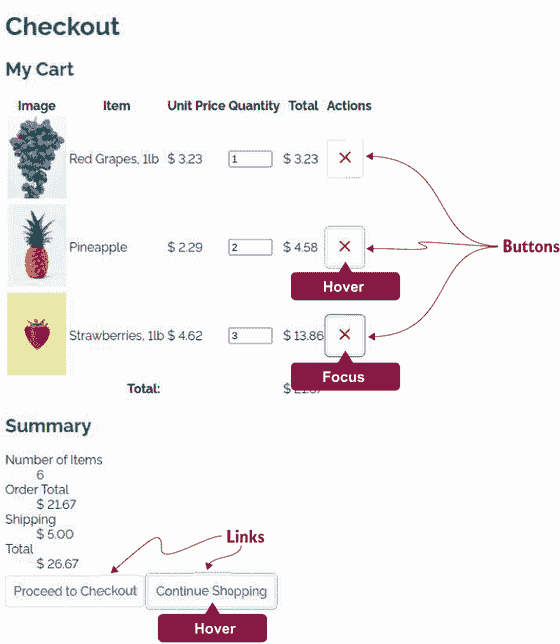

图 8.6 按钮的基本样式，包括 `hover` 和 `focus`

现在我们有了基线，我们可以开始关注每个单独的使用案例。我们将从我们的调用行动（继续结账和继续购物链接）开始。因为我们已经设置了基线，我们只需要编辑这些案例的颜色，如列表 8.5 所示。我们将根据我们更喜欢（或期望）用户选择的操作来区分这两个动作，以突出主要选择。在整个应用程序中保持动作类型样式的统一性有助于我们引导用户通过他们将要做出的选择。

列表 8.5 调用行动样式

```
button.primary,               ①
.button.primary {             ①
  border-color: #2c6c69;      ①
  background: #2c6c69;        ①
  color: #ffffff;             ①
}                             ①

button.secondary,             ②
.button.secondary {           ②
  border-color: #2c6c69;      ②
  color: #2c6c69;             ②
}                             ②
```

① 适用于继续结账链接

② 适用于继续购物链接

剩下要样式化的就是表格中购物项目中的移除按钮。这个按钮被赋予了 `destructive` 类。至于前两种按钮类型，我们想要更改边框、文本和轮廓颜色，这次改为红色而不是青色，以强调这个动作是破坏性的。我们通过给 `border-radius` 赋值为 `50%` 使按钮看起来是圆形的。我们还减少了 `padding` 值；否则，移除按钮将成为我们表格中最突出的元素，这是不希望的。最后，我们通过 `vertical-align` 属性在按钮中间居中图像。这个属性可以应用于内联和内联块级元素，它决定了元素根据其周围的内联和内联块元素如何垂直对齐。我们想要在按钮内垂直居中图像，所以我们将使用属性值 `middle`。

列表 8.6 展示了移除按钮的 CSS。图 8.7 展示了每个状态下的输出。

列表 8.6 移除按钮

```
button.destructive {
  border-color: #9d1616;
  color: #9d1616;
  border-radius: 50%;
  padding: 5px;
}

button.destructive img {     ①
  vertical-align: middle;    ①
}                            ①

button.destructive:hover,
button.destructive:focus {
  outline-color: #9d1616;
}
```

① 在按钮内居中图像

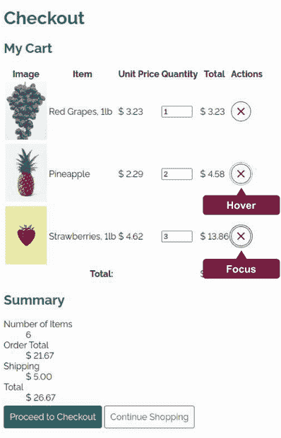

图 8.7 链接和按钮样式

### 8.2.3 输入字段

我们将对输入字段进行一些最小限度的样式化。我们不会处理无效输入或错误信息的样式，因为本章的重点是创建包含表格的响应式布局。有关样式化表单的详细信息，请参阅第十章。

对于这个布局，我们将给我们的输入字段与按钮和链接相同的基样式。然而，我们不会编写新的规则，而是将 `input` 选择器添加到现有的规则集中，如下所示。

列表 8.7 向基本按钮样式添加 `input`

```
button,
.button,
input {
  background: none;
  border-radius: 4px;
  padding: 10px;
  border: solid 1px #ddd;
  text-decoration: none;
}
```

图 8.8 显示了样式化的输入字段。

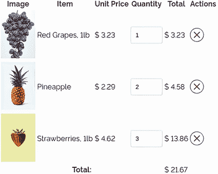

图 8.8 格式化字段

### 8.2.4 表格

接下来，我们将样式化表格。我们将只关注与主题相关的样式，例如颜色和边框。我们将处理布局和响应性，从第 8.3 节到第 8.5 节。

我们将表格分为三个部分，我们将按顺序处理：

+   *头部*—`<thead>`

+   *主体*—`<tbody>`

+   *尾部*—`<tfoot>`

样式化表头

我们将首先样式化我们的表头。因为表头不如表格本身的内容重要，所以我们将给它们一个比其他文本略小的字体大小和较浅的颜色。我们还将降低它们的默认 `font-weight` 的 `bold` 为 `normal`。通过稍微减弱表头，我们在表格中创建了一个视觉层次，并强调了用户最关心的内容（他们购物车中的项目）。规则如下所示。

列表 8.8 样式化单元格内容

```
th {
  color: #3a3a3a;
  font-weight: normal;
  font-size: .875em;
}
```

到目前为止，我们的表头看起来像图 8.9 所示。

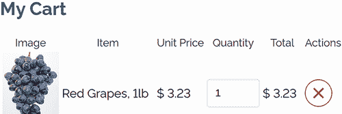

图 8.9 样式化表头单元格

在第二个单元格中加粗项目

在表格体（`<tbody>`）中，我们将通过使文本粗体来强调项目名称（在第二列）。为了给项目添加`font-weight`属性并设置其值为`bold`，我们将使用伪类`:nth-of-type()`，它允许我们根据同一标签的兄弟元素中的位置选择元素。为了定位表格体的每一行的第二个单元格——第二个`<td>`元素——我们使用`tbody td:nth-of-type(2)`。列表 8.9 显示了我们的规则。

列表 8.9 在表格体的每一行中粗体显示第二个单元格

```
tbody td:nth-of-type(2) {
  font-weight: bold;
}
```

图 8.10 显示了我们的更新后的表格，其中项目名称被粗体显示。

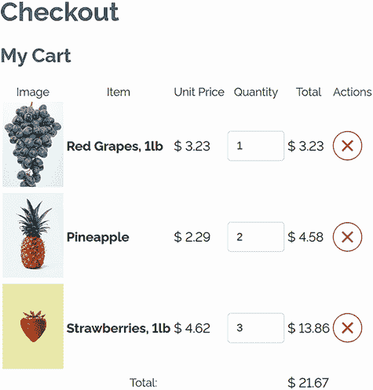

图 8.10 粗体显示的项目名称

条纹化行

接下来，我们将条纹化表格的行。我们再次使用`:nth-of-type()`，但这次我们使用关键字`even`。以下列表中的规则选择了表格体（`<tbody>`）中的偶数行，我们给这些行添加了浅青色的背景颜色。

列表 8.10 条纹化表格体的行

```
tbody tr:nth-of-type(even) {
  background: #f2fcfc;
}
```

图 8.11 展示了我们的更新后的行。

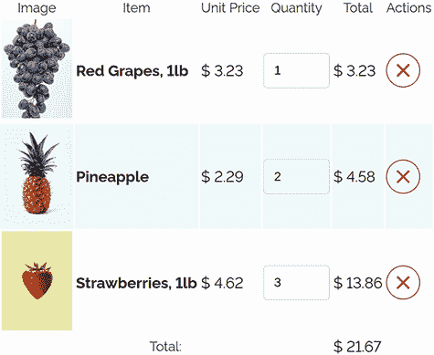

图 8.11 条纹化行

在页脚中粗体显示总金额

我们想要粗体显示总金额，它出现在表格的页脚单元格中。因为我们已经有了一个粗体显示文本的规则——我们创建的用于粗体显示项目名称的规则——我们可以将`tfoot td`选择器添加到现有的规则中，如下面的列表所示。

列表 8.11 粗体显示页脚

```
tbody td:nth-of-type(2),
tfoot td {
  font-weight: bold;
}
```

我们更新的页脚看起来像图 8.12。

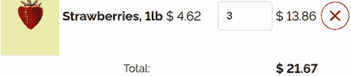

图 8.12 粗体显示的总金额

处理边框

我们将在所有行上添加顶部边框，无论它们在表格中的位置如何。我们还想移除单元格之间出现的突出白色线条。如果我们加深行的背景颜色，它就变得特别明显（图 8.13）。

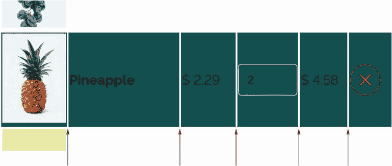

图 8.13 单元格之间的白色线条

让我们从移除单元格之间的间距开始。但首先，为什么会有这些白色线条呢？如果我们决定给表格中的每个单元格添加边框，我们的表格就会看起来像图 8.14。


图 8.14 单个单元格的边框

注意，每个单元格周围都有一个方块。我们看到的行间距是单个单元格之间的间距。如果我们折叠边框，使得单元格之间只出现一条线，那么间距就会消失（图 8.15）。

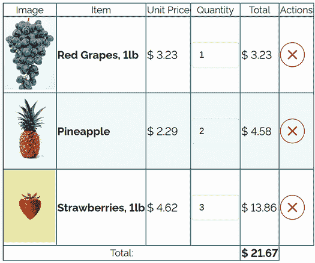

图 8.15 带有折叠边框的表格

我们用来移除间距并合并边框的 CSS 属性是`border-collapse`，其值为`collapse`。添加了这个属性后，我们也可以给我们的行添加边框。在我们折叠边框之前，只有单个单元格可以添加边框。因此，在我们的项目中，我们在表格上折叠边框，并在每一行的顶部应用边框，如下面的列表所示。

列表 8.12 处理表格的边框

```
table { border-collapse: collapse; }
tr { border-top: solid 1px #aeb7b7; }
```

图 8.16 展示了我们的更新后的表格。

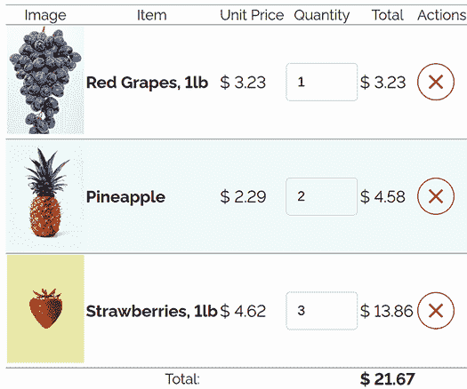

图 8.16 样式化表格边框

接下来，让我们继续到项目摘要部分内的描述列表。

### 8.2.5 描述列表

接下来，我们还需要为主题化摘要部分中的描述列表（`<dl>`）进行样式化。描述列表通常用于创建术语表或显示元数据，对于包含项目和它们值的摘要来说非常合适。我们将以与我们的表格标题相同的方式样式化描述术语（`<dt>`）。我们希望从描述本身（`<dd>`）中淡化它们，其中包含每个元素的美元价值。因为我们想以与表格标题相同的方式样式化它们，所以我们将添加`dt`作为选择器到现有的规则中，类似于我们在 8.2.3 节中添加输入到按钮规则中所做的。

之后，我们将使用`:after`伪元素和`content`属性在每个`<dt>`后添加两个冒号。CSS 和输出在列表 8.13 和图 8.17 中显示。

列表 8.13 设置描述列表的样式

```
th, dt {             ①
  color: #3a3a3a;
  font-weight: normal;
  font-size: .875em;
}

dt::after {          ②
  content: ": ";     ②
}                    ②
```

① 为我们现有的标题样式添加描述术语

② 在每个描述术语后添加冒号

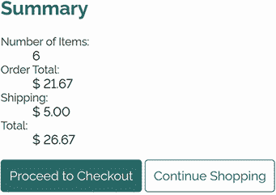

图 8.17 描述列表主题

### 8.2.6 卡片

为了给布局增加深度并在部分之间实现分离，我们将把我们的部分容器样式化为卡片。*卡片*是一种常用的设计模式，通过将内容封装在类似扑克的盒子或容器中来分离内容。这个概念与我们在第六章中创建个人资料卡片时使用的概念相同。

为了实现我们的卡片设计，我们将在`<body>`上添加浅青色背景，并用类似悬停于`<body>`之上的阴影来勾勒部分。为了创建阴影，我们将使用`box-shadow`属性，它允许我们控制 x 轴和 y 轴上添加的阴影量，以及模糊（模糊度）、它应该扩散的距离以及阴影的颜色。图 8.18 详细说明了属性值的应用。

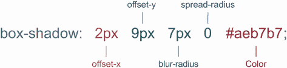

图 8.18 `box-shadow`属性值

可选地，我们还可以设置一个`inset`的值来指示阴影应该在元素内部而不是外部。为了完成我们卡片的外观，我们将使用`border-radius`值为`4px`来使角落弯曲——这个值与我们用于链接、按钮和输入的值相同。下面的列表显示了我们的部分规则。

列表 8.14 设置部分的样式

```
body {
  font-family: 'Raleway', sans-serif;
  color: #171717;
  font-variant-numeric: lining-nums;
  background: #fbffff;                ①
}

section {                             ②
  background: #ffffff;                ②
  border-radius: 4px;                 ②
  box-shadow: 2px 2px 7px #aeb7b7;    ②
}                                     ②
```

① 为页面添加背景颜色

② 使我们的部分看起来像卡片

图 8.19 显示了我们的样式化部分。然而，请注意，在摘要卡片底部，链接延伸到卡片之外。这种效果发生是因为链接默认的`display`值为`inline`。

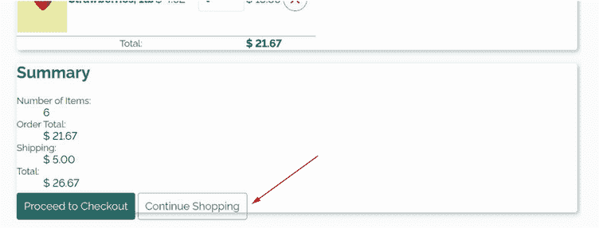

图 8.19 主题部分溢出的链接

当向内联元素（在这种情况下是链接）添加垂直内边距时，元素的高度在页面流中不会增加。因此，它只占据其内容（文本）的空间，这就是为什么它不会增加卡片的高度。为了解决这个问题，我们将它们的 `display` 值从 `inline` 更改为 `inline-block`。以下列表显示了更新的规则。

列表 8.15 部分样式

```
button, .button, input {
  background: none;
  border-radius: 4px;
  padding: 10px;
  border: solid 1px #ddd;
  text-decoration: none;
  display: inline-block;
}
```

在修复到位后，我们的布局看起来像图 8.20。

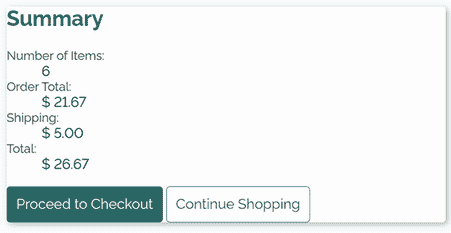

图 8.20 样式卡

在处理完主题后，我们可以开始关注布局。

## 8.3 移动布局

我们将从移动布局开始。我们首先要做的是使我们的表格响应式。

### 8.3.1 表格移动视图

传统的表格布局在移动设备上效果不佳，因为表格需要大量的宽度，而手机屏幕无法提供。为了适应手机，我们将使表格的行和单元格在窄屏幕上表现得更像卡片。

使用媒体查询

我们将首先使用媒体查询，当视口宽度小于或等于 `549px` 时应用一组规则到表格上。查询将是 `@media(max-width: 549px) { }`。注意这里我们使用了 `max-width`。在之前的章节中，我们使用了 `min-width`，因为我们只想在屏幕达到一定大小时应用样式。在这种情况下，我们做的是相反的：我们希望样式在屏幕达到一定宽度之前应用。

在这个媒体查询内部，我们将定义表格在窄屏幕上应该看起来是什么样子。图 8.21 显示了我们的表格当前的样子以及我们想要达到的效果。

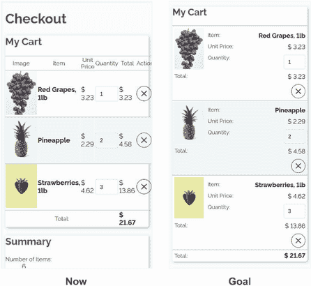

图 8.21 移动设备上的前后表格对比

要查看窄屏幕或移动版本，大多数浏览器的开发者工具允许我们模拟特定设备的屏幕。在 Google Chrome 中，要选择特定设备，我们通过点击 DevTools 栏顶部的带有手机的图标来切换设备工具栏，然后选择我们想要使用的设备，如图 8.22 所示。然而，值得注意的是，这种模拟是有限的，不应取代在物理设备上的测试。

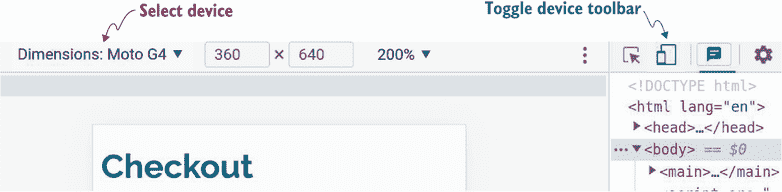

图 8.22 Chrome DevTools 中的设备模拟

改变表格的显示结构

首先，我们将所有内容垂直堆叠，而不是将每行的元素水平表示。我们通过给我们的行和单元格设置 `display` 值为 `block` 来完成这个任务。默认情况下，表格单元格的 `display` 值为 `table-cell`，而行有 `display` 值为 `table-row`。

接下来，我们将图片浮动到左侧（第七章），这样行的其余内容就可以围绕它包裹。我们还为图片周围添加了一些边距，以在图片和行的其余内容之间创建一些空白。以下列表显示了我们的媒体查询和更新的单元格样式。

列表 8.16 移动单元格和行布局

```
@media(max-width: 549px) {
  td, tr { display: block; }
  table td > img {             ①
    float: left;
    margin-right: 10px;
  }
}
```

① 专门针对单元格的直接子图像，以避免在按钮（红色 X）中浮动图像

我们正越来越接近我们的目标，但我们的表头信息并不在我们需要的位置。如图 8.23 所示，表头信息位于表格顶部，而不是在表格体行中的每条信息之前。

从数据属性显示内容

要将表头信息放置在每个内容之前，我们不会使用表头。相反，我们将在 HTML 中的单元格添加一些数据属性：`<td` `data-name="Item">Red` `Grapes,` `1lb</td>`。这些数据将驱动对每一行的标签，而不是表头中的内容。

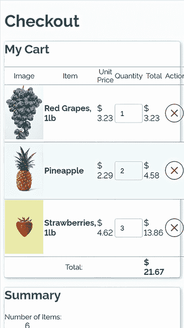

图 8.23 表头位于移动表格的顶部。

我们通过使用绝对定位将表头移出屏幕，如图 8.17 列表所示。我们不想使用`display:none`，因为表头中的信息仍然需要辅助技术。通过绝对定位将其移出屏幕（使用大负值），我们视觉上隐藏了它，但不是程序上。

列表 8.17 隐藏表头

```
@media(max-width: 549px) {
  ...
  thead {
    position: absolute;
    left: -9999rem;
  }
}
```

当我们的表头移除后（如图 8.24 所示），我们可以专注于从`data-name`属性中提取数据并将其显示给用户。我们注意到在移除表头后，内容有所偏移，因为我们的表格目前没有占据整个屏幕宽度。我们将在本节稍后解决这个问题。现在，让我们完成对表头信息的处理。

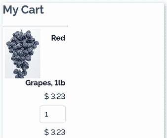

图 8.24 从视图中移除表头

要显示属性值，我们使用`attr()`函数，它接受一个属性名并返回一个值。在我们的用例中，我们的`content`属性将是`td[data-name]: before` `{` `content:` `attr(data-name)` `":";` `}`。图 8.25 详细说明了这一点。

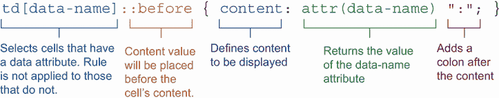

图 8.25 在单元格前添加表头信息

为了对齐我们的标签和内容，我们使用`text-align`和`float`的组合。我们在单元格中使用`text-align: right`来右对齐单元格内容——项目名称、单价、输入字段、总计和按钮——然后将标签（从`data-name`属性获取的内容）浮动到左侧以在两个元素之间创建一个间隔，如图 8.26 所示。我们还为单元格添加了一些填充，以增加内容行之间的空白。列表 8.18 显示了用于对齐表格单元格内容的 CSS。

列表 8.18 显示`data-name`属性的值

```
@media(max-width: 549px) {
  ...
  td {
    text-align: right;
    padding: 5px;
  }
  td[data-name]::before {
    content: attr(data-name) ":";
    float: left;
  }
}
```

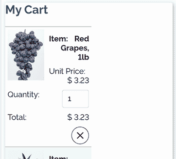

图 8.26 对齐标签和内容

现在数据在`data-name`属性中已被显示，让我们将其样式调整为与定义标题相匹配。我们不必复制样式，可以将选择器附加到现有规则中，如下列所示。

列表 8.19 完成细节

```
@media(max-width: 549px) {
  ...
  th, dt, td[data-name]::before {
    color: #3a3a3a;
    font-weight: normal;
    font-size: .875em;
  }
}
```

全宽

标签样式完成后，让我们将注意力转回到我们的表格并没有占据其可用的全部宽度这个问题上。我们可以通过使用规则 `table` `{` `width:` `100%;` `}` 来将其宽度设置为 `100%` 来解决这个问题。因为我们希望表格无论屏幕大小如何都能占据其全部宽度，所以我们将在媒体查询之外添加此规则。

我们几乎完成了表格的移动样式（图 8.27）。剩下要做的就是处理表格页脚。

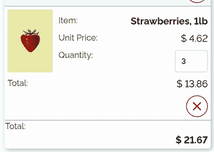

图 8.27 宽度全表的表格

表格页脚

在表格页脚（`<tfoot>`）中，我们希望将文本对齐到单行。为此任务，我们将使用 Flexbox，并设置 `justify-content` 属性值为 `space-between` 和 `align-items` 属性值为 `baseline`，以在行的两端对齐标签和总计。（要了解 CSS Flexbox 布局模块的工作原理，请参阅第六章。）

查看我们的表格页脚 HTML（列表 8.20），我们注意到我们的第一个单元格是一个表格标题（`<th>`），而不是表格数据单元格（`<td>`），这是有道理的，因为它描述了该行的内容。

列表 8.20 表格页脚 HTML

```
@media(max-width: 549px) {
  <tfoot>
    <tr>
      <th colspan="4" scope="row">Total:</th>
      <td id="total">
        <!-- value calculated & inserted by JS -->
      </td>
    </tr>
  </tfoot>
}
```

如果我们仔细观察图 8.27，我们会注意到页脚内容没有任何填充；它直接紧挨着卡片和行边框。之前，我们为所有表格数据单元格添加了填充，而不是标题，所以现在我们将为页脚添加填充。以下列表显示了我们对创建我们的移动表格布局所编辑和创建的样式回顾，以及我们对表格页脚的更改。

列表 8.21 移动表格 CSS

```
th, td, td[data-name]::before {
  color: #3a3a3a;
  font-weight: normal;
  font-size: .875em;
}
@media(max-width: 549px) {
  td, tr { display: block }
  table td > img {
    float: left;
    margin-right: 10px;
  }
  thead {
    position: absolute;
    left: -9999rem;
  }
  td {
    text-align: right;
    padding: 5px;
    vertical-align: baseline;
  }
  td[data-name]::before {
    content: attr(data-name) ":";
    float: left;
  }

  tfoot tr {
    display: flex;
    justify-content: space-between;
    align-items: baseline;
  }
  tfoot th { padding: 5px }
}
  table { width: 100% }
```

图 8.28 显示了完成的表格。

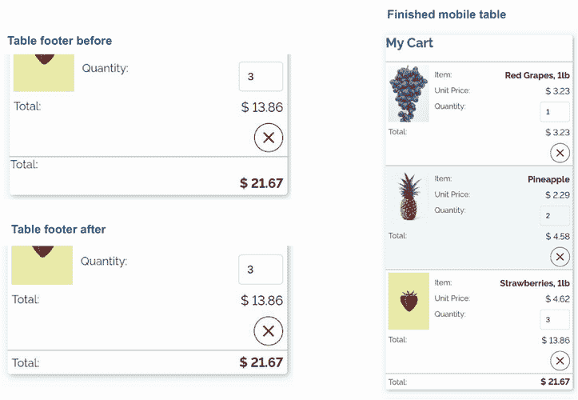

图 8.28 窄屏幕上显示为卡片的表格

现在表格在移动设备上看起来很好，我们将把注意力转向描述列表和整体布局。与创建特定于小屏幕样式的规则不同，下一组规则将适用于任何屏幕宽度，因此它们不会在媒体查询内。我们将首先解决描述列表（`<dl>`）。

### 8.3.2 描述列表

与表格不同，表格在移动和桌面屏幕上看起来完全不同，描述列表将不受屏幕宽度的影响而保持相同的外观。在更宽的屏幕上，其位置会改变，但列表本身不会变。因为描述列表不受屏幕大小的影响，所以我们将布局样式放在媒体查询之外。

为了显示项目描述列表，我们将使用 `grid`（第二章）。我们将定义两列，并让项目在两列中自动定位。如果没有给出特定的放置指令，网格容器的子元素将放置在第一个可用的空间中，这正是我们要利用的行为。我们还将定义一个间隙，并在容器中添加一些填充，以在网格和卡片中分隔元素。最后，我们将左对齐数字。列表 8.22 展示了 CSS，图 8.29 展示了项目描述列表的前后布局。

列表 8.22 项目描述列表样式

```
dl {
  display: grid;
  gap: .5rem;
  grid-template-columns: auto max-content;     ①
  padding: 0 1rem;
}
dd { text-align: right; }
```

① 我们为第二列使用 max-content，因为我们不希望数字换行，这会使它们难以阅读。

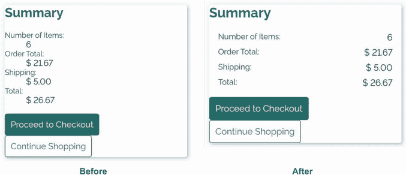

图 8.29 项目描述列表前后布局对比

### 8.3.3 动作链接

我们的项目描述列表看起来好多了，但动作链接仍然需要一些帮助。正如我们在 8.3.2 节中为项目描述列表所做的，我们希望无论屏幕大小如何，动作链接的布局都相同，因此样式将放在我们的媒体查询之外。

首先，我们将为链接的容器添加一些填充，并使用 `text-align` 属性来居中它们。当没有足够的空间让链接并排显示并且它们堆叠时，我们将为它们添加一些边距以防止它们紧挨在一起。列表 8.23 展示了代码。图 8.30 展示了输出前后的版本。

列表 8.23 动作链接

```
.actions {
  padding: 1rem;
  text-align: center;
}
.actions a {
  margin: 0 .25rem .5rem;
}
```

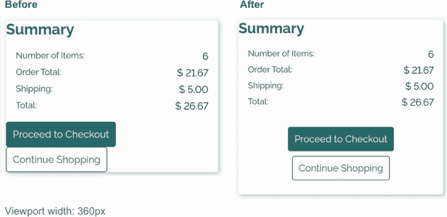

图 8.30 动作链接前后布局对比

### 8.3.4 填充、边距和边距合并

我们部分内的所有内容（除了标题）都是为移动设备布局的。浏览器默认给标题添加边距，但这个设置并没有达到我们想要的效果；它不是在卡片边缘和标题之间创建垂直空间，而是将卡片向下推。边距会推动内容，但不会影响元素或其内容占据的空间量，这就是为什么顶部的边距（标题）会从卡片中溢出。

如果我们移除标题的边距并为其添加填充，卡片将扩展，但两张卡片之间的间隙将消失。因此，我们需要给 `section` 本身添加一些边距以在两张卡片之间添加空间。如果我们给部分添加一个值为 `1rem` 的 `margin`（1-rem 顶部和底部，但不是左右），我们仍然会在两张卡片之间保持 1-rem 的间隙——这是边距合并的直接结果。除非通过浮动或弹性改变了元素的定位，否则相邻的两个边距将合并为两个边距中较大的那个。图 8.31 图解了这一效果。

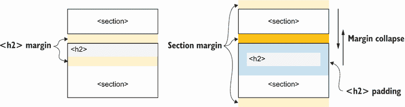

图 8.31 边距和边距合并的效果

要在卡片边缘和标题之间添加空间，我们将用填充替换卡片标题的边距。然后，我们将向卡片添加部分边距以恢复丢失的垂直空间。最后，我们将向主体添加填充，以便卡片不会紧贴屏幕的左右边缘。以下列表显示了如何操作。

列表 8.24 部分边距和标题填充

```
body {
  font-family: 'Raleway', sans-serif;
  color: #171717;
  font-variant-numeric: lining-nums;
  background: #fbffff;
  padding: 1rem;
}

section { margin: 1rem 0 }

section h2 {
  padding: 1rem;
  margin: 0;
}
```

移动布局完成（图 8.32）后，让我们增加平板电脑和笔记本电脑的屏幕宽度。

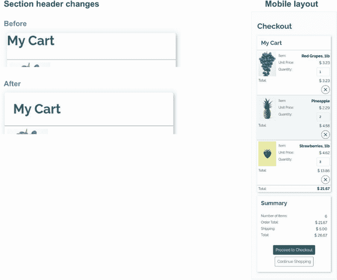

图 8.32 卡片标题前后对比

## 8.4 中等屏幕布局

我们为移动设备所做的几乎所有事情在中等尺寸的屏幕上看起来都会很好。因为我们使用媒体查询将表格布局更改限制在宽度小于或等于 549 像素的屏幕上，所以我们编写的用于编辑表格的样式不会应用于任何宽度为 550 像素或更宽的屏幕。图 8.33 显示了视口宽度为 549 像素和 550 像素时的表格。在 550 像素的宽度时，我们回到了标准的表格布局。

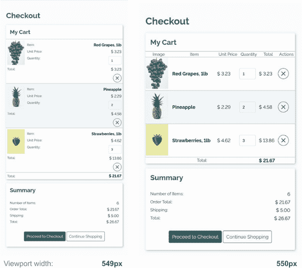

图 8.33 表格断点

### 8.4.1 右对齐数字

接下来，我们将更新表格中值的对齐方式。由于这使直观计算更容易，通常将数字右对齐，特别是如果它们在列中总计。我们将更新单价、数量和总计的标题和单元格，使它们右对齐。

要选择标题和单元格，我们可以使用 `:nth-of-type(n)` 选择器。要选择单价列（第三列）的标题和单元格，我们将使用 `th:nth-of-type(3),` `td:nth-of-type(3)` `{` `...` `}` 并对其他所有列（数量、总计和操作）重复相同的过程。

我们也可以稍微改变一下思考过程。我们想要在第一列之后的所有列中右对齐。在 `:nth-of-type()` 中，我们不仅可以传递数字，还可以传递模式。在 8.2.4 节中，我们使用这个技巧通过传递参数 `even` 来设置我们行的背景颜色。在这种情况下，我们将传递一个自定义模式，使用参数 `n+3`。这个模式表示我们想要从 `n` 是迭代器且 `3` 是起始点开始选择所有匹配的元素。图 8.34 说明了这个模式。

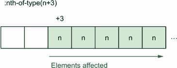

图 8.34 `nth-of-type(n+3)` 解释

使用这种技术，我们可以选择每行的第三、第四、第五和第六个单元格，并将它们的内文右对齐，如列表 8.25 所示。请注意，我们将我们的规则放在一个具有 `min-width` 为 `550px` 的媒体查询中。我们不希望将这些更改应用于较小的屏幕（根据我们之前的媒体查询定义为任何小于或等于 549 像素的屏幕），因此我们使用第二个媒体查询仅将这些样式应用于宽度为 550 像素或更宽的屏幕。

列表 8.25 右对齐内容

```
@media (min-width: 550px) {
  th:nth-of-type(n+3),
  td:nth-of-type(n+3) {
    text-align: right;
  }
}
```

在我们的样式应用后（图 8.35），我们注意到一些事情：

+   我们的前两列需要它们的标题左对齐以匹配其内容。

+   字段内的数字没有自动右对齐。

+   删除按钮紧挨着卡片边缘。

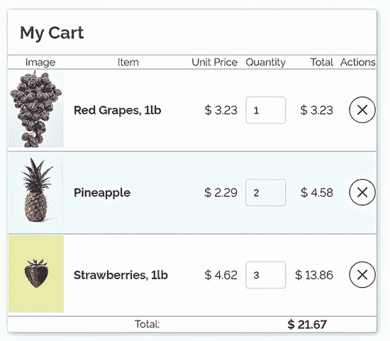

图 8.35 右对齐的数字和操作列

让我们按顺序解决这些问题。

### 8.4.2 左对齐前两列

我们将利用具体性来处理标题。因为，作为一个选择器，`th` 比 `th:nth-of-type(n+3)` 更不具体，我们可以创建一个将文本左对齐并保留其他列的先前规则的 `th` 规则。`th` 规则将使所有列的标题内容左对齐。然后，我们将覆盖 `th:nth-of-type(n+3)` 规则中数字和按钮列的 `text-align` 属性值。下面的列表显示了所做的更改。

列表 8.26 更新表头规则

```
@media (min-width: 550px) {

  th { text-align: left }

  th:nth-of-type(n+3),
  td:nth-of-type(n+3) {
    text-align: right;
  }
}
```

现在我们的前两个表头左对齐而不是居中（浏览器的默认设置），我们的其他列保持右对齐（图 8.36）。

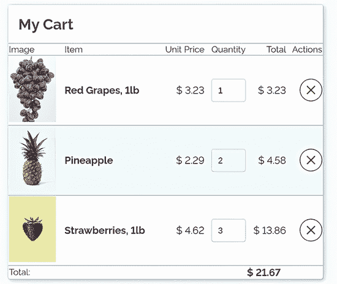

图 8.36 样式化标题

### 8.4.3 在输入字段中右对齐数字

我们可以选择仅在表格视图中或无论屏幕大小如何都始终右对齐输入字段内的文本，我们这样做是在媒体查询之外。因为我们也在移动视图中将数字和总计右对齐，所以更新输入字段样式以适用于所有显示尺寸并包含在主题中似乎是合理的。

要选择数字类型的输入，我们可以使用属性选择器：`input[type= "number"]` `{` `...` `}`。我们将把 `input[type="number"]` `{` `text-align:` `right` `}` 添加到样式表中 *外部* 媒体查询，因为我们希望无论屏幕大小如何都应用它。

在输入字段内的文本对齐（图 8.37）后，我们需要解决的最后一部分是我们所有表格数据单元格和表头的填充。

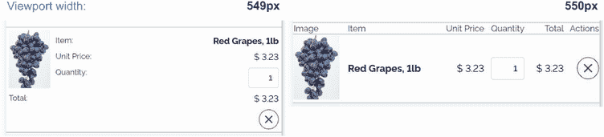

图 8.37 输入字段中的右对齐文本

### 8.4.4 单元格填充和边距

为了完成我们的表格（中等屏幕）视图，我们将在表头、主体和页脚的单元格中添加填充和边距。为了实现这种效果，我们在中等屏幕尺寸的媒体查询中添加了 `td,` `th` `{` `padding:` `10px` `}`。下面的列表显示了我们所做的全部更改，以实现表格布局。

列表 8.27 中等尺寸屏幕

```
input[type="number"] { text-align: right }

@media (min-width: 550px) {

  th { text-align: left }

  th:nth-of-type(n+3),
  td:nth-of-type(n+3) {
    text-align: right;
  }

  td, th { padding: 10px }
}
```

现在我们已经为小屏幕和中屏幕尺寸进行了样式化（图 8.38），让我们更进一步，处理宽屏幕。

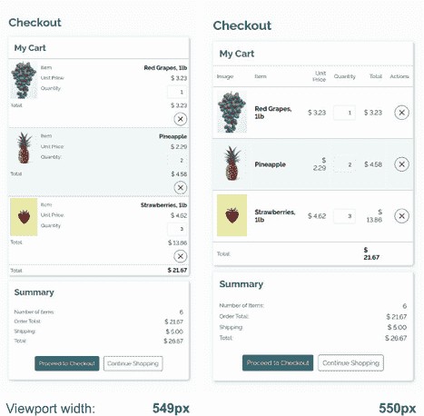

图 8.38 完成的移动和平板布局

## 8.5 宽屏幕

随着我们继续增加屏幕宽度，摘要部分由于定义标题和描述之间的距离增加而变得难以阅读（图 8.39）。

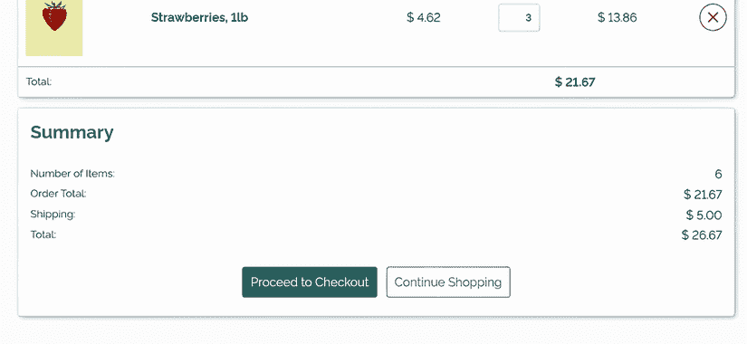

图 8.39 桌面视图的摘要（视口宽度 955 像素）

由于屏幕变宽时我们有更多的水平空间可以利用，因此当视口宽度达到 995 像素或更宽时，我们将摘要部分移至购物车部分旁边，如图 8.40 中的线框所示。

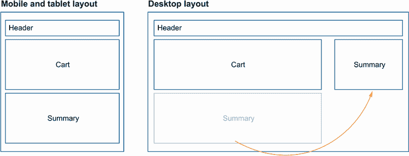

图 8.40 布局线框

为了根据屏幕宽度为 955 像素或更宽的条件有条件地更改布局，我们将创建媒体查询 `@media` `(min-width: ` `995px`) `{}`。在以下列表中显示的 HTML 中，我们有两个部分周围有一个具有 `section-container` 类的 `<div>` 容器。

列表 8.28 页面 HTML

```
 <main>
    <h1>Checkout</h1>

    <div class="section-container">         ①

      <section class="my-cart">             ②
        <h2>My Cart</h2>                    ②
        <table> ... </table>                ②
      </section>                            ②

      <section class="summary">             ③
        <h2>Summary</h2>                    ③
        <dl> ... </dl>                      ③
        <div class="actions"> ... </div>    ③
      </section>                            ③

    </div>                                  ④

  </main>
```

① 两个卡片（购物车和摘要）的容器

② 购物车卡片

③ 摘要卡片

④ 容器结束

在我们新的媒体查询中，我们将容器设置为 `display` 属性值为 `flex`。这个值允许两个项目并排排列并在 x 轴上对齐。然后我们在两个部分之间添加一个 `20px` 的间隙。

Flexbox 将自动计算为每个部分分配的空间量。我们可以通过 `flex-grow`、`flex-shrink` 和 `flex-basis` 属性来影响浏览器分配尺寸的方式。我们将给摘要部分一个 `flex-basis` 值为 `250px`，给购物车部分一个 `flex-grow` 值为 `1`。

应用到摘要卡片上，`flex-basis` 将设置浏览器开始计算为每个部分分配多少空间时该部分的初始大小。如果应用 `flex` 的内容可以容纳 250 像宽的部分，浏览器不会更改该部分的尺寸；否则，浏览器将根据需要调整该部分。`flex-grow` 属性告诉浏览器，如果在 `flex` 应用到内容后还有剩余空间，则应使该元素变宽以使用额外的空间。图 8.41 显示了这两个属性如何影响元素的大小。


图 8.41 影响 `flex` 应用的元素大小

通过使用 `flex-grow` 和 `flex-basis`，我们可以控制表格相对于摘要卡片的宽度。因此，我们在以下列表中使用媒体查询来处理我们的项目。

列表 8.29 在宽屏幕上并排放置两个卡片

```
@media (min-width: 955px) {
  .section-container {
    display: flex;
    gap: 20px;
  }
  section.my-cart { flex-grow: 1; }
  section.summary { flex-basis: 250px }
}
```

图 8.41 显示了屏幕宽度为 955 像素时的布局。但是，如果我们使屏幕更宽，例如用于额外的宽曲显示屏，我们最终会到达一个点，内容再次变得难以阅读（图 8.42）。因为我们为摘要卡片设置了 `flex-basis` 值，所以它仍然可读，但由于表格是通过 `flex-grow` 属性来保持增长的，所以它变得难以操作。

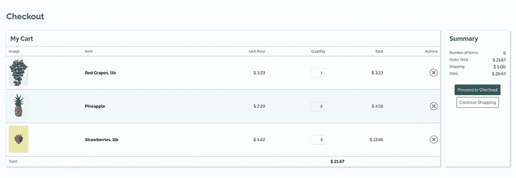

图 8.42 2,000 像素宽屏幕上的布局

为了防止这种增长，我们可以限制 `<main>` 元素的宽度（它包含我们的主要标题和卡片）。这种更改确保无论用户的显示有多宽，或者用户如何选择扩展窗口，内容都保持可用。我们可以通过给左右边距赋值为 `auto` 来居中文本，如下所示。

列表 8.30 `main` 元素的最大宽度

```
main {
  max-width: 1280px;
  margin: 0 auto;
}
```

如果我们再次查看我们的布局，在应用了这些最后样式的一个极其宽的屏幕上（如图 8.43），我们会看到我们已经限制了内容并使其居中。


图 8.43 限制宽度的布局

经过这些最后的编辑，我们的项目就完成了。从一个 HTML 文件中，我们根据屏幕宽度创建了三个不同的布局（如图 8.44）。

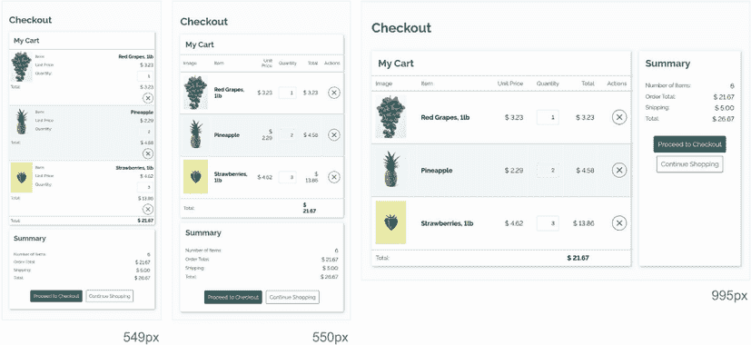

图 8.44 三个屏幕尺寸的最终输出

## 摘要

+   数字样式可以通过 `font-variant-numeric` 属性来控制。

+   媒体查询允许我们根据屏幕大小有条件地应用样式。

+   根据它们所修饰的内容或代表的内容来命名 CSS 类有助于创建易于理解和维护的名称。

+   可以使用 HTML 属性值来选择元素。

+   可以通过 CSS 使用伪元素、`content` 属性和 `attr()` 函数来显示 HTML 属性值。

+   边距可以合并。

+   设置为 `display:flex` 的元素可以通过 `flex-grow`、`flex-shrink` 和 `flex-basis` 来控制。

+   `:nth-of-type` 可以接受数字、关键词或自定义模式来根据元素相对于容器内相同类型元素的位置来定位元素。
