# 9 创建虚拟信用卡

本章涵盖

+   使用 Flexbox 和`position`进行布局

+   使用背景图像和尺寸

+   加载和应用本地字体

+   使用过渡和`backface-visibility`属性创建 3D 效果

+   使用`text-shadow`和`border-radius`属性等额外样式

正如我们在第三章中看到的，CSS 中的动画为创建交互式网络体验提供了许多机会。在第三章中，我们使用动画给用户一种感觉，在他们等待任务完成时，背景中似乎有事情发生。现在我们将使用动画来响应用户的交互并为信用卡图像创建翻转效果。在一侧，动画将显示信用卡的正面；在悬停或点击移动设备时，它将翻转以显示信用卡的背面。

这种效果对用户很有用，因为我们正在重新创建他们的信用卡可能的样子，显示他们在网上购买东西时需要从卡片中输入哪些信息，例如有效期或安全码。动画是通过在网络上重新创建它来表示现实生活中的某种东西的一种方式。这个项目与第八章中的项目相辅相成，在第八章中我们设计了一个结账购物车。

我们还将探索样式图像以设置信用卡的背景和卡片上的图标。我们将使用 CSS Flexbox 布局模块进行布局，以及如阴影、颜色和边框半径等样式属性。到本章结束时，我们的布局将看起来像图 9.1。

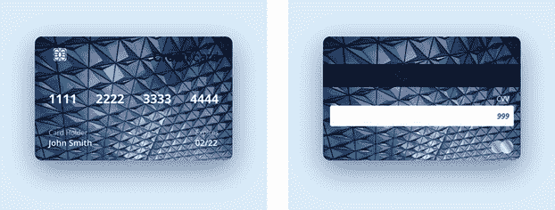

图 9.1 信用卡正面和背面的最终输出

在我们进行项目的过程中，请随意尝试自定义它以匹配您的风格。例如，尝试不同的背景图片或字体。这个项目是一个很好的机会来调整样式以适应您的风格。让我们开始吧。

## 9.1 开始

我们的 HTML 由两个主要部分组成。在表示虚拟卡的总体部分中，有一个正面和一个背面。您可以在 GitHub 仓库的`chapter-09`文件夹中找到起始 HTML（[`mng.bz/Bm5g`](http://mng.bz/Bm5g)），在 CodePen（[`codepen.io/michaelgearon/pen/YzZKMKN`](https://codepen.io/michaelgearon/pen/YzZKMKN)）以及以下列表中找到。

列表 9.1 项目 HTML

```
<section class="card-item">                                                ①
  <section class="card-item__side front">                                  ②
    <div class="card-item__wrapper">
      <div class="card-item__top">                                         ③
               ③
        <div class="card-item__type">                                      ③
                                                          ③
        </div>                                                             ③
      </div>
      <div class="card-item__number">                                      ④
        <div>1111</div>
        <div>2222</div>
        <div>3333</div>
       <div>4444</div>
      </div>
      <div class="card-item__content">                                     ⑤
        <div class="card-item__info">
          <div class="card-item__holder">Card Holder</div>
          <div class="card-item__name">John Smith</div>
        </div>
        <div class="card-item__date">
          <div class="card-item__dateTitle">Expires</div>
          <div class="card-item__dateItem">02/22</div>
        </div>
      </div>
    </div>
  </section>
  <section class="card-item__side back">
    <div class="card-item__band"></div>
    <div class="card-item__cvv">
      <div class="card-item__cvvTitle">CVV</div>
      <div class="card-item__cvvBand">999</div>
      <div class="card-item__type">
        
      </div>       
    </div>        
  </section>
</section>
```

① 整个信用卡的容器

② 卡片正面的容器

③ 显示卡片顶部正面部分的区域

④ 显示卡片号码的卡片中间正面部分

⑤ 显示有效期和持卡人姓名的卡片底部正面部分

我们还有一些初始的 CSS 来将背景颜色改为浅蓝色并增加页面顶部的边距，如下所示。

列表 9.2 起始 CSS

```
* {
  box-sizing: border-box;
}
body {
  background: rgb(221 238 252);
  margin-top: 80px;
}
```

我们正在使用我们在第一章中查看的通用选择器来设置所有 HTML 元素的`box-sizing`值为`border-box`。此选择器有两个值：

+   `content-box`——这是计算元素宽度和高度的默认值。如果`content-box`的高度和宽度是`250px`，任何边框或填充都将添加到最终渲染的宽度中。例如，如果周围有`2px`的边框，最终渲染的宽度将是`254px`。

+   `border-box`——这个值与`border-box`的区别在于，如果我们将元素高度设置为`250px`，任何边框和填充都将包含在这个指定的值中。`content-box`会随着填充和边框的增加而减少。

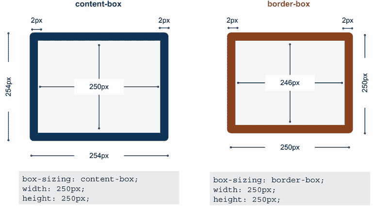

图 9.2 `box-sizing`对元素尺寸的影响

图 9.2 展示了示例。我们的起点看起来像图 9.3。

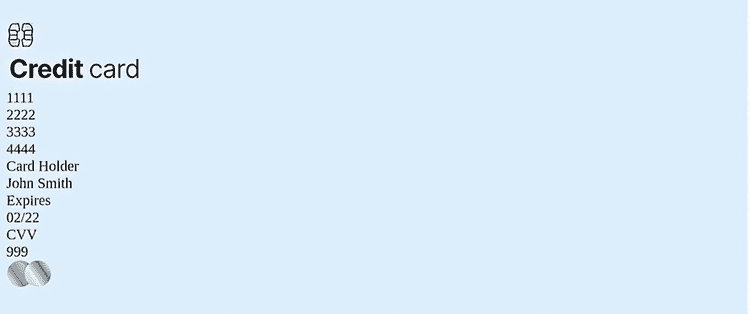

图 9.3 起点

## 9.2 创建布局

前面和背面都有一个类名为`card-item__side`。前面还有一个类名为`front`的二次分配，背面有一个名为`back`的二次类。有两个类名——一个在两边都相同，另一个不同——这允许我们使用`.card-item__side`选择器（它们共有的类）分配适用于两边的样式，并在`.front` `{}`或`.back` `{}`的单独规则中分配仅适用于一侧的样式。

让我们从将卡片在屏幕上居中开始。第一步是设置卡片的最大宽度为`430px`和固定高度为`270px`。我们还将其位置设置为`relative`，这在我们在本章后面（9.5 节）将卡片背面放在前面以创建翻转效果时将很有用。

最后一步是设置卡片的左右边距为`auto`以在浏览器窗口中水平居中卡片。为此，我们使用`.card-item`选择器创建以下列表中所示的规则。

列表 9.3 容器样式

```
.card-item {
  max-width: 430px;
  height: 270px;
  margin: auto;
  position: relative;
}
```

图 9.4 显示了更新的定位。

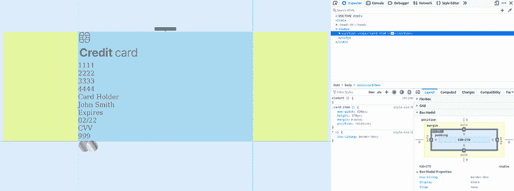

图 9.4 居中的信用卡

### 9.2.1 设置卡片大小

现在我们已经为卡片设置了最大宽度和高度，我们想要确保前面和背面填充它们在父容器（卡片）内可用的整个空间。因此，我们将使用类选择器`.card-item__side`将卡片两面的高度和宽度都设置为`100%`，如下列所示。

列表 9.4 前面和背面共享的容器

```
.card-item__side {
  height: 100%;
  width: 100%;
}
```

添加了这段代码后，我们的卡片面（前面和背面）扩展以匹配其父容器的尺寸，如图 9.5 所示。

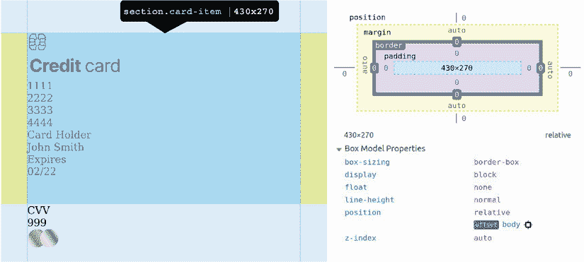

图 9.5 卡片面（前面和背面）与父容器尺寸匹配。

### 9.2.2 样式化卡片的前面

对于卡片的前面，我们分为三个主要部分（图 9.6）：

+   卡片的顶部有两张图片，一张显示芯片，另一张显示信用卡类型（如 Visa 或 MasterCard）。

+   中间是卡号，它均匀分布在卡片的宽度上。

+   在底部是持卡人的姓名和卡片的过期日期。这些元素位于相反的端点。

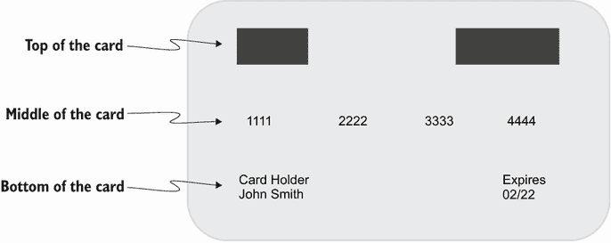

图 9.6 卡片前面的线框图

在我们开始为卡片前面的各个部分添加样式之前，让我们给卡片面添加一些填充，这样内容就不会紧贴边缘。我们将给它们留出一些空间。下面的列表显示了代码。

列表 9.5 卡片前面的容器样式

```
.front {
  padding: 25px 15px;
}
```

记住，在项目最初提供的样式表中，我们将所有元素的`box-sizing`设置为`border-box`。随着填充的增加，我们看到改变`box-sizing`并没有增加卡片面`<section>`的尺寸；相反，它减少了内容可用的空间（图 9.7）。

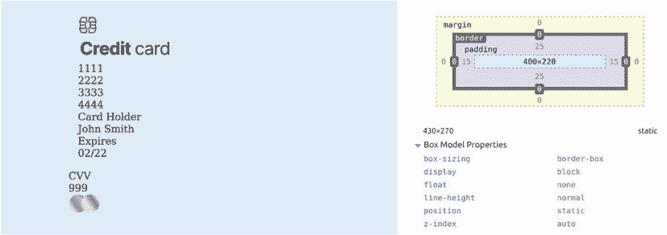

图 9.7 带有添加填充和盒模型图的卡片

卡片的顶部

我们正在使用 Flexbox 来布局卡片。正如我们所学的，Flexbox 很可能是放置单轴布局中项目的最佳选择。此外，我们需要利用 Flexbox 提供的额外功能，即间距和对齐功能——这是 float 所不具备的。

注意：有关 CSS Flexbox 布局模块及其相关属性详情，请参阅第六章。第七章涵盖了 float。

考虑到这些事实，我们将卡片的顶部设置为具有`display`属性值为`flex`，并设置对齐方式，使元素的顶部对齐。`align-items`的默认属性是`stretch`，它增加了`flex`项目的高度，使它们的高度与集合中最高的元素相匹配。

尽管我们不希望这种扭曲，但我们希望元素垂直对齐到项目的顶部。因此，我们将`align-items`属性设置为`flex-start`。然后我们将`justify-content`属性设置为`space-between`，这样就可以在轴上均匀分布元素，在两个元素之间创建一个间隙，并将它们放置在卡片的极端边缘。

我们将给顶部添加一些边距和填充，以便将它们相对于卡片边缘进一步定位。然后我们将芯片的宽度增加到`60px`。因为这张图片是 SVG 格式的，我们可以增加其大小而不影响其质量。因为我们只操作了宽度，并没有改变默认的高度，所以图片的高度将默认按比例缩放。下面的列表显示了用于样式化卡片顶部部分的规则。

列表 9.6 卡片顶部前面的布局

```
.card-item__top {
  display: flex;
  align-items: flex-start;
  justify-content: space-between;
  margin-bottom: 40px;
  padding: 0 10px;
}
.card-item__chip {
  width: 60px;
}
```

我们更新的卡片看起来像图 9.8。

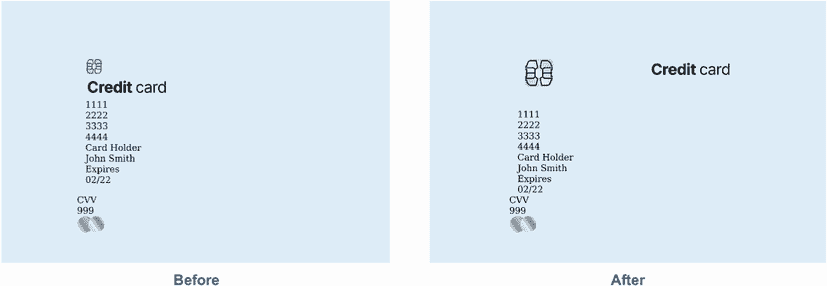

图 9.8 卡片样式化顶部部分

卡片的中间部分

在卡片正面中部，我们找到了卡片号码。同样，我们使用`display`属性值为`flex`，`justify-content:` `space-between`将数字组均匀分布在卡片的宽度上。我们还添加了填充和边距，以在数字及其周围元素之间添加空间，如以下列表所示。

列表 9.7 卡片正面中部的布局

```
.card-item__number {
  display: flex;
  justify-content: space-between;
  padding: 10px 15px;
  margin-bottom: 35px;
}
```

图 9.9 显示了我们的数字组均匀分布在卡片宽度上。

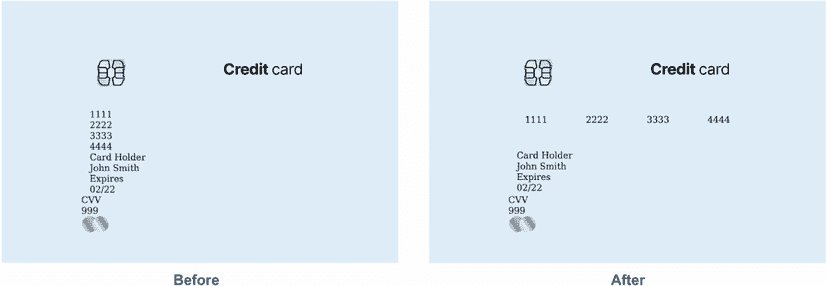

图 9.9 均匀分布的数字

卡片底部

在卡片正面底部，我们有两个元素：持卡人姓名和卡片到期日期。就像我们在卡片顶部和中部所做的那样，我们想要将信息片段分开，并将它们放置在卡片的相对边缘。

我们将遵循使用 Flexbox、`justify-content`和`padding`来放置元素的相同模式。这次我们不需要任何边距。以下列表显示了我们将使用的规则。

列表 9.8 卡片正面底部的布局

```
.card-item__content {
  display: flex;
  justify-content: space-between;
  padding: 0 15px;
}
```

图 9.10 显示了更新后的布局。接下来，我们将定位卡片背面的元素。

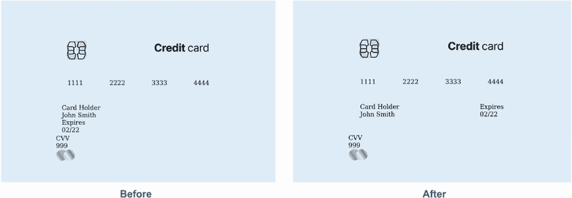

图 9.10 卡片正面的布局

### 9.2.3 卡片背面的布局

背部的布局包括安全码数字和半透明带（磁条），如图 9.11 所示。让我们从半透明的背面条开始。

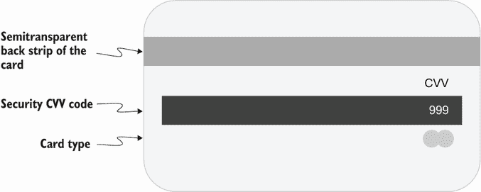

图 9.11 卡片背面的线框图

半透明条

该条具有`card-item__band`类。我们希望将其高度设置为`50px`，并将其定位在卡片顶部`30px`处。我们将使用`height`属性来指示它应该有多高。即使`<div>`是空的，它也会自动占据它可用的全部宽度，因为`<div>`是块级元素。

为了将条向下移动而不是保持在卡片背面的顶部，我们将在卡片本身的后部添加一些填充。我们不能给它设置边距，因为它会推到之前存在的内 容（在顶部卡片中）而不是背部的顶部边缘。

虽然我们将在本章后面部分管理大多数主题，但现在让我们添加背景颜色，以便我们可以看到我们在做什么（列表 9.9）。背景是 80%不透明的深蓝色，这将允许我们放置在卡片上的部分背景图像显示出来。

列表 9.9 定位条

```
.back { padding-top: 30px }
.card-item__band {
  height: 50px;
  background: rgb(0 0 19 / 0.8);
}
```

现在我们的条看起来就像图 9.12 所示。


图 9.12 卡片背面样式化的条

安全码

安全码上方有字母*CVV*，以及一个包含安全码的白色带（通常用于用户的签名）。字母和数字都右对齐，并嵌套在类名为`card-item__cvv`的`<div>`中。

对于 *CVV* 字母，因为我们不需要将元素分布到卡片的宽度上，所以我们不需要使用 Flexbox。通过使用 `text-align` 属性将文本右对齐就足以完成任务。但我们将使用 Flexbox 在包含安全数字的白色带上，这不仅是因为它需要将文本右对齐，而且因为它使得在带内垂直对齐内容变得更加容易。让我们首先给 `card-item__CVV` 容器添加一些基本样式：`padding` 用于分隔元素，以及 `text-align` 属性，以便我们的文本将放置在卡片的右侧，如下面的列表所示。

列表 9.10 定位文本

```
.card-item__cvv {
  text-align: right;
  padding: 15px;
}
```

在处理完容器（图 9.13）后，我们可以单独设置字母和安全代码的样式。

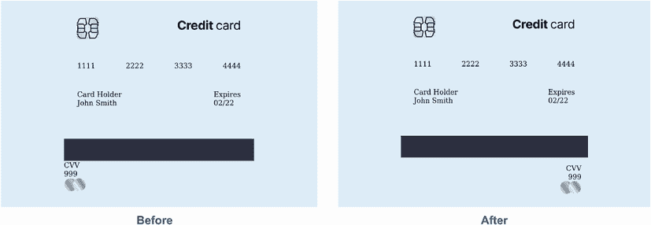

图 9.13 对齐文本

对于 *CVV* 字母，我们只需要给这段文本添加一些边距和填充，以将其从右边缘和下面的数字偏移。因为我们希望数字在特定高度的白色带上，我们将使用 `height` 属性，其值为 `45px`。为了在盒子的中间垂直对齐文本，而不是根据文本大小计算所需的垂直填充量，我们将使用 Flexbox，并设置 `align-items` 属性的值为 `center`。我们仍然会使用填充来将文本与盒子的右边缘分开。

由于 Flexbox 的默认 `justify-content` 属性值为 `flex-start`（这将重新定位我们的文本到盒子的右侧），我们需要显式地分配给它一个值为 `flex-end` 的值，以便容器内的元素（文本）保持在右侧。下面的列表显示了用于样式化 *CVV* 和安全代码的 CSS。

列表 9.11 卡片背面的布局

```
.card-item__cvvTitle {
  padding-right: 10px;
  margin-bottom: 5px;
}
.card-item__cvvBand {
  height: 45px;
  margin-bottom: 30px;
  padding-right: 10px;
  display: flex;
  align-items: center;
  justify-content: flex-end;
  Background: rgb(255, 255, 255);
}
```

到目前为止，我们的卡片看起来像图 9.14 所示。

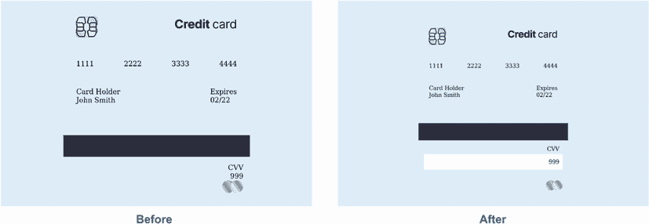

图 9.14 卡片上的元素定位

卡片开始成形。现在我们需要将背景图像应用到正面和背面，以及颜色和字体。这些步骤将产生巨大差异，并让我们更接近最终的外观。

## 9.3 使用背景图像

我们的信用卡需要某种背景图像。为了添加一个，我们将使用 `background-image` 属性。图像可以是任何适用于网络的格式。

### 9.3.1 背景属性简写

当设置元素的背景时，我们可以独立设置每个相关属性（`background-image`、`background-size` 等）或可以使用简写 `background` 属性。我们将使用以下属性和值：

+   `background-image:` `url("bg.jpeg")`

+   `background-size:` `cover`

+   `background-color:` `blue`

+   `background-position:` `left` `top`

如果我们使用简写形式的`background`属性，我们的声明最终会是`background:` `url("bg.jpeg")` `left` `top` `/` `cover` `blue;.` 这里为了使代码更容易阅读和讨论，图像的 URL 被截断，但在我们的代码中需要使用完整的 URL 来检索图像，正如我们在本章中会多次做的那样。图 9.15 分解了属性值。

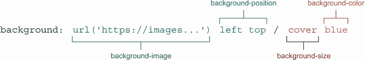

图 9.15 简写`background`属性

注意我们使用的是`background-size`属性的`cover`值。我们使用这个设置是为了让浏览器计算出图像应该具有的最佳大小，以便覆盖整个元素，同时尽可能多地显示图像而不失真。如果图像和我们的元素没有相同的宽高比，多余的图像将被裁剪。如果我们不希望图像的任何部分被裁剪，我们可以使用`contain`。图 9.16 展示了使用`cover`和`contain`的示例。

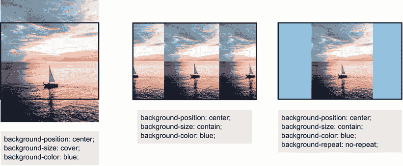

图 9.16 `background-cover`示例

尽管我们使用了`background-size`的`cover`值，但我们仍然包括一个背景颜色。当提供了图像和背景颜色时，图像总是显示在颜色之上。我们可能出于多个原因想要这样做。例如，如果图像小于元素或透明，包括背景颜色将为图像提供均匀颜色的背景。它也会在图像加载时或图像加载失败时为浏览器提供显示的内容。我们不必在我们的项目中提供这个值，但有一个与页面背景颜色不同的颜色可以帮助区分卡片和页面本身，如果图像加载失败，它将是一个好的回退位置。因为我们想让卡片的正面和背面都有背景图像，我们将更新我们的`.card-item__side`规则，该规则影响卡片的正面和背面，如下面的列表所示。

列表 9.12 卡片正反面的背景图像

```
.card-item__side{
  height: 100%;
  width: 100%;
  background: url("bg.jpeg") left top / cover blue;
}
```

在应用了背景图像（图 9.17）之后，我们可以专注于文本的样式。

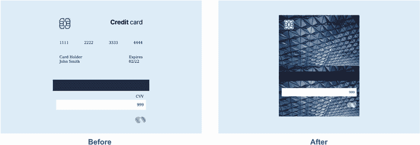

图 9.17 卡片正反面的背景图像已添加

### 9.3.2 文本颜色

现在我们已经设置了背景图像，我们注意到文本难以阅读，因此我们将它从黑色更改为白色，通过更新我们的`.card-item`选择器。列表 9.13 展示了我们的更新后的`.card-item`规则。

颜色对比和背景图像

验证当文本与图像重叠时颜色对比是否可访问是非常困难的，需要手动测试。在许多情况下，当窗口大小调整时，内容会重新布局，文本重叠的地方图像会改变。确保对比度始终足够的一种技术是测试文本颜色与图像最亮和最暗的部分。

值得注意的是，正如在这个项目中清楚地展示的那样，图像越繁忙，实现良好可读性的难度就越大。

列表 9.13 设置容器颜色

```
.card-item {
  max-width: 430px;
  height: 270px;
  margin: auto;
  position: relative;
  color: white;
}
```

通过更新此规则，我们已经将卡片上的所有文本更改为白色（图 9.18）。然而，我们的安全代码是在白色背景上，因此我们需要更新其规则，将其文本颜色更改为较深的颜色。

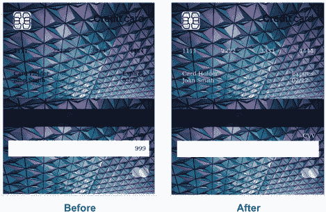

图 9.18 文本颜色更改为白色

要更改文本颜色，我们将更新`.card-item__cvvBand`规则（列表 9.14），该规则目前为我们提供白色带并定位安全代码在其中。我们将文本颜色更改为深蓝灰色。

列表 9.14 卡片背面白色背景

```
.card-item__cvvBand {
  background: white;
  height: 45px;
  margin-bottom: 30px;
  padding-right: 10px;
  display: flex;
  align-items: center;
  justify-content: flex-end;
  color: rgb(26, 59, 93);
}
```

在我们的安全代码可见性恢复（图 9.19）后，让我们将注意力转向卡片前面的两个文本元素：*持卡人*和*到期日*。

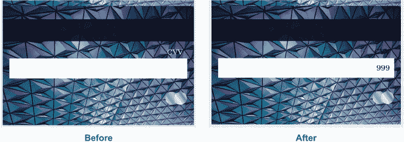

图 9.19 恢复的安全代码

在信息方面，这两段文本仅用于标记与之配对的元素，因此它们的重要性不如实际名称和日期。为了在视觉上降低其重要性，我们将降低其不透明度（列表 9.15），使其轻微半透明，并降低其亮度。在第 9.4 节中，当我们处理字体排印时，我们将出于同样的原因减小其大小。

列表 9.15 标记文本的样式

```
.card-item__holder, .card-item__dateTitle {
  opacity: 0.7;
}
```

到目前为止，卡片的最终外观已经显现（图 9.20）。我们已经设计了布局、格式、图像和颜色。但我们仍需要调整字体排印并创建主要效果：悬停时的翻转。下一步是查看字体。


图 9.20 文本不透明度降低

## 9.4 字体排印

对于其他项目，我们使用了免费的在线资源 Google Fonts 来加载所需的字体。我们通过链接到 Google Fonts 应用程序编程接口（API），请求所需的字体，然后将属性值设置为正在使用的字体族。但在某些情况下，我们可能想自己加载字体文件，而不是依赖于 API 或内容分发网络（CDN）。

警告：像图像和其他形式的媒体一样，字体受版权保护。在使用之前，无论字体是通过 API、CDN 还是本地托管导入，都务必确保您拥有适当的许可证。如有疑问，请咨询您的法律团队！

这两种方法都有优点和缺点。没有一种是明显优于另一种的，所以选择取决于我们正在工作的项目的需求。

使用本地或自托管字体的好处包括

+   我们不必依赖第三方。

+   在跨浏览器支持和性能优化方面，我们有更多的控制权，这可以使字体加载时间比第三方字体更快。

缺点包括

+   我们必须自己进行性能优化。

+   用户不会预先缓存该字体。

使用第三方托管字体的优点包括

+   用户可能已经在他们的设备上缓存了该字体。

+   导入更加简单。

缺点包括

+   我们需要额外调用以获取字体文件。

+   关于第三方跟踪的内容存在隐私问题。

+   该服务可以在任何时候停止字体服务。

要从我们的本地项目文件夹加载自己的字体，我们需要创建 `@font` `{}` at 规则来定义和导入我们想要使用的字体。为了理解这个 at 规则，让我们先看看字体格式。

### 9.4.1 @font-face

字体可以有多种文件类型。一些知名的包括

+   *TrueType (TTF)*—所有现代浏览器都支持；未压缩

+   *开放字体格式 (OTF)*—TTF 的进化；允许使用更多字符，如小写字母和旧式数字

+   *嵌入式开放字体格式 (EOT)*—微软为网页开发；仅由 Internet Explorer 支持（已过时，因为 Internet Explorer 已停止服务）

+   *Web 开放字体格式 (WOFF)*—为网页创建；已压缩；在字体文件中包含元数据以包含版权信息；并由万维网联盟推荐（[`www.w3.org/TR/WOFF2`](https://www.w3.org/TR/WOFF2)）

+   *Web 开放字体格式 2 (WOFF2)*—WOFF 的延续；比 WOFF 压缩 30%

+   *可缩放矢量图形 (SVG)*—创建用于在网页字体普及之前在 SVG 中嵌入字形信息

当你选择要使用的字体类型时，我们通常推荐使用 WOFF 或 WOFF2。

注意：我们最近才能够在不上传多个字体格式的情况下依赖 WOFF2 文件。你仍然可以在网上找到很多关于字体的过时信息。一个有用的技巧是查看信息的发布时间——越近越好。

在处理字体时，我们知道从前几章中，我们需要导入我们想要使用的每个粗细。对于本地处理字体也是同样的道理：每个变体（粗细和样式）都需要单独包含在项目中，除非我们使用可变字体。

可变字体相对较新。与每个样式在单独的文件中不同，所有排列组合都包含在单个文件中。所以如果我们想要常规、粗体和半粗体，我们只需导入一个文件而不是三个，我们不仅能够访问这三个字体粗细，还能从细体到超粗体的一切。斜体可能不在同一个文件中；在某些字体中，斜体字形与非斜体版本的不同。

对于我们的项目，我们希望加载三种字体：Open Sans 正常体，Open Sans 粗体，和 Open Sans 斜体。这些字体是同一家族中的变体。Open Sans 有静态和可变字体版本。可变版本将斜体和常规样式分开到两个单独的文件中。对于我们的非斜体需求，因为我们正在加载多个粗细，我们将使用可变版本。

然而，对于斜体，我们将只使用一个粗细：常规。对于该粗细加载可变字体版本没有意义。因为可变字体包含了跨越所有粗细范围所需的所有信息，所以它比只包含一个粗细的文件大得多（314.8 KB），而后者只有 17.8 KB。出于性能考虑，坚持使用静态版本是有意义的。

对于每个字体，我们需要创建一个单独的`@font-face`规则。此 at 规则定义了字体，包括字体从哪里加载，其粗细是多少，以及我们希望它如何加载。

首先，我们声明`@font-face` `{` `}` 规则。在大括号内，我们将定义其特性和行为，包括四个描述符：

+   `font-family`—当我们通过`font-family`属性将字体应用于元素时，我们用来引用字体的名称。

+   `src`—字体正在从哪里加载。此描述符接受一个逗号分隔的列表，指定从哪些位置获取字体以及期望从每个源获取的格式。浏览器将按照列表顺序，从第一个开始，直到成功获取字体。

+   `font-weight`—此特定字体文件代表的粗细。在可变字体的情况下，我们将包括一个范围。

+   `font-display`—指定字体的加载方式。我们将使用描述符值`swap`。字体是加载阻塞的，即浏览器会在加载其他资源之前等待字体加载完成。`swap`限制了字体加载阻塞的时间。如果在这个时间段结束时字体还没有加载完成，浏览器将继续加载其他资源，并在字体加载完成后应用字体。此设置允许在字体尚未可用的情况下显示内容，并允许用户与界面进行交互。

列表 9.16 显示了我们的两个规则，这些规则必须添加到样式表的**顶部**。此外，除了少数例外，规则不能在现有规则内部声明。例如，`.myClass` `{` `@font-face` `{` `...` `}` `}` 不会工作。一个例外是`@supports` at 规则，我们将在下一节中对其进行扩展。

列表 9.16 声明我们的字体

```
@font-face {
  font-family: "Open Sans";                                       ①
  src: url("./fonts/open-sans-variable.woff2")                    ②
       format("woff2-variations");                                ②
  font-style: normal;
  font-weight: 100 800;                                           ③
  font-display: swap;
}

@font-face {
  font-family: "Open Sans";                                       ①
  src: local("Open Sans Italic"),                                 ④
       url("./fonts/open-sans-regular.woff2") format("woff2"),    ⑤
       url("./fonts/open-sans-regular.woff") format("woff");      ⑥
  font-style: italic;
  font-weight: normal;                                            ⑦
  font-display: swap;
}
```

① 我们将用来引用字体的名称

② 如果浏览器可以加载可变字体，从哪里获取字体

③ 字体将支持从 100 到 800 的任何字体大小。

④ 检查设备是否已本地加载了字体

⑤ 尝试加载 woff2 格式

⑥ 如果不支持 woff2，则加载 woff

⑦ 声明此文件的字体粗细为正常（与 400 相同）

在应用此代码后，用户界面没有变化；正在使用的`font-family`仍然是浏览器的默认字体，因为我们还没有将字体应用到任何我们的元素上。我们还想要创建一个回退，以防浏览器不支持可变字体。在我们将字体应用到我们的元素之前，让我们看看浏览器的支持情况。

### 9.4.2 使用 @supports 创建回退

由于变量字体相对较新，并且并非每个人都能很好地在其设备上运行更新，因此我们将包括一个回退，以防用户的浏览器不支持变量字体。为此，我们将使用`@supports` at 规则。此规则允许我们检查浏览器是否支持特定的属性和值，并允许我们编写只有当提供的条件满足时才应用的 CSS。

我们的功能查询将是`@supports` `not` `(font-variation-settings:` `normal)` `{` `...` `}`。因为我们的查询在条件之前有`not`关键字，所以它包含的样式将在条件*不*满足时应用。换句话说，如果浏览器不支持变量字体行为，我们希望加载静态版本。

在我们文件的最顶部放置的`@supports` at 规则内部，我们包括了我们想要包含的正常样式版本两种字重的`@font-face`规则（列表 9.17）。我们还创建了一个`@supports` `(font-variation-settings:` `normal)` `{` `}` 规则，这次没有使用`not`。在这种情况下，对于支持变量字体的浏览器，我们将 9.4.1 节中创建的两个规则移动过来。这样，我们只有在浏览器支持变量字体时才加载变量字体，如果浏览器不支持变量字体，则防止文件被加载。

列表 9.17 不支持变量字体的回退

```
@supports (font-variation-settings: normal) {        ①
  @font-face {                                       ②
    font-family: "Open Sans";                        ②
    src: url("./fonts/open-sans-variable.woff2")     ②
➥ format("woff2-variations");                       ②
    font-weight: 100 800;                            ②
    font-style: normal;                              ②
    font-display: swap;                              ②
  }                                                  ②
}

@supports not (font-variation-settings: normal) {    ③
  @font-face {                                       ④
    font-family: "Open Sans";
    src: local("Open Sans Regular"),
         local("OpenSans-Regular"),
         url("./fonts/open-sans-regular.woff2") format("woff2"),
         url("./fonts/open-sans-regular.woff") format("woff");
    font-weight: normal;
    font-display: swap;
  }

  @font-face {                                       ⑤
    font-family: "Open Sans";
    src: local("Open SansBold"),
         local("OpenSans-Bold"),
         url("./fonts/open-sans-regular.woff2") format("woff2"),
         url("./fonts/open-sans-regular.woff") format("woff");
    font-weight: bold;
    font-display: swap;
  }
}
```

① 当支持变量字体时应用样式

② 将我们之前创建的变量字体规则移动到 at 规则中

③ 当不支持变量字体时应用样式

④ 正常样式的规则，字体粗细常规（400）

⑤ 正常样式的规则，字体粗细加粗（700）

在添加回退后，让我们更新我们的 body 规则以将 Open Sans 应用到我们的项目中（列表 9.18）。尽管我们添加了加载字体的回退，但我们仍将在 body 规则中的`font-family`属性值中包含`sans-serif`，以防字体文件加载失败。

列表 9.18 将字体应用到我们的项目中

```
body {
  background: rgb(221, 238, 252);
  margin-top: 80px;
  font-family: "Open Sans", sans-serif;
}
```

当字体应用后，我们可以看到我们的文本已经更新为使用 Open Sans 而不是浏览器的默认字体（图 9.21）。现在我们可以编辑我们的单个元素以调整字体粗细和样式。

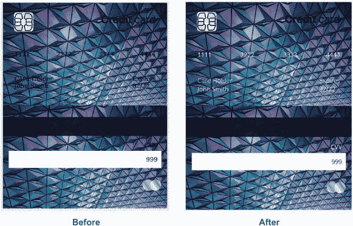

图 9.21 Open Sans 应用到项目中

### 9.4.3 字体大小和排版改进

从卡片的前面开始，我们将增加数字的字体大小并使其加粗。我们将添加到现有的规则中，如下所示。

列表 9.19 加粗并增加数字的大小

```
.card-item__number {
  display: flex;
  justify-content: space-between;
  padding: 10px 15px;
  margin-bottom: 35px;
  font-size: 27px;
  font-weight: 700;
}
```

图 9.22 显示了我们的样式化数字。

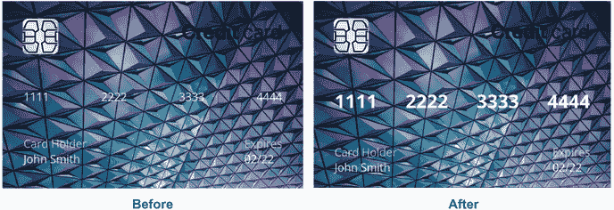

图 9.22 样式化数字

接下来是数字下面的文本，我们希望减小*卡片持有者*和*到期日*的大小。我们将它们的`font-size`设置为`15px`，并增加名称和日期的大小和`font-weight`，如下所示。

列表 9.20 持卡人信息和到期日期的排版

```
.card-item__holder, .card-item__dateTitle {   ①
  opacity: 0.7;                               ①
  font-size: 15px;                            ①
}                                             ①

.card-item__name, .card-item__dateItem {      ②
  font-size: 18px;                            ②
  font-weight: 600;                           ②
}                                             ②
```

① 卡片持有者和到期日

② 姓名和到期日期

在处理完卡片正面的文本元素（图 9.23）后，让我们将注意力转向背面。

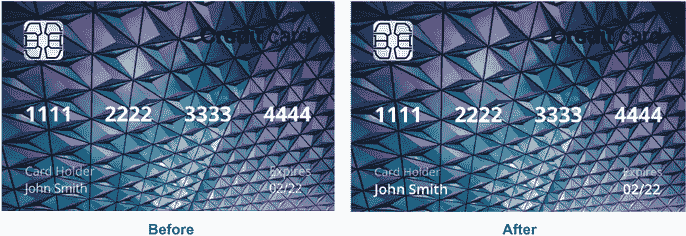

图 9.23 卡片正面的排版

在背面，我们需要更新安全代码使其为斜体。我们将使用`font-style:` `italic`更新现有的规则，如下所示。

列表 9.21 使卡片安全号码倾斜

```
.card-item__cvvBand {
  background: white;
  height: 45px;
  margin-bottom: 30px;
  padding-right: 10px;
  display: flex;
  align-items: center;
  justify-content: flex-end;
  color: #1a3b5d;
  font-style: italic;
}
```

现在卡片已经设置了样式（图 9.24），我们准备应用翻转效果。

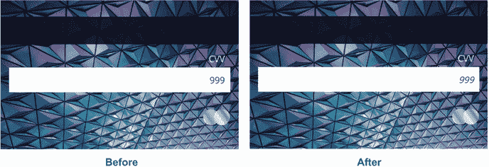

图 9.24 完成的排版样式

## 9.5 创建翻转效果

接下来，我们将为支持`hover`交互的设备创建翻转效果。我们首先调整位置，使卡片背面覆盖在正面之上。然后，我们将使用`backface-visibility`和`transform`属性来放置卡片。为了实现动画变化，我们将使用过渡效果。

### 9.5.1 位置

要实现翻转效果，我们通过`backface-visibility`属性将卡片面堆叠在一起。然后我们将切换显示哪一面。当我们使用`backface-visibility`属性并暴露背面时，我们在水平轴上进行旋转；因此，我们需要反转背面，使其内容镜像。想象一下拿一张描图纸并在背面画一个图像。当我们看正面时，从背面通过它出现的图像是镜像的。这正是我们在这里要实现的效果。我们用来堆叠正面和背面然后翻转的 CSS 在列表 9.22 中。我们将代码放在一个媒体查询中，该查询检查浏览器是否有`hover`功能。我们希望在支持`hover`的设备上才有翻转效果。对于不支持`hover`的设备（如手机），我们将同时显示正面和背面。

列表 9.22 将背面定位在正面之上

```
@media (hover: hover) {
  .back {
    position: absolute;
    top: 0;
    left: 0;
    transform: rotateY(-180deg);     ①
  }
}
```

① 翻转卡片

在本章的早期，我们在`.card-item`规则中设置了`position`属性的值为`relative`。在父元素或祖先元素上使用相对定位与我们将卡片背面`position`属性的值设置为`absolute`的事实相辅相成。`top`和`left`位置为`0`将是带有`card-item`类的顶部左区域（该容器包含两个卡片面）。

每当我们使用`position:` `absolute`时，我们将元素从页面的常规流中移除，并可以在页面上设置一个特定的位置来放置该元素。位置是基于具有`position`值为`relative`的最接近的祖先元素来计算的。如果没有找到，则页面的左上角将是顶部左角。

在这里有点令人困惑的是，如果没有设置值来定位元素（`top`、`left`、`right`、`bottom`或`inset`），元素将放置在它通常所在的位置，但在流中不占用任何空间。元素的高度和宽度也会受到影响。如果 CSS 中提供了值，元素将保持该值；否则，它只占用所需的空间。即使它是一个块级元素，它也不再占用可用的全部宽度。此外，如果宽度使用相对单位（如百分比）设置，它将相对于它相关的元素进行计算。图 9.25 显示了使用`position:` `absolute`的一些场景。

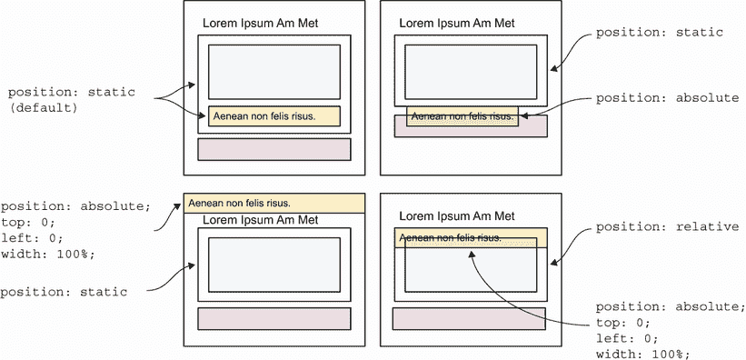

图 9.25 绝对定位

当我们的 CSS 应用（图 9.26）卡片背面翻转并位于正面之上时，我们可以应用`backface-visibility`属性。

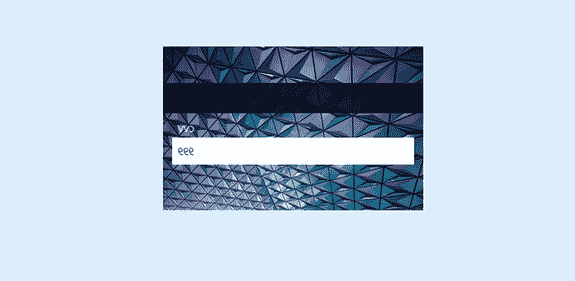

图 9.26 卡片背面位于正面之上并翻转

### 9.5.2 过渡和 backface-visibility

到目前为止，我们只看了 2D 空间中的对象——换句话说，一个平面的视角。我们看了宽度和高度，但没有深度。现在我们将考虑第三个维度。

当背面翻转时，我们需要它在用户悬停在卡片上时才显示。我们有两个侧面，第二个侧面有一个`transform:` `rotateY(-180deg)`声明（背面）。在 3D 空间中，因此，这个侧面是背对着我们的。如果我们将`backface-visibility`属性值设置为`hidden`在两个侧面，那么背对着我们的侧面将被隐藏。

我们目前背对着我们的背面是隐藏的。如果我们旋转整个卡片，背面朝向我们，正面被隐藏。图 9.27 说明了我们的 CSS 和 HTML 如何交互以创建翻转效果。

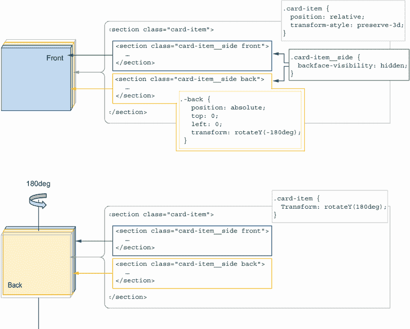

图 9.27 将`backface-visibility`属性应用于我们的用例

在我们的 CSS 中，我们向媒体查询（列表 9.23）添加了以下规则和属性。它们指示卡片在背对我们时隐藏侧面，并在鼠标悬停时绕 y 轴旋转整个卡片 180 度。注意一个我们还没有讨论过的属性：`transform-style`，我们给它赋值为`preserve-3d`。没有这个属性，翻转将不会工作。它告诉浏览器我们正在 3D 空间中操作，而不是 2D 空间，从而建立了前后概念。

列表 9.23 隐藏背面并在`hover`时显示

```
@media (hover: hover) {
  ...
  .card-item {
    transform-style: preserve-3d;     ①
  }
  .card-item__side {
    backface-visibility: hidden;      ②
  }
  .card-item:hover {                  ③
    transform: rotateY(180deg);       ③
  }                                   ③
}
```

① 指示浏览器像在 3D 空间中操作一样

② 隐藏背对着我们的侧面

③ 在悬停时，翻转整个卡片以显示背面

当我们的悬停功能暴露卡片背面（图 9.28）时，我们需要添加动画使其看起来更像卡片翻转。注意背面不再镜像。

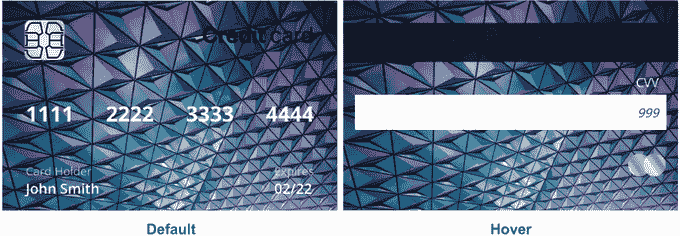

图 9.28 卡片默认状态和`hover`状态

目前，当我们悬停在卡片上时，背面会立即显示。我们希望让它看起来像卡片实际上正在被翻动。

### 9.5.3 过渡属性

为了动画化卡片翻动，我们将使用一个过渡。你可能还记得第五章中提到的，过渡用于动画化 CSS 的变化。在这种情况下，我们将通过向`card-item`（包含两个面的容器）添加过渡声明来动画化卡片的旋转变化。我们还将向媒体查询添加一个条件。

由于这个动画动作较多，我们想要确保尊重用户的设置。因此，我们将在媒体查询中添加一个`prefers-reduced-motion:` `no-preference`条件，如下所示。

列表 9.24 过渡和`transform`

```
@media (hover: hover) and (prefers-reduced-motion: no-preference) {
  ...
  .card-item {
    transform-style: preserve-3d;
    transition: transform 350ms cubic-bezier(0.71, 0.03, 0.56, 0.85);
  }
  ...
}
```

我们动画的持续时间是 350 毫秒，它影响`transform`属性（旋转），并且仅对那些在设备上未将`prefers-reduced-motion`设置为`reduce`的用户可见。图 9.29 显示了动画的进度，图 9.30 显示了用户界面，当用户启用了`prefers-reduced-motion`时。

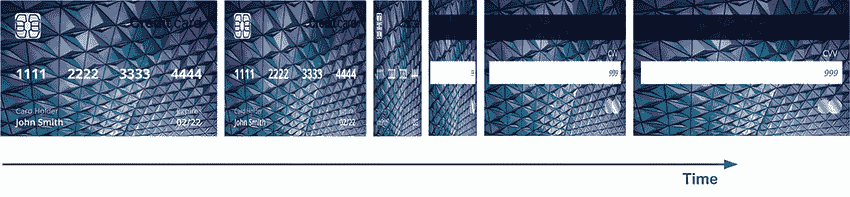

图 9.29 时间上的动画

对于我们的时间函数，我们使用了`cubic-bezier()`函数。接下来，让我们更详细地看看这个函数代表什么。

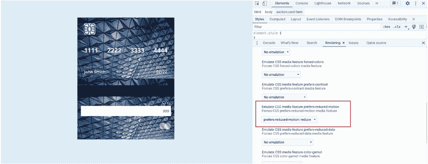

图 9.30 Chrome DevTools 中`prefers-reduced-motion:` `reduce`模拟的`prefers-reduced-motion:` `reduce`

### 9.5.4 cubic-bezier()函数

贝塞尔曲线是以法国工程师皮埃尔·贝塞尔的名字命名的，他在雷诺汽车的车身上使用了这些曲线([`mng.bz/d1NX`](http://mng.bz/d1NX))。贝塞尔曲线由四个点组成：P[0]、P[1]、P[2]和 P[3]。P[0]和 P[3]代表起始点和结束点，而 P[1]和 P[2]是点的句柄。点和句柄的值通过 x 和 y 坐标设置（图 9.31）。

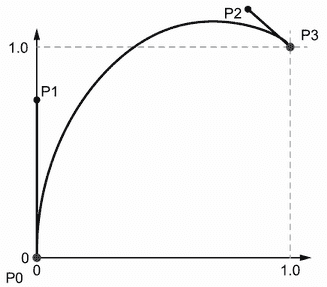

图 9.31 贝塞尔曲线上的点和句柄

在 CSS 中，我们只需要担心句柄，因为 P[0]和 P[3]的值分别被设置为`(0,` `0)`和`(1,` `1)`。通过操纵曲线，我们改变动画的加速度。在 CSS 中，我们的函数接受四个参数，代表 P[1]和 P[2]的`x`和`y`值：`cubic-bezier(x1,` `y1,` `x2,` `y2)`，其中`x`值必须在`0`和`1`之间，包括`0`和`1`。

我们在上一章中用于过渡和动画的预定义时间函数都有`cubic-bezier()`值，它们可以通过这些值来表示（图 9.32）。¹

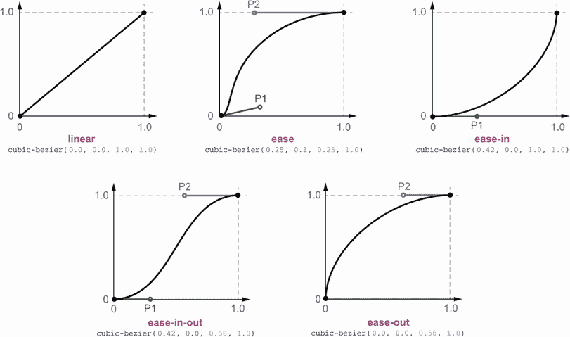

图 9.32 预定义的曲线

编写我们自己的`cubic-bezier()`函数来动画化我们的设计可能会很繁琐。幸运的是，像[`cubic-bezier.com`](https://cubic-bezier.com)这样的在线工具允许我们查看曲线并确定值（图 9.33）。

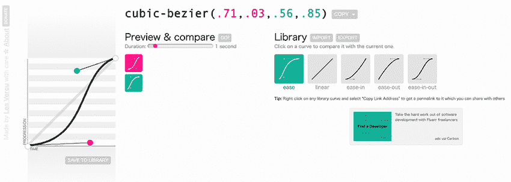

图 9.33 来自 cubic-bezier.com 的一个示例`cubic-bezier()`函数

我们还可以在某些浏览器开发者工具中看到`cubic-bezier()`，例如 Mozilla Firefox 中的那些（图 9.34）。

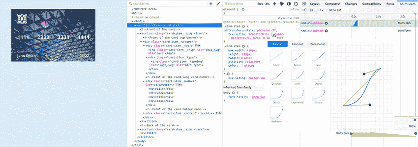

图 9.34 Firefox DevTools 曲线细节

我们的动画完成后，让我们给我们的项目添加一些收尾工作。

## 9.6 边框半径

大多数信用卡都有圆角，所以我们将我们的也做成圆角。我们还将圆角应用于卡片背面的白色 CVV 框。

在用户界面中添加圆角可能是一种平衡行为。我们将给卡片添加圆角，使其看起来更自然、更逼真。尖锐的角可能显得过于激进，但过度使用圆角可能会使界面看起来过于柔和和俏皮，这可能在所有情况下都不适用。正确的曲线量是设计特定的。为了使我们的卡片看起来更逼真，我们将添加以下 CSS。

列表 9.25 添加`border-radius`

```
.card-item__side {       ①
  height: 100%;
  width: 100%;
  background: url("bg.jpeg") left top / cover blue;
  border-radius: 15px;
 }
.card-item__cvvBand {    ②
  background: white;
  height: 45px;
  margin-bottom: 30px;
  padding-right: 10px;
  display: flex;
  align-items: center;
  justify-content: flex-end;
  color: #1a3b5d;
  font-style: italic;
  border-radius: 4px;
}
```

① 卡片

② 白色 CVV 带

有圆角后，我们的卡片看起来像图 9.35。


图 9.35 卡片和 CVV 带的圆角

## 9.7 盒子和文本阴影

在第四章中，我们简要介绍了`drop-shadow`值，该值可以应用于`filter`属性以进行图像过滤。将阴影应用于元素的另一方法是使用`box-shadow`属性，该属性将阴影应用于元素框。

### 9.7.1 drop-shadow 函数与 box-shadow 属性的区别

我们可能会想知道`drop-shadow`过滤器属性和`box-shadow`属性之间的区别。它们都有相同的基本值集，但`box-shadow`属性有两个非必选值：`spread-radius`和`inset`。

使用带有`drop-shadow`属性的过滤器在图像上的好处是，当我们使用过滤器时，阴影应用于 alpha 蒙版而不是边界框。因此，如果我们有一个 PNG 或 SVG 图像，并且该图像有透明区域，阴影将应用于该透明区域周围。如果我们向同一图像添加`box-shadow`而不是过滤器，阴影将仅应用于外部图像容器（图 9.36）。

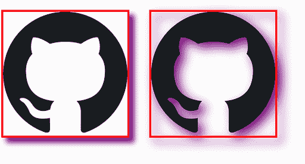

图 9.36 比较`box-shadow`（左）和`drop-shadow`（右）

为了加强卡片上的 3D 效果并使卡片看起来像是在漂浮，我们将给我们的卡片添加一个阴影。因为我们只关心给卡片的边界区域添加阴影，所以我们可以使用`box-shadow`属性，这将给项目带来深度感，并进一步强调有东西在背面。阴影将很大、很柔和，并且相当透明。为了达到这种效果，我们将向`.card-item__side`规则添加`box-shadow:` `0` `20px` `60px` `0` `rgb(14` `42` `90` `/` `0.55);`。我们的更新规则如下所示。

列表 9.26 在我们的卡片上使用`box-shadow`

```
.card-item__side {
  height: 100%;
  width: 100%;
  background: url("bg.jpeg") left top / cover blue;
  border-radius: 15px;
  box-shadow: 0 20px 60px 0 rgb(14 42 90 / 0.55);
}
```

图 9.37 显示了我们的更新后的卡片。

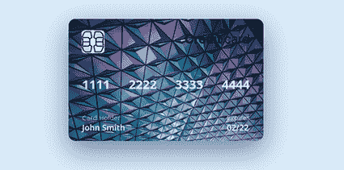

图 9.37 添加阴影使卡片看起来像是在漂浮

### 9.7.2 文本阴影

我们还可以给文本添加阴影。如果我们给文本应用 `box-shadow`，阴影将应用于包含文本的框，而不是单个字母。要给字母添加阴影，我们使用 `text-shadow` 属性，其语法与 `box-shadow` 属性相同。我们将在卡片的正面使用这个属性来提升文本与背景的分离。我们需要将这个属性添加到我们的 `.front` 规则中，如下面的列表所示。

列表 9.27 卡片正面所有文本元素的文本阴影

```
.front{
  padding: 25px 15px;
  text-shadow: 7px 6px 10px rgb(14 42 90 / 0.8);
}
```

图 9.38 展示了添加阴影前后的卡片。

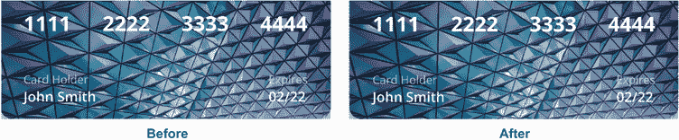

图 9.38 添加 `text-shadow` 前后对比

虽然效果微妙，但添加的阴影使数字显得更加突出。值得注意的是，这种效果最好谨慎且适度地使用，因为它可能会妨碍可读性而不是帮助它。

## 9.8 总结

最后一个需要处理的问题是关于那些不与翻页效果交互但同时在查看卡片两面（如没有悬停功能的设备，如手机和平板，以及设置了 `prefers-reduced-motion` 的用户）的用户。目前当两面都显示时，卡片面之间没有空间。因此，让我们在面底部添加一些边距以分隔它们，如下面的列表所示。

列表 9.28 分隔卡片面

```
.card-item__side {
  height: 100%;
  width: 100%;
  background: url("bg.jpeg") left top / cover blue;     ①
  border-radius: 15px;
  box-shadow: 0 20px 60px 0 rgb(14 42 90 / 0.55);
  margin-bottom: 2rem;
 }
```

① URL 被截断以提高可读性

在 Moto G4 设备上，我们的卡片看起来像图 9.39。

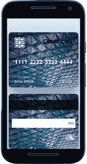

图 9.39 移动设备上的我们的项目

使用这个最后的添加，我们的项目就完成了。通过结合使用媒体查询、阴影、定位和过渡，我们创建了一个看起来逼真的卡片（图 9.40）。

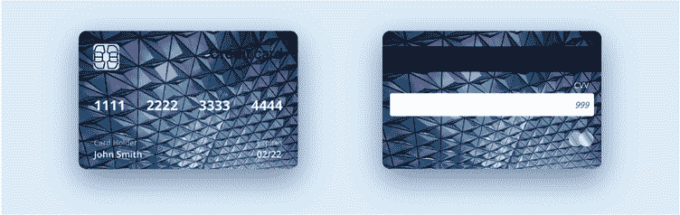

图 9.40 完成项目

## 摘要

+   我们可以通过 `box-sizing` 属性改变盒模型的行为。

+   `background` 属性的值 `cover` 允许我们在覆盖整个元素的同时尽可能多地显示背景图像。

+   虽然字体有多种格式，但对于网页来说，我们只需要 WOFF 和 WOFF2 格式。

+   字体可以是静态的或可变的。

+   我们使用 `@font-face` 规则来定义字体在哪里以及如何导入，以及它们应该如何表现。

+   `@font-face` 规则需要放在样式表的顶部。

+   `@supports` 规则允许我们创建针对浏览器功能的特定样式。

+   与 `transform-style: preserve-3d` 结合使用的 `backface-visibility` 属性创建了一个翻页效果。

+   `cubic-bezier()` 函数定义了我们的元素如何随时间动画。

+   `box-shadow` 属性允许我们给元素添加阴影。

+   `text-shadow` 而不是 `box-shadow` 是我们用来给单个文字字母添加阴影的属性。

***

¹  《架构 CSS：程序员高效样式表指南》，作者 Martine Dowden 和 Michael Dowden (2020, Apress)。
