# 10 表单样式

本章涵盖

+   样式输入字段

+   样式单选按钮和复选框

+   样式下拉菜单

+   考虑可访问性

+   比较 `:focus` 和 `:focus-visible`

+   使用 `:where` 和 `:is` 伪类

+   使用 `accent-color` 属性

表单在我们的应用程序中无处不在。无论是联系表单还是登录屏幕，无论它们是否是应用程序功能的核心，它们确实无处不在。然而，表单的设计可以轻易地使用户体验变得更好或更差。在本章中，我们将对表单进行样式化，并查看我们需要确保解决的某些可访问性考虑因素。我们将探讨一些与样式化某些单选按钮和复选框输入以及下拉菜单相关的挑战，并介绍一些样式化错误消息的选项。

在这个上下文中，*表单*是一个 HTML `<form>`元素中的代码部分，包含用户与之交互以向网站或应用程序提交数据的控件（表单字段）。由于联系表单在应用程序和网站中非常普遍，我们将使用联系表单作为我们项目的基准。

## 10.1 设置

我们的形式包含两个输入字段、一个下拉菜单、单选按钮、复选框和一个文本区域。我们还在表单顶部有一个标题，并在表单末尾有一个发送按钮。图 10.1 显示了我们的起点——未应用任何样式的原始 HTML，以及我们想要实现的目标。

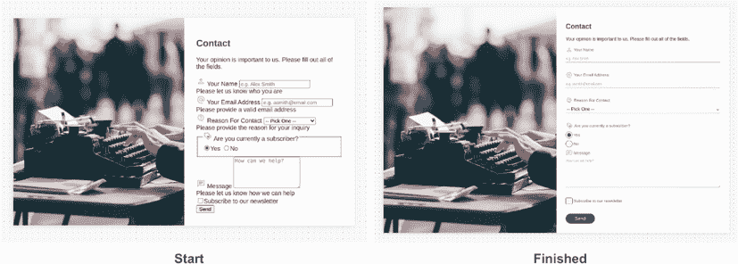

图 10.1 起始点和成品

我们的起始 HTML 相当简单；它包含我们的表单，其中放置了我们的标签、字段、错误消息和按钮。起始和最终代码在 GitHub（[`mng.bz/rWYZ`](http://mng.bz/rWYZ)）、CodePen（[`codepen.io/michaelgearon/pen/poeoNbj`](https://codepen.io/michaelgearon/pen/poeoNbj)）和以下列表中。

列表 10.1 起始 HTML

```
<body>
  <main>
    <section class="image"></section>                                      ①
    <section class="contact-form">
      <h1>Contact</h1>
      <form>
        <p>Your opinion is important to us...</p>
        <label for="name">
                   ②
          Your Name                                                        ②
        </label>                                                           ②
        <input type="text"                                                 ②
               id="name"                                                   ②
               name="name"                                                 ②
               maxlength="250"                                             ②
               required                                                    ②
               aria-describedby="nameError"                                ②
               placeholder="e.g. Alex Smith"                               ②
        >                                                                  ②
        <div class="error" id="nameError">                                 ②
          <span role="alert">Please let us know who you are</span>         ②
        </div>                                                             ②

        <label for="email">                                                ③
                  ③
          Your Email Address                                               ③
        </label>                                                           ③
        <input type="email"                                                ③
               id="email"                                                  ③
               name="email"                                                ③
               maxlength="250"                                             ③
               required                                                    ③
               aria-describedby="emailError"                               ③
               placeholder="e.g. asmith@email.com"                         ③
        >                                                                  ③
        <div class="error" id="emailError">                                ③
          <span role="alert">Please provide a...</span>                    ③
        </div>                                                             ③

        <label for="reasonForContact">                                     ④
                 ④
          Reason For Contact                                               ④
        </label>                                                           ④
        <select id="reasonForContact"                                      ④
                required                                                   ④
                aria-describedby="reasonError"                             ④
        >                                                                  ④
          <option value="">-- Pick One --</option>                         ④
          <option value="sales"> Sales inquiry</option>                    ④
             ...                                                           ④
        </select>                                                          ④
        <div class="error" id="reasonError">
          <span role="alert">Please provide the...</span>
        </div>

        <fieldset>                                                         ⑤
          <legend>                                                         ⑤
                                                              ⑤
            Are you currently a subscriber?                                ⑤
          </legend>                                                        ⑤
          <label>                                                          ⑤
<input type="radio" value="1" name="subscriber"                            ⑤
       checked required>                                                   ⑤
Yes                                                                        ⑤
          </label>                                                         ⑤
          <label>                                                          ⑤
            <input type="radio" value="0" name="subscriber" required>      ⑤
            No                                                             ⑤
          </label>                                                         ⑤
        </fieldset>                                                        ⑤
        <label for="message">                                              ⑥
                ⑥
          Message                                                          ⑥
        </label>                                                           ⑥
        <textarea id="message"                                             ⑥
                  name="message"                                           ⑥
                  rows="5"                                                 ⑥
                  required                                                 ⑥
                  maxlength="500"                                          ⑥
                  aria-describedby="messageError"                          ⑥
                  placeholder="How can we help?"                           ⑥
        ></textarea>                                                       ⑥
        <div class="error" id="messageError">                              ⑥
          <span role="alert">Please let us know how we can help</span>     ⑥
        </div>                                                             ⑥

        <label>                                                            ⑦
          <input type="checkbox" name="subscribe">                         ⑦
          Subscribe to our newsletter                                      ⑦
        </label>                                                           ⑦

        <div class="actions">
          <button type="submit" onclick="send(event)">Send</button>
        </div>
      </form>
    </section>

  </main>

  <script src="./script.js"></script>                                      ⑧
</body>
```

① 左侧图像

② 与相关标签和错误消息关联的名称输入

③ 与相关标签和错误消息关联的电子邮件输入

④ 联系原因下拉菜单和相关标签

⑤ 包含订阅单选按钮的 Fieldset

⑥ 消息文本区域

⑦ 订阅勾选标记

⑧ 处理错误的 JavaScript

你可能已经注意到包含了一个 JavaScript 文件。我们将使用这个文件在章节的后面部分（10.8 节）展示和隐藏错误。

为了让我们能够专注于样式化表单元素，页面布局的 CSS 在起始项目中提供。我们使用 `grid` 将图像和表单并排放置。我们还使用渐变在背景中创建点。我们的主题颜色已通过 CSS 自定义属性和一些基本的排版设置设置，包括使用无衬线字体并将我们项目的默认文本大小更改为 `12pt`。以下列表显示了我们的起始 CSS。

列表 10.2 起始 CSS

```
html {
  --color: #333333;                                          ①
  --label-color: #6d6d6d;                                    ①
  --placeholder-color: #ababab;                              ①
  --font-family: sans-serif;                                 ①
  --background: #fafafa;                                     ①
  --background-card: #ffffff;                                ①
  --primary: #e48b17;                                        ①
  --accent: #086788;                                         ①
  --accent-contrast: #ffffff;                                ①
  --error: #dd1c1aff;                                        ①
  --border: #ddd;                                            ①
  --hover: #bee0eb;                                          ①

  color: var(--color);
  font-family: var(--font-family);
  font-size: 12pt;
  margin: 0;
  padding: 0;
}

body {
  background-color: var(--background);                       ②
  background-image: radial-gradient(var(--accent) .75px,     ②
                    transparent .75px);                      ②
  background-size: 15px 15px;                                ②
  margin: 0;
  padding: 2rem;
}

main {
  display: grid;                                             ③
  grid-template-columns: 1fr 1fr;                            ③
  margin: 1rem auto;                                         ④
  max-width: 1200px;                                         ④
  box-shadow: -2px 2px 15px 0 var(--border);
}

.image {                                                     ⑤
  background-image: url("/img/illustration.jpeg");           ⑤
  background-size: cover;                                    ⑤
  background-position: bottom center;                        ⑤
  object-fit: contain;                                       ⑤
}                                                            ⑤

.contact-form {
  background-color: var(--background-card);
  padding: 2rem;
}

h1 { color: var(--accent); }
```

① 使用自定义属性设置我们的主题颜色

② 添加点状背景

③ 将两个部分并排放置的网格

④ 防止我们的设计太宽，并在页面上水平居中

⑤ 将图像添加到左侧

## 10.2 重置字段集样式

字段集是专门设计来分组控件和标签的。单选按钮组是字段集的一个完美用例，因为它们使我们能够有效地明确地将控件分组。它们还为我们提供了一个通过 `<legend>` 标签为控件组添加标签的现成方式。然而，从风格上讲，我们可以同意它们相当不美观。

让我们重置该组的样式以使其在视觉上消失。从程序的角度来看，我们想要保留该组，因为它对辅助技术用户很有帮助，但我们将使其更好地融合。为了使 `<fieldset>` 样式消失，我们需要重置三个属性：`border`、`margin` 和 `padding`。以下列表显示了我们的规则。

列表 10.3 重置字段集样式

```
fieldset {
  border: 0;
  padding: 0;
  margin: 0;
}
```

在移除 `<fieldset>` 的浏览器默认样式（图 10.2）后，让我们将注意力转向我们的输入字段。

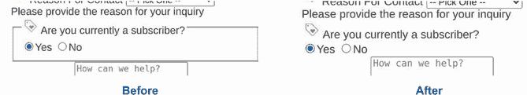

图 10.2 重置字段集

## 10.3 输入字段样式化

我们在表单中有四种类型的输入字段，具体如下：

+   *您的姓名*—`text`

+   *您的电子邮件地址*—`email`

+   *是/否*—`radio`

+   *订阅我们的通讯*—`checkbox`

HTML 有更多类型的字段，包括 `date`、`time`、`number` 和 `color`，每种类型都有自己的语义意义和样式考虑。我们选择了前面的四种类型，因为它们在当今网络上被广泛使用。

这些字段的未样式化外观决定了我们将如何对它们进行样式化。例如，我们将单选按钮和复选框与文本输入区分对待，但我们可以在多个类型之间重用代码。我们将根据未样式化控件的外观对它们进行分组，因此我们将文本和电子邮件一起处理，然后一起处理单选按钮和复选框。让我们从文本和电子邮件输入开始。

### 10.3.1 文本和电子邮件输入字段样式化

我们首先想弄清楚如何仅选择文本和电子邮件输入字段——更确切地说，所有不是单选按钮或复选框的输入字段。一个解决方案是为我们想要处理的每个输入添加一个类。然而，这种方法难以维护，并且会变得相当嘈杂，尤其是在表单密集型应用程序或复杂表单中。因此，我们将使用伪类 `:not()` 与类型选择器 `selector[type="value"]` 结合使用。

`:not()` 伪类允许我们选择不符合特定标准的元素。在我们的情况下，我们想要选择所有没有 `radio` 或 `checkbox` 类型的输入字段。因此，我们的选择器将是 `input:not([type="radio"], [type="checkbox"])`。现在我们可以开始样式化输入字段，这些字段目前看起来如图 10.3 所示。

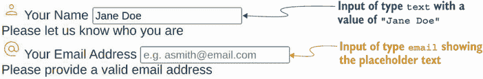

图 10.3 输入类型 `text` 和类型 `email`

我们在图 10.3 中看到字体大小小于我们在 `body` 上设置的 `12pt` 大小。小字体在移动设备上难以阅读；对于许多用户来说也很困难，尤其是年轻人和老年人。如果我们希望我们的表单易于在广泛的人群和设备上使用，我们需要将其增加，因此我们将它设置为 `1rem` 以匹配我们的应用程序的其余部分。输入默认不继承字体样式，因此我们还将显式设置 `color` 和 `font-family` 为 `inherit`。

注意 `inherit` 是一个实用的属性值。它允许一个元素在默认情况下不发生继承时强制从父元素继承属性值。

接下来，我们将为输入添加一些填充和自定义边框，以及使它们的角落圆滑。在这种情况下，我们将出于风格目的进行这些更改。大多数应用程序都有一个通用样式（外观和感觉）。我们选择应用于字段样式应该与我们的应用程序的其余通用主题保持一致，以帮助表单与页面融合，看起来像是属于那里的。从营销角度来看，坚持我们的主题也有助于加强品牌认知。

要创建底部边框渐变效果，我们将使用从我们的主色调到辅助色调的线性渐变。因为渐变是一个我们不能分配给 `border-bottom` 属性的图像，我们需要使用 `border-image`，这允许我们使用图像来样式化我们的边框。我们仍然会在 `border-bottom` 属性中提供一个颜色作为后备。我们的代码如下所示。

列表 10.4 为非 `radio` 或 `checkbox` 类型的输入字段设置样式

```
input:not([type="radio"], [type="checkbox"]) {

  font-size: 1rem;
  font-family: inherit;
  color: inherit;
  border: none;                                                             ①
  border-bottom: solid 1px var(--primary);                                  ②
  border-image: linear-gradient(to right, var(--primary), var(--accent)) 1; ③
  padding: 0 0 .25rem;
  width: 100%;
}
```

① 从字段中移除所有边框

② 恢复边框，但仅底部，使用我们的主色调作为后备颜色

③ 为我们的边框添加渐变

像素和 rem

注意到我们的边框使用像素，而其余的声明使用 rem。在某些情况下，我们希望设计中的某些元素相对于文本大小。换句话说，如果文本大小增加或减少，我们希望这些元素相应地缩放。在这种情况下，我们的填充和边距使用 rem，因为如果文本大小增加，我们不希望设计开始看起来拥挤；另一方面，如果文本大小减少，我们希望相应地缩小那个空间。对于这些情况，我们希望使用一个相对单位，如 rem。

我们希望边框保持 1 像素，然而，无论文本大小如何。因此，我们使用一个固定单位。

我们为文本和电子邮件输入设置了一些基本样式，如图 10.4 所示。我们已经开始为我们的表单控件开发一个主题。

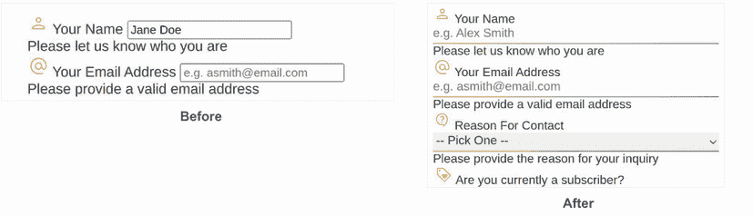

图 10.4 文本和电子邮件输入样式

### 10.3.2 使选择框和文本区域与输入样式匹配

为了确保我们的控件在视觉和感觉上保持一致，让我们将应用于输入字段的相同样式应用到`<textarea>`和`<select>`元素上。我们不会创建新的规则或复制粘贴代码。为了保持我们的样式一致和可维护，我们将添加`select`和`textarea`作为选择器到我们现有的规则中，如下面的列表所示。

列表 10.5 将`textarea`和`select`添加到现有规则

```
input:not([type="radio"], [type="checkbox"]),
textarea,                                                                   ①
select {                                                                    ①
  font-size: 1rem;
  font-family: inherit;
  color: inherit;
  border: none;          
  border-bottom: solid 1px var(--primary);                                  ②
  border-image: linear-gradient(to right, var(--primary), var(--accent)) 1; ③
  padding: 0 0 .25rem;
  width: 100%;
}
```

① 将文本区域和选择框添加到我们的规则中

② 将边框重新添加，但只在底部，以我们的主要颜色作为后备颜色

③ 为我们的边框添加渐变

当规则应用后，我们注意到这两个字段仍然需要一点额外的样式。让我们首先关注`<textarea>`。图 10.5 显示了我们的更新后的`<textarea>`。

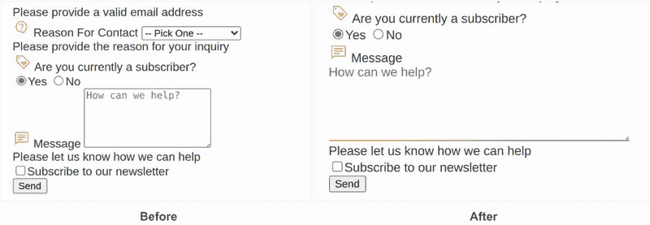

图 10.5 更新`<textarea>`样式

在默认的网页中，用户可以通过点击并拖动右下角来调整`<textarea>`的宽度和高度。在我们的布局中，增加或减少高度不会引起任何布局问题。然而，改变宽度会隐藏我们的图片，并最终使我们的表单失去居中，正如我们可以在图 10.6 中观察到的。


图 10.6 `<textarea>`调整大小问题

`<textarea>`以一种不美观的方式延伸到容器之外。当我们垂直调整大小时，容器会相应地调整大小，但水平方向并不是这样。通过将`<textarea>`的`resize`属性值从默认设置（`both`）更改为`vertical`，我们限制了用户调整元素大小的能力。用户将继续能够改变其高度，但不能改变宽度，如下面的列表所示。

列表 10.6 更新`textarea`的样式

```
textarea { resize: vertical }
```

从视觉上看，文本框看起来相同，并且在右下角仍然有调整大小的控制（图 10.7）。然而，当用户与调整大小的控制交互时，他们将被限制在垂直调整大小。

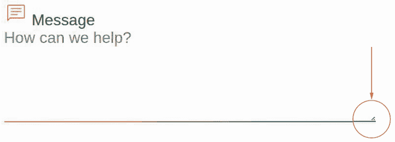

图 10.7 `<textarea>`仅垂直调整大小

我们仍然需要处理`<select>`，但这个过程将比编辑`<textarea>`复杂得多。所以让我们先完成输入字段的样式设计，然后再回到完成`<select>`控件的样式设计。

### 10.3.3 样式化单选输入和复选框

一些表单控件因其可应用样式数量极其有限而闻名，难以进行样式设计。单选按钮和复选框正好属于这一类。直到最近，没有任何属性会影响单选按钮的圆圈或复选框的方块。我们唯一的选择是用我们自己的样式替换原生的控件样式。

为什么一些表单字段如此难以进行样式设计？

一些表单字段，包括单选按钮和复选框，因其难以样式化而享有声誉。这种声誉源于我们可以更改其外观的 CSS 属性数量有限。我们之所以只有有限的属性，是因为它们的外观大部分是由操作系统驱动的，而不是浏览器。

现在我们有了更改原生控件颜色的能力。`accent-color` 属性允许我们用我们指定的颜色替换用户代理选择的颜色。将 `accent-color:` `var(--accent);` 应用到我们的复选框和单选按钮（列表 10.7）会产生图 10.8 中显示的结果。

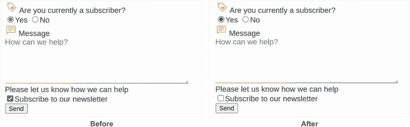

图 10.8 应用于单选按钮和复选框的强调颜色

列表 10.7 更新 `textarea` 的样式

```
input[type="radio"],             ①
input[type="checkbox"] {         ①
  accent-color: var(--accent);
}
```

① 样式仅应用于类型为单选或复选的输入。

元素已采用我们设置的强调颜色，而不是之前使用的默认浅蓝色。然而，如果我们增加应用程序中的 `font-size`，控件的大小并不会增加（见图 10.9）。

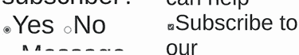

图 10.9 增加单选按钮和复选框的字体大小

虽然我们可以更改元素的颜色（这是一种快速有效地调整控件样式以更好地适应我们样式的有效方法），但如果我们想允许控件随着字体大小缩放或进行任何进一步的定制，我们需要用我们自己的样式替换控件的样式。因为我们想保持控件的功能，只替换其视觉方面，所以我们的 HTML 保持不变。我们将隐藏浏览器提供的原生控件，并用我们自己的自定义样式替换其视觉部分。为了隐藏原生控件，我们将使用 `appearance` 属性并将其值设置为 `none`。这个属性允许我们控制控件的原生外观。通过将其属性设置为 `none`，我们表示我们不希望它显示操作系统提供的样式。我们还将设置 `background-color` 为我们自己的背景颜色（因为一些操作系统为控件提供了背景），然后重置我们的边距。

我们可以移除之前创建的 `accent-color` 声明；我们正在从头开始重新创建控件的视觉方面，因此该声明将没有任何效果。以下列表显示了完成的重置。

列表 10.8 重置 `radio` 和 `checkbox` 输入

```
input[type="radio"],
input[type="checkbox"] {
  accent-color: var(--accent);
  appearance: none;
  background-color: var(--background);
  margin: 0;
}
```

图 10.10 显示单选按钮已消失。我们可以开始为这些控件创建自己的样式。

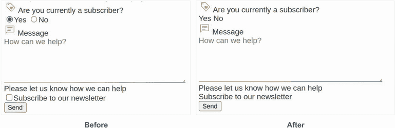

图 10.10 重置单选按钮和复选框的样式

首先，我们想要创建一个框。对于单选按钮输入，我们将给这个框一个 `border-radius` 使其呈圆形。本质上，无论输入元素是复选框还是一组单选按钮，输入都需要一个框。我们将通过给输入设置 `height` 和 `width` 为 `1.75em` 来创建一个框。我们使用 `em` 单位，因为它们是父字体大小的百分比。通过将我们的高度和宽度设置为 `1.75em`，我们使它们等于父字体大小的 1 3/4 倍。如果我们的标签——容器以及因此也是我们的输入的父元素——的 `font-size` 为 `16px`，我们的框将是 28 像素宽和 28 像素高（`16` `x` `1.75` `=` `28`）。

接下来，我们将添加一个继承自标签字体颜色的边框。这一步可能听起来有点奇怪：我们如何使 `border-color` 从 `font-color` 继承？我们将使用关键字值 `currentcolor`，它允许属性在它们通常不能继承的情况下继承字体颜色。我们将边框颜色设置为 `currentcolor` 以使边框颜色与字体颜色匹配。为了设置我们的边框宽度，我们将使用 `em` 以允许边框宽度与单选按钮的大小成比例。

由于输入默认是内联元素，为了应用我们的高度和宽度，我们还需要更改 `display` 属性。我们将将其设置为 `inline-grid`，因为我们处理输入的 `checked` 状态时，需要将内部圆盘或勾选标记居中。网格允许我们通过 `place-content` 属性轻松实现这一点。

`inline-grid` 相对于 `grid`，就像 `inline-block` 相对于 `block`。`inline-block` 具有与 `block` 相同的所有特性，但将其自身放置在页面流中。`inline-grid` 以相同的方式工作。我们可以访问 `grid` 的所有功能，但元素将自身放置在页面流中，而不是在上一内容下方。就我们的目的而言，这意味着输入将与文本标签一起放置，而无需为我们必须为包含单选按钮输入或复选框的标签创建特殊规则。

最后，我们需要处理 `border-radius`。这一步是复选框和单选按钮开始分叉的地方，因为复选框是方形的，而单选按钮是圆形的。由于我们的字段有圆角，我们将为复选框添加一个小的 `border-radius` (`4px`)。为了使单选按钮呈圆形，我们将添加一个 `border-radius` 为 `50%`。我们的更新规则如下所示。

列表 10.9 样式化的 `radio` 和 `checkbox` 输入

```
input[type="radio"],
input[type="checkbox"] {
  appearance: none;
  background-color: var(--background);
  margin: 0;
  width: 1.75em;
  height: 1.75em;
  border: 1px solid currentcolor;      ①
  display: inline-grid;                ②
  place-content: center;               ②
}

input[type="radio"] { border-radius: 50% }

input[type="checkbox"] { border-radius: 4px }
```

① 将边框设置为与父元素文本颜色相同的颜色

② 当元素被选中时，设置以居中内部圆盘或勾选标记

我们未选中的输入已经进行了样式化。现在我们需要处理当这些输入被选中时使用的样式。在图 10.11 中，选中的（已选中）和未选中的元素看起来是相同的。

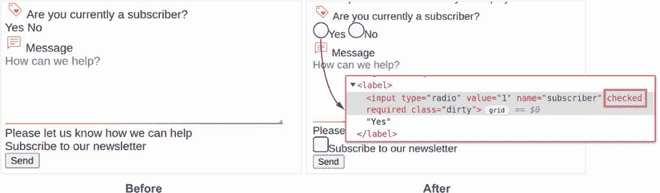

图 10.11 未选中的 `radio` 和 `checkbox` 样式

### 10.3.4 使用 :where() 和 :is() 伪类

在这个节点上，我们将查看两个将帮助我们保持代码干净和简洁的伪类：`:is()`和`:where()`。这两个伪类在功能上相似，因为它们接受一个选择器列表，并在列表中的任何选择器匹配时应用规则。这两个都非常有助于编写长的选择器列表。我们不必像这样写

```
input:focus, textarea:focus, select:focus, button:focus { ... }
```

我们可以使用`:where`或`:is`并写出等效的如下`:`

```
:where(input, textarea, select, button):focus { ... }
```

`:is()`伪类将以相同的方式应用。`:is()`和`:where()`之间的区别在于它们的特定性级别。`:where()`不太特定，因此容易覆盖。另一方面，`:is()`采用列表中最特定选择器的特定性值。

注意：要了解如何计算特定性，请查看第一章。在第 10.3.9 节中，我们将更深入地探讨使用`:where()`和`:is()`计算特定性的方法。

警告：在使用`:is()`时要小心，因为如果我们列表中的选择器有`id`选择器（`id`选择器是最特定的），我们可以创建难以覆盖的规则。

我们将使用`:where()`和`:is()`与伪类如`:checked`、`:hover`和`:focus`以及`::before`伪元素一起完成复选框和单选输入的样式。

### 10.3.5 样式选定的单选和复选输入

要添加选定的单选按钮的内部圆盘和复选框的勾选标记，我们将应用与用于未选中输入类似的方法。我们创建了一些适用于两种输入类型的基本样式，然后在样式分离时为每个元素单独添加了完成细节。像以前一样，我们首先创建一个框。接下来，我们将该框放置在现有样式的中心，然后将其塑造成圆盘或勾选标记的形状。

要创建这个要放置在我们当前元素内部的第二个框，我们将使用`::before`伪元素。在这个时候，`:where()`伪类（在第 10.3.4 节中介绍）开始发挥作用；我们将使用它来选择我们的两种输入类型，然后添加`::before`伪元素。我们的选择器将看起来像这样：`:where(input[type= "radio"], input[type="checkbox"])::before` `{}`.

我们的内容将是空的，因此我们将使用`content`属性值为`""`（空引号），并给它一个`display`值为`block`，这样我们就可以分配一个`width`和`height`。

当我们之前创建外部框时，我们给了它一个高度和宽度为`1.75em`。我们使用`em`单位，以便控制相对于文本大小进行缩放。我们在这里也将做同样的事情。我们希望内部圆盘和勾选标记比它们的容器小，所以我们将`height`和`width`设置为`1em`。假设应用于输入的`font-size`是`16px`，我们的框将是`16px`乘以`1`等于`16`。

我们不需要做任何事情来定位我们的内部框。记住，之前我们设置了输入显示为 `inline-grid`，然后在列表 10.8 中添加了 `place-content` 属性，其值为 `center`。网格布局自动将内部框放置在输入的中心。我们的内部圆盘和勾选标记的 CSS 如下所示。

列表 10.10 内部框居中

```
:where(input[type="radio"], input[type="checkbox"])::before {
  display: block;
  content: '';
  width: 1em;
  height: 1em;
}
```

当我们应用此代码时，我们没有看到任何变化，如图 10.12 所示。我们的内部框确实存在，但目前还不可见。

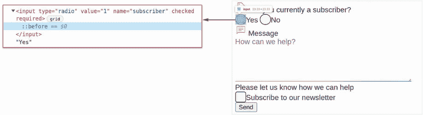

图 10.12 不可见的内部框

该框不可见，因为它没有任何内容或背景颜色。我们将添加一个背景颜色。

### 10.3.6 使用 :checked 伪类

我们不会一直将相同的背景颜色应用到我们的元素上。当元素被选中时，我们将使用我们的强调颜色，而当元素被悬停时，我们将使用悬停颜色。

`:checked` 伪类选择器可以用于类型为 `radio` 或 `checkbox` 的输入，或者用于下拉菜单 (`<select>`) 中的 `<option>` 元素，以在元素被选中时应用样式。在 `<option>` 上使用它的能力取决于浏览器。

当我们为 `checked` 和 `hover` 状态应用 `background-color` 时，如果选择器具有相同的具体性级别（如我们的示例所示），则这些规则的编写顺序很重要。如果我们首先编写 `checked` 状态规则，然后编写 `hover` 状态规则，则悬停颜色将在悬停时应用于选中的输入；由于它出现在 CSS 文件中较后，悬停状态规则将覆盖 `checked` 状态规则。因此，我们想要确保在 CSS 文件中将悬停状态规则放置在 `checked` 状态规则之前。图 10.13 阐述了这两种情况。

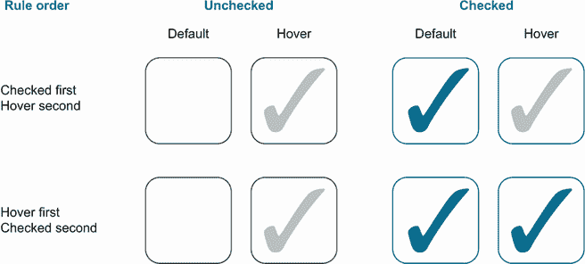

图 10.13 关于悬停选中复选框背景的规则顺序

让我们看看我们如何在 CSS 文件中应用我们的背景颜色。以下列表显示了我们的 `hover` 和 `checked` 代码到目前为止的情况。

列表 10.11 内部元素背景颜色

```
:where(input[type="radio"], input[type="checkbox"]):hover::before {      ①
  background: var(--hover);                                              ①
}                                                                        ①
:where(input[type="radio"], input[type="checkbox"]):checked::before {    ②
  background: var(--accent);                                             ②
}                                                                        ②
```

① 在悬停时为内部框添加背景颜色

② 在输入被选中时为内部框添加背景颜色

图 10.14 显示，我们可以在元素内部塑造一个框。当元素被选中时，该框以强调颜色显示，当用户悬停在未选中的单选按钮或复选框输入上时，我们看到一个灰色框。

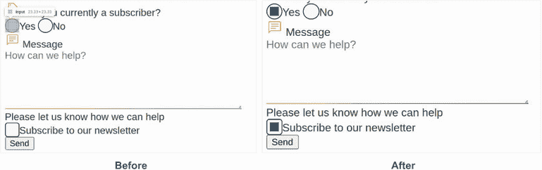

图 10.14 设置选中状态

接下来，我们需要塑造内部框，我们的代码将分叉以创建单选按钮和复选框的圆盘和勾选标记。

### 10.3.7  塑造选中单选按钮的内部圆盘

从单选按钮输入开始，我们通过添加 `border-radius` 为 `50%` 将内部框变成圆形，如列表 10.12 所示。我们不区分 `hover` 和 `checked` 状态，因为我们希望形状无论元素状态如何都为圆盘。

列表 10.12 单选按钮内部圆盘

```
input[type="radio"]::before {
  border-radius: 50%;
}
```

现在我们有了看起来传统的单选按钮，无论文本大小如何都能很好地缩放（图 10.15）。在样式化单选按钮后，我们将注意力转向复选框内部的勾选标记形状。


图 10.15 样式化的 `radio` 输入

### 10.3.8 使用 CSS 形状创建勾选标记

使我们的单选输入形状变得简单：我们使用 `border-radius` 实现圆盘形状。创建勾选标记并不那么简单。为此，我们将使用 `clip-path`。

注意：`clip-path` 允许我们通过创建一个定义了元素哪些部分应该显示和哪些部分应该隐藏的剪切区域来创建形状。我们在第七章中使用了 `clip-path`。

我们将应用于 `clip-path` 以创建勾选标记的形状是一个多边形。多边形是通过设置一系列基于 `X` 和 `Y` 百分比坐标来创建的，这些坐标之间创建了一条线。`(0,0)` 坐标是形状的左上角。如果形状没有明确关闭，它将自动连接第一个和最后一个点。我们的 `polygon()` 函数将是 `polygon(14% 44%, 0% 65%, 50% 100%, 100% 16%, 80% 0%, 43% 62%)`。图 10.16 解释了形状的点对点构建。

![图片 10-16.png]

图 10.16 多边形勾选标记形状坐标

注意：简单形状的坐标很容易确定。但是，当形状变得更加复杂时，手动确定坐标可能会很繁琐。在这些情况下，我们可以求助于矢量图形绘制程序，如 Inkscape 和 Illustrator，或者许多 CSS 形状生成网站之一，包括 [`bennettfeely.com/clippy`](https://bennettfeely.com/clippy/)。

在创建形状后，我们可以创建我们的 `clip-path` 并将其应用于复选框的内部部分，如下列所示。

列表 10.13 检查框中的勾选标记

```
input[type="checkbox"]::before {
  clip-path: polygon(14% 44%, 0% 65%, 50% 100%, 100% 16%, 80% 0%, 43% 62%);
}
```

添加了 `clip-path` 之后，我们就有了功能齐全的复选框。接下来，让我们添加一些收尾工作。注意图 10.17 中选中的单选按钮和复选框的轮廓仍然是我们字体颜色，而不是强调色。

![图片 10-17.png]

图 10.17 复选框中的样式化勾选标记

要在单选按钮和复选框被选中时为它们添加轮廓颜色，我们将再次使用 `:checked` 伪类，仅在控件被选中时将边框颜色更改为我们的强调色。这个过程对应于列表 10.14 中的代码。我们使用 `:is()` 而不是 `:where()` 是出于特定性的考虑。

列表 10.14 选中输入项的强调色轮廓

```
:is(input[type="radio"], input[type="checkbox"]):checked {
  border-color: var(--accent);
}
```

### 10.3.9 使用 :is() 和 :where() 计算特定性

我们之前提到`:where()`具有`0`的特定性，这意味着它是我们可用的最不特定选择器。我们在选择器`input[type="radio"], input[type="checkbox"] `{` `...` `}`中设置了默认边框颜色，其特定性为`11`，根据表 10.1 计算得出。在每一列中，我们计算每种类型选择器的数量，列 A、B 和 C 形成特定性值。¹

表 10.1 计算特定性

| 选择器 | AID 选择器（×100） | BClass 选择器、属性选择器和伪类（×10） | CType 选择器、伪元素（×1） | 特定性 |
| --- | --- | --- | --- | --- |
| `:where(input[type="radio"], input[type="checkbox"])` | 忽略特定性规则，始终等于 0 | `000` |
| `:where(input[type="radio"], input[type="checkbox"]):checked` | 忽略特定性规则，始终等于 0 | `000` |
| `input[type="radio"]` | `0` | `1` | `1` | `011` |
| `input[type="radio"]:checked` | `0` | `2` | `1` | `021` |
| `:is(input[type="radio"], input[type="checkbox"]):checked` | `0` | `2` | `1` | `021` |

因为`:is()`基于其内部最特定选择器的值来确定特定性值，在这种情况下，特定性将是`11`加上`:checked`状态的另一个`10`，因此特定性为`21`。因为`21`大于`0`，我们覆盖了样式，我们的边框变成了我们的强调颜色。

现在我们对单选按钮和复选框进行了样式化，无论是选中还是未选中，以及悬停状态下的两种状态。图 10.18 显示了我们的进展情况。

让我们把注意力转向下一个下拉菜单。

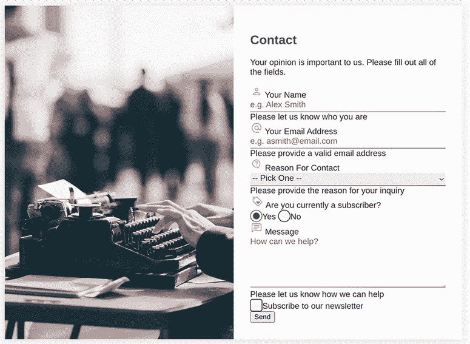

图 10.18 样式化的复选框和单选按钮输入

## 10.4 样式化下拉菜单

虽然我们为`<select>`元素应用了与基于文本的`<input>`和`<textarea>`相同的默认样式（列表 10.5），但我们看到图 10.19 中下拉菜单（`<select>`）仍然很粗糙。在扩展视图中，我们还看到我们的选项列表与我们的主题不匹配。

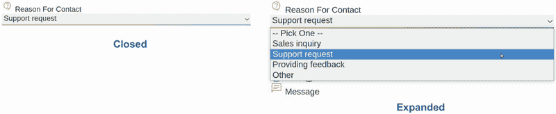

图 10.19 下拉菜单关闭和展开

让我们先从修复背景颜色开始。虽然因为我们的表单背景是白色，所以不明显，但输入字段默认情况下有白色背景。我们将向现有的声明中添加一个规则，该规则影响`<input>`、`<textarea>`和`<select>`元素，将背景颜色设置为卡片背景（列表 10.15）。这样，如果卡片背景发生变化，我们的表单控件将具有适当的背景颜色。

列表 10.15 应用到`select`的默认样式

```
input:not([type="radio"], [type="checkbox"]),
textarea,
select {
  font-size: 1rem;
  font-family: inherit;
  color: inherit;
  border: none;
  border-bottom: solid 1px var(--primary);
  border-image: linear-gradient(to right, var(--primary), var(--accent)) 1;
  padding: 0 0 .25rem;
  margin-bottom: 2rem;
  width: 100%;
  background-color: var(--background-card);     ①
}
```

① 添加背景颜色声明

在添加了背景颜色后，我们看到输入和选项都有白色背景（图 10.20）。

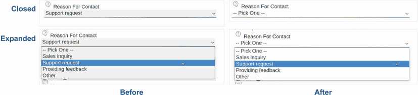

图 10.20 `select`元素样式化

虽然将下拉菜单选项更新为更好地匹配我们的主题会很不错，但这些菜单，就像单选输入和复选框一样，从操作系统本身那里获得了许多样式和功能。因此，我们只能通过 CSS 进行样式化，对于这个设计，这些更改就是我们能够做到的极限。我们可以使用 JavaScript 和 ARIA 来替换整个控件，但由于这本书是关于 CSS 的，我们将尽可能只用 CSS 进行样式化。

ARIA 是什么？

ARIA（代表可访问的丰富互联网应用程序）是一组可以添加到 HTML 元素中的角色和属性，可以补充有关元素使用、状态和功能的信息，否则这些信息对用户不可用。更多信息，请参阅[`www.w3.org/WAI/standards-guidelines/aria`](https://www.w3.org/WAI/standards-guidelines/aria/)。

注意：在创建自定义控件时，重要的是要关注浏览器自动提供的底层可访问性信息和功能，并确保我们正在重新创建这些功能以及控件的外观方面。当需要自定义控件时，库或框架可能会有所帮助，前提是库或框架是在考虑可访问性的情况下构建的。通常，了解的最佳地方是文档。

## 10.5 样式化标签和图例

为了样式化我们的标签和图例，我们将首先为标签和控制之间提供垂直边距以留出空间。我们还将使用 Flexbox 来对齐文本和图标、单选输入和复选框。最后，我们将减小它们的字体大小并更改它们的颜色。在这里最重要的是用户输入的值，而不是标签。通过减小它们的大小，我们降低了它们在视觉层次结构中的重要性。我们最终得到的代码如下所示。

列表 10.16 添加边距并更新字体大小

```
label, legend {
  display: flex;          ①
  align-items: center;    ①
  gap: .25rem;            ①
  margin: 0 0 .5rem 0;
  font-size: .875rem;
  color: var(--label-color);
}
```

① 对齐标签文本和图标

在我们的标签和图例样式化（图 10.21）之后，让我们将注意力转向占位符。

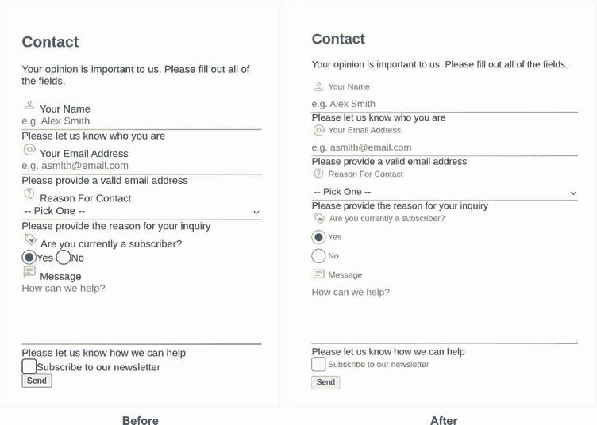

图 10.21 样式化的标签和图例

## 10.6 样式化占位文本

在我们的表单中，很难区分哪些字段是用户填写的，哪些是占位文本。正如我们为标签所做的那样，我们将降低占位文本的强调程度，使其更容易与用户响应区分开来。

标签和占位文本

我们的项目既有标签也有占位文本。尽管占位文本可以有助于指导用户，但它不能替代标签。实际上，网络内容可访问性指南（WCAG）的可访问性标准特别要求表单字段要有标签([`mng.bz/mVzW`](http://mng.bz/mVzW))。

用户在字段中输入值后，占位文本会消失。这种安排是有问题的，因为用户在输入值后没有参考说明的方法。

此外，标签对于辅助技术（如屏幕阅读器）是必需的，这些技术依赖于这些信息来向用户指示字段中预期的内容。

为了样式化我们的占位文本，我们将使用 `::placeholder` 伪元素。因为我们希望占位符以相同的方式样式化，无论元素类型如何，我们将编写一个规则，针对所有占位文本，无论元素类型如何。在这个新规则中，我们将减小占位文本的大小并使其颜色变浅，如下列所示。

列表 10.17 样式化占位文本

```
::placeholder {                      ①
  color: var(--placeholder-color);
  font-size: .75em;
}
```

① 针对任何占位文本，无论元素类型如何

图 10.22 显示了我们的更新字段。

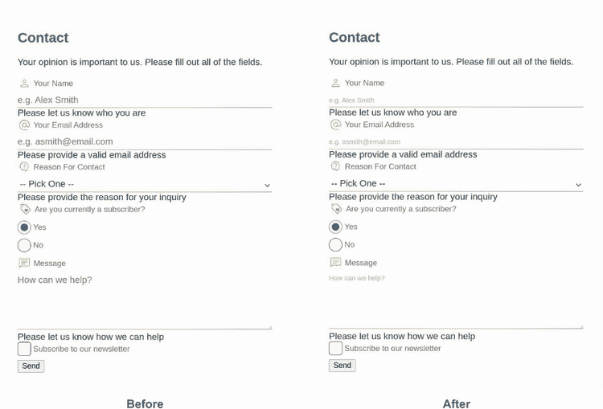

图 10.22 样式化的占位文本

接下来，让我们样式化表单底部的按钮。

## 10.7 样式化发送按钮

我们在表单底部有一个发送按钮。让我们让它更加突出，并使其与我们的表单匹配。我们将创建一个针对此按钮的规则。

接下来，我们将移除边框，使角落圆滑，并编辑文本和背景颜色。在图 10.23 的“之前”部分，按钮文本的大小小于我们的默认字体大小，因此我们也将其 `font-size` 改为 `1rem`。最后，我们设置了按钮的内边距。

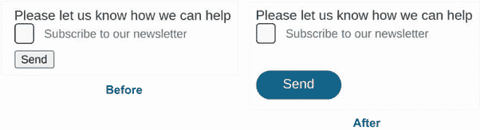

图 10.23 样式化的发送按钮

为了使我们的按钮更加突出，我们将将其与我们的其他字段稍微分开。按钮位于一个具有 `actions` 类的 `<div>` 中。我们将为此 `<div>` 设置 `2rem` 的上边距，这将使按钮从订阅复选框下移得更远。以下列表显示了我们的新规则，图 10.23 展示了我们的进度。

列表 10.18 重置按钮样式

```
button[type="submit"] {
  border: none;
  border-radius: 36px;
  background: var(--accent);
  color: var(--accent-contrast);
  font-size: 1rem;
  cursor: pointer;
  padding: .5rem 2rem;
}

.actions { margin-top: 2rem }
```

接下来，让我们样式化错误信息。

## 10.8 错误处理

在姓名、电子邮件和消息控件下方是错误信息。目前，它们未进行样式化，因此不容易识别为错误信息，或者将它们与描述的错误字段匹配。此外，我们希望在用户与控件交互之前不显示此错误信息。没有人希望在开始之前就看到一个错误信息大声呼喊。

我们将样式化错误信息，使其看起来像错误信息；然后我们将默认隐藏它们，仅在适当的时候显示。这项任务就是我们的 JavaScript 文件发挥作用的地方。

我们将通过设置 `--error` 自定义属性将文本颜色设置为红色，就像大多数网页上的错误信息一样。我们还将使文本加粗，并在错误前加上错误图标以清晰地呈现它；我们不想仅使用颜色来传达意义或意图。

注意颜色是区分内容类型的好方法。但我们应该始终与它一起使用其他元素——例如图标；文本；或大小、粗细或形状的改变——因为色盲的人可能无法区分颜色。此外，某些颜色在不同文化中不具有相同的意义。出于可访问性和清晰性的考虑，最佳实践是使用除了颜色之外的其他方式来传达信息。

因此，为了保持我们的错误图标一致，而不是在每个错误前添加它，我们将通过 CSS 以编程方式添加它，使用 `::before` 伪元素。为了调整图标的大小和位置，我们将使用两个相对单位：字符单位（`ch`），我们在第七章中使用过，它基于字体宽度；以及 `ex`，它相对于字体的 X 高度，即字体基线与平均线之间的距离（图 10.24）。我们使用这些特定的单位是因为它们不仅相对于字体大小，还相对于所使用的字体的特征。使用 `ch` 和 `ex` 单位有助于使图标与文本之间的尺寸和间距看起来像是所用字体的延伸。

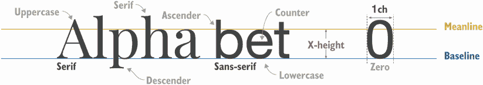

图 10.24 字体术语的视觉表示

我们还将为错误 `<div>` 添加一些边距，为输入字段留出一些空间。我们的错误样式规则如下所示。

列表 10.19 错误样式

```
.error {
  color: var(--error);         ①
  margin: .25rem 0 2rem;
}
.error span::before {
  content: url('./img/error.svg');
  display: inline-block;
  width: 1.25ex;               ②
  height: 1.25ex;              ②
  vertical-align: baseline;    ③
  margin-right: .5ch;
}
```

① 使文本变为红色

② 使图标为 1.25ex 高和 1.25ex 宽

③ 将图标与文本的基线对齐

注意，当我们将图标添加到文本之前时，我们将其添加到 `span` 中，而不是错误 `<div>` 本身，因为我们将在错误内部显示和隐藏 `span` 和整个错误 `<div>`。让我们更仔细地看看 HTML，以了解原因。

列表 10.20 展示了名称字段的完整控制，包括其标签和错误信息。请注意，错误 `<div>` 有一个 `id` 为 `nameError`，它被输入字段的 `aria-describedby` 属性引用。`aria-describedby` 属性告诉屏幕阅读器和辅助技术，它引用的元素包含与输入字段相关的额外信息。

如果我们通过使用 `display:none` 完全隐藏错误 `<div>`，则 `aria-describedby` 所指向的元素将不存在。因此，我们只隐藏内容（`span`），这样就不会破坏元素与其错误之间的编程连接。因为我们只隐藏 `span`，所以我们需要将图标应用到 `span` 上，这样我们就可以在隐藏错误信息时隐藏图标。

列表 10.20 名称字段 HTML

```
<label for="name">Your Name</label>
<input type="text" id="name" name="name" maxlength="250" required
    aria-describedby="nameError">      ①
<div class="error" id="nameError">     ②
  <span role="alert">
    Please let us know who you are
  </span>
</div>
```

① 指出哪个 <div> 提供了关于输入的额外信息（通过 id 引用）

② 由 aria-describedby 属性引用的 ID

图 10.25 展示了我们的样式化错误信息。

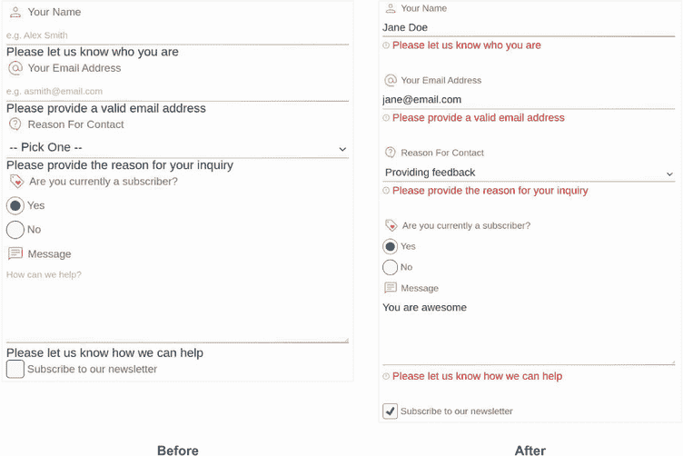

图 10.25 样式化错误信息

在我们格式化错误信息后，我们可以只在不适当的时候显示它们。在图 10.25 中，我们看到输入值是有效的，但错误信息仍然出现。为了仅在字段无效时显示错误信息，我们首先将错误信息默认隐藏。我们将`display`属性值设置为`none`应用于包含在错误`<div>`中的`span`元素；然后我们使用`:invalid`伪类有条件地显示它（仅当字段无效时）。

在这种情况下，字段的验证性是由我们设置在字段本身的属性决定的。让我们再次查看名称输入的 HTML：`<input type="text" id="name" name="name" maxlength="250" required aria-describedby="nameError">`。我们包含了`required`和`maxlength`属性；因此，如果字段中没有值或者值的长度超过 250 个字符，字段值将无效，并且`:invalid`伪类中的样式将被应用。

电子邮件元素（`<input type="email" id="email" name="email" maxlength="250" required aria-describedby="emailError">`）也有`maxlength`和`required`属性，所以在与名称字段相同的条件下它将是无效的。它还有一个`email`类型。在 HTML 中，一些字段类型有内置的验证，`email`就是其中之一。如果我们输入一个电子邮件地址值`"myEmail"`，它将是无效的。

使用`:invalid`伪类可以帮助我们在字段有效时防止错误显示，但它不能防止在用户尚未与字段交互时错误显示。我们可以使用`:user-invalid`伪类代替`:invalid`，这将触发一次，并且仅在用户与字段交互后，但在此写作时，只有 Mozilla Firefox 浏览器支持这个属性。因此，由于当前缺乏跨浏览器支持，我们转向使用 JavaScript。在未来，当`:user-invalid`属性得到更好的支持时，我们就不再需要使用 JavaScript 根据用户交互来显示/隐藏我们的错误信息。项目中包含的脚本监听 blur 事件，这发生在元素失去焦点时。当我们点击或切换到字段之外时，就会发生 blur 事件。我们的脚本监听这些事件，并给离开的字段添加一个`dirty`类，让我们知道哪些字段已被交互，哪些尚未。带有`dirty`类的字段已被交互；没有`dirty`类的字段尚未交互。

因为我们有这个“脏”类，结合`:invalid`伪类，我们只会在无效且用户已触摸的控件下方显示错误信息，从而防止我们在用户有机会填写表单之前显示错误信息。我们使用选择器`.dirty:invalid` `+` `.error` `span`。我们选择包含在具有`error`类的元素中的`span`，该元素紧接在一个既无效又具有`dirty`类的元素之后。

最后，当字段既无效又“脏”时，我们将字段的边框颜色更改为我们的错误颜色。因为我们使用边框图像创建渐变效果，所以需要移除它。以下列表显示了显示和隐藏错误信息的完整规则。

列表 10.21 错误处理 CSS

```
.error span { display: none; }          ①

.dirty:invalid + .error span {          ②
  display: inline;                      ②
}                                       ②

:is(input, textarea).dirty:invalid {    ③
  border-color: var(--error);           ③
  border-image: none;
}                                       ③
```

① 默认隐藏错误信息

② 当 HTML 中紧接其前的字段脏且无效时显示错误信息

③ 当输入和文本区域无效且脏时，更改其边框颜色为红色

图 10.26 显示了字段的三种可能状态：无效和脏，有效，以及无效但尚未触摸。

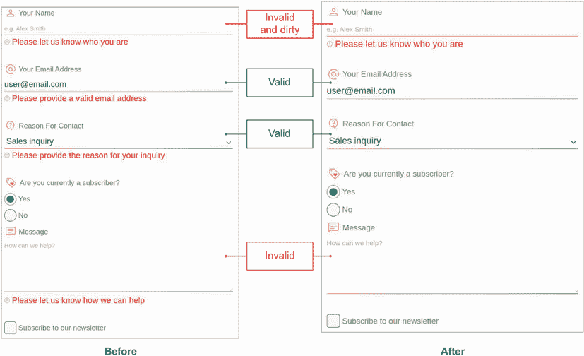

图 10.26 错误处理和字段状态

表面上，我们的表单似乎已经完成，但我们仍然需要添加一些收尾工作。

## 10.9 向表单元素添加悬停和焦点样式

因为我们希望我们的表单易于访问，所以我们需要确保包括悬停样式，并更新控件和按钮的默认焦点样式以匹配我们的主题。我们已经处理了单选按钮和复选框的悬停样式，但还没有处理焦点样式。对于其他元素，我们还没有考虑悬停和焦点状态。

让我们从焦点开始，因为我们仍然需要将焦点应用到我们表单上的所有元素。对于通过键盘而不是用鼠标点击元素来导航网页的用户来说，焦点很重要。它为用户提供了一个视觉指示器，显示哪个元素当前具有焦点。因此，如果我们不喜欢默认的焦点样式，可以重新设计它们，但不能移除它们。

### 10.9.1 使用 :focus 与 :focus-visible

由于无论用户如何导航网页，始终显示焦点样式可能会根据设计而显得过于繁重，CSS 规范最近增加了一个新属性，根据用户的交互模式（键盘或鼠标）应用焦点样式：`:focus-visible`伪类允许我们在用户使用键盘交互时添加样式，但不会在用户使用鼠标时应用它。相比之下，`:focus`始终应用，无论用户与元素的交互方式如何。

对于我们的文本和电子邮件输入字段、下拉菜单和文本区域，我们将移除默认轮廓并将边框颜色从渐变更改为纯色。因为（正如我们在本章前面提到的）我们不想仅依靠颜色来区分，所以我们将边框样式从实线更改为虚线，如列表 10.22 所示。我们还需要考虑当字段被污染且无效时（显示错误消息并带有红色边框）应该做什么。我们希望保持错误状态下字段之间的颜色区分，因此我们编写了第二个规则以保持红色边框颜色。

列表 10.22 当文本字段和下拉菜单获得焦点时的样式

```
:is(
  input:not([type="radio"], [type="checkbox"]),
  textarea,
  select
):focus-visible {
  outline: none;                                                ①
  border-bottom: dashed 1px var(--primary);
  border-image: none;                                           ②
}

:is(                                                            ③
  input:not([type="radio"], [type="checkbox"]).dirty:invalid,   ③
  textarea.dirty:invalid,                                       ③
  select.dirty:invalid                                          ③
):focus-visible {                                               ③
  border-color: var(--error);                                   ③
}                                                               ③
```

① 移除默认轮廓

② 移除渐变图像

③ 当字段已被交互且其值无效时保持边框颜色

图 10.27 展示了我们的更新字段在获得焦点时的样子。

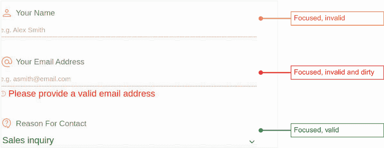

图 10.27 当文本字段和下拉菜单获得焦点时的样子

接下来，我们需要处理单选按钮和复选框的焦点状态。对于这些元素，我们将保持轮廓但编辑其外观。就像我们处理其他字段一样，我们将使用虚线和主要颜色。我们还将偏移轮廓以在边框和轮廓之间创建分隔，如列表 10.23 所示。

列表 10.23 当文本框和复选框获得焦点时的样式

```
:where(input[type="radio"],  [type="checkbox"]):focus-visible {
  outline: dashed 1px var(--primary);
  outline-offset: 2px;                   ①
}
```

① 将轮廓向外移动 2 像素，使其不紧挨着边框

图 10.28 展示了我们的单选按钮和复选框在获得焦点时的样子。

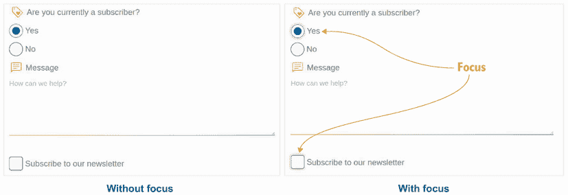

图 10.28 单选按钮和复选框的焦点样式

当焦点问题处理完毕后，让我们将注意力转向悬停。

### 10.9.2 添加悬停样式

用户输入文本的字段，例如类型为 `text` 和 `email` 的输入或 `<textarea>`，在悬停时已经将光标类型从默认更改为文本。图 10.29 展示了每种光标类型的外观。请注意，根据操作系统、浏览器和用户设置，光标可能看起来略有不同。

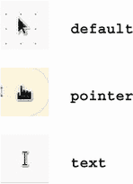

图 10.29 Chrome 中的光标

尽管我们的文本和电子邮件输入以及文本区域在悬停时已经有一些区分，但我们的下拉菜单没有。让我们将其光标更改为指针以强调该字段是可点击的，如以下列表所示。

列表 10.24 选择悬停样式

```
select:hover { cursor: pointer }
```

在处理了焦点和悬停之后，我们最后需要担心的是确保我们的样式对那些启用了 `forced-colors:` `active` 的用户也是有效的。

## 10.10 处理 forced-colors 模式

`forced-colors` 模式是一种高对比度设置，允许用户将调色板限制为他们在其设备上设置的系列颜色。Windows 的高对比度模式是这种用例的一个例子。当此模式启用时，它会影响许多 CSS 属性，包括我们在本项目中使用的一些属性，最值得注意的是 `background-color`。我们使用 `background-color` 来确定 `radio` 和 `checkbox` 输入的内侧部分在选中与未选中元素时是否可见。我们还用它来重新设计 `select` 控件的箭头。

在 Chrome 中，我们可以使用 DevTools 来模拟在我们的机器上启用 `forced-colors` 模式，而无需编辑我们的计算机设置。在我们的 DevTools 控制台中，选择渲染选项卡。如果它尚未显示，我们可以点击省略号按钮以显示可能的选项卡并从下拉菜单中选择它。在选项卡上，我们寻找 `forced-colors` 模拟下拉菜单并将其设置为 `forced-colors:` `active`。此设置更新页面样式，使其看起来就像我们在机器上设置了 `forced-colors` 为 `active`。图 10.30 显示了启用模拟的 Chrome DevTools 设置。（注意：除了 Chrome 之外的其他浏览器可能没有此功能，或者启用它的技术可能不同。）

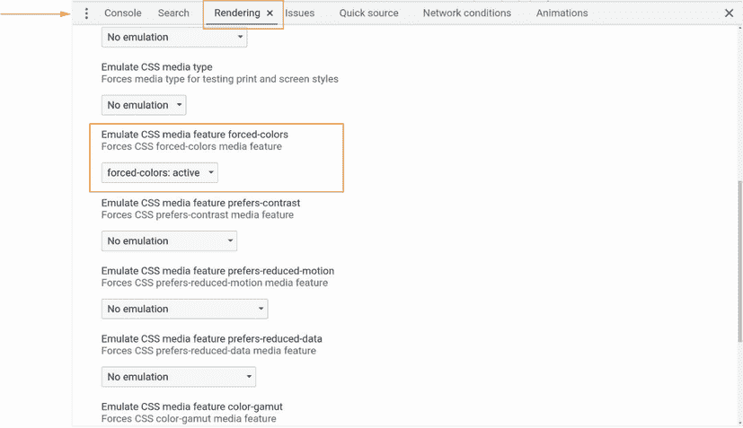

图 10.30 Chrome DevTools 中的 `forced-colors:active` 模拟设置

当应用模拟时，我们的页面样式会改变（图 10.31）。我们无法判断哪个单选按钮被选中或复选框是否被勾选。这个例子说明了使用不仅仅是颜色来区分意义的重要性，因为我们的错误信息不再为红色。

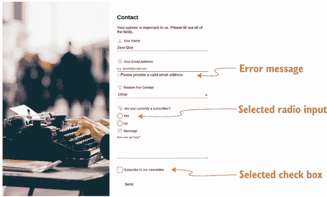

图 10.31 模拟的 `forced-colors:` `active`

我们不会尝试在这个模式下恢复我们的颜色，因为我们想尊重用户的设置。但我们需要确保选中的输入与未选中的输入可区分。

要创建仅当用户将 `forced-colors` 设置为 `active` 时才应用的规则，我们将使用媒体查询 `@media` `(forced-colors:` `active`) `{}`。在媒体查询内创建的规则将仅在用户启用了 `forced-colors` 时生效。

我们复选框和单选按钮不再可见的原因是系统定义的背景颜色（在这种情况下，为白色）正在应用于它们。因此，我们将更改我们的背景以使用系统颜色而不是我们的强调颜色。CSS 颜色模块第 4 级规范（[`mng.bz/o1Vy`](http://mng.bz/o1Vy)）列出了我们可用的颜色。我们将使用 `CanvasText`，这意味着我们将应用的颜色将与用于文本的颜色相同。以下列表显示了我们的完整媒体查询。

列表 10.25 `forced-colors:` `active` 媒体查询

```
@media (forced-colors: active) {
  :where(input[type="radio"], input[type="checkbox"]):checked::before {
    background-color: CanvasText;
  }
}
```

图 10.32 显示了应用媒体查询后的 `forced-colors` 模式下的我们的页面，修复了为我们的用户创建问题的样式。

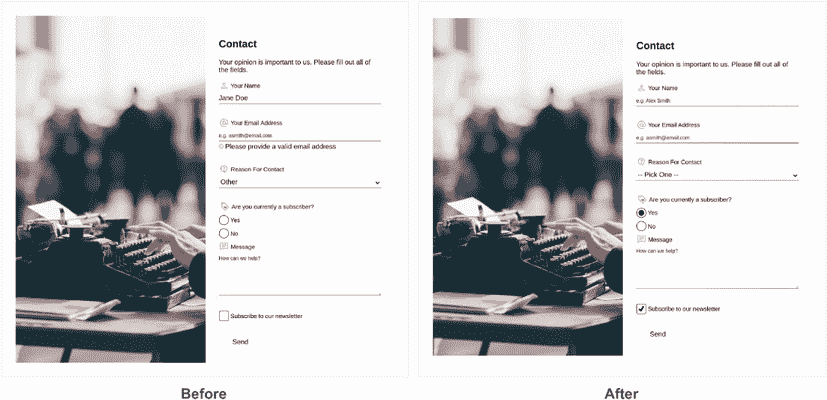

图 10.32 `forced-colors:` `active`样式固定

当我们关闭模拟时，之前设置的样式保持不变；它们不受媒体查询内设置的样式的影响（图 10.33）。

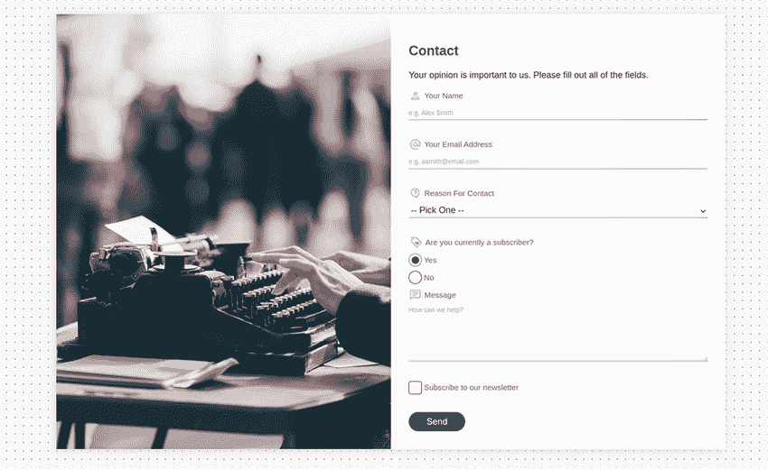

图 10.33 完成产品

完成这个最后的任务后，我们已经完成了表单的样式设计。

## 摘要

+   与操作系统紧密耦合的功能表单控件，如下拉菜单，比那些缺乏这种耦合的控件更难样式化。

+   我们可以通过使用渐变来创建形状。

+   通过使用`em`，我们可以根据文本大小调整元素的大小。

+   当无法以其他方式继承`font-color`时，我们可以使用关键字值`currentcolor`。

+   `:where()`和`:is()`伪类的工作方式类似，但具有不同的特定性级别。

+   `:checked`伪类允许我们在元素被选中时定位表单元素。

+   `:invalid`伪类可以在字段无效时有条件地格式化字段。

+   字段值的有效性由在 HTML 中设置的字段属性决定。

+   `:focus`样式对于使我们的设计可访问是必要的。

+   我们可以使用`:focus-visible`使焦点样式仅对键盘用户显示。

+   在某些浏览器中，我们可以强制浏览器应用悬停和焦点样式。

+   仅使用颜色来传达意义是不够的，正如本项目中的错误信息所展示的那样。

+   `forced-colors`模式改变了某些属性的行为以及我们可以应用于用户界面的颜色。

+   当`forced-colors`设置为`active`时，可以使用媒体查询有条件地应用样式。

+   在某些浏览器中，我们可以模拟`forced-colors`模式来检查我们的设计。

* * *

¹  《架构 CSS：程序员的样式表指南》，作者：Martine Dowden 和 Michael Dowden（2020 年，Apress 出版社）。
