# 11 动画社交媒体分享链接

本章涵盖

+   使用 OOCSS、SMACSS 和 BEM 架构模式

+   在使用组件时范围化 CSS

+   与社交媒体图标一起工作

+   创建 CSS 过渡效果

+   使用 JavaScript 克服 CSS 限制

互联网被创建的核心原因之一是为了分享和分发信息。我们今天做这件事的一种方式是通过社交媒体。在本章中，我们将样式化和动画化一些可以用于通过电子邮件或社交媒体分享网页的链接。

与前几章一样，我们将在这个项目中使用 HTML 和 CSS，而不使用任何框架。我们选择这种方法是为了专注于 CSS 本身，而不必处理使用外部包的复杂性和复杂性。但许多实际应用确实使用了框架，其中一些包括组件的概念。

将一个功能部分转换为组件的常见原因是为了在应用程序的多个地方重用代码或元素。随着可重用性的出现，可能会出现命名冲突。一些系统自动限制组件 CSS 的范围，防止任何可能的冲突。但许多系统不限制范围，将其留给开发者组织代码以防止在为新组件样式化时更改另一个组件的样式。

无论框架如何处理（或未处理）CSS 范围，我们都有各种架构选项来帮助我们组织和标准化我们的样式。在我们深入本章的项目之前，让我们快速了解一下一些 CSS 架构选项。

## 11.1 与 CSS 架构一起工作

最受欢迎的 CSS 架构方法之一是 OOCSS、SMACSS 和 BEM。我们将在本章中使用 BEM，但我们将查看所有三个选项，以便我们了解它们之间的高层次差异。

### 11.1.1 OOCSS

由 Nicolle Sullivan 在丹佛的 Web Directions North 介绍，OOCSS（面向对象 CSS；[`github.com/stubbornella/oocss/wiki`](https://github.com/stubbornella/oocss/wiki)）旨在帮助开发者创建快速、可维护和基于标准的 CSS。Sullivan 将 OOCSS 的*对象*部分描述为“一个重复的视觉模式，可以抽象成一个独立的 HTML、CSS 和可能的 JavaScript 片段。该对象可以在整个网站上重复使用”——换句话说，这就是我们今天可能认为的组件或小工具。为了实现这种可重用性，OOCSS 遵循两个主要原则：

+   *分离结构和皮肤*——将视觉特性（背景、边框等，有时被称为主题）保留在其自己的类中，这些类可以与对象混合匹配以创建各种元素。

+   *分离容器和内容*——通过避免使用位置依赖的样式，我们可以确保对象无论在应用程序或网站上的哪个位置看起来都一样。

### 11.1.2 SMACSS

由 Jonathan Snook 开发，SMACSS（CSS 的可伸缩和模块化架构；[`smacss.com`](http://smacss.com)）将 CSS 规则组织为五个类别：

+   *基础*—使用元素、后代或子选择器和伪类应用默认值

+   *布局*—用于在页面上布局元素，例如标题、文章和页脚

+   *模块*—布局的更多离散部分，例如轮播图、卡片和导航栏

+   *状态*—增强或覆盖其他样式的东西，例如错误状态或菜单的状态（打开或关闭）

+   *主题*—定义外观和感觉；如果它是页面或项目的唯一主题，则不需要将其分开成自己的类

### 11.1.3 BEM

由名为 Yandex 的公司开发，BEM（块、元素、修饰符；[`en.bem.info/methodology`](https://en.bem.info/methodology)）是一种基于组件的架构，旨在将用户界面分解为独立的、可重用的块：

+   *块*

    +   描述块的目的。

    +   例如，一个元素的类名，如`header`。

+   *元素*

    +   描述元素的目的。

    +   类名是块名后跟两个下划线和元素，例如`header__text`。

+   *修饰符*

    +   描述外观、状态和行为。

    +   类模式为`block-name_modifier-name`（例如：`header_mobile`）或`block-name__element-name_modifier-name`（例如：`header__menu_open`）。

选择 CSS 的架构方法是团队依赖的任务。项目的需求、团队的大小和经验，以及正在使用的库和框架都是需要考虑的因素。没有一种适合所有情况的解决方案，因此决策需要由团队做出。由于 BEM 的基于组件的特性，我们将在此章节中使用它来定义和样式化我们的社交媒体分享链接。

## 11.2 设置

现在我们已经选择了我们的方法论，它决定了我们将为项目使用的命名约定，让我们看看我们将要构建的内容。我们将样式化一个分享按钮，当点击时，会打开一组链接，允许用户通过电子邮件或 Facebook、LinkedIn 或 Twitter 分享页面。然后我们将使用过渡来动画化打开和关闭分享选项以及单个链接的悬停/聚焦效果。图 11.1 显示了我们的目标。

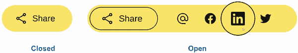

图 11.1 目标

我们起始的 HTML（列表 11.1）包括我们的组件容器、一个分享按钮和一个允许用户选择如何分享页面的菜单。代码包括一个链接的 JavaScript 文件，这使得我们的组件可以通过键盘导航使用，并在点击分享按钮时触发显示/隐藏组件内的链接。正如我们将在 11.6 节中看到的，仅使用 CSS 对元素进行动画有一些限制，因此我们将依赖几行 JavaScript 来支持我们的 CSS。我们将在本章的后面部分（也在 11.6 节中）更详细地了解 JavaScript；首先，我们将专注于我们的 HTML 和 CSS。

列表 11.1 起始 HTML

```
  <main>
    <div class="share" id="share">                                      ①

      <button id="shareButton"                                          ②
        class="share__button"                                           ②
        type="button"                                                   ②
        aria-controls="mediaList"                                       ②
        aria-expanded="false"                                           ②
        aria-haspopup="listbox">                                        ②
             ②
          Share                                                         ②
      </button>                                                         ②

      <menu aria-labelledby="share"                                     ③
            role="menu"                                                 ③
            id="mediaList"                                              ③
            class="share__menu">                                        ③

        <li role="menuitem" class="share__menu-item">                   ④
          <a href="mailto:?subject=Tiny%20..."                          ⑤
            target="_blank"                                             ⑤
            rel="nofollow noopener"                                     ⑤
            tabindex="-1"                                               ⑤
            class="share__link"                                         ⑤
          >
                                ⑥
          </a>
        </li>
        <li role="menuitem" class="share__menu-item">   
          <a href="https://www.facebook.com/sh..."                      ⑦
            target="_blank"                                             ⑦
            rel="nofollow noopener"                                     ⑦
            tabindex="-1"                                               ⑦
            class="share__link"                                         ⑦
          >                                                             ⑦
                             ⑦
          </a>                                                          ⑦
        </li>
        ...
       </menu>
    </div>
  </main>

  <script src="./scripts.js"></script>                                  ⑧
```

① 组件容器

② 分享按钮以打开和关闭社交媒体链接列表

③ 媒体菜单

④ 菜单项

⑤ 首个链接是一个通过电子邮件分享而不是社交媒体的 mailto 链接。

⑥ 媒体图标

⑦ 通过社交媒体分享的链接

⑧ 用于键盘交互和补充 CSS 的脚本

我们还应用了一些基本的起始 CSS 到 `main` 元素上，以便将组件从屏幕边缘移开：`main` `{` `margin:` `48px;` `}`.

您可以在 GitHub 上找到所有起始代码（HTML、CSS 和 JavaScript），网址为 [`mng.bz/KeR4`](http://mng.bz/KeR4) 或 CodePen，网址为 [`codepen.io/michaelgearon/pen/YzZzpWj`](https://codepen.io/michaelgearon/pen/YzZzpWj)。我们的起点看起来像图 11.2。

![11-02.png]

图 11.2 起点

正如您所看到的，图标已经提供，但让我们讨论我们是从哪里以及如何获得它们的。

## 11.3 图标来源

每次我们使用他人品牌的图标时，我们需要回答以下问题：

+   我们是否有权使用该图标？

+   图标的用途是否有任何限制？

当我们使用社交媒体图标时，这些品牌在我们的作品中被代表，因此我们必须遵循他们关于何时、如何以及在何种情境下可以使用品牌的指南。当我们使用不代表品牌的图标（例如我们用于 `mailto` 链接和分享按钮的图标）时，除非我们亲自创建了该图标，否则我们将受到版权法的约束，就像我们会对我们项目中使用的任何其他媒体（图像、声音、视频等）一样。

备注：我们不是律师，我们无意在本章中提供法律建议。如有疑问，请联系法律专业人士。

### 11.3.1 媒体图标

找到品牌图标如何使用的一个有效方法是，通过在网络上搜索诸如 *风格指南* 和 *品牌指南* 等术语来查找该品牌的指南。许多社交媒体平台都有关于如何代表品牌的特定说明，包括图标和标志的下载。表 11.1 列出了我们组件中包含的社交媒体平台及其品牌信息链接。对于这个项目，我们直接从相应的品牌指南中获取了社交媒体图标。

表 11.1 社交媒体品牌资源

| 品牌 | 图标 | 资产链接 |
| --- | --- | --- |
| Facebook |  | [`mng.bz/9Dza`](http://mng.bz/9Dza) |
| 领英 |  | [`brand.linkedin.com/downloads`](https://brand.linkedin.com/downloads) |
| Twitter |  | [`mng.bz/jPry`](http://mng.bz/jPry) |

### 11.3.2 图标库

寻找图标可能有点繁琐，尤其是在大型项目中，因此使用图标字体和库是常见的做法，这些库也受使用条款的约束。每个库和图标字体都有自己的规则，关于图标可以在哪里以及如何使用。一些还要求署名。因此，我们必须在寻找图标时意识到我们需要遵循的任何规则。

对于这个项目，我们从 Material Symbols ([`fonts.google.com/icons`](https://fonts.google.com/icons)) 获取了非品牌相关的图标。因为我们只需要两个——分享  和电子邮件 @——所以我们下载了单个 SVG 并将它们包含在我们的图标文件夹中，而不是将整个库导入到项目中。图标已包含在启动代码中，因此我们准备好开始样式化。

## 11.4 样式化块

由于我们使用 BEM 作为命名约定，我们的块名称将是 `"share"`。因此，包裹整个组件的 `<div>` 容器将具有 `share` 类。这个块名称将包含在所有未来使用 BEM 命名约定的类中（第 11.1.3 节），这使我们的 CSS 作用域限于该组件，并有助于防止我们的组件与应用程序中可能使用的任何其他部分的样式冲突。

如列表 11.2 所示，我们为块定义了 `font-family`、`background` 和 `border-radius`。我们还给组件一个 `display` 值为 `inline-flex`。`inline-flex` 与 `flex` 的工作方式相同，但使元素成为内联级元素而不是块级元素。通过使我们的组件表现得像内联元素（与链接、span、按钮等相同），我们在应用程序中的放置方面提供了最大的灵活性。此外，按钮默认是内联元素，当关闭时，呈现的实际上是按钮，因此我们将我们的组件赋予与按钮相同的流程行为。

注意：要了解 Flexbox 的工作原理以及其相关属性，请查看第六章。

列表 11.2 样式化容器

```
.share {
  font-family: Verdana, Geneva, Tahoma, sans-serif;
  background: #ffe46a;        ①
  border-radius: 36px;
  display: inline-flex;
}
```

① 黄色

块样式化后（图 11.3），让我们解决块内的单个元素。

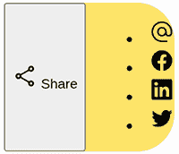

图 11.3 样式化容器块

## 11.5 样式化元素

我们的块有三个后代元素，我们希望对它们进行样式化：

+   分享按钮

+   包含链接列表的菜单

+   菜单内的单个链接

让我们从分享按钮开始，并按列表顺序进行。

### 11.5.1 分享按钮

分配给按钮的类名将包括块名称，后跟两个下划线，然后是元素。在我们的例子中，我们将这个元素称为 `button`，因此我们的类名将是 `share__button`。通过在类名前缀加上 `share__`，我们确保我们将会样式的按钮仅是我们块内的那个。

我们想要覆盖浏览器提供的默认值，并在按钮内对齐图标和文本（列表 11.3）。我们移除了背景和边框，调整了字体大小和填充，并使角落呈曲线。

为了对齐图标和文本，我们给按钮一个 `display` 值为 `flex`，然后使用 `align-items` 来垂直对齐图标和文本。为了在图标和文本之间添加空白，我们使用 `gap` 属性。

列表 11.3 样式化分享按钮

```
.share__button {
  background: none;
  border: none;
  font-size: 1rem;
  padding: 0 2rem 0 1.5rem;
  border-radius: 36px;
  display: flex;
  align-items: center;
  gap: 1ch;
}
```

图 11.4 展示了我们的输出。

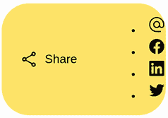

图 11.4 样式化分享按钮

接下来，让我们处理悬停和聚焦样式。我们使用 `:hover` 和 `:focus-visible` 伪类来有条件地更改光标样式，并为按钮添加黑色轮廓。然后我们将轮廓偏移 `-5px`，这样轮廓就会放置在按钮内部 5 像素处，而不是外部边缘。

`outline-offset` 属性允许我们控制轮廓的位置。正数将轮廓移得更远或远离元素；负数将轮廓内嵌。以下列表显示了我们的悬停和聚焦 CSS。

列表 11.4 分享按钮悬停和聚焦 CSS

```
.share__button:hover,
.share__button:focus-visible {
  cursor: pointer;
  outline: solid 1px black;
  outline-offset: -5px;
}
```

图 11.5 展示了鼠标悬停在按钮上的情况。

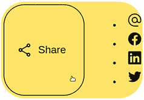

图 11.5 分享按钮悬停

### 11.5.2 分享菜单

为了样式化菜单及其项，我们想要移除项目符号，并将元素放置在分享按钮旁边的一行中。为了移除项目符号，我们给列表项一个 `list-style` 值为 `none`。然后我们给菜单一个 `display` 属性值为 `flex`。最后，我们移除了浏览器自动应用到菜单项上的默认边距和填充。以下列表显示了我们的 CSS。

列表 11.5 分享菜单和菜单项

```
.share__menu-item { list-style: none; }

.share__menu {
  display: flex;
  margin: 0;
  padding: 0;
}
```

当我们查看输出（图 11.6）时，我们注意到我们需要在容器边缘和元素之间留出一些空间。我们将在样式化单个链接时处理这个任务。


图 11.6 样式化菜单

### 11.5.3 分享链接

为了确保链接在悬停时有一个圆形边框（而不是椭圆形），我们将它们的 `height` 和 `width` 都设置为 48 像素。接下来，我们弯曲它们的角落。这一步也解决了我们的间距问题，因为我们看到在列表 11.6 中，我们已将图标 `height` 和 `width` 设置为 `24`。因为我们使链接在高度和宽度上都是 48 像素，所以当链接居中时，我们将在每个图标和其链接的边缘之间有 12 像素的空白。

列表 11.6 列表项 HTML

```
<li role="menuitem" class="share__menu-item">
  <a href="https:/ /www.facebook.com/sha..."
    target="_blank"
    rel="nofollow noopener"
    tabindex="-1"
    class="share__link"
  >
    
  </a>
</li>
```

我们还给了链接一个透明的边框。边框会占用空间，因此为了防止在悬停或聚焦时内容移动，我们默认添加一个透明的边框，然后在需要显示时上色。这种方法确保了边框所需的空间被分配，并在边框显示时防止元素后面的内容移动。

为了在圆圈中间居中图标，我们使用 `flex`，使内容居中并使项目对齐。我们的 CSS 如下所示。

列表 11.7 链接样式

```
.share__link:link,
.share__link:visited {
  height: 48px;
  width: 48px;
  border-radius: 50%;
  display: flex;
  align-items: center;
  justify-content: center;
  border: solid 1px transparent;
}
```

在我们的链接样式化（图 11.7）后，我们可以为悬停和聚焦状态样式化链接。


图 11.7 样式化分享链接

### 11.5.4 scale()

在悬停和聚焦时，我们将通过将颜色从透明变为黑色来显示边框。当我们设置链接的边框时，我们使用了`border`简写属性，它允许我们在一个声明中定义样式、边框宽度和边框颜色。因为我们只改变颜色，所以我们将使用`border-color`而不是`border`简写。通过使用`border-color`，我们可以编辑边框的颜色，而不用担心其他已经定义的属性。

接下来，我们将使用`scale()`函数来增加图标的大小，使其看起来像是被放大了。在第二章中，当我们扩展加载条时，我们使用了`scaleY()`来垂直增长和缩小条。在这个项目中，我们希望链接按比例增长，所以我们将使用`scale()`。当传递单个参数时，这个函数会按相同比例水平垂直地增长元素。

`scale()`函数是`scaleX()`和`scaleY()`的组合简写。如果只传递一个值，`scale()`的量将同时应用于垂直和水平。如果传递两个参数，第一个参数定义水平缩放，第二个定义垂直缩放。

在悬停或聚焦时，我们希望链接的大小比未交互时大 25%，所以我们将函数的单个参数设置为`1.25`并应用于`transform`属性。我们的 CSS 看起来如下所示。

列表 11.8 悬停和聚焦时链接的样式

```
.share__link:hover,
.share__link:focus-visible {
  border-color: black;
  outline: none;
  transform: scale(1.25);
}
```

应用了样式后，我们的链接在悬停时增长（如图 11.8 所示），但由于现在链接比容器高，链接的上下间隙没有黄色背景。

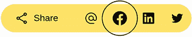

图 11.8 链接悬停效果

为了创建我们的放大效果，我们希望整个链接保持黄色。我们可以给链接添加一个黄色背景，这样就能完成这个任务，但背景需要是黄色，因为块的背景颜色是黄色。如果我们改变了容器的背景颜色，我们希望链接的背景颜色也改变。为了确保颜色保持同步，我们可以使用自定义属性（CSS 变量）或使元素从其父级继承颜色。

### 11.5.5 继承属性值

默认情况下，`background-color`属性不会继承。我们希望明确指示链接继承背景颜色。为此，我们可以将链接的`background-color`属性值设置为`inherit`。然而，继承只到父级。在我们的例子中，控制背景颜色的元素是链接的曾祖父母，如图 11.9 所示。

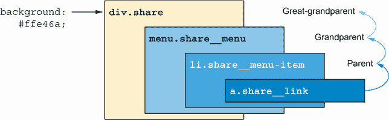

图 11.9 媒体链接的祖先

我们需要让 `link`、`menu` 和 `menu-item` 规则继承 `background-color`，以便它能够传递到链接上。在我们给所有三个元素赋予 `background-color` 值为 `inherit`（图 11.10）之后，我们注意到，尽管我们修复了悬停链接中的间隙，但我们却失去了组件右侧的曲线。

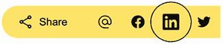

图 11.10 继承的 `background-color`

我们失去了曲线，因为和 `background-color` 一样，`border-radius` 也不会被继承。为了解决这个问题，我们应用了与 `background-color` 相同的逻辑。列表 11.9 展示了我们的编辑后的 CSS。注意，链接的 `border-radius` 没有被编辑。我们希望保持链接的形状为圆形，所以我们在链接上保留了 `border-radius:` `50%` 声明。

列表 11.9 继承属性值

```
.share__menu-item {
  list-style: none;
  background: inherit;
  border-radius: inherit;
}

.share__menu {
  display: flex;      ①
  margin: 0;
  padding: 0;
  background: inherit;
  border-radius: inherit;
}

.share__link:hover,
.share__link:focus-visible {
  border-color: black;
  outline: none;
  transform: scale(1.25);
  background: inherit;
}
```

① 使链接成为圆形

虽然以这种方式继承值可能有点繁琐，但它确保了颜色可以从一个地方控制。如果我们决定更改背景的颜色，这种方法有利于维护性。它还为我们扩展组件以支持多个主题奠定了基础。另一个选择是使用自定义属性来设置颜色。

在 `border-radius` 和 `background-color` 继承之后，我们的悬停和焦点样式就完成了（图 11.11），但当我们悬停在链接上时，变化是突然的。让我们动画化大小变化。

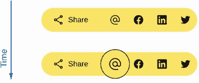

图 11.11 分享链接悬停效果

## 11.6 动画化组件

在第二章中，我们使用关键帧创建动画，这允许我们定义动画的步骤。对于我们的悬停状态，我们已经定义了起始和结束状态。我们正在从一种状态（未悬停或聚焦）过渡到另一种状态（悬停或聚焦），其样式已经在规则中定义。因此，我们不是使用动画，而是使用过渡。

### 11.6.1 创建过渡

过渡不需要关键帧，但仍允许我们动画化从一种状态到另一种状态的样式变化。`transition` 属性允许我们定义哪些属性变化应该被动画化，以及持续时间和时间函数。通过将 `transition:` `transform` `ease-in-out` `250ms;` 添加到我们的 `.share__link` 规则中，我们告诉浏览器动画化链接的大小变化（列表 11.10）。

为了选择过渡需要的时间长度，我们选择相对较快的：250 毫秒。我们希望动画足够慢以可见，但足够快以迅速。如果我们使过渡太慢，我们的项目看起来会滞后，并使用户从他们试图完成的任务（分享内容）中分心。

列表 11.10 链接大小变化的过渡

```
.share__link:link,
.share__link:visited {
  text-decoration: none;
  display: flex;
  flex-direction: column;
  align-items: center;
  justify-content: center;
  height: 48px;
  width: 48px;
  border-radius: 50%;
  border: solid 1px transparent;
  transition: transform ease-in-out 250ms;
}
```

注意：您可能会注意到在添加过渡后，悬停时轮廓被截断。原因是 JavaScript 驱动组件的打开和关闭，并切换溢出和可见性。我们将在 11.6.2 节中详细介绍 JavaScript 正在做什么。点击分享按钮会切换这种行为。

在我们的过渡中，我们特别告诉浏览器要动画化 `transform` 属性上发生的更改，但在我们的 `.share__ link:link,` `.share__link:visited` 规则中我们没有 `transform` 属性。然而，当我们运行代码时，我们注意到我们的尺寸变化是动画化的，并且代码是有效的。这种行为发生是因为，当未定义时，`scale()` 默认等于 `scale(1)`。因此，当我们将鼠标悬停或聚焦到链接上时，我们正在从 `scale(1)` 动画到 `scale(1.25)`，然后当我们从链接移开时，我们再次将缩放动画回 `scale(1)`。

接下来，我们将动画化当按钮被点击时隐藏和显示链接。

### 11.6.2 打开和关闭组件

记住，我们的目标是使组件默认隐藏我们的链接菜单，并且仅在点击分享按钮时显示（图 11.12）。

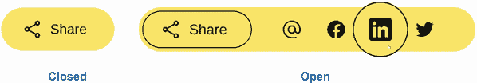

图 11.12 关闭和展开状态

我们需要做的第一件事是默认隐藏菜单项。为了完成这个任务，我们将给 `menu` 设置 `width` 为 `0` 并隐藏 `overflow`，如列表 11.11 所示。

列表 11.11 隐藏菜单

```
.share__menu {
  display: flex;
  margin: 0;
  padding: 0;
  background: inherit;
  border-radius: inherit;
  width: 0;                   ①
  overflow: hidden;           ②
}
```

① 将菜单的宽度设置为 0

② 隐藏溢出，以便链接内部也被隐藏

在我们的菜单隐藏（图 11.13）后，我们需要在点击分享按钮时切换显示和隐藏菜单。

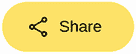

图 11.13 隐藏菜单

我们的 JavaScript 为我们处理了部分行为。在本章开头，我们提到我们需要为这个项目编写一些 JavaScript。当我们打开 JavaScript 文件时，我们注意到它包含大量的代码（列表 11.12）。

列表 11.12 JavaScript 文件

```
(() => {
  'use strict';

  let expanded = false;
  const container = document.getElementById('share');
  const shareButton = document.getElementById('shareButton');
  const menuItems = Array.from(container.querySelectorAll('li'));
  const menu = container.querySelector('menu');

  addButtonListeners();
  addListListeners();
  addTransitionListeners();

  function addButtonListeners() {                                          ①
    shareButton.addEventListener('click', toggleMenu);                     ①
    shareButton.addEventListener('keyup', handleToggleButtonKeypress);     ①
  }                                                                        ①
  function addListListeners() {                                            ②
    menuItems.forEach(li => {                                              ②
        const link = li.querySelector('a');                                ②
        link.addEventListener('keyup', handleMenuItemKeypress);            ②
        link.addEventListener('keydown', handleTab);                       ②
        link.addEventListener('click', toggleMenu);                        ②
      })                                                                   ②
  }                                                                        ②

  function addTransitionListeners() {                                      ③
    menu.addEventListener('transitionstart', handleAnimationStart);        ③
    menu.addEventListener('transitionend', handleAnimationEnd);            ③
  }                                                                        ③

  function handleToggleButtonKeypress(event) {                             ④
    switch(event.key) {                                                    ④
      case 'ArrowDown':                                                    ④
      case 'ArrowRight':                                                   ④
        if (!expanded) { toggleMenu(); }                                   ④
        moveToNext();                                                      ④
        break;                                                             ④
      case 'ArrowUp':                                                      ④
      case 'ArrowLeft':                                                    ④
        if (expanded) { toggleMenu(); }                                    ④
        break;                                                             ④
    }                                                                      ④
  }                                                                        ④

  function handleMenuItemKeypress(event) {                                 ⑤
    switch(event.key) {                                                    ⑤
      case 'ArrowDown':                                                    ⑤
      case 'ArrowRight':                                                   ⑤
        moveToNext();                                                      ⑤
        break;                                                             ⑤
      case 'ArrowUp':                                                      ⑤
      case 'ArrowLeft':                                                    ⑤
        if (event.altKey === true) {                                       ⑤
          navigate(event);                                                 ⑤
          toggleMenu();                                                    ⑤
        } else {                                                           ⑤
          moveToPrevious();                                                ⑤
        }                                                                  ⑤
        break;                                                             ⑤
      case 'Enter':                                                        ⑤
        toggleMenu();                                                      ⑤
        break;                                                             ⑤
      case ' ':                                                            ⑤
        navigate(event);                                                   ⑤
        toggleMenu();                                                      ⑤
        break;                                                             ⑤
      case 'Tab':                                                          ⑤
        event.preventDefault();                                            ⑤
        toggleMenu();                                                      ⑤
        break;                                                             ⑤
      case 'Escape':                                                       ⑤
        toggleMenu();                                                      ⑤
        break;                                                             ⑤
      case 'Home':                                                         ⑤
        moveToNext(0);                                                     ⑤
        break;                                                             ⑤
      case 'End':                                                          ⑤
        moveToNext(menuItems.length - 1);                                  ⑤
        break;                                                             ⑤
    }                                                                      ⑤
  }                                                                        ⑤

  function handleTab(event) {                                              ⑥
    if (event.key !== 'Tab') { return; }                                   ⑥
    event.preventDefault();                                                ⑥
  }                                                                        ⑥

  function toggleMenu(event) {                                             ⑦
    expanded = !expanded;                                                  ⑦
    shareButton.ariaExpanded = expanded;                                   ⑦
    container.classList.toggle('share_expanded');                          ⑦
    if (expanded) {                                                        ⑦
      menuItems.forEach(li => li.removeAttribute('tabindex'));             ⑦
    }                                                                      ⑦
    if (!expanded) {                                                       ⑦
      menuItems.forEach(li => {                                            ⑦
        li.removeAttribute('data-current');                                ⑦
        li.tabIndex = -1;                                                  ⑦
      })                                                                   ⑦
      shareButton.focus();                                                 ⑦
    }                                                                      ⑦
  }                                                                        ⑦

  function moveToNext(next = undefined) {                                  ⑧
    const selectedIndex = menuItems.findIndex(                             ⑧
      li => li.dataset.current  === 'true'                                 ⑧
    );                                                                     ⑧
    let newIndex                                                           ⑧
    if (next) {                                                            ⑧
      newIndex = next;                                                     ⑧
    } else if (                                                            ⑧
      selectedIndex === -1 || selectedIndex ===  menuItems.length - 1) {   ⑧
      newIndex = 0;                                                        ⑧
    } else {                                                               ⑧
      newIndex = selectedIndex + 1;                                        ⑧
    }                                                                      ⑧

    if (selectedIndex !== -1) {                                            ⑧
      menuItems[selectedIndex].removeAttribute('data-current');            ⑧
    }                                                                      ⑧
    menuItems[newIndex].setAttribute('data-current', 'true');              ⑧
    menuItems[newIndex].querySelector('a').focus();                        ⑧
  }                                                                        ⑧

  function moveToPrevious() {                                              ⑨
    const selectedIndex = menuItems.findIndex(li => li.dataset.current);   ⑨
    const newIndex = selectedIndex < 1                                     ⑨
      ? menuItems.length – 1                                               ⑨
      : selectedIndex - 1;                                                 ⑨
    if (selectedIndex !== -1) {                                            ⑨
      menuItems[selectedIndex].removeAttribute('data-current');            ⑨
    }                                                                      ⑨
    menuItems[newIndex].setAttribute('data-current', 'true');              ⑨
    menuItems[newIndex].querySelector('a').focus();                        ⑨
  }                                                                        ⑨

  function navigate(event) {                                               ⑩
    const url = event.target.href;                                         ⑩
    window.open(url);                                                      ⑩
  }                                                                        ⑩

  function handleAnimationStart() {                                        ⑪
    if (!expanded) { menu.style.overflow = 'hidden' };                     ⑪
  }                                                                        ⑪

  function handleAnimationEnd() {                                          ⑫
    if (expanded) { menu.style.overflow = 'visible' }                      ⑫
  }                                                                        ⑫
})()
```

① 为分享按钮添加点击和按键监听器，通过键盘和鼠标打开和关闭菜单

② 为链接添加事件监听器，以处理菜单内的点击和按键导航

③ 为菜单添加事件监听器，以知道何时开始和结束过渡

④ 处理键盘上下箭头功能或分享按钮

⑤ 处理链接上的按键，以在菜单内进行键盘导航，包括退出菜单

⑥ 阻止使用制表符在链接之间导航，因为在制表符上，我们希望将焦点返回到分享按钮而不是转到下一个链接

⑦ 打开和关闭菜单

⑧ 当定义了下一个链接时，通过索引将焦点移至特定项目；否则，遍历链接，当用户到达菜单中的最后一个项目时返回顶部

⑨ 当用户在菜单中到达第一个项目时，将焦点移至上一个链接并返回列表底部

⑩ 当动作由键盘触发而不是默认点击或按键时导航用户；当用户在菜单项上按下空格键时使用

⑪ 当菜单关闭时隐藏溢出

⑫ 如果打开，显示溢出以允许放大图标扩展到容器外

大部分代码处理组件的键盘可访问性，列表 11.13 展示了与按钮点击相关的部分。当页面加载时，我们将组件默认设置为关闭状态，并找到元素的容器，将其分配给 `container` 变量。然后我们给按钮添加事件监听器，以便当按钮被点击时，触发 `toggleMenu()` 函数。当按钮被点击时，我们改变 `expanded` 变量的值为其相反数。如果设置是 `true`，则变为 `false`，反之亦然。最后，我们添加或移除 `share_expanded` 类。`classList.toggle()` 如果类不存在则添加该类，如果存在则移除。

列表 11.13 打开和关闭菜单（JavaScript）

```
(() => {
  ...
  let expanded = false;                                      ①
  const container = document.getElementById('share');        ②
  ...
  function addButtonListeners() {                            ③
    shareButton.addEventListener('click', toggleMenu);       ③
    ...                                                      ③
  }                                                          ③

  function toggleMenu(event) {
    expanded = !expanded;                                    ④
    ...
    container.classList.toggle('share_expanded');            ⑤
    ...
    ...
  }
```

① 定义一个变量来保存我们的当前状态

② 定义一个变量用于我们的 HTML 容器元素

③ 定义按钮点击时发生的情况

④ 切换 `expanded` 变量的值

⑤ 处理添加和移除 share_expanded

注意 因为这本书是关于 CSS 的，所以 JavaScript 包含在启动代码中。如果你在跟随，你不需要对 JavaScript 进行任何编辑以使其工作。

总的来说，这段代码在点击分享按钮时将 `share_expanded` 类添加到容器中。如果 `share_expanded` 已经打开，代码将移除它。我们之前隐藏了菜单项，但现在当 `share_expanded` 类存在时，我们将显示它们。

注意 记住我们决定使用 BEM 作为我们的类名约定。我们的类名只有一个下划线，因为 `expanded` 是我们的修饰符。我们使用修饰符是因为我们根据状态（打开/关闭）改变（修改）样式。我们有块（`share`）和修饰符（`expanded`）；因此，我们的类名是 `block_modifier` 或 `share_expanded`。

要在组件标记为 `expanded` 时显示链接，我们必须增加菜单的宽度，如列表 11.14 所示。我们还添加了一些水平填充，以在菜单周围留出一些空间。

为了计算菜单的宽度，我们将链接的数量乘以它们的宽度。链接的宽度是 48 像素（我们硬设置为这个值）加上边框（每边 1 像素）。因此，菜单的宽度是 `width` = 4 ×(48 + 2) = `200px`。

列表 11.14 显示菜单

```
.share_expanded .share__menu {
  width: 200px;
  padding: 0 2rem 0 1rem;
}
```

点击按钮并在第一个链接上悬停后，我们看到我们的链接不再在菜单外扩展（图 11.14）。我们还看到，在我们悬停在链接上并关闭菜单后，我们的菜单项继续显示，直到我们再次悬停在其上。

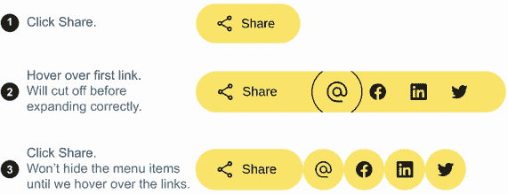

图 11.14 点击时扩展的组件

记住，我们的 JavaScript 在过渡开始和结束时触发，并负责控制我们的溢出。虽然我们已经在悬停单个菜单项时动画化了样式变化，但我们还没有添加打开和关闭菜单的过渡。当我们添加这个过渡时，当过渡激活并完成时，溢出将被正确设置，这些问题就会消失。

我们需要完成的下一个任务是保持组件打开时通常在悬停时出现的按钮轮廓。因为我们已经有了一个在悬停和聚焦时添加边框的规则，我们将编辑这个规则以在组件打开时触发。通过重用规则，我们确保在悬停、聚焦状态以及列表可见时样式的一致性。为了添加条件，我们在规则中添加了`.share_ expanded` `.share__button`选择器，如下所示。

列表 11.15 在列表显示时添加按钮边框到分享按钮

```
.share__button:hover,
.share__button:focus-visible,
.share_expanded .share__button {
  cursor: pointer;
  outline: solid 1px black;
  outline-offset: -5px;
}
```

添加选择器后，组件展开后我们的按钮仍然保留边框（如图 11.15 所示）；当组件关闭且未聚焦或悬停时，边框保持不存在。

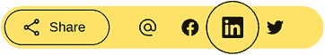

图 11.15 在列表显示时保持分享按钮边框

### 11.6.3 动画菜单

现在我们已经为打开和关闭状态设置了样式，让我们来动画化菜单的显示和隐藏。我们希望链接列表从左侧展开，如图 11.16 所示。

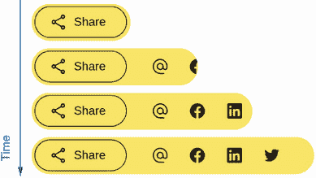

图 11.16 打开动画分解

当菜单关闭时，我们将执行打开动画的反向操作，撤回菜单并隐藏链接。我们还将使用过渡执行链接的放大效果。我们不需要使用关键帧，因为动画只会在按钮点击时执行一次，并且我们已经定义了两种状态。

我们将添加以下`transition`声明到菜单中：`transition:` `width` `250ms` `ease-in-out`。再次强调，我们希望过渡迅速，所以我们给它 250 毫秒的持续时间。

添加过渡后，我们发现图标在应该出现之前就变得可见了。图 11.17 分解了这种效果。

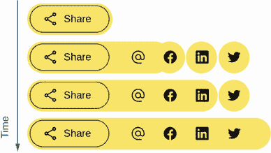

图 11.17 图标显示过早

即使我们将过渡改为转换所有属性而不是仅`width`，同样的问题仍然会发生。原因是溢出。当菜单关闭时，我们希望菜单的溢出被隐藏；当它打开时，我们希望它可见。但是溢出不能像宽度一样逐渐改变。它要么可见，要么不可见，没有中间状态。

当打开菜单时，我们希望在将 `overflow` 更改为 `visible` 之前等待过渡完成。当我们关闭时，我们希望溢出立即隐藏。这项任务是我们转向 JavaScript 以支持我们的 CSS 的地方。我们将从 `.share_expanded` `.share__menu` 类中移除 `overflow:` `visible`，并通过 JavaScript 处理添加。

列表 11.16 突出了处理溢出的相关 JavaScript。魔法在于 `transitionstart` 和 `transitionend` 事件监听器。它们附加到菜单上，监听过渡何时被触发以及何时完成变更。当事件发生时，它们触发其函数来处理菜单的溢出。

列表 11.16 处理溢出的 JavaScript

```
(() => {
  'use strict';

  let expanded = false;
  const container = document.getElementById('share');
  const menu = container.querySelector('menu');
...
  addTransitionListeners();
...
  function addTransitionListeners() {
    menu.addEventListener('transitionstart', handleAnimationStart);
    menu.addEventListener('transitionend', handleAnimationEnd);
  }
...
  function handleAnimationStart() {                       ①
    if (!expanded) { menu.style.overflow = 'hidden'; }    ②
  }
...
  function handleAnimationEnd() {                         ③
    if (expanded) { menu.style.overflow = 'visible'; }    ④
  }
})()
```

① 当过渡开始时触发

② 如果正在关闭过程中，隐藏菜单的溢出

③ 当过渡结束时触发

④ 如果刚刚打开，显示溢出

注意：如我们本章前面提到的，JavaScript 包含在启动代码中。如果您正在跟随，您不需要编辑 JavaScript；它应该可以工作。

下一个列表显示了使动画工作的 CSS。

列表 11.17 更新后的用于打开和关闭动画的 CSS

```
.share__menu {
  display: flex;
  margin: 0;
  padding: 0;
  background: inherit;
  border-radius: inherit;
  width: 0;
  overflow: hidden;
  transition: width 250ms ease-in-out;     ①
}
```

① 添加动画

经过这些最后的编辑以使动画平滑，我们已经完成了我们的动画社交媒体分享组件。最终产品如图 11.18 所示。

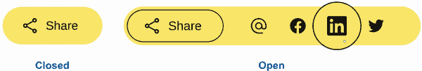

图 11.18 最终产品

## 摘要

+   我们有几种方法来组织 CSS。三种常见的模式是 OOCSS、SMACSS 和 BEM。

+   图标受版权保护，因此在使用社交媒体图标时请遵循品牌指南。

+   我们可以通过使用 `inline-flex` 使通过 Flexbox 显示的元素表现得像内联级元素。`inline-flex` 使用与 `flex` 相同的属性。

+   外观的定位可以通过 `outline-offset` 控制。

+   `scale()` 函数允许我们按比例放大或缩小元素。

+   `inherit` 属性值允许我们从父元素继承通常不会继承的值。

+   过渡不需要关键帧，但仍允许我们从一个状态到另一个状态动画化 CSS 变更。

+   `overflow` 属性允许我们控制超出其容器范围的元素是显示还是隐藏。

+   当使用 JavaScript 来扩展我们的过渡功能时，我们可以使用 `ontransitionstart` 和 `ontransitionend` 事件监听器来触发 JavaScript 变更以响应过渡的生命周期。
