# 12 使用预处理器

本章涵盖

+   CSS 预处理器

+   Sass 扩展 CSS 功能的示例

到目前为止，在这本书中，我们一直使用纯 CSS 编写所有样式。然而，我们也可以使用预处理器。每个处理器都有自己的语法，并且大多数预处理器扩展了现有的 CSS 功能。最常用的有

+   Sass ([`sass-lang.com`](https://sass-lang.com))

+   Less ([`lesscss.org`](https://lesscss.org))

+   Stylus ([`stylus-lang.com`](https://stylus-lang.com))

它们被创建来简化代码的编写，使其更易于阅读和维护，以及添加 CSS 中不可用的功能。为与预处理器一起使用而编写的样式有自己的语法，并且必须构建或编译成 CSS。尽管一些预处理器提供浏览器端编译，但最常见的方法是将样式预处理器，并将输出 CSS 发送到浏览器（[`mng.bz/Wzex`](http://mng.bz/Wzex)）。

使用预处理器的优点是它提供的附加功能，我们将在本章中介绍这些功能的示例。缺点是现在我们需要为我们的代码添加一个构建步骤。预处理器的选择基于项目所需的功能、团队的知识，以及（如果项目使用框架）哪些框架受到支持。对于我们的项目，我们将根据流行度来选择。当开发者被调查关于他们对 CSS 预处理器情感时，大多数倾向于 Sass（图 12.1），因此我们将使用它。

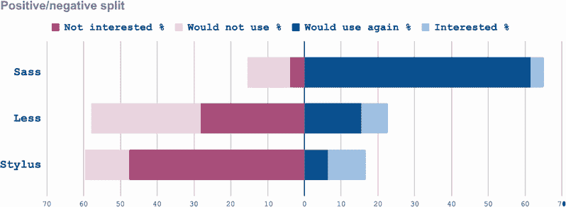

图 12.1 预处理器情感（数据来源 [`mng.bz/8ry2`](http://mng.bz/8ry2)）

## 12.1 运行预处理器

我们的项目包括为如何文章添加样式——我们可能在维基或文档中看到（图 12.2）。

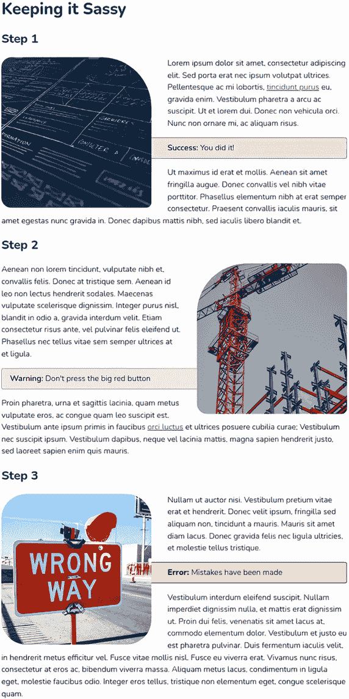

图 12.2 完成的项目

如前几章所述，起始代码可在 GitHub（[`mng.bz/EQnl`](http://mng.bz/EQnl)）和 CodePen（[`codepen.io/michaelgearon/pen/WNpNoGN`](https://codepen.io/michaelgearon/pen/WNpNoGN)）上找到。但运行项目会有所不同。因为我们将使用 Sass 编写样式，它输出 CSS 而不是直接编写，我们需要一个构建步骤。要运行此项目并跟随本章的代码，你有两种选择：

+   npm

+   CodePen

注意 *npm*（Node.js 包管理器）是一个软件库、管理器和安装程序。如果你不熟悉 npm，那没关系。你可以按照第 12.1.3 节中的说明在 CodePen 中运行此项目。

### 12.1.1 npm 的设置说明

从`chapter-12`目录的命令行中，使用`npm` `install;`安装依赖项，然后使用`npm` `start`启动处理器。此命令启动一个监视器，将监视`styles.scss`（在`before`和`after`目录中）的变化，并输出`styles.css`和`styles.map.css`文件。

第二个文件——`styles.map.css`——是一个源映射文件。由于 CSS 是从另一种语言生成的，源映射允许浏览器开发者工具告诉我们代码片段在预处理器文件（对于本项目，`styles.scss`）中的来源位置。

### 12.1.2 .sass 与.scss 的区别

虽然我们使用 Sass，但我们的文件扩展名是`.scss`。Sass 有两种语法我们可以选择——缩进和 SCSS——文件扩展名反映了语法。

缩进语法

有时被称为*Sass 语法*或*缩进语法*，使用`.sass`文件扩展名。当使用这种语法编写规则集时，我们省略大括号和分号，使用制表符来描述文档的格式。以下列表显示了使用缩进语法的两个规则，第一个处理正文上的边距和填充，第二个更改段落的行高。

列表 12.1 使用缩进语法的 Sass

```
body
     margin: 0
     padding: 20px

p
      line-height: 1.5
```

SCSS 语法

第二种语法是 SCSS，它使用文件扩展名`.scss`。我们将在这个项目中使用这种语法。*SCSS 语法*是 CSS 的超集，它允许我们使用任何有效的 CSS，以及 Sass 的功能。以下列表显示了列表 12.1 中的规则在 SCSS 语法中的表示。

列表 12.2 使用 SCSS 语法的 Sass

```
body {
  margin: 0;
  padding: 20px;
}

p {
  line-height: 1.5;
}
```

代码看起来像 CSS，这正是重点。在 SCSS 中，我们可以像习惯那样编写 CSS，并且可以访问 Sass 提供的所有功能。由于其与 CSS 的相似性，并且它不需要开发者学习新的语法，SCSS 是两种语法选项中更受欢迎的一个。

### 12.1.3 CodePen 设置说明

要为 CodePen 设置项目，请按照以下步骤操作：

1.  前往[`codepen.io`](https://codepen.io)。

1.  在一个新的笔中，使用`chapter-12/before`文件夹中的代码，将`body`元素内的 HTML 复制到 HTML 面板中。

1.  将`.scss`文件中的基本样式复制到 CSS 面板中。

1.  要使面板使用 Sass 的 SCSS 语法而不是 CSS，请点击 CSS 面板右上角的齿轮（图 12.3）。

    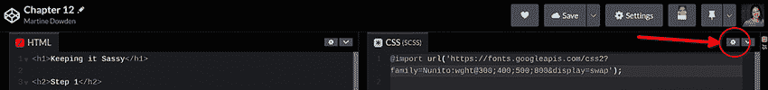

    图 12.3 设置按钮

1.  从 CSS 预处理器下拉菜单中选择 SCSS（图 12.4）。

    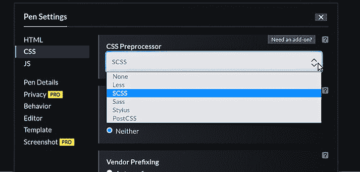

    图 12.4 CodePen CSS 预处理器设置

1.  点击 Pen 设置对话框底部的绿色“保存并关闭”按钮。

### 12.1.4 开始 HTML 和 SCSS

我们的项目由标题、段落、链接和图片组成（列表 12.3）。注意，在我们的`head`中，我们引用的是 CSS 样式表，而不是 SCSS。浏览器使用编译版本。

列表 12.3 开始 HTML

```
<!DOCTYPE html>
<html lang="en">

<head>
  <title>Chapter 12: Pre-processors | Tiny CSS Projects</title>
  <meta charset="utf-8">
  <meta name="viewport" content="width=device-width, initial-scale=1">
  <link rel="stylesheet" href="styles.css">                 ①
</head>

<body>
  <h1>Keeping it Sassy</h1>
  <h2>Step 1</h2>
  
  <p>
    Lorem ipsum dolor sit amet...
    <a href="">tincidunt purus</a>
    eu, gravida enim. Vestibulum...
  </p>
  <p class="success">You did it!</p>                        ②
  <p>Ut maximus id erat et mollis...</p>
  <h2>Step 2</h2>
  
  <p>Aenean non lorem tincidunt...</p>
  <p class="warning">Don't press the big red button</p>     ③
  <p>
    Proin pharetra, urna et sagittis lacinia...
    <a href="">orci luctus</a>
    et ultrices posuere cubilia curae...
  </p>
  <h2>Step 3</h2>
  
  <p>Nullam ut auctor nisi...</p>
  <p class="error">Mistakes have been made</p>              ④
  <p>Vestibulum interdum eleifend...</p>
</body>

</html>
```

① 链接到处理后的 CSS 文件

② 绿色成功提示

③ 橙色警告提示

④ 红色错误提示

我们的基本样式设置了我们的排版，并在页面变宽时限制了内容的宽度，如下列所示。

列表 12.4 开始 SCSS

```
@import url('https:/ /fonts.googleapis.com/css2?
➥ family=Nunito:wght@300;400;500;800&display=swap');

body {
  font-family: 'Nunito', sans-serif;
  font-weight: 300;
  max-width: 72ch;
  margin: 2rem auto;
}

p { line-height: 1.5 }
```

到目前为止，我们还没有使用 Sass 提供的任何扩展功能。事实上，如果我们查看 CSS 输出（列表 12.5），我们会注意到文件内容除了文件底部的映射参考之外都是相同的。这个注释告诉浏览器在哪里找到源映射。图 12.5 显示了我们的起始点。

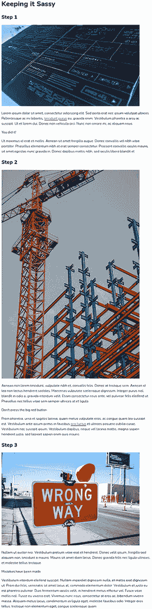

图 12.5 起始点

注意：如果您正在使用 CodePen，您可以通过点击 CSS 面板右上角的齿轮旁边的向下箭头（参见图 12.3）并从下拉菜单中选择“查看编译后的 CSS”来查看编译后的 CSS。

列表 12.5 开始的 CSS 输出

```
@import url("https:/ /fonts.googleapis.com/css2?
➥ family=Nunito:wght@300;400;500;800&display=swap");
body {
  font-family: "Nunito", sans-serif;
  font-weight: 300;
  max-width: 72ch;
  margin: 2rem auto;
}

p {
  line-height: 1.5;
}

/*# sourceMappingURL=styles.css.map */     ①
```

① 源映射参考

注意：如果您没有看到 CSS 文件被创建并且样式被应用，请确保您正在运行 Sass 监视器（`npm start`）。当监视器启动时，让它后台运行；当您在 SCSS 文件中保存更改时，它会自动更新 CSS 文件。您仍然需要手动刷新浏览器。

## 12.2 Sass 变量

预处理器早期之所以受欢迎，一个原因就是它们在浏览器支持自定义属性之前就有变量。Sass 变量与 CSS 自定义属性非常不同，因为它们有不同的语法并且功能不同。让我们首先看看语法。要创建一个变量，我们从美元符号（`$`）开始，后面跟着变量名，一个冒号（`:`），然后是一个值（图 12.6）。

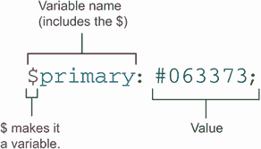

图 12.6 Sass 变量语法

在功能方面，Sass 变量不了解文档对象模型（DOM），也不理解层叠或继承。它们是块作用域的：只有它们定义的括号内的属性知道它们的存在。因此，以下列表中提出的场景会在编译时抛出一个未定义变量错误，因为变量在两个不同的规则或块中定义和使用了。

列表 12.6 `$myColor` 变量在第二个规则中未定义

```
body {
  $myColor: blue;                ①
}

body p {
  /* $myColor is undefined */
  color: $myColor                ②
}
```

① 在 body 规则内部定义 `$myColor` 变量

② `$myColor` 未定义，因为它是在不同的规则中创建的。

为了防止这个问题，我们可以将变量放在规则之外，这样它们就可以在整个文档中可用，如以下列表所示。

列表 12.7 定义变量

```
$myColor: blue;       ①

body p {
  color: $myColor;    ②
}
```

① 在任何规则集外部定义 `$myColor` 变量

② `$myColor` 现已定义，其值为蓝色。

与动态的自定义属性不同，Sass 变量是静态的。如果我们定义了一个变量，使用它，更改其值，然后再使用它，那么在更改之前分配给它的任何属性都将保留原始值，而更改之后分配的将具有新值。列表 12.8 和 12.9 中显示的示例使这种情况更加清晰。请注意，这些示例不是我们项目的一部分；我们在这里展示它们只是为了说明概念。您可以在 CodePen 上找到代码：[`codepen.io/martine-dowden/pen/QWxLjWy`](https://codepen.io/martine-dowden/pen/QWxLjWy)。

列表 12.8 自定义属性与变量（HTML）

```
<p class="first">My first paragraph</p>
<p class="second">My second paragraph</p>
```

列表 12.9 自定义属性与变量（SCSS）

```
body { --myBorder: solid 1px gray;  }        ①
$primary: red;                               ②

.first {                                     ③
  color: $primary;                           ③
  border: var(--myBorder);                   ③
}                                            ③

body { --myBorder: dashed 1px purple;  }     ④
$primary: blue;                              ⑤

.second {                                    ⑥
  color: $primary;                           ⑥
  border: var(--myBorder);                   ⑥
}                                            ⑥
```

① 将 `--myBorder` 自定义属性分配为实线灰色边框

② 将红色分配给我们的 `$primary` 变量

③ 将 `--myBorder` 自定义属性和 `$primary` 变量应用于颜色和边框属性

④ 将 `--myBorder` 自定义属性值更改为虚线紫色边框

⑤ 将 `$primary` 值更改为蓝色

⑥ 将 `--myBorder` 和 `$primary` 应用于第二段

自定义属性和变量之间的第一个重大区别是我们不需要在规则内部定义我们的变量。此外，两个段落的边框样式是相同的，但文本的颜色却不是（图 12.7），尽管自定义属性和变量在第一和第二规则之间都被重新分配了。

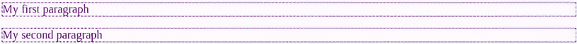

图 12.7 示例输出

当我们重新分配自定义属性（边框）的值时，它将应用于所有地方，而颜色不会回溯性改变；只有更改后的规则受到影响。原因是自定义属性是动态的，而变量是静态的。

通过这种理解，让我们回到我们的项目，并为我们将使用的颜色定义一些变量。在文件顶部，我们将定义四个颜色变量。然后我们将应用主颜色到所有标题，如下列所示。

列表 12.10 颜色变量（SCSS）

```
@import url('https:/ /fonts.googleapis.com/css2
➥ ?family=Nunito:wght@300;400;500;800&display=swap');

$primary: #063373;              ①
$success: #747d10;              ②
$warning: #fc9d03;              ③
$error: #940a0a;                ④

p { line-height: 1.5 }

h1, h2 { color: $primary; }     ⑤
```

① 蓝色

② 绿色

③ 橙色

④ 红色

⑤ 使我们的标题变为蓝色

我们将变量放置在文件的开头，并放在任何规则之外，这样从那时起，我们就可以在任何规则内部访问它们。我们在 CSS 输出（列表 12.11）中注意到我们的变量在编译后的 CSS 中是不可见的。但在定义我们的标题颜色的规则中，我们使用变量所在的位置已被其值所替换。

列表 12.11 标题颜色 CSS 输出

```
@import url("https:/ /fonts.googleapis.com/css2
➥ ?family=Nunito:wght@300;400;500;800&display=swap");
body {
  font-family: "Nunito", sans-serif;
  font-weight: 300;
  max-width: 72ch;
  margin: 2rem auto;
}

p {
  line-height: 1.5;
}

h1, h2 {
  color: #063373;
}

/*# sourceMappingURL=styles.css.map */
```

现在我们的项目标题看起来像图 12.8。接下来让我们为我们的图片添加样式。


图 12.8 更新后的标题颜色

### 12.2.1 @extend

Sass 给我们带来了几个新的 at-rules，其中两个是 `@extend` 和 `@include`。这些规则允许我们构建通用的类，我们可以在整个代码中重用它们。在 CSS 中重用类的一种方法是为单个规则创建多个选择器，就像我们在设置标题样式时做的那样。我们不是为每个标题（`<h1>` 和 `<h2>`）创建两个相同的规则，而是创建了一个规则，并给它两个选择器：`h1,` `h2` `{` `}`。

`@extend` 允许我们创建一个基础规则，稍后可以从不同的规则中指向它。然后选择器将被添加到基础规则的选择器列表中。让我们使用这项技术来设置我们的图片样式，并看看它是如何工作的。

首先，我们创建一个基础规则，它将定义图片的 `height`、`width`、`object-fit` 和 `margin`。因为我们有三个图片，而且我们希望给每个图片一个稍微不同的边框半径和定位，所以我们分别将每个图片指向我们的 `base-image` 规则。下面的列表显示了如何操作。

列表 12.12 扩展图片样式（SCSS）

```
.image-base {                                   ①
  width: 300px;                                 ①
  height: 300px;                                ①
  object-fit: cover;                            ①
  margin: 0 2rem;                               ①
}                                               ①

img:first-of-type { @extend .image-base; }      ②
img:nth-of-type(2) { @extend .image-base; }     ②
img:last-of-type { @extend .image-base; }       ②
```

① 基础规则

② 扩展基础规则的图片

下面的列表显示了 CSS 输出。

列表 12.13 扩展图片样式（CSS 输出）

```
.image-base, img:last-of-type, img:nth-of-type(2), img:first-of-type {
  width: 300px;
  height: 300px;
  object-fit: cover;
  margin: 0 2rem;
}
```

通过创建基础规则然后使用 `@extend`，我们可以创建一些默认值并将它们应用到任何其他选择器，而无需重复我们的 CSS 代码。我们还可以将所有与选择器相关的代码放在一个规则中。在我们的默认图片样式应用后（图 12.9），让我们分别自定义它们。

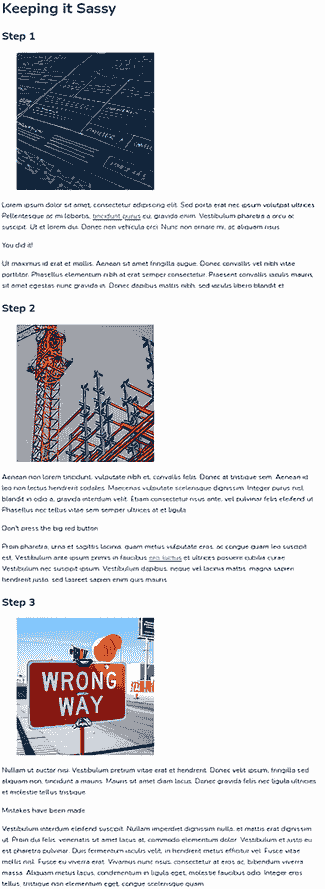

图 12.9 基础图片样式

## 12.3 @mixin 和 @include

我们想自定义每个图片的 `border-radius`、`position` 和 `object-position`。为此，我们将使用一个 mixin。*Mixins* 允许我们生成声明和规则。像函数一样，它们接受参数（尽管这不是强制的）并返回样式。让我们写一个将返回每个图片三个声明的 mixin。mixin 是一个 at-rule，因此它以 `@mixin` 开头，后面跟着我们想要给它的名字。接下来，我们添加括号，其中包含我们想要传递的任何参数。最后，我们添加一组大括号，在其中定义 mixin 想要返回的样式。图 12.10 显示了语法。

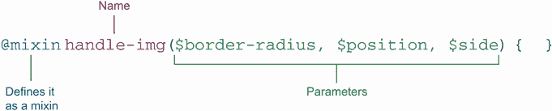

图 12.10 混合语法

注意到每个参数都以美元符号开头。在 Sass 中，参数的名称定义方式与以 `$` 开头的变量相同。

在 mixin 中，我们将这些参数值分配给属性，如下列 12.14 所示。我们改变边框半径，浮动图片，并移除它浮动的侧面的边距。请注意，mixin 需要在使用之前定义，因此通常将 mixins 放在文件的开始部分。

列表 12.14 构建 mixin（SCSS）

```
@mixin handle-img($border-radius, $position, $side) {
  border-radius: $border-radius;
  object-position: $position;
  float: $side;
  margin-#{$side}: 0;    ①
}
```

① 插值（第 12.3.2 节）

到目前为止，我们没有在项目中看到任何变化。我们已经定义了 mixin，但还没有使用它。在我们应用它之前，让我们更仔细地看看它的某些属性。

### 12.3.1 `object-fit` 属性

在我们的基规则中，我们将`object-fit`属性值设置为`cover`。`object-position`属性，我们也在 mixin 中使用，与`object-fit`协同工作，确定图像在其边界框内的对齐方式。记住，`cover`使浏览器根据提供的维度计算图像的最佳大小，以便尽可能多的图像在不失真的情况下显示。

如果提供给图像的维度与图像的宽高比不同，则超出部分将被裁剪。`object-position`属性改变图像在容器内的位置，允许我们在比例不匹配时操作图像被裁剪的部分（图 12.11）。

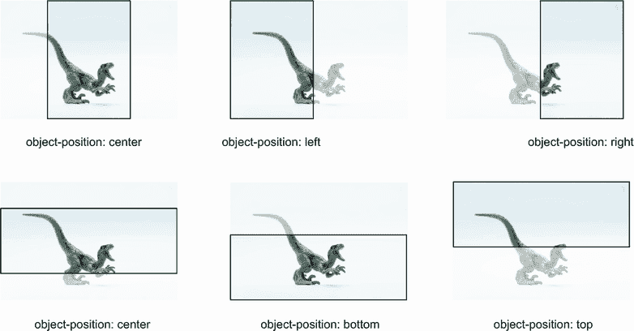

图 12.11 使用`object-position`与`object-fit:` `cover`结合时图像的可见部分与裁剪部分

### 12.3.2 插值

注意边距的语法：`margin-#{$side}:` `0;`。我们在变量周围添加了哈希（`#`）和大括号。这种语法，称为*插值*，允许我们将值插入到我们的参数中。它将表达式的结果嵌入到我们的 CSS 中的大括号内，替换掉哈希。例如，如果`$side`的值等于`"left"`，我们的声明将编译为`margin-left:` `0`;。

你可能在 JavaScript 的模板字面量字符串插值上下文中遇到过插值：`` `margin-${side}` ``。在我们的项目中，我们试图连接`margin-`和`$side`变量的值。因为`'margin-'` `+` `$side`不是一个有效的属性声明，所以我们使用插值来插入值。

### 12.3.3 使用 mixin

接下来，我们将使用我们的 mixin 在每个图像规则中。为此，我们使用`@include`后跟 mixin 的名称，并在括号中包含它所需的参数（图 12.12）。

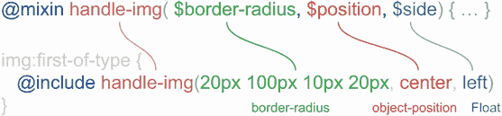

图 12.12 `@mixin` 语法

在所有三个图像规则中，我们使用`@include` `handle-img()`并传入我们想要使用的`border-radius`、`object-position`和`float`属性值（列表 12.15）。所有三个图像都有圆角（mixin 的第一个参数）。我们的第一和第二个图像使用`border-radius`缩写属性，我们将在 12.3.4 节中讨论。

列表 12.15 使用 mixin（SCSS）

```
@mixin handle-img($border-radius, $position, $side) {
  border-radius: $border-radius;
  object-position: $position;
  float: $side;
  margin-#{$side}: 0;
}

img:first-of-type {
  @extend .image-base;
  @include handle-img(20px 100px 10px 20px, center, left);
}

img:nth-of-type(2) {
  @extend .image-base;
  @include handle-img(100px 20px 10px 20px, left top, right);
}

img:last-of-type {
  @extend .image-base;
  @include handle-img(50px, center, left);
}
```

在我们的输出 CSS 中，mixin 本身并不存在，但我们有三个新的规则，每个图像一个，如下所示。

列表 12.16 使用 mixin 输出（CSS）

```
.image-base, img:last-of-type, img:nth-of-type(2), img:first-of-type {   ①
  width: 300px;                                                          ①
  height: 300px;                                                         ①
  object-fit: cover;                                                     ①
  margin: 0 2rem;                                                        ①
}                                                                        ①

img:first-of-type {                                                      ②
  border-radius: 20px 100px 10px 20px;                                   ②
  object-position: center;                                               ②
  float: left;                                                           ②
  margin-left: 0;                                                        ②
}                                                                        ②

img:nth-of-type(2) {                                                     ②
  border-radius: 100px 20px 10px 20px;                                   ②
  object-position: left top;                                             ②
  float: right;                                                          ②
  margin-right: 0;                                                       ②
}                                                                        ②
img:last-of-type {                                                       ②
  border-radius: 50px;                                                   ②
  object-position: center;                                               ②
  float: left;                                                           ②
  margin-left: 0;                                                        ②
}                                                                        ②
```

① 通过使用@extend 添加到基类中的选择器

② 通过使用 mixin 生成（@include）

此输出揭示了使用 `@extend` 和使用混合（`@include`）之间的区别。当我们扩展一个规则时，Sass 不会复制或生成代码；它只是将选择器添加到基础中。当我们使用混合时，Sass 会生成代码。如果我们正在动态设置属性，我们想要使用混合。但如果属性值是静态的，我们想要扩展；否则，我们每次使用混合时都会复制这些值，这会使我们的样式表膨胀。在此阶段，我们的项目看起来像图 12.13。

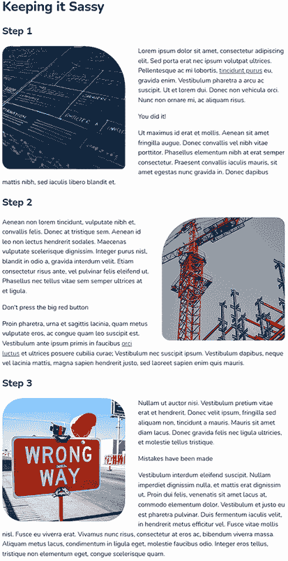

图 12.13 样式化图片

### 12.3.4 `border-radius` 简写

对于我们的第一张和第二张图片，我们使用了 `border-radius` 简写。第一张图片生成的 CSS 中 `border-radius` 属性的值为 `20px` `100px` `10px` `20px`。正如我们可以在一个声明中为元素的所有四个边设置不同的填充值一样，`border-radius` 允许我们使用类似的语法（图 12.14）。每个值定义了从左上角开始并顺时针旋转的角落半径。

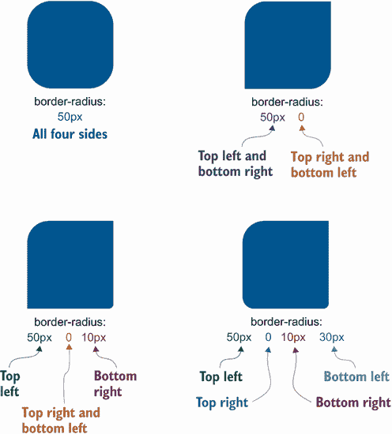

图 12.14 `border-radius` 属性

现在我们已经对图片进行了样式化，让我们更仔细地看看我们的文本。在一些段落中，我们有链接需要样式化。

## 12.4 嵌套

Sass 让我们能够做到的一件酷事是嵌套规则。当我们样式化链接时，我们经常编写多个规则，以便我们可以处理各种状态（链接、已访问、悬停、聚焦等）。我们可以像列表 12.17 所示那样将它们嵌套在一起。嵌套我们的规则清楚地显示了代码中的祖先-后代关系，并使我们的规则分组和组织。

要选择父选择器，我们使用一个和号（`&`）。在我们的规则中，父规则是针对锚点元素的。在这个规则内部，我们需要引用父元素（`a`）以与 `:link`、`:visited`、`:hover` 和 `:focus` 伪类一起使用，因此我们在它们之前加上 `&`。

我们使所有锚点元素加粗，通过使用我们的 `$primary` 变量使它们变为蓝色，并将我们的链接下划线从实线改为点线。在悬停时，我们将下划线变为虚线。最后，我们将聚焦下划线变为实线。在聚焦时，我们还移除了某些浏览器中存在的默认轮廓。

列表 12.17 嵌套规则（SCSS）

```
a {                                             ①
  font-weight: 800;
  &:link, &:visited {                           ②
    color: $primary;
    text-decoration-style: dotted;              ③
  }
  &:hover { text-decoration-style: dashed;}     ④
  &:focus {                                     ⑤
    text-decoration-style: solid;               ⑥
    outline: none;
  }
}
```

① 所有锚点元素：父元素

② 包含 href 的锚点元素，无论是已访问的还是未访问的

③ 将下划线样式改为点线

④ 链接悬停时，将下划线样式改为虚线

⑤ 链接聚焦时

⑥ 将下划线样式改为实线

在我们的 CSS 输出中，如下所示列表中所示，我们的嵌套规则已被展平，为锚点元素及其每个状态创建了单独的规则。现在我们的链接看起来像图 12.15。

列表 12.18 嵌套规则（CSS 输出）

```
a {
  font-weight: 800;
}
a:link, a:visited {
  color: #063373;
  text-decoration-style: dotted;
}
a:hover {
  text-decoration-style: dashed;
}
a:focus {
  text-decoration-style: solid;
  outline: none;
}
```

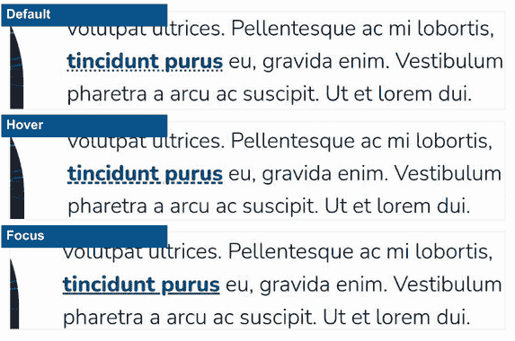

图 12.15 样式化链接：（从上到下）默认、悬停和聚焦

注意嵌套是一种很好的方式来保持我们的规则分组和组织。但是，对于每一层嵌套，都有另一个具体性级别。在列表 12.17 中，我们在锚点（`a`）规则内部嵌套了悬停和聚焦。输出（列表 12.18）中的内部选择器比外部规则更具体：`a:hover` 比较具体于 `a`。通过嵌套规则，我们很容易创建过于具体的规则，这会降低性能。我们需要在我们的代码中留意过度嵌套。如果我们注意到嵌套超过三个层级，我们应该检查我们的规则是如何嵌套的，并看看是否有一些规则可以被解嵌套。

链接样式完成后，我们接下来要关注的是调用段落。

## 12.5 @each

在我们的文本中，我们有三个具有 `success`、`warning` 和 `error` 类的调用段落。正如我们在样式化图像时所做的（第 12.4 节），我们将创建一个基础规则，然后扩展它（列表 12.19）。该规则定义了我们想要调用具有的 `border`、`border-radius` 和 `padding`，并且它包括所有三种类型共有的样式。

列表 12.19 调用基础规则

```
.callout {
  border: solid 1px;
  border-radius: 4px;
  padding: .5rem 1rem;
}
```

接下来，我们不再为每个调用类型编写单独的规则，而是创建一个映射，这是一个键值对的列表，我们可以遍历它来生成规则集。因为我们的调用区分因素是颜色，所以我们的键将是类型，我们的值将是我们在本章开头定义的颜色变量。因此，我们的映射将是 `$callouts:` `(success:` `$success,` `warning:` `$warning,` `error:` `$error);`。图 12.16 分解了语法。


图 12.16 Sass 映射语法

创建了映射后，我们可以遍历每个键值对来生成我们的类。对于循环，我们将使用 `@each`。这个 at 规则按顺序遍历列表或映射中的所有项，这对于我们的用例来说非常完美。我们将在我们的 SCSS 中添加以下规则：`@each` `$type,` `$color` `in` `$callouts` `{}`。第一个变量（`$type`）给我们提供了访问键的权限，第二个（`$color`）是键对的值，最后一个（`$callouts`）是我们想要遍历的映射。我们将生成规则的代码放在大括号内。为了测试我们的循环，我们可以在大括号内添加一个 `@debug` 声明来检查我们的变量值是否符合预期（列表 12.20）。

注意 `@debug` 是 Sass 中 JavaScript 的 `console.log()` 的等价物。它允许我们将值打印到终端。不幸的是，CodePen 似乎没有一种方法可以在其控制台中暴露 Sass 调试语句。这些语句也不会在浏览器控制台中显示。你只能在本地运行项目时看到调试输出。

列表 12.20 循环中的 `@debug` 语句（SCSS）

```
$callouts: (success: $success, warning: $warning, error: $error);    ①
@each $type, $color in $callouts {                                   ②
  @debug $type, $color;                                              ③
}
```

① 映射

② 设置循环

③ 将打印我们的 $type 和 $color 值到终端的调试语句

在我们运行 Sass 监视器的终端中，`@debug`语句输出了文件名、行号、单词*调试*以及我们两个变量的值（列表 12.21）。请注意，您的行号可能与列表中显示的略有不同。

列表 12.21 终端输出

```
before/styles.scss:70 Debug: success, #747d10       ①
before/styles.scss:70 Debug: warning, #fc9d03       ②
before/styles.scss:70 Debug: error, #940a0a         ③
Compiled before/styles.scss to before/styles.css.
```

① 第一个键值对

② 第二个键值对

③ 第三个键值对

现在我们知道我们的循环工作正常，我们可以为我们的提示框类型创建规则。在每个规则集中，我们扩展`.callout`基本规则，并使用`border-color`添加每个类型的正确边框颜色。`border-color`属性的值来自我们的`@each`循环的`$color`变量。我们之前提到 Sass 变量是静态的（第 12.2 节）。因此，`$color`变量的值在映射中的每个键值对中都会重新分配，为每个提示框类型正确分配`border-color`。

接下来，我们通过使用`::before`伪元素在段落之前添加类型名称，以便我们有一个除了颜色之外的可视指示器，告诉用户提示框的类型是什么。因为我们的映射中的类型值是小写的，所以我们还使用`text-transform`将其转换为大写。列表 12.22 显示了我们的更新后的循环。

注意：永远不要仅使用颜色来传达意义。一些用户，如色盲用户，可能难以感知颜色，甚至可能完全看不到它们。在我们的例子中，颜色传达了提示框的类型，因此我们应该包含一些其他指示器（文本）。

列表 12.22 向循环中添加（SCSS）

```
.callout {
  border: solid 1px;
  border-radius: 4px;
  padding: .5rem 1rem;
}

$callouts: (success: $success, warning: $warning, error: $error);
@each $type, $color in $callouts {
 @debug $type, $color;
  .#{$type} {                       ①
    @extend .callout;
    border-color: $color;
    &::before {
      content: "#{$type}: ";        ②
      text-transform: capitalize;
    }
  }
}
```

① 插值以创建类名

② 插值以获取内容中的类型名称

正如我们在 12.3.2 节中使用插值创建边距声明时所做的，我们在这里使用它来创建类名并将类型添加到内容中。通过遍历映射，我们的`@each`规则创建了三个规则，每个类型一个。每个选择器也通过`@extend`添加到`.callout`规则中，如下面的列表所示。

列表 12.23 循环 CSS 输出

```
.callout, .error, .warning, .success {     ①
  border: solid 1px;
  border-radius: 4px;
  padding: 0.5rem 1rem;
}

.success {
  border-color: #747d10;
}
.success::before {
  content: "success: ";
  text-transform: capitalize;
}

.warning {
  border-color: #fc9d03;
}
.warning::before {
  content: "warning: ";
  text-transform: capitalize;
}

.error {
  border-color: #940a0a;
}
.error::before {
  content: "error: ";
  text-transform: capitalize;
}
```

① 所有三个类选择器（.error, .warning, .success）都被添加到.callout 基本类中。

现在我们三个提示框都有彩色边框（图 12.17）。但我们仍然需要在错误提示框中加粗*错误:*并添加背景颜色。

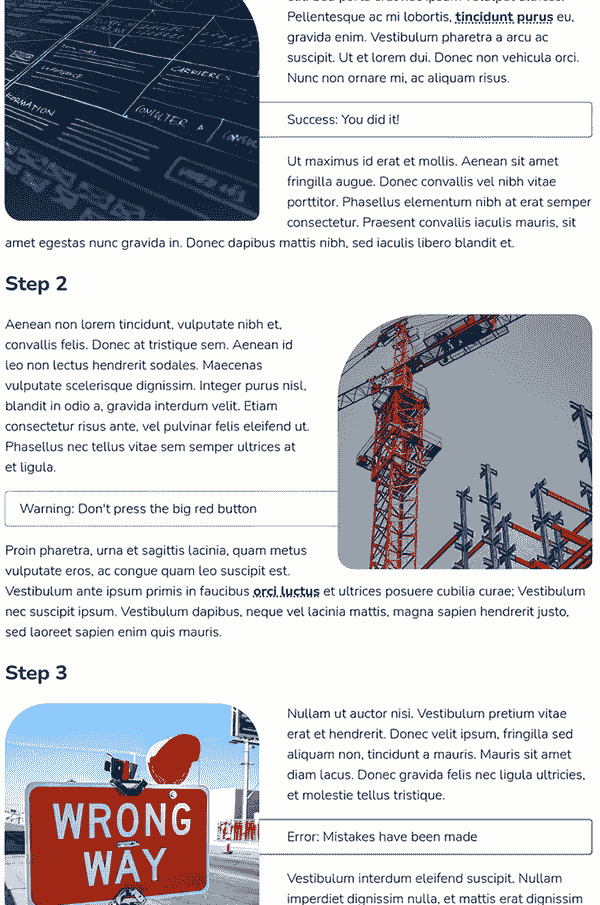

图 12.17 包含彩色边框的提示框样式

## 12.6 颜色函数

我们希望每个提示框的背景颜色都要比我们目前存储在变量中的颜色明显浅很多。为了使颜色操作更简单，Sass 提供了用于操作颜色的函数。我们将使用`scale-color()`。`scale-color()`函数非常灵活，可以用来改变颜色的红色、蓝色和绿色成分；改变饱和度或不透明度；以及使颜色变浅或变深（图 12.18）。

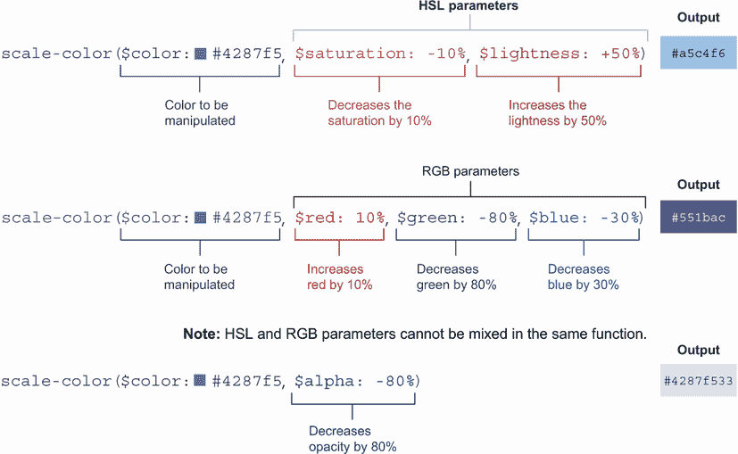

图 12.18 `scale-color()`函数

值得注意的是，`scale-color()` 使用 HSL（色调、饱和度和亮度）或 RGB（红色、绿色和蓝色）参数；它们不能混合使用。然而，alpha（透明度）参数可以与任何一组参数一起使用。此外，参数可以省略。因此，如果我们只想更改不透明度，我们只需要传递初始颜色和我们要用来操作颜色的参数（s）。

对于我们的背景，我们需要增加颜色的亮度，所以我们使用 HSL 参数。我们不需要更改饱和度，所以我们将省略饱和度参数，只传递颜色和我们要增加亮度的量（`86%`），如下所示。

列表 12.24 添加背景颜色（SCSS）

```
$callouts: (success: $success, warning: $warning, error: $error);
@each $type, $color in $callouts {
  @debug $type, $color;
  .#{$type} {
    @extend .callout;
    background-color: scale-color($color, $lightness: +86%);     ①
    border-color: $color;
    &::before {
      content: "#{$type}: ";
      text-transform: capitalize;
    }
  }
}
```

① 增加了映射中提供的颜色的亮度 86%

以下列表显示了 `scale-color()` 函数在 CSS 输出中生成的颜色。

列表 12.25 `scale-color()` 函数输出（CSS）

```
.callout, .error, .warning, .success {
  border: solid 1px;
  border-radius: 4px;
  padding: 0.5rem 1rem;
}

.success {
  background-color: #f6f9d1;
  border-color: #747d10;
}
.success::before {
  content: "success: ";
  text-transform: capitalize;
}

.warning {
  background-color: #fff1dc;
  border-color: #fc9d03;
}
.warning::before {
  content: "warning: ";
  text-transform: capitalize;
}

.error {
  background-color: #fcd1d1;
  border-color: #940a0a;
}
.error::before {
  content: "error: ";
  text-transform: capitalize;
}
```

现在我们已经添加了背景颜色（图 12.19），我们剩下要做的就是将 `*Error:*` 作为错误调用部分的 `::before` 内容加粗。

## 12.7 @if 和 @else

由于 Sass 的存在，可用的另一组 at 规则是 `@if` 和 `@else`，它们控制是否评估代码块，并在条件不满足时提供回退条件。我们将在循环中使用它们，如果调用类型是 `error`，则仅将 `::before` 伪元素的文本加粗，对于其他类型则增加字体粗细到中等（`500`）。

如果你习惯了 JavaScript，Sass 中的相等性评估可能会让你遇到一些陷阱，因为 Sass 没有真/假行为。只有当值具有相同的值和类型时，才被认为是相等的。此外，Sass 不使用双竖线（`||`）或双与（`&&`），而是使用 `or` 和 `and` 来考虑多个条件。以下列表显示了 Sass 的一些相等性运算符及其结果。

列表 12.26 等式（SCSS）

```
@debug '' == false;             // false    ①
@debug 'true' == true;          // false    ①
@debug null == false;           // false    ①
@debug Verdana == 'Verdana';    // true     ②
@debug 1cm == 10mm;             // true     ③
@debug 4 > 5 or 8 > 5;          // true
@debug 4 > 5 and 8 > 5;         // false
```

① `true`、`false` 和 `null` 只与自己相等。

② 两个值都被视为字符串。

③ 转换为相同的单位，它们在大小上相等；因此，它们相等。

为了检查我们的 `$type` 变量是否等于 `'error'`，我们的条件将是 `$type` `==` `'error'` 结合 `@if` 和 `@else`。我们的规则如下所示。

列表 12.27 条件加粗调用类型（SCSS）

```
$callouts: (success: $success, warning: $warning, error: $error);
@each $type, $color in $callouts {
  @debug $type, $color;
  .#{$type} {
    @extend .callout;
    background-color: scale-color($color, $lightness: +86%);
    border-color: $color;
    &::before {
      content: "#{$type}: ";
      text-transform: capitalize;
      @if $type == 'error' {       ①
        font-weight: 800;          ①
      } @else {                    ②
        font-weight: 500;          ②
      }                            ②
    }
  }
}
```

① 类型是错误；因此，我们添加了 800 的字体宽度。

② 类型不是错误（它是成功或警告），因此字体粗细设置为 500。

以下列表显示，CSS 输出中已为每种类型添加了字体粗细。

列表 12.28 条件加粗调用类型（CSS 输出）

```
.callout, .error, .warning, .success {
  border: solid 1px;
  border-radius: 4px;
  padding: 0.5rem 1rem;
}

.success {
  background-color: #f6f9d1;
  border-color: #747d10;
}
.success::before {
  content: "success: ";
  text-transform: capitalize;
  font-weight: 500;
}

.warning {
  background-color: #fff1dc;
  border-color: #fc9d03;
}
.warning::before {
  content: "warning: ";
  text-transform: capitalize;
  font-weight: 500;
}

.error {
  background-color: #fcd1d1;
  border-color: #940a0a;
}
.error::before {
  content: "error: ";
  text-transform: capitalize;
  font-weight: 800;
}
```

作为 `::before` 伪元素的文本添加部分，`.success` 和 `.warning` 的 `font-weight` 都是 `500`。另一方面，`.error::before` 规则的 `font-weight` 为 `800`。

添加了这个最后细节后，我们的项目就完成了。图 12.19 展示了最终输出。

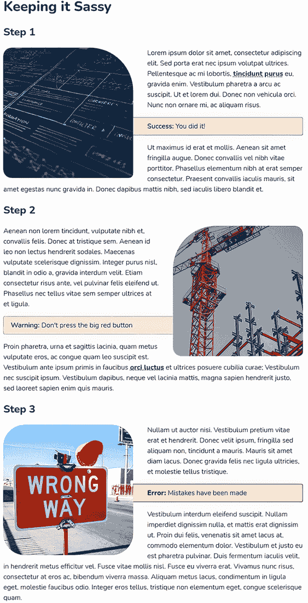

图 12.19 完成的项目

## 12.8 最后的想法

本章展示了 SaaS 允许我们做一些仅使用 CSS 无法做到的事情，但它只涵盖了 SaaS 功能的一小部分，并且只深入探讨了一个预处理器。预处理器可以做更多；本章只是触及了表面。重要的是要记住，预处理器提供了酷炫的功能，可以使代码编写更高效，同时也更复杂。它们还要求有一个构建步骤和稍微复杂一些的设置。

尽管我们没有深入探讨 Less 或 Stylus，以下是一些在选择预处理器时可能有助于你的问题：

+   我是否需要预处理器？

+   预处理器需要哪些功能？

+   使用预处理器将如何帮助我的项目开发？

+   如果项目使用用户界面框架或库，它是否支持一个或多个预处理器？如果是，哪些？

+   由于现在 CSS 需要构建，拥有预处理器将如何改变我的构建和部署流程？

+   我的团队成员有哪些技能，他们熟悉哪些预处理器？

无论预处理器是否适合你，重要的是要记住每个项目都是不同的。继续学习、探索和尝试新事物，并享受乐趣。编码愉快！

## 摘要

+   Sass 有两种语法：缩进和 SCSS。

+   变量和 CSS 自定义属性的工作方式不同。

+   Sass 变量是块作用域的。

+   `@extend` 扩展现有规则，而混合生成新代码。

+   混合可以接受参数。

+   当与 `object-fit:` `cover` 结合使用时，`object-position` 帮助在图像没有与给定的尺寸相同的宽高比时，在边界框内定位图像。

+   插值用于嵌入表达式的结果，例如在从变量创建规则名称时。

+   `border-radius` 属性可以接受多个值，以将不同的曲率分配给元素每个角落，从左上角开始，按顺时针方向旋转。

+   Sass 允许我们嵌套规则。

+   我们可以使用 `@each` 来遍历列表和映射。

+   `@debug` 允许我们在终端输出中打印值。

+   Sass 提供了如 `scale-color()` 这样的函数来操纵和改变颜色。

+   `@if` 和 `@else` 可以用来确定是否应该评估代码块。
