# 1 自动化测试简介

本章涵盖

+   自动化测试是什么

+   编写自动化测试的目标

+   自动化测试如何帮助你更快、更自信地编写更好的代码

当从你叔叔的面包店到国家的经济，所有事情都运行在软件上时，对新能力的需求呈指数级增长，而频繁交付能够正常工作的软件变得愈发关键——希望是每天多次。这正是自动化测试存在的目的。程序员偶尔手动测试软件的奢侈时代已经一去不复返了。现在，编写测试不仅是一种良好的实践，而且已成为行业标准。如果你现在搜索职位发布，几乎所有的职位都要求具备一定程度的自动化软件测试知识。

无论你有多少客户或你处理的数据量有多大，编写有效的测试对于任何规模的公司来说都是一项有价值的实践，从风险投资支持的硅谷巨头到你自己最近刚刚起步的初创公司。对于所有规模的项目，测试都是推荐的，因为它们促进了开发者之间的沟通，并帮助你避免缺陷。由于这些原因，拥有测试的重要性与参与项目的开发者数量和与之相关的失败成本成比例增长。

本书面向的是那些已经能够编写软件但尚未编写测试或不知道为什么这样做至关重要的专业人士。在编写这些页面时，我脑海中想的是那些刚刚从训练营毕业或最近获得第一份开发工作，并希望成长为资深人员的人。我期望读者了解 JavaScript 的基础知识，并理解像承诺（promises）和回调（callbacks）这样的概念。你不需要成为 JavaScript 专家。如果你能编写出能够正常运行的程序，那就足够了。如果你恰好适合这个角色，并且关心生产最有价值的软件——能够正常运行的软件——这本书就是为你而写的。

本书**不是**针对质量保证专业人士或非技术经理。它从开发者的角度覆盖了主题，侧重于他们如何利用测试的反馈以更快的速度生产更高质量的代码。**我不会**讨论如何执行手动或探索性测试，也不会讨论如何编写错误报告或管理测试工作流程。这些任务**还不能**自动化。如果你想了解更多关于它们的信息，建议你寻找针对 QA 角色的书籍。

在整本书中，你将主要使用 Jest 工具。你将通过为几个小型应用程序编写实际的自动化测试来学习。对于这些应用程序，你将使用纯 JavaScript 和流行的库，如 Express 和 React。熟悉 Express 有帮助，尤其是熟悉 React，但即使你不熟悉，简要的研究也应该足够。我会从头开始构建所有示例，并尽可能少地假设知识，所以我建议你在进行之前进行研究。

在第一章中，我们将介绍将渗透到所有后续实践的概念。我发现，糟糕的测试的最主要原因可以追溯到对测试是什么以及它们可以和应该实现什么的不理解，所以这就是我要从哪里开始的地方。

一旦我们了解了测试是什么以及编写测试的目标，我们就会讨论多个案例，其中编写测试可以帮助我们在更短的时间内生产出更好的软件，并促进各种开发者之间的协作。当我们开始编写第二章中的第一个测试时，这些概念基础将至关重要。

## 1.1 自动化测试是什么？

路易斯叔叔在纽约没有机会，但在伦敦，他因其香草芝士蛋糕而闻名。由于他卓越的受欢迎程度，他很快就注意到，仅用笔和纸经营面包店是无法扩展的。为了跟上激增的订单，他决定雇佣他认识的最好的程序员来建立他的在线商店：你。

他的要求很简单：客户必须能够从面包店订购商品，输入送货地址，并在网上结账。一旦你实现了这些功能，你决定确保商店能够适当地工作。你创建了数据库，初始化它们，启动服务器，并在你的机器上访问网站以尝试订购一些蛋糕。在这个过程中，假设你发现了一个错误。例如，你注意到你一次只能有一个商品单位在你的购物车中。

对于路易斯来说，如果网站带着这样的缺陷上线，那将是一场灾难。众所周知，一次只能吃一个马卡龙，因此，路易斯的拿手好菜——马卡龙将无人问津。为了避免这种情况再次发生，你决定认为添加多个商品单位是一个始终需要测试的场景。

你可以选择手动检查每个发布版本，就像旧式的流水线那样。但这不是一个可扩展的方法。这需要太长时间，而且在任何手动过程中，都很容易出错。为了解决这个问题，你必须用代码来代替你自己，即客户。

让我们思考一下用户是如何告诉你的程序将某物添加到购物车中的。这个练习有助于确定哪些动作流程的部分需要被自动化测试所取代。

用户通过网站与您的应用程序交互，该网站向后端发送 HTTP 请求。此请求通知`addToCart`函数他们想要将哪些项目和多少单位添加到购物车中。通过查看发送者的会话来识别客户的购物车。一旦项目被添加到购物车中，网站会根据服务器的响应进行更新。此过程如图 1.1 所示。

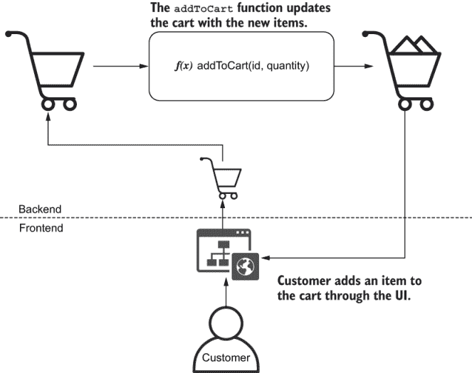

图 1.1 订单的动作流程

注意：`f(x)`表示法只是我选择用于本书图表中代表函数的图标。它并不一定表示函数的参数是什么。

让我们用可以调用`addToCartFunction`的软件组件替换客户。现在，您不需要依赖某人手动添加项目到购物车并查看响应。相反，您有一段代码为您执行验证。那是一个自动化测试。

自动化测试 自动化测试是自动执行测试软件任务的程序。它们与您的应用程序接口，执行操作，并将实际结果与您之前定义的预期输出进行比较。

您的测试代码创建了一个购物车，并告诉`addToCart`向其中添加项目。一旦收到响应，它会检查请求的项目是否已存在，如图 1.2 所示。

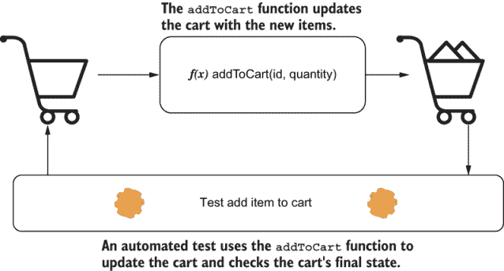

图 1.2 测试`addToCart`的动作流程

在您的测试中，您可以模拟用户只能向购物车添加单个马卡龙的精确场景：

1.  创建一个购物车实例。

1.  调用`addToCart`并告诉它向该购物车添加一个马卡龙。

1.  检查购物车是否包含两个马卡龙。

通过使您的测试重现导致错误发生的步骤，您可以证明这个特定的错误不再发生。

我们将要编写的下一个测试是确保能够将多个马卡龙添加到购物车中。这个测试创建了自己的购物车实例，并使用`addToCart`函数尝试向其中添加两个马卡龙。在调用`addToCart`函数后，您的测试会检查购物车的内容。如果购物车的内容符合您的预期，它会告诉您一切正常。我们现在可以确信可以添加两个马卡龙到购物车中，如图 1.3 所示。

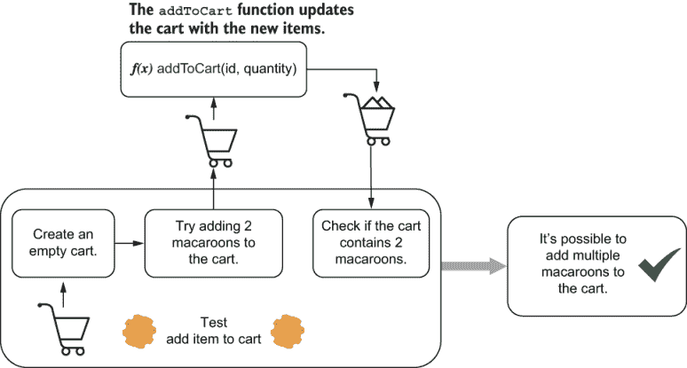

图 1.3 检查是否可以将多个马卡龙添加到购物车中的测试动作流程

现在客户可以拥有他们想要的任意数量的马卡龙——正如它应该的那样——让我们假设您尝试模拟客户会进行的购买：10,000 个马卡龙。令人惊讶的是，订单通过了，但路易叔叔没有那么多马卡龙库存。由于他的面包店仍然是一家小企业，他也不能在这么短的时间内完成如此巨大的订单。为了确保路易可以准时向每个人提供完美的甜点，他要求您确保客户只能订购库存中的商品。

为了确定哪些操作流程的部分需要由自动化测试替换，让我们定义当客户将商品添加到购物车时应发生什么，并相应地调整我们的应用程序。

当客户点击网站上的“添加到购物车”按钮，如图 1.4 所示，客户端应向服务器发送一个 HTTP 请求，告诉它将 10,000 个马卡龙添加到购物车。在将它们添加到购物车之前，服务器必须咨询数据库以检查库存是否足够。如果库存量小于或等于请求的数量，马卡龙将被添加到购物车，服务器将向客户端发送响应，相应地更新。

注意：你应该为你的测试使用单独的测试数据库。不要用测试数据污染你的生产数据库。

测试将添加和操作各种数据，这可能导致数据丢失或数据库处于不一致状态。

使用单独的数据库也更容易确定错误的根本原因。因为你完全控制测试数据库的状态，客户的操作不会干扰你的测试结果。

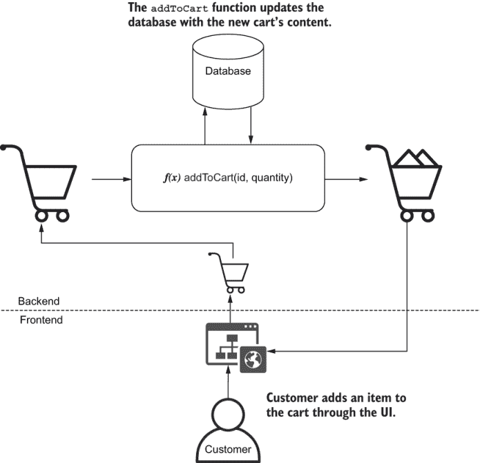

图 1.4 添加仅可用的商品到购物车的期望操作流程

这个错误甚至更加关键，所以你需要加倍小心。为了使你的测试更有信心，你可以在实际修复错误之前编写它，这样你就可以看到它是否按预期失败。

**唯一有用的测试类型是当你的应用程序不工作时会导致失败的测试**。

这个测试就像之前的那个一样：它用一段软件代码替换用户，并模拟其操作。不同的是，在这种情况下，你需要额外添加一步，从库存中移除所有马卡龙。测试必须设置场景并模拟导致错误发生的操作；参见图 1.5。

一旦测试到位，修复错误也会更快。每次你进行更改时，你的测试都会告诉你错误是否已消失。你不需要手动登录数据库，移除所有马卡龙，打开网站，并尝试将它们添加到你的购物车。测试可以为你更快地完成这些操作。

因为你也编写了一个测试来检查客户是否可以将多个商品添加到购物车，如果你的修复导致其他错误再次出现，该测试会警告你。测试提供快速反馈，并使你更有信心软件能正常工作。

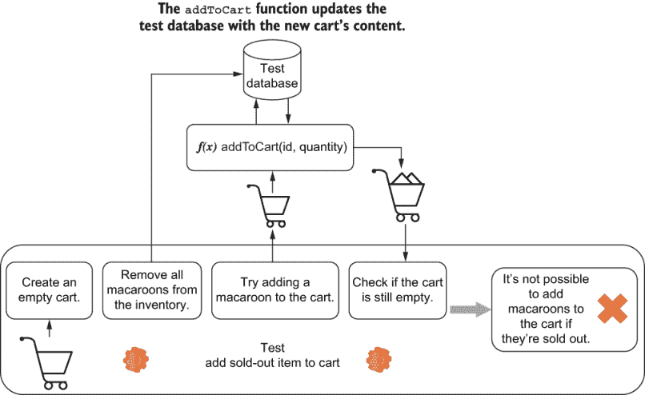

图 1.5 测试检查我们是否可以将售罄商品添加到购物车的必要步骤

然而，我必须警告你，自动化测试并不是生产出能正常工作的软件的万能药。**测试不能证明你的软件能工作；它们只能证明它不能工作**。如果你在购物车中添加 10,001 个马卡龙仍然导致其可用性被忽略，除非你测试了这个特定的输入，否则你不会知道。

测试就像实验。你将我们对软件如何工作的期望编码到你的测试中，因为它们在过去通过了，你选择相信你的应用程序在未来将以相同的方式表现，尽管这并不总是正确的。你拥有的测试越多，这些测试越接近真实用户的行为，它们给你的保证就越多。

自动化测试也不能消除手动测试的需求。像最终用户那样验证你的工作，并投入时间进行探索性测试仍然是必不可少的。因为本书的目标读者是软件开发人员而不是质量保证分析师，所以在本章的上下文中，我将经常将开发过程中经常进行的*不必要的*手动测试过程称为*手动测试*。

## 1.2 自动化测试的重要性

测试很重要，因为它们能给你快速且可靠的反馈。在本章中，我们将详细探讨如何通过使开发工作流程更加统一和可预测，以及便于重现问题和记录测试用例，来提高软件开发过程的速度和精确度，从而缩短交付高质量软件所需的时间。

### 1.2.1 可预测性

具有可预测的开发过程意味着在实现功能或修复错误的过程中防止意外行为的引入。减少开发过程中的惊喜数量也使得任务更容易估计，并导致开发者更少地回顾他们的工作。

手动确保你的整个软件按预期工作是一个耗时且容易出错的过程。测试通过减少你编写代码并获得反馈所需的时间来改进这个过程，因此可以更快地修复错误。**编写代码和收到反馈之间的距离越小，开发过程就越可预测**。

为了说明测试如何使开发更具可预测性，让我们想象 Louis 要求你添加一个新功能。他希望客户能够跟踪他们订单的状态。这个功能将帮助他花更多的时间烘焙，而不是花时间接电话来向客户保证他们的订单将准时到达。Louis 对芝士蛋糕充满热情，而不是对电话。

如果你在没有自动化测试的情况下实现跟踪功能，你将不得不手动完成整个购物流程来查看它是否工作，如图 1.6 所示。每次你需要再次测试时，除了重启服务器外，你还需要清除你的数据库以确保它们处于一致状态，打开你的浏览器，将商品添加到购物车，安排配送，完成结账，然后你才能最终测试跟踪订单。

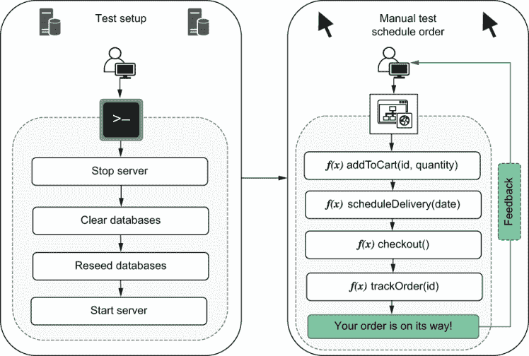

图 1.6 测试跟踪订单的步骤

在你可以手动测试这个功能之前，它需要在网站上可访问。你需要编写它的接口以及客户端与之交互的大块后端代码。

没有自动化测试会导致你在检查功能是否工作之前编写过多的代码。如果你每次更改都必须经历一个漫长而繁琐的过程，你将一次编写更大的代码块。因为编写更大的代码块需要很长时间才能获得反馈，到你最终收到反馈时，可能已经太晚了。你在测试之前已经编写了过多的代码，现在有更多的地方可以隐藏错误。在成千上万的新代码行中，你刚刚看到的错误在哪里？

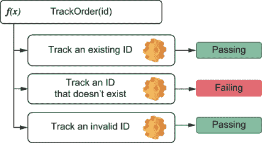

图 1.7 对于`trackOrder`函数的测试可以直接调用该函数，因此你不需要触及应用程序的其他部分。

使用如图 1.7 所示的自动化测试，你可以在获得反馈之前编写更少的代码。当你的自动化测试可以直接调用`trackOrder`函数时，你可以在确认`trackOrder`正常工作之前避免触及应用程序中不必要的部分。

当你在编写了 10 行代码之后测试失败，你只需要担心这 10 行代码。即使错误不在这 10 行代码中，它也变得更容易检测出是哪一行引发了其他地方的异常行为。

如果你破坏了应用程序的其他部分，情况可能会变得更糟。如果你在结账过程中引入了错误，你需要检查你的更改对其产生了怎样的影响。你做的更改越多，找到问题所在就越困难。

当你拥有如图 1.8 所示的自动化测试时，它们可以在出现问题后立即提醒你，这样你就可以更容易地纠正方向。如果你经常运行测试，你将能够在你破坏它时立即获得关于应用程序哪个部分出错的精确反馈。记住，**一旦你编写了代码，获得反馈所需的时间越少，你的开发过程就越可预测**。

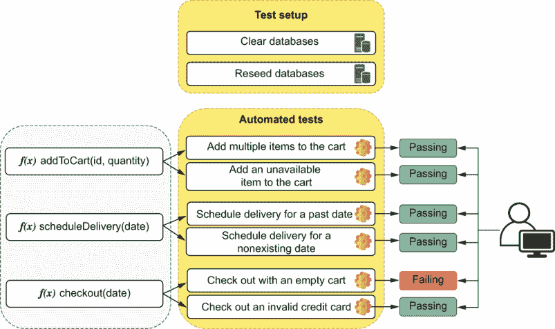

图 1.8 自动化测试可以单独检查你的代码部分，并在你破坏它时立即提供关于什么出错的精确反馈。

我经常看到开发者不得不丢弃工作，因为他们一次做了太多的更改。当这些更改导致应用程序的许多部分出现问题时，他们不知道从哪里开始。从头开始比修复他们已经造成的混乱要容易得多。你**有多少次**这样做过？

### 1.2.2 可重复性

一个特定任务包含的步骤越多，人类在遵循这些步骤时犯错误的可能性就越大。自动化测试使得重现错误和确保它们不再存在变得更加容易和快捷。

为了让客户跟踪订单状态，他们必须经过多个步骤。他们需要将商品添加到购物车中，选择送货日期，并通过结账流程。为了测试你的应用程序并确保它对客户有效，你必须做同样的事情。这个过程相当长且容易出错，你可以以许多不同的方式处理每个步骤。通过自动化测试，我们可以确保这些步骤被严格遵循。

假设你在测试应用程序时发现了一些错误，比如能够用空购物车或无效的信用卡结账。为了找到这些错误，你必须手动完成一系列步骤。

为了避免这些错误再次发生，你必须重现导致每个错误的完全相同的步骤。如果测试案例列表太长或步骤太多，人为错误的空间就更大了。除非你有一个每次都必须严格遵循的清单，否则错误会悄悄溜进来（见图 1.9）。

订购蛋糕是你一定会记得检查的事情，但订购-1 个蛋糕，或者甚至`NaN`个蛋糕呢？人们会忘记并犯错误，因此软件会出错。人类应该做人类擅长的事情，而执行重复性任务并不是其中之一。

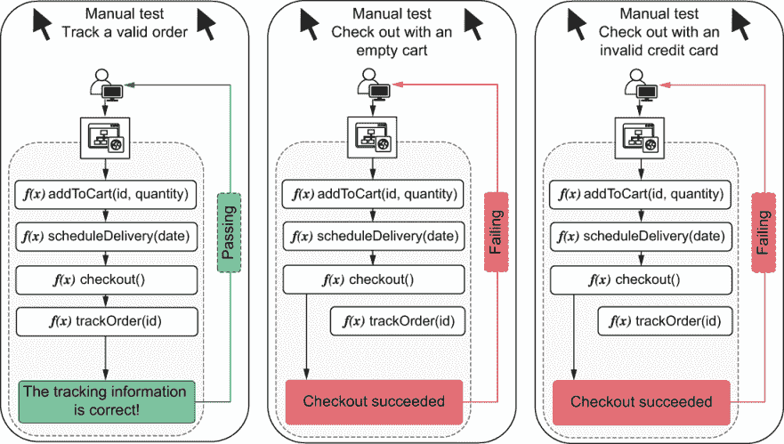

图 1.9 测试每个功能时必须遵循的步骤

即使你决定为这些测试案例维护一个清单，你也将不得不承担保持该文档始终更新的开销。如果你忘记更新它，并且发生了测试案例中没有描述的事情，那么错的是应用程序还是文档？

自动化测试每次执行时都会执行完全相同的操作。当机器运行测试时，它既不会忘记任何步骤，也不会犯错误。

### 1.2.3 协作

每个品尝过路易斯班夫提尼派的人都知道，他离成为明星的**Great British Bake Off**只有一步之遥。如果你在软件方面做得一切正确，也许有一天他会从旧金山到圣彼得堡的每个地方都开设面包店。在这种情况下，一个开发者显然是不够的。

如果你雇佣其他开发者与你一起工作，突然之间，你开始有新的和不同的担忧。如果你正在实施一个新的折扣系统，而爱丽丝正在实施生成优惠券的方法，如果你的结账程序更改使得客户无法将优惠券应用于他们的订单，你会怎么办？换句话说，你如何确保你的工作不会干扰她的工作，反之亦然？

如果爱丽丝首先将她的功能合并到代码库中，你必须问她你应该如何测试她的工作以确保你的工作没有破坏它。合并*你的*工作将消耗*你的*时间和爱丽丝的时间。

你和爱丽丝手动测试更改所花费的努力，在将你的工作与她的工作集成时也必须重复。除此之外，还需要额外的努力来测试这两个更改之间的集成，如图 1.10 所示。

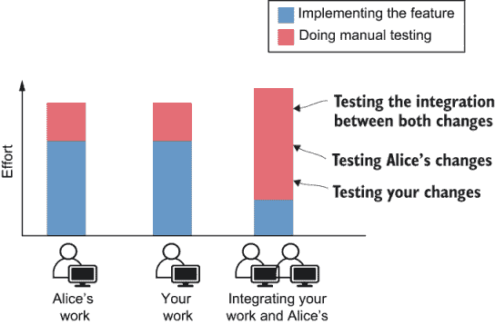

图 1.10 手动测试时在每个开发阶段验证更改所需的工作量

除了耗时之外，这个过程还容易出错。你必须记住在您的工作和爱丽丝的工作中测试的所有步骤和边缘情况。即使你记得，你仍然需要严格按照这些步骤进行。

当程序员为他们的功能添加自动化测试时，每个人都会受益。如果爱丽丝的工作有测试，你就不需要问她如何测试她的更改。当你合并这两部分工作的时候，你可以简单地运行现有的自动化测试，而不是再次经历整个手动测试过程。

即使你的更改建立在她的基础上，测试也将作为最新的文档来指导进一步的工作。编写良好的测试是开发者能拥有的最佳文档。因为它们需要通过，所以它们总是最新的。如果你无论如何都要编写技术文档，为什么不写一个测试呢？

如果你的代码与爱丽丝的代码集成，你也将添加更多自动化测试，这些测试将覆盖你和她工作之间的集成。这些新测试将在后续开发者实现相关功能时使用，因此可以节省他们的时间。每次你进行更改时都编写测试，可以创造一个良性的协作循环，其中一个开发者帮助那些将要接触代码库该部分的人（见图 1.11）。

这种方法减少了沟通的*开销*，但并没有消除沟通的需求，这是每个项目成功的基础。自动化测试显著提高了协作过程，但与代码审查等其他实践相结合时，它们会变得更加有效。

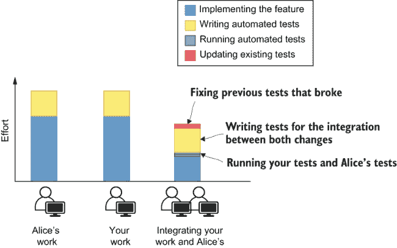

图 1.11 存在自动化测试时在每个开发阶段验证更改所需的工作量

软件工程中最具挑战性的任务之一是让多个开发者高效协作，而测试是实现这一目标最有用的工具之一。

### 1.2.4 速度

路易不在乎你使用哪种语言，更不用说你对多少测试感兴趣了。路易只想卖糕点、蛋糕以及他能制作出的任何其他甜点。路易关心的是收入。如果更多的功能能让客户更满意并带来更多收入，那么他希望你尽可能快地提供这些功能。只有一个前提：它们必须能正常工作。

对于企业来说，重要的是速度和正确性，而不是测试。在前面的所有章节中，我们讨论了测试如何通过使其更具可预测性、可重复性和协作性来改进开发过程，但最终，这些好处仅因为它们帮助我们以更短的时间生产更好的软件。

当你产生代码的时间更短，证明它没有特定的错误，并将其与其他人的工作集成时，业务就会成功。当你防止回归时，业务就会成功。当你使部署更安全时，业务就会成功。

因为编写测试需要时间，所以它们确实有成本。但我们坚持编写测试，因为其带来的好处远远超过了缺点。

初始时，编写测试也可能很耗时，甚至比手动测试还多，但随着你运行它的次数越多，你从中提取的价值就越大。如果你手动测试需要一分钟，而你编写一个自动化测试需要五分钟，一旦它运行第五次，它就会收回成本——相信我，这个测试将会运行超过五次。

与手动测试相比，手动测试始终需要相同的时间或更多，而自动化测试会导致运行测试所需的时间和精力几乎降至零。随着时间的推移，手动测试的总投入增长得更快。编写自动化测试和执行手动测试之间的这种努力差异在图 1.12 中得到了说明。

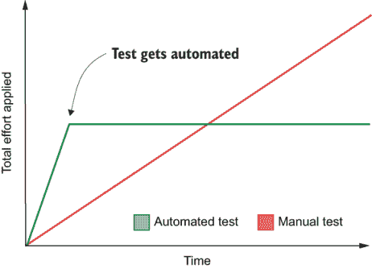

图 1.12 手动测试与自动化测试随时间投入的努力对比

编写测试就像购买股票。你可能需要 upfront 支付一大笔钱，但你会长期持续获得回报。就像在金融领域一样，你将进行的投资类型——以及你是否会进行投资——取决于你需要回款的时间。长期项目是最能从测试中受益的。项目运行时间越长，节省的精力越多，你可以在新功能或其他有意义的活动上投入得更多。例如，像在披萨驱动的黑客马拉松中制作的短期项目，受益不大。它们存活的时间不够长，无法证明通过测试节省的努力是合理的。

上次路易斯问你，如果你不编写这么多测试，能否更快地交付功能时，你并没有使用金融类比。你告诉他，这就像提高烤箱温度以更快地让蛋糕熟透一样。边缘会被烧焦，但中间仍然生硬。

## 摘要

+   自动化测试是自动执行测试软件任务的程序。这些测试将与你的应用程序交互，并将其实际输出与预期输出进行比较。当输出正确时，它们会通过，并在输出不正确时提供有意义的反馈。

+   永远不会失败的测试是无用的。拥有测试的目标是当应用程序出现异常时，测试不再出现失败。

+   你无法证明你的软件是有效的。你只能证明它不是。测试表明特定的错误不再存在——而不是没有错误。几乎无限数量的可能输入可以提供给你的应用程序，测试所有这些是不切实际的。测试倾向于覆盖你之前看到的错误或你想要确保会正常工作的特定情况。

+   自动化测试缩短了编写代码和获取反馈之间的距离。因此，它们使你的开发过程更加结构化，并减少了意外情况的数量。可预测的开发过程使估计任务变得更容易，并允许开发者更少地回顾他们的工作。

+   自动化测试总是遵循一系列精确的步骤。它们不会忘记或出错。它们确保测试用例被彻底执行，并使重现错误变得更加容易。

+   当测试自动化时，返工和沟通开销会减少。开发者可以立即验证他人的工作，并确保他们没有破坏应用程序的其他部分。

+   编写良好的测试是开发者所能拥有的最佳文档。因为测试需要通过，所以它们必须始终是最新的。它们展示了 API 的使用方式，并帮助他人理解代码库的工作原理。

+   企业不关心你的测试。企业关心的是盈利。最终，自动化测试是有帮助的，因为它们通过帮助开发者更快地交付高质量软件来提高利润。

+   在编写测试时，你需要在创建它们上投入额外的时间，这会 upfront 支付一大笔代价。然而，你会在回报中获取价值。测试运行得越频繁，为你节省的时间就越多。因此，项目的生命周期越长，测试就越关键。
