# 2 应该测试什么以及何时测试？

本章涵盖

+   不同类型的测试及其使用时机

+   编写你的第一个自动化测试

+   如何平衡耦合、维护和成本

在上一章中，为了便于解释测试是什么以及它们的益处，我将所有不同类型的测试放入一个单一的大概念框中。我展示了处理数据库的测试、直接调用一个函数的测试以及调用多个函数的测试。在本章中，我将测试从那个框中取出，并将它们放入单独的架子，每个架子都包含不同类型的测试。

理解测试如何适应不同的类别是至关重要的，因为**不同类型的测试服务于不同的目的**。例如，在制造汽车时，单独测试发动机和点火系统是至关重要的，但同样重要的是确保它们能协同工作。如果不这样，发动机和点火系统都将毫无用处。当所有部件都到位后，测试人们是否能够驾驶汽车同样重要，否则没有人会去任何地方。

当我们构建软件时，我们希望有类似的保证。我们希望确保我们的函数在独立以及集成状态下都能正常工作。而且，当我们把这些函数全部整合到一个应用程序中时，我们希望确保客户能够使用它。

这些不同类型的测试服务于不同的目的，运行频率不同，完成所需时间也不同。有些更适合指导你通过开发阶段，而有些则可以在功能完成后更容易地进行测试。有些测试直接与你的代码接口，而有些则通过图形界面与你的应用程序交互，就像最终用户一样。决定使用哪种测试以及何时使用是**你的**职责。

我将通过为小型函数和应用程序编写示例来教你这些不同类型的测试。在整个章节中，我将避免过度规定。相反，我将专注于每种测试的结果和缺点，以便你可以做出自己的决定。我希望赋予你权力，在项目开发的各个阶段决定哪种类型的测试将对你最有益，并给你一种如何将不同类型的测试融入工作流程的感觉。

了解这些不同的标签是有帮助的，因为它们帮助你决定在每种情况下你的测试应该覆盖什么以及不应该覆盖什么。在现实中，这些定义有些模糊。你很少会主动地为不同类型的测试贴上标签，但知道标签的存在并为每个标签提供良好的示例对于创建强大的质量保证和与同事进行明确沟通是无价的。

## 2.1 测试金字塔

路易斯的面包店致力于生产东伦敦有史以来最好的糕点。路易斯和他的团队仔细检查每一个成分，以确保它们新鲜且质量上乘。他的奶酪蛋糕的所有部分也是如此。从外壳到面糊，食谱中的每一步都要经过严格的质量控制，以检查其质地和一致性。对于每个制作的奶酪蛋糕，路易斯还确保烤一个“样品”：一小块单独的蛋糕供他品尝——这是一种甜蜜的奖励，也是路易斯的奶酪蛋糕无疑是美味无比的最终证明。

当你保持你的甜点达到如此高的标准时，你不想你的软件落后。为此，我们可以从路易斯确保他的烘焙食品是镇上最好的方式中学到很多东西。

就像低质量的成分会毁掉一块蛋糕一样，编写不良的函数会毁掉一个软件组件。如果你的函数不起作用，那么你的整个应用程序也不会。测试这些微小的软件组件是实现高质量数字产品的第一步。

下一步是确保这个过程中的所有中间产品都与其各个部分一样高质量。当将这些函数组合成更大的组件时，就像将成分混合成面团一样，你必须确保混合物与其单个项目一样好。

最后，就像路易斯像他的顾客一样品尝蛋糕一样，我们也必须像我们的用户一样尝试我们的软件。如果所有模块都工作正常，但应用程序本身不工作，那么它就是一个无用的产品。

+   测试单个成分。

+   测试主要成分组合成中间产品。

+   测试最终产品。

迈克·科恩的测试金字塔（图 2.1）——这个隐喻的名字指定了这个部分——来源于这样一个想法，即你的软件的不同部分必须以不同的方式和不同的频率进行测试。

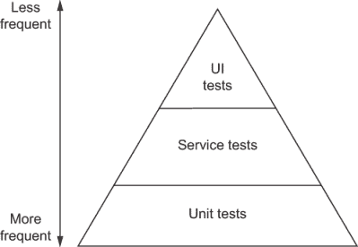

图 2.1 迈克·科恩的测试金字塔

它将测试分为以下三个类别：

+   UI 测试

+   服务测试

+   单元测试

在金字塔中，测试的层级越高，它们运行的频率越低，提供的价值越大。顶部的测试很少，底部的测试很多。

单元测试证明了你的软件中最原子单位的品质：你的函数。服务测试确保这些函数作为服务整合时能正常工作。UI 测试通过用户界面与你的软件交互，从用户的角度验证你的工作。

金字塔各层的尺寸表示我们应该编写多少种此类测试。它们在金字塔中的位置暗示了这些测试提供的保证有多强。测试在金字塔中的位置越高，它的价值就越大。

回到我们的烘焙类比：单元测试类似于检查单个原料。这是一个相对快速且便宜的任务，可以在整体过程的早期多次进行，但与进一步的质量控制步骤相比，它提供的价值很小。单元测试位于金字塔的底部，因为我们有很多这样的测试，但它们的质量保证并不像其他测试那样严格。

服务测试类似于检查食谱的中间产品。与检查单个原料相比，这些测试相对更复杂，只能在整体过程的后期阶段进行。尽管如此，它们提供了更有力的证据，表明即将出现一个美味的芝士蛋糕。它们适合位于金字塔的中间部分，因为你应该有比单元测试更少的服务测试，并且因为它们提供了更强的质量保证。

UI 测试类似于完成芝士蛋糕后品尝它。它们告诉你最终产品是否符合你的预期。要执行这些测试，你必须已经完成了整个食谱，并且有一个成品。它们位于金字塔的顶部，因为这些测试应该是最不规律的，并且是提供最严格保证的测试。

金字塔的每一层测试都是建立在下一层之上的。它们都帮助我们断言最终产品的质量，但在不同的过程阶段。例如，如果没有新鲜的原料，你就无法做出豪华的面糊。此外，没有豪华的面糊，你就无法做出美味的芝士蛋糕。

警告：这个术语在整个行业中并不一致使用。你可能会看到人们用不同的名字来指代这些相同的类别。这些类别之间的界限模糊，就像我们在看到源代码时区分不同类型的测试一样。

迈克的金字塔在一般情况下是一个优秀的心智框架。将测试分为不同的类别对于确定我们应该编写多少每种类型的测试以及它们应该多久运行一次非常有帮助。但我发现按目标划分测试是有问题的，无论是功能、服务还是接口。

例如，如果你正在编写针对 Web 应用的测试，是否应该将其所有测试都视为 UI 测试？尽管你在测试客户端本身，但你可能需要对单个功能进行单独的测试，以及与 GUI 实际交互的其他测试。如果你的产品是一个 RESTful API，并且你通过发送 HTTP 请求来测试它，这是服务测试还是 UI 测试？尽管你在测试一个服务，但 HTTP API 是提供给用户的一个接口。

与其按测试的目标来划分测试，我建议我们根据测试的范围广度来区分测试。测试覆盖你软件的比重越大，它在金字塔中的位置就越高。

这个修订后的金字塔（如图 2.2 所示）也将测试分为三个类别，但标签不同，并使用每个测试的隔离级别作为其划分的主要标准。新的标签如下：

+   端到端测试

+   集成测试

+   单元测试


图 2.2 原始测试金字塔的修订版

单元测试与迈克原始的金字塔相同。它们验证软件的最基本的构建块：其函数。与第一章中单个函数直接交互的测试属于这一类别。这些测试的范围是最小的，并且只断言单个函数的质量。

集成测试验证软件的不同部分如何协同工作。调用函数并检查数据库中是否有更新项的测试属于这一类别。第一章中的集成测试示例确保只能将可用的项目添加到购物车中。这些测试的范围比单元测试的范围更广，但比端到端测试的范围小。它们断言过程中间步骤的质量。

端到端测试从用户的角度验证您的应用程序，尽可能将您的软件视为黑盒。控制网络浏览器并通过点击按钮和验证标签与您的应用程序交互的测试属于这一类别。端到端测试相当于品尝一块奶酪蛋糕的样品。其范围是整个应用程序及其功能。

与现实世界一样，测试不一定需要属于某一类别或另一类别。很多时候，它们会介于各组之间，这是可以的。这些类别并不是为了我们在每个测试上方写标签而存在的。它们存在是为了指导我们编写更好、更可靠的软件，指示我们应该编写哪些测试，何时编写，以及编写多少。有关不同类型测试不同方面的详细比较，请参阅表 2.1。

表 2.1 各类测试的特点

|  | 单元测试 | 集成测试 | 端到端测试 |
| --- | --- | --- | --- |
| **目标** | 单个函数 | 可观察行为和多个函数之间的集成 | 面向用户的功能 |
| **数量** | 许多——每个函数几个测试 | 比较频繁——每个可观察行为几个测试 | 稀疏——每个功能几个测试 |
| **速度** | 非常快——通常几毫秒 | 平均——通常几秒以内 | 慢——通常几秒或更复杂的情况下几分钟 |
| **执行频率** | 在函数开发过程中多次执行 | 在功能开发过程中定期执行 | 功能完成时 |
| **反馈级别** | 单个函数的具体问题输入和输出 | 问题行为 | 错误的功能 |
| **成本** | 便宜——通常规模小，更新、运行和理解速度快 | 中等——中等规模，执行速度合理 | 贵——运行时间长，往往更易出错且复杂 |
| **对应用程序的了解** | 互连——需要直接访问代码本身；处理其功能 | 处理功能，但也通过直接访问代码；需要访问数据库、网络或文件系统等组件 | 尽可能不了解代码；通过用户界面与应用程序交互 |
| **主要目标** | 在开发期间提供快速反馈，帮助重构，防止回归，并通过提供使用示例来记录代码的 API | 保证第三方库得到充分使用，并检查被测试的单元是否执行了必要的副作用，例如记录或与独立服务交互 | 保证应用程序对最终用户有效 |

使用这个新的分类法，让我们思考如何将特定的测试示例进行分类，以及它们将如何融入我们修订后的测试金字塔中。

如果你的最终产品是一个 RESTful API，向其发送请求的测试就是一种端到端测试。如果你构建了一个与该 API 通信的 Web 应用程序，那么从用户角度打开网页并与它交互的测试也是端到端测试，但它们应该放在金字塔的更高位置。

对你的 React 组件的测试位于集成和单元层之间。你可能正在测试 UI，但你通过与 React API 集成，通过与应用程序的单个部分交互来引导你的开发过程。

注意：记住不要过于担心测试是否适合某一类别。金字塔作为一个思维框架，帮助你思考围绕软件想要创建的不同类型的保证。因为每个软件都是不同的，某些金字塔可能底部较窄或顶部较宽，但作为一般规则，你应该努力保持金字塔的形状。

## 2.2 单元测试

就像没有新鲜原料就无法制作美味的甜点一样，没有编写良好的函数就无法编写优秀的软件。单元测试帮助你确保软件的最小单元，即你的函数，按照你的预期行为。在本节中，你将编写你的第一个自动化测试：单元测试。

为了精确地可视化这些测试覆盖的范围，假设面包店的在线商店（其组件如图 2.3 所示）由一个 React 客户端和一个与数据库和电子邮件服务通信的 Node.js 后端组成。


图 2.3 面包店的网站基础设施

你将要编写的测试将覆盖这个应用程序的一小部分。它们将仅处理你服务器内的单个函数。

单元测试位于金字塔的底部，因此它们的范围，如图 2.4 所示，很小。随着我们向上移动，你会看到测试覆盖的表面会增大。

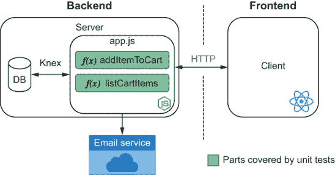

图 2.4 单元测试的范围

首先，编写列表 2.1 中所示的函数，这将作为你的测试目标。创建一个名为 `Cart.js` 的文件，并编写一个具有 `addToCart` 函数的 `Cart` 类。

单元测试 大多数与测试相关的文献将你的测试目标称为 *单元测试对象*。

注意：本书中的所有代码也都在 GitHub 上提供，地址为 [`github.com/lucasfcosta/testing-javascript-applications`](https://github.com/lucasfcosta/testing-javascript-applications)。

列表 2.1 Cart.js

```
class Cart {
    constructor() {
        this.items = [];
    }

    addToCart(item) {
        this.items.push(item);
    }
}

module.exports = Cart;
```

现在考虑如何测试 `addToCart` 函数。一种方法是将它集成到实际应用程序中并使用它，但这样我们会遇到我们在第一章中提到的涉及时间、可重复性和成本的问题。

在能够测试你的代码之前，必须编写整个应用程序，这需要编写太多的代码，在知道它是否工作之前。此外，如果它不起作用，将很难找到错误。一种更快的方法是编写代码，导入你的 `Cart`，使用其 `addToCart` 函数，并验证结果。

继续编写一个 `Cart.test.js` 文件，导入你的 `Cart`，使用其 `addToCart` 函数，并检查购物车中是否有你预期的商品，如列表 2.2 所示。

列表 2.2 Cart.test.js

```
const Cart = require("./Cart.js");

const cart = new Cart();
cart.addToCart("cheesecake");

const hasOneItem = cart.items.length === 1;
const hasACheesecake = cart.items[0] === "cheesecake";

if (hasOneItem && hasACheesecake) {                                      ❶
  console.log("The addToCart function can add an item to the cart");
} else {                                                                 ❷
  const actualContent = cart.items.join(", ");                           ❸

  console.error("The addToCart function didn't do what we expect!");
  console.error(`Here is the actual content of the cart: ${actualContent}`);

  throw new Error("Test failed!");
}
```

❶ 如果两个检查都成功，将在控制台打印成功信息

❷ 如果任何测试失败，将打印错误信息

❸ 在测试的错误信息中创建一个以逗号分隔的实际商品列表以显示

当你使用 `node` 执行此文件 `Cart.test.js` 时，它会告诉你代码是否能够成功将芝士蛋糕添加到购物车中——即时且精确的反馈。

恭喜！你已经编写了你的第一个测试。

测试设置一个场景，执行目标代码，并验证输出是否与预期相符。因为测试往往遵循这个相同的公式，所以你可以使用工具来抽象出代码的测试特定关注点。例如，这些关注点之一就是比较实际输出是否与预期输出匹配。

Node.js 本身带有一个内置模块，称为 `assert`，用于执行这些检查，在测试的上下文中，我们称之为 *断言*。它包含比较对象和如果实际输出与预期不符则抛出带有有意义信息的错误的功能。

注意：您可以在 [`nodejs.org/api/assert.html`](https://nodejs.org/api/assert.html) 找到 Node.js 内置 `assert` 库的文档。

使用 `assert` 的 `deepStrictEqual` 函数来比较实际输出与预期输出，从而缩短测试，如下所示。

列表 2.3 Cart.test.js

```
const assert = require("assert");
const Cart = require("./Cart.js");

const cart = new Cart();
cart.addToCart("cheesecake");

assert.deepStrictEqual(cart.items, ["cheesecake"]);       ❶

console.log("The addToCart function can add an item to the cart");
```

❶ 比较第一个和第二个参数，如果它们的值不同，则抛出一个有洞察力的错误

使用断言库可以使你摆脱确定对象是否相等的复杂逻辑。它还会生成有意义的输出，因此你不必自己操作字符串。

尝试向作为`assert.deepStrictEqual`第二个参数传递的数组中添加一个新项目，以便你可以看到断言失败时它产生的输出类型。

现在假设你实现了一个`removeFromCart`函数，如下所示。

列表 2.4 Cart.js

```
class Cart {
  constructor() {
    this.items = [];
  }

  addToCart(item) {
    this.items.push(item);
  }

  removeFromCart(item) {
    for (let i = 0; i < this.items.length; i++) {
      const currentItem = this.items[i];
      if (currentItem === item) {
        this.items.splice(i, 1);
      }
    }
  }
}

module.exports = Cart;
```

你会如何测试它？可能，你会写一些像以下这样的代码。

列表 2.5 Cart.test.js

```
const assert = require("assert");
const Cart = require("./Cart.js");

const cart = new Cart();                     ❶
cart.addToCart("cheesecake"); )              ❶
cart.removeFromCart("cheesecake");           ❷

assert.deepStrictEqual(cart.items, []);      ❸

console.log("The removeFromCart function can remove an item from the cart");
```

❶ 向购物车添加项目

❷ 移除最近添加的项目

❸ 检查购物车的项目属性是否为空数组

首先，你的测试通过向购物车添加芝士蛋糕来设置一个场景。然后它调用你想要测试的函数（在这种情况下，`removeFromCart`）。最后，它检查购物车的内容是否与你预期的相符。再次，同样的公式：设置、执行和验证。这个序列也被称为三个 A 模式：*安排（arrange）、行动（act）、断言（assert）*。

现在你有多个测试，考虑一下你如何将它们添加到你的`Cart.test.js`中。如果你直接在旧测试之后粘贴你的新测试，如果第一个测试失败，它将不会运行。你还将必须小心地为两个测试中的变量赋予不同的名称。但最重要的是，它将变得难以阅读和解释每个测试的输出。说实话，这会变得有些混乱。

测试运行器可以解决这个问题。它们使你能够以综合的方式组织和运行多个测试，提供有意义的且易于阅读的结果。

目前，在 JavaScript 生态系统中最受欢迎的测试工具被称为 Jest。它是我在这本书中会使用的主要工具。

Jest 是由 Facebook 创建的测试框架。它专注于简洁性，因此它包含了你开始编写测试所需的一切。

让我们安装 Jest，这样我们就可以更简洁地编写单元测试。使用命令`npm install -g jest`全局安装它。

没有配置文件`jest.config.js`或`package.json`文件，Jest 将不会运行，所以请记住将`package.json`文件添加到包含你的代码的文件夹中。

提示：你可以通过运行`npm init -y`快速向文件夹添加默认的`package.json`文件。

现在，你将不再手动使用 Node.js 运行测试文件，而是使用 Jest 并告诉它加载和执行测试。

注意：默认情况下，Jest 加载所有以`.test.js`、`.spec.js`结尾的文件，或者名为`tests`的文件夹内的测试。

通过将它们封装到 Jest 添加到全局作用域的 `test` 函数中，为 Jest 运行测试准备你的测试。你可以使用此函数在单个文件中组织多个测试，并指示应该运行什么。它将测试的名称作为第一个参数，将包含实际测试的回调函数作为第二个参数。

一旦将之前的测试封装到 Jest 的 `test` 函数中，你的 `Cart.test.js` 文件应该看起来像这样。

列表 2.6 Cart.test.js

```
const assert = require("assert");
const Cart = require("./Cart.js");

test("The addToCart function can add an item to the cart", () => {          ❶
  const cart = new Cart();                                                  ❷
  cart.addToCart("cheesecake");                                             ❸

  assert.deepStrictEqual(cart.items, ["cheesecake"]);                       ❹
});

test("The removeFromCart function can remove an item from the cart", () => {❺
  const cart = new Cart();                                                  ❻
  cart.addToCart("cheesecake");                                             ❻
  cart.removeFromCart("cheesecake");                                        ❼

  assert.deepStrictEqual(cart.items, []);                                   ❽
});
```

❶ 将第一个测试封装到不同的命名空间中，隔离其变量并生成更易读的输出

❷ 安排：创建一个空购物车

❸ 执行：执行 `addToCart` 函数

❹ 断言：检查购物车是否包含新添加的项目

❺ 将第二个测试封装到不同的命名空间中

❻ 安排：创建一个空购物车，并向其中添加一个项目

❼ 执行：执行 `removeFromCart` 函数

❽ 断言：检查购物车是否为空

注意你是如何通过委托该任务给 Jest 来消除之前用于确定如何生成输出的 `if` 语句的。每当测试失败时，Jest 都会提供精确的差异，以便你可以看到实际输出与预期输出有何不同。为了了解 Jest 的反馈有多好，尝试更改一个断言使其失败。

最后，为了避免在测试中使用除 Jest 之外的其他任何东西，将 `assert` 库替换为 Jest 自带的替代品：`expect`。`expect` 模块就像 Node.js 的 `assert` 模块一样，但它针对 Jest 进行了定制，有助于它提供更加有用的反馈。

与 `test` 函数一样，在 Jest 中运行测试时，`expect` 函数在全局范围内可用。`expect` 函数接受断言的实际主题作为参数，并返回一个对象，该对象提供了不同的 *匹配器* 函数。这些函数验证实际值是否与你的期望相符。

Jest 的 `deepStrictEqual` 等价于 `toEqual`。将第一个测试的 `deepStrictEqual` 替换为 `toEqual` 应该会使你的代码看起来类似于以下列表。

列表 2.7 Cart.test.js

```
test("The addToCart function can add an item to the cart", () => {
  const cart = new Cart();
  cart.addToCart("cheesecake");

  expect(cart.items).toEqual(["cheesecake"]);     ❶
});
```

❶ 比较 expect 的目标值（提供给 expect 的参数）与传递给 toEqual 的参数值

尝试通过在第二个测试中也替换 `deepStrictEqual` 来消除导入 Node.js 的 `assert` 库的必要性。

重要提示：在“严格”相等检查和“深度”相等检查之间存在差异。“深度相等”验证两个不同的对象是否具有相等的值。“严格相等”验证两个引用是否指向同一个对象。在 Jest 中，你使用 `toEqual` 执行深度相等检查，使用 `toBe` 执行严格相等检查。阅读 Jest 的文档了解 `toEqual` 匹配器的更多信息。它可在 [`jestjs.io/docs/en/expect#toequalvalue`](https://jestjs.io/docs/en/expect#toequalvalue) 找到。

到目前为止，你一直使用 Jest 的全局安装来运行你的测试，这并不是一个好主意。如果你使用的是仅在 Jest 最新版本中可用的断言，而你的某个同事的全局安装版本比你的旧，如果断言的行为从一个版本到另一个版本发生了变化，测试可能会失败。

你希望测试只在应用程序出现问题时失败，而不是当人们运行不同版本的测试框架时。

通过运行 `npm install jest --save-dev` 来安装 Jest 作为 `devDependency` 解决这个问题。它应该是一个 `devDependency`，因为它在你发布应用程序时不需要可用。它只需要在开发者的机器上可用，这样他们才能在下载项目并运行 `npm install` 后执行测试。

运行那个命令后，你会看到你的 `package.json` 文件现在列出了其 `devDependencies` 中的 Jest 的特定版本。

注意：你注意到你的 `package.json` 中的 Jest 版本前面有一个 `^` 吗？这个 `^` 表示当运行 `npm install` 时，NPM 将安装 Jest 的最新 `major` 版本。换句话说，最左边的版本号将不会改变。

理论上，在遵循语义版本化实践的情况下，任何非主要升级都应该向后兼容，但现实中它们并不总是这样。要强制 NPM 在运行 `npm install` 时安装 Jest 的确切版本，请删除 `^`。

我强烈建议读者了解更多关于语义版本化是什么以及它是如何工作的信息。[`semver.org`](https://semver.org) 是一个关于这个主题的优秀资源。

你的项目依赖项，包括 Jest，都在 `node_modules` 文件夹中。你可以通过运行位于 `node_modules/.bin/jest` 的构建版本来运行你在 `package.json` 中指定的 Jest 的特定版本。现在执行那个文件。你会看到它产生了与之前相同的输出。

尽管如此，每次我们想要运行测试时，仍然需要输入项目 Jest 安装的完整路径，这仍然很麻烦。为了避免这种情况，编辑你的 `package.json` 文件，并创建一个 `test` 脚本，这样每次运行 `npm test` 命令时都会执行项目的 Jest 安装。

在你的 `package.json` 中的 `scripts` 下添加一个 `test` 属性，并指定它应该运行 `jest` 命令，如下所示。

列表 2.8 package.json

```
{
  "name": "5_global_jest",
  "version": "1.0.0",
  "scripts": {
    "test": "jest"           ❶
  },
  "devDependencies": {
    "jest": "²⁶.6.0"
  }
}
```

❶ 当运行 npm test 时，会运行项目的 jest 可执行文件

在创建这个 NPM 脚本后，每当有人想要执行你的项目测试时，他们可以运行 `npm test`。他们不需要知道你使用的是哪个工具，也不必担心他们可能需要传递给它的任何其他选项。`package.json` 中的 `test` 脚本内的任何命令都会运行。

注意：当你运行在 `package.json` 脚本中定义的命令时，它会启动一个新的 shell 环境，该环境将 `./node_modules/.bin` 添加到其 `PATH` 环境变量中。因为这个 `PATH`，你不需要在命令前加上 `./node_modules/.bin` 前缀。默认情况下，你安装的任何库都将被优先考虑。

作为练习，我建议添加更多操作购物车中项目的函数，并使用其他 Jest 匹配器为它们编写测试。

一旦你添加了更多的测试，尝试重构 `Cart` 类，使其方法不会修改由购物车的 `items` 属性引用的数组，并查看测试是否仍然通过。

在重构时，你想要确保你可以在保持相同功能的同时以不同的方式塑造你的代码。因此，拥有严格的单元测试是在重构过程中获得快速和精确反馈的绝佳方式。

单元测试通过在编写代码时提供快速反馈，帮助你自信地迭代，正如我们在第九章详细讨论测试驱动开发时将看到的。因为单元测试的范围仅限于一个函数，它们的反馈是狭窄且精确的。它们可以立即告诉哪个函数失败了。这样的严格反馈使得编写和修复代码更快。

这些测试成本低廉且易于编写，但它们只覆盖了你应用程序的一小部分，它们提供的保证较弱。仅仅因为函数在几个独立情况下工作良好，并不意味着你的整个软件应用程序也能工作。为了最大限度地利用这些狭窄且成本低的测试，你应该编写很多这样的测试。

考虑到单元测试数量众多且成本低廉，运行速度快且频繁，我们将这些测试放在测试金字塔的底部，如图 2.5 所示。它们是其他测试建立的基础。

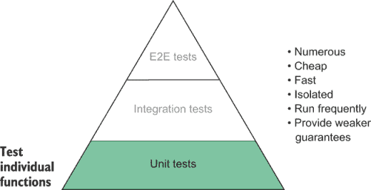

图 2.5 测试金字塔中单元测试的位置

## 2.3 集成测试

当查看应用程序的基础架构图时，你会看到集成测试的范围，如图 2.6 所示，比单元测试的范围更广。它们检查你的函数如何交互以及你的软件如何与第三方集成。

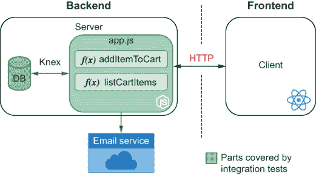

图 2.6 集成测试的范围

集成测试帮助你确保你的软件的不同部分可以协同工作。例如，它们帮助你验证你的软件是否适当地与第三方 RESTful API 通信，或者它是否可以操作数据库中的项目。

让我们从创建最经典的集成测试示例之一开始：一个与数据库通信的测试。在本节的示例中，我将使用 `knex` 和 `sqlite3` 包。Knex 是一个查询构建器，可以在 `sqlite3` 之上操作。Knex 将使您更容易与 `sqlite3` 数据库接口。因为这两个包需要在应用程序运行时可用，所以您必须将它们作为依赖项而不是开发依赖项安装。请运行 `npm install --save knex sqlite3` 来完成此操作。

注意：默认情况下，NPM 将保存这些包并自动将它们添加为依赖项。您可以通过在 `install` 命令后附加 `--save` 选项来使此操作明确。

将您的数据库配置放在项目根目录下名为 `knexfile.js` 的文件中。它应该包含以下内容。

列表 2.9 knexfile.js

```
module.exports = {
  development: {
    client: "sqlite3",                         ❶
    connection: { filename: "./dev.sqlite" },  ❷
    useNullAsDefault: true                     ❸
  }
};
```

❶ 使用 sqlite3 作为数据库客户端

❷ 指定数据库将存储其数据文件的文件

❸ 使用 NULL 而不是 DEFAULT 为未定义的键

与您在上一章中使用的 `Cart` 类不同，这次您将创建一个包含购物车 `id` 和其所有者名称的表。然后，您将创建一个单独的表来存储每个购物车中的项目。

注意：因为这本书是关于测试而不是数据库，所以我选择了最简单的数据库设计。要了解更多关于数据库系统，我强烈推荐由 Ramez Elmasri 和 Shamkant B. Navathe 编写的《数据库系统基础》（Pearson，2016）。

当使用 Knex 时，您通过 `migrations` 定义您表的结构。Knex 使用一个数据库表来跟踪已运行的迁移和新迁移。它使用这些记录来确保您的数据库始终具有当前的模式。

通过运行 `./node_modules/.bin/knex migrate:make --env development create_carts` 创建一个空迁移，使用您的项目安装的 Knex。此命令将在 `migrations` 目录中创建一个以当前时间开始并以 `create_carts.js` 结尾的文件。使用以下代码创建 `carts` 和 `cart_items` 表。

列表 2.10 CURRENTTIMESTAMP_create_carts.js

```
exports.up = async knex => {                                ❶
  await knex.schema.createTable("carts", table => {         ❷
    table.increments("id");
    table.string("username");
  });

  await knex.schema.createTable("carts_items", table => {   ❸
    table.integer("cartId").references("carts.id");         ❹
    table.string("itemName");
  });
};

exports.down = async knex => {                              ❺
  await knex.schema.dropTable("carts");
  await knex.schema.dropTable("carts_items");
};
```

❶ 导出的 up 函数将数据库迁移到下一个状态。

❷ 为应用程序的购物车创建一个包含用户名列和自动递增的 id 列的表

❸ 创建一个用于跟踪每个购物车中项目的 carts_items 表

❹ 创建一个引用 carts 表中购物车 id 的 cartId 列

❺ 导出的 down 函数将数据库迁移到之前的状态，删除购物车和 carts_items 表。

要执行 `migrations` 文件夹中的所有迁移，请运行 `./node_modules/.bin/knex migrate:latest`。

现在，您最终可以创建一个模块，其中包含向您的 SQLite 数据库添加项的方法，如下所示。

列表 2.11 dbConnection.js

```
const db = require("knex")(require("./knexfile").development);    ❶

const closeConnection = () => db.destroy();                       ❷

module.exports = {
  db,
  closeConnection
};
```

❶ 为开发数据库设置连接池

❷ 断开连接池

列表 2.12 cart.js

```
const { db } = require("./dbConnection");

const createCart = username => {
  return db("carts").insert({ username });                    ❶
};

const addItem = (cartId, itemName) => {
  return db("carts_items").insert({ cartId, itemName }); )    ❷
};

module.exports = {
  createCart,
  addItem
};
```

❶ 在购物车表中插入一行

❷ 在`carts_items`表中插入一行，引用传递的 cartId

尝试在另一个文件中导入`createCart`和`addItem`函数，并使用它们向你的本地`sqlite`数据库添加项目。完成操作后，别忘了使用`closeConnection`断开与数据库的连接；否则，你的程序将永远不会终止。

要测试`cart.js`模块中的功能，你可以遵循与我们在第一章中使用类似的模式。首先，你设置一个场景。然后调用你想要测试的函数。最后，检查它是否产生了预期的结果。

在将 Jest 作为`devDependency`安装后，为`createCart`编写一个测试。它应该确保数据库是干净的，创建一个购物车，然后检查数据库是否包含你刚刚创建的购物车。

列表 2.13 cart.test.js

```
const { db, closeConnection } = require("./dbConnection");
const { createCart } = require("./cart");

test("createCart creates a cart for a username", async () => {
  await db("carts").truncate();                                ❶
  await createCart("Lucas da Costa");
  const result = await db.select("username").from("carts");    ❷
  expect(result).toEqual([{ username: "Lucas da Costa" }]);
  await closeConnection();                                     ❸
});
```

❶ 删除购物车表中的每一行

❷ 选择购物车表中所有项目的用户名列的值

❸ 断开连接池

这次，你有异步函数需要通过使用`await`来等待。需要使用`await`将导致你将传递给 Jest 的`test`函数的函数变为`async`函数。

每当测试返回一个 promise——就像`async`函数做的那样——它将等待 promise 解决，然后再将测试标记为完成。如果返回的 promise 被拒绝，测试将自动失败。

返回 promise 的另一种选择是使用 Jest 提供的`done`回调。当调用`done`时，测试将完成，如下所示。

列表 2.14 cart.test.js

```
const { db, closeConnection } = require("./dbConnection");
const { createCart } = require("./cart");

test("createCart creates a cart for a username", done => {
  db("carts")
    .truncate()                                             ❶
    .then(() => createCart("Lucas da Costa"))
    .then(() => db.select("username").from("carts"))
    .then(result => {
      expect(result).toEqual([{ username: "Lucas da Costa" }]);
    })
    .then(closeConnection)                                  ❷
    .then(done);                                            ❸
});
```

❶ 删除购物车表中的每一行，并返回一个你将显式链式其他操作的 promise

❷ 断开连接池

❸ 完成测试

我认为这看起来更丑，但它也能工作。

警告：在将`done`参数添加到测试函数时要小心。如果你忘记调用它，你的测试会因为超时而失败。使用真值参数调用`done`也会导致你的测试失败。即使你从接受`done`作为参数的测试中返回一个 promise，你的测试也只有在`done`被调用时才会终止。

现在为`addItem`函数添加测试。

列表 2.15 cart.test.js

```
const { db, closeConnection } = require("./dbConnection");
const { createCart, addItem } = require("./cart");

// ...

test("addItem adds an item to a cart", async () => {
  await db("carts_items").truncate();
  await db("carts").truncate();

  const username = "Lucas da Costa";
  await createCart(username);
  const { id: cartId } = await db
    .select()
    .from("carts")
    .where({ username });                 ❶
  await addItem(cartId, "cheesecake");
  const result = await db.select("itemName").from("carts_items");

  expect(result).toEqual([{ cartId, itemName: "cheesecake" }]);
  await closeConnection();
});
```

❶ 选择购物车表中用户名列与测试中使用的用户名匹配的所有行

如果你执行这两个测试，你会遇到一个错误。错误说第二个测试“无法获取数据库连接”。这是因为一旦第一个测试完成，它就会通过调用`closeConnection`关闭连接池。为了避免这种错误，我们必须确保仅在所有测试运行之后才调用`closeConnection`。

由于在测试运行后执行此类清理操作相当常见，Jest 提供了名为`afterEach`和`afterAll`的钩子。这些钩子在全局范围内可用。它们接受作为参数的函数，这些函数将在每个测试之后或所有测试之后执行。

让我们在所有测试运行完毕后添加一个`afterAll`钩子来关闭连接池，并从测试内部移除对`closeConnection`的调用。

列表 2.16 cart.test.js

```
const { db, closeConnection } = require("./dbConnection");
const { createCart, addItem } = require("./cart");

afterAll(async () => await closeConnection());       ❶

// ...

test("addItem adds an item to the cart", async () => {
  await db("carts_items").truncate();
  await db("carts").truncate();

  const [cartId] = await createCart("Lucas da Costa");
  await addItem(cartId, "cheesecake");

  const result = await db.select().from("carts_items");
  expect(result).toEqual([{ cartId, itemName: "cheesecake" }]);
});
```

❶ 在所有测试完成后拆毁连接池，返回一个 promise 以便 Jest 知道钩子何时完成

Jest 还提供了`beforeAll`和`beforeEach`钩子，如列表 2.17 所示。因为你的所有测试在运行之前都需要清理数据库，所以你可以将这种行为封装到`beforeEach`钩子中。如果你这样做，就无需在每个测试中重复那些`truncate`语句。

列表 2.17 cart.test.js

```
const { db, closeConnection } = require("./dbConnection");
const { createCart, addItem } = require("./cart");

beforeEach(async () => {                      ❶
  await db("carts").truncate();
  await db("carts_items").truncate();
});
afterAll(async () => await closeConnection());

test("createCart creates a cart for a username", async () => {
  await createCart("Lucas da Costa");
  const result = await db.select("username").from("carts");
  expect(result).toEqual([{ username: "Lucas da Costa" }]);
});

test("addItem adds an item to the cart", async () => {
  const username = "Lucas da Costa";
  await createCart(username);
  const { id: cartId } = await db
    .select()
    .from("carts")
    .where({ username });
  await addItem(cartId, "cheesecake");
  const result = await db.select("itemName").from("carts_items");
  expect(result).toEqual([{ cartId, itemName: "cheesecake" }]);
});
```

❶ 在每个测试之前清除 carts 和 carts_items 表

这些测试有助于确保*你的*代码能够正常工作，以及你使用的 API 表现如你所预期。如果你有任何错误的查询，但它们仍然是有效的 SQL 查询，这些测试会捕捉到它们。

就像“单元测试”这个术语一样，“集成测试”对不同的人来说意味着不同的事情。正如我之前提到的，我建议你不要过于纠结于标签。相反，考虑你的测试范围有多大。范围越大，它在金字塔中的位置就越高。无论你称之为“集成”测试还是“端到端”测试，其实并没有那么重要。重要的是要记住，测试的范围越大，它提供的质量保证就越强，但运行时间就越长，需要的数量就越少。

考虑到单元测试的特点，它们应该位于金字塔的中间，如图 2.7 所示。

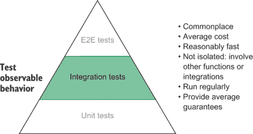

图 2.7 测试金字塔中集成测试的位置

当确保你的程序中的多个部分能够协同工作或正确集成第三方软件是基本要求时，你应该编写集成测试。

例如，如果你使用像 React 这样的库，你的软件必须适当地与之集成。React 的行为对于你的应用程序来说至关重要，因此你必须与 React 一起测试你的代码。同样的原则也适用于与数据库或计算机文件系统的交互。你依赖于这些外部软件的工作方式，因此检查你是否正确使用它们是明智的。

这种类型的测试提供了很大的价值，因为它帮助你验证*你的*代码是否按预期工作，以及你使用的库是否也是如此。尽管如此，重要的是要强调，集成测试的目标*不是*测试任何第三方软件本身。集成测试的目的是检查*你*是否正确地与之交互。

如果你正在使用一个库来发送 HTTP 请求，例如，你不应该为该库的`get`或`post`方法编写测试。你应该编写测试来查看你的软件是否正确地使用了这些方法。测试请求库是作者的责任，而不是你的。而且，如果他们的作者没有编写测试，那么重新考虑其采用可能更好。

在单元测试中将你的代码隔离出来可以非常有利于编写快速简单的测试，但单元测试不能保证你像预期的那样使用其他软件组件。

我们将在第三章中更多地讨论更隔离的测试与更集成测试之间的权衡。

## 2.4 端到端测试

端到端测试是最粗粒度的测试。这些测试通过以用户的方式与应用程序交互来验证你的应用程序。

他们不会像单元测试那样直接使用你的软件代码。相反，端到端测试从外部角度与之交互。如果可能使用按钮或访问页面而不是调用函数或检查数据库，他们会这样做。通过采取这种高度解耦的方法，他们最终覆盖了应用程序的大部分区域，如图 2.8 所示。他们依赖于客户端的正常工作以及后端所有软件组件的正常工作。

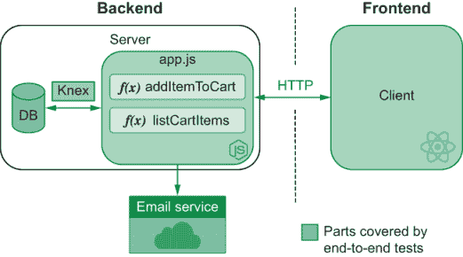

图 2.8 端到端测试的范围

用于验证是否可以添加商品到购物车的端到端测试不会直接调用`addToCart`函数。相反，它会打开你的 Web 应用程序，点击上面写着“添加到购物车”的按钮，然后通过访问列出其商品的页面来检查购物车的内容。这样的测试在测试金字塔的顶部。

即使是此应用程序的 REST API 也可以有自己的端到端测试。对你的商店后端进行的端到端测试会发送一个 HTTP 请求来添加商品到购物车，然后发送另一个请求来获取其内容。然而，这个测试在测试金字塔中位于上一个测试之下，因为它只覆盖了*仅*API。使用其 GUI 测试应用程序的范围更广，因为它包括 GUI 以及它发送请求的 API。

再次强调，将测试标记为端到端、集成或单元测试不是我们的主要目标。测试金字塔旨在帮助我们了解测试的角色、价值和频率。端到端测试在金字塔（图 2.9）中的位置告诉我们，这类测试非常有价值，并且你需要较少的数量。只需几个就可以覆盖你应用程序的大部分区域。相比之下，单元测试关注单个函数，因此需要更频繁地进行。


图 2.9 端到端测试在测试金字塔中的位置

端到端测试避免使用应用程序的任何私有部分，因此它们非常接近用户的操作。你的测试越接近用户与你的应用程序交互，它们给你的信心就越大。因为端到端自动化测试最接近模拟真实用例场景，所以它们提供了最大的价值。

**注意** 在测试术语中，不了解应用程序内部结构的测试被称为*黑盒测试*。了解应用程序内部结构的测试被称为*白盒测试*。

测试不一定完全属于一个或另一个类别。它们越少依赖于应用程序的实现细节，它们就越像是“黑盒”。相反，对于更“白盒”的测试，情况也是如此。

这些测试通常需要更多的时间来运行，因此运行频率较低。与单元测试不同，每次保存文件时运行端到端测试是不可行的。端到端测试更适合开发过程的后期阶段。它们可以通过彻底检查应用程序的功能是否适用于客户，在允许开发者合并拉取请求或执行部署之前提供帮助。

### 2.4.1 测试 HTTP API

由于对 RESTful API 的测试只需要一个能够执行 HTTP 请求并检查响应的客户端，我们可以在 Jest 中编写它们。在这些示例中，你将使用`isomorphic-fetch`来执行 HTTP 请求。

这些测试将涵盖应用程序的整个后端，以及它暴露的 HTTP API，如图 2.10 所示。

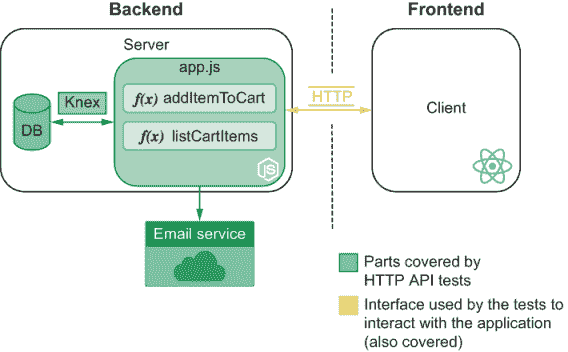

图 2.10 通过 HTTP API 解决后端问题的测试范围

你只需要 Jest 和`isomorphic-fetch`来编写测试，而不是应用程序的运行时，所以将它们作为开发依赖项安装。

你将要使用的构建 API 的 Web 框架是 Koa。它简单、有效且小巧。它非常适合我们在本书中想要做的事情：专注于测试。因为 Koa 没有自带路由器，所以你还需要安装`koa-router`来将不同的请求映射到不同的操作。

我们的服务器将有两个路由：一个用于向购物车添加项目，另一个用于从购物车中移除项目。要向购物车添加项目，客户端必须向`POST /carts/:username/items/:item`发送包含项目数组的请求体。要检索购物车的商品内容，他们必须向`GET /carts/:username/items`发送请求。

为了使这个测试尽可能简单，目前请避免接触数据库。专注于编写测试，并保持用户购物车状态在内存中。

以下代码将在端口`3000`上启动一个服务器。这个服务器可以添加和检索购物车的商品。

列表 2.18 server.js

```
const Koa = require("koa");
const Router = require("koa-router");

const app = new Koa();
const router = new Router();

const carts = new Map();                                      ❶

router.get("/carts/:username/items", ctx => {                 ❷
  const cart = carts.get(ctx.params.username);
  cart ? (ctx.body = cart) : (ctx.status = 404);              ❸
});

router.post("/carts/:username/items/:item", ctx => {          ❹
  const { username, item } = ctx.params;
  const newItems = (carts.get(username) || []).concat(item);
  carts.set(username, newItems);
  ctx.body = newItems;                                        ❺
});

app.use(router.routes());                                     ❻

module.exports = app.listen(3000);                            ❼
```

❶ 存储应用程序状态的 Map

❷ 处理对 GET /carts/:username/items 的请求，列出用户的购物车中的商品

❸ 如果购物车已被找到，应用程序将返回 200 状态码和找到的购物车。否则，它将返回 404 状态码。

❹ 处理向 POST /carts/:username/items/:item 发送的请求，向用户的购物车添加项目

❺ 返回购物车的新内容

❻ 将路由附加到 Koa 实例

❼ 将服务器绑定到端口 3000

注意：我选择了 Koa 和 `koa-router`，因为它们很受欢迎，并且 API 直观。如果你不熟悉 Koa 或 `koa-router`，你可以在 [`koajs.com`](https://koajs.com) 和 [`github.com/ZijianHe/koa-router`](https://github.com/ZijianHe/koa-router) 找到文档。

如果你更熟悉其他框架，如 Express 或 NestJS，请不要犹豫，使用它。端到端测试不应该关心你如何实现服务器，只要你的实现对于相同的请求提供相同的输出即可。

端到端测试只关心从用户的角度来看你的应用程序。

现在，编写一个使用 HTTP 请求添加项目到购物车并检查购物车内容的测试。

即使你正在发送 HTTP 请求而不是调用函数，你的测试的一般公式应该是相同的：*arrange*，*act*，*assert*。

为了更容易执行请求，你可以在测试中添加以下辅助函数。

列表 2.19 server.test.js

```
const fetch = require("isomorphic-fetch");

const apiRoot = "http://localhost:3000";

const addItem = (username, item) => {                                    ❶
  return fetch(`${apiRoot}/carts/${username}/items/${item}`, {
    method: "POST"
  });
};

const getItems = username => {                                           ❷
  return fetch(`${apiRoot}/carts/${username}/items`, { method: "GET" });
};
```

❶ 向添加用户购物车项目的路由发送 POST 请求

❷ 向列出用户购物车内容的路由发送 GET 请求

在添加了这些辅助函数之后，你就可以在测试本身中使用它们，使测试比其他方式更短。

列表 2.20 server.test.js

```
require("./server");

// Your helper functions go here...

test("adding items to a cart", async () => {
  const initialItemsResponse = await getItems("lucas");             ❶
  expect(initialItemsResponse.status).toEqual(404);                 ❷

  const addItemResponse = await addItem("lucas", "cheesecake");     ❸
  expect(await addItemResponse.json()).toEqual(["cheesecake"]);     ❹

  const finalItemsResponse = await getItems("lucas");               ❺
  expect(await finalItemsResponse.json()).toEqual(["cheesecake"]);  ❻
});
```

❶ 列出用户的购物车中的项目

❷ 检查响应的状态是否为 404

❸ 向用户购物车添加项目的请求

❹ 检查服务器是否响应了购物车的新内容

❺ 再次发送请求以列出用户的购物车中的项目

❻ 检查服务器的响应是否包含你添加的项目

运行这个测试，看看会发生什么。你会注意到测试通过了，但 Jest 没有退出。为了检测导致这种情况的原因，你可以使用 Jest 的 `detectOpenHandles` 选项。当使用此标志运行 Jest 时，它会告诉你什么阻止了你的测试退出。

注意：如果你使用 NPM 脚本来运行 Jest，就像我们之前做的那样，请向其中添加 `--` 并然后添加你想要传递给脚本的选项。例如，要将 `--detectOpenHandles` 传递给 Jest，你需要运行 `npm test -- --detectOpenHandles`。

当你使用此选项时，Jest 会警告你说问题来自 `app .listen`。

```
Jest has detected the following 1 open handle potentially keeping Jest from  exiting:

  ●  TCPSERVERWRAP
      21 | app.use(router.routes());
      22 |
    > 23 | app.listen(3000);
         |     ^
      24 |
      at Application.listen (node_modules/koa/lib/application.js:80:19)
      at Object.<anonymous> (server.js:23:5)
```

你在测试运行之前启动了服务器，但在测试完成后没有停止它！

为了避免测试永远不退出，Jest 允许你使用 `forceExit` 选项。如果你将此选项添加到运行 Jest 的 NPM 脚本中，如以下所示，你可以确保在运行 `npm test` 时测试将**总是**退出。

列表 2.21 package.json

```
{
  "name": "1_http_api_tests",
  "version": "1.0.0",
  "scripts": {
    "test": "jest --forceExit"    ❶
  },
  "devDependencies": {
    "isomorphic-fetch": "².2.1",
    "jest": "²⁶.6.0"
  },
  "dependencies": {
    "koa": "².11.0",
    "koa-router": "⁷.4.0"
  }
}
```

❶ 运行项目的 jest 可执行文件，包括 forceExit 选项

避免测试挂起的一个更优雅的方法是在它们完成后停止服务器。Koa 允许你通过调用其 `close` 方法来关闭你的服务器。添加一个调用 `app.close` 的 `afterAll` 钩子应该足以使你的测试优雅地退出。

列表 2.22 server.test.js

```
// Assign your server to `app`
const app = require("./server");

// Your tests...

afterAll(() => app.close());       ❶
```

❶ 所有测试完成后停止服务器

如果你清理了你的打开句柄，你就不需要使用 `forceExit` 选项。避免这个选项更明智，因为它允许你确保应用程序没有持有任何外部资源，例如数据库连接。

作为练习，添加一个从购物车中删除项目的路由，然后为它编写一个测试。别忘了，因为你的服务器将状态保存在内存中，你必须在每次测试之前清理它。如果你需要帮助来弄清楚如何做到这一点，请查看包含本书示例的存储库[`github.com/lucasfcosta/testing-javascript-applications`](https://github.com/lucasfcosta/testing-javascript-applications)，以找到完整的解决方案。

为 HTTP API 编写测试是确保服务遵循既定“契约”的绝佳方法。当多个团队必须开发不同的服务时，这些服务必须具有明确定义的通信标准，你可以通过测试来强制执行这些标准。测试将帮助防止服务之间无法通信。

HTTP API 测试的范围很广，但仍然比针对 GUI 的测试范围窄。包含 GUI 的测试检查整个应用程序，而 HTTP API 的测试仅探测其后端。由于这种范围上的差异，我们将测试金字塔中的端到端测试区域细分，并将 HTTP API 测试放在 GUI 测试之下，如图 2.11 所示。

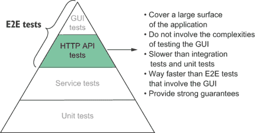

图 2.11 HTTP API 测试在测试金字塔中的位置

### 2.4.2 测试 GUI

GUI 测试覆盖你的整个应用程序。它们将使用其客户端与后端交互，因此会触及你的堆栈的每一块，如图 2.12 所示。

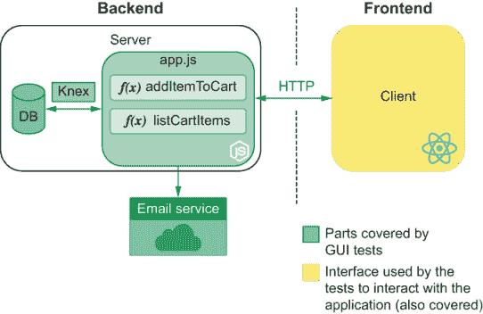

图 2.12 GUI 测试的范围

编写 GUI 的端到端测试涉及特定的要求，因此需要特殊的工具。

用于端到端测试 GUI 的工具需要能够与网页元素（如按钮和表单）交互。由于这些要求，它们需要能够控制真实浏览器。否则，测试将无法精确地模拟用户的行为。

目前，最流行的 UI 测试工具是 Cypress、TestCafe 和 Selenium。你可以使用这些工具通过 JavaScript 控制它们，使浏览器与你的应用程序交互。

UI 测试的整体结构与我们已经看到的测试类型相似。UI 测试仍然需要你设置场景、执行操作，然后进行断言。UI 测试与其他类型测试的主要区别在于，你的操作不是仅仅调用函数或执行请求，而是通过浏览器进行，断言依赖于网页的内容。

尽管测试的三个 A 模式（即自动化、敏捷和适应性）适用于 UI 测试，但设置测试运行环境的整个过程往往更为复杂，尤其是当你需要启动整个应用程序及其所有独立服务时。你可能需要处理的不仅仅是单一软件，而是多个。

GUI 测试也揭示了众多新的关注点，大多与真实浏览器行为的非规律性有关。等待页面加载、文本渲染、元素准备交互，或网页执行 HTTP 请求并更新自身，都是通常令人头疼的操作。它们往往不可预测，不同的机器完成这些操作所需的时间可能不同。

由于这些测试覆盖了应用程序的所有部分，它们在测试金字塔中占据最高的位置，如图 2.13 所示。它们运行时间最长，但同时也提供了最强有力的保证。

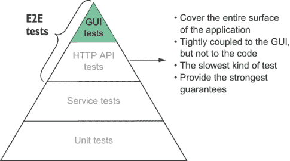

图 2.13 GUI 测试在测试金字塔中的位置

由于端到端测试 UI 与所有其他类型的测试显著不同，因此它有自己的独特章节。在第十章中，我们将比较各种工具，介绍最佳实践，并解决这种新型测试出现的问题。

### 2.4.3 验收测试和端到端测试并不相同

人们经常将验收测试与端到端测试混淆。验收测试是一种旨在从业务角度验证应用程序是否工作的实践。它验证软件是否对业务想要针对的最终用户来说是*可接受的*。

端到端测试是一种从工程角度验证整个应用程序的测试类型。它关注的是*正确性*而不是功能。

由于验收测试关注的是*功能性*需求——即应用程序*能做什么*——而这正是可以通过端到端测试来完成的，因此这两个概念之间可能存在一些重叠。

并非所有端到端测试都是验收测试，也并非所有验收测试都是端到端测试。你可以通过端到端测试来执行验收测试——而且很多时候你可能会这么做。

端到端测试非常适合这种验证，因为它们可以覆盖简单单元测试无法覆盖的方面，例如网页的外观或应用程序对特定操作的响应时间。

正如我之前提到的，由于端到端测试最接近用户行为，因此在验收测试方面提供了更强的保证。尽管如此，也可以使用单元测试或集成测试进行验收测试。例如，在测试发送给用户的电子邮件是否包含所需内容时，你可能想编写一个单元测试来检查生成的文本。

## 2.5 探索性测试和 QA 的价值

当你没有像路易斯那样的硅谷式预算时——你需要找到更便宜的方式来测试你的软件。并不是每个人都能负担得起一个充满质量分析师和测试员的整个部门。

随着自动化测试的兴起，手动 QA 的需求急剧下降。这并不是因为拥有一个专业的 QA 团队没有用，而是因为其中一些任务在自动化后可以更便宜、更快、更精确。

到目前为止，你还没有感觉到需要有一个质量分析师。每天，你都在学习如何编写更好的测试，这有助于你确保软件在没有太多人为干预的情况下运行。

到目前为止，你的同事可能已经足够可靠，可以测试他们自己的工作。在绝大多数情况下，你的部署可能没有引入任何关键故障。而且，让我们说实话，如果某人不能及时订购蛋糕，这并不是一场悲剧。失败的中位成本很低。缺陷肯定对业务有害，但考虑到关键故障很少是由于你严格的自动化测试造成的，因此雇佣人员进行手动测试的好处并不超过其成本。

除了失败的成本不足以证明雇佣一个质量分析师的合理性之外，引入一个质量分析师可能会增加发布更改所需的时间。机器的反馈速度远快于人类，并且通信开销更少。

但所有业务都在不断发展，尤其是当所有者将如此多的心——和糖——投入其中时。如果路易斯决定烘焙婚礼蛋糕，例如，他业务的失败成本可能会大幅增加。

婚礼蛋糕是人们一生中购买的最昂贵的碳水化合物之一。挑选一个很具挑战性，而且直到婚礼当天它到达时，担心它更是压力重重。

为了增加客户下单的可能性，路易斯还希望为他们提供各种定制功能。这些功能可能复杂到可以上传一个可以 3D 打印并放置在蛋糕顶部的模型——未来已经到来。

现在，路易斯有一个极其复杂且至关重要的功能，它将代表业务收入的大部分。这两个因素推动了质量分析师的必要性，现在其成本是合理的。在未来，你不得不发布的类似功能越多，这种需求就越明显。

复杂的功能通常有很多边缘情况，它们被用户接受的要求也更严格。我们不仅关心用户是否能够以任何形式塑造他们的蛋糕，还关心他们是否足够容易地做到这一点。重要的是不仅功能是否工作，而且它们是否满足我们的客户需求，以及它们是否易于使用。这种验收测试——至少到目前为止——几乎是不可能由机器完成的。

到目前为止，我们对 QA 专业人员和机器的比较相当不公平。我们一直在比较计算机擅长的事情和人类最不擅长的事情：快速且完美地执行重复性任务。对用户更有利的比较是在创造性任务和同理心方面。只有人类能够想到多种好奇的方式来使用一个功能。只有人们能够站在他人的立场上思考，考虑软件是否令人愉悦。

即使测试也需要有人来编写。机器只有在被教会如何执行测试之后才能执行测试。一旦你发现了一个阻止某人将奶酪蛋糕添加到购物车中的错误，因为你也在订购马卡龙，你就可以编写一个测试来避免这个特定的错误再次发生。问题是，直到你考虑过这种情况可能发生，否则不会有针对它的测试。只有在你最初看到它们发生的情况下，你才能添加防止错误再次发生的测试——回归测试。

程序员的测试通常确保当有人订购蛋糕时，软件将如何表现。质量保证团队的测试通常确保当有人订购-91344794 个蛋糕时，软件将如何表现。这种愿意测试好奇场景的意愿是雇佣 QA 专业人员的另一个优势。他们是探索性测试的优秀资源。

探索性测试是有用的，因为它可以覆盖程序员没有考虑到的案例。一旦质量保证团队发现新的错误，他们可以向开发团队报告，开发团队将修复它并添加一个测试来确保它不会再次发生。

能干的 QA 专业人员与开发团队协作。他们通过提供关于质量保证团队发现的错误的反馈，帮助开发者改进自动测试。

预防错误发生的最佳方式是编写自动测试，尝试重现它们。实际上，预防**特定**错误正是自动测试所能做到的全部。自动测试无法确定软件是否工作，因为它们无法测试所有可能的输入和输出。当质量保证团队帮助开发者扩展可能存在问题的输入和输出范围时，软件变得更加安全。

另一方面，开发者通过编写严格的自动测试来帮助质量保证团队更好地工作。软件能够自动完成的工作越多，它就能为质量保证团队节省更多时间，让他们去做只有人类才能完成的任务，比如探索性测试。

当雇佣 QA 人员时，你应该最关心的是它是否会在这两者之间产生对抗关系。这是最无效的事情之一。

如果 QA 团队将开发者视为对手，他们将会把所有修复都视为最高优先级，而不是与开发者沟通并就什么对业务更有利达成一致。例如，如果一个小缺陷的动画阻碍了一个包含关键新功能的发布，公司就会错过收入。这种固执会增加团队之间的挫败感和压力，并使发布周期更长。

当开发者对 QA 持有对抗态度时，他们会忽视问题。他们不会在将代码交给 QA 专业人士之前彻底测试他们的代码，因为最终他们认为质量是 QA 团队独有的责任，而不是企业的责任。他们认为他们的成功是尽可能快地发布功能，因此他们将所有测试委托给他人。这种粗心大意导致无法测试的软件，并最终导致更多错误被发布。

注意：有些人会争论在敏捷开发中永远不应该有 QA 团队。每当听到这种二分法论点时，我往往持怀疑态度。每个项目都是独特的，因此，对成功的约束和要求也不同。我相信敏捷的 QA 方法。我主张将 QA 整合到开发过程中。公司不应该在重大发布前运行一大批测试，而应该将 QA 整合到交付单个任务的过程中。这种方法缩短了反馈循环，同时仍然确保了令人满意的正确性和可用性水平。

## 2.6 测试、成本和收入

嘿，让我告诉你一个秘密：路易斯并不在乎你是否编写测试。只要你能在更短的时间内生产出可工作的软件，你不妨使用古老的巫术。在商业中，只有两件事是重要的：增加收入和降低成本。

企业关心漂亮的代码，因为它有助于程序员减少错误，并以快速和可预测的速度生产代码。组织良好的代码更容易理解，并且有更少的地方让错误隐藏。它减少了挫败感，使程序员的工作更加刺激。反过来，动态和令人满意的环境使他们保持动力，并使他们更长时间地留在公司。漂亮的代码不是目标——它是达到目标的手段。

反直觉的是，生产无缺陷的软件也不是目标。想象一下，你添加了一个错误，导致顾客每买 10 个芝士蛋糕就能免费得到一个马卡龙。如果这个错误提高了利润，你不妨保留它。当一个错误变成一个功能时，你不会仅仅为了遵守原始规范而修复它。我们修复错误，因为在绝大多数情况下，它们会减少收入并增加成本。

即使编写代码也不是你的工作。你的工作是帮助公司增加收入并减少成本。你编写的代码越少，越好，因为代码越少，维护成本越低。用 10 行代码实现新功能的花费远低于用一千行代码实现。当你写出解决问题的优雅解决方案时，你的业务并不会繁荣。当功能快速且易于实现，因此成本更低，并能带来更多价值时，你的业务才会繁荣。

TIP 帕特里克·麦肯齐（Patrick McKenzie）撰写了一篇关于商业经济学与软件工程交叉领域的精彩博客文章。这是一篇经典之作，我强烈推荐，可在[`www.kalzumeus.com/2011/10/28/dont-call-yourself-a-programmer`](https://www.kalzumeus.com/2011/10/28/dont-call-yourself-a-programmer)找到。

在第一章中，我们讨论了测试如何帮助企业在较低的成本下创造收入。但我们可以如何构建测试本身，使其尽可能具有成本效益？

向成本效益测试迈出的第一步是牢记**你必须维护的测试你才需要付费**。当路易斯（Louis）要求你进行更改时，他并不关心你只花了五分钟来更改应用程序，却花了两个小时来更新其测试。对业务来说，重要的是你花了超过两个小时来交付更改。你更新应用程序代码或测试所需的时间长短无关紧要。测试也是代码。维护一百行代码的成本与维护一百行测试的成本相同。编写糟糕的代码很昂贵，因为它需要花费大量时间来更改，同样，编写糟糕的测试也是如此。

减少测试成本的下一步是减少其中的重复。当你注意到重复的模式时，不要害怕创建抽象。创建单独的实用函数可以使测试更短，编写更快。使用抽象可以降低成本，并激励开发者更频繁地编写测试。例如，在关于端到端测试的章节中，我们编写了辅助函数，以便更容易执行 HTTP 请求。这些辅助函数使我们免于反复重写整个获取逻辑。让我们回顾一下这个例子，来谈谈好的和坏的模式。

考虑以下两个示例。

列表 2.23 badly_written.test.js

```
const { app, resetState } = require("./server");
const fetch = require("isomorphic-fetch");

test("adding items to a cart", done => {
  resetState();
  return fetch(`http://localhost:3000/carts/lucas/items`, {
    method: "GET"
  })
    .then(initialItemsResponse => {
      expect(initialItemsResponse.status).toEqual(404);
      return fetch(`http://localhost:3000/carts/lucas/items/cheesecake`, {
        method: "POST"
      }).then(response => response.json());
    })
    .then(addItemResponse => {
      expect(addItemResponse).toEqual(["cheesecake"]);
      return fetch(`http://localhost:3000/carts/lucas/items`, {
        method: "GET"
      }).then(response => response.json());
    })
    .then(finalItemsResponse => {
      expect(finalItemsResponse).toEqual(["cheesecake"]);
    })
    .then(() => {
      app.close();
      done();
    });
});
```

列表 2.24 well_written.test.js

```
const { app, resetState } = require("./server");
const fetch = require("isomorphic-fetch");

const apiRoot = "http://localhost:3000";

const addItem = (username, item) => {
  return fetch(`${apiRoot}/carts/${username}/items/${item}`, {
    method: "POST"
  });
};

const getItems = username => {
  return fetch(`${apiRoot}/carts/${username}/items`, { method: "GET" });
};

beforeEach(() => resetState());
afterAll(() => app.close());

test("adding items to a cart", async () => {
  const initialItemsResponse = await getItems("lucas");
  expect(initialItemsResponse.status).toEqual(404);

  const addItemResponse = await addItem("lucas", "cheesecake");
  expect(await addItemResponse.json()).toEqual(["cheesecake"]);

  const finalItemsResponse = await getItems("lucas");
  expect(await finalItemsResponse.json()).toEqual(["cheesecake"]);
});
```

想想哪一个更难阅读，以及为什么。

我发现第一个示例更难阅读。处理承诺和发送请求所需的逻辑混淆了每个测试的意图。这种复杂性使得理解测试做什么变得更加困难，因此，更改也花费了更长的时间。在第二个测试中，我们将获取和添加购物车项的逻辑封装到单独的函数中。这种抽象使得理解测试中的每个步骤更容易。我们越快理解测试做什么，就越快能够更改它，成本也就越低。

如果你必须更改服务器端点的 URL，考虑一下这些样本中哪一个更容易更新。

更新第二个代码样本要容易得多，因为你不需要重写每个测试中使用的 URL。通过更新这些函数，你会修复所有使用它们的测试。一次更改可以影响多个测试，因此可以降低它们的维护成本。当涉及到消除重复时，应用于你的代码的原则也适用于你的测试。

现在考虑你必须添加更多测试的情况。使用这些样本中的哪一个，这项任务会更困难？

如果你继续重复，将测试添加到第一个样本肯定需要更长的时间，因为你必须复制并调整上一个测试中的大量逻辑。你的测试套件将变得冗长，因此更难调试。相比之下，第二个样本便于编写新的测试，因为每个请求只需一行，并且易于理解。在第二个样本中，你也不必担心管理复杂的嵌套承诺链。

除了保持测试可读性和避免重复之外，降低测试成本的关键态度之一是使它们松散耦合。你的测试应该断言你的代码做什么，而不是*如何*做。理想情况下，你只有在应用程序表现出与测试预期不同的行为时才需要更改它们。

考虑以下函数。

列表 2.25 pow.js

```
const pow = (a, b, acc = 1) => {
  if (b === 0) return acc;
  const nextB = b < 0 ? b + 1 : b - 1;
  const nextAcc = b < 0 ? acc / a : acc * a;
  return pow(a, nextB, nextAcc);
};

module.exports = pow;
```

这个函数使用递归计算幂。对这个函数的一个良好测试应该提供给它一些输入并检查它是否产生正确的输出。

列表 2.26 pow.test.js

```
const pow = require("./pow");

test("calculates powers", () => {
    expect(pow(2, 0)).toBe(1);
    expect(pow(2, -3)).toBe(0.125);
    expect(pow(2, 2)).toBe(4);
    expect(pow(2, 5)).toBe(32);
    expect(pow(0, 5)).toBe(0);
    expect(pow(1, 4)).toBe(1);
});
```

这个测试对`pow`函数的工作方式没有任何假设。如果你重构了`pow`函数，它仍然应该通过。

重构`pow`函数，使其使用循环，然后重新运行你的测试。

列表 2.27 pow.js

```
const pow = (a, b) => {
  let result = 1;
  for (let i = 0; i < Math.abs(b); i++) {
    if (b < 0) result = result / a;
    if (b > 0) result = result * a;
  }

  return result;
}

module.exports = pow;
```

由于函数仍然正确，测试通过了。这个测试是成本效益的，因为它只写了一次，但能够多次验证你的函数。如果你的测试检查了无关的实现细节，那么每次你更新一个函数时，即使它仍然工作，你也必须更新它们。**你希望测试只在函数的可观察行为发生变化时失败**。

然而，这个规则有例外。有时你必须处理副作用或调用第三方 API。如果这些实现细节对你的软件功能至关重要，那么测试它们是明智的。让我们使用以下函数作为例子。

列表 2.28 cartController.js

```
const addItemToCart = async (a, b) => {
  try {
    return await db("carts_items").insert({ cartId, itemName });
  } catch(error) {
    loggingService(error);        ❶
    throw error;
  }
}

module.exports = addItemToCart;
```

❶ 记录一个错误

在这个函数中，你想要确保记录任何客户在将项目添加到购物车时可能遇到的错误。

如果你认为记录错误对于调试你的应用程序至关重要，你应该通过测试来强制执行它。你应该有测试来验证当发生错误时`addToCart`是否调用`loggingService`。在这种情况下，检查这个实现细节很重要，因为你想要强制执行它。

我喜欢把测试看作是保证。每当我想要确认我的应用程序以某种方式行为时，我都会为它编写一个测试。如果你要求一个函数以特定方式实现，你可以将这个要求编码到自动化测试中。

不要担心你是否在检查实现细节。担心你是否在检查*相关*的行为。

在断言`loggingService`是否被调用方面的一个替代方案是检查它写入的日志文件。但这种方法也有缺点。如果你决定更改`loggingService`的实现方式，使其将日志记录到不同的文件，那么`addItemToCart`的测试——以及可能依赖于这种相同行为的许多其他测试——也会失败，如图 2.14 所示。

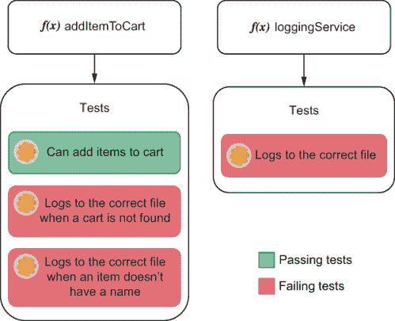

图 2.14 当你有多个测试检查`loggingService`是否写入正确的文件时，当你更改`loggingService`时，所有这些测试都会失败。因为你需要更新的测试更多，所以更改`loggingServices`的成本会增加。

通过断言`addToCart`调用`loggingService`（一个实现细节），你可以在`loggingService`更改时避免无关的测试失败，如图 2.15 所示。如果你对`loggingService`有严格的测试，那么当你更改`loggingService`写入的文件时，它们将是唯一会中断的测试。更少的破坏性测试意味着你需要更新的测试更少，因此维护它们的成本也更低。

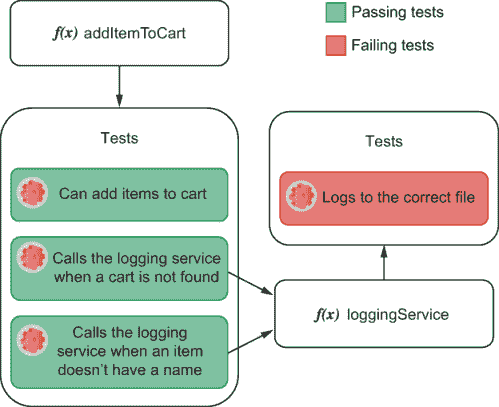

图 2.15 如果你更改`loggingService`写入的文件，它的测试将是唯一会失败的。`addItemToCart`测试将继续通过，因为它们正在做你期望的事情：使用日志服务。通过以这种方式构建你的测试，你将需要更新的测试更少，并且关于你的软件中哪些部分不符合测试的反馈将更加精确。

注意：当我们谈到第三章中的模拟、存根和间谍时，我们将讨论如何编写检查函数调用的测试。目前，最重要的是理解你为什么要这样做。

当你创建相互补充的测试时，你创造了我认为的*传递性保证*。例如，如果你有确保函数`a`工作的测试，那么只需检查其他函数是否调用了函数`a`，而不是在每次测试中都重新检查其行为，你就可以做得很好。

传递性保证是降低测试成本的好方法。它们与抽象一样工作——它们减少了耦合。不是所有测试都重复检查相同的行为，而是将这项责任委托给另一个测试。传递性保证是测试层面的封装。

如果你必须断言一个函数的实现细节，建议创建一个传递性保证，这样你就可以将这个检查封装到单独的测试中。尽管这种分离使测试远离现实，从而降低了其价值，但它可以显著降低其维护成本。

你的任务是平衡测试的维护成本与它们提供的价值。严格的测试可以提供优秀的细粒度反馈，但如果它们耦合度过高，维护成本会很高。另一方面，从不失败的测试不会产生信息。在可维护性和严格的质量控制之间取得平衡，是使一个好的测试员成为优秀测试员的关键。

小贴士：在测试方面，最热烈的辩论之一是人们是否应该为每行代码创建一个测试。

正如我在这本书中多次提到的，我不喜欢绝对化的思考。单词“总是”（always）是危险的，单词“从不”（never）也是如此。我想说的是，你的代码将要存活的时间越长，编写测试就越重要。

测试产生的价值取决于它运行的频率。如果一个测试为你节省了五分钟的手动测试时间，那么当你运行了第 15 次时，你就节省了一个小时。

例如，如果你在黑客马拉松中，你可能不应该添加太多测试（如果有的话）。在黑客马拉松中，你写的代码通常会比主办方提供的咖啡和披萨先消失。因此，它将没有足够的机会提供价值。

你可能应该避免编写测试的另一个情况是，如果你正在探索特定的 API 或只是尝试可能性。在这种情况下，先玩一玩，只有在你对想要做的事情有信心之后才编写测试可能更明智。

当决定你是否应该编写测试时，考虑一下，一段特定的代码将存活的时间越长，添加测试就越重要。

## 摘要

+   所有测试都遵循一个类似的公式：它们设置一个场景，触发一个动作，并检查产生的结果。通过使用三个 A 的助记符：安排（arrange）、行动（act）和断言（assert），这个模式很容易记住。

+   测试运行器是我们用来编写测试的工具。它们为你提供了组织和从测试中获得可读性和有意义输出的便捷方式。一些测试运行器，如 Jest，还附带断言库，这有助于我们比较动作的实际输出与预期输出。

+   为了方便测试的设置和拆卸过程，Jest 为你提供了可以在测试过程的各个阶段运行的钩子。你可以使用`beforeEach`在每次测试之前运行一个函数，使用`beforeAll`在所有测试之前运行一次，使用`afterEach`在每次测试之后运行，使用`afterAll`在所有测试之后运行一次。

+   测试金字塔是一个视觉隐喻，帮助我们根据它们应该运行的频率、应该存在的数量、它们的范围大小以及它们产生的质量保证强度，将测试类型分为不同的类别。随着我们攀登金字塔，测试变得越来越稀缺，价值更高，覆盖范围更广，运行频率更低。

+   单元测试是为了针对函数而设计的。它们对于在尽可能细粒度的层面上断言软件质量至关重要，提供快速而精确的反馈。这些测试导入你的函数，提供输入，并检查输出是否符合预期。

+   集成测试是为了确保应用程序的不同部分可以协同工作。它们验证你是否适当地使用了第三方库，例如数据库适配器。这些测试通过你的软件进行操作，但可能需要访问外部组件，如数据库或文件系统，以设置场景并检查你的应用程序是否产生了预期的结果。

+   端到端测试针对程序的所有层运行。它们不是直接调用函数，而是像用户一样与你的应用程序交互：例如，通过使用浏览器或发送 HTTP 请求。它们将应用程序视为一个“黑盒”。这些测试由于最接近真实用例场景，因此提供了最强的质量保证。

+   接受测试与端到端测试不同。接受测试侧重于验证你的应用程序是否满足功能需求。这些测试从业务角度验证你的用户是否可接受，考虑到你的目标用户。另一方面，端到端测试侧重于从工程角度验证你的应用程序是否**正确**。端到端测试可以作为接受测试，但并非所有接受测试都需要是端到端测试。

+   自动化测试不能完全取代质量保证专业人员。自动化测试通过让 QA 分析师有更多时间从事只有人类才能完成的任务，如探索性测试或提供以用户为中心的详细反馈，来补充 QA 分析师的工作。

+   质量保证（QA）和开发团队**必须**协作工作，而不是将对方视为对手。开发者应该编写严格的自动化测试来缩短反馈循环并支持 QA 的验证任务。QA 专业人员应与工程和产品团队沟通，以确定优先级，并提供有关如何改进产品的详细反馈，而不是将标准定得无法触及。

+   测试，就像代码一样，与它们相关的维护成本。你不得不更频繁地更新测试，它们就越昂贵。你可以通过保持代码可读性、避免重复、减少测试与应用程序代码之间的耦合，以及将验证分离到多个测试中以创建传递性保证，来降低测试的成本。
