# 3 测试技术

本章涵盖

+   全面组织你的测试

+   编写灵活且健壮的断言

+   为测试隔离和配置代码的部分

+   定义选择测试和不测试的策略

+   学习代码覆盖率是什么以及如何衡量它

编写良好的测试有两个主要特点：它们只在应用程序行为异常时才会失败，并且它们会精确地告诉你出了什么问题。在本章中，我们将关注帮助你实现这两个目标的技巧。

例如，如果你为`addToCart`函数编写了测试，你不希望该函数仍然正常工作时测试失败。如果测试确实失败了，它将产生额外的成本，因为你将不得不花费时间更新它。理想情况下，你的测试应该足够敏感，以捕捉尽可能多的错误，但足够健壮，只有在必要时才失败。

考虑到你的`addToCart`函数的测试因为一个很好的原因而失败了，但如果它们的反馈无法理解，或者当它们不应该失败时，10 个其他无关的测试失败了，那么这些测试仍然不会特别有帮助。一个精心设计的测试套件会为你提供高质量的反馈，以便尽可能快地解决问题。

在本章中，为了实现高质量的反馈和健壮且敏感的测试，我将重点关注如何组织测试、编写断言、隔离代码以及选择测试的内容和方式。

学习如何全面组织你的测试将导致更好的反馈和更少的重复。这将使测试更容易阅读、编写和更新。组织良好的测试是高效测试实践的开始。

扩展 Jest 的断言，理解它们的语义，并学习如何为每个特定情况选择最准确的断言，这将帮助你获得更好的错误信息，并使你的测试更加健壮，同时不失对错误的敏感性。隔离你的代码将帮助你更快地编写测试，并减少待测试单元的大小，使确定错误的根本原因变得更加容易。有时，甚至可能无法使用隔离技术来测试代码的特定部分。

但如果你无法确定你将测试什么，最重要的是你不会测试什么，那么这些学科都没有价值，这是我在本章末尾要涵盖的内容。你将学习如何使用这些技术来减少你必须编写的测试数量，而不会降低你的质量标准，从而降低成本。

由于没有一种适合所有情况的软件测试方法，我将解释每种情况下涉及的权衡，并专注于让你在每个案例中做出最佳决策。这种以结果为导向的方法将帮助你找到在敏感性和提供有用反馈的测试之间，以及不会增加软件维护负担的测试之间的更好平衡。

此外，在本章的最后部分，你将了解代码覆盖率。在其中，我将解释如何理解你的测试覆盖了哪些代码片段，以及最重要的是，哪些代码片段没有被覆盖。此外，你还将了解如何对代码覆盖率报告采取行动，以及为什么覆盖率测量有时可能会误导。

改进你的测试编写方式将节省你的开发时间并创建更可靠的保证。这将帮助你更快、更自信地交付更多软件。

## 3.1 组织测试套件

在路易斯的面包店，每个助手和糕点师都可以在任何时候轻松找到任何原料。每种原料都有自己的单独货架，而货架在面包店中的位置也因原料在烘焙过程中的常用程度而异。物品的排列有明确的逻辑。例如，面粉就放在鸡蛋货架旁边，靠近面包师将这些原料变成丝滑顺滑面糊的操作台。

这种系统性的安排使得面包店的员工更容易并行工作，并找到和使用他们需要的任何物品。因为同种类的原料都放在一起，也容易知道何时订购更多。路易斯的面包店不会让任何原料腐烂或缺货。

有序的测试对软件制作的影响与有序的厨房对蛋糕制作的影响相同。有序的测试通过允许开发者尽可能少地发生冲突来并行工作，从而促进协作。当开发者将测试紧密地放在一起时，他们减少了应用程序的整体维护负担。它们使软件易于维护，因为它们减少了重复，同时增加了可读性。组织你的测试的第一步是决定你将使用什么标准来区分它们。

让我们考虑你已经将下单和跟踪订单的代码拆分为两个独立的模块：`cartController`和`orderController`，如图 3.1 所示。

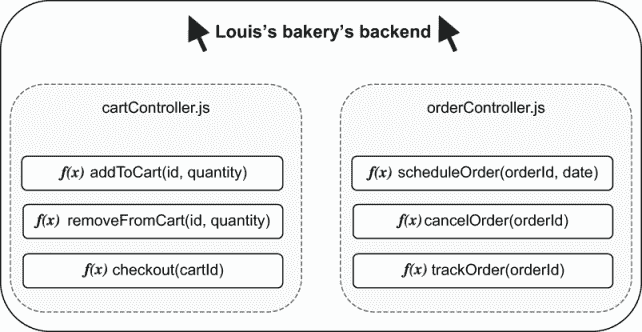

图 3.1 下单模块和订单跟踪模块

尽管这些模块相互集成，但它们具有不同的功能，因此它们的测试应该分别编写。将`cartController`和`orderController`的测试分别写入不同的文件已经是一个很好的开始，但将这些模块内的功能分开同样有价值。

要在文件内创建不同的测试组，你可以将它们嵌套在一个`describe`块中。例如，对于`cartController`模块，你的测试文件可能看起来如下。

列表 3.1 cartController.test.js

```
describe("addItemToCart", () => {                  ❶
    test("add an available item to cart", () => {
        // ...
    });

    test("add unavailable item to cart", () => {
        // ...
    });

    test("add multiple items to cart", () => {
        // ...
    });
});

describe("removeFromCart", () => {                ❷
    test("remove item from cart", () => {
        // ...
    });
});
```

❶ 将不同的测试分组到一个名为 addItemToCart 的块中

❷ 将不同的测试分组到一个名为 removeFromCart 的块中

你还可以使用 Jest 的 `describe` 块来将辅助函数限制在单个测试组的范围内。例如，如果你有一个用于向库存中添加项目的实用函数，而不是将其添加到文件的整个作用域中，你可以将其放置在需要它的 `describe` 块中，如下所示，并如图 3.2 所示。

列表 3.2 cartController.test.js

```
describe("addItemToCart", () => {
  const insertInventoryItem = () => {                             ❶
    // Directly insert an item in the database's inventory table
  };

  // Tests...
  test("add an available item to cart", () => {
    // ...
  });
});
```

❶ 此函数仅在 `describe` 块的回调函数中可用。

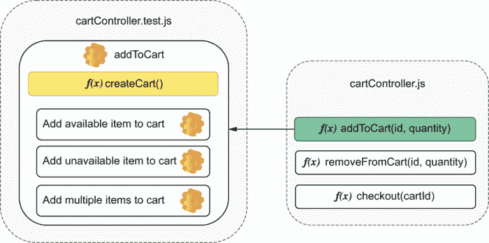

图 3.2 `addIteToCart` 测试及其辅助函数的分组

在 `describe` 块内嵌套实用函数有助于指示哪些测试需要它们。如果 `insertInventoryItem` 在 `addItemToCart` 函数的 `describe` 块内，你可以确信它仅对该测试组是必要的。当你以这种方式组织测试时，由于你知道在哪里查找它们使用的函数和变量，因此测试变得更容易理解且更易于更改。

这些 `describe` 块也会改变钩子的作用域。任何 `beforeAll`、`afterAll`、`beforeEach` 和 `afterEach` 钩子都相对于它们所在的 `describe` 块，如图 3.3 中的示例所示。例如，如果你想将特定的设置程序应用于文件中的几个测试，而不是所有测试，你可以将这些测试分组，并在这些测试的 `describe` 块中编写你的 `beforeEach` 钩子，如下所示。

列表 3.3 cartController.test.js

```
describe("addItemToCart", () => {
  const insertInventoryItem = () => { /* */ };

  let item;
  beforeEach(async () => {                   ❶
    item = await insertInventoryItem();
  });

  // Tests...
  test("add an available item to cart", () => {
    // You can use `item` here
  });
});

describe("checkout", () => {
  test("checkout non-existing cart", () => {
    // The previous `beforeEach` hook
    // does not run before this test
  });
});
```

❶ 在 `addItemToCart` 描述块中的每个测试之前运行一次

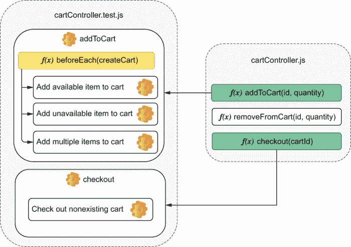

图 3.3 嵌套如何确定钩子将应用于哪些测试

注意：在上面的示例中，Jest 将等待 `insertInventoryItem` 钩子解决，然后才会继续进行测试。

就像在异步测试中一样，异步钩子在 Jest 继续执行之前会运行到完成。如果一个钩子返回一个 `promise` 或接受 `done` 作为参数，Jest 将等待 promise 解决或 `done` 被调用，然后才会运行文件中的其他钩子或测试。

这同样适用于每个钩子。例如，如果你使用了一个 `beforeAll` 钩子，它将在放置在 `describe` 块内的所有测试之前运行一次，如下所示，并如图 3.4 所示。

列表 3.4 cartController.test.js

```
describe("addItemToCart", () => {
  const insertInventoryItem = () => { /* */ };

  let item;
  beforeEach(async () => {                   ❶
    item = await insertInventoryItem();
  });

  // Tests...
});

describe("checkout", () => {
  const mockPaymentService = () => { /* */ };

  beforeAll(mockPaymentService);             ❷

  test("checkout non-existing cart", () => { /* */ });
});
```

❶ 在 `addItemToCart` 描述块中的每个测试之前运行

❷ 在 `checkout` 描述块中的所有测试之前运行一次

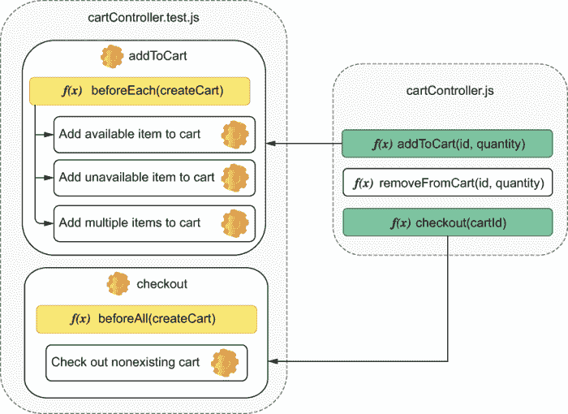

图 3.4 不同类型的钩子如何应用于不同的测试组

默认情况下，位于任何 `describe` 块之外的钩子适用于测试文件的整个范围，如下所示。

列表 3.5 cartController.test.js

```
beforeEach(clearDatabase);                      ❶

describe("addItemToCart", () => {
  const insertInventoryItem = () => { /* */ };

  let item;
  beforeEach(async () => {                      ❷
    item = await insertInventoryItem();
  });

  test("add an available item to cart", () => { /* */ });
});

describe("checkout", () => {
  const mockPaymentService = () => { /* */ };

  beforeAll(mockPaymentService);                ❸

  test("checkout nonexisting cart", () => { /* */ });
});

afterAll(destroyDbConnection)                   ❹
```

❶ 在文件中的每个测试之前运行，无论测试位于哪个 `describe` 块中

❷ 在 `addItemToCart` 描述块中的每个测试之前运行

❸ 在 `checkout` 描述块中的所有测试之前运行一次

❹ 在文件中的所有测试完成后运行一次

Jest 从最外层到最内层执行钩子。在上一个示例中，执行顺序将是以下：

1.  `beforeEach` ➝ `clearDatabase`

1.  `beforeEach` ➝ `insertInventoryItem`

1.  `test` ➝ 向购物车添加可用项目

1.  `beforeEach` ➝ `clearDatabase`

1.  `beforeAll` ➝ `mockPaymentService`

1.  `test` ➝ 检查不存在的购物车

1.  `afterAll` ➝ `destroyDbConnection`

嵌套生命周期钩子具有与嵌套实用函数类似的优点。你知道确切的位置在哪里查找它们，以及它们应用的范围。

### 3.1.1 分解测试

理想情况下，测试应该尽可能小，并专注于检查被测试单元的单一方面。

让我们以添加项目到购物车的路由的测试为例。这次，让我们考虑在添加项目到购物车时也会更新库存。为了符合新的规范，你将修改第二章中添加项目到购物车的路由。

列表 3.6 server.js

```
const Koa = require("koa");
const Router = require("koa-router");

const app = new Koa();
const router = new Router();

const carts = new Map();                                       ❶
const inventory = new Map();                                   ❷

router.post("/carts/:username/items/:item", ctx => {           ❸
  const { username, item } = ctx.params;
  if (!inventory.get(item)) {                                  ❹
    ctx.status = 404;
    return;
  }

  inventory.set(item, inventory.get(item) - 1);
  const newItems = (carts.get(username) || []).concat(item);   ❺
  carts.set(username, newItems);                               ❻
  ctx.body = newItems;                                         ❼
});

app.use(router.routes());

module.exports = {
  app: app.listen(3000),                                       ❽
  inventory,
  carts
};
```

❶ 存储用户购物车的内 容。每个用户名都对应一个表示购物车中项目的字符串数组。

❷ 存储库存的状态。每个项目名称都对应一个表示其数量的数字。

❸ 处理对 POST /carts/:username/items/:item 的请求，向用户的购物车添加项目

❹ 只有当项目有库存时才将项目添加到购物车中；如果没有，则响应状态为 404

❺ 创建一个包含请求参数中项的新数组

❻ 更新用户的购物车为新数组中的项

❼ 响应：返回新的项目数组

❽ 将服务器绑定到端口 3000，并通过 app 属性导出

注意：这次我想只关注添加项目到购物车的路由。因为你将不会编写端到端测试，所以你应该导出 `inventory` 和 `carts`。我们将在本章中编写的测试可以与您已经编写的端到端测试共存，因为它们的粒度级别不同。

尽管先前的端到端测试耦合度较低，并且从用户的角度提供了更强的保证，但本章的测试运行时间更短，可以一次覆盖应用的小部分，正如您将在分解测试时注意到的那样。

现在，按照以下方式编写此路由的测试文件。

列表 3.7 server.test.js

```
const { app, inventory, carts } = require("./server");
const fetch = require("isomorphic-fetch");

const apiRoot = "http://localhost:3000";

const addItem = (username, item) => {
  return fetch(`${apiRoot}/carts/${username}/items/${item}`, {
    method: "POST"
  });
};

describe("addItem", () => {
  test("adding items to a cart", async () => {
    inventory.set("cheesecake", 1);                                  ❶
    const addItemResponse = await addItem("lucas", "cheesecake");    ❷
    expect(await addItemResponse.json()).toEqual(["cheesecake"]);    ❸
    expect(inventory.get("cheesecake")).toBe(0);                     ❹

    expect(carts.get("lucas")).toEqual(["cheesecake"]);              ❺

    const failedAddItem = await addItem("lucas", "cheesecake");      ❻
    expect(failedAddItem.status).toBe(404);                          ❼
  });
});

afterAll(() => app.close());
```

❶ 安排：将库存中的芝士蛋糕数量设置为 1

❷ 行动：向添加芝士蛋糕到购物车的路由发送请求

❸ 断言：检查响应是否为仅包含新添加芝士蛋糕的数组

❹ 断言：验证库存中芝士蛋糕的数量为 0

❺ 断言：验证用户的购物车中只包含新添加的芝士蛋糕

❻ 行动：向用户的购物车发送请求以添加另一个芝士蛋糕

❼ 断言：检查最后一个响应的状态是否为 404

尽管对 `addItem` 的测试是严格的，但它对正在测试的路由的许多方面进行了断言。它验证以下内容：

1.  如果 `addItem` 更新了购物车的内 容

1.  如果路由的响应正确

1.  如果库存已更新

1.  如果路由拒绝向购物车添加已售罄的商品

如果应用程序不满足这些期望中的任何一个，测试将失败。当这个测试失败时，因为您依赖于四个不同的断言，您将无法立即知道问题是什么。因为测试在断言失败时停止，一旦修复了测试，您还需要重新运行它以查看断言之后的任何断言是否也会失败。

如果我们将这些检查分成多个测试，在单次执行中可以立即知道`addItem`路由的所有问题，如下所示。

列表 3.8 server.test.js

```
const { app, inventory, carts } = require("./server");
const fetch = require("isomorphic-fetch");

const apiRoot = "http://localhost:3000";

const addItem = (username, item) => {
  return fetch(`${apiRoot}/carts/${username}/items/${item}`, {
    method: "POST"
  });
};

describe("addItem", () => {
  beforeEach(() => carts.clear());                                   ❶
  beforeEach(() => inventory.set("cheesecake", 1));                  ❷

  test("correct response", async () => {                             ❸
    const addItemResponse = await addItem("lucas", "cheesecake");
    expect(addItemResponse.status).toBe(200);
    expect(await addItemResponse.json()).toEqual(["cheesecake"]);
  });

  test("inventory update", async () => {                             ❹
    await addItem("lucas", "cheesecake");
    expect(inventory.get("cheesecake")).toBe(0);
  });

  test("cart update", async () => {                                  ❺
    await addItem("keith", "cheesecake");
    expect(carts.get("keith")).toEqual(["cheesecake"]);
  });

  test("soldout items", async () => {                                ❻
    inventory.set("cheesecake", 0);
    const failedAddItem = await addItem("lucas", "cheesecake");
    expect(failedAddItem.status).toBe(404);
  });
});

afterAll(() => app.close());
```

❶ 在 addItem 描述块中的每个测试之前清空所有购物车

❷ 在每个测试之前，将库存中可用的芝士蛋糕数量设置为 1

❸ 尝试向用户的购物车中添加一块芝士蛋糕，并验证响应体和状态

❹ 验证在向用户的购物车添加商品后库存中芝士蛋糕的数量

❺ 尝试向用户的购物车中添加一块芝士蛋糕，并验证购物车的商品内容

❻ 验证当商品不可用时应该失败的请求的响应

由于这些测试很小，它们也更容易阅读。

每个测试中的断言越少，反馈越细粒度，您识别缺陷所需的时间就越少。

### 3.1.2 并行性

如果你有四个测试文件，每个文件需要一秒钟，依次运行它们将总共需要四秒钟，如图 3.5 所示。随着测试文件数量的增加，总执行时间也会增加。

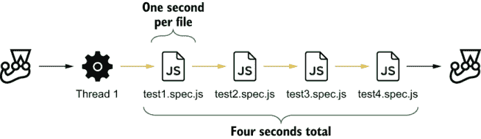

图 3.5 依次运行测试时会发生什么

为了加快测试速度，Jest 可以将它们并行运行，如图 3.6 所示。默认情况下，Jest 将并行化不同文件中的测试用例。

并行化测试 并行化测试意味着使用不同的线程同时运行测试用例。

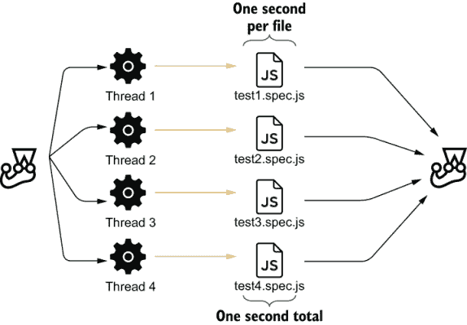

图 3.6 并行运行测试时会发生什么

如果测试很好地隔离，并行化测试可能是有益的，但如果它们共享数据，则可能存在问题。例如，如果您有两个使用相同数据库表的测试文件，它们的结果可能取决于它们运行的顺序。

如果您无法隔离测试，可以通过传递 Jest 的`runInBand`选项使它们按顺序运行。使测试慢而可靠比快而不可靠要好。

不稳定的测试 当一个测试的结果可能会改变，即使被测试的单元和测试本身保持不变时，该测试被称为*“不稳定的”*。

```
# To run tests sequentially
jest --runInBand

# Or, if you have encapsulated the `jest` command into an NPM script
npm test -- --runInBand
```

如果您有可以在测试套件内同时运行的测试，可以使用`test.concurrent`来指示 Jest 应该并发执行哪些测试，如下所示。

列表 3.9 addItemToCart.test.js

```
describe("addItemToCart", () => {
  test.concurrent("add an available item to cart", async () => { /* */ }); ❶
  test.concurrent("add unavailable item to cart", async () => { /* */ });  ❶
  test.concurrent("add multiple items to cart", async () => { /* */ });    ❶
});
```

❶ 这些测试将并发运行，所以请确保隔离每个测试使用的数据。

要控制同时运行的测试数量，你可以使用 `--maxConcurrencyOption` 并指定 Jest 可以同时运行多少个测试。要管理用于运行测试的工作线程数量，你可以使用 `--maxWorkers` 选项并指定要启动多少个线程。

并行化测试可以显著加快执行时间。而且，因为运行快的测试会激励你更频繁地运行它们，所以我强烈建议你采用这种方法。它的唯一缺点是，你必须小心确保测试得到良好的隔离。

➝ *在本书中，我将解释在构建每种应用时，拥有确定性测试的重要性。*

### 3.1.3 全局钩子

有时你可能需要在所有测试开始之前或结束后执行钩子。例如，你可能需要启动或停止数据库进程。

Jest 允许你通过两个配置选项 `globalSetup` 和 `globalTeardown` 来设置全局钩子。你可以在你的 `jest.config.js` 文件中指定这些选项。如果你还没有创建一个，你可以将它放在项目根目录中的 `package.json` 文件旁边。

小贴士：你可以使用 Jest 的 CLI 快速创建配置文件。当你运行 `jest --init` 时，你将需要回答几个问题，这些问题将用于生成你的 `jest.config.js` 文件。

传递给 `globalSetup` 和 `globalTeardown` 的文件名应该导出 Jest 在所有测试运行前后将调用的函数，如下所示。

列表 3.10 jest.config.js

```
module.exports = {
  testEnvironment: "node",
  globalSetup: "./globalSetup.js",           ❶
  globalTeardown: "./globalTeardown.js"      ❷
};
```

❶ Jest 在所有测试开始前会运行此文件导出的异步函数一次。

❷ Jest 在所有测试结束后会运行此文件导出的异步函数一次。

例如，一个初始化数据库的设置文件可能看起来像这样：

列表 3.11 globalSetup.js

```
const setup = async () => {
  global._databaseInstance = await databaseProcess.start()
};

module.exports = setup;
```

分配给 `global` 对象的值，如前面所示，也将可在 `globalTeardown` 钩子中使用。

假设你在 `globalSetup` 中设置了一个数据库实例并将其分配给 `_databaseInstance`，你可以在测试完成后使用相同的变量来停止该进程，如下所示。

列表 3.12 globalTeardown.js

```
const teardown = async () => {
   await global._databaseInstance.stop()
};

module.exports = teardown;
```

如果设置和清理函数是异步的，就像我们刚才写的那些，Jest 将在继续之前运行它们直到完成。

### 3.1.4 原子性

在组织测试时，请考虑任何测试都应能够在与其他所有测试隔离的情况下充分运行。单独运行一个测试应该与在成千上万的测试中运行它没有区别。

例如，考虑你之前为 `addItem` 函数编写的几个测试。为了这个例子，我已经从下面的 `describe` 块中移除了 `beforeEach` 钩子。

列表 3.13 server.test.js

```
// ...

describe("addItem", () => {
  test("inventory update", async () => {                        ❶
    inventory.set("cheesecake", 1);
    await addItem("lucas", "cheesecake");
    expect(inventory.get("cheesecake")).toBe(0);
  });

  test("cart update", async () => {                             ❷
    await addItem("keith", "cheesecake");
    expect(carts.get("keith")).toEqual(["cheesecake"]);
  });

  test("soldout items", async () => {                           ❸
    const failedAddItem = await addItem("lucas", "cheesecake");
    expect(failedAddItem.status).toBe(404);
  });
});

// ...
```

❶ 将可用的芝士蛋糕数量设置为 1，并检查向购物车添加一个芝士蛋糕是否足以更新库存

❷ 尝试向用户的购物车中添加一块芝士蛋糕，并检查购物车的内容是否为一个包含单个芝士蛋糕的数组

❸ 尝试添加一块芝士蛋糕，并期望服务器的响应状态为 404

在这种情况下，如果第一个测试已经运行，第二个测试将始终失败。另一方面，第三个测试依赖于第一个测试的成功。

当测试相互干扰时，确定错误的根本原因可能很困难。非原子性的测试会让你怀疑问题是在你的测试还是你的代码中。

具有原子性测试也有助于你更快地获得反馈。因为你可以单独运行一个测试，你不需要等待长时间测试套件完成才能知道你编写的代码是否工作。

为了保持测试的原子性，记住编写好的设置和拆卸钩子至关重要。为了保持原子性，向先前的示例中添加一个将芝士蛋糕添加到库存中的`beforeEach`钩子，并添加另一个清空用户购物车的钩子，如下所示。

列表 3.14 server.test.js

```
// ...

describe("addItem", () => {
  beforeEach(() => carts.clear());                     ❶
  beforeEach(() => inventory.set("cheesecake", 1));    ❷

  test("inventory update", async () => {
    await addItem("lucas", "cheesecake");
    expect(inventory.get("cheesecake")).toBe(0);
  });

  test("cart update", async () => {
    await addItem("keith", "cheesecake");
    expect(carts.get("keith")).toEqual(["cheesecake"]);
  });

  test("soldout items", async () => {
    const failedAddItem = await addItem("lucas", "cheesecake");
    expect(failedAddItem.status).toBe(404);
  });
});

// ...
```

❶ 在每个测试之前，清空所有购物车

❷ 在每次测试之前，将库存中的芝士蛋糕数量设置为 1

现在，即使有这些钩子，最后一个测试也会失败。你添加的第一个`beforeEach`钩子将一个`cheesecake`插入到库存中，因此不会导致最后一个测试中的`addItem`函数失败。

因为这个最后一个测试是唯一一个不需要芝士蛋糕可用的测试，所以最好避免另一个钩子。相反，你可以在测试本身中将芝士蛋糕的数量简单地设置为零，如下所示。

列表 3.15 server.test.js

```
// ...

describe("addItem", () => {
  beforeEach(() => carts.clear());
  beforeEach(() => inventory.set("cheesecake", 1));

  test("inventory update", async () => {
    await addItem("lucas", "cheesecake");
    expect(inventory.get("cheesecake")).toBe(0);
  });

  test("cart update", async () => {
    await addItem("keith", "cheesecake");
    expect(carts.get("keith")).toEqual(["cheesecake"]);
  });

  test("soldout items", async () => {
    inventory.set("cheesecake", 0);                               ❶
    const failedAddItem = await addItem("lucas", "cheesecake");
    expect(failedAddItem.status).toBe(404);
  });
});

// ...
```

❶ 将库存中的芝士蛋糕数量设置为 0

尽管以干净和简洁的方式封装重复行为非常出色，但钩子可能会使你的测试更难以阅读，因为它们增加了测试与其设置和拆卸过程之间的距离。

避免特定情况的钩子可以使测试更易于理解，因为它使得所有相关信息都更接近实际的测试代码。

在决定是否编写钩子或实用函数时，我建议你考虑你需要多频繁地重现某个场景。如果该场景对于套件中的几乎所有测试都是必需的，我建议你使用`hook`并将其视为该套件测试的“先决条件”。另一方面，如果你不需要在每次测试中都设置或拆卸完全相同的元素，实用函数可能是一个更好的选择。

## 3.2 编写好的断言

要识别独特的蛋糕，需要独特的面包师。在检查面糊的稠度或蛋糕的质地时，优秀的糕点师知道要寻找什么。没有严格的质量控制，你无法烘焙美味的甜点。

同样，优秀的工程师知道在他们所写的软件中寻找什么。他们编写健壮且精确的断言，尽可能多地捕获错误，而不显著增加维护成本。

在本节中，我将向您介绍一些技巧，帮助您编写更好的断言。您将学习如何使它们尽可能多地捕获错误，而无需频繁更新测试，从而减少额外的维护负担。

### 3.2.1 断言和错误处理

**没有断言的测试只有在应用程序代码无法运行时才会失败**。例如，如果您有一个 `sum` 函数，您必须添加断言以确保它完成它必须完成的工作。否则，它可能做任何事情。没有断言，您只是确保 `sum` 函数运行到完成。

为了确保您的测试包含断言，Jest 提供了使测试在未运行您期望的断言数量时失败的实用工具。

例如，考虑一个 `addToInventory` 函数，该函数向商店的库存中添加项目并返回新的可用数量。如果指定的数量**不是**一个数字，它应该失败，并且不应该向库存中添加任何项目，如下所示。

列表 3.16 inventoryController.js

```
const inventory = new Map();

const addToInventory = (item, n) => {
  if (typeof n !== "number") throw new Error("quantity must be a number");
  const currentQuantity = inventory.get(item) || 0;
  const newQuantity = currentQuantity + n;
  inventory.set(item, newQuantity);
  return newQuantity;
};

module.exports = { inventory, addToInventory };
```

在测试此函数时，您必须小心不要创建一个可能导致永远不运行断言的执行路径。以下是一个示例。

列表 3.17 inventoryController.test.js

```
const { inventory, addToInventory } = require("./inventoryController");

beforeEach(() => inventory.set("cheesecake", 0));

test("cancels operation for invalid quantities", () => {
  try {
    addToInventory("cheesecake", "not a number");
  } catch (e) {
    expect(inventory.get("cheesecake")).toBe(0); )      ❶
  }
});
```

❶ 只有在 addToInventory 调用抛出错误时才运行的断言

此测试将通过，但您不会知道它是否通过，是因为 `addToInventory` 函数没有向库存中添加项目，还是因为它没有抛出任何错误。

如果您注释掉抛出错误的行并重新运行测试，如以下所示，您将看到，尽管函数是错误的，但测试仍然通过。

列表 3.18 inventoryController.js

```
const inventory = new Map();

const addToInventory = (item, n) => {
  // Commenting this line still makes tests pass
  // if (typeof n !== "number") throw new Error("quantity must be a number");
  const currentQuantity = inventory.get(item) || 0;
  const newQuantity = currentQuantity + n;
  inventory.set(item, newQuantity);
  return newQuantity;
};

module.exports = { inventory, addToInventory };
```

为了确保您的测试将运行断言，您可以使用 `expect.hasAssertions`，这将导致如果测试没有运行至少一个断言，则测试失败。

请确保您的测试通过添加 `expect.hasAssertions` 来运行断言。

列表 3.19 inventoryController.js

```
const { inventory, addToInventory } = require("./inventoryController");

beforeEach(() => inventory.set("cheesecake", 0));

test("cancels operation for invalid quantities", () => {
  expect.hasAssertions();                                  ❶

  try {
    addToInventory("cheesecake", "not a number");
  } catch (e) {
    expect(inventory.get("cheesecake")).toBe(0);
  }
});
```

❶ 如果测试没有执行至少一个断言，则会导致测试失败

现在考虑您还想要添加一个断言来确保库存中只有一个项目。

列表 3.20 inventoryController.test.js

```
const { inventory, addToInventory } = require("./inventoryController");

beforeEach(() => inventory.set("cheesecake", 0));

test("cancels operation for invalid quantities", () => {
  expect.hasAssertions();

  try {
    addToInventory("cheesecake", "not a number");
  } catch (e) {
    expect(inventory.get("cheesecake")).toBe(0);
  }

  expect(Array.from(inventory.entries())).toHaveLength(1)       ❶
});
```

❶ 总是执行的断言

即使 `catch` 块没有执行，之前的测试仍然可能通过。测试中的 `expect.hasAssertions` 调用将确保**任何**断言运行，而不是**所有**断言都运行。

为了解决这个问题，您可以使用 `expect.assertions` 来显式确定您期望运行多少个断言。例如，如果您想运行两个断言，请使用 `expect.assertions(2)`。使用 `expect.assertions` 将导致您的测试在执行的断言数量与您确定的数量不匹配时失败，如以下所示。

列表 3.21 inventoryController.test.js

```
const { inventory, addToInventory } = require("./inventoryController");

beforeEach(() => inventory.set("cheesecake", 0));

test("cancels operation for invalid quantities", () => {
  expect.assertions(2);                                   ❶

  try {
    addToInventory("cheesecake", "not a number");
  } catch (e) {
    expect(inventory.get("cheesecake")).toBe(0);
  }

  expect(Array.from(inventory.entries())).toHaveLength(1)
});
```

❶ 如果测试没有执行两个断言，则会导致测试失败

由于断言计数并不总是实用的，一个更简单、更易读的替代方案是检查函数调用是否抛出错误。要执行此断言，请使用 Jest 的`toThrow`，如下所示。

列表 3.22 inventoryController.test.js

```
// ..

test("cancels operation for invalid quantities", () => {
  expect(() => addToInventory("cheesecake", "not a number")).not.toThrow();❶
  expect(inventory.get("cheesecake")).toBe(0);
  expect(Array.from(inventory.entries())).toHaveLength(1)
});
```

❶ 如果`addToInventory`函数抛出错误，则测试失败

由于`toThrow`通常使测试更简洁、更易读，我倾向于更喜欢它。我使用它来验证应该抛出错误和不应该抛出错误的函数。

### 3.2.2 松散断言

**编写测试的目标是当你的应用程序没有按照你的意愿执行时，测试应该失败**。在编写断言时，你想要确保它们足够敏感，以便在出现任何错误时使测试失败。

再次以你的`addToInventory`函数为例。对于这个函数，你可以编写一个断言来确保`addToInventory`的结果是`Number`类型。

列表 3.23 inventoryController.test.js

```
const { inventory, addToInventory } = require("./inventoryController");

beforeEach(() => inventory.clear());               ❶

test("returned value", () => {
  const result = addToInventory("cheesecake", 2);
  expect(typeof result).toBe("number");            ❷
});
```

❶ 清空库存

❷ 检查结果是否为数字

现在考虑这个断言允许多少种可能的结果。JavaScript 中的数字可以从`5e-324`精确到`1.7976931348623157e+308`。鉴于这个巨大的范围，很明显，断言接受的可能的值集太大，如图 3.7 所示。这个断言可以保证`addToInventory`函数不会返回例如`String`或`boolean`，但它不能保证返回的数字是正确的。顺便说一句，你知道在 JavaScript 中什么也被认为是`Number`吗？`NaN`，代表*不是*数字。

```
console.log(typeof NaN); // 'number'

```


图 3.7 类型断言接受的结果范围

一个断言接受的值越多，它就越***宽松***。

使这个断言接受更少的值——使其“更严格”——的一种方法就是期望结果大于某个特定的值，如下所示。

列表 3.24 inventoryController.test.js

```
const { inventory, addToInventory } = require("./inventoryController");

beforeEach(() => inventory.clear());

test("returned value", () => {
  const result = addToInventory("cheesecake", 2);
  expect(result).toBeGreaterThan(1);                 ❶
});
```

❶ 期望结果大于 1

如图 3.8 所示，`toBeGreaterThan`断言极大地减少了接受的结果数量，但它仍然比应有的宽松得多。

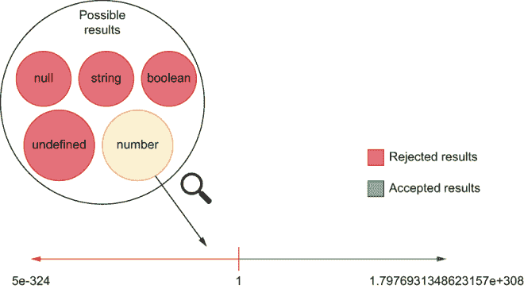

图 3.8 `toBeGreaterThan`断言接受的结果范围

你能写出的最严格且最有价值的断言是只允许单个结果通过的断言，如下面的列表和图 3.9 所示。


图 3.9 严格的`toBe`断言接受的结果范围

列表 3.25 inventoryController.test.js

```
const { inventory, addToInventory } = require("./inventoryController");

beforeEach(() => inventory.clear());

test("returned value", () => {
  const result = addToInventory("cheesecake", 2);
  expect(result).toBe(2);                           ❶
});
```

❶ 期望结果正好是 2

*理想情况下*，你的断言应该接受单个结果。如果你的断言通常允许许多结果，这可能是一个迹象表明你的代码**不是**确定性的，或者你对它了解不够充分。松散的断言使测试更容易通过，但它们使这些测试的价值降低，因为它们可能在应用程序产生无效输出时不会失败。**编写更紧密的断言会使测试在应用程序代码有问题时更难通过，从而更容易捕获错误**。

确定性代码 当给定相同的输入时，总是产生相同输出的代码被称为确定性代码。

例如，一个验证数组是否包含值的断言通常表明你不知道整个数组应该是什么样子。理想情况下，你应该编写一个检查整个数组的断言。

否定断言——确保输出不匹配另一个值的断言——也会生成松散的断言。例如，当你断言输出不是`2`时，你接受了一个巨大的值范围（所有类型的所有值，但不是`2`），如图 3.10 所示。**尽可能避免编写否定断言**。

当你想测试不依赖于你无法控制的因素，如真正的随机性时，编写松散的断言是可以接受的。假设你正在测试一个生成随机数字数组的函数。在测试这个函数时，你可能想检查数组的长度和其项的类型，但不需要检查数组的确切内容。

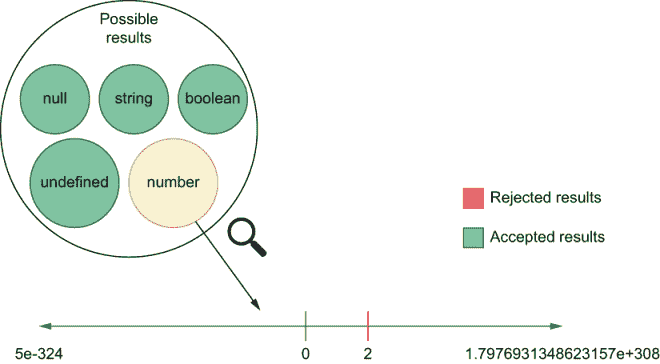

图 3.10 否定断言接受的结果范围

提示 尽管 Jest 有一系列断言——你可以在[`jestjs.io/docs/en/expect`](https://jestjs.io/docs/en/expect)中找到它们——但我建议读者尽可能坚持使用`toBe`和`toEqual`，因为它们非常严格。

为了更容易控制你的断言有多松散，Jest 有**非对称匹配器**。非对称匹配器允许你确定 Jest 应该松散验证特定输出的哪些方面，以及应该紧密验证哪些方面。

假设你有一个返回按名称索引的库存内容的函数。出于审计目的，此函数还将包括生成信息时的日期，如下所示。

列表 3.26 inventoryController.js

```
const inventory = new Map();

// ...

const getInventory = () => {
  const contentArray = Array.from(inventory.entries());
  const contents = contentArray.reduce(                   ❶
    (contents, [name, quantity]) => {
      return { ...contents, [name]: quantity };
    },
    {}
  );

  return { ...contents, generatedAt: new Date() };        ❷
};

module.exports = { inventory, addToInventory, getInventory };
```

❶ 创建一个对象，其键是库存项目的名称，其值是每个项目的相应数量

❷ 返回一个新对象，包括`contents`中的所有属性和一个日期

在测试此函数时，你的日期将在每次测试运行时更改。为了避免断言库存报告生成的确切时间，你可以使用非对称匹配器来确保`generatedAt`字段将包含一个日期。对于其他属性，你可以有紧密的断言，如下面的代码片段所示。

列表 3.27 inventoryController.test.js

```
const { inventory, getInventory } = require("./inventoryController");

test("inventory contents", () => {
  inventory
    .set("cheesecake", 1)
    .set("macarroon", 3)
    .set("croissant", 3)
    .set("eclaire", 7);
  const result = getInventory();

  expect(result).toEqual({              ❶
    cheesecake: 1,
    macarroon: 3,
    croissant: 3,
    eclaire: 7,
    generatedAt: expect.any(Date)       ❷
  });
});
```

❶ 期望结果与传递给 toEqual 方法的对象匹配

❷ 允许 `generatedAt` 属性为任何日期

非对称匹配器可以执行许多不同的验证。例如，它们可以检查一个字符串是否与正则表达式匹配，或者一个数组是否包含特定项。查看 Jest 的文档以了解哪些匹配器是默认可用的。

### 3.2.3 使用自定义匹配器

在上一节中，我们看到了尽管我们希望我们的断言尽可能严格，但在某些情况下，在验证值时仍然需要灵活。

就像将行为封装到函数中一样，你还可以将你的验证封装到新的匹配器中。

假设，例如，你正在编写一个测试来确保 `getInventory` 中的 `generatedAt` 字段不是未来的日期。你可以这样做的一种方法是通过手动比较时间戳，如下所示。

列表 3.28 inventoryController.test.js

```
const { inventory, getInventory } = require("./inventoryController");

test("generatedAt in the past", () => {
  const result = getInventory();

  const currentTime = Date.now() + 1;                                   ❶

  const isPastTimestamp = result.generatedAt.getTime() < currentTime;   ❷
  expect(isPastTimestamp).toBe(true);                                   ❸
});
```

❶ 将当前时间戳增加一毫秒以确保比较的时间戳不会相同。或者，你可以在调用 Date.now 之前等待一毫秒。

❷ 检查结果 `generatedAt` 属性是否小于测试生成的属性，并存储一个布尔值

❸ 检查存储的布尔值是否为真

当这个测试通过时，它可以非常出色，但当它失败时，它的反馈可能不如你预期的那么清晰。例如，尝试将 `generatedAt` 属性中的年份设置为 3000，以便你可以看到测试失败时会发生什么。

列表 3.29 inventoryController.js

```
const inventory = new Map();

// ...

const getInventory = () => {
  const contentArray = Array.from(inventory.entries());
  const contents = contentArray.reduce((contents, [name, quantity]) => {
    return { ...contents, [name]: quantity };
  }, {});

  return {
    ...contents,
    generatedAt: new Date(new Date().setYear(3000))      ❶
  };
};

module.exports = { inventory, addToInventory, getInventory };
```

❶ 创建一个公元 3000 年的日期

运行你的测试应该会产生以下输出：

```
FAIL  ./inventoryController.test.js
 ✕ generatedAt in the past (7ms)

 ● generatedAt in the past

   expect(received).toBe(expected) // Object.is equality

   Expected: true
   Received: false
```

正如你所见，Jest 生成的差异没有提供太多信息。它说你期望 `true` 是 `false`，但它没有告诉你断言的主题是什么。当测试以这样的通用差异失败时，你需要重新阅读其代码以确定出了什么问题，以及实际结果和预期结果之间的确切差异是什么。

为了获得更精确的断言，我们将使用 `jest-extended`。`jest-extended` 模块扩展了 Jest 的断言，为你提供了更好、更灵活的检查。

注意：你可以在 [`github.com/jest-community/jest-extended`](https://github.com/jest-community/jest-extended) 找到 `jest-extended` 和其断言的文档。

前往并安装 `jest-extended` 作为开发依赖项。

要设置 `jest-extended` 以使用其断言，更新你的 `jest .config.js` 文件，并将 `jest-extended` 添加到应在设置测试环境之后运行的文件列表中，如下所示。

列表 3.30 jest.config.js

```
module.exports = {
  testEnvironment: "node",
  setupFilesAfterEnv: ["jest-extended"]      ❶
};
```

❶ 通过 jest-extended 扩展 Jest 的断言

完成这些后，你将能够使用 `jest-extended` 中的任何断言。

为了使测试的反馈更清晰，我们将使用 `toBeBefore` 断言，该断言检查一个 `Date` 是否在另一个 `Date` 之前。更新您的测试，使其使用这个新的断言，如下所示。

列表 3.31 inventoryController.test.js

```
const { getInventory } = require("./inventoryController");

test("generatedAt in the past", () => {
  const result = getInventory();
  const currentTime = new Date(Date.now() + 1);          ❶
  expect(result.generatedAt).toBeBefore(currentTime);    ❷
});
```

❶ 创建一个比当前时间早一毫秒的日期。或者，您也可以在生成 `Date` 之前等待一毫秒。

❷ 期望结果中的 `generatedAt` 属性在上一行生成的日期之前

现在，当这个测试失败时，Jest 提供的反馈将更加精确：

```
FAIL  ./inventoryController.test.js
 ✕ generatedAt in the past (11ms)

 ● generatedAt in the past

   expect(received).toBeBefore()

   Expected date to be before 2020-02-23T15:45:47.679Z but received:
     3000-02-23T15:45:47.677Z
```

现在，您确切地知道测试检查了什么，以及两个日期之间的差异是什么。

使用精确断言可以使您通过指示 Jest 应该产生什么样的输出来提高测试反馈的质量。

使用精确断言的测试更容易阅读，修复所需时间也更短，因为更容易理解哪里出了问题。

### 3.2.4 循环断言

循环断言是比较您的应用程序代码与自身的断言。您应该避免循环断言，因为当比较代码的结果时，您的测试将 *永远不会* 失败。

假设，例如，您创建了一个返回库存内容的路由。此路由使用您已经拥有的 `getInventory` 函数，如下所示。

列表 3.32 server.js

```
// ...

router.get("/inventory", ctx => (ctx.body = getInventory()));

// ...
```

为了便于测试此路由，您可能会倾向于在测试中使用 `getInventory`。

列表 3.33 server.test.js

```
// ...

test("fetching inventory", async () => {
  inventory.set("cheesecake", 1).set("macarroon", 2);
  const getInventoryResponse = await sendGetInventoryRequest("lucas");

  // For the sake of this example, let's not compare the `generatedAt` field's value
  const expected = {                                             ❶
    ...getInventory(),
    generatedAt: expect.anything()                               ❷
  };

  // Because both the route and `expected` were generated based on `getInventory`
  // you are comparing two outputs which come from the exact same piece of code:
  // the unit under test!
  expect(await getInventoryResponse.json()).toEqual(expected);   ❸
});

// ...
```

❶ 将 getInventory 函数的结果中的属性复制到一个新对象中，并包含一个生成的 `generatedAt` 属性，其值是一个非对称匹配器

❷ 允许 `generatedAt` 属性具有任何值

❸ 比较服务器响应与测试中创建的对象

这种方法的问题在于，由于路由和测试都依赖于相同的代码片段 (`getInventory`)，您最终是在比较应用程序本身。如果 `getInventory` 路由存在问题，它不会导致这个测试失败，因为您期望的结果也是错误的。

例如，尝试将 `getInventory` 改变，使其为每个项目返回 `1000` 作为数量。

列表 3.34 server.test.js

```
const inventory = new Map();

const getInventory = () => {
  const contentArray = Array.from(inventory.entries());          ❶
  const contents = contentArray.reduce((contents, [name]) => {   ❷
    return { ...contents, [name]: 1000 };
  }, {});

  return { ...contents, generatedAt: new Date() };               ❸
};

module.exports = { inventory, addToInventory, getInventory };
```

❶ 使用库存条目创建一个键值对数组

❷ 创建一个对象，其键是库存项目名称，其值始终设置为 1000，代表每个项目的相应数量

❸ 将 contents 中的每个属性复制到一个新对象中，该对象还包含一个 `generatedAt` 键，其值为一个 `Date`

即使库存中项目的数量现在错误，您的路由测试仍然会通过。

如果您已经单独测试了应用程序的不同部分，循环断言通常不会成为大问题。例如，在上一个案例中，即使路由的测试没有捕获到错误，对 `inventoryController` 本身的彻底测试也会。

无论你是否可以在单独的测试中捕获它，即使测试不应该通过，路由的测试也会通过。这种不准确的反馈可能会导致混淆，如果你没有对`inventoryController`进行严格的测试，那么错误可能会悄悄地进入生产环境。

如果在断言中明确写出预期结果，那么这个测试将会更好。这将使测试更易于阅读，并有助于调试，如下所示。

列表 3.35 server.test.js

```
// ...

test("fetching inventory", async () => {
  inventory.set("cheesecake", 1).set("macarroon", 2);
  const getInventoryResponse = await sendGetInventoryRequest("lucas");
  const expected = {                                                   ❶
    cheesecake: 1,
    macarroon: 2,
    generatedAt: expect.anything()
  };

  // Notice how both the `actual` and `expected`
  // outputs come from different places.
  expect(await getInventoryResponse.json()).toEqual(expected);         ❷
});

// ...
```

❶ 不使用任何依赖项创建一个对象字面量

❷ 期望服务器的响应与测试中创建的对象字面量匹配

在可能的情况下，为你的测试创建单独的实用函数，而不是仅仅重用应用程序的代码。有一点重复或硬编码的预期结果比有永远无法失败的测试更好。

## 3.3 测试替身：模拟、存根和间谍

模拟、存根和间谍是用于修改和替换应用程序部分的对象，以简化或启用测试。作为一个整体，它们被称为测试替身。

+   **间谍**记录与函数使用相关的数据，而不干扰其实现。

+   **存根**记录与函数使用相关的数据，并改变其行为，无论是通过提供替代实现还是返回值。

+   **模拟**会改变一个函数的行为，但它们不仅记录其使用的信息，还预先编程了期望。

注意：工程师们经常混淆**模拟**、**存根**和**间谍**这些术语，尽管在正式上，这些术语有不同的定义。

尤其是在 Jest 的上下文中，你经常会看到人们将存根和间谍称为**模拟**。这种混淆发生是因为 Jest 的 API 和文档倾向于使用名称**模拟**来指代所有类型的测试替身。

具有讽刺意味的是，如果我们遵循最广泛接受的**模拟**定义，那么它就是 Jest 不包含的唯一类型的测试替身。

为了提高可读性和符合大多数人的词汇，在这本书中，我使用了**模拟**这个动词，意思是“用测试替身替换”。

在我们的第一个例子中，让我们考虑出于责任原因，你想要记录每次有人向库存中添加项目时的日志。

要实现此功能，你将使用`pino`，这是一个轻量级的库，其文档可以在[`getpino.io`](https://getpino.io)找到。请继续安装`pino`作为你应用程序的依赖项，如下所示。然后，创建一个`logger`文件，其中将包含你将使用的`logger`实例。我们将使用它来公开我们想要的日志功能。

列表 3.36 logger.js

```
const pino = require("pino");

const pinoInstance = pino();

const logger = {
  logInfo: pinoInstance.info.bind(pinoInstance),      ❶
  logError: pinoInstance.error.bind(pinoInstance)     ❶
};

module.exports = logger;
```

❶ 由于 bind 的存在，这些函数中的 this 值将始终是此文件中的 Pino 实例，而不是日志对象。

现在你有了日志记录器，修改`addToInventory`函数，使其在向库存中添加项目时记录，如下所示。

列表 3.37 inventoryController.js

```
const logger = require("./logger");

const inventory = new Map();

const addToInventory = (item, quantity) => {
  if (typeof quantity !== "number")
    throw new Error("quantity must be a number");
  const currentQuantity = inventory.get(item) || 0;
  const newQuantity = currentQuantity + quantity;
  inventory.set(item, newQuantity);
  logger.logInfo({ item, quantity }, "item added to the inventory");    ❶
  return newQuantity;
};

module.exports = { inventory, addToInventory };
```

❶ 记录添加到库存的项目

您可以通过运行 `node` 的 REPL 并执行以下代码来查看日志是如何工作的：

```
$ node
> const { addToInventory } = require("./inventoryController");
> addToInventory("cheesecake", 2);
```

这将导致你的日志记录器将类似以下内容写入你的控制台：

```
{
    "level":30,
    "time":1582531390531,
    "pid":43971,
    "hostname":"your-machine",
    "item":"cheesecake",
    "quantity":2,
    "msg":"item added to the inventory",
    "v":1
}
```

由于这个要求至关重要，让我们假设你决定添加一个测试来强制 `addToInventory` 正确记录传递给它的所有项目。

在这种情况下，日志是一个难以从 `addToInventory` 函数外部观察到的副作用。如果你的测试无法访问它，你将如何确保日志发生了？

为了解决这个问题，你将使用一个 *间谍*。**间谍可以记录对函数的任何调用**。在这种情况下，你将使用间谍来跟踪对 `logger.logInfo` 函数的调用，以便你可以在之后对这些调用进行断言。

注意：我们不想测试日志是否真的发生了。测试日志库（`pino`）是库作者的职责。在上面的示例中，我选择相信日志记录器是有效的。而不是添加冗余的测试，我只是检查日志方法是否以预期的参数被调用。

验证调用而不是日志记录器的实际行为简化了测试并使其更快，但这并不一定保证被测试的单元记录了任何信息。

验证日志本身将取决于端到端测试。这种类型的测试将能够访问日志记录器写入的文件或流。

选择要编写的测试类型，正如我们在上一章中讨论的，取决于你的目标和你可以投入多少来实现它。

为了实验你的第一个间谍，创建一个测试来测试日志功能，并使用 `jest.spyOn` 间谍 `logger.logInfo` 函数。一旦你有了 `logger.logInfo` 的间谍，调用 `addInventory` 函数并记录 `logger.logInfo` 以查看其内部内容。

列表 3.38 inventoryController.js

```
const logger = require("./logger");
const { addToInventory } = require("./inventoryController");

test("logging new items", () => {
  jest.spyOn(logger, "logInfo");      ❶
  addToInventory("cheesecake", 2);
  console.log(logger.logInfo);
});
```

❶ 将日志记录器的 logInfo 方法包装成间谍

你的测试中的 `console.log` 将显示 Jest 将 `logger.logInfo` 包装成一个具有许多属性的功能，这些属性允许你访问和操作 `logInfo` 的使用数据，如下所示：

```
{ [Function: mockConstructor]
  _isMockFunction: true,
  getMockImplementation: [Function],
  mock: [Getter/Setter],
  mockClear: [Function],
  mockReset: [Function],
  mockRestore: [Function],
  mockReturnValueOnce: [Function],
  mockResolvedValueOnce: [Function],
  mockRejectedValueOnce: [Function],
  mockReturnValue: [Function],
  mockResolvedValue: [Function],
  mockRejectedValue: [Function],
  mockImplementationOnce: [Function],
  mockImplementation: [Function],
  mockReturnThis: [Function],
  mockName: [Function],
  getMockName: [Function]
}
```

在你刚刚记录的间谍中，包含每个调用信息的记录的属性是 `mock`。更新你的 `console.log` 以记录 `logger.logInfo.mock`。当你再次运行测试时，你应该看到以下内容：

```
{
  calls: [ [ [Object], 'item added to the inventory' ] ],
  instances: [ Pino { ... } ],
  invocationCallOrder: [ 1 ],
  results: [ { type: 'return', value: undefined } ]
}
```

在你的测试中，你想要确保 `logger.logInfo` 使用正确的值被调用，因此你将使用 `logger.logInfo.mock.calls` 来比较实际参数与你预期的参数，如下所示。

列表 3.39 inventoryController.js

```
const logger = require("./logger");
const { addToInventory } = require("./inventoryController");

test("logging new items", () => {
  jest.spyOn(logger, "logInfo");
  addToInventory("cheesecake", 2);                                      ❶

  const firstCallArgs = logger.logInfo.mock.calls[0];                   ❷
  const [firstArg, secondArg] = firstCallArgs;

  // You should assert on the usage of a spy only _after_ exercising it
  expect(firstArg).toEqual({ item: "cheesecake", quantity: 2 });        ❸
  expect(secondArg).toEqual("item added to the inventory");             ❹
});
```

❶ 测试 addToInventory 函数，该函数随后应调用被包装成间谍的日志记录器的 logInfo 函数

❷ 传递给 logInfo 函数第一次调用的参数

❸ 期望第一次调用的第一个参数匹配一个包含项目名称和数量的对象

❹ 检查第一次调用的第二个参数是否与预期消息匹配

每次调用 `logger.logInfo` 都会将一条新记录添加到 `logger.logInfo.mock.calls` 中。该记录是一个包含函数被调用时使用的参数的数组。例如，如果您想确保 `logger.logInfo` 只被调用一次，您可以对 `logger.logInfo.mock.calls` 的长度进行断言。

列表 3.40 inventoryController.test.js

```
const logger = require("./logger");
const { addToInventory } = require("./inventoryController");

test("logging new items", () => {
  jest.spyOn(logger, "logInfo");
  addToInventory("cheesecake", 2);

  expect(logger.logInfo.mock.calls).toHaveLength(1);     ❶

  const firstCallArgs = logger.logInfo.mock.calls[0];
  const [firstArg, secondArg] = firstCallArgs;

  expect(firstArg).toEqual({ item: "cheesecake", quantity: 2 });
  expect(secondArg).toEqual("item added to the inventory");
});
```

❶ 预期日志记录器的 logInfo 函数被调用一次

为了展示在多个测试中监视，向 `getInventory` 函数添加日志记录，以便我们可以为它编写测试，如下所示。

列表 3.41 inventoryController.js

```
const logger = require("./logger");

const inventory = new Map();

// ...

const getInventory = () => {
  const contentArray = Array.from(inventory.entries());
  const contents = contentArray.reduce((contents, [name, quantity]) => {
    return { ...contents, [name]: quantity };
  }, {});

  logger.logInfo({ contents }, "inventory items fetched");     ❶
  return { ...contents, generatedAt: new Date() };
};

module.exports = { inventory, addToInventory, getInventory };
```

❶ 每次运行 getInventory 时记录一条消息和库存的内容

现在 `getInventory` 已经具有日志记录功能，为它添加一个测试。因为您需要监视 `logger.logInfo` 并在每个测试前清除库存，所以使用您在前一章中学到的知识来组织必要的钩子。

列表 3.42 inventoryController.test.js

```
const logger = require("./logger");
const {
  inventory,
  addToInventory,
  getInventory
} = require("./inventoryController");

beforeEach(() => inventory.clear());                           ❶

beforeAll(() => jest.spyOn(logger, "logInfo"));                ❷

describe("addToInventory", () => {
  test("logging new items", () => {
    addToInventory("cheesecake", 2);

    expect(logger.logInfo.mock.calls).toHaveLength(1);

    const firstCallArgs = logger.logInfo.mock.calls[0];
    const [firstArg, secondArg] = firstCallArgs;

    expect(firstArg).toEqual({ item: "cheesecake", quantity: 2 });
    expect(secondArg).toEqual("item added to the inventory");
  });
});

describe("getInventory", () => {
  test("logging fetches", () => {
    inventory.set("cheesecake", 2);
    getInventory("cheesecake", 2);                             ❸

    expect(logger.logInfo.mock.calls).toHaveLength(1);         ❹

    const firstCallArgs = logger.logInfo.mock.calls[0];
    const [firstArg, secondArg] = firstCallArgs;

    expect(firstArg).toEqual({ contents: { cheesecake: 2 } }); ❺
    expect(secondArg).toEqual("inventory items fetched");      ❻
  });
});
```

❶ 在每个测试前清空库存

❷ 在所有测试之前监视日志记录器的 logInfo 函数一次

❸ 练习 getInventory 函数，然后它应该调用包装日志记录器 logInfo 函数的监视器

❹ 预期日志记录器的 logInfo 函数被调用一次

❺ 检查传递给日志记录器 logInfo 函数的第一个参数是否与预期的库存内容匹配

❻ 预期传递给日志记录器 logInfo 函数的第二个参数与预期消息匹配

当运行这两个测试时，您将注意到第二个测试将失败。Jest 将告诉您它期望 `logger.logInfo.mock.calls` 只被调用一次，但实际上它被调用了两次，如下所示：

```
getInventory
  ✕ logging fetches (5ms)

● getInventory › logging fetches

  expect(received).toHaveLength(expected)

  Expected length: 1
  Received length: 2
  Received array:  [
    [
      {"item": "cheesecake", "quantity": 2},
      "item added to the inventory"
    ],
    [
      {"item": "cheesecake", "quantity": 2},
      "item added to the inventory"
    ]
  ]
```

通过查看差异，我们可以看到接收到的数组仍然包含第一个测试中的调用记录。这是因为，就像所有其他类型的对象一样，监视器会保留其状态，直到您重置它们。

要重置 `logger.logInfo` 监视器的状态，您可以在每个测试后使用 `afterEach` 调用 `logger.logInfo.mockClear`。监视器的 `mockClear` 函数将重置 `spy.mock.calls` 和 `spy.mock.instances` 数组，如下所示。

列表 3.43 inventoryController.test.js

```
const logger = require("./logger");

// ...

beforeAll(() => jest.spyOn(logger, "logInfo"));

afterEach(() => logger.logInfo.mockClear());      ❶

// ...
```

❶ 在每个测试后，重置测试替身在它的模拟属性中记录的使用信息

在每个测试后清除模拟应该使您的测试再次通过。

提示：当您的测试包含多个测试替身时，而不是手动清除每个替身，您可以在单个 `beforeEach` 钩子中使用 `jest.clearAllMocks` 一次性重置所有替身。

或者，您可以在 `jest.config.js` 文件中添加一个 `clearMocks` 属性，并将其值设置为 `true`，以在每个测试前自动清除所有测试替身的记录。

尝试添加更多的日志记录并自行测试。例如，尝试使用 `logger .logError` 来记录每次 `addToInventory` 失败时，因为传递的 `quantity` 参数不是一个数字。

完成后，按照以下方式重新运行你的测试，并检查 Jest 的输出：

```
PASS  ./inventoryController.test.js
  addToInventory
    ✓ logging new items (7ms)
    ✓ logging errors (1ms)
  getInventory
    ✓ logging fetches (1ms)

{"level":30,"time":1582573102047,"pid":27902,"hostname":"machine","item":"cheesecake","quantity":2,"msg":"item added to the inventory","v":1}
{"level":30,"time":1582573102053,"pid":27902,"hostname":"machine","contents":{"cheesecake":2},"msg":"inventory items fetched","v":1}
Test Suites: 1 passed, 1 total
Tests:       2 passed, 2 total
Snapshots:   0 total
Time:        2.873s
Ran all test suites.
```

完美！所有测试都通过了，但你的摘要仍然被实际的日志消息所污染。

这些消息仍然被写入控制台，因为间谍 *并不* 替换你正在监视的实际方法。相反，它们将该方法包装在一个 `spy` 中，并允许调用通过。

为了避免污染测试的输出，将 `logger.logInfo` 函数的实现替换为一个虚拟函数。为此，调用间谍的 `mockImplementation` 方法，并传递一个使用 `jest.fn` 创建的虚拟函数。

TIP 你可以使用 `jest.fn` 快速创建存根。你可以创建一个除了跟踪其使用情况外什么都不做的存根，或者你可以传递一个函数来包装它。

因为你的测试组织得很好，你只需要更新设置间谍的 `beforeAll` 钩子，如以下所示。

列表 3.44 inventoryController.test.js

```
const logger = require("./logger");
const {
  inventory,
  addToInventory,
  getInventory
} = require("./inventoryController");

beforeEach(() => inventory.clear());

beforeAll(() => {                                               ❶
  jest.spyOn(logger, "logInfo").mockImplementation(jest.fn())
});

afterEach(() => logger.logInfo.mockClear());

describe("addToInventory", () => {
  test("logging new items", () => {
    addToInventory("cheesecake", 2);

    expect(logger.logInfo.mock.calls).toHaveLength(1);

    const firstCallArgs = logger.logInfo.mock.calls[0];
    const [firstArg, secondArg] = firstCallArgs;

    expect(firstArg).toEqual({ item: "cheesecake", quantity: 2 });
    expect(secondArg).toEqual("item added to the inventory");
  });
});

// ...
```

❶ 将日志的 `logInfo` 实现替换为一个虚拟函数

现在你已经将 `logger.logInfo` 替换成了一个虚拟函数，你将不再在测试摘要中看到实际的日志。

通过用你自己的实现替换 `logger.logInfo` 函数，你已经创建了一个存根。**存根 *替换* 函数的原始实现**。存根，就像间谍一样，跟踪函数的使用情况，以便你可以在以后断言它。

重要 在 Jest 中，所有存根都是间谍，但并非所有间谍都是存根。

在你之前的测试中，你将 `logger.logInfo` 替换成了一个虚拟函数，但实际上你可以传递任何函数给 `mockImplementation`。传递给 `mockImplementation` 的函数将替换你在 `spyOn` 中指定的函数，并且它将仍然具有与间谍相同的所有功能。

为了演示这一点，尝试更新 `addToInventory`，如下一列表所示，以便在每次日志条目中包含进程的内存使用情况。为此，我们将使用 Node 的 `process.memoryUsage` 函数，其文档可以在 [`nodejs.org/api/process.html#process_process_memoryusage`](https://nodejs.org/api/process.html#process_process_memoryusage) 找到。

列表 3.45 inventoryController.js

```
// ...

const addToInventory = (item, quantity) => {
  if (typeof quantity !== "number")
    throw new Error("quantity must be a number");
  const currentQuantity = inventory.get(item) || 0;
  const newQuantity = currentQuantity + quantity;
  inventory.set(item, newQuantity);
  logger.logInfo(                                                ❶
    { item, quantity, memoryUsage: process.memoryUsage().rss },
    "item added to the inventory"
  );
  return newQuantity;
};

// ...
```

❶ 当向库存中添加项目时，记录项目的名称、数量和进程的内存使用情况

这个新字段现在应该会使你的 `addToInventory` 测试失败，因为它没有期望日志条目包含 `memoryUsage`。

你可以通过使用非对称匹配器和期望 `memoryUsage` 包含任何 `Number` 来解决这个问题。这种方法的问题在于，它不能保证 `memoryUsage` 字段中的 `Number` 来自 `process.memoryUsage().rss`。

为了使测试再次通过并确保 `memoryUsage` 字段来自正确的位置，你可以向 `mockImplementation` 提供你自己的函数，并断言你已知将返回的值，如以下所示。

列表 3.46 inventoryController.test.js

```
// ...

describe("addToInventory", () => {
  beforeEach(() => {                          ❶
    jest.spyOn(process, "memoryUsage")
      .mockImplementation(() => {
        return { rss: 123456, heapTotal: 1, heapUsed: 2, external: 3 };
      });
  });

  test("logging new items", () => {
    addToInventory("cheesecake", 2);

    expect(logger.logInfo.mock.calls).toHaveLength(1);

    const firstCallArgs = logger.logInfo.mock.calls[0];
    const [firstArg, secondArg] = firstCallArgs;

    expect(firstArg).toEqual({
      item: "cheesecake",
      quantity: 2,
      memoryUsage: 123456                     ❷
    });
    expect(secondArg).toEqual("item added to the inventory");
  });
});

// ...
```

❶ 在每个测试之前，将进程的 `memoryUsage` 函数替换为返回包含静态值的对象的测试替身

❷ 期望记录器 `logInfo` 函数注册的信息包括测试替身返回的对象中的内存

警告 使用越多替身，你的测试就越不像程序在运行时的行为，因此它们创建的质量保证就越弱。

例如，如果 `memoryUsage` 函数已被弃用，那么即使你的程序无法工作，测试仍然会通过。

使用替身时要深思熟虑。使用它们来使测试运行更快，并隔离你无法控制的依赖项或因素，但请确保你也有端到端测试来覆盖替身无法覆盖的情况。

你可以通过使用 `mockReturnValue` 来使 `beforeEach` 钩子更短，如下所示。它允许你提供预设响应，而无需自己创建函数。

列表 3.47 inventoryController.test.js

```
// ...

beforeEach(() => {
  jest
    .spyOn(process, "memoryUsage")
    .mockReturnValue({               ❶
      rss: 123456,
      heapTotal: 1,
      heapUsed: 2,
      external: 3
    });
});

// ....
```

❶ 使进程的 `memoryUsage` 函数始终返回具有相同值的对象

就像 `spies` 一样，`stubs` 将保持其状态，包括你定义的预设行为，直到它们被重置。要重置一个替身，你可以调用它的 `mockReset` 方法。调用 `mockReset` 将导致它重置所有调用记录和任何模拟行为，但它将保持为 `spy`。要完全恢复原始实现，你应该调用 `mockRestore`。

+   `mockClear` 删除测试替身的记录，但保持替身位置不变。

+   `mockReset` 删除测试替身的记录和任何预设行为，但保持替身位置不变。

+   `mockRestore` 完全删除替身，恢复原始实现。

提示 Jest 的所有重置方法都有全局函数，允许你一次性清除、重置或恢复所有测试替身。为了帮助你避免在每次测试时手动编写钩子，Jest 还允许你向 `jest.config.js` 添加选项，这些选项可以自动为你重置替身。这些选项是 `clearMocks`、`resetMocks` 和 `restoreMocks`。

如果你想要尝试为多次调用尝试不同的内存值，可以通过使用 `mockReturnValueOnce` 来确定单个调用的预设响应，如下所示。这个函数使得为依赖于多次调用函数的测试设置预设响应变得容易得多。

列表 3.48 inventoryController.test.js

```
// ...

beforeEach(() => {
  jest
    .spyOn(process, "memoryUsage")
    .mockReturnValueOnce({            ❶
      rss: 1,
      heapTotal: 0,
      heapUsed: 0,
      external: 0
    });
    .mockReturnValueOnce({            ❷
      rss: 2,
      heapTotal: 0,
      heapUsed: 0,
      external: 0
     });
    .mockReturnValueOnce({            ❸
      rss: 3,
      heapTotal: 0,
      heapUsed: 0,
      external: 0
    });
});

// ....
```

❶ 在第一次调用中指定要返回的对象

❷ 在第二次调用中指定要返回的对象

❸ 在第三次调用中指定要返回的对象

### 3.3.1 模拟导入

到目前为止，我们在模拟导入的 `logger` 对象属性时还没有遇到任何问题。但现在让我们看看如果你尝试直接导入并使用其方法会发生什么。首先，改变你的导入方式，以便直接获取 `logInfo` 和 `logError` 函数。

列表 3.49 inventoryController.js

```
const { logInfo, logError } = require("./logger");       ❶

// ...
```

❶ 提取导出的 `logInfo` 和 `logError` 函数，并将它们绑定到相同的名称

然后，而不是调用 `logger.logInfo` 或 `logger.logError`，直接调用你在上一步中导入的函数。例如，`addToInventory` 函数看起来如下所示。

列表 3.50 inventoryController.js

```
const { logInfo, logError } = require("./logger");

const inventory = new Map();

const addToInventory = (item, quantity) => {
  if (typeof quantity !== "number") {
    logError(                                                     ❶
      { quantity },
      "could not add item to inventory because quantity was not a number"
    );
    throw new Error("quantity must be a number");
  }
  const currentQuantity = inventory.get(item) || 0;
  const newQuantity = currentQuantity + quantity;
  inventory.set(item, newQuantity);
  logInfo(                                                        ❷
    { item, quantity, memoryUsage: process.memoryUsage().rss },
    "item added to the inventory"
  );
  return newQuantity;
};

// ...
```

❶ 直接调用由 logger 导出的 logError 函数

❷ 直接调用由 logger 导出的 logInfo 函数

如果你开始直接使用这些函数，你将看到你的测试开始失败。通过查看差异，你可能会发现你的测试替身没有记录任何调用，好像它们从未生效过。为了理解为什么会这样，让我们首先了解 `spyOn` 的工作原理。

当你使用 `spyOn` 时，你用一个测试替身包装的函数的引用替换了一个函数的引用，如图 3.11 所示。使用 `spyOn` 实质上是对指定属性进行了重新赋值。

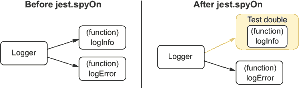

图 3.11 使用 `spyOn` 时会发生什么

通过直接导入和使用 logger 中的函数，你最终**不会**访问到 `jest.spyOn` 替换的引用。在这种情况下，你可以在 require 时立即获得原始函数的引用，但 Jest 替换的是 `logger` 中的引用，如图 3.12 所示。

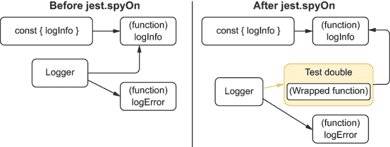

图 3.12 使用 `spyOn` 时直接引用会发生什么

为了解决这个问题，你可以简单地回到导入 `logger` 并访问其属性，但在许多情况下，你可能无法这样做。如果你正在导入直接导出函数的模块，或者你只是不想将你的函数分配给一个对象，你需要更好的替代方案。这就是 `jest.mock` 发挥作用的时候。

`jest.mock` 函数允许你确定当模块被导入时应该返回什么。通过使用 `jest.mock`，例如，你可以替换 `inventoryController` 在导入 `./logger` 时接收到的原始 `logger`，如下所示。

列表 3.51 inventoryController.test.js

```
// ...

jest.mock("./logger", () => ({     ❶
  logInfo: jest.fn(),
  logError: jest.fn()
}));

// ...
```

❶ 导致导入 logger 解析为一个对象，其 logInfo 和 logError 函数是测试替身

以这种方式使用 `jest.mock` 将会改变模块导入 `logger` 时接收到的值，包括你的测试。它们现在将获得你传递给 `jest.mock` 的函数返回的值，而不是接收原始的 `logger`。

将上述代码片段添加到 `inventoryController.test.js` 中，现在应该可以使所有测试再次通过。

注意：`jest.fn()` 函数返回空的测试替身。它们将记录有关其使用的信息，但不会配置任何预设行为。它们的 API 与使用 `spyOn` 创建的测试替身相同。你仍然可以使用 `mockReturnValue` 或 `mockReturnValueOnce` 等方法。

要在测试中再次获取原始的 `logger` 模块，你可以使用 `jest.requireActual` 如下所示。

列表 3.52 inventoryController.test.js

```
// ...

const originalLogger = jest.requireActual("./logger");     ❶

jest.mock("./logger", () => ({
  logInfo: jest.fn(),
  logError: jest.fn()
}));

// ...
```

❶ 导入实际的 logger

当你想要替换模块的一些导出而不是所有导出时，`jest.requireActual` 函数很有用。在这种情况下，你可以将原始模块与包含你的测试替身的一个模块合并，如下所示。

列表 3.53 inventoryController.test.js

```
// ...

jest.mock("./logger", () => {                               ❶
  const originalLogger = jest.requireActual("./logger");    ❷
  const partiallyMockedLogger = { logInfo: jest.fn() };
  return { ...originalLogger, ...partiallyMockedLogger };   ❸
});

// ...
```

❶ 导致导入日志记录器解析为回调函数返回的对象

❷ 导入实际的日志记录器

❸ 通过合并原始日志记录器中的属性与一个对象（其 logInfo 属性是一个测试替身）来返回一个新的对象

如果你需要频繁地模拟一个模块，Jest 有一个替代方案可以帮助你避免每次使用 `jest.mock` 时都必须传递一个替换函数。

通过在模块所在目录的相邻目录中创建一个名为 `__mocks__` 的目录，一旦为该文件调用 `jest.mock`，所有对该模块的导入都将自动解析到 `__mocks__` 中的同名文件。这种模拟称为 *手动模拟*。

为了避免在多个测试中模拟 `logger`，例如，你可以重新组织你的应用程序目录如下：

```
.
|---- logger.js
|---- __mocks__
|   |---- logger.js
|
|---- inventoryController.js
|---- inventoryController.test.js
|---- node_modules
|---- package.json
|---- package-lock.json
```

在 `__mocks__/logger.js` 中，你必须导出一个值来替换原始日志记录器，如下所示。

列表 3.54 __mocks__/logger.js

```
module.exports = {
  logInfo: jest.fn(),
  logError: jest.fn()
};
```

一旦完成这些，你就不必在每一个文件中传递一个替换函数给 `jest.mock`，你只需调用 `jest.mock` 并给出日志记录器的路径。

列表 3.55 inventoryController.test.js

```
// ...

jest.mock("./logger");      ❶

// ...
```

❶ 导致导入日志记录器解析为 __mocks__/logger.js 文件导出的对象

如果你完全不想调用 `jest.mock`，你可以在你的 `jest.config.js` 文件中添加一个名为 `automock` 的属性，并将其值设置为 `true`。当 `automock` 选项开启时，无论你是否之前调用过 `jest.mock`，所有导入都将解析为你的手动模拟。

注意：在本节中，我们看到了创建测试替身的一些不同方法。为了选择你将要使用的方法，考虑一下你试图“模拟”的是什么。

+   如果你正在模拟一个对象的属性，你可能应该使用 `jest.spyOn`。

+   如果你正在模拟一个导入，你可能应该使用 `jest.mock`。

+   如果你必须在多个测试文件中使用相同的替换，理想情况下，你应该在 `__mocks__` 文件夹上放置一个手动模拟。

## 3.4 选择要测试的内容

洛 uis 的面包店生产的甜点比镇上任何其他地方都多，员工数量减半，风味翻倍。为了保持速度和质量，洛 uis 仔细考虑了哪些质量控制检查要执行以及何时执行。他熟悉帕累托法则，并专注于产生 80%结果的 20%的测试。

与洛 uis 一样，我们作为工程师，可以专注于产生 80%结果的 20%的测试。知道要测试什么是有价值的，但确定不测试什么更为重要。

理想情况下，你应该拥有触及你应用程序每一行代码、运行每个执行分支并断言你想要强制执行的所有行为的测试。但在现实中，事情并不像路易斯的面包店那样甜蜜。现实世界的项目有紧迫的截止日期和有限的资源。取决于你如何使你的软件尽可能安全，并尽可能降低成本。

当谈到质量保证时，拥有许多测试可能很好，但更新所有这些测试可能过于繁重。重构一个拥有大量测试的大型代码库可能需要你花费更多的时间来更新测试，而不是更新代码库本身。正因为这种成本，拥有少量但质量保证更强的测试比拥有许多不令人信服的测试更好。

### 3.4.1 不要测试第三方软件

选择负责任的供应商，例如，可能花费了路易斯一些时间，但它确实节省了他很多麻烦。因为他可以相信他的供应商为他提供高质量的原料，所以他不必花太多时间检查它们到达面包店时的情况。

就像路易斯对他的供应商很挑剔一样，我们也应该对我们使用的第三方软件非常挑剔。只要其他人的软件经过良好测试，我们就不必花时间自己测试它。**你应该只测试你写的软件**。

正如我们在第二章中看到的，拥有确保你正确使用第三方软件的端到端测试是明智的，但你**不应该**只编写覆盖第三方软件本身的测试。

让我们再次考虑第二章中看到的`addItem`函数，该函数在下一个列表中展示。这个函数通过在数据库中插入一行来向购物车添加一个项目。

列表 3.56 cart.js

```
const db = require("knex")(require("./knexfile").development);

const addItem = (cartId, itemName) => {
  return db("carts_items").insert({ cartId, itemName });
};

module.exports = { createCart };
```

在这种情况下，你**不**想测试`knex`是否在数据库中插入项目。这是库作者的职责。

在这种情况下，你有以下两种选择：a) 用测试替身替换`knex`，并检查它是否被正确调用；或者 b) 启动一个测试数据库，调用`createCart`，并检查数据库以查看行是否如预期那样被插入。

在这两种情况下，你都不会测试`knex`本身。你**始终**关注**你**对库的使用。测试其他人的库是徒劳的。这几乎总是意味着你正在花费时间编写已经存在于其他地方的测试。

即使你为库添加的测试在项目的自身仓库中不存在，将其提交到上游版本也比保留在你自己的代码库中更好。当你将测试添加到上游项目中时，所有使用它的人都会受益，包括你，你将不会是唯一一个负责保持它们更新的人。协作创造了安全且经过良好测试的软件的良性循环。

### 3.4.2 要模拟，还是不要模拟：这是一个问题

在理想的测试世界中，每个项目都应该有不同隔离级别的测试。你应该有单元测试，尽可能隔离一个函数。你应该有集成测试，有一定的模拟程度，但仍然验证你的软件的不同部分是否可以一起工作。你还应该有端到端测试，几乎不做任何模拟，如果有的话。

在现实中，我们通常无法负担得起如此细致地编写测试，因此我们必须决定哪些代码部分我们将隔离，哪些不会。

再次考虑我们在上一节中看到的相同的`addItem`函数。

列表 3.57 cart.js

```
const db = require("knex")(require("./knexfile").development);

const addItem = (cartId, itemName) => {
  return db("carts_items").insert({ cartId, itemName });
};

module.exports = { createCart };
```

因为我们不希望测试`knex`，正如我们之前提到的，我们可以选择用测试替身——“模拟”来替换`knex`，或者调用函数然后直接检查数据库。

在理想的世界里，我们会有时间编写两个测试：一个带有测试替身，一个不带。然而，在现实世界中，我们必须选择哪个在时间和精力上成本最低，同时提供最大价值。

在这种情况下，模拟`knex`需要大量的工作。为此，你需要创建一个本质上模拟数据库并复制`knex`与之交互的软件。

为`knex`创建一个测试替身不仅耗时，而且容易出错。这会变得非常复杂，你可能还需要为你的测试编写测试。然后，当`knex`有更新时，你也必须更新你的测试替身。

现在考虑一下如果不替换`knex`为测试替身会有多难。

没有测试替身，你将不得不启动数据库并确保你的测试与其他测试很好地隔离。这些额外的步骤会使测试稍微慢一些，但它们使编写测试变得容易得多，也快得多。

例如，看看我们在第二章为这个函数编写的测试。

列表 3.58 cart.js

```
const { db, closeConnection } = require("./dbConnection");
const { createCart } = require("./cart");

test("addItem adds an item to a cart", async () => {
  await db("carts_items").truncate();
  await db("carts").truncate();

  const [cartId] = await createCart("Lucas da Costa");
  await addItem("cheesecake");

  const result = await db.select().from("carts_items");
  expect(result).toEqual([{ cartId, itemName: "cheesecake" }]);
  await closeConnection();
});
```

这个测试几乎和只检查函数返回值的测试一样简单。唯一的区别是，你必须在检查之前访问数据库以获取结果，而不是将返回值保存到变量中。

比较模拟`knex`的难度和它产生的小好处，以及编写集成测试的容易程度和它产生的巨大价值，很明显，集成测试是这种情况下的最佳选择。

作为一条经验法则，**如果模拟依赖项太复杂，就不要模拟它**。

只替换你的软件中容易替换或根本不能用于测试的部分，例如与付费第三方服务的集成。

能够编写不同隔离级别的测试对于获得精确的反馈非常好，但它会创建大量不必要的重叠。这些重叠的测试变得有些多余，并且在质量方面没有提供显著的好处时，会增加成本。

模拟过多是多少？

当你模拟应用程序的某个特定层时，你会阻止你的测试触及它下面的所有内容。

例如，假设你有一个使用`cartController`模块的路由。`cartController`使用一个`notifier`模块，该模块反过来调用第三方 API。

通过模拟`CartController`，你选择**不**测试其下所有层；你不会运行通知模块或第三方 API 中的代码。

你选择的模拟层越表面，你选择**不**测试的就越多。你越想隐藏复杂性，就越早应该进行模拟。

在处理遗留应用程序或没有测试的应用程序时，模拟特别有益。通过使用`mocks`，你可以隐藏尚未重构的层，从而避免测试尚未准备好的代码。在图 3.13 中，你可以看到根据测试替身放置的位置，哪些层被隐藏。

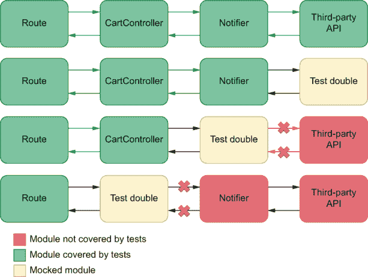

图 3.13 通过模拟应用程序的每一层隐藏的复杂性

编写模拟的一个缺点是它们将测试场景与实际用例场景隔离开来。因此，包含更多模拟的测试提供较弱的质量保证，并使你对自己的信心降低。

通常，过多的模拟是指你可以不使用模拟就轻松测试的软件部分。

### 3.4.3 当有疑问时，选择集成测试

单元测试提供极快且极其精确的反馈，但它们不提供强大的质量保证。另一方面，端到端测试是我们能得到的最强质量保证，但它们通常需要花费很多时间来运行，提供通用的反馈，并且编写起来往往很耗时。

在单元测试和端到端测试之间的是**集成测试**，它可以给我们带来两全其美的效果。它们提供了相当强的质量保证，运行速度合理，并且编写起来通常很快。有时，由于我们不需要进行太多的模拟，集成测试甚至比更孤立的测试编写得更快。

再次强调，对于你的`addItem`函数，考虑每种测试类型需要做什么。

列表 3.59 cart.js

```
const db = require("knex")(require("./knexfile").development);

const addItem = (cartId, itemName) => {
  return db("carts_items").insert({ cartId, itemName });
};

module.exports = { createCart };
```

+   一个非常孤立的**单元测试**将模拟`knex`并仅检查`addItem`是否正确使用`knex`。

+   一个**集成测试**将调用`addItem`并检查数据库。

+   一个完整的**端到端测试**将启动服务器，打开浏览器，点击添加商品到购物车的按钮，并检查购物车列表页面。

在这种情况下，单元测试不会提供稳固的保证。由于你将不得不进行所有这些模拟，因此编写它也会很困难，正如我之前提到的。

端到端测试可以增强对软件工作的信心。但编写它和运行它都会很具挑战性，并且会花费很多时间。

另一方面，集成测试编写起来很快，因为我们不需要使用任何模拟，而且它的运行速度比端到端测试快得多。因为这个测试会触及数据库，它为函数按预期工作提供了一个安全的保证。这是一种编写成本较低且提供最大益处的测试类型。

集成测试通常在成本和收益之间取得更好的平衡，所以，在不确定的情况下，选择集成测试。

**注意** 理想情况下，你应该尽量保持金字塔形状，但拥有高比例的集成测试也可以帮助你降低成本。

## 3.5 代码覆盖率

代码覆盖率是一个指标，表示当你运行测试时，你的代码执行了多少。

要理解代码覆盖率是如何工作的，考虑一下根据你执行哪个测试，`removeFromCart`函数的哪些行会被执行。

列表 3.60 Cart.test.js

```
// ...

const addToInventory = (item, quantity) => {
  if (typeof quantity !== "number") {
    logError(
      { quantity },
      "could not add item to inventory because quantity was not a number"
    );
    throw new Error("quantity must be a number");
  }
  const currentQuantity = inventory.get(item) || 0;
  const newQuantity = currentQuantity + quantity;
  inventory.set(item, newQuantity);
  logInfo(
    { item, quantity, memoryUsage: process.memoryUsage().rss },
    "item added to the inventory"
  );
  return newQuantity;
};

// ...
```

如果你运行一个传递`quantity`参数的测试，且该参数的类型是`number`，例如，第一个`if`语句内的所有行都不会执行。

列表 3.61 inventoryController.test..js

```
const { addToInventory } = require("./inventoryController");

jest.mock("./logger");                    ❶

test("passing valid arguments", () => {   ❷
  addToInventory("cheesecake", 2);
});
```

❶ 用测试替身替换记录器，以确保测试的输出不会被记录器的消息污染

❷ 覆盖 addToInventory 函数中大约 80%的行的测试

如果你只考虑这个函数，你会注意到你的测试覆盖了大约 80%的`addToInventory`函数的行。如果这些行中有任何无效语句，你的测试将能够捕获它们。然而，如果你在未被覆盖的 20%的行中有无效语句，你的测试将无法检测到。

通过查看你的测试没有触及到的代码部分，你可以检测到可能的盲点并创建测试来覆盖它们。

例如，在这种情况下，你可以编写一个测试，将字符串作为`addItemToCart`的第二个参数传递，以便覆盖该函数的剩余行，如下所示。

列表 3.62 inventoryController.test..js

```
// ...

test("passing valid arguments", () => {           ❶
  addToInventory("cheesecake", 2);
});

test("passing invalid arguments", () => {         ❷
  try {
    addToInventory("cheesecake", "should throw");
  } catch (e) {
    // ...
  }
});
```

❶ 覆盖 addToInventory 函数中大约 75%的行的测试

❷ 覆盖 addToInventory 函数中剩余行的测试

通过关注你的测试覆盖率，你能够检测到测试套件中的盲点并使其更加全面。

**重要** 通过测量代码的哪些部分被覆盖了，最重要的是，哪些没有被覆盖，你可以确保在自动化测试过程中所有可能的执行分支都运行了。

### 3.5.1 自动化覆盖率报告

要查看一个报告，该报告显示你的测试执行了代码的哪些部分，请运行项目的 Jest 可执行文件并使用`--coverage`选项。

**提示** 如果你使用 NPM 脚本来运行测试，正如我推荐的那样，你可以使用`npm test -- --coverage`来获取覆盖率报告。

一旦 Jest 完成测试运行并收集有关你的测试正在执行的代码部分的数据，它将在你的项目根目录下创建一个名为`coverage`的文件夹。这个新文件夹包含完整的覆盖率报告。

最后，要查看哪些代码部分被覆盖，请尝试使用浏览器打开`coverage`目录中`lcov-report`文件夹内的`index.html`。此报告将以红色突出显示任何未由您的测试执行的代码片段。

TIP 除了使用这些报告来了解您的盲点之外，您还可以使用 Jest 生成的其他“机器友好”文件来使用自动化工具跟踪您的覆盖率。

例如，您可以将覆盖率报告上传到第三方工具，该工具允许您跟踪代码覆盖率随时间的变化。

此外，您可以使用版本控制检查（您将在第十二章中学习），以防止其他人合并减少测试覆盖代码量的代码。

### 3.5.2 覆盖率类型

当使用 Jest 自动生成代码覆盖率报告时，您应该在测试摘要的底部看到一个表格，指示目标文件中代码的覆盖率百分比。

那个表格包含了四个覆盖率度量：语句覆盖率、分支覆盖率、函数覆盖率和行覆盖率。所有这些度量都代表了您的测试执行了代码的哪些部分，但它们的度量单位不同，如下所示：

+   **语句覆盖率**考虑了您代码中的总语句数以及运行了多少条语句。

+   **分支覆盖率**考虑了您的测试通过了多少执行路径，考虑到可能采取的总路径数。

+   **函数覆盖率**考虑了在您的代码中运行的函数数量与代码中包含的总函数数量之间的比例。

+   **行覆盖率**考虑了您的测试执行了多少行代码，而不管这些行包含多少语句或这些行位于哪些执行路径上。

所有这些类型的覆盖率都很重要，但我最关注的是*分支*覆盖率。

分支覆盖率表明，在我的测试中，我的代码已经通过了它可能通过的所有可能的执行路径。因此，它保证了每当我的代码需要“做出选择”时，所有可能的选择都得到了验证。

### 3.5.3 覆盖率的好处和坏处

**代码覆盖率**并不**表明您的测试有多好**。完全有可能覆盖 100%的代码，但仍然让错误溜走。

例如，假设您有一个函数，如果两个数都是偶数则求和，如果至少一个是奇数则相除，如下所示。

列表 3.63 math.js

```
function sumOrDivide(a, b) {
  if (a % 2 === 0 && b % 2 === 0) {
    return a + b;
  } else {
    return a / b;
  }
}
```

如果您编写的测试同时运行了这个函数的两个执行分支，但没有进行任何断言，那么您将获得 100%的覆盖率，但您可能引入的错误将不会被捕获。

列表 3.64 math.test.js

```
test("sum", () => {
  sumOrDivide(2, 4);
});

test("multiply", () => {
  sumOrDivide(2, 6);
});
```

如果您更改此函数，使其始终返回`"cheesecake"`，例如，您的覆盖率将保持 100%，并且您的测试仍然会通过。

**如果不通过编写断言进行必要的观察，您可能拥有高覆盖率，但无法捕获任何错误**。

此外，你的覆盖率可能表明你的测试运行了代码的所有可能的执行分支，但不是所有可能的错误输入。

例如，如果你将`1`作为这个函数的第一个参数，将`0`作为第二个参数，那么你的函数将返回`Infinity`，这可能不是你想要的结果。

覆盖率代表你的测试覆盖了你代码的多少，而不是它通过了多少可能的输入。因此，除非你测试了所有可能的输入，否则你不能保证你会找到错误，而这是一项相当困难的任务。

小贴士：为了理解为什么测试所有可能的输入是困难的，如果不是不可能的，想想 JavaScript 中你可以表示多少不同的数字。

覆盖率测量的另一个问题是，它们表明了哪些可能的执行分支运行了，但没有表明所有这些分支的可能组合。

假设特定的执行路径组合抛出错误。在这种情况下，你可能看不到它，因为尽管所有分支都被覆盖了，但导致错误发生的特定分支组合可能没有运行。

由于这些原因，**覆盖率本身是一个糟糕的指标**。它可能显示了程序代码的哪些部分被覆盖了，但它并没有表明它的哪些可能的*行为*被覆盖了，正如詹姆斯·O·科普林在他的精彩文章“为什么大多数单元测试都是浪费”中解释的那样（[`rbcs-us.com/site/assets/files/1187/why-most-unit-testing-is-waste.pdf`](https://rbcs-us.com/site/assets/files/1187/why-most-unit-testing-is-waste.pdf))。

我将 100%覆盖率定义为检查了所有可能的方法路径的所有可能组合，复制了所有方法可访问的数据位的所有可能配置，在执行路径上的每条机器语言指令。其他任何东西都只是关于正确性的非正式断言。一个函数中可能的执行路径数量是有限的：比如说 10。这些路径与所有全局数据（包括实例数据，从方法范围来看是全局的）和形式参数的可能状态配置的笛卡尔积确实非常大。而且，这个数字与类内方法可能顺序的笛卡尔积是可数的无限大。如果你输入一些典型的数字，你很快就会得出结论，如果你能获得比 10¹² 更好的覆盖率，那你就很幸运了。

—詹姆斯·O·科普林

重要提示：代码覆盖率给你的唯一保证是程序*可以*运行，而不是它运行正确。

我不单独使用覆盖率作为指标，而是用它来了解我忘记覆盖程序中的哪些部分，并确保我的团队能够始终朝着*更多*覆盖率而不是*更少*覆盖率的方向前进。

## 摘要

组织测试套件

+   通过在`describe`块内嵌套不同的测试组来组织你的测试。

+   将测试嵌套到多个块中可以使你封装变量、函数甚至钩子，这些在它们放置的测试块中成为相对的。

+   在组织测试时，避免重叠。每个测试都应该断言被测试单元的单一方面，以便生成准确的反馈。

+   默认情况下，不同文件中的测试将并行运行。并行运行测试可以使测试运行得更快，因此鼓励开发者更频繁地运行它们。

+   任何特定的测试都不应该依赖于其他测试。测试应该是原子的，这样你就可以轻松地确定错误的起因，以及你是否在测试或应用程序代码中存在问题。

编写好的断言

+   总是要确保你的测试运行断言。没有断言的测试不会检查被测试单元是否做了它应该做的事情。它只能确保应用程序代码可以运行，而不会做其他事情。

+   断言应该允许尽可能少的通过结果。理想情况下，断言应该只允许一个结果通过。

+   松散的断言——允许多个输出通过——可以用来处理非确定性，例如处理真正的随机性或日期。

+   循环断言使用应用程序的一部分来测试自身。这可能会引起问题，因为如果你在测试中使用的部分有错误，它们也会产生不正确的预期输出。

测试双倍：模拟、存根和间谍

+   模拟、存根和间谍是用于修改和替换应用程序部分以简化或启用测试的对象。

+   与间谍只记录与函数使用相关的数据不同，存根允许你通过提供替代结果或甚至替代实现来修改其行为。

选择要测试的内容

+   拥有大量的测试对于创建可靠的质量保证有帮助，但它们可能难以更新。因此，确定要测试的内容与确定不要测试的内容一样重要。

+   避免测试第三方软件。这是第三方软件作者的职责。如果你想为它添加测试，请向库的存储库做出贡献，这样每个人都能从中受益，包括你，你不必自己维护这些测试。

+   更多的模拟会使测试与现实相差更远，因此价值更低。如果模拟太困难，或者如果它会导致你的测试变得没有价值，因为它只触及应用程序的很少部分，请避免模拟。

+   不同的测试类型可以生成大量的重叠。如果你必须只选择一种测试类型，最好选择集成测试。集成测试运行得相对较快，编写起来通常比较容易，并提供可靠的质量保证。

代码覆盖率

+   代码覆盖率是一个指标，表示当你运行测试时，你的代码执行了多少。

+   通过测量代码覆盖率，您可以了解哪些代码部分您忘记测试，因此，为它们添加必要的验证。

+   代码覆盖率可以针对语句、分支、函数或行进行测量。

+   高代码覆盖率*并不*意味着您的测试是好的。即使您的代码 100%被覆盖，仍然可能让错误滑过，因为代码覆盖率没有考虑到可以传递给程序的所有可能的输入或其执行分支的所有可能的组合。

+   您应该使用代码覆盖率报告来了解哪些代码片段您忘记测试，并确保您的团队正在提交测试，并朝着*更多*的覆盖率前进，而不是确定测试的质量。
