# 4 测试后端应用程序

本章涵盖

+   为你的后端构建测试环境

+   测试你的服务器路由和中间件

+   在测试中处理数据库

+   管理对外部服务的依赖

许多年来，JavaScript 一直被当作一种仅用于客户端的语言。它曾经只*在浏览器内*运行。一旦 Node.js 出现，大约在 2009 年左右，人们开始使用 JavaScript 编写应用程序的前端**和**后端。

Node.js 使一种全新的 JavaScript 应用程序成为可能，并为塑造 JavaScript 测试生态系统做出了巨大贡献。由于 JavaScript 开发者现在能够实现不同类型的应用程序，他们还必须想出新的测试方法和新的测试工具。

在本章中，我将重点介绍如何测试 Node.js 所支持的最显著类型的应用程序：用 JavaScript 编写的后端。

你已经学到的关于组织测试、断言和测试替身的内容在本章中仍然至关重要。在本章中，你将学习与在服务器上下文中应用这些技术相关的细微差别。

测试后端与测试其他类型的程序（如独立模块或前端应用程序）显著不同。它涉及处理文件系统、数据库、HTTP 请求和第三方服务。

因为这些组件对于你的后端应用程序的正常运行至关重要，所以在编写测试时必须考虑它们。否则，你可能找不到关键缺陷。

如果，例如，你没有检查应用程序是否正确地将行添加到数据库中的表，或者如果你的服务器为路由返回了错误的 HTTP 状态码，错误可能会滑入生产环境。如果你正在处理第三方 API，你如何确保你的应用程序能够应对该服务不可用的情况？

除了缺陷外，测试还可以揭示安全漏洞。通过检查端点是否需要必要的身份验证头，你可以确保未经授权的客户端无法访问敏感信息或修改属于其他用户的资料。

此外，测试 Web 服务器是确保其遵循消费者所依赖的“合同”的有效方式。当多个服务需要通信时，保证每个部署都将保留这些服务期望的接口至关重要。

我将通过编写服务器并在添加新功能时对其进行测试来涵盖这些主题。我将用作示例的应用程序将相当复杂，以便尽可能准确地模拟你在日常工作中遇到的情况。

此应用程序将是 Louis 面包店在线商店的后端。它将处理 HTTP 请求，处理身份验证，与数据库交互，并集成第三方 API。

在 4.1 节中，我将讨论应用程序的需求以及如何为测试设置它。在本节中，你将为你的后端应用程序编写多种不同类型的测试，并学习如何根据第二章的测试金字塔来构建你的测试环境。

4.2 节包含如何测试 HTTP 端点的深入示例。它介绍了验证你的路由的新工具和技术，并详细说明了你应该更加关注的方面，包括认证和中间件。

由于绝大多数后端应用程序依赖于外部依赖项，我将在 4.3 节中教你如何处理它们。在本节的示例中，涉及数据库和第三方 API，你将学习如何在测试的上下文中考虑依赖项，以便在不使测试过于脆弱或复杂的情况下获得可靠的质量保证。

## 4.1 构建测试环境结构

要使产品或流程可测试，它必须以测试为导向进行设计。在路易斯的面包店，当制作蛋糕时，员工会分别制作中间部分，仔细检查它们，然后才将它们组合在一起。从食谱的开始到结束，员工都知道每个步骤要验证什么。因为他们有一个强大的质量控制流程，所以他们不仅限于尝试最终产品。急于完成所有事情可能会使确定一批蛋糕是否符合通常的高标准变得更加困难，如果不符合，可能会使找出问题所在变得更加困难。

同样地，**旨在可测试的软件必须以测试为导向进行设计**，尤其是在处理后端应用程序时。这类应用程序往往涉及许多动态部分，如果这些部分没有暴露或分离成更小的部分，它们可能会使测试变得困难，甚至可能根本无法编写测试。

例如，考虑你之前创建的`addToInventory`路由。如果你的应用程序使用私有内存`Map`来存储数据，不在`cartController`中公开任何函数，并且直接将信息记录到控制台，那么测试的空间就不大了。你所能做的最好的事情就是发送一个 HTTP 请求并检查其响应，如图 4.1 所示。

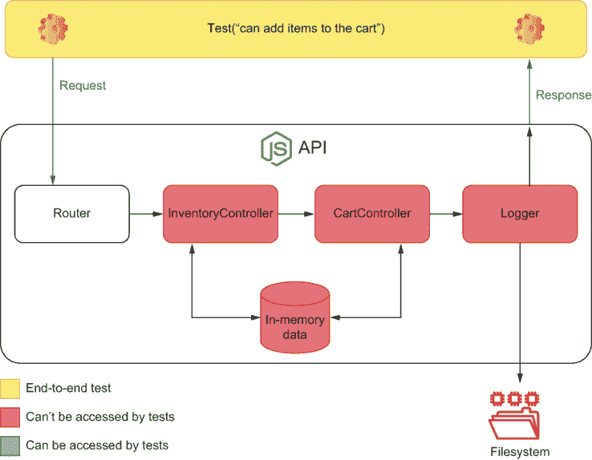

图 4.1 如果应用程序没有考虑到测试，测试可以访问的内容

尽管那将是一个有效的端到端测试，但在那种情况下，可能很难获得细粒度的反馈。如果你的测试也无法访问应用程序的数据存储，你无法确保它已经从一个有效状态转换到另一个状态。在更极端的情况下，如果你的路由依赖于认证，你的测试**必须**能够发送认证请求。否则，即使是端到端测试也可能无法编写。

**可测试的软件被分解成更小的可访问部分，您可以单独测试它们**。

您的应用程序代码越容易访问，模拟错误场景和更复杂的边缘情况就越容易。其部分越细粒度，测试的反馈就越精确。

在本节中，我将向您展示如何开发一种结构化的方法来划分您的应用程序并对其进行测试。您将逐步将其分解成更小的部分，并验证每一个部分。

我将此部分分为单元测试、集成测试和端到端测试，因为我们之前看到的那样，这是组织测试和理解测试的最有效方式，并保持高质量标准。

注意：为了专注于测试并避免重写 API，我将使用与您在第二章中编写的类似的服务器。您可以在[`github.com/lucasfcosta/testing-javascript-applications`](https://github.com/lucasfcosta/testing-javascript-applications)找到本章和前几章中每个示例的代码。

### 4.1.1 端到端测试

让我们看看 `server.js` 文件，并思考如何完成这个任务。

此文件有三个路由：一个返回购物车项目，两个添加和从其中删除项目。当更新购物车的内容时，应用程序也会相应地更新库存。

列表 4.1 server.js

```
const Koa = require("koa");
const Router = require("koa-router");

const app = new Koa();
const router = new Router();

let carts = new Map();
let inventory = new Map();

router.get("/carts/:username/items", ctx => {                ❶
  const cart = carts.get(ctx.params.username);
  cart ? (ctx.body = cart) : (ctx.status = 404);
});

router.post("/carts/:username/items/:item", ctx => {         ❷
  const { username, item } = ctx.params;
  const isAvailable = inventory.has(item) && inventory.get(item) > 0;
  if (!isAvailable) {
    ctx.body = { message: `${item} is unavailable` };
    ctx.status = 400;
    return;
  }

  const newItems = (carts.get(username) || []).concat(item);
  carts.set(username, newItems);
  inventory.set(item, inventory.get(item) - 1);
  ctx.body = newItems;
});

router.delete("/carts/:username/items/:item", ctx => {      ❸
  const { username, item } = ctx.params;
  if (!carts.has(username) || !carts.get(username).includes(item)) {
    ctx.body = { message: `${item} is not in the cart` };
    ctx.status = 400;
    return;
  }

  const newItems = (carts.get(username) || []).filter(i => i !== item);
  inventory.set(item, (inventory.get(item) || 0) + 1);
  carts.set(username, newItems);
  ctx.body = newItems;
});

app.use(router.routes());

module.exports = app.listen(3000);                          ❹
```

❶ 返回购物车的项目

❷ 向购物车添加一个项目

❸ 从购物车中删除一个项目

❹ 导出绑定到端口 3000 的服务器实例

因为这个应用程序除了其路由外没有公开任何内容，所以您只能通过发送 HTTP 请求与之交互。您也没有访问其状态，因此您只能检查对您的 HTTP 请求的响应。换句话说，您只能编写端到端测试，即使如此，您也无法确保应用程序已进入一致的状态。

此 API 是一个无法穿透的黑盒代码。您无法设置复杂的场景，并且如图 4.2 所示，您对其内部发生的事情没有太多了解。

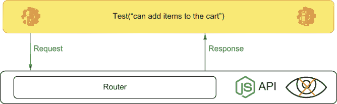

图 4.2 当应用程序未公开其任何部分时，测试可用性如何

让我们考虑这些限制，并尝试为添加项目到购物车的路由编写端到端测试。

列表 4.2 server.test.js

```
const app = require("./server.js");                   ❶

const fetch = require("isomorphic-fetch");

const apiRoot = "http://localhost:3000";

afterAll(() => app.close());

describe("add items to a cart", () => {
  test("adding available items", async () => {
    const response = await fetch(                     ❷
      `${apiRoot}/carts/test_user/items/cheesecake`,
      { method: "POST" }
    );

    expect(response.status).toEqual(200);             ❸
  });
});
```

❶ 导致 server.js 文件执行，绑定一个服务器实例到端口 3000

❷ 通过向服务器发送请求尝试向用户的购物车添加一个芝士蛋糕

❸ 检查响应的状态是否为 200

这个测试将失败，因为我们试图添加的项目，一个芝士蛋糕，是不可用的。但如果应用程序没有公开其库存，我们将如何使这个项目可用？

**测试需要能够设置一个场景——提供一个初始状态——执行您的应用程序，并检查输出和最终状态是否正确**。为了解决这个问题，公开您的 `inventory`，并更新您的测试，如下所示。

列表 4.3 server.js

```
// ...

module.exports = {
  app: app.listen(3000),    ❶
  inventory                 ❷
};
```

❶ 通过一个名为 app 的属性导出一个绑定到 3000 端口的服务器实例

❷ 通过具有相同名称的属性导出服务器的库存

列表 4.4 server.test.js

```
const { app, inventory } = require("./server.js");           ❶

// ...

afterEach(() => inventory.clear());                          ❷

describe("add items to a cart", () => {
  test("adding available items", async () => {
    inventory.set("cheesecake", 1);                          ❸
    const response = await fetch(                            ❹
      `${apiRoot}/carts/test_user/items/cheesecake`,
      { method: "POST" }
    );

    expect(response.status).toEqual(200);                    ❺
    expect(await response.json()).toEqual(["cheesecake"]);   ❻
    expect(inventory.get("cheesecake")).toEqual(0);          ❼
  });
});
```

❶ 导入服务器实例和库存

❷ 在每个测试后清除库存

❸ 安排：将库存中芝士蛋糕的数量设置为 1

❹ 行动：发送一个尝试向用户的购物车添加一块芝士蛋糕的请求

❺ 断言：检查响应的状态是否为 200

❻ 断言：检查响应体是否与购物车的商品内容匹配

❼ 断言：验证库存中芝士蛋糕的数量为 0

现在测试通过了。你有了设置场景所需的州的一部分，你需要与之交互的路由，以及你需要检查的响应，如图 4.3 所示。注意，你能够添加额外的验证来检查库存的状态是否一致，仅仅是因为你暴露了它。

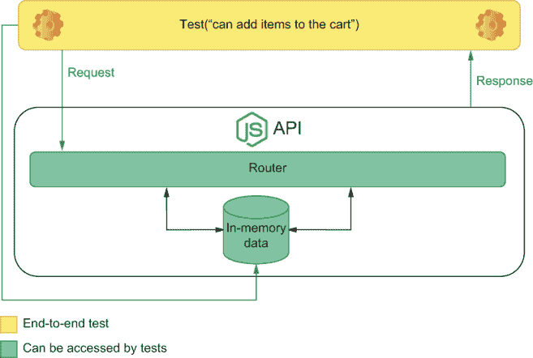

图 4.3 `addItemToCart` 测试暴露的内容

继续添加测试来检查包含购物车的状态部分是否表现适当。如果你很有信心，可以为所有其他路由添加类似的端到端测试。

在编写端到端测试时，提供对状态以及客户或前端客户端用来与后端交互的界面的访问。对路由的访问将允许测试锻炼应用程序，而对状态的访问将允许测试设置一个场景——创建初始状态——并检查新状态是否有效。

注意：我们将在本章后面介绍如何用外部数据库替换内存中的数据库。现在，专注于理解为什么要以及如何分离应用程序的不同部分。

### 4.1.2 集成测试

尽管端到端测试提供了最强的可靠性保证，但如果你只有端到端测试，维护你的应用程序可能会变得更加昂贵。端到端测试运行时间较长，并且生成的反馈较粗。因为在你从端到端测试中提取任何价值之前，路由需要是完整的，所以它也花费了更长的时间来给你反馈。

获取更早和更细粒度反馈的智能策略是将你的路由中的代码移动到单独的模块中，这样你就可以单独暴露它们的函数并编写测试。

你可以从将库存和购物车的交互分离到不同模块中的单独函数开始。首先，创建一个名为 `inventoryController.js` 的文件，并添加一个从库存中删除项目的函数。

列表 4.5 inventoryController.js

```
const inventory = new Map();                                 ❶

const removeFromInventory = item => {                        ❷
  if (!inventory.has(item) || !inventory.get(item) > 0) {
    const err = new Error(`${item} is unavailable`);
    err.code = 400;
    throw err;
  }

  inventory.set(item, inventory.get(item) - 1);
};

module.exports = { inventory, removeFromInventory };         ❸
```

❶ 在此文件中封装对包含库存内容的 Map 的引用

❷ 从库存中删除一个项目

❸ 导出库存和 `removeFromInventory` 函数

在你的 `cartController` 中，你可以创建一个函数，该函数使用 `inventoryController` 来添加一个可用的项目到购物车中。

列表 4.6 cartController.js

```
const { removeFromInventory } = require("./inventoryController");   ❶

const carts = new Map();                                            ❷

const addItemToCart = (username, item) => {                         ❸
  removeFromInventory(item);
  const newItems = (carts.get(username) || []).concat(item);
  carts.set(username, newItems);
  return newItems;
};

module.exports = { addItemToCart, carts };                          ❹
```

❶ 从 inventoryController 导入 removeFromInventory 函数

❷ 在此文件中封装对包含购物车及其内容的 Map 的引用

❸ 向用户的购物车添加一个项目

❹ 导出包含购物车的 Map 和 addItemToCart 函数

使用这些函数，然后你可以更新 server.js 并使添加到购物车的路由更加简洁。

列表 4.7 server.js

```
// ...

// Don't forget to remove the initialization of `carts` and `inventory` from the top of this file

const { carts, addItemToCart } = require("./cartController");     ❶
const { inventory } = require("./cartController");

router.post("/carts/:username/items/:item", ctx => {
  try {
    const { username, item } = ctx.params;
    const newItems = addItemToCart(username, item);               ❷
    ctx.body = newItems;
  } catch (e) {
    ctx.body = { message: e.message };
    ctx.status = e.code;
    return;
  }
});

// ...
```

❶ 从 cartController 导入包含购物车的 Map 和 addItemToCart 函数

❷ 在负责添加购物车项目的路由中使用导入的 addItemToCart 函数

一旦你将 `server.test.js` 文件更新为从正确的模块导入 `carts` 和 `inventory`，所有测试应该都能通过。

列表 4.8 server.test.js

```
const { app } = require("./server.js");                         ❶
const { carts, addItemToCart } = require("./cartController");   ❷
const { inventory } = require("./inventoryController");         ❸

// ...
```

❶ 导入服务器的实例，使其绑定到端口 3000

❷ 从 cartController 导入包含购物车的 Map 和 addItemToCart 函数

❸ 从 inventoryController 导入库存

通过使你的软件更加模块化，你可以使其更易于阅读和测试。随着更多独立的模块，你可以编写更细粒度的测试。例如，你可以开始编写与端到端测试共存的集成测试。

创建一个名为 `cartController.test.js` 的文件，并编写一个只覆盖 `addItemToCart` 函数的测试，如下所示，如图 4.4 所示。

列表 4.9 cartController.test.js

```
const { inventory } = require("./inventoryController");
const { carts, addItemToCart } = require("./cartController");

afterEach(() => inventory.clear());                                    ❶
afterEach(() => carts.clear());                                        ❷

describe("addItemToCart", () => {
  test("adding unavailable items to cart", () => {
    carts.set("test_user", []);                                        ❸
    inventory.set("cheesecake", 0);                                    ❹

    try {
      addItemToCart("test_user", "cheesecake");                        ❺
    } catch (e) {
      const expectedError = new Error(`cheesecake is unavailable`);
      expectedError.code = 400;

      expect(e).toEqual(expectedError);                                ❻
    }

    expect(carts.get("test_user")).toEqual([]);                        ❼
    expect.assertions(2);                                              ❽
  });
});
```

❶ 在每个测试后清除库存

❷ 在每个测试后清除购物车

❸ 安排：将测试用户的购物车设置为空数组

❹ 安排：将库存中芝士蛋糕的数量设置为 0

❺ 行动：发送一个请求尝试向测试用户的购物车添加一块芝士蛋糕

❻ 断言：期望请求的错误与测试中创建的错误匹配

❼ 断言：期望测试用户的购物车保持为空

❽ 断言：确保测试执行了两个断言

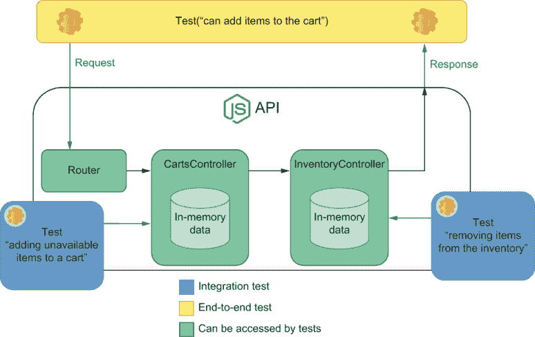

图 4.4 每个端到端和集成测试可以访问的应用程序的部分

这样的测试不依赖于要发送请求的路由。它不依赖于身份验证、头信息、URL 参数或特定的请求体。它直接检查你的业务逻辑。尽管在考虑整个应用程序时，这个测试提供的质量保证不那么可靠，但它编写起来更便宜，并且提供了关于后端更小部分的更细粒度的反馈。

作为一项练习，尝试也为 `inventoryController` 中的 `removeFromInventory` 函数添加测试。

注意：你可以继续将应用程序的业务逻辑移动到 `cartsController` 和 `inventoryController` 模块，直到你的 `server.js` 不再需要操作全局的 `inventory` 和 `carts` 映射。

如果你这样做重构，你会注意到你的应用程序不需要在任何地方导入 `inventory` 或 `carts`。但是，因为你的测试依赖于它，你*必须*。

仅为了测试而暴露代码的一部分，即使你的应用程序代码不需要这些部分被暴露，也不是问题。

你添加的测试实际上看起来并不像集成测试。那是因为，目前，你将所有应用程序的数据存储在内存中。我选择将这些测试归类为集成测试，因为它们处理应用程序的全局状态。当我们用真实数据库替换内存中的数据时，你会注意到这个定义是多么地合适。

为了更好地针对集成测试，尝试将日志添加到你的应用程序中。编写一个`logger.js`文件，并使用`fs`模块将日志写入`/tmp/logs.out`。

注意：如果你使用的是 Windows，你可能需要更改记录器将消息追加到的路径。

列表 4.10 logger.js

```
const fs = require("fs");

const logger = {
  log: msg => fs.appendFileSync("/tmp/logs.out", msg + "\n")      ❶
};

module.exports = logger;                                          ❷
```

❶ 同步地将消息追加到/tmp/logs.out 文件

❷ 导出记录器

使用这个记录器模块，你可以让`addToItemToCart`在客户将商品添加到购物车时写入`logs.out`文件，如下所示。

列表 4.11 cartController.js

```
// ...

const logger = require("./logger");

const addItemToCart = (username, item) => {
  removeFromInventory(item);
  const newItems = (carts.get(username) || []).concat(item);
  carts.set(username, newItems);
  logger.log(`${item} added to ${username}'s cart`);      ❶
  return newItems;
};

// ...
```

❶ 当用户将商品添加到购物车时，将消息追加到/tmp/logs.out 文件

为了测试它，向`cartController.test.js`添加一个集成测试，调用`addItemToCart`函数并检查日志文件的内容，如下所示，并在图 4.5 中展示。

列表 4.12 cartController.js

```
// ...

const fs = require("fs");

describe("addItemToCart", () => {
  beforeEach(() => {
    fs.writeFileSync("/tmp/logs.out", "");                              ❶
  });

  // ...

  test("logging added items", () => {
    carts.set("test_user", []);                                         ❷
    inventory.set("cheesecake", 1);                                     ❸

    addItemToCart("test_user", "cheesecake");                           ❹

    const logs = fs.readFileSync("/tmp/logs.out", "utf-8");             ❺
    expect(logs).toContain("cheesecake added to test_user's cart\n");   ❻
  });
});
```

❶ 在每个测试之前同步清除日志文件

❷ 安排：将测试用户的购物车设置为空数组

❸ 安排：将库存中芝士蛋糕的数量设置为 1

❹ 行动：发送一个请求尝试向测试用户的购物车添加一块芝士蛋糕

❺ 同步地读取日志文件

❻ 断言：期望日志包含一条消息，告知测试用户的购物车中添加了芝士蛋糕

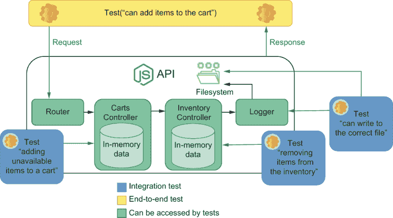

图 4.5 集成测试将能够访问与你的应用程序交互的所有依赖项。

当涉及到测试后端时，集成测试将覆盖多个函数和外部组件之间的交互，这些组件可能是你的应用程序所依赖的。例如，外部 API、数据库、全局状态或文件系统。与单元测试不同，集成测试**不一定**总是使用测试替身来隔离你的代码与外部依赖。例如，它们可能会伪造第三方 API 的响应，但不会为数据库使用测试替身。

注意：在本章的其余部分，我们将讨论何时使用测试替身，并解释为什么伪造第三方 API 的响应但针对真实数据库进行测试是一个好主意。

### 4.1.3 单元测试

端到端和集成测试提供了最可靠的质量保证，但没有单元测试，编写后端应用程序可能会变得难以管理。有了单元测试，你可以一次针对一小块软件，减少编写代码后获得反馈所需的时间。

在后端应用程序的上下文中，单元测试非常适合那些不依赖于其他外部依赖项的函数，例如数据库或文件系统。

作为我们单元测试的目标，我将使用一个及时示例。在我撰写这一章的时候，由于 COVID-19，我开始隔离。由于许多人开始囤积食物，很难找到面包、蛋糕和布朗尼来帮助缓解被锁在里面的紧张情绪。正如许多负责任的企业所做的那样，让我们假设路易斯想要确保他的客户一次只能购买任何商品的三件。这种限制确保了在我们在这些艰难时期，每个人都能享受到一块甜美的甜点。

这个函数，它将被添加到`cartController`模块中，看起来是这样的。

列表 4.13 cartController.js

```
const compliesToItemLimit = cart => {
  const unitsPerItem = cart.reduce((itemMap, itemName) => {    ❶
    const quantity = (itemMap[itemName] || 0) + 1;
    return { ...itemMap, [itemName]: quantity };
  }, {});

  return Object.values(unitsPerItem)                           ❷
    .every(quantity => quantity < 3);                          ❸
};
```

❶ 创建一个对象，其键是购物车中项目的名称，其值是每个项目的相应数量

❷ 创建一个数组，其元素是购物车中每个项目的数量

❸ 返回一个布尔值，指示每个项目的数量是否小于 3

尽管`compliesToItemLimit`函数在`cartController`之外没有使用，但请确保像这里所示那样导出它，以便你可以在测试中使用它。

列表 4.14 cartController.js

```
// ...

module.exports = { addItemToCart, carts, compliesToItemLimit };
```

现在，最后，向你的`cartController.test.js`文件中添加一个新的`describe`块，并为`compliesToItemLimit`函数编写测试。

列表 4.15 cartController.test.js

```
// ...

const { carts, addItemToCart, compliesToItemLimit } = require("./cartController");

// ...

describe("compliesToItemLimit", () => {
  test("returns true for carts with no more than 3 items of a kind", () => {
    const cart = [                                                         ❶
      "cheesecake",
      "cheesecake",
      "almond brownie",
      "apple pie"
    ];
    expect(compliesToItemLimit(cart)).toBe(true);                          ❷
  });

  test("returns false for carts with more than 3 items of a kind", () => {
    const cart = [                                                         ❸
      "cheesecake",
      "cheesecake",
      "almond brownie",
      "cheesecake",
      "cheesecake"
    ];
    expect(compliesToItemLimit(cart)).toBe(false);                         ❹
  });
});
```

❶ 安排：创建一个包含不超过两种同类商品的购物车

❷ 执行并断言：测试`compliesToItemLimit`函数，并期望它返回 true

❸ 安排：创建一个包含四块芝士蛋糕的购物车

❹ 执行并断言：测试`compliesToItemLimit`函数，并期望它返回 false

如图 4.6 所示，这个测试隔离了`compliesToItemLimit`函数，并可以告诉你它是否工作，而无需设置复杂的场景或依赖其他代码。它非常适合快速迭代，因为它允许你在编写函数后立即对其进行测试。

它节省了你使用`addItemToCart`和设置更复杂的集成测试场景（无论是在数据库中还是在应用程序的全局状态中）的努力。它也不需要你处理任何 HTTP 请求或响应，正如你在一个端到端测试中必须做的那样，如果你必须处理诸如身份验证之类的方面，这可能会变得更加庞大。

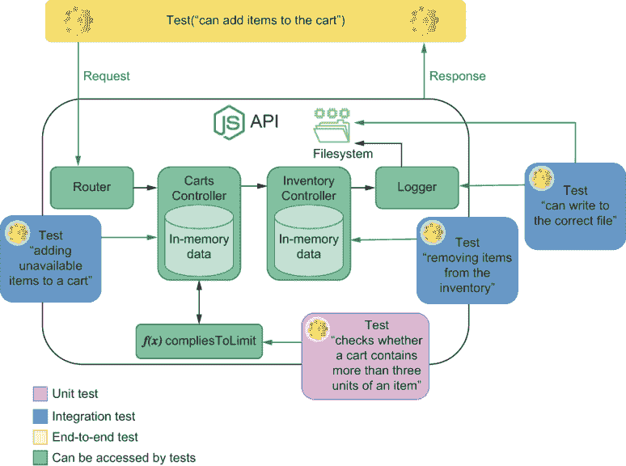

图 4.6 集成测试将能够访问与你的应用程序交互的所有依赖项。

**单元测试在你需要时立即提供精确的反馈：尽可能快。**

作为一项练习，尝试将此函数集成到 `addItemToCart` 中，并编写集成和端到端测试以验证此行为。考虑一下这需要多少工作量，以及与之前编写的单元测试相比，你获得反馈所需的时间更长。

## 4.2 测试 HTTP 端点

测试 HTTP 端点与其他代码部分的测试合理不同，因为你不是直接与被测试的单元进行交互。相反，你只能通过 HTTP 请求与你的应用程序进行交互。在本节中，我将向您介绍一种简单但稳健的方法来测试您的 API。

在我们开始编写端点测试之前，我们必须选择一个合适的工具。到目前为止，我们一直通过使用 `isomorphic-fetch` 来测试我们的应用程序。因为 `isomorphic-fetch` 包是为了发送请求而设计的，但并非专门用于测试 API，所以使用它会有一些开销。你必须手动在 `fetch` 上创建包装器，使其使用起来不那么繁琐，并且你的断言将与 `fetch` 函数的实现紧密耦合。这些断言需要更多的努力来更新，并且当它们失败时，它们的反馈不会像应该的那样清晰。

我选择用于测试 HTTP 端点的工具是 `supertest`，其文档可以在[`github.com/visionmedia/supertest`](https://github.com/visionmedia/supertest)找到。`supertest` 包是一个测试工具，它结合了发送 HTTP 请求和断言这些请求响应的能力。因为 `supertest` 是建立在 `superagent`（一个执行 HTTP 请求的库）之上的，所以当 `supertest` 本身无法完成你想要的功能时，你可以选择使用 `superagent` 的广泛 API。这种结构使 `supertest` 更加灵活和可靠。

在本节中，你将重构端到端测试，以便它们使用 `supertest` 而不是 `fetch`，因此首先将 `supertest` 作为 `dev-dependency` 安装。为此，你可以执行 `npm install --save-dev supertest`。

`request` 函数（由 `supertest` 默认导出的函数）可以接受一个 API 的地址，并返回一个对象，允许你指定你想要使用哪个 HTTP 动词调用哪个路由。一旦你确定了要执行哪个请求，你就可以链式添加断言以确保响应将符合你的预期。

例如，重构添加可用项目到购物车的测试。不要使用 `fetch` 来检查其 HTTP 状态和响应，而是使用 `supertest` 的 `request`。

列表 4.16 server.test.js

```
const request = require("supertest");

// ...

describe("add items to a cart", () => {
  test("adding available items", async () => {
    inventory.set("cheesecake", 1);                            ❶
    const response = await request(apiRoot)                    ❷
      .post("/carts/test_user/items/cheesecake")
      .expect(200);

    expect(response.body).toEqual(["cheesecake"]);             ❸
    expect(inventory.get("cheesecake")).toEqual(0);            ❹
    expect(carts.get("test_user")).toEqual(["cheesecake"]);    ❺
  });

  // ...
});
```

❶ 安排：将库存中芝士蛋糕的数量设置为 1

❷ 执行和断言：向 /carts/test_user/items/cheesecake 发送 POST 请求，并期望响应的状态为 200

❸ 断言：期望响应体是一个包含一个芝士蛋糕的数组

❹ 断言：期望库存中不再有芝士蛋糕

❺ 断言：期望测试用户的购物车中只包含一个芝士蛋糕

因为`request`返回一个`Promise`，我们可以使用`await`等待它解析并将解析后的值分配给`response`。这个`response`将包含`body`和其他许多相关信息，你可以在你的断言中使用这些信息。

尽管你可以访问响应的所有数据，但你也可以避免编写单独的断言来检查它。相反，你可以继续使用`supertest`来确保，例如，头也符合你的期望。在下一个摘录中，你可以看到如何检查响应的`Content-Type`头是否正确设置。

列表 4.17 server.test.js

```
// ...

describe("add items to a cart", () => {
  test("adding available items", async () => {
    inventory.set("cheesecake", 1);
    const response = await request(apiRoot)           ❶
      .post("/carts/test_user/items/cheesecake")
      .expect(200)
      .expect("Content-Type", /json/);

    expect(response.body).toEqual(["cheesecake"]);
    expect(inventory.get("cheesecake")).toEqual(0);
    expect(carts.get("test_user")).toEqual(["cheesecake"]);
  });

  // ...
});
```

❶ 行动和断言：向/carts/test_user/items/cheesecake 发送 POST 请求，并期望响应的状态码为 200，并且 Content-Type 头匹配 json

当使用`supertest`时，你可以避免在测试中硬编码你的 API 地址。相反，你可以导出一个 Koa 实例并将其传递给`request`。用 Koa 实例而不是地址来传递将使你的测试通过，即使你更改了服务器绑定的端口。

列表 4.18 server.test.js

```
const { app } = require("./server.js");

// ...

describe("add items to a cart", () => {
  test("adding available items", async () => {
    inventory.set("cheesecake", 1);
    const response = await request(app)           ❶
      .post("/carts/test_user/items/cheesecake")
      .expect(200)
      .expect("Content-Type", /json/);

    expect(response.body).toEqual(["cheesecake"]);
    expect(inventory.get("cheesecake")).toEqual(0);
    expect(carts.get("test_user")).toEqual(["cheesecake"]);
  });

  // ...
});
```

❶ 将请求发送到服务器实例所在的位置，这样你就不必硬编码其地址

到目前为止，我们还没有发送带有请求体的请求。让我们调整添加项目到购物车的路由，使其能够接受包含多个项目的请求体。为了服务器能够理解 JSON 请求体，我们需要使用`koa-body-parser`包。

要使用`koa-body-parser`，将其作为依赖项安装，并附加一个中间件，该中间件将解析请求体并更新上下文中的解析内容，如图 4.7 所示。

列表 4.19 server.js

```
const Koa = require("koa");
const Router = require("koa-router");
const bodyParser = require("koa-body-parser");

// ...

const app = new Koa();
const router = new Router();

app.use(bodyParser());        ❶

// ...
```

❶ 设置 body-parser，使其将解析后的请求体附加到上下文的 request.body 属性

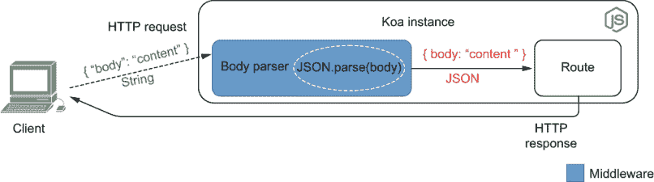

图 4.7 `body-parser`中间件如何处理 JSON 请求体

中间件按照定义，中间件是介于两个其他软件层之间的任何软件层。

在 Koa 的情况下，中间件位于接收到的初始请求和最终匹配的路由之间。

如果你把你的服务器想象成你房子的管道系统，那么中间件就是将水流送到你家的管道，而路由则是水流出来的地方——比如厨房的水龙头或花园的水管。

一旦`body-parser`设置好了，更新路由使其使用请求体的内容。它应该使用`item`属性来确定要添加什么，以及使用`quantity`属性来确定数量。

列表 4.20 server.js

```
app.use(bodyParser());

// ...

router.post("/carts/:username/items", ctx => {
  const { username } = ctx.params;
  const { item, quantity } = ctx.request.body;     ❶

  for (let i = 0; i < quantity; i++) {             ❷
    try {
      const newItems = addItemToCart(username, item);
      ctx.body = newItems;
    } catch (e) {
      ctx.body = { message: e.message };
      ctx.status = e.code;
      return;
    }
  }
});
```

❶ 从请求体中提取项目属性和数量属性

❷ 尝试将请求的项目数量添加到用户的购物车中

最后，让我们在我们的测试中使用`send`方法向这个路由发送 JSON 请求体。

列表 4.21 server.test.js

```
describe("add items to a cart", () => {
  test("adding available items", async () => {
    inventory.set("cheesecake", 3);                              ❶
    const response = await request(app)                          ❷
      .post("/carts/test_user/items")
      .send({ item: "cheesecake", quantity: 3 })                 ❸
      .expect(200)                                               ❹
      .expect("Content-Type", /json/);                           ❺

    const newItems = ["cheesecake", "cheesecake", "cheesecake"];
    expect(response.body).toEqual(newItems);                     ❻
    expect(inventory.get("cheesecake")).toEqual(0);              ❼
    expect(carts.get("test_user")).toEqual(newItems);            ❽
  });

  // ...
});
```

❶ 安排：将库存中的芝士蛋糕数量设置为 3

❷ 行动：向/cart/test_user/items 发送 POST 请求

❸ 将请求体设置为包含要添加的项目名称和数量的对象

❹ 断言：期望响应的状态为 200

❺ 断言：期望响应的 Content-Type 标头匹配 json

❻ 断言：期望响应的正文是一个包含三个芝士蛋糕的数组

❼ 断言：期望库存中没有芝士蛋糕

❽ 断言：期望用户的购物车是一个包含三个芝士蛋糕的数组

注意：`supertest` 支持所有 `superagent` 的功能，包括发送多种不同类型的有效载荷。例如，如果你想测试接受文件上传的路由，你可以发送文件。

```
test("accepts file uploads", async () => {
  const { body } = await request(app)
    .post("/users/test_user/profile_picture")
    .attach('avatar', 'test/photo.png')              ❶

  expect(body)                                       ❷
    .toEqual({
      message: "profile picture updated successfully!"
    });
});
```

❶ 操作：在向 /users/test_user/profile_picture 发送 POST 请求时，将测试/照片.png 文件附加到头像字段

❷ 断言：期望响应的正文包含一条消息，告知图片已成功更新

`superagent` 包是 `supertest` 受欢迎的部分原因。

注意：要查看 `superagent`（`supertest` 背后的包）能做什么，请查看其文档：[`visionmedia.github.io/superagent/`](https://visionmedia.github.io/superagent/)。

作为一项练习，尝试更新 `server.test.js` 中的其他测试，使其也使用 `superagent`。如果你感到好奇，可以尝试接受除 JSON 之外的其他类型的正文，例如文件上传。

### 4.2.1 测试中间件

就像任何其他代码片段一样，你可以单独测试你的中间件，或者与依赖它的软件组件（在这种情况下是路由）一起测试。在本小节中，你将创建自己的中间件并学习如何测试它。然后我们将比较这两种方法的优缺点，以便你可以选择最适合你项目的策略。

你将创建的中间件，如图 4.8 所示，将负责在用户尝试访问添加或从购物车中删除项目的路由时检查用户的凭据。

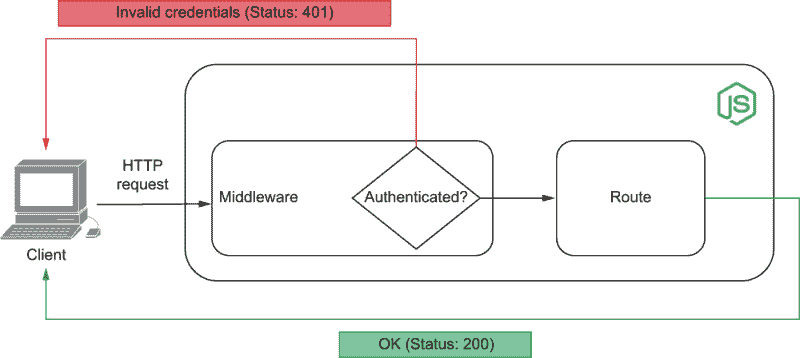

图 4.8 认证中间件的作用

创建一个名为 `authenticationController.js` 的新文件。在其中，你将放置实现此中间件所需的所有代码。

让我们从创建一个存储客户账户的映射开始。这个映射将按客户用户名索引，每个条目将包含他们的电子邮件和散列密码。

注意：加密散列函数允许你将输入映射到固定大小的输出，该输出不能映射回原始输入。

通过散列用户的密码，你可以避免开发者访问它们，即使你的数据库被入侵，攻击者也无法访问你的客户账户。

因为我们要专注于测试，所以这本书中的例子都很简单且直观。我建议你在实现自己的生产级应用时，对该主题进行更多研究。

为了哈希密码，我们将使用 Node.js 的`crypto`模块。使用`crypto`，我们可以创建一个`Hash`对象，用用户的密码更新它，并生成一个`digest`——即运行哈希对象的内容通过加密哈希函数，产生一个不可逆的输出。

列表 4.22 server.js

```
const crypto = require("crypto");
const users = new Map();

const hashPassword = password => {
  const hash = crypto.createHash("sha256");    ❶
  hash.update(password);                       ❷
  return hash.digest("hex");                   ❸
};

module.exports = { users };
```

❶ 创建一个使用 sha256 生成哈希摘要的对象

❷ 使用密码更新哈希

❸ 计算密码的哈希，并返回一个十六进制编码的字符串

现在为用户创建一个注册路由。这个路由将用户保存到`authenticationController`中的`users` Map。

列表 4.23 server.js

```
const { users, hashPassword } = require("./authenticationController");

// ...

router.put("/users/:username", ctx => {                      ❶
  const { username } = ctx.params;
  const { email, password } = ctx.request.body;
  const userAlreadyExists = users.has(username);
  if (userAlreadyExists) {
    ctx.body = { message: `${username} already exists` };
    ctx.status = 409;
    return;
  }

  users.set(
    username,
    { email, passwordHash: hashPassword(password) }          ❷
  );
  return (ctx.body = { message: `${username} created successfully.` });
});

// ...
```

❶ 如果用户不存在，则创建一个用户

❷ 保存用户时，哈希密码，并将其存储在 passwordHash 属性中

就像我们对其他路由所做的那样，我们也可以为这个路由编写端到端测试。

从创建一个新账户并检查服务器响应以及`users` Map 中保存的用户开始测试。

列表 4.24 server.test.js

```
// ...

const { users, hashPassword } = require("./authenticationController.js");

afterEach(() => users.clear());                      ❶

// ...

describe("create accounts", async () => {
  test("creating a new account", () => {
    const response = await request(app)              ❷
      .put("/users/test_user")
      .send({ email: "test_user@example.org", password: "a_password" })
      .expect(200)
      .expect("Content-Type", /json/);

    expect(response.body).toEqual({                  ❸
      message: "test_user created successfully"
    });

    expect(users.get("test_user")).toEqual({         ❹
      email: "test_user@example.org",
      passwordHash: hashPassword("a_password")
    });
  });
});
```

❶ 在每个测试之前清除所有用户

❷ 行为和断言：向创建用户的路由发送请求，并期望其响应的状态为 200，并且其 Content-Type 头与 json 匹配

❸ 断言：验证响应体的消息

❹ 断言：检查存储的用户是否具有预期的电子邮件，以及其 passwordHash 属性是否对应于请求中发送的密码的哈希

作为一项练习，创建一个测试来验证当有人尝试创建一个重复用户时会发生什么。这个测试应该向用户的`Map`中添加一个用户，发送一个带有相同用户名的添加用户请求，并检查服务器的响应。它应该期望响应的状态为`409`，并且其`message`属性表示已存在具有传递的用户名。如果您需要帮助，这个测试在这个书的 GitHub 仓库中，网址为[`github.com/lucasfcosta/testing-javascript-applications`](https://github.com/lucasfcosta/testing-javascript-applications)。

注意这些端到端测试是如何使用`hashPassword`函数的，您也会在您的中间件中使用它。因为端到端测试只是简单地信任它将工作，所以您必须创建一个传递性保证，这样您就只需测试一次，如下所示。这个传递性保证帮助您避免在每次使用`hashPassword`时都需要重新测试。

列表 4.25 authenticationController.test.js

```
const crypto = require("crypto");
const { hashPassword } = require("./authenticationController");

describe("hashPassword", () => {
  test("hashing passwords", () => {
    const plainTextPassword = "password_example";
    const hash = crypto.createHash("sha256");              ❶

    hash.update(plainTextPassword);                        ❷
    const expectedHash = hash.digest("hex");               ❸
    const actualHash = hashPassword(plainTextPassword);    ❹
    expect(actualHash).toBe(expectedHash);                 ❺
  });
});
```

❶ 创建一个使用 sha256 生成哈希摘要的对象

❷ 使用密码更新哈希

❸ 生成密码的哈希摘要，并返回一个十六进制编码的字符串

❹ 练习 hashPassword 函数，传递之前在测试中用于生成哈希摘要的相同密码

❺ 期望 hashPassword 函数返回的哈希摘要与测试中生成的哈希摘要相同

尽管这个测试与`hashPassword`函数的实现类似，但它保证了如果它发生变化，你会收到警告。任何修改`hashPassword`的人也将不得不更新其测试，因此测试通过确保这个人知道他们改变的结果来提供价值。换句话说，有人破坏`hashPassword`而不意识到它的可能性变得更小。

`hashPassword`的测试（图 4.9）是我们测试中间件的一部分。它保证我们的中间件的一部分已经工作——这是一个细粒度的反馈，我们可以在此基础上构建。这个单元测试覆盖了我们中间件将使用的一小部分。

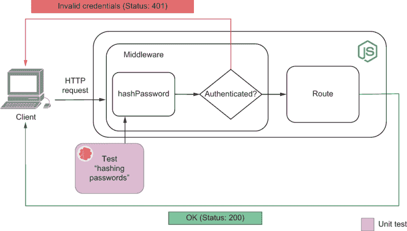

图 4.9 与此单元测试交互的中间件部分

继续添加一个函数，该函数接收用户名和密码，并验证这些凭证是否有效。你将使用这个函数在中间件中验证用户。

列表 4.26 authenticationController.js

```
const credentialsAreValid = (username, password) => {     ❶
  const userExists = users.has(username);
  if (!userExists) return false;

  const currentPasswordHash = users.get(username).passwordHash;
  return hashPassword(password) === currentPasswordHash;
};
```

❶ 接收用户名和密码，如果用户存在且密码的哈希值与用户的 passwordHash 属性匹配，则返回 true；否则返回 false。

再次，你可以为这个函数添加测试。因为它与应用程序的数据交互——目前是在全局状态中，但很快将在数据库中——我们可以将这些测试视为集成测试。你已经上升到了金字塔的更高层次，现在正在测试你未来中间件的另一层。下面是一个这样的测试示例，如图 4.10 所示。

列表 4.27 authenticationController.test.js

```
// ...

afterEach(() => users.clear());                          ❶

// ...

describe("credentialsAreValid", () => {
  test("validating credentials", () => {
    users.set("test_user", {                             ❷
      email: "test_user@example.org",
      passwordHash: hashPassword("a_password")           ❸
    });

    const hasValidCredentials = credentialsAreValid(     ❹
      "test_user",
      "a_password"
    );
    expect(hasValidCredentials).toBe(true);              ❺
  });
});
```

❶ 在每个测试之前清除所有用户

❷ 安排：直接将用户保存到用户的 Map 中

❸ 使用 hashPassword 函数为用户的 passwordHash 属性生成哈希摘要

❹ 行动：调用 credentialsAreValid 函数，并传递用户的用户名和明文密码

❺ 断言：期望 credentialsAreValid 函数已将凭证视为有效

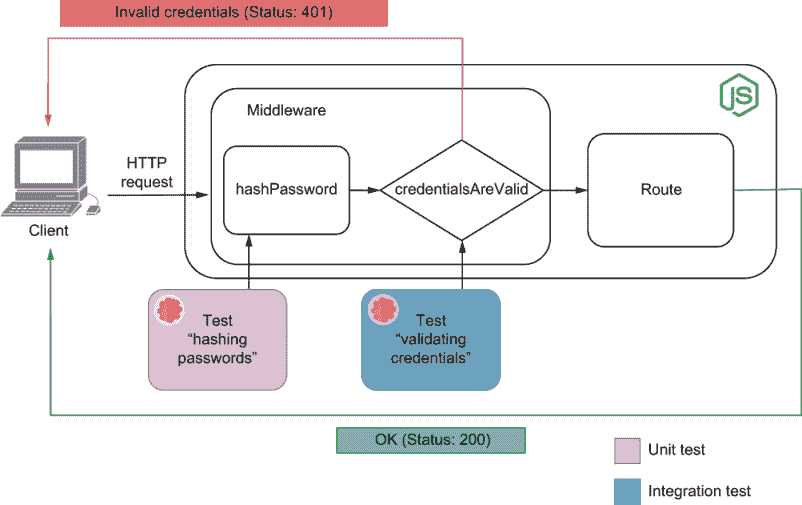

图 4.10 与此集成测试交互的中间件部分

现在我们能够创建用户账户并验证凭证，我们必须创建一个中间件，以便每个路由器都知道谁在发送请求。这个中间件将读取`authorization`头部的内容，找到相应的用户，并将其附加到`context`。

你打算用作中间件的函数将接受`context`和一个`next`回调作为参数。当中间件调用`next`时，它将调用后续的中间件。

注意：在这个例子中，我将使用*基本访问认证*来验证我们的用户。简而言之，这种认证方法包括发送一个包含`Basic username:password`的 Base64 编码字符串，并将其作为`authorization`头部的值。您可以在[`tools.ietf.org/html/rfc7617`](https://tools.ietf.org/html/rfc7617)找到完整的规范。

你的中间件函数应该看起来像这样。

列表 4.28 authenticationController.js

```
const authenticationMiddleware = async (ctx, next) => {
  try {
    const authHeader = ctx.request.headers.authorization;        ❶
    const credentials = Buffer.from(                             ❷
      authHeader.slice("basic".length + 1),
      "base64"
    ).toString();
    const [username, password] = credentials.split(":");         ❸

    if (!credentialsAreValid(username, password)) {              ❹
      throw new Error("invalid credentials");
    }
  } catch (e) {                                                  ❺
    ctx.status = 401;
    ctx.body = { message: "please provide valid credentials" };
    return;
  }

  await next();                                                  ❻
};
```

❶ 从授权头中提取值

❷ 使用 Base64 解码授权头中 basic 后的字符串

❸ 在“:”处拆分授权头的解码内容以获取用户名和密码

❹ 如果凭据无效，则抛出错误

❺ 如果解析或验证授权头时出现任何错误，则返回 401 状态

❻ 调用下一个中间件

最后，我们可以在隔离和路由中测试中间件本身。

如果您要测试中间件函数，您可以将它导入到测试文件中，并传递您可以检查的参数，如下所示。

列表 4.29 authenticationController.test.js

```
describe("authenticationMiddleware", () => {
  test("returning an error if the credentials are not valid", async () => {
    const fakeAuth = Buffer.from("invalid:credentials")        ❶
      .toString("base64");
    const ctx = {
      request: {
        headers: { authorization: `Basic ${fakeAuth}` }
      }
    };

    const next = jest.fn();
    await authenticationMiddleware(ctx, next);                 ❷
    expect(next.mock.calls).toHaveLength(0);                   ❸
    expect(ctx).toEqual({                                      ❹
      ...ctx,
      status: 401,
      body: { message: "please provide valid credentials" }
    });
  });
});
```

❶ 安排：创建无效凭据，并对其进行 Base64 编码

❷ 行动：直接调用身份验证中间件函数，传递一个包含无效凭据和占位符作为下一个中间件函数的上下文对象

❸ 断言：期望代表下一个中间件的占位符没有被调用

❹ 断言：期望响应具有 401 状态并包含一条消息，告知用户提供有效的凭据

作为练习，尝试添加测试，使用有效凭据调用中间件函数，并检查`next`回调是否被调用。

前一个测试非常出色，可以确保函数本身工作正常，但它最多只是一个集成测试。它没有验证中间件是否强制客户端发送有效的凭据以访问路由。

目前，尽管中间件函数工作正常，但服务器并未使用它。因此，每位客户都可以无需提供凭据就访问任何路由。

让我们使用`authenticationMiddleware`函数来确保所有以`/carts`开头的路由都需要身份验证。

列表 4.30 server.js

```
// ...

const {
  users,
  hashPassword,
  authenticationMiddleware
} = require("./authenticationController");

// ...

app.use(async (ctx, next) => {            ❶
  if (ctx.url.startsWith("/carts")) {
    return await authenticationMiddleware(ctx, next);
  }

  await next();
});

// ...
```

❶ 如果请求的 URL 路径以/carts 开头，则使用身份验证中间件；否则，继续到下一个中间件

如果您重新运行测试，您将看到以`/carts`开头的路由测试已经开始失败，正如预期的那样。这些测试失败是因为它们没有提供有效的凭据。

为了使旧测试通过，您需要在发送带有`supertest`的请求时创建用户并提供有效的凭据。

首先，创建一个名为`createUser`的函数，该函数将在`users`映射中插入用户。为了便于以后编写测试，还请在您的服务器测试中保存您将用于`Authentication`头的内容。

列表 4.31 server.test.js

```
// ...
const { users, hashPassword } = require("./authenticationController.js");

const user = "test_user";
const password = "a_password";
const validAuth = Buffer.from(`${user}:${password}`)     ❶
  .toString("base64");
const authHeader = `Basic ${validAuth}`;
const createUser = () => {                               ❷
  users.set(user, {
    email: "test_user@example.org",
    passwordHash: hashPassword(password)
  });
};

// ...
```

❶ 创建 Base64 编码的凭据

❷ 创建一个用户，其用户名和密码与 Base64 编码的凭据匹配

最后，为每个测试块添加一个`beforeEach`钩子，其测试单元是一个需要身份验证的路由。

您可以使用`supertest`的`set`方法发送有效的`authHeader`，这允许您设置头部信息。

列表 4.32 server.test.js

```
// ...

describe("add items to a cart", () => {
  beforeEach(createUser);                                       ❶

  test("adding available items", async () => {
    inventory.set("cheesecake", 3);                             ❷
    const response = await request(app)                         ❸
      .post("/carts/test_user/items")
      .set("authorization", authHeader)
      .send({ item: "cheesecake", quantity: 3 })
      .expect(200)
      .expect("Content-Type", /json/);

    const newItems = ["cheesecake", "cheesecake", "cheesecake"];
    expect(response.body).toEqual(newItems);                    ❹
    expect(inventory.get("cheesecake")).toEqual(0);             ❺
    expect(carts.get("test_user")).toEqual(newItems);           ❻
  });

  // ...
});
```

❶ 在每次测试之前，创建一个用户，其用户名和密码与存储在本文件范围内的那些匹配。这个钩子可以被认为是测试的“安排”阶段的一部分。

❷ 安排：将库存中的芝士蛋糕数量设置为 3

❸ 执行和断言：使用测试范围内的凭证发送一个请求，将项目添加到用户的购物车中，并期望请求成功

❹ 断言：期望响应体是一个包含三个芝士蛋糕的数组

❺ 断言：期望库存中没有芝士蛋糕

❻ 断言：期望测试用户的购物车是一个包含三个芝士蛋糕的数组

作为练习，尝试修复所有其他仍然失败的测试。你可以在[`github.com/lucasfcosta/testing-javascript-applications`](https://github.com/lucasfcosta/testing-javascript-applications)找到完整的解决方案。

注意我们是如何通过向这个中间件所依赖的不同软件组件添加测试来建立多个可靠性层，如图 4.11 所示。我们首先为`hashPassword`编写了小的单元测试。然后我们编写了集成测试来检查验证凭证的功能。最后，我们能够通过单独调用它和向其他路由发送请求来测试中间件本身。

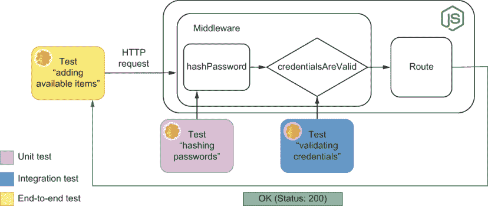

图 4.11 与此集成测试交互的中间件部分

在构建这个中间件的过程中，你实际上看到了如何在软件开发的不同部分获得不同类型的保证。

由于这个中间件拦截了许多路由的请求，向这些路由发送请求并检查它们是否需要身份验证是测试它的最可靠方式。但仅仅因为端到端测试提供了最强的质量保证，并不意味着它们是你应该编写的唯一测试。

正如你在本节中看到的，单元测试和集成测试对我们来说也非常有用，可以帮助我们快速获取关于构成`authenticationMiddleware`的各个部分的反馈。而且，随着我们进行重构，它们将继续通过提供快速且更精确的反馈来创造价值。然而，如果你可用的时间和资源过于受限，你可能通过编写端到端测试比编写其他任何类型的测试获得更多的好处。

## 4.3 处理外部依赖

几乎找不到一个不依赖于另一件完全独立的软件的后端应用程序。因此，你需要确保你的应用程序与这些依赖项适当地交互。

在本节中，你将学习如何在测试软件时处理外部依赖。作为示例，我们将使用后端应用程序中最常见的两个依赖项：数据库和第三方 API。

在开发这些示例的过程中，我将专注于解释每个决策背后的理由，以便你可以将这些技术应用到其他类似的情况中。

注意：本节中我们将编写的所有测试都将使用相同的数据库。如果使用相同数据库的测试同时运行，它们可能会相互干扰。

因为，正如我们在第三章中看到的，Jest 并行运行不同的文件，除非你顺序运行它们，否则你的测试将是不稳定的。

要顺序运行测试，你可以更新`package.json`中的`test`脚本以包含`--runInBand`选项，或者你可以直接将其传递给`npm test`，如下所示：`npm test -- --runInBand`。

在本章的后面部分，你将学习如何并行化涉及使用数据库的测试。

### 4.3.1 与数据库的集成

到目前为止，你一直使用全局状态的一部分来存储你的应用程序数据。将数据存储在内存中的问题是，每次应用程序重启时，这些数据都会丢失。

在现实世界中，大多数人使用数据库来存储应用程序的状态。尽管可以模拟与数据库的交互，但这相当棘手且需要大量努力，正如我们在第三章中讨论的那样。模拟数据库也会使测试与生产环境分离，因此更容易出现错误。

与数据库交互的测试也可能增加维护开销。例如，在设置和清理测试场景时，你必须特别小心。否则，数据库模式的小幅变化在更新测试时可能会产生大量工作。

在我们讨论任何特定的技术或最佳实践之前，让我们重构应用程序，使其使用数据库而不是在内存中存储状态。

使用数据库设置你的第一个测试

正如你在第二章中所做的那样，设置`knex`模块，你将使用它来与数据库交互。安装`knex`和你想要使用的数据库管理系统。在这些示例中，我将使用`sqlite3`。

```
$ npm install knex sqlite3
```

首先，创建一个`knexfile`文件，指定你将使用哪种数据库管理系统以及如何连接到它，如下所示。

列表 4.33 knexfile.js

```
module.exports = {
  development: {
    client: "sqlite3",                          ❶
    connection: { filename: "./dev.sqlite" },   ❷
    useNullAsDefault: true                      ❸
  }
};
```

❶ 使用 sqlite3 作为数据库客户端

❷ 指定数据库存储数据的文件

❸ 使用 NULL 而不是 DEFAULT 来处理未定义的键

注意：这些示例使用`sqlite3`，因为它是最容易设置的数据库管理系统。通过使用`sqlite3`，我们可以专注于测试，而不是专注于设置数据库。

如果你更喜欢使用 Postgres 或 MySQL，例如，请随意使用它们。

你可以在[`knexjs.org`](http://knexjs.org)找到如何设置许多不同数据库管理系统的说明。

现在你已经配置了 Knex，创建一个封装数据库连接的文件。记住还要添加一个关闭数据库连接的方法。这个方法将确保我们在测试后释放资源。

列表 4.34 dbConnection.js

```
const knex = require("knex")
const knexConfig = require("./knexfile").development;    ❶

const db = knex(knexConfig);                             ❷

const closeConnection = () => db.destroy();              ❸

module.exports = {
  db,
  closeConnection
};
```

❶ 导入连接到开发数据库所需的配置

❷ 为开发数据库设置连接池

❸ 断开连接池

在您可以使用数据库之前，您需要为购物车、用户和库存创建表。为此，通过运行`./node_modules/.bin/knex` `migrate:make` `--env` `development` `initial_schema`来创建一个`migration`。现在您将在`migrations`文件夹中找到迁移文件，创建必要的表。

注意：在这个迁移过程中，您将使用 Knex 的 schema builder API 来操作表。您可以在[`knexjs.org/#Schema`](https://knexjs.org/#Schema)找到其文档。

列表 4.35 20200325082401_initial_schema.js

```
exports.up = async knex => {                                 ❶
  await knex.schema.createTable("users", table => {          ❷
    table.increments("id");
    table.string("username");
    table.unique("username");
    table.string("email");
    table.string("passwordHash");
  });

  await knex.schema.createTable("carts_items", table => {    ❸
    table.integer("userId").references("users.id");
    table.string("itemName");
    table.unique("itemName");
    table.integer("quantity");
  });

  await knex.schema.createTable("inventory", table => {      ❹
    table.increments("id");
    table.string("itemName");
    table.unique("itemName");
    table.integer("quantity");
  });
};

exports.down = async knex => {                               ❺
  await knex.schema.dropTable("inventory");
  await knex.schema.dropTable("carts_items");
  await knex.schema.dropTable("users");
};
```

❶ 导出的`up`函数将数据库迁移到下一个状态。

❷ 为应用程序的用户创建一个表。每个用户必须有一个 ID、一个唯一的用户名、一个电子邮件和一个密码。

❸ 创建`carts_items`表以跟踪每个用户的购物车中的物品。每一行将包括物品的名称、数量以及属于该用户的 ID。

❹ 创建一个库存表，用于跟踪库存中的物品。

❺ 导出的`down`函数将数据库迁移到上一个状态，删除购物车、carts_items 和用户表。

要执行此迁移，请在终端中运行`./node_modules/.bin/knex migrate:latest`。此命令将执行所有必要的迁移，以将您的数据库带到最新状态。如果不存在，它将创建一个文件来存储您的数据，并使用最新的模式更新它。

现在，您最终可以更新其他模块，使它们使用您的数据库而不是全局状态的一部分。

首先，更新`authenticationController.js`文件。为了验证凭证，它将不再像以前那样从全局`users`映射中获取用户，而是从数据库中获取用户。

我们也不再需要`users`映射，所以别忘了将其删除。

列表 4.36 authenticationController.js

```
const { db } = require("./dbConnection");

// ...

const credentialsAreValid = async (username, password) => {
  const user = await db("users")                             ❶
    .select()
    .where({ username })
    .first();
  if (!user) return false;
  return hashPassword(password) === user.passwordHash;       ❷
};

// ...

module.exports = {
  hashPassword,
  credentialsAreValid,
  authenticationMiddleware
};
```

❶ 从数据库中获取与函数传入的用户名匹配的用户

❷ 对传入的密码进行哈希处理，并将其与数据库中存储的用户`passwordHash`进行比较

在此更改之后，对`credentialsAreValid`函数的测试应该会失败，因为它依赖于从`authenticationController`导入的全局状态。更新该测试，以便通过向数据库添加用户来设置场景，而不是更新全局状态的一部分。

提示：您不必在每次运行`jest`时都运行所有测试。

您可以将文件名作为`jest`的第一个参数传递，以指定要执行哪个文件，使用`-t`选项指定要执行的测试。

例如，如果您只想运行`authenticationController.test.js`文件中`credentialsAreValid`块内的测试，可以执行`jest` `authenticationController.test.js` `-t="credentialsAreValid"`。

如果你像我们之前做的那样，在 `npm` 脚本中使用 `jest`，你可以在传递这些选项给脚本之前添加一个 `--`。例如，你可以运行 `npm test -- authenticationController.test.js -t="credentialsAreValid"`。

列表 4.37 authenticationController.test.js

```
// Don't forget to also remove unnecessary imports
const { db } = require("./dbConnection");

beforeEach(() => db("users").truncate());                      ❶

// ...

describe("credentialsAreValid", () => {
  test("validating credentials", async () => {
    await db("users").insert({                                 ❷
      username: "test_user",
      email: "test_user@example.org",
      passwordHash: hashPassword("a_password")
    });

    const hasValidCredentials = await credentialsAreValid(     ❸
      "test_user",
      "a_password"
    );
    expect(hasValidCredentials).toBe(true);                    ❹
  });
});

// ...
```

❶ 不是清除用户映射，而是清除数据库中的用户表

❷ 安排：使用 hashPassword 函数生成 passwordHash 列表的值，将测试用户插入数据库

❸ 行动：通过传递测试用户的用户名和明文密码来练习 credentialsAreValid 函数

❹ 断言：期望 credentialsAreValid 已将凭据视为有效

`credentialsAreValid` 函数的测试现在应该通过，但同一文件中 `authenticationMiddleware` 的测试仍然会失败。它们失败是因为我们将 `credentialsAreValid` 设计为异步的，但在 `authenticationMiddleware` 函数中我们没有等待其结果。

按照以下代码更新 `authenticationMiddleware` 函数，以便在继续之前等待 `credentialsAreValid` 完成。

列表 4.38 authenticationController.test.js

```
// ...

const authenticationMiddleware = async (ctx, next) => {
  try {
    const authHeader = ctx.request.headers.authorization;
    const credentials = Buffer.from(
      authHeader.slice("basic".length + 1),
      "base64"
    ).toString();
    const [username, password] = credentials.split(":");

    const validCredentialsSent = await credentialsAreValid(       ❶
      username,
      password
    );
    if (!validCredentialsSent) throw new Error("invalid credentials");
  } catch (e) {
    ctx.status = 401;
    ctx.body = { message: "please provide valid credentials" };
    return;
  }

  await next();
};

// ...
```

❶ 等待 credentialsAreValid 解析

作为练习，尝试更新你的应用程序的其余部分以及相应的测试。重构后，应用程序和测试都不应依赖于任何内存状态。如果你想直接跳到下一节，你可以在本书的 GitHub 仓库中找到重构后的应用程序，网址为 [`mng.bz/w9VW`](http://mng.bz/w9VW)。

即使你的更新后的 `authenticationController.js` 文件测试通过，你仍然有两个问题需要解决。如果你继续更新其余的测试，你可能已经注意到了以下情况：

+   用于测试的数据库和用于运行应用程序的数据库是相同的。不区分数据库可能会导致测试删除或覆盖关键数据。

+   你必须记住在运行任何测试之前迁移和清除你的数据库。如果你忘记这样做，你的测试可能会因为从不一致的状态开始而失败。

让我们看看我们如何解决这些问题并改进我们的测试。

使用单独的数据库实例

如果你的测试使用与应用程序运行时相同的数据库实例，它们可能会覆盖或删除数据。测试也可能失败，因为数据库的初始状态可能与应有的状态不同。

通过为你的测试使用单独的数据库实例，你可以在开发环境中保护应用程序的数据，并且因为这些仍然是真实数据库，可以使测试尽可能接近现实。

注意：你可以在本书的 GitHub 仓库 `chapter4>3 _dealing_with_external_dependencies>2_separate_database_instances` 中找到本小节完整的代码，[`github.com/lucasfcosta/testing-javascript-applications`](https://github.com/lucasfcosta/testing-javascript-applications)。

目前，你的 `knexfile` 只导出了一个配置，称为 `development`。

列表 4.39 knexfile.js

```
module.exports = {
  development: {
    client: "sqlite3",
    connection: { filename: "./dev.sqlite" },
    useNullAsDefault: true
  }
};
```

这是你在 `dbConnection.js` 文件中使用的配置。正如你在 `dbConnection.js` 的第二行中看到的，我们使用了 `knexfile.js` 导出的对象的 `development` 属性。

列表 4.40 dbConnection.js

```
const knex = require("knex")
const knexConfig = require("./knexfile").development;

const db = knex(knexConfig);

// ...
```

因为你的项目中的每个文件都使用 `dbConnection.js` 与数据库交互，它控制着你的后端连接到哪个数据库。如果你更改 `dbConnection` 连接到的数据库，你将更改整个应用程序的数据库实例。

首先，在 `knexfile` 中创建一个新的配置，这样你就可以连接到不同的数据库。我建议将其命名为 `"test"`。

列表 4.41 knexfile.js

```
module.exports = {                       ❶
  test: {                                ❷
    client: "sqlite3",
    connection: { filename: "./test.sqlite" },
    useNullAsDefault: true
  },
  development: {                         ❸
    client: "sqlite3",
    connection: { filename: "./dev.sqlite" },
    useNullAsDefault: true
  }
};
```

❶ 导出一个具有两个属性的对象：test 和 development

❷ 定义测试数据库的配置

❸ 定义开发数据库的配置

现在，为了连接到使用 `test.sqlite` 文件而不是 `dev.sqlite` 的测试数据库，并更新 `dbConnection.js` 文件。不要在 `knexfile.js` 中使用 `development` 配置，而使用 `test`。

列表 4.42 dbConnection.js

```
const knex = require("knex")
const knexConfig = require("./knexfile").test;     ❶

const db = knex(knexConfig);                       ❷

const closeConnection = () => db.destroy();

module.exports = {
  db,
  closeConnection
};
```

❶ 从 knexfile 导出测试属性

❷ 使用测试数据库的配置来创建一个连接池

如果你尝试重新运行你的测试，你会看到它们会失败，因为 `test` 数据库还没有被创建。

要创建 `test` 数据库——因此是 `test.sqlite` 文件——运行 `./node_modules/.bin/knex migrate:latest`，将 `test` 传递给 `env` 选项。这决定了运行迁移时使用哪个环境。你应该运行的命令看起来像这样：`./node_modules/.bin/knex migrate:latest --env test`。

一旦 `test` 数据库被创建和更新，所有测试都应该通过。

现在你有两个不同的数据库可以连接，你必须为你的测试使用一个，为运行应用程序使用另一个。

要确定应用程序正在哪个环境中运行，我们可以传递一个环境变量并在 `.js` 文件中读取它。要读取环境变量，你可以读取全局 `process` 对象中的 `env` 属性。

让我们快速检查环境变量是如何工作的。首先，创建一个文件，将 `process.env.EXAMPLE` 记录到控制台。

列表 4.43 example.js

```
console.log(process.env.EXAMPLE);
```

现在，使用 `EXAMPLE="any value"` 运行该文件 `node example.js`。你应该会在你的控制台看到 `any value` 被记录。

更新你的 `dbConnection.js` 文件，使其能够连接到一个可以通过 `NODE_ENV` 环境变量指定的数据库。

列表 4.44 dbConnection.js

```
const environmentName = process.env.NODE_ENV;                  ❶
const knex = require("knex");
const knexConfig = require("./knexfile")[environmentName];     ❷

const db = knex(knexConfig);

const closeConnection = () => db.destroy();

module.exports = {
  db,
  closeConnection
};
```

❶ 获取 NODE_ENV 环境变量的值

❷ 使用分配给 environmentName 的 NODE_ENV 环境变量的值来确定选择哪个数据库配置

现在，当你使用 `NODE_ENV=development` `node` `server.js` 运行你的应用程序时，例如，它将连接到 `development` 数据库。

当使用 Jest 运行测试并连接到 `test` 数据库时，你不需要做任何更改。Jest 自动将 `NODE_ENV` 设置为 `test`，因此当运行测试时，它将使你的应用程序连接到 `test` 数据库。

维护原始状态

每次运行测试针对数据库实例时，你必须确保它存在并且是最新的。否则，你的测试可能无法运行。正如你开始使用不同的数据库实例进行测试时所看到的，直到你执行迁移命令 `./node_modules/.bin/knex` `migrate :latest` `--env` `test`，测试才运行。

每个尝试运行你的应用程序测试的新开发者都会遇到相同的问题，直到他们自己运行 `migrate` 命令。每当架构发生变化时，他们都必须记得再次运行 `migrate` 命令。否则，测试可能会神秘地失败，其他人可能需要很长时间才能弄清楚他们必须做什么来解决这个问题。

为了让每个人的生活更轻松，你可以自动化迁移数据库的过程。通过确保在运行测试之前数据库是最新的，你可以使用我们在第三章中看到的全局设置钩子。

注意：你可以在本书的 GitHub 仓库 `chapter4/3 _dealing_with_external_dependencies/3_maintaining_a_pristine_state` 中找到本小节的完整代码，[`github.com/lucasfcosta/testing-javascript-applications`](https://github.com/lucasfcosta/testing-javascript-applications)。

创建一个 `jest.config.js` 文件，并指定 Jest 在运行测试之前应该执行一个名为 `migrate Databases.js` 的文件，如下所示。

列表 4.45 jest.config.js

```
module.exports = {
  testEnvironment: "node",
  globalSetup: "<rootDir>/migrateDatabases.js",     ❶
};
```

❶ 在所有测试之前运行 migrateDatabases.js 脚本导出的异步函数一次

在 `migrateDatabases.js` 中，你可以使用 `knex` 来运行迁移。

列表 4.46 migrateDatabases.js

```
const environmentName = process.env.NODE_ENV || "test";             ❶
const environmentConfig = require("./knexfile")[environmentName];   ❷
const db = require("knex")(environmentConfig);

module.exports = async () => {
    await db.migrate.latest();                                      ❸

    await db.destroy();                                             ❹
};
```

❶ 将 NODE_ENV 环境变量的值分配给 environmentName；如果它为空，则分配 test

❷ 使用 environmentName 中的值来确定选择哪个数据库配置

❸ 将数据库迁移到最新状态

❹ 关闭数据库连接，以便测试不会挂起

这个全局钩子确保在运行任何测试之前，将有一个具有最新架构的数据库可用。

现在你已经自动化了创建和迁移数据库的过程，你应该自动化另外两个任务：截断（清空）每个表的内容和从数据库断开连接。截断表确保测试从原始状态开始，从数据库断开连接确保 Jest 在测试完成后不会挂起。

要配置 Jest 在运行每个测试文件之前应该执行哪些代码片段，请将 `setupFilesAfterEnv` 选项添加到你的 `jest.config.js` 文件中。`setupFilesAfterEnv` 中指定的文件将在 Jest 初始化后运行，因此可以访问 Jest 创建的全局变量。

首先，告诉 Jest 在运行每个测试文件之前执行 `truncateTables.js`，如下所示。

列表 4.47 jest.config.js

```
module.exports = {
  testEnvironment: "node",
  globalSetup: "./migrateDatabases.js",
  setupFilesAfterEnv: ["<rootDir>/truncateTables.js"]        ❶
};
```

❶ 在每个测试文件之前运行 truncateTables.js

备注：`<rootDir>` 符号表示 Jest 应该根据项目的根目录解析文件。如果不指定 `<rootDir>`，Jest 将根据每个测试文件解析设置文件。

然后，你的 `truncateTables.js` 文件应该使用全局的 `beforeEach` 函数来确定在每个测试之前应该截断表格。

列表 4.48 truncateTables.js

```
const { db } = require("./dbConnection");
const tablesToTruncate = ["users", "inventory", "carts_items"];     ❶

beforeEach(() => {
  return Promise.all(tablesToTruncate.map(t => {                    ❷
    return db(t).truncate();
  }));
});
```

❶ 定义要截断的表格列表

❷ 在每个测试之前截断列表中的每个表格

这个全局钩子允许你移除每个测试文件中重复的 `beforeEach` 钩子，以清理你拥有的表格，如下所示：

```
// No need for these anymore!
beforeEach(() => db("users").truncate());
beforeEach(() => db("carts_items").truncate());
beforeEach(() => db("inventory").truncate());
```

从单个位置擦除数据也确保你不会因为忘记清理某个表格或另一个表格而导致测试失败。每个测试都保证从空状态开始运行。当每个测试从干净的状态开始时，它们也不会相互干扰。并且因为你确切知道每个测试开始时可用的是什么数据，所以在调试时可以轻松跟踪其操作。

如果需要保留某些数据，例如发送认证请求的账户，你可以向 `setupFilesAfterEnv` 添加另一个脚本来完成此操作，如下所示。

列表 4.49 jest.config.js

```
module.exports = {
  // ...
  setupFilesAfterEnv: [              ❶
    "<rootDir>/truncateTables.js",
    "<rootDir>/seedUser.js"          ❷
  ]
}
```

❶ 定义在运行每个测试文件之前要运行的脚本列表

❷ 在每个测试文件之前运行 `seedUser.js`

再次，一个全局设置文件帮助你消除了许多重复的 `beforeEach` 钩子。

继续创建 `seedUser.js` 文件，Jest 应该运行此文件。

列表 4.50 seedUser.js

```
const { db } = require("./dbConnection");
const { hashPassword } = require("./authenticationController");

const username = "test_user";
const password = "a_password";
const passwordHash = hashPassword(password);
const email = "test_user@example.org";
const validAuth = Buffer.from(`${username}:${password}`).toString("base64");❶
const authHeader = `Basic ${validAuth}`;

global._tests.user = {                                                      ❷
  username,
  password,
  email,
  authHeader
};

beforeEach(async () => {                                                    ❸
  const [id] = await db("users").insert({ username, email, passwordHash });
  global._tests.user.id = id;
});
```

❶ 生成用于授权头的 Base64 编码的凭据

❷ 将用户信息附加到全局命名空间，包括生成的授权头

❸ 在每个测试之前用测试用户填充数据库

一旦你让 Jest 在每个测试之前创建一个用户，更新所有测试，以便它们访问 `global._tests.user` 而不是必须自己创建和检索用户。

重要：为了使这个示例简短，我使用了 `global` 状态来存储数据。在设置全局数据时，你必须非常小心。更好的替代方案是创建一个可以创建用户并导出的单独模块。然后，在你的测试中，你可以在不访问 `global` 的情况下从该文件导入 `user`。你可以在本书的 GitHub 仓库中找到一个如何做到这一点的示例。

你为测试刚刚创建的基准状态正式称为*固定基准场景*。固定基准场景可以是初始数据库状态，就像你做的，也可以涉及创建文件或设置第三方依赖项。事实上，如果我们字面地理解*固定基准场景*这个术语，甚至你的`before`和`beforeEach`钩子，这些准备测试运行的钩子也可以被认为是固定基准场景。

固定基准场景：固定基准场景是为测试设置的基准场景。固定基准场景确保测试可以运行并产生可重复的结果。

目前，我们仍然可以消除一个重复的钩子：确保每个测试从数据库断开连接的那个钩子。多亏了这个钩子在所有文件中都存在，一旦测试完成，Jest 就不会挂起。

```
afterAll(() => db.destroy());        ❶
```

❶ 在所有测试完成后，关闭数据库连接，以确保测试不会挂起

即使`setupFilesAfterEnv`脚本在测试文件之前运行，你也可以使用它们来设置`afterEach`或`afterAll`钩子。

创建一个`disconnectFromDb.js`文件，并添加一个调用`db.destroy`的`afterAll`钩子，如下所示。

列表 4.51 disconnectFromDb.js

```
const { db } = require("./dbConnection");

afterAll(() => db.destroy());
```

现在你已经完成了所有的`setupFilesAfterEnv`钩子，请确保使用以下代码更新你的`jest.config.js`。

列表 4.52 jest.config.js

```
module.exports = {
  testEnvironment: "node",
  globalSetup: "./migrateDatabases.js",
  setupFilesAfterEnv: [
    "<rootDir>/truncateTables.js",
    "<rootDir>/seedUser.js",
    "<rootDir>/disconnectFromDb.js"
  ]
};
```

在处理后端应用程序时，保持状态清洁可能很棘手。正如我们所见，引入第三方依赖项（如数据库）可以为你的测试添加额外的复杂性。你必须担心你的代码，以及每个依赖项涉及的状态和设置过程。

在可能的情况下，尽量将用于管理这些依赖项的代码片段集中起来，无论是全局设置文件、全局钩子，还是其他实用脚本，就像我们在本节中看到的那样。模块化测试，就像模块化代码一样，使更改更快、更容易，因为它们要求你同时更新的地方更少。

### 4.3.2 与其他 API 的集成

除了销售伦敦最甜美的甜点外，路易斯的面包店还出售烘焙原料。路易斯注意到最近越来越多的人开始自己烘焙面包，所以他决定抓住这个趋势，从中获利，并将利润再投资到他的生意中。

为了让客户更有可能购买烘焙原料，他认为在每个原料页面上包含食谱建议是个好主意。不幸的是，你的开发团队——你——没有时间或资源为面包店销售的数十种物品中的每一种都整理一份食谱列表。

你可以不自己创建这份食谱列表，而是使用第三方食谱 API 来扩展你的应用程序。

首先，创建一个路由，允许客户端获取库存项的详细信息，如下所示。

列表 4.53 server.js

```
// ...

router.get("/inventory/:itemName", async ctx => {      ❶
  const { itemName } = ctx.params;
  ctx.body = await db
    .select()
    .from("inventory")
    .where({ itemName })
    .first();
});

// ...
```

❶ 响应发送到/inventory/:itemName 的 GET 请求，返回库存表中找到的物品信息

要测试这个路由，我们可以向库存中添加一个物品，向它发送请求，并检查应用程序的响应。

列表 4.54 server.test.js

```
// ...

describe("fetch inventory items", () => {
  const eggs = { itemName: "eggs", quantity: 3 };
  const applePie = { itemName: "apple pie", quantity: 1 };

  beforeEach(async () => {                                      ❶
    await db("inventory").insert([eggs, applePie]);
    const { id: eggsId } = await db
      .select()
      .from("inventory")
      .where({ itemName: "eggs" })
      .first();
    eggs.id = eggsId;
  });

  test("can fetch an item from the inventory", async () => {    ❷
    const response = await request(app)
      .get(`/inventory/eggs`)
      .expect(200)
      .expect("Content-Type", /json/);

    expect(response.body).toEqual(eggs);
  });
});
```

❶ 在库存中添加三个鸡蛋和一个苹果派

❷ 向/inventory/eggs 发送 GET 请求，并期望响应体包含项目的 ID、名称和可用数量

现在，让我们让应用程序通过 HTTP 从第三方 API 获取食谱。在这些示例中，我将使用 Recipe Puppy API，其文档可以在[`www.recipepuppy.com/about/api`](http://www.recipepuppy.com/about/api)找到。

尝试发送一个`GET`请求到`http://www.recipepuppy.com/api?i=eggs`以获取涉及鸡蛋的结果列表，例如。注意响应的格式，以便你可以在新的路由中使用它。

安装`isomorphic-fetch`包，然后让你的路由执行对 Recipe Puppy API 的 HTTP 调用。然后，将此请求响应的一部分附加到返回的对象中，如下所示。

列表 4.55 server.js

```
const fetch = require("isomorphic-fetch");

// ...

router.get("/inventory/:itemName", async ctx => {
  const response = await fetch(                                    ❶
    `http://recipepuppy.com/api?i=${itemName}`
  );
  const { title, href, results: recipes } = await response.json();
  const inventoryItem = await db                                   ❷
    .select()
    .from("inventory")
    .first();

  ctx.body = {                                                     ❸
    ...inventoryItem,
    info: `Data obtained from ${title} - ${href}`,
    recipes
  };
});
```

❶ 向 Recipe Puppy API 发送请求

❷ 在数据库中找到该项目

❸ 响应包含项目的详细信息、从 Recipe Puppy API 获取的食谱以及关于数据来源的消息

为了在这次更改后使测试通过，让我们让它执行对 Recipe Puppy API 的相同请求，并使用其响应来验证你的应用程序返回的内容。

列表 4.56 server.test.js

```
describe("fetch inventory items", () => {

  // ...

  test("can fetch an item from the inventory", async () => {
    const thirdPartyResponse = await fetch(                   ❶
      "http://recipepuppy.com/api?i=eggs"
    );
    const { title, href, results: recipes } = await thirdPartyResponse.json();

    const response = await request(app)                       ❷
      .get(`/inventory/eggs`)
      .expect(200)
      .expect("Content-Type", /json/);

    expect(response.body).toEqual({                           ❸
      ...eggs,
      info: `Data obtained from ${title} - ${href}`,
      recipes
    });
  });
});
```

❶ 向 Recipe Puppy API 发送请求以获取包含鸡蛋的食谱

❷ 向你自己的服务器的/inventory/eggs 路由发送 GET 请求，并期望它成功

❸ 期望你自己的服务器的响应包含项目信息、关于数据来源的消息以及你在测试中之前从 Recipe Puppy API 获取的相同食谱

之前的测试将通过，但这种方法存在几个缺陷。

许多 API 会根据请求次数向你收费，并在一定时间窗口内限制它们将响应的请求数量。例如，如果你使用 API 向用户发送短信，它可能会对你发送的消息收费。因为即使是免费的 API 也有维护成本，如果你不是付费客户，它们可能会限制你可以发送的请求数量。

如果你和你的应用程序都必须向第三方 API 发送真实请求，你的成本可能会轻易飙升。测试应该频繁运行，如果你每次运行测试都要付费，它们将变得昂贵，开发者将受到激励减少运行它们的频率。

如果你需要通过身份验证才能向 API 发送请求，管理其访问令牌也可能很棘手。你需要确保每个开发者都将这些令牌保存在他们的机器上。以这种方式管理凭证可能会很麻烦，并给测试过程增加开销，因为人们将不得不询问他人凭证信息或手动生成凭证。

运行测试所需的额外努力可能会增加维护应用程序的成本，因为人们需要花费更多的时间来设置环境，如果你正在处理付费 API，还需要支付获取令牌的费用——这还不包括在传递凭证时的安全风险。

如果你的应用程序需要向第三方 API 发起请求，它的测试只有在有可用互联网连接的情况下才会运行。网络问题可能会导致测试失败，即使代码是正确的。

最后，通过测试真实 API，模拟错误场景可能会很困难。例如，你将如何检查当第三方 API 不可用时，你的应用程序是否表现适当？

避免发出请求 altogether 但仍然检查你的应用程序是否尝试过发出请求，这是解决这些问题的绝佳方案。

根据我们之前已经讨论的内容，可能第一个出现在你脑海中的解决方案是自行模拟`fetch`包。你将不会使用“真实”的 fetch 函数，而是使用存根，然后检查它是否以正确的参数被调用。这个存根也会解析为适当的响应，以便测试可以继续进行。

尝试这样做，看看效果如何。首先，如这里所示，在测试文件顶部添加对`jest.mock`的调用，并使其创建一个`isomorphic-fetch`的模拟。

列表 4.57 server.test.js

```
// ...

jest.mock("isomorphic-fetch");        ❶

// Your tests go here...
```

❶ 使导入 isomorphic-fetch 解析为 Jest 模拟

在调用`jest.mock`之后，你的测试中的`isomorphic-fetch`导入将解析为模拟。

现在你需要在测试中模拟`fetch`函数，并使其解析为一个硬编码的响应。为了能够模拟一个假响应，你需要仔细查看以下应用期望`isomorphic-fetch`如何表现的方式：

1.  `fetch`函数返回一个 promise，该 promise 解析为一个对象。

1.  一旦`fetch`函数的 promise 解析完成，你将调用它的`json`方法。

1.  `json`方法返回一个 promise，该 promise 将解析为包含响应体的对象。

现在继续为`isomorphic-fetch`创建一个模拟，以模拟我刚才描述的行为。

列表 4.58 server.test.js

```
// ...

describe("fetch inventory items", () => {
  // ...

  test("can fetch an item from the inventory", async () => {
    const fakeApiResponse = {                                 ❶
      title: "FakeAPI",
      href: "example.org",
      results: [{ name: "Omelette du Fromage" }]
    };

    fetch.mockResolvedValue({                                 ❷
      json: jest.fn().mockResolvedValue(fakeApiResponse)
    });

    const response = await request(app)                       ❸
      .get(`/inventory/eggs`)
      .expect(200)
      .expect("Content-Type", /json/);

    expect(response.body).toEqual({                           ❹
      ...eggs,
      info: `Data obtained from ${fakeApiResponse.title} - 
             ${fakeApiResponse.href}`,
      recipes: fakeApiResponse.results
    });
  });

  // ...
});
```

❶ 定义一个静态对象，模拟 Recipe Puppy API 的响应

❷ 使 isomorphic-fetch 的 fetch 函数始终解析为测试中定义的静态对象

❸ 向你的服务器/inventory/eggs 路由发送 GET 请求，并期望它成功

❹ 检查服务器的响应。这个断言期望响应中包含数据库中找到的项目信息，并使用测试中之前指定的静态数据来验证其他字段。

这个模拟将导致正在测试的应用程序获取你定义的`fakeApiResponse`，而不是进行实际的 HTTP 请求。

你编写的测试仍然没有检查请求的目标 URL，这意味着即使应用程序正在向错误的地方发送请求，这个测试也会通过。

为了确保你的 API 正在将请求发送到正确的 URL，你可以检查`fetch`是否以预期的参数被调用，如下所示。

列表 4.59 server.test.js

```
// ...

describe("fetch inventory items", () => {
  // ...

  test("can fetch an item from the inventory", async () => {
    const fakeApiResponse = {
      title: "FakeAPI",
      href: "example.org",

      results: [{ name: "Omelette du Fromage" }]
    };

    fetch.mockResolvedValue({                                       ❶
      json: jest.fn().mockResolvedValue(fakeApiResponse)
    });

    const response = await request(app)                             ❷
      .get(`/inventory/eggs`)
      .expect(200)
      .expect("Content-Type", /json/);

    expect(fetch.mock.calls).toHaveLength(1);                       ❸
    expect(fetch.mock.calls[0]).toEqual([
      `http://recipepuppy.com/api?i=eggs`]);                        ❹

    expect(response.body).toEqual({ 
      ...eggs,
      info: `Data obtained from ${fakeApiResponse.title} - 
             ${fakeApiResponse.href}`,
      recipes: fakeApiResponse.results
    });
  });
});
```

❶ 使 isomorphic-fetch 的 fetch 函数始终解析到测试中之前定义的静态对象

❷ 向你自己的服务器的/inventory/eggs 路由发送 GET 请求，并期望它成功

❸ 期望 isomorphic-fetch 的 fetch 函数被调用了一次

❹ 检查第一次调用 fetch 是否使用了预期的 URL

或者，为了避免对传递给`fetch`的参数进行断言，你可以限制它响应的值。例如，如果你让`fetch`仅在传递正确的 URL 时返回成功的响应，你就可以避免对 URL 本身进行断言。

小贴士：你可以通过使用针对它们的特定断言来避免在测试中访问测试替身的内部属性。

例如，要检查一个测试替身是否被调用了一次，你可以使用`expect(testDouble).toHaveBeenCalled()`。如果你想断言一个调用的参数，你可以使用`expect(testDouble).toHaveBeenCalledWith(arg1, arg2, ...)`.

为了根据传递给模拟的参数定义不同的响应，你可以使用`jest-when`包，如下一个列表所示。这个包使得根据输入确定模拟应该做什么变得更加容易。

列表 4.60 server.test.js

```
const { when } = require("jest-when");

// ...

describe("fetch inventory items", () => {
  // ...

  test("can fetch an item from the inventory", async () => {
    const eggsResponse = {
      title: "FakeAPI",
      href: "example.org",
      results: [{ name: "Omelette du Fromage" }]
    };

    fetch.mockRejectedValue("Not used as expected!");      ❶
    when(fetch)                                            ❷
      .calledWith("http://recipepuppy.com/api?i=eggs")
      .mockResolvedValue({
        json: jest.fn().mockResolvedValue(eggsResponse)
      });

    const response = await request(app)
      .get(`/inventory/eggs`)
      .expect(200)
      .expect("Content-Type", /json/);

    expect(response.body).toEqual({
      ...eggs,
      info: `Data obtained from ${eggsResponse.title} - 
             ${eggsResponse.href}`,
      recipes: eggsResponse.results
    });
  });
});
```

❶ 使 isomorphic-fetch 的 fetch 函数被拒绝

❷ 当使用正确的 URL 调用时，仅使 isomorphic-fetch 的 fetch 函数解析到测试中之前定义的静态对象

手动设置模拟的问题在于，正如你所看到的，你必须严格复制你的应用程序期望 HTTP 请求库执行的操作。使用模拟来复制复杂的行为会使测试与你的应用程序紧密耦合，因此增加了维护成本，因为你将不得不更频繁地更新它们，即使应用程序仍然可以正常工作。

当你与其他协议（如`MQTT`或`CoAP`）交互时，模拟可以是一个绝佳的解决方案，但对于 HTTP，你可以使用名为`nock`的模块。

与之前的模拟不同，**`nock`要求你确定服务器的响应**，而不是要求你确定发送库的行为。通过使用`nock`，你的测试不会依赖于你用来发送请求的库的行为。因为你将模拟服务器的响应，所以你的测试将更加松散耦合，因此成本更低。

将`nock`作为开发依赖项安装，这样你就可以在测试中使用它。`nock`包将允许你指定特定 HTTP 动词、域名、路径和查询字符串的状态和响应。

列表 4.61 server.test.js

```
const nock = require("nock");

// Don't forget to remove the mock you've done for `isomorphic-fetch`!

// ...

beforeEach(() => nock.cleanAll());                     ❶

describe("fetch inventory items", () => {
  // ...

  test("can fetch an item from the inventory", async () => {
    const eggsResponse = {
      title: "FakeAPI",
      href: "example.org",
      results: [{ name: "Omelette du Fromage" }]
    };

    nock("http://recipepuppy.com")                     ❷
      .get("/api")
      .query({ i: "eggs" })
      .reply(200, eggsResponse);

    const response = await request(app)                ❸
      .get(`/inventory/eggs`)
      .expect(200)
      .expect("Content-Type", /json/);

    expect(response.body).toEqual({                    ❹
      ...eggs,
      info: `Data obtained from ${eggsResponse.title} - ${eggsResponse.href}`,
      recipes: eggsResponse.results
    });
  });
});
```

❶ 确保没有模拟会从一个测试持续到另一个测试

❷ 当向 Recipe Puppy API 的/api 端点发送请求时，如果查询字符串的 i 属性值为 eggs，则此拦截器将被触发，并且请求将解析为测试中之前定义的静态对象。

❸ 向您自己的服务器的/inventory/eggs 路由发送 GET 请求，并期望其成功。

❹ 检查服务器的响应。此断言期望响应包含数据库中找到的项目信息，并使用 nock 拦截器响应的静态数据。

使用`nock`，您不需要手动编写断言来检查`fetch`函数是否向其他不适当的端点发送了请求。发送到除您使用`nock`模拟的 URL 之外的其他 URL 的请求将导致测试失败。

注意：每次 HTTP 请求击中端点时，`nock`将销毁处理该请求的拦截器。因为该拦截器将不再活跃，下一个请求将击中下一个匹配的拦截器或根本没有任何拦截器。

为了避免在使用后删除拦截器，您必须在设置拦截器时调用`nock`的`.persist`方法。

最后，您可以使用`nock.isDone`来检查所有端点，而不是为每个模拟端点编写断言以确保它收到了请求。如果`nock.isDone`返回`false`，则意味着一个或多个模拟路由没有被击中。

在您的测试文件中添加一个`afterEach`钩子，使用`nock.isDone`，如下所示，以确保在每次测试之后所有模拟的路由都被击中。

列表 4.62 server.test.js

```
describe("fetch inventory items", () => {
  // ...

  beforeEach(() => nock.cleanAll());

  afterEach(() => {                   ❶
    if (!nock.isDone()) {
      nock.cleanAll();
      throw new Error("Not all mocked endpoints received requests.");
    }
  });

  test("can fetch an item from the inventory", async () => { /* */ })
});
```

❶ 在每个测试之前，如果并非所有拦截器都已到达，则删除所有拦截器并抛出错误。清除未使用的拦截器将防止进一步的测试因旧拦截器被触发而失败。

您可以使用`nock`做更多的事情。例如，您可以使用正则表达式模拟端点，并使用函数来匹配请求的主体，甚至其头部。您可以在[`github.com/nock/nock`](https://github.com/nock/nock)找到其完整的文档。

注意：`nock`与几乎任何 HTTP 请求库都配合得很好，因为它覆盖了 Node.js 的`http.request`和`http.ClientRequest`函数，这些库在幕后使用这些函数。

在我们之前使用`nock`的代码片段中，如果您将`isomorphic-fetch`替换为`request`之类的包，例如，您的测试将继续工作。

通过移除处理网络请求的复杂性，您可以保证测试将在离线状态下工作，不需要身份验证令牌，并且不会消耗您宝贵的资源或达到第三方速率限制。

在这些示例中，我们使用了一个简单的 API 来演示如何模拟请求。现在，尝试使用更复杂的 API，如 Mailgun 或 Twilio，并在编写测试时使用本节中学到的技术。

## 摘要

+   为了使应用程序可测试，你必须设计时考虑到测试。它需要由小的独立部分组成，这些部分可以单独暴露和测试。

+   测试必须能够访问它们需要执行的功能和它们需要检查的输出。仅为了测试而暴露特定的代码块并不是问题。如果该输出是一个全局状态，你必须将其暴露给测试。如果它是一个数据库，测试必须能够访问它。

+   我们在讨论测试金字塔时看到的相同原则也适用于后端应用程序。你应该将你的测试细分为端到端测试，这些测试向你的路由发送请求；集成测试，这些测试直接调用与软件的各个部分交互的功能；以及单元测试，这些测试涉及独立的功能。

+   为了简化测试 HTTP 端点并避免冗余，你可以使用`supertest`，它捆绑了一个灵活的 API，用于执行请求并对其内容进行断言。使用`supertest`，你可以避免执行复杂和重复的断言，并且你不需要在 HTTP 请求库之上编写自己的包装器。

+   当处理数据库时，你的测试管道必须确保它们将可用。通过使用全局设置和清理脚本，你可以保证它们的模式将是最新的，并且必要的种子数据将存在。
