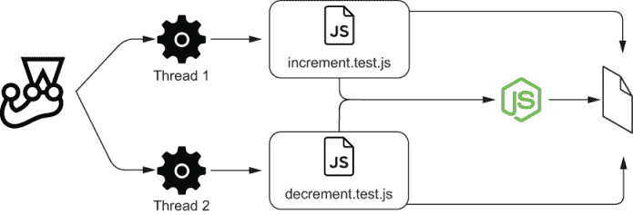
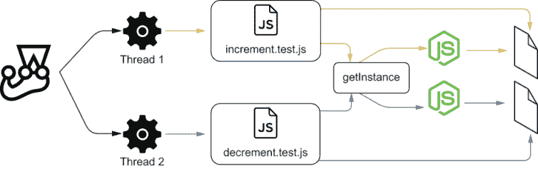
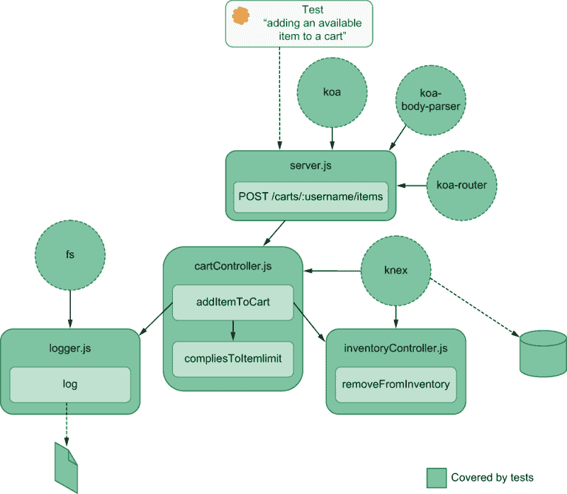
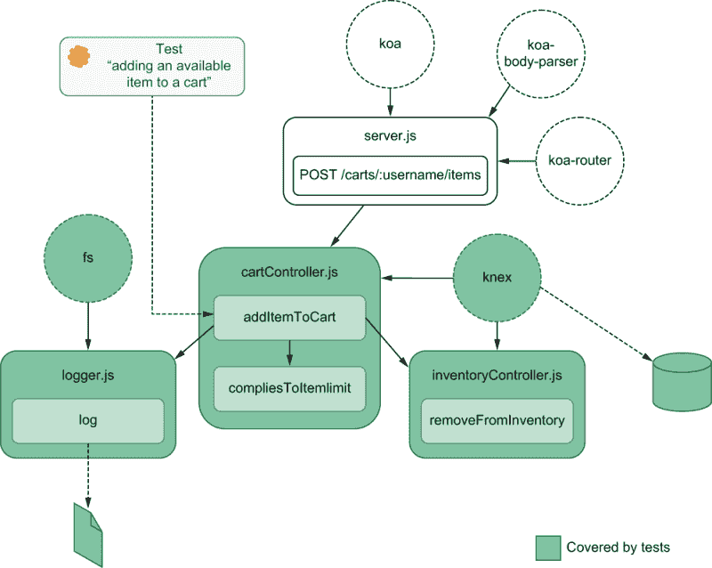
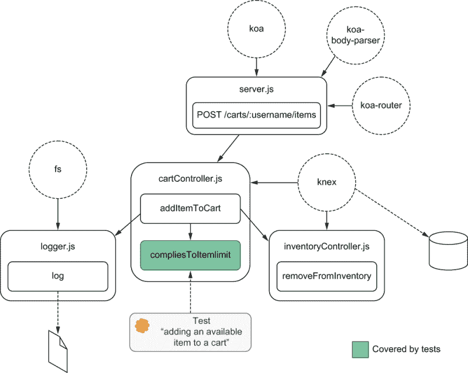
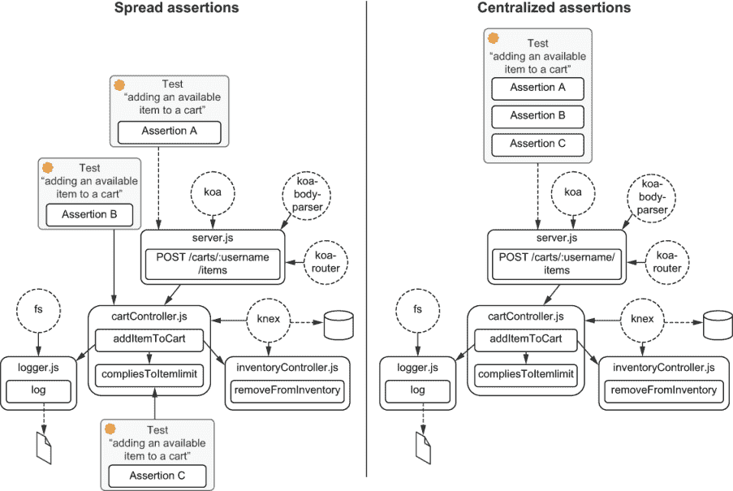
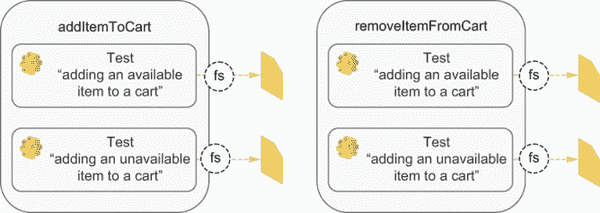
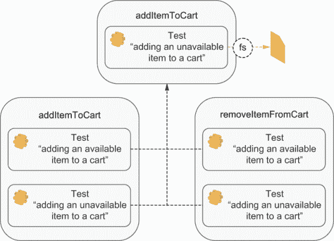
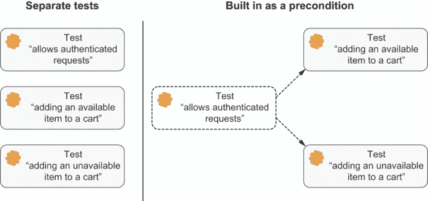

# 5 高级后端测试技术

本章涵盖

+   消除非确定性

+   运行后端测试的并发技术

+   如何在保持质量的同时降低成本

即使是世界上最美味的芝士蛋糕，如果其利润率太小，对面包店来说也是不可行的。如果你每片蛋糕只能赚一美分，那么经营成功将是一项挑战。

此外，为了建立一个成功的面包店，你必须能够持续地烘焙出无瑕疵的食谱。否则，如果你的杏仁小圆饼批次有一半无法出售，你唯一的结果就是经济损失。

同样，如果你的测试成本过高，因为它们运行时间过长或维护难度过大，那么建立一家成功的软件公司将会很具挑战性。

然而，为了使这些快速且易于更新的测试变得有用，它们必须可靠且稳健。**如果你不能信任你的测试，那么它们运行得多快或更新得多容易都没有关系。**

在本章中，我将教你测试技术，帮助你使你的后端测试快速、可靠且易于更新，同时仍然保持你的错误检测机制的质量。

你将通过改进上一章中构建的测试来了解这些技术。当我演示**如何**应用这些技术时，我还会解释**为什么**它们很重要。

因为服务器可能依赖于你无法控制的因素，如异步性、时间或并行性以及共享资源，所以本章的第一部分重点介绍如何使你的测试具有确定性。在本节中，你将学习如何使你的测试能够在任何地方快速且可靠地运行，即使它们依赖于外部资源，如数据库或时间。

采用目标导向的方法，在第 5.2 节中，我将解释你如何在保持严格的质量控制的同时降低测试的成本。本节教你关于你将不得不做出的决策，即选择**什么**要测试以及**如何**测试，考虑到你的时间和资源。

## 5.1 消除非确定性

因为路易斯在完善每一道食谱上投入了大量的努力，所以他希望每个人都严格遵循这些食谱。他训练每位糕点师像飞机驾驶员一样一丝不苟。路易斯知道，如果每位厨师每次都遵循相同的步骤，从烤箱中出来的每一块蛋糕都会和之前的一样美味。

可重复的食谱对于他面包店的成功至关重要，就像可重复的测试对于项目成功至关重要一样。

可重复的测试被认为是**确定性的**。

确定性测试 确定性测试是指在给定相同输入的情况下，总是产生相同结果的测试。

在本节中，我将讨论测试中可能出现的非确定性行为的来源，并探讨解决方法。

**测试应该始终是确定的**。否则，你很难判断是测试中存在问题还是应用中存在问题。它们会逐渐削弱你对测试套件的信心，并允许错误悄悄溜入。有些人，比如马丁·福勒，甚至会说非确定性的测试是*无用的*([`martinfowler.com/articles/nonDeterminism.html`](https://martinfowler.com/articles/nonDeterminism.html))。

确定性测试可以增强你的信心，因此让你进步更快。对测试的信心使你能够一次更改更大的代码块，因为你相信它们只有在应用程序不工作时才会失败。

在上一章中，当我们讨论如何处理第三方 API 时，我们实际上是在使我们的测试确定。因为我们消除了对他人服务的依赖，我们完全控制了测试何时通过。为了使这些测试工作，你不会依赖于互联网连接或他人的服务可用并提供一致的响应。

但第三方 API 并不是非确定性的唯一来源。在并行运行测试或处理共享资源、时间依赖性代码和其他你无法控制的因素时，你经常会创建非确定性测试。特别是在编写后端应用程序时，你经常会不得不处理这些元素，因此你必须准备好编写覆盖它们的确定性测试。

通常，最好的解决方案是创建测试替身来使非确定性代码变得确定性。例如，当与物联网（IoT）设备交互时，你不想你的测试依赖于这些设备可用。相反，你应该使用 Jest 的模拟来模拟这些设备会产生的响应。对于处理随机性也是如此。如果你必须使用随机数生成器，比如`Math.random`，就模拟它，以便从源头消除随机性。

**作为一个经验法则，你应该模拟你无法控制的一切**。

我们之前用来使测试确定的一种技术是确保它们都从相同的初始状态开始。

**为了使测试确定，它们始终需要给出相同的初始状态**。否则，即使正在操作该状态的单元测试是确定的，最终结果也会不同。

备注：通过状态，我指的是与单元测试相关的状态。例如，对一个应用 50%折扣的用户购物车函数，当给定的用户名不同时，不会生成不同的结果。在折扣函数的情况下，当提到给它的状态时，我指的是购物车的内容，而不是用户的名字。

模拟你无法控制的一切，并且始终提供具有相同初始状态的测试，这应该能让你走得很远，但一些特殊情况有更好的解决方案。

当处理依赖于时间的代码或可能相互干扰的并发测试时，你并不一定需要使用 Jest 的模拟。对于这些情况，我将详细介绍如何找到一个解决方案，它以更少的妥协带来更好的结果。

### 5.1.1 并行性和共享资源

同时在同一个烤箱里烤胡萝卜蛋糕、马卡龙和面包似乎不是一个好主意。因为每种糕点都需要在不同的温度下烤不同长度的时间，所以路易斯的厨师要么为不同的食谱使用不同的烤箱，要么一次只烤一种甜点。

同样，当你对相同的资源进行并发测试时，结果可能是灾难性的。

在上一节中，你必须通过使用 `--runInBand` 选项来按顺序运行你的测试，以避免不可靠性。并行化会导致这些测试变得不可靠，因为它们正在操作相同的数据库，因此会相互干扰。

让我们用一个更简单的例子来可视化这种情况是如何发生的，然后看看我们如何能够解决它。鉴于我们可以在较小的样本中准确复制这个问题，我们可以在处理更复杂的应用时应用相同的原理。

我们不创建一个针对数据库操作的后端，而是创建一个小的模块，它更新文件的内容。这两个模块都在多个并行测试共享的资源上工作。因此，我们可以将一个问题的解决方案适应到另一个问题中。

首先，编写一个小程序，我们将用它作为示例。创建一个模块，它改变包含计数的文件的内容。

列表 5.1 countModule.js

```
const fs = require("fs");
const filepath = "./state.txt";

const getState = () => parseInt(fs.readFileSync(filepath), 10);          ❶
const setState = n => fs.writeFileSync(filepath, n);                     ❷
const increment = () => fs.writeFileSync(filepath, getState() + 1);      ❸
const decrement = () => fs.writeFileSync(filepath, getState() - 1);      ❹

module.exports = { getState, setState, increment, decrement };
```

❶ 同步地从文件中读取计数，将原本是字符串的内容转换为数字

❷ 同步地将传递的参数写入文件

❸ 同步地增加文件的计数

❹ 同步地减少文件的计数

为了验证这个模块，编写两个测试：一个用于增加文件的计数，另一个用于减少它。将每个测试分别放入一个单独的文件中，以便它们可以并行运行。每个测试都应该重置计数，通过暴露的函数进行操作，并检查最终的计数。

列表 5.2 increment.test.js

```
const { getState, setState, increment } = require("./countModule");

test("incrementing the state 10 times", () => {
  setState(0);                                           ❶
  for (let i = 0; i < 10; i++) {                         ❷
    increment();
  }

  expect(getState()).toBe(10);                           ❸
});
```

❶ 安排：将文件的内容设置为 0

❷ 行动：调用 increment 函数 10 次

❸ 断言：期望文件的内容为 10

列表 5.3 decrement.test.js

```
const { getState, setState, decrement } = require("./countModule");

test("decrementing the state 10 times", () => {
  setState(0);                                      ❶
  for (let i = 0; i < 10; i++) {                    ❷
    decrement();
  }

  expect(getState()).toBe(-10);                     ❸
});
```

❶ 安排：将文件的 内容设置为 0

❷ 行动：调用 decrement 函数 10 次

❸ 断言：期望文件的内容为 -10

重复进行大约 10 或 20 次这些测试应该足以让你看到它们表现出不可靠的行为。最终，它们要么找到一个与预期不同的计数，要么在尝试同时读取和写入 `state.txt` 时遇到问题，这将导致模块将 `NaN` 写入文件。

提示：如果您使用的是 UNIX 系统，可以使用`while npm test; do :; done`来运行这些测试，直到 Jest 失败。

并行运行的测试，但共享相同的底层资源，如图 5.1 所示的测试，可能会发现每次运行时该资源处于不同的状态，因此失败。在先前的例子中，我们正在使用一个文件，但当我们看到测试共享相同的数据库时，同样的事情也可能发生。



图 5.1 使用相同模块和相同底层资源的两个测试

解决这个问题的最明显的方法是按顺序运行测试，就像我们之前通过使用`--runInBand`选项所做的那样。这种解决方案的问题是它可能会使您的测试运行时间更长。大多数时候，对于许多项目来说，按顺序运行测试已经足够好了。但是，当处理庞大的测试套件时，它可能会对团队的速度产生不利影响，使开发过程更加繁琐。

我们不按顺序运行测试，而是探索一个不同的解决方案，这样我们仍然可以在它们共享资源的情况下并行运行它们。

我推荐的一种策略是对您的模块的不同实例运行测试，每个实例都在不同的资源上操作。

要实现这种方法，更新您的模块，以便您可以初始化多个`countModule`实例，并告诉它们使用哪个文件，如下所示。

列表 5.4 countModule.js

```
const fs = require("fs");

const init = filepath => {               ❶
  const getState = () => {
    return parseInt(fs.readFileSync(filepath, "utf-8"), 10);
  };
  const setState = n => fs.writeFileSync(filepath, n);
  const increment = () => fs.writeFileSync(filepath, getState() + 1);
  const decrement = () => fs.writeFileSync(filepath, getState() - 1);

  return { getState, setState, increment, decrement };
};

module.exports = { init };
```

❶ 返回一个具有相同的 setState、increment 和 decrement 文件的对象，但与始终写入同一文件不同，这些函数将写入作为参数传递的路径

然后，创建一个名为`instancePool.js`的文件，该文件能够根据 Jest 为每个工作者生成的`id`提供模块的不同实例。

列表 5.5 instancePool.js

```
const { init } = require("./countModule");

const instancePool = {};

const getInstance = workerId => {                                          ❶
  if (!instancePool[workerId]) {
    instancePool[workerId] = init(`/tmp/test_state_${workerId}.txt`);      ❷
  }

  return instancePool[workerId];                                           ❸
};

module.exports = { getInstance };
```

❶ 给定一个工作者的 ID，返回一个仅写入该特定工作者使用的文件的 countModule 实例

❷ 如果该实例尚不存在，则为传递的工作者创建一个新的 countModule 实例

❸ 返回一个仅由传递的工作者使用的 countModule 实例

现在，在您的每个测试文件中，您都可以获得一个仅对该工作者专用的模块实例。

使用`process.env.JEST_WORKER_ID`来获取工作者的唯一 ID，并将其传递给`getInstance`，以便它可以给每个工作者提供不同的资源。

列表 5.6 increment.test.js 和.decrement.test.js

```
const pool = require("./instancePool");
const instance = pool.getInstance(process.env.JEST_WORKER_ID);         ❶
const { setState, getState, increment } = instance;

// The code for each test file goes here
```

❶ 使每个测试文件获得一个仅由执行它的工作者使用的 countModule 实例

在这些更改之后，每个测试都将使用`countModule`的不同实例（图 5.2），因此您可以安全地并行运行尽可能多的测试。



图 5.2 每个测试通过`getInstance`获取模块的不同实例，并检查不同的底层资源。

为了使示例简短，我使用了一个写入文件的模块，但对于使用数据库的应用程序测试，同样的原则适用。如果你想要为这类应用程序并行运行测试，你可以在不同的端口上运行应用程序的不同实例，每个实例连接到不同的数据库。然后你可以让工作进程向不同的端口发送请求，以与应用程序的不同实例进行交互。

### 5.1.2 处理时间

对于路易斯来说，不幸的是，许多将商品添加到购物车的顾客从未回来结账。因为商品在添加到某人的购物车时就会从库存中移除，面包店的网站经常列出商品为不可用，而实际上它们正坐在面包店的货架上等待饥饿的顾客。

在路易斯的面包店中，每一块蛋糕的最终目的地应该是顾客的手中，而不是垃圾桶。

为了解决这个问题，路易斯想要删除那些在用户购物车中超过一小时的商品，并将它们返回到库存中。

这个功能将需要一个新列来指示客户上次将商品添加到购物车的时间。为了创建这个列，通过运行 `./node_ modules/.bin/knex migrate:make --env development updatedAt_field` 添加一个新的迁移。然后，在 `migrations` 文件夹中应该创建的迁移文件中，向 `carts_items` 表添加一个 `updatedAt` 列。

列表 5.7 DATESTRING_updatedAt_field.js

```
exports.up = knex => {                     ❶
  return knex.schema.alterTable(
    "carts_items",
    table => {
      table.timestamp("updatedAt");
    });
};

exports.down = knex => {                   ❷
  return knex.schema.alterTable(
    "carts_items",
    table => {
      table.dropColumn("updatedAt");
    });
};
```

❶ 导出的 `up` 函数将数据库迁移到下一个状态，在 `carts_items` 表中添加 `updatedAt` 列。

❷ 导出的 `down` 函数将数据库迁移到之前的状态，从 `carts_items` 表中删除 `updatedAt` 列。

现在，更新 `cartController` 以便在向购物车添加商品时更新 `updatedAt` 字段。

列表 5.8 cartController.js

```
const addItemToCart = async (username, itemName) => {
  // ...

  if (itemEntry) {
    await db("carts_items")                               ❶
      .increment("quantity")
      .update({ updatedAt: new Date().toISOString() })
      .where({
        userId: itemEntry.userId,
        itemName
      });
  } else {
    await db("carts_items").insert({
      userId: user.id,
      itemName,
      quantity: 1,
      updatedAt: new Date().toISOString()
    });
  }

  // ...
};

// ...
```

❶ 当向购物车添加商品时，如果购物车中已经存在该商品的条目，则使用当前时间更新其 `updatedAt` 列

最后，创建一个删除四小时前添加的商品的函数，并使用 `setInterval` 来安排每两小时运行一次。

列表 5.9 cartController.js

```
// ...

const hoursInMs = n => 1000 * 60 * 60 * n;

const removeStaleItems = async () => {
  const fourHoursAgo = new Date(                                           ❶
    Date.now() - hoursInMs(4)
  ).toISOString();

  const staleItems = await db                                              ❷
    .select()
    .from("carts_items")
    .where("updatedAt", "<", fourHoursAgo);

  if (staleItems.length === 0) return;

  const inventoryUpdates = staleItems.map(staleItem =>                     ❸
    db("inventory")
      .increment("quantity", staleItem.quantity)
      .where({ itemName: staleItem.itemName })
  );
  await Promise.all(inventoryUpdates);

  const staleItemTuples = staleItems.map(i => [i.itemName, i.userId]);
  await db("carts_items")                                                  ❹
    .del()
    .whereIn(["itemName", "userId"], staleItemTuples);
};

const monitorStaleItems = () => setInterval(                               ❺
  removeStaleItems,
  hoursInMs(2)
);

module.exports = { addItemToCart, monitorStaleItems };
```

❶ 创建一个比当前时间早四小时的日期

❷ 查找所有四小时前已更新的购物车商品

❸ 将过期的商品放回库存中

❹ 从购物车中删除过期的商品

❺ 当被调用时，安排每两小时运行一次 `removeStaleItems` 函数

一旦调用 `monitorStaleItems`，每两小时它将删除那些四小时前添加到购物车的商品，并将它们放回库存中。

继续为 `monitorStaleItems` 添加一个简单的测试。

1.  在库存中插入一个商品。

1.  将该商品添加到购物车中。

1.  等待商品足够陈旧。

1.  启动 `monitorStaleItems`。

1.  等待 `monitorStaleItems` 运行。

1.  检查 `monitorStaleItems` 是否将旧商品重新添加到库存中。

1.  检查 `monitorStaleItems` 是否已从购物车中删除了商品。

1.  停止 `monitorStaleItems` 以防止测试挂起。

您的测试应该看起来像这样。

列表 5.10 cartController.test.js

```
const { addItemToCart, monitorStaleItems } = require("./cartController");

// ...

describe("timers", () => {
  const waitMs = ms => {                                           ❶
    return new Promise(resolve => setTimeout(resolve, ms));
  };
  const hoursInMs = n => 1000 * 60 * 60 * n;

  let timer;
  afterEach(() => {                                                ❷
    if (timer) clearTimeout(timer);
  });

  test("removing stale items", async () => {                       ❸
    await db("inventory").insert({                                 ❸
      itemName: "cheesecake",
      quantity: 1
    });

    await addItemToCart(                                           ❹
      globalUser.username,
      "cheesecake"
    );

    await waitMs(hoursInMs(4));                                    ❺

    timer = monitorStaleItems();                                   ❻

    await waitMs(hoursInMs(2));                                    ❼

    const finalCartContent = await db
      .select()
      .from("carts_items")
      .join("users", "users.id", "carts_items.userId")
      .where("users.username", globalUser.username);
    expect(finalCartContent).toEqual([]);                          ❽

    const inventoryContent = await db
      .select("itemName", "quantity")
      .from("inventory");
    expect(inventoryContent).toEqual([                             ❾
      { itemName: "cheesecake", quantity: 1 }
    ]);
  });
});
```

❶ 返回一个在传递的毫秒数后解决的承诺

❷ 每次测试后，如果存在计时器，则取消它

❸ 安排：将一个芝士蛋糕插入库存中

❹ 安排：向测试用户的购物车添加一个项目

❺ 等待四小时，以便项目变得足够旧

❻ 行动：调用 monitorStaleItems 以安排清除过时项目的函数

❻ 等待两小时，以便计时器运行

❽ 断言：期望购物车为空

❾ 断言：期望之前在购物车中的芝士蛋糕已被放回库存中

这个测试的问题在于它至少需要六小时才能完成：四小时用于项目变得足够旧，两小时用于计时器运行。因为 Jest 默认的最大超时时间是五秒，所以这个测试甚至不会终止。

即使您增加了测试的超时时间，一旦测试完成，测试仍然可能失败。可能是数据库花费了额外的几毫秒来删除过时的项目，因此，当测试运行其验证时，这些项目仍然存在。在这种情况下，非确定性会使您的测试变得不可靠**并且**缓慢。

时间，就像第三方 API 一样，是一个您无法控制的因素。因此，您应该用确定性替代方案来替换它。

现在，你可能正在考虑使用 Jest 的模拟，就像我们之前做的那样，但创建自己的模拟不会是一件容易的工作。

即使您模拟了 `setInterval`，这仍然不足以解决问题。因为您的测试使用 `setTimeout`，而 `addItemToCart` 函数使用 `Date`，您也必须模拟这些。

然后，在模拟了所有这些不同的函数之后，您仍然需要确保它们保持同步。否则，您可能会遇到例如，在推进时钟时执行 `setTimeout`，但 `Date` 仍然在过去的情形。

为了持续模拟所有与时间相关的函数，我们将使用 `sinonjs/fake-timers`。**`sinonjs/fake-timers` 包允许您模拟所有与时间相关的函数并保持它们同步**。**使用模拟计时器，您可以向前推进时间或运行任何挂起的计时器**。

备注：在撰写本文时，Jest 有两个模拟计时器的实现：`legacy`，这是默认的，和 `modern`，它使用 `sinonjs/fake-timers` 包（以前称为 `lolex`）作为模拟计时器的底层实现。

我在这本书中直接使用 `sinonjs/fake-timers`，因为它允许我配置我使用的模拟计时器。如果您通过 Jest 使用此包，您不能向要安装的模拟计时器传递选项。

通过直接使用此包，我对计时器有了更多的控制。例如，我可以确定要模拟哪些计时器函数。如果您认为此功能对您不是必需的，您可以使用 Jest 的 `useFakeTimers` 方法代替，并避免安装此额外包。

将 `sinonjs/fake-timers` 作为开发依赖项安装，这样你就可以开始为 `monitorStaleItems` 创建确定性测试。

一旦安装，将 `sinonjs/fake-timers` 导入到你的测试文件中，并使用它的 `install` 方法。此方法将全局替换真实的时间相关函数为模拟函数，并返回一个 `clock` 对象，你可以用它来控制时间。

列表 5.11 cartController.test.js

```
const FakeTimers = require("@sinonjs/fake-timers");

describe("timers", () => {
  const waitMs = ms => new Promise(resolve => setTimeout(resolve, ms));
  const hoursInMs = n => 1000 * 60 * 60 * n;

  let clock;
  beforeEach(() => {
    clock = FakeTimers.install();                                          ❶
  });

  // Don't forget to restore the original timer methods after tests!
  afterEach(() => {
    clock = clock.uninstall();                                             ❷
  });

  test("removing stale items", async () => {
    // ...
  });
});
```

❶ 在每个测试之前，用模拟计时器替换原始计时器方法，你可以控制这些模拟计时器

❷ 在每个测试之后，恢复原始计时器方法

现在，你不再需要等待时间流逝，而是可以通过调用其 `tick` 方法来将时钟向前调整。`tick` 方法接受你想要时钟前进的毫秒数，如下所示。

列表 5.12 cartController.test.js

```
describe("timers", () => {
  const hoursInMs = n => 1000 * 60 * 60 * n;

  let clock;
  beforeEach(() => {
    clock = FakeTimers.install();
  });

  afterEach(() => {
    clock = clock.uninstall();
  });

  test("removing stale items", async () => {
    await db("inventory").insert({ itemName: "cheesecake", quantity: 1 });
    await addItemToCart(globalUser.username, "cheesecake");

    clock.tick(hoursInMs(4));                ❶

    timer = monitorStaleItems();             ❷

    clock.tick(hoursInMs(2));                ❸

    const finalCartContent = await db
      .select()
      .from("carts_items")
      .join("users", "users.id", "carts_items.userId")
      .where("users.username", globalUser.username);
    expect(finalCartContent).toEqual([]);

    const inventoryContent = await db
      .select("itemName", "quantity")
      .from("inventory");
    expect(inventoryContent).toEqual([{ itemName: "cheesecake", quantity: 1 }]);
  });
});
```

❶ 将时钟向前调整四小时，使项目变得足够旧

❷ 调用 monitorStaleItems 来安排清除过时项目的函数

❸ 将时钟向前调整两小时以触发计划中的 removeStaleItems 函数，从而从购物车中删除过时项目

即使你已经模拟了所有必要的计时器，之前的测试仍然可能失败。尽管调用了计划中的 `removeStaleItems`，但有时它运行不够快，无法在测试检查内容之前更新数据库。

当你没有等待承诺的情况时，例如在这个案例中，数据库更新发生在计时器内部，我建议你重试你的断言。

与等待固定时间相比，重试提供了两个优势：速度和健壮性，如下所述。

+   重试使测试更快，因为它们允许测试在满足特定条件后立即进行，而不是等待固定的时间窗口。

+   重试使测试更加健壮，因为它们保证了无论操作持续多长时间，只要不超过测试的总超时时间，测试仍然会工作。

要实现重试机制，将断言和获取断言主题的代码包装到一个函数中。然后，每当断言抛出错误（失败）时，让该函数调用自己。

具有重试功能的测试看起来是这样的。

列表 5.13 cartController.test.js

```
describe("timers", () => {
  // ...

  test("removing stale items", async () => {
    await db("inventory").insert({ itemName: "cheesecake", quantity: 1 });
    await addItemToCart(globalUser.username, "cheesecake");

    clock.tick(hoursInMs(4));
    timer = monitorStaleItems();
    clock.tick(hoursInMs(2));

    const checkFinalCartContent = async () => {            ❶
      const finalCartContent = await db
        .select()
        .from("carts_items")
        .join("users", "users.id", "carts_items.userId")
        .where("users.username", globalUser.username);

        try {                                              ❷
          expect(finalCartContent).toEqual([]);
        } catch (e) {
          await checkFinalCartContent();
        }
    };
    await checkFinalCartContent()

    const checkInventoryContent = async () => {            ❸
      const inventoryContent = await db
        .select("itemName", "quantity")
        .from("inventory");

      try {                                                ❹
        expect(inventoryContent)
          .toEqual([{ itemName: "cheesecake", quantity: 1 }]);
      } catch (e) {
        await checkInventoryContent()
      }
    };
    await checkInventoryContent();
  });
});
```

❶ 不断检查最终购物车的内容，直到断言通过

❷ 断言购物车为空；如果不为空，则重新运行包含此断言的函数

❸ 不断检查库存的内容，直到断言通过

❹ 断言芝士蛋糕已放回库存中；如果没有，则重新运行包含此断言的函数

为了让它看起来更美观，你可以将重试行为提取到单独的函数中。你可以创建一个 `withRetries` 函数，它接受应该重试的函数，并在它抛出 `JestAssertionError` 时不断重新运行它。

列表 5.14 cartController.test.js

```
const withRetries = async fn => {
  const JestAssertionError = (() => {             ❶
    try {
      expect(false).toBe(true);
    } catch (e) {
      return e.constructor;
    }
  })();

  try {                                           ❷
    await fn();
  } catch (e) {
    if (e.constructor === JestAssertionError) {
      await withRetries(fn);
    } else {
      throw e;
    }
  }
};
```

❶ 捕获断言错误，Jest 没有导出这个错误

❷ 重复执行传递的函数，直到它不再抛出断言错误

然后，将你想要重试的函数传递给 `withRetries`。

列表 5.15 cartController.test.js

```
describe("timers", () => {
  // ...

  test("removing stale items", async () => {
    await db("inventory").insert({ itemName: "cheesecake", quantity: 1 });
    await addItemToCart(globalUser.username, "cheesecake");

    clock.tick(hoursInMs(4));
    timer = monitorStaleItems();
    clock.tick(hoursInMs(2));

    await withRetries(async () => {                             ❶
      const finalCartContent = await db
        .select()
        .from("carts_items")
        .join("users", "users.id", "carts_items.userId")
        .where("users.username", globalUser.username);

      expect(finalCartContent).toEqual([]);
    });

    await withRetries(async () => {                             ❷
      const inventoryContent = await db
        .select("itemName", "quantity")
        .from("inventory");

      expect(inventoryContent).toEqual([
        { itemName: "cheesecake", quantity: 1 }
      ]);
    });
  });
});
```

❶ 持续检查购物车的最终内容，直到它为空

❷ 持续检查库存内容，直到芝士蛋糕放回其中

现在，如果你想在每次重试前添加几毫秒的间隔，因为计时器被模拟了，使用 `setTimeout` 来等待承诺解决就不会起作用。

为了避免模拟 `setTimeout` 函数，你可以在调用模拟计时器的 `install` 方法时指定你想要模拟的计时器，如下所示。

列表 5.16 cartController.test.js

```
describe("timers", () => {
  // ...

  let clock;
  beforeEach(() => {
    clock = FakeTimers.install({              ❶
      toFake: ["Date", "setInterval"]
    });
  });

  // ...
});
```

❶ 仅使用模拟计时器来处理 Date 和 setInterval 函数

通过指定你只想模拟 `Date` 和 `setInterval`，你可以在其他任何地方使用真实的 `setTimeout`，包括在你的 `withRetries` 函数内部。

列表 5.17 cartController.test.js

```
// ...

const withRetries = async fn => {
  const JestAssertionError = (() => {
    try {
      expect(false).toBe(true);
    } catch (e) {
      return e.constructor;
    }
  })();

  try {
    await fn();
  } catch (e) {
    if (e.constructor === JestAssertionError) {
      await new Promise(resolve => {                ❶
        return setTimeout(resolve, 100)
      });
      await withRetries(fn);
    } else {
      throw e;
    }
  }
};

// ...
```

❶ 在重试前等待 100 毫秒

你刚刚构建的测试现在尽可能的确定。

由于时间不再在你的控制之下，你用模拟计时器替换了它，你可以随意处理。通过推进时间，你可以触发计划好的计时器并更新由 `Date` 生成的值。

使用这些模拟计时器，你不再需要让你的测试等待。你可以完全控制发生的事情以及何时发生。为了避免使用计划操作使测试失败，因为它们运行时间较长，你还添加了一个 `retry` 机制，这样你就可以多次重新运行断言，直到测试本身超时。

警告 使用这些重试机制会使测试失败的时间变长。你应该仅在绝对必要时重试断言。否则，它们可能会显著影响你的测试套件运行的时间。

正如你在第九章中将要看到的，我们将讨论测试驱动开发，拥有可以快速运行的测试对于高效迭代至关重要。

如果你感到好奇，可以尝试编写一个依赖于 `setInterval` 或 `setTimeout` 的新功能并进行测试。例如，你可以尝试定期向所有用户发送电子邮件。

提示 `@sinonjs/fake-timers` 包除了使用 `tick` 来推进时间之外，还可以以许多其他有用的方式操作计时器。例如，你可以使用 `runNext` 来仅运行下一个计划好的计时器，或者使用 `runAll` 来运行所有挂起的计时器。有关 `@sinonjs/fake-timers` 的完整文档，请访问 [`github.com/sinonjs/fake-timers`](https://github.com/sinonjs/fake-timers)。

## 5.2 在保持质量的同时降低成本

快速制作一千个糟糕的蛋糕和花一整天时间制作一个完美的蛋糕一样糟糕。路易斯的面包店的成功不仅取决于他的甜点有多美味，还取决于他能够生产多少产品来应对天文数字的需求。为了在短时间内制作美味的甜点，他必须弄清楚哪些过程的部分需要做得更仔细，哪些可以稍微宽松一些。

编写后台应用程序可能不如烘焙蛋糕那样令人愉悦，但说到快速交付工作的软件，降低成本和保持质量仍然至关重要。

在本节中，我们将探讨哪些细节提供了最大的好处，并将它们应用于我们已学到的几个概念在后台应用程序的上下文中。

我将本节分为以下三个最相关的技术，以尽可能少的成本保持和获得可靠的质量保证：

+   减少测试之间的重叠

+   创建传递性保证

+   将断言转换为前置条件

我将详细介绍每种技术，并讨论如何根据你拥有的时间和资源，将这些技术适应到你的项目环境中。

### 5.2.1 减少测试之间的重叠

当测试运行相同的代码片段并重复彼此的验证时，测试会重叠。例如，图 5.3 中的测试触及了你的应用程序的许多部分，因此它可能与许多其他测试重叠。尽管你的测试可能从不同的角度与你的应用程序交互，但通过消除这种重叠，你通常可以减少你必须维护的代码量。删除重叠的棘手之处在于，在删除测试的同时保持高质量。更多的测试并不一定意味着更高的质量，但它们确实会增加你必须维护的代码量。



图 5.3 发送请求到该路由的端到端测试将导致`addItemToCart`、`compliesToItemLimit`、`removeFromInventory`和`log`等函数被执行。

为了决定为特定功能编写哪些测试，考虑你运行每个测试时应用程序的哪些部分被执行。例如，让我们看看向添加到购物车路由发送请求时会发生什么。

TIP 将其视为一个依赖树，其中最顶层的节点是包含所有路由的`server.js`文件，这有助于可视化。

现在，将之前端到端测试的范围与图 5.4 所示的集成测试的范围进行比较。

由于`addItemToCart`函数在其依赖树下的节点较少，因此它执行的代码比之前的端到端测试少。因此，尽管其焦点不同，但其范围较小。

集成测试仅覆盖控制器内的业务逻辑，而端到端测试覆盖从中间件到路由规范本身的一切。尽管两者都能检测业务逻辑是否有错误，但只有端到端测试可以确保应用程序符合 HTTP 端点的设计。



图 5.4 对`addItemToCart`的集成测试也将导致`compliesToItemLimit`、`removeFromInventory`和`log`被调用。

最后，让我们比较这两个测试与直接调用`compliesToItemLimit`的单元测试，如图 5.5 所示。



图 5.5 对`compliesToItemLimit`的单元测试仅覆盖该函数。

前面的测试不仅可以捕获`compliesToItemLimit`中的错误，还可以捕获其上方的其他依赖项中的错误。因为`compliesToItemLimit`不依赖于任何其他软件组件，所以测试它执行非常少的代码行。

考虑到你预算紧张和截止日期紧迫，你如何以尽可能少的测试来最大化编写测试的好处？

要回答这个问题，考虑一下每次测试可以覆盖你代码的多少。假设你希望尽可能多地以尽可能少的努力断言，你应该选择运行你应用程序最大部分但代码最少的测试。在这种情况下，那将是端到端测试。

备注：通常，端到端测试是编写和运行时间最长的测试。在大多数情况下，你会选择实现集成测试，考虑到这将容易得多。但是，由于测试 Node.js 后端非常快速且相对直接，通常更好的选择是进行端到端测试。

只编写一个测试的问题在于，通过省略其他测试，你可能会错过关键的断言。

例如，假设你的端到端测试只断言应用程序的响应，而你的`addItemToCart`集成测试也断言数据库的内容。如果你简单地选择不编写集成测试，例如，你可能不知道你的应用程序在数据库中插入了错误的项目，即使它返回了有效的响应。

为了编写更少的代码但保持相同的保证，你应该将这些断言移动到你的端到端测试中，该测试也覆盖`addItemToCart`。在这种情况下，你仍然运行相同的验证，但将它们集中在以最高节点为入口点的测试中，而不是像图 5.6 所示的那样分散在多个测试中。



图 5.6 当减少测试代码量时，将断言集中在覆盖最高节点的测试中。

这种方法的缺点是，有时你将无法覆盖某些边缘情况。例如，你不能将`null`值传递给`addItemToCart`，因为路由参数始终是字符串。因此，`addItemToCart`在传递`null`值时可能会意外失败。另一方面，也有人可能会争辩说，如果这个函数从未传递`null`值，那么测试这个情况就没有价值。

通过编写具有更多断言的更粗粒度的测试，你选择通过消除重复来降低成本，以换取更不精确的反馈。

你拥有的时间和资源越多，你就可以将断言分配到更细粒度的测试中，通过不同的端点来锻炼你的应用程序，并生成更精确的反馈。记住，当涉及到测试时，没有一种适合所有情况的解决方案。它*总是*“取决于”。

### 5.2.2 创建传递性保证

在第三章中引入的传递性保证的概念在测试后端应用程序时特别有用。

每当你对应用程序的某个特定方面进行断言的成本很高时，传递性保证可以帮助你减少获取相同可靠性所需的代码量。

例如，考虑`cartController`中可能函数的测试。假设这些函数在你添加或从卡片中删除项目时都会进行日志记录，无论这些操作是否成功。因为日志记录发生得如此频繁，你必须编写大量的重复断言来覆盖它，如图 5.7 所示。



图 5.7 在每个依赖于日志记录器的测试中，你将重复相同的代码来读取日志文件并执行类似的断言。

重复断言你的日志记录器的行为是耗时的，因此成本高昂。每次你必须断言函数的日志方面时，你必须导入`fs`模块，打开文件，并断言其内容。在测试之间，你还必须记得清除日志文件。如果日志记录器将额外的元数据，如时间戳，添加到日志内容中，你必须在断言时考虑它。你可能必须忽略时间戳或模拟其来源，这将给测试增加额外的复杂性。

为了减少重复并确保你的应用程序正确地进行日志记录，你可以创建一个传递性保证。首先，你将为`log`函数编写一个单独的测试，确保记录器写入正确的文件并添加所有必要的元数据。然后，在测试每个需要`logger`的函数时，你不必重复那些昂贵的检查，只需验证`log`是否以正确的参数被调用，因为你已经知道它工作正常。

这样做就像是在说，“我已经知道我的日志记录器工作正常，因为我已经测试过它了。现在，我只想确保它使用正确的参数被调用。”这种做法如图 5.8 所示。



图 5.8 购物车功能的测试依赖于日志记录器测试创建的保证。

由于后端通常处理许多与应用程序正交的依赖项，如日志记录，昂贵的断言非常频繁。每当这种情况发生时，封装那些依赖项的测试，并仅检查它们是否被适当地调用。

TIP 相比于编写执行断言的函数，使用传递性保证来封装它们。

### 5.2.3 将断言转换为先决条件

您可以通过将断言转换为先决条件来减少您需要编写的测试数量。您不需要为特定的行为编写单独的测试，而是依赖于该行为使其他测试通过。

例如，考虑一下您为应用程序构建的认证中间件。我们不需要为每个路由编写特定的测试来检查它是否允许经过身份验证的请求通过。相反，我们通过发送经过身份验证的请求来测试路由的其他方面。如果认证中间件不允许经过身份验证的请求通过，那么其他测试将失败。

由于那些其他测试已经依赖于认证，这就像您已经将断言嵌入到您如何执行应用程序的方式中，如图 5.9 所示。通过以这种方式编写测试，对于您拥有的每个路由，您可以节省一个额外的测试。



图 5.9 通过依赖于其他测试中发生的行为，您可以避免为它编写特定的测试。

另一方面，您无法避免的认证中间件测试是确保您的应用程序拒绝未经身份验证的请求的测试。因为测试路由内的其他功能需要您传递有效的身份验证头，所以您不能将此验证嵌入到其他测试中。

在您的测试中嵌入断言的另一种常见方式是通过改变创建模拟的方式。

例如，当我们使用 `nock` 来模拟端点时，我们实际上是在那些模拟中构建了断言。我们使那些模拟仅对正确的请求做出响应，并在它们未被调用时失败。

以我们为获取库存项的路由编写的测试为例，该测试依赖于第三方 API。多亏了 `nock`，该测试只有在请求以正确的参数发送到正确的 URL 时才会通过。因此，您不需要断言 `fetch` 函数的使用方式。

每当您使模拟仅对期望的参数做出响应时，您就不需要断言该模拟是如何被调用的。

如果您不处理端点，另一种选择是使用 `jest-when` 来实现相同的目标。

在这种情况下，你又一次是在以更少的重复为代价换取更细粒度的反馈。当这些测试失败时，找出错误的根本原因将需要更长的时间，但你也会在编写测试上花费更少的资源。

## 摘要

+   测试必须始终从相同的初始状态开始。否则，它们可能会变得不可靠。在每个测试之间，不要忘记清理使用的每个资源。为了定义将执行此定期清理的钩子，你可以使用 Jest 的`setupFilesAfterEnv`选项。

+   当你依赖于任何不在你控制范围内的事物，如时间或第三方 API 时，你应该模拟它。否则，你的测试将不会是确定性的，因此会削弱你对测试套件的信心，并且可能变得难以调试。

+   要模拟第三方 API，你可以使用`nock`。这将使你能够指定端点的响应，而不是必须模拟 HTTP 库。因为`nock`可以与任何你正在使用的请求库一起工作，这将使测试更加解耦，更容易阅读、编写和更新。

+   你的测试不应该依赖于时间。无论何时你依赖于日期或计时器被触发，请使用模拟计时器而不是等待固定的时间。模拟计时器使你能够触发任何计时器并向前移动时钟，使测试更快、更健壮和确定性更高。

+   如果你有的测试共享资源，当它们并行运行时可能会相互干扰。为了隔离你的测试，你可以针对你的应用程序的不同实例运行它们，每个实例使用单独的资源。

+   通过编写执行你应用程序更大部分的测试并将断言向上移动，你可以减少需要编写的测试数量，但仍然可以执行相同的检查。即使你的反馈将不那么细粒度，这种策略可以帮助你在保持测试全面性的同时减少成本。

+   为了避免重复的断言，你可以创建传递性保证。而不是在每个测试中重新测试依赖项，你可以确保该依赖项独立工作，然后只检查它是否被正确使用。这种技术在编写后端应用程序时特别有用，因为后端应用程序往往具有更多的正交依赖项。

+   你并不总是需要一个单独的测试来检查特定的行为。如果其他测试依赖于该行为通过，那么你就可以认为它已经被覆盖了。
