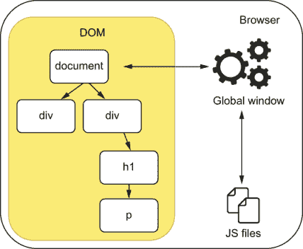
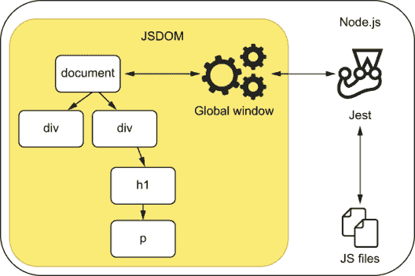
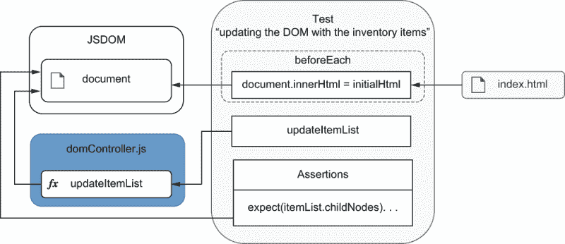
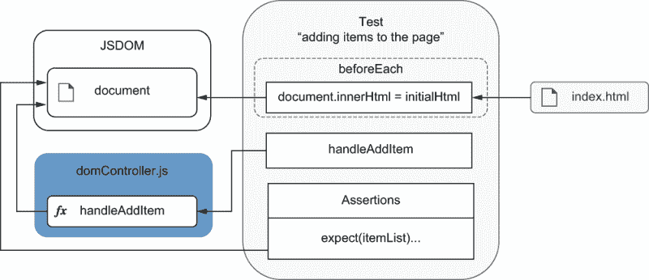
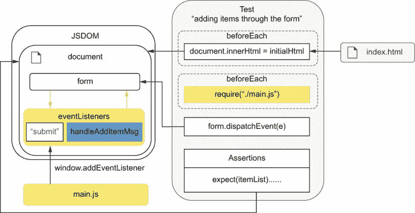
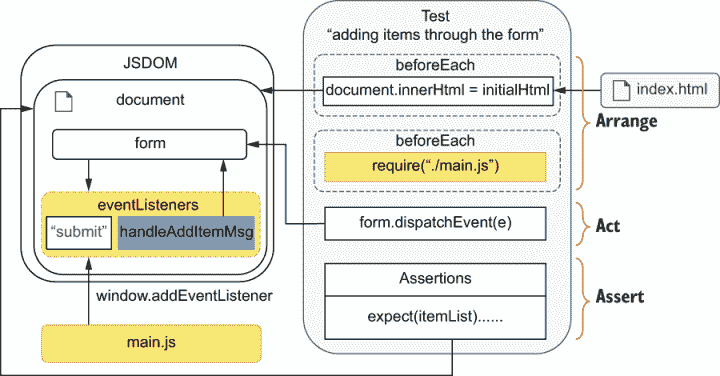
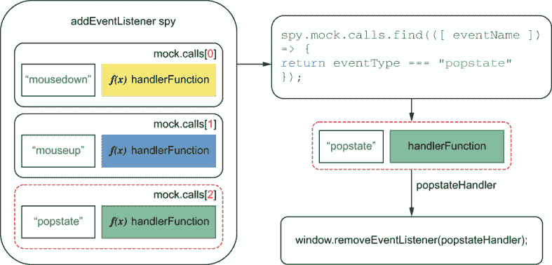
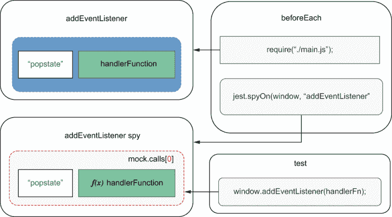
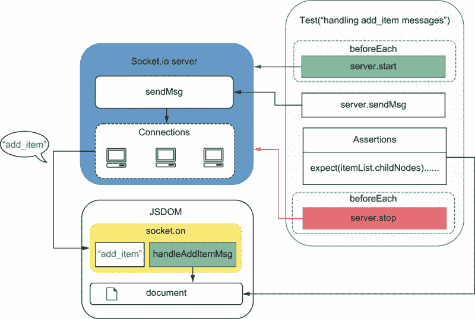

# 6 测试前端应用程序

本章涵盖

+   在测试中复制浏览器的 JavaScript 环境

+   对 DOM 元素进行断言

+   处理和测试事件

+   编写涉及浏览器 API 的测试

+   处理 HTTP 请求和 WebSocket 连接

尝试编写一个不使用 JavaScript 的客户端应用程序，就像在没有碳水化合物的情况下烘焙甜点一样困难。JavaScript 是为了征服网络而生的，在浏览器中，它闪耀着光芒。

在本章中，我们将介绍测试前端应用程序的基础知识。我们将一起构建一个用于第四章中编写后端的小型网络客户端，并学习如何测试它。

在构建和测试此应用程序的过程中，我将解释在浏览器中运行 JavaScript 的特殊性，由于 Jest*不能*在浏览器中运行，我将教您如何在 Node.js 中模拟该环境。如果不能在 Jest 中模拟浏览器环境，您就无法使用它来测试您的前端应用程序。

在测试前端应用程序时，断言可能会变得更加困难，因为现在您不仅要处理函数的返回值，还要处理它与 DOM 的交互。因此，您将学习如何在测试中找到元素并对它们的内 容进行断言。

用户与前端应用程序的交互方式也与他们与后端应用程序的交互方式显著不同。服务器通过例如 HTTP、CoAP 或 MQTT 接收输入，而网络客户端必须处理用户的滚动、点击、输入和拖动，这些更难准确模拟。

为了了解您如何处理这些复杂的交互，我将解释事件是如何工作的，以及您如何像浏览器一样触发它们。适当地模拟用户行为对于使您的测试尽可能接近运行时发生的情况至关重要。这种相似性将使您能够从测试中获得尽可能多的价值，增加在达到生产之前可以捕获的错误数量。

假设，例如，你有一个输入字段，其内容在用户输入每个字符时都会被验证。如果在你的测试中你一次性更改输入的内容，你将*不会*触发在运行时发生的多次验证。因为你的测试会模拟一个与生产环境中发生的情况不同的场景，所以你的测试将不可靠。例如，你不会捕获到仅在用户输入时发生的错误。

除了能够处理复杂的交互外，浏览器还提供了许多您可以使用来存储数据或操作导航历史记录等功能的令人兴奋的 API。即使您不需要测试这些 API 本身，验证您的代码是否充分与它们接口也是至关重要的。否则，您的应用程序可能无法按预期工作。

通过使用历史和 Web 存储 API，你将了解如何测试涉及浏览器 API 的功能。你将学习你应该测试什么，不应该测试什么，最重要的是，如何进行测试。

最后，在本章的结尾，你将了解到如何通过 HTTP 请求或 WebSocket 连接与第三方进行交互，这两种方式是网络上收集数据最常见的方法之一。就像你在测试后端应用程序时所做的那样，你将学习如何可靠地处理这些交互，同时不产生维护开销。

本章的主要目标是教你测试**任何**前端应用程序所需的**基础**。因为你将学习每个工具的作用以及它们在幕后是如何工作的，所以无论你是在测试用 Vue.js 编写的应用程序还是 React 编写的应用程序，这些概念都将是有用的。

对如何测试“原始”前端应用程序有扎实的理解，将使你更容易测试你未来可能使用的任何其他库或框架。

你将通过为路易斯的员工构建一个前端应用程序来管理他们的库存来学习这些概念。一开始，你只允许用户将奶酪蛋糕添加到库存中，并学习如何在 Node.js 中运行你的应用程序代码，以便你可以使用 Jest 进行测试。

随着你对这些章节的深入，你将添加新的功能，并学习如何测试它们以及使用哪些工具。例如，你将允许路易斯的员工添加他们想要的任何数量的任何甜点，并验证他们的输入以防止他们犯错。然后，如果他们确实犯了错误，你将使他们能够通过一个`撤销`按钮来恢复，这个按钮与浏览器的历史 API 进行交互。

最后，在本章的最后部分，你将使应用程序能够自动更新，而无需用户刷新页面。当操作员添加项目时，任何员工都将能够实时看到厨师正在消耗哪些原料，以及顾客正在购买哪些甜点。

通过测试这些功能，这些功能涵盖了编写前端应用程序所涉及的不同方面，你将能够测试路易斯未来可能要求你实现的所有功能。

希望员工们对你的软件工作得有多好，就像顾客对糕点店的奶酪蛋糕味道有多满意一样。

## 6.1 介绍 JSDOM

在专业厨房烘焙与在家烘焙大不相同。在家烘焙时，你不会总是拥有厨师架子上所有独特的原料。你可能不会有同样复杂的设备或同样完美的厨房。尽管如此，这并不意味着你不能烘焙出美味的甜点。你只需要适应。

类似地，在浏览器中运行 JavaScript 与在 Node.js 中运行 JavaScript 有显著不同。根据情况，在浏览器中运行的 JavaScript 代码根本不能在 Node.js 中运行，反之亦然。因此，为了测试你的前端应用程序，你可能需要走一些额外的步骤，但这并不意味着你不能做到。通过一些调整，你可以使用 Node.js 以与路易在面包店使用他拥有的花哨的法式厨具在家烘焙令人垂涎的奶酪蛋糕相同的方式运行为浏览器编写的 JavaScript。

在本节中，你将学习如何使用 Node.js 和 Jest 来测试为在浏览器中运行而编写的代码。

在浏览器中，JavaScript 可以访问不同的 API，因此具有不同的功能。

在浏览器中，JavaScript 可以访问一个名为`window`的全局变量。通过`window`对象，你可以更改页面的内容，在用户的浏览器中触发操作，并对事件做出反应，如点击和按键。

通过`window`，例如，你可以将监听器附加到按钮上，以便每次用户点击它时，你的应用程序都会更新面包店库存中商品的数量。

尝试创建一个执行此操作的应用程序。编写一个包含按钮和计数的 HTML 文件，并加载一个名为`main.js`的脚本，如下所示。

列表 6.1 index.html

```
<!DOCTYPE html>
<html lang="en">
<head>
    <meta charset="UTF-8">
    <title>Inventory Manager</title>
</head>
<body>
    <h1>Cheesecakes: <span id="count">0</span></h1>
    <button id="increment-button">Add cheesecake</button>
    <script src="main.js"></script>                         ❶
</body>
</html>
```

❶ 我们将用来使页面交互的脚本

在`main.js`中，通过其 ID 找到按钮，并将其监听器附加到它上。每次用户点击此按钮时，监听器都会被触发，应用程序将增加奶酪蛋糕的数量。

列表 6.2 main.js

```
let data = { count: 0 };

const incrementCount = () => {                                             ❶
  data.cheesecakes++;
  window.document.getElementById("count")
    .innerHTML = data.cheesecakes;
};

const incrementButton = window.document.getElementById("increment-button");
incrementButton.addEventListener("click", incrementCount);                 ❷
```

❶ 更新应用程序状态的函数

❷ 当按钮被点击时，将调用 incrementCount 的事件监听器

要查看此页面的实际效果，请在与你的`index.html`相同的文件夹中执行`npx http-server ./`，然后访问`localhost:8080`。

因为这个脚本在浏览器中运行，所以它能够访问`window`，因此它可以操作浏览器和页面中的元素，如图 6.1 所示。

与浏览器不同，Node.js 不能运行该脚本。如果你尝试使用`node main.js`执行它，Node.js 会立即告诉你它发现了一个`ReferenceError`，因为"`window is not defined`"。



图 6.1 浏览器中的 JavaScript 环境

那个错误发生是因为 Node.js 没有`window`。相反，因为它被设计为运行不同类型的应用程序，所以它为你提供了访问`process`等 API 的权限，其中包含有关当前 Node.js 进程的信息，以及`require`，它允许你导入不同的 JavaScript 文件。

目前，如果你要为`incrementCount`函数编写测试，你必须运行它们在浏览器中。因为你的脚本依赖于 DOM API，你无法在 Node.js 中运行这些测试。如果你尝试这样做，你会遇到你在执行`node main.js`时看到的相同的`ReferenceError`。鉴于 Jest 依赖于 Node.js 特定的 API，因此它只能在 Node.js 中运行，你也不能使用 Jest。

要能够在 Jest 中运行你的测试，**而不是在浏览器中运行测试，你可以通过使用 JSDOM 将浏览器 API 带到 Node.js 中**。你可以将 JSDOM 视为一个可以在 Node.js 中运行的浏览器环境实现。它使用纯 JavaScript 实现网络标准。例如，使用 JSDOM，你可以模拟操作 DOM 并为元素附加事件监听器。

JSDOM JSDOM 是纯 JavaScript 编写的网络标准实现，你可以在 Node.js 中使用。

要了解 JSDOM 是如何工作的，让我们使用它来创建一个表示`index.html`的对象，我们可以在 Node.js 中使用它。

首先，使用`npm init -y`创建一个`package.json`文件，然后使用`npm install --save jsdom`安装 JSDOM。

通过使用`fs`，你可以读取`index.html`文件并将其内容传递给 JSDOM，以便它能够创建该页面的表示。

列表 6.3 page.js

```
const fs = require("fs");
const { JSDOM } = require("jsdom");

const html = fs.readFileSync("./index.html");
const page = new JSDOM(html);

module.exports = page;
```

`page`表示包含你在浏览器中会找到的属性，例如`window`。因为你现在正在处理纯 JavaScript，你可以在 Node.js 中使用`page`。

尝试在脚本中导入`page`并像在浏览器中一样与之交互。例如，你可以尝试将一个新段落附加到`page`上，如下所示。

列表 6.4 example.js

```
const page = require("./page");                                 ❶

console.log("Initial page body:");
console.log(page.window.document.body.innerHTML);

const paragraph = page.window.document.createElement("p");      ❷
paragraph.innerHTML = "Look, I'm a new paragraph";              ❸
page.window.document.body.appendChild(paragraph);               ❹

console.log("Final page body:");
console.log(page.window.document.body.innerHTML);
```

❶ 导入页面的 JSDOM 表示

❷ 创建一个段落元素

❸ 更新段落的文本内容

❹ 将段落附加到页面上

要在 Node.js 中执行前面的脚本，请运行`node example.js`。

使用 JSDOM，你可以做几乎在浏览器中能做的任何事情，包括更新 DOM 元素，如`count`。

列表 6.5 example.js

```
const page = require("./page");

// ...

console.log("Initial contents of the count element:");
console.log(page.window.document.getElementById("count").innerHTML);

page.window.document.getElementById("count").innerHTML = 1337;          ❶
console.log("Updated contents of the count element:");
console.log(page.window.document.getElementById("count").innerHTML);

// ...
```

❶ 更新计数元素的文本内容

多亏了 JSDOM，你可以在 Jest 中运行你的测试，正如我之前提到的，Jest 只能在 Node.js 中运行。

通过将值`"jsdom"`传递给 Jest 的`testEnvironment`选项，你可以让它设置一个全局的 JSDOM 实例，你可以在运行测试时使用它。

要在 Jest 中设置 JSDOM 环境，如图 6.2 所示，首先创建一个名为`jest.config.js`的新 Jest 配置文件。在这个文件中，导出一个对象，其`testEnvironment`属性的值是`"jsdom"`。



图 6.2 Node.js 中的 JavaScript 环境

列表 6.6 jest.config.js

```
module.exports = {
  testEnvironment: "jsdom",
};
```

注意：在撰写本文时，Jest 的当前版本是 26.6。在这个版本中，`jsdom`是 Jest 的`testEnvironment`的默认值，因此你不必指定它。

如果您不想手动创建 `jest.config.js` 文件，可以使用 `./node_modules/.bin/jest --init`来自动化此过程。Jest 的自动初始化将提示您选择测试环境，并为您提供 `jsdom` 选项。

现在尝试创建一个 `main.test.js` 文件并将 `main.js` 导入以查看会发生什么。

列表 6.7 main.test.js

```
require("./main");
```

如果您尝试使用 Jest 运行此测试，您仍然会得到一个错误。

```
FAIL  ./main.test.js
● Test suite failed to run

  TypeError: Cannot read property 'addEventListener' of null

    10 |
    11 | const incrementButton = window.document.getElementById("increment-button");
  > 12 | incrementButton.addEventListener("click", incrementCount);
```

即使 `window` 现在存在，多亏了 Jest 设置的 `JSDOM`，其 DOM 并不是从 `index.html` 构建的。相反，它是由一个空的 HTML 文档构建的，因此没有 `increment-button`。因为按钮不存在，所以您不能调用它的 `addEventListener` 方法。

要使用 `index.html` 作为 JSDOM 实例将使用的页面，您需要读取 `index.html` 并将其内容分配给 `window.document.body.innerHTML`，然后再导入 `main.js`，如下所示。

列表 6.8 main.test.js

```
const fs = require("fs");
window.document.body.innerHTML = fs.readFileSync("./index.html");       ❶

require("./main");
```

❶ 分配 index.html 文件的内容到页面的主体

因为您现在已经配置了全局 `window` 使用 `index.html` 的内容，Jest 将能够成功执行 `main.test.js`。

要能够为 `incrementCount` 编写测试，您需要采取的最后一步是暴露它。因为 `main.js` 没有暴露 `incrementCount` 或 `data`，所以您不能执行该函数或检查其结果。通过以下方式使用 `module.exports` 来导出 `data` 和 `incrementCount` 函数来解决这个问题。

列表 6.9 main.js

```
// ...

module.exports = { incrementCount, data };
```

最后，您可以继续创建一个 `main.test.js` 文件，该文件设置初始计数，执行 `incrementCount` 并在 `data` 中检查新的 `count`。这仍然是三个 A 模式——安排、行动、断言——就像我们之前做的那样。

列表 6.10 main.test.js

```
const fs = require("fs");
window.document.body.innerHTML = fs.readFileSync("./index.html");

const { incrementCount, data } = require("./main");

describe("incrementCount", () => {
  test("incrementing the count", () => {
    data.cheesecakes = 0;                          ❶
    incrementCount();                              ❷
    expect(data.cheesecakes).toBe(1);              ❸
  });
});
```

❶ 安排：设置芝士蛋糕的初始数量

❷ 行动：执行待测试的 incrementCount 函数

❸ 断言：检查 data.cheesecakes 是否包含正确的芝士蛋糕数量

注意：目前我们不会担心检查页面内容。在下一节中，您将学习如何断言 DOM 并处理由用户交互触发的事件。

一旦您庆祝看到这个测试通过，就是时候解决最后一个问题。

因为您已经使用 `module.exports` 来暴露 `incrementCount` 和 `data`，所以 `main.js` 在浏览器中运行时会抛出错误。要查看错误，请尝试再次使用 `npx http-server ./` 提供您的应用程序，并使用浏览器开发者工具打开 `localhost: 8080`。

```
Uncaught ReferenceError: module is not defined
    at main.js:14
```

您的浏览器抛出此错误是因为它没有全局提供 `module`。再次，您遇到了与浏览器和 Node.js 之间差异相关的问题。

在浏览器中运行使用 Node.js 模块系统的文件的一种常见策略是使用一个工具，该工具将依赖项捆绑到一个浏览器可以执行的单一文件中。像 Webpack 和 Browserify 这样的工具的主要目标之一就是进行这种捆绑。

将 `browserify` 安装为开发依赖项，并运行 `./node_modules/.bin/browserify main.js -o bundle.js` 以将您的 `main.js` 文件转换为浏览器友好的 `bundle.js`。

NOTE 您可以在 [browserify.org](https://www.browserify.org) 找到 Browserify 的完整文档。

一旦运行了 Browserify，更新 `index.html` 以使用 `bundle.js` 而不是 `main.js`。

列表 6.11 index.html

```
<!DOCTYPE html>
<html lang="en">
  <!-- ... -->
  <body>
    <!-- ... -->
    <script src="bundle.js"></script>         ❶
  </body>
</html>
```

❶ bundle.js 将由 main.js 生成。它是一个包含 main.js 的所有直接和间接依赖项的单个文件。

TIP 每当 `main.js` 发生变化时，您都需要重新构建 `bundle.js`。

由于您需要频繁运行它，创建一个运行 Browserify 的 NPM 脚本会是一个明智的选择。

要创建一个运行 Browserify 的 NPM 脚本，更新您的 `package.json` 以包括以下行。

列表 6.12 package.json

```
{
  // ...
  "scripts": {
    // ...
    "build": "browserify main.js -o bundle.js"         ❶
  },
  // ...
}
```

❶ 遍历 main.js 文件的依赖树，并将所有依赖项打包成一个单一的 bundle.js 文件

通过使用像 Browserify 或 Webpack 这样的工具，您可以将您编写的可测试代码转换为在 Node.js 中运行，以便它可以在浏览器中运行。

使用打包器使您能够单独测试您的模块，并使它们在浏览器中管理起来更加容易。当您将应用程序打包成一个单一文件时，您不需要在您的 HTML 页面中管理多个 `script` 标签。

在本节中，您学习了如何使用 Node.js 和 Jest 来测试设计在浏览器中运行的 JavaScript。您看到了这两个平台之间的区别，并学习了如何使用 JSDOM 将浏览器 API 带到 Node.js。

您还看到了 Browserify 如何通过允许您将应用程序分割成单独的模块来帮助您测试应用程序，这些模块可以在 Node.js 中测试，然后打包在浏览器中运行。

通过使用这些工具，您能够使用 Jest 在 Node.js 中测试您的浏览器应用程序。

## 6.2 在 DOM 上断言

最好的厨师知道，甜点不仅应该 *味道* 正确；它还必须 *看起来* 很好。

在上一节中，您学习了如何设置 Jest 以测试您的脚本，但您还没有检查页面是否向用户显示了正确的输出。在本节中，您将了解您的脚本如何与页面的标记交互，并学习如何断言 DOM。

在我们编写测试之前，重构上一节的应用程序，使其能够管理多个库存项目，而不仅仅是芝士蛋糕。

因为您正在使用 Browserify 打包您的应用程序，所以您可以创建一个单独的 `inventoryController.js` 文件来管理库存中的项目，这些项目您将存储在内存中。

NOTE 目前，我们将所有数据存储在内存中，并专注于测试我们的网络客户端。在本章的最后部分，您将学习如何将前端应用程序连接到第四章中的服务器，并测试其后端集成。

列表 6.13 inventoryController.js

```
const data = { inventory: {} };

const addItem = (itemName, quantity) => {
  const currentQuantity = data.inventory[itemName] || 0;
  data.inventory[itemName] = currentQuantity + quantity;
};

module.exports = { data, addItem };
```

正如我们在上一节中所做的那样，你可以通过导入 `inventoryController.js`，将一个空对象分配给 `inventory` 属性，执行 `addItem` 函数，并检查库存的内容——这是通常的三个 A 模式。

列表 6.14 inventoryController.test.js

```
const { addItem, data } = require("./inventoryController");

describe("addItem", () => {
  test("adding new items to the inventory", () => {
    data.inventory = {};                                    ❶
    addItem("cheesecake", 5);                               ❷
    expect(data.inventory.cheesecake).toBe(5);              ❸
  });
});
```

❶ 安排：将一个空对象分配给库存，代表其初始状态

❷ 行动：执行 `addItem` 函数，向库存中添加五个芝士蛋糕

❸ 断言：检查库存中是否包含正确数量的芝士蛋糕

运行 Jest 应该表明你的测试通过了，但即使 `addItem` 正常工作，它也没有更新页面以显示库存的内容。要更新页面以显示库存项目列表，更新你的 `index.html` 文件，使其包括一个无序列表，我们将向其中追加项目，如下所示。

列表 6.15 index.html

```
<!DOCTYPE html>
<html lang="en">
  <head>
    <meta charset="UTF-8" />
    <title>Inventory Manager</title>
  </head>
  <body>
    <h1>Inventory Contents</h1>
    <ul id="item-list"></ul>
    <script src="bundle.js"></script>
  </body>
</html>
```

创建这个无序列表后，创建一个名为 `domController.js` 的文件，并编写一个 `updateItemList` 函数。这个函数应该接收 `inventory` 并相应地更新 `item-list`。

列表 6.16 domController.js

```
const updateItemList = inventory => {
  const inventoryList = window.document.getElementById("item-list");

  inventoryList.innerHTML = "";                                         ❶

  Object.entries(inventory).forEach(([itemName, quantity]) => {         ❷
    const listItem = window.document.createElement("li");
    listItem.innerHTML = `${itemName} - Quantity: ${quantity}`;
    inventoryList.appendChild(listItem);
  });
};

module.exports = { updateItemList };
```

❶ 清除列表

❷ 对于库存中的每一项，创建一个 li 元素，将其内容设置为包括项目的名称和数量，并将其追加到项目列表中

最后，你可以将这些内容全部放入你的 `main.js` 文件中。尝试使用 `addItem` 并调用 `updateItemList` 来添加一些项目到库存中，将新的库存传递给它。

列表 6.17 main.js

```
const { addItem, data } = require("./inventoryController");
const { updateItemList } = require("./domController");

addItem("cheesecake", 3);
addItem("apple pie", 8);
addItem("carrot cake", 7);

updateItemList(data.inventory);
```

注意：因为你应该已经完全重写了 `main.js`，所以 `main.test.js` 中的测试不再适用，因此可以删除。

不要忘记，因为我们使用 Node.js 的模块系统来启用测试，我们必须通过 Browserify 运行 `main.js`，以便它能够生成一个能够在浏览器中运行的 `bundle.js` 文件。`bundle.js` 包括 `inventoryController.js` 和 `domController.js` 的代码，而不是依赖于 `require` 和 `module` 这样的 API。

一旦你使用 `./node_modules/.bin/browserify main.js -o bundle.js` 建立了 `bundle.js`，你就可以使用 `npx http-server ./` 来提供你的应用程序，并通过访问 `localhost:8080` 来查看库存项目列表。

到目前为止，你只测试了 `addItem` 是否充分更新了应用程序的状态，但你根本就没有检查 `updateItemList`。尽管 `addItem` 的单元测试通过了，但这并不能保证当给 `updateItemList` 提供当前 `inventory` 时，它能够更新页面。

因为 `updateItemList` 依赖于页面的标记，你必须设置 Jest 的 JSDOM 所使用的文档的 `innerHTML`，就像我们在上一节中所做的那样。

列表 6.18 domController.test.js

```
const fs = require("fs");
document.body.innerHTML = fs.readFileSync("./index.html");
```

提示：除了 `window` 之外，`document` 在你的测试中也是全局的。你可以通过访问 `document` 而不是 `window.document` 来节省一些按键。

在使用你的 `index.html` 页面的内容设置 JSDOM 实例后，再次使用三个 A 模式测试 `updateItemList`：通过创建包含几个项目的库存来设置场景，将其传递给 `updateItemList`，并检查它是否适当地更新了 DOM。

由于 Jest 和 JSDOM 的存在，全局 `document` 在浏览器中工作得就像它应该那样，你可以使用浏览器 API 来查找 DOM 节点并对它们进行断言。

例如，尝试使用 `querySelector` 找到一个 `body` 的直接子元素的未有序表，并断言它包含的 `childNodes` 的数量。

列表 6.19 domController.test.js

```
// ...

document.body.innerHTML = fs.readFileSync("./index.html");         ❶

const { updateItemList } = require("./domController");

describe("updateItemList", () => {
  test("updates the DOM with the inventory items", () => {
    const inventory = {                                            ❷
      cheesecake: 5,
      "apple pie": 2,
      "carrot cake": 6
    };
    updateItemList(inventory);                                     ❸

    const itemList = document.querySelector("body > ul");          ❹
    expect(itemList.childNodes).toHaveLength(3);                   ❺
  });
});
```

❶ 因为你在将 index.html 文件的内容分配给 body 的 innerHTML，所以当测试运行时，页面将处于其初始状态。

❷ 创建包含几个不同项目的库存表示

❸ 行动：练习 updateItemList 函数

❹ 通过其在 DOM 中的位置找到列表

❺ 断言：检查列表是否包含正确的子节点数量

JSDOM 中的 DOM 元素包含与浏览器中相同的属性，因此你可以通过断言列表中每个项目的 `innerHTML` 来使你的测试更加严格。

列表 6.20 domController.test.js

```
// ...

test("updates the DOM with the inventory items", () => {
  const inventory = { /* ... */ };

  updateItemList(inventory);

  const itemList = document.getElementById("item-list");
  expect(itemList.childNodes).toHaveLength(3);

  // The `childNodes` property has a `length`, but it's _not_ an Array
  const nodesText = Array.from(itemList.childNodes).map(                  ❶
    node => node.innerHTML
  );
  expect(nodesText).toContain("cheesecake - Quantity: 5");
  expect(nodesText).toContain("apple pie - Quantity: 2");
  expect(nodesText).toContain("carrot cake - Quantity: 6");
});

// ...
```

❶ 从 itemList 中的每个节点提取 innerHTML，创建一个字符串数组。

因为你会直接调用 `updateItemList` 但检查 `DOM` 来断言函数是否产生了正确的输出，所以我将这个 `updateItemList` 的测试归类为集成测试。它专门测试 `updateItemList` 是否正确更新了页面的标记。

你可以在图 6.3 中看到这个测试如何与其他模块交互。



图 6.3 测试和被测试单元与文档的交互方式

注意测试金字塔如何渗透到你的所有测试中。你用来测试后端应用程序的原则同样适用于前端应用程序。

之前测试的问题在于它与页面的标记紧密耦合。它依赖于 DOM 的结构来查找节点。如果你的页面标记以这种方式改变，以至于节点不在完全相同的位置，测试将失败，即使从用户的角度来看，应用程序仍然完美无瑕。

假设，例如，你想要为了样式目的将你的无序列表包裹在一个 `div` 中，如下所示。

列表 6.21 index.html

```
< !-- ... -->

<body>
  <h1>Inventory Contents</h1>
  <div class="beautiful-styles">
    <ul id="item-list"></ul>
  </div>
  <script src="bundle.js"></script>
</body>

< !-- ... -->
```

这个更改将使你的 `domController` 中的测试失败，因为它将找不到无序列表。因为测试依赖于列表是 `body` 的直接后代，所以一旦你将 `item-list` 包裹在任何其他元素中，它就会失败。

在这种情况下，你不必担心列表是否是 `body` 的直接后代。相反，你需要保证它存在并且包含正确的项目。这个查询只有在你的目标是确保 `ul` 是 `body` 的直接后代时才足够。

你应该将测试中的查询视为内置断言。例如，如果你想断言一个元素是另一个元素的直接后代，你应该编写一个依赖于其 DOM 位置的查询。

注意：我们已经在第五章的最后部分讨论了如何将断言转换为先决条件。依赖于元素特定特征的查询遵循相同的原理。

在编写前端时，你很快就会注意到 DOM 结构会频繁变化，而不会影响应用程序的整体功能。因此，在绝大多数情况下，你应该避免将测试耦合到 DOM 结构。否则，即使应用程序仍然工作，你也必须频繁更新测试，这将产生额外的成本。

为了避免依赖于 DOM 的结构，更新你的 `domController` 中的测试，使其通过 `id` 找到列表，如下一代码所示。

列表 6.22 domController.test.js

```
// ...

test("updates the DOM with the inventory items", () => {
  const inventory = { /* ... */ };
  updateItemList(inventory);

  const itemList = document.getElementById("item-list");       ❶
  expect(itemList.childNodes).toHaveLength(3);

  // ...
});

// ...
```

❶ 通过 ID 查找列表

通过通过 `id` 查找列表，你可以自由地在 DOM 中移动它，并包裹你想要的任何元素。只要它有相同的 `id`，你的测试就会通过。

提示：你想要断言的元素不一定已经有了 `id` 属性。可能你的应用程序不使用 `id` 属性来查找元素，例如。

在那种情况下，将具有如此强语义的属性 `id` 附着到你的元素上并不是最佳选择。相反，你可以添加一个唯一的 `data-testid` 属性，并使用它通过 `document.querySelector ('[data-testid="your-element-testid"]')` 来查找你的元素。

现在，为了指示自页面首次加载以来发生了哪些操作，更新你的 `updateItemList` 函数，使其在每次运行时都向文档的主体附加一个新的段落。

列表 6.23 domController.js

```
// ...

const updateItemList = inventory => {
  // ...

  const inventoryContents = JSON.stringify(inventory);
  const p = window.document.createElement("p");                            ❶
  p.innerHTML = `The inventory has been updated - ${inventoryContents}`;   ❷
  window.document.body.appendChild(p);                                     ❸
};

module.exports = { updateItemList };
```

❶ 创建一个段落元素

❷ 设置段落的文本内容

❸ 将段落附加到文档的主体

一旦你更新了 `updateItemList`，使用 Browserify 通过运行 `browserify main.js -o bundle.js` 来重建 `bundle.js`，然后使用 `npx http-server ./` 来提供应用程序。当访问 `localhost:8080` 时，你应该在页面底部看到一个段落，指示最后一次更新是什么。

现在是时候添加一个测试来覆盖这个功能了。因为附加到主体的段落没有 `id` 或 `data-testid`，你必须添加这些属性之一，或者发现另一种找到这个元素的方法。

在这种情况下，给段落添加一个标识符属性似乎是个坏主意。为了确保这些标识符是唯一的，你必须使 `domController` 状态化，以便每次都能生成一个新的 ID。通过这样做，你将添加大量的代码来仅使这个功能可测试。除了添加更多的代码，这需要更多的维护外，你还会将你的实现与测试紧密耦合。

为了避免这种开销，而不是通过唯一标识符查找段落，而是通过您想要断言的特征来查找段落：其内容。

在 `domController.test.js` 中添加一个新的测试，用于查找页面中的所有段落并根据其内容进行过滤。

警告：现在您在同一 `document` 上运行多个测试，因此您必须在每个测试之间重置其内容。不要忘记在 `beforeEach` 钩子中封装对 `document.body.innerHTML` 的赋值。

列表 6.24 domController.test.js

```
const fs = require("fs");
const initialHtml = fs.readFileSync("./index.html");

// ...

beforeEach(() => {
  document.body.innerHTML = initialHtml;                                   ❶
});

describe("updateItemList", () => {
  // ...

  test("adding a paragraph indicating what was the update", () => {
    const inventory = { cheesecake: 5, "apple pie": 2 };
    updateItemList(inventory);                                             ❷
    const paragraphs = Array.from(document.querySelector("p"));            ❸
    const updateParagraphs = paragraphs.filter(p => {                      ❹
      return p.includes("The inventory has been updated");
    });

    expect(updateParagraphs).toHaveLength(1);                              ❺
    expect(updateParagraphs[0].innerHTML).toBe(                            ❻
      `The inventory has been updated - ${JSON.stringify(inventory)}`
    );
  });
});
```

❶ 在每个测试之前，您将通过重新分配 index.html 的内容来将文档的 body 重置为其初始状态。

❷ 练习 updateItemList 函数

❸ 查找页面中的所有段落

❹ 通过文本过滤页面的所有段落以找到包含所需文本的段落

❺ 检查是否存在一个包含预期文本的段落

❻ 检查段落的全部内容

通过内容查找元素比依赖于 DOM 的结构或唯一的 `ids` 更好。尽管所有这些技术都是有效的，并且适用于不同的场景，但通过内容查找元素是避免应用程序和测试之间耦合的最佳方式。或者，您可以通过其他属性来查找元素，这些属性不仅能够唯一标识它，而且也是元素应该具有的固有部分。例如，您可以通过 `role` 属性来查找元素，因此可以将无障碍性检查集成到选择器中。

在测试您的前端应用程序时，请记住不仅要断言您的函数是否工作，还要断言您的页面是否显示了正确的内容。为此，请在 DOM 中查找元素，并确保编写断言来验证它们。在编写这些断言时，请注意您是如何查找这些元素的。尽量始终断言元素应该具有的固有特征。通过断言这些特征，您将使您的测试更加健壮，并在重构应用程序时不会创建额外的维护开销，即使一切仍然正常工作。

### 6.2.1 使查找元素更加容易

如果路易斯每次想要烤蛋糕时都要花一个小时来找到正确的烤盘，他早就放弃烘焙了。为了避免您每次添加新功能时都放弃编写有价值的测试，使查找元素变得像路易斯找到他的烤盘一样轻松是一个好主意。

到目前为止，我们一直在使用原生 API 来查找元素。有时，这可能会变得相当繁琐。

如果您通过 `test-id` 来查找元素，例如，您必须重写许多类似的选择器。在之前的测试中，为了通过文本查找一个段落，我们不仅必须使用选择器，还必须编写大量的代码来过滤页面的 `p` 元素。如果您尝试通过 `value` 或 `label` 来查找 `input`，类似的情况也可能发生。

为了使查找元素更加直接，你可以使用像 `dom-testing-library` 这样的库，它提供了使你能够轻松找到 DOM 节点的函数。

现在你已经了解了如何对 DOM 进行断言，你将通过运行 `npm install --save-dev @testing-library/dom` 将 `dom-testing-library` 安装为 `dev-dependency`，并重构你的测试，以便它们使用这个库的查询。

从检查页面项目列表的测试开始。在那个测试中，你将使用由 `dom-testing-library` 导出的 `getByText` 函数。使用 `getByText`，你不需要创建一个包含每个项目 `innerHTML` 的数组并检查该数组是否包含你想要的文本。相反，你将告诉 `getByText` 在列表中查找所需的文本。`getByText` 函数接受两个参数：你想要在其中搜索的 `HTMLElement` 和要查找的文本。

因为如果 `getByText` 没有找到元素，它将返回一个 `falsy` 结果，所以你可以使用 `toBeTruthy` 来断言它确实找到了匹配的节点。目前，`toBeTruthy` 足够了，但在下一个子节中，你将学习如何编写更精确的断言。

列表 6.25 domController.test.js

```
const { getByText } = require("@testing-library/dom");

// ...

describe("updateItemList", () => {
  // ...

  test("updates the DOM with the inventory items", () => {
    const inventory = {
      cheesecake: 5,
      "apple pie": 2,
      "carrot cake": 6
    };
    updateItemList(inventory);

    const itemList = document.getElementById("item-list");
    expect(itemList.childNodes).toHaveLength(3);

    expect(getByText(itemList, "cheesecake - Quantity: 5")).toBeTruthy();  ❶
    expect(getByText(itemList, "apple pie - Quantity: 2")).toBeTruthy();   ❶
    expect(getByText(itemList, "carrot cake - Quantity: 6")).toBeTruthy(); ❶
  });

  // ...
});
```

❶ 在这些断言中，你使用 `getByText` 来更容易地找到所需的元素。

现在，你不再需要编写根据文本查找元素的逻辑，你可以将这项任务委托给 `dom-testing-library`。

为了使选择更加彻底，你也可以向 `getByText` 传递第三个参数，告诉它只考虑 `li` 元素。尝试将 `{ selector: `"li"` }` 作为第三个参数传递给 `getByText`，你会发现测试仍然通过。

接下来，对 `domController.test.js` 中的另一个测试也做同样的操作。这次，你不需要传递一个 `getByText` 应该在其中搜索的元素，你可以使用 `dom-testing-library` 导出的 `screen` 命名空间中的 `getByText` 方法。与直接导出的 `getByText` 不同，`screen.getByText` 默认在全局 `document` 中查找项目。

列表 6.26 domController.test.js

```
const { screen, getByText } = require("@testing-library/dom");

// ...

describe("updateItemList", () => {
  // ...

  test("adding a paragraph indicating what was the update", () => {
    const inventory = { cheesecake: 5, "apple pie": 2 };
    updateItemList(inventory);

    expect(
      screen.getByText(                                                   ❶
        `The inventory has been updated - ${JSON.stringify(inventory)}`
      )
    ).toBeTruthy();
  });
});
```

❶ 代替使用 `getByText`，使用 `screen.getByText` 在全局文档中搜索元素，从而避免在之前必须找到 `itemList`。

`dom-testing-library` 包还包含许多其他有用的查询，例如 `getByAltText`、`getByRole` 和 `getByLabelText`。作为一个练习，尝试向页面添加新元素，例如在 `input` 字段中的图像，并使用这些查询在你要编写的测试中找到它们。

注意：你可以在 [`testing-library.com/docs/dom-testing-library/api-queries`](https://testing-library.com/docs/dom-testing-library/api-queries) 找到 `dom-testing-library` 查询的完整文档。

你的选择器，就像你的断言一样，应该基于构成元素本质的部分。例如，`id` 是任意的，因此通过 `ids` 找到元素将使你的测试与标记紧密耦合。你应该通过对用户有意义的内容来查找元素，比如它们的文本或角色。通过使用强大且易于编写的选择器，你的测试将更快编写，并且对不影响应用程序正常工作的更改更具弹性。

### 6.2.2 编写更好的断言

在上一节中，你使用了 `toBeTruthy` 来断言 `dom-testing-library` 能够找到你想要的元素。尽管对于这些示例来说效果足够好，但像 `toBeTruthy` 这样的断言太宽松，可能会使测试更难理解。

就像我们在第三章中使用 `jest-extended` 库扩展 Jest 以添加新的匹配器一样，我们也可以使用 `jest-dom` 来扩展它，添加专门用于测试 DOM 的新匹配器。这些匹配器可以帮助你减少测试中需要编写的代码量，并使测试更易读。

要使用 `jest-dom`，首先，通过运行 `npm install --save-dev @testing-library/jest-dom` 将其作为开发依赖项安装。安装后，在你的应用程序目录中添加一个 `jest.config.js` 文件，并配置 Jest 以运行一个名为 `setupJestDom.js` 的设置文件。

列表 6.27 jest.config.js

```
module.exports = {
  setupFilesAfterEnv: ['<rootDir>/setupJestDom.js'],
};
```

在 `setupJestDom.js` 中，调用 `expect.extend` 并传递 `jest-dom` 的主要导出。

列表 6.28 setupJestDom.js

```
const jestDom = require("@testing-library/jest-dom");

expect.extend(jestDom);
```

将 `setupJestDom.js` 添加到 `setupFilesAfterEnv` 配置中，将在 Jest 初始化后运行，并将 `jest-dom` 的匹配器添加到 `expect` 中。

更新 Jest 配置后，你可以用 `jest-dom` 的 `toBeInTheDocument` 断言替换 `toBeTruthy`。这个更改会使你的测试更易读且更精确。如果 `dom-testing-library` 找到的元素不再附加到文档上，例如，`toBeInTheDocument` 将会失败，而 `toBeTruthy` 则会通过。

列表 6.29 domController.test.js

```
// ...

describe("updateItemList", () => {
  // ...

  test("updates the DOM with the inventory items", () => {
    // ...

    expect(getByText(itemList, "cheesecake - Quantity: 5")).toBeInTheDocument();
    expect(getByText(itemList, "apple pie - Quantity: 2")).toBeInTheDocument();
    expect(getByText(itemList, "carrot cake - Quantity: 6")).toBeInTheDocument();
  });

  // ...
});
```

要尝试不同的断言，更新你的应用程序，使其高亮显示 `红色` 的名称，这些名称的 `quantity` 小于五。

列表 6.30 domController.js

```
const updateItemList = inventory => {
  // ...

  Object.entries(inventory).forEach(([itemName, quantity]) => {       ❶
    const listItem = window.document.createElement("li");
    listItem.innerHTML = `${itemName} - Quantity: ${quantity}`;

    if (quantity < 5) {                                               ❷
      listItem.style.color = "red";
    }

    inventoryList.appendChild(listItem);
  });
  // ...
};

// ...
```

❶ 遍历库存中的每个条目

❷ 如果一个项目的数量少于五，将其颜色设置为红色

要断言一个元素的样式，而不是手动访问其 `style` 属性并检查 `color` 的值，你可以使用 `toHaveStyle`。

继续添加一个新的测试，检查你的应用程序是否高亮显示红色，以突出显示 `quantity` 小于五的元素，如下所示。

列表 6.31 domController.test.js

```
describe("updateItemList", () => {
  // ...

  test("highlighting in red elements whose quantity is below five", () => {
    const inventory = { cheesecake: 5, "apple pie": 2, "carrot cake": 6 };
    updateItemList(inventory);

    expect(screen.getByText("apple pie - Quantity: 2")).toHaveStyle({
      color: "red"
    });
  });
});
```

使用 `toHaveStyle`，你也可以断言通过样式表应用的风格。例如，尝试向你的 `index.html` 添加一个包含 `almost-soldout` 类的 `style` 标签，该类将元素的色彩设置为红色。

列表 6.32 index.html

```
<!DOCTYPE html>
<html lang="en">
  <head>
    < !-- ... -->
    <style>
      .almost-soldout {
        color: red;
      }
    </style>
  </head>
  < !-- ... -->
</html>
```

然后，当物品的数量少于五时，不要手动设置其`style.color`属性，而是将其`className`属性设置为`almost-soldout`。

列表 6.33 domController.js

```
const updateItemList = inventory => {
  // ...
  Object.entries(inventory).forEach(([itemName, quantity]) => {
    const listItem = window.document.createElement("li");
    listItem.innerHTML = `${itemName} - Quantity: ${quantity}`;

    if (quantity < 5) {
      listItem.className = "almost-soldout";        ❶
    }

    inventoryList.appendChild(listItem);
  });

  // ...
};

// ...
```

❶ 不要直接设置元素的色彩，而是将其类设置为 almost-soldout，这将导致元素的色彩变为红色

即使样式不是由你的脚本应用的，你的测试仍然应该通过。为了在不使用`jest-dom`的情况下达到相同的目标，你需要在测试中编写更多的代码。

作为练习，尝试向应用程序添加新功能，例如将售罄物品的`visibility`设置为`hidden`或添加一个当库存已空时保持禁用的`button`。然后，使用`toBeVisible`、`toBeEnabled`和`toBeDisabled`等断言来测试这些新功能。

注意：您可以在[`github.com/testing-library/jest-dom`](https://github.com/testing-library/jest-dom)找到`jest-dom`的完整文档，包括可用匹配器的完整列表。

在本节中，你应该已经学会了如何在测试中找到 DOM 元素，无论是使用原生的浏览器 API 还是使用`dom-testing-library`提供的工具，这些工具使你的测试更具可读性。到如今，你也应该了解应该使用哪些技术来避免维护开销。例如，你应该知道基于其层次链查找元素不是一个好主意，而且最好通过它们的标签来查找元素，这样你就可以将验证集成到选择器中。此外，你应该能够借助`jest-dom`编写精确且易于阅读的断言来为你的测试服务。

## 6.3 处理事件

要制作人们想要的产品，你必须倾听你的客户有什么要说的。客户可能并不总是对的，但在路易斯的面包店，每个员工都知道他们必须始终倾听客户的声音——至少，要让客户感到被倾听。

从商业角度来看，客户的反馈驱动着产品决策。例如，这有助于面包店生产更多客户想要的产品，而减少他们不想要的产品。从软件角度来看，用户输入导致应用程序做出反应，改变其状态并显示新的结果。

在浏览器中运行的应用程序不会直接接收像数字或字符串这样的输入。相反，它们处理事件。当用户点击、键入和滚动时，它们会触发**事件**。这些事件包括有关用户交互的详细信息，例如他们提交的表单内容或他们点击了哪个按钮。

在本节中，你将学习如何在测试中处理事件，并准确模拟用户与你的应用程序的交互方式。通过精确地表示用户的输入，你将拥有更可靠的测试，因为它们将更接近运行时发生的情况。

要了解事件是如何工作的以及如何测试它们，你将在你的应用程序中添加一个新的 `form`，允许用户向库存中添加项目。然后你将使你的应用程序在用户与之交互时验证表单，并为这些交互编写一些额外的测试。

首先，在 `index.html` 中添加一个包含两个字段的 `form`：一个用于项目名称，另一个用于数量。

列表 6.34 index.html

```
<!DOCTYPE html>
<html lang="en">
  < !-- ... -->

  <body>
    < !-- ... -->

    <form id="add-item-form">
      <input
        type="text"
        name="name"
        placeholder="Item name"
      >
      <input
        type="number"
        name="quantity"
        placeholder="Quantity"
      >
      <button type="submit">Add to inventory</button>         ❶
    </form>
    <script src="bundle.js"></script>
  </body>
</html>
```

❶ 导致表单提交，触发提交事件

在你的 `domController.js` 文件中，创建一个名为 `handleAddItem` 的函数。这个函数将接收一个 `event` 作为其第一个参数，检索提交的值，调用 `addItem` 来更新库存，然后调用 `updateItemList` 来更新 DOM。

列表 6.35 domController.js

```
// ...

const handleAddItem = event => {
  event.preventDefault();                                   ❶

  const { name, quantity } = event.target.elements;

  addItem(name.value, parseInt(quantity.value, 10));        ❷

  updateItemList(data.inventory);
};
```

❶ 阻止页面默认重新加载

❷ 因为数量字段值是一个字符串，我们需要使用 `parseInt` 来将其转换为数字。

注意：默认情况下，当用户提交表单时，浏览器会重新加载页面。调用事件的 `preventDefault` 方法将取消默认行为，导致浏览器不重新加载页面。

最后，为了使 `handleAddItem` 在用户提交新项目时被调用，你需要将一个 `submit` 事件监听器附加到表单上。

现在你有了提交项目的表单，你不再需要在 `main.js` 文件中手动调用 `addItem` 和 `updateItemList`。相反，你可以替换这个文件的整个内容，并使其仅附加一个事件监听器到表单上。

列表 6.36 main.js

```
const { handleAddItem } = require("./domController");

const form = document.getElementById("add-item-form");
form.addEventListener("submit", handleAddItem);           ❶
```

❶ 当用户提交表单时调用 `handleAddItem`

在这些更改之后，你应该有一个能够动态添加项目到库存中的应用程序。要看到它运行，执行 `npm run build` 来重新生成 `bundle.js`，然后执行 `npx http-server ./` 来提供 `index.html`，并访问 `localhost:8080`，就像你之前做的那样。

现在，考虑你会如何测试你刚刚添加的代码。

一种可能性是为 `handleAddItem` 函数本身添加一个测试。这个测试将创建一个类似事件的对象，并将其作为参数传递给 `handleAddItem`，如下所示。

列表 6.37 domController.test.js

```
const { updateItemList, handleAddItem } = require("./domController");

// ...

describe("handleAddItem", () => {
  test("adding items to the page", () => {
    const event = {                                                ❶
      preventDefault: jest.fn(),
      target: {
        elements: {
          name: { value: "cheesecake" },
          quantity: { value: "6" }
        }
      }
    };

    handleAddItem(event);                                          ❷

    expect(event.preventDefault.mock.calls).toHaveLength(1);       ❸

    const itemList = document.getElementById("item-list");
    expect(getByText(itemList, "cheesecake - Quantity: 6"))        ❹
      .toBeInTheDocument();
  });
});
```

❶ 创建一个对象，它复制了事件接口

❷ 练习 `handleAddItem` 函数

❸ 检查表单的默认重新加载是否已被阻止

❹ 检查 itemList 是否包含具有预期文本的节点

为了使之前的测试通过，你必须逆向工程 `event` 的属性，从头开始构建它。

这种技术的缺点是它没有考虑到页面中的任何实际 `input` 元素。因为你自己构建了 `event`，所以你能够为 `name` 和 `quantity` 包含任意值。例如，如果你尝试从 `index.html` 中移除 `input` 元素，这个测试仍然会通过，尽管你的应用程序可能无法工作。

因为这个测试直接调用了 `handleAddItem`，如图 6.4 所示，它不关心它是否作为 `submit` 事件的监听器附加到 `form` 上。例如，如果您尝试从 `main.js` 中移除 `addEventListener` 的调用，这个测试将继续通过。再次，您又发现了一个应用程序不会工作但测试会通过的情况。



图 6.4 `handleAddItem` 的测试直接调用它，导致文档更新。

如您刚刚所做的那样手动构造事件，可以快速迭代并测试您构建时的监听器。但是，当涉及到创建可靠的保证时，这种技术是不够的。这个单元测试仅涵盖 `handleAddItem` 函数本身，因此不能保证当用户触发真实事件时应用程序将正常工作。

为了创建更可靠的保证，最好创建一个真实的事件实例，并通过使用节点的 `dispatchEvent` 方法通过 DOM 节点派发它。

准确重现运行时发生情况的第一步是更新文档的 `body`，使其包含我们之前所做的 `index.html` 的标记。然后，最好使用 `require("./main")` 执行 `main.js`，以便它可以将 `eventListener` 附加到 `form` 上。如果您在用 `initialHTML` 再次更新文档的 `body` 后不运行 `main.js`，它的表单将不会附加事件监听器。

此外，您必须在引入 `main.js` 之前调用 `jest.resetModules`。否则，Jest 将从其缓存中获取 `./main.js`，从而阻止它再次执行。

列表 6.38 main.test.js

```
const fs = require("fs");
const initialHtml = fs.readFileSync("./index.html");

beforeEach(() => {
  document.body.innerHTML = initialHtml;

  jest.resetModules();                    ❶
  require("./main");                      ❷
});
```

❶ 在这里您必须使用 jest.resetModules，否则 Jest 将缓存 main.js，它将不会再次运行。

❷ 您必须再次执行 main.js，以便每次文档内容发生变化时，它都能将事件监听器附加到表单上。

现在您的文档已经包含了 `index.html` 的内容，并且 `main.js` 已经将监听器附加到了 `form` 上，您就可以编写测试了。这个测试将填充页面的输入框，创建一个类型为 `submit` 的 `Event` 对象，找到 `form`，并调用其 `dispatchEvent` 方法。在派发事件后，它将检查列表是否包含刚刚添加的项目条目。

列表 6.39 main.test.js

```
const { screen, getByText } = require("@testing-library/dom");

// ...

test("adding items through the form", () => {
  screen.getByPlaceholderText("Item name").value = "cheesecake";
  screen.getByPlaceholderText("Quantity").value = "6";

  const event = new Event("submit");                               ❶
  const form = document.getElementById("add-item-form");           ❷
  form.dispatchEvent(event);

  const itemList = document.getElementById("item-list");
  expect(getByText(itemList, "cheesecake - Quantity: 6"))          ❸
    .toBeInTheDocument();
});
```

❶ 创建一个类型为 submit 的“原生”Event 实例

❷ 通过页面的表单派发事件

❸ 检查派发的事件是否导致页面包含具有预期文本的元素

这个测试（如图 6.5 所示）更准确地代表了运行时发生的情况。因为它的范围比之前的测试更广，所以这个测试在测试金字塔中位置更高，因此它的保证更可靠。例如，如果您尝试从 `index.html` 中移除 `input` 元素或从 `main.js` 中移除 `addEventListener` 的调用，这个测试将失败，而之前的测试不会。



图 6.5 通过通过表单派发事件，应用程序触发`main.js`中附加的事件监听器。

接下来，你将使你的应用程序在用户输入时验证项目名称字段。每次用户在项目名称输入框中输入时，你将确认其值是否有效，通过检查它是否存在于预定义的配料列表中。

通过向`domController`添加一个新函数来开始实现这个功能。这个函数将接受一个事件并检查事件的目标是否在配料列表中。如果项目存在，它将显示一个成功消息。否则，它将显示一个错误。

列表 6.40 domController.js

```
// ...

const validItems = ["cheesecake", "apple pie", "carrot cake"];
const handleItemName = event => {
  const itemName = event.target.value;

  const errorMsg = window.document.getElementById("error-msg");

  if (itemName === "") {
    errorMsg.innerHTML = "";
  } else if (!validItems.includes(itemName)) {
    errorMsg.innerHTML = `${itemName} is not a valid item.`;
  } else {
    errorMsg.innerHTML = `${itemName} is valid!`;
  }
};

// Don't forget to export `handleItemName`
module.exports = { updateItemList, handleAddItem, handleItemName };
```

现在，为了让`handleItemName`能够显示其消息，向`index.html`添加一个新的`p`标签，其`id`为`error-msg`。

列表 6.41 index.html

```
<!DOCTYPE html>
<html lang="en">
  < !-- ... -->
  <body>
    < !-- ... -->
    <p id="error-msg"></p>               ❶

    <form id="add-item-form">
      < !-- ... -->
    </form>
    <script src="bundle.js"></script>
  </body>
</html>
```

❶ 根据项目名称是否有效，向用户显示反馈的元素

如果你想要单独测试`handleItemName`函数，你可以作为一个练习，尝试为它编写一个单元测试，就像我们之前为`handleAddItem`函数所做的那样。你可以在本书 GitHub 仓库的`chapter6/3_handling_events/1_handling_raw_events`文件夹中找到一个如何编写此测试的完整示例，网址为[`github.com/lucasfcosta/testing-javascript-applications`](https://github.com/lucasfcosta/testing-javascript-applications)。

注意：如前所述，在迭代过程中对函数进行单元测试可能很有用，但派发实际事件的测试要可靠得多。鉴于这两种测试具有高度的重叠和需要相似数量的代码，如果你必须选择一种，我建议你坚持使用使用元素的`dispatchEvent`的测试。

如果你习惯于在整个过程中不单独测试你的处理函数，那么可能更好的是编写只使用`dispatchEvent`的测试。

验证功能正常工作的最后一步是附加一个处理`input`事件的监听器，这些事件发生在项目名称的`input`中。更新你的`main.js`，并添加以下代码。

列表 6.42 main.js

```
const { handleAddItem, handleItemName } = require("./domController");

// ...

const itemInput = document.querySelector(`input[name="name"]`);
itemInput.addEventListener("input", handleItemName);               ❶
```

❶ 使用 handleItemName 处理来自 itemInput 的输入事件

提示：为了看到这个新功能，在通过`npx http-server ./`提供服务之前，不要忘记通过运行`npm run build`来重建`bundle.js`。

现在你已经实现了验证功能，为它编写一个测试。这个测试必须设置输入的值并通过`input`节点派发一个`input`事件。在派发事件后，它应该检查文档是否包含成功消息。

列表 6.43 main.test.js

```
// ...

describe("item name validation", () => {
  test("entering valid item names ", () => {
    const itemField = screen.getByPlaceholderText("Item name");
    itemField.value = "cheesecake";
    const inputEvent = new Event("input");                ❶

    itemField.dispatchEvent(inputEvent);                  ❷

    expect(screen.getByText("cheesecake is valid!"))      ❸
      .toBeInTheDocument();
  });
});
```

❶ 创建一个类型为 input 的“原生”Event 实例

❷ 通过字段名称派发事件

❸ 检查页面是否包含预期的反馈消息

作为练习，尝试编写一个测试来测试不愉快的路径。这个测试应该输入一个无效的项目名称，通过项目名称字段派发一个事件，并检查文档是否包含错误消息。

回到我们的应用程序需求——当项目的名称无效时显示错误消息是很好的，但如果我们不禁用用户提交表单，他们仍然可以向库存中添加无效的项目。我们也没有任何验证来防止用户在未指定数量时提交表单，这会导致显示 `NaN`。

为了防止这些无效操作发生，你需要重构你的处理程序。而不是只监听在项目名称字段上发生的 `input` 事件，你将监听在表单子元素上发生的所有 `input` 事件。然后，表单将检查其子元素的值，并决定是否应该禁用提交按钮。

首先，将 `handleItemName` 重命名为 `checkFormValues`，并使其验证表单的两个字段中的值。

列表 6.44 domController.js

```
// ...

const validItems = ["cheesecake", "apple pie", "carrot cake"];
const checkFormValues = () => {
  const itemName = document.querySelector(`input[name="name"]`).value;
  const quantity = document.querySelector(`input[name="quantity"]`).value;

  const itemNameIsEmpty = itemName === "";
  const itemNameIsInvalid = !validItems.includes(itemName);
  const quantityIsEmpty = quantity === "";

  const errorMsg = window.document.getElementById("error-msg");
  if (itemNameIsEmpty) {
    errorMsg.innerHTML = "";
  } else if (itemNameIsInvalid) {
    errorMsg.innerHTML = `${itemName} is not a valid item.`;
  } else {
    errorMsg.innerHTML = `${itemName} is valid!`;
  }

  const submitButton = document.querySelector(`button[type="submit"]`);
  if (itemNameIsEmpty || itemNameIsInvalid || quantityIsEmpty) {           ❶
    submitButton.disabled = true;
  } else {
    submitButton.disabled = false;
  }
};

// Don't forget to update your exports!
module.exports = { updateItemList, handleAddItem, checkFormValues };
```

❶ 根据表单字段中的值是否有效，禁用或启用表单的提交输入

现在更新 `main.js`，使其不再将 `handleItemName` 绑定到名称输入，而是将新的 `checkFormValues` 绑定到你的表单上。这个新的监听器将响应来自表单子元素的任何 `input` 事件。

列表 6.45 main.js

```
const { handleAddItem, checkFormValues } = require("./domController");

const form = document.getElementById("add-item-form");
form.addEventListener("submit", handleAddItem);
form.addEventListener("input", checkFormValues);                 ❶

// Run `checkFormValues` once to see if the initial state is valid
checkFormValues();
```

❶ `checkFormValues` 函数现在将处理表单中触发的任何输入事件，包括从表单子元素冒泡上来的输入事件。

注意：为了看到应用程序的工作情况，在提供之前，使用 `npm run build` 重新构建它，就像我们在本章中多次做的那样。

由于你保留了当用户输入无效项目名称时出现的错误消息，之前的针对项目名称验证的测试应该继续通过。但是，如果你尝试重新运行它们，你会看到它们失败了。

提示：要仅运行 `main.test.js` 中的测试，可以将 `main.test.js` 作为 `jest` 命令的第一个参数传递。

如果你从 `node_modules` 文件夹运行 `jest`，你的命令应该看起来像 `./node_modules/.bin/jest main.test.js`。

如果你已经添加了一个名为 `test` 的 NPM 脚本来运行 Jest，你应该运行 `npm run test -- main.test.js`。

这些测试失败是因为你发出的事件将**不会**冒泡。例如，通过项目名称字段发出 `input` 事件时，它将**不会**触发其父元素（包括 `form`）上的任何监听器。因为 `form` 监听器没有执行，它不会向页面添加任何错误消息，导致你的测试失败。

为了通过使事件冒泡来修复你的测试，你必须在使用事件时传递一个额外的参数。这个额外的参数应该包含一个名为 `bubbles` 的属性，其值为 `true`。使用此选项创建的事件**会**冒泡并触发元素父元素上的监听器。

列表 6.46 main.test.js

```
// ...

describe("item name validation", () => {
  test("entering valid item names ", () => {
    const itemField = screen.getByPlaceholderText("Item name");
    itemField.value = "cheesecake";
    const inputEvent = new Event("input", { bubbles: true });    ❶

    itemField.dispatchEvent(inputEvent);                         ❷

    expect(screen.getByText("cheesecake is valid!")).toBeInTheDocument();
  });
});

// ...
```

❶ 创建一个具有输入类型的“原生”事件实例，该实例可以通过发出它的元素的父母冒泡到元素的父母。

❷ 通过项目的名称字段分发事件。因为事件的冒泡属性被设置为 true，它将冒泡到表单，触发其监听器。

为了避免手动实例化和分发事件，`dom-testing-library`包含了一个名为`fireEvent`的实用工具。

使用`fireEvent`，你可以精确地模拟许多不同类型的事件，包括提交表单、按键和更新字段。因为`fireEvent`处理在特定组件上触发事件时你需要做的所有事情，它帮助你编写更少的代码，并且不必担心事件触发时发生的所有事情。

通过使用`fireEvent`而不是手动创建`input`事件，例如，你可以避免设置项目名称字段的`value`属性。`fireEvent`函数知道`input`事件通过它分发的方式改变了组件的值。因此，它会为你处理更改`value`。

更新你的表单验证测试，以便使用来自`dom-testing-library`的`fireEvent`实用工具。

列表 6.47 main.test.js

```
// ...

const { screen, getByText, fireEvent } = require("@testing-library/dom");

// ...

describe("item name validation", () => {
  test("entering valid item names ", () => {
    const itemField = screen.getByPlaceholderText("Item name");

    fireEvent.input(itemField, {                  ❶
      target: { value: "cheesecake" },
      bubbles: true
    });

    expect(screen.getByText("cheesecake is valid!")).toBeInTheDocument();
  });
});
```

❶ 不要创建事件然后分发它，而是使用`fireEvent.input`在项目的名称字段上触发输入事件。

小贴士：如果你需要更准确地模拟用户事件，例如以特定速度输入，你可以使用由`testing-library`组织制作的`user-event`库。

当例如你有使用防抖验证的字段时，这个库特别有用：验证只在用户停止输入一段时间后才会触发。

你可以在[`github.com/testing-library/user-event`](https://github.com/testing-library/user-event)查看`@testing-library/user-event`的完整文档。

作为练习，尝试更新所有其他测试，使它们使用`fireEvent`。我还建议处理与库存管理器的不同类型的交互并对其进行测试。例如，你可以尝试在用户双击项目列表中的名称时移除项目。

在本节之后，你应该能够编写测试来验证用户与你的页面交互的交互。尽管在迭代过程中手动构建事件以获得快速反馈是可以的，但这种测试并不能提供最可靠的质量保证。相反，为了更准确地模拟用户的行为——因此，创建更可靠的质量保证——你可以使用`dispatchEvent`来分发原生事件，或者使用第三方库来使这个过程更加方便。当涉及到捕获错误时，这种相似性将使你的测试更有价值，而且因为你不是试图手动重现事件的接口，所以它们将导致更少的维护开销。

## 6.4 测试和浏览器 API

一个设备齐全的厨房并不一定意味着能做出美味的甜点。当谈到其在烘焙美味蛋糕中的作用时，厨房的好坏仅取决于里面的糕点师。同样，在不太美味但同样有趣的网页开发世界中，浏览器提供的出色 API 只有在您的应用程序正确与之接口时才有帮助。

正如我在本章前面提到的，由于浏览器提供给您的代码的方法，您可以构建功能丰富的应用程序。例如，您可以获取用户的位置，发送通知，浏览应用程序的历史记录，或者在浏览器中存储将在各个部分之间持久化的数据。现代浏览器甚至允许您与蓝牙设备交互并进行语音识别。

在本章中，您将学习如何测试涉及这些 API 的功能。您将了解它们的来源，如何检查它们，以及如何编写适当的测试替身来帮助您处理事件处理器，而不会干扰您的应用程序代码。

您将学习如何通过将两个 DOM API 集成到您的前端应用程序中来测试这些 DOM API：`localStorage` 和 `history`。通过使用 `localStorage`，您将使您的应用程序在浏览器中持久化其数据，并在页面加载时恢复它。然后，使用历史 API，您将允许用户撤销向库存中添加项目。

### 6.4.1 测试 localStorage 集成

`localStorage` 是 Web Storage API 的一部分机制。它允许应用程序在浏览器中存储键值对，并在稍后日期检索它们。您可以在 [`developer.mozilla.org/en-US/docs/Web/API/Web_Storage_API/Local_storage`](https://developer.mozilla.org/en-US/docs/Web/API/Web_Storage_API/Local_storage) 找到关于 `localStorage` 的文档。

通过学习如何测试像 `localStorage` 这样的 API，您将了解它们在测试环境中的工作方式以及如何验证您的应用程序与它们的集成。

在这些示例中，您将持久化存储用于更新页面的库存到 `localStorage`。然后，当页面加载时，您将从 `localStorage` 中检索库存，并使用它再次填充列表。这个功能将使您的应用程序在会话之间不会丢失数据。

首先，更新 `updateItemList` 以使其在 `localStorage` 中的 `inventory` 键下存储传递给它的对象。因为 `localStorage` 不能存储对象，所以在持久化数据之前，您需要使用 `JSON.stringify` 序列化 `inventory`。

列表 6.48 domController.js

```
// ...

const updateItemList = inventory => {
  if (!inventory === null) return;

  localStorage.setItem("inventory", JSON.stringify(inventory));      ❶

  // ...
}
```

❶ 在浏览器本地存储中存储序列化的库存

现在您正在将用于填充页面的项目列表保存到 `localStorage` 中，更新 `main.js`，使其在页面加载时检索 `inventory` 键下的数据。然后，用这个数据调用 `updateItemList`。

列表 6.49 main.js

```
// ...

const storedInventory = JSON.parse(localStorage.getItem("inventory"));     ❶

if (storedInventory) {
  data.inventory = storedInventory;                                        ❷
  updateItemList(data.inventory);                                          ❸
}
```

❶ 在页面加载时从本地存储检索并反序列化库存

❷ 使用先前存储的数据更新应用程序的状态

❸ 使用恢复的库存更新项目列表

在此更改之后，当你重新构建你的应用程序并刷新你正在服务的页面时，你会看到数据在会话之间保持持久。如果你向库存中添加一些项目并再次刷新页面，你会看到之前会话中的项目将保留在列表中。

为了测试这些功能，我们将再次依赖 JSDOM。与在浏览器中`localStorage`是全局的且在`window`下可用一样，在 JSDOM 中，它也在你的 JSDOM 实例的`window`属性下可用。多亏了 Jest 的环境设置，这个实例在每个测试文件的全球命名空间中都是可用的。

由于这个基础设施，你可以使用与在浏览器控制台中相同的代码行来测试你的应用程序与`localStorage`的集成。通过使用 JSDOM 的实现而不是存根，你的测试将更接近浏览器的运行时，因此将更有价值。

TIP 作为一条经验法则，每当 JSDOM 实现了你想要集成的浏览器 API 时，就使用它。通过避免测试替身，你的测试将更接近运行时发生的情况，因此将变得更加可靠。

继续添加一个验证`updateItemList`及其与`localStorage`集成的测试。这个测试将遵循三个 A 模式。它将创建一个库存，执行`updateItemList`函数，并检查`localStorage`的`inventory`键是否包含预期的值。

此外，你应该添加一个`beforeEach`钩子，在每个测试运行之前清除`localStorage`。这个钩子将确保任何其他使用`localStorage`的测试不会干扰这个测试的执行。

列表 6.50 domController.test.js

```
// ...

describe("updateItemList", () => {
  beforeEach(() => localStorage.clear());

  // ...

  test("updates the localStorage with the inventory", () => {
    const inventory = { cheesecake: 5, "apple pie": 2 };
    updateItemList(inventory);

    expect(localStorage.getItem("inventory")).toEqual(
      JSON.stringify(inventory)
    );
  });
});

// ...
```

正如我之前提到的，多亏了 JSDOM 和 Jest 的环境设置，你可以在你的测试和被测试的单元中同时使用全局命名空间中的`localStorage`，如图 6.6 所示。



图 6.6 无论是你的测试还是被测试的单元，都将能够访问由 JSDOM 提供的相同全局`localStorage`。

注意，这个测试并没有提供一个非常可靠的质量保证。它并没有检查应用程序是否使用`updateItemList`作为任何事件的处理器，或者当页面重新加载时是否恢复库存。尽管它并没有告诉你关于应用程序整体功能太多信息，但它是一个快速迭代或获取细粒度反馈的好测试，尤其是在编写起来如此容易的情况下。

从现在开始，您可以在各种隔离级别上编写许多不同类型的测试。例如，您可以编写一个测试，填写表单，点击提交按钮，并检查`localStorage`是否已更新。这个测试的范围比之前的更广，因此它在测试金字塔中位置更高，但它仍然不会告诉您应用程序在用户刷新页面后是否会重新加载数据。

或者，您可以直接进行更复杂的端到端测试，该测试将填写表单，点击提交按钮，检查`localStorage`中的内容，**并且**刷新页面以查看项目列表是否在会话之间保持填充。因为这个端到端测试与运行时发生的情况非常相似，它提供了更可靠的保证。这个测试与之前提到的测试完全重叠，因此它为您节省了重复测试代码的精力。本质上，它只是将更多的操作打包到一个测试中，并帮助您保持测试代码库小且易于维护。

因为您不会重新加载页面的脚本，所以您可以重新分配 HTML 的内容到`document.body.innerHTML`，并再次执行`main.js`，就像您在`main.test.js`中的`beforeEach`钩子中做的那样。

尽管目前这个测试将是这个文件中唯一使用`localStorage`的测试，但添加一个在每次测试之前清除`localStorage`的`beforeEach`钩子是个好主意。通过现在添加这个钩子，您将来就不会浪费时间在思考为什么涉及此 API 的其他测试失败。

下面是这个测试应该看起来像什么。

列表 6.51 main.test.js

```
// ...

beforeEach(() => localStorage.clear());

test("persists items between sessions", () => {
  const itemField = screen.getByPlaceholderText("Item name");
  fireEvent.input(itemField, {
    target: { value: "cheesecake" },
    bubbles: true
  });

  const quantityField = screen.getByPlaceholderText("Quantity");
  fireEvent.input(quantityField, { target: { value: "6" }, bubbles: true });

  const submitBtn = screen.getByText("Add to inventory");
  fireEvent.click(submitBtn);                                       ❶

  const itemListBefore = document.getElementById("item-list");
  expect(itemListBefore.childNodes).toHaveLength(1);
  expect(
    getByText(itemListBefore, "cheesecake - Quantity: 6")
  ).toBeInTheDocument();

  document.body.innerHTML = initialHtml;                            ❷
  jest.resetModules();                                              ❸
  require("./main");                                                ❹

  const itemListAfter = document.getElementById("item-list");       ❺
  expect(itemListAfter.childNodes).toHaveLength(1);                 ❺
  expect(                                                           ❺
    getByText(itemListAfter, "cheesecake - Quantity: 6")
  ).toBeInTheDocument();
});

// ...
```

❶ 在填写完表单后，提交它以便应用程序可以存储库存的状态

❷ 在这种情况下，这个重新分配相当于重新加载页面。

❸ 为了在再次导入时运行 main.js，别忘了您必须清除 Jest 的缓存。

❹ 再次执行 main.js 以便应用程序恢复存储的状态

❺ 检查页面的状态是否与重新加载之前存储的状态相匹配

现在您已经了解了浏览器 API 的来源，它们是如何提供给您的测试的，以及您如何使用它们来模拟浏览器行为，尝试添加一个类似的功能并自行测试。作为一个练习，您还可以尝试持久化操作日志，以便在会话之间保持完整。

### 6.4.2 测试 History API 集成

History API 允许开发者与特定标签页或框架中的用户导航历史进行交互。应用程序可以将新状态推入`history`，并回滚或重放它。您可以在[`developer.mozilla.org/en-US/docs/Web/API/History`](https://developer.mozilla.org/en-US/docs/Web/API/History)找到关于 History API 的文档。

通过学习如何测试 History API，你将学习如何使用测试替身操作事件监听器，以及如何执行依赖于异步触发的事件的断言。这种知识不仅对测试涉及 History API 的功能很有用，而且在你需要与默认情况下可能无法访问的监听器交互时也很有用。

在进行测试之前，你将实现“撤销”功能。

为了允许用户将项目撤销到库存中，更新 `handleAddItem` 以便在用户添加项目时将新的状态推入库存。

列表 6.52 domController.js

```
// ...

const handleAddItem = event => {
  event.preventDefault();

  const { name, quantity } = event.target.elements;
  addItem(name.value, parseInt(quantity.value, 10));

  history.pushState(                                   ❶
    { inventory: { ...data.inventory } },
    document.title
  );

  updateItemList(data.inventory);
};

// ...
```

❶ 将包含库存内容的新的框架推入历史记录

注意：JSDOM 的 `history` 实现存在一个错误，即在将状态分配之前，不会对推入的状态进行克隆。相反，JSDOM 的 `history` 将保留传递给它的对象的引用。

因为你在用户添加项目时修改了 `inventory`，JSDOM 的 `history` 中的上一个框架将包含库存的最新版本，而不是上一个版本。因此，回滚到以前的状态将不会按预期工作。

为了避免这个问题，你可以通过使用 `{ ... data.inventory }` 来自己创建一个新的 `data.inventory`。

JSDOM 的 DOM API 实现永远不应该与浏览器中的实现不同，但由于它是一个完全不同的软件，这种情况可能会发生。

此问题已在 [`github.com/jsdom/jsdom/issues/2970`](https://github.com/jsdom/jsdom/issues/2970) 上进行调查，但如果你偶然发现类似这样的 JSDOM 错误，最快速的解决方案是自行修复，通过更新你的代码以在 JSDOM 中表现得像在浏览器中一样。如果你有时间，我强烈建议你也在上游 `jsdom` 存储库中提交一个问题，如果可能的话，创建一个拉取请求来修复它，这样其他人就不会在未来遇到相同的问题。

现在，创建一个当用户点击“撤销”按钮时将被触发的函数。如果用户尚未处于历史记录中的第一个项目，此函数应通过调用 `history.back` 来回退。

列表 6.53 domController.js

```
// ...

const handleUndo = () => {
  if (history.state === null) return;        ❶
  history.back();                            ❷
};

module.exports = {
  updateItemList,
  handleAddItem,
  checkFormValues,
  handleUndo                                 ❸
};
```

❶ 如果 history.state 为 null，则意味着我们已经在历史记录的非常开始处。

❷ 如果 history.state 不为 null，则使用 history.back 弹出历史记录的最后一个框架

❸ 你将不得不使用 handleUndo 来处理事件。别忘了导出它。

因为 `history.back` 是异步发生的，你还必须创建一个用于窗口 `popstate` 事件的处理器，该事件在 `history.back` 完成时被触发。

列表 6.54 domController.js

```
const handlePopstate = () => {
  data.inventory = history.state ? history.state.inventory : {};
  updateItemList(data.inventory);
};

// Don't forget to update your exports.
module.exports = {
  updateItemList,
  handleAddItem,
  checkFormValues,
  handleUndo,
  handlePopstate           ❶
};
```

❶ 也导出 handlePopstate，这样你就可以在 main.js 中稍后将其附加到窗口的 popstate 事件。

在 `index.html` 中添加一个撤销按钮，我们将使用它来触发 `handleUndo`。

列表 6.55 index.html

```
<!DOCTYPE html>
<html lang="en">
  <!-- ... -->
  <body>
    <!-- ... -->

    <button id="undo-button">Undo</button>        ❶

    <script src="bundle.js"></script>
  </body>
</html>
```

❶ 将触发“撤销”操作的按钮

最后，让我们把所有东西放在一起，更新 `main.js`，以便当用户点击撤销按钮时调用 `handleUndo`，并且当触发 `popstate` 事件时列表得到更新。

注意：关于 `popstate` 事件有趣的是，当用户按下浏览器的后退按钮时，它们也会被触发。因为你的 `popstate` 处理器与 `handleUndo` 分开，所以当用户按下浏览器的后退按钮时，撤销功能也将工作。

列表 6.56 main.js

```
const {
  handleAddItem,
  checkFormValues,
  handleUndo,
  handlePopstate
} = require("./domController");

// ...

const undoButton = document.getElementById("undo-button");
undoButton.addEventListener("click", handleUndo);               ❶

window.addEventListener("popstate", handlePopstate);

// ...
```

❶ 当用户点击撤销按钮时调用 handleUndo

就像你之前做的那样，通过运行 Browserify 重新构建 `bundle.js`，并用 `http-server` 提供服务，这样你就可以在 `localhost:8080` 上看到它的工作情况。

实现了这个功能后，是时候对其进行测试了。因为这个功能涉及多个函数，所以我们将它的测试分成几个不同的部分。首先，你将学习如何测试 `handleUndo` 函数，检查它在被调用时是否返回历史。然后，你将编写一个测试来检查 `handlePopstate` 是否与 `updateItemList` 充分集成。最后，你将编写一个端到端测试，填写表单，提交一个项目，点击撤销按钮，并检查列表是否按预期更新。

从对 `handleUndo` 的单元测试开始。它应该遵循三个 A 的模式：arrange（准备）、act（行动）、assert（断言）。它将状态推入全局的 `history`（由于 JSDOM 而可用），调用 `handleUndo`，并检查 `history` 是否回到了初始状态。

注意：因为 `history.back` 是异步的，正如我已经提到的，你必须在 `popstate` 事件触发后执行你的断言。

在这种情况下，使用 `done` 回调来指示测试何时完成可能更简单、更清晰，而不是像我们到目前为止大多数时候所做的那样使用异步测试回调。

如果你忘记了 `done` 的工作原理以及它与使用承诺的比较，请再次查看第二章中“集成测试”部分的示例。

列表 6.57 domController.test.js

```
const {
  updateItemList,
  handleAddItem,
  checkFormValues,
  handleUndo
} = require("./domController");

// ...

describe("tests with history", () => {
  describe("handleUndo", () => {
    test("going back from a non-initial state", done => {
      window.addEventListener("popstate", () => {               ❶
        expect(history.state).toEqual(null);
        done();
      });

      history.pushState(                                        ❷
        { inventory: { cheesecake: 5 } },
        "title"
      );
      handleUndo();                                             ❸
    });
  });
});

// ...
```

❶ 检查历史是否回到初始状态，并在触发 popstate 事件时结束测试

❷ 将新的框架推入历史记录

❸ 练习 handleUndo 函数以触发 popstate 事件

当单独运行这个测试时，它会通过，但如果它在同一文件中的其他测试之后运行，它将会失败。因为其他测试之前已经使用了 `handleAddItem`，它们已经干扰了 `handleUndo` 测试开始的初始状态。为了解决这个问题，你必须在每次测试之前重置历史记录。

继续创建一个 `beforeEach` 钩子，不断调用 `history.back` 直到它回到初始状态。一旦它达到初始状态，它应该断开自己的监听器，这样它就不会干扰测试。

列表 6.58 domController.test.js

```
// ...

describe("tests with history", () => {
  beforeEach(done => {
    const clearHistory = () => {
      if (history.state === null) {                                   ❶
        window.removeEventListener("popstate", clearHistory);
        return done();
      }

      history.back();                                                 ❷
    };

    window.addEventListener("popstate", clearHistory);                ❸

    clearHistory();                                                   ❹
  });

  describe("handleUndo", () => { /* ... */ });
});
```

❶ 如果你已经在历史的初始状态，则从监听 popstate 事件中断开连接并完成钩子

❷ 如果历史状态尚未处于初始状态，通过调用`history.back`函数触发另一个`popstate`事件

❸ 使用`clearHistory`函数处理`popstate`事件

❹ 首次调用`clearHistory`，导致历史回滚

你刚刚编写的测试中还存在另一个问题，那就是它将一个监听器附加到全局`window`上，在测试完成后并没有移除它。由于监听器没有被移除，每次发生`popstate`事件时，它仍然会被触发，即使那个测试已经完成。这些激活可能会使其他测试失败，因为完成测试的断言会再次运行。

为了在每次测试后断开所有`popstate`事件的监听器，我们必须监视`window`的`addEventListener`方法，以便我们可以检索测试期间添加的监听器并将它们移除，如图 6.7 所示。



图 6.7 要查找事件处理器，你可以监视`window`的`addEventListener`函数，并通过传递给第一个参数的事件名称过滤其调用。

要查找和断开事件监听器，请将以下代码添加到你的测试中。

列表 6.59 domController.test.js

```
// ...

describe("tests with history", () => {
  beforeEach(() => jest.spyOn(window, "addEventListener"));      ❶

  afterEach(() => {
    const popstateListeners = window                             ❷
      .addEventListener
      .mock
      .calls
      .filter(([ eventName ]) => {
        return eventName === "popstate"
      });

    popstateListeners.forEach(([eventName, handlerFn]) => {      ❸
      window.removeEventListener(eventName, handlerFn);
    });

    jest.restoreAllMocks();
  });

  describe("handleUndo", () => { /* ... */ });
});
```

❶ 使用间谍来跟踪添加到`window`上的每个监听器

❷ 查找所有`popstate`事件的监听器

❸ 从`window`中移除所有`popstate`事件的监听器

接下来，我们需要确保如果用户已经处于初始状态，`handleUndo`将不会调用`history.back`。在这个测试中，你无法在执行断言之前等待`popstate`事件，因为如果`handleUndo`没有调用`history.back`（如预期的那样），它将永远不会发生。你也不能在调用`handleUndo`后立即编写断言，因为当你的断言运行时，`history.back`可能已经被调用，但可能尚未完成。为了充分执行这个断言，我们将监视`history.back`并断言它没有被调用——这是我们讨论的第三章中讨论的少数几种否定断言足够的情况之一。

列表 6.60 domController.test.js

```
// ...

describe("tests with history", () => {
  // ...

  describe("handleUndo", () => {
    // ...

    test("going back from an initial state", () => {
      jest.spyOn(history, "back");
      handleUndo();

      expect(history.back.mock.calls).toHaveLength(0);       ❶
    });
  });
});
```

❶ 这个断言并不关心`history.back`是否已经完成历史栈的回滚。它只检查`history.back`是否被调用过。

你刚刚编写的测试只覆盖了`handleUndo`及其与`history.back`的交互。在测试金字塔中，它们位于单元测试和集成测试之间。

现在，编写覆盖`handlePopstate`的测试，它也使用了`handleAddItem`。这个测试的范围更广，因此它在测试金字塔中的位置比之前的更高。

这些测试应该将状态推入历史记录，调用`handlePopstate`，并检查应用程序是否适当地更新了项目列表。在这种情况下，你需要编写 DOM 断言，就像我们在上一节中所做的那样。

列表 6.61 domController.test.js

```
const {
  updateItemList,
  handleAddItem,
  checkFormValues,
  handleUndo,
  handlePopstate
} = require("./domController");

// ...

describe("tests with history", () => {
  // ...

  describe("handlePopstate", () => {
    test("updating the item list with the current state", () => {
      history.pushState(                                                 ❶
        { inventory: { cheesecake: 5, "carrot cake": 2 } },
        "title"
      );

      handlePopstate();                                                  ❷

      const itemList = document.getElementById("item-list");
      expect(itemList.childNodes).toHaveLength(2);                       ❸
      expect(getByText(itemList, "cheesecake - Quantity: 5"))            ❹
        .toBeInTheDocument();
      expect(
        getByText(itemList, "carrot cake - Quantity: 2")                 ❺
      ).toBeInTheDocument();
    });
  });
});
```

❶ 将包含库存内容的新的帧推入历史记录

❷ 调用 `handlePopstate` 以使应用程序使用当前历史帧中的状态更新自己

❸ 断言项目列表恰好有两个项目

❹ 找到一个元素表明库存中有 5 个芝士蛋糕，然后断言它在文档中

❺ 找到一个元素表明库存中有 2 个胡萝卜蛋糕，然后断言它在文档中

注意：如果您想完全隔离地测试 `handlePopstate`，您可以找到一种为 `updateItemList` 创建存根的方法，但正如我们之前讨论的，您使用的测试替身越多，您的测试就越不像运行时的情况，因此它们就越不可靠。

当运行您刚才编写的测试及其钩子时，会发生以下情况：

1.  最顶层的 `beforeEach` 钩子将 `initialHtml` 赋值给文档的 `body` `innerHTML`。

1.  在此测试的 `describe` 块内的第一个 `beforeEach` 钩子监视 `window` 的 `addEventListener` 方法，以便它可以跟踪将要附加到它上的所有监听器。

1.  在此测试的 `describe` 块内的第二个 `beforeEach` 钩子将浏览器的历史记录重置为其初始状态。它是通过将一个事件监听器附加到 `window` 上来实现的，该监听器在状态为 `null` 之前为每个 `popstate` 事件调用 `history.back`。一旦历史记录被清除，它就断开监听器，从而清除 `history`。

1.  测试本身运行。它将一个状态推送到历史记录中，执行 `handlePopstate`，并检查页面是否包含预期的元素。

1.  测试的 `afterEach` 钩子运行。它使用 `window.addEventListener.mock.calls` 中的记录来发现响应 `window` 的 `popstate` 事件的监听器，并将它们断开连接。

作为练习，尝试编写一个测试，覆盖 `handleAddItem` 和 History API 之间的集成。创建一个调用 `handleAddItem` 并检查状态是否已更新为库存中添加的项目。

现在您已经学会了如何测试 `handleUndo` 的隔离和 `handlePopstate` 以及它与 `updateItemList` 的集成，您将编写一个端到端测试，将所有内容组合在一起。这个端到端测试是您可以创建的最可靠的保证。它将以用户的方式与应用程序交互，通过页面元素触发事件，并检查 DOM 的最终状态。

要运行此端到端测试，您还需要清除全局 `history` 栈。否则，可能已导致历史记录发生变化的其他测试可能会使其失败。为了避免在多个测试中复制和粘贴相同的代码，创建一个包含清除 `history` 的函数的单独文件，如下所示。

列表 6.62 testUtils.js

```
const clearHistoryHook = done => {
  const clearHistory = () => {
    if (history.state === null) {
      window.removeEventListener("popstate", clearHistory);
      return done();
    }

    history.back();
  };

  window.addEventListener("popstate", clearHistory);

  clearHistory();
};

module.exports = { clearHistoryHook };
```

现在你已经将清除 `history` 栈的函数移动到单独的文件中，你可以在钩子中导入和使用它，而不是每次都重写相同的内联函数。例如，你可以回到 `domController.test.js` 并使用 `clearHistoryHook` 来替换你那里编写的冗长的内联钩子。

列表 6.63 domController.test.js

```
// ...

const { clearHistoryHook } = require("./testUtils");

// ...

describe("tests with history", () => {
   // ...

  beforeEach(clearHistoryHook);             ❶

  // ...
});
```

❶ 代替内联函数，使用单独的 clearHistoryHook 来重置历史状态到初始状态

最后，将相同的钩子添加到 `main.test.js` 中，并编写一个测试，通过表单添加项目，点击撤销按钮，并检查列表的内容，就像用户一样。

列表 6.64 main.test.js

```
const { clearHistoryHook } = require("./testUtils.js");

describe("adding items", () => {
  beforeEach(clearHistoryHook);

  // ...

  test("undo to empty list", done => {
    const itemField = screen.getByPlaceholderText("Item name");
    const submitBtn = screen.getByText("Add to inventory");
    fireEvent.input(itemField, {                                           ❶
      target: { value: "cheesecake" },
      bubbles: true
    });

    const quantityField = screen.getByPlaceholderText("Quantity");
    fireEvent.input(quantityField, {                                       ❷
      target: { value: "6" },
      bubbles: true
    });

    fireEvent.click(submitBtn);                                            ❸

    expect(history.state).toEqual({ inventory: { cheesecake: 6 } });       ❹

    window.addEventListener("popstate", () => {                            ❺
      const itemList = document.getElementById("item-list");
      expect(itemList).toBeEmpty();
      done();
    });

    fireEvent.click(screen.getByText("Undo"));                             ❻
  });
});
```

❶ 填写项目名称的字段

❷ 填写项目数量的字段

❸ 提交表单

❹ 检查历史状态是否在期望的状态

❺ 当发生 popstate 事件时，检查项目列表是否为空，并完成测试

❻ 通过点击撤销按钮触发 popstate 事件

如之前发生的那样，当单独执行时，此测试将始终通过，但如果它与同一文件中的其他测试一起运行，这些测试会触发 `popstate` 事件，它可能会导致它们失败。这种失败发生是因为它将断言监听器附加到 `window` 上，即使在测试完成后，这些断言也会继续运行，就像之前一样。

如果你想要看到它失败，尝试添加一个测试，在当前测试之前也触发一个 `popstate` 事件。例如，你可以编写一个新的测试，将多个项目添加到库存中，并只点击一次撤销按钮，如下所示。

列表 6.65 main.test.js

```
// ...
describe("adding items", () => {
  // ...

  test("undo to one item", done => {
    const itemField = screen.getByPlaceholderText("Item name");
    const quantityField = screen.getByPlaceholderText("Quantity");
    const submitBtn = screen.getByText("Add to inventory");

    // Adding a cheesecake
    fireEvent.input(itemField, {
      target: { value: "cheesecake" },
      bubbles: true
    });
    fireEvent.input(quantityField, {
      target: { value: "6" },
      bubbles: true
    });
    fireEvent.click(submitBtn);                                     ❶

    // Adding a carrot cake
    fireEvent.input(itemField, {
      target: { value: "carrot cake" },
      bubbles: true
    });
    fireEvent.input(quantityField, {
      target: { value: "5" },
      bubbles: true
    });
    fireEvent.click(submitBtn);                                     ❷

    window.addEventListener("popstate", () => {                     ❸
      const itemList = document.getElementById("item-list");
      expect(itemList.children).toHaveLength(1);
      expect(
        getByText(itemList, "cheesecake - Quantity: 6")
      ).toBeInTheDocument();
      done();
    });

    fireEvent.click(screen.getByText("Undo"));                      ❹
  });

  test("undo to empty list", done => { /* ... */ });
});

// ...
```

❶ 提交表单，将 6 个芝士蛋糕添加到库存中

❷ 再次提交表单，将 5 个胡萝卜蛋糕添加到库存中

❸ 当发生 popstate 事件时，检查项目列表是否包含你期望的元素，并完成测试

❹ 通过点击撤销按钮触发 popstate 事件

当运行你的测试时，你会看到它们失败，因为所有之前附加到窗口 `popstate` 事件的处理器都会执行，无论之前的测试是否完成。

你可以用与在 `domController.test.js` 中测试相同的方式解决这个问题：通过跟踪对 `window.addEventListener` 的调用，并在每个测试后断开处理程序。

因为你会重用你在 `domController.test.js` 中编写的钩子，所以也要将它移动到 `testUtils.js` 中，如下所示。

列表 6.66 testUtils.js

```
// ...

const detachPopstateHandlers = () => {
  const popstateListeners = window.addEventListener.mock.calls      ❶
    .filter(([eventName]) => {
      return eventName === "popstate";
    });

  popstateListeners.forEach(([eventName, handlerFn]) => {           ❷
    window.removeEventListener(eventName, handlerFn);
  });

  jest.restoreAllMocks();
}

module.exports = { clearHistoryHook, detachPopstateHandlers };
```

❶ 查找 popstate 事件的全部监听器

❷ 断开所有 popstate 监听器

现在，你可以在 `domController.test.js` 中使用 `detachPopstateHandlers` 而不是编写内联函数。

列表 6.67 domController.test.js

```
const {
  clearHistoryHook,
  detachPopstateHandlers
} = require("./testUtils");

// ...

describe("tests with history", () => {
  beforeEach(() => jest.spyOn(window, "addEventListener"));      ❶
  afterEach(detachPopstateHandlers);                             ❷

  // ...
});
```

❶ 使用 spy 跟踪添加到窗口的每个事件监听器

❷ 代替使用内联函数来断开 popstate 事件的监听器，使用 detachPopstateHandlers

当在`main.test.js`中使用`detachPopstateHandlers`时，你必须小心在每个测试后断开窗口的所有监听器，否则，`main.js`附加的监听器可能会意外地被断开。为了避免移除`main.js`附加的监听器，确保你在执行`main.js`之后才对`window.addEventListener`进行间谍操作，如图 6.8 所示。



图 6.8 你的间谍应该捕获在执行`main.js`之后发生的调用。

然后，添加带有`detachPopstateHandlers`的`afterEach`钩子。

列表 6.68 main.test.js

```
// ...

const {
  clearHistoryHook,
  detachPopstateHandlers
} = require("./testUtils");

beforeEach(clearHistoryHook);

beforeEach(() => {
  document.body.innerHTML = initialHtml;
  jest.resetModules();
  require("./main");

  jest.spyOn(window, "addEventListener");          ❶
});

afterEach(detachPopstateHandlers);

describe("adding items", () => { /* ... */ });
```

❶ 你只能在 main.js 执行之后对 window.add-EventListener 进行间谍操作。否则，detachPopstateHandlers 也会断开 main.js 附加到页面上的处理程序。

注意：重要的是要注意这些测试有很高的重叠度。

由于你已经为这个功能的一部分的各个函数以及包括与 DOM 交互在内的整个功能编写了测试，你将有一些冗余的检查。

根据你希望反馈有多细粒度以及你有多少可用时间，你应该考虑只编写端到端测试，这提供了对所有测试的最全面覆盖。另一方面，如果你有时间，并且希望在编写代码时有一个更快的反馈循环，编写细粒度测试也将是有用的。

作为练习，尝试添加一个“重做”功能并为其编写测试。

现在你已经测试了与`localStorage`和 History API 的集成，你应该知道 JSDOM 负责在测试环境中模拟它们。多亏了 Jest，这些 JSDOM 在其实例的`window`属性中存储的值将通过全局命名空间对测试可用。你可以像在浏览器中一样使用它们，无需使用存根。避免这些存根可以增加你的测试创建的可靠性保证，因为它们的实现应该反映浏览器运行时发生的情况。

正如我们在本章中一直所做的那样，在测试你的前端应用程序时，请注意你的测试重叠程度以及你想要达到的反馈粒度。考虑这些因素来决定你应该编写哪些测试，以及不应该编写哪些测试，就像我们在上一章中讨论的那样。

## 6.5 处理 WebSocket 和 HTTP 请求

在本章的前几节中，你已经构建了一个前端应用程序，该程序将数据本地存储。由于你的客户端没有共享后端，当多个用户更新库存时，每个人都会看到不同的项目列表。

在本节中，为了在客户端之间同步项目，您将集成前端应用程序与第四章中的后端，并学习如何测试该集成。到本节结束时，您将拥有一个可以读取、插入和更新数据库项的应用程序。为了避免用户需要刷新页面才能看到他人所做的更改，您还将实现实时更新，这些更新将通过 WebSocket 完成。

注意：您可以在 [`github.com/lucasfcosta/testing-javascript-applications`](https://github.com/lucasfcosta/testing-javascript-applications) 找到上一章后端代码的完整代码。

这个后端将处理来自网络客户端的请求，向其提供数据并更新数据库条目。

为了使本章专注于测试并确保服务器将支持我们正在构建的客户端，我强烈建议您使用我推送到 GitHub 的后端应用程序。它已经包含了一些更新，以更好地支持以下示例，这样您就不必自己更改后端。

要运行它，请导航到 `chapter6/5_web_ sockets_and_http_requests` 中的 `server` 文件夹，使用 `npm install` 安装其依赖项，运行 `npm run migrate:dev` 以确保您的数据库具有最新的模式，然后使用 `npm start` 启动它。

如果您想自己更新后端，在 `server` 文件夹中有一个 `README.md` 文件，其中详细说明了我必须对我们在第四章中构建的应用程序所做的所有更改。

### 6.5.1 涉及 HTTP 请求的测试

开始您的后端集成，通过将用户添加到库存中的项目保存到数据库中。为了实现此功能，每当用户添加项目时，向第四章中添加到服务器的新的 `POST` `/inventory/:itemName` 路由发送请求。此请求的主体应包含添加的 `quantity`。

更新 `addItem` 函数，使其在用户添加项目时向后端发送请求，如下所示。

列表 6.69 inventoryController.js

```
const data = { inventory: {} };

const API_ADDR = "http://localhost:3000";

const addItem = (itemName, quantity) => {
  const currentQuantity = data.inventory[itemName] || 0;
  data.inventory[itemName] = currentQuantity + quantity;

  fetch(`${API_ADDR}/inventory/${itemName}`, {               ❶
    method: "POST",
    headers: { "Content-Type": "application/json" },
    body: JSON.stringify({ quantity })
  });

  return data.inventory;
};

module.exports = { API_ADDR, data, addItem };
```

❶ 在添加项目时向库存发送 POST 请求

在您编写检索库存中项目的请求之前，让我们讨论一下测试您刚刚实现的功能的最佳方法。您会如何测试 `addItem` 函数是否正确与后端接口？

测试这种集成的一个次优方法是在服务器启动并允许请求到达它。起初，这可能看起来是最直接的选择，但实际上，这是需要更多工作且收益更少的方法。

由于必须运行后端以通过客户端的测试，这给测试过程增加了复杂性，因为它涉及太多步骤，并创造了太多人为错误的空间。开发者很容易忘记他们必须运行服务器，而且他们更容易忘记服务器应该监听哪个端口，或者数据库应该处于哪种状态。

即使你可以自动化这些步骤，但最好避免这样做。更好的做法是将这种集成留给端到端 UI 测试，你将在第十章中学习到。通过避免使用后端来运行客户端测试，你也会使设置持续集成服务变得更容易，这些服务将在远程环境中执行你的测试，我将在第十二章中介绍。

考虑到你不想将这些测试与后端关联起来，你只有一个选择：使用测试替身来控制对 `fetch` 的响应。你可以通过两种方式做到这一点：你可以模拟 `fetch` 本身，编写断言来检查它是否被充分使用，并指定一个硬编码的响应。或者，你可以使用 `nock` 来替代对服务器的需求。使用 `nock`，你会确定要匹配哪些路由以及提供哪些响应，使你的测试与实现细节（例如你传递给 `fetch` 的参数或你用于执行请求的库）的耦合度更低。由于这些优势，我在第四章中提到过，我建议你选择第二种方案。

由于 `nock` 依赖于请求到达你的拦截器，首先，确保你的测试可以在 `node` 中运行，并且可以发出请求。为此，运行你的测试，看看会发生什么。在运行时，你会注意到所有调用 `handleAddItem` 的测试都会失败，因为 `"fetch is not defined"`。

即使 `fetch` 在浏览器中全局可用，它通过 JSDOM 还不可用，因此你需要找到一种方法来用等效的实现来替换它。要覆盖它，你可以使用一个设置文件，该文件将 `isomorphic-fetch`（一个可以在 Node.js 中运行的 fetch 实现）附加到全局命名空间。

使用 `npm install --save-dev isomorphic-fetch` 将 `isomorphic-fetch` 安装为开发依赖项，并创建一个 `setupGlobalFetch.js` 文件，它将将其附加到全局命名空间。

列表 6.70 setupGlobalFetch.js

```
const fetch = require("isomorphic-fetch");

global.window.fetch = fetch;           ❶
```

❶ 用 isomorphic-fetch 的 fetch 函数替换 window 的原始 fetch

一旦创建了此文件，将其添加到 `jest.config.js` 文件的 `setupFilesAfterEnv` 属性中的脚本列表中，如下所示代码所示，这样 Jest 就可以在测试之前运行它，使 `fetch` 对测试可用。

列表 6.71 jest.config.js

```
module.exports = {
  setupFilesAfterEnv: [
    "<rootDir>/setupGlobalFetch.js",
    "<rootDir>/setupJestDom.js"
  ]
};
```

这些更改之后，如果你没有可用的服务器，你的测试应该会失败，因为 `fetch` 发出的请求无法得到响应。

最后，是时候使用 `nock` 来拦截这些请求的响应了。

将 `nock` 作为开发依赖项安装（`npm install --save-dev nock`），并更新你的测试，以便它们有 `/inventory` 路由的拦截器。

列表 6.72 inventoryController.test.js

```
const nock = require("nock");
const { API_ADDR, addItem, data } = require("./inventoryController");

describe("addItem", () => {
  test("adding new items to the inventory", () => {
    nock(API_ADDR)                                      ❶
      .post(/inventory\/.*$/)
      .reply(200);

    addItem("cheesecake", 5);
    expect(data.inventory.cheesecake).toBe(5);
  });
});
```

❶ 响应所有对 POST /inventory/:itemName 的 POST 请求

尝试只为此文件运行测试。要做到这一点，将文件名作为 Jest 的第一个参数传递。你会看到测试通过了。

现在，添加一个测试来确保 `POST /inventory/:itemName` 的拦截器已被触发。

列表 6.73 inventoryController.test.js

```
// ...

afterEach(() => {
  if (!nock.isDone()) {                     ❶
    nock.cleanAll();
    throw new Error("Not all mocked endpoints received requests.");
  }
});

describe("addItem", () => {
  // ...

  test("sending requests when adding new items", () => {
    nock(API_ADDR)
      .post("/inventory/cheesecake", JSON.stringify({ quantity: 5 }))
      .reply(200);

    addItem("cheesecake", 5);
  });
});
```

❶ 如果测试后，并非所有拦截器都已触发，则清除它们并抛出错误

作为练习，请继续使用 `nock` 来拦截所有到达此路由的其他测试中对 `/inventory/:itemName` 的 `POST` 请求。如果你需要帮助，请查看此书的 GitHub 仓库，网址为 [`github.com/lucasfcosta/testing-javascript-applications`](https://github.com/lucasfcosta/testing-javascript-applications)。

当你更新其他测试时，不要忘记在多个集成级别上检查特定操作是否调用此路由。例如，我建议向 `main.test.js` 添加一个测试，以确保通过 UI 添加项目时能够到达正确的路由。

提示：拦截器一旦被触发就会移除。为了避免测试因为 `fetch` 无法获取响应而失败，你必须在每次测试之前创建一个新的拦截器，或者使用第四章中提到的 nock 的 `persist` 方法。

为了使此功能完整，你的前端必须在加载时向服务器请求库存项目。在此更改之后，它应该只在无法到达服务器时才从 `localStorage` 加载数据。

列表 6.74 main.js

```
// ...
const { API_ADDR, data } = require("./inventoryController");

// ...

const loadInitialData = async () => {
  try {
    const inventoryResponse = await fetch(`${API_ADDR}/inventory`);
    if (inventoryResponse.status === 500) throw new Error();

    data.inventory = await inventoryResponse.json();
    return updateItemList(data.inventory);                        ❶
  } catch (e) {
    const storedInventory = JSON.parse(                           ❷
      localStorage.getItem("inventory")
    );

    if (storedInventory) {
      data.inventory = storedInventory;
      updateItemList(data.inventory);
    }
  }
};

module.exports = loadInitialData();
```

❶ 如果请求成功，则使用服务器的响应更新项目列表

❷ 如果请求失败，则从 localStorage 中恢复库存

即使你的应用程序正在运行，检查会话之间项目是否持久化的 `main.test.js` 中的测试应该失败。它失败是因为它需要在尝试从 `localStorage` 加载数据之前，使对 `/inventory` 的 `GET` 请求失败。

要使测试通过，你需要进行两个更改：你必须使用 `nock` 来使 `GET /inventory` 响应错误，并且你必须等待初始数据加载完成。

列表 6.75 main.test.js

```
// ...

afterEach(nock.cleanAll);

test("persists items between sessions", async () => {
  nock(API_ADDR)                                             ❶
    .post(/inventory\/.*$/)
    .reply(200);

  nock(API_ADDR)                                             ❷
    .get("/inventory")
    .twice()
    .replyWithError({ code: 500 });

  // ...

  document.body.innerHTML = initialHtml;                     ❸
  jest.resetModules();

  await require("./main");                                   ❹

  // Assertions...
});

// ...
```

❶ 成功响应对 POST /inventory/:itemName 的请求

❷ 对 GET /inventory 的请求两次返回错误

❸ 这相当于重新加载页面。

❹ 等待初始数据加载

不要忘记，那些测试包括一个 `beforeEach` 钩子，因此，在它里面，你也必须等待 `loadInitialData` 完成。

列表 6.76 main.test.js

```
// ...

beforeEach(async () => {
  document.body.innerHTML = initialHtml;

  jest.resetModules();

  nock(API_ADDR)                               ❶
    .get("/inventory")
    .replyWithError({ code: 500 });
  await require("./main");

  jest.spyOn(window, "addEventListener");
});

// ...
```

❶ 对 GET /inventory 的请求返回错误

注意：在这里，你正在暴露一个将在应用程序加载初始数据后解决的承诺，因为你需要知道等待什么。

或者，你可以在测试中等待一个固定的超时，或者持续重试，直到成功或超时。这些替代方案不需要你导出 `loadInitialData` 返回的承诺，但它们可以使测试变得不可靠或比应有的速度慢。

你不必担心`main.js`中的`module.exports`赋值，因为当你使用 Browserify 构建该文件并在浏览器中运行时，它将没有任何效果。Browserify 会为你处理所有的`module.exports`赋值，将所有依赖项打包成一个单一的`bundle.js`。

现在你已经学会了如何使用`nock`拦截器测试涉及 HTTP 请求的功能，如果需要，还可以覆盖`fetch`，我将通过一个挑战来结束本节。

目前，当你撤销操作时，你的应用程序不会向服务器发送请求来更新库存内容。作为一个练习，尝试使`undo`功能与服务器同步，并测试这个集成。为了让你能够实现这个功能，我在 GitHub 上本章的`server`文件夹中添加了一个新的`DELETE /inventory/:itemName`路由，它接受包含用户想要删除的`quantity`的正文。

到本节结束时，你应该能够通过使用`nock`准确模拟其行为来将你的客户端测试从后端分离出来。多亏了`nock`，你可以在不需要启动整个后端的情况下，专注于指定服务器在何种情况下会产生的响应。创建这样的隔离测试可以让你的团队中的每个人都能更快、更轻松地运行测试。这种改进加速了开发者收到的反馈循环，因此激励他们编写更好的测试，并且更频繁地编写测试，这反过来又往往会导致更可靠的软件。

### 6.5.2 涉及 WebSockets 的测试

到目前为止，如果你的应用程序一次只有一个用户，它将无缝工作。但如果有多个操作员需要同时管理库存怎么办？如果是这种情况，库存很容易就会不同步，导致每个操作员看到不同的项目和数量。

要解决这个问题，你将实现通过 WebSockets 进行实时更新的支持。这些 WebSockets 将负责在库存数据更改时更新每个客户端，以确保客户端之间始终同步。

因为这本书是关于测试的，所以我已经在后端实现了这个功能。如果你不想自己实现，你可以使用这本书的 GitHub 仓库中`chapter6`文件夹内的`server`。该仓库的网址为[`github.com/lucasfcosta/testing-javascript-applications`](https://github.com/lucasfcosta/testing-javascript-applications)。

当客户端添加项目时，我对服务器所做的更改将导致它向所有连接的客户端（不包括发送请求的那个客户端）发出`add_item`事件。

要连接到服务器，你将使用`socket.io-client`模块，因此你必须使用`npm install socket.io-client`将其作为依赖项安装。

通过创建一个将连接到服务器并在连接后保存客户端 ID 的模块来开始实现实时更新功能。

列表 6.77 socket.js

```
const { API_ADDR } = require("./inventoryController");

const client = { id: null };

const io = require("socket.io-client");

const connect = () => {
  return new Promise(resolve => {
    const socket = io(API_ADDR);         ❶

    socket.on("connect", () => {         ❷
      client.id = socket.id;
      resolve(socket);
    });
  });
}

module.exports = { client, connect };
```

❶ 创建一个客户端实例，连接到 API_ADDR

❷ 一旦客户端连接，就存储其 ID 并解析承诺

对于每个连接到服务器的客户端，你必须在 `main.js` 中调用由 `socket.js` 导出的 `connect` 函数。

列表 6.78 main.js

```
const { connect } = require("./socket");

// ...

connect();                             ❶

module.exports = loadInitialData();
```

❶ 当应用程序加载时连接到 Socket.io 服务器

客户端连接到服务器后，每当用户添加一个新项目时，客户端必须通过 `x-socket-client-id` 标头将它的 Socket.io 客户端 ID 发送到服务器。服务器将使用此标头来识别哪个客户端添加了项目，以便在已知此客户端已经更新了自己的情况下跳过它。

注意：允许客户端向库存添加项目的路由将提取 `x-socket-client-id` 标头中的值，以确定哪个客户端发送了请求。然后，一旦它向库存添加了一个项目，它将遍历所有连接的套接字，并向 `id` 不匹配 `x-socket-client-id` 的客户端发出 `add_item` 事件。

列表 6.79 server.js

```
router.post("/inventory/:itemName", async ctx => {
  const clientId = ctx.request.headers["x-socket-client-id"];

  // ...

  Object.entries(io.socket.sockets.connected)
    .forEach(([id, socket]) => {
      if (id === clientId) return;
      socket.emit("add_item", { itemName, quantity });
    });

  // ...
});
```

更新 `inventoryController.js`，以便它将客户端的 ID 发送到服务器，如下所示。

列表 6.80 inventoryController.js

```
// ...

const addItem = (itemName, quantity) => {
  const { client } = require("./socket");

  // ...

  fetch(`${API_ADDR}/inventory/${itemName}`, {
    method: "POST",
    headers: {
      "Content-Type": "application/json",
      "x-socket-client-id": client.id             ❶
    },
    body: JSON.stringify({ quantity })
  });

  return data.inventory;
};
```

❶ 在发送添加项目请求时包含一个包含 Socket.io 客户端 ID 的 x-socket-client-id

现在服务器可以识别发送者，最后一步是更新 `socket.js` 文件，以便客户端在接收到服务器发送的 `add_item` 消息（当其他人添加项目时）时可以更新自己。这些消息包含 `itemName` 和 `quantity` 属性，你将使用这些属性来更新库存数据。一旦本地状态更新，你将使用它来更新 DOM。

列表 6.81 socket.js

```
const { API_ADDR, data } = require("./inventoryController");
const { updateItemList } = require("./domController");

// ...

const handleAddItemMsg = ({ itemName, quantity }) => {             ❶
  const currentQuantity = data.inventory[itemName] || 0;
  data.inventory[itemName] = currentQuantity + quantity;
  return updateItemList(data.inventory);
};

const connect = () => {
  return new Promise(resolve => {
    // ...

    socket.on("add_item", handleAddItemMsg);                       ❷
  });
};

module.exports = { client, connect };
```

❶ 一个函数，根据包含项目名称和数量的对象更新应用程序的状态和项目列表

❷ 当服务器触发 add_item 事件时调用 handleAddItemMsg

通过 `npm run build` 使用 Browserify 重建你的 `bundle.js` 并通过 `npx http-server ./` 提供服务来尝试这些更改。别忘了你的服务器必须运行在 `API_ADDR` 中指定的地址上。

可以在多个集成级别测试此功能。例如，你可以单独检查你的 `handleAddItemMsg` 函数，而完全不接触 WebSocket。

要单独测试 `handleAddItemMsg`，首先在 `socket.js` 中导出它。

列表 6.82 socket.js

```
// ...

module.exports = { client, connect, handleAddItemMsg };
```

然后，在新的 `socket.test.js` 中导入它，并直接调用它，传递一个包含 `itemName` 和 `quantity` 的对象。别忘了你需要钩子来确保在每个测试之前重置文档和库存状态。

列表 6.83 socket.test.js

```
const fs = require("fs");
const initialHtml = fs.readFileSync("./index.html");
const { getByText } = require("@testing-library/dom");
const { data } = require("./inventoryController");

const { handleAddItemMsg } = require("./socket");

beforeEach(() => {
  document.body.innerHTML = initialHtml;
});

beforeEach(() => {
  data.inventory = {};
});

describe("handleAddItemMsg", () => {
  test("updating the inventory and the item list", () => {
    handleAddItemMsg({ itemName: "cheesecake", quantity: 6 });       ❶

    expect(data.inventory).toEqual({ cheesecake: 6 });
    const itemList = document.getElementById("item-list");
    expect(itemList.childNodes).toHaveLength(1);
    expect(getByText(itemList, "cheesecake - Quantity: 6"))
      .toBeInTheDocument();
  });
});
```

❶ 直接通过调用它测试 handleAddItemMsg 函数

TIP 尽管这个测试在你迭代时获取反馈可能很有用，但它与通过 WebSockets 发送`add_item`消息而不是直接调用`handleAddItemMsg`的测试有很高的重叠度。因此，在实际场景中，在选择是否保留它之前，请考虑你的时间和成本限制。

正如我之前提到的，准确复制运行时场景会导致你的测试生成更可靠的保证。在这种情况下，你能够最接近模拟后端发送的更新的方法就是创建一个 Socket.io 服务器并自行派发更新。然后你可以检查这些更新是否在客户端触发了预期的效果。

因为在运行测试时你需要一个 Socket.io 服务器，所以使用`npm install` `--save-dev` `socket.io`将其作为开发依赖项安装。

安装 Socket.io 后，创建一个名为`testSocketServer.js`的文件，你将在其中创建自己的 Socket.io 服务器。这个文件应该导出启动和停止服务器以及向客户端发送消息的函数。

列表 6.84 testSocketServer.js

```
const server = require("http").createServer();
const io = require("socket.io")(server);             ❶

const sendMsg = (msgType, content) => {              ❷
  io.sockets.emit(msgType, content);
};

const start = () =>                                  ❸
  new Promise(resolve => {
    server.listen(3000, resolve);
  });

const stop = () =>                                   ❹
  new Promise(resolve => {
    server.close(resolve);
  });

module.exports = { start, stop, sendMsg };
```

❶ 创建一个 socket.io 服务器

❷ 一个将消息发送到连接到 socket.io 服务器的客户端的函数

❸ 在端口 3000 上启动 socket.io 服务器，并在启动后解决一个承诺

❹ 关闭 socket.io 服务器，并在停止后解决一个承诺

NOTE 理想情况下，你应该有一个单独的常量来决定你的服务器应该监听的端口。如果你想，你可以将`API_ADDR`拆分为`API_HOST`和`API_PORT`。因为这本书专注于测试，所以我在这里硬编码为`3000`。

此外，为了避免因为服务器已经绑定到端口`3000`而无法运行测试，允许用户通过环境变量配置这个端口可能是有用的。

返回当`start`和`stop`完成时解决的承诺非常重要，这样你就可以在钩子中使用它们时等待它们完成。否则，由于资源悬挂，你的测试可能会挂起。

最后，是时候编写一个通过 Socket.io 服务器发送消息并检查你的应用程序是否适当处理它们的测试了。

从启动服务器的钩子开始，连接你的客户端到它，然后在测试完成后关闭服务器。

列表 6.85 testSocketServer.js

```
const nock = require("nock");

// ...

const { start, stop } = require("./testSocketServer");

// ...

describe("handling real messages", () => {
  beforeAll(start);                             ❶

  beforeAll(async () => {
    nock.cleanAll();                            ❷
    await connect();                            ❸
  });

  afterAll(stop);                               ❹
});
```

❶ 在测试运行之前，启动你的 Socket.io 测试服务器

❷ 为了避免 nock 干扰你的 Socket.io 服务器连接，在尝试连接之前清除所有模拟

❸ 在所有测试之前，连接到 Socket.io 测试服务器

❹ 在测试完成后，停止 Socket.io 测试服务器

最后，编写一个发送`add_item`消息的测试，等待一秒钟以便客户端可以接收和处理它，并检查新的应用程序状态是否符合你的预期。

列表 6.86 testSocketServer.js

```
const { start, stop, sendMsg } = require("./testSocketServer");

// ...

describe("handling real messages", () => {

  // ...

  test("handling add_item messages", async () => {
    sendMsg("add_item", { itemName: "cheesecake", quantity: 6 });          ❶

    await new Promise(resolve => setTimeout(resolve, 1000));               ❷

    expect(data.inventory).toEqual({ cheesecake: 6 });                     ❸
    const itemList = document.getElementById("item-list");                 ❸
    expect(itemList.childNodes).toHaveLength(1);                           ❸
    expect(getByText(itemList, "cheesecake - Quantity: 6"))                ❸
      .toBeInTheDocument();                                                ❸
  });                     
});
```

❶ 通过 Socket.io 测试服务器发送消息

❷ 等待消息被处理

❸ 检查页面状态是否与预期状态相符

注意这个测试与`handleAddItemMsg`的单元测试重叠了多少。拥有两者的优点是，如果连接设置有问题，使用真实套接字的测试会失败，但单元测试不会。因此，你可以快速检测问题是否出在你的逻辑或服务器连接上。拥有两者的缺点是，它们会增加维护测试套件的成本，特别是考虑到你在两个测试中都执行了相同的断言。

现在你已经检查了你的应用程序在接收到消息时是否可以更新，请编写一个测试来检查`inventoryController.js`中的`handleAddItem`函数是否将套接字客户端的 ID 包含在它发送给服务器的`POST`请求中。本测试的不同部分之间的通信在图 6.9 中展示。



图 6.9 你的测试如何与你的 Socket.io 服务器通信，导致它更新文档以便它们可以执行断言

为了做到这一点，你必须启动你的测试服务器，连接到它，并使用一个 nock 拦截器来执行`handleAddItem`函数，该拦截器只会匹配包含适当的`x-socket-client-id`头部的请求。

列表 6.87 inventoryController.test.js

```
// ...

const { start, stop } = require("./testSocketServer");
const { client, connect } = require("./socket");

// ...

describe("live-updates", () => {
  beforeAll(start);

  beforeAll(async () => {
    nock.cleanAll();
    await connect();
  });

  afterAll(stop);

  test("sending a x-socket-client-id header", () => {
    const clientId = client.id;

    nock(API_ADDR, {                                              ❶
        reqheaders: { "x-socket-client-id": clientId }
    })
      .post(/inventory\/.*$/)
      .reply(200);

    addItem("cheesecake", 5);
  });
});
```

❶ 只对包含 x-socket-client-id 头部的 POST /inventory/:itemName 请求成功响应

在这些示例中，我们并不是试图在我们的测试中复制后端的行为。我们分别检查我们发送的请求以及我们是否可以处理接收到的消息。检查后端是否向正确的客户端发送正确的消息是应该在服务器测试中进行的验证，而不是客户端的。

现在你已经学会了如何设置一个可以在测试中使用并验证你的 WebSocket 集成的 Socket.io 服务器，尝试通过添加新功能并对其进行测试来扩展这个应用程序。记住，你可以在多个不同的集成级别上编写这些测试，无论是通过单独检查处理函数，还是通过通过测试服务器推送真实消息。例如，尝试在客户端点击`撤销`按钮时推送实时更新，或者尝试添加一个测试来检查当页面加载时`main.js`是否连接到服务器。

以 WebSockets 为例，你必须已经学会了如何模拟你的前端可能与其他应用程序交互的其他类型的交互。如果你有依赖项，使用存根会导致过多的维护开销，那么实现自己的依赖项实例可能更好——这样你可以完全控制它。例如，在这种情况下，手动操作多个不同的间谍来访问监听器和触发事件将导致过多的维护开销。除了使测试更难阅读和维护外，这也会使测试与运行时发生的情况差异很大，从而大大削弱你的可靠性保证。这种方法的缺点是，你的测试范围会增加，这会使你获得反馈的时间更长，并且使测试更加粗糙。因此，在决定最适合 *你* 的情况的最佳技术时必须谨慎。

## 摘要

+   JavaScript 在浏览器中可以访问的值和 API 与在 Node.js 中可以访问的值和 API 不同。因为 Jest 只能在 Node.js 中运行，所以使用 Jest 运行测试时，你必须准确复制浏览器的环境。

+   为了模拟浏览器的环境，Jest 使用 JSDOM，这是一个完全用 JavaScript 编写的 Web 标准实现。JSDOM 允许你在其他运行时环境中访问浏览器 API，例如 Node.js。

+   在多个集成级别编写测试需要你将代码组织成独立的部分。为了使测试中管理不同的模块变得容易，你仍然可以使用 `require`，但此时你必须使用打包器如 Browserify 或 Webpack 将依赖项打包成一个可以在浏览器中运行的文件。

+   在你的测试中，得益于 JSDOM，你可以访问 `document.querySelector` 和 `document.getElementById` 等 API。一旦你测试了想要测试的功能，就可以使用这些 API 在页面中查找并断言 DOM 节点。

+   通过 ID 或 DOM 中的位置查找元素可能会导致你的测试变得脆弱，并且与你的标记紧密耦合。为了避免这些问题，可以使用像 `dom-testing-library` 这样的工具通过内容或其他属性来查找元素，这些属性是元素应该具有的组成部分，例如其 `role` 或 `label`。

+   为了编写更准确和可读的断言，而不是手动访问 DOM 元素的属性或编写复杂的代码来执行某些检查，可以使用像 `jest-dom` 这样的库来扩展 Jest，并添加专门针对 DOM 的新断言。

+   浏览器会响应复杂的用户交互，例如输入、点击和滚动。为了处理这些交互，浏览器依赖于事件。由于测试在准确模拟运行时发生的情况时更为可靠，因此你的测试应该尽可能精确地模拟事件。

+   准确重现事件的一种方法是通过使用来自 `dom-testing-library` 的 `fireEvent` 函数或 `user-event` 库提供的工具，该库是 `testing-library` 组织下的另一个库。

+   你可以在不同级别的集成中测试事件及其处理程序。如果你在编写代码时想要更细粒度的反馈，可以直接调用处理程序来测试你的处理程序。如果你愿意以更可靠的保证来交换细粒度的反馈，可以发送真实的事件。

+   如果你的应用程序使用 Web API，如 History 或 Web Storage API，你可以在测试中使用它们的 JSDOM 实现。记住，你**不应该**测试这些 API 本身；你应该测试你的应用程序是否与它们充分交互。

+   为了避免使你的测试设置过程更加复杂，并消除启动后端以运行前端测试的必要性，使用 `nock` 来拦截请求。使用 `nock`，你可以确定要拦截哪些路由以及这些拦截器将产生哪些响应。

+   与我们见过的所有其他类型的测试类似，WebSocket 可以在不同程度的集成中进行测试。你可以编写直接调用处理函数的测试，或者你可以创建一个服务器，通过该服务器发送真实消息。
