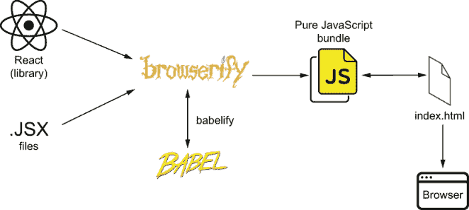
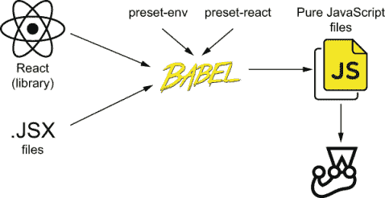
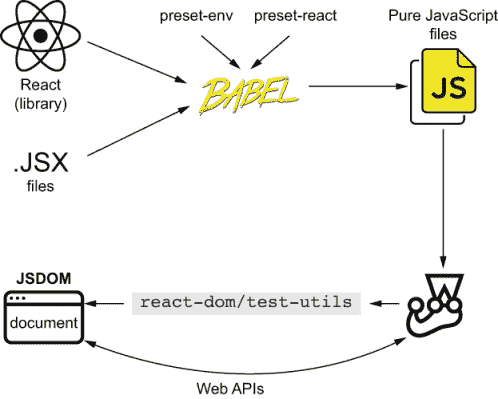
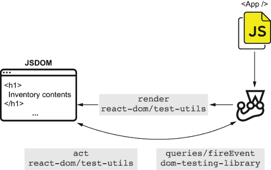
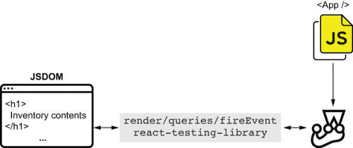
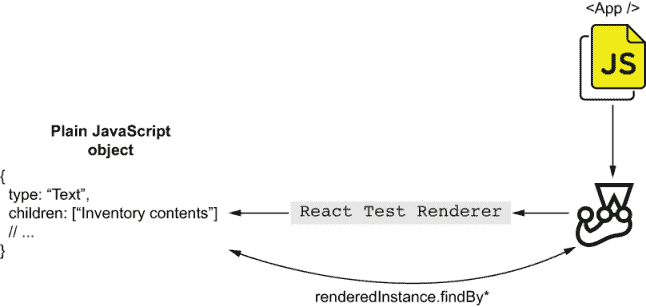

# 7 React 测试生态系统

本章涵盖

+   为 React 应用设置测试环境

+   不同 React 测试工具概述

+   为 React 应用编写第一个测试

当你拥有一个顶级的搅拌器时，你不必浪费时间搅拌鸡蛋和糖，你可以专注于提高你工艺的其他方面，比如完善你的食谱或装饰你的蛋糕。

类似于优秀设备使糕点师能够专注于他们工艺的更重要的方面，如 React 这样的前端框架和库，让你能够专注于编写网络应用的更重要的方面。你不必专注于操作 DOM——自己删除、插入和更新元素——你可以专注于你应用的可用性、可访问性和业务逻辑。

在这个章节中，你将学习如何测试 React 应用，以及它与你在测试前端应用中学到的知识如何相关。你将了解像 JSDOM 这样的工具在不同环境中仍然有用，你将学习有助于测试你可能使用的任何其他前端框架的概念。

我选择用 React 编写这些示例主要是因为它的流行。我相信它是最多人已经熟悉的工具。

如果你还不了解 React，通过它的“入门”指南应该足以让你理解我将使用的示例。我写这一章的主要目标**不是**教你 React，而是展示一些无论你使用什么工具都会有用的原则。

我将从这个章节开始解释 React 应用如何在浏览器中运行，然后教你如何在测试环境中模拟这些条件，这样你就可以有可靠的质量保证。

在设置测试环境的过程中，我会介绍多个工具。我会解释它们的作用以及它们是如何工作的，这样你可以更容易地修复测试和测试基础设施中的问题。

一旦你的 React 测试环境运行起来，你将亲身体验到你在测试纯 JavaScript 应用时学到的许多概念仍然适用。

然后，我将为你概述 React 测试生态系统中的工具，重点关注我选择的库`react-testing-library`，我将用它来展示如何为 React 应用编写第一个测试。

尽管我会专注于一个库，但我将解释许多其他库是如何工作的，它们的优缺点，以及选择工具时需要考虑的因素，这样你可以根据自己的项目做出自己的决定。

## 7.1 为 React 设置测试环境

关于厨房，最重要的学习之一是了解一切的位置。在路易的厨房里，他给每个抽屉都贴上了标签，并制定了严格的规则来存储原料和设备。他的员工可能认为他太有条理了，但路易更愿意称自己为实用主义者。他知道，如果找不到烤盘，就无法烘焙蛋糕。

在本节中，你将设置一个 React 应用程序及其测试环境。在这个过程中，你将了解 React 的工作原理以及如何在测试环境中重现它。

本章中你将要编写的应用程序将与上一章中你构建的应用程序类似。不同之处在于这次你将使用 React 而不是自己操作 DOM。

由于我无法描述 Jest 如何与你的应用程序接口，而不解释浏览器如何运行 React 应用程序，所以我将本节分为两部分。在第一部分，你将了解使 React 应用程序在浏览器中运行的工具。在第二部分，你将设置你的应用程序的测试环境，并了解你用来使应用程序在浏览器中运行的工具如何影响测试环境的设置。

### 7.1.1 设置 React 应用程序

要了解如何测试一个 React 应用程序，你必须学习使其在浏览器中运行所必需的内容。只有在你准确复制浏览器环境之后，你才能在测试中准确复制。

在本小节中，你将学习如何配置一个 React 应用程序，使其能够在浏览器中运行。在这个过程中，我会解释你需要哪些工具以及每个工具的作用。

首先，创建一个包含一个节点（你将在其中渲染你的应用程序）的 `index.html` 文件。此文件还应加载一个名为 `bundle.js` 的脚本，该脚本将包含你的应用程序的 JavaScript 代码。

列表 7.1 index.html

```
<!DOCTYPE html>
<html lang="en">
<head>
    <meta charset="UTF-8">
    <title>Inventory</title>
</head>
<body>
    <div id="app" />
    <script src="bundle.js"></script>           ❶
</body>
</html>
```

❶ 加载包含整个捆绑应用程序的 `bundle.js` 文件

在开始使用任何 JavaScript 包之前，使用 `npm init -y` 创建一个 `package.json` 文件。你将使用这个文件来跟踪你的依赖项并编写 NPM 脚本。

一旦创建了 `package.json` 文件，安装你编写可以在浏览器中运行的 React 应用程序所需的两个主要依赖项：`react` 和 `react-dom`。`react` 是处理组件本身的库，而 `react-dom` 允许你将这些组件渲染到 DOM 中。请记住，使用 `npm install --save react react-dom` 将这些包作为依赖项安装。

作为你应用程序的入口点，创建一个 `bundle.js` 文件。在其中，你将使用 React 定义一个 `App` 组件，并使用 `react-dom` 将该组件的一个实例渲染到 `index.html` 中的 `app` 节点，如下所示。

列表 7.2 index.js

```
const ReactDOM = require("react-dom");
const React = require("react");

const header = React.createElement(                        ❶
  "h1",
  null,
  "Inventory Contents"
);

const App = React.createElement("div", null, header);      ❷

ReactDOM.render(App, document.getElementById("app"));      ❸
```

❶ 创建一个 h1 元素作为页面的标题

❷ 创建一个 div 元素，其唯一子元素是标题元素

❸ 将 App 元素渲染到 id 为 app 的节点

如你从上一章所记得，因为我们正在导入其他库，我们必须将它们捆绑到 `index.html` 将要加载的 `bundle.js` 文件中。为了执行捆绑，使用 `npm` 将 `browserify` 作为开发依赖项安装，命令为 `install --save-dev browserify`。然后，将以下脚本添加到你的 `package.json` 文件中，以便你可以使用 `npm run build` 生成捆绑包。

列表 7.3 package.json

```
{
  "name": "my_react_app",
  // ...
  "scripts": {
    "build": "browserify index.js -o bundle.js"       ❶
  }
  // ...
}
```

❶ 一个脚本，当运行 npm run build 时将你的应用程序打包成一个单独的 bundle.js 文件

生成一个 `bundle.js` 文件，并使用 `npx http-server ./` 在 `localhost:8080` 上提供你的应用程序。

如果你已经熟悉 React，到现在你可能已经在想，“但是，嘿，这并不是我写 React 应用程序的方式！”你完全正确。编写 React 应用程序的大多数人都在他们的 JavaScript 代码中使用标记。他们使用的是所谓的 `JSX`，这是一种混合了 JavaScript 和 HTML 的格式。你习惯看到的 React 代码可能看起来更像是这样。

列表 7.4 index.jsx

```
const ReactDOM = require("react-dom");
const React = require("react");

const App = () => {                                            ❶
  return (
    <div>
      <h1>Inventory Contents</h1>
    </div>
  );
};

ReactDOM.render(<App />, document.getElementById("app"));      ❷
```

❶ 一个将渲染一个包含标题的 div 的 App 组件

❷ 将 App 组件渲染到 id 为 app 的 DOM 节点

能够在 JavaScript 代码中嵌入标记可以使组件更易于阅读且更简洁，但值得注意的是，浏览器并不知道如何运行 `JSX`。因此，为了使这些文件能在浏览器中运行，你必须使用工具将 `JSX` 转换为纯 JavaScript。

JSX 是编写组件的一种更 *方便* 的方式，但它 *不是* React 的一部分。它扩展了 JavaScript 的语法，并且在将 JSX 转换为纯 JavaScript 时，它会被转换为函数调用。在 React 的情况下，这些函数调用恰好是 `React.createElement` 调用——与我们在之前的 `index.js` 文件中使用的相同函数调用。

JSX 并非仅限于 React。例如，像 Preact 这样的其他库也可以利用 JSX。区别在于，为 Preact 应用程序编写的 JSX 需要转换为不同的函数调用，而不是 React 特有的 `React.createElement`。

一旦我将上面的 `index.jsx` 文件转换为纯 JavaScript 文件，其输出应该与直接使用 `React.createElement` 的 `index.js` 版本的输出相似。

理解 JSX 和 React 的工作原理至关重要，因为这将帮助你设置测试环境。这种知识将使你能够理解 Jest 在处理 JSX 文件时正在做什么。

重要 JSX 只是一种更方便的编写组件的方式。浏览器 *不能* 运行 JSX 文件。要能够运行使用 JSX 编写的应用程序，你需要将 JSX 转换为纯 JavaScript。

JSX 不是 React 的专属特性；它是 JavaScript 语法的扩展，在 React 的情况下，它会被转换为 `React.createElement` 调用。

记住，当你的应用程序到达浏览器时，它就变成了“仅仅是 JavaScript。”

现在你已经了解了 JSX 的工作原理，是时候看到它在实际中的应用了。将你的 `index.js` 文件重命名为 `index.jsx`，并更新其代码，使其使用 JSX 而不是我之前使用的 `React.createElement`。

要将你的代码转换为能在浏览器中运行的代码，你将使用 `babelify` 和 Babel。`babelify` 包使 Browserify 能够使用 Babel，一个 JavaScript 编译器，来编译你的代码。然后，你可以使用像 `preset-react` 这样的包将 JSX 转换为纯 JavaScript。鉴于你只需要在开发环境中使用这些包，请使用 `npm install --save-dev babelify @babel/core @babel/preset-react` 命令将它们作为开发依赖项安装。

注意：我选择使用 Browserify 来演示这些示例，因为它使它们更加简洁。目前，许多读者可能正在使用 Webpack。

如果你正在使用 Webpack，同样的原则适用。使用 Webpack 时，你仍然会使用 Babel 及其预设来将你的 JSX 代码转换为纯 JavaScript，使其能在浏览器中运行。

为了帮助你理解这些工具之间的关系，可以将 Webpack 视为与 Browserify 等效，将 `babel-loader` 视为与 `babelify` 等效。当然，这些比较是简化的，但在本章的上下文中，它们将帮助你理解示例的工作原理。

更新你的 `package.json`，使你的 `build` 命令使用 `index.jsx` 而不是 `index.js` 作为应用程序的入口点，并添加 Browserify 的配置，以便在构建应用程序时使用 `babelify` 和 `@babel/preset-react`。

列表 7.5 package.json

```
{
  "name": "2_transforming_jsx",
  "scripts": {
    "build": "browserify index.jsx -o bundle.js"
  },
  // ...
  "browserify": {
    "transform": [
      [
        "babelify",
        { "presets": [ "@babel/preset-react" ] }       ❶
      ]
    ]
  }
}
```

❶ 配置 Browserify 的 babelify 插件以将 JSX 转换为纯 JavaScript

在此更改之后，你的应用程序将准备好在浏览器中运行。当你运行 `npm run build` 命令时，Browserify 将将你的应用程序打包成一个单一的纯 JavaScript 文件。在打包过程中，它将通过 `babelify` 与 Babel 交互，将 JSX 转换为纯 JavaScript，如图 7.1 所示。

最后，当你使用 `npx http-server ./` 命令提供应用程序服务时，`index.html` 将加载 `bundle.js` 文件，并将 `App` 组件挂载到页面上。



图 7.1 你的应用程序的构建过程，从打包和转换代码到在浏览器中执行

要看到你的应用程序运行效果，请使用 `npm run build` 命令构建它，然后使用 `npx http-server ./` 命令来提供服务，以便在 `localhost:8080` 上访问它。

你可能还注意到的一个细节是，到目前为止，我在本书的示例中一直使用 Node.js 的 `require` 来导入 JavaScript 模块。然而，这并不是在 JavaScript 中导入模块的标准方式。在本章中，我将不使用 `require`，而是使用 ES 导入。

列表 7.6 index.jsx

```
import ReactDOM from "react-dom";
import React from "react";

// ...
```

要使用 ES 导入，你必须使用 Babel 的 `preset-env` 将 ES 导入转换为 `require` 调用——也称为 CommonJS 导入。

注意：在撰写本文时，Node.js 的最新版本已经支持 ES 导入。我选择使用 Babel 来演示如何做这件事，以便使用先前版本的 Node.js 的读者也可以跟随。你可以在 [`nodejs.org/api/esm.html`](https://nodejs.org/api/esm.html) 上了解更多关于 Node.js 对 ES 模块的支持。

使用 `npm install --save-dev @babel/preset-env` 将 Babel 的 `preset-env` 作为开发依赖项安装，并更新你的 `package.json` 以便在构建应用程序时使用此包。

列表 7.7 package.json

```
{
  "name": "2_transforming_jsx",
  // ...
  "browserify": {
    "transform": [
      [
        "babelify",
        {
          "presets": [
            "@babel/preset-env",         ❶
            "@babel/preset-react"
          ]
        }
      ]
    ]
  }
}
```

❶ 配置 Browserify 的 babelify 插件，以便以这种方式转换你的代码，这样你就可以针对特定环境进行操作，而无需对特定环境的更改进行微管理

现在你已经完成了 `babelify` 的设置，你可以像以前一样构建和访问你的应用程序。首先，运行 `npm run build`，然后使用 `npx http-server ./` 在 `localhost:8080` 上提供服务。

### 7.1.2 设置测试环境

现在你已经了解了使 React 应用程序在浏览器中运行所涉及的内容，现在是时候了解使其在 Node.js 中运行所涉及的内容了，这样你就可以使用 Jest 来测试它。

通过使用 `npm install --save-dev jest` 将 Jest 作为开发依赖项安装，开始设置测试环境。

因为你要开始测试你的 `App` 组件，所以将其单独分离到自己的 `App.jsx` 文件中，并更新 `index.jsx` 以便从 `App.jsx` 中导入 `App`。

列表 7.8 App.jsx

```
import React from "react";

export const App = () => {             ❶
  return (
    <div>
      <h1>Inventory Contents</h1>
    </div>
  );
};
```

❶ 创建一个 App 组件，并导出它

列表 7.9 index.jsx

```
import ReactDOM from "react-dom";
import React from "react";
import { App } from "./App.jsx";                                ❶

ReactDOM.render(<App />, document.getElementById("app"));       ❷
```

❶ 从 App.jsx 导入 App 组件

❷ 将 App 的实例渲染到 ID 为 app 的 DOM 节点中

现在，在你甚至尝试渲染 `App` 并测试它——我们将在下一节中这样做——之前，你必须能够执行其 `App.jsx` 文件中的代码。

创建你的第一个测试文件，并将其命名为 `App.test.js`。目前，只需尝试使用 ES 模块语法导入 `App`。

列表 7.10 App.test.js

```
import { App } from "./App.jsx";
```

当尝试使用 Jest 运行此测试文件时，你会得到一个语法错误。

提示：为了运行你的测试，更新你的 `package.json`，并添加一个名为 `test` 的 NPM 脚本，该脚本调用 `jest`，就像我们以前做的那样。这个 NPM 脚本将允许你使用 `npm test` 运行你的测试。

在撰写本文时，我正在使用 Node.js v12。在这个版本中，即使只是使用具有 `.js` 扩展名的文件中的 ES 模块语法导入 `App`，也会导致你的测试失败。

为了解决这个问题，你必须使用 Babel 和 `preset-env` 包转换 `App.test.js`，就像你以前使用 Browserify 打包代码时做的那样。不同之处在于这次你不需要 Browserify 作为中间件。相反，你将指示 Jest 本身使用 Babel。

要告诉 Jest 转换您的文件以便您可以在 Node.js 中运行它们，您可以将 Babel 的配置移动到它自己的 `babel.config.js` 文件中。在我撰写此内容时，Jest 的版本中，仅此配置文件就足以让 Jest 知道它应该在运行文件之前进行转换。

继续创建一个使用 `preset-env` 转换源代码以便它们可以在 Node.js 中运行的 `babel.config.js` 文件。

列表 7.11 babel.config.js

```
module.exports = {
  presets: [
    [
      "@babel/preset-env",
      {
        targets: {
          node: "current"          ❶
        }
      }
    ]
  ]
};
```

❶ 配置 Babel 将您的文件转换为与 Node.js 兼容，因此可以由在 Node.js 中运行的 Jest 执行

这个更改使得导入本身成功，但它仍然不会导致 Jest 无错误退出。如果您尝试重新运行 Jest，您会看到它现在抱怨在您的 `App.jsx` 文件中找到了意外的标记。

这个错误发生是因为，就像浏览器一样，Node 也不知道如何执行 JSX。因此，在您可以使用 Jest 在 Node.js 中运行它之前，您必须将 JSX 转换为纯 JavaScript。

更新您的 `babel.config.js` 文件，使其使用 `preset-react` 将 JSX 转换为 `React.createElement` 调用，就像您之前所做的那样。

列表 7.12 babel.config.js

```
module.exports = {
  presets: [
    [
      "@babel/preset-env",
      {
        targets: {
          node: "current"
        }
      }
    ],
    "@babel/preset-react"          ❶
  ]
};
```

❶ 配置 Babel 将 JSX 转换为纯 JavaScript，以便您可以使用 Node.js 执行它们

现在您已经创建了一个 `.babel.config.js` 配置文件，Jest 将在运行文件之前使用 Babel 进行转换，如图 7.2 所示。Jest 需要这样做，因为它在 Node.js 中运行，Node.js 不了解 JSX，并且其当前版本还无法处理 ES 模块。为了将 JSX 转换为纯 JavaScript，它使用 `preset-react`，并将 ES 导入转换为 CommonJS 导入（`require` 调用），它使用 `preset-env`。



图 7.2 Jest 在运行测试之前如何转换您的文件

最后，在使用了 `preset-react` 之后，Jest 将能够运行 `App.test.js`。它仍然以错误结束，但现在它是一个更容易解决的错误：您还没有编写任何测试。

重要提示：理解您所使用的每个工具的作用至关重要。在本章的第一部分，您使用 Browserify 将您的应用程序打包成一个单一的 JavaScript 文件。`babelify` 包使您能够使用 Babel，即编译器本身，来 *转换* 您的文件。`preset-env` 和 `preset-react` 包负责告诉 Babel *如何* 执行转换。

在最后一部分，您已配置 Jest 使用 Babel 在运行文件之前将它们进行 *转换*。`preset-env` 和 `preset-react` 的作用保持不变：它们告诉 Babel *如何* 进行转换。

测试 React 应用程序与测试纯前端应用程序并没有很大区别。在这两种情况下，你都想尽可能精确地在 Node.js 中复制浏览器的环境。为此，你可以使用像 JSDOM 这样的工具，它模拟浏览器的 API，以及 Babel，它将你的代码转换成可以在浏览器中运行的格式。

如果你使用的是 React 之外的库或框架，为了了解如何测试它，我建议你遵循我在本节中展示的相同思维过程。首先，检查你需要做什么才能让你的应用程序在浏览器中运行。理解每个工具的作用及其工作原理。然后，当你对应用程序在浏览器中的工作方式有了很好的理解后，以这种方式修改这些步骤，以便你可以将代码运行在 Node.js 中，从而可以使用 Jest。

## 7.2 React 测试库概述

一台一流的烤箱，一些高端的法国厨具，以及一个全新的搅拌器不会为你烘焙蛋糕，但选择适合工作的工具会让你成功一半。

在本节中，我将简要概述 React 测试生态系统中的工具。我会解释它们的工作原理，以及它们的优缺点，以便你可以选择你认为适合你项目的工具。

通过众多示例，我将教你如何使用 React 自带的工具。我会解释这些工具如何与你的测试环境交互，以及与测试 React 应用程序相关的根本概念。

由于大多数 React 测试库都是对 React 自带测试工具中已存在的功能的便捷包装，因此对这些工具有一个扎实的理解将使你更容易理解幕后发生的事情。

一旦你对 React 自带的测试工具和 React 在你的测试环境中的工作方式有了很好的理解，你就会看到哪些库你可以使用来减少你在测试中需要编写的代码量。

尽管我会解释多个库的优缺点，但本节中我将重点关注的库是 `react-testing-library`。它是我在大多数项目中的首选测试库，在本节中，你将学习如何使用它，并理解为什么我推荐它在大多数情况下使用。

### 7.2.1 渲染组件和 DOM

在本节中，你的第一个任务将是编写 `App` 组件的测试。你将要编写的测试将遵循三个 A 的模式：arrange（准备）、act（执行）、assert（断言）。因为 Jest 已经为你设置了一个 JSDOM 实例，所以你可以直接跳到执行和断言。你将在 JSDOM 实例中渲染 `App` 并检查它是否显示了正确的标题。

要能够为 `App` 组件编写这个测试，你必须解决两个问题。首先，你必须能够渲染 `App` 本身。然后，你必须能够检查 DOM 中是否存在正确的标题。

首先，将一个 `div` 添加到 JSDOM 实例的 `document` 中。稍后，你将在这个 `div` 中渲染 `App` 组件，就像你在应用程序代码中将 `App` 渲染到 `index.html` 中的 `div` 时所做的那样。

列表 7.13 App.test.js

```
import { App } from "./App.jsx";

const root = document.createElement("div");     ❶
document.body.appendChild(container);           ❷
```

❶ 创建一个 div 元素

❷ 将 div 附加到文档体

现在，继续编写一个测试，将 `App` 渲染到你刚刚创建的 `root` 节点。要渲染 `App`，你将使用 `react-dom`。

与你在应用程序中所做的不一样，在你的测试中，你必须将每个交互用 React 测试工具包中的 `act` 组件包裹起来，`act` 是 `react-dom` 包的一部分。`act` 函数确保与你的交互相关的更新已经被处理并应用到 DOM 上，在这种情况下，DOM 是由 JSDOM 实现的。

列表 7.14 App.test.jsx

```
import React from "react";
import { App } from "./App.jsx";
import { render } from "react-dom";
import { act } from "react-dom/test-utils";

const root = document.createElement("div");
document.body.appendChild(root);                        ❶

test("renders the appropriate header", () => {
  act(() => {
    render(<App />, root);                              ❷
  });
});
```

❶ 将 div 附加到文档体

❷ 将 App 实例渲染到你附加到文档体中的 div

注意：由于你的测试文件现在使用 JSX 创建 `App`，我建议你将其扩展名更改为 `.jsx`，以指示它包含的代码类型。

在你刚刚编写的测试中，你准确地模拟了 `App` 组件是如何由浏览器渲染的。你并没有用测试替身替换 React 的任何部分，而是利用 JSDOM 的 DOM 实现来渲染组件，就像浏览器会做的那样。

除了使测试更加可靠外，将组件渲染到 DOM 中还使你能够使用任何与纯 JavaScript 应用程序一起工作的测试工具和技术。只要你在 DOM 中渲染 HTML 元素，你就可以像在其他任何情况下一样与这些元素交互。

例如，尝试使用文档的 `querySelector` 函数来查找渲染的标题，并断言其 `textContent` 属性，就像你为任何其他 DOM 节点所做的那样。

列表 7.15 App.test.jsx

```
// ...

test("renders the appropriate header", () => {
  act(() => {
    render(<App />, root);                                   ❶
  });
  const header = document.querySelector("h1");               ❷
  expect(header.textContent).toBe("Inventory Contents");     ❸
});
```

❶ 将 App 实例渲染到文档体内的 div

❷ 在文档中找到一个 h1 元素

❸ 断言标题的内容是“库存内容”

你刚刚编写的测试使用 `react-dom/test-utils` 将 `App` 渲染到 JSDOM 实例，然后使用 Web API 来查找和检查一个 `h1` 元素，以便你可以对其断言。这些测试步骤在图 7.3 中展示。



图 7.3 使用 `react-dom/test-utils` 将组件渲染到 DOM 并使用 Web API 查找和检查渲染元素来测试组件

你使用 `react` 或 `react-dom` 的实际情况对刚刚使用的 `document.querySelector` 函数来说是完全透明的。这个函数在文档的元素上操作，无论它们是如何渲染的。

同样的原则也适用于其他测试工具。鉴于你将 `App` 组件渲染到 DOM 中，你可以使用像 `dom-testing-library` 这样的 DOM 测试工具，使你的测试更加可读和健壮。

备注：一般来说，在处理 React 时，由于集成层很薄，我认为我的组件是原子的“单元”。因此，我将针对隔离组件的测试归类为“单元测试”。当一个测试涉及多个组件时，我更喜欢将其称为“集成测试”。

尽管我会将你刚刚编写的最后一个测试归类为单元测试，但也有人可能会争论它应该被标记为集成测试，因为你不仅测试了你的代码，还测试了它是否与 React 正确接口。

尤其是在这个案例中，将测试金字塔视为一个连续的谱系，而不是一组离散的分类，是很有趣的。尽管我会把这个测试放在金字塔的底部，但它仍然高于调用函数并检查返回值的测试，例如。

**在测试组件时使用 React**。**不要**将你的组件从 React 中隔离出来，只是为了将测试标记为“单元测试”。

在隔离的情况下测试你的组件会使你的测试几乎无用，因为 React 的渲染和更新组件的逻辑是使你的应用程序工作的一个重要部分。

记住你的目标**不是**标记测试。你的目标是编写每个不同集成级别所需数量的测试。

请使用 `npm install --save-dev @testing-library/dom` 将 `dom-testing-library` 作为开发依赖项安装。然后，尝试使用这个库的 `screen` 对象的 `getByText` 方法来查找页面的标题，而不是使用文档的 `querySelector` 函数。

列表 7.16 App.test.jsx

```
// ...

import { screen } from "@testing-library/dom";

// ...

test("renders the appropriate header", () => {
  act(() => {
    render(<App />, root);                              ❶
  });
  expect(screen.getByText("Inventory Contents"))        ❷
    .toBeTruthy();
});
```

❶ 将 App 渲染到你附加到文档体的 div 中

❷ 使用 @testing-library/dom 的 `getByText` 函数查找内容为“Inventory Contents”的元素，然后断言该元素已被找到

现在你已经安装了 `dom-testing-library`，你还可以使用它的 `fireEvent` API。就 `fireEvent` 而言，它像处理其他 DOM 节点一样处理 DOM 节点，因此它可以点击按钮、填充输入框和提交表单，就像在任何其他情况下一样。

与 `dom-testing-library` 不关心 React 一样，React 和 `react-dom` 也不关心它们是在浏览器中渲染还是在 JSDOM 中渲染。只要 JSDOM API 与浏览器匹配，React 就会以相同的方式响应用件。

要了解如何使用 `dom-testing-library` 与你的组件交互，首先，在你的 `App` 组件中添加一个按钮，该按钮会增加可用的芝士蛋糕数量。

列表 7.17 App.jsx。

```
import React from "react";

export const App = () => {
  const [cheesecakes, setCheesecake] = React.useState(0);           ❶

  return (
    <div>
      <h1>Inventory Contents</h1>
      <p>Cheesecakes: {cheesecakes}</p>
      <button onClick={() => setCheesecake(cheesecakes + 1)}>       ❷
        Add cheesecake
      </button>
    </div>
  );
};
```

❶ 创建一个表示库存芝士蛋糕的状态

❷ 当用户点击按钮时增加芝士蛋糕的数量

在测试此功能时，请记住你必须将你的组件交互包裹在 `react-dom` 提供的 `act` 函数中。这个函数确保交互已经被处理，并且必要的更新已经应用到 DOM 上。

列表 7.18 App.test.jsx

```
// ...

import { screen, fireEvent } from "@testing-library/dom";

// ...

test("increments the number of cheesecakes", () => {
  act(() => {
    render(<App />, root);                                              ❶
  });

  expect(screen.getByText("Cheesecakes: 0")).toBeInTheDocument();       ❷

  const addCheesecakeBtn = screen.getByText("Add cheesecake");          ❸

  act(() => {                                                           ❹
    fireEvent.click(addCheesecakeBtn);
  });

  expect(screen.getByText("Cheesecakes: 1")).toBeInTheDocument();       ❺
});
```

❶ 渲染 App 实例

❷ 使用来自 @testing-library/dom 的 `getByText` 方法来查找表示库存中没有奶酪蛋糕的元素，然后断言它存在

❸ 通过文本找到添加奶酪蛋糕的按钮

❹ 使用来自 @testing-library/dom 的 `fireEvent` 来点击添加奶酪蛋糕到库存的按钮，并确保更新被处理并应用到 DOM 上

❺ 使用 `getByText` 来查找表示库存中有一个奶酪蛋糕的元素，然后断言它存在

在先前的示例中，如图 7.4 所示，你使用了来自 `react-dom/utils` 的 `render` 方法将 `App` 组件渲染到你的 JSDOM 实例中，并使用来自 `dom-testing-library` 的 `getByText` 查询来查找页面中的元素并与它们交互。



图 7.4 使用 `react-dom/test-utils` 渲染组件但使用 `dom-testing-library` 来查找渲染的元素并与它们交互时会发生什么

现在你已经看到 `dom-testing-library` 正确地与你的 React 应用程序交互，尝试像测试纯 JavaScript 项目一样使用 `jest-dom`。因为 `jest-dom` 在 DOM 之上运行，它将与你渲染的 React 组件无缝工作，就像 `dom-testing-library` 一样。

要使用 `jest-dom`，使用 `npm install --save-dev @testing-library/jest-dom` 安装它，创建一个脚本以扩展 Jest 以使用 `jest-dom` 提供的断言，并更新 `jest.config.js` 以在运行测试文件之前执行该脚本。

列表 7.19 jest.config.js

```
module.exports = {
  setupFilesAfterEnv: ["<rootDir>/setupJestDom.js"]         ❶
};
```

❶ 在每个测试之前，Jest 执行扩展 Jest 以使用 jest-dom 断言的脚本。

列表 7.20 setupJestDom.js

```
const jestDom = require("@testing-library/jest-dom");
expect.extend(jestDom);                                 ❶
```

❶ 扩展 Jest 以使用 jest-dom 的断言

一旦设置了此库，使用它来断言标题当前在文档中。

列表 7.21 App.test.jsx

```
// ...

test("renders the appropriate header", () => {
  act(() => {
    render(<App />, root);
  });
  expect(screen.getByText("Inventory Contents"))
    .toBeInTheDocument();                              ❶
});
```

❶ 使用 jest-dom 的断言来断言某个元素在文档中

这些只是你可以用于测试纯 JavaScript 应用程序和 React 应用程序的许多工具中的两个。

重要提示：只要你在 DOM 上渲染组件并准确复制浏览器的行为，任何适用于纯 JavaScript 应用程序的工具都将适用于 React 应用程序。

作为一般建议，当研究如何测试使用特定库或框架的应用程序时，我建议你首先了解该库或框架本身在浏览器中的工作方式。无论你使用什么库或框架，通过像浏览器一样渲染你的应用程序，你可以使你的测试更加可靠，并扩大你可以使用的工具范围。

除了编译和渲染步骤之外，测试 React 应用程序与测试纯 JavaScript 应用程序类似。在测试你的 React 应用程序时，请记住你主要处理的是 DOM 节点，并且编写有效测试的原则仍然适用。例如，你应该编写紧凑且精确的断言，并使用构成其本质部分的属性来查找元素。

### 7.2.2 React 测试库

到目前为止，因为你正在处理 React，你的测试涉及大量的 React 特定问题。由于你需要将组件渲染到 DOM 中，你手动将一个`div`附加到 JSDOM 实例上，并使用`react-dom`自行渲染组件。除了这项额外的工作之外，当你的测试完成后，你*没有*一个拆解钩子来从 DOM 中移除渲染的节点。这种缺乏清理例程可能会导致一个测试干扰另一个测试，如果你要实现它，你必须手动完成。

此外，为了确保更新将被处理并应用到 DOM 中，你将你的组件交互包裹在`react-dom`提供的`act`函数中。

为了有效地解决这些问题，你可以用`react-testing-library`替换`dom-testing-library`。与`dom-testing-library`的方法不同，`react-testing-library`的方法已经考虑了 React 特定的关注点，例如将交互包裹到`act`中或在测试完成后自动卸载组件。

在本节中，你将学习如何使用`react-testing-library`来测试你的组件。你将编写一个包含用于向库存中添加新项目的表单的组件，另一个包含服务器库存内容的列表。然后，你将学习如何使用`react-testing-library`测试这些组件。

通过使用`react-testing-library`及其方法，你将了解它如何使你的测试更加简洁和易于理解，通过隐藏你之前看到的测试 React 应用程序的复杂性和特定性。

注意：`react-testing-library`包建立在`dom-testing-library`之上，两者都属于同一个“家族”的工具。因此，它们的 API 故意几乎相同。

渲染组件和查找元素

你使用`react-testing-library`的第一个任务将是使用它将组件渲染到 DOM 中。在整个过程中，我将解释使用`react-testing-library`与`react-dom`之间的区别。

使用`npm install` `--save-dev` `@testing-library/react`安装`react-testing-library`作为开发依赖项，这样你就可以开始使用它的函数而不是`dom-testing-library`中的函数。

一旦你安装了`react-testing-library`，就开始使用它的`render`方法而不是`react-dom`中的方法来渲染你的组件。

因为 `react-testing-library` 在 DOM 中添加了一个自己的容器，并在其中渲染元素，所以你不需要自己创建任何节点。

列表 7.22 App.test.jsx

```
// ...

import { render } from "@testing-library/react";

// ...

// Don't forget to delete the lines that
// append a `div` to the document's body.

test("renders the appropriate header", () => {
  render(<App />);                                          ❶

  // ...
});

test("increments the number of cheesecakes", () => {
  render(<App />);                                          ❷

  // ...
});
```

❶ 使用来自 react-testing-library 的 render 函数将 App 实例渲染到文档中

❷ 使用来自 react-testing-library 的 render 函数将 App 实例渲染到文档中

在前面的例子中，你使用了 `react-testing-library` 的 `render` 方法来替换 `react-dom/test-utils` 的 `render` 方法。与 `react-dom/test-utils` 不同，`react-testing-library` 会自动配置一个钩子，在每个测试之后清理你的 JSDOM 实例。

除了不需要为你的 JSDOM 实例设置或清理例程之外，`react-testing-library` 的 `render` 函数返回一个包含与 `dom-testing-library` 包含的相同查询的对象。它们之间的区别在于，`react-testing-library` 的 `render` 方法的查询会自动绑定在渲染组件内部运行，而不是在整个 JSDOM 实例内部。因为这些查询的范围有限，你不需要使用 `screen` 或传递容器作为参数。

列表 7.23 App.test.jsx

```
// ...

test("renders the appropriate header", () => {
  const { getByText } = render(<App />);                           ❶
  expect(getByText("Inventory Contents")).toBeInTheDocument();     ❷
});

test("increments the number of cheesecakes", () => {
  const { getByText } = render(<App />);                           ❸

  expect(getByText("Cheesecakes: 0")).toBeInTheDocument();         ❹

  const addCheesecakeBtn = getByText("Add cheesecake");            ❺
  act(() => {                                                      ❻
    fireEvent.click(addCheesecakeBtn);
  });

  expect(getByText("Cheesecakes: 1")).toBeInTheDocument();         ❼
});
```

❶ 使用来自 react-testing-library 的 render 函数将 App 实例渲染到文档中，并获取一个限定在 render 结果的 getByText 查询

❷ 使用 scoped getByText 函数通过文本查找元素，然后断言该元素在文档中

❸ 再次使用来自 react-testing-library 的 render 函数渲染 App 实例，并获取一个限定在 render 结果的 getByText 查询

❹ 使用 scoped getByText 函数查找表示库存中没有芝士蛋糕的元素，然后断言该元素在文档中

❺ 使用 scoped getByText 函数查找添加芝士蛋糕到库存的按钮

❻ 使用 dom-testing-library 的 fireEvent 函数点击添加芝士蛋糕到库存的按钮

❼ 再次使用 scoped getByText 函数查找表示库存现在包含一个芝士蛋糕的元素，然后断言该元素在文档中

多亏了 `react-testing-library`，渲染组件变得更加简洁。因为 `react-testing-library` 处理了组件的挂载和卸载，你不需要手动创建特殊节点，也不需要设置任何清理钩子。

此外，你的查询变得更加安全，因为 `react-testing-library` 的 `render` 方法将你的查询范围限定在渲染组件的根容器内。因此，在执行断言时，你可以确保断言的是测试组件内的元素。

与组件交互

之前，为了与您的应用程序交互，您已经使用了来自 `dom-testing-library` 的 `fireEvent` 工具以及 React 的 `act` 函数的调用。尽管这两个工具使您能够以编程方式执行丰富的交互，但 `react-testing-library` 提供了一种更简单的方法来实现这一点。

在本小节中，您将创建一个包含 Louis 员工添加新项目到面包店库存的表单的组件。然后，您将学习如何使用 `react-testing-library` 与此表单交互，以便您可以编写简洁、可靠且易于阅读的测试。

使用 `react-testing-library` 与组件交互时，您将使用其 `fireEvent` 工具而不是来自 `dom-testing-library` 的工具。这两个工具之间的区别在于，`react-testing-library` 中的 `fireEvent` 工具已经将交互封装到 `act` 调用中。因为 `react-testing-library` 负责使用 `act`，所以您不必自己担心这一点。

将 `dom-testing-library` 的 `fireEvent` 函数替换为 `react-testing-library` 的 `fireEvent` 函数，这样您就可以停止自己使用 `act`。

列表 7.24 App.test.jsx

```
// ...

// At this stage, you won't need any imports
// from `@testing-library/dom` anymore.

import { render, fireEvent } from "@testing-library/react";     ❶

// ...

test("increments the number of cheesecakes", () => {
  const { getByText } = render(<App />);                        ❷

  expect(getByText("Cheesecakes: 0")).toBeInTheDocument();      ❸

  const addCheesecakeBtn = getByText("Add cheesecake");         ❸

  fireEvent.click(addCheesecakeBtn);                            ❹

  expect(getByText("Cheesecakes: 1")).toBeInTheDocument();      ❸
});
```

❶ 从 `react-testing-library` 导入 `render` 和 `fireEvent`

❷ 将 App 实例渲染到文档中，并获取一个作用域为渲染结果的 `getByText` 函数

❸ 使用作用域内的 `getByText` 函数在 DOM 中查找元素，并断言和与之交互

❹ 使用来自 `react-testing-library` 的 `fireEvent` 工具点击添加奶酪蛋糕到库存的按钮，这样您就不必将您的交互封装到 `act` 调用中

通过使用来自 `react-testing-library` 的 `queries`、`render` 和 `fireEvent` 方法，您已经完全消除了使用 `dom-testing-library` 的必要性。在此更改之后，`react-testing-library` 是您唯一需要与之交互的库，用于渲染组件、查找元素以及与之交互，如图 7.5 所示。



图 7.5 当您仅使用 `react-testing-library` 时，您的测试如何与组件交互。这个库能够渲染组件、查找元素以及与之交互。

提示：要卸载 `dom-testing-library` 并从依赖列表中移除它，请使用 `npm uninstall dom-testing library`。

现在您已经了解了 `react-testing-library` 的 `fireEvent` 方法是如何工作的，您将创建一个更复杂的组件，并学习如何测试它。这个新组件将被命名为 `ItemForm`，它将替换当前增加奶酪蛋糕数量的按钮。

与上一章应用程序中的表单类似，当提交时，它将向服务器发送请求。因为它将包含两个字段——一个用于物品的名称，另一个用于要添加的数量——表单将允许库存经理添加任何数量的任何产品。

注意：由于本章重点介绍测试 React 应用程序，而不是后端，因此我将基于您在第六章中使用的相同服务器构建下一个示例。

您可以在本书 GitHub 仓库中找到服务器的代码以及本章的示例，网址为[`github.com/lucasfcosta/testing-javascript-applications`](https://github.com/lucasfcosta/testing-javascript-applications)。

在第七章的文件夹中，您将找到一个名为`server`的目录，其中包含一个能够处理您的 React 应用程序将发出的请求的 HTTP 服务器。

要运行该服务器，导航到其文件夹，使用`npm install`安装其依赖项，使用`npm run migrate:dev`确保您的数据库模式是最新的，然后使用`npm start`启动服务器。默认情况下，您的 HTTP 服务器将绑定到端口`3000`。

通过创建一个只能管理自身状态的`ItemForm`组件来开始此表单的工作。现在不必担心向服务器发送请求。

列表 7.25 ItemForm.jsx

```
export const ItemForm = () => {
  const [itemName, setItemName] = React.useState("");       ❶
  const [quantity, setQuantity] = React.useState(0);        ❷

  const onSubmit = (e) => {
    e.preventDefault();
    // Don't do anything else for now
  }

  return (
    <form onSubmit={onSubmit}>                              ❸
      <input
        onChange={e => setItemName(e.target.value)}
        placeholder="Item name"
      />
      <input
        onChange={e => setQuantity(parseInt(e.target.value, 10))}
        placeholder="Quantity"
      />
      <button type="submit">Add item</button>
    </form>
  );
};
```

❶ 创建一个状态片段，用于存储表单的`itemName`

❷ 创建一个状态片段，用于存储表单的`quantity`

❸ 创建一个包含两个字段和提交按钮的表单。此表单在提交时会调用`onSubmit`函数。

作为练习，为了练习您之前关于`react-testing-library`查询学到的知识，创建一个名为`ItemForm.test.jsx`的文件，并编写一个单元测试来验证此组件是否渲染了正确的元素。此测试应渲染`ItemForm`并使用`render`函数返回的查询来查找您想要的元素。然后您应该断言这些元素存在于 DOM 中，就像您之前在`App`中查找标题时做的那样。

注意：您可以在本书 GitHub 仓库的`chapter7/2_an_overview_of_react_testing_libraries/2_react_testing_library`文件夹中找到一个如何编写此测试的完整示例，网址为[`github.com/lucasfcosta/testing-javascript-applications`](https://github.com/lucasfcosta/testing-javascript-applications)。

现在，由于`ItemForm`渲染了一个包含两个字段和提交按钮的`form`，您将使其在用户提交新项目时向服务器发送请求。

为了确保服务器地址在您的项目中保持一致，创建一个`constants.js`文件，在其中创建一个包含服务器地址的常量并将其导出。

列表 7.26 constants.js

```
export const API_ADDR = "http://localhost:3000";
```

最后，更新`ItemForm.js`，以便在用户提交表单时向服务器发送请求。

列表 7.27 ItemForm.jsx

```
// ...

import { API_ADDR } from "./constants"

const addItemRequest = (itemName, quantity) => {               ❶
  fetch(`${API_ADDR}/inventory/${itemName}`, {
    method: "POST",
    headers: { "Content-Type": "application/json" },
    body: JSON.stringify({ quantity })
  });
}

export const ItemForm = () => {
  const [itemName, setItemName] = React.useState("");
  const [quantity, setQuantity] = React.useState(0);

  const onSubmit = (e) => {                                    ❷
    e.preventDefault();
    addItemRequest(itemName, quantity)
  }

  return (
    <form onSubmit={onSubmit}>                                 ❸
      // ...
    </form>
  );
};
```

❶ 一个向服务器路由发送请求的函数，该路由处理向库存中添加新项目

❷ 一个`onSubmit`函数，该函数在表单提交时防止页面重新加载并向服务器发送请求

❸ 一个在提交时调用`onSubmit`的表单元素

在你能够与你的组件交互并检查它是否向服务器发送适当的请求之前，你必须记住将全局的 `fetch` 替换为 `isomorphic-fetch`，就像你在上一章中所做的那样。否则，由于运行 Jest 的 Node.js 没有全局的 `fetch` 函数，你将遇到错误。

为了在运行测试时替换全局的 `fetch`，使用 `npm install --save-dev isomorphic-fetch` 将 `isomorphic-fetch` 安装为开发依赖项。然后，创建一个名为 `setupGlobalFetch.js` 的文件，该文件将 `isomorphic-fetch` 的 `fetch` 函数分配给 JSDOM 的 window 中的 `fetch` 属性。

列表 7.28 setupGlobalFetch.js

```
const fetch = require("isomorphic-fetch");

global.window.fetch = fetch;                ❶
```

❶ 将 isomorphic-fetch 的 fetch 函数分配给全局 window 的 fetch 属性

一旦你创建了此文件，通过更新 `jest.config.js` 中的 `setupFilesAfterEnv` 选项，告诉 Jest 在每个测试文件之前运行它。

列表 7.29 setupGlobalFetch.js

```
module.exports = {
  setupFilesAfterEnv: [
    "<rootDir>/setupJestDom.js",
    "<rootDir>/setupGlobalFetch.js"       ❶
  ]
};
```

❶ 在执行每个测试文件之前，Jest 将运行一个脚本，将来自 isomorphic-fetch 的 fetch 函数分配给全局 window 的 fetch 属性。

现在由于你的组件在测试期间可以访问 `fetch`，你将测试表单是否向你的后端发送适当的请求。在这个测试中，你将使用来自 `react-testing-library` 的 `fireEvent` 函数填写和提交表单，并使用 `nock` 拦截请求并对其做出响应。由于你正在处理 JSDOM 中的 DOM 节点，并且 `fireEvent` 已经在 `act` 函数内执行交互，这个测试将类似于一个纯 JavaScript 应用程序的测试。

列表 7.30 ItemForm.test.jsx

```
// ...
import nock from "nock";
import { render, fireEvent } from "@testing-library/react";

const API_ADDR = "http://localhost:3000";

// ...

test("sending requests", () => {
  const { getByText, getByPlaceholderText } = render(<ItemForm />);

  nock(API_ADDR)                                                         ❶
    .post("/inventory/cheesecake", JSON.stringify({ quantity: 2 }))
    .reply(200);

  fireEvent.change(                                                      ❷
    getByPlaceholderText("Item name"),
    { target: {value: "cheesecake"} }
  );
  fireEvent.change(                                                      ❸
    getByPlaceholderText("Quantity"),
    { target: {value: "2"} }
  );
  fireEvent.click(getByText("Add item"));                                ❹

  expect(nock.isDone()).toBe(true);                                      ❺
});
```

❶ 创建一个响应状态为 200 的拦截器，对发送到 /inventory/cheesecake 的 POST 请求做出响应，其 body 的数量属性为 2

❷ 更新为“芝士蛋糕”，项目名称的表单字段

❸ 更新为“2”，项目数量的表单字段

❹ 点击提交表单的按钮

❺ 期望所有拦截器都已到达

一旦你完成了 `ItemForm` 的实现，你将在 `App` 组件中使用它。在此更改之后，用户将能够将任何数量的任何项目添加到库存中——而不仅仅是芝士蛋糕。

列表 7.31 App.jsx

```
import React from "react";
import { ItemForm } from "./ItemForm.jsx";

export const App = () => {
  return (
    <div>
      <h1>Inventory Contents</h1>
      <ItemForm />                     ❶
    </div>
  );
};
```

❶ 在 App 中渲染 ItemForm 的实例

为了确保所有测试仍然通过，请记住从 `App.test.jsx` 中移除验证负责将芝士蛋糕添加到库存的按钮的测试。

为了让你看到表单的工作情况，使用 `npm run build` 构建你的应用程序，并通过 `npx http-server ./` 在 `localhost:8080` 上提供服务。在你的开发者工具的网络标签页打开的情况下，填写表单并提交新项目，以便你可以看到发送到服务器的请求。

等待事件

当你编写 React 应用程序时，你最终会发现你依赖于外部源，这会导致你的组件更新。例如，你可能有一个依赖于生成随机值或响应请求的服务器的计时器的组件。

在那些情况下，您需要等待这些事件发生，并让 React 处理更新并将最新的组件渲染到 DOM 中。

在本节中，您将实现并测试一个 `ItemList` 组件，该组件从服务器获取项目列表并更新自身以显示库存情况。没有这个列表，员工将无法管理面包店的库存。

通过创建一个名为 `ItemList.jsx` 的文件并编写将列出库存的组件来开始实现此功能。`ItemList` 组件应接收一个 `itemsprop` 并使用它来渲染项目列表。

列表 7.32 ItemList.jsx

```
import React from "react";

export const ItemList = ({ items }) => {                         ❶
  return (
    <ul>
      {Object.entries(items).map(([itemName, quantity]) => {     ❷
        return (
          <li key={itemName} >
            {itemName} - Quantity: {quantity}
          </li>
        );
      })}
    </ul>
  );
};
```

❶ 创建一个可以接收 `items` 属性的 `ItemList` 组件

❷ 遍历 `items` 中的每个属性，并为每个属性渲染一个带有其名称和数量的 li 元素

要验证此组件是否充分渲染传递给它的项目列表，您将在 `ItemList.test.jsx` 中编写一个测试。此测试应将包含几个项目的对象传递给 `ItemList`，使用来自 `react-testing-library` 的 `render` 函数将组件渲染到 DOM 中，并检查列表是否包含正确的内容。

列表 7.33 ItemList.spec.jsx

```
import React from "react";
import { ItemList } from "./ItemList.jsx";
import { render } from "@testing-library/react";

test("list items", () => {
  const items = { cheesecake: 2, croissant: 5, macaroon: 96 };     ❶
  const { getByText } = render(<ItemList items={items} />);        ❷

  const listElement = document.querySelector("ul");
  expect(listElement.childElementCount).toBe(3);                   ❸
  expect(getByText("cheesecake - Quantity: 2"))                    ❹
    .toBeInTheDocument();
  expect(getByText("croissant - Quantity: 5"))                     ❺
    .toBeInTheDocument();
  expect(getByText("macaroon - Quantity: 96"))                     ❻
    .toBeInTheDocument();
});
```

❶ 创建一个静态项目列表

❷ 使用静态项目列表渲染 `ItemList` 元素

❸ 期望渲染的 ul 元素有三个子元素

❹ 查找表示库存中有 2 个芝士蛋糕的元素

❺ 查找表示库存中有 5 个可颂的元素

❻ 查找表示库存中有 96 个马卡龙的元素

现在您知道 `ItemList` 可以充分渲染库存的项目，您将使用服务器提供的内容填充它。

要首次填充 `ItemList`，让 `App` 在渲染时通过向 `GET /inventory` 发送请求来获取库存的内容。一旦客户端收到响应，它应更新其状态并将项目列表传递给 `ItemList`。

列表 7.34 App.jsx

```
import React, { useEffect, useState } from "react";
import { API_ADDR } from "./constants"

// ...

export const App = () => {
  const [items, setItems] = useState({});
  useEffect(() => {                                                ❶
    const loadItems = async () => {
      const response = await fetch(`${API_ADDR}/inventory`)
      setItems(await response.json());                             ❷
    };
    loadItems();
  }, []);

  return (
    <div>
      <h1>Inventory Contents</h1>
      <ItemList items={items} />                                   ❸
      <ItemForm />
    </div>
  );
};
```

❶ 当 `App` 组件渲染时，使其向服务器发送请求以获取项目列表

❷ 当 `App` 接收到来自服务器的项目列表时，更新其状态

❸ 使用从服务器获取的项目列表渲染 `ItemList`

注意：在打包应用程序时，由于在 `useEffect` 钩子中使用了 `async/await`，您必须配置 Babel 的 `preset-env` 以使用名为 `core-js` 的包中的 polyfills。否则，即使构建后，您的应用程序在浏览器中也无法工作。

要这样做，使用 `npm install --save-dev core-js@2` 安装 `core-js`，并在 `package.json` 中更新 Browserify 的 `transform` 设置。

`core-js` 包包含对更近期的 ECMAScript 版本的 polyfills，这些 polyfills 将包含在您的包中，以便您可以使用现代功能，如 `async/await`。

列表 7.35 package.json

```
  "name": "2_react-testing-library",
  // ...
  "browserify": {
    "transform": [
      [
        "babelify",
        {
          "presets": [
            [
              "@babel/preset-env",
              {
                "useBuiltIns": "usage",
                "corejs": 2
              }
            ],
            "@babel/preset-react"
          ]
        }
      ]
    ]
  }
}
```

在调用`fetch`解决后使你的组件更新自身将导致`App.test.js`中的测试失败。它会失败，因为它在测试完成之前没有等待`fetch`调用解决。

因为`react-testing-library`在测试完成后卸载组件，所以在`fetch`解决之前，组件将不再挂载，但仍会尝试设置其状态。这就是 React 引发错误的原因。

通过使`App.jsx`在组件未挂载时避免更新其状态来修复该测试。

列表 7.36 App.jsx

```
import React, { useEffect, useState, useRef } from "react";

// ...

export const App = () => {
  const [items, setItems] = useState({});
  const isMounted = useRef(null);                                ❶

  useEffect(() => {
    isMounted.current = true;                                    ❷
    const loadItems = async () => {
      const response = await fetch(`${API_ADDR}/inventory`)
      const responseBody = await response.json();
      if (isMounted.current) setItems(responseBody);             ❸
    };
    loadItems();
    return () => isMounted.current = false;                      ❹
  }, []);

  // ...
};
```

❶ 创建一个引用，其值将指示 App 是否已挂载

❷ 当 App 挂载时将 isMounted 设置为 true

❸ 避免在 App 未挂载时更新其状态

❹ 当 App 卸载时将被调用的函数，并将 isMounted 设置为 false

当这个测试通过后，你现在必须测试你的应用程序是否会在服务器响应由`App`组件发送的请求后显示库存内容。否则，物品列表将始终为空。

要测试`App`是否适当地填充`ItemList`，你应该编写一个能够使`fetch`解决到一个静态物品列表的测试，渲染`App`，等待`App`使用请求的响应更新，并检查列表中的每个项目。

为了让`App`组件从服务器获取一个物品列表，请向`App.test.jsx`添加一个`beforeEach`钩子，该钩子将使用`nock`拦截对`/inventory`的`GET`请求。然后，通过添加一个清除所有拦截器的`afterEach`钩子，确保每个测试后没有未使用的拦截器。此外，如果`nock.isDone`方法返回`false`，此钩子应抛出错误。

列表 7.37 App.test.jsx

```
import nock from "nock";

beforeEach(() => {                                                         ❶
  nock(API_ADDR)
    .get("/inventory")
    .reply(200, { cheesecake: 2, croissant: 5, macaroon: 96 });
});

afterEach(() => {                                                          ❷
  if (!nock.isDone()) {
    nock.cleanAll();
    throw new Error("Not all mocked endpoints received requests.");
  }
});

// ...
```

❶ 在每个测试之前，创建一个拦截器，该拦截器将对`/inventory`的 GET 请求响应一个物品列表

❷ 在每个测试之后，检查是否所有拦截器都已到达，如果没有，则清除未使用的拦截器并抛出错误

在创建这些钩子之后，编写一个测试，该测试渲染`App`组件，等待列表有三个子项，并检查是否出现了预期的列表项。

要等待列表被填充，你可以使用来自`react-testing-library`的`waitFor`方法。这个方法将重新运行传递给它的函数，直到该函数不抛出任何错误。因为当你的断言失败时，它们将抛出`AssertionError`，所以你可以将`waitFor`用作它们的重试机制。

列表 7.38 App.test.jsx

```
import { render, waitFor } from "@testing-library/react";

// ...

test("rendering the server's list of items", async () => {
  const { getByText } = render(<App />);                        ❶

  await waitFor(() => {                                         ❷
    const listElement = document.querySelector("ul");
    expect(listElement.childElementCount).toBe(3);
  });

  expect(getByText("cheesecake - Quantity: 2"))                 ❸
    .toBeInTheDocument();
  expect(getByText("croissant - Quantity: 5"))                  ❹
    .toBeInTheDocument();
  expect(getByText("macaroon - Quantity: 96"))                  ❺
    .toBeInTheDocument();
});
```

❶ 渲染 App 的一个实例

❷ 等待渲染的 ul 元素有三个子项

❸ 找到一个表示库存包含 2 个芝士蛋糕的元素

❹ 找到一个表示库存包含 5 个羊角面包的元素

❺ 找到一个表示库存包含 96 个马卡龙的元素

在这种情况下，因为你只想等待列表中有项目，所以你将包装进 `waitFor` 的唯一断言是检查列表中元素数量的断言。

如果你将其他断言也包装进 `waitFor`，这些断言可能会因为列表的内容不正确而失败，但 `react-testing-library` 会不断重试，直到测试超时。

提示：为了避免每次需要等待元素时都必须使用 `waitFor`，你也可以使用 `findBy*` 而不是 `getBy*` 查询。

`findBy*` 查询是异步执行的。此类查询返回的承诺要么在找到匹配的元素时解决，要么在 1 秒后拒绝，如果没有找到匹配的元素。

你可以用它来替换 `waitFor`，这会导致你的测试等待列表有三个子元素。

而不是使用 `waitFor` 函数在运行断言之前等待列表包含三个子元素，你可以做相反的事情。你可以使用 `findByText` 等待具有预期文本的元素首先变得可见，然后才对列表的大小进行断言。

列表 7.39 App.test.jsx

```
test("rendering the server's list of items", async () => {
  const { findByText } = render(<App />);                     ❶

  expect(await findByText("cheesecake - Quantity: 2"))        ❷
    .toBeInTheDocument();
  expect(await findByText("croissant - Quantity: 5"))         ❸
    .toBeInTheDocument();
  expect(await findByText("macaroon - Quantity: 96"))         ❹
    .toBeInTheDocument();

  const listElement = document.querySelector("ul");
  expect(listElement.childElementCount).toBe(3);              ❺
});
```

❶ 渲染 App 实例

❷ 等待一个元素指示库存中有 2 个芝士蛋糕

❸ 等待一个元素指示库存中有 5 个可颂

❹ 等待一个元素指示库存中有 96 个马卡龙

❺ 断言渲染的 ul 元素有三个子元素

总是尽量使你的 `waitFor` 回调尽可能简洁。否则，它可能会导致你的测试运行时间更长。就像你在这次测试中所做的那样，写下尽可能少的断言来验证特定事件是否发生。

注意：在测试 React 应用程序时，我认为组件是原子单元。因此，与之前的测试不同，我会将这个测试归类为集成测试，因为它涉及多个组件。

### 7.2.3 酶

酶是一个与 `react-testing-library` 相似的 React 测试工具。它具有将组件渲染到 DOM、查找元素以及与之交互的方法。

酶与 `react-testing-library` 之间最显著的区别在于它们对工具化的方法。酶让你对组件的内部有非常细粒度的控制。它允许你以编程方式设置其状态、更新其属性，并访问传递给每个组件子元素的值。另一方面，`react-testing-library` 专注于尽可能少地进行内省来测试组件。它允许你像用户一样与组件交互：通过在 DOM 中查找节点并通过它们分发事件。

此外，Enzyme 还包含了一些实用工具，可以帮助你执行`shallow`渲染，这仅渲染传递给它的顶级组件。换句话说，Enzyme 的`shallow`渲染不会渲染目标组件的任何子组件。相比之下，在`react-testing-library`中实现这一点的唯一方法是通过 Jest 的测试替身手动替换组件。

考虑到其广泛且灵活的 API，Enzyme 可以是一个在编写小型测试和获取代码编写过程中的快速且细粒度反馈的有吸引力的工具。使用 Enzyme，你可以轻松地将组件彼此隔离，甚至在各种测试中隔离组件的不同部分。然而，这种灵活性是以可靠性为代价的，可能会使你的测试套件难以维护且成本高昂。

由于 Enzyme 使得测试组件的实现细节变得过于容易，它很容易将测试紧密耦合到组件的实现上。这种紧密耦合导致你必须更频繁地更新测试，从而产生更多成本。此外，在`shallow`渲染组件时，你实际上是用测试替身替换了子组件，这使得你的测试无法代表运行时发生的情况，因此可靠性降低。

个人而言，`react-testing-library`是我首选的 React 测试工具。我同意这种做法，因为使用更少的测试替身确实可以使测试更加可靠，尽管有时我认为该库可以更容易地创建测试替身。此外，它的方法允许我快速准确地模拟运行时发生的情况，这为我提供了更强的可靠性保证。

备注：在本章的下一段中，我将更详细地解释如何使用测试替身、何时使用以及使用测试替身的优缺点。

为了简洁起见，我不会详细介绍如何使用 Enzyme，因为在绝大多数情况下，我更推荐使用`react-testing-library`。除了`react-testing-library`的 API 更加简洁，鼓励产生更可靠保证的模式之外，在撰写本文时，Enzyme 的`shallow`渲染也无法正确处理许多不同类型的 React 钩子。因此，如果你想采用 React 钩子，你将无法使用`shallow`，这是使用 Enzyme 的主要原因之一。

由于它仍然是一个流行的工具，并且你可能在现有的项目中找到它，我认为提一下它是值得的。

如果你确实决定使用 Enzyme，请记住，与将组件渲染到 DOM 以及将 JSX 转换为 DOM 的整体结构相关的相同原则仍然适用。因此，学习如何使用它将相对直接。

备注：如果你感兴趣，可以在[`enzymejs.github.io/enzyme/`](https://enzymejs.github.io/enzyme/)找到 Enzyme 的文档。

### 7.2.4 React 测试渲染器

React 自己的测试渲染器是另一个渲染 React 组件的工具。与 Enzyme 或`react-testing-library`不同，它将组件渲染为简单的 JavaScript 对象，而不是将它们渲染到 DOM 中，如图 7.6 所示。

例如，如果您不使用 JSDOM，或者无法使用它，这可能是有用的。因为 React 的测试渲染器不会将您的组件转换为完整的 DOM 节点，所以您不需要任何 DOM 实现来渲染组件并检查其内容。



图 7.6 React 的测试渲染器不会将组件渲染到 JSDOM 实例中。相反，它创建了一个包含一些您可以使用以查找和检查渲染元素的简单 JavaScript 对象。

如果您正在测试一个 Web 应用程序，我认为使用 React 的测试渲染器没有好处，因此我反对使用它。设置 JSDOM 相对较快，并且它使您的测试更加可靠，因为它使您的代码像在浏览器中运行一样，更准确地复制运行时环境条件。

`react-test-renderer`的主要用例是当您不将组件渲染到 DOM 中，但仍想检查其内容时。

例如，如果您有一个`react-native`应用程序，其组件依赖于移动设备的运行时环境。因此，您无法在 JSDOM 环境中渲染它们。

请记住，React 允许您定义组件及其行为。实际上在不同平台上渲染这些组件的任务是其他工具的责任，您将根据目标环境选择这些工具。例如，`react-dom`包负责将组件渲染到 DOM 中，而与`react-native`不同，后者在移动环境中处理组件。

注意：您可以在[`reactjs.org/docs/test-renderer.html`](https://reactjs.org/docs/test-renderer.html)找到 React 测试渲染器的完整文档。

## 摘要

+   要在 Node.js 中测试您的 React 组件，使其类似于在浏览器中的工作方式，您可以使用 JSDOM。类似于测试纯 JavaScript 客户端，当测试 React 应用程序时，您可以将组件渲染到 JSDOM 实例中，然后使用查询来查找元素，以便对它们进行断言。

+   JSX 扩展了 JavaScript 语法，但浏览器或 Node.js 无法理解它。与您必须将 JSX 代码编译为纯 JavaScript 才能在浏览器中运行一样，您需要配置`Jest`在运行测试之前将 JSX 转换为纯 JavaScript。

+   当使用无法在您使用的 Node.js 版本中运行的代码时，您需要在运行 Jest 测试之前将其编译为纯支持的 JavaScript。例如，如果您使用 ES 导入，您可能需要转换您的文件。

+   要测试你的 React 应用程序，你可以使用`react-testing-library`，其 API 与你在上一章中看到的`dom-testing-library`包类似。这两个库之间的区别在于`react-testing-library`直接解决了 React 特定的关注点。这些关注点包括自动卸载组件、返回针对组件包装器的查询，以及将交互包装到`act`中以确保更新被处理并应用到 DOM 上。

+   为了处理你的 React 应用程序测试中的 HTTP 请求，你可以像测试纯 JavaScript 应用程序时那样使用`nock`。如果你需要在请求解决或外部数据源提供数据时等待组件更新，你可以使用`react-testing-library`中的`waitFor`函数。使用`waitFor`，你可以重试断言直到成功，然后才继续执行其他操作或验证。

+   Enzyme 是`react-testing-library`的一个流行替代品。与`react-testing-library`不同，Enzyme 允许你直接与组件的内部方面进行交互，如它们的`props`和`state`。此外，它的`shallow`渲染功能使得隔离测试更加容易。由于这些特性使得你的测试与运行时发生的情况不同，它们是以可靠性为代价的。

+   如果你的 React 应用程序将组件渲染到除了 DOM 之外的目标，就像 React Native 那样，你可以使用 React 的测试渲染器将组件渲染到普通的 JavaScript 对象上。

+   尤其是在测试 React 应用程序时，将测试金字塔视为一个连续的谱系，而不是一组离散的分类，是非常有趣的。由于 React 与你的测试之间的集成层非常薄，我会把只涉及单个组件的测试放入金字塔的底部，即使它们并没有模拟 React 本身。测试涉及的组件和不同代码片段越多，它在金字塔中的位置就越高。
