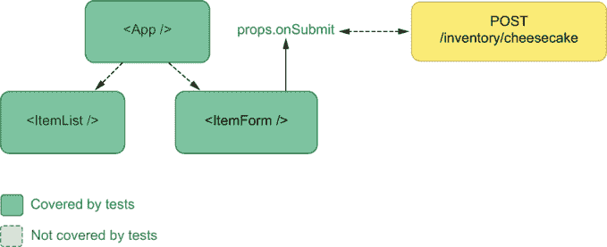
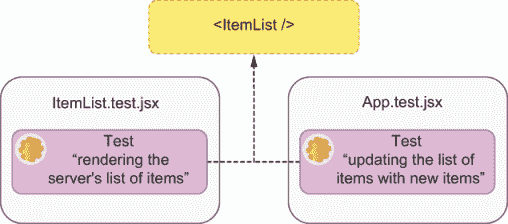
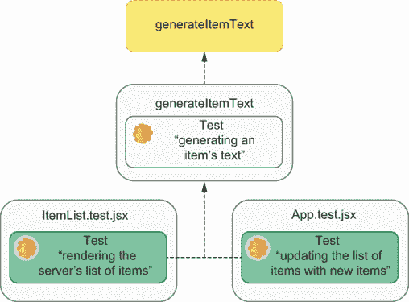
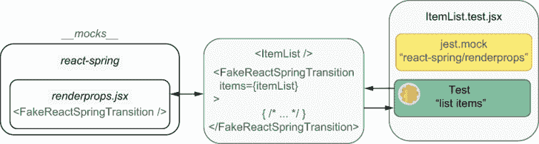
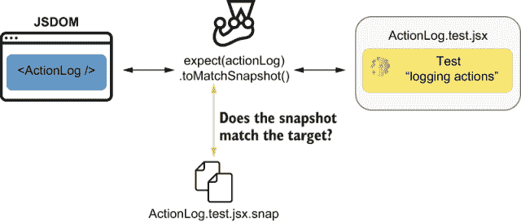
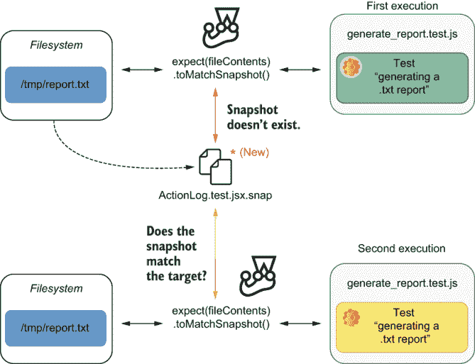
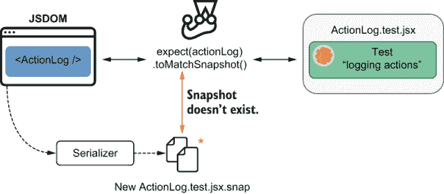
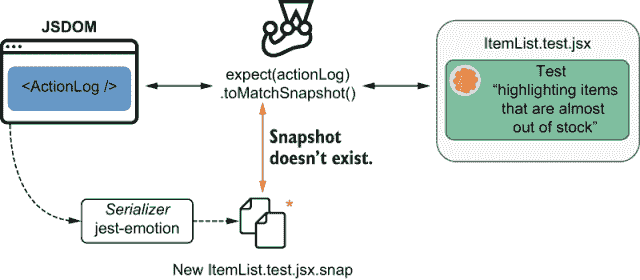

# 8 测试 React 应用程序

本章涵盖

+   如何测试相互交互的组件

+   快照测试

+   测试组件的样式

+   故事和组件级验收测试

在熟悉了专业厨房的操作并学会了一些技巧，比如使用裱花袋后，某个时候，一位 *糕点师* 必须敲碎几个鸡蛋，准备一些面团，并进行一些 *真正的* 烘焙。

在本章中，我们将采用与测试 React 应用程序相似的方法。现在你已经熟悉了 React 测试生态系统，并理解了其工具的作用，我们将更深入地探讨如何编写有效、健壮和可维护的测试来测试你的 React 应用程序。

要学习如何编写这类测试，你需要扩展上一章中构建的应用程序，并学习如何使用高级技术对其进行测试。

首先，你将在多个隔离级别上学习如何验证相互交互的组件。在整个过程中，我会解释如何以易于理解和维护的方式进行。为此，你将学习如何模拟组件，这些模拟如何影响你的测试，以及如何在测试 React 应用程序时应用测试金字塔概念。

在本章的第二部分，我将解释快照测试是什么，如何进行，最重要的是，*何时* 进行。在本节中，你将学习在决定是否应该使用快照测试来测试应用程序的特定部分时需要考虑哪些因素。当我解释快照测试的优缺点时，我会坚持本书的价值驱动方法，这样你将能够做出自己的决定。

然后，鉴于 CSS 在你的软件开发中的重要作用，以及对于客户端应用程序不仅需要 *表现* 良好，而且还需要 *外观* 优美的重要性，你将了解如何测试你的应用程序的样式规则。你将学习哪些组件样式的方面值得测试，以及你可以和不能实现什么。

在本章的最后部分，我将解释组件故事是什么以及如何编写它们。当你使用 Storybook 编写故事时，我会阐明它们如何改进你的开发过程，并帮助你生产可靠且文档齐全的组件。

你将理解故事对反馈循环速度的影响，以及它们如何简化 UI 开发，改善不同团队之间的沟通，并使你和你同事能够在组件级别进行验收测试。

## 8.1 测试组件集成

当处理像工业烤箱这样的昂贵设备时，至关重要的是要检查每一件设备是否都位于手册所说的位置。但仅仅这样做是不够的。面包师越早转动烤箱的旋钮、按下按钮和翻转开关，就越早能够激活保修并订购替换品，如果发生任何问题。然而，路易斯从未在没有尝过在烤箱中烤制的一批酸面包之前认为烤箱是完美的。

类似地，在测试组件时，你可以检查所有元素是否都位于正确的位置。然而，如果不填写一些字段并按下几个按钮，你无法判断组件是否能够充分响应用户的输入。此外，如果不测试组件的集成，很难创建可靠的保证。

在本节中，你将学习如何测试相互交互的组件。首先，你将使应用程序在操作员向库存中添加产品时更新项目列表。然后，你将编写不同类型的测试来测试该功能，在多个不同级别的集成中进行。我将解释每种方法的优缺点。

注意：本章基于上一章中编写的应用程序以及当时使用的服务器。

你可以在本书 GitHub 仓库中找到本章示例中使用的客户端和服务器代码，网址为[`github.com/lucasfcosta/testing-javascript-applications`](https://github.com/lucasfcosta/testing-javascript-applications)。

在第八章的文件夹中，你会找到一个名为`server`的目录，其中包含一个能够处理你的 React 应用程序将发出的请求的 HTTP 服务器。

正如你之前所做的那样，要运行该服务器，导航到其文件夹，使用`npm install`安装其依赖项，并确保你的数据库模式与`npm run migrate:dev`保持最新。在安装依赖项并准备数据库后，使用`npm start`启动服务器。默认情况下，你的 HTTP 服务器将绑定到端口`3000`。

为了使`App`能够更新其状态以及因此其子组件的状态，它将为`ItemForm`创建一个回调函数，当用户添加项目时调用。这个回调函数应该接受项目的名称、添加的数量，并在`App`内部更新状态。

在开始修改`App`之前，按照下一个列表所示更新`ItemForm`，使其接受一个`onItemAdded`函数作为`prop`。如果这个`prop`被定义，`ItemForm`应该在表单提交时调用它，并将项目的名称和添加的数量作为参数传递。

列表 8.1 ItemForm.jsx

```
import React from "react";

// ...

export const ItemForm = ({ onItemAdded }) => {
  const [itemName, setItemName] = React.useState("");
  const [quantity, setQuantity] = React.useState(0);

  const onSubmit = async e => {
    e.preventDefault();
    await addItemRequest(itemName, quantity);
    if (onItemAdded) onItemAdded(itemName, quantity);       ❶
  };

  return (
    <form onSubmit={onSubmit}>
      { /* ... */ }
    </form>
  );
};
```

❶ 当表单提交时调用传递的 onItemAdded 回调

现在，为了验证 `ItemForm` 组件在存在时是否调用传递的 `onItemAdded` 函数，你将创建一个单元测试，如以下所示。你的测试应该渲染 `ItemForm`，通过 `onItemAdded` 属性传递一个占位符，提交表单，等待请求解决，并检查这个组件是否调用了传递的占位符。

列表 8.2 ItemForm.test.jsx

```
// ...

test("invoking the onItemAdded callback", async () => {
  const onItemAdded = jest.fn();
  const { getByText, getByPlaceholderText } = render(                      ❶
    <ItemForm onItemAdded={onItemAdded} />
  );

  nock(API_ADDR)                                                           ❷
    .post("/inventory/cheesecake", JSON.stringify({ quantity: 2 }))
    .reply(200);

  fireEvent.change(getByPlaceholderText("Item name"), {                    ❸
    target: { value: "cheesecake" }
  });
  fireEvent.change(getByPlaceholderText("Quantity"), {                     ❹
    target: { value: "2" }
  });
  fireEvent.click(getByText("Add item"));                                  ❺

  await waitFor(() => expect(nock.isDone()).toBe(true));                   ❻

  expect(onItemAdded).toHaveBeenCalledTimes(1);                            ❼
  expect(onItemAdded).toHaveBeenCalledWith("cheesecake", 2);               ❽
});
```

❶ 渲染一个 `ItemForm` 组件，其 `onItem-Added` 属性是一个使用 Jest 创建的占位符

❷ 创建一个拦截器来响应表单提交时发送的 POST 请求

❸ 使用“cheesecake”更新项目名称的表单字段

❹ 使用“2”更新项目数量的表单字段

❺ 点击提交表单的按钮

❻ 等待拦截器到达

❼ 期望 `onItemAdded` 回调只被调用一次

❽ 期望 `onItemAdded` 回调以“cheesecake”作为其第一个参数和“2”作为其第二个参数被调用

这个测试，其覆盖范围和交互显示在图 8.1 中，可以验证 `ItemForm` 是否会调用通过 `App` 传递的函数，但它*不能*检查 `App` 是否将函数传递给 `ItemForm`，或者传递的函数是否正确。


图 8.1 这个针对 `ItemForm` 的测试只能验证组件本身。它不能检查其父组件或兄弟组件是否给它提供了正确的 `props`，或者它们是否适当地更新。

为了确保当用户添加新项目时 `App` 能够充分更新其状态，你需要一个单独的测试来验证 `App` 及其与 `ItemForm` 的集成。

好吧，更新你的 `App` 组件，以便当用户通过表单提交新项目时，项目列表会更新。

为了实现这个功能，你需要编写一个函数，该函数能够接受项目的名称和数量，并更新 `App` 中的状态。然后，你将通过 `onItemAddedprop` 将这个函数传递给 `ItemForm`。

列表 8.3 ItemForm.test.jsx

```
// ...

export const App = () => {
  const [items, setItems] = useState({});                                  ❶

  // ...

  const updateItems = (itemAdded, addedQuantity) => {                      ❷
    const currentQuantity = items[itemAdded] || 0;
    setItems({ ...items, [itemAdded]: currentQuantity + addedQuantity });
  };

  return (
    <div>
      <h1>Inventory Contents</h1>
      <ItemList itemList={items} />                                        ❸
      <ItemForm onItemAdded={updateItems} />
    </div>
  );
};
```

❶ 创建一个表示库存项目列表的状态

❷ 创建一个函数，该函数将添加的项目名称和数量合并到表示库存项目列表的状态中

❸ 渲染一个项目列表，其 `itemList` 属性是 `App` 中的 `items` 状态

`ItemForm` 组件会在用户提交新项目时调用 `updateItems` 方法。这个方法将接收项目名称和增加的数量，并使用这些信息来更新 `App` 中的状态，该状态被传递给 `ItemList`。因为提交表单会更新 `ItemList` 所使用的状态，所以会导致项目列表更新，反映所添加的项目。

在为这种行为编写测试之前，先快速尝试一下。使用 `npm run build` 构建你的应用程序，用 `npx http-server ./` 提供服务，并访问 `localhost:8080`。当你向库存中添加项目时，你会看到项目列表会自动更新。

因为你还未添加测试来检查`App`及其子组件之间的集成，所以即使你的应用程序不工作，测试也可能通过。

你当前的测试检查列表是否正确显示库存中的内容，以及项目表单是否调用了传递的`onItemAdded`函数。然而，它们并没有验证`App`是否与这些组件充分集成。目前，如果你的测试通过，例如，你忘记了为`ItemForm`提供`updateItems`函数，或者该函数不正确，那么测试仍然会通过。

在开发过程中，单独测试组件是一种快速获得反馈的好方法，但它在创建可靠保证方面并不那么有价值。

为了验证当用户添加新项目时`App`是否能够适当地更新自身，你将编写一个渲染`App`、提交表单并期望`ItemList`更新的测试。

在这个测试中，必须考虑到`ItemForm`在添加项目时会向`POST`发送请求，并且它只有在那个请求解决后才会调用传递的`onItemAdded`函数。因此，为了能够编写一个通过测试，你必须使请求成功，并在运行断言之前使测试等待请求解决。

为了使测试成功，你将为添加项目到库存的路由创建一个拦截器。然后，你将使测试等待请求解决，通过将断言包装在`waitFor`中来实现。

列表 8.4 App.test.jsx

```
import { render, fireEvent, waitFor } from "@testing-library/react";

// ...

test("updating the list of items with new items", async () => {
  nock(API_ADDR)                                                           ❶
    .post("/inventory/cheesecake", JSON.stringify({ quantity: 6 }))
    .reply(200);

  const { getByText, getByPlaceholderText } = render(<App />);             ❷

  await waitFor(() => {                                                    ❸
    const listElement = document.querySelector("ul");
    expect(listElement.childElementCount).toBe(3);
  });

  fireEvent.change(getByPlaceholderText("Item name"), {                    ❹
    target: { value: "cheesecake" }
  });
  fireEvent.change(getByPlaceholderText("Quantity"), {                     ❺
    target: { value: "6" }
  });
  fireEvent.click(getByText("Add item"))

  await waitFor(() => {                                                    ❻
    expect(getByText("cheesecake - Quantity: 8")).toBeInTheDocument();
  });

  const listElement = document.querySelector("ul");
  expect(listElement.childElementCount).toBe(3);                           ❼

  expect(getByText("croissant - Quantity: 5")).toBeInTheDocument();        ❽
  expect(getByText("macaroon - Quantity: 96")).toBeInTheDocument();        ❾
});
```

❶ 创建一个拦截器，当表单添加 6 个 cheesecakes 时将响应请求

❷ 渲染`App`的一个实例

❸ 等待项目列表有三个子元素

❹ 更新项目名称表单字段为“cheesecake”

❺ 更新项目数量表单字段为“6”

❻ 等待一个元素指示库存包含 8 个 cheesecakes

❼ 断言项目列表有三个子元素

❽ 等待一个元素指示库存包含 5 个羊角面包

❾ 等待一个元素指示库存包含 96 个 macarons

你刚刚编写的测试为你提供了可靠的保证，表明你的组件在集成中可以正常工作，因为它涵盖了`App`组件及其所有子组件。它通过使用`ItemForm`添加产品到库存来涵盖`ItemForm`，并通过检查项目列表是否包含具有预期文本的元素来涵盖`ItemList`。

如图 8.2 所示，此测试也涵盖了`App`，因为它只有在`App`向`ItemForm`提供足够更新传递给`ItemList`的状态的回调时才会通过。



图 8.2 渲染`App`、与其子表单交互并验证项目列表元素的测试覆盖率

这个测试的唯一缺点是，如果您更改任何底层组件，您将多一个测试需要修复。例如，如果您更改`ItemList`渲染的文本格式，您将不得不更新`ItemList`的测试以及您刚刚为`App`组件编写的测试，如图 8.3 所示。



图 8.3 如果您决定更改`ItemList`渲染的文本格式，则会中断的测试

当您进行更改时，需要更新的测试越多，更改的成本就越高，因为您需要更多的时间来使测试套件通过。

另一方面，通过在`App`中验证列表项，您为您的应用程序创建了一个可靠的保证，即一旦它从服务器收到响应，它将渲染正确的元素。

关于决定在哪个集成级别测试组件，我的个人观点与`react-testing-library`文档中的建议一致，该文档建议您将测试编写得尽可能高，以获得可靠的保证。您的测试目标在组件树中的位置越高，您的保证就越可靠，因为它们与您的应用程序的运行时场景更接近。

尽管渲染多个组件会产生更可靠的质量保证，但在现实世界中，这并不总是可能的，并且可能会在您的测试之间产生显著的重复。

在保持测试可靠性的同时，使测试更易于维护的一个替代方案是将列表每个元素的文本生成集中到一个单独的函数中，并为该函数编写单独的测试。然后，您可以在`App`应用的测试和`ItemList`的测试中使用该函数。通过这样做，当您更改文本格式时，您只需更新您的文本生成函数及其自身的测试。

通过在`ItemList`中创建一个新函数并将该函数导出为`generateItemText`来集中这个依赖项。这个函数接受一个项目的名称和数量，并返回每个元素应显示的适当文本片段。

列表 8.5 ItemList.jsx

```
// ...

export const generateItemText = (itemName, quantity) => {
  return `${itemName} - Quantity: ${quantity}`;
};
```

一旦您实现了这个函数，就为它编写一个测试。为了更好地在`ItemList.test.jsx`中组织您的测试，我建议您将文本生成函数的测试和`ItemList`本身的测试分别放入两个独立的`describe`块中。

列表 8.6 ItemList.test.jsx

```
// ...

import { ItemList, generateItemText } from "./ItemList.jsx";

describe("generateItemText", () => {
  test("generating an item's text", () => {          ❶
    expect(generateItemText("cheesecake", 3))
      .toBe("cheeseceake - Quantity: 3");
    expect(generateItemText("apple pie", 22))
      .toBe("apple pie - Quantity: 22");
  });
});

describe("ItemList Component", () => {
  // ...
});
```

❶ 将项目名称和数量传递给`generateItemText`函数，并检查它是否产生正确的结果

现在您已经测试了`generateItemText`，更新`ItemList`组件本身，使其使用这个新函数为列表的每个项创建文本。

列表 8.7 ItemList.jsx

```
// ...

export const ItemList = ({ itemList }) => {
  return (
    <ul>
      {Object.entries(itemList).map(([itemName, quantity]) => {
        return (
          <li key={itemName}>
            { generateItemText(itemName, quantity) }           ❶
          </li>
        );
      })}
    </ul>
  );
};

// ...
```

❶ 使用`generateItemText`生成`ItemList`中每个项目的文本

由于你已经通过测试 `generateItemText` 函数创建了可靠的保证，因此你可以在整个测试套件中自信地使用它。如果 `generateItemText` 函数失败，即使使用它的测试会通过，`generateItemText` 本身的测试也会失败。这样的测试是你可以如何利用传递性保证的一个极好例子。

请继续更新 `ItemList` 和 `App` 的测试，以便它们使用这个新函数。

列表 8.8 ItemList.test.jsx

```
// ...

describe("ItemList Component", () => {
  test("list items", () => {
    const itemList = { cheesecake: 2, croissant: 5, macaroon: 96 };
    const { getByText } = render(<ItemList itemList={itemList} />);

    const listElement = document.querySelector("ul");
    expect(listElement.childElementCount).toBe(3);
    expect(getByText(generateItemText("cheesecake", 2))).toBeInTheDocument();❶
    expect(getByText(generateItemText("croissant", 5))).toBeInTheDocument(); ❷
    expect(getByText(generateItemText("macaroon", 96))).toBeInTheDocument(); ❸
  });
});
```

❶ 使用 generateItemText 函数创建字符串，以便测试可以找到表示库存有 2 个芝士蛋糕的元素

❷ 使用 generateItemText 函数创建字符串，以便测试可以找到表示库存有 5 个羊角面包的元素

❸ 使用 generateItemText 函数创建字符串，以便测试可以找到表示库存有 96 个马卡龙的元素

列表 8.9 App.test.jsx

```
import { generateItemText } from "./ItemList.jsx";

// ...

test("rendering the server's list of items", async () => {
  // ...

  expect(getByText(generateItemText("cheesecake", 2))).toBeInTheDocument();
  expect(getByText(generateItemText("croissant", 5))).toBeInTheDocument();
  expect(getByText(generateItemText("macaroon", 96))).toBeInTheDocument();
});

test("updating the list of items with new items", async () => {
  // ...

  await waitFor(() => {
    expect(getByText(generateItemText("cheesecake", 8))).toBeInTheDocument();
  });

  const listElement = document.querySelector("ul");
  expect(listElement.childElementCount).toBe(3);

  expect(getByText(generateItemText("croissant", 5))).toBeInTheDocument();
  expect(getByText(generateItemText("macaroon", 96))).toBeInTheDocument();
});
```

如果你在这之后运行测试，你会看到它们仍然通过。唯一的区别是它们现在更加经济。

通过为 `generateItemText` 创建单独的测试并在其他测试中使用此函数，你已经创建了一个传递性保证。你的组件的两个测试都信任 `generateItemText` 工作得当，但还有一个专门针对 `generateItemText` 的测试来确保这个特定函数工作（图 8.4）。



图 8.4 集中依赖 `generateItemText` 如何创建传递性保证

为了看到你的测试生成的维护开销减少了多少，尝试更改 `ItemList` 中文本的格式，使得每个项目的名称的首字母总是大写，然后重新运行你的测试。

列表 8.10 ItemList.test.jsx

```
// ...

export const generateItemText = (itemName, quantity) => {
  const capitalizedItemName =                                ❶
    itemName.charAt(0).toUpperCase() +
    itemName.slice(1);
  return `${capitalizedItemName} - Quantity: ${quantity}`;
};

// ...
```

❶ 将项目名称的首字符大写

重新运行测试后，你应该看到只有 `generateItemText` 本身的测试会失败，但所有其他测试都通过了。要使所有测试再次通过，你只需要更新一个测试：`generateItemText` 的测试。

列表 8.11 ItemList.test.jsx

```
describe("generateItemText", () => {
  test("generating an item's text", () => {          ❶
    expect(generateItemText("cheesecake", 3))
      .toBe("Cheesecake - Quantity: 3");
    expect(generateItemText("apple pie", 22))
      .toBe("Apple pie - Quantity: 22");
  });
});
```

❶ 使用几个项目名称和数量调用 generateItemText，并检查结果是否正确，包括项目名称的首字符是否已大写

**当你有太多依赖于单一故障点的测试时，将这个故障点集中到一个你将在整个测试中使用的单一组件中**，就像你为 `generateItemText` 所做的那样。模块化可以使你的应用程序代码和测试更加健壮。

### 8.1.1 组件模拟

你并不总是能够通过将组件渲染到 DOM 中来测试多个组件。有时，你将不得不将你的组件包裹在其他具有不良副作用或第三方库提供的组件中，正如我之前提到的，你不应该自己测试这些组件。

在本节中，你将集成`react-spring`到你的应用程序中，以便你可以添加动画来突出显示进入或离开库存的新类型的项目。然后，你将学习如何使用存根来测试你的组件，而无需测试`react-spring`本身。

首先，使用`npm install react-spring`安装`react-spring`，以便你可以在`ItemList.jsx`中使用它。

注意：由于`react-spring`使用的导出类型，在打包应用程序时，你将不得不使用一个名为`esmify`的 Browserify 插件。

要使用`esmify`，使用`npm install --save-dev esmify`安装它，然后更新`package.json`中的`build`脚本，使其使用`esmify`作为插件。

列表 8.12 package.json

```
//...
{
  "name": "my-application-name",
  "scripts": {
    "build": "browserify index.jsx -p esmify -o bundle.js",      ❶
   // ...
  }
  // ...
}
```

❶ 配置 Browserify 在生成你的包时使用 esmify

一旦安装了`react-spring`，使用`react-spring`中的`Transition`组件来动画化列表中进入或离开的每个项目。

列表 8.13 ItemList.jsx

```
// ...

import { Transition } from "react-spring/renderprops";

// ...

export const ItemList = ({ itemList }) => {
  const items = Object.entries(itemList);

  return (
    <ul>
      <Transition                                        ❶
        items={items}
        initial={null}
        keys={([itemName]) => itemName}
        from={{ fontSize: 0, opacity: 0 }}
        enter={{ fontSize: 18, opacity: 1 }}
        leave={{ fontSize: 0, opacity: 0 }}
      >
        {([itemName, quantity]) => styleProps => (       ❷
          <li key={itemName} style={styleProps}>         ❸
            {generateItemText(itemName, quantity)}
          </li>
        )}
      </Transition>
    </ul>
  );
};
```

❶ 一个将动画化进入或离开项目列表的每个项目的`Transition`组件

❷ 一个将被列表的每个项目调用并返回另一个函数的函数，该函数接受一个表示动画当前状态的样式的属性

❸ 一个`li`元素，其样式将与动画的当前状态相对应，使每个项目都能进行动画

注意：你可以在[`www.react-spring.io/docs`](https://www.react-spring.io/docs)找到`react-spring`的完整文档。

要尝试你的应用程序并查看它如何动画化项目列表的元素，使用`npm run build`运行你的应用程序，然后使用`npx http-server ./`提供服务，访问`localhost:8080`。在测试你的应用程序时，你的后端必须在端口`3000`上可用并正在运行。

现在，当测试`ItemList`时，你应该小心不要测试`Transition`组件本身。测试`react-spring`库是维护者的责任，并且可能会给你的测试增加额外的复杂性。如果你认为增加的复杂性不会显著影响你的测试，你始终可以选择不使用任何测试替身。然而，鉴于你最终必须这样做，学习如何使用本节中的示例来这样做将是有用的。

要充分模拟`Transition`组件，你需要首先观察其工作方式，以便能够准确地重现其行为。在这种情况下，`Transition`组件将使用`items`属性接收到的每个项目调用其子组件，然后使用表示转换状态的样式调用生成的函数。这个最后的函数调用将返回一个包含项目文本的`li`元素，其中包含生成的`styles`。

要在测试中一致地模拟 `Transition` 组件，首先在项目根目录中创建一个 `*mocks*` 文件夹，然后在那个文件夹中创建一个名为 `react-spring` 的另一个文件夹。在那个文件夹中，您将创建一个名为 `renderprops.jsx` 的文件，该文件将包含 `react-spring` 库的 `renderprops` 命名空间中的模拟。

在 `react-spring.jsx` 文件中，创建一个 `FakeReactSpringTransition` 组件并将其导出为 `Transition`。这个组件应该接受 `items` 和 `children` 作为属性。它将遍历其项目，通过 `children` 传递的函数调用。每个这样的调用将返回一个函数，该函数接受样式并返回一个组件实例。然后，该函数将使用表示假样式集的对象调用，导致子组件渲染。

列表 8.14 renderprops.jsx

```
const FakeReactSpringTransition = jest.fn(                 ❶
  ({ items, children }) => {
    return items.map(item => {
      return children(item)({ fakeStyles: "fake " });
    });
  }
);

export { FakeReactSpringTransition as Transition };
```

❶ 一个假的 Transition 组件，它将列表项传递给每个子组件，然后使用表示假样式集的对象调用返回的函数。这个最后的调用导致应该被动画化的子组件渲染。

将 `react-spring` 中的 `Transition` 组件替换为这个测试双胞胎将导致它仅仅渲染每个子组件，就像没有 `Transition` 组件包裹它们一样。

要在测试中使用这个存根，请在每个您想使用 `FakeReactSpringTransition` 的测试文件顶部调用 `jest.mock("react-spring/renderprops")`。

目前，您正在使用 `ItemList`，它在 `App.test.jsx` 和 `ItemList.test.jsx` 中都依赖于 `Transition`，所以请继续在每个这些文件顶部添加对 mock `react-spring/renderprops` 的调用。

列表 8.15 App.test.jsx

```
import React from "react";

// ...

jest.mock("react-spring/renderprops");       ❶

beforeEach(() => { /* ... */ });

// ...
```

❶ 导致 react-spring/renderprops 解析到在 mocks/react-spring 中创建的存根

列表 8.16 ItemList.test.jsx

```
import React from "react";

// ...

jest.mock("react-spring/renderprops");               ❶

describe("generateItemText", () => { /* ... */ });

// ...
```

❶ 导致 react-spring/renderprops 解析到在 mocks/react-spring 中创建的存根

通过在 `*mocks*` 文件夹中创建一个测试双胞胎并调用 `jest.mock`，您将导致 `ItemList` 中对 `react-spring/renderprops` 的导入解析到您的模拟，如图 8.5 所示。



图 8.5 当运行测试时，`ItemList` 如何使用您的测试双胞胎

使用这个测试双胞胎后，您的组件将表现得与引入 `react-spring` 之前的行为相似，因此所有测试都应该仍然通过。

多亏了这个测试双胞胎，您能够避免与测试 `react-spring` 相关的所有可能的复杂性。您不需要自己测试 `react-spring`，而是依赖于其维护者已经这样做的事实，因此避免了测试第三方代码。

如果您想检查传递给 `Transition` 的属性，您也可以检查您的测试双胞胎的调用，因为您已经使用 `jest.fn` 包装了您的假组件。

在决定是否要模拟组件时，考虑你是否将测试第三方代码，这将增加多少测试复杂性，以及你希望验证组件之间集成哪些方面。

在测试我的 React 应用程序时，我尽量避免尽可能多地用测试替身替换组件。如果我能控制组件，我会选择扩展 `react-testing-library` 或创建测试工具，这些工具可以帮助我使我的测试更具可维护性。我只对触发我无法控制的副作用（例如，动画）的组件进行存根。在没有存根的情况下，测试会变得太长或太复杂时，使用测试替身也是一个好主意。

注意：在上一章中提到的 Enzyme，作为 `react-testing-library` 的替代品，使得在不存根子组件的情况下测试组件变得更容易。当使用 Enzyme 时，你不需要手动创建测试替身，可以使用它的 `shallow` 方法来避免渲染子组件。

`浅渲染` 组件的缺点是，它们减少了你的运行时环境与测试之间的相似性，就像存根一样。因此，`浅渲染` 使得你的测试保证更弱。

正如我在书中多次提到的，说“*总是*这样做”或“*永远*不要这样做”是危险的。相反，在决定采用哪种方法之前，了解每种方法的优缺点更为有益。

## 8.2 快照测试

到今天为止，路易斯更喜欢通过观看他人烘焙来学习食谱，而不是阅读食谱。当你能够将你的面糊的稠度和你的巧克力奶油霜的外观与他人进行比较时，烘焙美味的蛋糕要容易得多。

当测试组件时，你可以遵循类似的方法。每当一个组件的标记与你的预期相匹配时，你可以对其进行快照。然后，随着你对组件进行迭代，你可以将其与所拍摄的快照进行比较，以检查它是否仍然渲染了正确的内容。

在本节中，你将实现一个记录会话中发生的所有事件的组件，并使用 Jest 的快照来测试该组件。在整个过程中，我将解释使用快照的优势和劣势，以及何时决定使用它。然后，我将解释快照在测试 React 组件之外的用例。

在你开始编写涉及快照的测试之前，创建一个新的组件名为 `ActionLog`。这个组件将接受一个对象数组并渲染一个动作列表。数组中的每个对象都将包含一个 `message` 属性，告知发生了什么，以及一个 `time` 属性，告知发生的时间。此外，这些对象中的每一个都可以有一个 `data` 属性，包含任何其他可能有用的任意信息，例如，当加载第一次的项目时，你的应用程序从服务器收到的响应。

列表 8.17 ActionLog.jsx

```
import React from "react";

export const ActionLog = ({ actions }) => {                   ❶
  return (
    <div>
      <h2>Action Log</h2>
      <ul>
        {actions.map(({ time, message, data }, i) => {        ❷
          const date = new Date(time).toUTCString();
          return (
            <li key={i}>
              {date} - {message} - {JSON.stringify(data)}
            </li>
          );
        })}
      </ul>
    </div>
  );
};
```

❶ 一个 ActionLog 组件，它接受一个 actions 属性，表示应用程序内部发生的事情

❷ 遍历 actions 中的每个项目并生成一个 li 元素，告知用户发生了什么以及何时发生

现在，创建一个名为 `ActionLog.test.jsx` 的文件，您将在其中编写 `ActionLog` 组件的测试。

在此文件中，您将使用 Jest 的 `toMatchSnapshot` 匹配器编写您的第一个快照测试。

此测试将渲染 `ActionLog` 并检查渲染的组件是否与特定的快照匹配。为了获取渲染的组件并将其与快照进行比较，您将使用 `render` 结果中的 `container` 属性和 `toMatchSnapshot` 匹配器。

列表 8.18 ActionLog.test.jsx

```
import React from "react";
import { ActionLog } from "./ActionLog";
import { render } from "@testing-library/react";

const daysToMs = days => days * 24 * 60 * 60 * 1000;                       ❶

test("logging actions", () => {
  const actions = [                                                        ❷
    {
      time: new Date(daysToMs(1)),
      message: "Loaded item list",
      data: { cheesecake: 2, macaroon: 5 }
    },
    {
      time: new Date(daysToMs(2)),
      message: "Item added",
      data: { cheesecake: 2 }
    },
    {
      time: new Date(daysToMs(3)),
      message: "Item removed",
      data: { cheesecake: 1 }
    },
    {
      time: new Date(daysToMs(4)),
      message: "Something weird happened",
      data: { error: "The cheesecake is a lie" }
    }
  ];

  const { container } = render(<ActionLog actions={actions} />);           ❸
  expect(container).toMatchSnapshot();                                     ❹
});
```

❶ 将天数数量转换为毫秒

❷ 创建一个静态操作列表

❸ 在测试中创建一个包含静态操作的 ActionLog 实例

❹ 期望渲染的元素与快照匹配

当您第一次执行此测试时，您会看到，除了测试通过之外，Jest 还会告诉您它已写入一个快照。

```
PASS  ./ActionLog.test.jsx
 › 1 snapshot written.

Snapshot Summary
 › 1 snapshot written from 1 test suite.
```

Jest 创建此文件是因为您第一次运行使用快照的测试时，Jest 没有之前的快照可以与之比较。因此，它会对组件进行快照，以便在您下次运行测试时使用，如图 8.6 所示。在 Jest 保存快照后，在您测试的每次后续执行中，Jest 都会将断言目标与存储的快照进行比较。


图 8.6 当 Jest 找不到测试的快照时，它会使用断言目标的内 容创建一个快照。

如果您重新运行测试，您会看到 Jest 不会说它已写入快照。相反，它将现有的快照与断言目标进行比较，并检查它们是否匹配，如图 8.7 所示。如果它们匹配，则断言通过。否则，它会抛出一个错误。



图 8.7 当存在快照时，Jest 将断言目标的内 容与快照的内 容进行比较。

Jest 将这些快照写入与测试文件相邻的文件夹中。这个文件夹被称为 *snapshots*。

现在，打开您项目根目录下的 *snapshots* 文件夹，查看其中的 `ActionLog.test.jsx.snap` 文件。

您会看到这个文件包含您的测试名称和 `ActionLog` 组件在测试期间渲染的标记。

列表 8.19 ActionLog.test.jsx.snap

```
exports[`logging actions 1`] = `
<div>
  <div>
    <h2>
      Action Log
    </h2>
    <ul>
    // ...
    </ul>
  </div>
</div>
`;
```

注意：您快照中的这个额外的 `div` 是 `react-testing-library` 渲染您的组件的 `div`。为了避免在快照中包含这个额外的 `div`，请使用 `container.firstChild` 而不是 `container` 作为您的断言目标。

如果您仔细观察，您会注意到这个文件只是一个导出包含测试名称后跟一个数字的 JavaScript 文件，该数字代表与它关联的 `toMatchSnapshot` 断言。

当运行测试时，Jest 使用测试的名称和 `toMatchSnapshot` 断言的顺序从 `.snap` 文件中获取字符串，该字符串将用于与断言的目标进行比较。

重要提示：生成快照时要小心。如果你的组件渲染了错误的内容，Jest 将比较你的组件的标记也将是错误的。

你应该在确定断言的目标正确后生成快照。或者，在第一次运行测试后，你也可以阅读快照文件的內容，以确保其正确性。

在相同的测试中，尝试创建一个新的动作日志，渲染另一个 `ActionLog` 组件，并再次使用 `toMatchSnapshot`。

列表 8.20 ActionLog.test.jsx

```
// ...

test("logging actions", () => {
  // ...

  const { container: containerOne } = render(         ❶
    <ActionLog actions={actions} />
  );
  expect(containerOne).toMatchSnapshot();             ❷

  const newActions = actions.concat({                 ❸
    time: new Date(daysToMs(5)),
    message: "You were given lemons",
    data: { lemons: 1337 }
  });

  const { container: containerTwo } = render(         ❹
    <ActionLog actions={newActions} />
  );
  expect(containerTwo).toMatchSnapshot();             ❺
});
```

❶ 渲染一个带有静态项目列表的 ActionLog 组件

❷ 期望 ActionLog 匹配一个快照

❸ 创建一个带有额外项目的项目列表

❹ 渲染另一个带有新动作列表的 ActionLog 组件

❺ 期望第二个 ActionLog 匹配另一个快照

再次运行此测试时，你会看到 Jest 会告诉你它已经编写了一个快照。

Jest 必须为这个测试编写一个新的快照，因为它在 `ActionLog.test.jsx.snap` 中找不到与断言的目标进行比较的字符串。

如果你再次打开 `ActionLog.test.jsx.snap` 文件，你会看到它现在导出两个不同的字符串，每个 `toMatchSnapshot` 断言一个。

列表 8.21 ActionLog.test.jsx.snap

```
// Jest Snapshot v1, https://goo.gl/fbAQLP

exports[`logging actions 1`] = `
  // ...
`;

exports[`logging actions 2`] = `
  // ...
`
```

现在尝试更改每个日志条目的格式，并重新运行你的测试。

列表 8.22 ActionLog.jsx

```
import React from "react";

export const ActionLog = ({ actions }) => {
  return (
    <div>
      <h2>Action Log</h2>
      <ul>
        {actions.map(({ time, message, data }, i) => {
          const date = new Date(time).toUTCString();
          return (
            <li key={i}>
              Date: {date} -{" "}
              Message: {message} -{" "}
              Data: {JSON.stringify(data)}
            </li>
          );
        })}
      </ul>
    </div>
  );
};
```

在此更改之后，因为渲染的组件将不再匹配快照的内容，你的测试将失败。

为了让测试再次通过，使用带有 `-u` 选项的测试运行，该选项是 `--updateSnapshot` 的简称。此选项将导致 Jest 更新那些 `toMatchSnapshot` 匹配器失败的快照。

```
PASS  ./ActionLog.test.jsx
 › 1 snapshot updated.

Snapshot Summary
 › 1 snapshot updated from 1 test suite.
```

TIP 如果你使用 NPM 脚本来运行测试，请向其追加 `--` 以添加选项到脚本中。如果你使用 NPM 的 `test` 脚本来运行测试，你可以尝试使用 `npm run test -- --updateSnapshot`。

重要提示：只有当你确定断言的目标是正确的时才更新快照。当你使用 `--updateSnapshot` 选项时，与第一次生成快照时类似，如果测试不匹配快照，Jest 不会导致任何测试失败。

当你完成组件的开发后，如果你使用像 `git` 这样的版本控制系统，**确保将快照包含在你的提交中**。否则，在其他机器上，你的测试将 *总是* 通过，因为 Jest 将编写新的快照文件，即使组件渲染了错误的内容。

感谢 Jest 的快照功能，你能够用更简洁的测试来测试你的 `ActionLog` 组件。你不需要编写包含长字符串的多个断言，只需编写一个能够验证组件整个内容的单个断言。

快照可以特别有用，用于替换一组复杂的断言。具有固定标记的复杂组件的日志——长文本片段——是 Jest 快照最闪耀的使用案例之一。

由于创建和更新快照非常容易，你不需要频繁地更新测试中的断言。当测试涉及多个低价值、昂贵的更改时，避免手动更新测试特别有用，例如更新大量相似的字符串。

到目前为止，鉴于编写和更新涉及快照的测试既快又简单，它们可能看起来像是单元测试的万能药，但它们并不总是适用于所有类型的测试。

快照的一个最明显的问题是错误很容易被忽视。由于快照是自动生成的，你可能会错误地更新快照，导致测试通过，尽管断言的目标是不正确的。

即使你有代码审查流程，在一次性更新多个快照时，很容易错过更改，尤其是如果你的快照太大，或者你一次性更改了太多代码。

**注意**：在第十三章中，我将更详细地讨论如何进行有用的代码审查。

为了避免意外更新快照，在运行多个测试时，请避免使用 `--updateSnapshot` 标志。要谨慎使用，并且仅在每次运行单个测试文件时使用，这样你才能确切知道 Jest 更新了哪些快照。

**提示**：Jest 有一种交互式使用模式，允许你交互式地更新快照。在交互式快照模式下，Jest 将显示你测试执行期间每个更改的快照的 diff，并允许你选择新的快照是否正确。

要进入交互式快照模式，使用 `--watch` 选项运行 Jest，并按 `i` 键。

此外，为了使你的同事更容易发现错误的快照，避免生成过长的快照。

**提示**：如果你正在使用 `eslint`，你可以通过 `eslint-plugin-jest` 中的 `no-large-snapshots` 选项来禁止使用大快照，关于这个选项的更多详细信息，你可以在[`github.com/jest-community/eslint-plugin-jest`](https://github.com/jest-community/eslint-plugin-jest)找到。我将在第十三章深入探讨像 `eslint` 这样的代码检查器。

使用快照的另一个缺点是它会锁定测试的行为到特定的输出。

例如，如果你为 `ActionLog` 有多个测试，并且所有这些测试都使用快照，那么如果你决定更改操作日志的标题，所有这些测试都会失败。相比之下，如果你为 `ActionLog` 组件的不同部分编写多个小型测试，你会得到更细粒度的反馈。

为了避免粗略的反馈，同时仍然获得快照测试的好处，你可以缩小你想要快照测试的组件部分。除了使你的测试更细粒度外，这种技术还可以减小快照的大小。

如果你只想检查你刚刚编写的测试中的 `ActionLog` 列表内容，例如，你可以在使用 `toMatchSnapshot` 的断言中仅使用 `ul` 元素作为断言目标。

列表 8.23 ActionLog.test.jsx

```
// ...

test("logging actions", () => {
  // ...

  const { container } = render(<ActionLog actions={actions} />);
  const logList = document.querySelector("ul")
  expect(logList).toMatchSnapshot();
});
```

现在你已经知道了如何进行快照测试，你将更新 `App` 以使其向 `ActionLog` 传递一个动作列表。

首先，更新 `App.jsx` 以使其包含一个状态，它将存储一个动作数组。然后，`App` 组件将把这个状态传递给它将要渲染的 `ActionLog` 组件作为其子项之一。

列表 8.24 App.jsx

```
// ...

import { ActionLog } from "./ActionLog.jsx";

export const App = () => {
  const [items, setItems] = useState({});
  const [actions, setActions] = useState([]);

  // ...

  return (
    <div>
      <h1>Inventory Contents</h1>
      <ItemList itemList={items} />
      <ItemForm onItemAdded={updateItems} />
      <ActionLog actions={actions} />
    </div>
  );
};
```

为了使 `ActionLog` 组件有一些初始内容来显示，当 `App` 收到包含初始库存项目的服务器响应时，它应该更新 `actions`，如下所示。

列表 8.25 App.jsx

```
// ...

export const App = () => {
  const [items, setItems] = useState({});
  const [actions, setActions] = useState([]);                         ❶
  const isMounted = useRef(null);

  useEffect(() => {
    isMounted.current = true;
    const loadItems = async () => {
      const response = await fetch(`${API_ADDR}/inventory`);
      const responseBody = await response.json();

      if (isMounted.current) {
        setItems(responseBody);
        setActions(actions.concat({                                   ❷
          time: new Date().toISOString(),
          message: "Loaded items from the server",
          data: { status: response.status, body: responseBody }
        }));
      }
    };
    loadItems();
    return () => (isMounted.current = false);
  }, []);

  // ...

  return (
    <div>
      <h1>Inventory Contents</h1>
      <ItemList itemList={items} />
      <ItemForm onItemAdded={updateItems} />
      <ActionLog actions={actions} />
    </div>
  );
};
```

❶ 创建一个状态片段来表示应用程序的动作

❷ 更新 App 中的状态，使其动作列表包括一个通知从服务器加载项目列表的动作

现在你已经编写了 `ActionLog` 组件的标记，并给它提供了一些数据，构建你的应用程序，提供服务，并检查动作日志的内容。一旦客户端从服务器接收到初始项目，你的动作日志应该包含响应体和状态。

要测试由 `App` 渲染的 `ActionLog`，再次使用快照测试。

首先，为了将快照测试限制在 `ActionLog` 组件上，给其最外层的 `div` 添加一个 `data-testid` 属性，这样你就可以在测试中找到它。

列表 8.26 ActionLog.jsx

```
import React from "react";

export const ActionLog = ({ actions }) => {
  return (
    <div data-testid="action-log">
      { /* ... */ }
    </div>
  );
};
```

在设置了这个属性之后，编写一个测试，渲染 `App` 并等待加载项目的请求解决，然后使用 `toMatchSnapshot` 为 `ActionLog` 的内容生成一个快照。

列表 8.27 App.test.jsx

```
test("updating the action log when loading items", async () => {
  const { getByTestId } = render(<App />);                              ❶

  await waitFor(() => {                                                 ❷
    const listElement = document.querySelector("ul");
    expect(listElement.childElementCount).toBe(3);
  });

  const actionLog = getByTestId("action-log");                          ❸
  expect(actionLog).toMatchSnapshot();                                  ❹
});
```

❶ 渲染 App 实例

❷ 等待渲染的项目列表有三个子项

❸ 查找动作日志容器

❹ 期望动作日志匹配快照

这个测试第一次运行时会通过，但在所有后续执行中都会失败。这些失败发生是因为 Jest 为动作列表生成的快照包括了当前时间，这会每次你重新运行测试时都会改变。

为了使那个测试具有确定性，你可以使用一个模拟计时器，就像你在第五章中所做的那样，或者你可以直接模拟 `toISOString`，使其始终返回相同的值。

列表 8.28 App.test.jsx

```
test("updating the action log when loading items", async () => {
  jest.spyOn(Date.prototype, "toISOString")
    .mockReturnValue("2020-06-20T13:37:00.000Z");                   ❶

  const { getByTestId } = render(<App />);                          ❷
  await waitFor(() => {                                             ❸
    const listElement = document.querySelector("ul");
    expect(listElement.childElementCount).toBe(3);
  });

  const actionLog = getByTestId("action-log");                      ❹
  expect(actionLog).toMatchSnapshot();                              ❺
});
```

❶ 在 Date.prototype 中模拟 toIsoString 方法，使其始终返回相同的日期

❷ 渲染 App 实例

❸ 等待渲染的项目列表有三个子项

❹ 查找动作日志容器

❺ 期望动作日志匹配快照

在此更改后，使用 `--updateSnapshot` 选项重新运行你的测试。然后，在 Jest 更新此测试的快照之后，多次重新运行你的测试，你会发现它们总是会通过。

当在测试中使用快照时，请确保您的测试是确定的。否则，它们在第一次执行后总是会失败。

作为练习，更新 `App` 以便每次用户向库存添加项目时，它都会在操作日志中添加一个新条目。然后，使用 `toMatchSnapshot` 测试它。

注意：您可以在本书 GitHub 仓库的 `chapter8/2_snapshot _testing/1_component_snapshots` 目录中找到此练习的解决方案：[`github.com/lucasfcosta/testing-javascript-applications`](https://github.com/lucasfcosta/testing-javascript-applications)。

### 8.2.1 组件之外的快照

快照测试不仅限于测试 React 组件。您可以使用它来测试任何类型的数据，从 React 组件到简单的对象，或原始值，如字符串。

想象一下，你已经构建了一个小工具，如下所示，它接受一个包含项目、数量和价格的列表，并将报告写入一个 `.txt` 文件。

列表 8.29 generate_report.js

```
const fs = require("fs");

module.exports.generateReport = items => {
  const lines = items.map(({ item, quantity, price }) => {                 ❶
    return `${item} - Quantity: ${quantity} - Value: ${price * quantity}`;
  });
  const totalValue = items.reduce((sum, { price }) => {                    ❷
    return sum + price;
  }, 0);

  const content = lines.concat(`Total value: ${totalValue}`).join("\n");   ❸
  fs.writeFileSync("/tmp/report.txt", content);                            ❹
};
```

❶ 生成每项数量的行以及每种物品的总价值

❷ 计算库存的总价值

❸ 生成文件的最终内容

❹ 同步将报告写入文件

要测试此实用程序，您可以在断言中而不是写一段长文本，使用 Jest 的快照测试功能将生成的值与快照进行比较。

尝试创建一个名为 `generate_report.test.js` 的文件，并编写一个调用 `generateReport` 并带有项目列表的测试，从 `/tmp/report.txt` 读取，并将该文件的内容与快照进行比较。

列表 8.30 generate_report.test.js

```
const fs = require("fs");
const { generateReport } = require("./generate_report");

test("generating a .txt report", () => {
  const inventory = [                                              ❶
    { item: "cheesecake", quantity: 8, price: 22 },
    { item: "carrot cake", quantity: 3, price: 18 },
    { item: "macaroon", quantity: 40, price: 6 },
    { item: "chocolate cake", quantity: 12, price: 17 }
  ];

  generateReport(inventory);                                       ❷
  const report = fs.readFileSync("/tmp/report.txt", "utf-8");      ❸
  expect(report).toMatchSnapshot();                                ❹
});
```

❶ 安排：创建一个静态的项目列表

❷ 执行：调用 generateReport 函数

❸ 读取生成的文件

❹ 断言：期望文件内容与快照匹配

一旦编写了此测试，运行它并检查 `snapshots` 文件夹中的 `generate_report.test.js.snap` 文件的内容。在该文件中，您将找到一个包含文件内容的字符串。

列表 8.31 generate_report.test.js.snap

```
exports[`generating a .txt report 1`] = `
"cheesecake - Quantity: 8 - Value: 176
carrot cake - Quantity: 3 - Value: 54
macaroon - Quantity: 40 - Value: 240
chocolate cake - Quantity: 12 - Value: 204
Total value: 63"
`;
```

现在，每次你重新运行测试时，Jest 都会将 `/tmp/report.txt` 文件的内容与快照中的内容进行比较，就像在测试 React 组件时一样，如图 8.8 所示。



图 8.8 Jest 首次运行时创建包含报告内容的快照。第二次运行时，它将比较报告的实际内容与它保存在快照文件中的内容。

这种技术在测试转换代码或写入终端的程序时很有用。

例如，Jest 项目使用它自己和其快照测试功能来验证它生成的测试摘要。当 Jest 的贡献者编写一个新功能时，他们会编写执行 Jest 并将写入终端的 `stdout` 内容与快照进行比较的测试。

### 8.2.2 序列化器

为了让 Jest 能够将数据写入快照，它需要知道如何正确地序列化它。

当你在测试 React 组件时，例如，Jest 知道如何以使快照可读的方式序列化这些组件。如图 8.9 所示的这种专门用于 React 组件的序列化器，是为什么你在快照中看到的是漂亮的 HTML 标签，而不是一大堆令人困惑的对象。



图 8.9 Jest 的序列化器决定了如何将数据序列化到快照文件中。

可理解的快照通过使你更容易发现错误，以及其他人一旦将代码推送到远程仓库后更容易审查你的快照，从而提高了测试的质量。

在撰写本文时，Jest（26.6）的当前版本已经包含了所有 JavaScript 原始类型、HTML 元素、React 组件和 ImmutableJS 数据结构的序列化器，但你也可以构建自己的。

例如，你可以使用自定义序列化器来比较组件的样式，正如你将在下一节中看到的。

## 8.3 测试样式

路易斯知道，大多数时候，蛋糕上的樱桃不仅仅是细节。它实际上是顾客决定是否带回家那块甜美甜点的关键。当芝士蛋糕看起来很棒时，它肯定能卖得更好。

同样，组件的样式是决定你是否可以发布它的一个重要部分。例如，如果你的组件的根元素有一个永久的 `visibility: hidden` 规则，那么它可能对你的用户来说并不太有用。

在本节中，你将学习如何测试组件的样式，以及你可以和不能通过测试实现什么。

要了解如何测试组件的样式，你将使应用程序动画化，并将即将售罄的物品以 `红色` 突出显示。在实现这些更改后，我将介绍测试过程，并解释你可以和不能测试的内容，以及哪些工具可以帮助你产生更好的自动化测试。

首先，创建一个 `styles.css` 文件，在其中编写一个类来样式化即将售罄的物品。

列表 8.32 styles.css

```
.almost-out-of-stock {
  font-weight: bold;
  color: red;
}
```

一旦创建了该文件，请向 `index.html` 添加一个 `style` 标签以加载它。

列表 8.33 index.html

```
<!DOCTYPE html>
<html lang="en">
  <head>
    <meta charset="UTF-8" />
    <title>Inventory</title>
    <link rel="stylesheet" href="./styles.css">      ❶
  </head>
  <!-- ... -->
</html>
```

❶ 加载 styles.css

现在你可以将这个类的规则应用到页面中的元素上，更新 `ItemList` 以使用 `almost-out-of-stock` 来样式化数量少于五的元素。

列表 8.34 ItemList.jsx

```
// ...

export const ItemList = ({ itemList }) => {
  const items = Object.entries(itemList);

  return (
    <ul>
      <Transition
        { /* ... */ }
      >
        {([itemName, quantity]) => styleProps => (
          <li
            key={itemName}
            className={quantity < 5 ? "almost-out-of-stock" : null}        ❶
            style={styleProps}
          >
            {generateItemText(itemName, quantity)}
          </li>
        )}
      </Transition>
    </ul>
  );
};
```

❶ 将 `almost-out-of-stock` 类应用到代表数量少于 5 的物品的 li 元素上

要看到数量少于五的物品以红色突出显示，重新构建你的应用程序，并在浏览器中手动尝试。

最后，是时候为它编写自动化测试了。你将要编写的测试应该将 `itemListprop` 传递给 `ItemList` 组件，并检查数量少于五的物品是否应用了 `almost-out-of-stock` 类。

列表 8.35 ItemList.test.jsx

```
describe("ItemList Component", () => {
  // ...

  test("highlighting items that are almost out of stock", () => {
    const itemList = { cheesecake: 2, croissant: 5, macaroon: 96 };        ❶

    const { getByText } = render(<ItemList itemList={itemList} />);        ❷
    const cheesecakeItem = getByText(generateItemText("cheesecake", 2));   ❸
    expect(cheesecakeItem).toHaveClass("almost-out-of-stock");             ❹
  });
});
```

❶ 安排：创建静态项目列表

❷ 行动：渲染一个包含静态项目列表的 ItemList 实例

❸ 找到一个表示库存中有 2 个芝士蛋糕的元素

❹ 断言：期望渲染的 li 元素具有 almost-out-of-stock 类

一旦你运行了你的测试，它们都应该通过，但这并不一定意味着它们是可靠的。例如，你刚刚编写的测试在更改`almost-out-of-stock`类的名称或其规则，以便不再突出显示项目时，将不会失败。

例如，尝试从`almost-out-of-stock`中移除将`color`设置为`red`的 CSS 规则。如果你这样做并重新运行测试，你会发现它仍然会通过，即使应用程序不会用红色突出显示即将变得不可用的项目。

当测试你的样式时，如果你使用外部 CSS 文件，你将无法检查类中特定的样式规则是否应用。你只能检查组件的`classname`属性是否正确。

如果你正在使用外部 CSS 文件，我甚至会建议你*不要*断言那些不会改变的类。例如，如果你总是将一个名为`item-list`的类应用到`ItemList`中的`ul`元素上，测试`ul`是否有特定的`className`将*不会*有很大的价值。这样的测试不会确保组件应用了正确的样式规则，或者它看起来应该是怎样的。相反，这个测试会产生更多的工作，因为它会频繁地因为一个完全随机的字符串而中断，这在你的测试上下文中并没有什么意义。在这种情况下，你最好写一个快照测试。

使你的样式测试更有价值的一个替代方案是在你的组件中编写内联样式。因为这些样式将包含强制组件以某种方式显示的规则，你可以编写更具体的断言，这提供了更可靠的保证。

例如，尝试将`almost-out-of-stock`中的规则封装到`ItemList.jsx`中的单独对象中。然后，在渲染你的`li`元素时，使用该对象而不是类。

列表 8.36 ItemList.jsx

```
// ...

const almostOutOfStock = {                                    ❶
  fontWeight: "bold",
  color: "red"
};

export const ItemList = ({ itemList }) => {
  const items = Object.entries(itemList);

  return (
    <ul>
      <Transition
        { /* ... */ }
      >
        {([itemName, quantity]) => styleProps => (
          <li
            key={itemName}
            style={                                           ❷
              quantity < 5
                ? { ...styleProps, ...almostOutOfStock }
                : styleProps
            }
          >
            {generateItemText(itemName, quantity)}
          </li>
        )}
      </Transition>
    </ul>
  );
};
```

❶ 表示要应用于即将缺货的项目的一组样式的对象

❷ 如果一个项目的数量少于 5，则将 almostOutOfStock 对象中的样式与 Transition 提供的动画生成的样式合并；否则，只需使用动画的样式

在此更改之后，你将能够在测试中使用`toHaveStyle`断言对特定的样式进行断言。

列表 8.37 ItemList.test.jsx

```
describe("ItemList Component", () => {
  // ...

  test("highlighting items that are almost out of stock", () => {
    const itemList = { cheesecake: 2, croissant: 5, macaroon: 96 };        ❶

    const { getByText } = render(<ItemList itemList={itemList} />);        ❷
    const cheesecakeItem = getByText(generateItemText("cheesecake", 2));   ❸
    expect(cheesecakeItem).toHaveStyle({ color: "red" });                  ❹
  });
});
```

❶ 安排：创建一个静态项目列表

❷ 行动：渲染一个包含静态项目列表的 ItemList 实例

❸ 找到一个表示库存中有 2 个芝士蛋糕的元素

❹ 断言：期望渲染的 li 元素在其样式中具有值为红色的颜色属性

多亏了这个断言，你可以验证当项目即将变得不可用时，你的列表会以红色渲染项目。

这种策略在大多数情况下效果不错，但它有局限性。尽管你可以断言单个样式规则，但你不能确保你的应用程序看起来应该是那样的。例如，组件可能会相互重叠，某个特定的规则可能不支持在某个浏览器上，或者另一个样式表可能会干扰你的组件样式。

验证应用程序实际外观的唯一方法是通过使用将浏览器渲染结果与之前的快照进行比较的图像的工具。这种技术被称为视觉回归测试，你将在第十章中了解更多关于它的内容。

如果你使用内联样式，同时断言多个样式可能会变得重复，甚至可能无法执行动画。例如，如果你想使即将变得不可用的项目产生脉冲效果，使其更加显眼怎么办？

为了更容易地处理这些情况，你现在将采用我最喜欢的策略来设置 React 组件的样式。你将使用 `css-in-js`——也就是说，你将使用允许你在组件文件中使用 CSS 语法的工具。

除了使你在组件内管理样式更加容易外，许多 CSS-in-JS 库还允许你扩展工具，如 linters，以使你的自动化质量保证过程更加可靠。

我认为 CSS-in-JS 是设置 React 组件的最佳方式，因为它解决了与在兼容 React 采用的哲学的方式管理 CSS 相关的许多作用域问题。它使你的组件封装了它们正确工作所需的一切。

要使用 CSS-in-JS，你需要安装专门为此目的制作的库。你将使用的库名为 `emotion`，你可以使用 `npm install @emotion/core` 来安装它。

注意：由于你使用 React，`emotion` 库的文档建议你使用 `@emotion/core` 包。

在实现我提到的动画之前，安装 `emotion` 后，更新 `ItemList` 组件，使其使用 `emotion` 定义即将变得不可用的列表项的样式。

列表 8.38 ItemList.jsx

```
/* @jsx jsx */

// ...

import { css, jsx } from "@emotion/core"

// ...

const almostOutOfStock = css`                                      ❶
  font-weight: bold;
  color: red;
`;

export const ItemList = ({ itemList }) => {
  const items = Object.entries(itemList);

  return (
    <ul>
      <Transition
        { /* ... */ }
      >
        {([itemName, quantity]) => styleProps => (
          <li
            key={itemName}
            style={styleProps}
            css={quantity < 5 ? almostOutOfStock : null}           ❷
          >
            {generateItemText(itemName, quantity)}
          </li>
        )}
      </Transition>
    </ul>
  );
};
```

❶ 使用 @emotion/core 中的 css 创建一组应用于数量少于 5 的项目的样式

❷ 将使用 emotion 创建的样式应用于表示数量少于 5 的 li 元素

在运行或更新任何测试之前，重新构建应用程序，并手动测试以确保你的项目列表仍然可以突出显示即将缺货的项目。

即使你的应用程序运行正常，你的测试现在也会失败，因为你的组件不再使用内联样式属性以红色突出显示项目。相反，由于`emotion`的工作方式，你的应用程序将自动生成你使用`emotion`创建的规则对应的类，并将这些类应用到你的元素上。

提示：要查看在浏览器中查看您的应用程序时 `emotion` 生成的类，您可以使用检查器检查每个列表项应用了哪些类名和规则。

为了解决类名自动生成的事实，同时保持您的断言简洁、严格和精确，您将使用 `jest-emotion` 包。此包允许您通过 `toHaveStyleRule` 匹配器扩展 Jest，以验证 `emotion` 应用了哪些样式规则。

使用 `npm install --save-dev jest-emotion` 将 `jest-emotion` 作为开发依赖项安装，然后创建一个名为 `setupJestEmotion.js` 的文件，该文件通过 `jest-emotion` 的匹配器扩展 `jest`。

列表 8.39 setupJestEmotion.js

```
const { matchers } = require("jest-emotion");

expect.extend(matchers);                        ❶
```

❶ 使用 `jest-emotion` 的匹配器扩展 Jest

为了使 `setupJestEmotion.js` 在每个测试文件之前运行，将其添加到 `jest.config.js` 中 `setupFilesAfterEnv` 属性的脚本列表中。

列表 8.40 jest.config.js

```
module.exports = {
  setupFilesAfterEnv: [
    "<rootDir>/setupJestDom.js",
    "<rootDir>/setupGlobalFetch.js",
    "<rootDir>/setupJestEmotion.js"           ❶
  ]
};
```

❶ 在每个测试文件之前，使 Jest 执行 `setupJestEmotion.js`，这将使用 `jest-emotion` 的断言扩展 Jest

最后，在 `ItemList` 的测试中使用 `toHaveStyleRule` 匹配器。

列表 8.41 ItemList.test.jsx

```
describe("ItemList Component", () => {
  // ...

  test("highlighting items that are almost out of stock", () => {
    const itemList = { cheesecake: 2, croissant: 5, macaroon: 96 };        ❶

    const { getByText } = render(<ItemList itemList={itemList} />);        ❷
    const cheesecakeItem = getByText(generateItemText("cheesecake", 2));   ❸
    expect(cheesecakeItem).toHaveStyleRule("color", "red");                ❹
  });
});
```

❶ 安排：创建一个静态项目列表

❷ 行动：渲染一个包含静态项目列表的 ItemList 实例

❸ 查找一个元素，表示库存中有 2 个芝士蛋糕

❹ 断言：使用 `jest-emotion` 的断言断言找到的 li 具有名为 color 的样式规则，其值为红色

再次，所有测试都应该通过。

现在，您正在使用 `jest-emotion`，您仍然可以断言特定于组件的样式规则，并且您还可以执行更复杂的任务，例如动画。

现在您可以添加一个动画到即将变得不可用的项目应用的样式。

列表 8.42 ItemList.jsx

```
// ...

import { css, keyframes, jsx } from "@emotion/core"

const pulsate = keyframes`                                    ❶
  0% { opacity: .3; }
  50% { opacity: 1; }
  100% { opacity: .3; }
`;

const almostOutOfStock = css`                                 ❷
  font-weight: bold;
  color: red;
  animation: ${pulsate} 2s infinite;
`;

export const ItemList = ({ itemList }) => {
  const items = Object.entries(itemList);

  return (
    <ul>
      <Transition
        { /* ... */ }
      >
        {([itemName, quantity]) => styleProps => (
          <li
            key={itemName}
            style={styleProps}
            css={quantity < 5 ? almostOutOfStock : null}      ❸
          >
            {generateItemText(itemName, quantity)}
          </li>
        )}
      </Transition>
    </ul>
  );
};
```

❶ 创建一个动画，使数量小于 5 的项目产生脉冲效果

❷ 为表示数量小于 5 的项目的 li 元素创建应用样式。这些样式包括脉冲动画。

❸ 将使用 emotion 创建的样式应用于表示数量小于 5 的项目的 li 元素

多亏了 `emotion`，即将售罄的项目现在应该包含一个脉冲动画。

在此更改之后，我强烈建议您使用 Jest 的快照功能，这样您就可以避免在断言中编写任何长而复杂的字符串。

更新您的测试，以便它们将列表元素的样式匹配到快照。

列表 8.43 ItemList.test.jsx

```
describe("ItemList Component", () => {
  // ...

  test("highlighting items that are almost out of stock", () => {
    const itemList = { )                                             ❶
      cheesecake: 2,
      croissant: 5,
      macaroon: 96
    };

    const { getByText } = render(                                    ❷
      <ItemList itemList={itemList} />
    );

    const cheesecakeItem = getByText(                                ❸
      generateItemText("cheesecake", 2)
    );

    expect(cheesecakeItem).toMatchSnapshot();                        ❹
  });
});
```

❶ 创建一个静态项目列表

❷ 渲染一个包含静态项目列表的 ItemList 实例

❸ 查找一个元素，表示库存中有 2 个芝士蛋糕

❹ 期望找到的 li 与快照匹配

在运行此测试第一次以使 Jest 可以创建快照之后，再运行几次以查看它总是通过。

这个测试的问题在于其快照信息量不大，也不容易审查。如果您打开为这个测试创建的快照，您会看到它包含一个神秘的类名，而不是组件的实际样式。

列表 8.44 ItemList.test.jsx.snap

```
exports[`ItemList Component highlighting items that are almost out of stock 1`] = `
<li
  class="css-1q1nxwp"
>
  Cheesecake - Quantity: 2
</li>
`;
```

如果您还记得我在上一节中提到的话，没有信息量的快照会让您和审查您代码的人很容易错过重要的更改，错误也可能被忽视。

为了解决这个问题，使用`jest-emotion`提供的自定义序列化器扩展 Jest。如图 8.10 所示，这个序列化器将告诉 Jest 如何正确地序列化`emotion`样式，以便您的快照可读且易于理解。感谢`jest-emotion`中包含的序列化器，您的快照将包含实际的 CSS 规则，而不是神秘的类名。



图 8.10 `jest-emotion`中包含的序列化器导致 Jest 写入包含实际 CSS 规则而不是神秘类名的快照。

更新`jest.config.js`，并将包含`jest-emotion`的数组分配给`snapshotSerializers`属性。

列表 8.45 jest.config.js

```
module.exports = {
  snapshotSerializers: ["jest-emotion"],        ❶
  setupFilesAfterEnv: [
    // ...
  ]
};
```

❶ 使用来自 jest-emotion 的序列化器扩展 Jest，以便它知道如何正确地序列化样式，包括快照中的所有规则，而不是只包含神秘的类名

现在 Jest 知道如何序列化`emotion`创建的样式后，使用`--updateSnapshot`标志重新运行测试，并再次检查快照文件。

列表 8.46 ItemList.test.jsx.snap

```
exports[`ItemList Component highlighting items that are almost out of stock 1`] = `
@keyframes animation-0 {
  0% {
    opacity: .3;
  }

  50% {
    opacity: 1;
  }

  100% {
    opacity: .3;
  }
}

.emotion-0 {
  font-weight: bold;
  color: red;
  -webkit-animation: animation-0 2s infinite;
  animation: animation-0 2s infinite;
}

<li
  class="emotion-0"
>
  Cheesecake - Quantity: 2
</li>
`;
```

由于快照文件现在包含关于应用于您组件的样式的可读信息，您的快照更容易审查，这使得快速发现错误变得更快。

当您处理复杂样式时，尝试使用快照而不是手动编写多个繁琐且重复的断言。

作为练习，尝试将不同的样式和动画应用到库存中过多的项目上，然后，使用您在本节中学到的技术测试它们。

样式是一个例子，您的工具选择可以深刻影响您编写测试的方式。因此，它是一个很好的例子，说明在选择构建应用程序时使用的库和框架时，也应该考虑测试。

## 8.4 组件级验收测试和组件故事

在夫妇聘请路易斯为他们婚礼的甜点自助餐之前，他们总是会先安排一个品鉴会。在这些会上，路易斯准备了多种不同的甜点，从羊角面包和杏仁糖到蛋糕和派，以便他的客户可以看到并品尝他每一道天赐佳肴。

编写故事类似于准备一个组件的品尝自助餐。**故事是组件特定用例或视觉状态的演示**。故事展示了单个组件的功能，以便你和你的团队能够可视化并与之交互，而无需运行整个应用程序。

想想你需要做什么才能看到 `ItemList` 工作，例如。要看到 `ItemList`，你必须编写组件本身，在 `App` 中使用它，向数据库添加一些项目，并让应用程序从你的服务器获取库存项目。此外，你还必须构建你的前端应用程序，构建后端，迁移和初始化数据库。

使用故事，你可以编写包含 `ItemList` 不同实例和不同静态数据集的页面。这种技术的第一个优点是，你将能够在开发过程中更早地看到并交互 `ItemList`，甚至在开始在实际应用程序中使用它之前。

除了加速反馈循环外，故事还促进了团队之间的协作，因为它们允许任何人在任何时候实验组件并查看它们的样式。

通过编写故事，你使其他人能够在组件级别执行验收测试。而不是为 QA 或产品团队创建一个单独的环境来验证你的 UI 是否可接受，有了故事，这些团队可以单独测试每个组件，并且速度更快。

在本节中，你将学习如何使用 Storybook 编写组件故事并记录你的组件。你将从 `ItemList` 开始，然后继续编写除 `App` 之外的所有组件的故事。一旦你编写了多个故事，我将深入探讨它们在简化开发过程、促进协作和提高质量方面所起的作用。

编写故事后，我将教你如何记录你的组件，以及为什么这样做是有益的。

### 8.4.1 编写故事

要编写你的组件故事，你将使用一个名为 Storybook 的工具。Storybook 能够加载你的故事并通过一个有组织且易于理解的 UI 显示它们。

首先，使用 `npm install --save-dev @storybook/react` 将 Storybook for React 作为开发依赖项安装。然后，为了让 Storybook 能够打包你将用于导航故事的应用程序，你必须使用 `npm install --save-dev babel-loader` 安装 `babel-loader`。

安装这两个包后，你需要在项目的根目录中创建一个 `.storybook` 文件夹来配置 Storybook。在该文件夹内，你将放置一个 `main.js` 配置文件，该文件确定 Storybook 将加载哪些文件作为故事。

列表 8.47 main.js

```
module.exports = {
  stories: ["../**/*.stories.jsx"],       ❶
};
```

❶ 通知 Storybook 哪些文件包含你的故事

注意：在撰写本文时，我正在使用 Storybook 的最新可用版本：版本 6。在这个版本中，Storybook 工具链中存在一个问题，导致它在构建过程中找不到它需要的某些文件。

如果您希望使用 Storybook 的版本 6，您可能需要更新您的 Storybook 配置，以便它告诉 Webpack 在构建过程中在哪里找到所需的文件，如下所示。

列表 8.48 main.js

```
module.exports = {
  // ...
  webpackFinal: async config => {
    return {
      ...config,
      resolve: {
        ...config.resolve,
        alias: {
          "core-js/modules": "@storybook/core/node_modules/core-js/modules",
          "core-js/features": "@storybook/core/node_modules/core-js/features"
        }
      }
    };
  }
};
```

创建此文件后，您可以通过运行 `./node_modules/.bin/start-storybook` 来启动 Storybook。

提示：为了避免每次运行 Storybook 时都不得不输入完整的 Storybook 可执行文件路径，请将名为 `storybook` 的脚本添加到您的 `package.json` 文件中。

列表 8.49 package.json

```
{
  "name": "my-application",
  // ...
  "scripts": {
    "storybook": "start-storybook",       ❶
    // ...
  }
  // ...
}
```

❶ 创建一个 NPM 脚本，当您执行 npm run storybook 时启动 Storybook

现在，您可以使用 `npm run storybook` 运行 Storybook，而不是输入 `start-storybook` 可执行文件的完整路径。

当您启动 Storybook 时，它将创建一个允许您浏览组件故事的 Web 应用程序。一旦它打包了这个 Web 应用程序，Storybook 将提供它并在新浏览器标签页中打开。

提示：为了促进开发、设计和产品团队之间的信息交流，您可以将 Storybook 生成的应用程序部署到每个团队成员都可以访问的地方。

要为 `ItemList` 组件创建第一个故事，添加一个名为 `ItemList.stories.jsx` 的文件。在这个文件中，您将导出一个对象，其中包含您将要编写的故事的组元数据以及 Storybook 要显示的每个故事的名称。

要编写一个单独的故事，创建一个具有值的命名导出，该值是一个返回您想要展示的组件的函数。

列表 8.50 ItemList.stories.jsx

```
import React from "react";
import { ItemList } from "./ItemList";

export default {                                      ❶
  title: "ItemList",
  component: ItemList,
  includeStories: ["staticItemList"]
};

export const staticItemList = () => <ItemList         ❷
  itemList={{
    cheesecake: 2,
    croissant: 5,
    macaroon: 96
  }}
/>
```

❶ 配置 ItemList 的故事集，告知这些故事的标题、相关组件以及要包含的故事

❷ 创建一个渲染静态项目列表的 ItemList 实例的故事

一旦您编写了这个故事，您会看到您的 Storybook 实例渲染了一个 `ItemList`，就像 `App` 一样。因为您已经将静态数据写入 `ItemList`，所以您不需要运行任何服务器或从应用程序的其他部分获取数据。

一旦您的组件可以渲染，您就可以通过故事查看并与之交互。

现在您为 `ItemList` 创建了故事，您团队中的每个人都可以看到它的外观并原子化地与之交互。每当他们需要更改 `ItemList` 时，他们可以通过使用您的这个故事快速迭代，而不是处理整个应用程序。

尽管这个故事使人们更改和与 `ItemList` 交互更快、更便捷，但它尚未展示该组件的所有功能。

为了展示 `ItemList` 将如何动画化项目进入或离开库存，并因此覆盖该组件功能的全部范围，你需要编写一个新的故事。这个故事应该返回一个包含 `ItemList` 和两个按钮的有状态组件，这两个按钮会更新外部组件的状态。其中一个按钮将向列表添加项目，另一个将 `ItemList` 重置到其原始状态。

列表 8.51 ItemList.stories.jsx

```
import React, { useState } from "react";

// ...

export default {
  title: "ItemList",
  component: ItemList,
  includeStories: ["staticItemList", "animatedItems"]
};

// ...

export const animatedItems = () => {                                       ❶
  const initialList = { cheesecake: 2, croissant: 5 };                     ❷
  const StatefulItemList = () => {                                         ❸
    const [itemList, setItemList] = useState(initialList);                 ❹
    const add = () => setItemList({ ...initialList, macaroon: 96 });       ❺

    const reset = () => setItemList(initialList);                          ❻

    return (                                                               ❼
      <div>
        <ItemList itemList={itemList} />
        <button onClick={add}>Add item</button>
        <button onClick={reset}>Reset</button>
      </div>
    );
  };

  return <StatefulItemList />                                              ❽
};
```

❶ 一个演示 ItemList 如何动画化进入或离开它的故事

❷ 创建一个静态的项目列表

❸ 故事将渲染的有状态组件

❹ 包含项目列表的状态对象

❺ 一个向列表添加 96 个马卡龙的函数

❻ 一个将列表重置为其初始状态的功能

❼ 导致有状态的组件返回添加项目和重置项目列表的按钮，以及一个包含 `ItemList` 实例的 div，其 `itemList` prop 是有状态组件状态中的项目列表

❽ 渲染有状态组件的一个实例

每当你需要使你的组件能够进行交互时，你可以创建一个有状态的包装器，就像你刚刚做的那样。这些包装器的问题在于，它们为你的故事添加了一个额外的复杂层，并限制了观众的交互，使其仅限于你最初认为他们可能想要做的事情。

与使用有状态的包装器不同，你可以使用一个名为 `@storybook/addon-knobs` 的包来允许观众以他们想要的方式操纵传递给组件的 `props`。

`@storybook/addon-knobs` 插件向 Storybook 底部面板添加了一个新标签页，观众可以在其中实时更改与你的故事相关联的任何 `props` 的值。

使用 `npm install --save-dev @storybook/addon-knobs` 将 `@storybook/addon-knobs` 作为开发依赖项安装。然后，更新你的 `.storybook/main.js` 文件，并向其中添加一个 `addons` 属性。此属性的值将是一个数组，包含 Storybook 应加载的插件列表。

列表 8.52 main.js

```
module.exports = {
  stories: ["../**/*.stories.jsx"],
  addons: ["@storybook/addon-knobs/register"],          ❶
  // ...
};
```

❶ 配置 Storybook 使用 @storybook/addon-knobs 插件

使用这个插件，你可以更新你的故事，以便 `@storybook/addon-knobs` 将管理传递给组件的 `props`。

列表 8.53 ItemList.stories.jsx

```
import React from "react";
import { withKnobs, object } from "@storybook/addon-knobs";

export default {
  title: "ItemList",
  component: ItemList,
  includeStories: ["staticItemList", "animatedItems"],
  decorators: [withKnobs]                                         ❶
};

// ...

export const animatedItems = () => {
  const knobLabel = "Contents";
  const knobDefaultValue = { cheesecake: 2, croissant: 5 };
  const itemList = object(knobLabel, knobDefaultValue);           ❷
  return <ItemList itemList={itemList} />                         ❸
};
```

❶ 配置 ItemList 的故事，以便它们可以使用 knobs 插件

❷ 创建一个将由 knobs 插件管理的 `itemList` 对象

❸ 渲染一个 `ItemList` 的实例，其 `itemList` prop 是由 knobs 管理的对象

一旦你使用你的新插件将管理的属性传递给 `ItemList`，打开 Storybook 并尝试通过故事底部的“动态项目”标签页更改 `itemListprop`。当你更改这些属性时，你会看到组件更新，动画化项目进入或离开列表。

`@storybook/addon-knobs` 提供的灵活性使得测试人员更容易审查你的组件，模拟边缘情况，并执行探索性测试。对于产品团队来说，这种灵活性将导致对你组件功能的更深入了解。

现在你已经为 `ItemList` 编写了故事，你也将为 `ItemForm` 编写一个。在你的项目根目录中创建一个名为 `ItemForm.stories.jsx` 的文件，并编写一个故事，渲染你的表单并在用户提交时显示警告。

列表 8.54 ItemForm.stories.jsx

```
import React from "react";
import { ItemForm } from "./ItemForm";

export default {                             ❶
  title: "ItemForm",
  component: ItemForm,
  includeStories: ["itemForm"]
};

export const itemForm = () => {              ❷
  return (
    <ItemForm
      onItemAdded={(...data) => {
        alert(JSON.stringify(data));
      }}
    />
  );
};
```

❶ 配置 ItemForm 的故事集，包括它们的标题、相关的组件以及要包含的故事

❷ 一个显示当添加项目时发出警告的 ItemForm 故事

尽管这个故事渲染了你的组件并显示了一个包含提交数据的警告，但 `ItemForm` 仍然在向你的后端发送请求。如果你在交互这个组件的故事时运行服务器，你会看到当提交 `ItemForm` 时，你的数据库确实被更新了。为了避免 `ItemForm` 向后端发送任何请求，你必须模拟该功能。

之前你使用 `nock` 来创建响应 HTTP 请求的拦截器，但在 Storybook 中你将无法使用它。因为 `nock` 依赖于 Node.js 特定的模块，如 `fs`，所以它不能在浏览器上运行。

你将不再使用 `nock` 来拦截和响应 HTTP 请求，而是使用一个名为 `fetch-mock` 的包。它的 API 与 `nock` 类似，并且可以在浏览器中工作。

使用 `npm install --save-dev fetch-mock` 安装 `fetch-mock` 作为开发依赖项，并更新 `ItemForm.stories.jsx` 以便你有一个拦截器来处理 `ItemForm` 执行的 `POST` 请求。

列表 8.55 ItemForm.stories.jsx

```
// ...

import fetchMock from "fetch-mock";
import { API_ADDR } from "./constants";

// ...

export const itemForm = () => {
  fetchMock.post(`glob:${API_ADDR}/inventory/*`, 200);      ❶

  return (
    <ItemForm
      onItemAdded={(...data) => {
        alert(JSON.stringify(data));
      }}
    />
  );
};
```

❶ 创建一个响应任何对 /inventory/* 的 POST 请求并返回 200 状态的拦截器

在使用 `fetch-mock` 拦截请求后，`ItemForm` 将永远不会到达你的后端，你将始终得到成功的响应。为了确认 `ItemForm` 不会发出任何 HTTP 请求，尝试与你的表单故事进行交互，并在你的开发者工具的网络标签打开的情况下提交几个项目。

现在，使这个故事完整化的最后一步是清除你编写的拦截器，这样它就不会干扰其他故事。目前，当你打开你表单的故事时，它将创建一个拦截器，这个拦截器将一直持续到用户刷新故事查看器。如果，例如，你还有一个故事向与 `ItemForm` 相同的 URL 发送请求，这个拦截器可能会影响其他故事。

当用户离开这个故事时清除你的拦截器，你需要将 `ItemForm` 包裹在另一个组件中，这个组件在挂载时创建拦截器，在卸载时消除拦截器。

列表 8.56 ItemForm.stories.jsx

```
// ...

export const itemForm = () => {
  const ItemFormStory = () => {
    useEffect(() => {                                              ❶
      fetchMock.post(`glob:${API_ADDR}/inventory/*`, 200)
      return () => fetchMock.restore();                            ❷
    }, []);

    return (
      <ItemForm
        onItemAdded={(...data) => {
          alert(JSON.stringify(data));
        }}
      />
    );
  }

  return <ItemFormStory />
};
```

❶ 当 ItemFormStory 挂载时，创建一个响应任何对 /inventory/* 的 POST 请求并返回 200 状态的拦截器

❷ 当故事卸载时导致销毁拦截器

在你的故事中使用存根时，记得清除任何悬挂的存根或间谍，就像你恢复拦截器时做的那样。为了执行存根和清理，你可以使用带有 hooks 或生命周期方法的包装组件。

最后，你将摆脱由 `ItemForm` 触发的警报。而不是显示一个干扰性的弹出窗口，你将使用 `@storybook/addon-actions` 包将操作记录到 Storybook UI 的单独标签页中。

要使用此插件，将其作为开发依赖项安装，使用 `npm install --save-dev @storybook/addon-actions`，并更新你的 Storybook 配置文件。在 `.storybook/main.js` 中，向导出对象添加一个 `addons` 属性，并将其分配给包含插件注册命名空间的数组。

列表 8.57 main.js

```
module.exports = {
  stories: ["../**/*.stories.jsx"],
  addons: [
    "@storybook/addon-knobs/register",
    "@storybook/addon-actions/register"        ❶
  ],
  // ...
};
```

❶ 配置 Storybook 使用 @storybook/addon-actions 插件

安装此插件并重新运行 Storybook 后，你将在每个故事的底部看到一个“操作”标签页。在此标签页中，Storybook 将记录由 `addon-actions` 创建的每个操作调用。

要开始记录操作，你需要更新 `ItemForm.stories.js`。在这个文件中，你将导入 `action` 从 `@storybook/addon-actions`，并使用此函数创建你将传递给故事中 `ItemForm` 实例的回调函数。

列表 8.58 ItemForm.stories.jsx

```
// ...

import { action } from "@storybook/addon-actions";

// ...

export const itemForm = () => {
  const ItemFormStory = () => {
    // ...

    return <ItemForm
      onItemAdded={action("form-submission")}       ❶
    />;
  };

  return <ItemFormStory />;
};
```

❶ 当提交表单时导致表单在 Storybook 的“操作”标签页中记录操作

一旦你更新了表单的故事，打开 Storybook 并尝试提交表单几次。每次提交时，Storybook 应该将新的操作记录到故事的“操作”标签页。

使用操作而不是警报，可以更容易地理解你的组件正在做什么，并检查它调用传递的回调函数时使用的参数。

现在你已经知道了如何创建故事，作为练习，尝试为 `ActionLog` 组件创建一个故事。创建一个新的 `.stories.jsx` 文件，并编写一个故事来展示 `ActionLog` 的工作方式。

注意：你可以在本书 GitHub 仓库的 `chapter8/4_component _stories/1_stories` 目录中找到这个练习的解决方案：[`github.com/lucasfcosta/testing-javascript-applications`](https://github.com/lucasfcosta/testing-javascript-applications)。

除了缩短反馈循环并为其他人手动测试组件创建一个更友好的环境外，这些故事还有助于开发者和其他团队成员之间的沟通。当设计师可以访问故事时，他们更容易准备符合现有 UI 模式的布局，因为他们知道应用程序当前组件的外观和行为。

最终，故事是 UI 工业化的一个步骤。通过尝试将新功能的开发限制在现有组件集内，你可以减少返工，并最终得到更可靠的应用程序。这种改进不仅是因为你有更多时间专注于测试，而且因为代码更少，隐藏错误的地方也更少。

在阅读上一段之后，许多人可能会争论 UI 的工业化将限制创造力——我完全同意这个观点。尽管如此，我还是要说，*这种限制是一个特性，而不是一个错误*。

创造力是有代价的，这种代价往往因为产品团队经常寻求新组件而被忽视。试图将 UI 模式限制在现有组件的集合中，使得实现新功能所需的工作量对其他团队来说更加明显。

组件库的目标**不是**限制设计师的创造力以进行创作，而是相反，使创造力的成本明确化，这样企业才能繁荣发展。

这类代表一组 UI 组件、约束和最佳实践的库也被称为*设计系统*，近年来其受欢迎程度有所上升。

尽管这种流行度的上升，但故事**并不总是**是一个好主意。就像测试一样，故事是需要维护的代码片段。当你更新你的组件时，你需要确保你的故事仍然充分展示了组件的使用案例。

即使你有能力保持故事更新，你仍然会为维护支付更高的代价。承担这些维护成本的优势在于，你将减少概念化和实现新功能所涉及的成本。这种成本降低是因为故事促进了组件的重用，并限制了设计团队的创造力，使其局限于现有内容，使变更的成本更加明确。

### 8.4.2 编写文档

路易对他的能力充满信心，相信每位顾客品尝到的每一款甜点都能让他们眼睛发光。然而，他知道，为了让他的员工也能做到同样的事情，他的食谱必须被仔细解释，从最微妙的可可豆到最大胆的奶油部分。

通过编写故事，你可以展示组件的外观，并演示其行为，但为了让其他人理解他们应该如何使用它，你必须编写文档。

在本节中，你将学习如何使用 Storybook 编写和发布你的组件文档，从`ItemList`开始。

要编写文档，你将使用一种名为 MDX 的文件格式。MDX 文件支持 Markdown 和`JSX`代码的组合，这样你就可以用纯文本来解释你的组件是如何工作的，并在文档本身中包含组件的真实实例。

为了使 Storybook 支持 MDX 文件，您将使用 `@storybook/addon-docs` 插件。此插件会在每个故事中添加一个名为 Docs 的额外选项卡。在这个选项卡中，您将找到与当前故事对应的 MDX 文档。

在安装 `@storybook/addon-docs` 时，您还必须安装此插件所依赖的 `react-is` 包。要作为开发依赖项安装这两个包，请执行 `npm install --save-dev react-is @storybook/addon-docs`。

一旦安装了 `@storybook/addon-docs` 及其依赖项，请更新 `.storybook/main.js` 中的配置，以便 Storybook 支持使用 MDX 编写的文档。

除了在您的配置中更新 `addons` 属性外，您还必须更新 `stories` 属性，以便 Storybook 能够包含具有 .mdx 扩展名的文件。

列表 8.59 main.js

```
module.exports = {
  stories: ["../**/*.stories.@(jsx|mdx)"],
  addons: [
    "@storybook/addon-knobs/register",
    "@storybook/addon-actions/register",
    {
      name: "@storybook/addon-docs",         ❶
      options: { configureJSX: true }        ❷
    }
  ],
  // ...
};
```

❶ 配置 Storybook 使用 @storybook/addon-docs 插件

❶ 根据您当前的 Babel 配置，此选项是必要的，以确保插件能够处理 JSX 文件。

更新此文件后，重新运行 Storybook，并访问您的一个故事，以查看顶部的 Docs 选项卡。

现在您已经配置了此插件，您将编写项目列表 Docs 选项卡的内容。

继续创建一个名为 `ItemList.docs.mdx` 的文件，在其中您将使用 markdown 来描述组件的工作方式，并使用 JSX 包含真实的 `ItemList` 实例以说明文档。

为了使 Storybook 能够充分渲染您的组件实例，别忘了将其包裹在由 `@storybook/addon-docs` 导出的 `Preview` 和 `Story` 组件中。此外，为了将必要的元数据链接到您的故事中，您还必须导入此插件的 `Meta` 组件并将其添加到文件的开头。

注意：您可以在 [`mdxjs.com`](https://mdxjs.com) 找到 MDX 格式的完整文档。

列表 8.60 ItemList.docs.mdx

```
import { Meta, Story, Preview } from '@storybook/addon-docs/blocks';
import { ItemList } from './ItemList';

<Meta title="ItemList" component={ItemList} />

# Item list

The `ItemList` component displays a list of inventory items.

It's capable of:

* Animating new items
* Highlighting items that are about to become unavailable

## Props

* An object in which each key represents an item's name and each value represents its quantity.

<Preview>
  <Story name="A list of items">
    <ItemList itemList={{
      cheesecake: 2,
      croissant: 5,
      macaroon: 96
    }} />
  </Story>
</Preview>
```

在为 `ItemList` 编写了一些文档之后，打开其在 Storybook 中的故事，并检查 Docs 选项卡，以便您可以看到您的 `MDX` 文件将如何显示。

良好的文档有助于测试人员确定组件的预期行为。通过在组件所在的 Storybook 中编写文档，您可以清楚地向测试人员传达组件的预期行为。反过来，清晰的沟通可以导致更快、更有效的测试，从而减少开销，因此可以降低成本。

适当的文档还有助于产品团队以减少实现时间的方式设计新功能，从而让工程师能够专注于可靠性和软件开发的其他重要方面。

## 摘要

+   在测试您的组件时，请将集成测试编写在组件树中尽可能高的位置，以获得可靠的保证。测试目标在组件树中的位置越高，测试就越可靠。

+   为了避免触发组件的副作用或测试第三方库，你可以模拟组件。要模拟一个组件，你可以使用 Jest 创建一个模拟，并使用 `jest.mock` 使导入解析到你的测试替身。

+   快照测试是一种测试技术，其中你在测试首次运行时保存断言目标的快照。然后，在每次后续执行中，你将断言的目标与存储的快照进行比较。

+   快照对于测试包含大量标记或大量文本的组件很有用。因为你可以自动创建和更新快照，所以你避免了花费时间进行像编写和重写长而复杂的字符串这样的繁琐活动。

+   当测试除组件之外的目标时，请确保你正在使用适当的序列化器，以便 Jest 可以生成可读的快照，因此更容易审查。可理解的快照简化了代码审查，并使错误难以被忽视。

+   当测试样式时，如果没有视觉测试，你无法保证组件看起来应该是的样子，但你可以确保正确的类或规则被应用到它上。要断言组件的样式，你可以断言其 `classname` 或 `style` 属性。

+   因为样式通常可能变得很长且复杂，你可以将 Jest 的快照与 CSS-in-JS 结合使用，以便让开发者更快地更新测试。在这种情况下，请确保使用正确的序列化器，以便你的快照可读。

+   故事是一段代码，用于展示不同单个组件的功能。要编写故事，你可以使用一个名为 Storybook 的工具。

+   故事使测试人员更容易在组件级别执行验收测试，因为它们消除了在交互你的组件之前启动整个应用程序的必要性。

+   故事是 UI 工业化的一个步骤。它们将新功能的发展限制在现有组件集内。这种鼓励重用组件的做法可以减少开发时间，从而降低成本。代码越少，隐藏错误的地方就越少，你就有更多时间专注于质量控制。

+   要在 Storybook 中记录你的组件，你可以使用 `@storybook/addon-docs` 包。此插件允许你编写 MDX 文件来记录你的组件。这种文件格式接受 markdown 和 JSX 的混合，这样你既可以解释组件的工作原理，也可以在文档中包含实际的组件实例。
