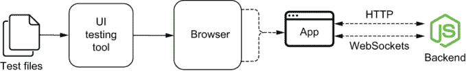
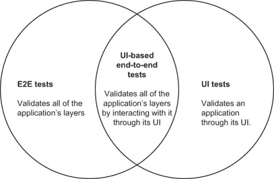
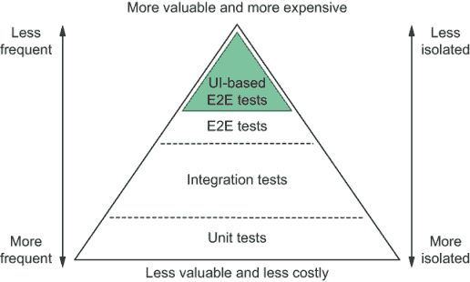
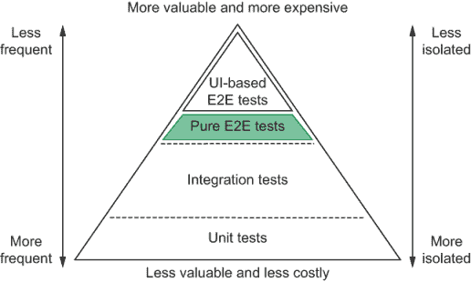
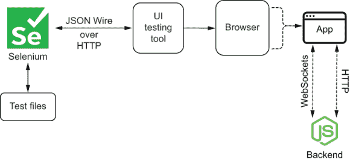
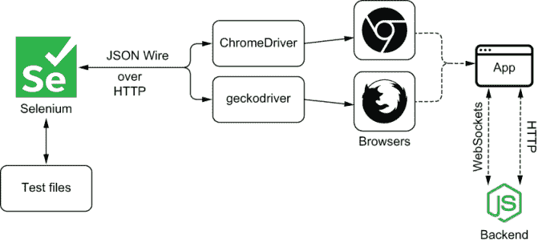
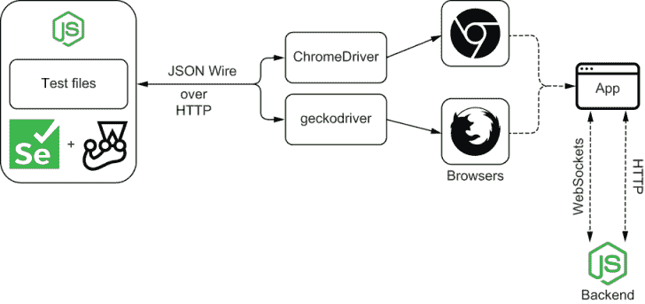
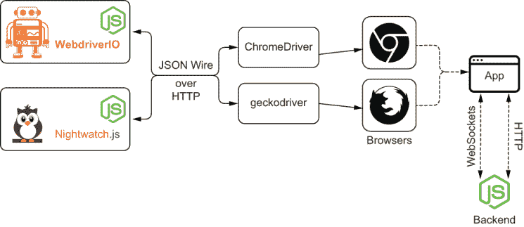
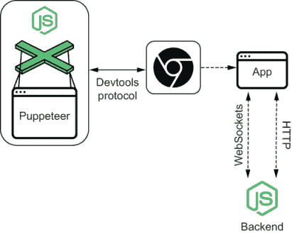
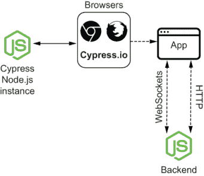

# 10. 基于 UI 的端到端测试

本章涵盖

+   UI 和端到端测试

+   何时编写每种类型的测试

+   端到端测试的商业影响

+   多种基于 UI 的端到端测试工具概述

优质的甜点可以给面包店带来长足的发展。卓越的客户服务、精美的装饰桌子和令人叹为观止的景色可以更进一步。

为了让顾客着迷，他们的体验必须从他们踏入的那一刻起，到他们决定离开的那一刻，希望他们愿意再次回来，都是无懈可击的。

无论糕点师制作的甜点有多好，如果他们的面包店看起来很脏，没有人会进来。

打造令人愉悦的软件需要投入与关注细节的相似程度。如果客户端用户界面中的按钮不起作用，或者它显示的信息难以阅读，那么优雅设计的 API 就毫无价值。

在本章中，你将了解基于 UI 的端到端测试，它们与其他测试类型之间的概念性差异，它们如何影响你的业务，以及编写它们的不同工具。

我将首先解释基于 UI 的端到端测试以及它们与其他测试类型的不同之处。在本节中，我将强调这些测试在测试金字塔中的位置，解释它们的成本以及它们带来的好处，以便你可以决定是否应该采用它们，并了解如何将它们融入你的开发过程中。

一旦我解释了这些测试类型之间的差异和相似之处，我将教你如何决定何时编写每种测试。我会逐一分析每种测试的优缺点，并给出每种测试类型如何带来价值的例子。

第三和最后一节将概述端到端测试工具。其中，我将介绍并比较 Selenium、Puppeteer 和 Cypress 等工具，这些工具将是下一章中我会使用的工具。通过使用图表，我将向你展示这些工具的架构和工作原理。此外，我将解释每种工具的优缺点，以便你可以为你的项目选择适当的技术。

## 10.1 什么是基于 UI 的端到端测试？

制作上乘的甜点与建立成功的面包店不同。无论你的芝士蛋糕味道有多美妙，如果你在一个杂乱无章的面包店中卖，你也不会卖出任何东西。同样，即使城镇里最漂亮的面包店也无法承受酸味十足的甜点。

为了成功，面包店老板必须确保每个产品的展示完美无瑕，它们味道美味，客户服务和面包店的装饰都达到最高标准。

同样，为了软件产品的成功，它们必须满足用户的需求，行为正确，并且具有响应性和易于理解的界面。

在本节中，我将解释端到端测试、UI 测试和基于 UI 的端到端测试之间的区别。

端到端测试有助于你确保**整个**应用程序按预期工作。正如我在第二章中解释的，这些测试的范围很大，它们产生的可靠性保证很强。这些测试是测试金字塔的顶端。

要给一个测试贴上“端到端”的标签，查看正在测试的软件是有用的。

例如，考虑第四章和第五章中使用的应用程序的测试。当你将正在测试的软件视为库存管理后端时，通过发送 HTTP 请求验证此后端的测试是端到端测试。

另一方面，如果你认为正在测试的软件是面包店操作员使用的网络客户端，那么其端到端测试就是点击按钮、填写输入、提交表单和读取页面内容的测试。

现在，如果你认为正在测试的软件是包括其后端**以及**前端的整个库存管理应用程序，那么我之前提到的测试**并不**是“端到端”测试，因为它们**没有**覆盖整个正在测试的软件。

对整个应用程序进行的端到端测试将使用浏览器通过其网络客户端与应用程序交互，允许 HTTP 请求到达后端，并期望在服务器响应后页面显示正确的内容。以这种方式测试库存管理应用程序涵盖了运行它所涉及的软件的所有部分，如图 10.1 所示。

图 10.1 整个应用程序的端到端测试通过与其通过浏览器交互来覆盖其堆栈的所有部分。

用户界面测试与端到端测试的不同之处在于，它们覆盖的是应用程序的 UI，**不一定**是其所有功能范围或完整的软件栈。

例如，对第六章中前端应用程序的用户界面测试可能仅涉及使用浏览器来检查它是否显示正确的内容。

即使是我之前提到的端到端测试——通过 UI 与整个应用程序交互的测试——也是 UI 测试。我会将这个测试视为 UI 测试，因为它使用客户端的用户界面作为其操作的入口点，并将其作为断言目标。

或者，用户界面测试可以使用存根完全替换后端，并仅关注应用程序的界面元素。这样的测试将**仅**是 UI 测试。

重要 用户界面测试和端到端测试不是相互排斥的分类。一个测试可以是 UI 测试**并且**是端到端测试，或者只是其中之一。

我将基于 UI 的端到端测试称为**通过与应用程序通过其 UI 交互来覆盖整个应用程序软件栈的测试**。你可以在图 10.2 中看到这些测试类型是如何重叠的。

图 10.2 端到端测试验证应用程序的所有层。UI 测试通过 UI 验证应用程序。基于 UI 的端到端测试位于这两种测试的交叉点，因为它们通过与应用程序交互来验证应用程序的所有层。

## 10.2 何时编写每种类型的测试

当决定是否以及何时编写纯端到端测试、纯 UI 测试或基于 UI 的端到端测试时，我建议读者遵循测试金字塔的原则。

要遵循这些原则，你必须能够确定每种这类测试适合的位置，这正是我在本小节中要教你的。

### 10.2.1 基于 UI 的端到端测试

基于 UI 的端到端测试涉及你的应用程序所依赖的整个软件栈。它位于测试金字塔的最顶层，因为它具有最广泛的范围，并产生最可靠的保证。

即使在“端到端”测试类别中，覆盖整个系统的 UI 测试也高于 RESTful API 的端到端测试，如图 10.3 所示。

图 10.3 在测试金字塔的端到端测试部分，基于 UI 的端到端测试位于最顶层。

它与你的应用程序*完全一样*地交互：通过在真实浏览器中与你的页面元素交互。因为这些交互依赖于客户端发送适当的请求和服务器提供适当的响应，它涵盖了你的前端*和*后端。

例如，考虑第六章中库存管理应用程序的基于 UI 的端到端测试。

通过填充应用程序的输入，提交表单，并检查项目列表，此测试验证前端表单是否发送了预期的请求，服务器是否正确响应，以及客户端在收到服务器的响应后是否充分更新了库存。

通过单个测试，你能够可靠地覆盖应用程序的大部分内容。因此，你需要比其他类型的测试更少的基于 UI 的端到端测试。

由于这些测试编写和执行通常需要更多时间，因此明智的做法是在开发新功能时避免多次更新它们。因此，我建议读者在实现**完整**的功能块之后编写这些类型的测试。

注意：在下一章中，我将在“端到端测试的最佳实践”和“处理不可靠性”部分详细说明为什么这些测试编写和维护可能很耗时。

要决定在什么情况下你应该编写基于 UI 的端到端测试，你必须仔细考虑正在测试的功能有多关键，手动验证它有多费时，以及自动化测试它将花费多少成本。

+   正在测试的功能有多关键

+   手动验证该功能需要多少工作量

+   编写自动化测试将花费多少成本

一个功能越关键，你需要手动测试它的时间越多，编写基于 UI 的端到端测试就越重要。

例如，如果你需要测试当用户同时添加项目时“撤销”按钮的行为，你至少需要打开两个客户端，在两个客户端上插入项目，然后尝试在这些不同的客户端中按不同的顺序点击“撤销”按钮。这种测试耗时且因为步骤繁多，也容易出错。

此外，由于如果这个按钮表现不佳，后果可能极其严重，因此，严格验证这个功能是至关重要的。

在这种情况下，鉴于这个功能的重要性，你不得不频繁对其进行测试，因此，你将不得不投入大量时间进行手动劳动。

如果你有一个基于 UI 的端到端测试，你可以将测试委托给机器，它会更快地完成，并且永远不会忘记任何步骤。

另一方面，如果你有一个小而无关紧要的功能，例如清除表单内容的重置按钮，你不必一定投入时间编写基于 UI 的端到端测试。

对于这类功能，使用 `react-testing-library` 编写的测试可以提供几乎同样可靠的保证，并且实施和执行所需的时间要少得多。

开发人员和 QA 工程师都可以编写基于 UI 的端到端测试。在更精简的团队中，这些团队采用更敏捷的软件开发方法，软件工程师将自行编写这些测试，并将编写这些测试所需的时间纳入他们的估算中。

当 QA 团队可用时，QA 工程师可以编写针对除生产环境以外的环境的基于 UI 的端到端测试。通过自动化重复性测试，他们可以执行更多主动工作，并有更多时间改进自己的流程和进行探索性测试。

### 10.2.2 纯端到端测试

在测试金字塔中，纯端到端测试位于基于 UI 的端到端测试之下，如图 10.4 所示。它们并不完全像用户那样测试你的软件，但它们可以几乎同样可靠，并且编写起来要快得多。

图 10.4 纯端到端测试位于基于 UI 的端到端测试之下。

与基于 UI 的端到端测试不同，纯端到端测试可以集成到你的开发过程中，并在你编写代码时显著缩短你的反馈循环。这些测试提供了可靠的质量保证，并覆盖了你代码的大部分内容。

此外，当测试没有图形用户界面的软件，如 RESTful API 或可分发软件包时，无法编写 UI 测试。因此，端到端测试提供了你可以拥有的最强可靠性保证。

你应该在编写代码的同时编写端到端测试。这些测试应该从消费者的角度验证你的代码。例如，当你测试第四章中的后端时，你的端到端测试通过发送 HTTP 请求并检查服务器的响应和数据库的内容来验证你的路由。

当编写端到端测试时，开发者应该注意测试之间的重叠程度，并仔细调整测试套件，以减少随着软件的增长而带来的维护负担，保持测试金字塔的平衡。

因为编写这类测试需要直接访问代码，所以它们必须由开发者编写，而不是质量保证工程师。

### 10.2.3 纯 UI 测试

UI 测试可以分为两种类型：它们可以通过真实浏览器或测试框架（如 Jest）来验证 UI。

如果你字面理解“UI 测试”这个术语，那么你可以将使用`react-testing-library`编写的测试视为 UI 测试。多亏了 JSDOM，它们可以通过派发类似浏览器的事件与你的组件交互，并通过在 DOM 中查找元素来验证你的应用程序。

尽管如此，由于这些测试使用 JSDOM 而不是真实浏览器运行时环境，它们并不*完全*复制应用程序在浏览器中运行时发生的情况。

在测试金字塔中，运行在浏览器中的 UI 测试位于运行在测试框架内的 UI 测试之上。在真实浏览器中运行的测试可以更准确地复制用户交互，并涉及更少的测试替身。然而，它们运行所需的时间更长，编写起来也更复杂。

考虑到在测试框架中运行的 UI 测试编写速度快，并且它们产生的保证几乎同样可靠，我建议你大多数时候选择它们。

例如，想想你需要在浏览器中运行第六章中编写的测试需要做什么。你将不得不与真实浏览器接口，并处理所有其复杂性，比如等待页面加载和与其原生 API 交互。除了使测试变得更加复杂外，完成测试所需的时间也会大大增加。

由于在测试框架中运行的 UI 测试编写速度快，且提供可靠的保证，你可以在开发功能的同时编写它们。鉴于这些测试通常很小，将它们包含在测试驱动的工作流程中也很简单。

我建议仅在需要使用 JSDOM 无法准确模拟的浏览器特定功能或进行视觉回归测试（我们将在本章后面讨论）时，才编写仅在浏览器中运行的纯 UI 测试。

大多数情况下，UI 测试必须由开发者编写，而不是质量保证工程师，因为它们依赖于直接访问被测试单元的接口或为与你的客户交互的应用程序编写测试替身。

当与其他软件组件的交互对测试无关时，如果 QA 工程师认为合适，他们可以承担这项责任。

### 10.2.4 关于验收测试和本章标题的说明

在软件行业，人们经常不精确地使用诸如*端到端测试*、*UI 测试*和*基于 UI 的端到端测试*等术语。

例如，我经常看到人们将任何通过浏览器与应用程序交互的测试称为“端到端测试”。

即使那个定义是正确的，因为这些测试的范围是整个被测试的应用程序，我相信我们可以采用更精确的术语，就像我在本章中使用的术语一样。

由于这种不准确，我很难为这一章挑选一个名字。最初，我认为我会将其命名为“UI 测试”，但那样的话，其名称就会过于简化，因为本章并不*仅限于*测试用户界面。

我当时考虑将其命名为“验收测试”。我之所以考虑这个名字，是因为我主要从客户的角度验证需求，并检查应用程序是否满足客户的需求。

将其命名为“验收测试”的问题在于，它可能会误导读者认为我会完全忽略检查技术要求。这个名字也可能最终变得过于简化。

将本章命名为“基于 UI 的端到端测试”告知读者，我将在本章中涵盖更广泛的技术和技巧。

我认为这个名字很理想，因为本章涵盖了与整个应用程序交互的测试，从端到端，通过其图形用户界面，其中大部分是验收测试。

本章与之前涵盖端到端测试的章节之间的区别在于，本章侧重于测试你的整个软件栈，而不仅仅是单个软件组件。

由于这些测试处于可能的最大集成级别，在考虑测试金字塔时，即使在“端到端”层内，它们也处于最顶层。

## 10.3 端到端测试工具概述

随着路易斯生意的扩张，他越来越难以同时监督面包店的装饰、监督客户服务并烘焙令人愉悦的甜点。因为他深知自己的天赋最好用在厨房而不是办公室，路易斯决定雇佣一位经理来监督整个业务。

即使面包店的新的经理无法做出像路易斯那样好的芝士蛋糕，但她足够多才多艺，能够识别出优秀的甜点，并保证业务运营顺利。

在本节中，我将介绍对软件来说就像路易斯的新经理对面包店一样重要的工具。

我将在这个部分中展示的工具不是直接与你的代码接口专业化，而是通过用户界面与你的软件交互。它们测试你的软件作为一个整体，并且能够对它如何工作的更广泛方面进行断言。

例如，这些工具可以帮助你填写输入，提交表单，并检查浏览器是否显示了正确的结果，而不是调用一个函数并期望其输出与特定值匹配。

在这种情况下，即使你使用的工具不一定需要了解你的服务器，它也要求服务器提供正确的响应，以便客户端能够适当地更新。即使这种松散耦合的测试对你的软件堆栈的每个具体部分了解不多，但它可以评估所有这些部分，就像路易斯的新经理一样。

我将从这个部分开始，先谈谈 Selenium，这是目前最古老且最广为人知的端到端测试工具之一。我将介绍 Selenium 是什么，它是如何工作的，你如何从中受益，以及它最关键和最常见的问题。

通过揭示 Selenium 的问题，你将更容易理解其他测试工具如何尝试解决这些问题以及它们必须做出的权衡。

在谈论 Selenium 之后，我将介绍 Puppeteer 和 Cypress，它们是目前这个领域中最受欢迎的两个工具。

当我介绍这些工具时，除了介绍它们的优缺点外，我还会探讨 Selenium 与它们的对比。

由于我在本章和下一章中将要解释的原因，Cypress 是我个人的首选工具，因此我选择使用它来编写几乎所有即将到来的示例，并且在这个部分中我将重点关注这个工具。

### 10.3.1 Selenium

Selenium 是一个常用于通过真实浏览器测试 Web 应用程序的浏览器自动化框架。它可以打开网站，点击元素，并读取页面内容，以便你可以与应用程序交互并执行断言。Selenium 是本节中你将看到的基于浏览器的端到端测试工具的先驱。

注意：你可以在[`www.selenium.dev/documentation`](https://www.selenium.dev/documentation)找到 Selenium 的完整文档。

要了解为什么 Selenium 有用，可以将它与第六章中为 Web 应用程序编写的测试进行比较。

在那些测试中，你将你的应用程序挂载到替代 DOM 实现 JSDOM 上。然后，你使用 JSDOM 对原生 API 的纯 JavaScript 实现来派发事件和检查元素。

JSDOM 非常适合在开发过程中编写测试。因为它允许你摆脱对真实浏览器实例的需求，JSDOM 简化了测试环境的设置，并使你的测试更快、更轻量。

使用 JSDOM 的问题在于它可能并不总是准确地反映真实浏览器的行为。JSDOM 是按照规范实现浏览器 API 的*尝试*。

尽管 JSDOM 在几乎所有情况下都做得很好，但它仍然是一个不完美的浏览器环境的复制品。此外，即使是浏览器本身也不总是充分遵循 API 规范。因此，即使 JSDOM 正确实现了这些 API，浏览器也可能不会。

例如，假设你实现了一个依赖于 API 的功能，该 API 在 Chrome 和 Firefox 中的行为不同。在这种情况下，如果 JSDOM 的实现是正确的，你的测试将会通过。然而，如果 Chrome 和 Firefox 都没有正确实现该规范，你的功能在任一浏览器上都不会工作。

由于 Selenium 通过真实的浏览器实例运行其测试，它是更接近用户如何与你的软件交互的工具。因此，它是提供最可靠保证的工具。

如果 Selenium 用于运行你的测试的浏览器没有实现特定的 API 或没有充分遵循其规范，你的测试*将会*失败。

除了是最准确复制用户行为的方式之外，Selenium 还为你提供了浏览器功能的全面范围。

使用 Selenium 时，你不仅可以将节点附加到“文档”上，还可以自由地在页面之间导航，限制网络速度，录制视频和截图。

例如，如果你有一个测试保证所有产品的图片在 1 秒后可见，即使在网络连接不稳定的情况下，你需要使用一个真实的浏览器。这种技术将使你的测试尽可能接近用户的测试环境。

Selenium 的工作原理

Selenium 通过称为*Webdrivers*的程序与浏览器交互。这些 Webdrivers 负责接收 Selenium 的命令并在真实的浏览器内执行必要的操作。

例如，当你告诉 Selenium 点击一个元素时，它将向你所选择的 Webdriver 发送一个“click”命令。因为这个 Webdriver 能够控制一个真实的浏览器，它将使浏览器点击选定的元素。

为了与 Webdriver 通信，Selenium 使用一种称为*JSON Wire*的协议。该协议指定了一组 HTTP 路由，用于处理在浏览器内执行的不同操作。当运行 Webdriver 时，它将管理一个实现这些路由的服务器。

例如，如果你告诉 Selenium 点击一个元素，它将向 Webdriver 的`/session/:sessionId/element/:id/click`路由发送一个`POST`请求。为了获取一个元素的文本，它将向`/session/:sessionId/element/:id/text`发送一个`GET`请求。这种通信在图 10.5 中得到了说明。

图 10.5 Selenium 向控制浏览器的 Webdrivers 发送 HTTP 请求。这些请求采用 JSON Wire 协议。

为了与浏览器通信，每个 Webdriver 都使用目标浏览器的远程控制 API。由于不同的浏览器有不同的远程控制 API，每个浏览器都需要特定的驱动程序。要驱动 Chrome，你将使用 `ChromeDriver`。要驱动 Firefox，你需要 `Geckodriver`，如图 10.6 所示。

图 10.6 不同的 Web 驱动控制不同的浏览器。

当你使用 Selenium 的 JavaScript 库时，它所做的只是实现将发送到你所选择的 Webdriver 的请求，这些请求遵循 JSON Wire 协议。

不使用 Selenium 使用 Webdriver 的接口

正如我之前提到的，**尽管 Selenium 主要用于测试 Web 应用程序，但实际上它是一个浏览器自动化库**。因此，它在 NPM 上以 `selenium-webdriver` 命名的 JavaScript 库并不包含测试运行器或断言库。

注意：你可以在 [`www.selenium.dev/selenium/docs/api/javascript`](https://www.selenium.dev/selenium/docs/api/javascript) 找到 `selenium-webdriver` 包的文档。

要使用 Selenium 编写测试，你需要使用像 Jest 这样的单独的测试框架，如图 10.7 所示。或者，你也可以使用 Mocha，它是一个**专用的**测试运行器，或者 Chai，它是一个**专用的**断言库。

图 10.7 如果你想要使用 Selenium 进行测试，你必须与一个测试框架，如 Jest，配合使用。

由于 Selenium 不附带任何测试工具，因此设置必要的环境以开始使用它来测试应用程序可能会很麻烦。

为了避免自己进行此设置过程，你可以使用像 Nightwatch.js 这样的库，其文档可在 [`nightwatchjs.org`](https://nightwatchjs.org) 找到，或者关于 WebdriverIO 的更多信息可在 [`webdriver.io`](https://webdriver.io) 找到。

这些工具，就像 Selenium 一样，可以与多个 Webdriver 接口，因此能够控制真实浏览器。这些库与 Selenium 的主要区别在于它们附带测试工具。

除了捆绑测试工具之外，这些其他库还关注可扩展性，并提供不同的 API，以满足以测试为重点的受众（图 10.8）。

图 10.8 不需要自己搭建测试基础设施，你可以使用 Nightwatch.js 或 WebdriverIO 等库，它们包含了编写测试所需的所有工具。

选择 Selenium 的时候

与其他浏览器测试框架和自动化工具相比，Selenium、Nightwatch.js 和 WebdriverIO 等工具最显著的优势在于其控制多种浏览器的能力。

由于其高度解耦的架构，它支持与不同类型的驱动程序接口以控制众多不同的浏览器，因此支持所有可用的主流浏览器。

如果你的用户群体的浏览器选择多样化，使用 Selenium 或其他利用 Webdriver 接口的库将非常有益。

通常情况下，如果我仅仅用它来编写测试，我会避免使用 Selenium 本身。在这种情况下，我通常会选择 Nightwatch.js 或 WebdriverIO。另一方面，如果你需要执行其他浏览器自动化任务，Selenium 可以是一个极佳的选择。

这些工具最显著的问题在于，它们使你编写易变的测试变得过于容易，因此你需要创建健壮的测试机制来进行确定性的验证。

注意：易变的测试是非确定性的测试。在相同的测试应用下，它们有时会失败，有时会成功。在本章的“处理易变性”部分，你将了解更多关于这些测试以及为什么你应该尝试消除它们的信息。

此外，由于这些工具通过 HTTP 请求控制真实浏览器，它们通常比完全在浏览器内运行的 Cypress 等替代方案要慢。

除了可能的速度较慢之外，配置和调试使用这些工具编写的测试通常具有挑战性。没有内置的工具来概述不同的测试用例、运行断言和监控测试执行，它们可能需要更多的时间来编写。

### 10.3.2 Puppeteer

与 Selenium 一样，Puppeteer 也不是一个专门的测试框架。相反，它是一个浏览器自动化工具。

注意：你可以在[`pptr.dev`](https://pptr.dev)找到 Puppeteer 的文档。在这个网站上，你还可以找到 Puppeteer 的完整 API 文档链接。

与 Selenium 不同，如图 10.9 所示的 Puppeteer 只能控制 Chrome 和 Chromium。为了做到这一点，它使用 Chrome DevTools 协议，该协议允许其他程序与浏览器的功能进行交互。

注意：在撰写本文时，Firefox 的支持仍处于实验阶段。

由于 Puppeteer 涉及的软件组件比 Selenium 和其他基于 Webdriver 的工具要少，因此它更加精简。与这些工具相比，Puppeteer 更容易设置和调试。

尽管如此，因为它仍然是一个专门的浏览器自动化工具，所以它没有附带测试框架或库来创建测试套件和执行断言。

图 10.9 Puppeteer 通过其 DevTools 协议直接控制 Chrome 和 Chromium。

如果你想要使用 Puppeteer 来运行测试，你必须使用单独的测试库，如 Jest 或 Jest Puppeteer。后者自带了使用 Puppeteer 本身运行测试所需的所有支持，包括额外的断言。

Puppeteer 相较于 Selenium 的另一个优势是其事件驱动架构，这消除了固定时间延迟或编写自己的重试机制的需求。默认情况下，使用 Puppeteer 编写的测试往往更加健壮。

此外，它的可调试性比 Selenium 的要好得多。使用 Puppeteer，你可以轻松地使用 Chrome 的开发者工具来解决错误，并使用其“慢动作”模式以这种方式回放测试步骤，这样你可以精确地了解浏览器正在做什么。

何时选择 Puppeteer

由于使用 Puppeteer 编写健壮的测试要容易得多，因此它们所需的时间更少，因此成本也更低。你调试它们的时间也更少。

如果你只需要支持 Chrome 和 Chromium，由于 Puppeteer 的简单性和可调试性，它比 Selenium 和其他基于 Webdriver 的工具是一个更好的替代品。

除了这些优势之外，由于 Puppeteer 不专注于支持众多浏览器，它可以为你提供更多功能和更详细的 API。

它只关注 Chrome 和 Chromium 的缺点是，如果你*必须*支持其他浏览器，甚至都不应该考虑它。除非你可以使用不同的工具来自动化将在不同浏览器中运行的测试，否则 Selenium 或其他基于 Webdriver 的工具是一个更好的选择。

注意：我将在本章倒数第二节“在多个浏览器上运行测试”中深入探讨支持多个浏览器的问题。

考虑到 Puppeteer 不附带特定的测试工具，如果你不愿意自己设置测试环境或使用像 `jest-puppeteer` 这样的包，它可能也不是你项目的最佳选择。

### 10.3.3 Cypress

如图 10.10 所示，Cypress 是一个测试工具，它直接与浏览器的远程控制 API 交互，以查找元素并执行操作。

注意：Cypress 的完整文档可在 [`docs.cypress.io`](https://docs.cypress.io) 找到。它写得非常好，包含许多示例和长篇文章。如果你正在考虑采用 Cypress，或者已经这样做了，我强烈建议你仔细阅读他们的文档。

这种直接通信使测试更快，并减少了设置测试环境的复杂性，因为它减少了启动编写测试所需的软件数量。

图 10.10 Cypress 在浏览器自身运行的测试中启动一个 Node.js 进程，并与这些测试进行通信。

除了使编写测试更容易、更快之外，这种架构还允许你利用 Cypress 背后的 Node.js 进程来执行诸如管理文件、发送请求和访问数据库等任务。

此外，由于 **Cypress 是一个专门为测试而创建的工具**，它比只关注浏览器自动化的工具如 Selenium 和 Puppeteer 提供了众多优势。

这些优势之一是 Cypress 默认就包含了大量的测试实用工具。与 Selenium 和 Puppeteer 不同，当你使用它时，你不需要自己设置整个测试环境。

当使用 Cypress 时，你不需要挑选多个包来组织你的测试、运行断言或创建测试替身。相反，这些工具都打包在 Cypress 中。**安装 Cypress 是你开始编写测试所需做的全部事情**。

Cypress 的 API 设计时也考虑了测试。你在编写测试时可能会遇到的情况已经内置到 Cypress 的方法中。这些 API 使测试更简单、更简洁、更易读。

例如，想象一下，你想要点击一个在你访问应用程序后仅几秒钟出现的按钮。

在那种情况下，浏览器自动化工具将需要你编写一行代码，明确告诉你的测试在尝试点击之前等待按钮可见。当使用这些类型的工具时，如果你的测试没有找到必须点击的元素，它们将立即失败。

与之相反，Cypress 不需要你编写显式代码来等待按钮出现。它将默认尝试找到它想要点击的按钮，直到达到超时。Cypress 只在找到按钮后才会尝试执行点击操作。

在 Cypress 的众多出色测试特性中，另一个有用的特性是“时间旅行”。当 Cypress 运行测试时，它会记录执行过程中的应用程序快照。在执行测试后，你可以回顾每个步骤，并验证你的应用程序在任何时间点的样子。

能够看到你的应用程序如何对测试的动作做出反应，让你能够更快地调试它，并确保测试正在执行你想要它执行的操作。

例如，如果你有一个填写表单、提交并期望页面更新的测试，你可以使用测试的动作日志来查看你的应用程序在每个这些步骤中的样子。

通过悬停在每个动作上，你将能够可视化测试填充任何字段之前、进入每个字段数据之后以及提交表单之后的你的应用程序状态。

由于你可以在真实浏览器中运行 Cypress 测试，随着你遍历应用程序的状态，你可以使用浏览器开发者工具详细检查它们。

如果你的测试找不到要填充的输入，例如，你可以回到过去检查它是否存在于页面上，以及你是否使用了正确的选择器来找到它。

除了检查元素外，你还可以使用浏览器的调试器逐步执行你的应用程序代码，了解它如何响应测试的动作。

当测试检测到你的应用程序中的错误时，你可以在应用程序的代码中添加断点，逐步执行其行，直到你理解错误的根本原因。

### 10.3.4 何时选择 Cypress

Cypress 相比其他工具的主要优势在于它是一个 *测试* 工具，而不是更通用的浏览器自动化软件。如果你在寻找一个 *专门* 用于编写测试的工具，我几乎总是推荐 Cypress。

选择 Cypress 可以节省设置测试环境的时间。使用它时，你不需要安装和配置其他包来组织测试、运行断言和创建测试替身。

由于 Cypress 包含了所有必要的测试工具，你可以更快地开始编写测试并从中获得价值。与 Selenium 和 Puppeteer 不同，你不需要设置多个软件或创建自己的测试基础设施。

除了能够更早开始编写测试之外，Cypress 的调试功能还使你能够更快地编写测试。

尤其是能够穿越时间并检查应用在任何时间点的状态，这将使检测导致测试失败的原因变得更加容易。

快速检测失败的根本原因使开发者能够在更短的时间内实施修复，从而减少了编写测试的成本。

除了这些调试功能之外，Cypress 的简单且健壮的 API 也是使其能够更快编写测试的另一个因素，这些 API 内置了可重试性。

与 Puppeteer 和 Selenium 不同，你不需要明确配置测试以等待特定元素出现或重试失败的断言，你的测试将*自动*执行这些操作，因此将更加健壮、易于理解且简洁。

最后，在选择 Cypress 作为测试工具时，需要考虑的两个其他特点是其出色的文档和易于理解的 UI。

这些特性改善了开发者的体验，使他们更愿意更频繁地编写更好的测试，从而创建更可靠的保证。

我唯一会建议不选择 Cypress 的场景是当你必须执行除了专门运行测试之外的任务时，或者当你*必须*支持除了 Edge、Chrome 和 Firefox 之外的浏览器——这是 Cypress 支持的唯一三个网络浏览器。

我认为 Cypress 是本章中所有工具中最具成本效益的，我相信它将适合你将要处理的多数项目。因此，它是我在下一章示例中选择的工具。

## 摘要

+   基于 UI 的端到端测试将应用界面作为其操作的入口点，并覆盖整个应用的软件栈。

+   测试一个功能越关键和具有挑战性，拥有基于 UI 的端到端测试就越有帮助。当你有难以测试的关键功能时，基于 UI 的端到端测试可以加速验证应用的过程，并使其更加可靠。这些测试不会忘记任何步骤，并且执行速度比人类快得多。

+   当基于 UI 的端到端测试编写过于耗时，且被测试的单元不是那么关键时，你应该考虑编写其他类型的测试，这些测试可以提供类似的可靠保证。例如，如果你正在测试一个 Web 服务器，你可以专门为其路由编写端到端测试。如果你正在测试一个前端应用程序，如果你有一个 React 应用程序，你可以使用`dom-testing-library`或`react-testing`库。

+   要编写基于 UI 的端到端测试，你可以将浏览器自动化工具如 Selenium 或 Puppeteer 与你的首选测试库集成。或者，你也可以选择像 Cypress、Nightwatch.js 或 WebdriverIO 这样的解决方案，这些解决方案捆绑了测试实用工具，这样你就不需要自己设置测试基础设施。

+   Selenium 通过一个名为 JSON Wire 的协议与浏览器交互，该协议指定了一系列 HTTP 请求，用于执行浏览器必须执行的不同操作。

+   与 Selenium 不同，Cypress 和 Puppeteer 可以直接控制浏览器实例。这种能力使得这些工具在测试方面更加灵活，使得测试编写更快，但减少了这些测试工具可以与之交互的浏览器数量。

+   在这本书中，我将重点关注 Cypress 工具。我选择它是因为它的灵活性、设置简单以及出色的调试功能，包括时间旅行、查看运行中的测试以及记录它们的能力。大多数时候，如果你不打算支持像 Internet Explorer 这样的浏览器，我会推荐这个工具。
