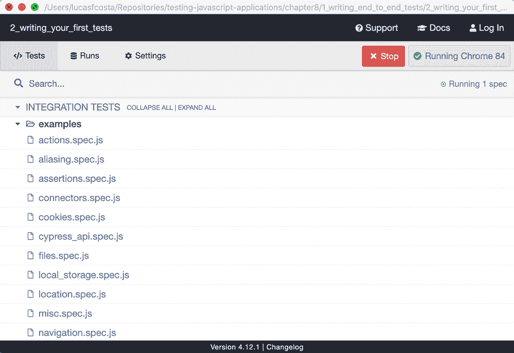
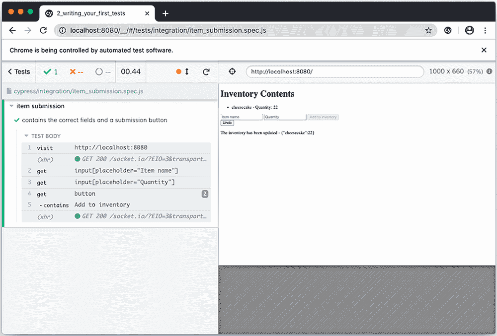
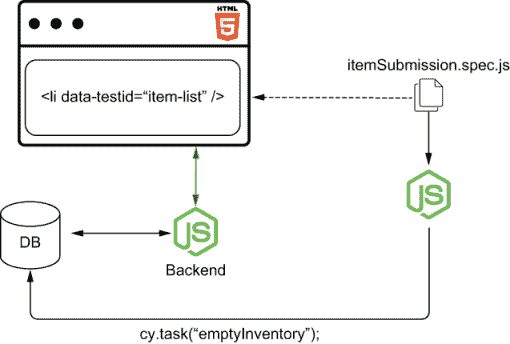
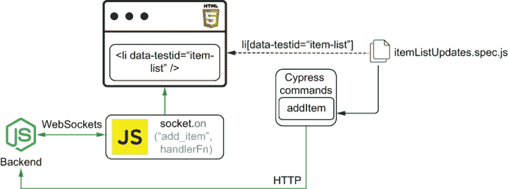
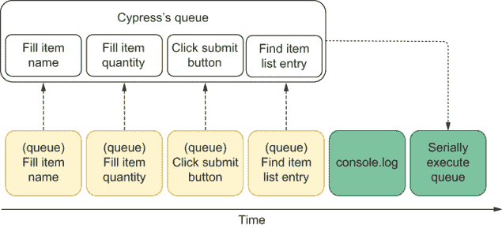
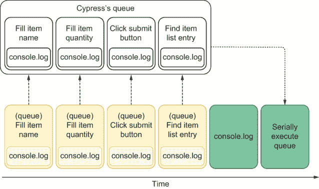
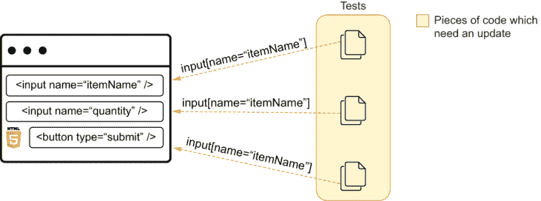
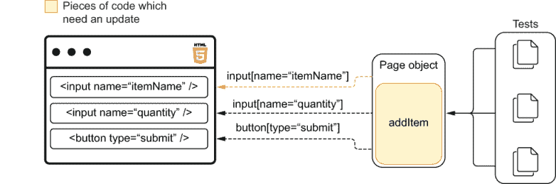
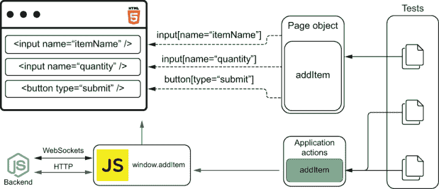

# 11 编写基于 UI 的端到端测试

本章涵盖了

+   编写端到端 UI 测试

+   消除不稳定性

+   端到端 UI 测试的最佳实践

+   在多个浏览器上运行测试

+   执行视觉回归测试

无论你读过多少商业书籍，还是与多少成功的糕点师交谈，要开设自己的业务，你必须卷起袖子付出努力。了解“良好原则”是有用的，但如果没有自己烘焙并与客户交谈，你就无法成功。

在测试方面，了解你可以使用的不同工具以及理解它们的权衡是有帮助的，但如果没有自己编写测试，你就不会知道如何在更短的时间内构建可靠的软件。

在本章中，你们将学习如何通过测试第六章中构建的应用程序来编写基于 UI 的端到端测试。在整个章节中，我将使用 Cypress 来演示如何测试该应用程序以及你可以使用哪些高级技术来提高测试的有效性。

注意：尽管我在本章的代码示例中使用了 Cypress，但我会教给你们必要的原则，以便能够适应和应用这些模式和最佳实践，无论你选择什么工具。

你可以在本书的 GitHub 仓库中找到这些测试的代码以及受测试的服务器和客户端的代码：[`github.com/lucasfcosta/testing-javascript-applications`](https://github.com/lucasfcosta/testing-javascript-applications)。

本章的第一部分演示了如何使用 Cypress 编写实际的基于 UI 的端到端测试。在本节中，我将指导你们编写第六章中构建的应用程序的测试。你们将学习如何通过直接与 UI 交互来测试功能，以及如何检查这些交互对客户端和服务器的影响。

在第二部分，我将介绍最佳实践，使你编写的测试更加健壮，因此成本更低，同时保持其严谨性。为了教你们这一点，我将展示特定测试可能会失败的场景以及如何重构这些测试以使其更加健壮。

在你理解了如何以可维护的方式编写有效的 Cypress 测试之后，你将学习如何消除不稳定的测试，这些测试在相同的代码下有时会失败，有时会成功。

你们将理解为什么避免落入“不稳定”类别的测试至关重要，以及为什么不稳定是处理端到端测试时最常见的问题之一，尤其是在这些测试涉及与图形用户界面的交互时。

为了教你们如何避免不稳定的测试，我将实现一些容易出错的测试，提供多种替代方案来使这些测试变得确定，并解释每种策略的优缺点。

本章的倒数第二部分是关于在多个浏览器中运行测试。在本节中，我将解释你可以采用哪些策略在各个浏览器中运行测试，以及你需要哪些工具。此外，你将了解为什么这样做很重要，以及根据你构建的内容和方式选择哪种策略。

最后，我将讨论视觉回归测试。通过为第六章中构建的应用程序创建视觉回归测试，我将教你如何确保你的产品在每次发布时都应看起来如何。

在本节的最后一部分，我将演示如何使用 Percy 编写视觉回归测试，并解释这种测试的优势。除了教授如何将这些测试集成到你的工作流程中，我还会解释它们如何使你的发布过程更安全，并促进不同利益相关者之间的协作。在本节中，你将了解如何将这些工具集成到你的工作流程中，以便将更改安全快速地发布到生产环境中。

## 11.1 你的第一个基于 UI 的端到端测试

面点师以其制作精美甜点的能力而闻名，而不是他们的豪华烤箱、高端厨具或一千种不同的裱花袋喷嘴。

在本节中，你将编写你的第一个完全集成的端到端测试。你将通过使用 Cypress 测试第六章中使用的服务器和客户端来学习如何编写这些测试。

在整个过程中，我将演示如何测试功能，并阐明完全集成的 UI 测试与之前编写的测试之间的差异和相似之处。

注意：尽管本书的示例使用了 Cypress，但我将要教你的端到端测试原则，无论你选择什么工具都是有效的。

### 11.1.1 设置测试环境

在本节的第一部分，你将学习如何使用 Cypress 测试你在第六章中构建的应用程序。我将解释如何安装和配置 Cypress，以及如何与你的应用程序交互并执行断言。

注意：你可以在本书的 GitHub 仓库中找到这些测试的代码，以及要测试的服务器 *和* 客户端代码，网址为 [`github.com/lucasfcosta/testing-javascript-applications`](https://github.com/lucasfcosta/testing-javascript-applications)。

在安装 Cypress 之前，创建一个新文件夹，你将把你的测试放在这个文件夹中。在这个文件夹中，你将执行 `npm init` 命令来生成一个 `package.json` 文件。

提示：我喜欢为我的测试创建一个单独的项目，因为它们通常涵盖多个软件组件。

或者，如果你的产品应用程序位于同一个文件夹中，或者你更喜欢将测试与特定项目的文件一起管理，你可以将 Cypress 安装为该项目的开发依赖项。

如果你在一个 monorepo 中工作，我建议你在那个仓库中安装 Cypress，这样你就可以像集中代码一样集中测试。

在创建此文件夹并向其中添加 `package.json` 文件后，通过运行 `npm install --save-dev cypress` 来将 Cypress 作为开发依赖项安装。

要让 Cypress 为您的端到端测试执行脚手架，您必须通过执行 `./node_modules/.bin/cypress open` 来使用其二进制 `open` 命令。除了创建您开始编写测试所需的必要文件外，此命令还将创建一个包含测试示例的文件夹，并打开 Cypress UI。

在 Cypress UI（图 11.1）中，您可以访问之前测试的录制，检查配置选项，并选择要执行的测试以及它们将在哪个浏览器中运行。



图 11.1 显示 Cypress 示例测试的图形用户界面

提示：为了使此命令更容易记忆和快速访问，创建一个 NPM 脚本来执行它。

例如，您可以创建一个 `cypress:open` 命令来调用 `cypress open`，类似于您为运行 Jest 的测试所做的那样。

列表 11.1 package.json

```
{
  "name": "1_setting_up_cypress",
  "scripts": {
    "cypress:open": "cypress open"         ❶
  },
  "devDependencies": {
    "cypress": "⁴.12.1"
  }
}
```

❶ 调用 Cypress 的二进制打开命令

创建此脚本后，您可以通过运行 `npm run cypress:open` 来打开 Cypress UI，而不是输入项目的完整路径。

现在，只需通过点击其中一个来尝试执行一个示例。运行这些示例测试将让您了解一旦创建测试后，您的测试将如何运行。

当这些示例运行时，在左侧，您将看到一个操作日志，您可以使用它来检查您的应用程序在测试操作发生过程中经历的不同状态。

在尝试了 Cypress 的示例之后，您可以自由地删除 `examples` 文件夹。

提示：要运行所有 Cypress 测试，您可以使用 `cypress run` 命令而不是 `cypress open`。

就像您使用 `open` 命令所做的那样，您可以为 `run` 添加一个新的 NPM 脚本，使其更容易记忆和执行。

列表 11.2 package.json

```
{
  "name": "1_setting_up_cypress",
  "scripts": {
    "cypress:open": "cypress open",       ❶
    "cypress:run": "cypress run"          ❷
  },
  "devDependencies": {
    "cypress": "⁴.12.1"
  }
}
```

❶ 调用 Cypress 的二进制打开命令

❷ 调用 Cypress 的二进制运行命令

### 11.1.2 编写您的第一个测试

现在您已经知道了如何执行测试，并且 Cypress 已经为您创建了一个初始文件结构，您将为您在第六章中构建的应用程序编写第一个测试。

注意：本书 GitHub 仓库 [`github.com/lucasfcosta/testing-javascript-applications`](https://github.com/lucasfcosta/testing-javascript-applications) 中的 `chapter11` 文件夹下提供了测试中的 `client` 和 `server` 应用程序。在该文件夹中，您还将找到本章编写的所有测试。

要运行这些应用程序中的每一个，您必须使用 `npm install` 安装它们的依赖项。

在安装每个项目的依赖项后，您需要通过运行 `npm run migrate:dev` 来确保您的数据库模式是最新的。只有在这种情况下，您才能运行服务器，默认情况下它将绑定到端口 `3000`。在运行客户端之前，您必须使用 `npm run build` 来构建其包。

要启动每个应用程序，请在各自的文件夹中运行 `npm start`。

在编写第一个测试之前，启动您的客户端和服务器，并在 `http:/./localhost:8080` 上与您的应用程序进行交互。这一步是必不可少的，因为为了 Cypress 能够与您的应用程序交互，您必须确保它可访问。

最后，是时候编写您的第一个测试了。这个测试将访问 `http://localhost:8000` 并检查提交新物品的表单是否包含正确的字段和提交按钮。

首先，在 `integration` 文件夹内创建一个名为 `itemSubmission.spec.js` 的文件。这个新文件将包含物品提交表单的测试。

在 `itemSubmission.spec.js` 文件中，编写一个测试来检查物品提交表单是否包含预期的元素。这个测试将使用全局 `cy` 实例的方法。

要使 Cypress 访问 `http:/./localhost:8080`，您将使用 `cy.visit` 方法。要找到页面上的每个元素，您将使用 `cy.get`。一旦使用 `get` 定位到匹配的节点，您就可以通过调用 `contains` 来找到包含所需文本的那个元素。

提示：您可以使用 Cypress 的 `baseUrl` 配置选项，如下一列表中所示，以避免每次调用 `visit` 时都输入您应用程序的地址。

通过配置 `baseUrl`，Cypress 将在您调用 `cy.visit` 时使用它作为前缀。

列表 11.3 cypress.json

```
{
  "baseUrl": "http:/./localhost:8080"         ❶
}
```

❶ 将 http:/`.`/localhost:8080 前缀添加到传递给 cy.visit 的字符串

或者，为了查找元素，您可以直接调用 `contains` 并将其选择器作为第一个参数传递，将内部文本作为第二个参数，如下所示。

列表 11.4 itemSubmission.spec.js

```
describe("item submission", () => {
  it("contains the correct fields and a submission button", () => {
    cy.visit("http://localhost:8080");                                 ❶
    cy.get('input[placeholder="Item name"]');                          ❷
    cy.get('input[placeholder="Quantity"]');                           ❸
    cy.contains("button", "Add to inventory");                         ❹
  });
});
```

❶ 访问应用程序的页面

❷ 查找物品名称的输入框

❸ 查找物品数量的输入框

❹ 查找添加物品到库存的按钮

注意：尽管 Cypress 的测试运行器是 Mocha，而不是 Jest，但组织测试所使用的语法是相同的。

一旦您完成测试的编写，使用 `npm run cypress:open` 命令启动 Cypress，并点击 `itemSubmission.spec.js`。运行测试后，Cypress 将显示一个类似于图 11.2 的屏幕。



图 11.2 Cypress 执行检查库存管理应用程序元素的测试

提示：在 Cypress 测试中搜索元素时，您应该使用与元素本身本质相关的特征来查找它们。在这种情况下，我决定使用每个输入的占位符，例如。

如果您使用过于具体或与页面结构紧密耦合的选择器，您的测试将经常中断，因此将产生额外的维护成本。

在编写选择器时，遵循第四章和第五章中的相同指南：**避免脆弱的选择器**。

您的下一个任务将是使这个测试更加详细，通过填写每个输入框，提交表单，并检查项目列表是否包含新项目。

在找到每个输入后，你将使用 Cypress 的 `type` 方法来填写每个输入。此方法将第一个参数传递的字符串输入到元素中。

在填写每个输入后，你将调用提交按钮上的 `click` 和 `contains` 以找到内容与预期匹配的 `li`。

列表 11.5 itemSubmission.spec.js

```
describe("item submission", () => {
  it("can add items through the form", () => {
    cy.visit("http://localhost:8080");                    ❶

    cy.get('input[placeholder="Item name"]')              ❷
      .type("cheesecake");
    cy.get('input[placeholder="Quantity"]')               ❸
      .type("10");
    cy.get('button[type="submit"]')                       ❹
      .contains("Add to inventory")
      .click();

    cy.contains("li", "cheesecake - Quantity: 10");       ❺
  });
});
```

❶ 访问应用程序的页面

❷ 找到物品名称的输入，并输入“cheesecake”

❸ 找到物品数量的输入，并输入“10”

❹ 找到添加物品到库存的按钮，并点击它

❺ 找到表示库存中 cheesecake 数量的列表项

小贴士：因为如果你的测试无法找到这些元素，你的测试将失败，所以你不必明确断言每个元素都存在。默认情况下，`get` 和 `contains` 命令将断言元素存在。

你所编写的测试的问题在于它只会通过一次。在第一次运行此测试后，你的数据库中已经包含 cheesecake，因此每次后续运行中 cheesecake 的数量都将超过 10，导致测试失败。

要使此测试具有确定性，你有几个选择，如下所示：

1.  模拟服务器对获取和添加物品的响应。

1.  根据数据库中当前的内容计算应该添加的物品的预期数量。

1.  在测试之前清空数据库。

个人而言，我认为第三种方法是我会推荐的方法。

第一种方法的问题在于它没有涵盖服务器的功能。因为它模拟了获取和添加物品的服务器响应，这将导致测试只验证前端功能。

对于我自己来说，我喜欢我的端到端测试尽可能地模拟用户的操作，这就是为什么我只在测试金字塔更底部的测试中使用测试替身。

此外，第一种方法将测试耦合到应用程序用于获取和添加物品的特定路由，而不是关注用户做什么以及他们的操作结果应该是什么。

第二种方法的问题在于它的语义将取决于它是否是第一次运行。第一次运行测试时，它将在数据库中添加一行新记录并将物品附加到列表中。第二次运行时，测试将更新数据库行和现有的物品列表。本质上，这些都是不同的测试用例。

我认为第三种方法比其他方法更好，因为它保证了每次测试运行时应用程序的状态将完全相同。此外，它总是测试相同的功能，并且实现和调试都更加简单。

重要提示：就像你编写其他类型的测试一样，**你的端到端测试应该是确定的**。

要使此测试具有确定性，让我们创建一个新的函数来清空数据库的库存表。

因为这个函数包含在 Node.js 中运行的任意代码，而不是在浏览器中运行，所以它必须绑定到一个 **任务**。当你调用绑定到该函数的任务时，库存表将被截断。

在编写此函数之前，你需要使用 `npm install --save-dev knex` 安装 `knex`，以便能够连接到数据库。因为 `knex` 需要使用 `sqlite3` 包来连接到 SQLite 数据库，所以你也必须使用 `npm install --save-dev sqlite3` 来安装它。

NOTE 为了避免需要重新构建 `sqlite3` 包以与 Cypress 使用的 Electron 版本兼容，你必须配置 Cypress 使用你的系统 Node.js 可执行文件。

为了做到这一点，你需要在 `cypress.json` 中将 `nodeVersion` 设置为 `system`，如下所示。

列表 11.6 cypress.json

```
{
  "nodeVersion": "system"             ❶
}
```

❶ 配置 Cypress 使用系统的 Node.js 可执行文件

安装 `knex` 后，你需要将其配置为连接到应用程序数据库，就像你编写后端应用程序时做的那样。首先，在你的测试根文件夹中，创建一个包含连接配置的 `knexfile`。

列表 11.7 knexfile.js

```
module.exports = {
  development: {
    client: "sqlite3",                                              ❶
    // This filename depends on your SQLite database location
    connection: { filename: "../../server/dev.sqlite" },            ❷
    useNullAsDefault: true                                          ❸
  }
};
```

❶ 使用 sqlite3 作为数据库客户端

❷ 指定应用程序将存储其数据的数据库文件

❸ 使用 NULL 而不是 DEFAULT 来处理未定义的键

然后，在同一个文件夹内创建一个负责连接数据库的文件。

列表 11.8 dbConnection.js

```
const environmentName = process.env.NODE_ENV;                  ❶
const knex = require("knex")
const knexConfig = require("./knexfile")[environmentName])     ❷

const db = knex(knexConfig);

const closeConnection = () => db.destroy();                    ❸

module.exports = {
  db,
  closeConnection
};
```

❶ 获取 NODE_ENV 环境变量的值

❷ 使用分配给 environmentName 的 NODE_ENV 值来确定选择哪个数据库配置

❸ 一个关闭数据库连接的函数

TIP 当你在与你的其他应用程序相同的文件夹中安装 Cypress 时，你可以直接引入这类文件，而不是重新编写它们。此外，你也不需要重新安装应用程序已经使用的依赖项。

个人来说，我喜欢在 `cypress` 文件夹内创建一个脚本来创建指向测试应用程序的代码库的符号链接。这些链接帮助我更容易地重用其他应用程序的代码，即使我保持我的 Cypress 测试与其他项目分离。

最后，你将在 `plugins` 文件夹中创建一个名为 `dbPlugin.js` 的新文件，以绑定截断库存表的函数到任务。

列表 11.9 dbPlugin.js

```
const dbPlugin = (on, config) => {
  on(                                                      ❶
    "task",
    { emptyInventory: () => db("inventory").truncate() },
    config
  );

  return config;
};

module.exports = dbPlugin;
```

❶ 定义一个任务，用于截断应用程序数据库中的库存表

NOTE `on` 函数和 `config` 对象都是由 Cypress 传递的。`on` 函数将任务注册在作为第二个参数传递的对象中，而 `config` 包含 Cypress 的配置，供你读取或更新。

要使此任务在测试中可用，你必须将其附加到 `plugins` 文件夹内的 `index.js` 中的 Cypress。在这里，你将传递 Cypress 的 `on` 函数及其 `config` 对象给 `dbPlugin`。

列表 11.10 index.js

```
const dbPlugin = require("./dbPlugin");

module.exports = (on, config) => {
  dbPlugin(on, config);                      ❶
};
```

❶ 注册包含截断应用程序数据库中库存表任务的插件

现在，你可以将此任务附加到`itemSubmission.spec.js`文件中的`beforeEach`钩子，在每个测试之前截断`inventory`表。

列表 11.11 itemSubmission.spec.js

```
describe("item submission", () => {
  beforeEach(() => cy.task("emptyInventory"));        ❶

  it("can add items through the form", () => {
    // ...
  });
});
```

❶ 在每个测试之前截断应用程序的库存表

在这些更改之后，你的测试应该*始终*通过，因为`inventory`表将在每个测试之前被截断，如图 11.3 所示的流程图所示。



图 11.3 在每个测试之前，Cypress 将使用系统的 Node.js 可执行文件连接到数据库并截断包含库存项目的表。

要看到这个测试通过，运行 Cypress 并将`NODE_ENV`环境变量设置为`development`。通过使用`NODE_ENV=development npm run cypress:open`命令来运行 Cypress，它将连接到你的应用程序使用的相同数据库。

注意：在 Windows 上设置环境变量的语法与本书中使用的语法不同。因此，如果你使用 Windows，你需要稍微修改这些命令。

在 Windows 上，例如，打开命令应该是`set NODE_ENV= development & cypress open`。运行命令将是`set NODE_ENV= development & cypress run`。

或者，如果你想立即运行测试而不是打开 Cypress UI，你可以使用我之前提到的带有`NODE_ENV= development`的 Cypress `run`命令来运行测试。

提示：在运行 Cypress 测试时，我建议你为端到端测试使用一个单独的数据库，这样它们就不会干扰你的本地开发环境。

要做到这一点，你必须向你的`knexfile.js`添加一个新的`NODE_ENV`配置条目，并在创建和迁移数据库、启动服务器以及运行测试时使用新的环境名称作为`NODE_ENV`。

你将要编写的下一个测试将验证你应用程序的“撤销”功能。它将使用表单添加一个新项目到库存中，点击撤销按钮，并检查应用程序是否正确更新了项目列表。

要编写这个测试，你将使用与上一个测试相同的方法。你将使用`visit`来访问应用程序的页面；使用`get`和`contains`来查找按钮、输入和列表项；以及使用`type`来输入每个字段的信息。

这个测试中唯一的新方法是`clear`，它在输入信息之前负责清除`quantity`字段。

警告：在这个测试的行为阶段之后，在查找指示库存中有 10 个芝士蛋糕的操作日志条目时必须小心。

因为会有两个这样的条目，你必须使用断言来确保它们都存在。否则，如果你只使用`get`或`contains`，你将找到相同的元素两次，你的测试将通过，即使只有一个 10 个芝士蛋糕的操作日志条目。

列表 11.12 itemSubmission.spec.js

```
describe("item submission", () => {
  // ...

  it("can undo submitted items", () => {
    cy.visit("http://localhost:8080");                    ❶
    cy.get('input[placeholder="Item name"]')              ❷
      .type("cheesecake");
    cy.get('input[placeholder="Quantity"]')               ❸
      .type("10");
    cy.get('button[type="submit"]')                       ❹
      .contains("Add to inventory")
      .click();

    cy.get('input[placeholder="Quantity"]')               ❺
      .clear()
      .type("5");
    cy.get('button[type="submit"]')
      .contains("Add to inventory")
      .click();                                           ❻

    cy.get("button")
      .contains("Undo")
      .click();                                           ❼

    cy.get("p")                                           ❽
      .then(p => {
        return Array.from(p).filter(p => {
          return p.innerText.includes(
            'The inventory has been updated - {"cheesecake":10}'
          );
        });
      })
      .should("have.length", 2);
  });
});
```

❶ 访问应用程序的页面

❷ 查找项目名称的输入框，并将“cheesecake”输入其中

❸ 找到项目数量的输入框，并输入“10”

❹ 找到添加项目到库存的按钮，并点击它

❺ 找到项目数量的输入框，清除它，并输入“5”

❻ 找到添加项目到库存的按钮，并再次点击它

❼ 找到撤销操作的按钮，并点击它

❽ 确保有两个操作日志条目指示库存包含 10 个芝士蛋糕

你将要编写的第三个测试是验证应用程序的操作日志。这个测试向库存中添加一个项目，点击撤销按钮，并检查操作日志是否包含正确的条目。

列表 11.13 itemSubmission.spec.js

```
describe("item submission", () => {
  // ...

  it("saves each submission to the action log", () => {
    cy.visit("http://localhost:8080");                                 ❶
    cy.get('input[placeholder="Item name"]')                           ❷
      .type("cheesecake");
    cy.get('input[placeholder="Quantity"]')                            ❸
      .type("10");
    cy.get('button[type="submit"]')                                    ❹
      .contains("Add to inventory")
      .click();

    cy.get('input[placeholder="Quantity"]')                            ❺
      .clear()
      .type("5");
    cy.get('button[type="submit"]')                                    ❻
      .contains("Add to inventory")
      .click();

    cy.get("button")                                                   ❼
      .contains("Undo")
      .click();

    cy.contains(                                                       ❽
      "p",
      "The inventory has been updated - {}"
    );

    cy.get("p")                                                        ❾
      .then(p => {
        return Array.from(p).filter(p => {
          return p.innerText.includes(
            'The inventory has been updated - {"cheesecake":10}'
          );
        });
      })
      .should("have.length", 2);

    cy.contains(                                                       ❿
      "p",
      'The inventory has been updated - {"cheesecake":15}'
    );
  });
});
```

❶ 访问应用程序的页面

❷ 找到项目名称的输入框，并输入“cheesecake”

❸ 找到项目数量的输入框，并输入“10”

❹ 找到添加项目到库存的按钮，并点击它

❺ 找到项目数量的输入框，清除它，并输入“5”

❻ 找到添加项目到库存的按钮，并再次点击它

❼ 找到撤销操作的按钮，并点击它

❽ 找到指示库存已加载的操作日志条目

❾ 确保有两个操作日志条目指示库存包含 10 个芝士蛋糕

❿ 找到指示库存包含 15 个芝士蛋糕的操作日志条目

尽管这个测试执行了与上一个测试相同的操作，但保持你的断言分开是好的，这样你可以得到更细致的反馈。

如果你只是在上一个测试中检查操作日志，那么你需要更多的时间来理解测试失败是因为应用程序没有正确更新项目列表，还是因为操作日志没有包含预期的条目。此外，如果找到提交的项目在项目列表中失败，Cypress 不会执行检查操作日志的代码行。

当组织 Cypress 测试和编写断言时，你仍然可以应用第二章中看到的相同建议。

你将要编写的最后一个测试将验证当用户输入无效的项目名称时，应用程序是否会禁用表单的提交按钮。这个测试应该访问应用程序，将无效的项目名称输入到表单的第一个字段，并将有效的数量输入到表单的第二个字段，并断言提交按钮已被禁用。

由于 Cypress 没有内置断言命令来检查按钮是否被禁用，因此您必须编写一个显式的断言来验证这一点。

要在 Cypress 中编写断言，你需要在你想断言的元素上链式调用其 `should` 方法，并将所需的断言作为第一个参数传递，如下一段代码所示。

列表 11.14 itemSubmission.spec.js

```
describe("item submission", () => {
  // ...

  describe("given a user enters an invalid item name", () => {
    it("disables the form's submission button", () => {
      cy.visit("http://localhost:8080");                           ❶
      cy.get('input[placeholder="Item name"]').type("boat");       ❷
      cy.get('input[placeholder="Quantity"]').type("10");          ❸
      cy.get('button[type="submit"]')                              ❹
        .contains("Add to inventory")
        .should("be.disabled");
    });
  });
});
```

❶ 访问应用程序的页面

❷ 找到项目名称的输入框，并输入“boat”

❸ 找到项目数量的输入框，并输入“10”

❹ 查找添加到库存的按钮，并期望它被禁用

就像命令一样，Cypress 会在执行任何后续命令之前重试断言，直到它们通过。

作为一项练习，尝试编写一个测试来验证你的应用是否可以*更新*库存中项目的数量。为此，首先创建一个可以给数据库种入几个芝士蛋糕的任务。然后，在你的测试中，在访问`http:/./localhost:8080`之前执行该任务，使用表单添加更多的芝士蛋糕到库存中，并检查应用是否正确更新了项目列表。

注意：你可以在本书的 GitHub 仓库中找到这个练习的解决方案，GitHub 仓库地址为[`github.com/lucasfcosta/testing-javascript-applications`](https://github.com/lucasfcosta/testing-javascript-applications)。

### 11.1.3 发送 HTTP 请求

在测试你的应用时，你可能想要测试那些依赖于直接向你的服务器发送 HTTP 请求的功能。

例如，如果你需要设置初始状态或检查应用是否在用户与后端交互时更新，你可能想要这样做。

对于正在测试的应用程序，例如，你可能想要验证当其他用户添加项目时，项目列表是否更新。

为了验证应用是否在其他人添加项目时更新项目列表，你需要编写一个测试，该测试直接向服务器发送 HTTP 请求，并检查项目列表是否包含通过请求添加的项目。

你将把这个 HTTP 请求封装到一个新的`command`中，然后它将成为`cy`全局实例可用。

你将要编写的命令应该放入`support`文件夹中的`commands.js`文件。因为此命令将在浏览器中运行，所以你可以使用原生的浏览器 API，例如`fetch`。

列表 11.15 commands.js

```
Cypress.Commands.add("addItem", (itemName, quantity) => {           ❶
  return fetch(`http://localhost:3000/inventory/${itemName}`, {     ❷
    method: "POST",
    headers: { "Content-Type": "application/json" },
    body: JSON.stringify({ quantity })
  });
});
```

❶ 创建一个名为 addItem 的命令，其处理函数接受一个项目的名称和数量

❷ 使用原生的 fetch 函数向服务器路由发送带有项目名称和数量的 POST 请求，该路由添加项目到库存

或者，如果你不喜欢`fetch`，你可以安装另一个模块来执行 HTTP 请求，或者使用 Cypress 自己的`request`命令。

列表 11.16 commands.js

```
Cypress.Commands.add("addItem", (itemName, quantity) => {      ❶
  return cy.request({                                          ❷
    url: `http://localhost:3000/inventory/${itemName}`,
    method: "POST",
    headers: { "Content-Type": "application/json" },
    body: JSON.stringify({ quantity })
  });
});
```

❶ 创建一个名为 addItem 的命令，其处理函数接受一个项目的名称和数量

❷ 使用 Cypress 请求方法向服务器路由发送带有项目名称和数量的 POST 请求，该路由添加项目到库存

创建此命令后，你可以在验证应用是否在其他人添加项目时更新自身的测试中使用它。

在`integration`文件夹中，创建一个名为`itemListUpdates.spec .js`的新文件，并编写一个测试，该测试访问`http:/./localhost:8080`，等待两秒钟以建立套接字连接，发送一个 HTTP 请求将蛋糕添加到库存中，并检查列表是否更新以包括通过服务器路由添加的蛋糕。

为了确保这个测试是确定的，请确保添加一个`beforeEach`钩子，在每个测试之前截断库存表。

列表 11.17 itemListUpdates.spec.js

```
describe("item list updates", () => {
  beforeEach(() => cy.task("emptyInventory"));             ❶

  describe("as other users add items", () => {
    it("updates the item list", () => {
      cy.visit("http://localhost:8080");                   ❷
      cy.wait(2000);                                       ❸
      cy.addItem("cheesecake", 22);                        ❹
      cy.contains("li", "cheesecake - Quantity: 22");      ❺
    });
  });
});
```

❶ 在每个测试之前截断应用程序数据库的库存表

❷ 访问应用程序的页面

❸ 等待两秒钟

❹ 向服务器发送请求以将 22 个蛋糕添加到库存中

❺ 找到表示库存中有 22 个蛋糕的项目列表

注意：通常不建议等待固定的时间。在“处理不可靠性”部分，你将了解为什么等待固定时间段是不够的，以及如何避免这样做。

你编写的测试准确地模拟了项目列表更新的必要条件，因此它为你提供了一个可靠的保证，即应用程序将显示新项目，就像其他用户添加它们一样（图 11.4）。



图 11.4 你的测试通过直接发送到后端的 HTTP 请求添加项目。然后服务器通过 WebSockets 与客户端通信以更新产品列表。

除了允许你检查你的应用程序如何对后端发生的行为做出反应之外，能够发送 HTTP 请求将使你能够在不直接将行插入数据库的情况下对数据库进行初始化。

通过发送 HTTP 请求，你可以创建实体，而无需将你的测试与数据库的模式耦合。此外，因为你的测试将依赖于路由以正确工作，所以你将间接通过测试覆盖它们。

例如，在测试库存管理软件时，你可以编写一个测试来验证当你打开应用程序时，应用程序是否加载初始项目列表。

这个测试将向数据库发送 HTTP 请求以添加一些项目，访问`http:/./localhost:8080`，并检查列表是否包含通过 HTTP 请求添加的项目。

列表 11.18 itemListUpdates.spec.js

```
describe("item list updates", () => {
  // ...

  describe("when the application loads for the first time", () => {
    it("loads the initial list of items", () => {
      cy.addItem("cheesecake", 2);                            ❶
      cy.addItem("apple pie", 5);                             ❷
      cy.addItem("carrot cake", 96);                          ❸
      cy.visit("http://localhost:8080");                      ❹

      cy.contains("li", "cheesecake - Quantity: 2");          ❺
      cy.contains("li", "apple pie - Quantity: 5");           ❻
      cy.contains("li", "carrot cake - Quantity: 96");        ❼
    });
  });

  // ...
});
```

❶ 向服务器发送请求以将 2 个蛋糕添加到库存中

❷ 向服务器发送请求以将 5 个苹果派添加到库存中

❸ 向库存中添加 96 个胡萝卜蛋糕

❹ 访问应用程序的页面

❺ 找到表示库存中有 2 个蛋糕的项目列表

❻ 找到表示库存中有 5 个蛋糕的项目列表

❼ 找到表示库存中有 96 个蛋糕的项目列表

作为练习，编写一个测试来验证服务器是否可以处理删除项目。这个测试应该通过 HTTP 请求将几个产品添加到数据库中，向 `/inventory/:itemName` 路由发送一个包含要删除的项目数量的 `DELETE` 请求，并刷新页面以检查项目列表是否显示了正确的可用项目数量。

### 11.1.4 动作排序

到目前为止，你编写的测试中的所有命令都不是同步的。然而，你不需要使用 `await` 或链式承诺来排序这些命令。在本小节中，你将了解这是如何可能的以及为什么会发生。

Cypress 的命令**不是**承诺。当你的测试开始时，Cypress 立即调用你编写的函数，并将与之绑定的操作添加到队列中。

Cypress 然后按照它们被添加到队列的顺序执行这些操作。一旦队列中的操作失败或队列中的所有操作都已完成，你的测试就会结束。

例如，考虑当 Cypress 执行验证客户是否可以使用应用程序表单添加项目的测试时会发生什么。

列表 11.19 itemListUpdates.spec.js

```
it("can add items through the form", () => {
  cy.visit("http://localhost:8080");                       ❶
  cy.get('input[placeholder="Item name"]')                 ❷
    .type("cheesecake");
  cy.get('input[placeholder="Quantity"]')                  ❸
    .type("10");
  cy.get('button[type="submit"]')                          ❹
    .contains("Add to inventory")
    .click();

  cy.contains("li", "cheesecake - Quantity: 10");          ❺
});
```

❶ 访问应用程序的页面

❷ 查找用于项目名称的输入，并将“cheesecake”输入其中

❸ 查找用于项目数量的输入，并将“10”输入其中

❹ 查找添加项目到库存的按钮，并点击它

❺ 查找表示库存中有 10 个芝士蛋糕的列表项

当 Cypress 运行这个测试时，它会立即从上到下逐行执行其每一行，但它不会将测试标记为完成。

要查看这种行为，在你的测试最后一行之后添加一个对 `console.log` 的调用，并在浏览器控制台打开的情况下执行它。当测试运行时，你会看到 Cypress 在执行测试的操作之前将消息记录到浏览器的控制台。

列表 11.20 itemListUpdates.spec.js

```
describe("item submission", () => {
  // ...

  it("can add items through the form", () => {
    cy.visit("http://localhost:8080");                          ❶
    cy.get('input[placeholder="Item name"]')                    ❷
      .type("cheesecake");
    cy.get('input[placeholder="Quantity"]')                     ❸
      .type("10");
    cy.get('button[type="submit"]')                             ❹
      .contains("Add to inventory")
      .click();

    cy.contains("li", "cheesecake - Quantity: 10");             ❺
    console.log("Logged, but the test is still running");       ❻
  });

  // ...
});
```

❶ 访问应用程序的页面

❷ 查找用于项目名称的输入，并将“cheesecake”输入其中

❸ 查找用于项目数量的输入，并将“10”输入其中

❹ 查找添加项目到库存的按钮，并点击它

❺ 查找表示库存中有 10 个芝士蛋糕的列表项

❻ 记录一条消息到控制台，该消息在测试开始执行其操作之前被写入控制台

提示：当你阅读本节时，为了获得更快的反馈，我建议你单独运行你更新的测试。

要一次运行一个测试，请向其中添加一个 `.only`，如下一段代码所示。

列表 11.21 itemListUpdates.spec.js

```
describe("item submission", () => {
  // ...

  it.only("can add items through the form", () => {          ❶
    // ...
  });
});
```

❶ 在隔离状态下运行测试

测试的顺序或它们是否单独运行不会影响每个测试的动作队列。

Cypress 首先执行 `console.log`，因为它的命令不**执行**操作。相反，它们立即**排队**你想要执行的操作，如图 11.5 所示。



图 11.5 Cypress 在运行测试的控制台日志之前排队命令，但命令仅在消息记录后执行。

即使你将其他动作链接到命令，Cypress 也保证整个命令链在执行下一个命令之前会运行到终止。

当你将`type`命令链接到`get`命令时，例如，`type`保证在`get`之后立即运行，并且在下一个动作开始之前运行。

要可视化 Cypress 执行链式动作的顺序，尝试使用命令的`then`方法将不同的消息写入控制台。通过这样做，你会看到这些动作链是**串行**运行的。

列表 11.22 itemListUpdates.spec.js

```
describe("item submission", () => {
  // ...

  it("can add items through the form", () => {
    cy.visit("http://localhost:8080");                             ❶

    cy.get('input[placeholder="Item name"]')                       ❷
      .type("cheesecake")
      .then(() => console.log("Always the second message."));

    cy.get('input[placeholder="Quantity"]')                        ❸
      .type("10")
      .then(() => console.log("Always the third message."));

    cy.get('button[type="submit"]')                                ❹
      .contains("Add to inventory")
      .click();
      .then(() => console.log("Always the fourth message."));

    cy.contains("li", "cheesecake - Quantity: 10");                ❺
    console.log("This will always be the first message");          ❻
  });

  // ...
});
```

❶ 访问应用程序的页面

❷ 查找项目名称的输入，将其输入“cheesecake”，并在输入字段后立即将消息记录到控制台

❸ 查找项目数量的输入，将其输入“10”，并在输入字段后立即将消息记录到控制台

❹ 查找添加项目到库存的按钮，点击它，并在点击按钮后将消息记录到控制台

❺ 查找表示库存中有 10 个芝士蛋糕的列表项

❻ 在任何其他消息之前记录消息到控制台

提示：Cypress 命令有一个`then`方法，但它们**不是**承诺。承诺和命令都有`then`方法，但与承诺不同，**Cypress 的命令不能并发运行**。

因为每个动作链都是串行运行的，Cypress 将保留添加到测试中的`console.log`语句的顺序，除了最后一个，它将立即执行而不是排队，因为它没有链接到任何动作。这些动作序列如图 11.6 所示。



图 11.6 每个排队的命令都附加了一个`console.log`。这些命令仅在测试的最终`console.log`调用之后执行。

如果 Cypress 的命令是承诺，第二个动作可能会在第一个动作完成之前完成，因此记录的消息的顺序会改变。

对于记录的消息，它们以不同的顺序记录没有问题，但想象一下，如果你将这些`console.log`调用替换为点击操作会发生什么。如果是这样，每次测试运行时，测试可能会以不同的顺序点击元素。

Cypress 的命令**不是**承诺，以确保测试的动作始终以相同的顺序发生。通过串行执行测试的动作，将更容易编写确定性的测试，因为你不需要手动排序事件。

**用户的行为是串行的，Cypress 也是如此**。

注意：此外，为了避免一个测试干扰另一个测试，即使 Cypress 在测试完成后没有执行整个队列，测试的动作也不会传递到下一个测试。

## 11.2 端到端测试的最佳实践

请一位方法论的法国厨师教您如何制作甜点，他们会在触摸任何黄油之前花半天时间谈论*mise en place*原则的重要性。

这些厨师因其天赐的食物而闻名，因为他们知道最佳实践能带来卓越的结果。烘焙蛋糕对每个人来说都是一件容易的事。在*那个*著名的美食指南中拥有明星地位要难得多。

在本节中，我将向您传授最佳实践——即“ mise en place”的等价物——用于编写完全集成的端到端测试。

首先，我将解释为什么您不应该在测试中重复选择器，以及如何将它们封装到名为“页面对象”的模块中，以使测试更易于维护。我将向您介绍页面对象是什么，何时使用它们，以及采用这种技术的优势。

一旦您了解了页面对象，您将学习如何通过*应用程序动作*直接与应用程序的代码进行交互。除了解释它们是什么以及如何使用它们之外，我还将演示它们如何补充页面对象，以及何时选择一个或另一个。

最后，在本节的最后一部分，我将回顾前几章中提到的几个最佳实践，并解释它们如何应用于您正在编写的端到端测试。

### 11.2.1 页面对象

当使用页面对象模式时，您将使用一个单独的对象的方法，而不是在整个测试中重复选择器和动作。

重要页面对象是封装与页面交互的交互的对象。

将动作封装到单独的方法中而不是在整个测试中重复它们的主要优势是，如果您的页面结构发生变化，更新测试将更快。

例如，目前，您所有的测试都依赖于一个项目名称占位符的输入等于`Item name`。如果您更改该输入的占位符，所有依赖它的测试都将失败。为了修复它们，您将不得不更新每个使用该字段的测试中的该字段选择器，如图 11.7 所示。进行这种更改既繁琐又耗时。



图 11.7 如果页面发生变化，您之前使用的选择器将无法工作，您需要更新多个测试。

如果您将字段的选择器封装到方法中并在整个测试中重用该方法，如果字段的占位符发生变化，您只需更新该方法的主体，如图 11.8 所示。



图 11.8 通过将选择器集中到页面对象中，当您的选择器损坏时，您只需要更新页面对象。

通过将选择器封装到页面对象中，当页面结构发生变化需要更新选择器时，您需要做出的更改更少。

要了解如何编写这些页面对象，在`cypress`目录中创建一个名为`inventoryManagement`的新`pageObjects`文件夹，并为库存管理应用程序的主页面编写一个页面对象。

此页面对象应包括访问应用程序主页面、提交项目和在项目列表中查找产品的方法。

列表 11.23 inventoryManagement.js

```
export class InventoryManagement {
  static visit() {                                                         ❶
    cy.visit("http://localhost:8080");
  }

  static addItem(itemName, quantity) {                                     ❷
    cy.get('input[placeholder="Item name"]')
      .clear()
      .type(itemName);
    cy.get('input[placeholder="Quantity"]')
      .clear()
      .type(quantity);
    cy.get('button[type="submit"]')
      .contains("Add to inventory")
      .click();
  }

  static findItemEntry(itemName, quantity) {                               ❸
    return cy.contains("li", `${itemName} - Quantity: ${quantity}`);
  }
}
```

❶ 一个静态方法，用于访问应用程序的库存管理页面

❷ 一个静态方法，用于与页面元素交互以将项目添加到库存中

❸ 一个静态方法，用于在项目列表中查找项目的条目

一旦你编写了这个页面对象，开始更新你的测试，以便它们使用对象的这些方法与页面交互，而不是频繁地重复选择器和命令。

目前，这些方法足以更新`itemSubmission.spec.js`中的第一个测试，使其不直接包含任何选择器。

列表 11.24 itemSubmission.spec.js

```
import { InventoryManagement } from "./inventoryManagement";

describe("item submission", () => {
  beforeEach(() => cy.task("emptyInventory"));                  ❶

  it("can add items through the form", () => {
    InventoryManagement.visit();                                ❷
    InventoryManagement.addItem("cheesecake", "10");            ❸
    InventoryManagement.findItemEntry("cheesecake", "10");      ❹
  });

  // ...
});
```

❶ 在每个测试之前截断应用程序的库存表

❷ 访问应用程序的页面

❸ 与页面表单交互，将 10 个芝士蛋糕添加到库存中

❹ 查找项目条目，指示库存中有 10 个芝士蛋糕

注意：在前面章节的练习中，我建议你添加一个测试来验证在添加已存在的项目时，项目列表是否适当更新。

如果你为该练习编写了一个测试作为解决方案，你应该能够使用这些页面对象方法来更新那个测试。

要查看此练习的解决方案和更新的测试，请访问[`github.com/lucasfcosta/testing-javascript-applications`](https://github.com/lucasfcosta/testing-javascript-applications)，并检查名为`chapter11`的目录中的文件。

如果你在这之后运行测试，你会看到它们仍然通过，因为它们的行为与之前完全一样。

`itemSubmission.spec.js`中的下一个测试验证了撤销按钮的行为，但你的页面对象还没有一个方法来点击这个按钮。

为了消除测试中任何直接使用选择器的行为，请向你的页面对象添加另一个方法，如以下代码片段所示。此方法应找到撤销按钮并点击它。

列表 11.25 inventoryManagement.js

```
export class InventoryManagement {
  // ...

  static undo() {                    ❶
    return cy
      .get("button")
      .contains("Undo")
      .click();
  }
}
```

❶ 一个静态方法，用于点击页面的撤销按钮

创建此方法后，你可以更新`itemSubmission.spec.js`中的第三个测试，并消除任何直接使用选择器的行为。

列表 11.26 itemSubmission.spec.js

```
import { InventoryManagement } from "./inventoryManagement";

describe("item submission", () => {
  // ...

  it("can undo submitted items", () => {
    InventoryManagement.visit();                               ❶
    InventoryManagement.addItem("cheesecake", "10");           ❷
    InventoryManagement.addItem("cheesecake", "5");            ❸
    InventoryManagement.undo();                                ❹
    InventoryManagement.findItemEntry("cheesecake", "10");     ❺
  });

  // ...
});
```

❶ 访问应用程序的页面

❷ 与页面表单交互，将 10 个芝士蛋糕添加到库存中

❸ 与页面表单交互，将 5 个芝士蛋糕添加到库存中

❹ 点击撤销按钮

❺ 查找项目条目，指示库存中有 10 个芝士蛋糕

再次强调，你的测试应该仍然通过，正如在将动作封装到页面对象中时始终应该发生的那样。

在更新后的测试之后，你应该编写一个验证应用程序操作日志的测试。此测试提交项目，点击撤销按钮，并检查操作日志是否包含正确的条目。

为了避免在操作日志中的每个条目中重复选择器和所需文本，你将在页面对象中添加一个方法来查找操作日志中的条目。此方法应接受应包含在操作中的库存状态，并找到操作日志中**所有**相应的条目。

找到多个条目对于你能够断言重复条目的数量至关重要。例如，当用户点击撤销按钮，将库存恢复到之前的状态时，你会遇到这种情况。

列表 11.27 inventoryManagement.js

```
export class InventoryManagement {
  // ...

  static findAction(inventoryState) {                       ❶
    return cy.get("p:not(:nth-of-type(1))").then(p => {
      return Array.from(p).filter(p => {
        return p.innerText.includes(
          "The inventory has been updated - "
            + JSON.stringify(inventoryState)
        );
      });
    });
  }
}
```

❶ 一个静态方法，给定一个库存状态，在操作日志的段落中找到相应的操作

注意：我在选择器中使用了一个`not`伪类，以确保 Cypress 不会在页面的第一段中搜索所需的操作消息。页面的第一段包含一个错误消息，因此你必须跳过它。

使用这种方法后，更新`itemSubmission.spec.js`中的第四个测试，使其仅使用页面对象的**方法**，如下所示。

列表 11.28 itemSubmission.spec.js

```
import { InventoryManagement } from "./inventoryManagement";

describe("item submission", () => {
  // ...

  it("saves each submission to the action log", () => {
    InventoryManagement.visit();                                ❶
    InventoryManagement.addItem("cheesecake", "10");            ❷
    InventoryManagement.addItem("cheesecake", "5");             ❸
    InventoryManagement.undo();                                 ❹
    InventoryManagement.findItemEntry("cheesecake", "10");      ❺
    InventoryManagement.findAction({});                         ❻
    InventoryManagement.findAction({ cheesecake: 10 })          ❼
      .should("have.length", 2);
    InventoryManagement.findAction({ cheesecake: 15 });         ❽
  });

  // ...
});
```

❶ 访问应用程序的页面

❷ 通过页面库存添加 10 个芝士蛋糕

❸ 通过页面库存添加 5 个芝士蛋糕

❹ 点击撤销按钮

❺ 查找表示库存包含 10 个芝士蛋糕的项目条目

❻ 查找空库存的操作日志条目

❼ 确保有两个操作日志条目表示库存包含 10 个芝士蛋糕

❽ 查找表示库存有 15 个芝士蛋糕的操作日志条目

最后，你将自动化`itemSubmission.spec.js`中的最后一个测试，该测试将无效的项目名称输入到表单的一个字段中，并检查提交按钮是否被禁用。

目前，你的页面对象没有单独的方法来填充输入或查找提交按钮。因此，你需要重构页面对象。

在这种情况下，你应该为在表单字段中输入值和查找提交按钮创建单独的方法。

列表 11.29 inventoryManagement.js

```
export class InventoryManagement {
  // ...

  static enterItemName(itemName) {                          ❶
    return cy.get('input[placeholder="Item name"]')
      .clear()
      .type(itemName);
  }

  static enterQuantity(quantity) {                          ❷
    return cy.get('input[placeholder="Quantity"]')
      .clear()
      .type(quantity);
  }

  static getSubmitButton() {                                ❸
    return cy.get('button[type="submit"]')
      .contains("Add to inventory");
  }

  static addItem(itemName, quantity) {                      ❹
    cy.get('input[placeholder="Item name"]')
      .clear()
      .type(itemName);
    cy.get('input[placeholder="Quantity"]')
      .clear()
      .type(quantity);
    cy.get('button[type="submit"]')
      .contains("Add to inventory")
      .click();
  }

  // ...
}
```

❶ 一个静态方法，用于查找项目名称的输入，清除它，并将传递的名称输入其中

❷ 一个静态方法，用于查找项目数量的输入，清除它，并将传递的数量输入其中

❸ 一个静态方法，用于获取表单的提交按钮

❹ 一个静态方法，通过与页面表单交互向库存添加项目

创建这些方法后，你就有足够的内容来更新`item-Submission.spec.js`中的最后一个测试，使其不需要直接使用任何选择器。

列表 11.30 itemSubmission.spec.js

```
import { InventoryManagement } from "./inventoryManagement";

describe("item submission", () => {
  // ...

  describe("given a user enters an invalid item name", () => {
    it("disables the form's submission button", () => {
      InventoryManagement.visit();                                      ❶
      InventoryManagement.enterItemName("boat");                        ❷
      InventoryManagement.enterQuantity(10);                            ❸
      InventoryManagement.getSubmitButton().should("be.disabled");      ❹
    });
  });
});
```

❶ 访问应用程序的页面

❷ 在表单的项目名称字段中输入“boat”

❸ 在表单的数量字段中输入“10”

❹ 查找提交按钮，并期望它处于禁用状态

注意：在这种情况下，我选择在测试中编写断言，因为它与按钮的选择器无关。通过在测试中编写断言，我可以保持`getSubmitButton`按钮方法的灵活性，并在需要时将其链接到任何其他断言或操作。

你应该做的最后一个改进是在页面对象内部重用页面对象的方法。目前，如果你的输入占位符发生变化，例如，即使你不需要更新你的测试，你也必须更新页面对象的*两个*方法。

为了避免需要在多个地方更新选择器，重构你的页面对象，使其在`addItem`中使用`enterItemName`、`enterQuantity`和`getSubmitButton`方法。

列表 11.31 inventoryManagement.js

```
export class InventoryManagement {
  // ...

  static enterItemName(itemName) {                             ❶
    return cy.get('input[placeholder="Item name"]')
      .type(itemName);
  }

  static enterQuantity(quantity) {                             ❷
    return cy.get('input[placeholder="Quantity"]')
      .type(quantity);
  }

  static getSubmitButton() {                                   ❸
    return cy.get('button[type="submit"]')
      .contains("Add to inventory");
  }

  static addItem(itemName, quantity) {                         ❹
    InventoryManagement.enterItemName(itemName);
    InventoryManagement.enterQuantity(quantity);
    InventoryManagement.getSubmitButton().click();
  }

  // ...
}
```

❶ 一个静态方法，用于查找项目的名称输入框，清除它，并将传入的名称输入到其中

❷ 一个静态方法，用于查找项目的数量输入框，清除它，并将传入的数量输入到其中

❸ 获取表单的提交按钮的静态方法

❹ 一个静态方法，使用类自己的方法填写表单并提交它

通过使测试使用页面对象的方法，你可以避免需要更改多个测试来更新选择器。相反，当你需要更新选择器时，你只需更改页面对象的方法。通过减少保持测试更新所需的努力，你可以更快地进行更改，从而降低测试的成本。

注意：我个人更喜欢在我的页面对象中使用静态方法，并避免在其中存储任何状态。

共享页面对象实例是一个*坏主意*，因为它可能导致一个测试干扰另一个测试。

通过将页面对象仅作为模块来集中选择器，我可以使测试更容易调试。无状态页面对象使测试更容易调试，因为它们的每个函数*总是*执行相同的操作。当页面对象持有内部状态时，它们可能会根据其状态执行不同的操作。

多亏了 Cypress 内置的重试机制，编写无状态页面对象变得非常简单。你不必跟踪页面是否已加载或项目是否可见，你可以依赖 Cypress 重复查找项目，直到达到配置的超时时间。

除了集中选择器之外，因为页面对象将测试的操作与页面的语义而不是其结构相关联，它们使你的测试更易于阅读和维护。

提示：单个页面对象不一定需要代表整个页面。

当你有共享常见 UI 元素的页面时，你可以为这些共享元素创建一个单独的页面对象，并重用它。

想象一下，例如，你正在测试的应用程序仅在用户点击侧边菜单的“添加项目”选项时显示添加表单。

在那种情况下，你可以创建一个名为`LateralMenuPage`的页面对象，专门与侧边菜单交互，并在`InventoryManagement`页面对象中重用它或使其继承自`LateralMenuPage`，如下所示。

列表 11.32 lateralMenuPage.js

```
export class LateralMenuPage {                       ❶
  static openMenu() { /* ... */ }
  static clickMenuItem(name) { /* ... */ }
  static closeMenu() { /* ... */ }
}
```

❶ 代表多个页面中存在的元素的页面对象

列表 11.33 inventoryManagement.js

```
import { LateralMenuPage } from "./lateralMenuPage.js";

export class InventoryManagement extends LateralMenuPage {
  // ...

  static addItem(itemName, quantity) {             ❶
    LateralMenuPage.openMenu();
    LateralMenuPage.clickItem("Add items");
    LateralMenuPage.closeMenu();

    cy.get('input[placeholder="Item name"]')
      .clear()
      .type(itemName);
    cy.get('input[placeholder="Quantity"]')
      .clear()
      .type(quantity);
    cy.get('button[type="submit"]')
      .contains("Add to inventory")
      .click();
  }

  // ...
}
```

❶ 一种方法，它将项目添加到库存中，并使用 LateralMenuPage 页面对象与侧边菜单交互

换句话说，**通过使用页面对象，你将根据它们的功能来编写测试，而不是根据页面的结构**。

作为一项练习，尝试更新`itemListUpdates.spec.js`文件中的测试，以便它们也使用`InventoryManagement`页面对象。

注意：要检查更新后使用`InventoryManagement`页面对象的`itemListUpdates.spec.js`文件中的测试将如何显示，请查看此书的 GitHub 仓库[`github.com/lucasfcosta/testing-javascript-applications`](https://github.com/lucasfcosta/testing-javascript-applications)。

### 11.2.2 应用程序动作

应用程序动作允许你的测试直接与你的应用程序代码而不是其图形界面进行接口，如图 11.9 所示的示例。当在测试中使用应用程序动作时，你将不再在页面上查找元素并与它交互，而是调用应用程序代码中的一个函数。

使用应用程序动作将你的测试与页面结构解耦，这样你可以减少多个测试之间的重叠，因此可以获得更细粒度的反馈。

此外，你的测试将更快，因为它们不会依赖于等待元素可见或 Cypress 在表单字段中输入或点击按钮。



图 11.9 应用程序动作直接调用应用程序附加到全局窗口的函数。

例如，考虑通过库存管理应用程序的表单添加项目测试与撤销按钮测试之间的重叠。

列表 11.34 itemSubmission.spec.js

```
// ...

describe("item submission", () => {
  // ...

  it("can add items through the form", () => {                    ❶
    InventoryManagement.visit();
    InventoryManagement.addItem("cheesecake", "10");
    InventoryManagement.findItemEntry("cheesecake", "10");
  });

  it("can undo submitted items", () => {                          ❷
    InventoryManagement.visit();
    InventoryManagement.addItem("cheesecake", "10");
    InventoryManagement.addItem("cheesecake", "5");
    InventoryManagement.undo();
    InventoryManagement.findItemEntry("cheesecake", "10");
  });

  // ...
});
```

❶ 一种与应用程序的表单交互以添加项目并期望项目列表包含 10 个芝士蛋糕条目的测试

❷ 一种通过应用程序的表单添加项目、点击撤销按钮并期望项目列表指示库存包含正确数量的芝士蛋糕的测试

在这种情况下，对撤销按钮的测试不仅依赖于撤销按钮本身，还依赖于表单的 UI 元素。

如果表单的选择器发生变化，或者如果应用程序无法与表单交互，例如，这两个测试都会失败。

通过将撤销按钮的测试与表单的 UI 元素解耦，当测试失败时，你几乎可以立即知道失败是因为撤销按钮的功能问题。

为了隔离一个测试与另一个测试，而不是使用表单来设置测试场景，你将使用一个 *应用程序操作*，该操作直接调用当用户提交表单时调用的应用程序的 `handleAddItem` 方法。

为了使你的测试能够调用此方法，在客户端的源代码中，更新 `domController.js` 文件，使其附加到全局 `window` 对象的函数直接调用带有事件的 `handleAddItem`，如下面的代码片段所示。

列表 11.35 domController.js

```
const handleAddItem = event => {                                  ❶
  // Prevent the page from reloading as it would by default
  event.preventDefault();

  const { name, quantity } = event.target.elements;
  addItem(name.value, parseInt(quantity.value, 10));

  updateItemList(data.inventory);
};

window.handleAddItem = (name, quantity) => {                      ❷
  const e = {
    preventDefault: () => {},
    target: {
      elements: {
        name: { value: name },
        quantity: { value: quantity }
      }
    }
  };

  return handleAddItem(e);
};

// ...
```

❶ 处理表单提交事件并添加项目到库存的函数

❷ 一个附加到窗口并直接使用包含传递的项目名称和数量的事件的 `handleAddItem` 函数调用的方法

TIP 理想情况下，当调用应用程序的操作过于复杂时，你应该考虑重构它。

在这种情况下，我可能会重构我的应用程序，以便我可以调用一个函数来添加项目，而无需手动复制事件的界面。

为了使本章简短且专注，我已手动在附加到 `window` 的函数中复制了事件的界面。

更新 `domController.js` 文件后，别忘了进入其文件夹并运行 `npm run build` 来重新构建你的客户端。

现在，由于 `handleAddItem` 通过 `window` 中的函数全局暴露，你可以更新撤销按钮的测试，以便它们直接调用窗口的 `handleAddItem` 函数，而不是使用表单的元素来设置测试场景。

列表 11.36 itemSubmission.spec.js

```
// ...

describe("item submission", () => {

  // ...

  it("can undo submitted items", () => {
    InventoryManagement.visit();                                     ❶
    cy.wait(1000);                                                   ❷

    cy.window().then(                                                ❸
      ({ handleAddItem }) => handleAddItem("cheesecake", 10)
    );
    cy.wait(1000);                                                   ❹

    cy.window().then(                                                ❺
      ({ handleAddItem }) => handleAddItem("cheesecake", 5)
    );
    cy.wait(1000);                                                   ❻

    InventoryManagement.undo();                                      ❼
    InventoryManagement.findItemEntry("cheesecake", "10");           ❽
  });

  // ...
});
```

访问应用程序的页面

等待一秒钟

❸ 直接调用窗口的 `handleAddItem` 方法，将 10 个芝士蛋糕添加到库存中

等待一秒钟

❺ 直接调用窗口的 `handleAddItem` 方法，将 5 个芝士蛋糕添加到库存中

等待一秒钟

点击撤销按钮

期望项目列表包含一个元素，指示库存中有 10 个芝士蛋糕

在这次更新之后，除了减少此测试与通过表单添加项目的测试之间的重叠之外，此测试的设置将更快，因为它不会依赖于等待 Cypress 与页面 UI 元素交互。相反，此测试将在其 *arrange* 阶段直接调用你的应用程序代码。

NOTE 使用应用程序操作使此测试如此高效，以至于应用程序在每次操作后无法快速更新。为了确保这些操作将在正确的时间发生，你将不得不等待几毫秒以等待应用程序更新。

如果不使用 `cy.wait` 来同步这些操作与应用程序的更新，你的测试将变得不可靠。

在下一节中，你将学习如何避免等待固定的时间量，并充分利用应用程序的操作。

使用应用程序动作的缺点是它们将您的测试与您的应用程序代码耦合，而不是将其与 UI 耦合。因此，如果您总是使用应用程序动作与页面交互，您的测试将无法准确模拟用户行为。

例如，如果您在整个库存管理系统测试中只使用了应用程序动作，即使您完全从页面上移除了所有表单元素，测试也会通过。

应用程序动作应该用于减少不同测试之间的重叠，*而不是* 完全消除页面对象。

在前面的例子中，您使用应用程序动作来减少重叠并使测试更快，因为您已经测试了页面的表单。因此，如果表单停止工作，您仍然会有一个失败的测试。

应用程序动作的一个完美用例是登录到您的应用程序。如果您的功能隐藏在身份验证屏幕后面，您不想在每次测试之前手动与身份验证表单交互。相反，为了使您的测试更快，并使其与身份验证表单的元素解耦，您可以使用应用程序动作直接登录到系统中。

TIP 当将方法分配给全局窗口时，您可以将这些分配包裹在一个 `if` 语句中，该语句在执行它们之前检查 `window.Cypress` 是否已定义。

列表 11.37 domController.js

```
if (window.Cypress) {
  window.handleAddItem = (name, quantity) => {
    // ...
  };
}
```

因为当 Cypress 运行测试时 `window.Cypress` 将为真值，所以当客户访问您的应用程序时，您的应用程序不会污染全局的 `window`。

个人来说，我只在我的测试的 *arrange* 步骤中使用应用程序动作。对于 *act* 和 *assert*，我使用页面对象的选择器。

## 11.3 处理不稳定性

在这本书中，我们欣赏的是不稳定的馅饼皮，*而不是* 不稳定的测试。

不幸的是，创建稳定的测试比烘焙不稳定的馅饼更具挑战性。为了实现前者，您需要应用多种技术。为了实现后者，一些叶猪油就足够了。

在本节中，我将介绍一些技术，以确保您的测试将是确定的：对于相同的测试单元，它们将 *始终* 产生相同的结果。

正如我在第五章中提到的，不稳定的测试会使您难以确定失败是由于应用程序存在错误还是因为您编写的测试不好。

**不稳定的测试会降低您对测试——您的错误检测机制——能够识别错误的信心**。

为了展示如何消除不稳定的测试，我将向您展示一些测试可能间歇性失败的案例。一旦您体验过这种不稳定的特性，我将教您如何更新您的测试，使它们变得稳健和确定。

本节的前两部分涵盖了构建稳健和确定性的测试的两个最相关实践：避免等待固定的时间量，以及模拟您无法控制的因素。

本节最后部分解释了如何重试失败的测试，以及何时这样做是有价值的。

### 11.3.1 避免等待固定的时间量

作为经验法则，在每次使用 Cypress 时，你应该避免等待固定的时间。换句话说，**使用`cy.wait`几乎总是个坏主意**。

等待固定的时间是一种不良做法，因为你的软件每次测试运行时可能需要不同的时间来响应。例如，如果你总是等待服务器在两秒内响应请求，如果它需要三秒，你的测试将会失败。即使你试图谨慎行事，等待四秒，这仍然不能保证你的测试会通过。

此外，通过增加这些等待期来尝试使测试确定，你将使你的测试变慢。如果你总是等待四秒来等待服务器响应，但实际上 95%的时间它在一秒内就响应了，那么大多数情况下你将不必要地延迟测试三秒。

**而不是等待固定的时间，你应该等待条件满足**。

例如，如果你期望服务器响应请求后页面会包含一个新元素，不要在检查页面元素之前等待几秒钟。相反，配置测试在检测到新元素存在时继续。

为了演示这个原则，我将向你展示如何消除在验证应用程序撤销功能测试中等待固定时间量的需求。

目前，这个测试需要使用`cy.wait`。否则，它可能会在应用程序有机会处理*上一个*动作并相应更新之前就发出动作。

这个测试等待了不必要的时间，并且仍然不能保证应用程序在第二秒后有机会更新自己，尽管在绝大多数情况下它*会*。

例如，如果你尝试移除对`cy.wait`的调用并重新运行这个测试几次，你将能够看到它间歇性地失败。

备注：在我的机器上，移除对`cy.wait`的调用就足以看到测试有 50%的时间失败。

由于这个测试有 50%的时间会通过，所以在测试执行的 50%中存在不必要的三秒延迟。

而不是等待固定的时间，你可以等待满足某些条件。

在这种情况下，在每次动作之后，你可以等待动作日志随着每个发出的动作更新。

列表 11.38 itemSubmission.spec.js

```
describe("item submission", () => {
  // ...
  it("can undo submitted items", () => {
    InventoryManagement.visit();                              ❶
    InventoryManagement.findAction({});                       ❷

    cy.window().then(({ handleAddItem }) => {                 ❸
      handleAddItem("cheesecake", 10)
    });
    InventoryManagement.findAction({ cheesecake: 10 });       ❹

    cy.window().then(({ handleAddItem }) => {                 ❺
      handleAddItem("cheesecake", 5)
    });
    InventoryManagement.findAction({ cheesecake: 15 });       ❻

    InventoryManagement.undo();                               ❼
    InventoryManagement.findItemEntry("cheesecake", "10");    ❽
  });
});
```

❶ 访问应用程序的页面

❷ 在继续之前，持续尝试找到动作日志条目，表明应用程序已加载为空库存

❸ 直接调用窗口的 handleAddItem 方法向库存中添加 10 个芝士蛋糕

❹ 在继续之前，持续尝试找到动作日志条目，表明应用程序包含 10 个芝士蛋糕

❺ 直接调用窗口的 handleAddItem 方法向库存中添加 5 个芝士蛋糕

❻ 在继续之前，持续尝试查找一个动作日志条目，指示应用程序包含 15 个芝士蛋糕

❼ 点击撤销按钮

❽ 期望项目列表包含一个指示库存中有 10 个芝士蛋糕的元素

在此更改之后，Cypress 将在允许测试继续执行下一个操作之前，持续重试在动作日志中找到必要的操作。

多亏了这个更新，你将能够根据应用程序何时准备好处理它们来按顺序排列测试的操作，而不是总是等待相同的时间量。

等待应用程序更新到所需状态可以消除不可靠性，因为它确保你的操作在正确的时间发生——当你的应用程序准备好接受和处理它们时。

此外，这种做法会使你的测试运行得更快，因为它们将只等待必要的最短时间。

等待 HTTP 请求

除了等待元素出现外，你的 Cypress 测试还可以监控 HTTP 请求，并在继续之前等待它们解决。

要等待一个请求解决，你可以使用 Cypress 的 `cy.server` 方法开始拦截请求，并使用 `cy.route` 来确定处理特定路由请求的具体操作。

要了解 `cy.server` 和 `cy.route` 的工作原理，你将更新验证项目列表是否在其他用户添加项目时更新的测试。

你将通过等待对 `/inventory` 的初始 `GET` 请求解决来消除该测试的 `cy.wait` 调用。通过等待那个初始请求解决，你确保你的测试只有在你的应用程序准备好接收更新时才会继续。

为了使测试等待对 `/inventory` 的 `GET` 请求解决，你必须调用 `cy.server` 以能够拦截请求，然后链式调用 Cypress 的 `route` 方法来指定它应该拦截所有对 `http:/./localhost:3000/inventory` 的请求。

一旦你配置了要拦截哪个路由，你将链式调用 Cypress 的 `as` 方法来创建一个 `alias`，通过它你将能够稍后检索请求。

列表 11.39 itemListUpdates.spec.js

```
import { InventoryManagement } from "../pageObjects/inventoryManagement";

describe("item list updates", () => {
  // ...

  describe("as other users add items", () => {
    it("updates the item list", () => {
      cy.server()                                     ❶
        .route("http://localhost:3000/inventory")
        .as("inventoryRequest");

      // ....
    });
  });
});
```

❶ 拦截对 http:/`.`/localhost:3000/inventory 的请求，并为 inventoryRequest 创建别名

注意：你正在测试的应用程序使用浏览器的 `fetch` 方法执行对 `/inventory` 的请求。

因为在撰写本文时，Cypress 默认不会监视浏览器的 `fetch` 方法，所以你需要更新 `cypress.json` 配置文件，使其将 `experimentalFetchPolyfill` 选项设置为 `true`。

列表 11.40 cypress.json

```
{
  "nodeVersion": "system",
  "experimentalFetchPolyfill": true          ❶
}
```

❶ 允许 Cypress 拦截使用 fetch 发出的请求

在此更新之后，你将能够拦截对 `/inventory` 的 `GET` 请求，但你还没有配置你的测试在添加项目之前等待此请求解决。

为了使你的测试等待那个初始的`GET`请求解决，在访问`http:/./localhost:8080`后添加一个`cy.wait`调用。这个`cy.wait`调用将等待一个别名匹配`inventoryRequest`的请求解决，而不是等待固定的时间。

通过等待请求解决，你不再需要等待固定的时间了。

列表 11.41 itemListUpdates.spec.js

```
import { InventoryManagement } from "../pageObjects/inventoryManagement";

describe("item list updates", () => {
  // ...

  describe("as other users add items", () => {
    it("updates the item list", () => {
      cy.server()                                                ❶
        .route("http://localhost:3000/inventory")
        .as("inventoryRequest");
      cy.visit("http://localhost:8080");                         ❷
      cy.wait("@inventoryRequest");                              ❸
      cy.addItem("cheesecake", 22);                              ❹
      InventoryManagement.findItemEntry("cheesecake", "22");     ❺
    });
  });
});
```

❶ 截获对 http:/`.`/localhost:3000/inventory 的请求，并为匹配的请求分配别名 inventoryRequest

❷ 访问应用程序的页面

❸ 等待对 http:/`.`/localhost:3000/inventory 的请求解决，以便应用程序处于测试发生的正确初始状态

❹ 向库存发送一个 HTTP 请求以添加 22 个芝士蛋糕

❺ 期望项目列表包含一个元素，表明库存有 22 个芝士蛋糕

这种更改导致你的测试**总是**通过，并且不需要你的测试等待固定的时间，这可能是浪费的，如果请求解决时间过长，可能会导致你的测试不稳定。

### 11.3.2 存根不可控因素

你不能为不可控的行为编写健壮的测试。要编写确定性的测试，你**必须**在可以对结果进行断言之前，使被测试的单元可预测。

例如，如果你的应用程序向第三方 API 发出 HTTP 请求，第三方 API 可以随时更改其响应或变得不可用，因此，即使被测试的单元没有改变，你的测试也会失败。

与你在其他类型的测试中存根不可控行为的方式类似，**为了有确定性的测试，在编写完全集成的 UI 测试时，你需要存根不可控的行为**。

在基于 UI 的端到端测试中使用存根与其他类型的测试之间的区别在于，在第一种情况下，你不应该使用存根来隔离应用程序的不同部分。你在这章中编写的测试的主要目标是尽可能准确地模拟用户的行为，而存根将破坏这个目的。

重要 当编写基于 UI 的端到端测试时，你应该使用存根来使你的测试具有确定性，**而不是**来隔离应用程序的不同部分。

在本小节中，我将向你展示你需要在基于 UI 的端到端测试中使用存根的三个最常见情况：当你的应用程序依赖于时间、当它依赖于你无法控制的 API 资源，以及当它依赖于像`Math.random()`这样的不可预测方法。

使用假定时器

与你在第四章中看到的假定时器类似，**Cypress 的假定时器允许你控制与时间相关的方法**。例如，如果你的应用程序使用`setTimeout`来安排一个函数或使用`Date`构造函数来获取当前时间，你可以使用假定时器来控制这些函数所依赖的时钟。

通过使用模拟计时器，你将能够控制预定函数何时运行，并且将知道 `Date` 构造函数将返回的确切值。

由于你使用了模拟计时器来模拟你无法控制的因素——依赖于时间的函数——你将能够使你的测试具有确定性。

为了了解你如何使用模拟计时器为依赖于时间的应用程序编写确定性测试，假设你的每个操作日志条目都必须包含一个时间戳，以便系统操作员知道每个操作发生的时间。

列表 11.42 domController.js

```
const { addItem, data } = require("./inventoryController");

const updateItemList = inventory => {
  // ...

  const inventoryContents = JSON.stringify(inventory);
  const p = window.document.createElement("p");
  p.innerHTML = `[${new Date().toISOString()}]` +                 ❶
    ` The inventory has been updated - ${inventoryContents}`;

  window.document.body.appendChild(p);
};

// ...
```

❶ 将当前日期和时间添加到每个新的操作日志条目的开头

注意：你可以在本书 GitHub 仓库的 `chapter11` 目录中找到的 `client` 文件夹已经包含了此更新。[`github.com/lucasfcosta/testing-javascript-applications`](https://github.com/lucasfcosta/testing-javascript-applications)

如果你正在自己更新第六章的客户端应用程序，请确保在此更改后再次运行 `npm run build`。

在此更改之后，你的测试仍然会通过，因为每个操作日志条目仍然会包含与之前相同的文本，但它们将无法验证每个条目中的日期，因为日期每次运行测试时都会不同。

例如，如果你尝试更新页面对象的 `findAction` 方法以检查每个操作日志条目中的日期，你的测试将会失败。

注意：现在你将使用时间戳来查找每个操作日志条目，你不再需要返回多个条目。相反，你只需使用 `get` 和 `contains`，因为当你推进时间时，时间戳保证你将在每次查询时找到不同的条目。

列表 11.43 itemSubmission.spec.js

```
export class InventoryManagement {
  // ...

  static findAction(inventoryState) {
    return cy                                             ❶
      .get("p:not(:nth-of-type(1))")
      .contains(
        `[${new Date().toISOString()}]` +
          " The inventory has been updated - " +
          JSON.stringify(inventoryState)
      );
  }
}
```

❶ 通过库存状态查找操作日志条目，这些条目还包括当前日期和时间

为了使你的测试再次通过并断言每个操作日志条目中的日期，你必须使时间确定并对其有控制权。

与你在第四章中所做的那样，你将使用模拟计时器来模拟应用程序的时间函数。

为了演示你如何修复测试，我将使用一个示例来验证应用程序的每个操作日志条目，如下面的代码片段所示。

列表 11.44 itemSubmission.spec.js

```
describe("item submission", () => {
  // ...

  it("saves each submission to the action log", () => {
    InventoryManagement.visit();                                    ❶
    InventoryManagement.addItem("cheesecake", "10");                ❷
    InventoryManagement.addItem("cheesecake", "5");                 ❸
    InventoryManagement.undo();                                     ❹
    InventoryManagement.findItemEntry("cheesecake", "10");          ❺

    InventoryManagement.findAction({});                             ❻
    InventoryManagement.findAction({ cheesecake: 10 });             ❼
    InventoryManagement.findAction({ cheesecake: 15 });             ❽
    InventoryManagement.findAction({ cheesecake: 10 });             ❾
  });

  // ...
});
```

❶ 访问应用程序的页面

❷ 使用应用程序的表单将 10 个芝士蛋糕添加到库存中

❸ 使用应用程序的表单将 5 个芝士蛋糕添加到库存中

❹ 点击撤销按钮

❺ 期望项目列表包含一个指示库存有 10 个芝士蛋糕的元素

❻ 找到一个操作日志条目，指示库存为空

❼ 找到一个操作日志条目，指示库存有 10 个芝士蛋糕

❽ 找到一个操作日志条目，指示库存有 15 个芝士蛋糕

❾ 找到一个操作日志条目，指示库存有 10 个芝士蛋糕

在 Cypress 中，要安装模拟计时器，你必须使用 `cy.clock`。一旦 Cypress 安装了模拟计时器，你就可以使用 `cy.tick` 控制它们。

请将全局 `beforeEach` 钩子添加到 `support` 文件夹中的 `index.js` 文件，以便在每个测试之前安装模拟计时器，并使用 `fakeTimers` 作为其别名。

列表 11.45 index.js

```
beforeEach(() => cy.clock(Date.now()).as("fakeTimers"));         ❶
```

❶ 在每个测试之前，安装始终返回模拟计时器安装时时间的模拟计时器

注意：Cypress 在测试之间自动重置模拟时钟，因此你不需要自己这样做。

在将你的全局钩子添加到此文件后，更新你的页面对象中的 `findAction` 方法，使其在检查日期时使用 Cypress 的来自模拟计时器的时间。

列表 11.46 domController.js

```
export class InventoryManagement {

  // ...
  static findAction(inventoryState) {
    return cy.clock(c => {                                    ❶
      const dateStr = new Date(fakeTimer.details().now)       ❷
        .toISOString();

      return cy                                               ❸
        .get("p:not(:nth-of-type(1))")
        .contains(
          `[${dateStr}]` +
            " The inventory has been updated - " +
            JSON.stringify(inventoryState)
        );
    });
  }
}
```

❶ 获取表示已安装的模拟计时器的对象，并使用它们调用传入的函数

❷ 获取模拟计时器的当前时间，并将其转换为 ISO 8601 兼容的字符串

❸ 查找一个包含模拟计时器的当前时间和传入的库存状态的操作日志条目

在此更改之后，所有你的测试都应该通过，因为 `dateStr` 将始终具有相同的值。

此外，如果你希望使你的测试更加彻底，你可以在操作之间使用 `tick` 生成具有不同时间的操作日志条目，如本代码摘录所示。

列表 11.47 itemSubmission.spec.js

```
describe("item submission", () => {
  // ...

  it("saves each submission to the action log", () => {
    InventoryManagement.visit();
    InventoryManagement.findAction({});                      ❶
    cy.clock().tick(1000);                                   ❷

    InventoryManagement.addItem("cheesecake", "10");         ❸
    InventoryManagement.findAction({ cheesecake: 10 });      ❹
    cy.clock().tick(1000);                                   ❺

    InventoryManagement.addItem("cheesecake", "5");          ❻
    InventoryManagement.findAction({ cheesecake: 15 });      ❼
    cy.clock().tick(1000);                                   ❽

    InventoryManagement.undo();                              ❾

    InventoryManagement.findItemEntry("cheesecake", "10");   ❿
    InventoryManagement.findAction({ cheesecake: 10 });      ⓫
  });

  // ...
});
```

❶ 查找一个操作日志条目，指示库存为空，并且它有模拟计时器的当前时间

❷ 将模拟计时器向前推进一秒

❸ 使用应用程序的表单将 10 个芝士蛋糕添加到库存中

❹ 查找一个操作日志条目，指示库存中有 10 个芝士蛋糕，并且它有模拟计时器的当前时间

❺ 将模拟计时器向前推进一秒

❻ 使用应用程序的表单将五个芝士蛋糕添加到库存中

❷ 查找一个操作日志条目，指示库存中有 15 个芝士蛋糕，并且它有模拟计时器的当前时间

❽ 将模拟计时器向前推进一秒

❾ 点击撤销按钮

❿ 预期项目列表包含一个元素，指示库存中有 10 个芝士蛋糕

⓫ 查找一个操作日志条目，指示库存中有 10 个芝士蛋糕，并且它有模拟计时器的当前时间

模拟 API 请求

当你的应用程序向一个你无法控制的 API 发送请求时，该 API 可能随时更改其响应，或者在一小段时间内不可用，导致你的测试失败，即使你的应用程序没有更改。

例如，假设你想要在每个库存项目中包含指向 Recipe Puppy API 中某个菜谱的链接。

要包含该链接，你的应用程序需要向服务器的 `/inventory/:itemName` 路径发送一个 `GET` 请求，该请求反过来向 Recipe Puppy API 发送请求以获取菜谱并将其嵌入到响应中。

列表 11.48 domController.js

```
const { API_ADDRESS, addItem, data } = require("./inventoryController");

const updateItemList = inventory => {
  // ....

  Object.entries(inventory).forEach(async ([itemName, quantity]) => {
    const listItem = window.document.createElement("li");
    const listLink = window.document.createElement("a");
    listItem.appendChild(listLink);                                   ❶

    const recipeResponse = await fetch(                               ❷
      `${API_ADDRESS}/inventory/${itemName}`
    );
    const recipeHref = (await recipeResponse.json())                  ❸
      .recipes[0]
      .href;
    listLink.innerHTML = `${itemName} - Quantity: ${quantity}`;
    listLink.href = recipeHref;                                       ❹

    // ...
  });

  // ...
};
```

❶ 将锚点标签添加到应用程序将附加到列表中的列表项

❷ 从 Recipe Puppy API 获取包含菜谱的库存项目条目

❸ 获取响应列表中的第一个菜谱的 URL

❹ 将锚标签的 `href` 属性设置为菜谱的 URL

注意：如果你自己更新第六章的应用程序，请确保在此更改后再次运行 `npm run build`。

此外，为了避免即将售罄的项目因为锚标签的默认样式而变成蓝色，更新客户端的 `index.html` 文件中的样式，使 `a` 标签继承 `color`。

列表 11.49 index.html

```
<html lang="en">
  <head>
    <!-- ... -->
    <style>
      /* ... */

      a {
        color: inherit;
      }
    </style>
  </head>
  <body>
    <!-- ... -->
  </body>
</html>
```

如果你打算实现一个简单的验证，你可以添加一个通过应用程序操作添加项目并检查新项目的 `href` 的测试。当检查项目的 `href` 时，测试假设其值将保持不变。

列表 11.50 itemSubmission.spec.js

```
describe("item submission", () => {
  // ...

  it("can add items through the form", () => {
    InventoryManagement.visit();
    InventoryManagement.addItem("cheesecake", "10");
    InventoryManagement.findItemEntry("cheesecake", "10")         ❶
      .get("a")
      .should(
        "have.attr",
        "href",
        "http://example.com/the-same-url-seen-on-the-browser"
      );
  });

  // ...
});
```

❶ 期望列表项中的锚标签包含一个指向来自 Recipe Puppy API 的菜谱 URL 的 `href` 属性

这个测试的问题在于它可能会失败，因为你无法控制 Recipe Puppy API 将提供的响应。例如，如果第一个菜谱的 URL 发生变化，你的测试将失败，即使你没有更改你的应用程序代码，它仍然可以完美运行。

要解决这个问题，你可以使用 Cypress 的 `cy.server` 和 `cy.route` 方法来拦截这个请求，阻止它到达服务器，并提供一个预定义的响应。

因为 Cypress 在每个测试之间重置你的服务器配置，所以你必须在一个 `beforeEach` 钩子中配置你的预定义响应，以便它适用于该测试套件中的每个测试，如下一段代码所示。

列表 11.51 itemSubmission.spec.js

```
describe("item submission", () => {
  // ...

  beforeEach(() => {
    cy.server();
    cy.route("GET", "/inventory/cheesecake", {                             ❶
      recipes: [
        { href: "http://example.com/always-the-same-url/first-recipe" },
        { href: "http://example.com/always-the-same-url/second-recipe" },
        { href: "http://example.com/always-the-same-url/third-recipe" },
      ]
    });
  });

  it("can add items through the form", () => {
    InventoryManagement.visit();
    InventoryManagement.addItem("cheesecake", "10");
    InventoryManagement.findItemEntry("cheesecake", "10")                  ❷
      .get("a")
      .should(
        "have.attr",
        "href",
        "http://example.com/always-the-same-url/first-recipe"
      );
  });

  // ...
});
```

❶ 拦截发送到 /inventory/cheesecake 的 GET 请求，并对它们始终提供相同的响应

❷ 期望项目列表中的项目始终包含预定义响应中定义的 URL

更新后，你的测试将始终通过，因为它不再依赖于 Recipe Puppy API。相反，你已经使用了 `cy.server` 和 `cy.route` 来完全控制你的服务器响应。

注意：另外，你也可以允许请求到达服务器并操纵其响应。在这种情况下，例如，我本可以让服务器响应，并为 Cypress 提供一个回调来操纵服务器的响应并仅更改来自 RecipePuppy API 的字段。

操作你服务器响应的缺点是服务器仍然需要到达 Recipe Puppy API。因此，如果 Recipe Puppy API 提供的响应是服务器无法处理的，测试将失败。

除了不会使你的测试完全确定之外，如果你需要提供凭证来调用第三方 API，运行测试的过程将变得更加复杂，因为每个想要运行测试的人都需要访问这些凭证。

除了使测试过程更加复杂，需要在测试期间访问凭证可能会泄露你的密钥的机密性。

此外，如果你必须为 API 调用付费，你的测试将产生额外的费用。

除了为路由提供一个预定义的响应外，您还可以使用`cy.server`来触发其他情况下难以模拟的边缘情况。通过使用此技术，例如，你可以模拟服务器不可用或其响应延迟的情况。

模拟这些类型的场景允许你验证你的应用程序是否能够处理错误，而无需在你的测试中引入不可预测性或更改待测试应用程序的代码。

尽管使用模拟可以帮助防止测试不稳定，但你应谨慎使用此技术，以避免损害测试的范围，从而影响其可靠性。

当你模拟一个请求的响应时，你限制了测试的范围，并阻止你的测试覆盖服务器上的任何代码。例如，如果你模拟了库存管理应用程序发出的每个 HTTP 请求，那么你将无法捕捉到当有人提交表单时，服务器返回错误数量项所引起的错误。

要确定你是否应该模拟一个 HTTP 请求，你必须考虑你是否能控制请求的响应。如果你无法预测请求的响应将是什么，你应该使用模拟来使你的测试具有确定性。在其他所有情况下，我建议尽可能避免使用模拟——除非你只想测试你的 UI *专门*。

模拟函数

你无法测试依赖于一个你无法预测其结果的函数的代码。例如，你不能为依赖于不可预测的`Math.random`的代码编写确定性测试。对于不可预测的代码，无法编写确定性测试，因为这些情况下，你无法确定预期的结果应该是什么。

假设，例如，你不必总是使用服务器返回的第一个菜谱的 URL 来列出项目，而是必须从列表中随机选择一个菜谱并使用其 URL。

列表 11.52 domController.js

```
const { API_ADDRESS, addItem, data } = require("./inventoryController");

const updateItemList = inventory => {
  // ....

  Object.entries(inventory).forEach(async ([itemName, quantity]) => {
    const listItem = window.document.createElement("li");
    const listLink = window.document.createElement("a");
    listItem.appendChild(listLink);

    const recipeResponse = await fetch(`${API_ADDR}/inventory/${itemName}`);
    const recipeList = (await recipeResponse.json()).recipes;
    const randomRecipe = Math.floor(                                 ❶
      Math.random() * recipeList.length - 1
    ) + 1;
    listLink.innerHTML = `${itemName} - Quantity: ${quantity}`;
    listLink.href = recipeList[randomRecipe]                         ❷
      ? recipeList[randomRecipe].href
      : "#";

    // ...
  });

  // ...
};
```

❶ 从服务器获取的菜谱列表中选择一个代表索引的随机数字

❷ 使用随机索引来选择在列表项中使用的哪个菜谱的 URL

注意：您可以在本书 GitHub 仓库的`chapter11`文件夹中找到的客户端[`github.com/lucasfcosta/testing-javascript-applications`](https://github.com/lucasfcosta/testing-javascript-applications)已经包含了这个更新。

如果你正在自己更新第六章的应用程序，请确保在此更改后再次运行`npm run build`。

在这种情况下，即使你可以预测服务器的响应，你也无法预测应用程序将选择响应中的哪个菜谱。这种不可预测性导致你的测试变得不稳定。

为了解决这个问题，您将存根 `Math.random` 以确定其结果，从而能够预测您的列表项将指向哪个链接。

在 Cypress 中，可以通过 `cy.stub` 来进行存根，它将对象作为第一个参数，将方法名称作为第二个参数。

请继续在您的测试中使用 `cy.stub`，使 `window` 对象的 `Math.random` 方法始终返回 `0.5`，这将导致您的应用程序始终选择服务器响应中的第二个菜谱。

列表 11.53 itemSubmission.spec.js

```
describe("item submission", () => {
  // ...

  it("can add items through the form", () => {
    InventoryManagement.visit();
    cy.window()                                   ❶
      .then(w => cy.stub(w.Math, "random")
      .returns(0.5));

    // ...
  });

  // ...
});
```

❶ 导致窗口的 Math.random 方法始终返回 0.5

在存根 `Math.random` 之后，您将能够确定应用程序将使用哪个 URL。

现在，更新您的断言，使其期望列表项的 `href` 属性与第二个菜谱的 URL 相对应。

列表 11.54 itemSubmission.spec.js

```
describe("item submission", () => {
  // ...

  it("can add items through the form", () => {
    InventoryManagement.visit();
    cy.window().then(w => cy.stub(w.Math, "random").returns(0.5));    ❶

    InventoryManagement.addItem("cheesecake", "10");
    InventoryManagement.findItemEntry("cheesecake", "10")             ❷
      .get("a")
      .should(
        "have.attr",
        "href",
        "http://example.com/always-the-same-url/second-recipe"
      );
  });

  // ...
});
```

❶ 导致窗口的 Math.random 方法始终返回 0.5

❷ 期望列表项的锚标签中的 href 属性等于预定义响应中的第二个 URL

此更改后，您的测试将变得确定化，因为 `Math.random` 将始终产生相同的结果。只要测试中的应用程序保持不变，您的测试应该会通过。

每当您有无法预测返回值的函数时，您应该对它们进行存根处理，以便您可以确定预期的结果。

除了使不确定的方法确定化之外，您还可以使用存根来防止调用原生方法，如窗口的 `confirm` 或 `prompt` 方法，并向它们提供预定义的响应。

因为存根也包括间谍的功能，所以您可以检查这些方法是否被调用，并对它们的用法进行断言。

小贴士：除了使用存根之外，您还可以在 Cypress 测试中使用间谍。如前所述，间谍保留方法的原实现，但对其添加了仪器，以便您可以检查方法的用法。

您可以在 Cypress 的官方指南中找到有关存根和间谍的说明，请参阅 [`docs.cypress.io/guides/guides/stubs-spies-and-clocks.html`](https://docs.cypress.io/guides/guides/stubs-spies-and-clocks.html)。

当您需要存根导致客户端导航到不同页面的 API 或您的测试必须模拟方法失败时，Cypress 的存根非常有用。

个人来说，我尽量避免使用存根，因为在编写基于 UI 的端到端测试时，我希望尽可能准确地模拟应用程序的运行时行为，以获得可靠的保证。

通过存根方法，我将防止应用程序在没有我的干预下表现正常，因此我可能无法捕获在运行时可能发生的错误。

我建议您仅在处理不确定行为或处理无法或不想与之交互的本地功能时使用存根，例如触发警报或提示、管理导航事件或模拟您无法以其他方式模拟的失败。

### 11.3.3 重试测试

例如，假设你发现了一些测试是易变的，但你目前没有时间修复它们，因为你有一个紧急功能要交付。

现在离圣诞节还有几周时间，面包店的员工估计，通过提供一个允许客户定制圣诞甜点的功能，他们可以将 12 月的利润翻三倍。

在这种情况下，你不想因为不得不花费时间使测试确定性而使面包店错失这样重要的收入机会。因此，你将专注于**专门**于功能，而不是更新你的测试。

及时交付这个功能会对业务产生立即的、显著的、可衡量的积极影响。另一方面，使测试确定性的则是长期投资。

尽管如此，在构建新功能时，你仍然希望从测试中提取价值，因为它们可以节省你进行手动测试所需的时间。此外，这些测试会使你更有信心，因为你没有破坏你的应用程序。

为了从你的测试中提取价值，即使它们是易变的，你也可以配置你的端到端测试工具，在测试失败时重试它们。

如果你确信你的测试大多数时候都能通过，而且它们失败只是因为不确定的行为，你可以尝试两次或三次，并防范你的测试在每次尝试中都失败的可能性。

例如，假设在实现新功能时，你意外引入了一个错误，导致每个购物车的价格在结账时都翻倍。只要这个错误在每次结账时都发生，无论你重试多少次，你的测试都会失败。

另一方面，如果客户的购物车价格可能只有一半的时间是正确的，重试失败的测试可能会导致这个错误被忽视。

例如，如果你的测试因为这种错误失败了两次，但在第三次幸运地没有发生这种错误时通过了，你的测试源的不确定性产生了你测试预期的结果，你的测试不会提醒你。

重要易变的测试只能捕获一致的错误。你的测试无法区分由错误引起的失败和由编写不良的测试引起的失败。

尽管无法可靠地捕获这些类型的间歇性错误确实是一个问题，但仍然比没有测试要好。

一旦你完成了面包店需要的紧急圣诞功能，路易斯无疑会非常高兴地给你一个礼物：时间来使测试确定性，这样你下次可以更快、更有信心地行动。

如你所见，决定你是否应该重试你的测试，这更多是一个商业决策，而不是技术决策。

在理想的软件世界中，每个测试都应该是确定性的，这样它就可以可靠地捕获错误。在现实世界中，企业的优先事项是增加收入和降低成本，你必须平衡拥有完美测试的成本和从它们中提取的价值。

通过配置你的端到端测试工具来重试失败的测试，你可以推迟投入大量时间和精力来使你的测试变得确定性。

延迟这种投资可以使你在处理更紧急任务的同时，仍然从你编写的测试中提取价值。

尽管如此，重试测试不应被视为长期解决方案。相反，它是一种临时策略，使你的团队能够在不完全牺牲测试套件的情况下处理其他优先事项。

从长远来看，重试测试可能会导致间歇性错误被忽视，因此这种策略将逐渐削弱你团队对其测试套件的信心。

理想情况下，我建议你只在有紧迫的截止日期要满足且无法花时间更新测试的时期启用测试重试。一旦你满足了这些截止日期，你应该争取时间来使你的测试变得确定性，这样你就可以继续快速且自信地前进。一般来说，我会建议你大多数时间保持测试重试关闭。

解释了为什么测试重试是有帮助的之后，我将向你展示如何启用它们。

要配置 Cypress 在测试失败时应该尝试重新运行测试的次数，你可以使用 `runMode` 和 `openMode` 选项。这些选项应该位于分配给 `cypress.json` 配置文件中 `retries` 属性的对象内。

`openMode` 选项确定当使用 `cypress open` 命令通过 Cypress 的 GUI 运行测试时，Cypress 应该重试你的测试多少次。`runMode` 选项确定当使用 `cypress run` 命令无头运行测试时的重试次数。

要在运行 `cypress run` 时重试测试三次，但在使用 Cypress 的 GUI 时禁用重试，例如，将 `runMode` 选项设置为三，将 `openMode` 选项设置为零，如下所示。

列表 11.55 cypress.json

```
{
  "nodeVersion": "system",
  "experimentalFetchPolyfill": true
  "retries": {
    "runMode": 3,                     ❶
    "openMode": 0                     ❷
  }
}
```

❶ 配置 Cypress 在执行其二进制文件的 run 命令时重试失败的测试三次

❷ 配置 Cypress 在执行其二进制文件的 open 命令时不要重新运行失败的测试

或者，如果你确切知道哪些测试由于不确定性行为的原因而失败，你可以配置 Cypress 仅重试这些测试。

列表 11.56 example.spec.js

```
describe(
  "indeterministic test suite",
  { retries: { runMode: 3, openMode: 0 } },          ❶
  () => {
    // ...
  }
);

describe("deterministic test suite", () => {
  // ...
});
```

❶ 配置 Cypress 在无头运行时在这个 describe 块中重试失败的测试三次，而在使用 Cypress 的 UI 时不重试失败的测试

**仅对少数测试启用重试比对所有测试启用重试要好得多**。通过选择性地启用此功能，禁用此功能的测试仍然能够捕获间歇性错误。

选择性地启用测试重试可以使你的整个测试套件更加彻底，并减少重试测试对你的错误检测机制可能产生的影响。

## 11.4 在多个浏览器上运行测试

冰淇淋：我几乎没有遇到过不喜欢它的人。可能有些人可能并不**热爱**它，但问问别人关于冰淇淋，他们会告诉你他们最喜欢的口味。

因为有这么多风味可供选择，冰淇淋是一种满足所有受众的甜点。

同样，网络浏览器也有多种“风味”。有些比其他更受欢迎，但无论如何，每个人都可以选择他们最喜欢的浏览器。

浏览器和冰淇淋之间的另一个相似之处在于，无论你选择哪种口味，你都会期望它是好的。无论是追求经典的香草锥还是异国情调的阿萨伊浆果，它最好让你的眼睛发光。

当谈到浏览器时，客户有类似的期望。他们期望无论他们通过传统的 Internet Explorer 还是较新的 Chrome 和 Firefox 访问，你的应用程序都能正常工作。

对于网络来说，存在这么多不同的浏览器真是太好了，因为它们创造了一个健康、竞争的环境。致力于这些令人惊叹的复杂软件的才华横溢的人们技术高超，并且总是寻找更好、更高效的方法来解决问题。

有这么多不同选项的问题在于，尽管它们的作者非常聪明，但并非所有浏览器都以相同的方式运行 JavaScript。随着新功能的推出，一些浏览器可能比其他浏览器更快地发布它们，并且在这些功能的实现中可能存在错误或误解。

这些差异导致相同的程序在一个浏览器中产生特定的结果，而在另一个浏览器中则产生完全不同的结果。

为了避免你的程序根据客户的浏览器表现不同，你应该在不同的环境中测试你的应用程序，这样你就可以捕捉到与特定浏览器相关的任何故障。

尽管在多种浏览器中测试你的应用程序很重要，但你并不**一定**需要支持所有浏览器。

而不是试图支持所有可能的浏览器，你应该检查你的客户倾向于使用哪些浏览器，并定义你应该支持哪些。一旦你做出了这个决定，你就可以专注于只在你和你的业务感兴趣的环境中运行测试。

**注意**：为了网络的福祉，在我看来，这是迄今为止人类最重要的工程成就，我建议读者支持多个浏览器。

通过给用户选择权，你有助于使网络更加民主，并促进一个多组织可以合作创新和定义标准的竞争环境。

为了在多个浏览器中测试你的应用程序，开发者通常采用的两种最常见策略是在浏览器内运行测试套件，或者让整个应用程序在浏览器内运行，然后使用 Cypress 或 Selenium 等工具进行测试。

在浏览器内运行测试套件的主要优势是可以进行更细粒度的测试，因此可以获得更精确的反馈。此外，如果你可以在浏览器和 Node.js 中执行相同的测试套件，你可以通过不必为不同的工具编写新测试来降低成本。

在浏览器内运行测试套件的问题在于，根据你使用的测试工具，你的工具可能不受浏览器支持，因为它们依赖于仅在 Node.js 这样的平台上可用的资源。例如，如果你的测试运行器需要访问文件系统，它将无法在浏览器中运行。

另一方面，通过控制真实浏览器来运行基于 UI 的测试，虽然更耗时，但结果更可靠。因为它们的范围更广，并且能更准确地模拟用户的操作，所以它们更能代表应用程序的运行时行为。

在决定采用哪种方法时，你必须考虑你可用的时间和每种策略将带来的价值。

如果你有时间和使用 Selenium 或 Cypress 等工具编写测试，我建议你这样做。否则，仅仅配置你的现有测试套件以在浏览器中运行就已经是一个很好的开始了。在浏览器中运行现有测试将带来相当大的价值，在某些情况下，可能只需要最小的努力。

### 11.4.1 在浏览器内使用测试框架运行测试

要在浏览器内执行现有的测试套件，我建议你使用像 Karma 这样的工具。

Karma 启动一个 Web 服务器，该服务器提供包含你的代码和测试（包括运行它们的测试框架）的页面。通过将浏览器指向该页面，你可以在浏览器内执行你的测试。

随着测试的运行，浏览器通过 WebSocket 与 Karma 服务器通信，以报告通过和失败的测试。

不幸的是，本书中主要使用的 Jest 工具无法轻松地在浏览器中执行，因为它依赖于 Node.js 特定的资源。

如果你希望这样做，我强烈建议你考虑 Mocha，这是第二受欢迎的 JavaScript 测试运行器。

由于 Mocha 不依赖于 Node.js 特定的资源，它可以在浏览器中运行。此外，它的 API 几乎与 Jest 相同。

因此，如果你的项目将运行多个浏览器作为优先事项，从 Jest 迁移到 Mocha 将会很容易。

当考虑迁移测试时，您还必须考虑您对仅存在于 Jest 中的功能的依赖程度。鉴于 Mocha 不包括管理测试替身和运行断言的工具，您将不得不考虑其他工具，如 Sinon、Proxyquire 和 Chai。

如果迁移测试对您来说太耗时，那么使用 Cypress 或 Selenium 等工具编写不同测试可能成本更低且更有益。否则，如果您不依赖这些功能，或者您正在启动一个新项目，Mocha 可能是一个可行的解决方案。

### 11.4.2 在多个浏览器中运行基于 UI 的测试

如果您决定在多个浏览器中运行基于 UI 的测试，您必须观察哪些工具可以与您希望支持的浏览器进行接口。

例如，Cypress 只能在 Edge、Firefox、Chrome 和 Electron 中运行测试。因此，如果您需要支持 Internet Explorer，您将需要选择不同的工具。

由于近年来浏览器之间的兼容性变得更好，即使您决定仅在 Edge、Chrome 和 Firefox 中运行测试，您仍然可以获得可靠的结果。再次强调，在这种情况下，您需要考虑您的时间和资源，以确定使用像 Cypress 这样的友好工具（它允许您快速编写测试）是否值得，或者您是否需要一个更复杂但功能更全面的解决方案。

在可用的替代方案中，Selenium 是提供多浏览器最佳支持的解决方案。由于其架构将浏览器自动化 API 与控制不同浏览器的驱动程序解耦，因此更容易找到您想要针对的浏览器的驱动程序。

除了可用的各种驱动程序之外，您还可以使用 Selenium Grid 在多台机器上并行运行测试，每台机器运行不同的浏览器，并基于不同的操作系统。

除了在多个环境中运行测试提供更多灵活性之外，Grid 通过在多台机器上并行运行测试来加速测试执行。

采用 Selenium 的主要缺点是设置运行测试所需的必要基础设施，以及分配创建测试所需的时间和资源，因为它们通常更难以编写。

## 11.5 视觉回归测试

展示很重要。多年来，随着路易斯经营他的烘焙业务，他注意到，他投入更多时间使甜点看起来更有吸引力，他就能卖出更多。

在构建 Web 应用程序时，以及当烘焙一盒诱人的泡芙时，外观是使客户体验愉悦的核心部分。反过来，愉快的体验往往会导致客户更加投入，从而带来更好的商业结果。

为了确保您的应用程序看起来正确，从而产生更好的商业结果，视觉回归测试是您可以采用的最有价值的实践之一。

视觉回归测试专注于你的应用程序的外观。为了确保你的应用程序正确显示，这类测试会将你的应用程序的外观与之前批准的快照进行比较。创建这些测试的过程与使用 Jest 的快照验证组件样式的过程类似。

视觉回归测试与组件样式的 Jest 快照测试之间的主要区别在于，视觉回归测试比较的是图像，而不是字符串。

使用 Jest 编写这类测试的问题在于，由于它们验证一组 CSS 规则，如果例如另一个组件的边距太大，导致节点移动到错误的位置，它们不会中断。当这种情况发生时，由于前一个组件的样式仍然与现有的快照匹配，你的测试仍然会通过。

另一方面，当你在这种场景下编写视觉回归测试时，因为这些测试比较的是*图像*，所以当有变化发生时，你会收到提醒。

我最喜欢的编写这类测试的工具是 Percy，你可以在[`docs.percy.io`](https://docs.percy.io)找到它的文档。

除了与 Cypress 轻松集成外，它还促进了组织内多个团队之间的协作。此外，它使视觉回归测试变得简单，因此，通过快速交付有价值的测试，有助于你降低成本。

在本节中，你将学习如何通过创建一个测试来验证你的应用程序是否会将即将售罄的项目着色为红色来使用 Percy 编写视觉回归测试。

要使用 Percy 编写视觉回归测试，你必须首先使用`npm install --save-dev @percy/cypress`安装其 Cypress 特定模块。

安装后，你需要在位于 Cypress 的`support`目录中的`command.js`文件顶部导入它。

列表 11.57 commands.js

```
import '@percy/cypress'         ❶

// ...
```

❶ 导入 Percy 的 Cypress 模块

除了在`commands.js`中导入必要的模块外，Percy 还要求你向 Cypress 注册一个名为`percyHealthCheck`的任务，并将其分配给 Percy 的`@percy/cypress/task`命名空间的主导出。

要注册此任务，你需要在 Cypress 的`plugins`目录中的`index.js`文件中添加以下代码。

列表 11.58 index.js

```
const percyHealthCheck = require("@percy/cypress/task");
const dbPlugin = require("./dbPlugin");

module.exports = (on, config) => {
  dbPlugin(on, config);
  on("task", percyHealthCheck);                    ❶
};
```

❶ 将 Percy 的健康检查任务注册为 Cypress 任务

在这两个更改之后，使用 Percy 编写视觉回归测试就像在测试中想要拍摄快照时调用`cy.percySnapshot`一样简单。

在验证列表项颜色的测试案例中，你可以编写一个测试，将单个奶酪蛋糕单元种入数据库，访问你的应用程序页面，等待列表更新，并调用`cy.percySnapshot`。你可以在`integration`文件夹中名为`itemList.spec.js`的新文件中编写这个测试。

列表 11.59 itemList.spec.js

```
import { InventoryManagement } from "../pageObjects/inventoryManagement";

describe("item list", () => {
  beforeEach(() => cy.task("emptyInventory"));

  it("can update an item's quantity", () => {
    cy.task("seedItem", { itemName: "cheesecake", quantity: 1 });    ❶
    InventoryManagement.visit();                                     ❷
    InventoryManagement.findItemEntry("cheesecake", "1");            ❸
    cy.percySnapshot();                                              ❹
  });
});
```

❶ 在应用程序数据库中种入单个奶酪蛋糕

❷ 访问应用程序页面

❸ 在项目列表中找到一个条目，表明库存中有 1 个芝士蛋糕

❹ 使用 Percy 在该时间点捕获页面的快照

最后，为了执行此测试并能够比较 Percy 的快照，你必须登录到[Percy.io](https://percy.io)并获取你项目的令牌，你将在运行测试时将其分配给环境变量。

注意：在运行此测试之前，请确保你在一个名为`master`的 git 分支上。

如果你还没有创建一个用于编写本书代码示例的仓库，你可以使用`git init`来创建一个。

一旦你获得了令牌，将其分配给名为`PERCY_TOKEN`的环境变量。在 Linux 和 Mac 上，你可以在终端运行`export PERCY_TOKEN =your_token_here`来做到这一点。

现在，尝试使用`NODE_ENV=development ./node_modules/.bin/percy exec—npm run cypress:run`来运行你的测试。

提示：你可以通过更新你的 NPM 脚本来使此命令更容易记住，这样在运行 Cypress 测试时就会使用 Percy。

列表 11.60 package.json

```
{
  "name": "4_visual_regression_tests",
  // ...
  "scripts": {
    // ...
    "cypress:run": "NODE_ENV=development percy exec -- cypress run"      ❶
  },
  ...
}
```

❶ 将 Cypress 的运行命令包装到 Percy 中，以便 Percy 可以将其快照上传到其平台

记住要安全地保存你的 Percy 令牌，并且不要将其添加到你的`package .json`文件中。

当这个测试运行时，Percy 会检测你所在的 git 分支，并且默认情况下，如果你在`master`分支上，它将认为所拍摄的快照是你期望应用程序从这里开始的外观。

无论何时你在测试中捕获快照，Percy 都会将其上传到其服务。一旦它上传了这些快照，除了`master`分支之外的其他分支上的每个测试执行默认情况下都会与在`master`分支上发生的测试执行的快照进行比较。

在合并提交之前，你可以要求工程师或其他利益相关者登录到 Percy 的服务以批准新的快照。

让其他利益相关者批准这些快照可以增加每个部署的信心，并允许团队成员轻松验证应用程序是否如他们所期望，而无需产生通信开销。

注意：我建议通过将其集成到你的 pull request 审批流程中来强制执行此规则。理想情况下，在团队可以合并任何 pull request 之前，应该有一个自动检查来确保任何视觉差异已被批准。要了解更多关于如何做到这一点，请访问 Percy 的文档[docs.percy.io](https://docs.percy.io/docs)。

一旦你有机会在`master`分支上执行你的测试，以查看 Percy 的审批流程看起来如何，你可以使用例如`git checkout -b new-feature`来检查另一个分支，并重新运行你的测试。

在另一个分支上重新运行测试后，登录到 Percy 的平台，你会看到最新的构建表示需要批准，因为快照不匹配。

通过点击查看两个快照的并排比较，你会注意到它们不匹配，因为每个快照中的操作日志条目中都有一个不同的时间戳。

为了解决这个问题并使你的新快照自动获得批准，你可以模拟时间戳使其始终相同，或者你可以应用特定的 CSS 规则，在运行于 Percy 时将操作日志的可见性设置为 `hidden`。

由于我之前已经演示了如何在 Cypress 中使用模拟计时器，在本节中，我将使用不同的策略，并在 `index.html` 中编写一些 CSS 代码来隐藏测试中的操作日志条目。

为了这个目的，我的 CSS 将使用一个媒体查询，只为 Percy 隐藏项目。

列表 11.61 index.html

```
<html lang="en">
  <head>
    <!-- ... -->
    <style>
      /* ... */

      @media only percy {                   ❶
        p:not(:first-child) {
          visibility: hidden;
        }
      }
    </style>
  </head>
  <body>
    <!-- ... -->
  </body>
</html>
```

❶ 仅在 Percy 的快照中隐藏操作日志条目

在 `master` 分支上执行测试后，该测试快照将被上传到 Percy，你将得到一个稳定的快照，你可以将其与未来的测试执行进行比较。

多亏了 Percy，如果你不小心应用了一个改变页面项目颜色的 CSS 规则，你将被要求审查不同的快照并批准它们。此外，如果开发者做出了意外的视觉更改，产品经理可以介入并拒绝在 Percy 上批准快照，防止不想要的代码被合并。

个人而言，我喜欢使用 Percy，因为它易于设置，并且它便于与组织中的非技术成员协作。

如果你想要使用开源解决方案，你可以使用像 `jest-image-snapshot` 这样的模块，它允许 Jest 序列化和比较图像快照。

## 摘要

+   你在本章中编写测试所使用的工具 Cypress，其 API 中内置了可重试性。当断言失败，或者它最初找不到元素时，它将不断重试，直到达到最大超时时间。

+   当使用 Cypress 时，你可以通过创建可以直接发送 HTTP 请求到你的服务器的命令，或者注册可以在 Node.js 中运行的任务（例如，初始化或清除数据库表）来减少测试之间的重叠。

+   尽管 Cypress 命令有 `.then` 方法，但它们**不是**承诺。Cypress 的命令将动作收集到一个队列中，该队列始终按顺序执行。这个设计决策使得编写能够准确模拟用户行为的测试变得容易，并防止动作并发运行。

+   你可以通过将页面结构封装到页面对象中来降低测试的维护成本。页面对象集中管理页面选择器和交互，这样当你的应用程序更新时，你不需要更改多个测试。相反，当你的页面发生变化时，你只需更新你的页面对象。此外，页面对象使测试更加易于阅读。

+   为了加速测试的执行并减少多个测试之间的重叠，你可以使用页面操作。页面操作将直接调用你的应用程序的功能，因此可以帮助你避免有各种测试依赖于你已经在其他地方验证过的相同 UI 部分。此外，由于调用函数比填写表单和按按钮更快，页面操作会使你的测试更快。

+   不确定的测试会削弱你对测试套件的信心，因为当你有不确定的测试时，你无法确定测试失败是因为不确定行为的来源还是因为你的应用程序有错误。

+   大多数时候，你可以通过利用 Cypress 的可靠性功能和它的存根，以及应用我们之前介绍的其他技术来消除不确定性。这些技术中包括确保你的测试不会相互干扰，并且你正在使用健壮的选择器来查找元素。

+   在你的测试中，不要等待固定的时间，而应该等待条件满足。通过等待元素出现或请求解决，你可以避免测试中的不必要延迟，并使测试变得确定，因为它们不再依赖于服务器的性能。

+   如果你有一个依赖于第三方 API 的测试，你可以模拟它们的响应，这样无论这些 API 是否不可用或它们改变了响应的格式，你的测试仍然可以通过。

+   如果你没有时间修复不确定性的测试，你应该考虑配置 Cypress 重新尝试失败的测试。尽管你不应该将此解决方案视为永久性的，因为它会削弱你对测试套件的信心，但它是一种仍然可以从测试中提取价值而不产生更新它们的成本的优秀方法。

+   为了支持各种浏览器，你必须在其中运行你的测试。要运行不同浏览器的测试，你可以配置你的测试套件以在多个浏览器中运行，或者使用像 Cypress 这样的工具来在不同的环境中执行你想要支持的 UI 测试。

+   视觉回归测试允许你捕捉应用程序中的视觉不一致。与 Jest 不同，这些测试的快照比较的是图像，而不是字符串。因此，当例如组件的样式干扰另一个组件时，它们可以提醒你。
