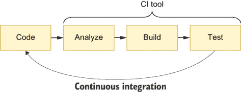
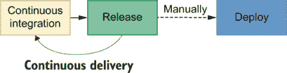
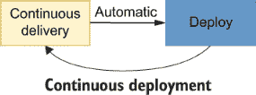

# 12 持续集成和持续交付

本章涵盖

+   持续集成（CI）和持续交付（CD）

+   采用 CI 和 CD 的原因

+   测试在构建 CI/CD 管道中的作用

+   版本控制检查

+   采用版本控制检查的优势

路易斯总是告诉他的员工在互相交流之前不要烘烤食谱的不同部分。制作闪电泡芙松饼皮的糕点师通常会与其他制作糕点奶油的人以及制作巧克力糖衣的人交流。

当糕点师们不互相交流时，他们会通过尽可能多地制作糕点奶油或只烘烤所需的最少量来提高效率。这种缺乏沟通的问题在于，他们往往会因为制作过多的奶油或过少的奶油而浪费原料。如果他们制作过多，多余的奶油就会被扔掉，因为路易斯不卖任何不新鲜的东西。如果他们制作过少，那么被扔掉的就是松饼皮，因为奶油不够用来填充每个闪电泡芙。

另一方面，当他的员工一起工作时，他们会就制作多少个闪电泡芙以及糖衣应该是什么味道达成一致。他们一次烘烤一批，并持续地将每个人的工作组合起来制作新鲜的闪电泡芙。

通过早期和频繁地结合他们的工作，可以减少浪费，因为这保证了糕点的风味与奶油相得益彰，糖衣的甜度理想，能够衬托其他部分。

当开发者长时间在自己的分支上编写代码而不与其他人的工作集成时，后果是相似的。

长时间孤立工作的开发者建立在不稳定的基础上。如果他们长时间独立工作，等到他们尝试将他们的工作合并到项目的主要分支时，他们所建立的基础代码可能已经发生变化。

由于孤立工作的开发者整合工作的时间过长，他们最终不得不进行大量的返工，同时解决太多冲突，这既昂贵又风险高，令人沮丧。

通过持续集成他们的工作，开发者减少了他们必须做的返工量，因为他们一直在确保他们所建立的基础假设是可靠的。如果有什么变化，他们可以更早地纠正方向，避免不必要的劳动，从而降低成本。

使糕点师和软件生产者更高效的一个重要部分是减少从有人想出食谱到它出现在顾客盘子上所需的时间。

通过更早和更频繁地交付，糕点师可以调整他们的食谱，使其变得成功。在构建软件方面，早期和频繁的发布导致更少的返工，因为这允许团队更早地获得客户反馈，因此可以更多地了解接下来要构建的内容。

在本章中，你将了解更多关于这两种实践：持续集成（CI）和持续交付（CD），后者依赖于前者。

我将首先解释持续集成、持续交付以及这两种实践如何相互关联。除了了解它们是什么之外，我还会讨论它们的优点以及如何应用它们。

一旦你了解了这两种实践，我将解释测试在构建 CI/CD 管道中的关键作用，以及将测试与这些实践相结合如何帮助你更快、更少挫折、更经济地生产更好的软件。

最后，在本章的第三部分，我将讨论如何将检查集成到你的版本控制系统中，以及它们如何补充你已学到的实践。

在本节中，你将通过了解我是如何解决这本书所喜爱的糕点师在建立其业务在线分支时面临的假设情况来学习。

注意：持续集成和持续交付是广泛的主题。本章仅涵盖你开始并理解在采用这两种实践时测试的作用所必需的基本信息。

为了深入了解这两个主题，我推荐以下书籍：Paul M. Duvall、Steve Matyas 和 Andrew Glover 合著的《持续集成：提高软件质量和降低风险》（Addison-Wesley Professional，2007 年）；以及 Jez Humble 和 David Farley 合著的《持续交付：通过构建、测试和部署自动化实现可靠的软件发布》（Addison-Wesley Professional，2010 年）。

## 12.1 什么是持续集成和持续交付？

成功的企业通过频繁沟通、快速迭代、尽早交付、倾听反馈并据此行动来取悦客户。这些企业专注于交付令人愉悦的成品，而不是不断开发平庸的新功能。

这些成功行为的核心是两种实践：持续交付和持续集成。

进行持续集成意味着频繁地将你的工作与其他人的工作集成在一起。持续交付意味着尽早和经常地向客户交付产品。

在本节中，你将了解这两种实践如何帮助企业成功，以及如何应用它们。

### 12.1.1 持续集成

路易的蛋糕总是能逗得顾客开心。他们的馅料、糖衣和面糊的味道总是*和谐*。尽管每个部分都是由单独的糕点师制作的，但这些糕点师经常互相交流，并尽可能早地尝试将他们的工作结合起来，以确保成分搭配得当。

通过经常更新其他人他们正在烘焙的内容，糕点师可以确保他们烘焙的是正确的数量、正确的东西、正确的时间。例如，他们不会烘焙巧克力糖霜然后不得不丢弃它，因为他们的合作伙伴正在烘焙香草芝士蛋糕。否则，那将是一个奇怪的芝士蛋糕。

此外，通过一起品尝蛋糕的不同部分，糕点师可以判断糖霜是否需要减少糖分以与额外的甜馅料相协调，反之亦然。

早期结合成分可以减少浪费和返工。如果蛋糕的不同部分不搭配，糕点师在发现这一点之前花费的时间会更少，而且不需要丢弃大量他的工作。

这种实践——*持续集成*——很容易应用到软件世界中，并产生类似的好处。

想象一下，你正在实现一个允许客户将折扣券应用于订单的功能。为了实现这个功能，你从项目的主分支分叉出来，并开始在自己的功能分支上提交代码。

当你正在处理折扣券机制时，另一位开发者正在自动折扣批量订单。这位开发者的工作干扰了你的工作，因为它改变了折扣工作的一些基本原理。

如果你的团队实践持续集成，你将避免在集成这两个更改时需要进行大量重工作。

持续集成让工作不再令人沮丧，更加可预测，因为当合并分支与你的折扣券实现时，你将遇到 fewer surprises。

你不会在做了整整一周的工作后才发现第二天所做的工作已经不再有效，你将频繁地将你的工作与项目的主分支集成，你的同事也是如此。因此，你将在开发功能的过程中不断纠正方向。

在软件工程中，不断将你的工作与项目的主分支集成相当于沟通你所做的更改，这样每个人都可以始终在软件的有效版本上工作。

一个主要的注意事项是，集成工作所需的时间越长，检测问题所需的时间就越长。此外，如果集成工作耗时，这种实践将不会那么高效，开发者也不会那么频繁地集成工作。

因此，为了使集成工作尽可能快且痛苦最小，你应该自动化尽可能多的任务，以便在有任何更改时更容易验证软件。你应该自动化的任务包括执行静态分析、强制执行代码风格、运行测试和构建项目，如图 12.1 中的管道所示。

小贴士：除了这些自动化检查之外，我建议团队在将代码合并到项目的主分支之前采用代码审查流程。

一旦这些任务自动化，开发者只需几秒钟就能知道他们的工作与项目主分支的更改结合后是否有效。你不需要将质量控制委托给另一个团队，而是将其**纳入**你的构建过程中，以便你可以缩短你的反馈循环。



图 12.1 在执行持续集成时，你的 CI 服务器将自动分析、构建和测试你提交的每个更改。

在自动化你的质量控制流程并将它们**纳入**你的构建过程之后，每当开发者将工作推送到项目仓库时，持续集成服务器应执行这些自动化任务，以持续监控软件是否按预期工作。

除了检查提交的代码是否通过测试和其他自动化验证之外，在单独的环境中运行这些任务有助于消除不同开发者机器之间可能存在的任何不一致性。此外，它排除了由于开发者忘记运行测试或使用静态分析工具而导致出现错误或不一致代码的可能性。

警告：采用持续集成工具**并不**一定意味着你正在实践持续集成。

经常执行持续集成的团队会频繁地将他们的工作与项目主分支合并。自动化构建和验证以及拥有持续集成服务器是使这些频繁集成更安全、更快捷的一种方式。

如果你使用持续集成工具，但每月只与项目主分支集成一次，你**不是**在进行持续集成。

在你采用持续集成工具之后，你应该确保项目主分支的构建过程**始终**工作。如果它损坏了，你和你的团队必须尽快修复它，或者回滚导致失败的更改。否则，其他人将在损坏的软件之上工作。

此外，如果你有一个损坏的构建，你将禁止其他人合并新代码，因为如果他们这样做，你将不知道他们的代码是否也有失败，因为构建已经损坏。此外，找到问题的根本原因将更具挑战性，因为你将需要调查更多的更改。

重要：你的持续集成构建**始终**应该工作。

除了将质量控制检查纳入始终在持续集成服务器上通过构建之外，你还应确保这些构建快速完成。

就像测试一样，构建运行所需的时间越长，开发者发现他们犯错误的时间就越长。此外，缓慢的构建可能会影响团队的交付节奏，因为每个人都需要时间将他们的更改合并并验证。

持续集成服务

自从我从事技术工作以来，我已经尝试了各种各样的持续集成工具，从本地软件到云服务。

除非你在大型公司工作或你有严格的要求强制你在自己的服务器上构建代码，否则我强烈建议你使用本地第三方 CI 软件，如 Drone、JetBrains 的 TeamCity 或 Jenkins。

否则，我会选择基于云的服务。当我构建软件时，我希望专注于构建软件，而不是修复我的持续集成正在运行的机器。

如果你选择云服务，我特别喜欢的服务是 CircleCI。除了易于设置外，该服务可靠，并且有广泛的文档。此外，CircleCI 允许你通过 SSH 进入构建运行的服务器来调试失败的构建。这个功能将使你能够在服务器上手动更新配置，以便在重试构建时了解导致构建失败的原因。

其他优秀的选择包括 TravisCI，我在开源项目中广泛使用它，JetBrains 管理的 TeamCity 服务，以及 GitLab CI。

在选择这些工具时，我会考虑的最重要因素是它们的灵活性、安全性和可调试性。此外，正如你在本章的最后部分将看到的，我认为能够将工具与你的版本控制系统（VCS）提供商集成是至关重要的。

无论你选择哪种工具，请记住，**与项目主线持续集成你的工作比选择一个出色的持续集成服务更重要**。

我之前看到同一个持续集成服务在一些项目中失败，但在其他项目中成功。这两种项目中的工具功能都是相同的——最大的区别在于开发人员在集成他们的工作时是否自律。

注意：你可以在以下网站上找到有关这些工具的更多信息：

+   Drone—[`drone.io`](https://drone.io)

+   TeamCity—[`jetbrains.com/teamcity`](https://jetbrains.com/teamcity)

+   Jenkins—[`jenkins.io`](https://jenkins.io)

+   CircleCI—[`circleci.com`](https://jenkins.io)

+   TravisCI—[`travis-ci.org`](https://travis-ci.org)

+   GitLab CI—[`docs.gitlab.com/ee/ci`](https://docs.gitlab.com/ee/ci)

### 12.1.2 持续交付

从路易斯的糕点师那里学到的最有价值的教训之一是，尽早和经常交付有助于企业成功。

例如，在开发新甜点时，一次性烘焙一大批并试图全部卖出是有风险的，因为糕点师还不知道顾客是否会喜欢它。

例如，如果面包店的员工烘焙了一大批客户认为酸味过重的甜点，他们将浪费大量时间和资源。相反，他们先烘焙一小批，卖给几位客户，并听取他们的反馈。然后他们迭代地改进甜点，因此在这个过程中浪费的资源更少。

当厨师尝试这些新食谱时，他们也不愿意向客户提供味道极差的甜点，这可能会使他们不再回来。为了避免用实验性食谱吓到客户，面包店的员工首先品尝新甜点，然后才逐渐将新颖的甜点卖给更敏感的碳水化合物爱好者。

如果客户不喜欢新的产品，员工会迅速停止品尝测试，回到厨房改进食谱。否则，他们开始向越来越多的客户销售食谱。

通过与客户持续测试甜点，面包店的员工能够专注于使甜点成功，而不是总是试图开发销售不佳的新产品。

此外，通过每次烘焙较少的甜点，糕点师们不太可能出错，因为他们习惯了新的食谱。

最后，因为他们必须频繁地交付新的甜点，所以他们优化了厨房布局，以利于吞吐量，并建立了必要的指标和流程，以便他们能够确定甜点是否表现良好。

如果您将这种相同的实践——*持续交付*——应用到软件世界中，您将看到类似的优点。

对于实践持续交付的团队来说，在完成变更后，他们不仅将工作合并到项目的主分支，而是产生可以直接交给客户的工件。

为了能够在任何时间点部署软件的最新版本，这些团队执行持续集成，以确保项目主分支的每次提交都将软件从一个有效的工作状态转换到另一个。

重要 如图 12.2 所示，持续集成是能够执行持续部署的前提。

当开发者编写代码时，为了避免交付客户可能不喜欢或可能存在尚未被自动化测试捕获的 bug 的功能，他们首先将变更推出给一小群更敏感的用户。



图 12.2 在实施持续交付之前，您必须已经执行了持续集成。在实践持续交付时，您集成的每个变更都必须是可发布的，这样您就可以在需要时部署软件的最新版本。

如果在逐步推出变更的过程中出现任何问题，实践持续交付的团队应该已经建立了机制，允许他们快速回滚变更并部署软件的先前版本。

为了说明在软件项目中实践持续部署的好处，考虑一下你正在对面包店的底层服务进行重大更改，以便它可以显示客户的订单状态，如果订单已发货，还可以显示其位置。

想象一下，例如，如果你试图一次性部署这个功能，由于你添加的许多漫长的数据库迁移之一导致部署失败，会发生什么。在这种情况下，很难发现哪个迁移的哪个部分导致了问题，因为需要调查的代码行数更多。

如果你能够更频繁、分阶段地部署你的功能，你将能够更快地发现并修复错误，因为一旦第一次失败的迁移运行，你将需要调查的代码行数会更少。

此外，更频繁且分阶段地部署你的订单跟踪系统可以帮助你根据客户的需求进行调整。你不必花费大量时间开发客户可能不需要的详细订单跟踪系统，而是可以分阶段构建，听取客户的反馈，并交付他们真正想要的产品。

小贴士：功能标志是一种有用的技术，可以帮助团队执行持续部署。

通过在功能标志后面部署新功能，开发者可以向生产代码发送尚未影响用户或仅对一小部分用户可用的代码。

除了让开发者更频繁地发布代码外，功能标志还能减少通信开销，因为它们将功能可用性和部署过程分开。

此外，你可以使用功能标志来隐藏应用程序中尚未准备好供用户查看的部分，例如 UI 不完整的屏幕。

如果你想要了解更多关于功能标志的信息，我强烈推荐你阅读 Pete Hodgson 在 Martin Fowler 网站上关于这个主题的文章，网址为[`martinfowler.com/articles/feature-toggles.html`](https://martinfowler.com/articles/feature-toggles.html)。

例如，想象一下，如果你花费了三个月时间构建一个详细的订单跟踪系统，却发现客户只关心他们的订单是否成功提交，这将多么灾难性。

通过将订单跟踪系统拆分为更小的可交付成果，你可以通过获得早期反馈来降低项目风险。这种早期反馈将帮助你了解客户关心什么，因此可以避免编写不必要的代码。例如，在这种情况下，你本可以构建一个小型的软件，一旦订单被接受，就会向客户发送短信或电子邮件。

重要提示：尽早和频繁地交付可以将你的重点从尽可能多地编写代码转移到尽可能多地提供价值。

存放在你的版本控制系统中的代码不会为你的客户提供任何价值。你越早将软件交到客户手中，它就越早开始创造价值。

最后，如果你和你的团队需要频繁部署变更，你就有更强的理由尽可能自动化部署过程。否则，这些缓慢的部署会显著减慢反馈循环，从而降低执行持续交付的好处，并减少整个团队的吞吐量。

正如我之前所阐述的，执行持续交付的团队可以降低部署的风险，并且由于他们实施的自动化，通常在部署上花费的时间更少。这些团队能够更早地获得反馈，以构建客户真正需要的而不是他们认为客户需要的产品。

警告 **持续交付与持续部署不同。** 当你执行持续交付时，你的团队可以在任何时间点将项目的主分支部署到生产环境中。理想情况下，这些部署应该尽可能自动化。然而，仍然需要有人决定“按下按钮”。持续部署将持续交付推进了一步。

实践持续部署的团队，每当项目主分支上发生新的成功构建时，他们的代码会自动部署到生产环境中。

由于不需要有人按下“部署”按钮，变更可以更快地进入生产环境。

在执行持续部署时，每个版本都会自动发送到生产环境中，如图 12.3 所示。



图 12.3 在执行持续部署时，每个版本都会自动发送到生产环境中。

当你从持续集成过渡到持续交付，然后向持续部署迈进时，发布速度会加快，迫使你实施更复杂的部署技术，并实施更好的监控和更可靠的质量保证。

## 12.2 自动化测试在 CI/CD 流水线中的作用

在将整个批次的甜点卖给客户之前先品尝样品，这是路易斯面包店的一项基本活动。这有助于确保提供给客户的任何东西都符合路易斯严格的品质标准。

同样，在将软件交付给客户之前测试你的软件可以帮助你防止发布带有错误的产品。

测试你的软件是耗时的。因此，你不得不更频繁地进行测试，你的测试成本就会越高。

考虑到持续交付将迫使你的团队更频繁地交付软件，如果你没有高效的自动化测试，它可能会迅速增加你的成本。

通过实施自动化测试，你可以降低部署成本，因为机器可以比人类更严格、更快地验证你的软件，几乎不需要成本。

**自动化测试是使团队能够执行持续交付的最关键技术，因为它允许你在不显著增加成本的情况下提高交付频率**。

这些测试集成到通常称为 CI/CD 流程中，在持续集成服务中运行，负责自动验证你的软件并准备任何必要的发布工件。

警告 设置持续集成流程与实施 CI/CD 流程不同。

在执行持续集成时，每当有人向项目的主要分支推送代码时，你的团队将**验证**其软件。此验证过程可能包括尝试构建应用程序、运行测试和执行静态分析。

CI/CD 流程除了**验证**你的软件外，还准备任何必要的发布工件，以便你可以通过“按按钮”来部署它们。

例如，如果你正在编写 Node.js 应用程序，你的 CI/CD 流程可以验证它，构建必要的容器，并将它们推送到容器仓库。

在你的流程运行后，你可以通过按按钮快速部署你的软件，因为你不需要再次构建容器。相反，你只需简单地拉取已经构建好的内容。

此外，为了测试部署过程本身，你应该有一个类似生产环境的独立环境，将你的软件部署到该环境中。

随着你增加部署的频率，你将不得不增加 CI/CD 流程执行的自动验证数量。这些验证应该提供快速而精确的反馈，以便你能够尽早发现错误。否则，你更有可能发布带有错误的软件。

为了使这些验证尽可能有价值，除了你的标准单元和集成测试外，你的 CI/CD 流程必须包括端到端测试，如果可能的话，还应包括类似于第十章中看到的验收测试。

端到端和验收测试在 CI/CD 流程的背景下尤为重要，因为它们是最接近用户行为的测试，因此更有可能防止你发布带有错误的软件。

重要 当构建你的 CI/CD 流程时，确保不仅包括单元和集成测试，还包括端到端和验收测试。

除了使部署更快、更便宜之外，有效的测试还能激励你的团队更频繁地部署，因为它们减少了代码到达生产所需的工量。像测试一样，你的部署越快，发生的频率就越高。

尽管测试有检测错误的能力，但它们**并不总是**能保证你的应用程序没有错误。因此，它们不能消除手动验证的需要。如果你有一个质量保证团队，其专业人员在进行手动和探索性测试时仍然很有价值，正如我在第二章中解释的那样。

尽管需要手动验证，但为了使整个验证过程更快，您可以利用允许您更早检测到错误并最小化其影响的机制。这些机制包括实施监控和使用功能标志逐步推出更改。

## 12.3 版本控制检查

在路易斯的面包店，没有人会在品尝巧克力霜之前就把它涂在巨大的蛋糕上。否则，如果巧克力霜不够甜，整个蛋糕就会直接进入垃圾桶。

在将配料混合之前尝试它们的单独部分，允许糕点师避免将不可食用的馅料与原本完美的面团混合。

版本控制检查，如图 12.4 所示，在软件开发过程中起着类似的作用。通过在开发者合并代码之前自动验证他们推送的代码，版本控制检查确保团队不会将损坏的代码添加到本应健康的代码库中。


图 12.4 版本控制检查可以防止您的团队发布无效的版本。

这些检查可以在您提交代码时本地发生，或者在您推送代码之前，或者一旦您的更改到达远程仓库。

在第一种情况下，这些本地检查通常通过 Git 钩子来完成。这些钩子允许您在开发者在仓库中执行特定动作时执行程序。

例如，您可以配置一个 precommit 钩子，该钩子检查您的代码，执行测试，并阻止开发者提交未通过这些验证的代码。

要配置这种自动验证，您可以使用`husky`包，其文档可以在[`github.com/typicode/husky`](https://github.com/typicode/husky)找到。

安装`husky`后，创建钩子就像在`package.json`文件中添加一个`husky`属性一样简单，该文件包含您希望在版本控制系统中发生不同动作时运行的命令。

列表 12.1 package.json

```
{
  "name": "git_hooks_example",
  "scripts": {
    "test": "jest",                        ❶
    "lint": "eslint"                       ❷
  },
  "devDependencies": {
    "husky": "4.3.0"
  },
  "husky": {
    "hooks": {
      "pre-commit": "npm run lint",        ❶
      "pre-push": "npm run test",          ❷
    }
  }
}
```

❶ 在合并提交前自动检查代码

❷ 在推送代码前自动运行测试

当用户在本地执行操作时运行这些类型的验证的缺点是，它们可能会减慢开发者的工作流程。尽管开发者可以在 Git 命令中添加`--no-verify`选项来防止这些钩子运行，但使用此选项就失去了设置这些钩子的初衷。

个人来说，我限制我的 Git 钩子只执行快速终止的动作。例如，我不会在每个提交之前运行代码检查或测试。相反，我会运行代码格式化工具，如 Prettier。

然后，为了确保我的团队能够审查并合并只有有效代码，我配置了我的版本控制提供者以触发持续集成管道。这个管道随后运行更慢的验证，如代码风格检查和测试。如果这些验证失败，我的版本控制提供者将不允许我的团队在我修复之前合并我的代码。

除了代码风格检查和测试之外，你还可以配置其他类型的验证。例如，你可以验证每个拉取请求都不会降低测试覆盖的代码百分比。

多亏了这些自动验证，你不需要依赖人类去记住他们必须执行任何命令。相反，你让人类发挥创造力，将他们更擅长的重复性工作委托给机器：完美地执行重复性任务。

## 摘要

+   实践持续集成的团队经常集成他们的代码，而不是在长期存在的功能分支上工作，这些分支只有在所有更改都完成时才会合并。

+   如果持续集成构建失败，破坏构建的开发者必须尽快修复构建或回滚他们的更改。否则，这些失败的构建可能导致其他人基于损坏的软件工作。此外，当构建已经失败时，你将不知道新更改是否也存在问题，这将更难以找到失败的根本原因。

+   持续集成促进了开发者之间的沟通，因为它促使他们更频繁地集成他们的工作。因此，他们能更频繁地了解代码库中的最新动态。

+   当团队实践持续集成时，他们减少了需要重做的工作量，因为他们将拥有更紧密的反馈循环。这个紧密的反馈循环有助于开发者在他们实施更改时纠正方向，而不是迫使他们花费大量时间解决冲突或重写代码，因为底层软件已经改变。

+   为了加快集成开发者更改的过程，实践持续集成的团队使用 CI 服务器来自动构建、分析和测试提交的代码。

+   在 CI 服务器上执行这些验证有助于开发者消除他们自己的开发环境与其他人环境之间的一致性问题。这种做法有助于团队防止合并那些在开发者的机器上以一种方式工作，一旦部署就以一种不同方式工作的代码。

+   你的构建越快，开发者就越早能够检测并纠正错误。此外，快速的构建将加速开发者集成代码的速度，因为他们将很快知道他们是否提交了有效的代码。

+   实践持续交付的团队可以在任何时间点发布他们软件的最新版本。

+   为了能够随时发布软件，这些团队必须实践持续集成，以验证项目主分支中的每个更改都能将代码从一个工作状态转换到另一个状态。

+   能够更频繁地交付代码有助于开发者采取更小、更迭的步骤，并在构建软件时验证它们，而不是在前期进行不必要的操作。

+   早期交付代码导致开发者更专注于尽快交付价值，而不是编写尽可能多的代码行数。存放在版本控制系统中的软件不会产生价值。软件只有在客户手中时才能产生价值。

+   持续交付激励团队尽可能自动化任务，以便发布不会成为重大的负担。除了实施可以“一键”发生的部署流程外，他们还建立了必要的机制来监控部署后的软件。

+   测试对于实践持续集成和持续交付至关重要，因为这两种实践都采用迭代的方法进行软件开发。因此，你需要更多的迭代，测试就越重要，因为它们运行得越频繁，就能为你节省更多时间，因此它们带来的价值就越大。

+   为了防止开发者意外合并不合适的代码，你可以实施与你的版本控制系统相关的检查。这些检查可以本地发生，通过使用钩子，或者远程触发你的版本控制系统提供商中的操作。

+   本地钩子应该快速，以免阻碍开发者的进度。随着开发者提交代码，这些钩子将触发快速验证和调整代码的操作，例如执行代码格式化器。

+   在你的版本控制系统中发生的检查可能包括阻止合并，如果你在持续集成工具中构建过程失败，或者新更改降低了代码覆盖率百分比。

+   实施此类检查可以释放人类进行创新，并将机器擅长且繁琐重复的任务委托给机器。
