## 第一部分\. 了解 Vue.js

在我们学习 Vue 所能提供的所有酷炫功能之前，我们首先需要了解它。在前两章中，我们将探讨 Vue.js 背后的哲学、MVVM 模式以及它与其他框架的关系。

一旦我们了解了 Vue 的来源，我们将更深入地研究 Vue 实例。根 Vue 实例是应用程序的核心，我们将探讨其结构。稍后，我们将看看如何将我们的应用程序中的数据绑定到 Vue。

这些章节将为您在 Vue.js 中提供一个很好的起点。您将学习如何创建一个简单的应用程序以及 Vue 是如何工作的。

## 第一章\. 介绍 Vue.js

*本章涵盖*

+   探索 MVC 和 MVVM 设计模式

+   定义响应式应用

+   描述 Vue 的生命周期

+   评估 Vue.js 的设计

交互式网站已经存在很长时间了。在 2000 年代中期的 Web 2.0 初期，人们更加关注交互性和吸引用户。Twitter、Facebook 和 YouTube 等公司都是在那时创立的。社交媒体和用户生成内容的兴起正在改善网络。

开发者必须跟上这些变化，以便为最终用户提供更多交互性，早期，库和框架开始使构建交互式网站变得更加容易。2006 年，John Resig 发布了 jQuery，极大地简化了 HTML 的客户端脚本。随着时间的推移，客户端框架和库被创建出来。

最初，这些框架和库很大、庞大且具有主观性。现在，我们已经看到了向更小、更轻量级的库的转变，这些库可以轻松地添加到任何项目中。这就是 Vue.js 的用武之地。

Vue.js 是一个库，使我们能够在 JavaScript 可以运行的任何上下文中添加交互行为和功能。Vue 可以用于单个网页的简单任务，也可以为整个企业级应用程序提供基础。

| |
| --- |

##### 小贴士

在网络上，Vue 和 Vue.js 这两个术语被交替使用。在整个书中，我大部分时间使用更口语化的 Vue，当我具体提到代码或库时，则保留 Vue.js。

| |
| --- |

从访客交互的界面到为我们应用程序提供数据的数据库，我们将探讨 Vue 及其支持库如何使我们能够构建完整、复杂的 Web 应用程序。

在旅途中，我们将检查每个章节的代码如何融入更大的图景，哪些行业最佳实践是适用的，以及如何将我们正在工作的内容融入您自己的项目，无论是现有的还是新的。

这本书主要面向对 JavaScript 有一定熟悉程度且对 HTML 和 CSS 有良好理解的 Web 开发者。话虽如此，由于其应用编程接口（API）的通用性，Vue 作为一个库，随着你的开发成长，也随着你的项目成长。任何想要为个人副项目构建原型或应用的人，都应该在这段旅程中找到这本书是一个可靠的指南。

### 1.1. 巨人的肩膀上

在我们为我们的第一个应用程序编写任何代码之前，甚至在高层深入了解 Vue 之前，了解一点软件历史是很重要的。如果我们不了解过去 Web 应用程序面临的问题和挑战，以及 Vue 带来的优势，就很难真正欣赏 Vue 为我们所做的一切。

#### 1.1.1. 模型-视图-控制器模式

证明其有用性的客户端模型-视图-控制器（MVC）模式提供了许多现代 Web 应用程序开发框架使用的架构蓝图。（如果你熟悉 MVC，可以自由地跳过前面的内容。）

在我们继续之前，值得提一下，原始的 MVC 设计模式在多年中已经发生了变化。有时被称为经典 MVC，它涉及一套关于视图、控制器和模型如何交互的独立规则。为了简化，我们将讨论客户端 MVC 模式的简化版本。这种模式是对 Web 的更现代的解释。

如您在图 1.1 中看到的，这种模式用于分离应用程序的关注点。视图负责向用户显示信息。这代表了图形用户界面（GUI）。控制器位于中间。它帮助将视图的事件转换为模型，并将模型的数据转换为视图。最后，模型包含业务逻辑，可能包含一种数据存储。

##### 图 1.1. MVC 模式描述的模型、视图和控制器的作用。

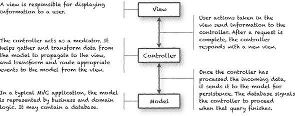

| |
| --- |

##### Info

如果你想要了解更多关于 MVC 模式的信息，可以从 Martin Fowler 关于 MVC 演变的页面开始，请访问[`martinfowler.com/eaaDev/uiArchs.html`](https://martinfowler.com/eaaDev/uiArchs.html)。

| |
| --- |

许多 Web 框架的作者都使用了这种 MVC 模式的变体，因为它具有坚实、经过时间考验的架构。如果你想了解更多关于现代 Web 框架的设计和架构，可以查看 Emmitt A. Scott Jr.的《SPA 设计和架构》（Manning，2015）。

在现代软件开发中，MVC 模式通常作为单个应用程序的一部分，为分离应用程序代码的角色提供了一个很好的机制。对于使用 MVC 模式的网站，每个请求都会从客户端到服务器，再到数据库，然后又回到客户端的信息流。这个过程耗时、资源密集，并且不提供响应式的用户体验。

多年来，开发者通过使用异步 Web 请求和客户端 MVC 来提高基于 Web 应用程序的交互性，这样发送到服务器的请求就不会阻塞，执行可以继续而无需回复。但是，随着 Web 应用程序开始更像它们的桌面版本，等待任何客户端/服务器交互可能会使应用程序感觉迟钝或损坏。这就是我们下一个模式发挥作用的地方。

|  |
| --- |

**关于业务逻辑的一席话**

当考虑业务逻辑应在何处实现时，你会在客户端 MVC 模式中找到相当程度的灵活性。在图 1.1 中，为了简单起见，我们将业务逻辑集中在模型中，但它也可能存在于应用程序的其他层级，包括控制器。自 1979 年 Trygve Reenskaug 为 Smalltalk-76 引入 MVC 模式以来，该模式已经发生了变化。

考虑用户提供的 ZIP 代码验证：

+   视图可能包含 JavaScript，用于在输入 ZIP 代码时或提交前验证它。

+   模型可能在创建用于存储传入数据的地址对象时验证 ZIP 代码。

+   ZIP 代码字段上的数据库约束可能意味着模型也在执行业务逻辑，尽管这可以被认为是不良实践。

定义构成实际业务逻辑的内容可能很困难，在许多情况下，所有先前的约束可能都在单个请求中发挥作用。

在本书中构建我们的应用程序时，我们将探讨我们如何组织和安排业务逻辑，以及 Vue 及其支持库如何帮助保持功能不会跨越边界。

|  |
| --- |

#### 1.1.2\. 模型-视图-视图模型模式

当 JavaScript 框架开始支持异步编程技术时，Web 应用程序不再需要请求完整的 Web 页面。网站和应用可以通过对视图的局部更新更快地响应，但这样做需要一定程度的重复工作。表示逻辑通常反映了业务逻辑。

MVC 的改进，模型-视图-视图模型（MVVM）模式的主要区别在于引入了*视图模型*及其数据绑定（统称为*binder*）。MVVM 为我们提供了一个蓝图，用于构建具有更多响应性用户交互和反馈的客户端应用程序，同时避免在整体架构中重复代码和努力。它也更容易进行单元测试。话虽如此，对于简单的 UI，MVVM 可能有些过度，所以请考虑这一点。

对于 Web 应用程序，MVVM 的设计允许我们编写能够立即响应用户交互的软件，并允许用户自由地从一项任务切换到另一项任务。正如你从 图 1.2 中可以看到，视图模型也扮演着不同的角色。这种责任整合对我们的应用程序视图有一个单一、深刻的含义：当视图模型中的数据发生变化时，任何绑定到它的视图都会自动更新。数据绑定器暴露数据并帮助确保当数据发生变化时，它会在视图中得到反映。

|  |
| --- |

##### Info

你可以在 Martin Fowler 的演示模型页面上找到更多关于 MVVM 模式的信息：[`martinfowler.com/eaaDev/PresentationModel.html`](https://martinfowler.com/eaaDev/PresentationModel.html)。

|  |
| --- |

##### 图 1.2\. 模型-视图-视图模型模式的组件。

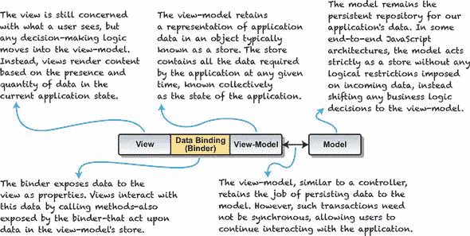

#### 1.1.3\. 什么是响应式应用程序？

响应式编程范式并不一定是一个新想法。它被 Web 应用程序采用相对较新，这很大程度上归功于 JavaScript 框架如 Vue、React 和 Angular 的可用性。

网上有很多关于响应式理论的优秀资源，但我们的需求可能更加专注。一个 Web 应用程序要想被认为是响应式的，应该做到以下几点：

+   观察应用程序状态的变化

+   在整个应用程序中传播更改通知

+   在状态变化时自动渲染视图

+   为用户交互提供及时反馈

响应式 Web 应用程序通过采用 MVVM 设计原则，使用异步技术避免阻塞持续交互，并在可能的情况下使用函数式编程惯例来实现这些目标。

虽然 MVVM 模式并不一定意味着响应式应用程序，反之亦然，但它们有一个共同的目标：为应用程序的用户提供更响应、更可靠的体验。超人克拉克·肯特可能以不同的方式呈现自己，但他们都希望为人类做好事。（不，我不会说 MVVM 和响应式哪一个穿斗篷，哪一个戴眼镜。）

|  |
| --- |

##### Info

如果你想要了解更多关于 Vue 的响应式编程范式，请查看 [`vuejs.org/v2/guide/reactivity.html`](https://vuejs.org/v2/guide/reactivity.html) 上的 *Reactivity in Depth* 指南。

|  |
| --- |

#### 1.1.4\. 一个 JavaScript 计算器

为了更好地理解数据绑定和响应性的概念，我们将首先使用纯 JavaScript 实现一个计算器，如下所示。

##### 列表 1.1\. JavaScript 计算器：chapter-01/calculator.html

```
<!DOCTYPE>
<html>
  <head>
    <title>A JavaScript Calculator</title>
    <style>
     p, input { font-family: monospace; }
     p, { white-space: pre; }
    </style>
  </head>
  <!-- Bind to the init function -->
  <body>
    <div id="myCalc">                                                *1*
      <p>x <input class="calc-x-input" value="0"></p>
      <p>y <input class="calc-y-input" value="0"></p>
      <p>--------------------</p>
         <p>= <span class="calc-result"></span></p>                  *2*
    </div>
    <script type="text/javascript">
     (function(){

       function Calc(xInput, yInput, output) {                       *3*
         this.xInput = xInput;
         this.yInput = yInput;
         this.output = output;
       }

       Calc.xName = 'xInput';
       Calc.yName = 'yInput';

       Calc.prototype = {
         render: function (result) {
           this.output.innerText = String(result);
         }
       };

       function CalcValue(calc, x, y) {                              *4*
         this.calc = calc;
         this.x = x;
         this.y = y;
         this.result = x + y;
       }

       CalcValue.prototype = {
         copyWith: function(name, value) {
           var number = parseFloat(value);

           if (isNaN(number) || !isFinite(number))
             return this;

           if (name === Calc.xName)
             return new CalcValue(this.calc, number, this.y);

           if (name === Calc.yName)
             return new CalcValue(this.calc, this.x, number);

           return this;
         },
         render: function() {
           this.calc.render(this.result);
         }
       };

       function initCalc(elem) {                                     *5*

         var calc =
           new Calc(
             elem.querySelector('input.calc-x-input'),
             elem.querySelector('input.calc-y-input'),
             elem.querySelector('span.calc-result')
           );
         var lastValues =
           new CalcValue(
             calc,
             parseFloat(calc.xInput.value),
             parseFloat(calc.yInput.value)
           );

         var handleCalcEvent =                                       *6*
           function handleCalcEvent(e) {
             var newValues = lastValues,
                 elem = e.target;

             switch(elem) {
               case calc.xInput:
                 newValues =
                   lastValues.copyWith(
                     Calc.xName,
                     elem.value
                   );
                 break;
               case calc.yInput:
                 newValues =
                   lastValues.copyWith(
                     Calc.yName,
                     elem.value
                   );
                 break;
             }

             if(newValues !== lastValues){
               lastValues = newValues;
               lastValues.render();
             }
           };

         elem.addEventListener('keyup', handleCalcEvent, false);     *7*
         return lastValues;
       }

       window.addEventListener(
         'load',
         function() {
           var cv = initCalc(document.getElementById('myCalc'));
           cv.render();
         },
         false
       );

     }());
    </script>
  </body>
</html>
```

+   ***1* 表单输入用于收集与 runCalc 函数绑定的 x 和 y**

+   ***2* 展示了 x 和 y 的结果**

+   ***3* 展示了创建 calc 实例的构造函数**

+   ***4* 展示了创建 calc 实例值的构造函数**

+   ***5* 初始化 calc 组件**

+   ***6* 展示了事件处理器**

+   ***7* 在 keyup 事件上设置事件监听器**

这是一个使用 ES5 JavaScript（我们将在本书后面使用更现代的 JavaScript 版本 ES6/2015）的计算器。我们使用立即调用的函数表达式来启动我们的 JavaScript。构造函数用于存储值，而 `handleCalcEvent` 事件处理程序在任意 `keyup` 事件上触发。

#### 1.1.5. Vue 计算器

不要过于担心 Vue 示例的语法，因为我们的目标不是理解代码中发生的所有事情，而是比较两种实现。话虽如此，如果你对 JavaScript 示例的工作方式有很好的理解（如下列所示），Vue 代码的大部分内容至少在理论层面上应该是可以理解的。

##### 列表 1.2. Vue 计算器：chapter-01/calculatorvue.html

```
<!DOCTYPE html>
<html>
<head>
  <title>A Vue.js Calculator</title>
  <style>
    p, input { font-family: monospace; }
    p { white-space: pre; }
  </style>
</head>
<body>
  <div id="app">                                                *1*
    <p>x <input v-model="x"></p>                                *2*
    <p>y <input v-model="y"></p>
    <p>---------------------</p>
    <p>= <span v-text="result"></span></p>                      *3*
  </div>

  <script src="https://unpkg.com/vue/dist/vue.js"></script>     *4*
  <script type="text/javascript">
  function isNotNumericValue(value) {
    return isNaN(value) || !isFinite(value);
  }
    var calc = new Vue({                                        *5*
      el: '#app',                                               *6*
      data: { x: 0, y: 0, lastResult: 0 },                      *7*
      computed: {                                               *8*
        result: function() {
            let x = parseFloat(this.x);
            if(isNotNumericValue(x))
              return this.lastResult;

            let y = parseFloat(this.y);
            if(isNotNumericValue(y))
              return this.lastResult;

            this.lastResult = x + y;

            return this.lastResult;
        }
      }
    });
  </script>
</body>
</html>
```

+   ***1* 显示应用程序的 DOM 锚点**

+   ***2* 显示应用程序的表单输入**

+   ***3* 结果将显示在这个 span 中。**

+   ***4* 列出了添加 Vue.js 库的脚本标签**

+   ***5* 初始化应用程序**

+   ***6* 连接到 DOM**

+   ***7* 显示添加到应用程序中的变量**

+   ***8* 使用计算属性在这里进行计算。**

#### 1.1.6. JavaScript 和 Vue 的比较

两个计算器实现的代码在大多数情况下是不同的。图 1.3 中显示的每个示例都可以在本章附带的存储库中找到，因此你可以运行每个示例并比较它们的操作方式。

##### 图 1.3. 使用原生 JavaScript（在左侧）和 Vue（在右侧）编写的响应式计算器的并排比较。

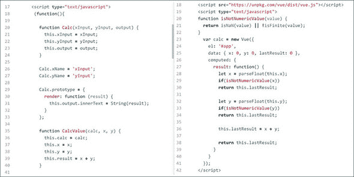

两个应用程序之间的关键区别在于最终计算的更新是如何触发的，以及结果如何返回到页面。在我们的 Vue 示例中，单个绑定 `v-model` 负责页面上所有的更新和计算。当我们使用 `new Vue({ ... })` 实例化应用程序时，Vue 会检查我们的 JavaScript 代码和 HTML 标记，然后创建应用程序运行所需的所有数据和事件绑定。

#### 1.1.7. Vue 如何促进 MVVM 和响应式？

Vue 有时被称为 *渐进式框架*，这大致意味着它可以被集成到现有的网页中用于简单任务，或者它可以完全作为大型 Web 应用的基础。

无论你选择如何将 Vue 集成到你的项目中，每个 Vue 应用至少有一个 *Vue 实例*。最基本的应用将有一个实例，它提供指定标记和存储在视图模型中的数据之间的绑定（见 图 1.4）。

##### 图 1.4. 典型的 Vue 实例通过在它们之间创建数据绑定，将 HTML 标记绑定到视图模型中的数据。

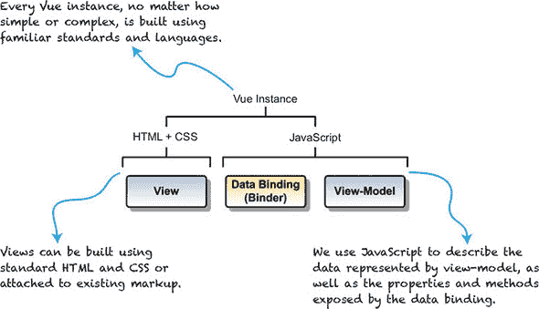

由于完全由 Web 技术构建，单个 Vue 实例完全存在于 Web 浏览器中。关键的是，这意味着我们不需要依赖基于服务器的页面重新加载来更新视图、执行业务逻辑或任何属于视图或视图模型范畴的任务。让我们带着这个想法重新审视我们的表单提交示例。

相对于客户端 MVC 架构，最引人注目的变化可能是，在整个用户会话期间，浏览器页面很少需要，甚至根本不需要重新加载。因为视图、视图模型和数据绑定都是在 HTML 和 JavaScript 中实现的，我们的应用可以将任务异步地委托给模型，让用户可以自由地继续其他任务。当模型返回新数据时，Vue 建立的绑定将触发视图需要发生的任何更新。

不可否认，Vue 的主要角色是通过创建和维护我们创建的视图与视图模型中的数据之间的绑定来促进用户交互。在这个角色中，正如我们将在第一个应用中看到的那样，Vue 为任何响应式 Web 应用提供了一个坚实的基础。

### 1.2. 为什么选择 Vue.js？

在启动一个新项目时，有许多决定需要做出。其中最重要的决定之一是应该使用哪个框架或库。如果你是一家代理机构或甚至是独立开发者，选择适合工作的正确工具至关重要。幸运的是，Vue.js 非常灵活，可以处理许多不同的情况。

以下是在作为独立开发者或代理机构开始新项目时，你可能会表达的一些最常见的担忧，以及 Vue 如何直接或作为向响应式 Web 应用更大运动的一部分来帮助解决这些担忧的描述。

+   **我们的团队在处理 Web 框架方面并不强大。** 使用 Vue 进行项目的最大优点之一是它不需要任何专业知识。每个 Vue 应用都是用 HTML、CSS 和 JavaScript 构建的——这些熟悉工具有助于你从一开始就提高生产力。即使是那些在其他环境中对 MVC 不太熟悉的团队，也会因为对 MVC 的熟悉而在 MVVM 模式中找到一个舒适的立足点。

+   **我们有一些现有的工作想要继续使用。** 别担心，没有必要丢弃你精心制作的 CSS 或你构建的那个酷炫的轮播图。无论是将 Vue 插入到具有许多依赖项的现有项目中，还是你正在启动一个新项目并希望利用你已熟悉的库，Vue 都不会妨碍你。你可以继续使用 Bootstrap 或 Bulma 等 CSS 框架，保留 jQuery 或 Backbone 组件，或者集成你喜欢的用于发送 HTTP 请求、处理 Promises 或其他扩展功能的库。

+   ***我们需要快速原型设计和评估用户的反应。*** 正如我们在第一个 Vue 应用程序中看到的，要开始使用 Vue 构建，我们只需在任何独立网页中包含 Vue.js 即可。无需复杂的构建工具！将原型展示给用户可以在开发开始后的一个或两个星期内完成，这样您就可以尽早收集反馈并频繁迭代。

+   ***我们的产品几乎仅在移动设备上使用。*** 最小化和压缩后的 Vue.js 文件大小约为 24 KB，对于一个前端框架来说相当紧凑。该库可以通过蜂窝连接轻松传输。Vue 2 的新特性是服务器端渲染（SSR）。这种策略意味着应用程序的初始加载可以最小化，您只需在需要时才拉入新的视图和资源。将 SSR 与组件的高效缓存相结合，可以进一步减少带宽消耗。

+   ***我们的产品具有独特和定制的功能。*** 从一开始就考虑到模块化和可扩展性，Vue 应用程序使用可重用组件。Vue 还支持通过继承扩展组件，通过混入（mix-ins）整合功能，以及通过插件和自定义指令扩展 Vue 的功能。

+   ***我们拥有庞大的用户群，性能是一个关注点。*** 最近为了可靠性、性能和速度进行了重写，Vue 现在使用虚拟 DOM。这意味着 Vue 首先在未附加到浏览器的一个 DOM 表示上进行操作，然后“复制”这些更改到我们看到的视图中。因此，Vue 通常优于其他前端库。由于通用测试通常过于抽象，我总是鼓励客户选择几个典型的用例和一些极端用例，开发一个测试场景，并自行测量结果。您可以在[`vuejs.org/v2/guide/comparison.html`](https://vuejs.org/v2/guide/comparison.html)了解更多关于虚拟 DOM 及其与竞争对手的比较信息。

+   ***我们已经有现成的构建、测试和/或部署流程。*** 在本书的后几章中，我们将深入探讨这些主题，但关键信息是 Vue 可以轻松集成到许多最受欢迎的构建（Webpack、Browserify 等）和测试（Karma、Jasmine 等）框架中。在许多情况下，如果您已经为现有框架编写了单元测试，则可以直接移植。如果您是初学者但想使用这些工具，Vue 提供了项目模板，这些模板为您集成了这些工具。简单来说，很容易将 Vue 添加到现有项目中。

+   **如果我们需要在我们的合作期间或之后寻求帮助怎么办？** Vue 的两个不可衡量的好处是其社区和支持生态系统。Vue 有很好的文档，无论是在在线文档中还是在代码本身中，核心团队也是活跃和响应的。也许更重要的是，与 Vue 一起工作的开发者社区同样强大。Gitter 和 Vue 论坛等资源充满了乐于助人的人，而且每天都有越来越多的插件、集成和库扩展将流行的代码带到这个平台上。

在我的项目中对这些问题进行了许多探讨后，我现在几乎推荐在所有我的项目中使用 Vue。随着你在本书中逐渐对 Vue 的掌握变得自信，我希望你会在你的下一个项目中感到舒适地推荐 Vue。

### 1.3\. 未来思考

仅在介绍性章节中，我们就已经覆盖了很多内容。如果你是 Web 应用开发的初学者，这可能是你第一次接触 MVVM 架构或响应式编程，但我们已经看到构建一个响应式应用并不像术语可能让人感觉的那样令人生畏。

也许本章最大的收获不是关于 Vue 本身，而是关于响应式应用更容易处理和编写。而且，我们还有更少的样板接口代码要写。不必编写所有用户的交互脚本让我们能够专注于如何建模我们的数据和设计我们的界面。将它们连接起来是 Vue 使它变得轻而易举的事情。

如果你像我一样，那么你已经在想无数种让我们的简单应用变得更好的方法。这是好事，你应该绝对地实验和玩弄代码。以下是我查看应用时考虑的一些事情：

+   我们如何消除在许多地方重复文本字符串的需要？

+   当用户聚焦到输入时，我们能否清除默认输入？如果他们留空字段，我们能否恢复它？

+   有没有避免手动编码每个输入的方法？

在第二部分中，我们将找到所有这些问题的答案以及更多。Vue 被设计成随着我们作为开发者的成长而成长，就像与我们的代码一样，因此我们总会确保查看不同的策略，比较它们的优缺点，并学习如何决定在特定情况下哪种做法是最好的实践。

好吧，让我们看看我们如何改进我们写的某些内容！

### 摘要

+   模型、视图和控制器的工作简史，以及它们如何与 Vue.js 结合。

+   Vue.js 如何在创建应用程序时为你节省时间。

+   为什么你应该考虑 Vue.js 作为你下一个项目的选择。

## 第二章\. Vue 实例

*本章涵盖*

+   创建 Vue 实例

+   观察 Vue 的生命周期

+   向 Vue 实例添加数据

+   将数据绑定到标记

+   格式化我们的输出

在本书的整个过程中，我们将构建一个完整的 Web 应用：一个带有产品列表、结账流程、管理界面等功能的网上商店。完成的网上商店可能看起来还很遥远，尤其是如果你是 Web 应用开发的新手，但 Vue 允许你从小处着手，基于所学内容进行构建，并通过一次平滑的进展交付一个复杂的产品。

Vue 在应用成长过程中的每个阶段保持一致性的关键是 Vue 实例。Vue 应用是一个 Vue 实例，Vue 组件都是 Vue 实例，你甚至可以通过创建具有自定义属性的实例来扩展 Vue。

在一个章节中不可能触及 Vue 实例的所有方面，因此我们将随着应用的发展在建立的基础之上进行构建。在我们接下来章节中探索新功能时，我们经常会参考本章中关于 Vue 实例和 Vue 生命周期的学习内容。

### 2.1\. 我们的第一个应用

为了开始我们的旅程，我们将创建网上商店应用的基础，显示其名称，并创建一个单一的产品列表。我们的重点是创建 Vue 应用的方式以及我们的视图模型中的数据与它在视图中显示的关系。图 2.1 展示了本章结束时我们的应用应该看起来是什么样子。

##### 图 2.1\. 我们谦逊的网上商店开端的预览。

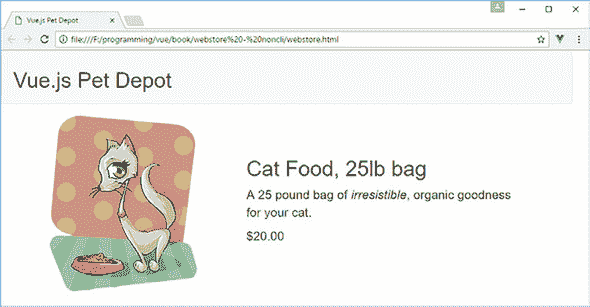

|  |
| --- |

##### BTW

如果你尝试了列表 1.2 中的简单计算器示例，技术上这将是你第二个 Vue 应用。你已经是一位经验丰富的老兵了！

|  |
| --- |

在我们开始之前，请下载浏览器上的 vue-devtools 插件。有关如何下载此插件的更多信息，请参阅附录 A。

#### 2.1.1\. 根 Vue 实例

每个 Vue 应用的核心，无论大小，都是*根 Vue 实例*，简称 Vue 实例。创建根 Vue 实例是通过调用*Vue 构造函数*，`new Vue()`来完成的。构造函数通过编译我们的应用 HTML 模板、初始化实例数据以及创建使应用交互的数据和事件绑定来启动我们的应用。

Vue 构造函数接受一个单一的 JavaScript 对象，称为*选项对象*，`new Vue({ /* options go here */ })`。我们的任务是填充这个对象，使其包含 Vue 构造函数启动应用所需的一切，但为了开始，我们专注于一个单一选项，即`el`选项。

`el`选项被 Vue 用来指定一个 DOM 元素（因此是`el`），Vue 将在这个元素上挂载我们的应用。Vue 将在我们的 HTML 中定位相应的 DOM 元素，并将其用作应用的挂载点。

这段代码是我们 webstore 应用程序的开始。为了使内容更容易理解，我将每个代码列表包含在其自己的文件中，您可以为本章下载这些文件。但为了运行应用程序，您需要将每个文件中的代码片段组合成一个单一的 index.html 文件。是的，随着我们通过本书的进展，index.html 文件会变得相当大，这是正常的。在未来的章节中，我们将讨论将我们的应用程序拆分为单独文件的方法。

如果您想看到本章的完整应用程序，请查找 chapter-02 文件夹中包含的 index.html 文件。（如果您还没有下载与本章相关的代码，请参阅 附录 A，了解如何以及在哪里获取它。）让我们创建我们的第一个 Vue 应用程序。

##### 列表 2.1\. 我们的第一个 Vue 应用程序：chapter-02/first-vue.html

```
<html>
  <head>
    <title>Vue.js Pet Depot</title>
    <script src="https://unpkg.com/vue"></script>                        *1*
    <link rel="stylesheet" type="text/css" href="assets/css/app.css"/>   *2*
    <link rel="stylesheet"
 href="https://maxcdn.bootstrapcdn.com/bootstrap/3.3.7/css/
     bootstrap.min.css" crossorigin="anonymous">
  </head>
  <body>
    <div id="app"></div>                                                 *3*

    <script type="text/javascript">
      var webstore = new Vue({                                           *4*
        el: '#app'                                                       *5*
      });
    </script>
  </body>
</html>
```

+   ***1* 列出了 Vue.js 的 CDN 版本**

+   ***2* 我们内部的 app.css 样式表以及 Bootstrap 样式表**

+   ***3* Vue 将挂载我们的应用程序的元素**

+   ***4* Vue 构造函数**

+   ***5* 列出了用于定位 DOM 挂载点的 CSS 选择器**

标记包含一个具有 CSS ID 选择器的单个 `div` 元素，#`app`。Vue 使用该值来定位我们的 `div` 并将应用程序挂载到它上。此选择器与 CSS 使用的语法相同（例如 `#id, .class`）。

| |
| --- |

##### 注意

在本书的整个过程中，我们将使用 Bootstrap 3 进行所有布局和设计。这效果很好，有助于将重点放在 Vue.js 上。截至本书写作时，Bootstrap 4 已经发布，但由于本书的重点不在于设计，我决定保留 Bootstrap 3。这些示例将在 Bootstrap 4 上工作；但如果您切换到 Bootstrap 4，您可能需要将几个类替换为较新的 Bootstrap 4 类。请记住这一点。

| |
| --- |

如果我们提供的 CSS 选择器解析出多个 DOM 元素，Vue 将将应用程序挂载到匹配选择器的第一个元素上。如果我们有一个包含三个 `div` 元素的 HTML 文档，并且我们以 `new Vue({ el: 'div' })` 的方式调用 Vue 构造函数，Vue 将将应用程序挂载到三个 `div` 元素的第一个上。

如果您需要在单个页面上运行多个 Vue 实例，您可以通过使用唯一的选择器将它们挂载到不同的 DOM 元素上。这可能看起来有些奇怪，但如果您使用 Vue 来构建小型组件，例如图片轮播或网页表单，您就可以很容易地看到如何在单个页面上运行多个根 Vue 实例。

#### 2.1.2\. 确保我们的应用程序正在运行

让我们转到 Chrome 并打开您为第一个 Vue 应用程序创建的文件，从 列表 2.1 开始，尽管它还不会在主浏览器窗口中显示任何内容。（毕竟，没有可见的 HTML！）

页面加载后，如果还没有打开，请打开 JavaScript 控制台，希望你会看到 . . . <鼓声> . . . 完全没有（或者如果你还没有这样做，可能会看到关于下载 vue-devtools 的提示，或者说明你正在以开发模式运行 Vue）。图 2.2 展示了你的控制台可能的样子。

##### 图 2.2\. 没有错误或警告的 JavaScript 控制台。

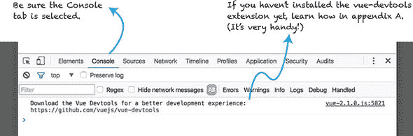

|  |
| --- |

**Vue 调试 101**

即使我们的应用程序目前如此简单，我们在 Chrome 中加载文件时仍然会遇到麻烦。当事情没有按计划进行时，以下是一些需要留意的问题：

+   `Uncaught SyntaxError: Unexpected identifier` 通常表示 JavaScript 代码中存在拼写错误，通常可以追溯到缺少逗号或花括号。你可以点击错误右侧显示的文件名和行号来跳转到相应的代码。请注意，你可能需要向上或向下查找几行才能找到有问题的拼写错误。

+   `[Vue warn]: Property or method "propertyname" is not defined . . .` 告诉你，在实例创建时选项对象中未定义某个属性或方法。检查你的选项对象中是否存在该属性或方法，如果存在，检查其名称是否有拼写错误。还要确保在标记中的名称拼写正确。

在前几次追踪错误时可能会感到沮丧，但一旦解决了一些错误，这个过程就会变得更加自然。

如果你遇到无法解决的问题，或者发现一个特别棘手的错误，你可以在 Vue 论坛的帮助部分查看 [`forum.vuejs.org/c/help`](https://forum.vuejs.org/c/help)，或者在 Vue Gitter 聊天中寻求帮助 [`gitter.im/vuejs/vue`](https://gitter.im/vuejs/vue)。

|  |
| --- |

在 Vue 完成初始化和挂载应用程序后，它返回对根 Vue 实例的引用，我们将它存储在 `webstore` 变量中。我们可以使用这个变量在 JavaScript 控制台中检查我们的应用程序。现在让我们使用它来确保在继续之前我们的应用程序处于活跃和良好的状态。

在控制台打开的情况下，在提示符中输入 `webstore`。结果是我们可以进一步在控制台中检查的 Vue 对象。现在，点击展开三角形 () 来展开对象，查看根 Vue 实例的属性，如 图 2.3 所示。

##### 图 2.3\. 使用 `webstore` 变量显示 Vue 实例的表示并探索其属性。

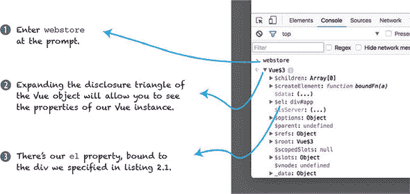

你可能需要滚动一下，但你应该能够找到我们作为应用程序选项对象的一部分指定的`el`属性。在未来的章节中，我们将使用控制台来访问我们的实例进行调试、操作数据以及在应用程序运行时触发行为，以便我们可以验证其是否按预期工作。我们还可以使用 vue-devtools 在应用程序运行时查看其内部情况。（再次提醒，如果你还没有安装 vue-devtools，请访问附录 A 了解如何安装它。）让我们看看它与使用 JavaScript 控制台相比如何。图 2.4 显示了 vue-devtools 的不同部分。

##### 图 2.4. 没有选择任何内容的 vue-devtools 窗口。

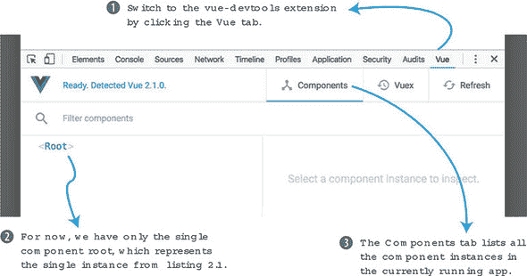

vue-devtools 扩展为检查 Vue 应用程序、其数据和组件之间的关系提供了强大的功能。随着应用程序复杂性的增加，vue-devtools 中的可搜索树视图以 JavaScript 控制台无法实现的方式显示组件之间的关系。我们将在后面的章节中更详细地讨论 Vue 组件以及它们如何与 Vue 实例相关联。

在构建我们的应用程序时，我们将频繁使用这两个工具来聚焦于应用程序中的问题。实际上，我们可以使用 vue-devtools 在 JavaScript 控制台中找到另一种访问应用程序实例的方法，如图 2.5 图 2.5 所示。

##### 图 2.5. 在 vue-devtools 中选定的根实例，实例被动态分配了一个变量。


当你在树视图中选择一个实例，如图 2.5 图 2.5 所示，vue-devtools 会将实例的引用分配给`$vm0`变量。我们可以像使用我们的`webstore`变量一样使用`$vm0`。尝试在 JavaScript 控制台中使用`$vm0`来查看你是否可以检查根 Vue 实例

| |
| --- |

**为什么我们需要多个引用？**

虽然有多个访问同一实例的方法可能看起来是多余的，但拥有这两种方法是有帮助的。

当我们将根 Vue 实例分配给全局变量`webstore`时，我们为自己提供了一种在其他页面上的 JavaScript 代码中引用应用程序的方法。这样做允许我们与其他库、框架或我们的代码集成，这些代码可能需要回指我们的应用程序。

分配给`$vm0`变量的 Vue 实例反映了在 vue-devtools 中做出的当前选择。当一个应用程序由数百个，甚至数千个实例组成时，声明性地为每个实例分配是不切实际的，因此，在检查和调试如此复杂的应用程序时，能够以编程方式访问特定实例的方法变得必不可少。

| |
| --- |

#### 2.1.3. 在视图中显示内容

到目前为止，我们的应用程序一直是个沉闷的体验。让我们通过在应用程序的模板中显示应用程序实例的数据来让它变得生动起来。记住，我们的 Vue 实例使用我们提供的 DOM 元素作为其模板的基础。

我们将首先添加我们网店的名字。这将展示如何将数据传递给 Vue 构造函数，以及如何将数据绑定到视图上。在这个列表中，让我们更新应用程序代码，从 列表 2.1 开始。

##### 列表 2.2\. 添加数据和数据绑定：chapter-02/data-binding.html

```
<html>
  <head>
    <title>Vue.js Pet Depot</title>
    <script src="https://unpkg.com/vue"></script>  </head>
  <body>
    <div id="app">
      <header>                                           *1*
        <h1 v-text="sitename"></h1>                      *2*
      </header>                                          *1*
    </div>

    <script type="text/javascript">
      var webstore = new Vue({
        el: '#app', // <=== Don't forget this comma!
        data: {                                          *3*
          sitename: 'Vue.js Pet Depot'                   *4*
        }                                                *3*
      });
    </script>
  </body>
</html>
```

+   ***1* 在 div 中添加一个页眉元素。**

+   ***2* 显示 sitename 属性的数据绑定**

+   ***3* 向 Vue 选项中添加数据对象**

+   ***4* 显示我们在页眉中绑定的 sitename 属性**

我们已经向传递给 Vue 构造函数的选项中添加了一个数据对象。该数据对象包含一个名为 `sitename` 的单个属性，其中包含我们网店的名字。

我们网站的名字需要一个家，所以我们还在应用程序根 `div` 元素内部的标记中添加了一个页眉元素。在标题元素 `<h1>` 上，我们使用数据绑定指令 `v-text="sitename"`。

`v-text` 指令打印它引用的属性的字符串表示形式。在这种情况下，一旦我们的应用程序启动并运行，我们应该看到一个包含文本“Vue.js Pet Depot”的页眉。 

如果您需要在较长的字符串中显示属性值，您可以使用 Mustache 语法—`{{ property-name }}`—来绑定属性。为了在句子中包含我们网店的名字，您可能写成 `<p>欢迎来到 {{ sitename }}</p>`。

|  |
| --- |

##### 小贴士

Vue 只从 Mustache 中借用 {{ `...` }} 语法进行文本插值，而不是整个 Mustache 规范。但如果你好奇它从哪里来，可以访问在线手册 [`mustache.github.io/mustache.5.html`](https://mustache.github.io/mustache.5.html)。

|  |
| --- |

在我们设置好数据绑定后，让我们看看我们的新页眉在浏览器中的样子。

#### 2.1.4\. 在 Vue 中检查属性

当你在 Chrome 中重新加载应用程序时，你应该看到页眉自豪地显示了我们的 `sitename` 属性的值，如 图 2.6 所示。页眉的视觉外观由第二章的 `assets/css/app.css` 中的样式表提供。我们将使用我们的样式表和 Bootstrap 来设计我们的应用程序。如果您想调整页眉的外观，请打开该文件并找到由 `header h1` 定义的样式。

##### 图 2.6\. 我们 `sitename` 属性在网店页眉中的显示。

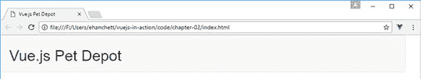

当 Vue 初始化我们的应用程序时，它会自动为数据对象的每个属性创建 getter 和 setter 函数。这使我们能够检索实例属性的当前值或设置新值，而无需编写任何额外的代码。为了看到这些函数的实际效果，让我们首先使用 getter 打印 `sitename` 属性的值。

正如你在图 2.7 中看到的，我们的`sitename`属性的 getter 和 setter 函数在应用实例的根级别暴露。这让我们可以从 JavaScript 控制台或从任何与我们的应用交互的其他 JavaScript 中访问该属性。

##### 图 2.7\. 使用控制台和 vue-devtools 检查我们的`sitename`属性。

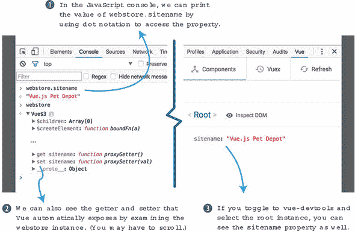

当我们选择`<root>`实例时，你还可以在 vue-devtools 中看到该属性。现在让我们看看当我们使用 setter 在 JavaScript 控制台中设置`sitename`的值时图 2.8 会发生什么。

##### 图 2.8\. 使用 Vue 的属性 getter 和 setter 分别打印和更新`sitename`属性。

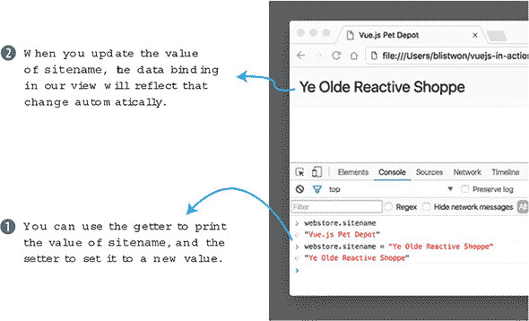

一旦我们为`sitename`提供新的值并按 Enter 键，我们头部元素中的输出会自动更新。这是 Vue 的事件循环在起作用。让我们看看 Vue 生命周期，看看我们的数据更改是如何以及何时触发视图更新的。

### 2.2\. Vue 生命周期

当 Vue 应用首次实例化时，它开始通过一系列称为 Vue 生命周期的共同事件序列。尽管长时间运行的 Vue 应用可能会在事件循环中花费大部分时间，但库本身的繁重工作大部分发生在应用首次创建时。让我们从图 2.9 中高屋建瓴地看看生命周期。

##### 图 2.9\. Vue 生命周期的图示，分为四个阶段。

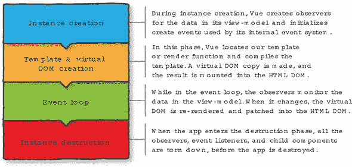

每个阶段都建立在之前阶段的基础上，以创建 Vue 生命周期。你可能想知道虚拟 DOM 是什么以及渲染函数是如何工作的。*虚拟 DOM*是一个轻量级的抽象，代表 DOM。它模仿了浏览器通常访问的 DOM 树。Vue 可以比浏览器特定的 DOM 更快地对虚拟 DOM 进行更新。渲染函数是 Vue 向用户显示信息的方式。有关 Vue 实例和生命周期钩子的更多信息，请参阅官方指南[`vuejs.org/v2/guide/instance.html`](https://vuejs.org/v2/guide/instance.html)。

#### 2.2.1\. 添加生命周期钩子

为了看到我们的应用实例通过生命周期的不同阶段，我们可以为 Vue 的生命周期钩子编写回调函数。让我们更新我们的主应用文件（index.html）中的代码列表 2.3。

|  |
| --- |

##### 信息

*钩子*是一个被“钩”到 Vue 库代码的一部分的函数。每当 Vue 在执行过程中到达该代码部分时，它会调用你定义的函数，如果没有事情要做，则继续执行。

|  |
| --- |

##### 列表 2.3\. 向我们的实例添加生命周期钩子：chapter-02/life-cycle-hooks.js

```
var APP_LOG_LIFECYCLE_EVENTS = true;        *1*

var webstore = new Vue({
  el: "#app",
  data: {
    sitename: "Vue.js Pet Depot",
  },
  beforeCreate: function() {                *2*
    if (APP_LOG_LIFECYCLE_EVENTS) {         *2*
      console.log("beforeCreate");          *2*
    }                                       *2*
  },                                        *2*
  created: function() {                     *3*
    if (APP_LOG_LIFECYCLE_EVENTS) {         *3*
      console.log("created");               *3*
    }                                       *3*
  },                                        *3*
  beforeMount: function() {                 *4*
    if (APP_LOG_LIFECYCLE_EVENTS) {         *4*
      console.log("beforeMount");           *4*
    }                                       *4*
  },                                        *4*
  mounted:  function() {                    *5*
    if (APP_LOG_LIFECYCLE_EVENTS) {         *5*
      console.log("mounted");               *5*
    }                                       *5*
  },                                        *5*
  beforeUpdate:  function() {               *6*
    if (APP_LOG_LIFECYCLE_EVENTS) {         *6*
      console.log("beforeUpdate");          *6*
    }                                       *6*
  },                                        *6*
  updated:  function() {                    *7*
    if (APP_LOG_LIFECYCLE_EVENTS) {         *7*
      console.log("updated");               *7*
    }                                       *7*
  },                                        *7*
  beforeDestroy:  function() {              *8*
    if (APP_LOG_LIFECYCLE_EVENTS) {         *8*
      console.log("beforeDestroy ");        *8*
    }                                       *8*
  },                                        *8*
  destroyed:  function() {                  *9*
    if (APP_LOG_LIFECYCLE_EVENTS) {         *9*
      console.log("destroyed");             *9*
    }                                       *9*
  }                                         *9*
});
```

+   ***1* 显示一个用于启用或禁用我们的回调的变量**

+   ***2* 记录 beforeCreate 事件**

+   ***3* 记录 created 事件**

+   ***4* 记录 beforeMount 事件**

+   ***5* 记录 mounted 事件**

+   ***6* 记录 beforeUpdate 事件**

+   ***7* 记录更新事件**

+   ***8* 记录销毁前事件**

+   ***9* 记录销毁事件**

在列表 2.3 中，你首先会注意到我们定义了一个变量，`APP_LOG_LIFECYCLE_EVENTS`，我们可以使用它来启用或禁用生命周期事件的记录。我们在 Vue 实例外部定义我们的变量，这样它就可以被根实例或我们稍后编写的任何子组件全局使用。此外，如果我们将其定义在我们的应用程序实例内部，它将不可用于 `beforeCreate` 回调，因为它尚未创建！

|  |
| --- |

##### 注意

`APP_LOG_LIFECYCLE_EVENTS` 使用通常为常量定义保留的大写语法，因为，当我们稍后在书中开始使用 ECMAScript 6 时，我们将使用 `const` 特性来创建常量。提前规划意味着我们不需要在代码的其他部分进行查找和替换来更改名称。

|  |
| --- |

代码的其余部分定义了在遇到每个生命周期事件时记录这些事件的函数。让我们回顾一下我们对 `sitename` 属性的 console 探索，看看 Vue 生命周期中会发生什么。

#### 2.2.2\. 探索生命周期代码

如果你打开 Chrome 的控制台并重新加载应用，你应该会立即看到我们的一些回调函数的输出，就像在图 2.10 中看到的那样。

##### 图 2.10\. 我们的一些生命周期函数的输出可以在控制台中看到。

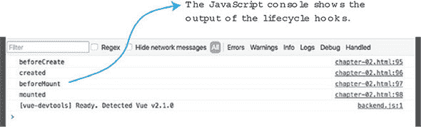

如你所料，前四个生命周期钩子在 Vue 创建和挂载我们的应用程序时被触发。为了测试其他钩子，我们需要与控制台进行一些交互。首先，让我们通过为我们的站点设置一个新的名称来触发更新回调。图 2.11 展示了如何做到这一点。

##### 图 2.11\. 设置 `sitename` 属性会触发更新生命周期回调。

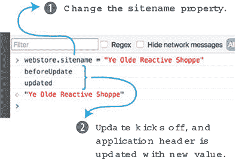

当你更改 `sitename` 属性时，更新周期就会启动，因为应用程序标题中的数据绑定会更新为新值。现在让我们销毁我们的应用程序！（别担心，它会通过重新加载立即回来。）为了触发最后的两个生命周期钩子，我们使用实例的 `$destroy` 方法。

|  |
| --- |

##### 提示

Vue 在我们的实例上创建的特殊方法可以通过 `$` 前缀使用。有关 Vue 的生命周期实例方法的更多信息，您可以访问 API 文档[`vuejs.org/v2/api/#Instance-Methods-Lifecycle`](https://vuejs.org/v2/api/#Instance-Methods-Lifecycle)。

|  |
| --- |

这最后两个钩子通常用于应用程序或组件中的清理活动。如果我们的应用程序创建了一个第三方库的实例，我们应该调用该库的拆解代码，或者手动取消对该实例的任何引用，以避免泄漏分配给我们的应用程序的内存。图 2.12 展示了调用 `$destroy()` 实例方法将如何触发销毁钩子。

##### 图 2.12\. 调用销毁实例方法将触发最后的生命周期回调对。

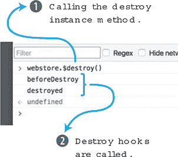

#### 2.2.3\. 保留生命周期代码，还是不保留

生命周期钩子提供了查看应用程序运行时发生情况的好方法，但我要首先承认，需要记录消息到控制台需要重复且冗长的代码。因为它们相当庞大，所以从现在起，我不会在代码列表中包含这些调试函数，但我们会偶尔使用生命周期钩子来探索新的行为或出于应用程序本身的功能原因。

如果你保留这些钩子，并且控制台输出变得过于嘈杂，你可以通过将 `APP_LOG_LIFECYCLE_EVENTS` 设置为 `false` 来禁用日志记录。请记住，你可以通过更改 index.html 中的值来完全禁用它们，或者你可以通过在运行时使用 JavaScript 控制台设置值来临时切换日志记录的开和关。

### 2.3\. 展示产品

显示我们网店的名字是一个好的开始，但在继续之前，我们还需要涵盖显示数据的一些其他方面。我们的网店将以几种方式之一展示产品：列表形式、网格形式、特色产品，以及单独的产品页面。在设计并标记每个视图时，我们将继续使用相同的数据，但我们将使用 Vue 的功能以不同的方式来操作它，而不会改变其基本值或结构。

#### 2.3.1\. 定义产品数据

目前，我们只将展示单个产品，所以让我们向我们的 `data` 对象添加一个示例产品。

##### 列表 2.4\. 向我们的 Vue 实例添加产品数据：chapter-02/product-data.js

```
data: {
  sitename: "Vue.js Pet Depot",
  product: {                                                  *1*
    id: 1001,                                                 *2*
    title: "Cat Food, 25lb bag",                              *2*
    description: "A 25 pound bag of <em>irresistible</em>,"+  *2*
                  "organic goodness for your cat.",           *2*
    price: 2000,                                              *2*
    image: "assets/images/product-fullsize.png"               *2*
  }
},
```

+   ***1* 产品数据对象**

+   ***2* 产品属性是产品对象属性。**

向我们的 `data` 选项添加 `product` 对象相对简单：

+   ***`id` 属性用于唯一标识一个产品。*** 如果我们添加更多产品，该属性将递增。

+   ***尽管标题和描述属性都是字符串，但描述包含 HTML 标记。*** 当我们展示产品标记中的每个值时，我们将探讨这意味着什么。

+   ***价格属性表示我们产品的成本，以整数形式。*** 这简化了我们将要进行的计算，并且这种格式避免了在数据库中将值存储为浮点数或字符串时可能发生的破坏性类型转换。

+   ***图像属性提供了一个指向我们产品主图像文件的路径。*** 我们将在这方面进行很多迭代，所以如果你在这里看到硬编码的路径让你感到紧张，请放心，因为我们将会探索更好的选项。

在我们的数据就绪后，让我们加快我们的视图。

#### 2.3.2\. 标记产品视图

现在我们可以专注于向我们的 HTML 添加产品标记。在标题元素下方，我们将添加一个主元素，该元素作为我们应用程序内容的主体容器。主元素 `<main>` 是 HTML5 的新增内容，旨在包含网页或应用程序的主要内容。

|  |
| --- |

##### 信息

有关主要元素（以及其他元素）的更多信息，请首先访问 [www.quackit.com/html_5/tags/html_main_tag.cfm](http://www.quackit.com/html_5/tags/html_main_tag.cfm).

| |
| --- |

产品布局使用两列，以便将产品图片显示在产品信息旁边（图 2.13）。我们的样式表（chapter-02/assets/css/app.css）已经定义了所有列样式，所以我们只需要在我们的标记中包含适当的类名。

##### 清单 2.5\. 添加产品标记：chapter-02/product-markup.html

```
<main>
  <div class="row product">
    <div class="col">
      <figure>
                     *1*
      </figure>
    </div>
    <div class="col col-expand">
      <h1 v-text="product.title"></h1>               *2*
      <p v-text="product.description"></p>           *2*
      <p v-text="product.price" class="price"></p>   *2*
    </div>
  </div>
</main>
```

+   ***1* 产品图片路径使用 v-bind 指令绑定到 img 标签的 src 属性。**

+   ***2* 其他产品属性使用 v-text 指令显示。**

你会立即注意到数据绑定中使用了 JavaScript 点表示法。因为 `product` 是一个对象，我们必须为每个绑定提供到属性的完整路径。我们产品数据的大多数属性（标题、描述和价格）都是使用 `v-text` 指令绑定的，这与我们在页眉中绑定 `sitename` 属性的方式相同。

产品图片路径引入了一个 *属性绑定*。我们使用 `v-bind` 指令，因为元素属性不能使用简单的文本插值进行绑定。任何有效的元素属性都可以使用 `v-bind` 指令进行绑定，但需要注意的是，对于样式、类名和其他场景有特殊案例，我们将在未来的章节中介绍。

| |
| --- |

##### 注意

你可以为 `v-bind` 指令使用缩写。不需要每次使用时都输入 `v-bind`，你可以去掉 `v-bind` 并输入 `:`, 因此，你不需要使用 `v-bind:src=" ... "`，而是可以输入 `:src=" ... "`.

| |
| --- |
| |

**在绑定中使用表达式**

我们不需要将数据绑定限制在我们的数据属性上。Vue 允许我们在任何绑定中使用任何有效的 JavaScript 表达式。一些使用 清单 2.5 中的代码的例子可能包括：

```
{{ product.title.toUpperCase() }} -> CAT FOOD, 25LB BAG
{{ product.title.substr(4,4) }} -> Food
{{ product.price - (product.price * 0.25)  }} -> 1500
 -> 
```

虽然以这种方式使用表达式很方便，但它将逻辑引入了视图，而几乎总是更好的是将这种逻辑放在负责视图数据的应用程序或组件的 JavaScript 代码中。此外，这种表达式使得推理应用程序数据被操作的位置变得困难，尤其是在应用程序的复杂性增加时。

通常，使用内联表达式是在应用程序中正式化该功能之前测试某事的好方法。

下一节和即将到来的章节介绍了在不损害我们视图或应用程序数据完整性的情况下，从现有值中操作、过滤和推导数据的最佳实践。有关表达式是什么的详细信息，请访问 [`vuejs.org/v2/guide/syntax.html#Using-JavaScript-Expressions`](https://vuejs.org/v2/guide/syntax.html#Using-JavaScript-Expressions).

| |
| --- |

让我们切换到 Chrome，重新加载页面，并确认产品信息按设计显示。

##### 图 2.13\. 我们的产品已显示，但有一些我们需要清理的问题。

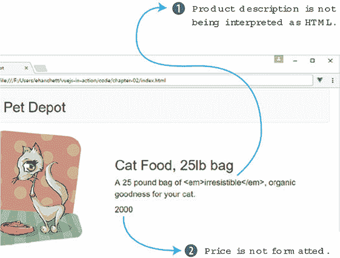

哎呀，我们有一些事情要处理：

1.  产品描述正在以字符串形式输出，并且没有解释描述值中嵌入的 HTML。

1.  产品价格以整数 2000 的字符串表示形式显示，而不是以良好的美元数字格式显示。

让我们先解决第一个问题。我们需要的是一个 *HTML 指令*，因此让我们使用 `v-html` 绑定更新产品标记，以输出预期的产品描述。

##### 列表 2.6\. 添加产品标记：chapter-02/product-markup-cont.html

```
<main>
  <div class="row product">
    <div class="col">
      <figure>
        
      </figure>
    </div>
    <div class="col col-expand">
      <h1 v-text="product.title"></h1>
      <p v-html="product.description"></p>               *1*
      <p v-text="product.price" class="price"></p>
    </div>
  </div>
</main>
```

+   ***1* 使用 HTML 指令以 HTML 格式输出产品描述，而不是纯文本**

在 Chrome 中重新加载应用程序应现在将产品描述的值以 HTML 格式显示，并且强调标签应使“irresistible”一词斜体，如图 2.14 所示。

##### 图 2.14\. 使用 `v-html` 绑定允许我们以原始 HTML 格式显示描述。

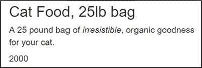

`v-html` 绑定将渲染绑定属性为原始 HTML。这可能很有用，但应谨慎使用，并且仅在值是您可以信任的情况下使用。现在我们需要修复那个讨厌的价格值显示。

|  |
| --- |

**跨站脚本攻击**

当我们直接将 HTML 代码插入到视图中编写代码时，我们使我们的应用程序容易受到跨站脚本（XSS）攻击。

在高层次上，如果恶意行为者访问我们的网站，并使用我们未清理的表单在我们的数据库中保存恶意 JavaScript，那么当我们将该代码输出到 HTML 时，我们就容易受到攻击。

通常，最佳实践规定，我们至少应遵循有关 HTML 和内容的基本原则：

+   在使用 HTML 插值时，仅输出可信内容。

+   无论内容审查得多仔细，在使用 HTML 插值时，永远不要输出用户生成的内容。

+   如果绝对需要，尝试使用具有其自己的模板的组件来实现功能，而不是允许在文本输入中包含 HTML 元素。

要获得 XSS 的全面、清晰的概述，请从这篇文章开始[`excess-xss.com/`](https://excess-xss.com/)，要深入了解攻击和每个利用的示例代码，请参考 OWASP 维基[www.owasp.org/index.php/Cross-site_Scripting_(XSS)](http://www.owasp.org/index.php/Cross-site_Scripting_(XSS))。

|  |
| --- |

### 2.4\. 应用输出过滤器

最后要做的就是以熟悉的格式显示我们的产品价格，而不是以原始整数的形式。输出过滤器让我们在值显示在我们的标记之前对其应用格式。输出过滤器的通用格式是 `{{ property | filter }}`。在我们的情况下，我们希望将产品的价格格式化为 $20.00，而不是 2000。

#### 2.4.1\. 编写过滤器函数

*输出过滤器*是接收一个值、执行格式化任务并返回格式化值以供输出的函数。当作为文本插值的一部分使用时，传递给过滤器的值是我们绑定的属性。

我们所有的输出过滤器都位于传递给我们的 Vue 实例的选项中的`filters`对象中，因此我们将在以下列表中添加我们的价格格式化器。

##### 列表 2.7\. 添加`formatPrice`过滤器：chapter-02/format-price.js

```
var webstore = new Vue({
  el: '#app',
  data: { ... },
  filters: {                                                  *1*
    formatPrice: function(price) {                            *2*
      if (!parseInt(price)) { return ""; }                    *3*
      if (price > 99999) {                                    *4*
        var priceString = (price / 100).toFixed(2);           *5*
        var priceArray = priceString.split("").reverse();     *6*
        var index = 3;                                        *6*
        while (priceArray.length > index + 3) {               *6*
          priceArray.splice(index+3, 0, ",");                 *6*
          index += 4;                                         *6*
        }                                                     *6*
        return "$" + priceArray.reverse().join("");           *7*
      } else {
        return "$" + (price / 100).toFixed(2);              *8*
      }
    }
  }
});
```

+   ***1* 过滤器选项包含输出过滤器。**

+   ***2* `formatPrice`函数接受一个整数并格式化价格值。**

+   ***3* 如果我们无法获取整数，则立即返回。**

+   ***4* 格式化$1,000 及以上的值**

+   ***5* 将值转换为十进制**

+   ***6* 每三位数添加逗号**

+   ***7* 返回格式化的值**

+   ***8* 如果小于$1,000，则返回格式化的十进制值**

`formatPrice`函数接受一个整数，并返回一个格式化成类似美国美元价值的字符串。一般来说，它将返回类似$12,345.67 的值。根据提供的整数值的大小，函数将按以下方式分支：

1.  如果输入大于 99,999（相当于$999.99），则输出需要在小数点左侧每三位数字添加逗号，因此我们需要相应地处理它。

1.  否则，可以使用`.toFixed`将输入转换为十进制，并返回，因为不需要逗号。

|  |
| --- |

##### 注意

你可能能找到无数种格式化美元数字的方法，这些方法可能更高效、更简洁，或者满足你寻找的任何质量。在这里，我尽量在清晰和便捷之间做出选择。为了了解问题的复杂性和解决方案的数量，请查看这篇帖子[`mng.bz/qusZ`](http://mng.bz/qusZ)。

|  |
| --- |

#### 2.4.2\. 将过滤器添加到我们的标记中并测试不同的值

要使用我们全新的过滤器函数，我们需要将其添加到产品价格的绑定中。我们还需要更新我们的价格绑定，以使用 Mustache 风格的绑定来应用过滤器，如下所示。过滤器不能与`v-text`绑定语法一起使用。

##### 列表 2.8\. 添加产品标记：chapter-02/v-text-binding.html

```
<main>
  <div class="row product">
    <div class="col">
      <figure>
        
      </figure>
    </div>
    <div class="col col-expand">
      <h1>{{ product.title }}</h1>
      <p v-html="product.description"></p>
      <p class="price">                         *1*
        {{ product.price | formatPrice }}       *1*
      </p>                                      *1*
    </div>
  </div>
</main>
```

+   ***1* 使用我们新的输出过滤器来格式化产品价格的值**

记住，带有过滤器的绑定具有通用形式`{{ property | filter }}`，因此我们已经相应地更新了我们的价格绑定，`{{ product.price | formatPrice }}`。切换回 Chrome，刷新，哇，我们得到了如图 2.15 所示的格式化价格图 2.15。

##### 图 2.15\. 我们的价格格式化器为我们的价格属性值的显示添加了美元符号和适当的标点符号。

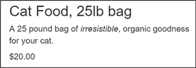

如果我们在控制台中调整我们的数据，我们可以实时看到我们的过滤器是如何应用于不同的产品价格值的。要尝试不同的值，请打开控制台，并使用如下语句设置`product.price`的值：`webstore.product.price = 150000000`。

图 2.16 显示了更新产品价格后会发生什么。确保尝试小（< 100）和大（> 10000000）的值，以确保每个值都格式正确。

##### 图 2.16：更新产品价格会触发我们的生命周期事件（如果你仍然启用了它们），以及价格的更新，现在这个更新会通过我们的过滤器函数。

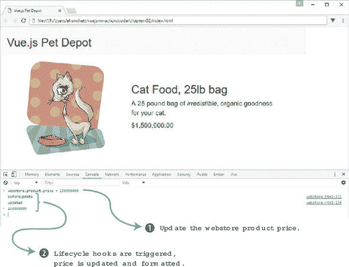

### 练习

使用本章的知识来回答这个问题：

+   在第 2.4 节中，我们为价格创建了一个过滤器。你能想到其他可能有助于的过滤器吗？

*请参见附录 B 中的解决方案。*

### 概述

+   Vue 为你提供了向你的应用程序添加交互性的能力。

+   在任何时候，我们都可以挂钩到 Vue 的生命周期来帮助执行某些功能。

+   Vue.js 提供了强大的过滤器来帮助以特定方式显示信息。
