## 第二部分\. 视图和视图模型

这本书的精髓在于视图和视图模型部分。这些章节更深入地探讨了 Vue 以及构成 Vue 应用程序的所有元素和部分。我们将从简单开始，为我们的应用程序添加交互性。然后我们将转向表单和输入、条件语句和循环。

最重要的几个概念在第六章和第七章中，我们深入探讨了组件。这些确实是我们的应用程序的构建块。这是我们将看到单文件组件的第一个章节——这是 Vue.js 工具箱中的一个强大工具。

后两章将探讨过渡、动画以及如何扩展 Vue。这将使我们的应用程序更高效，外观也更漂亮。

## 第三章\. 添加交互性

*本章涵盖*

+   使用计算属性从数据中派生新的输出

+   将事件绑定添加到 DOM

+   在 Vue 生命周期更新部分观察数据

+   响应用户交互

+   条件渲染标记

信不信由你，现在我们已经将我们的第一个产品全部连接好了，我们准备好为我们的网店添加交互了。

为应用程序添加交互性意味着绑定到 DOM 事件，在应用程序代码中响应它们，并给用户提供关于他们行动所发生的事情的反馈。Vue 为我们创建和管理所有的事件和数据绑定，但我们需要做出一些决定，关于如何在我们的应用程序中操作数据，以及如何在我们的界面中满足用户期望。

我们将通过让客户将我们的单个产品添加到购物车中来开始探索用户交互，但在这个过程中，我们也会看看我们的工作如何融入 Vue 应用程序的整体画面。

为了了解本章我们将要走向何方，图 3.1 显示了当我们的所有工作都完成时应用程序将看起来如何。

##### 图 3.1\. 我们的产品列表，包含新元素：购物车和“添加到购物车”按钮。

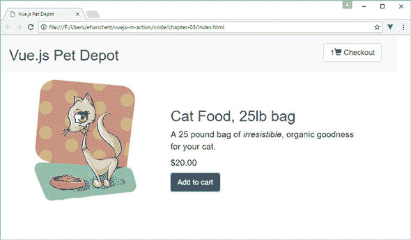

### 3.1\. 购物车数据从添加一个数组开始

在我们能够构建任何超级酷的购物车功能之前，我们需要一个容器来存储我们应用程序实例中的所有这些商品。幸运的是，在这个阶段我们只需要一个简单的数组，我们将把我们的产品推送到这个数组上。

我已经将代码拆分成小的片段，类似于我们在上一章中所做的那样。您需要将这些添加到上一章中创建的 index.html 文件中，以继续应用程序。如果需要，您始终可以下载本章的代码。

##### 列表 3.1\. 我们只需要一个数组：chapter-03/add-array.js

```
data: {
  sitename: "Vue.js Pet Depot",
  product: {                                                 *1*
    id: 1001,                                                *1*
    title: "Cat Food, 25lb bag",                             *1*
    description: "A 25 pound bag of <em>irresistible</em>,   *1*
                  organic goodness for your cat.",           *1*
    price: 2000,                                             *1*
    image: "assets/images/product-fullsize.png",             *1*
  },
  cart: []                                                   *2*
},
...
```

+   ***1* 显示我们的现有产品数据，仅供参考**

+   ***2* 显示用于存储购物车商品的数组**

这就给我们提供了购物车……完成了。不过，说真的，我们将从这个简单的数组中获得很多好处，但最终我们将创建一个可以内部管理其内容的购物车组件。

| |
| --- |

##### 记住

在你添加购物车数组之前，需要在列表 3.1 中的`product`后面添加一个逗号。忘记添加逗号会在控制台抛出错误，这是一个常见的陷阱。（我非常熟悉的一个错误！）

|  |
| --- |

### 3.2\. 绑定到 DOM 事件

为了给我们的应用程序添加交互，我们需要将 DOM 元素绑定到我们在 Vue 实例中定义的函数。我们可以通过使用*事件绑定*将任何标准 DOM 事件（如点击、mouseup、keyup 等）绑定到元素。Vue 会处理所有底层的连接，这样我们就可以专注于应用程序如何对事件做出反应。

#### 3.2.1\. 事件绑定基础

事件绑定使用`v-on`指令将一小段 JavaScript 或函数绑定到 DOM 元素，如图 3.2 所示。当指定的 DOM 事件被触发时，绑定的代码或函数将被执行。

##### 图 3.2\. 事件绑定的语法。

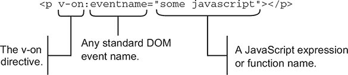

这里是事件绑定 JavaScript 的两种常见模式：

1.  ***使用函数名，我们可以将事件绑定到我们在实例中定义的函数。*** 如果我们有一个绑定，如`v-on:click="clickHappened"`，那么点击我们的元素将调用`clickHappened`函数。

1.  ***我们可以编写内联 JavaScript 来作用于一个公开的属性。*** 在这个例子中，绑定可能看起来像`v-on:keyup="charactersRemaining -= 1"`，这将减少`charactersRemaining`属性一个单位。

每种策略在应用程序中都有其位置，但首先我们将看看如何使用函数来处理事件。

|  |
| --- |

##### 注意

存在一种更简短的`v-on`指令的写法。你不需要使用`v-on`，你可以用`@`符号替换它。例如，如果你想使用`v-on:click="..."`，你可以用`@click="..."`来代替。我们将在本书的后面使用这个简写。

|  |
| --- |

#### 3.2.2\. 将事件绑定到“添加到购物车”按钮

为了让客户将产品添加到他们的购物车中，他们需要一个按钮。我们将指示 Vue 将按钮的点击事件绑定到处理将产品推入`cart`数组的函数。

在我们将按钮添加到标记之前，我们应该编写我们的函数。为此，我们需要向应用程序的选项中添加一个`methods`对象。在`filters`对象之后，添加以下代码。（别忘了在`filters`对象后面加逗号！）

##### 列表 3.2\. `addToCart`方法：chapter-03/add-to-cart.js

```
methods: {                                *1*
  addToCart: function() {                 *2*
    this.cart.push( this.product.id );    *2*
  }                                       *2*
}                                         *1*
```

+   ***1* 方法对象包含我们的新函数。**

+   ***2* 定义了`addToCart`函数**

目前，将产品添加到购物车意味着将产品数据的`id`属性推入`cart`数组。请注意，你需要添加`this`关键字来访问所有数据属性。

|  |
| --- |

**推动理念，而非对象**

从列表 3.2 中的代码来看，将整个产品对象推送到我们的`cart`数组中（`this.cart.push( this.product );`）可能看起来更简单，但如果我们这样做，事情会变得有些尴尬。JavaScript 既不是纯按引用传递语言，也不是纯按副本传递语言，所以需要一些实践才能知道何时会发生哪种情况。

将产品推送到`cart`数组中会推送一个指向我们数据中定义的产品对象的引用，而不是一个副本。如果我们从服务器检索新的产品数据，产品定义可能会在购物车中替换，或者引用可能变为`undefined`。

通过将产品`id`推送到`cart`数组中，我们推送的是产品`id`值的副本，而不是引用。如果产品定义发生变化，`cart`数组中的值保持不变。

从技术上来说，JavaScript 是一种按共享调用语言。你可以在维基百科上找到关于按共享的简要解释，以及它与其他策略的比较：[`en.wikipedia.org/wiki/Evaluation_strategy#Call_by_sharing`](https://en.wikipedia.org/wiki/Evaluation_strategy#Call_by_sharing)。

|  |
| --- |

现在我们有一个函数可以添加产品到我们的购物车，所以我们可以继续添加按钮标记。在我们的产品`div`中的价格标记之后，添加此列表中的按钮。

##### 列表 3.3\. 添加到购物车的按钮：chapter-03/button-product.js

```
<button class="default"           *1*
  v-on:click="addToCart">         *2*
  Add to cart
</button>                         *1*
```

+   ***1* 显示我们的“添加到购物车”按钮**

+   ***2* 将按钮的点击事件绑定到 addToCart 函数**

现在，当访客点击这个按钮时，会调用`addToCart`函数。是时候试一试了。

打开 Chrome，确保控制台是打开的，并切换到 Vue 标签，因为我们想查看添加到我们的购物车中的数据。`cart`数组应该是空的，所以如果你没有看到如图 3.3 中所示的`Array[0]`，请继续并重新加载页面。

##### 图 3.3\. 在添加任何产品之前，我们应该看到一个空数组。如果它不为空，请继续并重新加载页面。

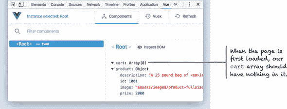

现在，多次点击“添加到购物车”按钮。打开 vue-devtools 面板并点击`<Root>`。你应该会看到每次点击都会将产品的`id`推送到数组中，就像在图 3.4 中看到的那样。

##### 图 3.4\. 随着你向购物车添加商品，数组会填满。

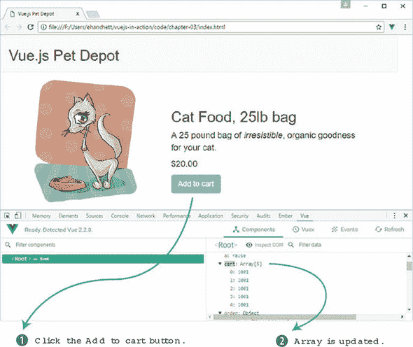

使用 vue-devtools 或控制台查看购物车中的商品数量可能对开发者来说是可以的，但客户需要在视图中得到反馈。是时候添加一个项目计数器了。

### 3.3\. 添加购物车项目按钮和计数

为了显示客户购物车中的项目数量，我们将使用一个*计算属性*。计算属性可以像我们的实例定义的任何其他属性一样绑定到 DOM，但它们通常提供从应用程序当前状态推导新信息的功能。此外，我们还将添加一个购物车项目按钮，用于显示我们的结账购物车。

在我们将项目数量添加到购物车之前，让我们更广泛地了解一下计算属性以及它们是如何工作的。

#### 3.3.1\. 何时使用计算属性

将`data`对象中的属性视为代表我们在数据库中存储的数据，将计算属性视为主要用于视图上下文中的动态值，可能会有所帮助。这可能是一个过于宽泛的描述，但它可以作为一条很好的经验法则。

让我们考虑一个常见的计算属性示例，它显示用户的全名，如列表 3.4 所示。在数据库中将某人的首名和姓氏作为单独的实体存储是有意义的，但存储他们的全名将是冗余且容易出错的。如果需要显示用户的全名，从现有数据中组合首名和姓氏是计算属性的一个完美用例。

##### 列表 3.4\. 计算用户的全名：chapter-03/computed.js

```
computed: {
  fullName: function() {                                *1*
    return [this.firstName, this.lastName].join(' ');   *1*
  }                                                     *1*
}
```

+   ***1* `fullName`返回用户的首名和姓氏，由一个空格连接。**

`fullName`函数返回的结果在概念上等同于在我们的数据对象中有一个`fullName`属性，这意味着我们可以在我们的标记中轻松地绑定到它（参见图 3.5）。

##### 图 3.5\. 将用户的数据集中的首名和姓氏组合成一个用于显示的完整姓名。

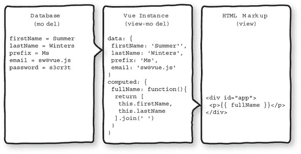

使用计算属性的一个额外好处是我们可以更改函数的内部结构，以使用来自应用程序的不同或附加数据。例如，在图 3.5 中，我们可以使用`prefix`属性为用户的完整姓名添加更多正式性。

以这种方式使用计算属性，我们可以组合或以其他方式操作任何实例数据，而无需对后端或数据库进行更改。

#### 3.3.2\. 使用计算属性检查更新事件

由于计算属性通常使用实例数据进行计算，因此当底层数据发生变化时，它们的返回值会自动更新。因此，绑定到计算属性的任何视图标记都会更新以反映新值。

这种行为是 Vue 实例生命周期中更新周期的核心。为了了解更新周期的行为，让我们通过另一个例子来探讨何时计算属性是这项工作的完美选择。考虑根据矩形的长度和宽度计算面积的任务。

##### 列表 3.5\. 计算矩形的面积：chapter-03/computed-rect.js

```
new Vue({
  data: {
    length: 5,                            *1*
    width: 3                              *1*
  },
  computed: {
    area: function() {                    *2*
      return this.length * this.width;    *2*
    }                                     *2*
  }
});
```

+   ***1* 显示了一个包含长度和宽度属性的数据对象**

+   ***2* 展示了一个暴露区域与数据属性相同的计算属性**

计算属性 `area` 将有一个初始值 15。任何对 `length` 或 `width` 的后续更改都会引发一系列应用程序的更新：

1.  当 `length` 或 `width` 的值发生变化时 . . .

1.  . . . 计算属性 `area` 会被重新计算 . . .

1.  . . . 然后任何绑定到这些属性的标记都会更新。

图 3.6 展示了应用程序的更新周期。

##### 图 3.6\. 实例数据的变化触发了应用程序更新周期内的活动级联。

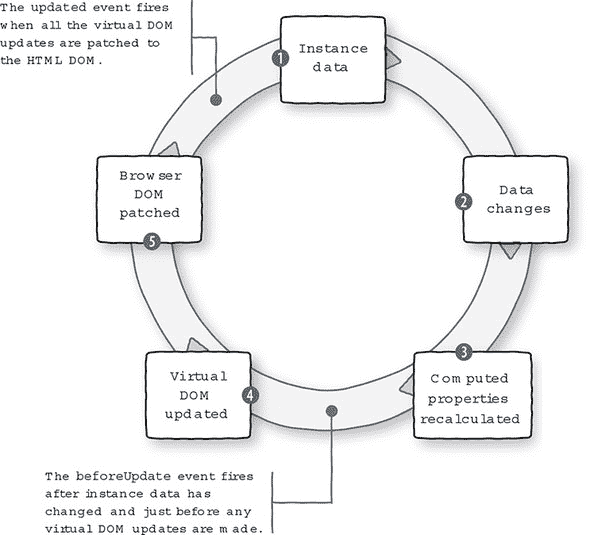

我们可以通过使用 *watch 函数* 来观察实例中的数据何时发生变化，以及 `beforeUpdate` 生命周期钩子（它应该在数据更改后执行）来看到生命周期在实际中的应用。

|  |
| --- |

##### 信息

一个 watch 函数的工作方式与生命周期钩子相同，但它是在它所“监视”的数据更新时被触发的。我们甚至可以创建一个 watch 函数来观察一个计算属性。

|  |
| --- |

列表 3.6 将我们的面积计算放在一个完整应用程序的上下文中。该应用程序还包含三个 watch 函数，每当 `length`、`width` 或 `area` 发生变化时，这些函数都会将消息记录到控制台，并且还有一个函数用于记录更新周期开始时的情况。这些函数必须在 Vue 实例的 watch 选项中指定，才能正常工作。

|  |
| --- |

##### 提示

您可以在本章提供的示例文件 chapter-03/area.html 中找到此列表的代码。它是完全自包含的，因此您可以直接在 Chrome 中打开它。

|  |
| --- |

##### 列表 3.6\. 计算属性和更新事件记录：chapter-03/area.html

```
<html>
<head>
  <title>Calculating Area - Vue.js in Action</title>
  <script src="https://unpkg.com/vue/dist/vue.js"
    type="text/javascript"></script>
</head>
<body>
  <div id="app">
    <p>
      Area is equal to: {{ area }}                           *1*
    </p>
    <p>
      <button v-on:click="length += 1">Add length</button>   *2*
      <button v-on:click="width += 1">Add width</button>     *2*
    </p>
  </div>
  <script type="text/javascript">
    var app = new Vue({
      el: '#app',
      data: {
        length: 5,                                           *3*
        width: 3                                             *3*
      },
      computed: {
        area: function() {                                   *4*
          return this.width * this.length;                   *4*
        }                                                    *4*
      },
      watch: {
        length: function(newVal, oldVal) {                   *5*
          console.log('The old value of length was: '        *5*
                      + oldVal +                             *5*
                      '\nThe new value of length is: '       *5*
                      + newVal);                             *5*
        },
        width: function(newVal, oldVal) {                    *6*
          console.log('The old value of width was: '         *6*
                      + oldVal +                             *6*
                      '\nThe new value of width is: '        *6*
                      + newVal);                             *6*
        },
        area: function(newVal, oldVal) {                     *7*
          console.log('The old value of area was: '          *7*
                      + oldVal +                             *7*
                      '\nThe new value of area is: '         *7*
                      + newVal);                             *7*
        }
      },
      beforeUpdate: function() {                             *8*
        console.log('All those data changes happened '       *8*
                    + 'before the output gets updated.');    *8*
      }
    });
  </script>
</body>
</html>
```

+   ***1* 列出了显示面积值的绑定数据**

+   ***2* 展示了分别增加长度或宽度值的按钮**

+   ***3* 展示长度和宽度的原始值**

+   ***4* 给出面积计算属性**

+   ***5* 展示了当长度变化时记录日志的功能**

+   ***6* 展示了当宽度变化时记录日志的功能**

+   ***7* 展示了当区域变化时记录日志的功能**

+   ***8* 列出了 beforeUpdate 生命周期钩子函数**

当您在 Chrome 中加载此文件时，您会看到 `area` 的初始值是 15，如图 图 3.7 所示。请确保 JavaScript 控制台已打开，然后尝试点击按钮以触发更新周期。当点击“增加长度”按钮和“增加宽度”按钮时，控制台应该记录有关应用程序数据的信息（见图 图 3.8）。

##### 图 3.7\. 我们面积计算应用程序的初始状态。

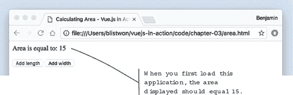

##### 图 3.8\. 观察我们的属性在点击按钮时如何变化。

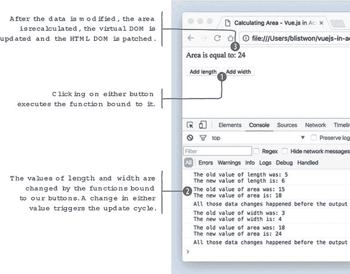

现在我们已经看到了应用程序的行为，我们可以将 列表 3.6 中的数据和函数映射到 图 3.9 中的更新周期图上。

##### 图 3.9\. 实例数据的变化触发了应用程序更新周期内的活动级联。

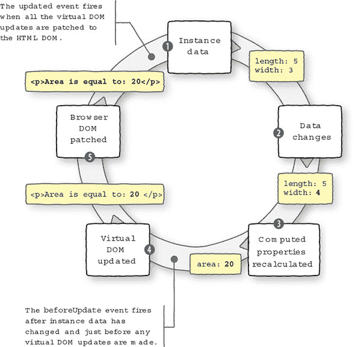

最后要注意的一点是，如果你从示例代码中移除`{{ area }}`绑定，并在浏览器中重新加载页面，当你点击任一按钮时，你会在控制台输出中看到差异（见图 3.10）。

##### 图 3.10\. 如果没有更新，则不会显示更新消息。

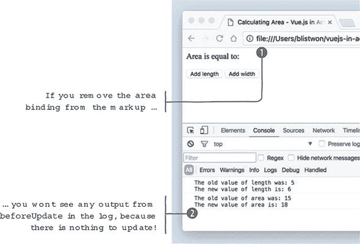

由于没有计算属性的输出端口，没有需要更新的内容，因此没有理由进入更新周期。`beforeUpdate`函数将不会执行，相应的消息也不会被记录到控制台。

#### 3.3.3\. 显示购物车项目计数并测试

现在我们对计算属性有了很好的理解，让我们再次看看我们的购物车示例。让我们向我们的 Vue 实例添加一个计算属性，该属性将显示购物车中的项目数，如下所示列表。别忘了向`options`对象添加一个`computed`对象，这样我们的函数就有地方存放了。

##### 列表 3.7\. `cartItemCount`的计算属性：chapter-03/cart-item-count.js

```
computed: {                         *1*
  cartItemCount: function() {       *2*
    return this.cart.length || '';  *2*
  }                                 *2*
},
```

+   ***1* 添加一个计算对象**

+   ***2* 返回购物车数组中的项目数**

这是一个计算属性的简单使用。我们使用一个现有的 JavaScript 数组属性——`length`——来获取我们的计数，因为实际上没有必要为购物车添加自己的计数机制。

这也是一个很好的例子，说明了为什么将这类数据作为`data`对象的属性存储是不合适的。因为`cartItemCount`的值是用户交互的结果，而不是来自数据库的东西，所以我们不会期望在`data`对象中看到它。

值得注意的是，有时这种项目计数可能存在于数据对象中。例如，如果用户正在查看“历史订单”页面，每个订单可能都有一个项目计数。这与我们之前的思考是一致的，因为这种数据会在订单处理并持久化后从数据库中获取。

函数就位，我们准备在我们的应用程序的页眉中添加一点 HTML，以便我们有购物车和显示项目计数的空间。按照以下所示更新页眉的标记。

##### 列表 3.8\. 添加购物车指示器：chapter-03/cart-indicator.html

```
<header>
  <div class="navbar navbar-default">
    <h1>{{ sitename }}</h1>
  </div>
  <div class="nav navbar-nav navbar-right cart">     *1*
    <span
class="glyphicon glyphicon-shopping-cart">
{{ cartItemCount }}</span>                           *2*
  </div>
</header>
```

+   ***1* 将我们的购物车对齐到右边**

+   ***2* 显示显示计算属性的绑定**

我们在页眉中添加一个新的`div`元素，以便我们有地方放置购物车，并使用`cartItemCount`绑定来显示计算属性的值。绑定被一个`span`元素包围，该元素用作样式钩子，在计数器旁边添加购物车图标。现在是时候测试一下了。

在 Chrome 中重新加载 webstore 应用程序后，点击“添加到购物车”应该会导致指示器随着每次点击而增加。你可以通过再次检查控制台中的`cart`数组来双重检查计数是否正确（见图 3.11）。

##### 图 3.11\. 观察应用程序的标题变化并在控制台中检查购物车。

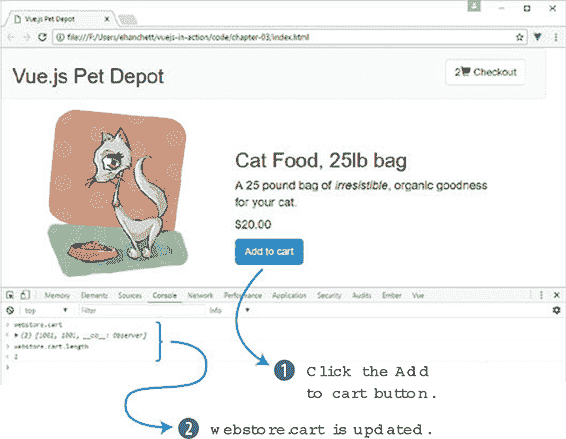

### 3.4\. 为我们的按钮添加用户可用性

当人们到达网站或使用网络应用程序时，他们会带着各种各样的经验和期望。其中最基本、最根深蒂固的是，当一个交互元素的行为与预期不同时，产品可能会感觉损坏或迷失方向。*用户可用性*背后的理念是提供视觉（或其他）提示和反馈，使我们的应用程序与他们的期望保持一致。

|  |
| --- |

##### 信息

关于用户可用性和其在数字产品体验中的重要性，更多信息请从交互设计基金会开始，访问[`mng.bz/Xv96`](http://mng.bz/Xv96)。

|  |
| --- |

现在我们有一个按钮，允许客户无限地向他们的购物车添加产品。可能有许多原因限制客户可以购买的项目数量：产品可用性有限、每个客户的购买限制、数量折扣等等。如果数量有限，那么“添加到购物车”按钮应该在某个时候变得不可用，或者以其他方式表明该操作不再可能。

要完成这个任务，我们需要跟踪我们的可用库存，将其与购物车中产品的实例数量进行比较，并采取措施防止客户添加超过可用数量的产品。让我们从跟踪库存开始。

#### 3.4.1\. 关注库存

为了防止客户购买过多的一种产品，我们需要在我们的产品对象中添加一个新的属性，如下面的列表所示。`availableInventory`属性将代表我们的商店有多少个产品的单个单位可用。

##### 列表 3.9\. 将`availableInventory`添加到我们的产品：chapter-03/available-inventory.js

```
data: {
  sitename: "Vue.js Pet Depot",
  product: {
    id: 1001
    title: "Cat Food, 25lb bag",
    description: "A 25 pound bag of <em>irresistible</em>,
                  organic goodness for your cat.",
    price: 2000,
    image: "assets/images/product-fullsize.png",
    availableInventory: 5                           *1*
  }
  cart: []
}
```

+   ***1* 在我们的其他产品数据之后添加了 availableInventory 属性**

在最终确定购买时，仍然有必要检查产品可用性——以防在交易过程中有其他客户购买了相同的产品——但我们可以在应用程序中实现一个简单的解决方案，以极大地减少用户因失望而隐藏或禁用“添加到购物车”按钮的可能性。

|  |
| --- |

##### 警告

在交易（无论是财务还是其他方面）时，永远不要依赖客户端的值。你的应用程序的后端应该始终将传入的数据解释为表达用户的意图，而不是现实。

|  |
| --- |

#### 3.4.2\. 使用计算属性和库存

我们不希望修改`availableInventory`值，因为这代表了一个固定值，它应该只由管理实际库存的过程（我们将在本书的后面部分再次回到这个话题）来更新。但我们也想根据`availableInventory`的值来限制客户可以添加到购物车中的产品数量。

要做到这一点，我们需要一种方法来跟踪客户购物车中的商品数量与固定产品数量的相对数量。我们将使用计算属性在客户向购物车添加商品时实时执行此计算。

##### 列表 3.10\. 剩余库存的计算属性：chapter-03/computed-remaining.js

```
computed: {
  cartItemCount: function() {
    return this.cart.length || '';
  },
  canAddToCart: function() {                                       *1*
    return this.product.availableInventory > this.cartItemCount;   *2*
  }
}
```

+   ***1* 使用 canAddToCart 计算属性**

+   ***2* 将 availableInventory 与购物车中的商品数量进行比较**

由于我们的代码可以像使用实例数据属性一样使用计算属性，我们有机会在另一个计算属性中利用一个计算属性，即 `cartItemCount`。我们的新计算属性会检查可用库存是否大于购物车中已有的商品数量。如果不是，这意味着客户已经将最大数量的产品添加到购物车中，我们将不得不采取措施阻止他们添加更多。

|  |
| --- |

**“JavaScript 中的真值”**

如您可能已经知道，在 JavaScript 中评估表达式的真值可能有点棘手。这里有一个您可以在控制台中尝试的快速示例。

当使用非严格相等运算符 `==` 时，整数值 `1` 与字符串值 `"1"` 的比较结果为 `true`。这是因为 JavaScript 在比较评估之前尝试“有帮助”，进行了类型转换。使用严格相等运算符 `===` 会产生预期的 `false` 结果。

在我们的 `canAddToCart` 函数中，我们使用大于运算符 `>` 来比较两个整数值。如果我们对这些值的来源有任何疑问，或者它们实际上是整数，我们可以使用 `parseInt` 方法强制转换，或者确保这些值是整数。

关于 JavaScript 的类型转换和相等运算符已经有很多讨论，但可能最具有启发性的参考资料是关于这个主题的这些图表，可以在 [`dorey.github.io/JavaScript-Equality-Table/`](https://dorey.github.io/JavaScript-Equality-Table/) 找到。务必比较一下（哈哈！）`==` 和 `===` 选项卡。

|  |
| --- |

#### 3.4.3\. v-show 指令基础

现在我们有了确定客户是否可以执行“添加到购物车”操作的方法，让我们让界面相应地做出反应。`v-show` 指令仅在指定的条件评估为 `true` 时渲染标记。将其添加到现有的按钮中会导致按钮在 `canAddToCart` 属性返回 `false` 时从 DOM 中隐藏，如这里所示。

##### 列表 3.11\. 带有 `v-show` 指令的按钮：chapter-03/button-v-show.html

```
<button class="default"
    v-on:click="addToCart"
    v-show="canAddToCart"         *1*
    >Add to cart</button>
```

+   ***1* v-show 指令绑定到我们的 canAddToCart 计算属性。**

如果你用 Chrome 重新加载应用程序并尝试将六个产品添加到购物车，按钮应该在第五次点击时消失，因为这是从 图 3.12 中看到的 `availableInventory` 的值。

##### 图 3.12\. 当可用库存耗尽时，添加到购物车按钮被隐藏。

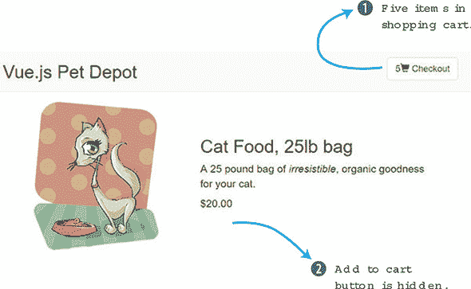

`v-show` 指令的工作方式与其他我们迄今为止遇到的指令略有不同。当表达式评估为 `false` 时，Vue 将元素的 `display` CSS 属性设置为 `none` 作为内联样式。这实际上隐藏了元素（及其内容）的视图，尽管它仍然存在于 DOM 中。如果表达式的结果后来变为 `true`，则移除内联样式，并将元素再次显示给用户。

|  |
| --- |

##### 注意

这种行为的一个副作用是，您之前对显示的任何内联声明都将被覆盖。但不必担心，Vue 在移除自己的 `display:none` 时将恢复原始值。尽管如此，最好尽可能避免内联样式，而使用样式表中的类定义。

|  |
| --- |

另一件需要注意的事情是，`v-show` 指令在绑定到单个元素时最有效，而不是绑定到多个相邻元素。以下是一个例子。

##### 列表 3.12\. 为 `v-show` 包装内容：chapter-03/wrap-content.html

```
// Avoid this
<p v-show="showMe">Some text</p>           *1*
<p v-show="showMe">Some more text</p>      *1*
<p v-show="showMe">Even more text</p>      *1*

// Prefer this
<div v-show="showMe">                      *2*
  <p>Some text</p>                        *2*
  <p>Some more text</p>                   *2*
  <p>Even more text</p>                   *2*
</div>                                    *2*
```

+   ***1* 避免在相邻元素上使用 v-show 指令。**

+   ***2* 相反，包装相邻元素，并使用单个 v-show 指令。**

为了清楚起见，在您的应用程序中需要使用 `v-show` 的任何地方都是可以的。尽可能地将多个将响应式地响应用户数据的元素聚合在一起，这不仅可以提高性能，还可以减少在您进行更改时忘记更新所有元素的风险。当库存耗尽时移除“添加到购物车”按钮当然可以工作，但这有点过于激烈。让我们尝试另一种方法。

#### 3.4.4\. 使用 v-if 和 v-else 显示禁用按钮

移除“添加到购物车”按钮当然可以防止客户将过多的产品实例添加到购物车中，但这有点过于强硬。渲染按钮为禁用状态可能对用户更有信息量，因为这不会像那样破坏界面的连续性，并且保留了布局流程。

`v-if` 和 `v-else` 指令用于根据提供的表达式的真值显示两个选择之一。我们将使用 `canAddToCart` 作为条件来评估，就像我们在前面的例子中所做的那样。

在 图 3.13 中，您可以查看 `v-if` 指令是如何工作的。如果 `canAddToCart` 为真，按钮就会出现，如果不为真，按钮就不会出现。

##### 图 3.13\. 解释 `v-if` 指令条件工作的图解。

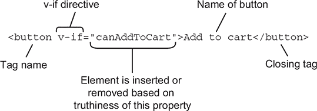

在这个列表中，我们可以看到 `v-if` 和 `v-else` 指令是如何工作的。

##### 列表 3.13\. 带有 `v-if` 和 `v-else` 指令的按钮：chapter-03/v-if-and-v-else.html

```
<button class="default"         *1*
    v-on:click="addToCart"      *1*
    v-if="canAddToCart"         *1*
    >Add to cart</button>       *1*

<button class="disabled"        *2*
    v-else                      *2*
    >Add to cart</button>       *2*
```

+   ***1* 当 canAddToCart 返回 true 时显示按钮。**

+   ***2* 当 canAddToCart 为 false 时显示的按钮。**

当一起使用 `v-if` 和 `v-else` 时，我们需要在我们的标记中包含两个元素，一个用于条件为 `true` 时，另一个用于条件为 `false` 时。此外，这两个元素需要在标记中直接相邻列出，以便 Vue 正确地绑定到它们。

在 列表 3.13 中，我们使用了两个不同的按钮元素：

+   如果 `canAddToCart` 返回 `true`，我们将渲染我们熟悉的按钮，带有 `addToCart` 事件绑定和 `default` CSS 类。

+   如果 `canAddToCart` 返回 `false`，我们将渲染一个没有事件绑定的按钮，使其不可点击，并带有 `disabled` CSS 类，以便其外观相应地改变。

这次，当你尝试在 Chrome 中运行应用程序时，一旦你将五个产品添加到购物车，按钮应该将活动按钮（图 3.14）切换到禁用按钮。

##### 图 3.14\. 使用 `v-if` 和 `v-else` 意味着我们可以在库存耗尽时渲染一个禁用按钮，而不是让它完全消失。

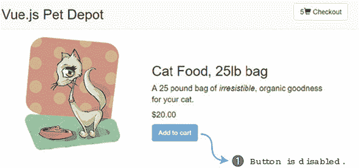

使用 `v-if` 和 `v-else` 指令，Vue.js 会从 DOM（`false` 条件）中移除元素，并从另一个（`true` 条件）中移除。所有这些都是在 DOM 的单一、同时更新中完成的。通过在控制台中调整 `availableInventory` 的值并关注这些元素的 `display` 属性来尝试一下。

与 `v-show` 指令一样，将 `v-if` 和 `v-else` 绑定到一个单一包含元素上很重要，特别是考虑到 `v-else` 标记必须与 `v-if` 标记相邻，如这里所示。

##### 列表 3.14\. `v-if` 和 `v-else` 的单个容器元素 chapter-03/single-container.html

```
// This won't work
<p v-if="showMe">The if text</p>            *1*
<p>Some text related to the if text</p>     *1*
<p v-else>The else text</p>                 *1*

// Nor will this
<div>                                       *2*
  <p v-if="showMe">The if text</p>          *2*
</div>                                      *2*
<div>                                       *2*
  <p v-else>The else text</p>               *2*
</div>                                      *2*

// Instead, consider grouping
<div v-if="showMe">                         *3*
  <p>The if text</p>                        *3*
  <p>Some text related to the if text</p>   *3*
</div>                                      *3*
<div v-else>                                *3*
  <p>The else text</p>                      *3*
</div>                                      *3*
```

+   ***1* 这不会起作用；v-if 和 v-else 被第二个段落元素分隔开。**

+   ***2* 这不会起作用；v-if 和 v-else 在标记中不是相邻的。**

+   ***3* 这将有效；将相关内容包裹在一个元素中，然后在该元素上绑定 v-if 和 v-else。**

将给定条件的所有 DOM 元素都包含在一个外部元素中（用作分组容器）是这里的目标。稍后，我们将探讨使用模板或组件的不同策略，这些策略用于隔离条件性标记，极大地简化了主应用程序本身所需的标记量。

#### 3.4.5\. 将购物车按钮作为切换添加

让我们添加一个用于结账页面的按钮。我们将首先向我们的应用程序添加一个新的方法和属性。

##### 列表 3.15\. 添加购物车按钮：chapter-03/cart-button.js

```
data: {
  showProduct: true,                                        *1*
...
},
methods: {
...
  showCheckout() {                                          *2*
       this.showProduct = this.showProduct ? false : true;  *3*
   },
}
```

+   ***1* 此属性跟踪是否显示产品页面。**

+   ***2* 点击购物车按钮后触发 showCheckout 方法。**

+   ***3* 显示在真和假之间切换的三元操作**

新的 `showProduct` 属性将切换结账页面的显示。让我们更详细地看看。`showCheckout` 方法通过使用 JavaScript 中的三元运算符来切换 `showProduct` 属性。*三元运算符*是 `if` 语句的快捷方式，并接受三个参数。第一个参数是条件，在这种情况下，`this.showProduct`。如果它解析为真，它将返回第一个表达式，`false`。否则，它返回最后一个表达式，`true`。三元条件运算符是在你需要创建快速条件语句时可以放在口袋里的有用工具。

你可能已经注意到，方法定义中缺少了 `showCheckout()` 后面的 `function()` 声明。ES6，也称为 ES2015，允许方法定义有更短的语法。我们将在这本书的其余部分使用这种语法。

我们现在需要将按钮添加到我们的视图中，并将其绑定到点击事件。

##### 列表 3.16\. 添加购物车按钮：chapter-03/add-cart-button.html

```
 <div class="nav navbar-nav navbar-right cart">
      <button type="button"
          class="btn btn-default btn-lg"
          v-on:click="showCheckout">                *1*
        <span
class="glyphicon glyphicon-shopping-cart">
{{ cartItemCount}}</span>
   </span>
     Checkout
      </button>
    </div>
```

+   ***1* 添加到按钮上的点击事件触发 `showCheckout` 方法。**

当按钮被点击时，`showCheckout` 方法将被触发，导致 `showProduct` 方法在状态之间切换或翻转。结账按钮很重要，因为我们需要一个地方来放置我们的结账信息。我们将在下一节中更详细地探讨这一点。

#### 3.4.6\. 使用 v-if 显示结账页面

我们的应用程序有限。它只在单页面上显示一个产品。为了使其更完整，我们需要另一个显示结账信息的页面。我们可以用多种不同的方法来做这件事。在第七章中，我们将学习关于组件的内容，这些组件为我们提供了一种将应用程序轻松分解成更小、可重用部分的方法。这可能是添加结账页面的一个方法。

另一种方法是使用 `v-if` 指令包裹我们的视图，并将其绑定到我们之前创建的 `showProduct` 属性。我们需要在 `main` 和 `div` 元素之后，索引文件的顶部添加 `v-if` 指令，如本列表所示。

##### 列表 3.17\. 使用 `v-if` 显示结账页面：chapter-03/v-if-checkout.html

```
<main>
  <div class="row product">
    <div v-if="showProduct">       *1*
...                                *2*
    </div>
    <div v-else>
                                   *3*
    </div>
  </div> <!—end of row-->
</main> <!—end of main-->
```

+   ***1* 当 `showProduct` 为真时将显示的 `v-if` 指令。**

+   ***2* 显示视图的产品列表，包括产品的图片和描述**

+   ***3* 这将是结账页面的位置。**

在本章的早期，我们创建了一个结账按钮。当按下此按钮时，`showProduct` 属性将在 `true` 和 `false` 之间切换，或从 `false` 切换到 `true`。这将触发列表 3.17 中的 `v-if` 指令。要么显示我们在本章创建的产品信息，要么显示一个只有顶部导航的空白屏幕(图 3.15)。

##### 图 3.15\. 按下结账按钮后的网店视图。再次按下结账按钮将显示产品页面。

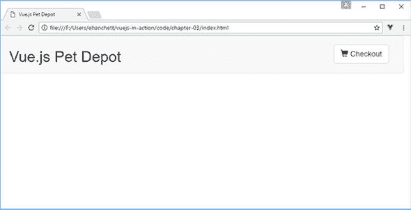

目前，不要担心我们在图 3.15 中看到的空白页面。这将在下一章中当我们探讨不同类型的输入绑定时得到解决。

#### 3.4.7\. 比较 v-show 与 v-if/v-else

这两种技术——`v-show` 和 `v-if/v-else`——对用户和开发者都有优点和缺点。正如我们所知，`v-show` 指令通过 CSS 隐藏或显示一个元素，而 `v-if/v-else` 指令从 DOM 中移除内容。话虽如此，了解何时使用哪一个主要取决于我们想要实现的目标，所以也许最好的比较方式是考虑每个的几个用例。

`v-show` 指令最适合没有“else”情况的场景。也就是说，当条件为 `true` 时显示标记，当条件为 `false` 时不显示任何替代内容。以下是一些 `v-show` 是正确选择的可能用例：

+   用于显示临时信息的消息横幅，例如销售公告或条款和条件变更。

+   当访客未登录时的注册广告或其他诱导。

+   对于跨越多页的列表的分页元素，如果只有一页，这些元素将是多余的。

当两个标记块中的一个应该被渲染，但至少其中一个应该始终显示时，`v-if` 和 `v-else` 指令是正确的选择。如果没有回退（else）情况，那么 `v-show` 更为合适。以下是一些应该使用 `v-if` 和 `v-else` 的场景：

+   对于未登录的用户显示登录链接，而对于已登录的用户显示登出链接。

+   渲染表单的基于用户选择的条件部分，例如根据用户选择显示特定国家的地址字段。例如，美国地址表单显示“州”字段，而加拿大地址表单显示为“省”。

+   搜索结果列表与未进行搜索时的占位符内容。（我们将在下一章中通过使用 `v-else-if` 添加第三个状态来探索一个示例。）

无尽的情况需要使用其中一个条件或另一个。也许最好的思考方式是考虑是否有一个回退或默认的内容块要显示。接下来，我们将通过提供不止一袋猫粮来使我们的网店对潜在客户更有用。

### 练习

使用本章的知识来回答这个问题：

+   在本章早期，我们探讨了计算属性和方法。它们之间有什么区别？

*请参阅附录 B 中的解决方案 appendix B。*

### 摘要

+   使用计算属性展示数据对象内部不存在的数据。

+   使用 `v-if` 和 `v-else` 指令有条件地显示我们应用程序的某些部分。

+   使用方法添加更多功能到我们的应用程序中。

## 第四章\. 表单和输入

*本章涵盖*

+   将值绑定到 DOM

+   使用文本绑定

+   修饰符

自从 第一章 以来，我们的应用程序已经发生了显著的变化。我们创建了项目，并允许用户将项目添加到购物车中。我们现在需要一种方式让我们的客户进行结账并输入他们的信息。让我们向应用程序添加输入表单，以便客户可以在应用程序中输入他们的地址和账单信息。然后我们需要将这些信息保存在我们的应用程序中以便以后使用。

为了实现我们的目标，我们必须将表单数据绑定到我们应用程序中的模型。`v-model` 指令就是为了这个用例而设计的。

| |
| --- |

##### 定义

`v-model` 指令在表单或文本区域输入与模板之间创建双向数据绑定。这确保了我们的应用程序模型中的数据始终与我们的 UI 保持同步。

| |
| --- |
| |

**双向数据绑定与单向数据绑定**

在实践中，双向数据绑定（图 4.1）可能或可能不是最佳解决方案。在某些情况下，数据在从用户输入捕获后可能永远不需要更改。其他框架和库，如 React 和 Angular 2，默认选择单向数据绑定。Angular 1 以双向绑定开始，在构建 Angular 2 时出于性能管理的原因放弃了它。单向数据绑定发生在输入更改时，捕获的数据没有从模型同步到视图。需要添加额外的逻辑来使模型或视图中的值发生变化。Ember.js 决定默认坚持使用双向数据绑定。使用 `v-model` 指令，数据是双向绑定的。无论如何，我们可以在 Vue 中使用 `v-once` 指令将属性指定为单向绑定。

##### 图 4.1\. 模型更新视图，同时视图更新模型。

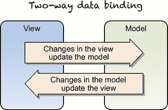

`v-once` 指令仅渲染元素或组件一次。在任何额外的重新渲染中，元素或组件将被视为静态内容并跳过。要了解更多关于 `v-once` 指令的信息，请查看官方 API 文档 [`vuejs.org/v2/api/#v-once`](https://vuejs.org/v2/api/#v-once)。

在本书的后面部分，我们将讨论组件属性以及它们如何传递给其他组件。这些属性在父属性和子属性之间形成单向向下绑定。这将在未来变得很有用。

| |
| --- |

`v-model` 指令旨在与所有类型的表单输入一起工作，包括文本框、文本区域、复选框、单选按钮和下拉选择控件。我们需要所有这些元素来构建我们的新结账表单。让我们看看如何使用 `v-model` 指令以及它是如何与绑定输入一起工作的。

### 4.1\. 使用 v-model 绑定

在我们的应用程序中，模型绑定将帮助我们通过模板更新用户输入的数据。在我们的应用程序中，我们主要使用 Vue 数据对象来显示静态信息。与应用程序的交互仅限于几个按钮点击事件。我们需要添加一种方式让用户在结账时填写他们的送货信息。为了跟踪表单输入，我们将使用`v-model`指令和基本的输入绑定来为应用程序添加更多的响应性。

在我们开始之前，你可能想知道`v-model`指令和我们在第二章中使用的`v-bind`指令之间有什么区别。记住，`v-model`指令主要用于输入和表单绑定。在本章中，我们将使用`v-model`指令来绑定我们的结账页面的文本输入。`v-bind`指令主要用于绑定 HTML 属性。例如，我们可以在``标签的`src`属性上使用`v-bind`，或者将其绑定到`<div>`标签的类属性上。两者都很有用，但它们在不同的场景中使用。我们将在本章的后面更详细地讨论`v-bind`指令。

值得注意的是，`v-model`指令在幕后使用了`v-bind`指令。假设你有`<input v-model="something">`。`v-model`指令是`<input v-bind:"something" v-on: input="something=$event.target.value">`的语法糖。无论如何，使用`v-model`指令更容易输入和理解。

在图 4.2 中，我们看到`v-model`指令是如何分解的。它被添加到输入中，创建了一个双向数据绑定对象。

##### 图 4.2\. `v-model`指令的近距离观察

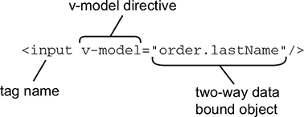

首先，我们需要向我们的应用程序添加新的 HTML。打开你在前两章中创建的 index.html 页面，并查找`v-else`指令（或者你可以下载提供的 index.html 文件，用于第三章）。在这个`<div>`标签内，我们将添加本章中的 HTML 代码。在第七章中，我们将讨论将我们的应用程序分解成组件的更好方法。现在，我们将使用简单的`v-if`指令作为切换来显示我们的结账页面。

与前几章一样，每个代码片段都分成了自己的文件。请将此与 index.html 结合，以创建一个完整的应用程序。

##### 列表 4.1\. 包含姓氏和名字输入的`v-model`指令：chapter-04/first-last.html

```
<div class="col-md-6">
  <strong>First Name:</strong>
  <input v-model="order.firstName"        *1*
    class="form-control"/>
</div>
<div class="col-md-6">
  <strong>Last Name:</strong>
  <input v-model="order.lastName"
   class="form-control"/>  //#A
</div>
<div class="col-md-12 verify">
  <pre>
    First Name: {{order.firstName}}       *2*
    Last Name:  {{order.lastName}}        *2*
  </pre>
</div>
```

+   ***1* firstName 和 lastName 使用 v-model 进行绑定。**

+   ***2* 随着输入中值的改变，firstName 和 lastName 属性会实时显示。**

代码创建了两个用于姓氏和名字的文本框，每个文本框都绑定到一个实时同步的属性。这些属性是在数据对象中创建的。为了使这个过程更简单，我们将使用`order`属性来保存这些值到我们的 Vue 实例数据对象中。这将添加到 index.html 文件中。

在数据对象中，我们需要添加我们的新订单属性。我们需要这个订单属性来跟踪姓氏和名字。将以下代码添加到之前章节中使用的现有 index.html 数据对象中。

##### 列表 4.2\. Vue 实例数据对象`order`属性：chapter-04/data-property.js

```
data: {
  sitename: 'Vue.js Pet Depot',
  showProduct: true,
  order: {
    firstName: '',
    lastName: ''
  },
```

列表中的`order`对象位于 Vue 构造函数内部的数据对象中。我们可以使用我们在第二章中了解到的双大括号 Mustache 语法`{{}}`在代码中引用此对象。例如，`{{order.firstName}}`将被`order`对象中的`firstName`替换。将订单信息保存在对象中使得在未来更容易理解数据的位置。

值得注意的是，我们在这里可以使用一个空的`order`对象，并且不需要在内部显式定义`firstName`和`lastName`属性。Vue.js 可以隐式地向对象添加属性。为了简化过程，并使代码库更干净，我们将添加属性，以便我们可以看到一切是如何工作的。

在将数据输入到我们的结账表单后，请注意值会实时出现在框中（图 4.3）。这就是双向数据绑定的美妙之处。值会自动同步，无需任何其他逻辑。

##### 图 4.3\. 文本实时更新到底部的框中。

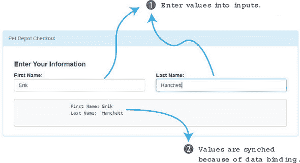

现在我们有了结账页面的开始。让我们向 index.html 文件添加更多表单输入，以便我们的客户可以添加他们的地址信息，如下所示。我们可以在添加在列表 4.1 中的 HTML 代码之后添加此 HTML。

##### 列表 4.3\. 添加其他文本输入和选择框：chapter-04/text-input.html

```
<div class="form-group">
  <div class="col-md-12"><strong>Address:</strong></div>
  <div class="col-md-12">
    <input v-model="order.address"                        *1*
      class="form-control" />
  </div>
</div>
<div class="form-group">
  <div class="col-md-12"><strong>City:</strong></div>
  <div class="col-md-12">
    <input v-model="order.city"                           *1*
      class="form-control" />
  </div>
</div>
<div class="form-group">
  <div class="col-md-2">
  <strong>State:</strong>
    <select v-model="order.state"                         *2*
      class="form-control">
      <option disabled value="">State</option>
      <option>AL</option>
      <option>AR</option>
      <option>CA</option>
      <option>NV</option>
    </select>
  </div>
</div>
<div class="form-group">
  <div class="col-md-6 col-md-offset-4">
  <strong>Zip / Postal Code:</strong>

    <input v-model="order.zip"                            *1*
      class="form-control"/>
  </div>
</div>
<div class="col-md-12 verify">
  <pre>                                                   *3*
    First Name: {{order.firstName}}
     Last Name: {{order.lastName}}
       Address: {{order.address}}
          City: {{order.city}}
           Zip: {{order.zip}}
         State: {{order.state}}
  </pre>
</div>
```

+   ***1* 使用 v-model 输入文本**

+   ***2* 选择带有 v-model 的输入**

+   ***3* `<pre>`标签显示数据**

我们添加了地址、城市、州和 ZIP 代码的表单字段。地址、城市和 ZIP 代码都是使用`v-model`指令绑定的文本输入。选择州的方式略有不同。我们不会使用文本框，而是使用选择下拉控件。`v-model`已添加到选择元素中。

你可能会想知道我们如何轻松地为我们的下拉选择控件添加更多状态。在这个简单示例中，硬编码所有四个状态是可行的。但如果我们需要添加所有 50 个州，我们可能希望动态生成选择框。在下一节中，我们将探讨使用值绑定来帮助生成动态选项。

在我们继续之前，别忘了将我们的新属性添加到 Vue 实例中的数据对象。

##### 列表 4.4\. 使用新属性更新 Vue 实例数据对象：chapter-04/data-new-properties.js

```
data: {
  sitename: "Vue.js Pet Depot",
  showProduct: true,
  order: {
    firstName: '',
    lastName: '',
    address: '',
    city: '',
    zip: '',
    state: ''
  },
```

正如我们在图 4.3 中看到的，如果这些属性中的任何一个在表单元素中发生变化，这些值将在底部的`<pre>`标签中更新。重新加载浏览器，你的新表单应该看起来像图 4.4。

##### 图 4.4\. 将地址、城市、州和 ZIP 代码表单字段添加到我们的结账页面中。

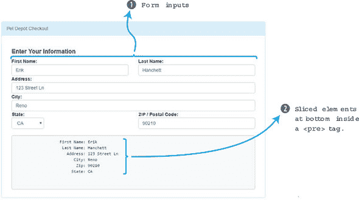

我们的形式结账页面看起来不错，但我们需要添加一些其他内容。让我们允许我们的客户选择将商品作为礼物邮寄。为此，我们将添加一个简单的复选框。如果复选框被选中，我们将商品作为礼物邮寄。如果没有选中，则选中的商品不会作为礼物邮寄。为了跟踪绑定，我们将使用`order.gift`属性。

接下来，我们需要允许我们的客户选择将商品邮寄到家庭地址或商业地址。为此，让我们在我们的代码中添加一个单选按钮。在 Vue 中，我们必须将`v-model`指令设置在两个复选框中相同的值，否则点击后单选按钮不会更新。

最后，我们需要更新`<pre>`标签中的`order.method`和`order.gift`，如下面的列表所示。在 index.html 文件中，在列表 4.3 之后添加此 HTML 代码。

##### 列表 4.5\. 添加复选框和单选按钮：chapter-04/adding-buttons.html

```
<div class="form-group">
  <div class="col-md-6 boxes">
    <input type="checkbox"
 id="gift"
 value="true"
 v-model="order.gift">                          *1*
    <label for="gift">Ship As Gift?</label>
  </div>
</div>
<div class="form-group">
  <div class="col-md-6 boxes">
    <input type="radio"
      id="home"
      value="Home"
      v-model="order.method">                   *2*
    <label for="home">Home</label>
    <input type="radio"
      id="business"
      value="Business"
      v-model="order.method">                   *2*
    <label for="business">Business</label>
  </div>
</div>
<div class="col-md-12 verify">
  <pre>                                         *3*
    First Name: {{order.firstName}}
     Last Name: {{order.lastName}}
       Address: {{order.address}}
          City: {{order.city}}
           Zip: {{order.zip}}
         State: {{order.state}}
       Method: {{order.method}
          Gift: {{order.gift}}
  </pre>
</div>
```

+   ***1* 添加带有 v-model 的复选框**

+   ***2* 添加单选按钮 v-model**

+   ***3* 更新<pre>标签中的 order.method 和 order.gift**

让我们通过添加以下代码将我们的属性添加到数据对象中。

##### 列表 4.6\. 向我们的 Vue 数据对象添加更多属性：chapter-04/more-props.js

```
data: {
  sitename: "Vue.js Pet Depot",
  showProduct: true,
  order: {
    firstName: '',
    lastName: '',
    address: '',
    city: '',
    zip: '',
    state: '',
    method: 'Home',
    gift: false
  },
```

你可能已经注意到我们为`method`和`gift`都添加了默认值。背后的原因很简单。默认情况下，方法单选按钮被选中，而复选框没有被选中。因此，我们现在在这个代码中设置一个默认值是明智的。

我们最后需要做的一件事是添加一个“下单”（提交）按钮。目前，我们将模拟这个按钮以便将来使用。你可以有几种方法来创建一个“下单”按钮。你可以将一个动作附加到一个包含我们所有输入的表单元素上。（我们将在第六章中更详细地探讨这一点。）相反，让我们使用我们最初在第三章中学习的`v-on`指令。`v-on`指令可以将函数绑定到应用中的 DOM 元素。将其添加到“下单”按钮的点击事件上。这段 HTML 代码可以添加到列表 4.5 之后。

##### 列表 4.7\. 将`v-on`指令添加到点击事件：chapter-04/adding-v-on.html

```
<div class="form-group">
  <div class="col-md-6">
    <button type="submit"
      class="btn btn-primary submit"
      v-on:click="submitForm">Place Order</button>       *1*
  </div>
</div>
```

+   ***1* 下单按钮附加到 v-on 指令。**

在未来的章节中，我们将为“下单”按钮添加功能。就我们现在的目的而言，让我们创建一个简单的函数，并通过添加一个弹出窗口来验证按钮是否工作。将`submitForm`函数添加到存在于 index.html 文件中的方法对象中，如所示列表。

##### 列表 4.8\. 创建新的`submitForm`方法：chapter-04/submit.js

```
methods: {
  submitForm() {
    alert('Submitted');
...
  }
},
```

在 Vue 构造函数中是`methods`对象，它包含所有可以在应用程序中触发的函数。当触发时，`submitForm`函数将显示一个弹出窗口。在浏览器中，点击“下单”按钮，你会看到由`submitForm`函数触发的这个弹出窗口(图 4.5)。

##### 图 4.5\. 这个弹出窗口是由`submitForm`函数触发的。

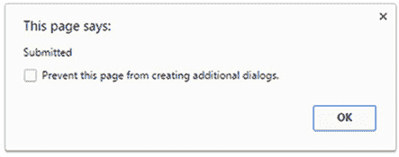

现在我们已经设置了包含“下单”按钮的表单，当所有内容都整合在一起时，它应该看起来像图 4.6。

##### 图 4.6\. 包含所有表单元素的完成结账页面。

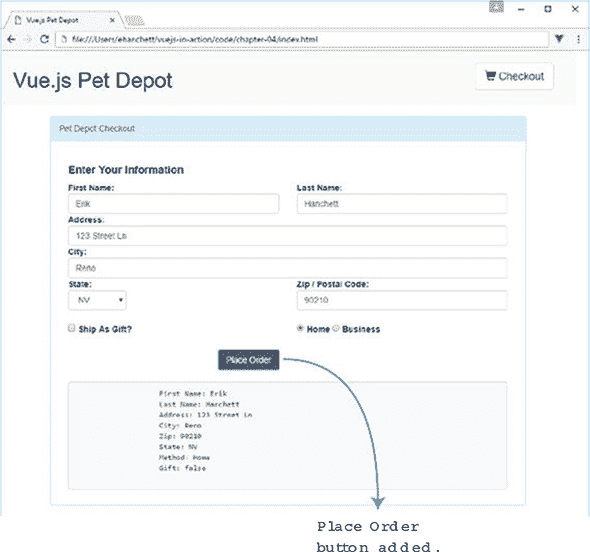

表单中的每个属性都绑定到了我们的 Vue.js 模型！现在让我们看看我们能否使我们的输入绑定变得更好。

### 4.2\. 价值绑定概述

到目前为止，`v-model`指令在为我们绑定属性方面非常有用。我们用它来绑定了许多基本输入。然而，我们有一个问题。如何绑定复选框、单选按钮和下拉选择控件的值？如果你记得，我们为复选框和单选按钮硬编码了值。对于我们的下拉框控件，我们留空了值。所有的 HTML 元素都可以，有时也应该与选定的选项关联一个值。我们不用硬编码的值，而是将我们的下拉框、复选框和单选按钮重写为使用数据对象中的属性。让我们首先通过使用`v-bind`指令来更新我们的复选框，并为其添加值。

#### 4.2.1\. 将值绑定到我们的复选框

在我们的第一个例子中，我们的复选框绑定到了`order.gift`属性。我们可以将其设置为`true`或`false`。话虽如此，我们的客户不希望看到`true`或`false`。他们更希望看到一个消息，告诉他们订单是否将以礼物形式发货。我们可以添加这样的消息。

`v-bind`指令将值绑定到我们的 HTML 元素的属性中。在这种情况下，我们将`true-value`属性绑定到一个属性上。`true-value`属性是`v-bind`指令特有的，它允许我们根据复选框是否被选中来绑定属性，即`true`或`false`。这将改变`order.gift`的值。在列表 4.9 中，`true-value`绑定到`order.sendGift`属性。同样，`false-value`绑定到`order.dontSendGift`属性。当复选框被选中时，`order.sendGift`消息显示。如果复选框没有被选中，则显示`order.dontSendGift`属性。在 index.html 之后添加此 HTML。

##### 列表 4.9\. 将`true`和`false`值绑定到礼物复选框：chapter-04/true-false.html

```
<div class="form-group">
  <div class="col-md-6 boxes">
    <input type="checkbox"
      id="gift" value="true"
      v-bind:true-value="order.sendGift"            *1*
      v-bind:false-value="order.dontSendGift"       *2*
      v-model="order.gift">                         *3*
    <label for="gift">Ship As Gift?</label>
  </div>
</div>
```

+   ***1* 当复选框选中时设置 order.sendGift 属性**

+   ***2* 当复选框未选中时设置 order.dontSendGift 属性**

+   ***3* 将 order.gift 绑定到输入**

为了使这个绑定工作如我们所期望的那样，我们需要将这些新属性添加到我们的`order`对象中，如下一个列表所示。在 index.html 中更新`order`对象的值，包括`sendGift`和`dontSendGift`属性。

##### 列表 4.10\. 将`sendGift`属性添加到`order`对象：chapter-04/prop-gift.js

```
order: {
  firstName: '',
  lastName: '',
  address: '',
  city: '',
  zip: '',
  state: '',
  method: 'Business',
  gift: 'Send As A Gift',                  *1*
  sendGift: 'Send As A Gift',              *2*
  dontSendGift: 'Do Not Send As A Gift'    *3*
},
```

+   ***1* 复选框的默认值是“作为礼物发送”复选框。**

+   ***2* 当复选框选中时，order.sendGift 属性显示一条文本消息。**

+   ***3* 当复选框未选中时，order.dontSendGift 属性显示一条文本消息。**

我们的数据对象正在变大！现在我们可以根据复选框是否选中来分配文本值。刷新页面并取消选中“作为礼物发送”复选框。看看我们底部的框（图 4.7）；我们将看到在 UI 中的`{{order.gift}}`属性中代表的新值。

##### 图 4.7\. 显示{{order.gift}}属性。

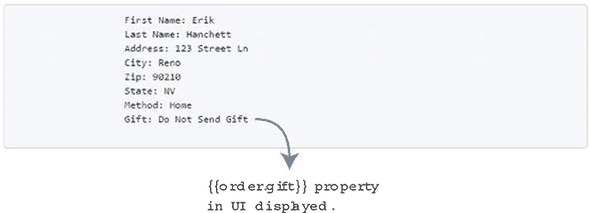

切换复选框将值从“不作为礼物发送”更改为“作为礼物发送”字符串。注意，因为我们设置了`order.gift`属性值为“作为礼物发送”，它将默认复选框为选中状态。如果需要，我们可以将其分配给其他值。这将导致复选框显示为未选中状态。

#### 4.2.2\. 使用值绑定和单选按钮工作

与复选框一样，我们可以为单选按钮分配值。我们可以通过直接绑定值来实现这一点。这可能是我们应用程序的一个有用功能。让我们向用户显示，如果用户选择“家庭”单选按钮，则显示家庭地址；如果用户选择“商业”单选按钮，则显示商业地址。在之前的复选框代码之后，将此 HTML 添加到 index.html 中。

##### 列表 4.11\. 将值绑定到我们的单选按钮：chapter-04/radio-bind.html

```
<div class="form-group">
  <div class="col-md-6 boxes">
    <input type="radio"
      id="home"
      v-bind:value="order.home"              *1*
      v-model="order.method">
    <label for="home">Home</label>
    <input type="radio"
      id="business"
      v-bind:value="order.business"          *2*
      v-model="order.method">
    <label for="business">Business</label>
  </div>
</div>
```

+   ***1* 将 v-bind 指令设置为第一个单选按钮的输入元素的值属性**

+   ***2* 将 v-bind 指令设置为第二个单选按钮的输入元素的值属性**

`v-bind`指令将`order.home`绑定到第一个单选按钮，将`order.business`绑定到第二个单选按钮。这很强大，因为我们可以在任何时间动态地更改这些值。

为了完成这个例子，让我们将这些新属性添加到 index.html 中的`order`对象的数据中，如下所示。

##### 列表 4.12\. 更新`order`对象以包含商业和住宅：chapter-04/update-order.html

```
order: {
  firstName: '',
  lastName: '',
  address: '',
  city: '',
  zip: '',
  state: '',
  method: 'Home Address',                 *1*
  business: 'Business Address',           *2*
  home: 'Home Address',                   *3*
  gift:'Send As A Gift',
  sendGift: 'Send As A Gift',
  dontSendGift: 'Do Not Send As A Gift'
},
```

+   ***1* 将默认值设置为“家庭地址”单选按钮**

+   ***2* 当第一个单选按钮被选中时显示 order.business 属性文本消息**

+   ***3* 当选择第二个单选按钮时显示 order.home 属性的文本消息**

这个新的 `order` 对象现在有几个新的属性——home 和 business，它们绑定到单选按钮上。如果我们选择任何一个，底部的值将在 Home Address 和 Business Address 之间切换（图 4.8）。

##### 图 4.8\. 方法通过单选按钮更新。

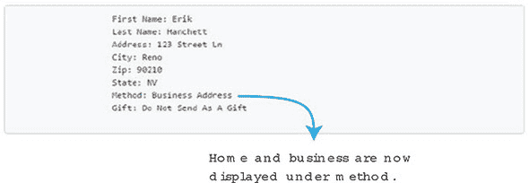

我们的客户可以看到他们有一个包裹将被送到商业地址（Erik Hanchett 在 123 Street Ln, Reno, NV），并且它不会作为礼物发货！将属性绑定到我们的表单中的任何属性值会使事情变得更加整洁和简单。我们现在需要查看下一节中的美国州选择框控件。

#### 4.2.3\. 学习 v-for 指令

我们的选择框控件列出了我们的客户可以选择的美国州。我们需要更新选择下拉控件，以便在刷新页面时状态显示在我们的框中。让我们看看我们如何绑定状态值。用以下列表中的标记替换 index.html 中城市输入后的状态下拉。

##### 列表 4.13\. 将值绑定到我们的选择框：chapter-04/bind-select.html

```
<div class="form-group">
  <div class="col-md-2">
    <strong>State:</strong>
    <select v-model="order.state" class="form-control">
      <option disabled value="">State</option>
      <option v-bind:value="states.AL">AL</option>       *1*
      <option v-bind:value="states.AR">AR</option>       *2*
      <option v-bind:value="states.CA">CA</option>       *3*
      <option v-bind:value="states.NV">NV</option>       *4*
    </select>
  </div>
</div>
```

+   ***1* 将 v-bind 指令的值属性分配给 states.AL 属性**

+   ***2* v-bind 指令的值属性被分配给 states.AR 属性。**

+   ***3* v-bind 指令的值属性被分配给 states.CA 属性。**

+   ***4* v-bind 指令的值属性被分配给 states.NV 属性。**

如我们所见，`v-bind` 指令正在分配我们的值属性。这次我们创建了一个名为 `states` 的新数据属性。在 `states` 属性内部，我列出了美国州。`states` 对象持有四个值。我们可以通过使用 `v-bind` 指令在选择框内部访问它们。更新 index.html 文件并将 `states` 对象添加到数据对象中。

##### 列表 4.14\. 将 `states` 属性添加到 Vue 实例数据对象中：chapter-04/states.html

```
states: {
  AL: 'Alabama',
  AR: 'Arizona',
  CA: 'California',
  NV: 'Nevada'
},
```

更新完所有内容后，我们应该能在页面底部的模板中的文本框内看到这些值（图 4.9）。正如你所见，状态被明确地拼写出来，使得发生的事情一目了然。

##### 图 4.9\. 状态文本属性显示了正确选中的状态。

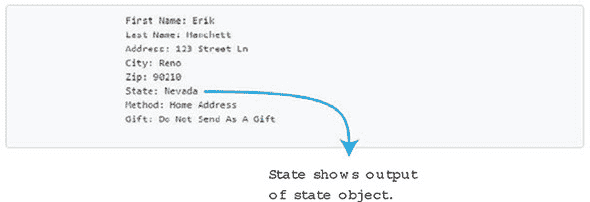

在本章的早期，我提到了我们下拉列表的一个关键问题。在这个例子中，只列出了四个州。随着我们州列表的增长，我们需要为每个州创建一个 `option>` 标签。这可能会很繁琐且重复。幸运的是，Vue 有一个可以帮助我们的东西。它被称为 `v-for` 指令。

`v-for` 指令使得在列表或对象中循环遍历值变得容易，这对于我们的情况来说非常完美。为了使这生效，我们将在 `state` 对象中定义所有我们的州。然后我们将使用 `v-bind` 指令迭代每个州，以确保一切匹配。让我们试一试！

这里正在发生很多事情，所以我将把它分解。`v-for` 指令需要一个特殊的语法形式，即 `state in states`。`states` 是源数据数组，而 `state` 是正在迭代的数组元素的别名。在这种情况下，`state` 是阿拉巴马州、亚利桑那州、加利福尼亚州等等。在输入城市后，将 index.html 中的州下拉列表替换为这里显示的 HTML。

##### 列表 4.15\. 使用 `v-for` 更新选择下拉列表：chapter-04/select-drop-down.html

```
<div class="form-group">
  <div class="col-md-2">
    <strong>State:</strong>
    <select v-model="order.state"
      class="form-control">
      <option disabled value="">State</option>
      <option v-for="(state, key) in states"        *1*
           v-bind:value="state">                    *2*
        {{key}}                                     *3*
      </option>
    </select>
  </div>
</div>
```

+   ***1* 使用 `v-for` 指令遍历带有每个键和值的州对象。**

+   ***2* 将 `v-bind` 指令的值属性分配给状态属性。**

+   ***3* 显示了键属性。**

`key` 值是一个可选参数，它指定了当前项的索引。这在我们的选择下拉控制中很重要，因为我们的 `key` 值可以用作缩写州名，而实际值是完整的州名。

`v-bind` 指令将 `state` 的值绑定到 `<option>` 标签上的值，如 列表 4.16 所示。在您的应用程序中替换此代码后，打开您的网络浏览器并查看 index.html 的源代码，查看生成的 HTML。`<option>` 标签将显示 `states` 属性中的每个州。

##### 列表 4.16\. 由 `v-for` 指令生成的 HTML：chapter-04/options.html

```
<option value="Alabama">
    AL
  </option>
  <option value="Alaska">
    AK
  </option>
  <option value="Arizona">
    AR
  </option>
  <option value="California">
    CA
  </option>
  <option value="Nevada">
    NV
  </option>
```

这对我们应用程序是个好消息。因为我们现在可以用 `v-for` 绑定值并遍历它们，所以我们不再需要硬编码每个美国州。我们的选择框可以根据我们如何创建 `states` 对象动态增长。

#### 4.2.4\. 没有可选键的 `v-for` 指令

我提到 `key` 值是可选的，那么没有 `key` 值的 `v-for` 指令会是什么样子？让我们快速偏离一下，看看它是如何工作的。让我们从一个空的 detour.html 文件开始，创建一个全新的应用程序。创建一个 Vue 构造函数，并添加一个包含 `states` 数组的数据对象。

##### 列表 4.17\. 更新数据中的 `states` 对象：chapter 04-/detour.html

```
<div id="app">
  <ol>
    <li v-for="state in states">             *1*
      {{state}}
    </li>
  </ol>
</div>
<script src="https://unpkg.com/vue/dist/vue.js"></script>
<script type="text/javascript">
var webstore = new Vue({
  el: '#app',
  data: {
    states: [
      'Alabama',
      'Alaska',
      'Arizona',
      'California',
      'Nevada'
    ]
  }
})
</script>
```

+   ***1* 使用 `state in states` 语法的 `v-for` 指令。**

|  |
| --- |

##### 更多

`states` 数组有五个值。让我们创建一个有序列表来显示每个项目。我们没有键，所以我们不需要担心这一点。要创建我们的列表，我们将使用 `<ol>` 和 `<li>` 标签。将这些标签添加到新的 detour.html 文件顶部。

|  |
| --- |

`v-for` 指令遍历 `states` 数组，并在列表中显示每个 `state`。请注意，`state` 是正在迭代的数组元素的别名，而 `states` 是数组项。很容易混淆这一点；请记住，别名总是先出现，然后是可选的键，最后是正在迭代的数组或对象。

当渲染时，我们将看到一个有序编号列表，显示我们的州，如下所示：

1.  阿拉巴马州

1.  阿拉斯加

1.  亚利桑那州

1.  加利福尼亚州

1.  内华达州

我们现在可以通过向 `states` 对象中添加值来扩展我们的列表，而无需更改模板。

|  |
| --- |

##### 注意

你可能会遇到需要直接操作 DOM 的情况，并且可能不想使用 `v-model` 指令。在这种情况下，Vue.js 为我们提供了 `$el`。你可以在 Vue 实例中使用 `this.$el` 来使用 `$el`。这将是由 Vue 实例管理的根 DOM 元素。从那里，你可以运行任何类型的 `Document` 方法，如 `querySelector()`，以检索你想要的任何元素。记住，如果你能的话，尝试在处理 DOM 时使用内置的 Vue.js 指令。它们是为了使你的工作更简单！有关 `$el` 和其他 API 的更多信息，请查看官方 API 文档 [`vuejs.org/v2/api/`](https://vuejs.org/v2/api/)。

|  |
| --- |

### 4.3\. 使用应用程序学习修饰符

如本章前面所述，`v-model` 指令可以绑定到我们的输入值。这些值会随着每个输入事件而更新。我们可以使用修饰符与 `v-model` 指令来改变这种行为。例如，我们可以使用 `.number` 来将值转换为数字，并使用 `.trim` 来处理我们的输入（有关修饰符的更多信息，请参阅 [`vuejs.org/v2/guide/forms.html#Modifiers`](https://vuejs.org/v2/guide/forms.html#Modifiers)）。我们还可以通过依次添加修饰符来链式使用修饰符（例如，`v-model.trim.number`）。让我们在我们的应用程序的结账页面上添加几个这些修饰符。

#### 4.3.1\. 使用 `.number` 修饰符

`.number` 修饰符用于自动将 `v-model` 指令中的值转换为数字。这将在我们的 ZIP 输入框中很有用（我们假设我们的应用程序中的 ZIP 码不以零开头，否则 `.number` 修饰符会移除前导零）。让我们更新 index.html 文件中的 ZIP 码以使用 `.number` 修饰符，并查看以下列表中的效果。

##### 列表 4.18\. ZIP 表单元素上的 `.number` 修饰符：chapter-04/number-mod.html

```
<div class="form-group">
  <div class="col-md-6 col-md-offset-4">
    <strong>Zip / Postal Code:</strong>
    <input v-model.number="order.zip"           *1*
      class="form-control"
      type="number"/>
  </div>
</div>
```

+   ***1* 显示带有 .number 修饰符的 v-model 指令**

HTML 输入始终返回字符串，即使你添加了 `type="number"`。添加 `.number` 修饰符可以防止这种行为，并返回一个数字。为了验证这一点，让我们在模板中显示 `order.zip` 属性的同时，更新 index.html 以使用 `typeof` 操作符。

##### 列表 4.19\. 在 `order.zip` 上使用 `typeof` 操作符：chapter-04/type-of.html

```
<div class="col-md-12 verify">
     <pre>
       First Name: {{order.firstName}}
       Last Name: {{order.lastName}}
       Address: {{order.address}}
       City: {{order.city}}
       Zip: {{typeof(order.zip)}}        *1*
       State: {{order.state}}
       Method: {{order.method}}
       Gift: {{order.gift}}
     </pre>
</div>
```

+   ***1* JavaScript typeof 操作符返回未评估操作数的类型。**

在添加 `.number` 修饰符之前，它将以字符串的形式显示。现在它返回一个数字。在 ZIP 输入框中输入一个数字，然后重新渲染页面以查看新的输出<如图 4.10 所示。

##### 图 4.10\. 输入到 zip 属性中的值的类型。

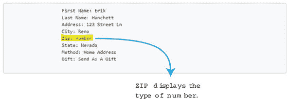

您可以看到 ZIP 列显示的是 图 4.10 中的数字。因为我们用 `typeof` 操作符包裹了 ZIP Code，所以它显示了该属性的类型。我们将在稍后使用这个功能；现在我们将移除 `typeof` 操作符，以便它返回 ZIP Code。从 `order.zip` 属性中删除 `typeof` 操作符，剩下的只是属性 `{{order.zip}}`。

#### 4.3.2\. 修剪输入值

在提取表单信息时，我们通常不需要使用文本输入前的空白或文本输入后的空白。如果用户在输入名字之前不小心输入了一些空格，我们需要移除它们。Vue.js 给我们提供了一个很好的修饰符来自动修剪输入中的空格。

在我们的应用程序中，我们使用输入字符串文本框来输入名字、姓氏、地址和城市。在下面的列表中，让我们更新 index.html 中的名字和姓氏，看看 `.trim` 修饰符是如何工作的。

##### 列表 4.20\. 名字和姓氏上的 `.trim` 修饰符：chapter-04/trim-mod.html

```
<div class="form-group">
  <div class="col-md-6">
    <strong>First Name:</strong>
    <input v-model.trim="order.firstName"       *1*
      class="form-control" />
  </div>
  <div class="col-md-6">
    <strong>Last Name:</strong>
    <input v-model.trim="order.lastName"        *2*
      class="form-control" />
  </div>
</div>
```

+   ***1* v-model 指令为 order.firstName 属性使用 `.trim` 修饰符。**

+   ***2* v-model 指令为 order.lastName 指令使用 `.trim` 修饰符。**

要添加 `.trim` 修饰符，我们只需要在 `v-model` 指令的末尾添加 `.trim`。现在它会自动为我们修剪空白！现在我们可以将其添加到 index.html 中的地址和城市输入中。

##### 列表 4.21\. 地址和城市上的 `.trim` 修饰符：chapter-04/trim-mod-add.html

```
<div class="form-group">
  <div class="col-md-12"><strong>Address:</strong></div>
  <div class="col-md-12">
    <input v-model.trim="order.address"            *1*
  class="form-control" />
  </div>
</div>
<div class="form-group">
  <div class="col-md-12"><strong>City:</strong></div>
  <div class="col-md-12">
    <input v-model.trim="order.city"               *2*
       class="form-control" />
  </div>
</div>
```

+   ***1* v-model 指令为 order.address 属性使用 `.trim` 修饰符。**

+   ***2* v-model 指令为 order.city 指令使用 `.trim` 修饰符。**

如果我们在浏览器刷新后查看页面底部的输出，我们会注意到空白已被移除 (图 4.11)。

##### 图 4.11\. 在 `v-model` 指令上使用 `.trim` 修饰符的示例。

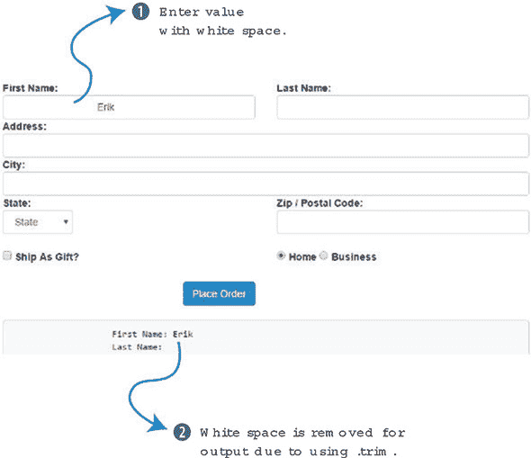

名字输入文本框中包含名为 Erik 的内容，前面有许多空格。换句话说，底部的输出显示了修剪后的值。实际上，如果我们点击框外，名字框中的值会同步到修剪后的值。这就是 `.trim` 修饰符的力量。

#### 4.3.3\. `.lazy` v-model 修饰符

最后还有一个名为 `.lazy` 的修饰符。如我之前提到的，`v-model` 指令在每个输入事件后同步。在实践中，这发生在文本框中每个字母输入后。值在每个按键时同步。`.lazy` 修饰符将在更改事件上同步。更改事件发生在各种情况下，具体取决于表单元素的使用。复选框或单选按钮在点击时会触发更改事件。输入文本框在失去焦点时会触发更改事件。不同的浏览器可能在相同的交互上不会触发更改事件，所以请记住这一点。

通常，当添加到 `v-model` 指令时，`.lazy` 修饰符看起来如下：

```
<input v-model.lazy="order.firstName" class="form-control" />
```

### 练习

使用本章的知识来回答这些问题：

+   双向数据绑定是如何工作的？在您的 Vue.js 应用程序中何时应该使用它？

*请参阅附录 B 中的解决方案。*

### 摘要

+   `v-model` 指令可以用于绑定输入、选择、文本区域和组件。它为表单输入元素和组件创建双向数据绑定。

+   `v-for` 指令根据提供的数据多次渲染数据。您还可以在当前正在迭代的元素的表达式中使用别名。

+   `v-model` 指令具有 `.trim`、`.lazy` 和 `.number` 修饰符。`.trim` 修饰符会消除空白字符，而 `.number` 修饰符将字符串类型转换为数字。`.lazy` 修饰符在数据同步时改变。

## 第五章\. 条件、循环和列表

*本章涵盖*

+   使用 `v-if` 和 `v-if-else` 条件进行工作

+   使用 `v-for` 进行循环

+   查看数组变化

在上一章中，我们看到了 `v-model` 指令的力量以及我们如何使用它来绑定输入到我们的应用程序。我们构建了一个显示我们所需收集的所有输入表单的结账页面。为了显示此页面，我们使用了条件语句。

在第三章中，我们创建了一个绑定到点击事件方法的结账按钮。该方法切换一个名为 `showProduct` 的属性。在我们的模板中，我们使用了 `v-if` 指令和 `v-else` 指令。如果 `showProduct` 为 `true`，则显示产品页面；如果 `showProduct` 为 `false`，则显示结账页面。通过点击结账按钮，用户可以轻松地在这些页面之间切换。在后面的章节中，我们将探讨如何重构此代码以使用组件和路由，但现在这将是可行的。

为了扩展我们的应用程序，我们将探讨其他类型的条件。例如，我们需要添加一个新功能，根据可用库存水平向用户显示消息。此外，我们还需要在我们的产品页面上添加更多产品。我们将在第 5.2 节中更详细地探讨这一点。

### 5.1\. 显示可用库存信息

每当我们向购物车添加额外项目时，`cartItemCount` 计算属性都会更新。如果我们想让用户知道有多少是可用的呢？让我们在可用库存即将耗尽时显示一些消息。我们将使用 `v-if`、`v-else-if` 和 `v-else` 指令来实现这一点。

#### 5.1.1\. 使用 v-if 添加剩余数量

在我们开始之前，让我们添加更多库存。这将使用户在将更多项目放入购物车时更容易显示消息。为了添加库存，我们可以更新数据对象中的产品属性。编辑 index.html 中的 `availableInventory` 产品属性。让我们将其从 5 更改为 10，如列表 5.1 所示。现在应该足够了。

如果您已经跟随前面的章节，您应该有一个 index.html 文件。如果没有，您可以从本书中下载包含的第四章 index.html 文件作为起点，以及任何代码片段和 CSS。一如既往，每个列表都被拆分到自己的文件中。确保在继续时将每个片段添加到 index.html 中。

##### 列表 5.1\. 更新库存：chapter-05/update-inventory.js

```
product: {
  id: 1001,
  title: "Cat Food, 25lb bag",
  description: "A 25 pound bag of <em>irresistible</em>, organic goodness
 for your cat.",
  price: 2000,
  image: "assets/images/product-fullsize.png",
  availableInventory: 10                           *1*
},
```

+   ***1* 添加库存**

现在库存已经更新，让我们在模板中添加一个条件，当可用库存低时。我们将显示一个消息，显示用户可以添加到购物车中的剩余库存。在列表 5.2 中，我们可以看到带有`v-if`指令的新 span 标签。还添加了一个名为`inventory-message`的类到这个 span 标签。这个 CSS 使得消息更加突出，并正确地定位它。我已经添加了基本的格式化，使我们的消息看起来更美观。`v-if`指令是灵活的。您会注意到，我们并没有像在第三章（kindle_split_014.html#ch03）中使用`showProduct`那样使用特定的属性，而是使用了一个表达式。这是 Vue.js 允许我们做的很好的一件事。

当点击“添加到购物车”按钮时，顶部的结账数量会增加。当库存减少到 5 以下（`product.availableInventory – cartItemCount`）时，会出现一个消息，显示剩余库存的数量。这个计数会随着按钮的按下而继续递减，直到库存达到零。

在我们的模板中定位`addToCart`按钮。在 index.html 文件中添加一个新的 span 标签，并使用我们的`v-if`指令，如下所示。

##### 列表 5.2\. 基于库存添加新消息：chapter-05/add-message.html

```
<button class="btn btn-primary btn-lg"
  v-on:click="addToCart"
  v-if="canAddToCart">Add to cart</button>
  <button disabled="true" class="btn btn-primary btn-lg"
    v-else >Add to cart</button>
  <span class="inventory-message"                              *1*
v-if="product.availableInventory - cartItemCount < 5">         *2*
Only {{product.availableInventory - cartItemCount}} left!
  </span>
```

+   ***1* Span 类添加消息和库存消息类**

+   ***2* v-if 指令仅在表达式为真时显示。**

|  |
| --- |

##### 提示

请记住，包括这个 app.css 文件在内的源代码可以从 Manning 在[www.manning.com/books/vue-js-in-action](http://www.manning.com/books/vue-js-in-action)提供的所有章节中下载。

|  |
| --- |

我们可以在这个`v-if`指令中使用计算属性，但为了简单起见，使用这样的表达式将有效。请注意，如果您的模板中的表达式变得太长，您可能最好使用计算属性。

|  |
| --- |

**快速了解 v-show**

`v-show`指令是`v-if`指令的近亲。两者的使用方式相似：`<span v-show="product.availableInventory - cartItemCount < 5">Message</span>`。唯一的真正区别是`v-show`指令将始终在 DOM 中渲染。Vue.js 使用 CSS 中的简单切换来显示元素。如果你对使用哪个有疑问，如果它后面跟着`v-else`或`v-else-if`，则使用`v-if`。如果它更有可能在大多数情况下显示/渲染，或者如果元素的可视性在页面生命周期中可能会改变多次，则使用`v-show`。否则，使用`v-if`。

| |
| --- |

让我们看看到目前为止我们有什么(图 5.1)。

##### 图 5.1\. 只有四个商品剩余的产品页面，这是使用`v-if`指令的结果。

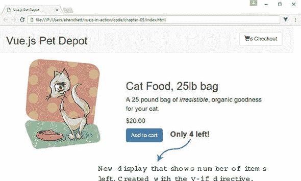

#### 5.1.2\. 使用`v-else`和`v-else-if`添加更多消息

我们有一个小问题。当库存达到 0 时，消息显示“只剩 0 个！”这显然没有意义，所以让我们更新代码，以便当库存达到 0 时输出更好的消息。添加一个鼓励用户现在就购买的消息。这次我们将介绍`v-else-if`和`v-else`指令！让我们分析一下我们想要做什么以及我们将如何做。`v-if`指令将在库存数量减去购物车商品数量等于零时显示。如果我们把所有商品都添加到购物车中，产品库存就会全部耗尽。

在图 5.2 中，我们看到当库存售罄时显示消息（All Out）的完整功能。

##### 图 5.2\. 产品页面在库存耗尽后显示“All Out!”

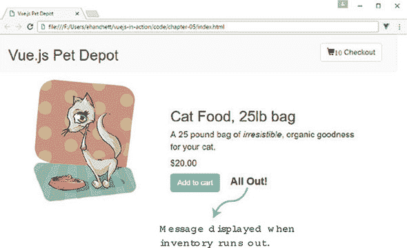

如果产品没有售罄，我们继续到`v-else-if`指令。如果可用库存接近售罄且剩余少于五个，我们将显示一个消息，就像你在图 5.3 中看到的那样。

##### 图 5.3\. 显示“立即购买！”屏幕

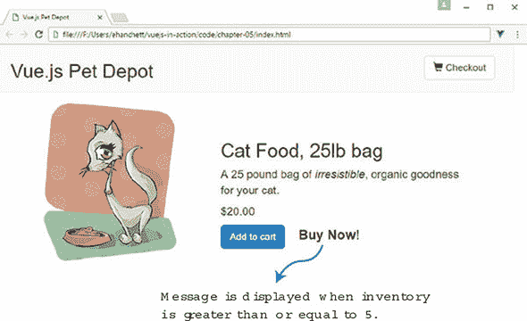

图 5.3 显示了“立即购买！”消息。当你点击“加入购物车”按钮时，你应该看到消息改变。当库存少于 5 时，你会看到图 5.1。当库存耗尽后，你会看到图 5.2。

最后的`else`仅在`v-else`和`v-else-if`都为`false`时触发。`v-else`指令是在其他所有情况都失败时的一个通用的捕获指令。如果发生这种情况，我们希望在购物车按钮旁边显示一个“立即购买”消息。更新我们在 index.html 文件中添加的 span 标签，使用以下代码。

##### 列表 5.3\. 添加多个库存消息：第五章/multiple-inventory.html

```
<button class="btn btn-primary btn-lg"
  v-on:click="addToCart"
  v-if="canAddToCart">Add to cart</button>
  <button disabled="true" class="btn btn-primary btn-lg"
  v-else >Add to cart</button>
  <span class="inventory-message"
    v-if="product.availableInventory - cartItemCount === 0">All Out!    *1*
  </span>
  <span class="inventory-message"
    v-else-if="product.availableInventory - cartItemCount < 5">         *2*
    Only {{product.availableInventory - cartItemCount}} left!
  </span>
  <span class="inventory-message"
    v-else>Buy Now!                                                     *3*
  </span>
```

+   ***1* 显示当库存耗尽时才会显示的`v-if`指令**

+   ***2* 此指令仅在第一个`v-if`失败时触发。**

+   ***3* 当`v-if`和`v-if-else`都失败时，`v-else`会触发。**

| |
| --- |

**使用条件语句**

当使用`v-if`、`v-else`和`v-else-if`时，我们必须注意几点。每次使用`v-else`时，它必须紧随一个`v-if`或`v-else-if`。你无法在之间创建额外的元素。就像`v-else`一样，`v-else-if`也必须紧随一个`v-if`或`v-else-if`元素。未能这样做会导致`v-else-if`或`v-else`不被识别。

请记住，`v-else-if`指令可以在同一个块中使用多次。例如，在我们的应用程序中，当商品接近售罄时，我们可以包含多条消息。这可以通过`v-else-if`指令实现。

说到这里，使用过多的条件语句和在模板中放置过多的逻辑时要小心。相反，当需要时，使用计算属性和方法。这将使你的代码更容易阅读和理解。

|  |
| --- |

### 5.2\. 循环我们的产品

自从我们在第二章中介绍了我们的宠物仓库商店以来，我们一直在使用单一的产品。到目前为止，这在前几章的示例中效果很好，但一旦我们添加更多产品，我们就需要在模板中显示它们。此外，我们还想在每件产品的底部显示一个简单的星级评级。多功能的`v-for`指令可以处理这两种情况。

#### 5.2.1\. 使用`v-for`范围添加星级评级

Vue.js 有`v-for`指令来遍历项目，正如我们在第四章中简要看到的。值得一提的是，我们可以用它与对象、数组甚至组件一起使用。使用`v-for`指令的最简单方法之一是给它一个整数。当添加到元素中时，它将重复那么多次，这有时被称为`v-for`范围。

让我们从添加一个五星评级系统到我们的产品开始。为了保持简单，让我们使用`span`标签并将其`v-for`指令添加到其中。`v-for`的语法始终以`item in items`的形式出现。`items`指的是正在迭代的源数组数据。`item`是正在迭代的别名元素。正如你在图 5.4 中可以看到的，`v-for`指令使用`item`作为`items`的别名。`items`是一个数组。

##### 图 5.4\. 展示`v-for`别名如何工作的图解。

![05fig04.jpg]

当使用`v-for`范围时，源数据是范围的上级包含极限。这表示一个元素将被重复多少次。在图 5.5 中，你可以看到`n`被迭代了五次。

##### 图 5.5\. 展示`v-for`范围如何工作的图解。

![05fig05.jpg]

在列表 5.4 中，我们将重复五次符号。我们还添加了一个带有`rating`类的`div`元素。（请记住下载此书的 ap.css 文件；你可以在附录 A 中找到更多信息。）将此`span`元素添加到以下列表中，位于`index.html`文件中我们添加的库存信息下方，这些信息是在第 5.1 节中添加的。

##### 列表 5.4\. 使用 `v-for` 添加星号：chapter 05/star-symbol.html

```
<span class="inventory-message"
  v-else>Buy Now!
</span>
<div class="rating">
  <span v-for="n in 5"></span>          *1*
</div>
```

+   ***1* 重复星号符号五次**

一旦我们将星级添加到模板中，请刷新您的浏览器。它应该看起来像图 5.6。

##### 图 5.6\. 带有星级

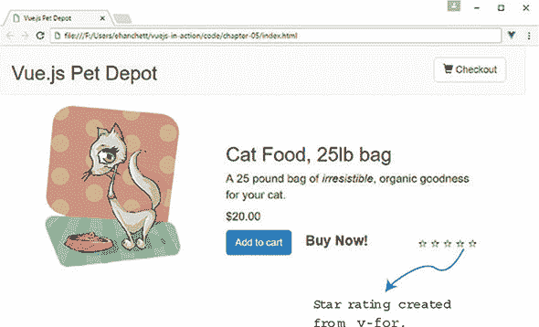

如您所见，我们的星级评分没有太多可以展示的：每个星号都是空的。我们需要一种方法来动态地将类绑定到我们的 CSS，以便显示填充的星号。

#### 5.2.2\. 将 HTML 类绑定到我们的星级评分

Vue.js 给我们一种方法，可以动态地向模板中的 HTML 元素添加或删除类。我们可以传递数据对象、数组、表达式、方法，甚至是计算属性，以帮助确定哪些类出现。

在我们开始之前，我们需要编辑产品数据对象属性并添加一个评分。这个评分将决定每个产品应该显示多少颗星。打开 index.html 文件，在 order 下找到 `product` 属性。将评分添加到产品属性底部，如下所示。

##### 列表 5.5\. 添加到 `product` 属性：chapter 05/add-product.js

```
product: {
  id: 1001,
  title: "Cat Food, 25lb bag",
  description: "A 25 pound bag of <em>irresistible</em>, organic goodness
for your cat.",
  price: 2000,
  image: "assets/images/product-fullsize.png",
  availableInventory:10,
  rating: 3                 *1*
},
```

+   ***1* 添加新的评分属性**

接下来，我们需要在屏幕上显示星级评分。最简单的方法是使用 CSS 和一点 JavaScript。我们将添加简单的 CSS，当类被添加到我们的 span 元素时，它会创建一个黑色星号。在我们的例子中，我们需要前三个星号显示为黑色。剩下的两个星号将显示为白色。图 5.7 是完成后的示例。

##### 图 5.7\. 填充星级的猫粮产品

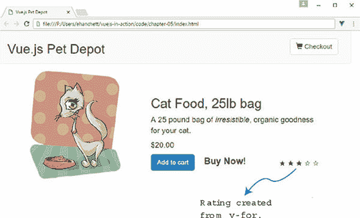

正如我提到的，我们可以使用一个方法来帮助确定是否应该出现一个类。因为我们使用的是 `v-for` 范围，所以我们需要将范围传递给一个方法。让我们添加一个新的方法，该方法从产品中读取评分，然后根据是否应该将类添加到 span 中返回 `true` 或 `false`。这个类将使星号变黑。

要使这生效，我们必须向方法传递一个变量 `n`。传入的变量 `n` 来自于 `v-for` 范围指令 `<span v-for="n in 5">``</span>`。尽管我们没有在模板中显示它，但 `n` 从 1 增加到 5。第一个循环的 `n` 是 1，下一个循环的 `n` 是 2，依此类推。我们知道当 `n` 循环时，它将从 1、2、3、4 增加到 5。我们可以使用简单的数学来确定星号是否应该被填充。

在我们的例子中，第一次迭代的 `n` 应该是 1，`this.product.rating` 将始终是 3。*3 – 1 = 2* 大于或等于 0，因此我们返回 `true` 并添加了类。下一次迭代 `n` 将是 2。*3 – 2 = 1* 大于或等于 0，因此它再次评估为 `true`。下一次迭代 `n` 将是 3。*3 – 3 = 0*，因此类再次被添加。下一次迭代 `n` 将是 4。*3 – 4 = -1*，因此方法返回 `false`。就这么简单。在 index.html 文件的方法对象顶部添加一个名为 `checkRating` 的新方法，如这里所示。

##### 列表 5.6\. 添加一个检查是否应该添加类的函数：chapter 05/check.js

```
methods: {
  checkRating(n) {
    return this.product.rating - n >= 0;         *1*
},
```

+   ***1* 根据评分和 *n* 返回 true 或 false。**

要将我们的新星级评分全部放在一起，我们需要向我们的 span 元素添加 `v-bind:class` 语法。如果方法返回 `true`，它将添加我们新的类 `rating-active`。否则，它将被忽略。在这个例子中，我们向 `v-bind:class` 传递了一个对象。`checkRating` 方法的真值将决定是否添加 `rating-active` 类。因为这是一个循环，我们必须也传递之前讨论过的值 `n`，它随着每个循环迭代。

更新 index.html 中的评分 span 并向其中添加新的 `v-bind:class` 指令，如下一列表所示。确保在 `rating-active.` 周围添加引号。否则，您将在控制台中收到错误。

##### 列表 5.7\. 添加类绑定：chapter 05/add-class-bind.html

```
<span class="inventory-message"
  v-else>Buy Now!
</span>
<div class="rating">
  <span  v-bind:class="{'rating-active': checkRating(n)}"       *1*
v-for="n in 5">
    </span>
</div>
```

+   ***1* rating-active 的绑定由 checkRating 决定。**

这些是绑定 HTML 类的基本知识。Vue.js 允许您添加多个类并使用数组和组件。有关如何绑定类的更多信息，请参阅官方 Vue.js 指南中的类和样式绑定[`vuejs.org/v2/guide/class-and-style.html`](https://vuejs.org/v2/guide/class-and-style.html)。

#### 5.2.3\. 设置我们的产品

到目前为止，我们只处理了一个产品。一个真正的宠物商店应用程序可能会有数百甚至数千个产品。我们不会走那么远！让我们看看添加五个新产品需要什么，以及我们可以在产品页面上循环这些产品时使用什么。

要开始，我们将查看我们的产品对象。它已经在我们的 index.html 文件中占用了空间，在这个时候，将其放入单独的文件中会更简单。

我们需要创建一个新的 products.json 文件并将其添加到 chapter-05 文件夹中。这样，我们可以更轻松地组织来自主应用程序的数据。如果您愿意，您可以添加自己的产品，就像在数据对象中做的那样。但如果您不想输入所有这些，您可以从书中包含的代码中获取 products.json 文件并将其复制到 chapter-05 文件夹中。您可以在附录 A 中找到如何下载本书代码的说明。此列表显示了 products.json 文件中的产品。

##### 列表 5.8\. products.json 文件中的产品：chapter 05/products.json

```
{
  "products":[                                     *1*
    {
      "id": 1001,                                  *2*
      "title": "Cat Food, 25lb bag",
      "description": "A 25 pound bag of <em>irresistible</em>, organic
goodness for your cat.",
      "price": 2000,
      "image": "assets/images/product-fullsize.png",
      "availableInventory": 10,
      "rating": 1
    },
    {
      "id": 1002,                                  *3*
      "title": "Yarn",
      "description": "Yarn your cat can play with for a very
<strong>long</strong> time!",
      "price": 299,
      "image": "assets/images/yarn.jpg",
      "availableInventory": 7,
      "rating": 1
    },
    {
      "id": 1003,                                  *4*
      "title": "Kitty Litter",
      "description": "Premium kitty litter for your cat.",
      "price": 1100,
      "image": "assets/images/cat-litter.jpg",
      "availableInventory": 99,
      "rating": 4
    },
    {
      "id": 1004,                                  *5*
      "title": "Cat House",
      "description": "A place for your cat to play!",
      "price": 799,
      "image": "assets/images/cat-house.jpg",
      "availableInventory": 11,
      "rating": 5
    },
    {
      "id": 1005,                                  *6*
      "title": "Laser Pointer",
      "description": "Drive your cat crazy with this <em>amazing</em>
product.",
      "price": 4999,
      "image": "assets/images/laser-pointer.jpg",
      "availableInventory": 25,
      "rating": 1
    }
  ]
}
```

+   ***1* 显示产品数组在 JSON 中**

+   ***2* 显示第一个产品**

+   ***3* 显示第二个产品**

+   ***4* 显示第三个产品**

+   ***5* 显示第四个产品**

+   ***6* 显示第五个产品**

在您添加或下载了 products.json 文件并将其移动到 第五章 根目录后，您需要进行额外的重构。如果您正在跟随教程，那么您很可能会从您的硬盘本地加载所有内容，而不是使用网络服务器。这完全没问题，效果也很好，除了有一点。由于浏览器制作者的安全问题，我们无法轻松地加载我们的 products.json 文件。为了正确地做到这一点，我们需要创建一个网络服务器。

|  |
| --- |

##### 展望未来

当您使用本地网络服务器运行网站时，它可以无问题地从您的硬盘加载 JSON 文件，并且您不会有任何安全问题。在后面的章节中，我们将使用 Vue CLI。这个命令行工具将为我们创建一个网络服务器。在我们到达那里之前，我们可以使用一个名为 http-server 的 npm 模块。您可以在 附录 A 中找到如何安装 npm 的说明。这个轻量级模块使得为我们的应用程序创建一个简单的网络服务器变得非常简单。

|  |
| --- |

我们将使用 npm 创建一个网络服务器。打开一个终端窗口，从命令提示符运行以下命令来安装 http-server 模块：

```
$ npm install http-server -g
```

安装完成后，更改目录到 第五章 文件夹。运行以下命令以在端口 8000 上启动一个服务器，该服务器运行您的 index.html：

```
$ http-server -p 8000
```

如果在运行此命令后收到任何错误，请验证您没有在其他程序上运行端口 8000。您可能想尝试使用 8001 作为端口号。

一旦启动，打开您最喜欢的网络浏览器，转到 http://localhost:8000 来显示您的网页。如果页面没有显示，请检查命令行是否有错误。您可能需要尝试更改端口，如果端口 8000 已经被占用。

#### 5.2.4\. 从 product.json 导入产品

记得在 第二章 中我们学习了 Vue.js 生命周期钩子吗？我们需要在网页加载时立即加载我们的 JSON 文件。在这种情况下，其中一个钩子将非常合适。你知道是哪一个吗？如果你说是 created 生命周期钩子，你就对了！created 生命周期钩子在实例创建后调用。我们可以使用这个钩子来加载 JSON 文件。为了使这可行，我们需要另一个库。

Axios 是一个基于 Promise 的浏览器和 Node.js HTTP 客户端。它有几个有用的功能，例如自动转换即将到来的 JSON 数据，这将非常有用。让我们将这个库添加到我们的项目中。在 index.html 中，在 head 标签内添加一个新的 Axios 脚本标签，如下所示。

##### 列表 5.9\. 添加 Axios 脚本标签：第五章/script-tags.html

```
  <link rel="stylesheet"
href="https://maxcdn.bootstrapcdn.com/bootstrap/3.3.7/css/bootstrap.min.css
" integrity="sha384-
BVYiiSIFeK1dGmJRAkycuHAHRg32OmUcww7on3RYdg4Va+PmSTsz/K68vbdEjh4u"
crossorigin="anonymous">
  <script src="https://cdnjs.cloudflare.com/ajax/libs/axios/0.16.2/axios.js">
</script>                                                                  *1*
</head>
```

+   ***1* 显示 Axios 的 CDN 脚本标签**

在添加此标签后，我们可以在创建的生命周期钩子中使用 Axios。在 index.html 文件中插入创建的钩子，紧接在 filters 对象之后。我们需要添加代码来从硬盘驱动器检索 products.json 文件并覆盖现有的产品数据。更新 index.html 并添加 Axios 代码。

##### 列表 5.10\. 添加 Axios 标签以创建生命周期钩子：第五章/axios-lifecycle.js

```
...
},
created: function() {
  axios.get('./products.json')                   *1*
    .then((response) =>{
      this.products=response.data.products;      *2*
      console.log(this.products);
  });
},
```

+   ***1* 获取 products.json 文件**

+   ***2* 将响应数据添加到 products**

`axios.get` 命令接受一个位置，在我们的例子中是本地文件。然后它返回一个具有 `.then` 方法的承诺。承诺被实现或拒绝并返回一个响应对象。根据 Axios 文档，此对象有一个数据属性。我们将 `response.data.products` 的引用复制到 `this.products`（this 指的是 Vue 实例）。为了确保一切正常，我们还控制台输出了输出。

如果你仔细查看 列表 5.10 中的代码，你可能会意识到我们正在将 JSON 文件中的数据分配给 `this.products`，而不是 `this.product`。我们需要在我们的数据对象上创建一个新的 `products` 属性，因为它有助于清理代码。

打开 index.html 文件，在文件中间附近查找数据对象。添加新的 `products` 属性，然后替换 `product` 属性，因为我们不再需要它，如下面的列表所示。

##### 列表 5.11\. `product` 属性，添加 `products`：第五章/product-delete.js

```
  business: 'Business Address',           *1*
  home: 'Home Address',
  gift:'',
  sendGift: 'Send As A Gift',
  dontSendGift: 'Do Not Send As A Gift'
},
products: [],                             *2*
```

+   ***1* 不做任何更改的订单对象**

+   ***2* 展示替换产品对象的新的产品数组**

在这一点上，如果你尝试刷新浏览器，你会得到一个错误，因为我们移除了产品对象。我们将在添加 `v-for` 指令来遍历所有产品时修复它。

#### 5.2.5\. 使用 v-for 指令重构我们的应用

在我们可以开始遍历我们的产品之前，我们需要对控制 CSS 的 `div` 类别进行一些小的修改。因为我们使用的是 Bootstrap 3，我们希望每一行都是一个产品，因为我们现在必须容纳多个产品。完成之后，它将看起来像 图 5.8。

##### 图 5.8\. 产品最终的更新。

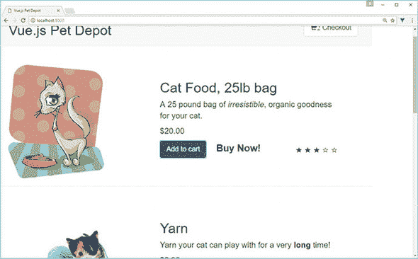

更新 index.html 并定位显示结账页面的 `v-else` 指令。添加另一个 `div` 标签以创建新的行，如下面的列表所示。

##### 列表 5.12\. 修复 Bootstrap 的 CSS：第五章/bootstrap-fix.html

```
<div v-else>
  <div class="row">          *1*
```

+   ***1* 展示新的 Bootstrap 行**

我们需要将位于 `showProduct v-if` 指令之前的具有 `row` 类的 `div` 移动。将 `div` 类移到 `showProduct` 下方，如下面的列表所示。更新 index.html 以匹配。

##### 列表 5.13\. 修复 bootstrap 的 CSS：第五章/bootstrap-fix-v-if.html

```
<div v-if="showProduct">
  <div class="row product">      *1*
```

+   ***1* 将行 div 移到 showProduct 下方**

现在我们已经解决了 CSS/HTML 的一些小问题，我们可以添加 `v-for` 指令来遍历所有产品。这将显示我们页面上的所有产品。在我们的例子中，我们将使用 `product in products` 的语法。`products` 是我们之前加载的对象；现在它是 `products` 中每个单独产品的别名。我们还将使用 Bootstrap 更新列宽，以便我们的产品显示得更好一些。

在 index.html 中，在 `showProduct v-if` 指令下方添加 `v-for` 指令。确保在页面底部结束 `div` 标签，如下所示。

##### 列表 5.14\. 为 `products` 添加 `v-for` 指令：第五章/v-for-product.html

```
<div v-if="showProduct">
  <div v-for="product in products">                           *1*
    <div class="row">
     <div class="col-md-5 col-md-offset-0">                   *2*
       <figure>
          
        </figure>
     </div>
      <div class="col-md-6 col-md-offset-0 description">      *3*
 ...
    </div><!-- end of row-->
    <hr />                                                    *4*
  </div><!-- end of v-for-->                                  *5*
</div><!-- end of showProduct-->
```

+   ***1* 使用 v-for 指令遍历所有产品**

+   ***2* 不使用偏移量将列宽更改为 5**

+   ***3* 不使用偏移量更改列宽**

+   ***4* 添加水平线标签**

+   ***5* 显示 v-for 指令的结束标签**

我们已经添加了 `v-for` 指令，但还有一些小问题。`checkRating` 方法以及 `canAddToCart` 计算属性仍然引用 `this.product`。我们需要将其改为引用 `this.products` 数组。

这可能有点棘手。让我们先修复 `checkRating` 方法。这个方法帮助我们确定每个产品有多少颗星。我们可以通过将产品别名传递给方法来修复它。在 index.html 中，更新 `checkRating` 方法，如下所示。

##### 列表 5.15\. 使用产品信息更新 `checkRating`：第五章/check-rating.js

```
methods: {
  checkRating(n, myProduct) {             *1*
    return myProduct.rating - n >= 0;
},
```

+   ***1* 显示接受产品的新的 checkRating 方法**

现在，我们需要更新模板并传递产品到更新的方法中。更新 index.html 并查找库存消息下方的 `checkRating` 方法。将 `product` 添加到 `checkRating` 方法中，如下所示。

##### 列表 5.16\. 更新模板以显示评分：第五章/update-template.html

```
<span class="inventory-message"
  v-else>Buy Now!
</span>
<div class="rating">
  <span  v-bind:class="{'rating-active': checkRating(n, product)}"   *1*
    v-for="n in 5" >
  </span>
</div>
```

+   ***1* 更新 checkRating 方法以接受一个产品**

如果你还没有这样做，从 assets/images 文件夹中获取该章节的图片，并将它们复制到你的本地 assets/images 文件夹中。如果你还没有，也请获取 app.css 文件，并将其复制到你的 assets/css 文件夹中。

为了完成重构我们的应用程序，我们需要做的最后一件事是修复 `canAddToCart` 计算属性。这个属性在可用库存超过购物车中的数量后，将“添加到购物车”按钮变灰。

你可能想知道我们是如何完成这个任务的。以前，我们只有一个产品，所以很容易判断该产品的库存是否超过了。现在有了多个产品，我们需要遍历购物车中的每一个产品，并计算是否可以添加另一个商品。

这比你想象的要简单。我们需要将 `canAddToCart` 计算属性移动并使其成为一个方法。然后我们需要更新这个方法，使其可以接受一个产品。最后，我们将更新条件以检索计数。

要检索计数，我们将使用一个新的方法 `cartCount`，它接受一个 ID 并返回该 ID 的项目数量。`cartCount` 方法使用简单的 `for` 循环遍历购物车数组。对于每个匹配项，它增加 `count` 变量。然后它在该变量结束时返回。

使用新的 `canAddToCart` 方法更新 index.html。您可以将它从计算属性部分移动到方法中。同时创建一个 `cartCount` 方法。

##### 列表 5.17\. 更新 `canAddToCart` 并添加 `cartCount` 方法：第五章/更新-carts.js

```
canAddToCart(aProduct) {
  return aProduct.availableInventory > this.cartCount(aProduct.id);  *1*
},
cartCount(id) {                                                      *2*
  let count = 0;
  for(var i = 0; i < this.cart.length; i++) {                        *3*
    if (this.cart[i] === id) {
      count++;
    }
  }
  return count;
}
```

+   **1** 返回可用库存是否大于购物车中项目数量

+   **2** 显示了新的 `cartCount` 方法，它返回具有特定 ID 的购物车中的项目数量

+   **3** 显示检查购物车中每个项目的循环

要完成对 `canAddToCart` 的更新，我们必须更新我们的模板并将产品传递给它。同时，让我们更新 `addToCart` 方法并确保它也接受一个产品。更新 index.html 并将产品别名传递给 `canAddToCart` 和 `addToCart` 方法。

##### 列表 5.18\. 更新 `canAddToCart` 模板：第五章/更新-can-add-cart.html

```
<button class="btn btn-primary btn-lg"
v-on:click="addToCart(product)"                         *1*
v-if="canAddToCart(product)">Add to cart</button>       *2*
```

+   **3** 更新 `addToCart` 以接受产品

+   **2** 更新 `canAddToCart` 以接受产品

这是对两个方法的简单更新。因为我们已经更新了模板到 `addToCart`，所以我们也必须更新方法以推送产品的 ID。为此，我们将使用推送突变方法，如列表 5.19 所示。

| |
| --- |

**突变方法**

Vue 有许多突变方法可以与您的数组一起使用。按照惯例，Vue 将数组包装在观察者中。当数组发生任何更改时，模板会收到通知并更新。突变方法会突变它们被调用的原始数组。这些突变方法包括 push、pop、shift、unshift、splice、sort 和 reverse。

注意：Vue 无法检测到数组的一些更改。这包括直接设置一个项，`this.cart[index] = newValue` 和修改长度，`this.item.length = newLength`。要了解更多关于突变的信息，请参阅官方指南[`vuejs.org/v2/guide/list.html#Mutation-Methods`](https://vuejs.org/v2/guide/list.html#Mutation-Methods)。

| |
| --- |

##### 列表 5.19\. 更新 `addToCart` 方法：第五章/更新-add-to-cart.js

```
addToCart(aProduct) {
  this.cart.push( aProduct.id );        *1*
},
```

+   **1** 将产品 ID 推入购物车

现在我们可以点击“添加到购物车”按钮而不会出现任何问题。每次点击按钮时，产品 ID 将被推入购物车，并且购物车数量将自动更新到屏幕顶部。

我们重构的最后一步是修复我们之前创建的产品库存消息。问题是我们仍在使用总购物车项目数量来确定要显示哪些消息。我们需要更改此代码，以便我们现在根据该项目的购物车项目数量来计算消息。

为了解决这个问题，让我们将 `cartItemCount` 方法更改为我们的新 `cartCount` 方法，该方法将接受一个产品 ID。更新 index.html 并定位库存信息。更新 `v-if` 和 `v-else-if` 指令，使用新的表达式，该表达式使用 `cartCount`，如下所示。

##### 列表 5.20\. 更新库存信息：第五章/更新库存.html

```
<span class="inventory-message"
  v-if="product.availableInventory - cartCount(product.id) === 0">      *1*
All Out!
</span>
<span class="inventory-message"
  v-else-if="product.availableInventory - cartCount(product.id) < 5">   *2*
  Only {{product.availableInventory - cartCount(product.id)}} left!
</span>
<span class="inventory-message"
  v-else>Buy Now!
</span>
```

+   ***1* 列出了带有 cartCount 的 v-if 指令的新表达式**

+   ***2* 列出了带有 cartCount 的 v-else-if 指令的新表达式**

就这样！我们现在可以加载我们的页面并查看结果。确保 http-server 正在运行 `http-server -p 8000`，并重新加载您的网络浏览器。您应该看到更新后的网页，其中列出了从 products.json 文件中提取的所有项目。图 5.9 显示了我们使用 `v-for` 指令通过 `products` 对象循环完成的重构应用。

##### 图 5.9\. 显示通过 product.json 文件循环的多个项目

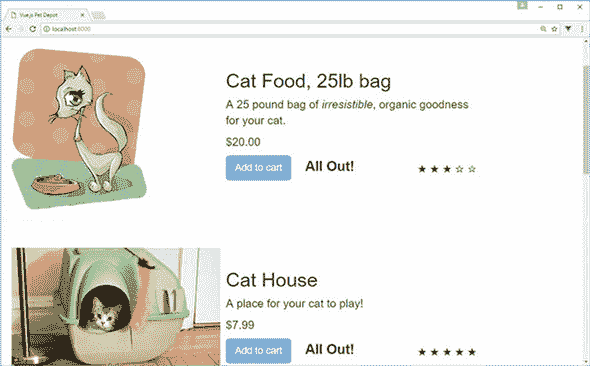

在您的浏览器中，确保一切按预期工作。点击“添加到购物车”按钮并查看消息是否更改。验证当项目计数达到零时按钮是否被禁用。尝试更改 products.json 文件并重新加载浏览器。一切都应该相应更新。

### 5.3\. 记录排序

在处理数组或对象时，我们通常希望在显示它们时使用 `v-for` 指令对值进行排序。Vue 使得这一操作变得简单。在我们的例子中，我们需要创建一个计算属性，该属性返回我们的排序结果。

在我们的应用中，我们从 JSON 文件中加载产品列表。显示的顺序与文件中的顺序相匹配。让我们更新排序顺序，使产品按产品标题字母顺序列出。为此，我们将创建一个名为 `sortedProducts` 的新计算属性。我们首先需要更新模板。

更新 index.html 文件并找到模板中列出我们的产品的 `v-for` 指令。将 `v-for` 更改为使用 `sortedProducts` 而不是 `products` 对象。

##### 列表 5.21\. 在模板中添加排序：第五章/add-in-sort.html

```
<div v-if="showProduct">
  <div v-for="product in sortedProducts">       *1*
    <div class="row">
```

+   ***1* 添加了新的 sortedProducts 计算属性**

现在我们已经在模板中放置了 `sortedProducts`，我们需要创建计算属性。但我们有一个问题要解决。我们需要意识到 `this.products` 的数据可能不会立即可用，因为产品.json 文件的信息是在应用加载时从 create 生命周期钩子中的 promise 加载的。为了确保这不是一个问题，我们将代码包裹在一个 `if` 块中，该块验证产品是否存在。

让我们定义自己的比较函数，该函数将按标题排序，如下所示。然后我们将使用 JavaScript 的数组排序，并传递我们的比较函数，以按标题字母顺序排序。

##### 列表 5.22\. `sortedProducts` 计算属性：第五章/sort-products-comp.js

```
sortedProducts() {
  if(this.products.length > 0) {
    let productsArray = this.products.slice(0);           *1*
    function compare(a, b) {                              *2*
      if(a.title.toLowerCase() < b.title.toLowerCase())
        return -1;
      if(a.title.toLowerCase() > b.title.toLowerCase())
        return 1;
      return 0;
    }
    return productsArray.sort(compare);                   *3*
  }
}
```

+   ***1* 使用 JavaScript 的 slice 方法将对象转换为数组**

+   ***2* 比较基于标题的函数**

+   ***3* 返回新的产品数组**

这就足够了。刷新浏览器，你应该会看到一个按标题字母顺序排列的所有产品的列表。图 5.10 显示了我们的排序数组的输出。如果你向下滚动，应该会列出所有产品。请再次检查以验证功能是否按预期工作。

##### 图 5.10\. 排序后的产品数组

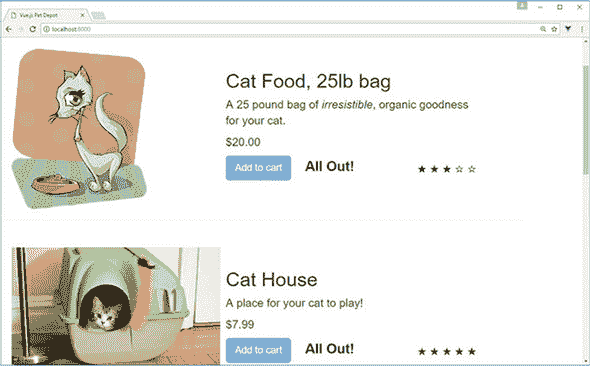

### 练习

使用本章的知识来回答这个问题。

+   什么是`v-for`范围，它与普通的`v-for`有何不同？

*请参阅附录 B 中的解决方案。*

### 概述

+   Vue 中的条件语句是通过`v-if`、`v-else-if`和`v-else`指令创建的。偶尔我们会使用`v-show`指令，但并不经常使用。

+   `v-for`指令非常灵活。它可以用来遍历一系列正整数（即从 1 开始）、数组元素或对象的属性值和键，以复制 HTML 标记、Vue 模板或 Vue 组件。任何类型的表达式都可以用来遍历项目。

+   我们可以使用计算属性轻松地对值进行排序。计算属性可以与`v-for`指令一起使用来排序输出

## 第六章\. 使用组件

*本章涵盖*

+   理解组件中的父级和子级关系

+   了解局部和全局注册

+   使用属性和属性验证

+   添加自定义事件

在前面的章节中，我们学习了条件语句、循环和列表。为了避免代码重复，我们使用了循环来简化事情。我们使用条件语句来显示根据用户操作的不同消息。这很有效，但你可能已经注意到，我们的应用程序已经增长到超过 300 行代码。我们每章都在更新的 index.html 文件中包含了计算属性、过滤器、方法、生命周期钩子和数据属性。有了所有这些信息，找到东西并不容易。

为了解决这个问题，我们需要将我们的代码分离并组件化。代码的每一部分都应该是可重用的，并允许传递属性和事件给它。

Vue.js 组件可以帮助我们完成这项任务。在我们开始之前，让我们看看组件的一些基本原理和它们的工作方式的一些示例。然后我们将探讨组件的局部和全局注册。之后，我们将看到一些关于如何传递属性和验证它们的示例。我们将以定义我们的模板和自定义事件结束本章。

你可能想知道我们的宠物商店应用程序发生了什么。别担心，我们将在下一章中查看这一点，当时我们将查看单文件组件、构建工具和 Vue-CLI。

### 6.1\. 组件是什么？

*组件* 在 Vue.js 中是一个强大的结构，它可以减少和简化我们的代码库。大多数 Vue.js 应用程序由一个或多个组件组成。通过组件，我们可以提取代码中的重复部分，并将它们分离成更小的逻辑部分，这些部分对我们来说更有意义。我们可以在整个应用程序中重用每个组件。组件被定义为可以通过单个元素访问的元素集合。在某些情况下，它们可以使用特殊的 `is` 属性作为原生 HTML 元素（我们将在本章后面讨论该操作符）。

图 6.1 是将几个 HTML 标签转换为一个组件的简单示例。所有在打开和关闭 `<div>` 标签内的 HTML 都被封装在这个组件中：`my-component`。值得一提的是，如果你的网页浏览器支持或者你正在使用我们将在本章后面讨论的单文件组件，你也可以有一个自闭合标签，`<my-component/>`。

##### 图 6.1\. 将代码封装到组件中的示例

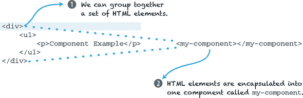

#### 6.1.1\. 创建组件

在我们能够创建我们的第一个 Vue 组件之前，我们必须创建一个 Vue.js 根实例，然后我们必须决定如何构建我们的应用程序。Vue.js 给我们提供了注册组件的本地或全局选项。全局组件可以在整个应用程序中使用，而局部组件只能在其创建的 Vue.js 实例中使用。让我们首先创建一个全局组件。

如我们之前提到的，全局组件可以在所有 Vue.js 实例中使用。在这个例子中，我们创建了一个名为 `my-component` 的全局组件。Vue.js 允许我们在组件命名上拥有很大的灵活性。请注意，Vue.js 不像其他框架那样强制执行任何关于组件名的规则。将所有组件命名为小写并使用连字符是一种良好的做法。

#### 6.1.2\. 全局注册

要创建一个全局组件，我们必须将其放置在 Vue 实例之前。正如你在 列表 6.1 中可以看到的，全局组件 (`my-component`) 定义在用 `new Vue` 创建之前。

为了在组件中显示信息，我们必须添加一个模板属性。模板是 HTML 所在的地方。请注意，所有模板都必须被一个标签包围。在我们的例子中，我们用 `<div>` 标签包围了它；否则，你将在控制台中看到错误，并且模板将不会在屏幕上渲染。

为了让我们的组件能够渲染，我们需要将其添加到父模板中。为了实现这一点，我们在应用的父入口点 `<div id="app">` 内添加了 `<my-component></mycomponent>` 自定义标签，如下所示。在阅读本章时，请亲自尝试这些示例。确保将它们保存为 .HTML 文件并在你的网页浏览器中加载。

##### 列表 6.1\. 创建我们的第一个全局组件 chapter-06/global-component-example.html

```
<!DOCTYPE html>
<html>
<head>
<script src="https://unpkg.com/vue"></script>            *1*
</head>
  <body>
  <div id="app">
    <my-component></my-component>                        *2*
  </div>
  <script>
  Vue.component('my-component', {                        *3*
    template: '<div>Hello From Global Component</div>'   *4*
  });

  new Vue({                                              *5*
    el: "#app"
  });
  </script>
  </body>
</html>
```

+   ***1* 向 Vue.js 添加脚本标签**

+   ***2* 将组件添加到模板**

+   ***3* 注册全局 Vue 组件**

+   ***4* 渲染组件的模板**

+   ***5* 实例化 Vue 实例**

不言而喻，我们的应用程序并不太有用。如果你在网页浏览器中打开此文件，你会在页面上看到一个消息，“Hello From Global Component。”这是一个关于组件如何工作的简单示例，以便你可以理解基础知识。让我们看看本地注册，看看它有何不同。

|  |
| --- |

**这是一个特殊的属性**

当我们在 DOM 中使用组件时，有一些特殊的限制。某些 HTML 标签——`<ul>`、`<ol>`、`<table>`和`<select>`——对其内部可以出现的元素类型有限制。这是由于 DOM 将组件提升为无效内容的方式。解决方案是使用`is`属性。你不必将这些组件放入那些 HTML 标签中，而是可以将组件添加到元素本身——例如，`<table> <tr is="my-row"></tr></table>`。现在`tr`元素将与`my-row`组件相关联。我们可以创建自己的`tr`组件以匹配我们喜欢的任何功能。这种限制不适用于内联、x-templates 或.vue 组件。有关此属性的更多信息，请参阅官方指南[`mng.bz/eqUY`](http://mng.bz/eqUY)。

|  |
| --- |

#### 6.1.3\. 本地注册

本地注册将作用域限制为仅一个 Vue 实例。我们可以通过将组件的实例选项进行注册来实现这一点。在组件本地注册后，它只能被注册它的 Vue 实例访问。

在列表 6.2 中，我们看到一个本地组件的简单示例。它看起来与我们之前注册的全局组件相似。最大的区别是我们有一个新的实例选项，称为`components`。

组件实例选项声明了该 Vue 实例所需的所有组件。每个组件都是一个键值对。键始终是你稍后将在父模板内部引用的组件名称。值是组件定义。在列表 6.2 中，组件的名称是`my-component`。值是`Component`。`Component`是一个`const`变量，它定义了组件内部的内容。

在下面的列表中，我们命名我们的组件为`my-component`和变量`Component`。你可以随意命名它们，尽管如前所述，尽量使用连字符和小写字母来命名组件，也称为 kebab case。这是一个好习惯。

##### 列表 6.2\. 注册本地组件：chapter-06/local-component-example.html

```
<!DOCTYPE html>
<html>
<head>
<script src="https://unpkg.com/vue"></script>
</head>
  <body>
  <div id="app">
    <my-component></my-component>
  </div>
  <script>
      const Component = {                                      *1*
          template: '<div>Hello From Local Component</div>'    *2*
      };
      new Vue({
          el: '#app',
          components: {'my-component': Component}              *3*
      });
  </script>
  </body>
</html>
```

+   ***1* 展示了包含组件声明的 const 变量**

+   ***2* 这是将为该组件显示的模板。**

+   ***3* 展示了声明组件实例选项的组件**

在浏览器中加载网页，你会看到“来自本地组件的问候”。如果没有，请检查控制台是否有任何错误。很容易在模板中留下打字错误，忘记用`<div>`标签包围模板，或者忘记关闭所有的 HTML 标签。

|  |
| --- |

**斜杠命名法 vs. 骆驼峰命名法**

虽然你可以随意命名你的组件，但有一个注意事项。在你的 HTML 模板内部，你必须使用与所选名称相对应的*斜杠命名法*（小写带连字符）。假设你注册了组件“myComponent”。当使用骆驼峰命名法时，你的 HTML 模板必须是斜杠命名法。因此，组件的名称将是`<my-component>`。这也适用于 PascalCase。如果你将组件命名为 MyComponent，那么你的 HTML 模板也必须是斜杠命名法，即`<my-component>`。这个规则也适用于 props，我们稍后会学习到。 

在我们查看单文件组件之前，这不会是一个问题。在此之前，坚持使用斜杠命名法。你可以在官方文档中了解更多关于骆驼峰命名法与斜杠命名法的区别，网址为[`mng.bz/5q9q`](http://mng.bz/5q9q)。

|  |
| --- |

### 6.2. 组件中的关系

想象你正在设计一个评论系统。系统应该显示每个用户的评论列表。每个评论都需要包含用户名、时间和日期以及评论内容。我们系统中的每个用户都可以删除和编辑他们自己的评论。

你的第一个想法可能是使用`v-for`指令。在上一个章节中，当它被用来遍历我们的库存列表时，这工作得很好。这可能可行，但假设我们的需求发生了变化，现在我们需要添加一种显示嵌套评论的方法，或者需要一个新的点赞和踩赞系统。代码会很快变得复杂。

组件可以帮助解决这个问题。在这种关系中，评论将在评论列表组件中显示。父组件（Vue.js 根实例）负责应用程序的其余部分。父组件还包含一个从后端检索所有评论数据的方法。父组件将检索到的数据传递给子组件`comment-list`。`comment-list`组件负责显示传递给它的所有评论。

请记住，每个组件都有自己的独立作用域，因此它永远不应该直接访问父组件的数据。这就是我们总是向下传递数据的原因。在 Vue.js 中，向下传递的数据称为*props*。这是属性的简称；但在 Vue.js 内部，你必须将其称为`props`。子组件必须明确声明它期望接收的每个 prop，使用`props`选项。这个选项将位于 Vue.js 实例中，并包含一个类似这样的数组：`props: ['comment']`。在这个例子中，`'comment'`是一个将被传递到组件中的属性。如果我们有多个 props，那么我们就会用逗号分隔每个属性。Props 是从父组件到子组件的单向传递（图 6.2）。

##### 图 6.2\. 父组件可以向子组件发送数据。

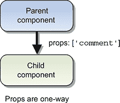

在第四章中，我们讨论了`v-model`指令如何在表单输入和文本区域元素上创建双向数据绑定。对`v-model`元素的改变会更新 Vue.js 实例中的数据属性，反之亦然。但组件形成的是单向数据绑定。当父组件更新属性时，它会流向子组件，而不是反过来。这是一个重要的区别，因为它防止子组件意外地修改父组件的状态。如果你修改了状态，你会在控制台看到错误，就像图 6.3 中显示的那样。

##### 图 6.3\. 控制台中的错误警告直接修改 props。

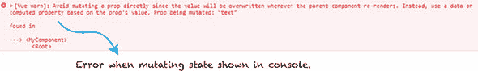

注意，所有值都是通过引用传递的。如果子组件中修改了对象或数组，它将影响父组件的状态。这并不总是期望的结果，应该避免。相反，你应该只在父组件中进行更改。在本章的后面部分，我们将看到如何使用事件从子组件更新数据到父组件。

### 6.3\. 使用 props 传递数据

如前所述，props 用于从父组件传递数据到子组件。props 仅用于单向通信。你可以把 props 看作是组件拥有的变量，只能从父组件赋值。

Props 也可以进行验证。我们可以确保传递的值遵循某种类型的验证。我们也会探讨这一点。

#### 6.3.1\. 字面量 props

最容易使用的 props 类型是字面量 props。它们是普通的字符串，我们可以将其传递给组件。在模板内部，我们以通常的方式创建组件，但我们将在组件的尖括号内添加我们的新 prop 作为额外的属性，`<my-component text="World"></my-component>`。这段文本将作为字符串传递给我们的 text prop。模板将在大括号内进行插值。

注意，这是许多初学者常见的错误：你可能会想将实际值传递给 prop，而不仅仅是字符串。你可能会不小心传递了一个字符串而不是传递值。要传递值，你需要确保使用`v-bind`指令，就像我们将在下一节中看到的那样。

在列表 6.3 中，我们看到了一个传递字面量 props 的例子。将此示例复制到你的编辑器中并亲自尝试。你会发现`my-component`具有传递的值`"World"`。你可以在模板中使用`text` prop 来显示这个值，就像这里所示。

##### 列表 6.3\. 在我们的组件中使用字面量 props：chapter 06/literal-props.html

```
<!DOCTYPE html>
<html>
<head>
<script src="https://unpkg.com/vue"></script>
</head>
  <body>
  <div id="app">
    <my-component text="World"></my-component>     *1*
  </div>
  <script>
  const MyComponent= {
    template:'<div>Hello {{text}}! </div>',        *2*
    props:['text']
  };
  new Vue({
    el: "#app",
    components: {'my-component': MyComponent}
  });
  </script>
</html>
```

+   ***1* 显示了传递文本字面量的组件**

+   ***2* 模板显示 Hello 和传递的 prop**

#### 6.3.2\. 动态 props

*动态属性* 是从父组件传递进来并绑定到可以改变的属性（与静态文本的属性不同）的属性。我们可以使用 `v-bind` 指令来确保它被正确传递。让我们更新上一节中的示例，并将消息传递给我们的新属性 `text`。

组件 `<my-component v-bind:text="message"></my-component>` 有一个新的 `v-bind` 属性指令。这将把 `text` 属性绑定到我们的新 `message`。`message` 是我们数据函数中的一个属性。

如果你一直在前几章中跟随，你可能已经注意到，在我们的 Vue.js 实例中，数据不再是对象 `data: { }`，正如你在 列表 6.4 中看到的。这是一个有意的选择。组件的行为略有不同，数据必须表示为一个函数，而不是一个对象。

如果我在 `my-component` 中添加一个数据对象，控制台会显示一个错误。为了保持一致性，我们将在本书的其余部分使用 `data` 函数作为我们的组件和根 Vue 实例的数据。

这个列表是使用动态属性的一个例子。将其复制到编辑器中，亲自试一试。

##### 列表 6.4\. 使用动态属性：chapter 06/dynamic-props.html

```
<!DOCTYPE html>
<html>
<head>
<script src="https://unpkg.com/vue"></script>
</head>
  <body>
  <div id="app">
    <my-component v-bind:text="message"></my-component>     *1*
  </div>
  <script>
  const MyComponent = {
    template: '<div>Hello {{text}}! </div>',                *2*
    props: ['text']
  };
  new Vue({
    el: "#app",
    components: {'my-component': MyComponent},
    data() {
      return {
        message: 'From Parent Component!'                   *3*
      }
    }
  });
  </script>
</html>
```

+   ***1* 使用 v-bind 指令将父组件的消息绑定到子组件的 text 中**

+   ***2* 这是显示文本属性的模板。**

+   ***3* 返回消息的数据函数**

在我们继续之前，让我们想象一下我们需要更新我们的程序以添加三个计数器。每个计数器需要从零开始独立递增。每个计数器都由一个你可以点击来递增的按钮表示。我们如何使用组件来实现这一点？

让我们把 列表 6.4 中的代码取出来并更新它。向 `MyComponent` 添加一个数据函数和一个计数器。你的第一个想法可能是添加一个全局变量。让我们试一试，看看会发生什么。

如 列表 6.5 所示，我们创建了三次组件。我们创建了一个名为 `counter` 的全局 `const` 对象，并将其初始化为零。在我们的模板中，我们使用 `v-on` 指令创建了一个简单的绑定到点击事件的绑定。计数器变量在每次点击时将递增。

##### 列表 6.5\. 带全局计数器的动态属性：chapter 06/dynamic-props-counter.html

```
<!DOCTYPE html>
<html>
<head>
<script src="https://unpkg.com/vue"></script>
</head>
  <body>
  <div id="app">
  <my-component></my-component>                    *1*
  <my-component></my-component>                    *1*
  <my-component></my-component>                    *1*
  </div>
  <script>
  const counter = {counter: 0};                    *2*
  const MyComponent= {
    template:'<div><button v-on:click="counter +=
 1">{{counter}}</button></div>',                 *3*
    data() {
      return counter;                              *4*
    }
  };
// ...
  </script>
</html>
```

+   ***1* 列出组件三次**

+   ***2* 显示全局变量计数器**

+   ***3* 计数器在每次点击时递增。**

+   ***4* 数据函数返回全局计数器。**

打开你的浏览器到你所写的代码。点击页面上的按钮几次，看看会发生什么 (图 6.4)。

##### 图 6.4\. 浏览器中的动态属性示例。

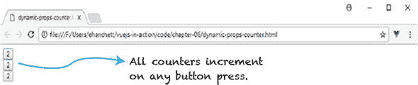

你可能会惊讶地看到，当我们点击任何一个按钮时，每个计数器都会递增。这当然不是我们想要的，尽管这是一个很好的说明如何共享作用域的例子。

从 6.5 节中获取列表并更新它，以便我们可以纠正这个问题，如列表 6.6 所示。移除`const`计数器并更新数据函数。数据函数不再返回全局计数器，而是返回它自己的计数器。这个计数器的作用域是局部组件，因此不会与其他组件共享。

##### 列表 6.6\. 使用正确返回对象的更新计数器：chapter 06/dynamic-props-counter-correct.html

```
<!DOCTYPE html>
<html>
<head>
<script src="https://unpkg.com/vue"></script>
</head>
  <body>
  <div id="app">
    <my-component></my-component>
    <my-component></my-component>
    <my-component></my-component>
  </div>
  <script>
  const MyComponent= {
    template: '<div><button v-on:click="counter +=
 1">{{counter}}</button></div>',
    data() {
      return {
        counter: 0                *1*
      }
    }
  };
// ...
  </script>
</html>
```

+   ***1* 数据函数返回一个计数器。**

启动你的浏览器并打开你更新的代码。点击几个按钮并观察计数器(图 6.5)。

##### 图 6.5\. 带局部作用域计数器的动态 props 示例。

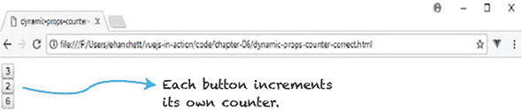

这次看起来一切正常！当我们点击每个按钮时，计数器只自己增加，不会影响其他计数器。

#### 6.3.3\. Prop 验证

Vue.js 有一个很好的功能叫做*prop 验证*，它确保我们从父组件接收的 props 通过验证。当在团队中工作时，这一点尤其有用，因为多个人使用相同的组件。

让我们从检查我们的 props 类型开始。Vue.js 提供了以下原生构造函数来实现这一点：

+   字符串

+   数字

+   布尔

+   函数

+   对象

+   数组

+   符号

在列表 6.7 中，你可以看到 prop 验证的使用。我们首先创建一个名为`my-component`的组件，并向它传递值。组件将在其模板中显示这些值。

我们不是创建一个 prop 数组，`prop: ['nameofProp'`]，而是创建一个对象。每个对象都以其`prop`命名。然后我们创建另一个对象来指定类型；我们可以添加必需的或默认的。*默认*指的是如果没有传递值给`prop`，则使用的默认值。如果属性的属性类型是对象，则必须分配默认值。*必需*属性，正如其名所示，要求在模板中创建组件时添加属性。

你最后会注意到列表 6.7 中的 even `prop`。这被称为自定义验证器。在这种情况下，我们正在检查值是否为偶数。如果是偶数，它将返回`true`。如果不是偶数，那么控制台将显示错误。请注意，自定义验证器可以执行任何你喜欢的函数。唯一的规则是它们必须返回`true`或`false`。

还要注意，单个冒号(:)本身是`v-bind`的简写。这与 at 符号(@)是`v-on`的简写的方式类似。

##### 列表 6.7\. 验证 props：chapter 06/props-example.html

```
<!DOCTYPE html>
<html>
<head>
<script src="https://unpkg.com/vue"></script>
</head>
  <body>
  <div id="app">
    <my-component :num="myNumber" :str="passedString"
           :even="myNumber" :obj="passedObject"></my-component>           *1*
  </div>
  <script>
  const MyComponent={
    template:'<div>Number: {{num}}<br />String: {{str}} \                 *2*
              <br />IsEven?: {{even}}<br/>Object: {{obj.message}}</div>',
    props: {
      num: {                                                              *3*
        type: Number,
        required: true
      },
      str: {                                                              *4*
        type: String,
        default: "Hello World"
      },
      obj: {                                                              *5*
        type: Object,
        default: () => {
          return {message: 'Hello from object'}
        }
      },
      even: {                                                             *6*
        validator: (value) => {
          return (value % 2 === 0)
        }
      }
    }
  };
  new Vue({
    el: '#app',
    components:{'my-component': MyComponent},
    data() {
      return {
        passedString: 'Hello From Parent!',
        myNumber: 43,
        passedObject: {message: 'Passed Object'}
      }
    }

  });
  </script>
  </body>
</html>
```

+   ***1* 向 my-component 传递值**

+   ***2* MyComponent 模板用于显示所有属性。**

+   ***3* 必须存在数字验证。**

+   ***4* 字符串验证包括一个默认值。**

+   ***5* 对象验证有一个默认消息。**

+   ***6* 自定义验证器必须检查数字是否为偶数。**

打开浏览器并运行这个例子中的代码。输出显示在图 6.6 中。

##### 图 6.6\. 使用属性验证验证数字、字符串和对象。

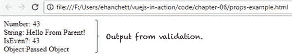

这正是我们期望的！但是有问题吗？如果你查看代码，你会注意到我们的自定义验证器检查一个数字是奇数还是偶数。如果是奇数，它返回`false`。为什么我们在`IsEven?`那里没有看到`false`？

事实上，Vue.js 确实将其显示为`false`！但它不在模板中。默认情况下，属性验证不会阻止传入的值在模板中显示。Vue.js 检查验证并在控制台发出警告。打开 Chrome 控制台查看。你的控制台应该类似于图 6.7。

##### 图 6.7\. 显示验证失败的错误。

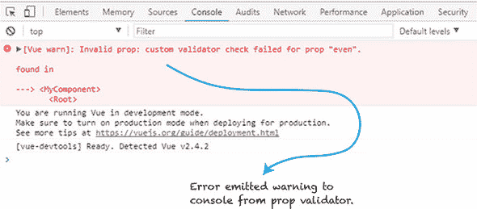

错误显示我们的自定义验证器在属性`even`上失败。这是好事，我们应该将传入的数字改为偶数。在使用属性验证时，请记住这种类型的错误。

### 6.4\. 定义模板组件

到目前为止，我们使用本地和全局注册来定义我们的组件。我们每个组件中的模板都定义为字符串。当我们的组件变得更大更复杂时，这可能会成为问题。由于不同的开发环境可能会引起语法高亮问题，模板字符串并不容易处理。此外，多行模板字符串需要转义字符，这会使得我们的组件定义变得杂乱。

Vue.js 有多种显示模板的方法，可以帮助解决这个问题。我们将讨论这一点以及我们如何使用 ES2015 字面量来使我们的组件模板更容易使用。

#### 6.4.1\. 使用内联模板字符串

与模板一起工作的最简单方法之一是使用内联模板。为了使这可行，我们需要在将模板信息包含在组件中时添加到父模板。

在列表 6.8 中，你可以看到我们在模板中将组件声明为`<my-component :my-info="message" inline-template>`。`inline-template`告诉 Vue 在`my-component`标签的开启和关闭之间渲染组件的内容。

使用内联模板的一个缺点是它们将模板与组件的其他定义部分分开。对于较小的应用程序，这可以工作，尽管不推荐在较大的应用程序中使用。在较大的应用程序中，你应该考虑我们在下一章中将要讨论的单文件组件。

##### 列表 6.8\. 使用内联模板：第六章/inline-component-example.html

```
<!DOCTYPE html>
<html>
<head>
<script src="https://unpkg.com/vue"></script>
</head>
<body>
  <div id="app">
    <my-component :my-info="message" inline-template>         *1*
      <div>
          <p>
            inline-template - {{myInfo}}                      *2*
          </p>
      </div>
    </my-component>
  </div>
  <script>
  const MyComponent = {
    props: ['myInfo']
  };

  new Vue({
      el: '#app',
      components: {'my-component': MyComponent},
      data() {
        return {
          message: 'Hello World'
        }
      }
  });
  </script>
</body>
</html>
```

+   ***1* 内联模板显示 HTML。**

+   ***2* 显示传入的属性**

#### 6.4.2\. Text/x-template 脚本元素

在我们的组件中定义模板的另一种方式是使用`text/x-template`脚本元素。在这种情况下，我们创建一个类型为`text/x-template`的脚本标签。

在 列表 6.9 中，我们使用 `text/x-template` 来定义 `my-component` 的模板。这里要记住的是，你必须将脚本定义为 `type="text/x-template"`，否则它将不起作用。

再次遇到与内联模板相同的问题。最大的问题是我们将组件定义与模板分开了。这可以工作，但只适用于小型应用程序，不适用于大型应用程序。

##### 列表 6.9\. 使用 text/x-模板：chapter 06/x-template-example.html

```
  <!DOCTYPE html>
  <html>
  <head>
  <script src="https://unpkg.com/vue"></script>
  </head>
  <body>
  <div id="app">
    <my-component></my-component>
  </div>
  <script type="text/x-template" id="my-component">        *1*
    <p>
      Hello from x-template
    </p>
  </script>
  <script>
  const MyComponent = {
    template: '#my-component'
  };
  new Vue({
    el: '#app',
    components: {'my-component': MyComponent}
  });
  </script>
  </body>
</html>
```

+   ***1* 展示了 x-template 脚本**

#### 6.4.3\. 使用单文件组件

在我们之前的示例中，我们使用字符串来表示组件中的模板。使用 ES2015 模板字面量，我们可以帮助消除使用字符串时遇到的一些问题。在 ES2015 中，如果你用反引号（`）包围一个字符串，它就变成了模板字面量。模板字面量可以是多行的，无需转义。它们还可以包含嵌入的表达式。这使得编写我们的模板变得更加容易。

就像之前所说的，ES2015 模板字面量仍然有与字符串相同的几个缺点。它在组件定义中看起来有点杂乱，并且某些开发环境可能没有语法高亮。你还有一个选项可以帮助解决所有这些问题：单文件组件。

单文件组件将你的模板和定义合并到一个 .vue 文件中。每个组件都有自己的作用域，你不必担心为每个组件强制使用唯一的名称。CSS 也为每个组件进行了作用域限制，这在大型应用程序中非常有用。最重要的是，你再也不必担心处理字符串模板或处理不寻常的脚本标签了。

在下面的列表中，你可以看到 HTML 被模板标签包围，这与我们之前的示例不同。.vue 文件使用 ES2015 导出返回组件的数据。

##### 列表 6.10\. 单文件组件：chapter 06/single-file-component.vue

```
<template>                             *1*
  <div class="hello">
    {{msg}}
  </div>
</template>

<script>
  export default {                     *2*
  name: 'hello',
  data () {
    return {
      msg: 'Welcome to Your Vue.js App'
    }
  }
}
</script>

<!-- Add "scoped" attribute to limit CSS to this component only -->
<style scoped>
</style>
```

+   ***1* 模板显示组件的信息。**

+   ***2* 展示了 ES2015 的数据导出**

要使用单文件组件，你需要熟悉几个现代构建工具。你需要使用像 Webpack 或 Browserify 这样的工具来构建 .vue 代码。Vue.js 通过其自己的脚手架生成器 Vue-CLI 使这个过程变得简单，Vue-CLI 包含了所有必要的构建工具。我们将在下一章讨论工具。现在，要知道有许多方法可以处理模板，而对于大型应用程序来说，单文件组件是最佳选择。

### 6.5\. 使用自定义事件

Vue.js 有自己的事件接口。与我们在第三章中看到的普通事件不同，自定义事件用于在父组件和子组件之间传递事件。事件接口可以使用 `$on(eventname)` 监听事件，并使用 `$emit(eventName)` 触发事件。通常，`$on(eventname)` 用于在不是父子关系的不同组件之间发送事件。对于父子事件，我们必须使用 `v-on` 指令。我们可以使用这个接口，这样父组件可以直接监听子组件。

#### 6.5.1\. 监听事件

想象你正在创建一个计数器。你希望在屏幕上有一个按钮，每次点击都会增加计数器 1，但你希望这个按钮在子组件中，计数器在父 Vue.js 实例中。你不想在子组件内部修改计数器。相反，它应该通知父组件计数器应该更新。每次按钮点击时，父组件中的计数器都需要更新。让我们看看如何做到这一点。

让我们从创建一个组件开始。当我们将其添加到模板中时，我们需要使用 `v-on` 指令并创建一个自定义事件。正如你在列表 6.11 中看到的，我们已经添加了组件并创建了一个名为 `increment-me` 的自定义事件。这个自定义事件绑定到我们在父 Vue 实例中定义的 `incrementCounter` 方法。我们还将添加一个绑定到触发 `incrementCounter` 的点击事件的普通按钮。这个按钮位于父组件的模板中。

在我们组件的定义中，我们需要添加一个按钮。我们再次使用绑定到点击事件的 `v-on` 指令。这会触发我们在子组件中定义的 `childIncrementCounter` 方法。

`childIncrementCounter` 只有一个职责，那就是触发我们之前创建的自定义事件。这可能有点令人困惑。我们将使用 `this.$emit('increment-me')` 来触发绑定的事件，即父组件方法中定义的 `incrementCounter`。我们正在触发父 Vue.js 实例的 `incrementCounter` 方法，这将增加计数器。这是强大的，允许我们在保持单向数据原则完整的同时修改父组件中的值。

##### 列表 6.11\. 使用 `$emit` 增加父组件计数器：chapter 06/event-listen.html

```
<!DOCTYPE html>
<html>
<head>
<script src="https://unpkg.com/vue"></script>
</head>
  <body>
  <div id="app">
    {{counter}}<br/>
    <button v-on:click="incrementCounter">Increment Counter</button>     *1*
    <my-component v-on:increment-me="incrementCounter"></my-component>   *2*
  </div>
  <script>
  const MyComponent = {
    template: `<div>
      <button v-on:click="childIncrementCounter"                         *3*
        >Increment From Child</button>
    </div>`,
    methods: {
      childIncrementCounter() {
        this.$emit('increment-me');                                      *4*
      }
    }
  };
  new Vue({
    el: '#app',
    data() {
        return {
            counter: 0
        }
    },
    methods: {
      incrementCounter() {
        this.counter++;                                                  *5*
      }
    },
    components: {'my-component': MyComponent}
  });
  </script>
  </body>
</html>
```

+   ***1* 显示了从父组件增加计数器的按钮**

+   ***2* 指示设置增量-me 事件的组件**

+   ***3* 指示触发子 IncrementCounter 方法的组件按钮**

+   ***4* 触发增量-me 事件**

+   ***5* 显示了通过 1 增加计数器的方法**

如果我们加载 Chrome 浏览器，你会看到两个按钮。这两个按钮都会增加父组件中设置的计数器，并在组件中显示（图 6.8）。

##### 图 6.8\. 显示了两个按钮；它们都从父组件增加计数器。


#### 6.5.2\. 使用 .sync 修改子组件属性

在大多数情况下，我们不想让子组件从父组件中修改 prop。我们更希望父组件来做。这是我们之前在章节中提到的单向数据流的基本规则之一。尽管如此，Vue.js 允许我们打破这个规则。

`.sync` 修饰符允许我们从子组件内部修改父组件中的值。它在 Vue 1.x 中被引入，但在 Vue 2.0 中被移除，但 Vue.js 核心团队决定在 2.3.0+ 中重新引入它。话虽如此，使用它时要小心。

让我们创建一个示例，展示 `.sync` 如何更新一个值。通过更新 `my-component` 和 `childIncrementCounter` 来修改 代码清单 6.11 中的代码。首先，我们将查看 `.sync` 修饰符。要使用 `.sync` 修饰符，你可以将其附加到组件上的任何 prop。在 代码清单 6.12 中，它附加在 `<my-component :my-counter.sync="counter">.` 上。`my-counter` prop 被绑定到 `counter`。

`.sync` 修饰符是这个 `<my-component :my-counter="counter" @update:my-counter="val => bar = val"></my-component>` 的语法糖。新创建的事件称为 `update`。该事件将 `my-counter` prop 分配给传递的任何变量。

要使这生效，我们仍然需要发出我们创建的新事件，并传递我们想要更新的计数器值。我们将使用 `this.$emit` 来完成这个操作。`this.myCounter+1` 是将被传递到更新事件的第一个参数。

##### 列表 6.12\. 使用 `.sync` 从子组件修改属性（06/event-listen-sync.html）

```
...
<my-component :my-counter.sync="counter"></my-component>         *1*
   ...
  const MyComponent = {
    template: `<div>
      <button v-on:click="childIncrementCounter"
>Increment From Child</button>
    </div>`,
    methods: {
      childIncrementCounter() {
        this.$emit('update:myCounter', this.myCounter+1);        *2*
      }
    },
    props:['my-counter']
```

+   ***1* 显示了带有 .sync 修饰符的组件设置**

+   ***2* 在更新事件后跟一个逗号**

如果我们加载浏览器，你会看到两个按钮。如果我们点击任何一个，它都会更新计数器（图 6.9）。

##### 图 6.9\. 此示例使用 `.sync` 来修改计数器。

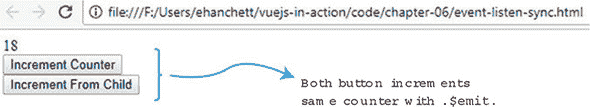

### 练习

使用本章的知识来回答这些问题：

+   你如何从父组件传递信息到子组件？你使用什么来从子组件将信息传递回父组件？

*请参阅附录 B 中的解决方案（kindle_split_026.html#app02）。*

### 摘要

+   组件的局部注册具有局部作用域。它可以通过在构建新的 Vue 实例时使用 components 选项来创建。

+   组件的全局注册使用 `Vue.components` 实例运算符，其中组件被定义。

+   组件在父组件和子组件之间使用单向数据绑定。

+   在组件中使用 Props 来定义可以传递给它们的内容。

+   单文件组件将所有模板和脚本信息合并到一个文件中。

+   你可以使用 `$emit` 向父组件发送信息。

## 第七章\. 高级组件和路由

*本章涵盖*

+   与插槽一起工作

+   使用动态组件

+   实现异步组件

+   使用 Vue-CLI 与单文件组件

现在我们已经探讨了组件以及它们如何被用来将应用程序分解成更小的部分，让我们更深入地了解组件并探索它们更多的高级特性。这些特性将帮助我们创建更动态和健壮的应用程序。

我们首先来看插槽。*插槽*将父组件的内容与子组件模板交织在一起，使得动态更新组件内部内容变得更加容易。然后我们将转向动态组件，它们提供了实时切换组件的能力。这个特性使得根据用户操作更换整个组件变得简单。例如，你可能正在创建一个显示多个图表的管理面板。你可以根据用户操作轻松地用动态组件替换每个图表。

我们还将探讨异步组件以及如何将应用程序划分为更小的部分。每个部分只有在需要时才会加载——当我们的应用程序变得很大并且我们需要对应用程序启动时加载的数据量保持敏感时，这是一个很好的补充。

当我们在这里时，我们将探讨单文件组件和 Vue-CLI。使用 Vue-CLI，我们可以在几秒钟内设置和创建一个应用程序，而无需担心学习复杂的工具。我们将利用本章所学的一切，重构我们的宠物商店应用程序以利用 Vue-CLI！

最后，我们将探讨路由以及我们如何使用它来创建路由参数和子路由。让我们开始吧！

### 7.1. 使用插槽

当与组件一起工作时，我们偶尔需要将父内容与子内容交织在一起，这意味着你需要将数据传递到你的组件中。想象一下，你有一个自定义表单组件，你希望在图书出版网站上使用它。在表单中包含两个文本输入元素，分别命名为作者和标题。每个文本输入元素之前都有一个标签来描述它们。每个标签的标题已经在根 Vue.js 实例的数据函数中定义好了。

当你与组件一起工作时，你可能已经注意到你无法在开标签和闭标签之间添加内容。正如你在图 7.1 中看到的，开标签和闭标签之间的任何内容都将被替换。

##### 图 7.1. 组件标签内的信息将被丢弃。

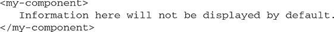

确保内容显示的最简单方法是使用插槽元素，正如我们接下来将要看到的。这可以通过 Vue 的*slot*元素来完成，这是一个 Vue.js 用来表示在组件的开标签和闭标签之间添加的数据应该显示在哪里的特殊标签。在其他 JavaScript 框架中，这个过程也被称为*内容分发*；在 Angular 中，它被称为*transclusion*，它与 React 的子组件类似。无论名称或使用的框架如何，想法是相同的。这是一种将内容从父组件嵌入到子组件中而不传递它的方法。

起初，你可能认为将值从根 Vue.js 实例传递到子组件。这会起作用，但让我们看看我们是否会遇到任何限制。我们将逐个属性传递到组件中。

为这个示例创建一个新文件，创建一个本地组件`form-component`并在其中创建一个简单的表单。这里的目的是创建两个组件将接受的简单 props：标题和作者。在根 Vue.js 实例中，将 props 传递给组件，如列表 7.1 中所示。这与我们在第六章中学到的 prop 传递类似。

在接下来的几个示例中，我们将创建更小的独立示例。请随意将其复制或输入到您的文本编辑器中并跟随。

##### 列表 7.1\. 使用 props 创建一个正常的父/子组件：chapter-07/parent-child.html

```
<!DOCTYPE html>
<html>
<head>
<script src="https://unpkg.com/vue"></script>
</head>
<body>
  <div id="app">
    <form-component
      :author="authorLabel"                       *1*
      :title="titleLabel">                        *2*
    </form-component>
  </div>
<script>
const FormComponent ={
  template: `
  <div>
    <form>
      <label for="title">{{title}}</label>        *3*
         <input id="title" type="text" /><br/>
      <label for="author">{{author}}</label>      *4*
         <input id="author" type="text" /><br/>
      <button>Submit</button>
    </form>
  </div>

  `,
  props: ['title', 'author']
}
new Vue({
  el: '#app',
  components: {'form-component': FormComponent},
  data() {
    return {
        titleLabel: 'The Title:',
        authorLabel: 'The Author:'
    }
  }

})
</script>
</body>
</html>
```

+   ***1* 将作者标签传递给表单组件**

+   ***2* 将标题标签传递给表单组件**

+   ***3* 显示传递进来的元素标题**

+   ***4* 显示传递进来的元素作者**

正如我提到的，代码会起作用，但随着表单的扩展，我们需要处理传递多个属性。如果我们向表单中添加 ISBN、日期和年份怎么办？我们需要向组件添加更多的 props 和更多属性。这可能会变得繁琐，意味着需要跟踪许多属性，这可能导致代码中的错误。

相反，让我们重写这个示例以使用插槽。首先，添加可以在表单顶部显示的文本。而不是将值作为 props 传递，我们将使用一个插槽来显示它。我们不需要将所有内容作为一个属性传递给组件。我们可以在组件的开头和结尾括号内直接显示我们想要的任何内容。当表单完成时，它应该看起来像图 7.2。

##### 图 7.2\. 图书表单页面示例。

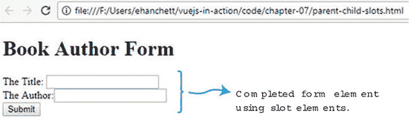

将列表 7.1 复制并粘贴到一个文件中，更改 data 函数并添加一个名为`header`的新属性。（记住，你可以在我的 GitHub 上下载这本书的代码：[`github.com/ErikCH/VuejsInActionCode`](https://github.com/ErikCH/VuejsInActionCode)。）正如你在图 7.2 中看到的，我们将添加一个新的标题属性来显示“图书作者表单”。接下来，找到在父 Vue.js 实例中声明的`form-component`的开头和结尾标签。在这些标签之间添加`header`属性。最后，我们需要更新`form-component`本身。在第一个`<form>`标签之后立即添加`<slot></slot>`元素。这告诉 Vue 在表单组件的开头和结尾标签之间添加任何内容。要运行这个示例，请使用这个列表中的新更新更新列表 7.1 中的代码。

##### 列表 7.2\. 添加`slot`元素：chapter-07/parent-child-slots-extract.html

```
...
<body>
  <div id="app">
    <form-component
      :author="authorLabel"
      :title="titleLabel">
      <h1>{{header}}</h1>                        *1*
    </form-component>
  </div>
<script>
const FormComponent ={
  template: `
  <div>
    <form>
      <slot></slot>                              *2*
      <label for="title">{{title}}</label>
    <input id="title" type="text" /><br/>
      <label for="author">{{author}}</label>
         <input id="author" type="text" /><br/>
      <button>Submit</button>
    </form>
  </div>

  `,
  props: ['title', 'author']
}
new Vue({
  el: '#app',
  components: {'form-component': FormComponent},
  data() {
    return {
        titleLabel: 'The Title:',
        authorLabel: 'The Author:',
        header: 'Book Author Form'               *3*
    }
  }

})
</script>
</body>
</html>
```

+   ***1* 在表单组件内添加了标题变量**

+   ***2* 从父组件插入插槽元素**

+   ***3* 添加新的标题属性**

### 7.2\. 命名插槽的概述

到目前为止，我们只向我们的组件添加了一个插槽元素。但是，正如你可能猜到的，这并不太灵活。如果我们想向组件传递多个属性，并且每个属性都需要在不同的位置显示呢？再次，传递每个单独的属性可能会很繁琐，那么如果我们决定使用插槽会怎样呢？有没有办法做到？

这就是命名插槽发挥作用的地方。命名插槽就像普通插槽一样，但它们可以被具体放置在组件内部。与未命名插槽不同，我们可以在我们的组件中拥有多个命名插槽。我们可以在组件的任何位置放置这些命名插槽。让我们在我们的示例应用中添加两个命名插槽。要添加它们，我们需要在子组件中精确地定义我们想要它们添加的位置。在列表 7.3 中，我们将添加两个命名插槽——`titleSlot` 和 `authorSlot`——到 `form-component`。

我们将从用新的插槽名称替换 `form-components` 模板开始。为此，我们必须在 HTML 中添加一个新的 `named-slot` 元素。将 7.2 中的完整代码列表中的标签元素从 `form-component` 移动到父模板中，如列表 7.3 所示。确保将标签中的属性名从 `title` 更改为 `titleLabel`，从 `author` 更改为 `authorLabel`。

接下来，添加两个新的插槽元素。每个元素都将替换表单组件模板中的标签。它应该看起来像这样：`<slot name="titleSlot"></slot>` 和 `<slot name="authorSlot"></slot>`。

在父模板内部，更新我们移动的标签，并给它添加一个名为 slot 的新属性。每个标签都应该有一个 slot 属性，如下所示：`<label for="title" slot="titleSlot">`。这告诉 Vue.js 确保这个标签的内容被添加到相应的命名插槽中。因为我们不再使用传入的属性，所以我们可以从表单组件中删除它们。这是完整的代码列表。

##### 列表 7.3\. 使用命名插槽：chapter-07/named-slots.html

```
<!DOCTYPE html>
<html>
<head>
<script src="https://unpkg.com/vue"></script>
</head>
<body>
  <div id="app">
    <form-component>
      <h1>{{header}}</h1>
      <label for="title" slot="titleSlot">{{titleLabel}}</label>       *1*
      <label for="author" slot="authorSlot">{{authorLabel}}</label>    *2*
    </form-component>
  </div>
<script>
const FormComponent ={
  template: `
  <div>
    <form>
      <slot></slot>
      <slot name="titleSlot"></slot>                                   *3*
         <input id="title" type="text" /><br/>
      <slot name="authorSlot"></slot>                                  *4*
         <input id="author" type="text" /><br/>
      <button>Submit</button>
    </form>
  </div>

  `
}
new Vue({
  el: '#app',
  components: {'form-component': FormComponent},
  data() {
    return {
        titleLabel: 'The Title:',
        authorLabel: 'The Author:',
        header: 'Book Author Form'
    }
  }

})
</script>
</body>
</html>
```

+   ***1* 使用 slot titleSlot 显示标签**

+   ***2* 显示与 slot authorSlot 链接的作者标签**

+   ***3* 插入名为 titleSlot 的命名插槽**

+   ***4* 插入名为 authorSlot 的命名插槽**

命名插槽使得将父组件中的元素插入到子组件的各个位置变得更加容易。正如我们所看到的，代码变得更短、更简洁。此外，不再需要传递属性，我们也不再需要在声明 `form-component` 时绑定属性。当你设计更复杂的应用程序时，这将非常有用。

|  |
| --- |

**带有插槽的编译作用域**

在列表 7.3 中，我们在表单组件的开头和结尾标签内添加了从根 Vue.js 实例的数据属性。请注意，子组件无法访问此元素，因为它是从父组件添加的。在使用插槽时，很容易错误地混淆元素的正确范围。记住，父模板中的所有内容都是在父范围中编译的。在子模板中编译的所有内容都是在子范围中编译的。这一点值得记住，因为你可能在将来遇到这些问题。

|  |
| --- |

### 7.3\. 范围插槽

*范围插槽*类似于命名插槽，但它们更像是可以传递数据的可重用模板。为了做到这一点，它们使用一个特殊的模板元素，并具有一个名为 `slot-scope` 的特殊属性。

`slot-scope` 属性是一个临时变量，用于存储从组件传递过来的属性。我们不是将值传递给子组件，而是可以将值从子组件传递回父组件。

为了说明这一点，想象你有一个列出书籍的网页。每本书都有一个作者和标题。我们想要创建一个书籍组件，该组件包含页面的外观和感觉，但我们想要为父组件内列出的每本书添加样式。在这种情况下，我们需要将书籍列表从子组件传递回父组件。当一切完成时，它应该看起来像图 7.3。

##### 图 7.3\. 书籍列表中的书籍和作者列表。

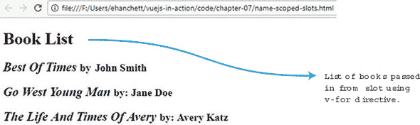

这是一个有点牵强的例子，但它展示了范围插槽的力量以及我们如何轻松地在子组件之间传递数据。为了创建这个应用程序，我们将创建一个新的书籍组件。在组件内部，我们将使用命名插槽显示标题，并为每本书创建另一个命名插槽。正如你在列表 7.4 中可以看到的，我们将添加一个 `v-for` 指令，该指令将遍历所有书籍并将值绑定到每一本。

书籍数组是在根 Vue.js 实例中创建的。它基本上是一个对象数组，每个对象都有一个标题和作者。我们可以使用 `v-bind` 指令 `:books` 将该书籍数组传递给 book-component。

在父组件的模板中，我们添加了新的 `<template>` 元素。为了使其生效，我们还需要将 `slot-scope` 属性添加到模板标签上。`slot-scope` 属性将子组件传递的值绑定。在这种情况下，`{{props.text}}` 等于子组件中的 `{{book}}`。

在模板标签内部，我们现在可以访问 `{{props.text}}`，就像它是 `{{books}}` 一样。换句话说，`{{props.text.title}}` 与 `{{book .title}}` 相同。我们将为每个标题和作者添加特殊样式，使其突出显示。

打开你的代码编辑器并尝试自己从列表 7.4 复制代码。你会看到我们取了书籍数组并将其传递到书籍组件中。然后我们在一个传递给父组件的模板的槽中显示了每本书。

##### 列表 7.4\. 作用域插槽：chapter-07/name-scoped-slots.html

```
<!DOCTYPE html>
<html>
<head>
<script src="https://unpkg.com/vue"></script>
</head>
<body>
  <div id="app">
    <book-component :books="books">                               *1*
      <h1 slot="header">{{header}}</h1>                           *2*
      <template slot="book" slot-scope="props">                   *3*
        <h2>
          <i>{{props.text.title}}</i>                             *4*
          <small>by: {{props.text.author}}</small>
        </h2>
      </template>
    </book-component>
  </div>
<script>
const BookComponent ={
  template: `
  <div>
      <slot name="header"></slot>
      <slot name="book"                                           *5*
        v-for="book in books"
        :text="book">                                             *6*
      </slot>
  </div>
  `,
  props: ['books']
}
new Vue({
  el: '#app',
  components: {'book-component': BookComponent},
  data() {
    return {
      header: 'Book List',
      books: [{author: 'John Smith', title: 'Best Of Times' },    *7*
              {author: 'Jane Doe', title: 'Go West Young Man' },
              {author: 'Avery Katz', title: 'The Life And Times Of Avery' }
             ]
    }
  }

})
</script>
</body>
</html>
```

+   ***1* 显示带有传入书籍的书籍组件**

+   ***2* 使用名为 header 的插槽显示头部文本**

+   ***3* 插入具有 slot-scope 属性模板元素**

+   ***4* 显示每本单独的书籍文本**

+   ***5* 插入名为 slot 的插槽，绑定 v-for 指令**

+   ***6* 从 books 中的 book 传递别名 book**

+   ***7* 设置书籍数组**

这可能一开始有点令人困惑，但使用作用域插槽非常强大。我们可以从我们的组件中获取值，并在父组件中显示它们以进行特殊样式设计。当你处理更复杂的组件和数据列表时，这是一个很好的工具。

### 7.4\. 创建动态组件应用程序

Vue.js 的另一个强大功能是*动态组件*。这个功能允许我们使用保留的`<component>`元素和`is`属性在多个组件之间动态切换。

在我们的数据函数中，我们可以创建一个属性来决定哪个组件将显示。然后，在我们的模板中，我们需要添加带有指向我们创建的数据属性的`is`属性的组件元素。让我们看看一个实际例子。

想象我们正在创建一个包含三个不同组件的应用程序。我们需要添加一个按钮，以便我们可以循环遍历每一个。一个组件将列出我们的书籍，另一个将列出添加书籍的表单，最后一个将显示头部信息。当我们完成所有这些后，它应该看起来像图 7.4。

##### 图 7.4\. 点击“循环”按钮后显示每个组件的动态书籍组件循环。

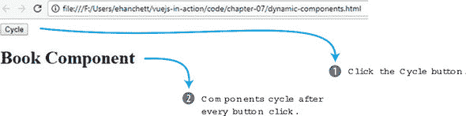

点击“循环”按钮将显示下一个组件。循环按钮触发简单的 JavaScript，使书组件旋转到表单组件，然后到头部组件。

打开你的文本编辑器并创建一个新的 Vue.js 应用程序。我们不会创建一个组件，而是创建三个。在每个模板中，我们将显示文本，让用户知道哪个组件被激活。你可以在列表 7.5 中看到一个例子。

数据函数将有一个名为`currentView`的属性。这个属性将在应用程序开始时指向`BookComponent`。接下来，创建一个名为`cycle`的方法。这个方法将在每次点击时更新`currentView`属性，以便它循环遍历所有组件。

作为最后一步，在根 Vue.js 实例中，我们将添加我们的按钮，并附加一个点击事件，如下所示：`<button @click="cycle">Cycle</button>`。在按钮下方，我们将添加一个`<h1>`标签，其中包含我们的新组件元素。组件元素将有一个属性，`is`，它将指向`currentView`。这就是你可以动态更改组件的方式。`currentView`属性将在每次按钮点击时更新。要运行此示例，创建一个 dynamic-components.html 文件。添加以下代码。

##### 列表 7.5\. 动态组件：chapter-07/dynamic-components.html

```
<!DOCTYPE html>
<html>
<head>
<script src="https://unpkg.com/vue"></script>
</head>
<body>
  <div id="app">
    <button @click="cycle">Cycle</button>                   *1*
    <h1>
      <component :is="currentView"></component>             *2*
    </h1>
  </div>
<script>
const BookComponent ={
  template: `
  <div>
    Book Component
  </div>
  `
}

const FormComponent = {
  template: `
  <div>
    Form Component
  </div>
  `
}

const HeaderComponent = {
  template: `
  <div>
    Header Component
  </div>
  `
}

new Vue({
  el: '#app',
  components: {'book-component': BookComponent,             *3*
               'form-component': FormComponent,
               'header-component': HeaderComponent},
  data() {
    return {
      currentView: BookComponent                            *4*
    }

  },
  methods: {
        cycle() {                                           *5*
          if(this.currentView === HeaderComponent)
            this.currentView = BookComponent
          else
            this.currentView = this.currentView === BookComponent ?
            FormComponent : HeaderComponent;
        }
    }

})
</script>
</body>
</html>
```

+   ***1* 在每次按钮点击时，都会触发 cycle 方法来改变当前视图。**

+   ***2* 显示与当前视图动态绑定的组件元素**

+   ***3* 列出所有创建的组件**

+   ***4* 这是分配给 BookComponent 的初始属性。**

+   ***5* 显示循环所有三个组件的方法**

你已经学会了如何使用一个按钮来循环三个不同的组件。也可以使用多个`v-if`和`v-else`指令来做这个示例，但这更容易理解且效果更好。

### 7.5\. 设置异步组件

当处理大型应用程序时，可能会有需要将应用程序分成更小的组件，并在需要时只加载应用程序的部分的情况。Vue 通过异步组件使这变得简单。每个组件都可以定义为异步解决组件的函数。此外，Vue.js 将缓存结果以供未来的重新渲染。

让我们设置一个简单的示例并模拟服务器负载。回到我们的书籍示例，假设我们从后端加载书籍列表，并且后端需要一秒钟来响应。让我们使用 Vue.js 来解决这个问题。图 7.5 展示了我们完成后的样子。

##### 图 7.5\. 在屏幕上渲染 1 秒后的异步组件。

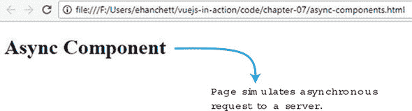

函数有一个 resolve 和 reject 回调，我们必须设置我们的组件来处理这些情况。创建一个应用程序和一个新的书籍组件，如列表 7.6 所示。

这个简单的组件在解决后会在屏幕上显示文本。我们将创建一个超时，使其需要 1 秒钟。超时用于模拟网络延迟。

创建异步组件时最重要的事情是将它定义为一个带有 resolve 和 reject 回调的函数。你可以根据回调是解决还是拒绝来触发不同的操作。

要运行此示例，创建一个名为 async-componets.html 的文件。将以下列表中的代码复制到文件中，以查看其效果。你应该会看到一个简单的异步组件。我们模拟了一个需要 1 秒钟来响应的服务器。我们也可以创建一个 reject，如果调用失败，它将解决。

##### 列表 7.6\. 异步组件；chapter-07/async-components.html

```
<!DOCTYPE html>
<html>
<head>
<script src="https://unpkg.com/vue"></script>
</head>
<body>
  <div id="app">
    <book-component></book-component>                   *1*
  </div>
<script>

const BookComponent = function(resolve, reject) {       *2*
  setTimeout(function() {                               *3*
    resolve({
      template: `
      <div>
        <h1>
          Async Component
        </h1>
      </div>
      `
    });

  },1000);

}

new Vue({
  el: '#app',
  components: {'book-component': BookComponent }

})
</script>
</body>
</html>
```

+   ***1* 在模板中显示书籍组件**

+   ***2* 显示必须解决或拒绝的异步书籍组件**

+   ***3* 显示一个模拟服务器并在 1000 毫秒后解决的超时**

|  |
| --- |

**高级异步组件**

自从 Vue 2.3.0 版本以来，你现在可以创建更高级的异步组件。在这些组件中，你可以设置加载组件，当组件加载时将显示这些组件。你可以设置错误组件和设置超时。如果你想了解更多关于这些组件的信息，请查看官方指南[`mng.bz/thlA`](http://mng.bz/thlA)。

|  |
| --- |

### 7.6\. 使用 Vue-CLI 转换宠物商店应用程序

到目前为止，我们使用单个文件构建我们的应用程序。这已经证明是具有挑战性的，因为我们的宠物商店应用程序已经增长。让我们的代码库更整洁的一件事是将应用程序分解成单独的组件。

正如我们在第六章中看到的，有很多方法可以拆分我们的应用程序。其中最强大的方法之一是使用单文件组件，它比其他创建组件的方法具有许多优势。最重要的优势是组件作用域的 CSS、语法高亮、易于重用和 ES6 模块。

组件作用域的 CSS 允许我们按组件划分 CSS。这可以帮助我们轻松地为每个组件创建特定的样式。语法高亮得到了改进，因为我们不再需要担心我们的 IDE 无法识别我们的组件模板文本，因为它不再需要分配给变量或属性。ES6 模块使得引入我们喜欢的第三方库变得更加容易。每个都有优势，使得编写 Vue.js 应用程序变得稍微容易一些。

为了充分利用单文件组件，我们需要使用像 Webpack 这样的构建工具来帮助我们捆绑所有模块和依赖项。此外，我们可以使用像 Babel 这样的工具来转译我们的 JavaScript，以确保它与每个浏览器兼容。我们本可以自己尝试做这件事，但 Vue.js 给我们提供了 Vue-CLI 来使这个过程变得更加容易。

Vue-CLI 是一个脚手架工具，可以帮助你快速启动 Vue.js 应用程序。它包含了启动所需的所有粘合剂。CLI 提供了多个官方模板，因此你可以使用你喜欢的工具开始你的应用程序。（你可以在官方 GitHub 页面[`vuejs.org/v2/guide/installation.html`](https://vuejs.org/v2/guide/installation.html)上了解更多关于 Vue-CLI 的信息。）以下是最常见的模板列表：

+   ***webpack*—** 一个功能齐全的 Webpack 构建，带有 Vue loader、热重载、代码检查和 CSS 提取。

+   ***webpack-simple*—** 一个简单的 Webpack + Vue loader，用于快速原型设计。

+   ***browserify*—** 一个功能齐全的 Browserify + Vuetify 设置，带有热重载、代码检查和单元测试。

+   ***browserify-simple*—** 一个简单的 Browserify + Vuetify 设置，用于快速原型设计。

+   ***pwa*—** 基于 Webpack 的 PWA（渐进式网络应用程序）模板。

+   ***Simple*—** 在单个 HTML 文件中可能最简单的 Vue 设置。

要创建一个应用，你需要安装 Node 和 Git，然后安装 Vue-CLI。（如果你还没有这样做，请参阅 附录 A 获取更多信息。）

|  |
| --- |

##### **注意**

到本文写作时，Vue-CLI 3.0 仍然处于测试版。本章是使用 Vue-CLI 的最新版本 2.9.2 编写的。如果你使用 Vue-CLI 3.0，其中一些选项可能会有所不同。你将不会使用 `vue init` 来创建应用，而是使用 `vue create <项目名称>`。然后它会问你一系列新问题。你可以选择一组默认预设或从列表中选择你想要的功能。这些包括 TypeScript、Router、Vuex 和 CSS 预处理器等。如果你正在跟随，请确保选择与你在 列表 7.7 中看到相同的选项。然后你可以跳到 7.6.2 节。有关 Vue-CLI 3.0 的更多信息，请查看官方的 README 文件，链接为 [`github.com/vuejs/vue-cli/blob/dev/docs/README.md`](https://github.com/vuejs/vue-cli/blob/dev/docs/README.md)。

|  |
| --- |

#### 7.6.1\. 使用 Vue-CLI 创建新应用

让我们使用 Vue-CLI 为我们的宠物商店创建一个应用。打开你的终端，输入 `vue init webpack petstore`。这个命令告诉 Vue-CLI 使用 Webpack 模板创建一个应用。

到本文写作时，最新的 Vue-CLI 版本是 2.9.2。如果你使用的是更高版本，请不要担心，问题应该是类似的，并且是自我解释的。如果你遇到任何问题，请遵循 Vue-CLI 的官方指南，了解其安装和使用方法，链接为 [`vuejs.org/v2/guide/installation.html`](https://vuejs.org/v2/guide/installation.html) - CLI。

在运行命令后，你会被提示几个问题。第一个问题要求输入名称，然后是描述和作者。输入名称为 `petstore`，并输入任何你喜欢的描述和作者。接下来的几个问题会询问你是否要使用仅运行时或运行时和编译器版本的 Vue.js。我建议同时运行运行时和编译器。这样在我们创建模板时会更方便；否则，所有模板都只能在 .vue 文件中使用。

下一个问题会询问是否安装 vue-router。输入 `yes`。之后，它会询问你是否想使用 ESLint。这是一个在每次保存时都会检查你代码的代码检查库。对于我们的目的，我们在这里说“不”，因为这对我们的项目来说并不重要。最后两个问题是关于测试的。在后面的章节中，我会向你展示如何使用 vue-test-utils 库创建测试用例，但到目前为止，你可以对两个问题都回答“是”。跟随这个列表，为我们的宠物商店应用创建一个新的 Vue-CLI 应用程序。

##### 列表 7.7\. 终端命令

```
$ vue init webpack petstore                         *1*
? Project name petstore
? Project description Petstore application for book
? Author Erik Hanchett <erikhanchettblog@gmail.com>
? Vue build standalone
? Install vue-router? Yes
? Use ESLint to lint your code? No
? Setup unit tests with Karma + Mocha? Yes
? Setup e2e tests with Nightwatch? Yes

   vue-cli · Generated "petstore".                  *2*

   To get started:

     cd petstore
     npm install
     npm run dev

   Documentation can be found at https://vuejs-templates.github.io/webpack
```

+   ***1* 显示创建新应用的 init 命令**

+   ***2* 列出设置问题和答案**

应用程序创建并下载模板后，你需要安装所有依赖项。切换到 petstore 目录，并运行 `npm install` 或 YARN，在提示符下运行以下命令来安装所有依赖项：

```
$ cd petstore
$ npm install
```

这将安装应用程序的所有依赖项。这可能需要几分钟。所有依赖项安装完成后，你现在应该能够使用以下命令运行服务器：

```
$ npm run dev
```

打开你的网络浏览器，导航到 localhost:8080，你应该会看到欢迎来到您的 Vue.js 应用程序窗口，如图 7.6 所示。（当服务器运行时，任何更改都将通过浏览器进行热重载。）如果服务器没有启动，请确保没有其他应用程序在默认的 8080 端口上运行。

##### 图 7.6\. Vue-CLI 的默认欢迎屏幕

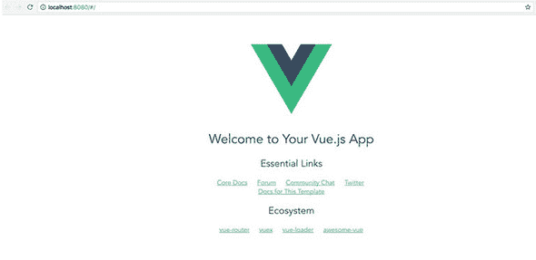

现在，我们已经准备好进入我们的宠物商店应用程序。

#### 7.6.2\. 设置我们的路由

Vue-CLI 内置了一个高级路由库，称为 *vue-router*，它是 Vue.js 的官方路由器。它支持各种功能，包括路由参数、查询参数和通配符。此外，它具有 HTML5 历史模式和哈希模式，并自动回退到 Internet Explorer 9。你应该能够使用它创建任何所需的路由，而无需担心浏览器兼容性。

对于我们的宠物商店应用程序，我们将创建两个名为 `Main` 和 `Form` 的路由。`Main` 路由将显示来自我们的 products.json 文件的产品列表。`Form` 路由将是我们的结账页面。

在我们创建的应用程序内部，打开 src/router/index.js 文件，查找路由数组。你可能会在其中看到默认的 `Hello` 路由；你可以自由地删除它。更新路由数组，使其与 列表 7.8 匹配。数组中的每个对象至少有一个路径和一个组件。路径是你需要在浏览器中导航到的 URL，以访问该路由。组件是我们将用于该路由的组件名称。

可选地，我们还可以添加一个名称属性。这个名称代表路由。我们将在稍后使用路由名称。Props 是另一个可选属性。这告诉 Vue.js 组件是否应该期望接收传递给它的属性。

在更新数组后，请确保将 `Form` 和 `Main` 组件导入到路由器中。每次我们引用一个组件时，都必须导入它。默认情况下，Vue-CLI 使用 ES6 导入风格。如果组件没有导入，你将在控制台看到错误。

最后，默认情况下，vue-router 在路由时使用哈希。当在浏览器中导航到 `form` 时，Vue 将构造 URL 为 `#/form` 而不是 `/form`。我们可以通过向路由器添加 `mode: 'history'` 来关闭这个功能。

##### 列表 7.8\. 添加路由：chapter-07/petstore/src/router/index.js

```
import Vue from 'vue'
import Router from 'vue-router'
import Form from '@/components/Form'        *1*
import Main from '@/components/Main'

Vue.use(Router)

export default new Router({
  mode: 'history',                          *2*
  routes: [
    {
      path: '/',
      name: 'iMain',                        *3*
      component: Main,
      props: true
    },
    {
      path: '/form',
      name: 'Form',                         *4*
      component: Form,
      props: true
    }

  ]
})
```

+   ***1* 导入组件 Form 和 Main**

+   ***2* 显示没有哈希的路由的历史模式**

+   ***3* 显示 iMain 路由在 /****

+   ***4* 显示 /form 路由的表单**

任何新的应用程序都应该首先从路由开始。这能给你一个很好的指示，了解你想要如何构建应用程序。

#### 7.6.3\. 将 CSS、Bootstrap 和 Axios 添加到我们的应用程序中

我们的宠物商店应用程序使用了一些不同的库，我们需要将它们添加到我们的 CLI 项目中。我们可以用不同的方式处理这个问题。

一种方法是用 Vue.js 特定的库。随着 Vue 的增长，其生态系统也在增长。新的 Vue.js 特定库层出不穷。例如，BootstrapVue 是一个用于将 Bootstrap 添加到我们的项目的 Vue.js 特定库。Vuetify 是一个流行的材料设计库。我们将在未来探讨这些库中的几个，但不是现在。

添加库的另一种常见方式是将它们包含在索引文件中。当没有特定于 Vue.js 的库可用时，这很有用。

要开始，请打开宠物商店应用程序根目录中的 index.html 文件。为了与第五章中的原始应用程序保持一致，我们将在该文件中添加 Bootstrap 3 和 Axios CDN 的链接，如下所示。通过在这份文件中添加这些库，我们现在可以在整个应用程序中访问它们。

##### 列表 7.9\. 添加 Axios 和 Bootstrap: chapter-07/petstore/index.html

```
<!DOCTYPE html>
<html>
  <head>
    <meta charset="utf-8">
    <script
src="https://cdnjs.cloudflare.com/ajax/libs/axios/0.16.2/axios.js">    *1*

</script>

    <title>Vue.js Pet Depot</title>
    <link rel="stylesheet"
href="https://maxcdn.bootstrapcdn.com/bootstrap/3.3.7/css/bootstrap
 .min.css" crossorigin="anonymous">                                  *2*

  </head>
  <body>
    <div id="app"></div>
    <!-- built files will be auto injected -->
  </body>
</html>
```

+   ***1* 表示 Axios 库 CDN**

+   ***2* 显示 Bootstrap 3 库 CDN**

我们有几种方法可以添加 CSS。正如我们稍后将要看到的，添加 CSS 的一种方法是将它限制在每个组件中。如果我们想为组件使用特定的 CSS，这是一个有用的功能。

我们还可以指定将在整个网站上使用的 CSS。为了保持简单，让我们将我们的 CSS 添加到我们的宠物商店应用程序中，以便所有内部组件都可以访问它。（稍后我们将探讨使用作用域 CSS。）

打开 src/main.js 文件。这是根 Vue.js 实例所在的地方。从这里我们可以导入我们想要用于应用程序的 CSS。因为我们使用 Webpack，所以我们需要使用带有相对路径的 `require` 关键字。

| |
| --- |

##### FYI

想了解更多关于 Webpack 和资源如何工作的信息，请查看[`vuejs-templates.github.io/webpack/static.html`](https://vuejs-templates.github.io/webpack/static.html)上的文档。

| |
| --- |

将 app.css 文件复制到 src/assets 文件夹中，如下所示的下一条列表所示。您可以在附录 A 中找到包含书中代码的 app.css 的副本。

##### 列表 7.10\. 添加 CSS: chapter-07/petstore/src/main.js

```
import Vue from 'vue'
import App from './App'
import router from './router'
require('./assets/app.css')             *1*

Vue.config.productionTip = false

/* eslint-disable no-new */
new Vue({
  el: '#app',
  router,
  template: '<App/>',
  components: { App }
})
```

+   ***1* 将 app.css 添加到应用程序中**

CSS 添加到应用程序后，每个组件都将使用它。

#### 7.6.4\. 设置我们的组件

正如我们之前讨论的，组件使得将我们的应用程序分解成更小的可重用部分变得容易。让我们将宠物商店应用程序分解成几个更小的部分，这样我们可以更容易地处理我们的应用程序。对于宠物商店，我们将有`Main`、`Form`和`Header`。`Header`组件将显示我们的网站名称和导航，`Main`将列出所有产品，而`Form`将显示结账表单。

在我们开始之前，请删除位于 src/components 文件夹中的 HelloWorld.vue 文件。我们不会使用这个文件。在这个文件夹中创建一个名为 Header.vue 的文件代替。这个文件是我们放置头部信息的地点。

大多数.vue 文件遵循一个简单的模式。文件的顶部通常是模板所在的位置。模板被一个开标签和一个闭标签`template`包围。正如我们之前看到的，在模板标签之后也必须包含一个根元素。我通常放一个`<div>`标签，但一个`<header>`标签也可以。记住，一个模板只能有一个根元素。

模板之后是一个`<script>`标签。这是我们将创建 Vue 实例的地方。在`<script>`标签之后是一个`<style>`标签，我们可以在其中可选地放入 CSS 代码并将其范围限定在组件内。（你将在列表 7.12 中看到这一点。）

现在复制列表 7.11 中的代码到模板中。这段代码与第五章中用于头部的代码类似。你会注意到模板中有一个新元素叫做`router-link`，它是 vue-router 库的一部分。`router-link`元素在 Vue.js 应用程序的路线之间创建内部链接。`<router-link>`标签有一个名为`to`的属性。我们可以将这个属性绑定到我们命名的路线之一。让我们将其绑定到`Main`路线。

##### 列表 7.11\. Header 模板：chapter-07/petstore/src/components/Header.vue

```
<template>
<header>
  <div class="navbar navbar-default">
    <div class="navbar-header">
      <h1><router-link :to="{name: 'iMain'}">          *1*
           {{ sitename }}
               </router-link>
                 </h1>
    </div>
    <div class="nav navbar-nav navbar-right cart">
      <button type="button"
class="btn btn-default btn-lg"
v-on:click="showCheckout">
        <span class="glyphicon glyphicon-shopping-cart">
                {{cartItemCount}}</span> Checkout
      </button>
    </div>
  </div>
</header>
</template>
```

+   ***1* 这链接到 iMain 路线。**

接下来，我们需要为这个组件创建逻辑。我们将从之前的宠物商店应用程序中复制粘贴到 Header.vue 文件中。但是我们需要做一些修改。当我们上一次在第五章中更新宠物商店应用程序时，我们使用了一个`v-if`指令来确定是否显示结账页面。我们创建了一个方法，当点击 Checkout 按钮时切换`showProduct`。

让我们替换这个逻辑，这样我们就不需要切换`showProduct`，而是切换到我们之前创建的 Form 路线。正如你在列表 7.14 中看到的，这是通过`this.$router.push`完成的。与`router-link`类似，我们需要向路由器提供我们想要导航到的路线的名称。因此，我们将 Checkout 按钮导航到 Form 路线。

因为我们将 `sitename` 变量通过 `router-link` 改为了链接，所以它现在看起来与之前略有不同。我们应该通过将其放在 `<style>` 部分来更新我们的新锚标签的 CSS。因为我们在其中添加了关键字 `scoped`，Vue.js 将确保 CSS 只针对此组件进行作用域限制。

此外，你可能已经注意到从列表 7.12 中，我们不再使用之前章节中使用的 Vue.js 实例初始化器。CLI 不需要它。相反，我们使用更简单的语法，ES6 模块默认导出（`export default { }`）。将所有 Vue.js 代码放在这里。

在我们的 CSS 中，我们将关闭文本装饰并将颜色设置为黑色。将列表 7.11 和 7.12 合并到一个文件中。

##### 列表 7.12\. 添加脚本和 CSS：chapter-07/petstore/src/components/Header.vue

```
<script>
export default {
  name: 'my-header',
  data () {
    return {
    sitename: "Vue.js Pet Depot",
    }
  },
  props: ['cartItemCount'],
  methods: {
    showCheckout() {
      this.$router.push({name: 'Form'});                             *1*
    }

  }
}
</script>

<!-- Add "scoped" attribute to limit CSS to this component only -->
<style scoped>                                                       *2*
a {
  text-decoration: none;
  color: black;
}
</style>
```

+   ***1* 导航 Vue.js 应用到 Form 路由**

+   ***2* 显示作用域 CSS**

从那里，你应该已经设置好这个组件了。你可能也注意到我们的头部接受一个名为 `cartItemCount` 的属性。我们的主组件将传递这个信息，正如我们在创建 Main 组件时将看到的。`cartItemCount` 将跟踪我们添加到购物车中的项目数量。

#### 7.6.5\. 创建 Form 组件

`Form` 组件是结账页面所在的位置。它将与我们第五章中创建的类似。最大的不同之处在于我们现在在模板顶部引用了新的 `my-header` 组件。我们还将 `cartItemCount` 传递给头部。

在 src/components 文件夹中创建一个组件，命名为 Form.vue。正如你在列表 7.13 中看到的，模板中的 HTML 代码几乎与第五章中看到的一样。唯一的区别是我们已经在顶部添加了一个新的头部组件。我不会在这里复制所有内容，所以我建议你下载第七章的代码（下载说明在附录 A 中）。

##### 列表 7.13\. 创建表单组件：chapter-07/petstore/src/components/Form.vue

```
<template>
  <div>
  <my-header :cartItemCount="cartItemCount"></my-header>      *1*
    <div class="row">
      <div class="col-md-10 col-md-offset-1">
        ...

      </div><!--end of col-md-10 col-md-offset-1-->
    </div><!--end of row-->
  </div>
</template>
```

+   ***1* 头部组件显示传入的 cartItemCount 值。**

此组件的脚本代码与第五章中的类似。一个不同之处在于现在它接受一个名为 `cartItemCount` 的属性。此外，我们必须定义 `Header` 组件，以便它可以在模板中使用，如下所示。

##### 列表 7.14\. 添加脚本标签：chapter-07/petstore/src/components/Form.vue

```
<script>
import MyHeader from './Header.vue';        *1*
export default {
  name: 'Form',
  props: ['cartItemCount'],                 *2*
  data () {
    return {
      states: {
...
      },
      order: {
           ...
      }

    }
  },
  components: { MyHeader },
  methods: {
    submitForm() {
      alert('Submitted');
    }
  }
}
</script>
```

+   ***1* 导入 Header 组件**

+   ***2* 传入 cartItemCount 属性**

将列表 7.13 和 7.14 合并，你应该就绪了。在后面的章节中，我们将为输入添加更多逻辑，但到目前为止这已经足够了。

#### 7.6.6\. 添加 Main 组件

宠物商店应用程序的`Main`组件将显示所有我们的产品。它是我们添加产品到购物车和查看星级评价的地方。我们已经为这部分写好了所有逻辑，所以我们真正需要做的只是将它放入一个.vue 文件中。

与`Form`组件一样，我们将`my-header`组件添加到文件顶部，并将`cartItemCount`传递给它。在 src/components 文件夹中创建一个名为 Main.vue 的文件。将以下代码添加到其中。

##### 列表 7.15\. 创建主模板：chapter-07/petstore/src/components/Main.vue

```
<template>
  <div>
  <my-header :cartItemCount="cartItemCount"></my-header>       *1*
  <main>
  <div v-for="product in sortedProducts">
    <div class="row">
      <div class="col-md-5 col-md-offset-0">
        <figure>
          
        </figure>
      </div>
      <div class="col-md-6 col-md-offset-0 description">
        <h1 v-text="product.title"></h1>
        <p v-html="product.description"></p>
        <p class="price">
        {{product.price | formatPrice}}
        </p>
        <button class=" btn btn-primary btn-lg"
                v-on:click="addToCart(product)"
                v-if="canAddToCart(product)">Add to cart</button>
        <button disabled="true" class=" btn btn-primary btn-lg"
                                v-else >Add to cart</button>
        <span class="inventory-message"
         v-if="product.availableInventory - cartCount(product.id)
          === 0"> All Out!
        </span>
        <span class="inventory-message"
        v-else-if="product.availableInventory - cartCount(product.id) < 5">
          Only {{product.availableInventory - cartCount(product.id)}} left!
        </span>
        <span class="inventory-message"
              v-else>Buy Now!
        </span>
        <div class="rating">
          <span  v-bind:class="{'rating-active' :checkRating(n, product)}"
             v-for="n in 5" >
          </span>
        </div>
      </div><!-- end of col-md-6-->
    </div><!-- end of row-->
    <hr />
  </div><!-- end of v-for-->
  </main>
  </div>
</template>
```

+   ***1* 将 my-header 组件添加到代码中。**

在添加模板后，我们需要添加 Vue.js 代码。在文件顶部添加一个新的`MyHeader`导入语句，如列表 7.16 所示。您还需要在 data 函数之后通过引用`components: { MyHeader }`来声明组件。

在我们添加其余代码之前，请确保将图片文件夹和 products.json 文件复制到 petstore/static 文件夹中。您可以在[`github.com/ErikCH/VuejsInActionCode`](https://github.com/ErikCH/VuejsInActionCode)找到这些文件和第七章的代码。

当使用 CLI 时，我们可以将文件存储在两个地方——要么是 assets 文件夹，要么是 static 文件夹。资产文件由 Webpack 的 url-loader 和 file-loader 处理。资产在构建过程中内联/复制/重命名，因此它们基本上与源代码相同。每次您在 assets 文件夹中引用文件时，您都应使用相对路径。./assets/logo.png 文件可能是 assets 文件夹中 logo 的位置。

静态文件完全不经过 Webpack 处理；它们直接以原样复制到最终目的地。在引用这些文件时，您必须使用绝对路径。因为我们使用 products.json 文件加载所有文件，所以将文件复制到静态文件夹并从那里引用它们更容易。

请继续更新 src/components 文件夹中的 Main.vue 文件。（在列表 7.16 中排除了过滤器和方法。）从宠物商店应用程序中获取 Vue.js 实例数据、方法和过滤器，并将它们添加到下面的 Main.vue 文件中的模板下方。

##### 列表 7.16\. 创建 Main.vue 的脚本：chapter-07/petstore/src/components/Main.vue

```
<script>
import MyHeader from './Header.vue'             *1*
export default {
  name: 'imain',
  data () {
    return {
      products: {},
      cart: []
    }
  },
  components: { MyHeader },
  methods: {
    ...

  },
  filters: {
    ...

  },
  created: function() {
    axios.get('/static/products.json')           *2*
    .then((response) =>{
      this.products=response.data.products;
      console.log(this.products);
    });
  }
}
</script>
```

+   ***1* 将 MyHeader 导入到项目中**

+   ***2* JSON 产品文件位于静态文件夹中，使用绝对路径。**

在复制文件后，删除 App.vue 文件中的样式和 logo.png `` 标签。如果您愿意，也可以删除 assets 文件夹中的 logo.png 文件。确保通过运行 `npm run dev` 重新启动 Vue-CLI 服务器，如果您还没有这样做的话。您应该看到宠物商店应用程序启动，您可以通过点击 Checkout 按钮导航到结账页面（图 7.7）。如果您收到任何错误，请检查控制台。例如，如果您忘记在 index.html 中导入 Axios 库，就像我们在 代码列表 7.9 中做的那样，您将收到一个错误。

##### 图 7.7\. 使用 Vue-CLI 打开的宠物商店应用程序。

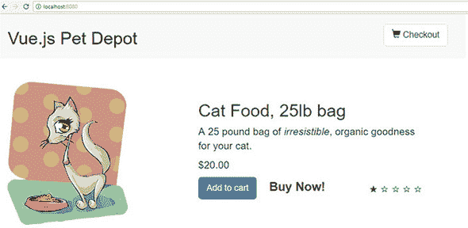

### 7.7\. 路由

既然我们的应用已经使用了 Vue-CLI，让我们更深入地了解一下路由。在本章的早期部分，我们设置了一些路由。在本节中，我们将添加更多。

在任何单页应用程序，如 Vue.js 中，路由有助于应用程序的导航。在宠物商店中，我们有一个表单路由。当您加载应用程序并访问 /form 时，该路由将被加载。与传统 Web 应用程序不同，数据不需要从服务器发送以加载路由。当 URL 发生变化时，Vue 路由拦截请求并显示相应的路由。这是一个重要的概念，因为它允许我们在客户端而不是服务器上创建所有路由。

在本节中，我们将探讨如何创建子路由，使用参数在路由之间传递信息，以及如何设置重定向和通配符。我们不会涵盖所有内容，所以如果您需要更多信息，请查看官方 Vue 路由文档：[`router.vuejs.org/en/`](https://router.vuejs.org/en/)。

#### 7.7.1\. 添加带参数的产品路由

在我们的应用程序中，我们只有两个路由，主路由和表单路由。让我们为我们的产品添加另一个路由。让我们假设我们为宠物商店应用程序收到了一个新的需求。我们被告知要添加一个产品描述页面。这可以通过使用动态路由匹配和路由 *参数* 来实现。参数是发送在 URL 内部的动态值。在我们添加新的产品描述路由后，您将使用 URL 查找产品页面，如图 7.8 所示。注意顶部的 URL 是 product/1001？这是一个动态路由。

##### 图 7.8\. 产品 1001 的动态段。

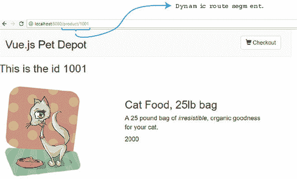

我们在路由文件中使用冒号（`:`）来指定动态路由。这告诉 Vue.js 将任何以 /product 开头的路由匹配到 Product 组件。换句话说，/product/1001 和 /product/1002 这两个路由都会由 Product 组件处理。1001 和 1002 将作为名为 `id` 的参数传递给组件。

在宠物商店应用中，查找 src/router 文件夹。index.js 文件包含我们现有的路由。从以下列表中复制代码片段并将其添加到 src/router/index.js 文件中的路由数组中。确保在顶部导入 Product 组件。我们将在下一步创建它。

##### 列表 7.17\. 编辑路由文件：chapter-07/route-product.js

```
import Product from '@/components/Product'
...
    },
    {
        path: '/product/:id',         *1*
        name: 'Id',
        component: Product,
        props: true
    }
...
```

+   ***1* 显示名为 id 的动态路由段**

我们有一个名为 `id` 的动态段。我们将路由名称设置为 `Id`，这样我们就可以使用 router-link 组件轻松地稍后查找它。如前所述，让我们创建一个 Product 组件。

在 Product 组件内部，有一个我们将从路由参数中检索的单个产品。我们的目的是在组件内部显示该产品信息。

在产品模板内部，我们将能够访问 `$route.params.id`。这将显示传递到参数中的 `id`。我们将在组件顶部显示 `id` 以验证它是否正确传递。

将以下代码复制到 src/components/Product.vue 的新文件中。这是组件的顶部。

##### 列表 7.18\. 添加产品模板：chapter-07/product-template.vue

```
<template>
  <div>
    <my-header></my-header>
    <h1> This is the id {{ $route.params.id}}</h1>            *1*
    <div class="row">
      <div class="col-md-5 col-md-offset-0">
        <figure>
          
        </figure>
      </div>
      <div class="col-md-6 col-md-offset-0 description">
        <h1>{{product.title}}</h1>
        <p v-html="product.description"></p>
        <p class="price">
          {{product.price }}
        </p>
      </div>
    </div>
  </div>
  </template>
...
```

+   ***1* $route.params.id 显示传递的 id。**

模板很简单，但组件的底部，即逻辑和脚本所在的位置，要复杂一些。为了加载模板的正确产品，我们需要使用传递的 `id` 找到正确的产品。

幸运的是，我们可以用简单的 JavaScript 做到这一点。我们将再次使用 Axios 库来访问 products.json 平面文件。这次我们将使用 JavaScript 过滤函数来返回 ID 与 `this.$route.params.id` 匹配的产品。过滤函数应该只返回一个值，因为所有 ID 都是唯一的。如果出于任何原因这没有发生，请检查 products.json 平面文件，并确保每个 ID 都是唯一的。

最后，我们需要在从我们的平面文件返回的 `this.product.image` 前添加一个 fo`/`’ 字符（列表 7.19）。这是因为我们正在使用动态路由匹配和相对路径，而文件相对路径可能会引起问题。

将此列表中的代码复制并添加到 src/components/Product.vue 文件的底部。确保文件中包含来自 列表 7.18 和 7.19 的代码。

##### 列表 7.19\. 产品脚本：chapter-07/product-script.js

```
...
  <script>
  import MyHeader from './Header.vue'                     *1*
  export default {
    components: { MyHeader },
    data() {
    return {
      product: ''
    }
  },
  created: function() {
    axios.get('/static/products.json')                    *2*
    .then((response) =>{
      this.product = response.data.products.filter(       *3*
          data => data.id == this.$route.params.id)[0]    *4*
      this.product.image = '/' + this.product.image;      *5*
    });
  }
}
</script>
```

+   ***1* 将 Header 组件导入到文件中**

+   ***2* 使用 Axios 库检索静态文件**

+   ***3* 过滤响应数据**

+   ***4* 只将匹配路由参数的数据添加到 this.product**

+   ***5* 在 product.image 前添加一个 '/' 以帮助处理相对路径**

在 Product 组件就绪后，我们现在可以保存文件并打开我们的网络浏览器。我们目前还没有直接访问路由的方法，但我们可以将 URL 打入浏览器中的 http://localhost:8080/product/1001。这将显示第一个产品。

|  |
| --- |

##### 故障排除

如果路由没有加载，请打开控制台并查找任何错误。确保你在路由文件中保存了数据；否则，路由将不会加载。也容易忘记在 `this.product.image` 前面添加 `'`/`'。

| |
| --- |

#### 7.7.2\. 使用标签设置 router-link

除非我们在应用内部为它们添加链接，否则路由可能毫无用处。否则，我们的用户必须记住每个 URL。使用 Vue router，我们可以使路径路由变得简单。我们之前在本章中看到的最简单的方法之一是使用 `router-link` 组件。你可以通过使用 `:to` 属性来定义你想要导航到的路由。这可以绑定到一个特定的路径或对象，该对象定义了要导航到的路由名称。例如，`<router-link :to="{ name: 'Id' }">Product</router-link>` 将导航到名为 `Id` 的路由。在我们的应用中，它是产品组件。

`router-link` 组件还有一些其他的技巧。这个组件有许多额外的属性，增加了更多的功能。在本节中，我们将重点关注 `active-class` 和 `tag` 属性。

让我们假设我们为我们的宠物商店应用收到了另一个要求。我们希望当用户导航到表单路由时，结账按钮看起来像是被点击过的。当用户离开路由时，按钮必须恢复到正常状态。我们可以通过在路由激活时给按钮添加一个名为 `active` 的类，并在用户不在路由上时移除该类来实现这一点。我们还需要为用户提供一种方式，点击任何产品的标题，使其导航到产品描述页面。

当一切完成时，用户点击结账按钮后，我们的应用将像 图 7.9 一样显示。注意当用户在结账页面上时按钮的外观。

##### 图 7.9\. 更新了样式的结账按钮。


让我们为我们的新产品页面添加链接。打开 src/Main.vue 文件，并查找显示 `{{product.title}}` 的 `h1` 标签。删除它并添加一个新的 `router-link`。在 `router-link` 中添加一个 `tag` 属性。`tag` 属性用于将 `router-link` 转换为列出的标签。在这种情况下，`router-link` 将在浏览器中显示为 `h1` 标签。

`to` 属性用于表示链接的目标路由。它可以传递一个可选的描述符对象。要发送 `param`，使用 `params: {id: product.id}` 语法。这告诉 Vue router 将 `product.id` 作为 `id` 发送到动态段。例如，如果 `product.id` 是 1005，则路由将是 /product/1005。

打开 src/Main.vue 文件，并使用以下列表中的代码更新组件。注意 `:to` 有两个不同的属性，`name` 和 `params`。你可以用逗号分隔每个属性。

##### 列表 7.20\. 在 main 中更新 router-link：chapter-07/route-link-example.html

```
...
<div class="col-md-6 col-md-offset-0 description">
  <router-link                                             *1*
 tag="h1"                                                  *2*
        :to="{ name : 'Id', params: {id: product.id}}">    *3*
        {{product.title}}                                  *4*
  </router-link>
  <p v-html="product.description"></p>
...
```

+   ***1* 开始 router-link**

+   ***2* 将 router-link 转换为显示为 h1 标签**

+   ***3* 路由的目标是 Id，参数被传递。**

+   ***4* 这将是可点击的文本。**

运行命令 `npm run dev` 后保存并打开浏览器。现在你可以点击任何产品的标题来导航到产品组件。`id` 参数将被发送到产品路由并用于显示产品。

|  |
| --- |

**查询参数**

查询参数是我们可以在路由之间发送信息的另一种方式。参数附加到 URL 的末尾。我们不必使用动态路由段，可以使用查询参数发送产品 ID。要在 Vue 路由中添加查询参数，你只需要像这样向描述符对象添加一个查询属性：

```
<router-link  tag="h1":to=" {name : 'Id', query:
 {Id: '123'}}">{{product.title}}</router-link>
```

可以添加多个查询参数，但每个参数都必须用逗号分隔；例如，`{Id: '123', info: 'erik'}`。这将在 URL 中显示为 `?id=123&info=erik`。你可以在模板中使用 `$route.query.info` 访问查询。如果你想了解更多关于查询参数的信息，请查看官方文档[`router.vuejs.org/en/api/router-link`](https://router.vuejs.org/en/api/router-link)。

|  |
| --- |

#### 7.7.3\. 设置具有样式的 router-link

我们的一个要求是在用户导航到 `Form` 路由后激活结账按钮。`active-class` 属性使得这变得简单。当路由处于活动状态时，`router-link` 将自动将我们分配给 `active-class` 的任何值添加到标签上。因为我们使用 Bootstrap，类名 `active` 将使按钮看起来已经激活。

打开 `src/components/Header.vue` 文件，并更新 `{{cartItemCount}}` 的按钮元素。删除现有的按钮，并添加 `router-link`，如下所示。你也可以删除 `showCheckout` 方法，因为它将不再需要。

##### 列表 7.21\. 当路由处于活动状态时更新头部链接：chapter-07/header-link.html

```
...
<div class="nav navbar-nav navbar-right cart">
    <router-link                                          *1*
active-class="active"                                     *2*
tag="button"                                              *3*
class="btn btn-default btn-lg"                            *4*
:to="{name: 'Form'}">                                     *5*
        <span
            class="glyphicon glyphicon-shopping-cart">
            {{ cartItemCount}}
     </span> Checkout
...
```

+   ***1* 记录将导航到结账页面的 router-link 元素**

+   ***2* active-class 属性将添加活动类。**

+   ***3* 将 route-link 转换为 h1 标签**

+   ***4* 按钮的 Bootstrap 类**

+   ***5* 导航到 Form 路由**

保存头部组件的更改并导航应用程序。如果你打开浏览器控制台，你将看到每次点击后，活动类都会添加到头部中的结账按钮。当你再次导航到 `Main` 路由时，活动类会被移除。只有当路由处于活动状态时，活动类才会添加到按钮上。当用户从 `Form` 路由导航离开时，活动类会被移除。

从 Vue 2.5.0+ 开始，每当用户更改路由时，都会添加一个新的 CSS 类。这个类叫做 `router-link-exact-active`。我们可以直接使用这个类并定义功能。假设我们想要在类激活时将链接颜色改为蓝色。

在`src/components/Header.vue`内部，在底部添加一个新的 CSS 选择器：复制此列表中的代码片段。此类将仅在路由激活时添加到`router-link`元素。

##### 列表 7.22\. Router-link-exact-active: chapter-07/route-link.css

```
...
.router-link-exact-active {          *1*
  color: blue;
}
...
```

+   ***1* 当路由激活时将元素设置为蓝色**

保存文件，并在浏览器中尝试导航。您会注意到，当路由激活时，页眉中的“结账”按钮文本变为蓝色。在这本书的其余部分，我们将更改此 CSS 选择器为黑色，因为蓝色不如黑色看起来那么好。如果需要，知道它在那里是件好事。

#### 7.7.4\. 添加子编辑路由

新的`Id`路由显示每个单独的产品，但假设我们需要添加一种编辑每个产品的方法。让我们添加另一个路由，该路由将在用户点击“编辑产品”按钮时在`Product`路由内部显示。

| |
| --- |

##### 注意

为了简化，我们不会实现编辑功能。根据我们当前的实现，我们无法保存对静态文件的更改。相反，我们将专注于如何添加子路由，并为将来更改产品保存实现。

| |
| --- |

子路由是嵌套路由。它们非常适合需要编辑或删除当前路由内信息的情况。您可以通过在父路由内添加`router-view`组件来访问这些路由，正如我们将看到的。

当我们将所有东西连接在一起时，新的编辑路由应该看起来像图 7.10。注意 URL，product/1001/Edit。

##### 图 7.10\. 产品的一个子编辑路由。


让我们从添加一个新组件开始。在`src/components`文件夹内，添加一个新文件，并将其命名为`EditProduct.vue`。复制此列表并将其添加到`src/components/EditProduct.vue`文件中。

##### 列表 7.23\. 添加 `EditProduct` 组件: chapter-07/edit-comp.vue

```
<template>
  <div>
    <h1> Edit Product Info</h1>
  </div>
</template>
<script>
    export default {
        //future           *1*
    }
   </script>
```

+   ***1* 给出了编辑产品的未来实现**

在`Product`组件中添加一个`router-view`组件。该组件是 Vue 路由的内部组件，用于新路由的端点。当此路由激活时，`EditProduct`组件将显示在`router-view`组件所在的位置。

复制以下列表中的代码片段，并编辑`src/components/Product.vue`文件，以在底部添加一个新按钮和`router-view`组件。该按钮将触发新编辑方法。这将推送`Edit`路由并激活它。

##### 列表 7.24\. 添加 `Edit Product` 按钮: chapter-07/edit-button.vue

```
...
  </p>
  <button @click="edit">Edit Product</button>    *1*
  <router-view></router-view>                    *2*
</div>
...
methods: {
    edit() {
      this.$router.push({name: 'Edit'})          *3*
    }
},
```

+   ***1* 显示触发编辑方法的按钮**

+   ***2* The router-view component is the entry point for the route.**

+   ***3* The $router.push activates the Edit route.**

现在我们已经准备好更新路由文件了。在`Id`路由内部添加一个新的数组，名为`children`。在`children`数组中，我们将添加`Edit`路由和`EditProduct`组件。

从下一个列表中获取代码并更新`src/router/index.js`文件。更新`Id`路由并添加新的`children`数组。确保在顶部也导入`EditProduct`组件。

##### 列表 7.25\. 使用新子路由更新路由：chapter-07/child-route.js

```
import EditProduct from '@/components/EditProduct'
import Product from '@/components/Product'
...
{
    path: '/product/:id',
    name: 'Id',
    component: Product,
    props: true,
    children: [               *1*
      {
        path: 'edit',
        name: 'Edit',
        component: EditProduct,
        props: true
      }
    ]
},
...
```

+   ***1* 定义一个新子路由，该路由仅在 Id 路由内显示。**

保存`index.js`文件并在浏览器中查看新路由。点击编辑产品按钮，你应该会看到编辑产品信息消息。如果路由没有加载，请双检查控制台中的错误并再次验证`index.js`文件。

#### 7.7.5\. 使用重定向和通配符

我想要介绍的 Vue 路由的最后一个特性是*重定向*和*通配符路由*。让我们想象一下，我们为我们的宠物商店应用得到了一个最终的要求。我们需要确保如果有人不小心输入了错误的 URL，它将他们重定向回主页。这是通过通配符路由和重定向实现的。

在创建路由时，我们可以使用通配符，也称为*符号，来捕获其他路由尚未覆盖的所有路由。此路由必须添加到所有其他路由的底部。

`redirect`选项会将浏览器重定向到另一个路由。请继续编辑`src/routes/index.js`文件。在路由底部添加以下代码片段。

##### 列表 7.26\. 为路由添加通配符：chapter-07/wildcard-route.js

```
...
{
  path: '*',          *1*
  redirect:"/"        *2*
}
...
```

+   ***1* 捕获所有**

+   ***2* 重定向到“/”**

保存文件并尝试浏览到/anything 或/testthis。这两个 URL 都会将您重定向回主“/”路由。

|  |
| --- |

**导航守卫**

*导航守卫*，正如其名所示，通过重定向或取消路由来保护导航。如果您在允许用户进入路由之前需要验证用户，这可能特别有用。使用导航守卫的一种方法是在路由配置对象中直接添加`beforeEnter`守卫。它可能看起来像这样：

```
beforeEnter (to, from, next) => { next() }
```

您还可以在任何组件内部添加`beforeEnter(to, from, next)`钩子。这将在路由加载之前加载。`next()`告诉路由继续。`next(false)`将停止路由加载。如果您需要更多信息，请参阅官方文档[`router.vuejs.org/guide/advanced/navigation-guards.html`](https://router.vuejs.org/guide/advanced/navigation-guards.html)。

|  |
| --- |

为了参考，此列表显示了完整的`src/routes/index.js`文件。

##### 列表 7.27\. 完整路由文件：chapter-07/petstore/src/router/index.js

```
import Vue from 'vue'
import Router from 'vue-router'
import Form from '@/components/Form'
import Main from '@/components/Main'
import Product from '@/components/Product'
import EditProduct from '@/components/EditProduct'
Vue.use(Router)

export default new Router({
  mode: 'history',
  routes: [
    {
      path: '/',
      name: 'iMain',
      component: Main,
      props: true,
    },
    {
        path: '/product/:id',        *1*
        name: 'Id',
        component: Product,
        props: true,
        children: [                  *2*
          {
            path: 'edit',
            name: 'Edit',
            component: EditProduct,
            props: true
          }
        ]
    },
    {
      path: '/form',
      name: 'Form',
      component: Form,
      props: true
    },
    {                                *3*
      path: '*',
      redirect:"/"
    }
  ]
})
```

+   ***1* 记录 id 的动态路由段**

+   ***2* 在 Id 路由内显示子路由**

+   ***3* 在重定向到“/”的路由底部捕获所有**

|  |
| --- |

**懒加载**

Vue-CLI 使用 Webpack 打包 JavaScript 代码。这个包可能相当大。这可能会影响大型应用程序或网络连接较慢的用户加载时间。我们可以使用 vue.js 异步组件功能和代码拆分与懒加载来帮助我们减小包的大小。这个概念超出了本书的范围，但我强烈建议您查找有关此信息的官方文档。您可以在[`router.vuejs.org/guide/advanced/lazy-loading.html`](https://router.vuejs.org/guide/advanced/lazy-loading.html)找到它。

|  |
| --- |

路由对于大多数 Vue 应用程序都是基本的。任何超出简单“Hello World”应用程序的内容都需要它们。请确保花时间并相应地规划您的路由，以便它们具有逻辑性。使用子路由来指定添加或编辑等事项。在路由之间传递信息时，不要害怕使用参数。如果您在路由问题上遇到困难，不要忘记查看官方文档[`router.vuejs.org/en`](http://router.vuejs.org/en)。

### 练习

使用本章的知识来回答以下问题：

+   列出两种在不同路由之间导航的方法。

*请参阅附录 B 中的解决方案 appendix B。*

### 概述

+   使用插槽在将信息传递到组件时使应用程序更加动态。

+   您可以使用动态组件在应用程序内部切换组件。

+   向应用程序添加异步组件可以提高速度。

+   您可以使用 Vue-CLI 转换应用程序。

+   您可以使用 props 在组件之间传递值。

+   子路由可以用来编辑父路由内的信息。

## 第八章\. 过渡和动画

*本章涵盖*

+   理解过渡类

+   使用动画

+   添加 JavaScript 钩子

+   更新宠物商店应用程序

在第七章中，我们探讨了高级组件，并讨论了如何使用单文件组件将应用程序分解成更小的部分。在本章中，我们将使用 Vue.js 来查看过渡和动画。我们将使用这些内置的动画/过渡类创建简单的过渡和动画。之后，我们将使用 JavaScript 钩子来创建动画。然后，我们将查看组件之间的过渡。在本章结束时，我们将更新我们的宠物商店应用程序并添加过渡和动画。

### 8.1\. 过渡基础

在 Vue.js 中创建过渡之前，您必须首先了解 `<transition>` 组件元素。这是一个特殊元素，表示您希望 Vue.js 过渡或动画一个或多个元素。`<transition>` 元素包裹了一个条件、一个动态组件或组件根节点。

过渡组件根据某些条件从 DOM 中插入或删除。例如，一个 `v-if` 指令可能会添加或删除它所包围的元素。当这个动作发生时，过渡组件可以识别是否存在 CSS 过渡或动画。然后，它将在适当的时间添加或删除 CSS 类来创建过渡或动画。你还可以向组件添加特殊的 JavaScript 钩子来创建更复杂的情况。如果没有找到 CSS 过渡或动画，插入和删除 DOM 的操作将立即发生；否则，过渡或动画将发生。让我们看看一个例子。

想象你正在创建一个包含书籍标题列表的网站。你希望用户通过点击标题来切换描述的开启或关闭。正如我们在前面的章节中学到的，我们可以使用 `v-if` 指令来做这件事。

但你希望点击标题后描述缓慢淡入。然后你需要它在再次点击标题后淡出。你可以在 Vue.js 中使用 CSS 过渡和 `<transition>` 元素来实现这一点。

打开你的编辑器并创建一个应用程序，就像你在列表 8.1 中看到的那样。首先，创建一个简单的应用程序，在页面顶部显示一个虚构的书籍标题作为 `<h2>` 标签。我们将用 `<div>` 标签包围这个元素，并使用 `@click` 附加一个点击事件。这个点击事件的目的就是切换一个名为 `show` 的变量。如果 `show` 是 `true`，并且用户点击按钮，它将切换为 `false`。如果它是 `false`，它将切换为 `true`。

在 body 标签内部，你需要添加你的新过渡元素。过渡元素也可以有一个 `name` 属性。将名称设置为 `fade`。包裹在过渡元素内部的是 `v-if` 指令。这个指令将切换描述。在应用程序底部，添加带有数据函数的 Vue 构造函数。这将保存我们应用程序的所有变量。

##### 列表 8.1\. 创建描述过渡：chapter-08/transition-book-1.html

```
<!DOCTYPE html>
<html>
<head>
  <script src="https://unpkg.com/vue"></script>
</head>
<body>
  <div id="app" >
    <div @click="show = !show">                *1*
      <h2>{{title}}</h2>
    </div>
    <transition name="fade">                   *2*
      <div v-if="show">                        *3*
        <h1>{{description}}</h1>
      </div>
    </transition>
  </div>
  <script>
  new Vue({                                    *4*
    el: '#app',
    data() {                                   *5*
      return {
        title: 'War and Peace',
        description: 'Lorem ipsum dolor sit amet,
consectetur adipiscing elim',
        show: false
      }
    }

  });
  </script>
</body>
</html>
```

+   ***1* 表示切换变量 show 为真或假的 div 标签**

+   ***2* 显示了名为 fade 的新过渡元素**

+   ***3* 显示了切换显示描述与否的 v-if 指令**

+   ***4* 记录了 Vue.js 构造函数**

+   ***5* 显示了带有变量的数据函数**

在浏览器中加载应用程序并打开它。你应该看到一个看起来像图 8.1 的页面。如果你点击标题，描述将弹出在下面。这个例子完全没有过渡。点击标题会切换描述的开启或关闭。要添加过渡，我们必须添加过渡类。

##### 图 8.1\. 无过渡的切换


使用 列表 8.1，在 `head` 元素内添加一个样式标签。为了简化，我们将在示例中将 CSS 内联在样式标签中。这样，我们就不必担心添加单独的 CSS 文件。

有六个 Vue.js CSS 类可以应用于进入和离开过渡。在这个例子中，我们将使用四个：`v-enter-active`、`v-leave-active`、`v-enter` 和 `v-leave-to`。我们稍后会使用的另外两个是 `v-enter-to` 和 `v-leave`。

在 列表 8.1 中，我们没有添加任何动画类。如我之前提到的，如果没有 CSS 类存在，`v-if` 指令的条件会立即触发，并且没有 CSS 过渡。我们需要添加 CSS 过渡类来使淡入效果生效。首先，让我们看看这些类各自的作用以及它们何时被添加或从 DOM 中删除。请注意，帧是一个类似数组的属性，代表当前窗口中的所有元素。表 8.1 显示了你应该注意的所有 CSS 过渡类。

##### 表 8.1\. CSS 过渡类

| 过渡类 | 描述 |
| --- | --- |
| v-enter | 这是第一个状态。它在元素插入之前被添加，并在元素插入后的一帧被移除。 |
| v-enter-active | 当元素进入 DOM 时，此类会被添加到元素上。它在元素插入之前被插入，并在过渡/动画完成后被移除。这是你设置整个过渡的持续时间、延迟和缓动曲线的地方。 |
| v-enter-to | 这个类是在 Vue.js 2.1.8+ 中引入的。它在元素插入后的一帧被添加，并在过渡/动画完成后被移除。 |
| v-leave | 当元素从 DOM 中离开或被移除时，此类会被添加。它在下一帧后被移除。 |
| v-leave-active | 这是离开动画/过渡的激活状态。它与 v-enter-active 类似。你可以用它来设置离开过渡/动画的持续时间、延迟和缓动曲线。它在离开过渡被触发时立即添加，并在过渡/动画完成后被移除。 |
| v-leave-to | 这与 v-enter-to 类似，是在 Vue.js 2.1.8+ 后添加的。这是离开的结束状态。它在触发离开过渡后的一帧被添加，并在动画/过渡完成后被移除。 |

当 DOM 中的元素被添加或移除时，这些类会在不同时间被添加和移除。我们可以使用这些类来构建过渡和动画。有关过渡类的更多信息，请查看官方文档 [`mng.bz/5mb2`](http://mng.bz/5mb2)。

让我们在`head`内部的样式元素中添加过渡。在我们添加这些类之前，你可能已经注意到在列表 8.1 中，我们给过渡元素添加了一个名称属性。因为我们添加了名称属性，所以 CSS 类名将以我们添加的名称`fade`开头，而不是`v-`。如果我们没有给过渡元素添加名称属性，类名将保持不变：`v-enter-active`、`v-leave-active`等。相反，类名将以`fade`、`fade-enter-active`和`fade-leave-active`等开头，例如。

在前一个列表中的应用代码中的样式标签内添加`fade-enter-active`和`fade-leave-active` CSS 过渡类。如前所述，活跃类是我们放置带有延迟的 CSS 过渡的地方。在这个例子中，我们将设置不透明度、2.5 秒和`ease-out`。这将创建一个 2.5 秒完成的淡入淡出效果。

接下来，我们将添加`fade-enter`和`fade-leave-to`。这将设置我们的初始不透明度为 0。这将确保淡入淡出时透明度为 0。更新之前的示例，并查看其效果。为了简化，我已经移除了其他代码，因为它与列表 8.1 相同。你始终可以查阅书中包含的完整代码。

##### 列表 8.2\. 带有淡入淡出的描述过渡：chapter-08/transition-book.html

```
...
  <style>
  .fade-enter-active, .fade-leave-active {     *1*
    transition: opacity 3.0s ease-out;

  }

  .fade-enter, .fade-leave-to {                *2*
    opacity: 0;

  }
  </style>
...
```

+   ***1* 活跃状态显示过渡的持续时间和缓动效果。**

+   ***2* 透明度为 0 的进入和离开状态**

在你的浏览器中加载此文件并打开开发工具。当你点击书的标题并查看源代码时，你可能会注意到一些有趣的事情。对于 3.0 秒，你会看到一个围绕描述的新类，`fade-enter-active`和`fade-enter-to`。你可以在图 8.2 中看到它。

##### 图 8.2\. 元素被添加到 DOM 中的类


这些类只会在淡入淡出过程中出现。之后，这些类将被移除。如果我们再次点击标题，它将开始淡出文本。你可以在浏览器中看到，在图 8.3 中的过渡过程中，`fade-leave-active`和`fade-leave-to`被添加到 HTML 节点上。

##### 图 8.3\. 元素从 DOM 中移除时显示的类。


当元素从 DOM 中移除时，这些类会瞬间添加。这就是 Vue.js 创建动画和过渡的方式。通过在不同时间添加和移除类，Vue.js 中的元素可以创建整洁的过渡和动画。

### 8.2\. 动画基础

动画是 Vue.js 另一个重要的特性。你可能想知道动画和过渡之间的区别是什么。过渡是从一个状态移动到另一个状态，而动画有多个状态。在上一个例子中，我们从看到文本到淡出文本。我们还看到了从页面上没有文本到淡入文本的过渡。

动画有一些不同。每个动画可以有多个状态，这些状态可以包含在一个声明中。你可以用动画做一些很酷的事情，比如创建复杂的运动并将多个动画链接在一起。动画也可以像过渡一样工作，但它们不是过渡。

让我们从 列表 8.2 中的相同示例开始，并添加一个动画。我们将使用相同的代码，但这次我们将使用 CSS 关键帧添加一个漂亮的弹跳效果。当点击标题时，我们希望动画淡入并缩放。当再次点击标题时，我们希望动画缩放并淡出。打开你的文本编辑器并复制 列表 8.2。将过渡名称更新为 bounce，如 列表 8.3 所示。

##### 列表 8.3\. 使用缩放的动画：chapter-08/animation-book-1.html

```
<div @click="show = !show">
  <h2>{{title}}</h2>
</div>
<transition name="bounce">        *1*
  <div v-if="show">
    <h1>{{description}}</h1>
  </div>
</transition>
```

+   ***1* 显示 bounce 过渡**

现在我们需要添加新的动画。这个动画需要 `enter-active` 和 `leave-active` 类。首先删除旧的 CSS 过渡元素。然后添加 `bounce-enter-active` 和 `bounce-leave-active` 类。在 `bounce-enter-active` 类中添加一个持续时间为 2 秒的 `bounceIn` CSS 动画。同样添加到 `bounce-leave-active` 类中，并添加一个 `reverse`。

接下来创建 CSS 关键帧。使用 `@keyframes` 并添加 0%，60% 和 100%。我们将使用 CSS 变换，0% 时缩放为 .1，60% 时缩放为 1.2，100% 时缩放为 1。我们还将透明度从 0 变更到 1。按照此处所示将其添加到样式表中。

##### 列表 8.4\. 使用缩放全屏的动画：chapter-08/animation-book.html

```
...
  <style>
  .bounce-enter-active {                *1*
  animation: bounceIn 2s;
  }
  .bounce-leave-active {                *2*
  animation: bounceIn 2s reverse;
  }

  @keyframes bounceIn {                 *3*
  0% {                                  *4*
    transform: scale(0.1);
    opacity: 0;
  }
  60% {                                 *5*
    transform: scale(1.2);
    opacity: 1;
  }
  100% {                                *6*
    transform: scale(1);
  }
</style>
```

+   ***1* 进入使用关键帧 bounceIn 的活动状态**

+   ***2* 离开使用关键帧 bounceIn 的活动状态**

+   ***3* 显示动画的关键帧**

+   ***4* 0% 动画将缩放转换为 0.1 并将透明度设置为 0。**

+   ***5* 60% 动画将缩放转换为 1.2 并将透明度设置为 1。**

+   ***6* 在 100% 时将缩放转换为 1。**

在浏览器中打开文件并查看动画。当你点击书的标题时，你应该会看到淡入和缩放效果。如果你再次点击它，它将淡出。图 8.4 是动画进行到一半时的截图。

##### 图 8.4\. 过渡截图


动画创建了一个效果，文本在结束时变大并缩小。

### 8.3\. JavaScript 钩子

Vue.js 提供的过渡和动画类应该涵盖你需要的所有基本过渡和动画，但如果需要，Vue.js 还提供了一个更强大的解决方案。我们可以设置 JavaScript 钩子来进行更复杂的过渡和动画。我们通过将钩子与操纵和指导 CSS 的 JavaScript 结合来实现这一点。

这些钩子可能会让你想起我们在早期章节中讨论的 Vue.js 生命周期中的钩子。这些 JavaScript 钩子类似，但仅用于过渡/动画。在使用这些钩子之前，请记住以下几点。首先，我们必须始终在使用`enter`和`leave`钩子时使用`done`回调。否则，它们将同步调用，并且过渡将立即完成。此外，当使用仅 JavaScript 的过渡时，添加`v-bind:css="false"`是一个好主意，这样 Vue 可以跳过对该过渡的所有 CSS 检测。最后，要记住的是，除了`enter`和`leave`，所有钩子都传递了`el`或元素参数，这些钩子还传递了`done`作为参数。不用担心这有点令人困惑；我将在下一节中向你展示它是如何工作的。

当进入时，我们可以使用的 JavaScript 钩子有`beforeEnter`、`enter`、`afterEnter`和`enterCancelled`。当过渡离开时，有`beforeLeave`、`leave`、`afterLeave`和`leaveCancelled`。所有这些钩子都在动画的各个时间点触发。

让我们想象一下，我们正在更新我们的书籍示例，以使用我们之前使用的那种动画，但这次，我们想使用 JavaScript 钩子而不是 CSS 类。我们该如何做呢？让我们从列表 8.4 开始，删除`bounce-enter-active`和`bounce-leave-active`类。我们将保留关键帧。相反，我们将使用`enter`和`leave`的 JavaScript 钩子来在 JavaScript 中进行动画。

让我们更改过渡元素，使其包含所有列出的 JavaScript 钩子。为此，我们需要使用`v-on`指令或使用`@`符号进行简写。添加`before-enter`、`enter`、`before-leave`、`leave`、`after-leave`、`after-enter`、`enter-cancelled`和`leave-cancelled`的 JavaScript 钩子。

##### 列表 8.5\. JavaScript 钩子过渡：chapter-08/jshooks-1.html

```
<transition name="fade"                  *1*
    @before-enter="beforeEnter"
    @enter="enter"
    @before-leave="beforeLeave"
    @after-enter="afterEnter"
    @enter-cancelled="enterCancelled"
    @leave="leave"
    @after-leave="afterLeave"
    @leave-cancelled="leaveCancelled"
    :css="false">
```

+   ***1* 显示过渡的所有钩子**

接下来，我们需要在 Vue 实例内部的`methods`对象中添加 JavaScript 钩子。为了正确地完成这项工作，我们需要检测动画何时完成。这样，我们可以清除样式并在事件上运行`done`。`done`是在`enter`和`leave` JavaScript 钩子中使用的参数。在这些钩子中必须执行`done`。为此，我们将创建一个新的事件监听器。

事件监听器等待动画完成，通过查找`animationend`。当动画完成时，回调将重置样式并执行`done`。我们将在 HTML 文件中的 Vue 构造函数上方添加此代码，如下所示。

##### 列表 8.6\. JavaScript 钩子事件监听器：chapter-08/jshook-2.html

```
function addEventListener(el, done) {
  el.addEventListener("animationend", function() {       *1*
    el.style="";
    done();
});
```

+   ***1* 事件监听器监视动画结束。**

尽管我们只使用 `leave` 和 `enter`，但让我们将所有 JavaScript 钩子添加到我们的程序中。每个钩子都会写入控制台日志，这样您就可以更好地了解它们何时被触发。

在您的 Vue.js 实例中添加一个新的 `methods` 对象。将您添加到过渡中的所有 JavaScript 钩子添加到该 `methods` 对象中。在 `enter` 方法中，添加一个调用之前创建的 `addEventListener` 的函数，并确保传入 `element` 和 `done`，正如列表 8.7 中所示。接下来，我们将使用 JavaScript 设置动画。`el.style.animationName` 是我们在样式内部创建的关键帧动画的名称。`el.style.animationDuration` 将设置为 1.5 秒。

在 `leave` 钩子内部，添加相同的 `animationName` 和 `animationDuration`。我们还将添加一个 `el.style.animationDirection` 并将其设置为 reverse。这将使元素离开 DOM 时动画反转。

##### 列表 8.7\. JavaScript 钩子方法：chapter-08/jshooks.html

```
...
  methods: {
      enter(el, done) {                           *1*
        console.log("enter");
        addEventListener(el,done);                *2*
        el.style.animationName = "bounceIn"
        el.style.animationDuration = "1.5s";
      },
      leave(el, done) {                           *3*
        console.log("leave");
        addEventListener(el,done);                *4*
        el.style.animationName = "bounceIn"
        el.style.animationDuration = "1.5s";
        el.style.animationDirection="reverse";
      },
      beforeEnter(el) {                           *5*
          console.log("before enter");
      },
      afterEnter(el) {                            *6*
          console.log("after enter");
      },
      enterCancelled(el) {                        *7*
          console.log("enter cancelled");
      },
      beforeLeave(el) {                           *8*
          console.log("before leave");
      },
      afterLeave(el) {                            *9*
          console.log("after leave");
      },
      leaveCancelled(el) {                        *10*
          console.log("leave cancelled");
      }
    }

  });
...
```

+   ***1* enter 钩子**

+   ***2* enter 钩子内部调用了 addEventListener 函数。**

+   ***3* leave 钩子**

+   ***4* leave 钩子内部调用了 addEventListener 函数。**

+   ***5* beforeEnter 钩子**

+   ***6* afterEnter 钩子**

+   ***7* enterCancelled 钩子**

+   ***8* beforeLeave 钩子**

+   ***9* afterLeave 钩子**

+   ***10* leaveCancelled 钩子**

运行此示例后，其行为应与列表 8.4 中的书籍示例完全一致。点击标题，动画将开始。再次点击，动画将以相反方向开始。请密切关注控制台。当您第一次点击标题时，您将看到一些消息，如`before enter`、`enter`，然后是`after enter`，正如图 8.5 所示。

##### 图 8.5\. 点击标题后触发的钩子


这是钩子执行的顺序。`after enter` 不会在动画完成之前触发。再次点击标题按钮后，我们可以看到触发钩子的顺序。首先是 `before leave`，然后是 `leave`，最后是 `after leave`，正如图 8.6 所示。

##### 图 8.6\. 当元素从 DOM 中移除时触发的钩子。


如果您查看源代码，您还会注意到每次点击后都会添加和移除 CSS。这与我们之前看到的 CSS 过渡类非常相似。

### 8.4\. 组件过渡

在上一章中，我们探讨了动态组件。这些组件可以通过使用指向用于反映当前所选组件的变量的 `is` 属性来轻松替换。

我们可以使用与之前使用的`v-if`条件指令相同的方式使用过渡。为了使事情更简单，我们将修改第七章中的`dynamic-components.html`示例。获取列表 7.5 的副本，并按照以下步骤进行修改。

首先，用`<transition name="component-fade">`元素包围动态组件`<component :is="currentView"/>`。在我们继续之前，让我们介绍过渡模式。

默认情况下，在组件过渡时，你会注意到一个组件会进入过渡，而另一个组件会退出过渡。这可能并不总是我们想要的结果。我们可以在我们的过渡中添加一个名为`mode`的属性。我们可以将其设置为`in-out`或`out-in`。如果元素设置为`in-out`，新元素将首先过渡进入；然后当完成时，当前元素将过渡退出。但是当它设置为`out-in`时，当前元素将首先过渡退出；然后当完成时，新元素将过渡进入。这种`out-in`就是我们需要的，这样上一个组件在新的组件出现之前会淡出。在这种情况下，让我们用`<transition name="component-fade" mode="out-in">`将我们的动态组件包围起来。

接下来，我们需要添加我们的过渡类，如下所示列表所示。添加过渡类`component-fade-enter-active`和`component-fade-leave-active`。我们将向`component-fade-enter`和`component-fade-leave-to`添加`opacity:0`。这是完成后的代码。

##### 列表 8.8\. 动态组件的过渡：chapter-08/component-transition.html

```
<!DOCTYPE html>
<html>
<head>
<script src="https://unpkg.com/vue"></script>
<style>
.component-fade-enter-active, .component-fade-leave-active {     *1*
  transition: opacity 2.0s ease;
}
.component-fade-enter, .component-fade-leave-to {                *2*
  opacity: 0;
}

</style>
</head>
<body>
  <div class="app">
    <button @click="cycle">Cycle</button>
    <h1>
      <transition name="component-fade" mode="out-in">           *3*
        <component :is="currentView"/>
      </transition>
    </h1>
  </div>
<script>
const BookComponent ={
  template: `
  <div>
    Book Component
  </div>
  `
}

const FormComponent = {
  template: `
  <div>
    Form Component
  </div>
  `
}

const HeaderComponent = {
  template: `
  <div>
    Header Component
  </div>
  `
}

new Vue({
  el: '.app',
  components: {'book-component': BookComponent,
               'form-component': FormComponent,
               'header-component': HeaderComponent},
  data() {
    return {
      currentView: BookComponent
    }

  },
  methods: {
        cycle() {
          if(this.currentView === HeaderComponent)
            this.currentView = BookComponent
          else
            this.currentView = this.currentView === BookComponent ?
FormComponent : HeaderComponent;
        }
    }

})
</script>
</body>
</html>
```

+   ***1* 展示用于淡出组件的过渡类**

+   ***2* 展示用于设置不透明度的过渡类**

+   ***3* 展示使用模式 out-in 的过渡组件**

使用当前代码打开浏览器，你会看到一个循环按钮。点击循环按钮，上一个组件，即书籍组件，将会淡出，而新的组件，即表单组件，将会淡入。图 8.7 展示了淡入淡出过程的一半截图。

##### 图 8.7\. 组件之间的过渡


如果你再次点击循环按钮，`Form`组件将淡出到`Header`组件。然后它从`Book`重新开始。

### 8.5\. 更新宠物商店应用程序

在上一章中，当我们切换到使用 Vue CLI 和单文件组件时，我们更新了宠物商店应用程序。现在我们有了过渡和动画的能力，让我们更新这个应用程序，让它看起来更加生动。

请记住，根据你创建的 Web 应用程序，动画和过渡可能过于复杂。除非你正在创建一个高度交互的应用程序，否则你可能应该坚持使用更少的动画和过渡。对于这个应用程序，我们将添加一个动画和一个过渡。让我们先看看过渡。

#### 8.5.1\. 向宠物商店应用程序添加过渡效果

在我们的应用程序中，我们希望页面在路由之间淡入淡出。当导航到结账页面并返回主页时，让我们添加一个简单的淡入淡出过渡。像之前一样，我们将使用 Vue.js 动画类来完成这个任务。图 8.8 展示了从主页到结账页面过渡过程中的样子。

##### 图 8.8\. 页面过渡到结账页面


从本书附带代码中检索我们在 第七章 中使用的宠物商店应用程序。进入 src 文件夹中的 App.vue 文件。这是我们设置路由的地方 第七章。类似于我们之前的示例，添加一个过渡元素并使其包围 router-view。确保添加模式 `out-in`，就像你在 列表 8.9 中看到的那样。

接下来，将 `fade-enter-active` 和 `fade-leave-active` 类添加到底部的样式标签中。将过渡设置为 `opacity` 并使用 `.5s ease-out`。添加 `fade-enter` 和 `fade-leave-to` 类并将 `opacity` 设置为 0。

##### 列表 8.9\. 向宠物商店添加过渡：chapter-08/petstore/src/App.vue

```
<template>
  <div id="app">
    <transition name="fade" mode="out-in">       *1*
      <router-view></router-view>
    </transition>
  </div>
</template>

<script>
export default {
  name: 'app'
}
</script>

<style>
#app {
}
.fade-enter-active, .fade-leave-active {         *2*
  transition: opacity .5s ease-out;
}
.fade-enter, .fade-leave-to {                    *3*
  opacity: 0;
}
</style>
```

+   ***1 个带有模式 out-in 的过渡组件包围着 router-view。**

+   ***2 个设置过渡的 Vue.js 过渡类。**

+   ***3 个设置透明度的 Vue.js 过渡类。**

在进行这些更改后，保存文件并运行 `npm run dev` 命令。这将启动网络服务器，网页应该会在您的浏览器中弹出。如果没有，请导航到 localhost:8081 并检查应用程序。点击结账按钮和主页，您会看到页面淡出。

#### 8.5.2\. 向宠物商店应用程序添加动画

当向购物车添加项目时，我们添加了几个 `v-if`、`v-else-if` 和 `v-else` 指令。这使用户知道他们可以添加到购物车中的库存量。当库存耗尽时，会显示“全部售罄”的消息。让我们添加一个动画，当任何商品的库存耗尽时，它会摇动文本并短暂将其变为红色。为此，我们将使用我们之前学到的 Vue.js 动画 CSS 类。图 8.9 展示了一个示例，展示了 All Out! 动画如何左右移动。

##### 图 8.9\. All Out! 动画。文本左右移动。


打开 Main.vue 文件并将页面滚动到最底部。我们将使用其中一个动画类，`enter-active`，来创建这个动画。当元素从 DOM 中移除时，我们不需要担心动画，所以我们将跳过添加 `leave-active` 类。

添加一个持续约 .72 秒的文本摇动动画。我们将使用 CSS `cubic-bezier` 和 `transform`。此外，我们将在每个 10% 处设置动画关键帧。将此列表复制到 Main.vue 文件中。

##### 列表 8.10\. 向宠物商店添加动画：chapter-08/petstore/src/components/Main.vue

```
...
<style scoped>
.bounce-enter-active {                                        *1*
  animation: shake 0.72s cubic-bezier(.37,.07,.19,.97) both;
  transform: translate3d(0, 0, 0);
  backface-visibility: hidden;
}

@keyframes shake {                                            *2*
  10%, 90% {
    color: red;
    transform: translate3d(-1px, 0, 0);
  }

  20%, 80% {
    transform: translate3d(2px, 0, 0);
  }

  30%, 50%, 70% {
    color: red;
    transform: translate3d(-4px, 0, 0);
  }

  40%, 60% {
    transform: translate3d(4px, 0, 0);
  }
}
</style>
...
```

+   ***1* 进入激活类以开始动画。**

+   ***2* 显示特定的关键帧**

添加 CSS 之后，我们需要为我们的动画添加过渡元素。在 Main.vue 文件中，查找库存消息。每条消息都将具有 `inventory-message` 类。添加 `<transition>` 元素并围绕 `inventory-message` 包围起来。确保添加 `mode="out-in"`，正如你在列表 8.11 中看到的那样。

在前面的例子中，我们只过渡或动画化了一个元素。要动画化多个元素，我们需要向 `v-else-if` 和 `v-if` 指令添加关键属性。否则，Vue 的编译器无法正确地动画化内容。

|  |
| --- |

##### 关键属性

当你想过渡具有相同标签名的元素时，需要关键属性。为了使它们区分开来，你必须添加一个唯一的关键属性。在处理过渡组件内的多个项目时，始终添加关键属性是一个好习惯。

|  |
| --- |

向 `v-else-if` 和 `v-if` 指令添加关键属性。对于 `v-else-if`，关键属性将为空。这是故意的，所以它不会动画化。对于 `v-if` 指令，我们将关键属性设置为 0，如下所示。

##### 列表 8.11\. 向宠物商店过渡元素添加动画：chapter-08/petstore/src/components/Main.vue

```
...
<transition name="bounce" mode="out-in">                                  *1*
  <span class="inventory-message"
        v-if="product.availableInventory - cartCount(product.id) === 0"
        key ="0">                                                         *2*
        All Out!
  </span>
  <span class="inventory-message"
        v-else-if="product.availableInventory - cartCount(product.id) < 5"
     key="">                                                              *3*
    Only {{product.availableInventory - cartCount(product.id)}} left!
  </span>
  <span class="inventory-message"
        v-else key="">Buy Now!
  </span>
</transition>
...
```

+   ***1* 带有模式属性的过渡 bounce**

+   ***2* 将关键属性添加到 v-if 并设置为 0。**

+   ***3* 添加另一个关键属性，使其不会动画化。**

通过运行 `npm run dev` 命令启动网络服务器，并尝试应用程序。点击添加到购物车按钮，直到库存耗尽。你会看到“全部售罄”文本移动并摇动几秒钟，并变成红色。

### 练习

使用本章的知识来回答这个问题。

+   动画和过渡之间有什么区别？

*参见附录 B 中的解决方案（kindle_split_026.html#app02）。*

### 摘要

+   过渡可以在你的页面上移动元素。

+   动画可以缩放，你可以通过编程方式缩小页面上的文本。

+   可以使用 JavaScript 动画钩子来制作复杂的动画。

+   使用动态组件的过渡对于循环文本很有用。

## 第九章\. 扩展 Vue

*本章涵盖*

+   学习混入

+   理解自定义指令

+   使用渲染函数

+   实现 JSX

在上一章中，我们讨论了过渡和动画。在本章中，我们将探讨在 Vue.js 中重用代码的不同方法。这很重要，因为它允许我们扩展 Vue.js 应用程序的功能，并使它们更加健壮。

我们将从查看 *混入* 开始。混入是一种在组件之间共享信息的方式；功能本质上被“混合”到组件中。它们是具有与任何 Vue.js 组件中相同的 方法和属性的 对象。接下来，我们将查看 *自定义指令*。自定义指令允许我们注册自己的指令，我们可以使用这些指令来创建我们想要的功能。然后我们将查看 `render` *函数*。使用 `render` 函数，我们可以超越使用普通模板，并使用 JavaScript 创建自己的模板。最后，我们将查看使用 JSX 的 `render` 函数，JSX 是一种类似于 XML 的 JavaScript 语法。

别担心，我没有忘记宠物商店应用程序。在下一章中，我们将使用 Vuex 重新访问它。

### 9.1\. 使用混入重用功能

混入是许多项目的优秀工具。它们允许我们将小块功能提取出来，并在一个或多个组件之间共享。随着你编写 Vue.js 应用程序，你会发现你的组件开始看起来相似。软件设计中的一个重要方面是称为 DRY（不要重复自己）的概念。如果你注意到你在多个组件中重复相同的代码，那么是时候将这段代码重构到混入中去了。

让我们假设你有一个需要从你的客户那里收集电话号码或电子邮件地址的应用程序。我们将设计我们的应用程序以拥有两个不同的组件。每个组件将包含一个带有输入和按钮的表单。当用户点击按钮时，它将触发一个显示输入框中输入文本的警告框。完成时，它将看起来像 图 9.1。

##### 图 9.1\. 具有多个组件的混入示例


这个有些牵强的示例展示了我们可以如何将逻辑作为混入提取出来，在这种情况下，是处理按钮点击和警告框的逻辑。这使我们的代码更干净，避免了代码重复。

要开始这个示例，创建一个名为 mixins.html 的文件。首先，我们将添加我们的 Vue.js 脚本标签和一个链接标签，以便我们可以添加 Bootstrap 来进行样式设计。然后我们将添加一个基本的 HTML 布局。HTML 将使用 Bootstrap 的网格布局，包含一行和三列。第一列将设置为 `col-md-3`，偏移量为 `col-md-offset-2`。这个列将显示我们的第一个组件。下一个列将具有 `col-md-3` 的列大小。第三个列将具有 `col-md-3` 的列大小，并将显示最后一个组件。

打开你的 mixins.html 文件，并输入以下列表中的 HTML 代码。这是本例代码的第一部分。我们将在本节中添加更多代码。如果你想看到本例的完整代码，请查找本书附带代码中的 mixins.html 文件。

##### 列表 9.1\. 添加我们的混入 HTML/CSS：chapter-09/mixin-html.html

```
<!DOCTYPE html>
    <script src="https://unpkg.com/vue"></script>
    <link rel="stylesheet"
href="https://maxcdn.bootstrapcdn.com/bootstrap/3.3.7/css
 /bootstrap.min.css">                                    *1*
<html>
<head>
</head>
<body>
  <div id="app">
    <div id="container">
      <h1 class="text-center">{{title}}</h1>
      <div class="row">
        <div class="col-md-3 col-md-offset-2">             *2*
          <my-comp1 class="comp1"></my-comp1>              *3*
        </div>
        <div class="col-md-3">                             *2*
            <h2 class="text-center">Or</h2>
        </div>
        <div class="col-md-3">                             *2*
          <my-comp2 class="comp2"></my-comp2>              *4*
        </div> <!--end col-md-2-->
      </div><!-- end row -->
    </div> <!-- end container -->
  </div> <!-- end app -->
```

+   ***1* 将 Bootstrap CSS 代码添加到文件**

+   ***2* 展示了 Bootstrap 网格系统用于列**

+   ***3* 列出了第一个组件**

+   ***4* 列出第二个组件**

现在我们已经添加了 HTML，我们将开始处理 Vue.js 代码。打开 mixins.html 文件，并添加一个开标签和闭标签的脚本。对于这个例子来说，值得注意的是，我们并没有使用 Vue-CLI 的单文件组件。如果我们这样做，它将以相同的方式工作。唯一的区别是每个组件和 mixin 都会放在自己的文件中。

在开标签和闭标签的脚本之间添加一个新的 Vue 实例。在 Vue 实例内部，我们将添加一个返回标题的数据对象。因为我们使用组件，我们还需要声明在这个例子中使用的两个组件。将本列表中的代码添加到 mixins.html 文件中。

##### 列表 9.2\. 添加 Vue.js 实例：chapter-09/mixins-vue.html

```
...
<script>
  new Vue({                                              *1*
    el: '#app',
    data() {
      return {
        title: 'Mixin in example using two components'   *2*
      }
    },
    components:{                                         *3*
        myComp1: comp1,
        myComp2: comp2
    }

  });
</script>
```

+   ***1* 展示根 Vue.js 实例的声明**

+   ***2* 列出返回标题属性的 data 对象**

+   ***3* 展示 myComp1 和 myComp2 组件的声明**

我们还有一些其他的事情要做。我们需要添加我们的两个组件和我们的 mixin。每个组件需要显示文本，显示输入，并显示按钮。按钮需要显示输入框中输入的内容，并显示一个警告框。

每个组件在几个方面是相似的。它们都有标题，都有输入框，都有按钮。它们在点击按钮后的行为也是相同的。一开始可能觉得创建一个组件是个好主意，但每个组件的视觉外观和感觉是不同的。例如，每个按钮的样式都不同，输入框本身接受不同的值。在这个例子中，我们将它们作为独立的组件保留。

话虽如此，我们仍然在模板外部有类似的逻辑。我们需要创建一个 mixin 来处理名为 `pressed` 的方法，该方法显示一个警告框。打开 mixin.html 文件，并在 Vue.js 实例上方添加一个新的 `const`，称为 `myButton`。确保添加 `pressed` 函数、一个警告和一个返回项目的数据对象，如本列表所示。

##### 列表 9.3\. 添加 mixin：chapter-09/my-mixin.html

```
<script>
const myButton = {           *1*
  methods: {                 *2*
    pressed(val) {           *3*
      alert(val);
    }
  },
  data() {
      return {
          item: ''
      }
  }
}
...
```

+   ***1* 记录 myButton 对象 mixin**

+   ***2* 展示 mixin 的方法**

+   ***3* 按压功能显示警告框**

现在我们已经设置了 mixin，我们可以继续添加我们的组件。在 `myButton` 对象之后，添加两个新的组件，分别称为 `comp1` 和 `comp2`。每个都将包含一个 `h1` 标签，一个表单和一个按钮。

在 `comp1` 中，我们的输入将使用 `v-model` 指令将输入绑定到名为 `item` 的属性。在我们的按钮中，我们将使用 `v-on` 指令的缩写 `@` 符号将点击事件绑定到 `pressed` 方法。然后我们将项目属性传递到方法中。我们需要为 `comp1` 添加的最后一件事情是声明我们创建的 mixin。我们在底部添加了 mixins 数组，正如你在 列表 9.4 中看到的。

对于`comp2`，我们将添加一个包含表单、输入和按钮的`h1`标签。对于这个组件，我们将使用`v-model`指令来绑定`item`属性。按钮将使用`v-on`指令的缩写`@`将点击事件绑定到`pressed`方法，就像我们在`comp1`中做的那样。我们将把`item`属性传递到方法中。与其他组件一样，我们需要通过使用底部的`mixins`属性数组来定义我们想要与该组件一起使用的混入。

| |
| --- |

##### 信息

混入不是在组件之间共享的。每个组件都接收它自己的混入副本。混入内部的变量不是共享的。

| |
| --- |

我不会深入细节，但我们还向表单元素添加了基本的 Bootstrap 类来设置样式。

##### 列表 9.4\. 添加组件：chapter-09/comp1comp2.html

```
...
const comp1 = {                                                  *1*
    template: `<div>
    <h1>Enter Email</h1>
    <form>
      <div class="form-group">
        <input v-model="item"                                    *2*
        type="email"
        class="form-control"
        placeholder="Email Address"/>
      </div>
      <div class="form-group">
        <button class="btn btn-primary btn-lg"
     @click.prevent="pressed(item)">Press Button 1</button>      *3*
      </div>
    </form>
    </div>`,
    mixins: [myButton]                                           *4*

  }
  const comp2 = {
    template: `<div>
    <h1>Enter Number</h1>
      <form>
        <div class="form-group">                                 *5*
            <input v-model="item"
            class="form-control"
            placeholder="Phone Number"/>
        </div>
        <div class="form-group">
          <button class="btn btn-warning btn-lg"
     @click.prevent="pressed(item)">Press Button 2</button>      *6*
        </div>
      </form>
    </div>`,
    mixins:[myButton]                                            *7*

  }
...
```

+   ***1* 显示组件 1 的声明**

+   ***2* 输入 v-model 指令绑定项**

+   ***3* 显示 v-on 指令使用别名@将点击事件绑定到 pressed**

+   ***4* 记录组件混入的声明**

+   ***5* v-model 指令将输入绑定到 item**

+   ***6* 使用别名@的 v-on 指令将点击事件绑定到 pressed**

+   ***7* 显示在底部的小节声明**

打开浏览器并加载我们正在工作的 mixins.html 文件。你应该能看到图 9.1。接下来，在“输入邮箱”框中输入一个邮箱。点击按钮，你应该会看到一个弹出窗口，如图图 9.2 所示。

##### 图 9.2\. 点击“按按钮 1”后的图 9.1 中的图像


如果我们在电话号码框中输入值，效果也是一样的。

#### 9.1.1\. 全局混入

到目前为止，我们使用了在各个组件内部声明的命名混入。另一种类型的混入，*全局混入*，不需要任何类型的声明。全局混入会影响应用程序中创建的每个 Vue 实例。

使用全局混入时需要谨慎。如果你使用任何特殊的第三方工具，它们也会受到影响。当你尝试添加需要添加到每个 Vue.js 组件和实例中的自定义选项时，全局混入很有用。比如说，你需要给你的应用程序添加身份验证，并且希望认证用户在应用程序的每个 Vue 组件中都可用。而不是在每个组件中注册混入，你可以创建一个全局混入。

让我们从上一节的应用程序开始。我们将将其更改为全局混入。首先，从上一个示例中复制 mixins.html 文件到 mixins-global.html。我们将在该文件中重构我们的应用程序。

在脚本标签内寻找`const myButton`行。这是我们混入；要使用全局混入，我们需要将这个`const`改为`Vue.mixin`。`Vue.mixin`告诉 Vue.js 这是一个全局混入，并且它必须注入到每个实例中。删除`const`行，并在顶部添加`Vue.mixin({`行。接下来，像以下列表中看到的那样，在底部关闭括号。

##### 列表 9.5\. 全局混入：chapter-09/global-mixin.html

```
...
  Vue.mixin({                   *1*
    methods: {
      pressed(val) {
        alert(val);
      }
    },
    data() {
        return {
            item: ''
        }
    }
  });                           *2*
...
```

+   ***1* 显示全局混入的声明**

+   ***2* 注意括号的结尾**

现在我们已经声明了全局混入，我们可以从组件中删除`myButton`的声明。从每个组件中删除`mixins: [myButton]`行。这样就可以了——现在你正在使用全局混入！如果你用新创建的 mixins-global.html 文件加载浏览器，它应该表现得和之前看到的一模一样。

|  |
| --- |

##### 故障排除

如果你遇到任何问题，可能是因为你将混入声明留在了组件定义的底部。确保删除你应用中任何对`myButton`的引用，否则你会得到一个错误。

|  |
| --- |

### 9.2\. 通过示例学习自定义指令

在过去的八章中，我们查看了许多种指令，包括`v-on`、`v-model`和`v-text`。但如果我们需要创建自己的特殊指令呢？这就是自定义指令的用武之地。自定义指令为我们提供了对普通元素的底层 DOM 访问。我们可以对页面上的任何元素添加一个指令，并赋予它新的功能。

请记住，自定义指令与组件和混入不同。三者——混入、自定义指令和组件——都有助于促进代码重用，但它们之间有区别。组件非常适合将一大块功能分割成更小的部分，并作为一个标签使其可用。通常这包括多个 HTML 元素，并包含一个模板。混入擅长将逻辑分割成更小的可重用代码块，这些代码块可以在多个组件和实例中共享。自定义指令旨在为元素添加低级 DOM 访问。在使用这三种方法之前，花一分钟时间了解哪一种最适合你试图解决的问题。

存在两种类型的指令，局部和全局。全局指令可以在应用的任何地方、任何元素上访问。通常，当你创建指令时，你希望它们是全局的，这样你就可以在各个地方使用它们。

局部指令只能在注册该指令的组件中使用。当你有一个特定的自定义指令，只需要在一个组件中使用时，这会很有用。例如，你可能创建一个特定的下拉选择框，它只与一个组件一起工作。

在我们查看每一个之前，让我们创建一个简单的本地自定义指令，该指令设置颜色和字体大小，并将 Bootstrap 类名添加到元素中。完成时，它应该看起来像图 9.3。

##### 图 9.3\. 使用自定义指令添加的 Hello World 文本。


打开一个新文件，并将其命名为 directive-example.html。在新文件中，添加简单的 HTML。HTML 应包括 Vue 的脚本标签和 Bootstrap CDN 的样式表。在我们的应用中，我们将创建一个新的指令`v-style-me`，如列表所示。这个指令将附加到`p`标签上。

##### 列表 9.6\. Vue.js 本地自定义指令：chapter-09/directive-html.html

```
<!DOCTYPE html>
<html>
<head>
    <script src="https://unpkg.com/vue"></script>
    <link rel="stylesheet"                                          *1*
href=https://maxcdn.bootstrapcdn.com/bootstrap/3.3.7/css/bootstrap
 .min.css>
</head>
<body>
  <div id='app'>
      <p v-style-me>                                                *2*
          {{welcome}}
      </p>
  </div>
```

+   ***1* 显示了添加到应用中的 Bootstrap**

+   ***2* 列出了用于 style-me 的自定义指令**

所有自定义指令都以`v-*`开头。现在，我们已经在我们的`p`标签上设置了自定义指令，我们可以在应用中添加 Vue 逻辑。

创建一个 Vue 实例和一个数据函数。这个函数将返回一个欢迎信息。接下来，我们需要添加一个指令对象。这将注册一个本地自定义指令。在指令对象内部，我们可以创建我们的指令。

创建一个名为`styleMe`的指令。每个指令都可以访问它可以使用的一组参数：

+   ***el*—** 指令绑定的元素。

+   ***binding*—** 包含多个属性的对象，包括`name`、`value`、`oldValue`和`expression`。（有关完整列表，请参阅自定义指令指南[`mng.bz/4NNI`](http://mng.bz/4NNI)。）

+   ***vnode*—** Vue 编译器生成的虚拟节点。

+   ***oldVnode*—** 之前的虚拟节点。

对于我们的示例，我们将只使用`el`，即元素。这总是列表中的第一个参数。请注意，我们的`styleMe`元素是驼峰式命名。因为它是以驼峰式声明的，所以在模板中必须以短横线命名（`v-style-me`）。

所有自定义指令都必须指定一个钩子。与我们在早期章节中查看的生命周期和动画钩子类似，自定义指令也有许多类似的钩子。这些钩子在自定义指令的生命周期中的不同时间被调用：

+   ***bind*—** 这个钩子只在指令绑定到元素时调用。这是一个进行设置工作的好地方。

+   ***inserted*—** 当绑定的元素被插入到父节点时调用。

+   ***update*—** 在包含组件的 VNode 更新后调用。

+   ***componentUpdate*—** 在包含组件的 VNode 及其子 VNode 更新后调用。

+   ***unbind*—** 当指令从元素解绑时调用。

你可能想知道 VNode 是什么。在 Vue.js 中，*VNode*是 Vue 在应用启动时创建的虚拟 DOM 的一部分。VNode 是 virtual node 的缩写，用于 Vue.js 与 DOM 交互时创建的虚拟树。

对于我们的简单示例，我们将使用绑定钩子。这个钩子会在指令绑定到元素上时立即触发。绑定钩子是进行设置工作以样式化元素的绝佳位置。使用 JavaScript，我们将使用元素的`style`和`className`方法。首先添加蓝色颜色，然后是`fontSize 42px`，最后在绑定钩子内添加`className` text-center。

继续更新`directive-example.html`文件。你的代码应该与以下列表匹配。

##### 列表 9.7\. 本地指令 Vue 实例：chapter-09/directive-vue.html

```
<script>
  new Vue({
  el: '#app',
  data() {
    return {
      welcome: 'Hello World'                       *1*
    }
  },
  directives: {                                    *2*
    styleMe(el, binding, vnode, oldVnode) {        *3*
      bind: {                                      *4*
        el.style.color = "blue";
        el.style.fontSize= "42px";
        el.className="text-center";
      }
    }
  }
  });
</script>
</body>
</html>
```

+   ***1* 数据函数返回欢迎属性。**

+   ***2* 这是注册指令的地方。**

+   ***3* 显示本地自定义指令的名称，带有参数**

+   ***4* 注意绑定钩子**

打开浏览器，你应该会看到 Hello World 消息。现在我们有了这个自定义指令，我们可以在任何元素上使用它。创建一个新的`div`元素，并添加`v-style-me`指令。你会注意到，在刷新浏览器后，文本居中，字体大小已更改，颜色为蓝色。

#### 9.2.1\. 带有修饰符、值和参数的全局自定义指令

现在我们有一个本地指令，让我们看看使用全局指令时的样子。我们将转换我们的简单示例，然后我们将查看绑定参数。有了绑定参数，我们将向我们的自定义指令添加一些新功能。让我们给指令赋予传递文本颜色的能力。此外，我们将添加一个修饰符，以便我们可以选择文本的大小，并将类名作为参数传递。完成之后，它将看起来像图 9.4。

##### 图 9.4\. 使用全局指令与绑定参数


将最后的示例指令`directive-example.html`复制到`directive-global-example.html`。我们需要做的第一件事是从 Vue.js 实例中移除指令对象。进入我们新创建的`directive-global-example.html`文件，并从数据对象下方移除指令对象。

接下来，我们需要创建一个新的`Vue.directive`。这将告诉 Vue.js 我们正在创建一个全局指令。第一个参数是指令的名称。继续并给它命名为`style-me`。然后我们将分配钩子的名称。我们将使用与上一个示例相同的绑定钩子。

在绑定钩子中，我们将有两个参数，`el`和`binding`。第一个参数是元素本身。正如我们在上一个示例中所做的那样，我们可以使用`el`参数通过更改其`fontSize`、`className`和`color`来操作指令附加到的元素。第二个参数被称为`binding`。这个对象有几个属性；让我们看看`binding.modifiers`、`binding.value`和`binding.arg`。

最容易处理的绑定属性是`binding.value`。当我们将我们的新自定义指令添加到元素时，我们可以指定一个值。例如，我们可以将`'red'`绑定到`binding.value`，如下所示：

```
v-style-me="'red'"
```

我们还可以使用对象字面量传入多个值：

```
v-style-me="{ color: 'orange', text: 'Hi there' }"
```

我们可以使用 `binding.value.color` 和 `binding.value.text` 访问每个值。在 列表 9.8 中，你可以看到我们将元素 `el.style.color` 设置为 `binding.value`。如果 `binding.value` 不存在，它默认为蓝色。

通过在自定义指令的末尾添加一个点来访问 `binding.modifiers`：

```
v-style-me.small
v-style-me.large
```

当我们访问 `binding.modifers.large` 时，它将返回 `true` 或 `false`，这取决于自定义指令在附加到元素时是否被声明。在 列表 9.8 中，你可以看到我们检查 `binding.modifiers.large` 是否为 `true`。如果是，我们将字体大小设置为 `42px`。否则，如果 `binding.modifiers.small` 为 `true`，字体大小设置为 `17px`。如果这两个修饰符都不存在，则不更改字体大小。

我们将要查看的最后一个绑定属性是 `binding.arg`，它在自定义指令中以冒号声明，然后是名称。在这个例子中，`text-center` 是参数：

```
v-style-me:text-center
```

说到这里，你可以将 `modifiers`、`args` 和 `values` 连接起来。我们可以将这三个结合起来。`binding.arg` 是 `'red'`，`binding.modifier` 被设置为 `large`，而 `binding.value` 是 `text-center`。

```
v-style-me:text-center.large="'red'".
```

在添加全局自定义指令后，请确保回到 HTML 中并添加第二个自定义指令，显示文本`Hi everybody`。在这个文本中，我们将使用绑定修饰符 small，如下面的列表所示。

##### 列表 9.8\. 完成的 Vue 全局指令：chapter-09/directive-global-example.html

```
<!DOCTYPE html>
    <script src="https://unpkg.com/vue"></script>
    <link rel="stylesheet"
href="https://maxcdn.bootstrapcdn.com/bootstrap/3.3.7/css/bootstrap
 .min.css">                                                       *1*
<html>
<head>
</head>
<body>
  <div id='app'>
      <p v-style-me:text-center.large="'red'">                      *2*
          {{welcome}}
      </p>
      <div v-style-me.small>Hi everybody</div>                      *3*
  </div>
<script>
  Vue.directive('style-me', {                                       *4*
    bind(el, binding) {
        el.style.color = binding.value || "blue";                   *5*

        if(binding.modifiers.large)                                 *6*
          el.style.fontSize= "42px";
        else if(binding.modifiers.small)
          el.style.fontSize="17px"

        el.className=binding.arg;                                   *7*
      }
  });

new Vue({
  el: '#app',
  data() {
    return {
      welcome: 'Hello World'
    }
  }
});
</script>
</body>
</html>
```

+   ***1* 展示了添加到应用中的 Bootstrap CSS**

+   ***2* 记录了带有值、参数和修饰符的自定义指令声明**

+   ***3* 列出了只有一个修饰符的第二自定义指令**

+   ***4* 全局自定义指令声明使用了 bind 钩子。**

+   ***5* 元素 el.style.color 被设置为 binding.value 或蓝色。**

+   ***6* 这里检查 binding.modifiers 以更改字体大小。**

+   ***7* binding.arg 被设置为元素上的类名。**

在加载浏览器后，你应该看到 Hello World 消息。注意第二个文本“Hi Everybody”没有居中，并且位于屏幕左侧较小。我们之所以得到这个结果，是因为我们使用了只有 small 修饰符的 `v-style-me` 指令。在这种情况下，它更改了字体大小；然而，它保留了默认颜色蓝色。

如果你仔细查看源代码，你会注意到在第二个文本 `div` 上添加了一个类名为“undefined”，因为我们把 `binding.arg` 赋值给了自定义指令中的 `el.className`。然而，因为我们没有声明它，它默认为 undefined。请注意，这可能会发生：在我们将其设置为 `el.className` 之前，检查 `binding.arg` 可能是一个好主意。我将把这个留给你来做。

### 9.3\. 渲染函数和 JSX

到目前为止，我们一直使用模板来编写所有 Vue.js 应用程序。这通常可以工作；然而，可能存在需要使用 JavaScript 全部功能的情况。对于这些情况，我们可以定义自己的渲染函数而不是使用模板。渲染函数将类似于模板的操作。它将输出 HTML，但你必须用 JavaScript 来编写它。

JSX 是一种类似于 XML 的语法，可以使用插件将其转换为 JavaScript。这是我们可以在 JavaScript 中定义 HTML 的方式，就像 `render` 函数一样。它更常与 React 这样的前端框架一起使用。我们可以使用 Vue.js 的全部 JSX 功能，借助 Babel 插件。

使用 JSX 与使用 `render` 函数不同。要使用 JSX，你需要安装一个特殊的插件。但 `render` 函数在 Vue.js 实例内部无需任何特殊设置即可工作。

根据我的经验，在 Vue.js 中使用 `render` 函数创建复杂的 HTML 是困难的。常见的指令如 `v-for`、`v-if` 和 `v-model` 都不可用。你有这些指令的替代方案，但你需要编写额外的 JavaScript。但 JSX 是一个强大的替代方案。JSX 社区很大，语法与模板更接近，你仍然可以享受到 JavaScript 的优势和力量。Vue.js 和 JSX 的 Babel 插件得到了良好的支持和维护，这也是一个优点。出于这些原因，在我们转向 JSX 之前，我将只简要概述 `render` 函数。

| |
| --- |

##### 小贴士

如果你想要更详细地了解 `render` 函数，请查看官方指南 [`vuejs.org/v2/guide/render-function.html`](https://vuejs.org/v2/guide/render-function.html)。

| |
| --- |

#### 9.3.1\. 渲染函数示例

让我们通过 `render` 创建一个简单的示例。让我们假设我们有一个全局 Vue.js 组件，它有一个名为 welcome 的属性。我们希望它显示带有 HTML 标题的欢迎信息。我们将使用一个名为 header 的属性来传递要使用的标题，`h1`、`h2`、`h3`、`h4` 或 `h5`。此外，我们还将向消息添加一个点击事件，以便显示一个警告框。为了使其看起来更好，我们将使用 Bootstrap 的类。让我们确保我们的 `h1` 标签上也有 `text-center` 类。完成所有这些后，它将看起来像 图 9.5。

##### 图 9.5\. 使用渲染函数的示例


创建一个名为 render-basic.html 的文件。在这个文件中，我们将创建我们的小型应用程序。在我们创建组件之前，让我们创建 HTML。在 HTML 中，添加你的 Vue 脚本和指向 Bootstrap CDN 的链接。

在 body 内部，包含一个 ID 为 `app` 的 `div` 和一个名为 `my-comp` 的新组件。`div` 是可选的；我们可以直接将 app 的 ID 分配给 `my-comp` 组件。为了清晰起见，我们将保持 `div` 不变。在这个组件内部，它将有一个名为 `header` 的 prop，将被分配为 1。在开闭括号内，我们将放入一个名称：Erik。记得从上一章中，组件括号之间的任何内容都可以用 slot 引用。我们可以使用 `render` 函数访问 slots，正如我们接下来将要看到的。将以下列表中的代码复制并粘贴到 render-basic.html 文件中。

##### 清单 9.9\. 渲染基础 html: chapter-09/render-html.html

```
<!DOCTYPE html>
<html>
<head>
    <script src="https://unpkg.com/vue"></script>                          *1*
    <link rel="stylesheet"
href="https://maxcdn.bootstrapcdn.com/bootstrap/3.3.7/css/bootstrap.min.css
">                                                                         *2*
</head>
<body>
    <div id="app">
        <my-comp header="1">Erik</my-comp>                                 *3*
    </div>
<script>
```

+   **1* 添加 Vue.js 脚本。**

+   **2* 添加了 Bootstrap 样式表。**

+   **3* 添加了带有 header prop 的组件。**

现在我们已经放置了 HTML，我们必须在添加全局组件之前添加一个根 Vue.js 实例。在页面底部的脚本标签内，添加 `new Vue({el: '#app'})`。

在我们添加根 Vue.js 实例后，让我们创建我们的全局组件。确保在全局组件之后有根 Vue.js 实例，否则你会得到一个错误。我们组件内部首先需要的是一个返回 welcome 的数据函数。我们将让它显示“Hello World。”我们还需要声明我们的 prop header。

我们不是在组件上声明模板属性，而是在其中声明一个 `render` 函数。在这个函数中，它将有一个名为 `createElement` 的参数。（你有时可能看到它作为 `h`，它是同一件事。）在 `render` 函数内部，你必须返回带有正确参数的 `createElement`。

当你返回 `createElement` 时，你正在通过描述你希望在 HTML 中定义的元素和子元素来构建一个虚拟 DOM。这也被称为虚拟节点（VNode）。你实际上是在创建一个代表虚拟 DOM 的 VNode 树。

如 清单 9.10 所示，`createElement` 接受三个参数。第一个是一个字符串、对象或函数。这通常是放置 DOM 元素的地方，例如 `div`。第二个参数是一个对象。它代表你想要包含在元素上的属性。第三个是一个数组或字符串。如果它是一个字符串，它代表将包含在标签内的文本。但如果它是一个数组，它通常代表子 VNodes。每个 VNode 都像添加另一个 `createElement` 一样。它有相同的参数。对于这个例子，我们将只使用一个字符串。

在我们的 `Vue.component` 中添加 `render(createElement)` 函数。在函数内部，返回 `createElement`，正如你在 清单 9.10 中看到的。我们想要的第一个参数是 `header` 标签。我们需要使用传递的 prop 来形成 header 值。在这种情况下，我们发送了 1，我们需要创建一个 `h1`。我们可以将字母 `h` 与我们的 prop `this.header` 连接起来。

下一个参数是属性对象。因为我们使用 Bootstrap，我们想要使用 `text-center` 类来将文本居中显示在屏幕中间。为此，我们创建一个对象，并将第一个属性设置为 `class`，其值为 `text-center`。在 JavaScript 中，`class` 是一个定义好的关键字，所以它必须用引号括起来。我们的下一个属性是我们的事件。当使用 `render` 函数时，事件处理程序由关键字 `on` 表示。在这个例子中，我们使用点击事件并显示一个显示 `clicked` 的警告框。

最后一个参数是数组或字符串。这将定义我们在 `header` 标签内看到的内容。为了使事情更有趣，我们将结合在数据函数中定义的欢迎信息和组件开头和结尾括号内的文本，`Erik`。为了获取这个文本，我们可以使用 `this.$slots.default[0].text`。这将获取括号内的文本，就像它是槽中的默认文本一样。我们现在可以将它与欢迎信息连接起来。将此代码复制到 render-basic.html 中。这应该是你需要的所有内容。

##### 列表 9.10\. 添加 `render` 函数：chapter-09/render-js.html

```
  Vue.component('my-comp',{                               *1*
    render(createElement) {                               *2*
        return createElement('h'+this.header,             *3*
        {'class':'text-center',                           *4*
          on: {
            click(e){
              alert('Clicked');
            }
          }
        },
        this.welcome + this.$slots.default[0].text  )     *5*
    },
    data() {
           return {
        welcome: 'Hello World '
    }
  },
    props: ['header']
  });
  new Vue({el: '#app'})                                   *6*
</script>
</body>
</html>
```

+   ***1* 记录了全局组件 my-comp**

+   ***2* `render` 函数与 `createElement` 参数配对。**

+   ***3* 返回 `createElement` 参数**

+   ***4* 定义了类和点击事件的属性对象**

+   ***5* 记录将在标题元素中显示的字符串**

+   ***6* 列出必须添加的根 Vue.js 实例**

加载 render-basic.html 文件并查看输出，它应该显示“Hello World Erik”消息。将 prop header 更改为不同的值。你应该看到随着数字的增加文本会变小。点击消息，你应该看到图 9.6。

##### 图 9.6\. 点击消息后使用 `render` 函数创建的警告框。


#### 9.3.2\. JSX 示例

使用 JSX，你可以像模板一样创建 HTML，同时仍然拥有 JavaScript 的全部功能。为此，我们将使用 Vue-CLI 创建一个应用程序。我们的目标是重新创建上一个示例，但使用 JSX。这个示例应该接受一个属性、一个类，当点击消息时显示一个警告框。

在我们开始之前，请确保你已经安装了 Vue-CLI：说明在附录 A。打开一个终端窗口，创建一个名为 jsx-example 的应用程序。你将需要回答几个提示：对所有提示都输入 no。

##### 列表 9.11\. 创建 jsx 项目的终端命令

```
$ vue init webpack jsx-example

? Project name jsx-example
? Project description A Vue.js project
? Author Erik Hanchett <erikhanchettblog@gmail.com>
? Vue build standalone
? Install vue-router? No
? Use ESLint to lint your code? No
? Setup unit tests No
? Setup e2e tests with Nightwatch? No

   vue-cli · Generated "jsx-example".

   To get started:

     cd jsx-example
     npm install
```

接下来，切换到 jsx-example 目录并运行 `npm install`。这将安装所有依赖项。现在我们需要安装 JSX 的 Babel 插件。如果您在插件安装过程中遇到任何问题，请检查官方 GitHub 页面 [`github.com/vuejs/babel-plugin-transform-vue-jsx`](https://github.com/vuejs/babel-plugin-transform-vue-jsx)。我将向您介绍的这个示例仅涉及 JSX 的基础知识。我强烈建议您阅读 GitHub 网站上的官方文档，了解所有可用的选项。按照这里所示运行 `npm install` 以安装所有推荐的库。

##### 列表 9.12\. 安装插件的终端命令

```
$ npm install\
  babel-plugin-syntax-jsx\
  babel-plugin-transform-vue-jsx\
  babel-helper-vue-jsx-merge-props\
  babel-preset-env\
  --save-dev
```

在您安装了插件之后，您需要更新 .babelrc 文件。这个文件在根目录中。在里面，您会看到许多预设和插件。将 `"env"` 添加到预设列表，将 `"transform-vue-jsx"` 添加到插件列表，如下所示。

##### 列表 9.13\. 更新 .babelrc：chapter-09/jsx-example/.babelrc

```
{
  "presets": [
    ["env", {
      "modules": false
    }],
    "stage-2",
    "env"                                                   *1*
  ],
  "plugins": ["transform-runtime", "transform-vue-jsx"],    *2*
  "env": {
    "test": {
      "presets": ["env", "stage-2"]    }
  }
}
```

+   ***1* 将环境变量添加到预设列表**

+   ***2* 将 transform-vue-jsx 添加到插件列表**

现在我们已经设置了 JSX，我们可以开始编码。默认情况下，Vue-CLI 创建了一个 HelloWorld.vue 文件。我们将使用该文件，但我们需要进行一些修改。进入 src/App.vue 文件并更新模板。删除 `img` 节点并添加具有两个属性的 `HelloWorld` 组件。第一个属性是我们的 header，它将确定头部标签的级别。第二个属性将被称为 name。在 列表 9.10 中，我们使用了插槽而不是命名属性。在下面的列表中，我们将进行轻微的修改，并将 name 作为属性传递。结果将是相同的。更新您的 src/App.vue 文件，使其与以下内容匹配。

##### 列表 9.14\. 更新 App.vue：chapter-09/jsx-example/src/App.vue

```
<template>
  <div id="app">
    <HelloWorld header="1" name="Erik"></HelloWorld>        *1*
  </div>
</template>

<script>
import HelloWorld from './components/HelloWorld'

export default {
  name: 'app',
  components: {
    HelloWorld
  }
}
</script>

<style>
</style>
```

+   ***1* 具有两个属性，name 和 header 的 Hello World 组件**

因为我们使用 Bootstrap，所以我们需要将其包含在某个地方。在根目录中找到 index.html 文件。添加 Bootstrap CDN 的链接，如下所示。

##### 列表 9.15\. 更新 index.html 文件：chapter-09/jsx-example/index.html

```
<!DOCTYPE html>
<html>
  <head>
    <meta charset="utf-8">
    <meta name="viewport" content="width=device-width,initial-scale=1.0">
    <title>jsx-example</title>
    <link rel="stylesheet"
 href="https://maxcdn.bootstrapcdn.com/bootstrap/3.3.7/css/bootstrap
  .min.css">                                                        *1*
  </head>
  <body>
    <div id="app"></div>
  </body>
</html>
```

+   ***1* 添加 Bootstrap CDN**

打开 src/components/HelloWorld.vue 文件。删除顶部的模板——因为我们将会使用 JSX，所以我们不再需要它。在 `export default` 内，我们首先设置数据对象。数据对象将返回欢迎信息以及一条消息。`msg` 属性将构建头部 HTML，并且将我们想在屏幕上显示的消息使用 ES6 模板字符串连接起来。

还需要添加一个 `methods` 对象。这个对象将有一个 `pressed` 方法，它将触发一个显示 `clicked` 的警告框。最后，在底部添加一个 props 数组，用于 header 和 name。

JSX 的 `render` 函数与我们在第一个示例中使用的 `render` 函数类似。按照惯例，我们不用 `createElement`，而是使用字母 `h`。然后我们返回所需的 JSX。

如列表 9.16 所示，`render`函数返回多个标签。第一个是一个包围所有 JSX 的`div`标签。然后我们有一个类等于`text-center`的`div`。我们接着添加一个分配给`this.pressed`的点击事件处理器。在正常的 Vue.js 中，数据绑定是通过使用 Mustache 语法（双大括号）进行文本插值来完成的。在 JSX 中，我们只使用单个大括号。

我们最后添加的是一个名为`domPropsInnerHTML`的特殊属性。这是由`babel-plugin-transform-vue`插件添加的特殊选项。如果您熟悉 React，它类似于`dangerouslySetInnerHTML`选项。它将`this.msg`解释为 HTML。请注意，将用户输入转换为 HTML 可能会导致跨站脚本攻击，因此在使用`domPropsInnerHTML`时请谨慎。如果您还没有复制以下列表中的文本，请将其复制并保存在您的项目中。

##### 列表 9.16\. 更新 HelloWorld.vue: chapter-09/jsx-example/HelloWorld.vue

```
<script>
export default {
  name: 'HelloWorld',
  render(h) {                                            *1*
    return (
      <div>                                              *2*
        <div class="text-center"                         *3*
        on-click={this.pressed}                          *4*
        domPropsInnerHTML={this.msg}></div>              *5*
      </div>
    )
  },
  data () {
    return {
      welcome: 'Hello World ',
      msg: `<h${this.header}>Hello World ${this.name}    *6*
            </h${this.header}>`,
    }
  },
  methods: {
    pressed() {                                          *7*
      alert('Clicked')
    }

  },
  props:['header', 'name']                               *8*
}
</script>

<style scoped>
</style>
```

+   ***1* JSX 渲染函数**

+   ***2* 注意包围 JSX 的 div 标签**

+   ***3* 注意具有类属性的 div 标签**

+   ***4* 创建弹出框的点击事件处理器**

+   ***5* domPropsInnerHTML 将 this.msg 添加到 div 中。**

+   ***6* 添加了名称的 Hello World 消息**

+   ***7* 这是显示警告框的方法。**

+   ***8* 显示标题和名称的两个属性**

保存文件并启动您的服务器。在命令行中运行`npm run dev`（如果您使用的是 vue-cli 3.0，则为`npm run serve`），然后您可以在 http://localhost:8080 打开网页。它应该显示`Hello World Erik`消息。尝试更改 App.vue 中传递给`HelloWorld`组件的几个值。通过更改标题，您可以更改显示的标题标签级别。

### 练习

使用本章的知识来回答以下问题：

+   混入是什么，何时应该使用它？

*请参阅附录 B 中的解决方案 appendix B。*

### 摘要

+   您可以使用混入（mixins）在多个组件之间共享代码片段。

+   您可以使用自定义指令来改变单个元素的行为。

+   您可以使用修饰符、值和参数将信息传递到自定义指令中，以在页面上创建动态元素。

+   渲染函数赋予您在 HTML 中 JavaScript 的全部功能。

+   JSX 可以在您的 Vue.js 应用程序中使用，作为使用`render`函数的替代方案，同时仍然允许您在 HTML 中使用 JavaScript 的全部功能。
