## 第三部分。数据建模、API 调用和测试

随着您的 Vue.js 应用程序变得更大、更复杂，您将需要开始考虑一种更有效地在它们中存储数据的方法。幸运的是，Vuex 提供了一个令人惊叹的解决方案，使这个过程变得简单。我们将在第十章中更详细地了解这一点。

在第十一章中，紧接第十章之后，我们将探讨如何与服务器通信。我们将讨论与后端系统对话和处理数据。然后，我们将了解服务器端渲染，这是一种新技术，将提高您应用程序的速度。

在第十二章中，我们将学习如何测试。作为一名专业的前端开发者，您需要知道如何测试您的应用程序。测试有助于消除错误，并且您的应用程序将更加稳定。我们还将简要了解开发运维，也称为 DevOps。我们将了解它如何在我们部署应用程序并确保一切正常工作时，对我们的开发周期产生好处。

## 第十章。Vuex

*本章涵盖*

+   理解状态

+   使用获取器

+   实现突变

+   添加动作

+   使用 Vuex 辅助工具

+   了解项目设置和模块

在第九章中，我们探讨了如何扩展 Vue.js 以及如何在不重复代码的情况下重用其功能的一部分。在本章中，我们将探讨如何在我们的应用程序中存储数据以及数据如何在组件之间共享。在应用程序中共享数据的一种首选方式是使用名为*Vuex*的库。Vuex 是一个状态管理库，它帮助创建一个可以与应用程序中的所有组件共享的集中式存储。

我们将从探讨何时应该使用 Vuex 以及何时不应该使用 Vuex 开始。某些应用程序比其他应用程序更能从 Vuex 中受益。接下来，我们将探讨状态以及我们如何将其集中定位。之后，我们将探索获取器、突变和动作。这三个都允许我们在应用程序中跟踪状态。然后，我们将了解 Vuex 辅助工具，它将帮助我们消除部分样板代码。最后，我们将看到我们可以使用什么类型的目录结构来充分利用 Vuex 在大型应用程序中的功能。

### 10.1. Vuex，它有什么好处？

Vuex 状态管理库会修改*状态*。它将状态存储在中央位置，这使得任何组件都可以轻松与之交互。状态是支持我们应用程序的信息或数据。这很重要，因为我们需要以可靠和可理解的方式访问这些信息。

如果你使用过其他单页框架，例如 React，你可能已经熟悉了这些概念中的几个。React 使用一个类似的状态管理系统，称为 Redux。Redux 和 Vuex 都受到了一个名为 Flux 的状态管理系统的启发。Flux 是 Facebook 创建的一个架构，用于帮助构建其客户端 Web 应用程序。它促进从动作到调度器，再到存储，再到视图的单向数据流。这种流有助于将状态与其他应用程序部分分离，并促进同步更新。你可以在官方文档中了解更多关于 Flux 的信息：[`facebook.github.io/flux/docs/overview.html`](https://facebook.github.io/flux/docs/overview.html)。

Vuex 使用这些原则以可预测、同步的方式帮助修改状态。开发者不必担心同步或异步函数以我们意料之外的方式改变状态。假设我们正在与后端的一个 API 交互，该 API 向应用发送 JSON 负载。但与此同时，一个第三方库正在更改这些信息。我们不希望出现第三方库以不可预测的方式修改数据的情况。Vuex 通过强制所有修改都是同步的来帮助我们避免这种场景。

你可能想知道为什么我们真的需要 Vuex。毕竟，Vue.js 给我们提供了向组件传递信息的方法。正如我们在组件章节中学到的，我们可以使用 props 和自定义事件来传递数据。你甚至可以想出一个事件总线来传递信息并促进跨组件通信。你可以在图 10.1 中看到这可能是什么样子。

##### 图 10.1\. 使用 props 和事件总线的一个简单示例

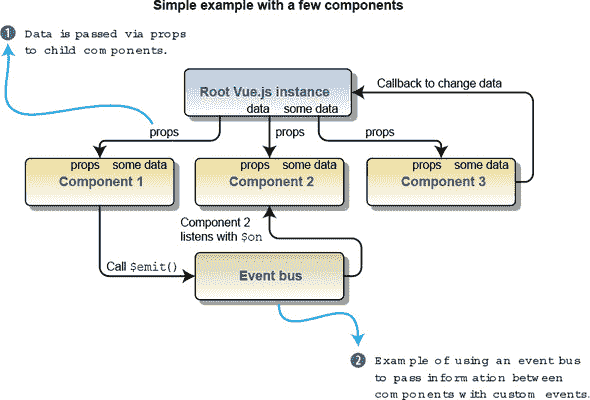

这对于只有少数组件的小型应用来说效果很好。在这种情况下，我们只需要将信息传递给少数几个组件。如果我们的应用更大，更复杂，层次更多呢？你可以想象在一个更大的应用中，保持所有回调、传递的 props 和事件总线是困难的。

这就是 Vuex 发挥作用的地方。它引入了一种更组织化的方式来跟踪我们状态的一个中心存储。让我们想象一个你可能考虑使用 Vuex 的场景。在这个场景中，我们正在创建一个博客，在该博客中我们有几个组件，包括帖子、评论、创建、编辑和删除。我们还有一个管理员界面，我们可以禁止和添加用户。

让我们看看使用 Vuex 会是什么样子。如图 10.2 所示，编辑生物组件嵌套在管理员组件下。编辑生物组件需要访问用户信息，以便更新它。当使用 Vuex 的中央存储时，我们可以从编辑生物组件直接访问存储、突变信息并提交它。这比从根 vue.js 实例向下传递信息到管理员组件，然后最终使用 props 传递到 `Edit Bio` 组件有了显著的改进。试图从多个地方直接保持信息的一致性将是困难的。

##### 图 10.2\. 使用 Vuex 的中央存储

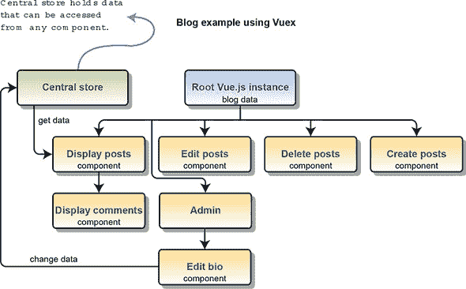

就像上面所说的，使用 Vuex 有一定的代价：添加 Vuex 将会增加应用程序的复杂性和样板代码。正如我提到的，你可能不应该在只有几个组件的简单应用程序中使用 Vuex。Vuex 在更大的应用程序中茁壮成长，在这些应用程序中，状态可能更复杂。

### 10.2\. Vuex 状态和突变

Vuex 使用一个包含应用程序状态的单一对象。这有时也被称为*单一事实来源*。正如其名所示，所有数据都存储在一个确切的地方，并且在应用程序的任何地方都没有重复。

|  |
| --- |

##### 小贴士

值得注意的是，尽管我们使用了 Vuex，我们不必将所有状态都放在 Vuex 中。单个组件仍然可以有自己的本地状态。在某些情况下，这可能更可取。例如，在你的组件中，你可能有一个仅在该组件中使用的本地变量。这个变量应该保持本地化。

|  |
| --- |

让我们创建一个使用 Vuex 状态的简单示例。对于这个示例，我们将使用一个单文件。稍后，我们将看到如何将 Vuex 添加到 Vue-CLI 应用程序中。打开一个文本编辑器，创建一个名为 vuex-state.html 的文件。在这个文件中，我们将显示存储在中央存储中的消息，并显示一个计数器。完成所有操作后，它将看起来像图 10.3。

##### 图 10.3\. 使用 Vuex 创建简单应用程序

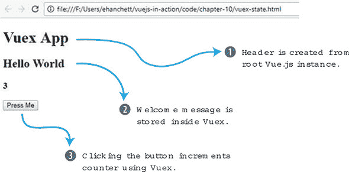

我们首先将 CDN 脚本标签添加到 Vue 和 Vuex。接下来，我们将添加 HTML。对于我们的 HTML，我们将使用 `H1`、`H2`、`H3` 和一个 `button` 标签。`h1` 标签将显示 `header`，这是一个在 Vue.js 实例中定义的本地变量。`welcome` 和 `counter` 消息将是来自我们的 Vuex 存储的计算属性。按钮元素将触发一个名为 `increment` 的动作。将此列表中的代码添加到 vuex-state.html 文件的顶部。

##### 列表 10.1\. 向我们的 Vuex 应用程序添加 HTML：chapter-10/vuex-html.html

```
<!DOCTYPE html>
<html>
<head>
<script src="https://unpkg.com/vue"></script>          *1*
<script src="https://unpkg.com/vuex"></script>         *2*
</head>
<body>
  <div id="app">
      <h1>{{header}}</h1>                              *3*
      <h2>{{welcome}}</h2>                             *4*
      <h3>{{counter}}</h3>                             *5*
      <button @click="increment">Press Me</button>     *6*
  </div>
```

+   ***1* 展示了 Vue 的 CDN 脚本标签**

+   ***2* 展示了 Vuex 的 CDN 脚本标签**

+   ***3* 指出标题变量**

+   ***4* 列出了欢迎计算属性**

+   ***5* 展示了计数器的计算属性**

+   ***6* 指出设置了点击动作设置为增加的按钮**

现在我们已经设置了 HTML，让我们首先添加 Vuex 存储。Vuex 存储将包含我们示例中的所有数据。这包括 `msg` 和 `count` 属性。

要更新状态，我们将使用称为 *mutations* 的东西。你可以将 mutations 视为其他编程语言中的设置器。*设置器* 设置值；mutations 是我们用来更新应用程序状态的工具。在 Vuex 中，mutations 必须是同步的。在我们的例子中，计数器只有在按钮被按下时才会被触发，所以我们不必担心异步代码。（稍后我们将探讨可以解决处理异步事物时问题的 actions。）

在我们的突变对象中，我们将添加一个增加状态的函数。将此列表中的代码添加到 vuex-state.html 文件的底部。

##### 列表 10.2\. 添加我们的 Vuex 状态和突变：chapter-10/vuex-state-mut.html

```
<script>
  const store = new Vuex.Store({
      state: {
        msg: 'Hello World',            *1*
        count: 0
      },
      mutations: {
        increment(state) {             *2*
            state.count++;
        }
      }
  });
```

+   ***1* Vuex.Store 包含状态信息。**

+   ***2* 展示了增加状态的突变**

我们已经设置了 HTML 和 Vuex 存储，现在我们可以添加连接一切的逻辑。我们想要确保我们的模板显示 Vuex 状态中的 `msg` 和 `counter`，并且我们可以更新那个计数。

创建一个带有新数据函数的 Vue.js 实例。这将返回显示 `Vuex App.` 的本地头属性。在下一节中，我们将添加一个计算属性，它将有两个函数，`welcome` 和 `counter`。`welcome` 属性将返回 `store.state.msg`。`counter` 将返回 `store.state.count`。

最后，我们需要创建一个名为 `increment` 的方法。要更新存储并访问我们在 Vuex 中设置的突变，我们不能直接调用突变。我们必须使用一个特殊函数，称为 `commit`。这将告诉 Vuex 更新存储并提交更改，换句话说。`store.commit('increment')` 执行对我们创建的突变的提交。将以下代码添加到在 列表 10.2 中创建的代码下面的 vuex-state.html 文件中。

##### 列表 10.3\. 添加我们的 Vue.js 实例：chapter-10/vuex-instance.html

```
new Vue({
    el: '#app',
    data() {
      return {
        header: 'Vuex App'               *1*
      }
    },
    computed: {
      welcome() {
        return store.state.msg           *2*
      },
      counter() {
        return store.state.count;        *3*
      }
    },
    methods: {
      increment() {
        store.commit('increment')        *4*
      }

    }
});
</script>
</body>
</html>
```

+   ***1* 展示了显示消息的头属性**

+   ***2* 计算属性返回 msg 状态。**

+   ***3* 计算属性返回计数器状态。**

+   ***4* 增量方法触发 Vuex 的增量突变。**

现在我们有一个完全功能的应用程序，它使用了 Vuex！点击按钮几次，你应该会在每次点击按钮后看到计数器增加一。

让我们更新这个应用程序，以便每次按钮点击都使计数增加 10。如果你仔细查看 mutations `increment` 函数，它只有一个参数：`state`。然而，我们可以向它传递另一个参数：我们将称之为 payload。这个 payload 可以从我们在根 Vue.js 实例中创建的增量方法发送。

将`vuex-state.html`文件复制到一个名为`vuex-state-pass.html`的新文件中。此文件将包含我们的新应用程序，展示如何传递负载。

如您在列表 10.4 中看到的，我们只需要更新突变对象和`increment`方法。将另一个名为`payload`的参数添加到增量突变中。`payload`将被添加到`state.count`中。在`increment`方法内部，将`10`作为另一个参数添加到`store.commit`中。按照以下所示更新`vuex-state.html`。

##### 列表 10.4. 将`payload`传递给突变: chapter-10/vuex-state-pass-1.html

```
...
mutations: {
  increment(state,payload) {        *1*
      state.count += payload;
  }
}
...
methods: {
  increment() {
    store.commit('increment', 10)   *2*
  }
...
```

+   ***1* 增量突变接受一个负载并将其添加到计数中。**

+   ***2* 现在的增量方法将 10 传递给突变。**

保存`vuex-state-pass.html`文件并重新加载您的浏览器。点击按钮后，现在应该增加 10 而不是 1。如果它没有正确加载，请检查您的网络浏览器控制台。确保您没有打字错误。

### 10.3. Getters 和 actions

在上一个例子中，我们直接从我们的计算属性中访问了存储。如果我们有多个组件需要访问这些计算属性怎么办？如果我们想始终以全部大写字母显示欢迎消息怎么办？这就是 getters 能帮我们解决问题的地方。

在 Vuex 中，我们有一种称为*getters*的东西。使用 getters，所有组件都可以以相同的方式访问状态。让我们继续我们的第 10.2 节的例子。我们将用 getters 来更新它，而不是直接在我们的计算属性中访问状态。此外，我们希望`msg`的 getter 将消息转换为全部大写字母。

将上一个例子中的`vuex-state-pass.html`文件复制到`vuex-state-getter-action.html`。为了简化问题，我们将保持 HTML 不变。完成之后，它应该看起来像图 10.4。

##### 图 10.4. 使用设置器和动作的 Hello World 应用程序

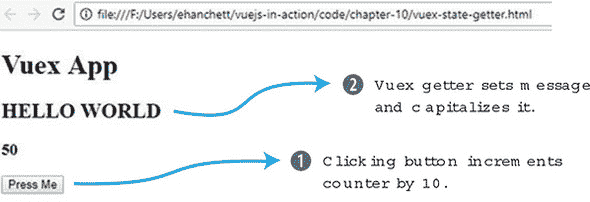

您可以看到，Hello World 消息现在是大写字母。点击“按我”按钮，计数器会增加，就像上一个例子中一样。

在您新创建的`vuex-state-getter-action.html`文件中，找到`<script>`标签下的`Vuex.Store`。在`mutations`对象下方添加一个名为`getters`的新对象。在`getters`中，我们将创建`msg`和`count`，如列表 10.5 所示。`msg`和`count`都接受一个参数，`state`。

在我们的`msg` getter 中，我们将返回`state.msg.toUppercase()`。这将确保每次我们使用`msg` getter 时，它都会返回全部大写的值。对于我们的`count` getter，它将返回`state.count`。在`mutations`下更新`vuex-state-getter-action.html`中的新 getters 对象。

##### 列表 10.5. 添加新的 getters: chapter-10/vuex-state-getter-action1.html

```
...
mutations: {
  increment(state,payload) {
      state.count += payload;
  }
},
getters: {                               *1*
    msg(state) {                         *2*
      return state.msg.toUpperCase();
    },
    count(state) {                       *3*
      return state.count;
    }
},
...
```

+   ***1* 新的 getters 对象定义了 Vuex 的 getters。**

+   ***2* `msg` getter 返回全部大写的消息。**

+   ***3* 显示计数 getter**

动作是 Vuex 的另一个基本组成部分。我之前提到突变是同步的。但如果我们处理的是异步代码呢？我们如何确保我们的异步代码仍然会影响状态？这就是 Vuex 中的动作发挥作用的地方。

让我们假设在我们的例子中，我们正在访问一个服务器，并且我们正在等待响应。这是一个异步动作的例子。不幸的是，突变必须是同步的，所以我们不能使用它。相反，我们将使用 Vuex 动作添加异步操作。

在这个例子中，我们将使用`setTimeout`创建一个延迟。打开 vuex-state-getter-action.html 文件，在我们创建的 getter 对象之后添加一个新的对象，称为 actions。在这个对象内部，我们将有一个名为`increment`的动作，它接受一个`context`和`payload`。`context`是我们将用来提交更改的部分。我们将把`context.commit`包裹在一个`setTimeout`中。这样我们就可以模拟来自服务器的延迟。我们还可以向`context.commit`传递一个有效负载。这将传递给突变。根据这个列表更新代码。

##### 列表 10.6\. 添加动作：chapter-10/vuex-state-getter-action2.html

```
...
},
actions: {                                   *1*
  increment(context, payload) {              *2*
    setTimeout(function(){
      context.commit('increment', payload);  *3*
    },2000);
  }
}
...
```

+   ***1* 动作对象用于异步和同步动作。**

+   ***2* 增加函数接受一个 context 和 payload。**

+   ***3* 这触发了增加突变并将有效负载传递给它。**

现在我们已经更新了 Vuex.Store，我们可以继续到根 Vue.js 实例。我们不会直接访问存储，而是更新计算属性以访问 getter。我们还将更新增加方法。我们将使用`store.dispatch('increment', 10)`来访问我们创建的新 Vuex 动作。

`dispatch`的第一个参数始终是动作的名称。第二个参数始终是传递给动作的有效负载。

| |
| --- |

##### 小贴士

有效负载可以是一个简单的变量，甚至是一个对象。

| |
| --- |

使用本列表中的新 Vue.js 实例更新 vuex-state-getter-action.html 代码。

##### 列表 10.7\. 更新 Vue.js 实例：chapter-10/vuex-state-getter-action3.html

```
...
new Vue({
    el: '#app',
    data() {
      return {
        header: 'Vuex App'
      }
    },
    computed: {
      welcome() {
        return store.getters.msg;         *1*
      },
      counter() {
        return store.getters.count;       *2*
      }
    },
    methods: {
      increment() {
        store.dispatch('increment', 10);  *3*
      }

    }
});
...
```

+   ***1* 计算属性 welcome 返回 getter msg。**

+   ***2* 计算属性 counter 返回 getter count。**

+   ***3* 该方法调用了增加动作。**

启动应用并点击按钮几次。你会注意到有延迟，但每次点击后计数器会增加 10。

### 10.4\. 使用宠物店应用程序将 Vuex 添加到 Vue-CLI

让我们回到我们一直在工作的宠物店应用程序。如果你还记得我们上次工作的情况，我们添加了花哨的动画和过渡效果。现在我们已经学习了 Vuex 的基础知识，让我们把它加入到项目中。

让我们将产品数据移动到商店中。如果你还记得前几章的内容，我们在宠物商店应用程序的 Main 组件的创建钩子中初始化了商店。相反，我们将让创建钩子分发一个新的动作，该动作将在 Vuex 内部初始化商店。我们还将添加一个新的`products`计算属性，它使用我们将设置的 Vuex 获取器检索我们的产品。当一切完成后，它看起来和表现将与之前相同，如图 10.5 所示。

##### 图 10.5\. 展示完成的宠物商店应用程序

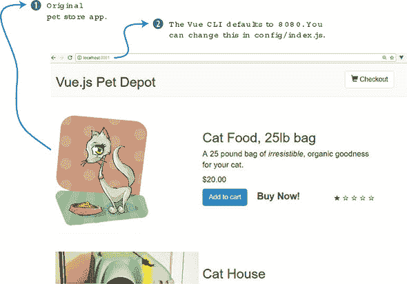

#### 10.4.1\. 在 Vue-CLI 中安装 Vuex

首先，让我们安装 Vuex！这是直截了当的。如果你还没有做，获取我们在第八章中最后工作的宠物商店应用程序的最新版本。或者，你可以从 GitHub 下载本章的完整代码[`github.com/ErikCH/VuejsInActionCode`](https://github.com/ErikCH/VuejsInActionCode)。

打开一个终端窗口，切换到宠物商店应用程序文件夹的根目录。在提示符下运行以下命令以安装最新版本的 Vuex 并将其保存到宠物商店应用程序的`package.json`文件中：

```
$ npm install vuex
```

接下来，我们需要将商店添加到 src 文件夹中的 main.js 文件。我们还没有创建商店，但让我们无论如何导入它。按照惯例，商店通常位于`src/store/store.js`文件中。这取决于你，不同的开发者会有不同的惯例。现在，这对我们来说将有效。在本章的后面部分，我们将讨论使用名为模块的替代文件夹结构。

在根 Vue.js 实例内部，我们需要添加商店，如下所示。将商店添加到根实例下的路由器中。顺便说一句，因为我们使用 ES6，所以我们可以使用简写`store`，而不是`store: store`。

##### 列表 10.8\. 更新 main.js 文件：chapter-10/petstore/src/main.js

```
// The Vue build version to load with the `import` command
// (runtime-only or standalone) has been set in webpack.base.conf with an
 alias.
import Vue from 'vue'
import App from './App'
import router from './router'
require('./assets/app.css')
import { store } from './store/store';   *1*

Vue.config.productionTip = false

/* eslint-disable no-new */
new Vue({
  el: '#app',
  router,
  store,                                 *2*
  template: '<App/>',
  components: { App }
})
```

+   ***1* 将商店导入到 main.js 文件中**

+   ***2* 将其添加到 Vue.js 实例中**

现在我们已经将商店添加到根实例中，我们可以在整个应用程序中访问它。在`src/store/store.js`中创建一个文件。这个文件将是我们 Vuex 商店，并持有我们宠物商店应用程序中的产品信息。在文件的顶部，添加两个导入语句，每个分别用于 Vue 和 Vuex。接下来，我们将添加`Vue.use(Vuex)`。这将连接一切。

在`main.js`文件中，我们从`./store/store`导入了 store。我们需要在`store.js`文件中导出一个 store 对象，以便`main.js`文件可以导入它。正如你在列表 10.9 中看到的，我们导出了一个`const store`的`Vuex.Store`。

我们首先添加我们的状态和突变对象。状态对象将包含一个名为 products 的空对象。我们将很快使用 `initStore` 来加载它。我们的突变将被称为 `SET_STORE`。突变将接受传递的产品并将其分配给 `state.products`。在新建的 src/store/store.js 文件中，添加此列表中的代码。

##### 列表 10.9\. 创建 main.js 文件：chapter-10/store-part1.html

```
import Vue from 'vue';
import Vuex from 'vuex';

Vue.use(Vuex);                            *1*

export const store = new Vuex.Store({     *2*
  state: {                                *3*
    products: {}
  },
  mutations: {                            *4*
    'SET_STORE'(state, products) {
      state.products = products;
    }
  },
  ...
```

+   ***1* 使用 Vue 设置 Vuex**

+   ***2* 导出 Vuex.Store 以便在 main.js 文件中稍后使用**

+   ***3* 状态对象显示产品。**

+   ***4* 突变对象显示了我们的 set store 函数。**

我们需要将 `action` 和 `getter` 添加到 store 中。`getter` 将返回 `products`。`action` 要复杂一些。我们想要做的是将使用 Axios 读取 static/products.json 文件的创建钩子代码移动到 Vuex 的 actions 对象中。

记得我提到突变必须是同步的，并且只有 Vuex 中的动作可以接受异步代码吗？为了解决这个问题，我们将 Axios 代码放在 Vuex 动作中。

在 store.js 文件中创建 actions 对象并添加 `initStore`。在这个动作中，从 components/Main.vue 文件中复制并粘贴创建的生命周期钩子。现在，我们将使用 commit 函数来触发我们的突变。我们将 `response.data.products` 作为有效载荷传递给 `SET_STORE`。完成后，它应该看起来像这样。

##### 列表 10.10\. 将动作和 getter 添加到 store.js：chapter-10/store-part2.html

```
...
actions: {                                           *1*
  initStore: ({commit}) => {                         *2*
    axios.get('static/products.json')
    .then((response) =>{
      console.log(response.data.products);
      commit('SET_STORE', response.data.products )
    });
  }
},
getters: {                                           *3*
  products: state => state.products
}
});
```

+   ***1* 用于异步代码的动作对象**

+   ***2* initstore action 提交突变。**

+   ***3* 产品 getter 返回存储的产品。**

我们越来越接近目标，现在我们只需要更新 Main.vue 文件，使其使用 Vuex store 而不是本地产品对象。打开 src/components/Main.vue 文件并查找 data 函数。删除 `products: {}` 这一行。现在我们将从返回存储的计算属性中访问它。

在 Main.vue 中的方法之后查找计算属性。你应该能看到 `cartItemCount` 和 `sortedProducts`。添加一个新的计算属性名为 `products`，并让它返回产品 `getter`。

请记住，因为我们已经在 main.js 文件中将 store 添加到根 Vue.js 实例中，所以我们不需要进行任何特殊的导入。此外，当使用 Vue-CLI 时，store 总是通过 `this.$store` 访问。确保记住美元符号，否则你会得到一个错误。将产品计算属性添加到 Main.vue 文件中，如这里所示。

##### 列表 10.11\. 添加产品的计算属性：chapter-10/computed-petstore.html

```
computed: {                                 *1*
  products() {
    return this.$store.getters.products;    *2*

  },
...
```

+   ***1* Main.vue 文件的计算属性**

+   ***2* 产品计算属性返回产品的 getter。**

定位到初始化产品对象所创建的钩子。删除该对象的内容，并改为调用我们在 Vuex 存储中之前创建的 `initStore` 动作。像我们之前的示例一样，使用 `dispatch` 触发动作。更新 Main.vue 文件中的创建钩子，使其触发 Vuex 的 `initStore` 动作，如本列表所示。

##### 列表 10.12\. 更新创建钩子：chapter-10/created-petstore.html

```
...
},
created: function() {
  this.$store.dispatch('initStore');       *1*
}
...
```

+   ***1* 分发代码以初始化 Vuex 存储**

应该就是这样了。从控制台运行 `npm run dev`，你应该会看到一个打开的窗口，其中包含宠物商店应用程序。尝试向购物车添加商品并验证一切是否正常工作。如果事情没有按预期进行，请检查控制台中的错误。很容易不小心在 src/store/store.js 文件中将 `Vuex.store` 键入为 `Vuex.Store`。小心这些问题！

### 10.5\. Vuex 辅助函数

Vuex 提供了一些辅助函数，可以用来减少在添加 getter、setter、mutations 和 actions 到我们的应用程序时的冗长和重复。您可以在官方指南中找到所有 Vuex 辅助函数的完整列表，网址为 [`vuex.vuejs.org/en/core-concepts.html`](https://vuex.vuejs.org/en/core-concepts.html)。让我们来看看这些辅助函数，看看它们是如何工作的。

你应该了解的第一个辅助函数是 `mapGetters`。这个辅助函数用于将所有我们的 getter 添加到我们的计算属性中，而无需逐个输入它们。要使用 `mapGetters`，我们首先需要将其导入到我们的组件中。让我们再次查看我们的宠物商店应用程序，并添加 `mapGetters` 辅助函数。

打开 src/components/Main.vue 文件，查找 script 标签。在该标签内部，你应该看到一个对头部组件的导入。在那之后导入，添加 Vuex 的 `mapGetters`，如这里所示。

##### 列表 10.13\. 添加 `mapGetters`：chapter-10/map-getter.html

```
...
...
<script>
import MyHeader from './Header.vue';
import {mapGetters} from 'vuex';           *1*
export default {
...
```

+   ***1* 从 Vuex 导入 mapGetters**

接下来，我们需要更新我们的计算属性。寻找我们之前添加的 `products` 计算属性。删除它并添加一个新的 `mapGetters` 对象。

`mapGetters` 对象是独特的，为了正确添加它，我们需要使用 ES6 的 `spread` 操作符，该操作符在期望零个或多个参数的地方扩展我们的表达式。您可以在 MDN 文档中找到有关 ES6 扩展语法的更多信息，网址为 [`mng.bz/b0J8`](http://mng.bz/b0J8)。

`mapGetters` 将确保所有我们的 getter 都会被添加，就像它们是计算属性一样。正如你可以想象的那样，这种语法比为每个 getter 编写一个计算属性要简单得多、干净得多。每个 getter 都列在 `mapGetters` 内部的数组中。将 `mapGetters` 添加到 Main.vue 文件中。

##### 列表 10.14\. 将 `mapGetters` 添加到计算属性：chapter-10/map-getter2.html

```
...
},
computed: {
  ...mapGetters([              *1*
      'products'               *2*
  ]),
  cartItemCount() {
...
```

+   ***1* 显示 mapGetters 辅助数组**

+   ***2* 显示 getter 列表**

如果你运行 `npm run dev`，你会看到我们的宠物商店应用程序正常运行。在我们的应用程序中使用 `mapGetters` 并不是非常有用，但随着它的增长和更多 getters 的添加，这将节省我们时间。

你还应该了解的其他三个辅助函数是 `mapState`、`mapMutations` 和 `mapActions`。这三个函数的行为相同，并且有助于减少你需要编写的样板代码量。

让我们假设你在你的 store 中有若干数据。在这个例子中，你不需要任何 getters，你将直接从你的组件中访问状态。在这种情况下，你可能会在你的计算属性中使用 `mapState` 辅助函数。

##### 列表 10.15\. `mapState` 示例：chapter-10/map-state.html

```
import {mapState} from 'vuex'         *1*
...
computed: {
  ...mapState([                       *2*
      'data1',
      'data2',
      'data3'
  ])
}
...
```

+   ***1* 从 Vuex 导入 mapState**

+   ***2* 使用展开运算符定义 mapState 和变量**

与 `mapState` 和 `mapGetters` 类似，假设你也在你的组件中想要访问几个 mutations。你可以使用 `mapMutations` 辅助函数来简化这个过程（如下面的列表所示）。列表中的 `mut1` 将 `this.mut1()` 映射到 `'this.$store.commit('mut1')`。

##### 列表 10.16\. `mapMutations` 示例：chapter-10/map-mut.html

```
import {mapMutations} from 'vuex'      *1*
...
methods: {
  ...mapMutations([                    *2*
      'mut1',
      'mut2',
      'mut3'
  ])
}
...
```

+   ***1* 将 mapMutations 从 Vuex 导入到组件中**

+   ***2* mapMutations 辅助函数添加了这些方法。**

最后，我们将看看 `mapActions` 辅助函数。这个辅助函数将 actions 映射到我们的应用中，这样我们就不需要创建每个方法并分别分发每个动作。使用相同的例子，假设这个应用程序也有一些异步操作。我们不能使用 mutations，所以我们必须使用 actions。我们在 Vuex 中创建了这些，现在我们需要在我们的组件方法对象中访问它们。将 `mapActions` 添加到我们的方法中会处理这个问题。`act1` 将 `this.act1()` 映射到 `this.$store.dispatch('act1')`，如列表 10.17 所示。

##### 列表 10.17\. `mapActions` 示例：chapter-10/map-actions.html

```
import {mapActions} from 'vuex'     *1*
...
methods: {
  ...mapActions([                   *2*
      'act1',
      'act2',
      'act3'
  ])
}
...
```

+   ***1* 从 Vuex 导入 mapActions**

+   ***2* mapActions 辅助函数添加了 act1、act2 和 act3 方法。**

当你的应用程序增长时，这些辅助函数将非常有用，并且会减少你需要编写的代码量。请记住，你需要在你的 store 中规划名称，因为当你使用这些辅助函数时，它们会映射到你的组件中的名称。

### 10.6\. 模块快速浏览

在本章的早期部分，我们在 src/store 目录中为宠物商店应用程序创建了一个 store.js 文件。这对我们的相对较小的应用程序来说效果很好。然而，如果我们的应用程序更大呢？store.js 文件会很快变得臃肿，并且很难跟踪其中的所有内容。

Vuex 的解决方案是 *模块*。模块允许我们将 store 划分为更小的部分。每个模块都有自己的状态、mutations、actions 和 getters，你甚至可以在其中嵌套模块。

让我们将宠物商店应用程序重构为使用模块。首先，我们需要保留 store.js 文件；然而，我们需要在 store 文件夹内创建一个名为 modules 的新文件夹。在那个文件夹内创建一个名为 products.js 的文件。文件夹结构应该看起来像 图 10.6。

##### 图 10.6\. 模块文件夹结构

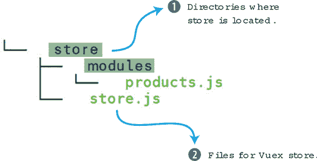

在 products.js 文件中，我们需要创建四个对象：state、getters、actions 和 mutations。我们需要将 store.js 中的每个值复制粘贴到 products.js 文件中。

打开 src/store/store.js 文件并开始复制代码。完成后，你的 products.js 文件应该看起来像以下列表。

##### 列表 10.18\. 添加产品模块：chapter-10/products-mod.js

```
const state = {                                *1*
    products: {}
};

const getters = {                              *2*
    products: state => state.products
};

const actions = {                              *3*
    initStore: ({commit}) => {
      axios.get('static/products.json')
      .then((response) =>{
        console.log(response.data.products);
        commit('SET_STORE', response.data.products )
      });
    }
};

const mutations = {                            *4*
    'SET_STORE' (state, products) {
      state.products = products;
    }
};
```

+   ***1* 包含所有 Vuex 状态**

+   ***2* 包含所有 Vuex getters**

+   ***3* 包含所有 Vuex actions**

+   ***4* 包含所有 Vuex mutations**

在将所有内容添加到 product.js 文件后，我们需要创建一个导出。这将允许文件被导入到 store.js 文件中。在文件底部添加 `export default`。这是一个 ES6 导出命令，允许你从其他文件导入它。

在 product.js 的底部添加 `default export`。

##### 列表 10.19\. 添加导出：chapter-10/products-export.js

```
...
export default {          *1*
    state,
    getters,
    actions,
    mutations,
}
```

+   ***1* 显示所有内容的 ES6 导出**

我们需要更新 store.js 文件。在这个文件中，我们将添加一个新的模块对象，在这个对象中，我们可以列出我们添加的所有模块。确保添加对创建的 modules/products 文件的导入。

在我们的案例中，我们只有一个，所以我们将继续将其添加到模块对象中。确保删除 `Vuex.Store` 中的所有内容，使其与以下列表匹配。

##### 列表 10.20\. 新的 store.js 文件：chapter-10/store-update.js

```
import Vue from 'vue';
import Vuex from 'vuex';
import products from './modules/products';       *1*

Vue.use(Vuex);

export const store = new Vuex.Store({
  modules: {                                     *2*
    products
  }

});
```

+   ***1* 导入产品模块**

+   ***2* 模块对象列出所有模块。**

一旦我们导入了模块，我们就可以开始了。刷新应用程序，它应该像以前一样运行。

|  |
| --- |

**使用 Vuex 的命名空间**

在某些较大的应用程序中，将 store 划分为模块可能会带来问题。随着程序的增长和更多模块的添加，你的 actions、getters、mutations 和 state 的名称可能会冲突。例如，你可能会不小心在两个不同的文件中命名两个具有相同名称的 getters。由于 Vuex 中的所有内容都共享相同的全局命名空间，当这种情况发生时，你将在控制台中收到重复的 getter 键错误。

为了解决这个问题，你可以使用命名空间。通过在 Vuex.store 的顶部设置 `namespaced: true`，你可以根据命名空间划分你的模块。要了解更多关于命名空间以及如何在文件中设置它，请查看 Vuex 官方文档 [`vuex.vuejs.org/en/modules.html`](https://vuex.vuejs.org/en/modules.html)。

|  |
| --- |

### 练习

使用本章的知识来回答这个问题：

+   使用 Vuex 相比 Vue.js 应用程序的正常数据传递有哪些优点？

*请参阅附录 B 中的解决方案 appendix B。*

### 摘要

+   你可以将你的应用程序重构为使用集中式状态管理。

+   你可以从应用程序的任何地方访问数据存储。

+   你可以通过使用 Vuex 中的 mutations 和 actions 来避免应用程序存储不同步的问题。

+   你可以使用 Vuex 助手来减少所需的样板代码量。

+   在大型应用中，你可以使用模块和命名空间来使状态更易于管理。

## 第十一章. 与服务器通信

*本章涵盖*

+   使用 Nuxt.js 进行服务器端渲染

+   使用 Axios 检索第三方数据

+   使用 VuexFire

+   添加身份验证

我们已经讨论了 Vuex 以及状态管理如何使我们的 Vue.js 大型应用受益。现在我们将探讨与服务器通信。在本章中，我们将探讨服务器端渲染（SSR）以及我们如何使用它来帮助提高我们应用的响应速度。我们将使用 Axios 从第三方 API 检索数据。然后我们将探讨 VuexFire。VuexFire 是一个库，帮助我们与 Firebase 通信，这是一个帮助应用开发的后端服务。最后，我们将看到如何向我们的 VuexFire 应用添加简单的身份验证。

在我们继续之前，让我先说明一下，在 Vue.js 中与服务器通信有许多方法。我们可以使用`XMLHttpRequest`或使用任何数量的 AJAX 库。在过去，Vue 官方推荐 Vue 资源库作为官方 AJAX 库。Vue 的创造者 Evan You 在 2016 年底将其从官方推荐状态中退役。至于 Vue 社区，你可以使用你喜欢的任何库。

说了这么多，我确定 Axios、Nuxt.js 和 VuexFire 是几个可以帮助我们以某种方式与服务器通信的最受欢迎的库。然而，它们各不相同。Nuxt.js 是一个用于创建服务器端渲染应用的强大框架，而 Axios 是一个前端 HTTP 客户端。VuexFire 帮助我们与 Firebase 通信。这三个库在通信方面采取了不同的方法。

本章的目的是让你对这三个库和框架有实际的操作知识。我们将为每个库创建示例，但不会深入探讨。每个主题都值得单独成章——在 Nuxt 的情况下，甚至可以单独成书。尽管如此，这将是一个很好的入门，我还会包括每个资源的链接，以便你可以深入了解。

### 11.1. 服务器端渲染

Vue.js 是一个使用客户端渲染的单页应用程序框架。应用程序的逻辑和路由是用 JavaScript 编写的。当浏览器连接到服务器时，JavaScript 将被下载。然后浏览器负责渲染 JavaScript 并执行 Vue.js 应用。对于大型应用，下载和渲染应用的时间可能会很长。你可以从图 11.1 中看到这可能会是什么样子。

##### 图 11.1\. 客户端渲染

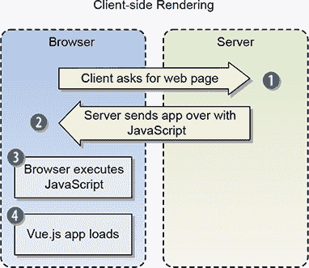

在 Vue.js 中，服务器端渲染（SSR）有所不同。在这种情况下，Vue.js 会连接到服务器，然后服务器发送 HTML，以便浏览器可以立即显示页面。用户看到页面快速加载。然后服务器发送 JavaScript，并在后台加载。值得一提的是，即使用户看到了网页，他们也可能直到 Vue 执行完毕才与之交互（图 11.2）。

##### 图 11.2\. 服务器端渲染

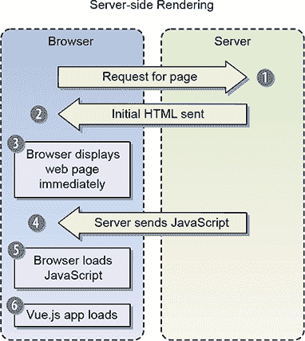

通常情况下，SSR（服务器端渲染）为用户提供了更愉悦的体验，因为初始加载速度快。大多数用户没有耐心等待缓慢的应用程序加载。

SSR 对于搜索引擎优化（SEO）也有独特的优势。SEO 是一个描述在搜索引擎结果中获得有机可见性（非付费）的术语。尽管对谷歌和其他搜索引擎在确定搜索引擎排名时使用的精确方法知之甚少，但存在一种担忧，即搜索引擎机器人爬取客户端渲染的页面时可能会出现问题。这可能会影响排名。SSR 有助于防止这些问题。

Vue.js 本身不包含 SSR，但有一些优秀的库可以轻松地将 SSR 添加到我们的应用程序中。其中最受欢迎的是 vue-server-renderer 和 Nuxt.js。您可以在官方 SSR 指南 [`ssr.vuejs.org/`](https://ssr.vuejs.org/) 中找到更多关于 SSR 的信息。相反，我们将探讨如何使用 Nuxt.js 创建一个 SSR 应用程序。

### 11.2\. 介绍 Nuxt.js

Nuxt.js 是建立在 Vue 生态系统之上的一个高级框架，它帮助创建 SSR 应用程序，无需担心交付一个生产就绪、服务器端渲染应用程序的所有方面。

Nuxt 专注于 UI 渲染，并且大部分客户端/服务器层都被抽象化。它可以作为一个独立项目，也可以作为基于 Node.js 的项目的补充。此外，它还内置了一个静态生成器，可以用来创建 Vue.js 网站。

当您使用 Nuxt 创建项目时，您将获得 Vue 2、Vue 路由、Vuex、vue-server-renderer 和 vue-meta。在底层，它使用 Webpack 来帮助整合一切。这是一个一站式包，用于快速启动。

| |
| --- |

##### 信息

我们可以使用 Nuxt 与现有的 Node.js 应用程序一起使用，但今天我们不会探讨这一点。如果您想了解更多关于使用现有 Node.js 项目创建 Nuxt 应用程序的信息，请查看官方文档 [`nuxtjs.org/guide/installation`](https://nuxtjs.org/guide/installation)。

| |
| --- |

Nuxt 提供了一个启动模板来帮助我们开始。这个启动模板可以从官方 GitHub 仓库下载，网址为 [`mng.bz/w0YV`](http://mng.bz/w0YV)。我们也可以使用 Vue-CLI 通过启动模板创建一个项目。（如果您还没有安装 Vue-CLI，请参阅附录 A 中的安装说明。）

如果你使用 Nuxt，你需要 Node。Nuxt 需要 8 或更高版本才能工作。否则，当你尝试启动项目时，你会得到异步错误。

|  |
| --- |

##### Info

本章中列出的项目正在使用 Nuxt 1.0。但截至本文写作时，Nuxt 2.0 正在开发中，处于测试版。这个例子应该适用于两者，但如果遇到任何问题，请检查本书的官方 GitHub 仓库：[`github.com/ErikCH/VuejsInActionCode`](https://github.com/ErikCH/VuejsInActionCode)。此代码将得到维护。

|  |
| --- |

我们将使用 Vue-CLI 来创建项目。在命令提示符中，运行以下命令：

```
$ vue init nuxt-community/starter-template <project-name>
```

这将使用启动模板创建一个新的 Nuxt 项目。接下来，你需要切换到目录并使用以下命令安装依赖项：

```
$ cd <project-name>
$ npm install
```

要启动项目，运行 `npm run dev` 命令：

```
$ npm run dev
```

这将在本地主机端口 3000 上启动一个新的项目。如果你打开一个网页浏览器，你应该能看到欢迎页面（图 11.3）。如果欢迎页面没有显示，请再次检查以确保你没有跳过 `npm install` 步骤。

##### 图 11.3\. Nuxt.js 启动模板页面

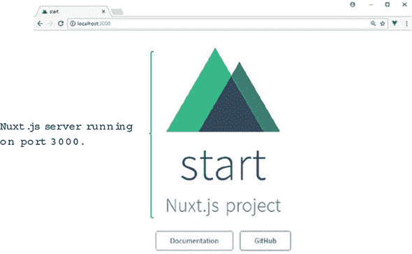

让我们看看如何在真实的应用程序中使用 Nuxt.js。

#### 11.2.1\. 创建音乐搜索应用程序

服务器端渲染的应用程序可以非常有用且强大。让我们看看 Nuxt.js 能为我们做什么。让我们想象你需要创建一个与 iTunes API 交互的应用程序。iTunes API 有数百万个艺术家和专辑。你想要搜索任何艺术家并显示他们的唱片目录。

|  |
| --- |

##### Note

你可以在官方文档中找到有关 iTunes API 的更多信息：[`mng.bz/rm99`](http://mng.bz/rm99)。

|  |
| --- |

在构建我们的应用程序时，我们将使用两个不同的路由。第一个路由将显示一个用于搜索 iTunes API 的输入框。这个页面看起来像 图 11.4。

##### 图 11.4\. iTunes API 的搜索页面

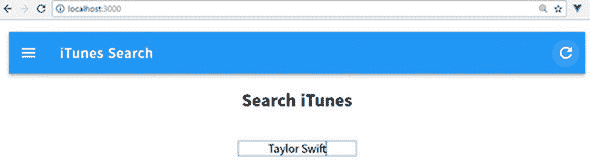

下一个路由将显示艺术家的专辑信息。

|  |
| --- |

##### Info

为了使事情看起来更美观，我们将使用一个名为 Vuetify 的材料组件框架。我们稍后会更多地讨论这一点。

|  |
| --- |

为了使事情更有趣，我们将通过使用参数将搜索路由中的信息传递到结果路由。在搜索框中输入艺术家名称（泰勒·斯威夫特）后，结果页面将显示（图 11.5）。你可以在页面顶部的 URL 框中看到“Taylor%20Swift”已被传递。

##### 图 11.5\. 搜索结果页面

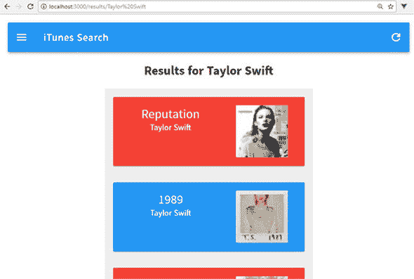

搜索页面将显示与艺术家相关的所有专辑。它将显示专辑名称、艺术家名称和封面艺术，卡片将链接到 iTunes 艺术家页面。在这个例子中，我们还将看看中间件，这将允许我们在路由渲染之前编写代码。我们将看到如何使用 Axios 库与 iTunes API 进行通信。我们将通过再次查看 Vuex 来总结一切。

#### 11.2.2\. 创建项目和安装依赖项

让我们通过使用 Vue-CLI 起始模板来开始创建我们的音乐 API 应用程序。然后我们将安装所有依赖项。在提示符下运行以下命令：

```
$ vue init nuxt-community/starter-template itunes-search
```

应用程序创建后，使用 `npm install` 命令安装 Vuetify 和 Axios 作为 npm 包。此外，Vuetify 需要 stylus 和 stylus-loader，因此我们可以设置 Vuetify 使用的 stylus CSS。

| |
| --- |

##### 注意

Vuetify 是 Vue.js 2.0 的一个材料组件框架。它添加了许多易于使用且美观的组件。它与其他 UI 框架（如 Bootstrap）有相似之处。您可以在官方网站 [`vuetifyjs.com`](https://vuetifyjs.com) 上了解更多关于 Vuetify 的信息。

| |
| --- |

运行以下命令来安装 Vuetify、Axios、stylus 和 stylus-loader：

```
$ cd itunes-search
$ npm install
$ npm install vuetify
$ npm install axios
$ npm install stylus –-save-dev
$ npm install stylus-loader –-save-dev
```

这将安装我们开始所需的全部依赖项，但要使这些依赖项正常工作，我们还需要进行一些额外的设置。我们将在供应商文件中设置 Axios 和 Vuetify，在应用程序内部注册 Vuetify，设置 Vuetify 插件，并最终设置我们的 CSS 和字体。

nuxt.config.js 文件用于配置 Nuxt 应用程序，因此请导航到 /itunes-search 文件夹根目录下的 nuxt.config.js 文件。找到以 `extend (config, ctx)` 开头的部分。此部分用于在每次保存代码时自动运行 `ESLint`。（`ESLint` 是一个可插拔的代码检查工具，它检查我们的代码的样式和格式，以及其他方面。）我们可以编辑 .eslintrc.js 文件并更改默认的代码检查，但为了简单起见，我们将删除此部分。这将关闭自动代码检查。接下来，在 `build` 下添加一个新的供应商选项。然后我们需要将 Axios 和 Vuetify 添加到供应商选项中，如 列表 11.1 所示。

让我解释一下这是如何工作的。每次我们在 Nuxt.js 中导入一个模块时，代码就会被添加到 Webpack 创建的页面包中。这是代码拆分的一部分。Webpack 将我们的代码拆分成包，然后可以根据需要或并行加载。当我们添加供应商选项时，它确保代码只添加一次到供应商包文件中。否则，每个导入都会添加到每个页面包中，并增加项目的尺寸。始终将模块添加到供应商选项中是一个好习惯，这样它就不会在项目中重复。 (Nuxt 2.0 不再需要供应商选项。这可以删除。) 使用新供应商选项更新根目录 /itunes-search 文件夹中的 package.json 文件。

##### 列表 11.1\. 从 nuxt.config.js 中移除 `ESLint`：chapter-11/itunes-search/nuxt.config.js

```
...
  build: {
    vendor: ['axios', 'vuetify']      *1*
  }
...
```

+   ***1* 将 Axios 和 Vuetify 添加到供应商包中并移除代码检查。**

尽管我们已经将 Axios 和 Vuetify 添加为供应商，但我们还没有完成。Vuetify 需要更多的设置。我们需要在 nuxt.config.js 文件中添加一个插件部分，并将插件添加到 /plugins 文件夹中。

Nuxt.js 中的插件是将外部模块添加到应用程序的一种方式；它们需要更多的设置。插件在根 Vue.js 实例实例化之前运行。与添加供应商选项不同，相应的文件在 /plugins 文件夹中运行。

Vuetify 的官方文档建议我们导入 Vuetify 并告诉 Vue 使用它作为插件。我们将在插件文件中添加此代码。在插件文件夹中添加一个新文件，并将其命名为 vuetify.js。在文件内部，如所示，将 Vuetify 注册到 Vue 中。

##### 列表 11.2\. 添加 Vuetify 插件：chapter-11/itunes-search/plugins/vuetify.js

```
import Vue from 'vue'
import Vuetify from 'vuetify'

Vue.use(Vuetify)               *1*
```

+   ***1* 将 Vuetify 添加到 Vue 应用程序**

接下来，我们需要在 nuxt.config.js 中添加对插件的引用。打开应用程序文件夹根目录下的 nuxt.config.js 文件，并添加插件。

##### 列表 11.3\. 添加插件引用：chapter-11/itunes-search/nuxt.config.js

```
...
  plugins: ['~plugins/vuetify.js'],      *1*
...
```

+   ***1* 记录对插件文件的引用**

要使 Vuetify 正常工作，我们最后需要做的是添加 CSS。官方文档建议您从 Google 导入材料设计图标，并添加对 Vuetify CSS 文件的链接。

记得我们之前导入 stylus loader 吗？现在我们可以在 nuxt.config.js 文件中添加对我们自己的 stylus 文件的链接。在 CSS 块的顶部，如果存在，删除 main.css 文件，并添加对即将创建的 app.styl 文件的链接。此外，在 head 部分添加一个样式表用于 Google 材料设计图标。完成的 nuxt.config.js 文件应如下所示。

##### 列表 11.4\. 添加 CSS 和字体：chapter-11/itunes-search/nuxt.config.js

```
  module.exports = {
  /*
  ** Headers of the page
  */
  head: {
    title: 'iTunes Search App',
    meta: [
      { charset: 'utf-8' },
      { name: 'viewport', content: 'width=device-width, initial-scale=1' },
      { hid: 'description', name: 'description', content: 'iTunes search
      project' }
    ],
    link: [
      { rel: 'icon', type: 'image/x-icon', href: '/favicon.ico' },
      {rel: 'stylesheet', href: 'https://fonts.googleapis.com/
      css?family=Roboto:300,400,500,700|Material+Icons'}          *1*
    ]
  },
  plugins: ['~plugins/vuetify.js'],
  css: ['~assets/app.styl'],                                      *2*
  /*
  ** Customize the progress bar color
  */
  loading: { color: '#3B8070' },
  /*
  ** Build configuration
  */
  build: {
    vendor: ['axios', 'vuetify']
  }
}
```

+   ***1* 添加对材料设计图标的链接**

+   ***2* 移除 main.css 并添加对 app.styl 的链接**

现在，我们需要创建 assets/app.styl 文件，如下所示。这将导入应用程序的 Vuetify 样式。

##### 列表 11.5\. 添加 CSS stylus：chapter-11/itunes-search/assets/app.styl

```
// Import Vuetify styling
@require '~vuetify/src/stylus/main'       *1*
```

+   ***1* 导入主 CSS**

完成此操作后，运行 `npm run dev` 命令，并验证控制台是否没有错误。如果有错误，请打开 nuxt.config.js 文件并检查是否有缺失的逗号或拼写错误。同时，请确保您已安装所有依赖项，包括 stylus 和 stylus-loader。这些必须安装才能使 Vuetify 正常工作。

#### 11.2.3\. 创建我们的构建块和组件

组件是我们应用程序的构建块。这是我们可以将我们的应用程序分割成不同的部分，然后再将它们组合起来的地方。在我们构建路由之前，您可能已经注意到有一个组件文件夹。这个文件夹是我们存放所有正常、普通组件的地方。

| |
| --- |

##### 注意

Nuxt.js 给我们两种不同类型的组件。一种是被“超级充电”的，另一种则不是。超级充电组件可以访问特殊的 Nuxt-only 配置，并且都位于 pages 文件夹中。这些选项允许您访问服务器端数据。pages 目录也是我们设置路由和 index 组件所在的地方。

| |
| --- |

在本节中，我们将讨论使用组件文件夹中的组件。我们将为我们的 iTunes 搜索应用程序创建两个组件：`Card`，它将保存我们找到的每个艺术家专辑的信息，以及 `Toolbar`。`Toolbar` 组件将创建一个简单的工具栏，它将显示在每个路由的顶部。我们将使用 Vuetify 来帮助创建这两个组件。我将使用 Vuetify 展示这些组件的 HTML 和 CSS，但不会深入细节。

| |
| --- |

##### 注意

如果你想探索 Vuetify 的所有选项，我建议你阅读 [`vuetifyjs.com/vuetify/quick-start`](https://vuetifyjs.com/vuetify/quick-start) 中的快速入门指南。

| |
| --- |

在组件文件夹中创建一个名为 Toolbar.vue 的文件。此文件将包含我们的工具栏模板。在这个模板中，我们将使用 Vuetify 的几个内置组件。我们还将添加作用域 CSS 来移除链接上的文本装饰。完成时，工具栏应类似于 图 11.6。

##### 图 11.6\. iTunes 搜索 ToolBar.vue


在 Vue.js 中，我们通常使用 `route-link` 组件在应用程序内部进行导航，但在 Nuxt 中该组件不存在。为了在路由之间导航，我们必须使用 `nuxt-link` 组件；它的工作方式与 route-link 完全相同。正如你在 列表 11.6 中可以看到的，我们将使用 `nuxt-link` 组件在用户点击顶部的 iTunes 搜索文本时创建指向应用程序根目录的链接。将此代码添加到 Toolbar.vue 文件中。

##### 列表 11.6\. 添加 `Toolbar` 组件：chapter-11/itunes-search/components/Toolbar.vue

```
<template>
  <v-toolbar dark color="blue">                                   *1*
    <v-toolbar-side-icon></v-toolbar-side-icon>
    <v-toolbar-title class="white--text">
      <nuxt-link class="title" to="/">iTunes Search</nuxt-link>   *2*
    </v-toolbar-title>
    <v-spacer></v-spacer>
    <v-btn to="/" icon>
      <v-icon>refresh</v-icon>
    </v-btn>
  </v-toolbar>
</template>
<script>
</script>
<style scoped>                                                    *3*
.title {
  text-decoration: none !important;
}
.title:visited{
  color: white;
}
</style>
```

+   ***1* Adds the v-toolbar Vuetify component**

+   ***2* The nuxt-link component navigates to “/”.**

+   ***3* Shows the scoped CSS for this component**

我们需要创建的下一个组件是 `Card` 组件。它将在结果路由中使用，并显示艺术家的每个专辑。再次，我们将使用 Vuetify 使此组件看起来很棒。完成时，它应类似于 图 11.7。

##### 图 11.7\. Card.vue 组件示例文本

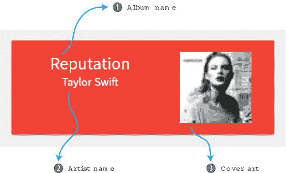

除了 Vuetify 之外，我们还将使用 `props`。结果路由将负责访问 API 并检索专辑信息。然后，我们将使用 `props` 将该信息传递到组件中。我们将传递 `title`、`image`、`artistName`、`url` 和 `color`。

`v-card` 组件接受 `href` 和 `color` 属性。我们可以使用 `v-on` 指令将我们的 `props` 绑定到它们。`v-card-media` 组件接受 `img` 属性。我们的图像属性将绑定到它。最后，使用一个类来显示 `artistName` 和 `title`。这将使标题和艺术家名称在卡片中居中。从本列表中复制代码，并在组件文件夹中创建一个名为 Card.vue 的文件。

##### 列表 11.7\. 添加 `Card` 组件：chapter-11/itunes-search/components/Card.vue

```
<template>
  <div id="e3" style="max-width: 400px; margin: auto;"
  class="grey lighten-3">
        <v-container
        fluid
        style="min-height: 0;"
        grid-list-lg>
        <v-layout row wrap>
          <v-flex xs12>
            <v-card target="_blank"                            *1*
:href="url"
:color="color"
class="white--text">
              <v-container fluid grid-list-lg>
                <v-layout row>
                  <v-flex xs7>
                    <div>
                      <div class="headline">{{title}}</div>    *2*
                      <div>{{artistName}}</div>                *3*
                    </div>
                  </v-flex>
                  <v-flex xs5>
                    <v-card-media
                    :src="image"                               *4*
                    height="100px"
                    contain>
                  </v-card-media>
                </v-flex>
              </v-layout>
            </v-container>
          </v-card>
        </v-flex>
      </v-layout>
    </v-container>
  </div>
</template>
<script>
export default {
    props: ['title', 'image', 'artistName',                    *5*
'url', 'color'],
}
</script>
```

+   ***1* The Vuetify v-card component accepts an href and color attribute.**

+   ***2* 一个具有 headline 类的 div 显示标题。**

+   ***3* 一个 div 显示艺术家名称**

+   ***4* 接受 src 图片的 Vuetify v-card-media 组件。**

+   ***5* 传递给组件的 props 列表。**

这些组件——`Toolbar` 和 `Card`——在我们组合页面和默认布局时将非常有用。

#### 11.2.4\. 更新默认布局

现在我们已经放置了组件，我们需要更新位于 layouts 文件夹中的默认布局。正如其名所示，默认布局是一个包裹应用程序中每个页面的组件。每个布局内部都有一个 `<nuxt/>` 组件。这是每个页面的入口点。default.vue 文件实现了默认布局。这可以在任何页面组件内部被覆盖。我们将在下一节中查看页面结构。页面是具有特殊属性的组件，它们有助于定义应用程序的路由。

对于我们的简单应用，我们将更新默认.vue 文件并进行一些小的修改。我们希望将 Toolbar.vue 文件添加到每个路由的顶部，这样我们就不必在我们的应用程序的每个页面上都添加它。我们只需将其添加到默认布局中一次，然后它就会出现在我们应用程序的每一页上。更新 default.vue 文件并添加一个具有 `container` 类的新部分元素。在 `<script>` 中导入 `Toolbar` 组件并将其添加到组件中。然后，在以下列表中，将新的 `<ToolBar/>` 组件添加到 `<nuxt/>` 组件之上。更新位于 /layouts 文件夹中的 default.vue 文件，使其与此匹配。

##### 列表 11.8\. 更新默认布局：chapter-11/itunes-search/layouts/default.vue

```
<template>
  <section class="container">                   *1*
    <div>
      <ToolBar/>                                *2*
      <nuxt/>
    </div>
  </section>
</template>

<script>
import ToolBar from '~/components/Toolbar.vue'; *3*
export default {
  components: {
    ToolBar
  }
}
</script>
<style>
...
```

+   ***1* 显示围绕 div 的部分容器的容器**

+   ***2* 将 Toolbar 组件添加到模板**

+   ***3* 导入 ToolBar 组件**

现在我们已经设置了布局，让我们继续 Vuex。

#### 11.2.5\. 使用 Vuex 添加存储

从 iTunes API 获取的专辑信息将存储在 Vuex 存储中。在 Nuxt.js 中，Vuex 存储可以在应用程序的任何地方访问，包括在中间件中。中间件允许我们在路由加载之前编写代码。我们将在后面的部分中查看中间件。

使用 Vuex，我们将创建一个简单的存储。它将在状态中有一个属性，称为 `albums`，并且它将有一个名为 `add` 的突变。`add` 将接受有效负载并将其分配给 store/index.js 文件中的 `state.albums`，正如您在以下列表中可以看到的。在 store 文件夹中创建一个名为 index.js 的文件。向其中添加此代码。

##### 列表 11.9\. 添加 Vuex 存储：chapter-11/itunes-search/store/index.js

```
import Vuex from 'vuex'

const createStore = () => {
  return new Vuex.Store({
    state: {                        *1*
      albums: []
    },
    mutations: {
      add (state, payload) {        *2*
        state.albums = payload;
      }
    }
  })
}

export default createStore
```

+   ***1* albums 属性是 Vuex 存储中的唯一状态。**

+   ***2* 添加突变以将有效负载添加到 albums**

现在我们已经设置了存储，我们的中间件可以对我们的 API 进行调用并将其保存到存储中。

#### 11.2.6\. 使用中间件

*中间件* 是在 Node.js 和 Express 中用来指代一个可以访问请求对象和响应对象的函数的术语。在 Nuxt.js 中，中间件类似。它在服务器和客户端上运行，并且可以在应用程序的任何页面上设置。它可以访问请求和响应对象，并且在渲染路由之前运行。

|  |
| --- |

##### 注意

中间件和 `asyncData`（我们稍后会了解更多），在服务器和客户端上运行。这意味着当路由首次加载时，`asyncData` 和中间件从服务器运行。然而，每次路由加载后续时间它都在客户端运行。在某些情况下，你可能只想在服务器上运行代码，而不是在客户端。这就是 `serverMiddleware` 属性派上用场的地方。这个属性在 nuxt.config.js 中配置，可以用来在服务器上运行应用程序代码。有关 `serverMiddleware` 的更多信息，请查看官方指南 [`nuxtjs.org/api/configuration-servermiddleware/`](https://nuxtjs.org/api/configuration-servermiddleware/)。

|  |
| --- |

中间件是在 /middleware 目录中创建的。每个中间件文件都有一个可以访问名为 `context` 的对象的函数。`Context` 有许多不同的键，包括 `request`、`response`、`store`、`params` 和 `environment`。你可以在官方文档 [`nuxtjs.org/api/context`](https://nuxtjs.org/api/context) 中找到 `context` 对象键的完整列表。

在我们的应用程序中，我们想要在路由参数中发送艺术家的名称。这可以通过使用 `context.params` 对象来访问。我们可以使用该参数来构造一个请求到 iTunes 搜索 API，并检索专辑列表。然后我们可以将这个列表分配给 Vuex 存储中的 albums 属性。

要向服务器发送请求，我们需要使用一个简化过程的库。存在许多库，但我喜欢 Axios，这是一个可以从浏览器或 Node.js 使用来发送 HTTP 请求的 HTTP 库。它自动转换我们的 JSON 数据，并支持承诺。要了解更多关于 Axios 的信息，请查看官方 GitHub 页面 [`github.com/axios/axios`](https://github.com/axios/axios)。

在中间件文件夹中创建一个名为 search.js 的文件。将 列表 11.10 中的代码添加进去。这段代码向 iTunes API 发送一个 HTTP GET 请求，并将 `params.id` 作为请求中的搜索词。当承诺返回时，它使用 `store.commit` 函数调用添加突变。你可能已经注意到我们正在使用 ES6 解构 `{params, store}`。我们不需要传递上下文，而是可以使用解构来提取我们需要的键。

##### 列表 11.10\. 设置中间件：chapter-11/itunes-search/middleware/search.js

```
import axios from 'axios'

export default function ( {params, store} ) {              *1*
  return axios.get(`https://itunes.apple.com/
     search?term=${params.id}&entity=album`)
        .then((response) => {
            store.commit('add', response.data.results)     *2*
        });
}
```

+   ***1* 显示了具有对 store 和 params 访问权限的默认函数**

+   ***2* 服务器请求的响应被添加到 store 中。**

现在我们已经准备好了所有内容，所以我们可以查看 pages 和路由。

#### 11.2.7\. 使用 Nuxt.js 生成路由

Nuxt.js 中的路由与你在普通 Vue.js 应用程序中看到的不同。你不需要为所有路由设置 `VueRouter`。相反，路由是通过在 pages 目录下创建的文件树派生出来的。

每个目录都是你应用程序中的一个路由。该目录中的每个 .vue 文件都对应于该路由。让我们假设你有一个 pages 路由，在该路由中有一个 user 路由。要创建这些路由，你的目录结构将类似于 图 11.8。

##### 图 11.8\. 创建路由的目录结构

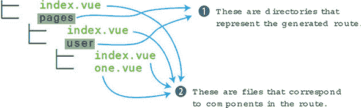

页面文件夹中的目录结构将自动生成此列表中显示的路由。

##### 列表 11.11\. 自动生成的路由结构

```
router: {
  routes: [
    {
      name: 'index',
      path: '/',
      component: 'pages/index.vue'           *1*
    },
    {
      name: 'user',
      path: '/user',
      component: 'pages/user/index.vue'
    },
    {
      name: 'user-one',
      path: '/user/one',
      component: 'pages/user/one.vue'
    }
  ]
}
```

+   ***1* 记录 pages 3index 路由**

这是一个快速示例，展示了你可以进行的路由类型。你可以在官方指南中找到更多关于路由的信息：[`nuxtjs.org/guide/routing`](https://nuxtjs.org/guide/routing)。

对于我们的应用程序，我们将有一个更简单的结构。我们只有两个路由，其中一个将是动态的。要在 Nuxt 中定义动态路由，必须在名称前放置一个下划线。如 图 11.9 所见，pages 文件夹的根目录有一个 index.vue 文件。这是根组件，将在应用程序启动时加载。你还会看到一个 README.md 文件。此文件可以被删除；它只是为了提醒你目录中应该包含的内容。`_id` 路由是动态的。ID 将匹配艺术家名称，并将传递到路由中。

##### 图 11.9\. iTunes 搜索应用程序的目录结构

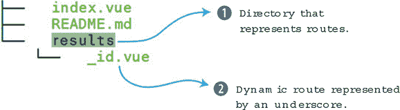

在 pages 文件夹中创建一个 results 目录。然后打开 index.vue 文件。删除所有内容并添加 列表 11.12 中的相对简单的代码。我们在顶部有一个模板，其中包含 `<h1>` 标签和 `<form>` 元素。一个 `v-on` 指令附加到表单的提交事件上。我们还将使用事件修饰符 `prevent` 来阻止表单提交。

在提交方法内部，我们将使用 `this.$router.push`。这将使应用程序路由到 results/ 页面。我们将搜索结果作为参数传递给路由。因为我们设置了 `dynamic _id` 路由，所以搜索结果将作为 URL 的一部分显示。例如，如果我们搜索 Taylor Swift，URL 将是 /results/taylor%20swift。不用担心 %20，这是自动添加的，代表空格字符。

在页面组件的底部添加一个样式标签，如本列表所示。这将使文本居中并添加一些填充。

##### 列表 11.12\. 创建索引页面：chapter-11/itunes-search/pages/index.vue

```
<template>
  <div>
    <h1>Search iTunes</h1>
    <br/>
    <form @submit.prevent="submit">                    *1*
      <input placeholder="Enter Artist Name"
  v-model="search"
  ref='search' autofocus   />
    </form>
  </div>
</template>
<script>
export default {
  data() {
    return {
      search: ''
    }
  },
  methods: {
      submit(event) {
        this.$router.push(`results/${this.search}`);   *2*

      }
  }
}
</script>

<style>                                                *3*
* {
  text-align: center;
}

h1 {
  padding: 20px;
}
</style>
```

+   ***1* 显示带有触发提交方法的 v-on 指令的表单元素**

+   ***2* 将应用程序路由到结果页面**

+   ***3* 使页面居中并添加填充。**

本应用的最后一部分是显示结果中每个专辑的卡片页面 `_id`。它还会在每个卡片上交替显示蓝色和红色。

在本章前面，我提到页面是超级组件。换句话说，它们有一些仅适用于 Nuxt 的选项。这些选项包括 `fetch`、`scrollToTop`、`head`、`transition`、`layout` 和 `validate`。我们将探讨两个其他选项，即 `asyncData` 和 `middleware`。如果您想了解更多关于 Nuxt 选项的信息，请查看官方文档 [`nuxtjs.org/guide/views`](https://nuxtjs.org/guide/views)。

`middleware` 选项允许我们定义在页面中要使用的中间件。每次组件加载时，都会运行此中间件。您可以在 列表 11.13 中看到 `_id.vue` 文件正在使用我们之前创建的中间件搜索。

另一个选项称为 `asyncData`。这很有用，因为它允许我们在服务器上检索数据并预渲染，而无需使用存储。如您在中间件部分所看到的，我们必须使用 Vuex 存储来保存我们的数据，以便我们的组件可以访问它。当使用 `asyncData` 时，您不必这样做。让我们首先看看如何使用中间件访问数据。然后我们将重构以使用 `asyncData`。

在 `pages/results` 文件夹中创建一个名为 `_id.vue` 的文件。在这个新组件内部，添加一个 `v-if` 指令用于 `albumData`。这将确保在显示之前数据已被加载。接下来，创建一个 `v-for` 指令，遍历 `albumData`。

在每次迭代中，我们将显示一个卡片，并将其 `title`、`image`、`artistName`、`url` 和 `color` 的专辑数据传递给它。颜色将通过名为 `picker` 的方法计算得出，它将根据索引值在红色和蓝色之间交替。

在文件顶部，我们将访问 `{{$route.params.id}}`。这是从搜索结果传入的参数。

如您在下一列表中看到的，我们将添加一个名为 `albumData` 的计算属性。这将从存储中检索数据。存储由触发路由加载时的中间件搜索填充，如此处所示。

##### 列表 11.13\. 创建我们的动态路由：chapter-11/itunes-search/pages/results/_id.vue

```
<template>
  <div>
    <h1>Results for {{$route.params.id}}</h1>           *1*
    <div v-if="albumData">                              *2*
      <div v-for="(album, index) in albumData">         *3*
          <Card :title="album.collectionCensoredName"   *4*
                :image="album.artworkUrl60"
                :artistName="album.artistName"
                :url="album.artistViewUrl"
                :color="picker(index)"/>
      </div>
    </div>
  </div>
</template>
<script>
import axios from 'axios';
import Card from '~/components/Card.vue'
export default {
    components: {
      Card
    },
    methods: {
      picker(index) {                                   *5*
          return index % 2 == 0 ? 'red' : 'blue'
      }
    },
    computed: {                                       *6*
      albumData(){
        return this.$store.state.albums;
      }
    },
    middleware: 'search'                              *7*
}
</script>
```

+   ***1* 消息显示从搜索中传入的路由参数。**

+   ***2* 只有在 `albumData` 存在时才会显示的 v-if 指令。**

+   ***3* 遍历专辑数据的 v-for 指令。**

+   ***4* 传入专辑信息的卡片组件。**

+   ***5* 返回交替显示红色和蓝色的选择器方法。**

+   ***6* 返回存储中专辑属性的计算属性。**

+   ***7* 指定为此路由运行的中间件**

运行 `npm run dev` 命令，并在本地主机端口 3000 上打开一个网络浏览器。如果你已经运行了它，请确保关闭并重新启动。你应该看到 iTunes 搜索应用程序打开。如果没有，请在控制台中查找错误。有时错误可能只是组件名称中的一个拼写错误。

让我们对我们的应用程序进行最后一次修改。正如我之前所说的，我们有访问名为 `asyncData` 的东西。这个选项用于在组件初始加载时在服务器端加载数据。它类似于使用中间件，因为我们将能够访问上下文。

使用 `asyncData` 时要小心。你将无法通过此选项访问组件，因为它是在组件启动之前调用的。然而，它将合并你检索的数据与组件，因此你不需要使用 Vuex。你可以在官方文档 [`nuxtjs.org/guide/async-data`](https://nuxtjs.org/guide/async-data) 中找到有关 `asyncData` 的更多信息。

再次打开 _id.vue 文件，并删除 `albumData` 计算属性。我们不会使用它。相反，创建一个 `asyncData` 选项，如 列表 11.14 所示。在这个选项内部，我们将使用 Axios 进行 HTTP GET 请求。类似于中间件，`asyncData` 也可以访问上下文对象。我们将使用 ES6 解构来检索 `params`，然后在 iTunes API 调用中使用它们。在响应中，我们将设置 `albumData` 对象。这个对象将在组件初始化后对我们可用，如 列表 11.14 所示。

##### 列表 11.14\. asyncData 示例：chapter-11/itunes-search/pages/results/_id.vue

```
...
    asyncData ({ params }) {                               *1*
      return axios.get(`https://itunes.apple.com/
     search?term=${params.id}&entity=album`)
        .then((response) => {                              *2*
            return {albumData: response.data.results}      *3*
        });
    },
...
```

+   ***1* asyncData 选项可以访问 params 键。**

+   ***2* iTunes 响应将在将 params.id 传递给 axios.get 命令后出现。**

+   ***3* 这将返回一个可以在组件中访问的新 albumData 属性。**

对于 `asyncData`，这就足够了。保存文件，再次运行 `npm run dev` 命令。你应该看到页面和之前一样。正如你所看到的，我们有相同的结果，但我们不需要使用 Vuex 存储。

### 11.3\. 使用 Firebase 和 VuexFire 与服务器通信

Firebase 是一个谷歌产品，可以帮助你快速为移动和桌面创建应用程序。它提供包括分析、数据库、消息传递、崩溃报告、云存储、托管和身份验证在内的多项服务。Firebase 可以自动扩展，并且易于启动。你可以在官方主页 [`firebase.google.com/`](https://firebase.google.com/) 上找到有关所有 Firebase 服务的更多信息。

在本节示例中，我们将使用这些服务中的两个：身份验证和实时数据库。我们将修改现有的宠物商店应用程序，以包含这些服务。

让我们假设我们被告知需要将宠物商店应用程序的产品托管在云端并添加身份验证。回想一下上一章，我们的宠物商店应用程序使用一个平面文件，products.json。我们需要将 products.json 的内容移动到 Firebase 的实时数据库中。然后我们将修改我们的应用程序，使其从 Firebase 而不是平面文件中获取数据。

另一个重要方面是使用 Firebase 内置的云提供商之一添加简单身份验证。我们将在页眉中添加一个新的按钮来登录和登出，并查看我们如何将会话数据保存到 Vuex 存储中。一切完成后，我们的应用程序将看起来像 图 11.10。

##### 图 11.10\. 使用 Firebase 完成的宠物商店应用程序

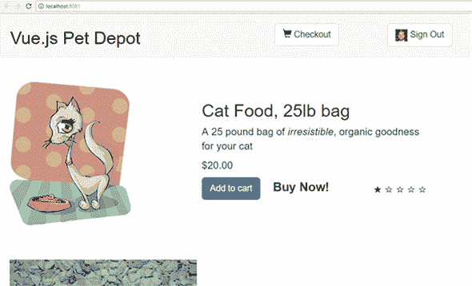

#### 11.3.1\. 设置 Firebase

如果你有一个谷歌账户，你可以访问 [`firebase.google.com`](http://firebase.google.com) 并登录。如果你没有谷歌账户，请转到 [`accounts.google.com`](http://accounts.google.com) 创建一个；这是免费的。（Firebase 每月有特定数量的免费交易；之后你将需要付费。）

登录后，你会看到 Firebase 欢迎页面。然后你将有机会创建一个项目，如图 11.11 所示。

##### 图 11.11\. 创建 Firebase 项目

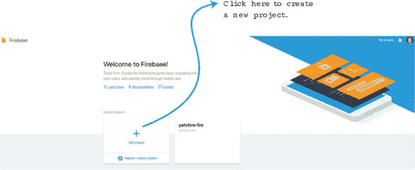

点击添加项目后，你需要输入项目名称和国家/地区。点击创建项目，你将看到 Firebase 控制台。这是我们设置数据库、身份验证和检索我们开始所需密钥的地方。

在左侧点击数据库。你应该看到两个选项：实时数据库和云 Firestore。我们将使用实时数据库。点击开始 (图 11.12)。

##### 图 11.12\. 数据库选择

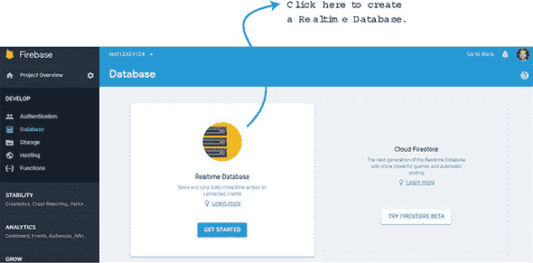

在这一点上，我们将把 products.json 文件添加到 Firebase 数据库中。我们可以导入 JSON 文件，但我们将手动添加它，这样我们可以理解一切是如何工作的。点击数据库旁边你给出的名称旁边的加号 (+) 符号。添加一个“产品”子项。在点击添加之前，再次点击加号符号。这将创建另一个子项。在“名称”框中添加一个数字。再次点击加号符号并创建七个子项。这些将是标题、描述、价格、图片、可用库存、id 和评分。填写信息，并为另一个产品重复此过程。完成后，它应该看起来像 图 11.13。

##### 图 11.13\. Firebase 实时数据库设置

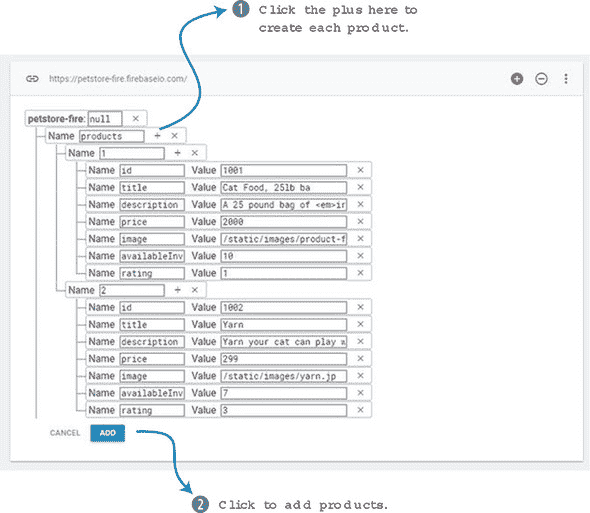

点击添加，你将在数据库中看到两个产品。如果你喜欢，重复此过程并添加更多。

完成此操作后，我们需要设置身份验证。在控制台的左侧点击身份验证。你会看到一个有“设置登录方法”按钮的窗口。点击该按钮，如图 11.14 所示。

##### 图 11.14\. 设置身份验证

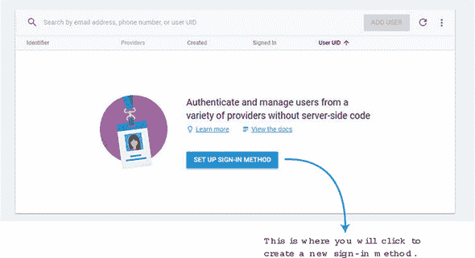

在下一页，选择 Google。我们将在我们的应用中使用它进行身份验证。我们同样可以设置 Facebook 或 Twitter，但在这个例子中，我们将假设任何想要登录我们应用的人都必须有一个 Google 账户。在设置窗口中，滑动启用按钮并保存你的工作，如图 11.15 所示。这就完成了；这将使我们能够使用 Google 登录。

##### 图 11.15\. 启用 Google 登录。

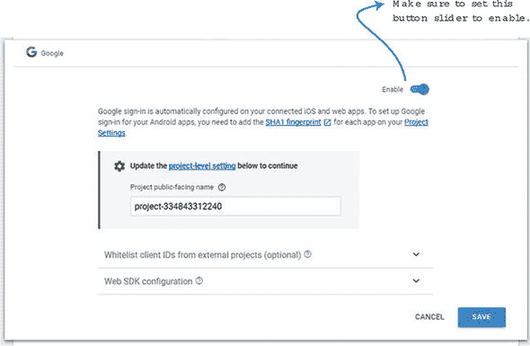

最后，我们需要获取配置信息。通过点击左侧的“项目概览”返回项目概览控制台页面。你会看到一个“将 Firebase 添加到你的 Web 应用”按钮。点击此按钮，将打开一个窗口，显示你的 Firebase 密钥和初始化信息。记录这些信息以备后用；我们将在设置应用中的 Firebase 时需要它。

#### 11.3.2\. 使用 Firebase 设置我们的宠物商店应用

现在我们已经设置了 Firebase，我们需要更新我们的宠物商店应用以使用它。我们上次使用宠物商店是在 第十章，当时我们添加了 Vuex。复制上一章的宠物商店应用或下载该章节的代码。我们将以此代码作为起点。

为了使 Firebase 能够正确地与 Vue 一起工作，我们需要使用一个名为 VueFire 的库。这将帮助我们与 Firebase 通信并设置我们需要的绑定。你可以在他们的官方 GitHub 页面找到更多关于 VueFire 的信息，网址为 [`github.com/vuejs/vuefire`](https://github.com/vuejs/vuefire)。

打开你的控制台，更改目录到你的宠物商店应用的位置。使用以下命令安装 VueFire 和 Firebase：

```
$ cd petstore
$ npm install firebase vuefire –save
```

这将安装并保存我们需要的所有依赖。

在宠物商店应用的根目录下的 src 文件夹中创建一个名为 firebase.js 的文件。记得你从 Firebase 控制台复制初始化信息的时候吗？我们现在需要用到它。在文件顶部，写入 `import {initializeApp} from Firebase`。导入之后，创建一个名为 `app` 的 `const` 变量，并将你之前记录的初始化信息粘贴进去。

创建两个导出，一个名为 `db`，另一个名为 `productsRef`。这将使我们能够连接到 Firebase 数据库并检索我们之前创建的产品信息。如果你需要更多关于 Firebase API 的信息，请查看官方 API 文档，网址为 [`firebase.google.com/docs/reference/js/`](https://firebase.google.com/docs/reference/js/)。将 列表 11.15 中的代码复制到 src/firebase.js 文件中。

##### 列表 11.15\. 设置 Firebase 和初始化文件：chapter-11/petstore/src/firebase.js

```
import { initializeApp } from 'firebase';            *1*

const app = initializeApp({                          *2*
    apiKey: "<API KEY>",
    authDomain: "<AUTH DOMAIN>",
    databaseURL: "<DATABASE URL>",
    projectId: "<PROJECT ID>",
    storageBucket: "<STORAGE BUCKET>",
    messagingSenderId: "<SENDER ID>"
});

export const db = app.database();                    *3*

export const productsRef = db.ref('products');       *4*
```

+   ***1* 将 initializeApp 导入到文件中**

+   ***2* 显示从 Firebase 控制台接收到的 Firebase 密钥**

+   ***3* 使用 ES6 导出数据库**

+   ***4* 使用 ES6 导出产品引用**

我们现在需要设置我们的 main.js 文件，使其可以看到我们之前安装的`VueFire`库。我们还需要确保我们导入了 Firebase 和我们之前创建的 firebase.js。`Vue.use(VueFire)`行将`VueFire`设置为应用程序的插件。这是 VueFire 安装所必需的。使用以下代码更新 src/main.js 文件。

##### 列表 11.16\. 设置主文件: chapter-11/petstore/src/main.js

```
import Vue from 'vue'
import App from './App'
import router from './router'
require('./assets/app.css')
import { store } from './store/store';
import firebase from 'firebase';         *1*
import './firebase';                     *2*
import VueFire from 'vuefire';           *3*

Vue.use(VueFire);                        *4*
Vue.config.productionTip = false

/* eslint-disable no-new */
new Vue({
  el: '#app',
  router,
  store,
  template: '<App/>',
  components: { App }
})
```

+   ***1* 将 Firebase 导入到应用程序中**

+   ***2* 导入 firebase.js 文件。**

+   ***3* 导入 vuefire。**

+   ***4* 将 vuefire 设置为插件。**

在这个阶段，确保我们没有任何错误是个好主意。保存所有文件，并在控制台中运行`npm run dev`命令。这将启动你的服务器在 localhost 上。确保你控制台中没有错误。很容易忘记一个导入，所以请确保在 main.js 文件中没有忘记任何导入。因为我们已经设置了一切，让我们看看如何在我们的应用程序中设置认证。

#### 11.3.3\. 更新 Vuex 中的认证状态

我之前提到，我们将在我们的应用程序中使用认证。为了保存这些信息，我们需要更新 Vuex 存储。为了简化操作，我们将创建一个名为`session`的状态属性。在用户认证后，Firebase 返回一个包含会话信息的用户对象。将此信息保存下来，以便在应用程序的任何地方都可以访问，这是一个好习惯。

打开 store/modules/products.js 文件，并在状态中添加一个新的会话属性。就像我们在上一章中所做的那样，我们将添加一个`getter`和一个`mutation`。我们将`mutation`命名为 SET_SESSION。更新 store/modules/products.js 文件，使其与这个列表匹配。

##### 列表 11.17\. 更新 Vuex: chapter-11/petstore/store/modules/products.js

```
const state = {
    products: {},
    session: false                             *1*
};

const getters = {
    products: state => state.products,
    session: state => state.session            *2*
};

const actions = {
    initStore: ({commit}) => {
      axios.get('static/products.json')
      .then((response) =>{
        console.log(response.data.products);
        commit('SET_STORE', response.data.products )
      });
    }
};

const mutations = {
    'SET_STORE' (state, products) {
      state.products = products;
    },
    'SET_SESSION' (state, session) {           *3*
      state.session = session;
    }
};

export default {
    state,
    getters,
    actions,
    mutations,
}
```

+   ***1* 会话状态属性默认为 false。**

+   ***2* 会话的 getter**

+   ***3* 调用 SET_SESSION 的突变设置会话数据。**

现在我们有了在 Vuex 中设置会话数据的地方，我们可以添加从 Firebase 检索它的代码。

#### 11.3.4\. 更新页眉组件以包含认证

在页眉中，我们显示网站名称和结账按钮。让我们更新页眉，使其显示登录和登出按钮。

页眉完成时，有人登录后看起来将像图 11.16 所示。注意在图 11.16 中，在“登出”文本旁边显示了一张图片。这是从 Firebase 的用户对象中检索的。

##### 图 11.16\. 用户已登录。

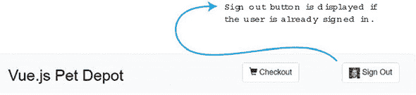

用户登出后，按钮将变为“登录”，如图 11.17 所示。

##### 图 11.17\. 用户已登出。

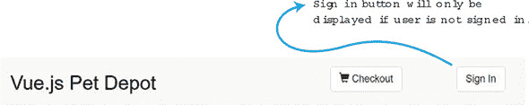

打开 `src/components/Header.vue` 文件。在这个文件中，我们将更新模板以包含新按钮。我们还需要添加两个用于登录和注销的新方法。在 `navbar-header` 下添加一个新的 `div` 部分用于登录（见 清单 11.18）。下面添加另一个 `div` 部分用于注销。在注销 `div` 内部，我们还将添加一个从 `mySession` 属性检索的图像。

被 `divs` 包围的部分将有一个 `v-if` 指令。如果 `mySession` 属性为 `false`，它将显示登录按钮。如果 `mySession` 为 `true`，我们将使用 `v-else` 指令显示注销按钮。如果会话已登录，我们将看到一个注销按钮；如果会话已注销，我们将看到一个登录按钮。

由于头部组件的代码非常庞大，我已经将其分为三个清单（清单 11.18、11.19 和 11.20）。确保将每个清单合并在一起。将清单中的合并代码覆盖到 `src/components/Header.vue` 文件，如下所示。

##### 清单 11.18\. 更新头部组件：chapter-11/header-temp.html

```
<template>
  <header>
    <div class="navbar navbar-default">
      <div class="navbar-header">
        <h1><router-link :to="{name: 'iMain'}">
{{ sitename }}
</router-link></h1>
      </div>
      <div class="nav navbar-nav navbar-right cart">
        <div v-if="!mySession">                         *1*
          <button type="button"
class="btn btn-default btn-lg"
v-on:click="signIn">                                    *2*
            Sign In
          </button>
        </div>
        <div v-else>                                    *3*
          <button type="button"
class="btn btn-default btn-lg"
v-on:click="signOut">                                   *4*
            
            Sign Out
          </button>
        </div>
      </div>
      <div class="nav navbar-nav navbar-right cart">
         <router-link
active-class="active"
tag="button"
class="btn btn-default btn-lg"
:to="{name: 'Form'}">
          <span class="glyphicon glyphicon-shopping-cart">
{{cartItemCount}}
             </span>
Checkout
        </router-link>
      </div>
    </div>
  </header>
</template>
```

+   ***1* 当 mySession 属性为 false 时，将显示登录按钮。**

+   ***2* 使用 v-on 指令显示登录按钮**

+   ***3* 如果 mySession 属性为 true，将显示注销按钮。**

+   ***4* 显示来自 mySession 的图像**

在模板中，我们创建了两个方法，`signIn` 和 `signOut`。我们还创建了一个名为 `mySession` 的新属性。让我们继续创建组件的脚本部分，包括这些新方法和一个计算属性。确保在脚本顶部导入 `firebase from 'firebase'` (清单 11.19)。

我们需要做的第一件事是添加一个生命周期钩子，称为 `beforeCreate`。这个钩子在组件创建之前触发。在这个钩子中，我们想要设置我们的 Vuex 存储为当前会话。Firebase 便利地有一个名为 `onAuthStateChanged` 的观察者来完成这个任务。这个观察者会在用户登录或注销时被触发。我们可以使用它来使用 `SET_STORE` 更新我们的存储会话信息。有关 `onAuthStateChanged` 的更多信息，请查看官方文档[`mng.bz/4F31`](http://mng.bz/4F31)。

现在我们可以跟踪用户何时登录和注销，我们可以创建这些方法。创建一个名为 `signIn` 的方法。在该方法内部创建一个提供者 `firebase.auth.GoogleAuthProvider()`。将此提供者传递给 `firebase.auth().signInWithPopup`。这将创建一个弹出窗口，提示用户登录其 Google 账户。`signInWithPopup` 将创建一个承诺。如果登录成功，我们在控制台显示“已登录”。如果不成功，我们在控制台看到“错误”。

记住，因为我们已经在`beforeCreate`钩子中设置了`onAuthStateChanged`观察者，所以我们不必在用户登录后设置任何其他变量。在登录或注销后，观察者将自动更新存储。

`signOut`方法的工作方式相同。当用户注销时，控制台会显示“已注销”消息。如果有错误，将显示“注销错误！”。

对于我们的计算属性`mySession`，我们将返回`session`的 Vuex 获取器。如果会话不存在，它将被设置为`false`。值得一提的是，我们可以使用 Vuex 的`mapGetters`。这将自动将获取器 session 映射到我们的组件中的 session 名称。然而，因为我们只处理一个获取器，所以我决定返回`this.$store.getters.session`。

从以下列表中复制代码并将其添加到您将要用于 src/components/Header.vue 的新组合文件的底部。

##### 列表 11.19\. 更新头部组件 2：chapter-11/header-script.js

```
<script>
import firebase from 'firebase';
export default {
  name: 'Header',
  data () {
    return {
      sitename: "Vue.js Pet Depot"
    }
  },
  props: ['cartItemCount'],
  beforeCreate() {
      firebase.auth().onAuthStateChanged((user)=> {                 *1*
          this.$store.commit('SET_SESSION', user || false)
      });
  },
  methods: {
    showCheckout() {
      this.$router.push({name: 'Form'});
    },
    signIn() {                                                      *2*
      let provider = new firebase.auth.GoogleAuthProvider();
      firebase.auth().signInWithPopup(provider).then(function(result) {
        console.log('signed in!');
      }).catch(function(error){
        console.log('error ' + error)
      });
    },
    signOut() {                                                     *3*
      firebase.auth().signOut().then(function() {
        // Sign-out successful.
        console.log("signed out!")
      }).catch(function(error) {
        console.log("error in sign out!")
        // An error happened.
      });
    }
  },
  computed: {
    mySession() {                                                   *4*
      return this.$store.getters.session;
    }
  }
}
</script>
```

+   ***1* 在 beforeCreate 钩子中设置 onAuthStateChanged 观察者。**

+   ***2* signIn 方法登录用户。**

+   ***3* signOut 方法注销用户。**

+   ***4* mySession 计算属性获取会话信息。**

最后，我们需要在我们的 CSS 中添加一个新的照片类，以调整按钮中的照片大小。从以下列表中获取代码，并将其与前面的列表合并，以在 src/components 文件夹中创建新的 Header.vue 文件。

##### 列表 11.20\. 更新头部样式：chapter-11/header-style.html

```
<style scoped>
a {
  text-decoration: none;
  color: black;
}

.photo {               *1*

  width: 25px;
  height: 25px;
}

.router-link-exact-active {
  color: black;
}
</style>
```

+   ***1* 设置图像宽度和高度的图片类**

在添加了新的 Header.vue 文件的所有代码后，请确保运行`npm run dev`命令并检查错误。在`onAuthStateChanged`观察者上犯错并且没有将其提交到 Vuex 存储是很常见的。请注意这一点。

#### 11.3.5\. 更新 Main.vue 以使用 Firebase 实时数据库

在所有认证问题解决之后，让我们开始从数据库中检索信息。默认情况下，我们在 Firebase 中将数据库配置为只读。这对我们来说将有效。

首先，更新 src/components/Main.vue 文件中的`mapGetters`。你会注意到我们正在检索`products`获取器。删除它并添加`session`获取器。我们现在不会使用它，但知道我们可以在主组件中使用会话是很好的。

要使用 Firebase 的实时数据库，我们只需要从 firebase.js 文件中导入`productsRef`。然后我们需要创建一个 Firebase 对象，将`productsRef`映射到`products`。这就足够了！我们 Main.vue 文件中的其他所有代码都可以保持不变。将此列表中的代码更新到 src/components/Main.vue 文件。

##### 列表 11.21\. 更新 Main.vue 文件：chapter-11/update-main.js

```
...
import { productsRef } from '../firebase';    *1*
export default {
  name: 'imain',
  firebase: {                                 *2*
      products: productsRef
  },
...
  computed: {
    ...mapGetters([
        'session'                             *3*
    ])
...
```

+   ***1* 从 firebase/.js 文件导入 productsRef**

+   ***2* 将 productsRef 映射到 products**

+   ***3* 更新 mapGetters，仅检索会话而非产品**

保存所有文件并运行 `npm run dev`。在浏览器内部，你会在产品显示之前注意到轻微的延迟。这表明产品正在从 Firebase 下载。你总是可以进入 Firebase 并添加一个新产品，它应该会出现在你的产品列表中。

你可能想知道我们接下来能做什么。通过会话属性，我们可以设置应用程序的不同部分，只有当用户登录时才能访问。我们可以使用 `v-if` 指令或通过路由器来实现这一点。通过路由器，我们可以给一个路由添加一个元标签。然后我们可以使用 `router.beforeEach` 来在用户登录时导航到特定的路由。这个概念被称为 *导航守卫*。你可以在官方文档的导航守卫部分了解更多信息，网址为 [`router.vuejs.org/guide/advanced/navigation-guards.html`](https://router.vuejs.org/guide/advanced/navigation-guards.html)。在下一章中，我们将探讨测试以及我们如何使用它来确保我们的应用程序按预期工作。

### 练习

使用本章的知识来回答以下问题：

+   使用 `asycData` 在你的 Nuxt 应用程序中与使用中间件相比，有什么优势？

*请参阅附录 B 中的解决方案（kindle_split_026.html#app02）。*

### 概述

+   你可以使用像 Axios 这样的库与 Web API 通信。

+   可以使用服务器端渲染的 Nuxt.js 应用程序创建快速加载的网站。

+   你可以使用 Firebase 从在线数据存储中获取信息。

+   用户可以在你的应用程序中进行身份验证。

## 第十二章\. 测试

*本章涵盖*

+   理解为什么我们要进行测试

+   实现单元测试

+   测试组件

+   测试 Vuex

我们在这本书中讨论了许多重要的话题，但一个经常被忽视的话题没有得到足够的关注：测试。测试是任何软件开发项目中极其重要的一个方面。它确保应用程序的行为符合我们的预期——没有错误。在本章中，我们将讨论为什么你应该为你的应用程序创建测试。然后我们将探讨单元测试的基础。接下来，我们将探讨组件测试，包括输出和方法。最后，我们将了解如何开始使用 Vuex 进行测试。

在我们开始之前，值得提一下，测试是一个很大的主题。在本章中，我将涵盖使用 Vue.js 进行测试的几个最重要的方面。我强烈推荐你阅读 Edd Yerburgh 的 *Testing Vue.js Applications*（Manning，2018）。在他的书中，Edd 深入探讨了创建和开发测试的更多细节。他还涵盖了服务器端渲染测试、快照测试以及测试混合和过滤器。

|  |
| --- |

**快照测试**

快照测试是在你想要确保用户界面不会意外改变时非常有用的工具。在本章中，我将使用 mocha-webpack，截至写作时它不支持快照测试。然而，如果你想了解更多关于快照测试的信息，请查看官方指南，了解如何设置 Jest 与快照测试一起使用，更多信息请访问[`mng.bz/1Rur`](http://mng.bz/1Rur)。

| |
| --- |

### 12.1. 创建测试用例

通常，在软件开发的世界里，有两种测试代码的方式：手动和自动化。让我们先谈谈手动编码。

你可能从开始编码的那一刻起就开始手动测试了。对于你写的每一行代码，你可能都回去检查以确保你期望的输出正在发生。例如，在我们的宠物商店应用程序中，我们添加了一个按钮，可以将产品添加到购物车中。在前几章中，我们通过点击按钮然后检查购物车中的项目数量来手动测试了这一点。

在我们的宠物商店应用程序中，我们还添加了一个按钮，该按钮将路由到结账页面。再次点击该按钮，我们可以确保它正确地重定向。对于功能较少的应用程序，手动测试效果很好。

现在让我们想象一个场景，我们正在与一组开发者合作。我们有一个在生产中的应用程序，许多开发者正在编写代码。开发者整天都在将代码推送到版本控制系统。正如你可以想象的那样，依赖每个开发者手动彻底测试他们的代码并验证他们没有破坏任何东西是不可能的。手动测试是一场噩梦，错误肯定会出现。

在某些组织中，质量保证部门负责在开发部门发布代码后手动测试代码。这有助于减少错误达到生产的风险，但会减慢整个过程。此外，许多质量保证开发者没有资源或时间对代码进行完整的*回归测试*。

| |
| --- |

##### 定义

*回归测试*是一种软件测试类型，它验证在应用程序更新后，应用程序是否仍然以相同的方式运行。

| |
| --- |

但自动化测试可以帮助解决手动测试遇到的一些问题。在我们的假设场景中，我们可以创建几个自动化测试，开发者可以在将代码推送到生产之前运行。自动化测试比手动测试运行得更快，并且更有可能立即捕获到错误。有了许多自动化测试用例，开发者可以在代码库上运行完整的回归测试，而不必担心手动测试每一件事，这会花费很多时间。

尽管自动化测试有许多好处，但它也有其缺点。你必须考虑的一个缺点是前期成本。编写测试用例需要时间，虽然从长远来看你可能会节省时间，但与编写代码相比，编写测试用例会花费更多的时间。然而，一旦一切设置完成，持续集成、交付和部署等流程可以节省时间，正如我们将在下一节中看到的。

### 12.2\. 持续集成、交付和部署

自动化测试除了能带来持续开发等工作流程的便利外，还有额外的优势。这个工作流程包括持续集成、交付和部署。正如其名所示，这些工作流程密切相关。我们将简要讨论每一个。

假设我们正在创建一个基本的连接数据库并检索书籍网站信息的应用程序。我们有一个开发团队在代码库上工作，但团队遇到了一些问题。大多数开发者在每隔几周将代码推送到版本控制系统时都会遇到合并冲突。此外，每周五有一个人负责手动创建最新的代码的*预发布环境*。（预发布环境用于测试目的，运行生产代码。）由于代码库变得更大、更复杂，这个过程越来越耗时。推送到生产环境的情况也好不到哪里去。一半的时间生产代码无法正确构建，修复它需要数小时。经理决定转向持续开发以帮助解决这些问题。这个过程的第一步是持续集成。

#### 12.2.1\. 持续集成

*持续集成*（CI）是指每天将代码合并到*主分支*的实践。

| |
| --- |

##### 定义

*主分支*是生产代码通常存放的地方。*分支*是一个版本控制术语，它描述了代码库的副本，以便可以在两个分支中并行进行修改。

| |
| --- |

CI 的明显好处是它有助于避免合并冲突。合并冲突发生在多个开发者试图将他们的代码合并或组合到单个分支时。每天将代码合并到主分支几次有助于避免一个开发者的工作进度破坏另一个开发者的代码。因为主分支是持续更新的，所以另一个在同一项目上工作的开发者可以轻松地将最新代码拉入自己的开发环境，并相对确信它是最新的。

在我们的假设场景中，我们的经理决定通过实施一个在开发者推送代码之前帮助运行自动化测试用例的服务来使持续集成过程更加顺畅。在 Git 这样的版本控制系统中，开发者可以提交拉取请求。像 Travis、CircleCI 和 Jenkins 这样的服务可以帮助检查在代码合并之前拉取请求是否通过了所有测试用例。在系统就绪后，团队看到合并冲突减少了，但他们仍然在部署方面存在问题。

#### 12.2.2\. 持续交付

*持续交付* 是一种软件开发方法，旨在快速且频繁地构建、测试和发布软件。其目的是创建一个快速且可靠的部署管道，该管道由一系列必须通过的检查指导。例如，在软件发布之前，所有测试用例都必须通过，构建必须通过且没有任何错误或警告。这些类型的检查有助于提供更可靠、更一致的发布。

通常，持续集成不是开发团队的职责。通常，一个被称为 DevOps 或开发运维的团队负责设置和维护持续交付。了解这一过程的基本知识以及它与测试的关系是很好的。

使用持续交付，将代码合并或提交到主分支会触发网站的构建。这可以节省时间，因为它消除了将网站手动部署到预发布环境的手动步骤。它还有一个额外的优点，即只有当所有测试用例都通过时才会部署，因此网站出现故障的可能性较小。

使用持续交付，我们的团队不再需要有人浪费数小时来创建和部署预发布环境。持续交付将确保它每天都会发生。话虽如此，持续部署与持续交付有什么关系呢？

#### 12.2.3\. 持续部署

*持续部署* 比持续交付更进一步，它会在每次更改时直接将代码部署到生产环境中。与持续交付一样，开发者可以放心，在代码部署到生产环境之前，所有测试都通过了。

如您所想，如果自动化测试不足以检查应用程序的所有部分，那么每次更改后都将代码部署到生产环境可能会很危险。最坏的情况是，一个损坏的网站被部署到生产环境中。在这种情况下，需要进行回滚或紧急修复。现在我们已经看到了如何将测试集成到工作流程中，让我们来看看有哪些类型的测试可用以及我们如何在 Vue.js 中使用这些测试。

### 12.3\. 测试类型

在测试的世界里，我们可以创建多种类型的测试。在本章中，我们将探讨最常见的一些，包括单元测试和组件测试。

*单元测试*是对我们应用程序最小部分的测试。这些通常是我们的应用程序中的函数，但并不总是。它们也可以是组件。让我们先创建一个基本的单元测试来看看它是如何工作的。

单元测试具有独特的优势。首先，它们运行速度快。因为它们只测试一小段代码，所以可以快速运行。它们还可以充当文档。它们是关于代码应该如何行为的说明。单元测试也是可靠的，因为它们只测试代码的一小部分。它们可以被运行数千次并产生相同的输出。与可能必须依赖经常失败的 API 的其他测试不同，单元测试不应该出现这种问题。想象一下这样一个场景，你创建了一个将华氏度转换为摄氏度的应用程序。在这个应用中，我们有一个执行转换的函数。我们可以轻松地创建一个单元测试来验证返回的数值是否正确。你可以在下面的列表中看到这一点。

##### 列表 12.1. 一个基本的单元测试：chapter-12/unit.js

```
function convert(degree) {
  let value = parseFloat(degree);
  return (value-32)/ 1.8;
}

function testConvert() {                       *1*
  if (convert(32) !== 0) {
    throw new Error("Conversion failed");
  }
}

testConvert();
```

+   ***1. 检查转换函数的基本单元测试。**

我们将要查看的第二种测试类型是*组件测试*。这些测试针对每个组件运行并验证它们应该如何表现。它们可能比单元测试更复杂，因为它们测试了更多的应用程序，并且更难调试。但它们验证组件是否满足其要求并实现其目标。

### 12.4. 设置我们的环境

既然我们已经对现有的测试类型和为什么我们应该进行测试有了很好的了解，让我们设置我们的环境。我们的宠物商店应用可能需要几个测试，所以让我们添加它们。

在本节中，我们将修改我们的宠物商店应用程序，以便我们可以使用 Vue.js 推荐的最新测试库。截至写作时，Vue-CLI 在我们生成项目时并没有内置这些库，所以我们需要做一些设置。这需要我们安装几个包并配置一些文件。

要开始我们的设置，我们需要获取我们的宠物商店应用的副本。如果你一直在跟随，你可以自由使用你创建的应用。如果没有，请从第十一章在[`github.com/ErikCH/VuejsInActionCode`](https://github.com/ErikCH/VuejsInActionCode)复制宠物商店应用。

vue-test-utils 是 Vue.js 的官方单元测试库。它使 Vue.js 的测试变得更容易，你应该使用它。我们将在本章中介绍库的基本知识；如果你需要更多信息，你可以在官方指南中阅读它是如何工作的，[`vue-test-utils.vuejs.org`](https://vue-test-utils.vuejs.org)。

你可能还记得从第七章，当我们创建宠物商店应用时，我们选择了 Nightwatch 和 Karma。这将工作，但在写作的时候，Vue-CLI 默认不支持 vue-test-utils 库。因为这个库默认没有安装，我们需要安装它。

我们还需要在 vue-test-utils 库中选择一个我们想要使用的测试运行器。测试运行器会抓取我们创建的单元测试并执行它们。当我们第一次安装我们的宠物商店应用时，Mocha 和 Karma 是我们的唯一测试运行器选择。Karma 与 vue-test-utils 兼容，但并不被官方推荐。vue-test-utils 团队推荐使用 Jest 或 mocha-webpack。因为我们已经安装了 Mocha，我们将继续安装 mocha-webpack。Jest 也是一个很好的选择，但本书不会涉及它。

| |
| --- |

##### 注意

请记住，如果你选择 Jest，本书中的所有测试仍然会工作，但你会有一个稍微不同的设置。你可以在官方指南[`mng.bz/3Dch`](http://mng.bz/3Dch)中找到如何设置 Jest 的说明。

| |
| --- |

因为我们将使用 mocha-webpack 作为测试运行器，所以我们需要安装一些其他的东西。为了运行测试，我们需要一个浏览器。我们可以在真实的浏览器中运行我们的测试，例如 Chrome 或 Firefox，但这并不推荐，因为浏览器中的运行可能会很慢，而且不如使用无头浏览器灵活。相反，我们将使用名为 jsdom 和 jsdom-global 的模块。这些模块将为我们模拟浏览器；它们是用于运行我们的测试用例的**无头浏览器**。

| |
| --- |

##### 定义

一个**无头浏览器**没有图形用户界面（GUI），用于简化网页的自动化控制。无头浏览器执行的功能与当代浏览器非常相似，但交互通常是通过命令行界面（CLI）完成的。

| |
| --- |

我们需要选择一个断言库，Chai 和 Expect 是流行的选择。断言库用于验证事物是否正确，而不是依赖于像`if`语句这样的东西。vue-test-utils 团队推荐与 mocha-webpack 一起使用 Expect，因此我们将继续安装它。你可以在[`mng.bz/g1yp`](http://mng.bz/g1yp)上找到有关选择断言库的更多信息。

我们最后需要安装的库是 webpack-node-externals。这将帮助我们排除测试包中的某些 npm 依赖项。

获取本书包含的宠物商店应用的最新版本。请注意，如果你从第十一章下载宠物商店应用的最新版本，如果你还没有这样做，你需要在 src 文件夹中的 firebase.js 文件内输入你的 Firebase 配置。如果你忘记这一步，应用程序将无法加载！

在获取宠物商店应用的最新版本后，通过运行以下命令安装这些依赖项：

```
$ cd petstore
$ npm install
$ npm install –-save-dev @vue/test-utils mocha-webpack
$ npm install –-save-dev jsdom jsdom-global
$ npm install –-save-dev expect
$ npm install –-save-dev webpack-node-externals
```

在安装了依赖项之后，我们将添加配置。编辑宠物商店应用构建文件夹中的 webpack.base.conf.js 文件。将以下列表中的代码复制并粘贴到文件底部以配置 webpack-node-externals 和 inline-cheap-module-source map。这些模块需要这些配置才能正确工作。

##### 列表 12.2\. 设置源映射和节点外部：chapter-12/setup.js

```
if (process.env.NODE_ENV === 'test') {
  module.exports.externals = [require('webpack-node-externals')()]     *1*
  module.exports.devtool = 'inline-cheap-module-source-map'
}
```

+   ***1* 设置测试环境**

在测试文件夹中，你会注意到有 unit 和 e2e 文件夹。我们不会使用这些文件夹，所以你可以随意删除它们。在测试文件夹中添加一个名为 setup.js 的新文件。setup.js 文件是我们设置 `jsdom-global` 和 `expect` 的全局变量的地方。这将使得我们不需要在每个测试用例中导入这两个模块。将此列表中的代码复制并粘贴到 test/setup.js 文件中。

##### 列表 12.3\. 设置测试：chapter-12/petstore/setup.js

```
require('jsdom-global')()               *1*
global.expect = require('expect')       *2*
```

+   ***1* 设置 jsdom-globa**

+   ***2* 在 app 中设置 expect**

接下来，我们需要更新 package.json 文件中的测试脚本。这个脚本将运行 mocha-webpack 测试运行器和我们的测试。为了简化，所有测试都将具有 `spec.js` 文件扩展名。编辑 package.json 文件，并将脚本测试部分替换为以下行。

##### 列表 12.4\. 更新 package.json：chapter-12/testscript.js

```
"test": "mocha-webpack --webpack-config
build/webpack.base.conf.js --require
 test/setup.js test/**/*.spec.js"             *1*
```

+   ***1* 记录 package.json 文件中的测试脚本**

这就是我们需要的所有配置。现在我们可以开始创建测试用例了！

### 12.5\. 使用 vue-test-utils 创建我们的第一个测试用例

对于我们第一个使用 vue-test-utils 的测试，让我们看看我们是否可以验证在点击 Order 按钮后我们的 Form 组件是否正常工作。当你点击表单组件上的 Order 按钮时，会出现一个警告框。我们可以测试警告框，但我们的设置并不容易，并且需要我们更改我们的 jsdom-global 配置。为了这个测试的目的，我们将创建一个名为 `madeOrder` 的属性。它将默认为 `false`。点击 Order 按钮后，它将变为 `true`。

订单表单将被更新，以在底部显示完成订单的消息（图 12.1）。当 `madeOrder` 为 `true` 时，文本将出现。当它为 `false` 时，文本将不会显示。我们添加这个是为了在点击订单按钮时获得更多反馈，因为我们不再使用警告框。

##### 图 12.1\. 显示底部已订单的宠物仓库结账页面

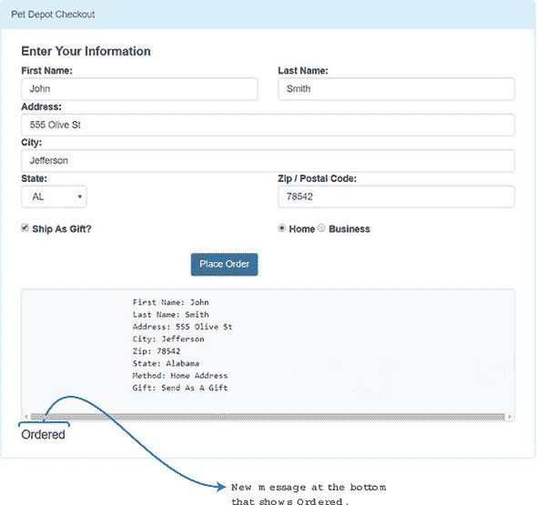

要进行此更改，我们需要更新 src/components/Form.vue 文件。在文件中的 data 函数中添加一个名为 `madeOrder` 的新属性。编辑 `submitForm` 方法并删除警告框，然后添加 `this.madeOrder = true`。这将确保当应用启动时属性被设置为 `true`。使用此列表中的代码更新 src/components/Form.vue。

##### 列表 12.5\. 更新 `Form` 组件：chapter-12/form-update.js

```
...
        dontSendGift: 'Do Not Send As A Gift'
      },
      madeOrder: false               *1*
...
  methods: {
    submitForm() {
      this.madeOrder = true;         *2*
    }
  }
...
```

+   ***1* 为 madeOrder 添加新属性**

+   ***2* 将 madeOrder 设置为 true**

我们现在准备好创建我们的第一个测试用例了。让我们验证在点击“下单”按钮后，`madeOrder` 属性是否被设置为 `true`。为了测试这一点，我们将使用 vue-js-utils 的 `shallow` 函数。`shallow` 函数渲染一个 Vue 组件并模拟其任何子组件。另一个常见的函数是 `mount`，它的工作方式与 `shallow` 相同，只不过它不会模拟子组件。

我们还需要导入 `Form` 组件。稍后我们将将其传递给 `shallow` 函数以创建其包装。接下来，你会注意到一个名为 `describe` 的东西。`describe` 函数用于将类似的测试组合成一个测试套件。当我们从命令行运行测试时，我们可以看到测试套件是否通过或失败。

`it` 函数是一个测试用例。这将是我们测试按钮并验证它是否正确更新了 `madeOrder` 属性的单元测试。我们可以在每个测试套件中拥有多个测试用例。

由于我们正在使用 expect 断言库，我们将使用它来确保 `madeOrder` 属性被设置为 `true`。在 列表 12.6 中，我们使用 `wrapper.vm.madeOrder` 来访问该属性。从 `shallow` 函数返回的包装对象有几个属性，包括一个名为 `vm` 的属性。我们可以使用 `vm` 属性来访问任何 Vue 实例方法或属性，这允许我们在 Vue 组件内部运行任何方法或获取任何属性。这很方便。

`wrapper` 还有一个接受选择器的 `find` 函数。`find` 函数可以使用任何有效的 CSS 选择器，例如标签名、ID 或类。然后我们可以使用 `trigger` 函数来触发事件——在这种情况下，按钮上的点击事件。根据以下列表创建一个新的 Form.spec.js 文件。

##### 列表 12.6\. 我们的第一个测试用例：chapter-12/petstore/test/Form.spec.js

```
import { shallow } from '@vue/test-utils'                        *1*
import Form from '../src/components/Form.vue'                    *2*

describe('Form.vue', () => {

    it('Check if button press sets madeOrder to true', () => {
      const wrapper = shallow(Form)                              *3*
      wrapper.find('button').trigger('click')                    *4*

      expect(wrapper.vm.madeOrder).toBe(true);                   *5*
    })

})
```

+   ***1* 在测试用例中导入 shallow**

+   ***2* 导入表单组件**

+   ***3* 将包装器分配给组件的 shallow 版本**

+   ***4* 查找并触发按钮**

+   ***5* 验证 madeOrder 是否为 true**

让我们运行我们的测试用例。确保你处于宠物商店顶级目录，并运行 `npm test` 命令。这应该会运行我们的测试套件。如果你看到错误，请确保你安装了之前讨论的所有依赖项，并验证 package.json 文件中是否包含测试脚本。图 12.2 显示了当所有测试都通过时我们会看到的内容！

##### 图 12.2\. 检查我们的第一个测试用例，它是成功的

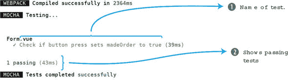

由于一切通过，显示了一个成功消息。让我们看看它失败时是什么样子。回到 petstore/test/Form.spec.js 文件。查找 `expect` 语句并将值设置为 `false` 而不是 `true`。再次运行 `npm test` 命令，它应该会失败。注意从 图 12.3 中可以看到，预期的值和接收到的值在输出中显示。

##### 图 12.3\. 测试用例失败

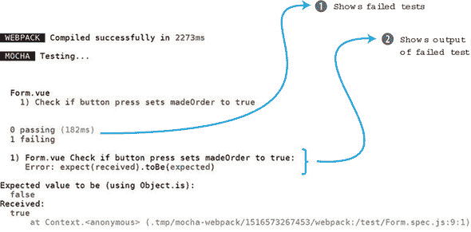

现在我们已经了解了测试的基本知识，让我们来看看如何测试组件。

### 12.6\. 测试组件

在我们测试组件之前，我们需要对我们的规范有一个大致的了解。我们应该期望组件做什么？我们将使用我们的宠物商店应用作为例子。

我们的应用程序中有三个组件：`Main`、`Header` 和 `Form`。`Header` 组件的职责是显示购物车中的项目数量，并显示登录或注销按钮。`Form` 组件的职责是显示所有表单输入，并提供通过点击订单按钮进行订购的选项。`Main` 用于显示所有产品。它需要渲染来自 Firebase 存储的所有组件。

我们不会测试每个组件，但在创建任何测试用例之前为每个组件写下规范是很重要的。这样我们就会知道要测试什么。

#### 12.6.1\. 测试属性

我们中的许多组件都将有传入的属性。例如，在我们的宠物商店应用中，`cartItemCount` 被传递到我们的 `Header` 组件，并在右上角显示。让我们创建一个测试用例来验证这个属性是否被传递。

在 petstore/test/ 目录中创建一个名为 Header.spec.js 的文件。这个文件将包含我们对 `Header` 组件的所有测试。在我们开始之前，我们需要做一些设置。

如果你查看 Header.vue 文件，你会注意到我们正在使用 Firebase 和 Vuex。`beforeCreate` 钩子调用 Firebase 函数并使用 Vuex 存储命令提交会话来设置值。在这个例子中，我们不会测试 Vuex 或 Firebase，但我们需要导入它们，否则我们会得到错误。确保导入 `../src/firebase` 和 `../src/store/store`，如 清单 12.7 所示。

在文件顶部，从 vue-test-utils 库中导入 `shallow`。此外，导入一个名为 `createLocalVue` 的东西。我们需要这个函数来设置 Vuex。

接下来，我们将创建一个 `localVue` 变量并将其分配给 `createLocalVue()`。这个函数返回一个 `localVue` 类。你可以把它想象成一个复印机，它产生 Vue 的复印件。我们可以使用这个来帮助我们为测试设置 Vuex。

你可以从 清单 12.7 中看到我们再次使用了 `shallow` 函数，但它看起来与之前创建的单元测试略有不同。`shallow` 函数可以接受一个可选的第二个参数。这个对象包含组件需要的更多信息。在其中，我们可以使用 `propsData` 以及 `localVue` 和 `store` 来设置属性数据。

要设置属性，我们必须向其中传递一些内容。最简单的方法是添加 `cartItemCount`。我们将这个变量传递到 `propsData` 中，它将在 `Header` 组件内部设置。

我们最后要检查的是 `wrapper.vm.cartItemCount` 是否与 `cartItemCount` 变量匹配。如果它们相同，测试通过。将下一列表中的代码复制到 petstore/test/Header.spec.js 文件中。

##### 列表 12.7\. 测试属性：chapter-12/header-prop-test.js

```
import { shallow, createLocalVue } from '@vue/test-utils';
import Header from '../src/components/Header.vue';
import Vuex from 'vuex';                                         *1*
import '../src/firebase';                                        *2*
import { store } from '../src/store/store';                      *3*

const localVue = createLocalVue();
localVue.use(Vuex)

describe('Header.vue', () => {

  it('Check prop was sent over correctly to Header', () => {
    const cartItemCount = 10;
    const wrapper = shallow(Header, {                            *4*
      store, localVue, propsData: { cartItemCount }              *5*
    })
    expect(wrapper.vm.cartItemCount).toBe(cartItemCount);        *6*
  })

});
```

+   ***1* 将 Vuex 导入到测试用例中**

+   ***2* 将 Firebase 导入到测试用例中**

+   ***3* 将 Vuex 存储导入到测试用例中**

+   ***4* 新的包装器 const 有一个第二个参数。**

+   ***5* 属性数据设置为 cartItemCount。**

+   ***6* 期望验证传入的属性中 cartItemCount 是否匹配。**

现在我们能够检查属性，让我们看看文本。

#### 12.6.2\. 测试文本

有时候你想要测试文本是否在组件的某个地方渲染。无关紧要的是哪个元素渲染了文本，只要有一个元素渲染了它。

在编写测试时，请注意每个测试用例应只测试一个功能。在测试用例中创建多个断言以检查文本可能很容易，但通常最好将这些类型的测试拆分成多个测试用例。我们将遵循在测试用例中创建单个断言的规则。

打开 petstore/test/Header.spec.js 文件并添加一个新的测试用例。在我们的上一个测试用例中，我们验证了 `cartItemCount` 属性是否正确传递到 `Header` 组件中。现在我们想要验证属性中的文本是否在组件的 span 标签内正确显示。

要做到这一点，我们将像之前一样创建另一个包装器。这次我们将使用 `wrapper.find` 函数来查找 span。然后我们可以使用 `text()` 函数提取 span 内部的文本，即我们的 `cartItemCount`。然后我们使用 `toContain` 函数来验证内容是否匹配。将下一列表中的代码复制到 pet/test/Header.spec.js 文件中，作为最后一个测试之后的另一个测试。

##### 列表 12.8\. 测试文本：chapter-12/header-text-test.js

```
it('Check cartItemCount text is properly displayed', () => {
  const cartItemCount = 10;
  const wrapper = shallow(Header, {
    store, localVue, propsData: { cartItemCount }
  })
  const p = wrapper.find('span');              *1*
  expect(p.text()).toContain(cartItemCount)    *2*
})
```

+   ***1* 包装器找到 span 标签。**

+   ***2* 断言检查文本是否与 cartItemCount 匹配。**

#### 12.6.3\. 测试 CSS 类

在测试类时，我们可以使用 `classes` 方法，它返回一个包含附加到元素上的类的数组。让我们快速添加一个检查来验证我们其中一个 `div` 上的类是否正确。

在 petstore/test/Header.spec.js 文件中，添加一个新的测试用例。在这个测试用例中，我们将创建一个新的包装器。这次我们将使用 `findAll`，它将返回组件中的所有 `div`。我们可以使用 `at(0)` 来检索第一个 `div`。从那里我们可以使用我们的 `expect` 语句在 `p.classes()` 上来检索附加到第一个 `div` 上的所有类。如果任何类匹配，`toContain` 将返回 `true`。

如果我们查看 Header.vue 文件，我们会注意到 `navbar` 和 `navbar-default` 都附加到了第一个 `div` 上。因为我们正在寻找 `navbar`，这个测试将会通过。

##### 列表 12.9\. 测试类：chapter-12/header-classes-test.js

```
it('Check if navbar class is added to first div', () => {
  const cartItemCount = 10;
  const wrapper = shallow(Header, {
    store, localVue, propsData: { cartItemCount }
  })
  const p = wrapper.findAll('div').at(0);         *1*
  expect(p.classes()).toContain('navbar');        *2*
})
```

+   ***1* 这会查找所有的 div 并返回第一个。**

+   ***2* 检查附加的类以查看 navbar 是否存在。**

在我们进一步深入之前，在命令提示符下运行`npm test`并验证所有测试是否通过(图 12.4)。如果有任何测试未通过，请仔细检查`expect`语句以及你是否在文件顶部正确导入了一切。

##### 图 12.4\. 所有测试都通过

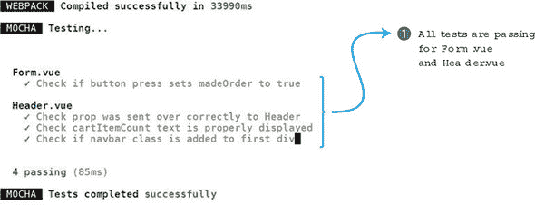

所有测试都通过，因此让我们继续 Vuex。

#### 12.6.4\. 使用 mocked Vuex 进行测试

Vuex store 是一个中央位置，我们可以在这里保存应用程序的数据。在我们的宠物商店应用程序中，我们使用它来设置会话数据并保存我们的产品信息。当使用 Vuex 时，测试 store 是一个明智的选择。

|  |
| --- |

##### 注意

Vuex 测试很复杂，有很多组成部分。不幸的是，我无法在这里全部涵盖。要了解更多关于 Vuex 测试的信息，请从官方 Vuex 测试指南开始，见[`vue-test-utils.vuejs.org/guides/using-with-vuex.html`](https://vue-test-utils.vuejs.org/guides/using-with-vuex.html)。

|  |
| --- |

对于我们的测试用例，我们将测试我们的`Header`组件以及当会话设置为`true`或`false`时它的工作方式。我们想要验证如果会话存在，则显示注销按钮，如果会话不存在，则显示注册按钮。

在本章的早期，我们直接将 store 导入到我们的测试文件中。这只是一个临时的解决方案，以便我们可以为`Header`组件创建其他测试用例。这对于测试 Vuex 是不行的。为了测试我们的 Vuex store，我们需要完全 mock store。这比你想象的要简单得多。

在`petstore/test/Header.spec.js`文件顶部，你会看到一个对 store 的导入。删除这一行。我们将创建一个*mock*的 store。mock 是一个具有与无法在测试中使用（类似于我们的 Vuex store）的复杂对象相同结构的对象，但具有你可以控制的实现。在`describe`语句下方，添加新的变量：`store`、`getters`和`mutations`，如列表 12.10 所示。然后创建一个`beforeEach`函数。`beforeEach`函数中的代码在每一个测试用例之前运行。这是一个放置设置代码的好地方。

为了简化，我们的 store 将是基本的。我们将有一个返回`false`的`getter`用于`session`，以及一个返回空对象的`mutation`。我们可以使用`new Vuex.Store`来创建 store（确保你在 Store 中使用大写*S*）。将以下列表中的代码复制到`petstore/test/Header.spec.js`文件的顶部。

##### 列表 12.10\. Mocking Vuex: chapter-12/header-vuex-mock.js

```
describe('Header.vue', () => {

  let store;                     *1*
  let getters;
  let mutations;
  beforeEach(() => {             *2*
    getters = {                  *3*
      session: () => false
    }
    mutations = {                *4*
      SET_SESSION: () => {}
    }
    store = new Vuex.Store({     *5*
      getters,
      mutations
    })
})
```

+   ***1* 显示 store、getters 和 mutations 变量**

+   ***2* 在每个测试之前运行**

+   ***3* 会话 getter 设置为 false。**

+   ***4* 变更 SET_SESSION 返回一个空对象。**

+   ***5* 创建了一个新的 store。**

现在我们已经模拟了 Vuex 存储，我们可以在测试用例中使用它。我们可以假设如果 `session` 设置为 `false`，则登录按钮将显示。如果这有点令人困惑，请转到 src 文件夹中的 Header.vue 文件，您将看到一个依赖于名为 `mySession` 的计算属性的 `v-if` 指令。如果 `mySession` 为 `false`，则显示登录按钮。`v-else` 指令在 `mySession` 为 `true` 时显示注销按钮。将此列表中的代码复制到 petstore/test/Header.js 文件中。

##### 列表 12.11\. 测试登录：chapter-12/header-signin-test.js

```
it('Check if Sign in button text is correct for sign in', () => {
  const cartItemCount = 10;
  const wrapper = shallow(Header, {
    store, localVue, propsData: { cartItemCount }
  })

  expect(wrapper.findAll('button').at(0).text()).toBe("Sign In");       *1*

})
```

+   ***1* 断言期望检查按钮文本并验证其为“登录”**

相反，我们也应该检查，如果会话已登录，注销按钮是否显示。您可以通过几种方式来完成此操作，但其中一种最简单的方法是创建一个新的 `getter.session` 存储。当我们创建包装器时，新的存储将被添加，Header 组件将表现得像 `session` 被设置为 `true` 而不是 `false`。将以下列表中的代码复制并添加到 petstore/test/Header.spec.js 文件中的另一个测试用例中。

##### 列表 12.12\. 测试注销：chapter-12/header-signout-test.js

```
it('Check if Sign in text is correct for sign out', () => {
  const cartItemCount = 10;
  getters.session = () => true;
  store = new Vuex.Store({ getters, mutations})
  const wrapper = shallow(Header, {
    store, localVue, propsData: { cartItemCount }
  })
  expect(wrapper.findAll('button').at(0).text()).toBe("Sign Out");     *1*
})
```

+   ***1* 检查按钮文本是否为“注销”**

运行测试，它们都将通过。这些都是我们将为我们的宠物商店应用程序运行的测试。作为练习，进入表单或主组件并添加一些测试用例。

### 12.7\. 设置 Chrome 调试器

当您调试测试时，您通常会使用 console.log 来查看变量在代码执行过程中的行为。这可以工作，但有一个更好的方法。我们可以使用 Chrome 调试器来使我们的工作更加容易。

在您的测试用例中，您可以添加一个调试语句。在任何测试中添加 `debugger` 关键字。这将使代码在解析调试语句时立即停止执行。这仅当您使用 Chrome 浏览器与 node inspector 一起使用时才有效。*node inspector* 是 Node 8.4.0 或更高版本中内置的工具，有助于使用 Chrome 浏览器进行调试。要使用 node inspector 运行测试，我们需要运行以下代码。您可以从命令行运行此代码，或者将其添加到 package.json 文件中的 scripts 部分。打开您的 package.json 文件，并在 scripts 部分下添加此行。

##### 列表 12.13\. 将检查功能添加到 package.json 文件中：chapter-12/petstore/package.json

```
...
  "private": true,
  "scripts": {
...
    "inspect": "node --inspect --inspect-brk node_modules/mocha-
webpack/bin/mocha-webpack --webpack-config build/webpack.base.conf.js –
require test/setup.js    test/**/*.spec.js"                               *1*
...
```

+   ***1* 执行脚本命令以检查浏览器**

要运行此命令，请在控制台中输入 `npm run inspect`。这将启动节点检查器。或者，您也可以从命令行运行此命令：

```
$ node --inspect --inspect-brk node_modules/mocha-webpack/bin/mocha-webpack
 --webpack-config build/webpack.base.conf.js --require test/setup.js
    test/**/*.spec.js
```

无论哪种方式，都会在 localhost 127.0.0.1 上启动一个新的调试器。您应该看到如下输出：

```
Debugger listening on ws://127.0.0.1:9229/71ba3e86-8c3c-410f-a480-
ae3098220b59
For help see https://nodejs.org/en/docs/inspector
```

打开您的 Chrome 浏览器并输入 URL：chrome://inspect。这将打开设备页面（图 12.5）。

##### 图 12.5\. Chrome 设备页面

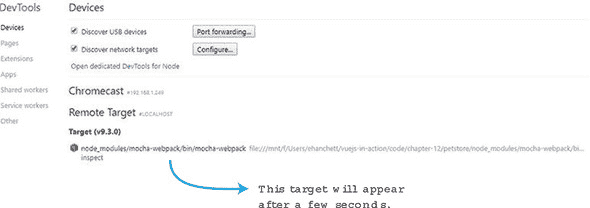

几秒钟后，你应该在底部看到一个目标和显示“检查”的链接。点击“检查”按钮，将打开一个单独的窗口。检查器窗口以暂停状态开始。点击箭头以启动调试器（图 12.6）。

##### 图 12.6\. Chrome 检查器窗口


调试器启动后，它将在我们代码中添加调试语句的地方停止。从这里，我们可以查看控制台，查看变量，如图 12.7 所示。例如，如果你点击包装器，然后是 __proto__，再然后是 __proto__，你会看到所有的包装方法。

##### 图 12.7\. 显示所有包装方法的调试语句。

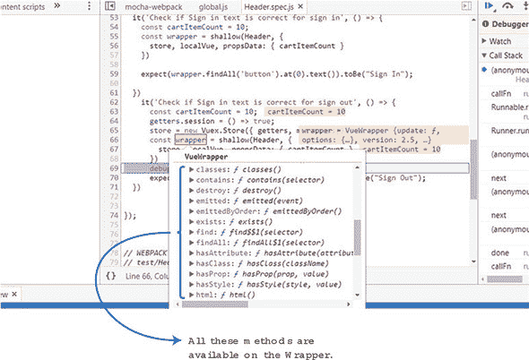

当你需要找出一个测试，并且不确定变量是什么时，请使用 Chrome 检查器。

### 练习

使用本章的知识来回答以下问题：

+   为什么测试很重要？有什么工具是为 Vue.js 设计的，可以帮助进行测试？

*请参阅附录 B 中的解决方案。*

### 摘要

+   单元测试用例测试功能的小单元。

+   编写测试可以让你测试函数并验证它们在应用程序中是否按预期工作。

+   你可以使用 Chrome 浏览器实时调试你的测试用例。
