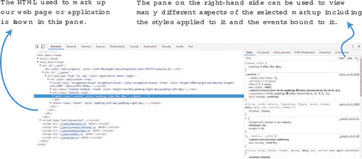
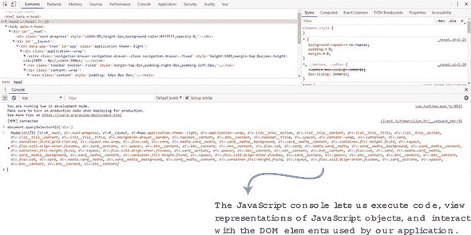
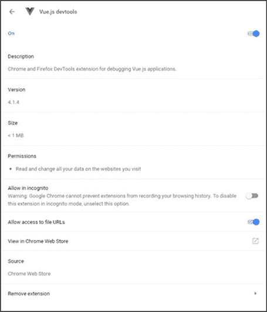
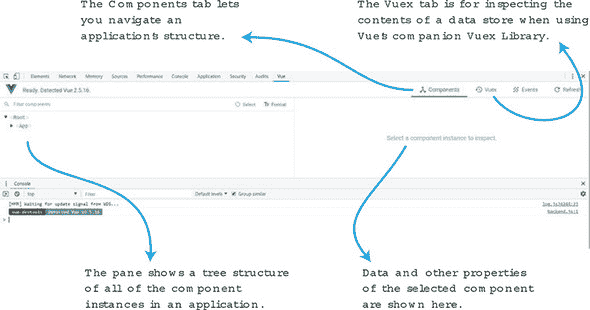
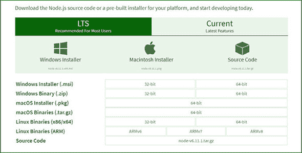

## 附录 A. 设置您的环境

没有合适的工具进行开发就像在没有手电筒的情况下探索洞穴：虽然可以完成，但整个过程都会处于黑暗中。话虽如此，如果您已经拥有本节中提到的工具或您感到舒适的替代工具，请跳到下一节。

### A.1\. Chrome 开发者工具

在这次旅程中，我们的“最佳伙伴”将是 Chrome 开发者工具。如果您还没有安装，可以访问 [`www.google.com/chrome/`](https://www.google.com/chrome/) 安装 Chrome 浏览器。您可以从浏览器的菜单中访问开发者工具，在“查看”>“开发者”>“开发者工具”下，或者通过右键点击页面并选择“检查”，如 图 A.1 所示。

##### 图 A.1\. Chrome 开发者工具面板的默认视图显示网页的 HTML 标记以及附加到所选元素的 CSS 样式。



当您检查代码时，您将最频繁地使用开发者工具中的 JavaScript 控制台。您可以通过控制台选项卡切换到它，或者直接从菜单“查看”>“开发者”>“JavaScript 控制台”打开它。

您甚至可以在开发者工具的任何其他标签页中按 ESC 键调出控制台，如 图 A.2 所示。这允许我们在用 JavaScript 操作的同时查看 HTML。

##### 图 A.2\. JavaScript 控制台允许我们检查和交互 HTML 标记以及我们的 Vue 应用的 JavaScript 代码。



### A.2\. Chrome 上的 vue-devtools

Vue 核心团队开发了一个 Chrome 扩展程序——vue-devtools，专门用于在运行时检查 Vue 应用程序。

您可以通过访问 [`mng.bz/RpuC`](http://mng.bz/RpuC) 从 Chrome 网上应用店安装 vue-devtools 扩展程序。对于喜欢冒险的人来说，可以从位于 [`github.com/vuejs/vue-devtools`](https://github.com/vuejs/vue-devtools) 的 GitHub 仓库克隆扩展程序，并对其进行代码级别的修改。

| |
| --- |

##### 安装后注意事项

在安装扩展程序后，Chrome 可能会有些挑剔。如果您打开开发者工具面板，在安装扩展程序后没有看到 Vue 选项卡，请在重启 Chrome 之前尝试打开一个新标签页或窗口。

| |
| --- |

安装扩展程序后，您需要将其启用以用于本地文件，因为我们前几章不会使用网络服务器。在 Chrome 中，选择“窗口”>“扩展程序”，然后找到 Vue.js devtools 条目。勾选“允许访问文件 URL”复选框，您就设置完成了，如 图 A.3 所示。

##### 图 A.3\. 启用 vue-devtools 以与本地文件一起工作需要在扩展程序首选项页面更新设置。



安装扩展后，我们可以看到应用程序使用的数据，从应用程序中隔离特定组件，甚至可以进行时间旅行！它允许我们回放应用程序中之前发生的活动，至少是如此。图 A.4 展示了扩展的所有部分。

##### Figure A.4\. vue-devtools 扩展让我们能够实时探索我们的 Vue 应用程序。



### A.3\. 获取章节配套代码

本书源代码可以从出版商的网站下载（[www.manning.com/books/vue-js-in-action](http://www.manning.com/books/vue-js-in-action)）。章节代码可在 GitHub 上找到，网址为 [`github.com/ErikCH/VuejsInActionCode`](https://github.com/ErikCH/VuejsInActionCode)。如果你有任何问题或发现任何错误，请随时提出问题！这也是你可以找到每个章节所有图片的地方。

### A.4\. 安装 Node.js 和 npm

在这本书中，我们需要 Node.js 和 npm，这样我们就可以使用 Vue-CLI 工具，并访问数十万个模块。建议你下载当前版本或 LTS（长期支持）版本的 Node。两者都可以正常工作。

这里有一些你可以用来获取 Node（包括 npm）的方法：

+   ***Homebrew 或 MacPorts*—** 这是 Mac OS 用户的一个流行选择。

+   ***一键安装程序*—** Windows 和 Mac 都有这个选项。

+   ***使用 Linux 软件包管理系统安装*—** Yum、apt-get 或 pacman 可以用于在 Linux 环境中安装 Node。

+   ***使用 NVM 安装*—** NVM（Node 版本管理器）是一个帮助管理 Node.js 版本的脚本。它在 Windows 和 Mac 上都可用。这是一个很好的选择。

#### A.4.1\. 使用一键安装程序安装 Node.js

到目前为止，下载 Node.js 最简单的方法之一就是使用一键安装程序。请访问 [`nodejs.org/en/download`](http://nodejs.org/en/download)。选择你的 Windows 或 Mac 版本，32 位或 64 位，然后下载 Windows 的 .msi 或 Mac 的 .pkg 文件，如 图 A.5 所示。

##### Figure A.5\. 下载 Node 的主页



#### A.4.2\. 使用 NVM 安装 Node.js

NVM 是另一个优秀的选择。NVM 是一个帮助管理多个活动 Node.js 版本的脚本。你甚至不需要访问网站就可以安装 Node.js。该脚本将你下载的每个 Node 版本分开。我推荐大多数初学者使用这个方法，尽管你需要了解如何使用命令行。你可以在 [`github.com/creationix/nvm`](https://github.com/creationix/nvm) 找到 NVM。Windows 版本可以在 [`github.com/coreybutler/nvm-windows/releases`](https://github.com/coreybutler/nvm-windows/releases) 找到。

要在 Mac 上安装 NVM，打开命令提示符并运行以下命令：

```
$ curl -o- https://raw.githubusercontent.com/creationix/nvm/v0.33.2/install.sh
 | bash
```

这将下载最新的 NVM 版本。

要在 Windows 系统上安装 NVM，请点击 nvm-windows 发布网页上的 nvm-setup.zip 文件。解压文件并运行 nvm-setup.exe 文件。

安装 NVM 或 NVM for Windows 后，运行此命令以下载 Node.js 的最新版本。

```
$ nvm install node
```

就这样！现在你的系统上已经安装了 Node 和 npm！

#### A.4.3\. 通过 Linux 包管理器安装 Node.js

所有主要的 Linux 发行版都提供其仓库中的 Node.js 软件包。例如，在 Ubuntu 中，你可以使用 apt-get：

```
$ sudo apt-get install nodejs
```

在 Fedora 中，你可以使用 yum：

```
$ yum install nodejs
```

你需要咨询你的 Linux 发行版，以了解更多有关如何在你的系统上安装软件包的详细信息。请注意，某些发行版可能提供可供下载的过时版本的 Node.js。在这种情况下，你可能更适合使用 NVM 或从官方网站下载 Node.js。

#### A.4.4\. 使用 MacPorts 或 Homebrew 安装 Node.js

Macports 和 Homebrew 是 Mac 的包管理系统。要下载 Node.js，你首先需要安装 Macports 或 Homebrew。你可以在 [`brew.sh`](http://brew.sh) 上找到有关如何安装 Homebrew 的最新信息，以及 [www.macports.org](http://www.macports.org) 上的 Macports。

在你的 Mac 上安装了这些包管理器之一后，你可以运行以下命令来安装 Node。

对于 Homebrew:

```
$ brew install node
```

对于 MacPorts:

```
$ sudo port install nodejs
```

安装完成后，你应该可以正常使用了！

#### A.4.5\. 验证 Node 是否已安装

要测试 Node.js 的安装，请运行 `-v` 命令：

```
$ node -v
$ npm -v
```

这些命令将显示当前安装的 Node 和 NPM 版本。截至本书编写时，最新的 LTS 版本是 6.11，最新的当前版本是 8.2.1。

### A.5\. 安装 Vue-CLI

在安装 Vue-CLI 之前，请确保你已经安装了至少 Node.js >= 4.6，6.x 更佳，npm 版本 3+，以及 Git。在 第十一章 中，我们使用 Nuxt.js。在这种情况下，请确保 Node.js >= 8.0。Vue-CLI 两种方式都可以正常工作。按照之前的说明安装 Node。要安装 Git，请遵循官方 Git 网站上的说明 [`mng.bz/D7zz`](http://mng.bz/D7zz)。

安装所有先决条件后，打开终端并运行此命令：

```
$ npm install -g vue-cli
```

在 Vue-CLI 中运行命令很简单。输入 `vue-cli init` *`template name`* 然后项目名称，如下所示：

```
$ vue init <template-name> <project-name>
$ vue init webpack my-project
```

应该就是这样了。

注意，截至本书编写时，Vue-CLI 2.9.2 是最新版本。Vue-CLI 3.0 的新版本仍在测试中。有关如何安装和使用 Vue-CLI 3.0 的信息，请遵循官方指南 [`mng.bz/5t1C`](http://mng.bz/5t1C)。
