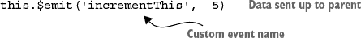
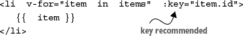
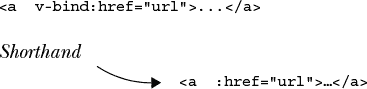
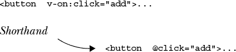

## 附录 B. 章节练习题解答

第二章–第十二章中的练习题解答在此列出。

### 第二章

+   **在第 2.4 节（kindle_split_012.html#ch02lev1sec4）中，我们创建了一个价格过滤器。你能想到其他可能有用的过滤器吗？**

Vue.js 中的过滤器通常用于进行文本过滤。你可能想要添加的一个过滤器是用于将产品标题大写的功能。

### 第三章

+   **在本章早期，我们探讨了计算属性和方法。它们有什么区别？**

计算属性在你试图推导一个值时很有用。当其任何底层值更新时，值将自动更新。它也被缓存，以避免重复计算不需要重新计算的值，例如在循环中。请注意，方法是与 Vue 实例绑定的函数。它们仅在显式调用时评估。与计算属性不同，方法接受参数。计算属性不能。方法在需要任何 JavaScript 函数的相同情况下很有用。一个没有支持强大用户交互的应用程序是无效的。

### 第四章

+   **双向数据绑定是如何工作的？你应该在 Vue.js 应用中何时使用它？**

简而言之，双向数据绑定在模型更新视图，以及视图更新模型时工作。在处理表单和输入时，应在整个应用中使用双向数据绑定。

### 第五章

+   **`v-for` 范围是什么？它与普通的 `v-for` 有何不同？**

`v-for` 指令用于根据数组渲染一系列项目。通常它的格式是 `item in items`，其中 `item` 是源数组，`item` 是正在迭代的元素的别名。`v-for` 也可以用作格式为 `item in (number)` 的范围。在这种情况下，它将重复模板那么多次。

### 第六章

+   **如何从父组件传递信息到子组件？你用什么从子组件将信息传递回父组件？**

从父组件传递信息到子组件的典型方式是使用 props。Props 必须在子组件内部显式设置。要从子组件传递信息到父组件，你可以使用 `$emit(eventName)`。值得注意的是，稍后我们将探讨其他在组件间传递信息的方法，包括使用数据存储。

### 第七章

+   **请列举两种在不同路由间导航的方法。**

要在不同路由间导航，你可以使用两种不同的方法。在模板内部，你可以添加一个 router-link 元素。或者，在 Vue 实例内部，你可以使用 `this.$router.push`。

### 第八章

+   **动画和过渡有什么区别？**

过渡是从一个状态移动到另一个状态，而动画有多个状态。

### 第九章

+   **什么是混入，何时应该使用它？**

混入是一种为组件分配可重用功能的方式。你应该在看到你在组件之间反复编写相同的代码时使用混入。重复代码违反了 DRY（不要重复自己）原则，应该进行重构。混入将被“混合”到组件自己的选项中。

### 第十章

+   **与 Vue.js 应用程序的正常数据传递相比，使用 Vuex 有哪些优势？**

Vuex 使用一个中央存储来捕获应用程序的状态。这有助于我们的 Vue.js 应用以可预测的同步方式更改状态。这有助于防止当应用程序中的状态发生变化时发生意外后果。这个优势之一是它有助于将应用程序中的数据组织在一个地方。较大的 Vue.js 应用程序可能很繁琐。传递信息或依赖于事件总线并不理想。Vuex 通过提供一个中央存储来抽象这个问题，以保存所有信息。

### 第十一章

+   **与使用中间件相比，在您的 Nuxt 应用中使用 `asyncData` 有什么优势？**

`asyncData` 对象在页面组件加载之前被加载。它可以访问上下文对象，并在服务器端加载。它可能比使用中间件有优势，因为其结果将与页面上的数据对象合并。这比使用中间件更有优势，因为我们可能需要使用 Vuex 存储来保存数据，以便可以在页面组件内部稍后检索。

### 第十二章

+   **为什么测试很重要？有什么工具是为 Vue.js 设计的，可以帮助进行测试？**

测试应该是任何编写代码的组织的基本部分。自动化测试比手动测试快得多，且错误率更低。虽然前期成本较高，但长远来看会节省时间。Vue.js 提供了许多工具来帮助进行测试。其中最重要的就是 vue-test-utils 库。这将帮助我们正确测试我们的 Vue.js 应用程序。

### 快速参考

#### 组件信息

```
Vue.component('my-component',  {
   props:  {     *The parameters the component accepts*
      myMessage:  String,
      product:   Object,
      email:  {
         type:  String,
         required:  true,
         default:  "test@test.com"
         validator:  function  (value)  {
            *Return true or false*
         }
      }
   },
   data:  function()  {      *Must be a function*
      return  {
         firstName:  'Vue' ,
         lastName:  'Info'
      }
   },
   methods:  {  ...  }
   computed:  (       *Return values cached until*
      fullName:  function  ()  { *dependencies change*
         return  this.firstName  +  '  '  +  this.lastName
      }
   }
   watch:  {        *Called when firstName changes value*
      firstName:  function  (value,  oldValue)  {  ..  }
   },
   components:  { *components that can be used in the template*
      ButtonComponent,  IconComponent
   },
   template:  ' <span>{{  myMessage  }}</span>',
})            *Can also use backticks for multiline*
```

### 自定义事件

使用 props 将数据传递到子组件，并使用自定义事件将数据传递到父元素。

在组件及其父组件内设置监听器：

```
<button-counter  v-on:incrementThis="incVal">
```

在父组件内部：

```
methods:  (
   incVal:  function  (toAdd)  { . . . }
}
```

在 button-counter 内部：



### 生命周期钩子

```
beforeCreate     beforeUpdate
created          updated
beforeMount      beforeDestroy
mounted          destroyed
```

#### 使用单个槽

组件模板：

```
<div>
   <h2>I'm a title</h2>
      <slot>
         //Only displayed if no content
      </slot>
   </div>
```

使用具有数据槽的组件：

```
<my-component>
   <p>This will go in the slot</p>
</my-component>
```

#### 多个槽

组件模板：

```
<div  class="container">
   <header>
      <slot  name="header"></slot>
   </header>
   <main>
      <slot>Default content is here</slot>
   </main>
   <footer>
      <slot name="footer"></slot>
   </footer>
</div>
```

使用具有数据槽的组件：

```
<app-layout>
<h1  slot="header">Page title</h1>
<p>the main content.</p>
<p  slot="footer">Contact info</p>
</app-layout>
```

### 快速参考

#### 表达式

```
<div  id="app">
   <p>I have a {{  widget  }}</p>
   <p>{{  widget +  's'  }}</p>
   <p>{{  isWorking  ?  'YES'  :  'NO'  }}</p>
   <p>{{  widget.getSalePrice()  }}</p>
</div>
```

#### 指令

根据真值插入/删除元素：

```
<p  v-if="inStock">{{  widget  }}</p>
<p  v-else-if="onOrder">. . .</p>
<h1  v-else>. . .</h1>
```

使用元素的显示 CSS 属性：

```
<h1  v-show="ok">Hello World!</h1>
```

双向数据绑定：

```
<input  v-model="firstName"  />

v-model.lazy=". . ."      *Syncs input after change*
v-model.number=". . ."    *Always returns a number*
v-model.trim=". . ."      *Removes whitespace*
```

#### 列表渲染



要访问数组中的位置：

```
<li  v-for="(item,  index)  in items">. . .
```

要遍历对象：

```
<li  v-for="(value,  key)  in object">. . .
```

使用 `v-for` 与组件：

```
<my-item  v-for="item in products"
    :products="item"  :key="item.id">
```

#### 绑定



真或假将添加或删除属性：

```
<button  :disabled="isButtonDisabled">...
```

如果 `isActive` 为真值，则类 `active` 将出现：

```
<div  :class="{  active:  isActive  }">. . .
```

风格颜色设置为 `activeColor` 的值：

```
<div  :style="{  color:  activeColor  }">
```

#### 动作/事件

点击后在组件上调用 `add` 方法：



可以传递参数。

```
<button  @click="add (widget)">. . .
```

为了防止页面重新加载...

```
<form  @submit.prevent="add">. . .
```

...仅触发一次：

```
. . .

.stop        *Stop all event propagation*

.self        *Only trigger if event.target is element itself.*
```

键盘输入示例：

```
<input  @keyup.enter="submit">
```
