# 第一章  了解 HTML 和 CSS

**本章涵盖**

+   查看 HTML 和 CSS 的基础知识

+   介绍网页设计游乐场

+   学习如何构建 HTML 标签和 CSS 属性

当爵士乐手创作即兴作品时，无论多么复杂，她都是通过使用七个音符（A 到 G）的组合来演奏的。当艺术家创作一幅画时，无论多么详细，他都是通过使用三种原色（红色、黄色和蓝色）的组合来绘制的。当诗人创作诗歌时，无论多么有创意，他们都是通过使用字母表的 26 个字母的组合来书写的。这些例子表明，创造力和游戏并不需要复杂的资源或复杂的原材料。想象力和好奇心加上一些构建块就足以让你在几乎任何艺术中表达自己，包括网页设计艺术。正如你在本章和整本书中学到的，HTML 和 CSS 提供了这些构建块。尽管这些块比音符、原色甚至字母表的字母要多，但并不多，但足以让你在令人兴奋的现代画布上表达自己：网络。

## 什么是 HTML？

HTML 最困难的事情莫过于它的名字。*HTML*代表*超文本标记语言*，听起来就像税务审计一样令人畏惧。但当你分解其术语时，它就会变得不那么令人畏惧。

我将从*超文本*开始。正如你肯定知道的，*链接*是一个特殊的单词或短语（甚至是一个图像），它位于网页中，指向另一个网页。当你点击这些链接之一时，你的浏览器会立即将你传输到另一个页面。发明网络的人使用这个古怪的术语*超文本链接*来指代这种特殊的文本。（前缀*hyper*意味着*超越*。）因为这些超文本链接是网络的显著特征，所以页面通常被称为超文本文档。所以*HTML*中包含*超文本*，因为你可以用它来创建这些超文本文档。（称这种语言为 WPML，或网页标记语言，也是同样准确的。）

我的词典将*标记*定义为（在许多其他事物中）“在即将排版的手稿上写下的详细风格说明。”为了本章的目的，我可以将这个定义重新表述如下：“在即将发布到万维网上的文本文档中键入的详细风格说明。”这就是 HTML 的本质。它包含一些简单的字母代码——称为*标签*——用于详细说明如何将文本组织成段落、创建项目符号列表、插入图像，以及（当然）定义链接。你将这些标签键入普通文本文档的适当位置，然后网络浏览器处理将标签翻译或*渲染*的脏活。结果？你的页面会自动以你想要的方式显示。

“语言”这个词可能是最令人畏惧的，因为它似乎暗示 HTML 是一种编程语言。幸运的是，你可以放心，HTML 与计算机编程无关。相反，HTML 是一种“语言”，因为它有一小部分单词，你使用这些单词来指定你希望文本如何显示——例如，作为标题或编号列表。

简而言之，玩转 HTML 意味着在常规文本的段落之间战略性地插入一些代码，这样你最终会得到一个真正的网页。尽管现在这可能听起来很离谱，但你将在本章结束时创建一个工作的网页，到本书结束时，你将创建几个令人印象深刻的 HTML 项目。

### 你可以用 HTML 做什么？

当你向文档添加 HTML 时，你实际上是在向网页浏览器提供一系列指令，这些指令指定了你在浏览器窗口中希望页面如何布局。你使用 HTML 以简洁的方式指定页面的整体结构，并让浏览器知道你希望页面的每一部分是什么。你使用 HTML 提供类似于以下指令的指令：

+   使用此行作为页面的主要标题。

+   将这些行视为子标题。

+   将这段文本作为一个独立的段落。

+   将这五个连续的项目转换为一个项目符号列表。

+   将这六个连续步骤转换为编号列表。

+   将这个短语设置为链接。

这些说明现在可能对你来说有点抽象，所以我将向你展示 HTML 的实际应用的一个具体例子。

### 从纯文本到 HTML：一个示例

图 1.1 显示了一个在网页浏览器中显示的纯文本文档。正如你所见，除了偶尔的换行外，浏览器显示的是一堵未格式化、未包裹的文本墙。这段文本非常难以阅读，而且由于几乎完全未区分，从文本中提取意义特别困难。

图 1.1 浏览器可以显示纯文本文件，但它们很难阅读。

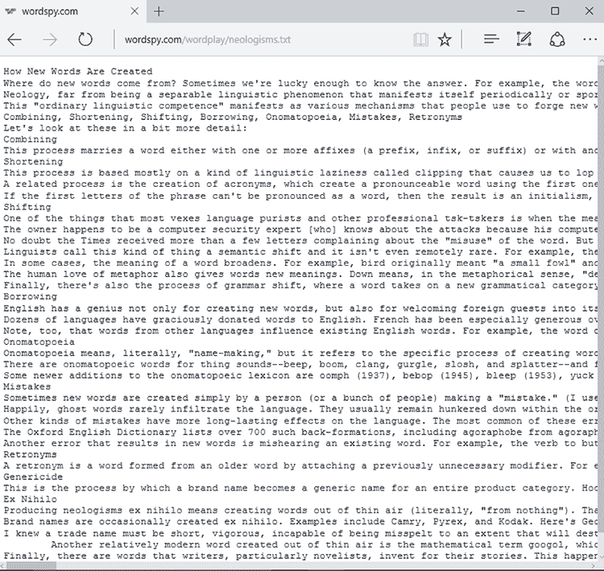

HTML 拯救了文本，不仅提供了使纯文本更易读的手段，还允许你以读者认为有意义的方式显示文本。图 1.2 展示了应用了一些 HTML 的图 1.1 中的文本。

图 1.2 应用了一些 HTML 后，图 1.1 中的文本变得更容易阅读、导航和理解。


在这里，我使用了标题来显示文章标题在顶部和接近底部的一个部分标题。注意，部分标题的字体大小略小于主要标题，这使得文章的层次结构立即清晰。我还使用了 HTML 添加了一张图片以增加视觉兴趣。为了帮助在这个页面的 HTML 中放入*H*，我将两个单词设置为链接到（在这种情况下）其他网站。虽然你会在本章稍后看到文本格式通常属于 CSS 的范畴，但你也可以使用 HTML 在你的页面上添加一些格式修饰，比如我这里添加的斜体。我还设置了一个引用，浏览器将其缩进显示为常规文本，并为该引用添加了斜体以增加区分度。最后，我使用 HTML 设置了一个项目符号列表。

现在你已经知道了 HTML 能做什么，是时候更仔细地看看你是如何告诉浏览器你想要你的页面看起来像什么的了。

## 什么是 CSS？

当你建造一栋房子时，早期的任务之一是框架，这涉及到搭建地板、墙壁和屋顶的基本结构。当你向页面添加 HTML 时，你正在做的就是这个基础框架：你指定你想要在页面上显示的内容，你想要页面的各种项目是什么（比如标题、段落或列表），以及你想要这些项目以何种顺序出现。

但正如房子没有装饰如装饰线、油漆和地板就不能成为家一样，直到你使用 CSS 添加一些收尾工作，你的文档才是一个现代网页的例子。"CSS"代表*层叠样式表*，和 HTML 一样，它的名字比它所做的事情要复杂。我会分解这些词，尽管在这个例子中，为了简单起见，我会稍微改变它们的顺序。

首先，*样式*是浏览器用来修改页面显示内容的指令。（这可以是单词、段落或特定 HTML 元素的每个实例。）这些修改通常与格式相关，例如更改字体或文本颜色，但你也可以使用样式来控制页面布局，甚至创建动画效果。如果你曾经在任何文字处理程序中使用过样式，那么你对网页样式能做什么已经有了一个很好的了解。

好吧，那么什么是*表单*？在出版的早期，公司维护着定义他们首选的字体、标题、引文等的格式的手册。这种格式被称为*房屋风格*，而手册被称为*样式表*。在网页设计中，样式表执行的是本质上相同的工作。它是一组应用于特定网页的样式。

要理解 CSS 的*层叠*部分，你需要知道，就像水流从山上流下来可以采取不同的路线到达底部一样，样式在应用到元素之前也可以采取不同的路线。一些样式来自网页浏览器；一些样式来自用户（例如，如果用户配置浏览器使用不同的默认字体大小）；还有一些样式来自你的样式表。当这些样式重叠时，网页浏览器使用一个复杂的算法来决定应用哪种样式，这个算法被称为*层叠*。

小心

层叠的概念是 CSS 中最复杂和最复杂难懂的部分。我将在本书的后面部分详细介绍（见第十九章），但到目前为止，我强烈建议你把它放在一边，直到你达到那个阶段。

你使用 CSS，换句话说，来定义你的页面看起来如何。虽然你可能认为你只使用 CSS 给页面添加“视觉糖果”，但 CSS 确实提供了工具来做出微不足道或轻浮的修改。然而，页面的外观与页面包含的内容一样重要，因为很少有人会费心去阅读格式不佳或不连贯的文本。

### 关于结构和呈现分离的注意事项

当你在尝试理解 HTML 和 CSS 之间的区别时，让我提供一个关键的区别。虽然我有些夸张，但以下是两者的基本区别：

+   HTML 定义了网页的整体结构。

+   CSS 定义了网页的视觉呈现。

这里有一些重叠（例如，HTML 可以影响页面的呈现，CSS 可以影响布局），但大部分情况下，HTML 和 CSS 分别使你能够分离结构和呈现。这种区别很重要，因为当你将网页的这两个方面分开时，你的页面将更容易构建、维护和定制。

### 你可以用 CSS 做什么？

当你在文档中添加 CSS 时，你是在告诉网页浏览器你希望特定元素看起来如何。每个样式都是对浏览器的一种格式化指令。你可以使用这些指令以多种方式，类似于以下示例：

+   将所有链接以红色文字显示。

+   所有标题使用特定的字体。

+   在这段文字周围创建一些额外的空间。

+   给这张照片添加一个阴影。

+   所有编号列表使用小写罗马数字。

+   总是在窗口的右侧显示这个文本部分。

+   将这张图纸旋转 45 度。

我将通过一个示例使这个列表更加具体。

### 从结构到呈现：一个 CSS 示例

在本章的早期，我使用了一个纯文本文档（图 1.1）并应用了一些 HTML 来给它一些结构和提高其可读性（图 1.2）。在图 1.3 中，我应用了一些样式使页面看起来更美观。

图 1.3 应用了一些样式的示例网页

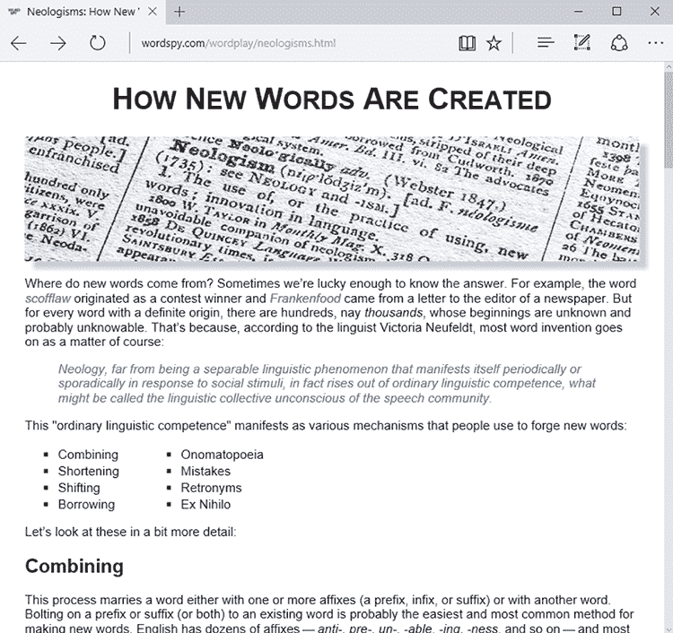

这里是我所做的主要样式更改的总结：

+   以更大的文本大小、居中和小写形式显示了标题

+   为照片添加了阴影

+   将所有文本略微缩小

+   从链接中移除了下划线

+   以浅色文本显示引用

+   将项目符号转换为两列列表

+   增加了边距

## 你不能用 HTML 和 CSS 做什么？

之前我提到过，HTML 不是一种编程语言，因此学习它并部署到你的网页上相对简单，这是个好消息。坏消息是，HTML 无法处理许多高级操作，因为它不是一种编程语言。仅使用 HTML 无法完成的事情列表相当长，但我会提到以下内容，因为其中之一可能在你待办事项列表中：

+   从服务器数据库或其他远程地址获取数据

+   处理通过表单提交的数据

+   处理用户账户、登录和密码

+   在线添加、隐藏或删除网页元素

执行这些任务需要像 JavaScript 或 PHP 这样的编程语言，这些内容超出了本书的范围。

## HTML 和 CSS 如何创建网络

关于网络最非凡的事实之一是（除了图像、视频和声音等额外功能之外），其页面仅由文本组成。没错——你上网时看到的几乎所有内容都是由键盘上可以敲击的字母、数字和符号组合而成的。

这个想法至少是神秘的，所以我会快速给你看看它是如何工作的。图 1.4 显示了这个过程。

以下步骤详细说明了这个过程：

1.  你使用文本编辑器或类似软件创建你的 HTML 和 CSS 文件。

1.  你将 HTML 和 CSS 文件上传到名为“网络托管服务提供商”的在线服务，该服务运行网页服务器。

    当你注册账户时，托管服务商会为你分配一个唯一的地址，例如 www.yourdomain.com。因此，如果你上传一个名为 index.html 的文件，该页面的地址就是 www.yourdomain.com/index.html。

1.  网站访客使用她的网络浏览器输入你页面的地址。

1.  网络浏览器使用该地址从网络服务器请求你的页面。

1.  确认地址无误后，网页服务器将页面发送到用户的网络浏览器。

1.  网络浏览器通过称为“渲染”的过程解释页面 HTML 标签和 CSS 属性，渲染后的代码出现在用户的设备上。

图 1.4 要从 HTML 和 CSS 生成网页，你需要将代码发送到网页服务器，访客使用他们的网络浏览器检索并渲染你的代码为页面。

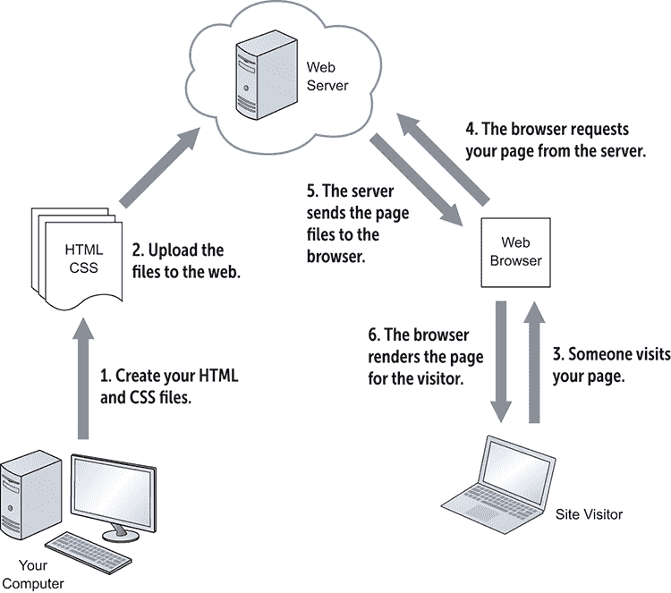

如您所见，虽然网络由简单的东西组成，但这并不意味着将这些东西放到网络上是一件简单的事情。实际上，这个过程有点复杂，尤其是在您刚开始的时候。这就是为什么我把附录 A 专门用于这个过程。

## 介绍网页设计游乐场

然而，目前您可能迫不及待地想要开始玩转 HTML 和 CSS，看看这些迷人的技术能做什么。我不怪您。本书的核心思想之一是，学习 HTML 和 CSS 的最佳方式是通过乐趣来玩转您的新知识，尝试不同的标签和属性，以及尝试不同的值。为了帮助您以最少的麻烦完成所有这些，我创建了一个名为网页设计游乐场的在线工具，如图 1.5 所示，您可以通过 https://webdesignplayground.io/访问它。

图 1.5 网页设计游乐场让您在线玩转 HTML 和 CSS。

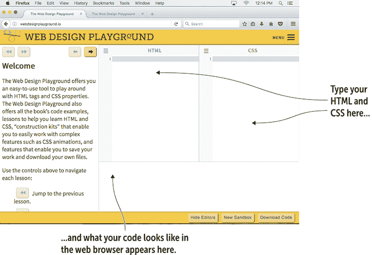

您可以使用此网站尝试 HTML 标签和 CSS 属性，加载书中的示例文件，学习帮助您学习主题的课程，访问各种“构建工具包”进行功能实验，保存您的作品，甚至将生成的文件下载到您的计算机上。接下来的几节将提供详细信息。

### 玩转 HTML 和 CSS

网页设计游乐场的主要目的是提供一个易于使用的工具，让您可以玩转 HTML 标签和 CSS 属性。以下是它的工作原理：

1.  在网页设计游乐场中，使用 HTML 编辑器输入您想要尝试的 HTML 标签。

    如果一个标签需要一个或多个属性，请确保也添加它们。

1.  使用 CSS 编辑器输入您想要使用的 CSS 属性定义。

1.  查看结果框，它将显示您的 HTML 和 CSS 在网页浏览器中的样子。

1.  重复步骤 1-3 以修复任何问题或进行进一步实验。

### 加载课程文件

本书包含大量的 HTML 和 CSS 代码。一般来说，如果您亲手输入示例（这给您一种我所说的“指尖感觉”），您将更深入地学习这些主题。然而，我理解您可能是一个忙碌的人，可能没有时间逐个输入每个示例。为了帮助您，网页设计游乐场包含一个菜单，链接到书中的每个课程。当您选择一个课程时，您将看到一个介绍，然后是一个或多个示例，接着是一个或多个帮助您学习课程材料的活动。在每种情况下，代码都会自动出现，您可以根据需要对其进行操作。

按照以下步骤加载课程：

1.  在网页设计游乐场中，点击工具栏右端的菜单。出现一个包含网站链接的菜单。

    书籍课程部分包含书中每个章节的项目。

1.  点击包含您所需课程的章节。

1.  在出现的子菜单中，点击您想要玩的课程。

    出现课程介绍。

1.  点击下一页按钮。

    例子中的 HTML 标签和文本显示在 HTML 编辑器中，而例子中的 CSS 代码显示在 CSS 编辑器中。

1.  点击下一页以完成本课的活动。

1.  要跳转到同一章节中的另一个课程，请点击上一页和下一页按钮上方的下拉菜单，然后点击你想要查看的课程。

### 保存你的工作

你将在 Web 设计沙盒中花费大部分时间进行实验和尝试本书的练习。然而，偶尔你也会创建一些想要保存的代码。Web 设计沙盒为你提供了两种方法来做这件事：

+   *复制一些代码。* 要在其他地方使用代码，请使用 HTML 编辑器或 CSS 编辑器选择你想要复制的代码；点击编辑器的菜单图标；然后点击复制到剪贴板。

+   *下载你的工作。* 点击菜单，然后在沙盒标题下方点击下载代码。此命令保存 HTML 和 CSS 的单独文件，这些文件存储在一个压缩归档中，并下载到你的网络浏览器默认下载文件夹中。

现在你已经知道了 HTML 和 CSS 能做什么，以及如何使用 Web 设计沙盒，你就可以准备使用沙盒来理解如何使用 HTML 标签和 CSS 属性了。

## 第 1.1 课：介绍 HTML 标签

覆盖内容：HTML 标签

在线：[wdpg.io/1-1-0](http://wdpg.io/1-1-0)

Play

本章中此处和其它地方出现的地址指的是 Web 设计沙盒中的位置，本书的配套在线网站。请参阅本章前面的“介绍 Web 设计沙盒”。

HTML 通过称为*标签*的简短代码施展魔法。每个标签由三个部分组成：

+   一个打开的左尖括号（`<`），也称为*小于号*。

+   你想要使用的元素名称。元素名称是短数字字母代码，例如`p`用于段落，`em`用于强调，`h1`用于一级标题。

+   一个闭合的右尖括号（`>`），也称为*大于号*。

Master

在本书中，我使用“元素”一词来指代 HTML 的特定项，例如`p`或`em`，而使用“标签”一词来指代元素及其周围的尖括号，例如`<p>`或`<em>`。

图 1.6 典型 HTML 标签的结构

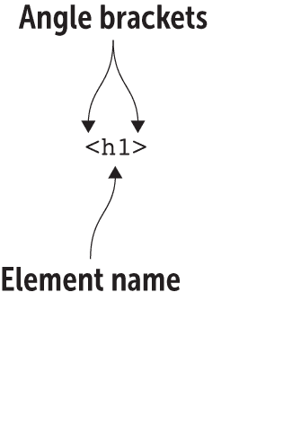

在大多数情况下，标签告诉浏览器根据你指定的元素开始布局页面。例如，如果你添加了`<em>`标签，你就是在告诉浏览器以下文本以斜体显示。（em 是*强调*的缩写。）你还得告诉浏览器何时停止使用该元素显示文本，因此你需要添加一个称为*闭合标签*的伴侣。（原始标签是*打开标签*。）闭合标签与打开标签相同，只是在元素名称之前需要有一个正斜杠。闭合标签由以下四个部分组成：

+   一个打开的左尖括号（`<`），也称为*小于号*。

+   一个正斜杠（`/`）

+   元素的名称

+   一个闭合的右尖括号（`>`）

图 1.7 显示了 `h1` 元素的闭标签。

图 1.7 `h1` 元素的闭标签结构

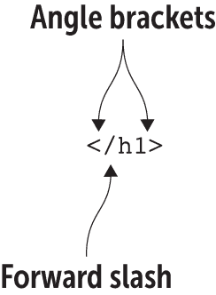

一起，开标签和闭标签创建了一个容器，你可以向其中添加一些文本（甚至其他元素）；浏览器根据你在标签中指定的元素来显示文本。在本章前面的 图 1.1 中，文本 *How New Words Are Created* 出现在文件顶部。要将该文本转换为如图 图 1.2 所示的文章主标题，我应用了 `<h1>` 标签，该标签将文本显示为一级标题。以下示例显示了我是如何做到这一点的。

精通

尽管大多数 HTML 元素都有开标签和闭标签，但并非所有元素都有。例如，用于插入图像的元素（见第六章）不需要闭标签。这些标签被称为 *自闭合标签*。

#### 示例

在线：[wdpg.io/1-1-1](http://wdpg.io/1-1-1)

此示例使用 `h1` 元素将文本 *How New Words Are Created* 转换为一级标题。

#### 网页

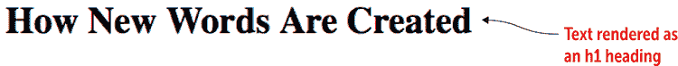

#### HTML

```
<h1>How New Words Are Created</h1>    ①    ②    ③ 

```

① 开标签

② 受影响的文本

③ 闭标签

通过添加几个字符，你告诉浏览器对文本执行一系列操作：

+   将文本显示在其自己的段落中。

+   在文本上方和下方添加一些垂直空间。

+   将文本格式化为粗体。

+   将文本格式得比常规页面文本大，以清楚地表明文本是标题。

你可以在第二章中了解更多关于标题的内容，但你可以看到，这个看似简单的代码让你在不费太多功夫的情况下做很多事情。这就是 HTML 的魔力。

游戏

图 1.1 中的文本有多个单词段落，这些段落旨在作为标题。例如，第 7 行包含文本 *Combining*。根据你关于将一级标题应用于文章标题所学的知识，将 *Combining* 文本应用为二级标题。在线：[wdpg.io/1-1-3](http://wdpg.io/1-1-3)

## 添加 HTML 标签属性

许多 HTML 元素不需要任何装饰：你只需将标签添加到页面中，浏览器就会完成其余工作。然而，一些标签在浏览器正确处理之前需要额外的信息。例如，使用 `` 标签将图片插入网页，但你需要告诉浏览器图片的位置。同样，要创建链接，你使用 `<a>` 标签，但再次，浏览器需要更多信息。在这种情况下，它需要知道 *你想要链接什么*（例如，另一个网站的地址）。

你通过向标签添加一个或多个属性来向浏览器提供这些和类似的其他数据。*属性* 是一个键值对，其中键告诉浏览器特定的属性，值分配给它你想要使用的特定设置。

当你编写链接时，例如，你通过添加`href`属性并将其值设置为你要使用的地址来指定链接地址。图 1.8 展示了示例。

图 1.8 你可以使用属性为某些 HTML 元素指定额外的数据，例如为`<a>`标签指定链接地址。

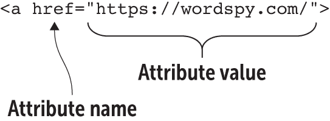

在这里，`href`（代表*超文本引用*）属性被分配了值`https://wordspy.com/`，这是用户点击此链接将被带到的地址。请注意，属性值被双引号包围。这些引号是可选的，但使用它们可以使你的代码更容易阅读和维护。

记住

虽然技术上允许你在 HTML 元素名称和属性名称中混合使用小写和大写字母，但我强烈建议只使用小写字母。在网页设计中，全部小写是规范，因为它更容易输入和阅读。你还应该使用小写字母来指定属性值，除非特定的值需要大写，例如在文件名或地址中。

当与属性结合使用时，HTML 可以做一些有用且强大的事情。但 HTML 并不是你唯一可以玩耍的网页工具。在许多方面，CSS 比 HTML 更强大、更有趣，你将在下一节开始学习它是如何工作的。

## 第 1.2 课：介绍 CSS 属性

覆盖内容：CSS 属性

在线：[wdpg.io.com/1-2-0/](http://wdpg.io.com/1-2-0/)

CSS 由称为*属性*的大量项目组成，它们控制着页面的一些方面，如文本颜色、字体大小以及围绕对象的边距。对于你想要使用的每个属性，你分配一个值，这个属性值对（也称为*声明*）是浏览器执行的指令。

你有多种定义样式的途径，正如你在第七章中看到的。现在，我将介绍两种最常见的方法。图 1.9 展示了第一种方法的一般形式。

图 1.9 定义 CSS 属性时要使用的语法

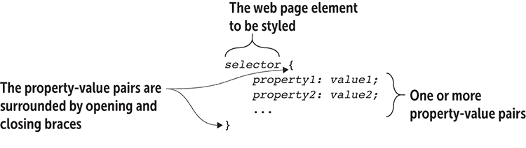

从图 1.9 中，你可以看到定义样式由以下五个部分组成：

+   指向你想要应用样式的网页元素或元素的引用。这个引用被称为*选择器*，因为你可以用它来选择你想要浏览器样式化的页面元素。

+   一个开头的左大括号（`{`）。

+   你想要应用属性的名称。属性名称是短字母代码，例如`color`用于文本颜色，`font-size`用于文本大小，以及`margin`用于边距大小。属性名称总是后面跟着一个冒号（`:`）和一个空格以提高可读性。

+   你想要分配给属性的值，以及如果需要的话，你想要使用的单位。例如，要指定像素大小的文本大小，你可以在值中添加`px`。值总是后面跟着一个分号（`;`）。

+   一个闭合的右大括号（`}`）。

这五个部分合在一起构成了一个样式*规则*。以下示例显示了用于告诉浏览器为主标题（`h1`）设置字体大小的样式规则。

#### 示例

在线：[wdpg.io/1-2-1](http://wdpg.io/1-2-1)

此示例使用 CSS 将`font-size`属性应用于`h1`元素。

#### 网页

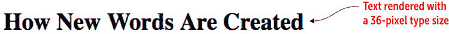

#### CSS

```
h1 {    ① 
 font-size: 36px;    ② 
}    ③ 

```

①  你想要样式的元素和开括号

②  样式属性及其值

③  闭括号

#### HTML

```
<h1>How New Words Are Created</h1>

```

样式首先引用了`h1`HTML 元素，这告诉浏览器将以下内容应用于当前网页中的每个`<h1>`标签。在开括号（`{`）之后，下一行指定了属性值对：`font-size: 36px;`。这一行指示浏览器将每个`h1`文本实例以 36 像素的字体大小显示。最后，闭括号（`}`）完成了样式规则。

播放

你会如何格式化网页的第二级标题，使其字体大小为 30 像素？在线：[wdpg.io/1-2-2](http://wdpg.io/1-2-2)

在这里，你看到了使用样式的一个巨大优点。如果你的页面有十几个`h1`标题，这个规则将适用于它们所有，这会给页面带来一致的外观。更好的是，如果你认为标题的`48px`大小看起来更漂亮，你只需在样式规则中更改一次值，这个更改就会自动反映在所有的`h1`标题中。

注意，你的样式定义中不限于单个声明。正如以下示例所示，你可以根据需要添加多个声明。

#### 示例

在线：[wdpg.io/1-2-3](http://wdpg.io/1-2-3)

此示例在单个 CSS 定义中指定了多个属性。

#### 网页

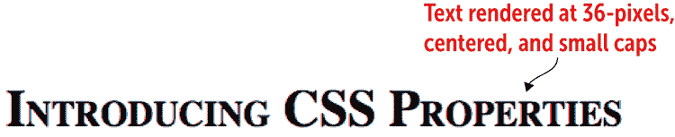

#### CSS

```
h1 {
    font-size: 36px;     
 text-align: center;    ① 
 font-variant: small-caps;    ② 
}    ③ 

```

①  此属性使标题居中。

②  此属性显示标题为小写字母形式。

③  闭括号

#### HTML

```
<h1>How New Words Are Created</h1>

```

在这里，我添加了声明 `text-align: center;` 来使标题居中，以及 `font-variant: small-caps;` 来以小写字母形式显示标题。

精通

在本节的示例中，我使用了四个空格来缩进声明。这种缩进不是必需的，但它使 CSS 更容易阅读，所以养成缩进属性的好习惯是个好主意。

我之前提到，你还有另一种指定样式的途径。你可以通过使用`style`属性直接将声明插入到 HTML 元素中：

```
<*element* style="*property1*: *value1*; *property2*: *value2*; etc.">

```

这里有一个例子：

```
<h1 style="font-size: 36px; text-align: center">

```

当你使用这种方法时，你的样式只应用于声明它们的 HTML 元素。我在第七章中详细介绍了这种方法。

CSS 比 HTML 稍微复杂一些，但随之而来的复杂性带来了巨大的力量和表现力。正如你在本书的其余部分所看到的，CSS 是创建出色、有趣的网页的皇家道路。

播放

你会如何格式化网页的第二级标题，使其字体大小为 30 像素并右对齐？在线：[wdpg.io/1-2-4](http://wdpg.io/1-2-4)

当您的 HTML 结构装饰了 CSS 格式时，您可以创建既美观又便于阅读和导航的网页。

## 游乐场的一些有用功能

现在您已经知道了 HTML 标签和 CSS 属性的外观，您可以返回 Web 设计游乐场并运行一些旨在帮助您正确输入标签和属性的功能：

+   HTML 标签和 CSS 属性名称及值以与常规文本不同的颜色显示。这些颜色帮助您区分代码和非代码。

+   在 HTML 框中，当文本光标位于一个标签内时，编辑器会自动突出显示该标签及其配对标签。在图 1.10 中，您可以看到当我将光标放在开标签`<p>`（这是创建段落的标签——见第二章）上时，编辑器会突出显示该标签以及其闭合标签`</p>`。这种突出显示为您提供了一个视觉指示，表明您已经正确关闭了标签。

图 1.10 当光标位于 Web 设计游乐场的 HTML 编辑器中的一个标签内时，编辑器会突出显示开闭标签。

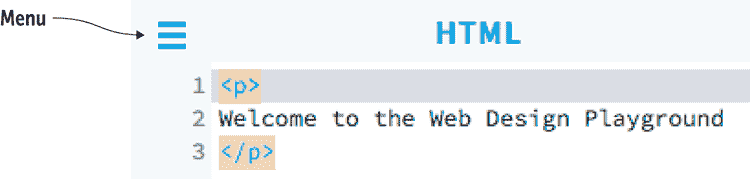

+   CSS 编辑器具有类似的功能：当光标立即位于花括号的左侧或右侧时，编辑器会突出显示配对的花括号。这种突出显示有助于您在定义样式时确保输入开闭花括号。

+   您可以通过拖动分隔编辑器的垂直边框来调整编辑器的相对大小。

+   如果您点击编辑器的菜单图标（如图 1.10 中的所示）然后点击显示错误，Web 设计游乐场可以执行一定程度的错误检查。如果编辑器检测到错误，您会在有问题的行左侧的页边距看到红色错误指示器。将鼠标指针悬停在图标上会显示错误信息。例如，如果您在闭合标签中忘记斜杠，您会看到错误`标签必须成对`，如图 1.11 所示。

图 1.11 如果 Web 设计游乐场检测到问题，代码左侧的页边距将出现错误图标，并将鼠标悬停在图标上会显示错误信息。

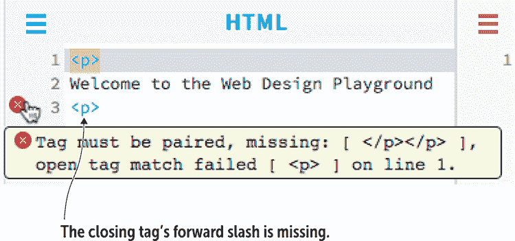

## 摘要

+   HTML 定义了您网页的结构，而 CSS 定义了其展示。

+   *HTML 标签* 是由尖括号包围的简短代码，例如`<h1>`或`<p>`，它应用效果或插入对象。大多数标签还需要一个闭合标签，例如`</h1>`或`</p>`。

+   *CSS 属性* 是一个名称-值对，CSS 定义（或规则）是一组或多个属性，这些属性用花括号（`{`和`}`）包围并应用于指定的元素（如标签名）。

+   要查看本书的教程并尝试 HTML 和 CSS 代码，请使用本书的配套网站，Web 设计游乐场：https://webdesignplayground.io/。
