# 第二章  构建您的第一个网页

> 无论你能做什么，或者梦想你能做什么，开始去做吧。勇气中蕴含着天才、力量和魔力！*——威廉·哈钦森·默里*

**本章内容涵盖**

+   学习基本页面结构和元素

+   学习最常见的文本元素和样式

+   创建链接

我们必须学习的许多现代技术——无论是用微软 Excel 建立电子表格，用 Adobe Photoshop 增强图像，还是用苹果的 iTunes 维护音乐收藏——都需要我们掌握复杂的功能，这些功能充满了设置，并且界面不直观。因此，当我们遇到像 HTML 和 CSS 这样的技术时，我们感到非常高兴，这些技术没有复杂的工具、设置或界面需要理解。事实上，它们根本没有界面。它们仅仅是文本——一个由字母、数字和符号组成的简单而美好的交响乐。它们很简单，但并不简单。通过 HTML 标签和 CSS 属性，您可以构建一个反映您自己的网页，展示您的创造力，并向世界宣布：“是的，这是我建造的！”

因此，在第一章的简要介绍之后，您通过构建您的第一个网页来正确开始您的 HTML 和 CSS 教育。您学习了所有页面共有的基础结构，以及所有标准文本元素，并学习了如何添加标题和链接。如果您有话要说，在本章中，您将学习如何用 HTML 和 CSS 来表达。

## 让您的网页起飞

本书的目标是帮助您创建自己的网页，从而占据一小块个人网络空间的地盘：如果您愿意，可以说是一个远离家的主页。然而，在您能入住这个简陋的住所之前，您必须浇筑混凝土，这将为您的数字家园奠定基础。在本节中，我将向您展示一些构成所有网页基础结构的 HTML 基础知识。

## 第 2.1 节课程：奠定基本页面结构

覆盖内容：页面结构元素

在线：[wdpg.io.com/2-1-0](http://wdpg.io.com/)

您的所有网页项目，从最简单的页面到最复杂的企业网站，都始于相同的基本结构，我在列表 2.1 中概述了它。

列表 2.1 开始任何网页项目的基本 HTML 结构

```
<!DOCTYPE html>                   #1
<html lang="en">                  #2
    <head>                        #3
        <meta charset="utf-8">    #4
        <title></title>           #5
        <style></style>           #6
    </head>                       #3
    <body>                        #7
    </body>                       #7
</html>                           #2

```

精通

在这里，我使用了四个空格来缩进其他标签内的标签。这种缩进并不是严格必要的，但这是一个好主意；缩进使您的代码更容易阅读和调试，因为您可以更清楚地看到每一对开标签和闭标签。

毫无疑问，这段代码看起来可能对您来说有点令人生畏。我为这种复杂性道歉，但这是构建网页方式中固有的必要部分。幸运的是，我可以通过提供两条好消息来稍微减轻这种打击：

+   这段代码是本章中最复杂的代码，所以如果你能艰难地理解接下来的几段内容，接下来的航行将会容易得多。

+   当你在 Web 设计游乐场工作时，甚至**看不到**列表 2.1 中的代码，因为游乐场在幕后隐藏了它。（欢迎你。）

结构从顶部的 `<!DOCTYPE html>` 开始 (#1)，这一行告诉浏览器你正在使用 HTML 的哪个版本。这个声明告诉浏览器你正在使用 HTML5，这是最新版本，也是本书中你将学习的版本。结构的一部分是 `<html>` 标签及其闭合的 `</html>` 标签 (#2)，它们共同定义了页面其余部分的 HTML 和 CSS 的整体容器。`<html>` 标签包含 `lang="en"` 属性，它告诉浏览器页面的主要语言是英语。

结构的其余部分分为两个部分：标题和主体。

游戏

你可以从 Web 设计游乐场复制并粘贴基本的网页结构。在线：[wdpg.io/2-1-0](http://wdpg.io/2-1-0)

标题部分由 `<head>` 标签及其闭合的 `</head>` 标签 (#3) 定义。标题部分就像是对页面的介绍，因为网页浏览器使用标题来获取有关页面的各种类型的信息。其中一项重要数据是页面使用的字符集，这正是 `<meta>` 标签所做的事情 (#4)。你还可以使用标题部分来定义页面标题，我将在下一节中讨论。对于本书来说，最重要的是 `<style>` 标签及其闭合的 `</style>` 标签 (#6)，这是你输入样式定义的地方。

主体部分由 `<body>` 标签及其闭合的 `</body>` 标签 (#7) 定义，这部分是你将输入大多数 HTML 标签的地方。你在主体部分输入的文本和标签将显示在网页浏览器中。

记住

在 Web 设计游乐场中，我故意隐藏了诸如 `<!DOCTYPE>`、`<html>`、`<head>`、`<style>` 和 `<body>` 等元素，因为（至少在游乐场中）你不会直接与这些元素工作。当你使用 HTML 编辑器输入标签时，游乐场会在幕后将它们添加到 `<body>` 和 `</body>` 标签之间。同样，当你使用 CSS 编辑器输入样式时，游乐场会在幕后将它们添加到 `<style>` 和 `</style>` 标签之间。

## 第 2.2 课：添加标题

覆盖内容：`<title>` 标签

在线：[wdpg.io/2-2-0](http://wdpg.io/2-2-0)

你可能会想，页面标题就是出现在页面顶部的文本。然而，在 HTML 中，页面标题是出现在网页浏览器标题栏（或者如果你使用标签页浏览，是页面的标签页）上的内容，如下面的示例所示。

#### 示例

在线：[wdpg.io/2-2-0](http://wdpg.io/2-2-0)

在标题部分的 `<title>` 和 `</title>` 标签之间添加的文本将显示在网页的浏览器标签页上，如本示例所示，或者显示在浏览器的标题栏上。

#### 网页

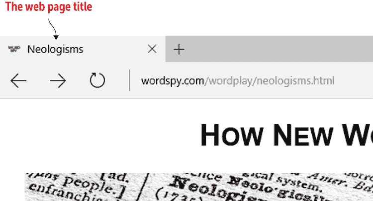

#### HTML

```
<!DOCTYPE html>
<html lang="en">
    <head>
        <meta charset="utf-8">
 <title>Neologisms</title>    ① 
        <style></style>
    </head>
    <body>
    </body>
</html>
```

①  将页面标题放置在 `<title>` 和 `</title>` 标签之间。

当你考虑为你的页面添加标题时，以下是一些需要注意的事项：

+   确保你的标题反映了页面的内容。

+   使标题相对于你的其他页面是唯一的。

+   由于较长的标题在浏览器标签页的狭窄空间中显示时往往会截断，因此请将真正描述性的一个或两个词放在标题的开头。

+   使用一个在无上下文查看时也合理的标题。真正喜欢你的页面的人可能会将其添加到书签中，浏览器会在书签列表中显示页面标题，因此当那个人稍后查看书签时，标题要有意义。

## 第 2.3 课：添加一些文本

内容：添加网页文本

在线：[wdpg.io/2-3-0](http://wdpg.io/2-)

如果你尝试加载只包含基本结构的列表 1.1 的页面，你不会在浏览器中看到任何内容。尽管浏览器在内部使用标题部分的标签，包括在浏览器当前标签页或标题栏中显示标题，但浏览器的内容区域仅显示你放置在 `<body>` 和 `</body>` 标签之间的标签和文本。

> 最终，用户访问你的网站是为了其内容。其他一切都是背景。*——雅各布·尼尔森*

在下面的示例中，我在主体部分添加了文本 `Hello HTML World!`。

#### 示例

在线：[wdpg.io/2-3-1](http://wdpg.io/2-3-1)

你在 `<body>` 和 `</body>` 标签之间添加的文本将在浏览器窗口中显示。

#### 网页

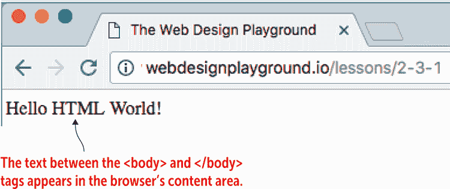

#### HTML

```
<!DOCTYPE html>
<html lang="en">
    <head>
        <meta charset="utf-8">
        <title>The Web Design Playground</title>
        <style></style>
    </head>
 <body>    ① 
 Hello HTML World!    ① 
 </body>    ① 
</html>
```

①  将页面文本放置在 `<body>` 和 `</body>` 标签之间。

在网页中添加文本时，以下是一些你应该知道的事情：

+   如果你正在 Web 设计游乐场中工作，请记住 HTML 编辑器假定你在该框中输入的内容将被插入到 `<body>` 和 `</body>` 标签之间，因此你不需要输入它们。

+   你可能认为你可以通过连接两个或更多空格来对齐内容并创建一些有趣的效果。唉，不行，那种效果不会起作用。网络浏览器的哲学是，你可以使用 HTML 标签来结构化文档，并使用 CSS 来样式化它。因此，多个空格的连续运行——称为空白字符——将被忽略。

+   制表符也属于空白字符的范畴。你可以整天输入制表符，但浏览器会忽略它们。

+   浏览器喜欢忽略的其他事情包括换行符。按 Enter 或 Return 键开始新段落听起来似乎很合理，但在 HTML 世界中并非如此。我将在下一节中更多地讨论这个话题。

+   之前我提到，网页仅由你可以用键盘敲击的字符组成。这意味着如果你需要使用不在键盘上的字符，比如版权符号或破折号，你就没有机会了吗？幸运的是，你并不孤单。HTML 有这些字符的特殊代码，我在第十六章中会讨论它们。

## 学习最常见的文本元素

对于任何网页来说，拥有优质的内容都是至关重要的，正如你在这章中看到的那样，你可以通过输入一些文本来开始创建一个网页。但内容只是开始。图 2.1 显示了仅包含文本的网页示例。

图 2.1 仅包含文本的网页

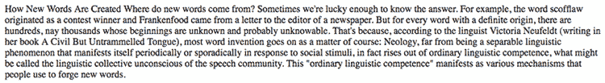

> 内容先于设计。在没有内容的情况下设计不是设计，而是装饰。*——杰弗里·泽尔达曼*

你在图 2.1 中看到的是一个没有装饰任何 HTML 元素的页面。是的，你可以阅读这个页面，但你真的想这么做吗？我不这么认为。现状下的页面基本上是不吸引人的，因为它是一堆没有区分的文本，这使得它既难以阅读又乏味。相比之下，看看图 2.2 中显示的页面的修订版。

图 2.2 在图 2.1 中添加了一些基本 HTML 文本元素的网页

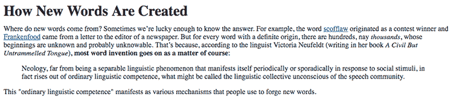

啊，这样就好多了！现在页面易于阅读，看起来也相当不错。区别在于在这个版本中，我使用了一些基本的 HTML 文本元素来重新显示文本，使其易于阅读和理解。当你阅读本章时，你会了解到我是如何做到这一点的。在下一节中，你将学习如何使用 HTML 标记文本为重要内容。

## 第 2.4 课：标记重要文本

覆盖范围：`strong`元素

在线：[wdpg.io/2-4-0](http://wdpg.io/2-4-0)

在你的网页中，你可能有一个单词、短语或句子，你想要确保读者看到，因为它很重要。这段文本可能是一个重要的指令、一个关键条件或类似的具有重大意义的段落，因为它需要从常规文本中突出显示，你不希望读者错过它。在 HTML 中，你可以通过使用`strong`元素来标记文本为重要内容：

```
<strong>*important text goes here*</strong>

```

所有浏览器都将`<strong>`和`</strong>`标签之间的文本以粗体字体显示。以下示例显示了带有粗体显示的重要段落的网页文本及其使用的 HTML 标记。

精通

所有网络浏览器为每个文本元素定义了一个默认样式，例如，使用`strong`元素标记的文本将以粗体显示。然而，你不必坚持使用浏览器样式，因为在所有情况下，你可以通过使用自己的样式来增强或覆盖默认设置。你将在第四章中深入了解这个主题。

#### 示例

在线：[wdpg.io/2-4-1](http://wdpg.io/2-4-1)

此示例使用`<strong>`标签将文本的重要段落标记为粗体。

#### 网页

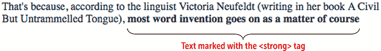

#### HTML

```
That's because, according to the linguist Victoria Neufeldt (writing in her book A Civil But Untrammelled Tongue), <strong>most word invention goes on as a matter of course</strong>    ① 

```

① 使用`<strong>`标签标记为重要的文本

游戏

要了解更多关于`strong`元素的信息，请尝试在 Web 设计游乐场上的练习。在线：[wdpg.io/2-4-2](http://wdpg.io/2-4-2)

## 第 2.5 课：格式化关键词

涵盖：`b`元素

在线：[wdpg.io/2-5-0](http://wdpg.io/2-5-0)

在某些情况下，你想要吸引对某个单词或短语的注意，并不是因为它本身很重要，而是因为相关的文本在某种角色中发挥作用，使其与常规文本不同。这种文本可能是一个产品名称、公司名称或界面元素，如与复选框或命令按钮相关的文本。再次强调，你正在处理的文本并不重要——它在某些方面是不同的——因此你希望它看起来与常规页面文本不同。

这些项目中的每一个都表示一个具有超出常规页面文本意义的（或短语），在 HTML5 中，这种语义项目使用`b`元素进行标记：

```
<b>*keyword*</b>

```

使用方法

网页关键词的其他候选包括人名（例如，出现在名人八卦专栏中的臭名昭著的“粗体名字”）以及文章的前几个单词或开头句子。

网络浏览器将`<b>`和`</b>`标签之间的文本以粗体字体显示。到现在为止，我想你可能正在挠头，想知道`strong`元素和`b`元素之间的区别，因为两者都显示为粗体文本。这是一个合理的观点，我必须承认，这种区别是微妙的。我应该说明，这是一个*语义*上的区别，因为 HTML5 使用这两个不同的元素来区分重要文本和关键词。希望在未来，屏幕阅读器和类似的无障碍辅助技术将使用这种语义差异以某种方式提醒访客，这段文本是重要的，并且这段文本是一个关键词。

以下示例显示了一些网页文本，其中关键词以粗体显示，并使用了与文本一起使用的 HTML 标记。

#### 示例

在线：[wdpg.io/2-5-1](http://wdpg.io/2-5-1)

此示例显示了一些网页文本，其中关键词由于`b`元素而以粗体显示。

#### 网页

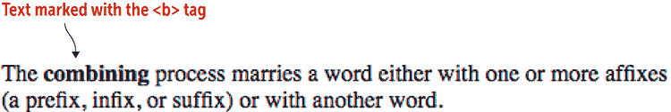

#### HTML

```
The <b>combining</b> process marries a word either with one or more affixes (a prefix, infix, or suffix) or with another word.    ①  
```

① 使用`<b>`标签标记为关键词的文本

游戏

你会如何标记一篇文章，使其导语句子显示为粗体？在线：[wdpg.io/2-5-2](http://wdpg.io/2-5-2)

## 第 2.6 课：强调文本

涵盖：`em`元素

在线：[wdpg.io/2-6-0](http://wdpg.io/2-6-0)

在页面上添加某些单词或短语的强调通常很重要。这种强调告诉读者要以额外的强调来阅读或说出这段文本。考虑以下句子：

```
Verdana is a sans-serif typeface.

```

现在用强调（以斜体表示）添加到单词*无衬线*的同一句子阅读：

```
Verdana is a *sans*-serif typeface.

```

句子的意义以及你如何阅读句子会随着强调（在这种情况下，强调 Verdana 不是衬线字体的事实）的增加而改变。

在 HTML5 中，这种类型的语义项目使用`em`（强调）元素进行标记：

```
<em>*text*</em>

```

常见问题解答

*`strong` 元素和 `em` 元素之间有什么区别？* 当问题中的文本对读者至关重要时，您使用 `strong`；当问题中的文本需要增强强调以传达观点时，您使用 `em`。

网络浏览器将 `<em>` 和 `</em>` 标签之间的文本以斜体显示。以下示例显示了一个带有斜体强调文本的网页，以及创建此效果的 HTML 标记。

#### 示例

在线：[wdpg.io/2-6-1](http://wdpg.io/2-6-1)

此示例显示了一些使用 `em` 元素强调的网页文本。

#### 网页

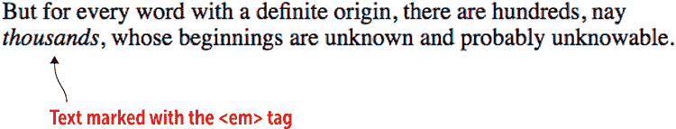

#### HTML

```
But for every word with a definite origin, there are hundreds, nay <em>thousands</em>, whose beginnings are unknown and probably unknowable.    ①  

```

① 使用 `<em>` 标签标记为强调的文本

播放

您可以在其他文本级元素内嵌文本级元素以产生额外效果。您可以通过使用 `strong` 元素将句子标记为重要，然后在句子内部，您可以使用 `em` 元素标记一个单词以强调它。在线：[wdpg.io/2-6-3](http://wdpg.io/2-6-3)

## 第 2.7 课：格式化替代文本

覆盖内容：`i` 元素

在线：[wdpg.io/2-7-0](http://wdpg.io/2-7-0)

在散文中，通常需要标记单词或短语以表明它具有与常规文本不同的声音、语气或角色。常见的替代文本例子包括书籍和电影标题。在 HTML5 中，此类语义文本使用 `i`（斜体）元素进行标记：

```
<i>*text*</i>

```

使用方法

其他替代文本的例子包括出版物名称、技术术语、外语短语以及一个人的想法。

网络浏览器将此类文本以斜体显示。`i` 元素可能看起来与 `em` 元素完全相同，但存在显著的语义差异：`em` 元素通过增加强调来增强受影响文本的强调性质，而 `i` 元素则告诉读者该文本应以不同于常规文本的方式解释。再次强调，这种细微的差异在可访问性方面可能非常有用；屏幕阅读器（至少在理论上是如此）会强调 `em` 文本，并让用户了解使用 `i` 元素标记的替代文本。

以下示例显示了一个带有斜体显示的替代文本的网页，以及执行此任务的 HTML 标记。

#### 示例

在线：[wdpg.io/2-7-1](http://wdpg.io/2-7-1)

此示例显示了一些使用 `i` 元素格式化为替代文本的书籍标题的网页文本。

#### 网页

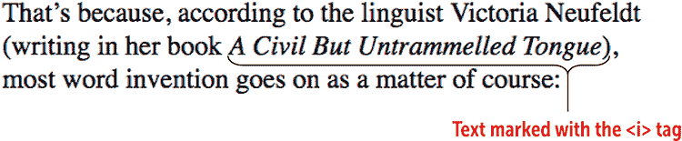

#### HTML

```
That's because, according to the linguist Victoria Neufeldt (writing in her book <i>A Civil But Untrammelled Tongue</i>), most word invention goes on as a matter of course:    ①  

```

① 使用 `<i>` 标签标记为替代文本的文本

播放

要熟悉 `i` 元素，请尝试在 Web 设计游乐场上的练习。在线：[wdpg.io/2-7-2](http://wdpg.io/2-7-2)

## 第 2.8 课：引用文本

覆盖内容：`q` 和 `blockquote` 元素

在线：[wdpg.io/2-8-0](http://wdpg.io/2-8-0)

许多网页包含来自其他作品的引用，这些作品可能是网页、人物、书籍、杂志或任何书面来源。为了确保读者不会认为引用的材料是您自己的（这可能导致剽窃指控），您应该将文本标记为引用。您如何做这取决于引用的长度。

短引用应与您的常规页面文本内联。您可以通过使用`q`元素来标记此文本作为引用：

```
<q cite=”*url*”>*quotation*</q>

```

大多数网络浏览器将以与常规页面文本相同的方式显示使用`q`元素标记的文本，但周围带有双引号。如果您的引用来自另一个网页，您可以包含可选的`cite`属性，并将其值设置为网页的 URL。

长引用应单独显示以提高可读性。您可以通过使用`blockquote`元素来标记长引用：

```
<blockquote>
*Long quotation*
</blockquote>

```

网络浏览器会将使用`blockquote`元素标记的文本显示为一个单独的段落，该段落从包含元素的左右边距略微缩进。

以下示例显示了一些网页文本，其中包括与常规文本内联的短引用和与常规文本分离的长引用，以及相应的 HTML 标记。

#### 示例

在线：[wdpg.io/2-8-1](http://wdpg.io/2-8-1)

此示例显示了一些网页文本，其中既有与常规文本内联的短引用，也有与常规文本分离的长引用。

#### 网页

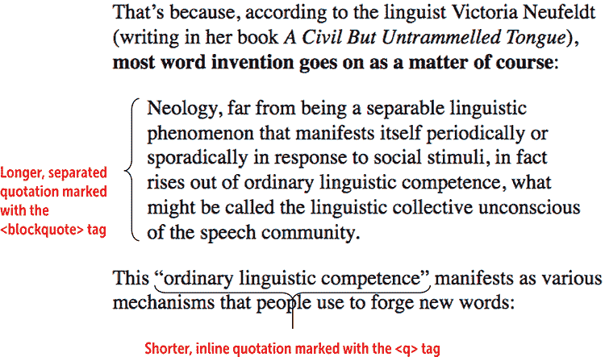

#### HTML

```
That&rsquo;s because, according to the linguist Victoria Neufeldt (writing in her book <i>A Civil But Untrammelled Tongue</i>), <strong>most word invention goes on as a matter of course</strong>:
<blockquote>    ① 
Neology, far from being a separable linguistic phenomenon that manifests itself periodically or sporadically in response to social stimuli, in fact rises out of ordinary linguistic competence, what might be called the linguistic collective unconscious of the speech community.    ① 
</blockquote>    ① 
This <q>ordinary linguistic competence</q> manifests as various mechanisms that people use to forge new words:    ②  

```

① 使用`<blockquote>`标签标记的长引用文本

② 使用`<q>`标签标记的短引用文本

游戏

要熟悉`q`和`blockquote`元素，请尝试在 Web 设计游乐场上的练习。在线：[wdpg.io/2-8-2](http://wdpg.io/2-8-2)

## 第 2.9 课：使用标题

覆盖范围：`h1`到`h6`元素

在线：[wdpg.io/2-9-0](http://wdpg.io/2-9-0)

**标题**是一个出现在文本部分之前的一个词或短语，用于命名或简要描述该文本的内容。几乎所有的网页都在页面顶部或附近有一个主要标题，作为内容的标题。（不要将这个标题与页面`<head>`部分中`<title>`和`</title>`标签之间的文本混淆。主要标题出现在页面本身中，而`title`元素内的文本只出现在浏览器标签上。）

除了标题标题外，许多网页内容被分为几个部分，每个部分都有自己的标题。这些部分可以进一步分为子部分，每个子部分再次有自己的标题，依此类推。总而言之，标题、部分标题和子部分标题形成了一个轮廓，清晰地总结了网页的结构和层次。

> 文本中穿插的精心编写的、深思熟虑的标题充当页面的非正式轮廓或目录。*——史蒂夫·克鲁格*

在 HTML 中，你通过使用各种标题元素来标记你的页面标题文本，这些元素从`h1`（代表页面最高层级的标题，通常是页面的主要标题）到`h2`（代表章节标题），`h3`（代表子章节标题），一直到`h6`（代表最低层级的标题）。网页浏览器会为每个标题显示一个独立的块，将文本格式化为粗体，并且（如以下示例所示）根据使用的元素调整文本大小：`h1`是最大的；`h6`是最小的。

#### 示例

在线：[wdpg.io/2-9-1](http://wdpg.io/2-9-1)

这个例子展示了网页浏览器如何渲染六个 HTML 标题元素。

#### 网页

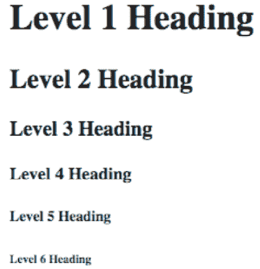

#### HTML

```
<h1>Level 1 Heading</h1>
<h2>Level 2 Heading</h2>
<h3>Level 3 Heading</h3>
<h4>Level 4 Heading</h4>
<h5>Level 5 Heading</h5>
<h6>Level 6 Heading</h6>

```

虽然 HTML5 提供了其他创建语义页面分隔的方法（见第十一章），但使用标题元素是一个简单且常见的方法，可以告诉浏览器和读者你的网页文本是如何组织的，如下面的示例所示，其中包含了你之前看到的网页的标题。

#### 示例

在线：[wdpg.io/2-9-2](http://wdpg.io/2-9-2)

这个例子展示了网页浏览器如何渲染`h1`标题元素。

#### 网页


#### HTML

```
<h1>How New Words Are Created</h1>    ① 

```

①  `<h1>` 标题

游戏

你被提供了一个带有标题、主要部分（第一部分、第二部分等）、子部分（第 1.1 部分、第 1.2 部分等）以及次子部分（第 1.1a 部分、第 1.1b 部分等）的文档。为这种结构制定一个标题方案。在线：[wdpg.io/2-9-3](http://wdpg.io/2-9-3)

## 第 2.10 课：制作链接

覆盖内容：`a`元素

在线：[wdpg.io/2-10-0](http://wdpg.io/2-10-0)

我在第一章提到，HTML（实际上，*HTML*中的*H*）的一个定义特征是*超文本*：指向你自己的网站或互联网上任何地方的网页的链接。事实上，很少有页面不包含至少几个链接，所以你需要知道如何使用 HTML 制作超文本。

你用来创建链接的 HTML 标签是`<a>`及其对应的`</a>`闭合标签。`a`元素与本章中你看到的大多数其他元素略有不同，因为你不能单独使用它。相反，你需要在其中插入链接的地址——通常称为*URL*（即*统一资源定位符*）。图 2.3 展示了这个元素是如何工作的：

图 2.3 使用`<a>`标签的语法

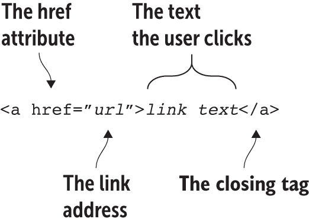

小心

使用大写或小写字母在输入 URL 时可能至关重要。在大多数（但不是所有）网站上，如果你输入目录或文件名的一个字母的大小写错误，你很可能不会到达你想要去的地方（也就是说，你会得到一个 404 未找到错误）。

常见问题解答

*`<a>` 标签中的 "a" 代表什么吗？* `a` 是 *锚点* 的缩写，这源于你可以创建称为 *锚点* 的特殊链接，这些链接可以将你的读者带到同一页面的其他部分，而不是将他们带到不同的页面。你将在第十六章中学习这一功能的工作原理。

`<a>` 标签包含 `href` 属性，代表 *超文本引用*。将此属性设置为要使用的网页的 URL，用双引号（或单引号）括起来。大多数链接地址如下所示：

+   *本地链接* ——指向你网站上的另一个页面。为了简化问题，我将假设你网站上的所有页面文件都位于同一个目录中。（对于页面文件位于多个目录的稍微复杂的情况，请参阅第十六章。）在这种情况下，`<a>` 标签的 `href` 属性值是你所链接的页面文件的名称。以下是一个示例：

    ```
    <a href="wordplay.html">

    ```

+   *远程链接* ——指向另一个网站页面的链接。在这种情况下，`<a>` 标签的 `href` 属性值是另一个网站上页面的完整 URL。以下是一个示例：

    ```
    <a href="http://wordspy.com/index.php">

    ```

接下来，你将 `*链接文本*` 替换为你想要用户点击的描述性链接文本，然后使用 `</a>` 闭合标签结束。默认情况下，大多数网络浏览器将以蓝色下划线文本显示链接，如下面的示例所示。

#### 示例

在线：[wdpg.io/2-10-1](http://wdpg.io/2-10-1)

此示例展示了使用 `a` 元素创建的两个链接的网页文本。

#### 网页

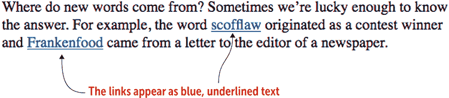

#### HTML

```
Where do new words come from? Sometimes we&rsquo;re lucky enough to know the answer. For example, the word 
<a href="http://www.etymonline.com/index.php?term=scofflaw">scofflaw</a>     ①    ②    ③  
originated as a contest winner and 
<a href="https://wordspy.com/index.php?word=frankenfood">Frankenfood</a>     ①    ②    ③  
came from a letter to the editor of a newspaper.

```

①  `<a>` 标签包含链接地址

②  浏览器显示为链接的文本

③  闭合标签

## 摘要

+   在基本的 HTML 页面结构中，标题由 `<head>` 和 `</head>` 标签定义，包括页面标题（位于 `<title>` 和 `</title>` 标签之间）和页面 CSS（位于 `<style>` 和 `</style>` 标签之间）。

+   在基本页面结构中，你需要在 `<body>` 和 `</body>` 标签之间输入你的 HTML 标签和文本。

+   使用 `<strong>` 来强调重要文本，使用 `<b>` 来格式化关键词。

+   使用 `<em>` 来强调文本，使用 `<i>` 来格式化备选文本。

+   你可以通过利用标题标签来在你的页面中创建一个强大的视觉层次结构：从 `<h1>` 到 `<h6>`。

+   你通过将文本包围在 `<a>` 和 `</a>` 标签中来设置链接。在 `<a>` 标签中，使用 `href` 属性来指定本地文件或远程文件的名称。
