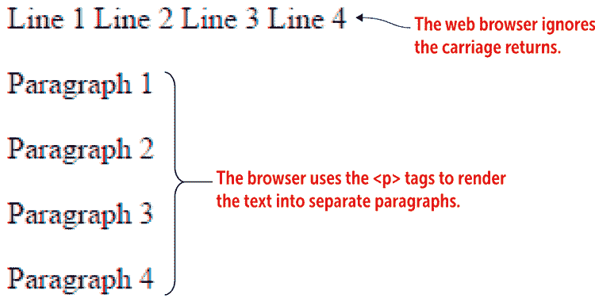
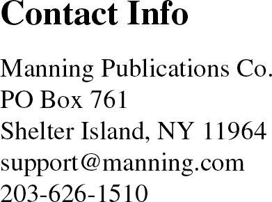
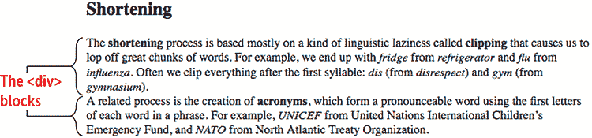
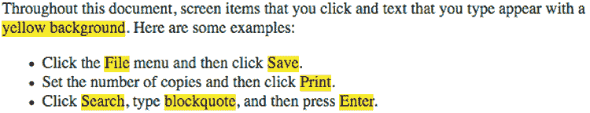
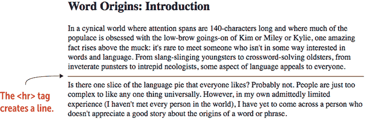
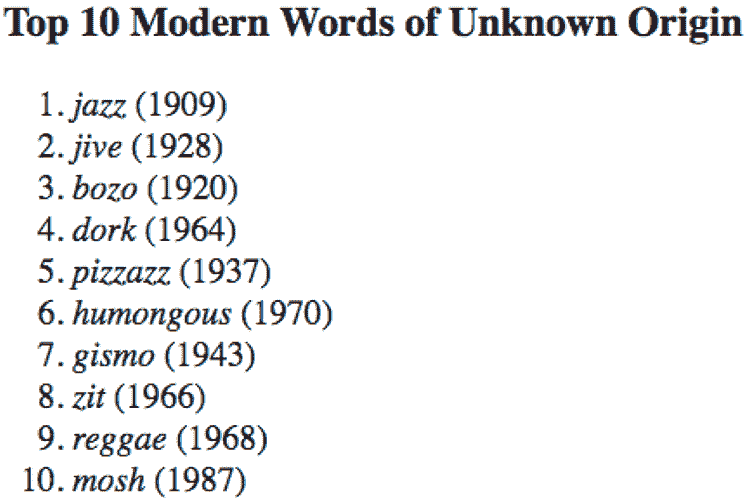

# 第三章 添加页面结构

> 组织是在你做某事之前所做的事情，这样当你做的时候，就不会一团糟。*——A. A. Milne*

**本章涵盖**

+   将页面文本分为段落和部分

+   添加编号列表

+   构建项目符号列表

你在第二章中学到，你可以通过输入一些文本，然后使用标题和诸如`strong`和`em`之类的元素来使文本更易于阅读和理解来创建一个有效的网页。特别是标题是至关重要的页面设备，不仅因为它们帮助读者看到页面的一部分结束和另一部分开始，而且还因为它们给读者一个页面层次结构的总体感觉。所有这些都属于页面结构的一般范畴，这也是本章的重点。

考虑你的网页结构很重要，因为无结构的文本墙难以扫描和阅读，也难以进行样式设计。当你添加结构（如第二章中的标题以及你在这章中学到的段落、部分、容器和列表）时，浏览器会将每个子结构视为一个单独的实体，你可以对其应用许多样式属性。一般来说，你的页面结构越复杂，你对页面外观的控制就越大。幸运的是，正如你在这章中看到的，HTML 提供了几个有用的简单工具来添加页面结构。

## 结构化页面文本的 HTML 元素

如果你使用文字处理器，你会知道几乎所有的文档都有结构：一个标题，可能有一个副标题，一个或多个主题标题，以及每个主题中的一个或多个段落。这使得文档易于浏览，阅读舒适，因为结构引导读者，使他们能够专注于文本。你可以通过利用 HTML 提供的各种结构元素来在你的网页上获得同样的优势。我将从最常见的一种结构开始：段落。

## 第三课 3.1：处理段落

覆盖：`p`元素

在线：[wdpg.io/3-1-0](http://wdpg.io/3-1-0)

我在第二章中提到，网络浏览器会忽略空白，包括由按 Enter 或 Return 键创建的换行符，这通常是你在文本编辑器或文字处理器中分隔文本的方法。在 HTML 中创建段落的常见方法是在文本开头放置一个`<p>`（段落）标签，并在文本末尾放置一个关闭的`</p>`标签。

以下示例展示了创建段落的正确和错误方式。

#### 示例

在线：[wdpg.io/3-1-1](http://wdpg.io/3-1-1)

在这个例子中，你可以看到，当使用`p`元素时，网络浏览器会忽略由回车键创建的空白，但会愉快地将文本渲染为段落。

#### 网页



#### HTML

```
Line 1  ① 
Line 2  ① 
Line 3  ① 
Line 4  ① 
<p>Paragraph 1</p>    ② 
<p>Paragraph 2</p>    ② 
<p>Paragraph 3</p>    ② 
<p>Paragraph 4</p>    ② 

```

① 错误：仅按 Enter/Return 键创建的单独行

② 正确：使用`p`元素创建的段落

播放

使用 Web 设计游乐场，修改此示例中的前五行，使文本片段“行 1”、“行 2”、“行 3”和“行 4”各自出现在单独的段落中。在线：[wdpg.io/3-1-2](http://wdpg.io/3)

## 第 3.2 课：插入换行符

覆盖内容：`br` 元素

在线：[wdpg.io/3-2-0](http://wdpg.io/3-2-0)

当你将页面文本分成段落时，网络浏览器通过（其他事情中）在段落之间创建一些空间来渲染此文本。这个空间通常是您想要的，因为垂直间隙给读者提供了一个视觉线索，表明一个段落在哪里结束，下一个段落在哪里开始，以及有机会在文本部分之间快速休息。然而，这个空间并不总是您想要的。例如，如果您的页面文本是一首诗，您几乎肯定不希望在行与行之间有段落。如果您的文本是编程代码或歌曲歌词，也是如此。

当您想要开始新的一行但又不希望在两行之间有任何空间时，您需要`br`（即换行符）元素。正如您在以下示例中可以看到的，网络浏览器通过插入回车符并在上一行下方立即开始下一行来渲染`br`元素。

#### 示例

在线：[wdpg.io/3-2-1](http://wdpg.io/3-2-1)

在此示例中，您可以看到网络浏览器通过插入回车符并在上一行下方立即开始下一行来渲染`br`元素。

#### 网页



#### HTML

```
<h3>Contact Info</h3>
Manning Publications Co.<br>    ① 
PO Box 761<br>    ① 
Shelter Island, NY  11964<br>    ① 
support@manning.com<br>    ① 
203-626-1510

```

①  `<br>` 标签告诉浏览器从新的一行开始显示后续文本。

使用它

使用换行符来分隔诗歌、歌词、地址、联系方式或编程语句，或者显示 HTML 或 CSS 代码的示例。

播放

通过为每行（不是诗节结尾的行）添加换行符，正确渲染阿尔弗雷德·丁尼生（Alfred Lord Tennyson）的诗《Break, Break, Break》。在线：[wdpg.io/3-2-2](http://wdpg.io/3-2-2)

## 第 3.3 课：分割网页文本

覆盖内容：`div` 元素

在线：[wdpg.io/3-3-0](http://wdpg.io/3-3-0)

在第十一章中，我向您展示了 HTML5 分区元素，包括`<section>`和`<article>`。这些元素使您能够通过指定容器作为这些部分内的部分以及标题、页脚、导航等来语义化地构建您的页面。然而，并非所有文本都完美地适合 HTML5 语义类别。对于需要容器但没有任何语义元素（包括`p`元素）合适的文本，HTML 提供了`div`（即分割）元素。`<div>`标签及其相应的`</div>`结束标签创建了一个简单的文本容器。网络浏览器不对文本应用任何固有的格式，包括在连续的`div`元素之间不渲染任何空间，正如您在以下示例中看到的。

#### 示例

在线：[wdpg.io/3-3-1](http://wdpg.io/3-3-1)

此示例使用`div`元素将网页分割成两个文本块。

#### 网页



#### HTML

```
<h2>Shortening</h2>
<div>    ① 
The <b>shortening</b> process is based mostly on a kind of linguistic laziness called <b>clipping</b> that causes us to lop off great chunks of words. For example, we end up with <i>fridge</i> from <i>refrigerator</i> and <em>flu</em> from <i>influenza</i>. Often we clip everything after the first syllable: <i>dis</i> (from <i>disrespect</i>) and <i>gym</i> (from <i>gymnasium</i>).
</div>    ① 
<div>    ① 
A related process is the creation of <b>acronyms</b>, which form a pronounceable word using the first letters of each word in a phrase. For example, <i>UNICEF</i> from United Nations International Children&rsquo;s Emergency Fund, and <i>NATO</i> from North Atlantic Treaty Organization.
</div>    ① 

```

①  `<div>`和`</div>`标签将你的网页文本划分为块。

播放

`br`元素通常不是结构化页面文本的好选择，因为它不提供文本的容器，因此你不能对文本进行样式化。在 Web 设计游乐场中，将`br`元素替换为`div`元素。在线：[wdpg.io/3-3-2](http://wdpg.io/3-3-2)

## 第 3.4 课：创建内联容器

覆盖内容：`span`元素

在线：[wdpg.io/3-4-0](http://wdpg.io/3-4-0)

如`div`和`p`这样的元素很重要，因为它们提供了容器，在其中你可以添加和样式化文本。有时，你可能只想样式化容器内的子集文本。你可能想对几个单词或一个句子应用字体效果或颜色，例如。在这种情况下，你可以通过将文本包围在`<span>`标签及其`</span>`结束标签中来创建一个*内联容器*。以下示例创建了一些内联容器，并为`span`元素定义了一个 CSS 属性，以将黄色背景应用于每个容器。

记住

如`div`和`p`这样的元素被称为*块级元素*，因为它们创建了一个类似盒子的容器，内容（如文本）从新的一行开始，并在其中流动。如`span`这样的元素被称为*内联元素*，因为每个元素创建的容器存在于某个更大的元素中，并与该更大元素中的其余内容一起流动。

#### 示例

在线：[wdpg.io/3-4-1](http://wdpg.io/3-4-1)

此示例创建了一些内联容器，并为`span`元素定义了一个 CSS 属性，以将黄色背景应用于每个容器。

#### 网页



#### CSS

```
span {    ② 
 background-color: yellow;    ② 
}    ② 

```

②  这种样式定义告诉浏览器将黄色作为背景颜色应用于所有`span`元素。

#### HTML

```
<p>
Throughout this document, screen items that you click and text that you type appear with a <span>yellow background</span>. Here are some examples:    ①  
</p>

<ul>
    <li>Click the <span>File</span> menu and then click <span>Save</span>.</li>    ①  
    <li>Set the number of copies and then click <span>Print</span>.</li>    ①  
    <li>Click <span>Search</span>, type <span>blockquote</span>, and then press <span>Enter</span>.</li>    ①  
</ul>

```

①  `<span>`和`</span>`标签创建内联容器。

播放

要练习`span`元素，请尝试 Web 设计游乐场上的练习。在线：[wdpg.io/3-4-2](http://wdpg.io/3-4-2)

## 第 3.5 课：在块之间添加视觉分隔

覆盖内容：`hr`元素

在线：[wdpg.io/3-5-0](http://wdpg.io/3-5-0)

如我之前提到的，`p`元素会自动在段落之间添加空白，而对于其他如`div`这样的块级元素，你可以使用 CSS 来创建块之间的垂直间距。有时，你可能需要一个更直接或更强调的视觉指示来表示块之间的分隔。在这种情况下，你可以插入`hr`（水平线）元素。正如以下示例所示，网页浏览器会在页面中显示一条水平线。如果你不希望线延伸到其容器的宽度，你可以使用`width` CSS 属性，并将其设置为所需的宽度（例如，以像素或百分比为单位）。

#### 示例

在线：[wdpg.io/3-5-1](http://wdpg.io/3-5-1)

此示例显示，当你添加`hr`元素时，网页浏览器会在页面中显示一条水平线。

#### 网页



#### HTML

```
<h2>Word Origins: Introduction</h2>
<div>In a cynical world where attention spans are 140-characters long and where much of the populace is obsessed with the low-brow goings-on of Kim or Miley or Kylie, one amazing fact rises above the muck: it's rare to meet someone who isn't in some way interested in words and language. From slang-slinging youngsters to crossword-solving oldsters, from inveterate punsters to intrepid neologists, some aspect of language appeals to everyone.</div>
<hr>    ① 
<div>Is there one slice of the language pie that everyone likes? Probably not. People are just too complex to like any one thing universally. However, in my own admittedly limited experience (I haven't met every person in the world), I have yet to come across a person who doesn't appreciate a good story about the origins of a word or phrase.</div>

```

①  `<hr>`标签在两个文本块之间插入一条水平线。

我应该在这里指出，许多网页设计大师建议，不要使用`hr`元素在两个文本块之间获取水平线，而应该给顶部块添加底部边框或给底部块添加顶部边框。有关边框样式的更多信息，请参阅第七章。

## 将文本组织成列表

现在上网很难不遇到一个或多个列表——可能是前十名列表、最佳列表、事件要点总结，或者是千变万化的列表主题之一。列表通常是展示某些类型信息的完美方式，例如一系列步骤或无序的项目集合。

HTML 提供了这两种列表类型：

+   *编号列表*（有时称为*有序列表*）按照数字顺序展示其项目，每个项目的数字位于左侧，项目文本向右缩进。

+   *项目符号列表*（有时称为*无序列表*）按照你指定的顺序展示其项目，每个项目左侧都有一个项目符号（通常是小圆点），项目文本向右缩进。

记住

虽然这种类型的列表比编号列表和项目符号列表使用得少得多，但你应该也了解*描述列表*，它是一系列术语和描述。整个列表使用`<dl>`和`</dl>`标签作为容器；你指定`<dt>`和`</dt>`标签内的每个术语，以及`<dd>`和`</dd>`标签内的每个描述。

## 第 3.6 课：添加编号列表

覆盖内容：`ol`元素

在线：[wdpg.io/3-6-0](http://wdpg.io/3-6-0)

如果你想要显示的事物具有固有的顺序，例如在程序步骤或一系列元素中可能找到的顺序，那么编号列表是最佳选择。好消息是，你不必自己输入数字，因为浏览器会自动为你处理。列表中的第一项被赋予数字 1，第二项被赋予数字 2，依此类推。如果你插入或删除项目，浏览器会根据需要调整所有列表编号，以保持数字顺序。

使用它

对于必须按顺序、数字顺序显示的任何集合，请使用编号列表。例如，读者在如何操作程序中必须遵循的步骤、食谱中涉及的任务、文档中的部分（尤其是合同或其他法律文件）或排名中的项目（如前十名列表）。

你可以通过创建一个容器来开始构建编号列表，该容器由`<ol>`标签（代表*有序列表*）及其关闭标签`</ol>`组成。在这两个标签之间，你添加一个或多个`<li>`标签（代表*列表项*），然后是项目文本和关闭标签`</li>`：

```
<li>*Item text*</li>

```

浏览器会显示左侧带有数字的项目（其值由项目在列表中的位置决定），然后是`*项目文本*`，该文本从数字处缩进，整个项目从包含它的元素左侧缩进。

以下示例展示了基本编号列表及其创建所使用的 HTML 标签和文本。

#### 示例

在线：[wdpg.io/3-6-1](http://wdpg.io/3-6-1)

此示例展示了如何使用编号列表来创建一个前十名列表。

#### 网页



#### HTML

```
<h3>Top 10 Modern Words of Unknown Origin</h3>
<ol>    ① 
 <li><em>jazz</em> (1909)</li>         ② 
 <li><em>jive</em> (1928)</li>         ② 
 <li><em>bozo</em> (1920)</li>         ② 
 <li><em>dork</em> (1964)</li>         ② 
 <li><em>pizzazz</em> (1937)</li>      ② 
 <li><em>humongous</em> (1970)</li>    ② 
 <li><em>gismo</em> (1943)</li>        ② 
 <li><em>zit</em> (1966)</li>          ② 
 <li><em>reggae</em> (1968)</li>       ② 
 <li><em>mosh</em> (1987)</li>         ② 
</ol>    ① 

```

①  使用`<ol>`和`</ol>`标签作为编号列表的容器。

②  在容器内，将每个项目的文本放在`<li>`和`</li>`标签之间。

游戏

要练习`ol`和`li`元素，请尝试 Web 设计游乐场上的练习。在线：[wdpg.io/3-6-2](http://wdpg.io/3-6-2)

默认情况下，列表中使用的数字是标准的十进制值（1，2，3 等等）。您可以通过指定`list-style-type` CSS 属性来更改数字类型。表 3.1 列出了此属性的常见编号列表值。

表 3.1 常见的用于 CSS 属性 list-style-type 的编号列表值

| **值** | **描述** | **示例数字** |
| --- | --- | --- |
| `decimal` | 十进制数 | 1, 2, 3, 4, … |
| `decimal-leading-zero` | 带前导零的十进制数 | 01, 02, 03, 04, … |
| `lower-alpha` | 小写字母 | a, b, c, d, … |
| `upper-alpha` | 大写字母 | A, B, C, D, … |
| `lower-roman` | 小写罗马数字 | i, ii, iii, iv, … |
| `upper-roman` | 大写罗马数字 | I, II, III, IV, … |
| `lower-greek` | 小写希腊字母 | α, β, γ, δ, … |
| `upper-greek` | 大写希腊字母 | Α, Β, Γ, Δ, … |

学习

许多`list-style-type`的值与各种其他语言相关联，例如中文、希伯来语和日语。有关完整列表，请参阅以下页面：[`developer.mozilla.org/en-US/docs/Web/CSS/list-style-type`](https://developer.mozilla.org/en-US/docs/Web/CSS/list-style-type)。

## 第 3.7 课：添加项目符号列表

覆盖内容：`ul`元素

在线：[wdpg.io/3-7-0](http://wdpg.io/3-7-0)

如果您要显示的项目没有固有的数字顺序，例如在待办事项列表或一组特征中，则可以使用项目符号列表。每个项目都出现在自己的段落中，前面有一个项目符号（通常是黑色圆点）。您不需要手动输入项目符号，因为浏览器会自动添加。

使用它

使用项目符号列表来显示任何以某种方式相关联的项目集合，但不必按数字顺序排列。例如，包括待办事项列表或购物清单、与对象相关联的一组特征或课程的一组先决条件。

您可以通过创建一个由`<ul>`（代表无序列表）标签及其关闭标签`</ul>`组成的容器来开始构建项目符号列表。在这些标签之间，与编号列表一样，您添加一个或多个`<li>`标签，然后是项目文本和关闭标签`</li>`：

```
<li>*Item text*</li>

```

浏览器将项目显示为左侧带有项目符号，然后是`*项目文本*`，该文本从项目符号缩进，整个项目从包含它的元素的左边缘缩进。

以下示例显示了基本的列表和其底层的 HTML 标签和文本。

#### 示例

在线：[wdpg.io/3-7-1](http://wdpg.io/3-7-1)

此示例向您展示了如何构建项目符号列表。

#### 网页


#### HTML

```
<p>This <q>ordinary linguistic competence</q> manifests as various mechanisms that people use to forge new words:</p>
<ul>    ① 
 <li>Combining</li>    ② 
 <li>Shortening</li>    ② 
 <li>Shifting</li>    ② 
 <li>Borrowing</li>    ② 
 <li>Onomatopoeia</li>    ② 
 <li>Mistakes</li>    ② 
 <li>Retronyms</li>    ② 
 <li>Ex Nihilo</li>    ② 
</ul>    ① 

```

① 使用 `<ul>` 和 `</ul>` 标签作为项目符号列表的容器。

② 在容器内，在 `<li>` 和 `</li>` 标签之间输入每个项目的文本。

游戏

为了练习 `ul` 和 `li` 元素，尝试在 Web 设计游乐场上的练习。在线：[wdpg.io/3-7-2](http://wdpg.io/3-7-2)

默认情况下，列表中使用的项目符号是填充的圆圈（•）。您可以通过指定 `list-style-type` CSS 属性来更改数字类型。表 3.2 列出了此属性的可用项目符号列表值。

表 3.2 list-style-type CSS 属性的项目符号值

| **值** | **描述** | **示例项目符号** |
| --- | --- | --- |
| `disc` | 填充的圆形 | w |
| `circle` | 空心的圆形 | y |
| `square` | 填充的方形 | u |

## 摘要

+   要将页面文本结构化为段落，请使用 `p` 元素。

+   要将一行与下一行分开，插入 `br` 元素以添加换行符。

+   使用 `div` 元素将页面划分为文本块。

+   您可以通过将文本包围在 `<span>` 和 `</span>` 标签中来创建一个内联容器。

+   使用 `hr` 元素通过水平线分隔文本块。

+   使用 `<ol>` 标签创建编号列表，使用 `<ul>` 标签创建项目符号列表。在这两种情况下，您都使用 `<li>` 标签来指定列表中的每个项目。
