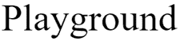
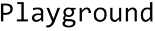
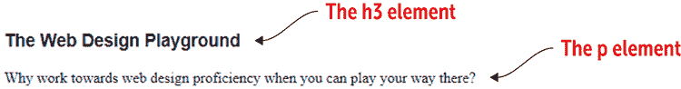
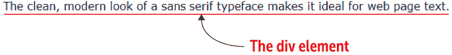
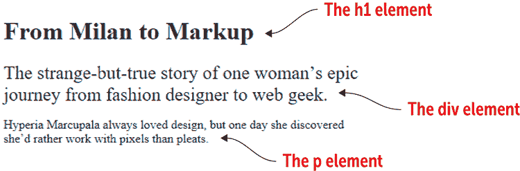
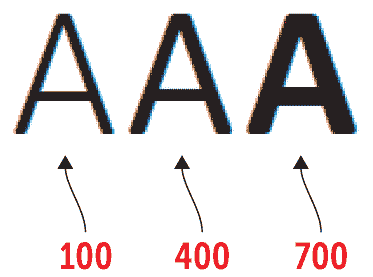
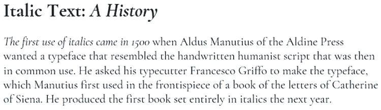
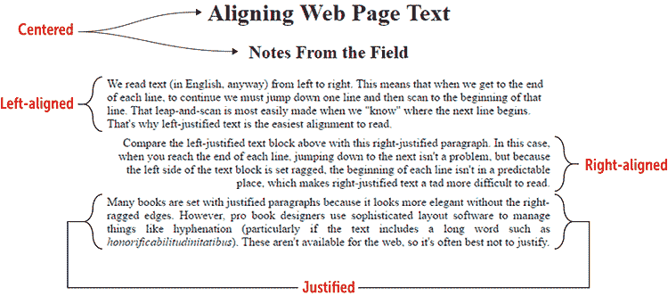
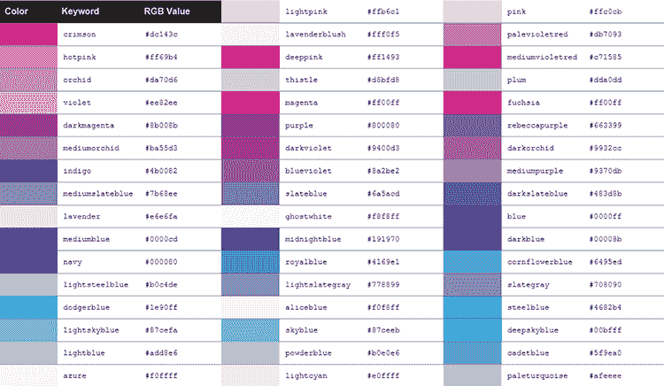
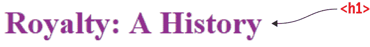

# 第四章 格式化您的网页

> 数字设计就像绘画，但颜料永远不会干。*——内维尔·布罗迪*

**本章涵盖**

+   设置文本字体、大小和样式

+   对齐和缩进段落

+   添加文本和背景颜色

你现在知道如何显示重要和强调的文本，创建链接和标题，以及如何以项目符号或编号列表显示项目，但尽管这些重要技术给你的网页增添了一些视觉兴趣，它们却不能为你赢得任何设计奖项。为了让人们坐直身子并注意到你的页面，你需要稍微专注于 CSS 方面的事情，这正是本章要做的。首先，你将学习一些设置网页文本样式的技巧，包括指定你想要使用的字体和设置文本大小。你还将学习如何将粗体应用于任何文本（而不仅仅是重要术语或关键词），以及如何将斜体应用于任何文本（而不仅仅是强调的单词或替代术语）。从单词和短语开始，你将学习如何对段落进行水平对齐和缩进段落文本。章节以一个有趣的点结束，你将学习如何将 CSS 颜色应用于文本和页面背景。

正如你将看到的，这些基本的 CSS 技术易于学习和实施，但不要让它们固有的简单性欺骗了你。这些是强大的工具，你将反复使用它们来让你的页面看起来很棒，并赋予它们个人风格。那些设计奖项就在眼前。

## 设置文本样式

每个浏览器都使用默认样式来渲染文本，如标题和段落。尽管浏览器之间存在一些差异，但大多数情况下，这些样式在 Google Chrome、Mozilla Firefox、Apple Safari 等浏览器中渲染相似。这些样式是很好的设计选择，但如果你使用这些默认样式，你可能会面临你的网页最终看起来像默认样式的风险。这对于网页设计师来说绝对不是你想要的，因此你最重要的任务之一就是覆盖这些默认样式并指定你自己的文本格式。

网页排版是一个庞大而迷人的主题，你将在第十四章中深入学习。现在，我将保持简单，专注于四个最重要的文本格式化功能：字体、字号、粗体和斜体。

### 设置字体样式

我喜欢将字体描述为字符的建筑。当你审视一座建筑时，某些特征和模式能帮助你识别建筑的风格。例如，飞扶壁通常是哥特式建筑的明显标志。字体也是如此，它们通过一组独特的特征来区分，而这些特征体现在字体设计中。

*字体*是一种在相关的字母、数字和符号集中常见的独特设计。字体和字体的区别是什么？从所有实际用途来看，这两个术语是可以互换的。然而，从所有不切实际的用途来看，*字体*是字体的特定实现，意味着以特定的尺寸、粗细和样式渲染的字体。Helvetica 是一种字体；Helvetica 16 点粗体是一种字体。

字体设计为每个字符赋予独特的形状和厚度，这是该字体的特点，难以分类。五个主要类别用于区分您在网页设计生涯中遇到的大多数字体：

| *衬线体* — 一种衬线体（与*sheriff*押韵）字体在每个字符的末端包含细小的横笔画（称为*脚*）。这些细微的附加物赋予了字体传统、优雅的外观，但在屏幕上以小尺寸显示时可能会丢失。 |  |
| --- | --- |
| *无衬线体* — 无衬线体字体在字符的末端不包含横笔画。这些字体通常具有干净、现代的外观，非常适合屏幕文本，尤其是在小尺寸时。 |  |
| *等宽体* — 等宽体（也称为*固定宽度*字体）为每个字符使用相同的空间，因此像*i*和*l*这样的细体字母占据的空间与*m*和*w*这样的宽体字母一样多。 |  |
| *手写体* — 手写体设计用来模仿手写笔或刷子的书写。 |  |
| *艺术体* — 艺术体通常具有奇异的设计，包含一些极端元素（例如额外加粗）。 |  |

USe It

在屏幕上，衬线体通常最适合标题和其他大号文本；无衬线体适合正文文本；等宽体适合代码列表；手写体最适合需要优雅或趣味性的短文本；而艺术体仅在需要特殊效果时使用。

在 CSS 中，您通过使用`font-family`属性来告诉网络浏览器您希望应用于元素的字体类型。您有几种方法可以设置`font-family`的值，但我首先查看需要最少工作量的一种方法。

## 第 4.1 节：指定通用字体

覆盖内容：`font-family`属性和通用字体

在线：[wdpg.io/4-1-0](http://wdpg.io/4-1-0)

使用`font-family`的最简单方法是指定一个*通用字体*，这是一种所有现代网络浏览器都实现的标准化字体。有五种通用字体族，它们的名称对应于上一节中讨论的五种字体类别：`衬线体`、`无衬线体`、`等宽体`、`手写体`和`艺术体`。以下示例展示了`font-family`属性的使用。

#### 示例

在线：[wdpg.io/4-1-1](http://wdpg.io/4-1-1)

此示例展示了如何使用 `font-family` 属性将 `sans-serif` 通用字体应用于 `h3` 元素，并将 `serif` 通用字体应用于 `p` 元素。

#### 网页



#### CSS

```
h3 {    ① 
 font-family: sans-serif;    ① 
}       ① 
p {     ② 
 font-family: serif;         ② 
}       ② 

```

①  `h3` 元素获得 `sans-serif` 通用字体。

②  `p` 元素获得 `serif` 通用字体。

#### HTML

```
<h3>The Web Design Playground</h3>

<p>Why work towards web design proficiency when you can play your way there?</p>

```

通用字体很有用，因为它们被所有网络浏览器支持，但只有五种字体家族，它们缺乏多样性。如果你想在网页文本中拥有更多选择，你需要访问更广泛的字体集合。

## 第四课第二部分：指定系统字体

覆盖内容：`font-family` 属性和系统字体

在线：[wdpg.io/4-2-0](http://wdpg.io/4-2-0)

除了内置的通用字体外，每个网络浏览器都可以访问网站访问者在她的计算机上安装的字体。例如，大多数计算机都安装了 Times New Roman 这种 serif 字体，因此你的网页可以使用这种字体而不是通用 `serif` 字体。这些已安装的字体被称为 *系统字体*。

记住

使用引号和将系统字体名称中的每个单词的首字母大写是可选的，但养成这些好习惯会使你的代码更易读。

当你指定一个系统字体时，这里有两个需要注意的事项：

+   如果字体名称包含一个或多个空格、数字或除连字符（-）之外的标点符号，请用引号将该名称括起来：

    ```
    font-family: "Times New Roman";

    ```

+   首字母大写（或对于多词名称，每个单词的首字母大写）：

    ```
    font-family: Georgia;

    ```

注意，只要用逗号分隔名称，指定多个字体名称是完全合法的。在这种情况下，浏览器会按照它们出现的顺序检查字体，并使用用户计算机上安装的第一个字体。这种安排很有用，因为你无法确定每个用户安装了哪些系统字体。特别是，在系统字体之后包含一个类似的通用字体家族是一个好的做法。例如，如果你指定了 Times New Roman 或 Georgia 这样的 serif 系统字体（或者两者都指定），在 `font-family` 值中将 `serif` 通用字体作为最后一个项目：

```
font-family: "Times New Roman", Georgia, serif;

```

记住

一些系统字体至少安装在 90% 的 Mac 和 Windows PC 上。对于 sans-serif，这些字体是 Arial、Arial Black、Tahoma、Trebuchet MS 和 Verdana。对于 serif，这些字体是 Georgia 和 Times New Roman。对于 monospace，这个字体是 Courier New。

学习

要获取许多流行系统字体的安装百分比，请参阅 [`www.cssfontstack.com`](https://www.cssfontstack.com)。

以下示例将 Verdana 系统字体应用于 `div` 元素，正如你可能从第二章回忆起来，这是你用来将网页内容划分为单独部分元素。

#### 示例

在线：[wdpg.io/4-2-1](http://wdpg.io/4-2-1)

此示例将 Verdana 系统字体应用于 `div` 元素，并添加了 `sans-serif` 通用字体作为后备。

#### 网页



#### CSS

```
div {    ① 
 font-family: Verdana, sans-serif;    ① 
}    ① 

```

①  `div`元素获得 Verdana 系统字体。

#### HTML

```
<div>
The clean, modern look of a sans serif typeface makes it ideal for web page text.
</div>

```

## 第 4.3 课：设置字体大小

涵盖：`font-size`属性

在线：[wdpg.io/4-3-0](http://wdpg.io/4-3-0)

与网络浏览器为每个元素定义默认字体样式的方式相同，它还定义了默认的字体大小，尤其是对于标题元素`h1`（最大）到`h6`（最小）。再次强调，这些默认值通常是合理的，但我要敦促您忘记默认值，并设置自己的字体大小。为什么？优秀网络设计的秘诀之一是控制设计的每一个方面，这是确保网页看起来符合您或您的客户期望的唯一方法。作为网页设计师，您的主要工作之一是设置自己的字体大小，这不仅适用于标题，还适用于您页面的所有元素，包括正文文本、标题、侧边栏和导航。

记住

您可以使用像素以外的单位指定字体大小。我在第七章中为您介绍了所有可用的 CSS 单位。

您通过将`font-size`属性设置为像素值来指定元素的字体大小，您使用`px`单位来表示这个值。下面的示例告诉网络浏览器将所有出现在`div`元素内的文本渲染为 24 像素的文本大小。相比之下，该示例还显示了一些在`p`元素内的文本以默认大小显示，在所有现代浏览器中，这个默认大小是 16 像素。

#### 示例

在线：[wdpg.io/4-3-1](http://wdpg.io/4-3-1)

此示例使用 24 像素的文本大小格式化`div`元素。

#### 网页



#### CSS

```
div {    ① 
 font-size: 24px;    ① 
}    ① 

```

①  `div`元素被赋予`24px`的字体大小。

#### HTML

```
<h1>From Milan to Markup</h1>

<div>
The strange-but-true story of one woman’s epic journey from fashion designer to web geek.
</div>

<p>
Hyperia Marcupala always loved design, but one day she discovered she’d rather work with pixels than pleats.
</p> 

```

## 与文本样式一起工作

当您选择了字体并设置了不同字体大小的页面元素时，您就已经在制作具有良好印刷效果的网页的道路上了。但要让您的页面脱颖而出，您还需要了解两个与文本样式相关的 CSS 属性。接下来的几个部分将带您了解这些样式。

## 第 4.4 课：使文本加粗

涵盖：`font-weight`属性

在线：[wdpg.io/4-4-0](http://wdpg.io/4-4-0)

在第二章中，您学习了如何使用`<strong>`标签或`<b>`标签来显示加粗文本。您在具有语义意义的文本上使用这些标签：`strong`元素用于重要文本，而`b`元素用于关键词。但如果您有不适合这两个语义类别的文本，但出于外观原因仍然希望它显示为加粗，怎么办？在这种情况下，您可以转向 CSS 属性`font-weight`。表 4.1 列出了您可以分配给此属性的权重和关键词。

使用它

加粗文本的非语义用途包括在项目符号列表中每个条目开头的标题、段落中的引导词或引导句，以及联系信息。

注意

并非表 4.1 中的所有值在所有系统中都有效。如果你使用的字体不支持其中一个或多个粗细度，指定该粗细度将不会产生任何效果。

表 4.1 `font-weight`属性的值

| **粗细度** | **关键字** | **描述** |
| --- | --- | --- |
| 100 |  | 薄文本 |
| 200 |  | 非常细的文本 |
| 300 |  | 细文本 |
| 400 | `normal` | 正常文本 |
| 500 |  | 中等文本 |
| 600 |  | 粗体文本 |
| 700 | `bold` | 加粗文本 |
| 800 |  | 非常粗的文本 |
| 900 |  | 黑色文本 |

以下示例通过将 100、400 和 700 粗细度应用于多个`span`元素来展示加粗文本的外观。（回想第二章，你使用`span`来创建一个内联容器，该容器适用于一个单词或三个单词。）

#### 示例

在线：[wdpg.io/4-4-1](http://wdpg.io/4-4-1)

此示例通过将每个粗细度应用于单独的`span`元素来演示 Calibri 字体的 100、400 和 700 粗细度。

#### 网页



#### CSS

```
span {
    font-family: Calibri, sans-serif;
    font-size: 5em;
}

```

#### HTML

```
<span style="font-weight: 100">A</span>    ① 
<span style="font-weight: 400">A</span>    ① 
<span style="font-weight: 700">A</span>    ① 

```

①  `span`元素应用了各种粗细度到字母 A。

常见问题解答

*我什么时候会使用正常（或 400）值？* 当你处理默认为加粗样式的元素时，例如标题。为了防止此类元素以加粗文本显示，将其`font-weight`属性赋值为`normal`（或`400`）。

## 第 4.5 课：使文本斜体

涵盖：`font-style`属性

在线：[wdpg.io/4-5-0](http://wdpg.io/4-5-0)

如你在第二章中学到的，你可以通过使用当想要强调文本或格式化替代文本时使用`<em>`标签来在语义上显示斜体文本。如果你有非语义文本，但希望它以斜体显示，使用 CSS 属性`font-style`，并将其设置为`italic`值。以下是一个示例：

使用方法

斜体文本的非语义用途包括引语、段落中的首字或首句，以及文章元数据（如作者姓名和日期）。

#### 示例

在线：[wdpg.io/4-5-1](http://wdpg.io/4-5-1)

此示例将斜体字体样式应用于`span`元素。有两个实例：嵌套在`h1`元素内的`<span`>和嵌套在`div`元素开头的`span`。

#### 网页



#### CSS

```
body {
    font-family: Georgia, serif;
}
span {    ① 
 font-style: italic;    ① 
}    ① 
div {
    font-size: 1.25em;
}
```

①  `span`元素格式化为斜体。

#### HTML

```
<h1>Italic Text: <span>A History</span></h1>    ② 

<div>
<span>The first use of italics came in 1500</span> when Aldus Manutius of the Aldine Press wanted a typeface that resembled the handwritten humanist script that was then in common use. He asked his typecutter Francesco Griffo to make the typeface, which Manutius first used in the frontispiece of a book of the letters of Catherine of Siena. He produced the first book set entirely in italics the next year.    ③  
</div> 
```

②  第一个`span`实例

③  第二个`span`实例

记住

当你处理默认为斜体样式的元素时，例如`cite`或`var`（见第十六章），你可以通过将该元素的`font-style`属性赋值为关键字`normal`来防止该元素以斜体文本显示。

## 段落样式

当（或者我应该说*如果*）人们想到排版时，他们往往会关注单个字母或字母组合。这当然很重要，但这只是排版的“树木”视角。如果你想让你的网页看起来最好，你还需要考虑“森林”视角，这包括页面上的较大文本块，包括标题、副标题、标题和特别是段落。正如你在下一两个部分中看到的，注意重要的样式细节，如对齐和缩进，可以大大改变你的页面从单调到精彩。

## 第 4.6 课：水平对齐段落

涵盖：`text-align`属性

在线：[wdpg.io/4-6-0](http://wdpg.io/4-6-0)

要控制段落或文本块的水平对齐方式——即相对于左右页边距的对齐方式——请使用 CSS `text-align`属性，该属性接受表 4.2 中显示的任何关键字。

表 4.2 `text-align`属性的可能的值

| **关键字** | **描述** |
| --- | --- |
| `left` | 将文本块的左边缘与左边距对齐；文本块的右边缘不对齐（因此被称为*参差不齐*）；这是从左到右阅读的语言中的默认设置。 |
| `right` | 将文本块的右边缘与右边距对齐；文本块的左边缘不对齐（参差不齐）；这是从右到左阅读的语言中的默认设置。 |
| `center` | 将文本块中的每一行居中对齐到左右边距之间；文本块的左右边缘都是参差不齐的。 |
| `justify` | 将文本块的左边缘与左边距对齐，将文本块的右边缘与右边距对齐。 |

使用它

对于大多数网页文本块，左对齐的文本最容易阅读。居中对齐的文本适用于页面标题和副标题。当你想要文本看起来更优雅时，使用对齐对齐。

小心

浏览器通过在行内添加空格来对齐文本。如果你的文本块较窄或包含一个或多个长单词，你可能会在文本中留下大而难看的空隙。

> 对齐的四种模式（居中、对齐、左对齐和右对齐）形成了排版创作的语法基础。*——艾伦·卢普顿*

以下示例尝试了四个`text-align`值。

#### 示例

在线：[wdpg.io/4-6-1](http://wdpg.io/4-6-1)

此示例显示了四种对齐样式在工作中的效果：标题和副标题居中，以及左对齐、右对齐和完全对齐的文本块。

#### 网页



#### CSS

```
h1, h2 {    ① 
 text-align: center;    ① 
}    ① 
```

①  居中对齐`h1`和`h2`元素

#### HTML

```
<h1>Aligning Web Page Text</h1>
<h2>Notes From the Field</h2>
<div style="text-align: left;">    ② 
We read text (in English, anyway) from left to right. This means that when we get to the end of each line, to continue we must jump down one line and then scan to the beginning of that line. That leap-and-scan is most easily made when we "know" where the next line begins. That's why left-justified text is the easiest alignment to read. </div>
<div style="text-align: right;">    ③ 
Compare the left-justified text block above with this right-justified paragraph. In this case, when you reach the end of each line, jumping down to the next isn't a problem, but because the left side of the text block is set ragged, the beginning of each line isn't in a predictable place, which makes right-justified text a tad more difficult to read. </div>
<div style="text-align: justify;">    ④ 
Many books are set with justified paragraphs because it looks more elegant without the right-ragged edges. However, pro book designers use sophisticated layout software to manage things like hyphenation (particularly if the text includes a long word such as <i>honorificabilitudinitatibus</i>). These aren't available for the web, so it's often best not to justify. </div> 
```

②  左对齐第一段

③  右对齐第二段

④  第三段进行对齐

## 第 4.7 课：段落文本缩进

涵盖：`text-indent`属性

在线：[wdpg.io/4-7-0](http://wdpg.io/4-7-0)

学习

一些浏览器支持`text-align-last`属性，该属性在`text-align`属性设置为`justify`时设置文本块中最后一行的对齐方式。可能的值包括`left`、`right`、`center`和`justify`。参见[`caniuse.com/#feat=css-text-align-last`](http://caniuse.com/#feat=css-text-align-last)了解此属性的兼容性。

你可以通过使用 CSS 的`text-indent`属性来缩进段落文本，该属性可以是表 4.3 中显示的任一值。请注意，缩进仅适用于文本块第一行的开头。

表 4.3 可以应用于`text-indent`属性的值

| **值** | **描述** |
| --- | --- |
| `长度` | 带有单位的数值，例如`px`。 |
| `百分比` | 一个百分比值。计算出的缩进是文本块宽度乘以百分比。 |

记住

段落缩进常用的值是`16px`。

就像大多数排版事物一样，关于文本块是否应该缩进，存在很多争议。一些排版师避免缩进，因为他们认为未缩进的文本更美观；而另一些人则接受缩进，因为他们认为缩进的文本更易读。无论你最终站在哪一方，你应该记住以下要点：

小心

如果你想要为文本块创建缩进，确保该块有足够宽的左边距来容纳缩进的文本。参见第七章了解如何设置文本块的左边距。

+   永远不要缩进页面的第一段或标题之后的第 一段。缩进的目的在于将段落与上面的段落分开，但这不适用于第一段。

+   如果你缩进你的段落，你不需要在段落之间添加空格。

+   如果你没有缩进你的段落，你应该在段落之间添加一些边距或填充以提高可读性。参见第六章了解如何设置边距和填充。

> 使用段落间距和缩进一起浪费空间，并使文本块呈现出松散、不确定的形状。*——艾伦·卢普顿*

#### 示例

在线:[wdpg.io/4-7-1](http://wdpg.io/4-7-1)

此示例显示了三种可能的缩进样式：对齐（第一段）；正缩进（第二段）；和负缩进（第三段），这通常被称为*缩进*或*悬挂缩进*。

#### 网页


#### HTML

```
<div>    ① 
The first word of the first line is the critical word of that particular body of text. Let it start flush, at least. —William Addison Dwiggins
</div>
<div style=”text-indent: 16px;”>    ② 
Typographers generally take pleasure in the unpredictable length of the paragraph while accepting the simple and reassuring consistency of the paragraph indent. —Robert Bringhurst
</div>
<div style=”text-indent: -64px;”>    ③ 
<span style=”font-variant: small-caps;”>Outdents</span> work well when dramatic effect is desired. They sometimes have a second emphasis factor, such as a style or case change, that
contrasts with the body text. —Kristin Cullen
</div> 
```

①  `text-indent`属性未设置，因此第一行与段落的其他部分对齐。

②  缩进段落的第 一行

③  缩进段落的第 一行

## 与颜色一起工作

默认情况下，大多数网页浏览器使用黑色文本和白色背景来显示页面。这种组合当然可读，但并不有趣。我们的眼睛能够区分数百万种颜色，所以只有黑白调色板似乎有些不合适。幸运的是，CSS 允许你通过提供几种访问数字领域中的 1600 万种颜色中的任何一种的方法来充分发挥你的设计师眼光。唉，这些方法中的大多数都比较复杂，所以我将把它们推迟到以后（见第十三章）。

目前，你可以通过 CSS 定义的关键词来获取颜色。表 4.4 列出了几种常见颜色的关键词。

表 4.4 九种常见颜色的 CSS 关键词

| **关键词** | **颜色** |
| --- | --- |
| `red` |  |
| `lime` |  |
| `blue` |  |
| `yellow` |  |
| `magenta` |  |
| `cyan` |  |
| `black` |  |
| `gray` |  |
| `white` |  |

记住

在每个灰度关键词中，你可以将单词 `*gray*` 替换为 `*grey*`，并且所有浏览器（除了 Internet Explorer 7 及更早版本）都会显示相同的颜色。例如，关键词 `*darkgray*` 和 `*darkgrey*` 会产生相同的色调。

总共有超过 140 个定义好的关键词，所以你不需要有任何困难就能找到你下一个网络项目所需的正确色调（或色调组合）。我已经将完整的颜色关键词列表放在了 Web 设计游乐场 [wdpg.io/colorkeywords](http://wdpg.io/colorkeywords) 上。图 4.1 展示了部分列表。

图 4.1 要查看 Web 设计游乐场上的 CSS 颜色关键词的完整列表，请访问 [wdpg.io/colorkeywords](http://wdpg.io/colorkeywords)。



## 第 4.8 节：将颜色应用于文本

覆盖内容：`color` 属性

在线：[wdpg.io/4-8-0](http://wdpg.io/4-8-0)

几个 CSS 属性具有颜色组件，包括边框、背景和阴影。你将在本书中了解所有这些属性以及更多内容（包括下一节中的背景），但到目前为止，你只知道文本，所以我将从那里开始。以下是应用颜色到文本元素的通用 CSS 语法：

```
`*selector*` {    ① 
 color: `*keyword*`;    ② 
}                         

```

①  要应用颜色的文本项

②  `color` 属性及其值

`*选择器*` 可以是一个 HTML 元素，例如 `h1` 标题或 `p` 元素，或者它可以是第七章中看到的任何 CSS 选择器。实际的工作是由 `color` 属性及其关联的值完成的，它可以是由 CSS 颜色关键词（或第十七章中你将学习的 CSS 支持的其他任何颜色值）。

以下示例显示了紫色 `h1` 文本的 `color` 定义。

#### 示例

在线：[wdpg.io/4-8-1](http://wdpg.io/4-8-1)

此示例使用关键词将紫色分配给 `h1` 元素。

#### 网页



#### CSS

```
h1 {    ① 
 color: purple;    ② 
}

```

①  指定要应用样式的 `h1` 元素。

使用关键词 `purple` 来设置 `color` 属性的值。

#### HTML

```
<h1>Royalty: A History</h1>

```

游戏

将 `a` 元素样式设置为显示黄色链接文本。然后添加第二个规则，当鼠标悬停在链接上时，链接文本显示为红色并带有下划线。在线：[wdpg.io/4-8-4](http://wdpg.io/4-8-4)

## 第 4.9 节：为背景应用颜色

涵盖：`background-color` 属性

在线：[wdpg.io/4-9-0](http://wdpg.io/4-9-0)

到目前为止，我只看了设置前景色——网页文本的颜色，但你也可以使用 CSS 为背景应用颜色。这种颜色可以是整个页面的背景（即 `body` 元素），标题、段落、链接，或者页面的某个部分，如 `<div>` 或 `<span>` 标签。

这是将背景颜色应用于网页元素的通用 CSS 语法：

```
`*selector*` {    ① 
 background-color: `*keyword*`;    ② 
}                         

```

①  要应用背景色的项目

②  `background-color` 属性及其值

`*选择器*` 可以是一个 HTML 元素或你在第七章中学到的任何 CSS 选择器。关键是 `background-color` 属性及其关联的值，这可以是之前学到的任何颜色关键字。

以下示例显示了一个具有黑色背景和白色文本的目录侧边栏的网页。该示例还展示了设置它所使用的部分 HTML 和 CSS。

#### 示例

在线：[wdpg.io/4-9-1](http://wdpg.io/4-9-1)

此示例显示了一个具有黑色背景和白色文本的目录侧边栏的网页。

#### 网页


#### CSS

```
div {
 background-color: black;    ① 
 color: white;    ② 
 float: right;    ③ 
 font-size: 16px;    ③ 
 font-weight: bold;     ③ 
 margin-left: 0.5em;    ③ 
 padding: 0 10px 5px 10px;    ③ 
 text-align: left;    ③ 
}

```

①  `background-color` 属性将 `<div>` 背景设置为黑色。

②  `color` 属性将 `<div>` 文本设置为白色。

③  这些属性将各种样式应用于 `<div>`。

#### HTML

```
<div>    ④ 
 <h3>Table of Contents</h3>    ④ 
 Color Psychology<br>    ④ 
 Color Schemes<br>    ④ 
 Color Caveats<br>    ④ 
 A Few Examples<br>    ④ 
 Best Practices<br>    ④ 
 CSS and Color    ④ 
</div>    ④ 
```

④  `<div>` 标签及其相关的 HTML 和文本

播放

你会如何修改这个示例中的 CSS 来显示带有浅灰色文本和紫色背景的目录侧边栏？在线：[wdpg.io/4-9-2](http://wdpg.io/4-9-2)

播放

编写一个 CSS 规则，将链接的文本设置为蓝色，背景为黄色。在线：[wdpg.io/4-9-4](http://wdpg.io/4-9-4)

## 摘要

+   你可以使用 `font-family` 属性为页面元素分配字体。这个字体可以是五种通用字体之一——`serif`、`sans-serif`、`monospace`、`cursive` 或 `fantasy`——或者用户计算机上已安装的系统字体。

+   使用 `font-size` 属性来控制文本元素的大小。

+   使用 `font-weight` 属性以非语义方式应用粗体。

+   使用 `font-style` 属性以非语义方式应用斜体。

+   使用 `text-align` 设置水平对齐，例如居中标题和左对齐文本。

+   使用 `text-indent` 来缩进或取消缩进文本块的第一行。

+   要为元素文本着色，使用 `color` 属性。

+   要为元素背景着色，使用 `background-color` 属性。
