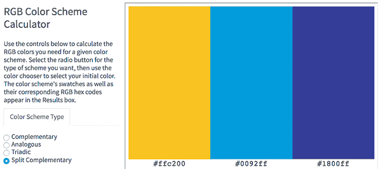
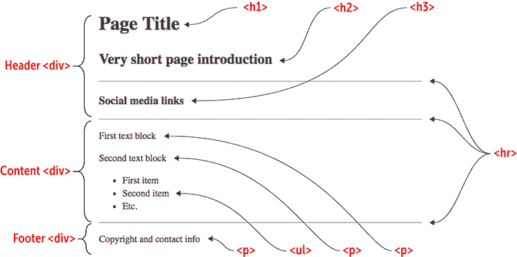
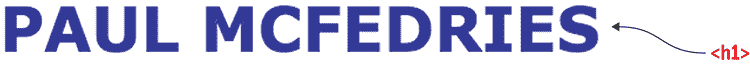
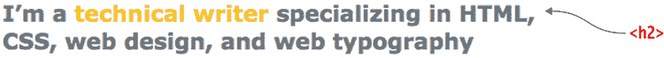
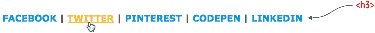
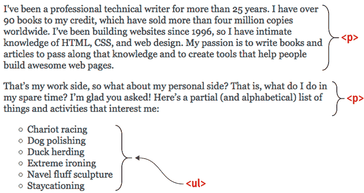
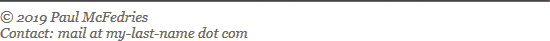
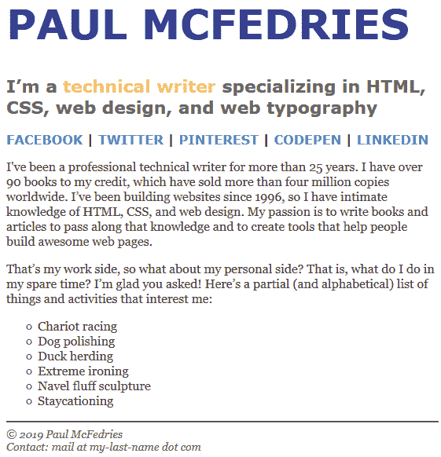

# 第五章  *项目:* 创建个人主页

> 创造比拥有更好的自我表达方式；生命是通过创造而非拥有来展现的。*——维达·达顿·斯卡德*

**本章涵盖**

+   规划和绘制你的个人主页

+   为你的页面选择字体

+   添加页眉和导航链接

+   添加正文内容

在掌握四个章节的内容后，是时候将新学的 HTML 和 CSS 知识付诸实践，通过构建一些实质性的内容了。具体来说，本章将带你通过创建一个简单的个人主页的过程。*简单*是这里的关键词，因为你对 HTML 标签和 CSS 属性的掌握还不足以构建复杂的内容。幸运的是，你掌握的已经足够多，可以为自己创建一个看起来很棒的首页。你了解标题和段落；你知道如何使用`<div>`和`<span>`标签创建部分；你知道如何创建项目符号和编号列表；你知道如何创建链接；你知道如何添加粗体和斜体等排版效果；你知道如何将颜色应用到背景和文本上。正如本章所示，所有这些已经足够你创建一个值得骄傲的首页。

## 你将构建的内容

这个项目是一个基本的“看，妈妈，我在网上！”主页，它让你能够将本书前四章学到的工具和技术应用到网络虚拟世界中。结果是简单但美观的页面，让你能够在网络上占据一小块领地。目的何在？这取决于你，但大多数个人主页都是为任何经过的冲浪者提供一个介绍：你是谁，你喜欢什么（甚至你不喜欢什么），你过去做了什么，你现在在做什么，以及你将来想做什么。随着我的介绍，我会基于我的信息给出一个例子，但当然，你将想要用你自己的文本替换我的文本。你的网页是你的房子，你可以用你想要的任何东西来填充它。

## 绘制布局草图

所有你的网络项目都应该从笔和纸开始，或者说是从其他方便的书写表面开始。创建网页首先是一个*设计*过程，所以在开始编写代码之前，你需要对你要构建的内容有一个合理的想法。当然，你可以构建页面的心理图像，但最好是从笔和纸提供的更直观的方法开始。

正如你在图 5.1 中看到的，这个草图不需要很详细。用短语或句子描述每个部分的内容，来布局页面的主要部分。

图 5.1 在开始编写 HTML 和 CSS 代码之前，用笔或铅笔快速绘制页面布局和内容的草图。


图 5.1 展示了一个包含以下六个部分的页面布局：

+   页面的标题

+   对页面的简要介绍

+   链接到社交媒体网站，如 Facebook 和 Twitter

+   关于我职业的文本

+   关于我感兴趣的事物的文本和项目符号列表

+   带有版权声明和联系信息的页面页脚

你的下一个页面规划任务是决定你想要为你的页面使用的字体。

## 选择字体

因为在这本书中我还没有讨论过图片，所以你个人主页的第一个版本将由文本主导，特别是所谓的*正文文本*——那些构成你页面大部分的非标题文本的大块文本。由于你的一部分读者将在笔记本电脑、平板电脑和智能手机等设备上阅读你的页面，因此一开始花点时间选择在这些较小屏幕上可读的字体是很重要的。

你可以用单一字体构建你的页面，但混合两种字体——一种用于标题，另一种用于正文文本——可以为页面增添活力和对比。我首选的使用方式是标题使用无衬线字体，正文使用衬线字体，但你可以随意反转它们或使用两种衬线字体或无衬线字体。唯一要寻找的标准是两种能够和谐共存的字体。

对于这个项目，我将使用两个经久不衰的网页字体：无衬线字体 Verdana 用于标题，衬线字体 Georgia 用于正文。在我的 CSS 中，我将使用以下规则来指定这些字体家族：

```
font-family: Georgia, serif;
font-family: Verdana, sans-serif;

```

当页面布局就绪且你选择了字体后，下一步是选择颜色方案。

## 选择颜色方案

在这个简单的页面上，颜色不会扮演重要角色，但你可能想要加入一些颜色，以避免在白色背景上全是黑色文字的单调感。你可以通过使用 Web 设计游乐场的渐变构造工具（见[wdpg.io/kits/gradient](http://wdpg.io/kits/gradient)）来添加背景颜色或渐变。对于这个项目，我更喜欢简单的白色背景，因此我自己的颜色重点放在文本上。使用 Web 设计游乐场的 RGB 颜色方案计算器（见[wdpg.io/colorcalc](http://wdpg.io/colorcalc)），我选择了一个基于颜色值`#ffc200`的颜色方案，如图图 5.2 所示。当然，你应该选择一个适合你风格的配色方案。

图 5.2 基于十六进制颜色值`#ffc200`的分割互补颜色方案



当页面布局就绪且你选择了颜色后，是时候将这个粗略草图转换为精确的 HTML 和 CSS 代码了。

## 构建页面

要构建你的个人主页，你将从我在第二章中介绍给你的基本代码开始。从那里开始，你将逐节进行，添加文本、HTML 标签和 CSS 属性。

### 初始结构

首先，从第二章的基本页面结构开始，为页面的六个部分中的每一个添加标签和一些占位文本。以下是这些标签的摘要：

+   页面标题是一个`h1`标题元素。

+   页面引言是一个`h2`标题元素。

+   社交媒体链接位于一个 `h3` 标题元素内。

+   第一个文本块是一个 `div` 元素。

+   第二个文本块是另一个 `div` 元素，后面跟着一个 `ul` 元素，用于项目符号列表。

+   页脚是另一个 `div` 元素。

#### 尝试这个

在线：[wdpg.io/projects/home-page/1](http://wdpg.io/projects/home-page/1)

这里是构成个人主页初始结构的元素。

#### 网页



#### CSS

```
body {    ① 
 width: 550px;    ① 
 color: #444;    ① 
 font-size: 16px;    ① 
 text-align: left;    ① 
}    ① 

```

①  `body` 元素的初始 CSS

#### HTML

```
<!--START OF HEADER-->    ② 
<div>    ③ 
 <h1>Page Title</h1>    ③ 
 <h2>Very short page introduction</h2>    ③ 
 <hr>    ③ 
 <h3>Social media links</h3>    ③ 
 <hr>    ③ 
</div>    ③ 
<!--END OF HEADER-->
<!--START OF CONTENT-->
<div>    ④ 
 <p>    ④ 
 First text block    ④ 
 </p>    ④ 
 <p>    ④ 
 Second text block    ④ 
 </p>    ④ 
 <ul>    ④ 
 <li>First item</li>    ④ 
 <li>Second item</li>    ④ 
 <li>Etc.</li>    ④ 
 </ul>    ④ 
</div>    ④ 
<!--END OF CONTENT-->
<!--START OF FOOTER-->
<div>    ⑤ 
 <hr>    ⑤ 
 <p>    ⑤ 
 Copyright and contact info    ⑤ 
 </p>    ⑤ 
</div>    ⑤ 
<!--END OF FOOTER-->

```

②  注释表示每个部分的开始和结束。

③  页眉部分

④  内容部分（两个段落和一个项目符号列表）

⑤  页脚部分

常见问题解答

*你为什么不用* `*#000*` *或* `*black*` *作为默认的文本颜色？* 在白色页面背景上，纯黑色文本可能因为两种颜色之间的极端对比而难以阅读。将文本颜色调整为 `#444` 或 `#333` 可以使其更容易阅读。

播放

我将页面上的所有内容都左对齐，以在页面的左侧得到一条整洁的线条。然而，你完全可以用其他方式来调整对齐。尝试将三个页面标题元素（标题、简介和社交媒体链接）居中。在线：[wdpg.io/projects/home-page/2](http://wdpg.io/projects/home-page/2)

注意，初始结构还包括应用于 `body` 元素的一些 CSS 属性。这些全局属性设置了页面的宽度和文本颜色、字体大小和对齐的默认值。最令人惊讶的可能就是 `width` 的值为 `550px`。为什么要限制宽度，为什么要使用这样一个相对较小的值？好的网页排版的一个关键元素是行长。如果你的行太长，它们就难以扫描，如果太短，文本就会显得断断续续。在这两种情况下，结果文本都难以阅读。对于屏幕文本，最佳行长在 65 到 75 个字符之间，因此你需要设置宽度，以确保你的正文中的所有或大多数行都适合这个范围。

播放

为了帮助你了解屏幕阅读的理想行长，我在 Web 设计游乐场设置了一个练习。给定一段文本，调整 `body` 元素的 `width` 属性，使行长进入理想的 65-75 个字符范围。尝试更改 `font-size` 属性，看看这个变化对行长有什么影响。在线：[wdpg.io/projects/home-page/3](http://wdpg.io/projects/home-page/3)

这里还有一些关于初始结构中使用的 HTML 标签需要注意的事项：

+   页面分为三个部分：页眉、内容和页脚。

+   每个部分都嵌入在一个 `<div></div>` 块中。这个块组织了结构，并允许你将样式（如字体家族）应用于特定部分中的所有内容。

+   页面的每个部分都被称为*注释*的特殊标签包围，这些标签标记了部分的开始（例如，`<!—START OF HEADER-->`）和结束（例如，`<!—END OF HEADER-->`）。我使用全部大写字母来帮助注释从常规代码中突出出来，但这种做法是可选的。参见第十六章了解如何在代码中使用注释的更多信息。

记住

不要害羞地在你的代码中添加注释。注释帮助你跟踪页面结构，当其他人需要阅读你的代码或者当你几个月没有查看你的页面代码时，它们通常是不可或缺的。

### 页面标题

毫不奇怪，你希望你的页面标题比页面上的其他文本更加突出。在`h1`元素中设置文本是一个好的开始，但你可能还需要进一步格式化文本以获得你想要的效果。这里有一些想法：

+   *应用不同的颜色。* 如果你使颜色独特，标题将与其他文本区分开来。

+   *应用更大的字体大小。* 因为你的页面标题可能只是你的名字这样简单，更大的字体大小可以使它更加突出。

在下面的示例中，我用我的名字作为标题，但你可以自由地使用你喜欢的任何文本。我将无衬线系统字体 Verdana 应用到页眉部分的`div`元素上（这意味着这个字体也应用到所有标题上）。我还用我颜色方案中的一种颜色（`#1800ff`）和`52px`的字体大小来格式化页面标题。

#### 尝试这个

在线：[wdpg.io/projects/home-page/4](http://wdpg.io/projects/home-page/4)

这个示例用颜色、字体和更大的字体大小来格式化个人主页标题。

#### 网页



#### CSS

```
h1 {    ① 
 color: #1800ff;    ① 
 font-size: 52px;    ① 
}    ① 

```

①  `h1`元素的 CSS 代码

#### HTML

```
<div style="font-family: Verdana, sans-serif;">    ② 
 <h1>PAUL MCFEDRIES</h1>    ③ 

```

②  应用了字体的页眉部分的`div`元素

③  添加了文本的`h1`元素

播放

如果你的页面标题很长，它可能会换行到第二行。这没问题，但你可能需要减小行高，使两行更靠近。对于`h1`元素，尝试将`line-height`属性设置为小于 1 的值（例如`0.8`或`0.9`）。在线：[wdpg.io/projects/home-page/5](http://wdpg.io/projects/home-page/5)

### 页面简介

页面简介充当一种副标题。它应该是一段简短的文本片段，向读者介绍你。因为文本是副标题，所以字体大小应该小于标题文本，但大于正文文本。再次强调，将文本放在`h2`元素中应该可以完成这项工作，但你需要根据你为标题使用的样式来设置大小。

在下面的示例中，我用灰色文本（`#666`）和`22px`的字体大小来格式化我的页面简介。我还使用了一个内联的`<span>`标签，用我颜色方案中的另一种颜色（`#ffc200`）来格式化一个关键短语——*技术作家*。请注意，这个`h2`元素继承了我在前一个部分应用到页眉的`<div>`标签上的字体。

#### 尝试这个

在线：[wdpg.io/projects/home-page/6](http://wdpg.io/projects/home-page/6)

这个例子展示了如何使用颜色和更大的字体大小来格式化个人主页的简介。在文本中，一个`<span>`标签将关键短语*技术作家*应用了不同的颜色。

#### 网页



#### CSS

```
h2 {    ① 
 color: #666;    ① 
 font-size: 22px;    ① 
}    ① 

```

①  `h2`元素的 CSS 代码

#### HTML

```
<h2>I’m a <span style="color: #ffc200">technical writer</span> specializing in HTML, CSS, web design, and web typography</h2>    ②  

```

②  一个内联`span`元素将不同的颜色应用到包含的短语上。

游戏

页面简介应该简短——理想情况下，不超过两行。同时，它应该在屏幕上视觉上保持平衡，每一行尽可能延伸到文本块的最右边。我已在 Web 设计游乐场设置了一个练习，帮助你练习这样做。在线：[wdpg.io/projects/home-page/7](http://wdpg.io/projects/home-page/7)

### 社交媒体链接

页面标题的最后一个元素是链接到你的社交媒体网站，例如 Facebook、Twitter 和 Pinterest。这个集合是页面的重要元素，因此你应该通过使用更大的字体大小或独特的颜色（或两者兼而有之）使其从常规正文文本中脱颖而出。

对于我自己的页面，如下例所示，我用无衬线字体和`16px`的字体大小格式化了社交媒体文本，并将名称大写。对于链接，我应用了色彩方案中的第三种颜色（`#0092ff`）并去掉了下划线。悬停在每个链接上时，文本颜色变为`#ffc200`并带有下划线。注意，还使用了竖线符号（|）来分隔项目。

#### 尝试这个

在线：[wdpg.io/projects/home-page/8](http://wdpg.io/projects/home-page/8)

这个例子展示了如何使用字体、字体大小、大写字母以及当每个链接被悬停时改变的颜色和下划线来格式化个人主页的社交媒体文本。

#### 网页



#### CSS

```
h3 {    ① 
 font-size: 16px;    ① 
}    ① 
a {    ② 
 color: #0092ff;    ② 
 text-decoration: none;    ② 
}    ② 
a:hover {    ③ 
 color: #ffc200;    ③ 
 text-decoration: underline;    ③ 
}    ③ 

```

①  `h3`元素的 CSS 代码

②  常规链接文本的 CSS 代码

③  当读者使用鼠标指针悬停在链接上时的链接文本的 CSS 代码

#### HTML

```
<h3> <a href="http://www.facebook.com/PaulMcFedries">FACEBOOK</a> | <a href="https://twitter.com/paulmcf">TWITTER</a> | <a href="https://www.pinterest.com/mcfedries/">PINTEREST</a> | <a href="http://codepen.io/paulmcf/">CODEPEN</a> | <a href="https://www.linkedin.com/in/paulmcfedries">LINKEDIN</a></h3>

```

常见问题解答

*`<hr>`标签怎么了？* 在初始页面结构中，我在社交媒体链接的上下方使用了水平线来将它们与其他页面文本分开。然而，随着我应用的样式，它们已经完全与其他文本分开，因此水平线变得多余。

### 正文文本

个人主页的大部分内容是由描述你是谁、你做什么工作、你如何娱乐等的文本组成。这段文本是页面的*正文文本*，其内容完全由你决定。

您已经为 `body` 元素设置了默认的文本颜色、字体大小和文本对齐方式，这些值由包含页面内容部分的 `div` 元素继承。剩下的只是应用正文文本字体，在我的例子中是衬线字体 Georgia。为了确保此字体应用于整个内容部分，我在 `div` 元素的 `font-family` 属性中添加了字体。

#### 尝试这个

在线：[wdpg.io/projects/home-page/10](http://wdpg.io/projects/home-page/10)

这个例子使用 Georgia 字体样式化个人主页文本。它还将项目符号列表的符号更改为圆形。

#### 网页



#### CSS

```
ul {
 list-style-type: circle;    ① 
}

```

①  将 `list-style-type` 属性设置为 `circle` 以更改符号。

#### HTML

```
<div style="font-family: Georgia, serif;">    ② 
 <p>    ③ 
    I've been a professional technical writer for more than 25 years. 
    I have over 90 books to my credit, which have sold more than four 
    million copies worldwide. I’ve been building websites since 1996, so
    have intimate knowledge of HTML, CSS, and web design. My passion  
    is to write books and articles to pass along that knowledge and to 
    create tools that help people build awesome web pages.
 </p>    ③ 
    <p>
    That’s my work side, so what about my personal side? That is, what 
    do I do in my spare time? I’m glad you asked! Here’s a partial (and 
    alphabetical) list of things and activities that interest me:
    </p>
    <ul>
        <li>Chariot racing</li>
        <li>Dog polishing</li>
        <li>Duck herding</li>
        <li>Extreme ironing</li>
        <li>Navel fluff sculpture</li>
        <li>Staycationing</li>
    </ul>
</div>
```

②  应用了 Georgia 字体堆栈的内容部分的 `div` 元素

③  每个段落使用 `<p></p>` 块。

精通

您的正文文本也有助于您确定页面的最佳宽度。当您设置文本左对齐时，每个文本块的右侧是参差不齐的，这意味着每行的结束点不同。理想情况下，您应该调整宽度，使您的文本块不要太参差不齐（也就是说，一行或多行在末尾有太多的空白）。

游戏

尽管深灰色（`#333` 或 `#444`）的文本通常与白色背景一起使用，但其他文本颜色也可以产生微妙的效果。例如，深棕色文本颜色散发出温暖感。在 Web 设计游乐场中，我设置了一个示例。在线[wdpg.io/projects/home-page/11](http://wdpg.io/projects/home-page/11)

在这个例子中，请注意以下两点：

+   我将每个段落嵌入到 `<p></p>` 块中，以尊重文本的语义角色。

+   为了给项目符号列表增添一些活力，我将 `ul` 元素的 `list-style-type` 属性设置为 `circle` 以更改默认的项目符号。

### 页面页脚

个人主页的最后一个元素是页面页脚。正如您在以下示例中可以看到的，我使用页脚来显示版权声明和我的联系信息（在这种情况下是电子邮件地址）。您可以根据需要使用页脚添加其他信息，例如“感谢阅读”信息、标语或喜欢的格言，或额外的联系细节。

#### 尝试这个

在线：[wdpg.io/projects/home-page/12](http://wdpg.io/projects/home-page/12)

这个例子通过添加水平线和用较浅的灰色、较小的字体大小和斜体样式化页脚文本，将页脚文本与正文文本分开。

#### 网页



#### CSS

```
hr {    ① 
 color: #666;    ① 
}    ① 

```

①  `hr` 元素被赋予较浅的颜色。

#### HTML

```
<div style="font-family:Georgia, serif; color: #666; font-size: 14px; font-style: italic;">    ② 
    <hr>
    &copy; 2019 Paul McFedries<br>
    Contact: mail at my-last-name dot com    ③  
</div>

```

②  `div` 元素使用了字体、较浅的颜色、较小的字体大小和斜体。

③  电子邮件地址被混淆了。

常见问题解答

*为什么你的电子邮件地址看起来这么奇怪？* 如果你打算在你的联系信息中包含电子邮件地址，永远不要以纯文本形式显示地址；你可能会冒地址被垃圾邮件收集者捕获的风险。相反，以一种能够挫败垃圾邮件机器人但仍然容易让人理解的方式混淆地址。

小心

当添加版权声明时，你可能想同时包含“版权”一词和版权符号（©），但这种格式是多余的。使用其中一个即可，但不要同时使用两个。

## 从这里开始

个人主页的最终版本（我的主页在 图 5.3 中展示）基本上是你所期望的：一个简单、直接的页面，确立了你在网络上的第一个家。（如果你迫不及待想要将你的代码公之于众，请查看附录 A 以获取详细信息。）

图 5.3 一个个人主页，准备上网。



即使你刚开始学习 HTML 和 CSS，你仍有多种方式为你的朴素主页添加个人风格。当然，你可以添加更多文本，包括编号列表（例如你最喜欢的书籍或乐队的排行榜）。你还可以玩转颜色，尝试不同的字体，调整字体大小和对齐方式等印刷细节，并添加一些链接。

如果你对自己的页面略感失望，这是可以预料的。毕竟，在你网络设计教育的早期阶段，你对页面上的元素只有有限的控制权，而且你缺少关键的设计元素，如图片、边距和页面布局。不用担心——你将在第二部分学习所有这些以及更多。

## 摘要

+   绘制你想要构建的页面草图。

+   选择标题和正文文本的字体。

+   选择一个配色方案。

+   构建初始页面结构：基本的 HTML 标签和应用于 `body` 元素的全球 CSS 属性。

+   逐个填充和设计每个部分：标题、简介、社交媒体链接、正文文本和页脚。
