# 第六章  添加图像和其他媒体

> 就像他们说的关于完美的图画书一样。艺术和文字各自独立，但结合起来，它们创造出了更好的东西。*——Deborah Wiles*

**本章内容涵盖**

+   在网页上嵌入图像

+   使用背景图像

+   为网页优化图像

+   添加视频、音乐和其他媒体

当你遇到一个全是文本的页面时，这会让你感觉如何？这可能会让你感到失望，甚至可能感到悲伤。除非文本引人入胜，排版特别出色，否则它也可能让你想点击后退按钮，寻找一个可以让你的眼睛得到休息的地方。你不想让人们感到失望、悲伤或急于离开你的网站，所以通过在页面上添加图像，甚至偶尔添加视频，给他们一些视觉上的慰藉。在本章中，我将向你展示如何做到这一点。

## 第 6.1 课：向页面添加图像

涵盖：`img`元素

在线：[wdpg.io/6-1-0](http://wdpg.io/6-1-0)

到目前为止，在这本书中，你已经看到网页的内部是文本，其中穿插了一些 HTML 标签和 CSS 规则。所以你可能想知道图像是如何融入这个纯文本景观的。简短的答案是它们并不直接融入！与文档处理文档或演示文稿不同，你不会直接将图像插入到网页中。相反，你将图像作为单独的文件上传到你的网站，然后在你的页面文本中插入一个特殊的 HTML 标签，告诉浏览器在哪里定位图像。然后浏览器从服务器检索文件，并在你指定的位置在页面上显示图像。

获取浏览器将图像添加到网页的特殊标签是`img`元素，它使用了图 6.1 中显示的部分语法。

图 6.1 你可以通过使用``标签将图像插入到网页中。

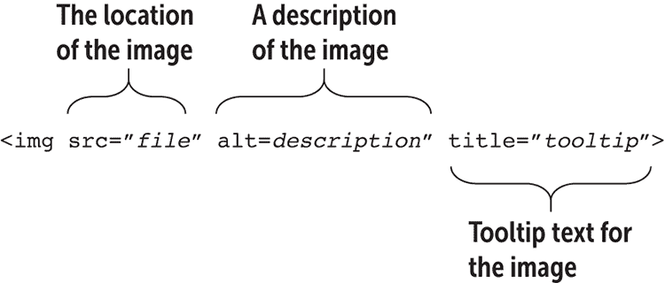

在这里，你需要考虑三个属性：

+   `src`—这个属性（简称*source*）指定了图像文件的位置。如果文件位于远程服务器上，请使用文件的完整 URL；如果文件与 HTML 文件位于同一目录下，请使用文件名；否则，使用图像的路径和文件名。如果你在你的网站主文件夹中创建了一个名为`images`的子文件夹，并且你的图像文件是`logo.png`，那么你的`src`值将是`/images/logo.png`。

+   `alt`—这个属性（简称*alternative*）是一个描述图像的词或短语，如果图像文件无法显示，可以用它来代替图像。例如，一个公司标志可能使用带有公司名称的前缀文本*logo*作为替代文本。替代文本也被屏幕阅读器和盲文应用使用，以使用户对图像有一个大致的了解。

常见问题解答

*我必须包含 alt 属性吗？* 是的。除非你的每个 `` 标签都有一个存在的 `alt` 属性，否则你的网页将无法验证。如果你不想为装饰性或其他非必要图像使用 alt 文本，你可以将 `alt` 属性设置为空字符串 ("")。

+   `title`—你可以使用这个可选属性来指定当用户将鼠标指针悬停在图像上时出现的工具提示文本，如下面的示例所示。

下面的示例展示了 `img` 元素的实际应用。

#### 示例

在线：[wdpg.io/6-1-1](http://wdpg.io/6-1-1)

这个示例展示了如何使用 `` 标签将图片添加到网页中。

#### 网页


#### CSS

```
span {
    font-family: Optima, Verdana, sans-serif;
    font-size: 3em;
}

```

#### HTML

```
    ③ 
<span>Atomic Web Design</span> 

```

①  图片文件的位置

②  替代文本

③  工具提示文本

记住

如果你还没有想要使用的图片，但知道图片的最终尺寸，你可以插入一个占位符图片来占据页面上的相同空间，直到图片准备好使用。你有几种方法可以做到这一点，但最简单的是使用占位符服务器，例如 https://placeholder.com。在 `` 标签中，添加 `src="https://via.placeholder.com/``*w*``x``*h*``"`，其中 `*w*` 和 `*h*` 分别代表宽度和高度。在线：[wdpg.io/6-1-2](http://wdpg.io/6-1-2)

> 你的网站需要在文本内容和视觉内容之间保持适当的平衡。没有文本的精彩图片或视频会给你的访客提供很少或没有有用的数据，但你可能发现很难通过大量纯文本来吸引用户。*—Helen Stark*

## 理解图片文件格式

在前面的示例中，你可能已经注意到图片文件被命名为 `atomic-logo.png`，这意味着它使用的是 PNG 图片文件格式。这种格式在网页上很常见，但并不是你唯一可以使用的格式。实际上，网络已经标准化了四种格式，这些格式几乎涵盖了所有网络图像，我在表 6.1 中总结了它们。

表 6.1 图片文件格式

| **名称** | **扩展名** | **描述** | **用途** |
| --- | --- | --- | --- |
| GIF | `.gif` | 原始的网络图形格式（名称是 *Graphics Interchange Format* 的缩写，发音为 *giff* 或 *jiff*）。GIFs 限制在 256 种颜色，可以有透明背景，并且可以组合成简短的动画。 | 如果你想将多个图像组合成单个动画图像，请使用 GIFs。 |
| JPEG | `.jpg` `.jpeg` | 这种格式（其名称来源于*联合图像专家小组*，发音为*jay-peg*）支持具有数百万种颜色的复杂图像。JPEG 文件的主要优点是它们被压缩，因此即使是数字化的照片和其他高质量图像也可以有合理的小尺寸，以便更快地下载。然而，请注意，JPEG 压缩是*有损*的，这意味着它通过丢弃冗余像素来减小图像的大小。压缩程度越高，丢弃的像素越多，图像看起来就越不清晰。 | 如果你有一个照片或类似复杂图像，JPEG 几乎总是最佳选择，因为它提供了最小的文件大小。对于网页来说，多小才算足够小？你将在本章后面的“优化图像”中了解到这个主题。 |
| PNG | `.png` | 这种格式（缩写为*便携式网络图形*，发音为*p-n-g*或*ping*）支持数百万种颜色。它是一种压缩格式，但与 JPEG 不同，PNG 使用*无损*压缩。图像保持清晰度，但文件大小可能会相当大。PNG 还支持透明度。 | 如果你有一个使用纯色或包含大面积近似纯色的插图或图标，PNG 是最好的选择，因为它在保持优秀图像质量的同时，提供了合理的小文件大小。如果你需要透明效果，也可以使用 PNG。 |
| SVG | `.svg` | 这种格式（缩写为*可缩放矢量图形*）使用矢量而不是像素来生成图像。这些矢量被编码为 XML 格式的指令集，这意味着图像可以在文本编辑器中修改，并且可以通过操作产生动画。 | 如果你有一个标志或图标，并且有一个可以保存为 SVG 格式的图形程序（如 Adobe Illustrator 或 Inkscape），这种格式是一个不错的选择，因为它可以生成小文件，可以无失真地缩放到任何大小。 |

学习

如果你想要加入动画 GIF 的乐趣，网上有很多网站可以提供帮助。最简单的方法是使用在线工具，如 GIFCreator ([`gifcreator.me`](http://gifcreator.me)) 或 GIFMaker.me ([`gifmaker.me`](http://gifmaker.me))。

## 获取图形

网页的文字部分，至少从制作角度来看，对大多数人来说都是小菜一碟。另一方面，图形则是完全不同的数字鱼。创建一个炫目的标志或引人注目的插图需要一定的艺术天赋，这比基本的打字技能更难获得。

然而，如果你有这样的天赋，那么你就可以轻松应对：在你的首选图形程序中创建图像，并以 JPEG 或 PNG 格式保存。对于非艺术家来说，他们必须从其他来源获取图形资源。除了上传你自己的照片或扫描你的图像外，你还可以找到大量漂浮的图像。以下是一些想法：

+   许多程序（包括 Microsoft Office 和大多数绘画和插图程序）都附带剪贴画库。剪贴画是专业质量的美术作品，你可以将其融入自己的设计中。在几乎所有情况下，你都可以自由使用剪贴画，无需担心版权问题。

+   利用网上众多的图形档案。网上的网站存储了数百甚至数千张图片：库存照片、插图、图标等等。其中许多图片是免费的，但请检查每个网站的用法条款。

+   从网页上抓取一张图片。当你的浏览器显示包含图片的网页时，相应的图形文件会暂时存储在你的计算机硬盘上。在大多数浏览器中，你可以右键单击图片以永久保存该文件。然而，正如我在旁边的注释中所详细阐述的，存在版权问题，因为你不应该在没有许可和/或致谢的情况下使用你自己的图片。

小心

不要忘记许多图片最初是那些创建它们的人或公司的财产。除非你绝对确定一张图片是公共领域的（例如，它附带了允许你重新使用图片的 Creative Commons 许可证），在使用之前你需要从所有者那里获得许可。无论如何，确保在你的网站上为图片所有者提供致谢。

## 插入 HTML5 图

虽然你的一些图片纯粹是装饰性的或旨在吸引网站访问者的注意，但你也可能使用许多与页面文本相关的图形。当你直接在文本中引用图片时，该图片被称为*图*。在 HTML5 中，图是一个语义页面元素，你可以使用`figure`元素来指定。如果图有标题，那么这个标题也是一个语义元素，你可以使用`figcaption`元素来指定。以下是要使用的结构：

```
<figure>
    
    <figcaption>*Caption text*</figcaption>
</figure>

```

下面是一个示例。

#### 示例

在线：[wdpg.io/6-1-4](http://wdpg.io/6-1-4)

这个示例向你展示了如何使用`figure`和`figcaption`元素将图片指定为图。

#### 网页

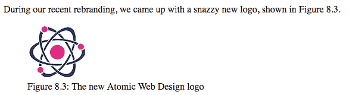

#### HTML

```
<p>
    During our recent rebranding, we came up with a 
    snazzy new logo, shown in Figure 8.3.
</p>
<figure>    ① 
    
 <figcaption>    ② 
        Figure 8.3: The new Atomic Web Design logo
 </figcaption>    ② 
</figure>    ① 

```

②  将标题包含在`figcaption`元素中。

①  将图片包含在`figure`元素中。

## 将图片设置为链接

你已经知道你可以设置一个单词或短语作为链接，但你也可以用图片这样做。你以同样的方式安排事物，用`<a>`和`</a>`标签包围``标签，如下所示：

```
<a href="*url*"></a>

```

小心

我已经在一行中展示了将图片转换为链接的代码，这是出于某种目的。如果你将这些标签放在不同的行上——尤其是关闭的`</a>`标签——你会在文本中遇到奇怪的标记（本质上，是下划线的换行符）。

这里有一个示例。

#### 示例

在线：[wdpg.io/6-1-6](http://wdpg.io/6-1-6)

这个示例向你展示了如何使用`a`元素和`img`元素将图片转换为链接。

#### 网页

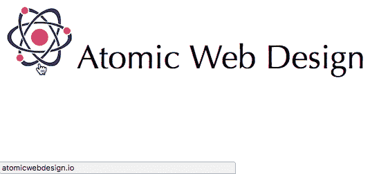

#### HTML

```
<a href="http://atomicwebdesign.io/">    ① 
</a>    ①  
<span>Atomic Web Design</span> 

```

①  将图片包含在`a`元素中。

## 使用图像作为自定义项目符号

如你在第二章所学，CSS 提供了`list-style-type`属性，允许你指定用于无序列表的其他类型的项目符号字符。你可以通过使用`list-style-image`属性来指定一个图像作为自定义项目符号来提高该属性的功能：

```
ul {
    list-style-image: url(*file*);
}

```

与``标签一样，`*file*`值指定图像文件的位置。注意，然而，你不需要用引号包围该值。以下是一个示例。

#### 示例

在线：[wdpg.io/6-1-7](http://wdpg.io/6-1-7)

本例展示了如何使用`list-style-image`属性来指定一个图像作为自定义的项目符号。

#### 网页

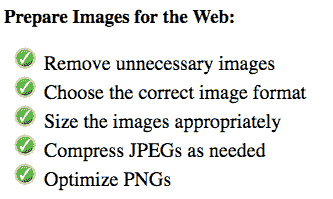

#### CSS

```
ul {
 list-style-image: url(/images/checkmark.png);    ① 
}

```

①  将`list-style-image`属性设置为图像文件位置。

#### HTML

```
<h3>
    Prepare Images for the Web:
</h3>
<ul>
    <li>Remove unnecessary images</li>
    <li>Choose the correct image format</li>
    <li>Size the images appropriately</li>
    <li>Compress JPEGs as needed</li>
    <li>Optimize PNGs</li>
</ul> 

```

## 对齐图像和文本

``标签是一个内联元素，因此你可以将其插入到段落或类似的块元素中，并且它将与内容的其他部分一起流动。默认情况下，图像的底部边缘与当前行的基线对齐，但你可以通过使用`vertical-align`属性来控制这种垂直对齐：

```
*element* {
    vertical-align: baseline | bottom | middle | top;
}

```

+   `baseline`—图像的底部与当前行的基线对齐（默认）。

+   `bottom`—图像的底部与当前行的底部对齐（即下降字母（如 y 和 g）的最底部延伸）。

+   `middle`—图像的中间与当前行的基线对齐，加上当前字体 x 高度的一半。

+   `top`—图像的顶部与当前行的顶部对齐。

以下示例展示了`vertical-align`属性的应用。

#### 示例

在线：[wdpg.io/6-1-10](http://wdpg.io/6-1-10)

本例展示了如何使用`vertical-align`属性将图像垂直对齐到周围内容。

#### 网页

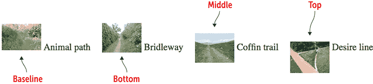

#### HTML

```
<div>
     Animal path    ① 
</div>
<div>
     Bridleway    ② 
</div>
<div>
     Coffin trail    ③ 
</div>
<div>
     Desire line    ④ 
</div> 

```

①  应用`baseline`对齐

②  应用`bottom`对齐

③  应用`middle`对齐

④  应用`top`对齐

精通

如果你需要更精细地控制图像的垂直位置，你可以为`vertical-align`属性指定一个长度值，单位为像素（`px`）。要移动图像向上，请指定一个负值。

## 第 6.2 课：处理背景图像

涵盖：`background-image`和相关属性

在线：[wdpg.io/6-2-0](http://wdpg.io/6-2-0)

为了给一个元素添加一些视觉兴趣，你可以使用`background-image`属性来指定用作背景的图像文件：

```
*element* {
    background-image: url(*file*);
}

```

`*file*`值指定图像文件的位置。如果文件位于远程服务器上，请使用文件的完整 URL；如果文件与 HTML 文件在同一目录下，请使用文件名；否则，使用图像的路径和文件名。

以下示例展示了该属性的实际应用。

#### 示例

在线：[wdpg.io/6-2-1](http://wdpg.io/6-2-1)

本例展示了如何使用`background-image`属性将图像应用于元素的背景。

#### 网页

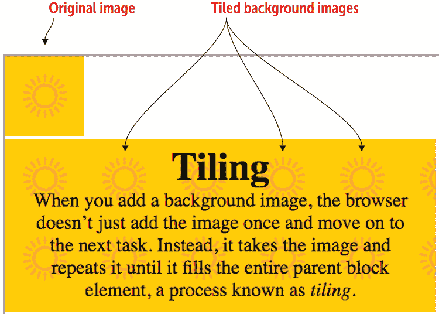

#### CSS

```
div {
 background-image: url(/images/bg.png);    ① 
    width: 500px;
    height: 200px;
}
```

①  `div` 元素获得一个背景图像。

#### HTML

```
    ② 
<div>
    <h1>Tiling</h1>
    <p>When you add a background image, the browser doesn’t just add the image once and move on to the next task. Instead, it takes the image and repeats it until it fills the entire parent block element, a process known as <i>tiling</i>.
    </p>
</div> 
```

②  图像单独显示以进行比较。

小心

背景图像可以为页面添加一些视觉上的吸引力，但如果它干扰了页面文本的可读性，就会留下苦涩的印象。始终确保文本和背景之间有足够的对比度。

当处理背景图像时，您应该假设由于某些原因图像可能无法正确加载。因此，始终指定与图像主色相匹配的 `background-color` 属性值是一个好主意。以下是一个示例：

```
div {
    background-color: #fec72f;
    background-image: url(/images/bg.png);
}

```

## 控制背景重复

在前面的示例中，您可以看到，对于小于元素的背景图像，浏览器默认的行为是水平垂直重复图像，直到元素被填满。这种行为被称为背景图像的*平铺*，通常是您想要的默认行为。然而，您可以通过使用 `background-repeat` 属性来控制背景图像是否水平、垂直重复或不重复：

```
*element* {
    background-image: url(*file*);
    background-repeat: repeat | repeat-x | repeat-y | no-repeat;
}

```

+   `repeat`—水平垂直平铺图像（默认）

+   `repeat-x`—如图 6.2 所示，只水平平铺图像

+   `repeat-y`—如图 6.3 所示，只垂直平铺图像

+   `no-repeat`—只显示一次图像

记住

`repeat` 值是默认值，因此声明 `background-repeat: repeat` 是可选的。

游戏

您可以在 Web 设计沙盒中交互式地尝试所有 `background-repeat` 值。在线：[wdpg.io/6-2-2](http://wdpg.io/6-2-2)

图 6.2 使用 `background-repeat: repeat-x`，背景图像在水平方向上重复。


图 6.3 使用 `background-repeat: repeat-y`，背景图像在垂直方向上重复。

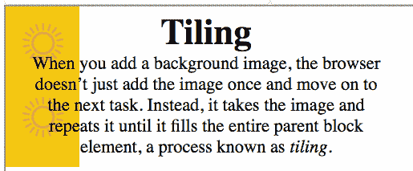

## 设置背景位置

默认情况下，背景图像平铺从父元素的左上角开始。您可以通过应用 `background-position` 属性来更改此设置：

```
*element* {
    background-image: url(*file*);
    background-position: *horizontal* *vertical*;
}

```

+   `horizontal`—指定背景图像平铺的起始水平位置。您可以使用关键词 `left`、`center` 或 `right`；百分比；或像素值。

+   `vertical`—指定背景图像平铺的起始垂直位置。您可以使用关键词 `top`、`center` 或 `bottom`；百分比；或像素值。

记住

`left top` 值是默认值，因此声明 `background-position: left top` 是可选的。请注意，此值等同于 `background-position: 0px 0px` 或 `background-position: 0% 0%`。

游戏

您可以在 Web 设计沙盒中交互式地尝试所有 `background-position` 关键词。在线：[wdpg.io/6-2-3](http://wdpg.io/6-2-3)

图 6.4 是一个组合图，展示了当你使用三个水平关键字（`left`、`center`和`right`）和三个垂直关键字（`top`、`center`和`bottom`）时，九种可能的定位方式。请注意，在每种情况下，我都将`background-repeat`属性设置为`no-repeat`。

图 6.4 `background-position`属性的九种可能的基于关键字的定位方式

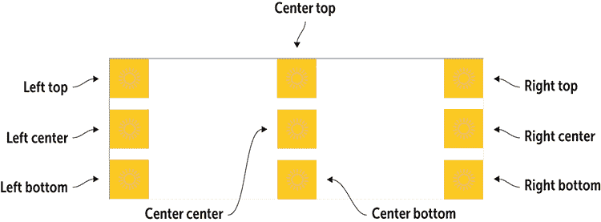

播放

另一种将图片用作自定义项目符号的方法是将图片设置为`li`元素的背景，这使你可以使用`background-position`来控制项目符号和项目文本的对齐方式。在线：[wdpg.io/6-2-4](http://wdpg.io/6-2-4)

## 添加英雄图片

过去几年中最受欢迎的网页设计趋势之一是*英雄图片*：一张引人注目的照片或插图，当你首次进入页面时，它将占据整个浏览器窗口的宽度（以及通常整个高度）。使用英雄图片是立即吸引访客注意力的好方法。

要设置英雄图片，你需要做以下事情：

1.  以一个块级元素（如`div`）开始页面，该元素被设置为占据整个浏览器窗口：

    ```
    width: 100vw;
    height: 100vh;

    ```

    * * *

    记住

    `vw`和`vh`单位分别代表浏览器窗口宽度和高度的百分之一。有关这些单位的更多信息，请参阅第七章。

    * * *

1.  对于相同的块级元素，添加一个背景图片并将其位置设置为`background-position: center center`。

1.  添加声明`background-size: cover`，这告诉浏览器调整图片大小，使其覆盖块级元素的整个背景。

以下是一个示例。

#### 示例

在线：[wdpg.io/6-2-5](http://wdpg.io/6-2-5)

这个示例展示了如何向页面添加英雄图片。

#### 网页

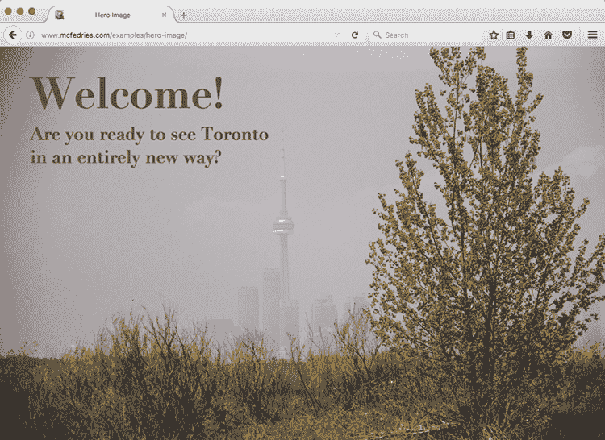

#### CSS

```
.hero-image {
 width: 100vw;    ① 
 height: 100vh;    ① 
 background-image: url(/images/toronto.jpg);    ② 
 background-position: center center;    ② 
 background-size: cover;    ③ 
}

```

①  元素大小与浏览器窗口相同

②  图片显示并居中。

③  图片覆盖整个元素。

#### HTML

```
<div class="hero-image">    ④ 
    <h1>Welcome!</h1>
    <h2>Are you ready to see Toronto in an entirely new way?</h2>
</div>
<div class="main">
    The main page content goes here.
</div> 
```

④  英雄图片的块级元素

小心

如果你计划在你的英雄图片上叠加文字，确保图片包含一个不太繁忙的区域，这样你的文字才会易于阅读。同时，确保你的图片和文字颜色之间有足够的对比度。

播放

通过添加声明`background-attachment: fixed`，你可以使背景在滚动页面其他部分时保持位置不变。在线：[wdpg.io/6-2-6](http://wdpg.io/6-2-6)

播放

背景图片最令人惊讶的方面之一是，你可以在同一个元素上使用多个背景。你可以在两个或更多地方重复相同的背景图片，或者使用两个或更多背景图片（或者两者都使用！）在线：[wdpg.io/6-2-7](http://wdpg.io/6-2-7)

## 背景简写属性

CSS 有五个主要的背景相关组件：颜色、图像、重复、附件和位置。这些组件分别由 CSS 属性`background-color`、`background-image`、`background-repeat`、`background-attachment`和`background-position`表示。方便的是，你可以通过使用`background`简写属性来应用这些属性中的任何一个或所有，该属性采用图 6.5 中显示的语法。

图 6.5 你可以通过使用`background`属性同时应用多达五个背景属性。

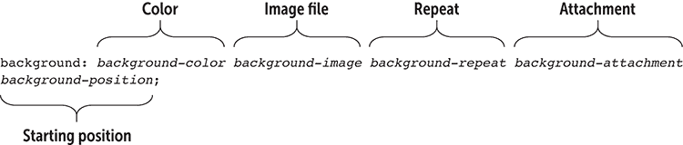

这种语法是对你迄今为止所学内容的直接重复，你可以自由地以你喜欢的任何顺序输入属性。

## 优化图像

在网页设计领域有一个常见的说法：“网络上的颜色是免费的。”这句话的意思是，你可以添加颜色到文本、背景、边框和其他元素，而无需支付性能代价。然而，对于图像来说，情况显然不是这样，因为它们有可能非常大（尤其是我之前提到的那些英雄图像），这确实会带来很高的性能成本。为了确保你的页面不是带宽消耗者，加载时间过长，以下是一些优化你使用的图像时需要记住的技巧：

+   *不要使用不必要的图像。* 在将图像添加到页面之前，问问自己这个图像是否需要传达你的信息。如果是，那就这么做。如果不是，就放弃它。你的用户会感谢你的。

+   *注意你的图像大小。* 网络浏览器可以根据需要调整图像大小，但它们不应该这样做。如果你想在上左角放置一个 100x100 的标志，不要上传一个 2048x2048 版本的图像并强迫浏览器调整大小（比如，在 CSS 中指定较小的宽度和高度）。更大的文件将需要很长时间才能下载，这是带宽的浪费。

+   *明智地选择文件格式。* 一般规则是，你应该使用在保持对当前任务满意的质量水平的同时产生最小文件大小的图像文件格式。英雄图像应该看起来不错，但一个小缩略图不需要是高分辨率的。

+   *利用 JPEG 压缩。* 如果你以 JPEG 格式保存图像，你的图像软件允许你为文件选择一个压缩级别。你可能需要做一些实验来找到正确的级别，但对于大多数用途，60 到 75%的压缩级别是一个好的起点。更多的压缩通常会导致图像质量下降，而较少的压缩通常会导致文件大小过大。

+   *优化 PNG 图像。* 当你处理 PNG 图像时，决定你是否可以满足于 8 位颜色，这仅仅是 256 种颜色。对于简单的标志或图标，8 位颜色可能已经足够，你最终会得到一个非常小的文件。对于更复杂的图像，你可能需要完整的 24 位调色板。

学习

如果你需要使用 24 位 PNG 文件，有软件工具可以帮助减小这些文件的大小。如果你使用 Mac，尝试 ImageAlpha ([`pngmini.com`](https://pngmini.com))；如果你使用 Windows，可以查看 PNGoo ([`pngquant.org`](https://pngquant.org))。

## 在页面中添加视频和音频

你知道人们喜欢他们的猫咪视频和播客，所以你想要分一杯羹，在你的网页中添加视频或音频内容。这是个好主意！我将从好消息开始：HTML5 自带`<video>`和`<audio>`标签，它们提供了一种相对直接的方法将媒体内容嵌入到页面中。注意，我说的是“相对直接”。为什么我要打这个擦边球？啊，那就是坏消息复杂化的地方。目前，网络媒体是一个由标准、压缩算法和文件格式组成的疯狂拼布。这几乎荒谬至极，但如果你想要为你的访客提供视觉或听觉体验，你就需要深入其中。

我将首先定义网络媒体格式的两个方面：

+   *容器* —称为“容器”的文件格式，因为它类似于媒体的压缩文件——也就是说，它是一个包含多个项目的存档，特别是媒体编解码器（将在下文中讨论）和媒体元数据。

+   *编解码器* —用于在数字格式中对视频或音频进行编码和压缩，以及解码和压缩媒体以进行播放的算法。（编解码器一词是*code*/*decode*和*compress*/*decompress*的混合。）

因此，你嵌入网页中的网络媒体文件采用特定的媒体格式，该格式使用特定的容器，而在这个容器中包含了该格式支持的所有编解码器。听起来很简单，对吧？然而，当你了解到没有标准或通用的媒体格式时，这种荒谬性就显现出来了。

### 网络视频格式

对于视频来说，实际上你需要关注的三大格式是：

+   *WebM* —这种格式使用 WebM 容器，其中包含 VP8 或 VP9 视频编解码器，以及 Vorbis 或 Opus 音频编解码器。这种格式是开源的，且无版税。文件扩展名：`.webm`。

+   *Ogg* —这种格式使用 Ogg 容器，其中包含 Theora 视频编解码器和 Vorbis 或 Opus 音频编解码器。这种格式是开源的，且无版税。文件扩展名：`.ogg`或`.ogv`。

+   *MPEG-4* —这种格式使用 MPEG-4 容器，其中包含 H.264 视频编解码器和 AAC 音频编解码器。这种格式是受专利保护的，但对最终用户是免费的。文件扩展名：`.mp4`。

学习

有许多工具可以将视频转换为 HTML5 支持的格式。两个值得检查的在线工具是 Zamzar ([`www.zamzar.com`](https://www.zamzar.com)) 和 Online-Convert ([`www.online-convert.com/`](https://www.online-convert.com/))。

你应该使用哪一个？大多数情况下，你可以使用 MPEG-4 格式，因为所有主流浏览器都支持它。然而，这种支持有点问题。首先，Firefox 不原生支持 MPEG-4；相反，它依赖于操作系统内置的 MPEG-4 支持。其次，谷歌暗示它可能不会在未来版本的 Chrome 中支持 MPEG-4。同时提供 MPEG-4 版本和 WebM 版本（比 Ogg 更新且支持更好）是个好主意。

### 网络音频格式

对于音频，还有更多格式：

+   *MP3* —此格式既是容器也是音频编解码器。此格式受专利保护，但对最终用户免费。文件扩展名：`.mp3`。

+   *WAV* —此格式既是容器也是音频编解码器。文件扩展名：`.wav`。

+   *WebM* —此格式使用 WebM 容器，其中包含 Vorbis 或 Opus 音频编解码器。此格式是开源且无版税的。文件扩展名：`.webm`。

+   *Ogg* —此格式使用 Ogg 容器，其中包含 Vorbis 或 Opus 音频编解码器。此格式是开源且无版税的。文件扩展名：`.ogg`或`.oga`。

+   *MPEG-4* —此格式使用 MPEG-4 容器，其中包含 AAC 音频编解码器。此格式受专利保护，但对最终用户免费。文件扩展名：`.m4a`。

学习

我之前提到的两个在线工具也支持 HTML5 网络音频格式。你可能还想看看 media.io ([`media.io`](https://media.io))。

在音频领域，情况要理智一些，因为现在所有浏览器都支持 MP3 格式，所以你可以使用单一文件类型。

## 第 6.3 课：在网页中嵌入视频

覆盖内容：`video`元素

在线：[wdpg.io/6-3-0](http://wdpg.io/6-3-0)

HTML5 的`video`元素提供了一种简单直接的方法将视频内容嵌入到你的网页中。好吧，*简单直接*可能是一种愿望。你可以使用两种语法，具体取决于你想要提供多少种视频文件格式。

首先，如果你提供单个视频格式，请使用以下语法：

```
<video src="*file*" 
       poster="*file*" 
       width="*value*"
       height="*value*"
       controls
       autoplay
       loop>
</video>

```

+   `src`—指定视频文件的位置，所以它与``标签的`src`属性非常相似

+   `poster`—指定在视频播放开始前显示的图像位置，例如视频的标题帧或静态帧

+   `width`和`height`—指定视频播放窗口的尺寸

+   `controls`—当包含时，告诉浏览器在视频窗口中显示播放控制

+   `autoplay`—当包含时，告诉浏览器一旦下载了足够的视频文件，就自动开始播放视频

+   `loop`—当包含时，告诉浏览器每次视频结束时从开头开始播放

下面是一个示例。

#### 示例

在线：[wdpg.io/6-3-1](http://wdpg.io/6-3-1)

此示例展示了如何在网页中嵌入单个视频文件格式。

#### 网页

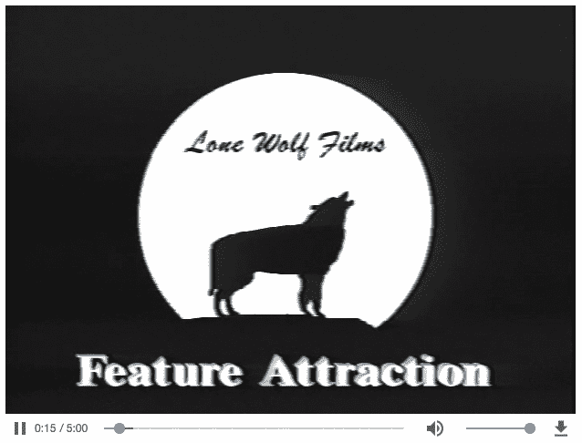

#### HTML

```
<video src="/videos/movie.mp4"
       poster="/images/movie-poster.jpg"
       width="625"
       height="480"
       controls
       autoplay
       loop>
</video>

```

要提供两种或多种视频格式，您需要从`<video>`标签中移除`src`属性，并用多个`source`元素替换，每个元素对应您想要提供的格式：

```
<video poster="*file*" 
       width="*value*"
       height="*value*"
       controls
       autoplay
       loop>
    <source src="*file*"
            type=*'type*; codecs="*codecs*"'>
</video>

```

+   `src`—与之前相同，每个`<source>`标签的`src`属性指定视频文件的名称和/或位置。

+   `type`—这个字符串（用单引号包围）指定视频格式类型（如本章前面的“Web 视频格式”部分所示），是一个由逗号分隔并用双引号包围的视频和音频编解码器的列表：

+   *MPEG-4* —使用以下格式：

    ```
    type='video/mp4; codecs="avc1.4D401E, mp4a.40.2"'

    ```

+   *WebM* —使用以下之一：

    ```
    type='video/webm; codecs="vp8, vorbis"'
    type='video/webm; codecs="vp9, vorbis"'
    type='video/webm; codecs="vp9, opus"'

    ```

+   *Ogg* —使用以下之一：

    ```
    type='video/ogg; codecs="theora, vorbis"'
    type='video/ogg; codecs="theora, opus"'

    ```

这里有一个示例。

#### 示例

在线：[wdpg.io/6-3-2](http://wdpg.io/6-3-2)

本示例向您展示如何在网页中嵌入多种视频文件格式。

#### 网页

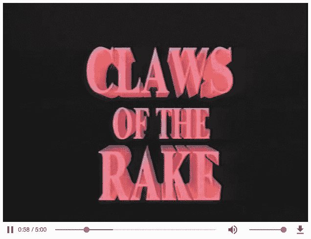

#### HTML

```
<video poster="/images/movie-poster.jpg"
       width="625"
       height="480"
       controls
       autoplay
       loop>
    <source src="/videos/movie.mp4"
            type='video/mp4; codecs="avc1.4D401E, mp4a.40.2"'>
    <source src="/videos/movie.webm"
            type='video/webm; codecs="vp8, vorbis"'>
    <source src="/videos/movie.ogv"
            type='video/ogg; codecs="theora, vorbis"'>
</video>

```

## 第 6.4 课：在网页中嵌入音频

涵盖：`audio`元素

在线：[wdpg.io/6-4-0](http://wdpg.io/6-4-0)

您会很高兴地听到，在网页中嵌入音频几乎与嵌入视频相同，因为`<audio>`和`<video>`标签具有许多相同的属性。

首先，如果您提供单一音频格式，可以使用以下语法：

```
<audio src="*file*" 
       controls
       autoplay
       loop>
</video>

```

+   `src`—指定音频文件的位置

+   `controls`—当包含时，告诉浏览器在音频窗口中显示播放控件

+   `autoplay`—当包含时，告诉浏览器一旦下载了足够的音频文件，就自动开始播放音频

+   `loop`—当包含时，告诉浏览器每次音频播放结束时从开头开始播放

下面是一个示例。

#### 示例

在线：[wdpg.io/6-4-1](http://wdpg.io/6-4-1)

本示例向您展示如何在网页中嵌入单一音频文件格式。

#### 网页


#### HTML

```
<audio src="/audio/music.mp3"
       controls
       autoplay
       loop>
</audio>

```

要提供两种或多种音频格式，请从`<audio>`标签中移除`src`属性，并用多个`<source>`标签替换，每个标签对应您想要提供的格式：

```
<audio controls
       autoplay
       loop>
    <source src="*file*"
            type="*type*">
</audio>

```

+   `src`—与之前相同，每个`<source>`标签的`src`属性指定音频文件的名称和/或位置

+   `type`—指定音频格式类型（如前文“Web 音频格式”部分所示）

这里有一个示例。

#### 示例

在线：[wdpg.io/6-4-2](http://wdpg.io/6-4-2)

本示例向您展示如何在网页中嵌入多种音频文件格式。

#### 网页

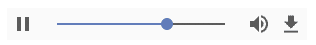

#### HTML

```
<audio controls
       autoplay
       loop>
    <source src="/audio/music.mp3"
            type="audio/mp3">
    <source src="/audio/music.wav"
            type="audio/wav">
    <source src="/audio/music.webm"
            type="audio/webm">
    <source src="/audio/music.ogg"
            type="audio/ogg">
    <source src="/audio/music.m4a"
            type="audio/mp4">
</audio>

```

## 概述

+   主要的图像格式类型有四种——GIF、JPEG、PNG 和 SVG——尽管大多数网页将使用 JPEG 处理照片和复杂图像，而 PNG 则用于使用大量纯色和/或透明度的插图、标志和图标。

+   要在页面上添加图像，请使用``标签：

    ```
    

    ```

+   要在您的图像中注入 HTML5 语义风格，请将`img`元素包裹在`figure`元素中，并可选地添加一个`figcaption`元素。

+   要使图像同时作为链接使用，请将`img`元素包裹在`a`元素中。

+   您可以通过向元素的 CSS 中添加以下属性来将图像设置为元素背景：

    ```
    background-image: url(*file*);

    ```

+   您可以通过添加以下一个或多个属性来控制背景图像的显示：`background-repeat`、`background-position`和`background-attachment`。

+   您可以通过使用`background`简写属性来设置这三个属性，以及`background-color`和`background-image`属性。

+   您可以通过使用`<video>`标签将视频嵌入到网页中，并通过使用`<audio>`标签将声音嵌入到网页中。

+   对于`<video>`标签和`<audio>`标签，您可以通过为每个格式添加一个单独的`<source>`标签来指定多个格式。
