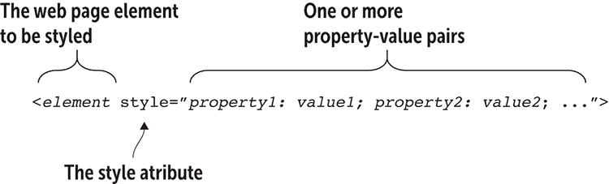
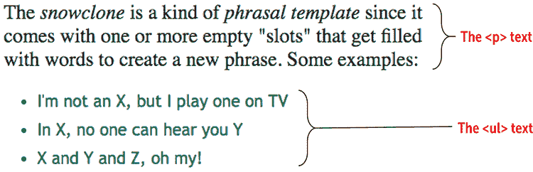
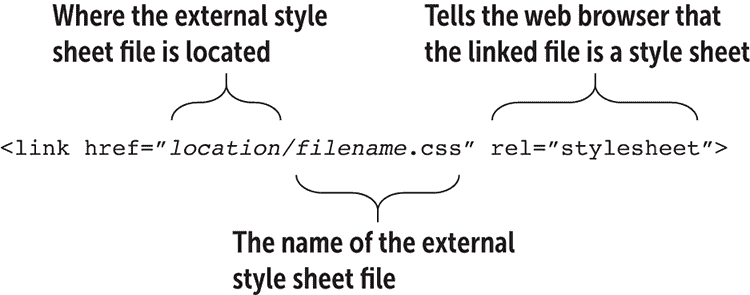
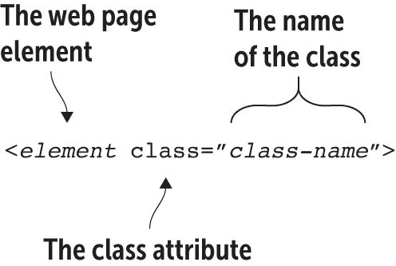
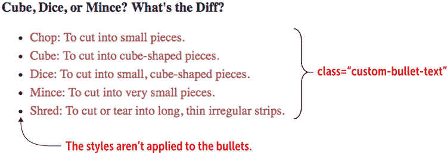

# 第七章 学习更多关于样式的内容

> 样式是一种无需说话就能表达自己的方式。*——Rachel Zoe*

**本章涵盖**

+   学习在网页上添加样式的三种方法

+   使用类添加功能和灵活性

+   了解您可以在 CSS 中使用哪些度量单位

如何制作出类别的页面？如何设计超越陈词滥调的页面？一个词：*样式*。如果您看到过一个您认为设计得很好的网页，知道该页面使用了样式来实现那种外观。如果有一个您钦佩的网页设计师，知道这位设计师掌握了使她的作品脱颖而出的样式。您在本书的第一部分中看到了几个有用的样式，但这些样式只是冰山一角。为了帮助您开始走向真正精通样式的道路，本章将您的样式知识提升到下一个层次。

## 向页面添加样式

我在第一章中提到，网页是一个充满文字、数字和少量战略性放置的 HTML 标签的文本文件，这些标签为文本提供结构。您会很高兴地听到，CSS 也是一个基于文本的业务，因此您不需要比一个简单的文本编辑器（或本书的便捷 Web 设计游乐场）更高级的工具来开始使用样式。

记住

样式是一种指示浏览器如何修改页面上的显示方式的指令，样式表（CSS 中的*SS*部分）是一系列样式的集合。因此，在这本书中，我使用*CSS*和*样式*这两个术语可以互换使用。

话虽如此，尽管样式*包含的内容*足够简单，但*如何*将样式添加到网页上要复杂一些。首先，回想一下第一章的内容，一个单独的样式声明由一个属性-值对组成，该对使用图 7.1 中显示的语法。

图 7.1 属性-值对的语法


常见问题解答

*我需要在冒号后添加空格吗？*严格来说，不需要，空格不是必需的。然而，我仍然建议添加空格，因为它可以使您的样式更易读。

属性名几乎总是用小写字母书写（尽管不一定要这样）。如果值包含一个或多个空格、数字或除破折号（-）之外的标点符号，请用引号将值括起来。

CSS 的附加复杂性源于您有不止一种、不止两种，而是*三种*方式来告诉浏览器您想使用哪些样式声明：

+   内联样式

+   内部样式

+   外部样式

接下来的三个课程将向您介绍这些方法。

## 第 7.1 课：插入内联样式

包括：`<style>`属性

在线：[wdpg.io/7-1-0](http://wdpg.io/7-1-0)

向你的网页添加样式最直接的方法是将它们直接插入你想要修改的元素中。这种技术称为*行内样式*，你通过在想要更改的 HTML 元素中包含 `style` 属性来插入样式。图 7.2 展示了要使用的一般语法。

图 7.2 使用行内样式的语法



当你使用行内样式时，以下是一些需要注意的要点：

+   如果你想在单个行内样式中包含两个或多个属性值对，请确保用分号（;）分隔每个对。

+   如果需要引用一个值，请使用单引号（'）。

+   行内样式仅影响你放置 `style` 属性的元素。

谨慎

由于 `style` 属性的值本身被双引号包围，如果你的属性值对需要自己的引号，请小心。在这种情况下，请用单引号包围值（例如，`style="font-family: 'PT Sans';"`）。

使用它

行内样式的良好用途是快速测试 CSS 属性或两个。如果你刚开始制作页面，还没有设置外部样式表（见第 7.3 课），行内样式是快速测试一些 CSS 的好方法。

以下是一些行内样式的示例。

#### 示例

在线：[wdpg.io/7-1-1](http://wdpg.io/7-1-1)

此示例展示了应用于 `<p>` 标签的行内样式，以及应用于 `<ul>` 标签的具有多个属性值对的行内样式。

#### 网页



#### HTML

```
<p style="font-size: 1.5em"> The <i>snowclone</i> is a kind of <i>phrasal template</i> since it comes with one or more empty "slots" that get filled with words to create a new phrase. Some examples:</p>    ①  
<ul style="color: darkgreen; font-family: 'Trebuchet MS', sans-serif; font-size: 1.25em;">    ②  
    <li>I'm not an X, but I play one on TV</li>
    <li>In X, no one can hear you Y</li>
    <li>X and Y and Z, oh my!</li>
</ul>

```

①  `p` 元素的行内样式设置了字体大小。

②  `ul` 元素的行内样式设置了文本颜色、字体和大小。

播放

你能否在以下 `<a>` 标签中找到 `style` 属性的错误？`<a href="https://www.w3.org/TR/css-style-attr/" style="color: indianred; font-weight: bold, text-decoration: none;">` 在线：[wdpg.io/7-1-3](http://wdpg.io/7-1-3)

虽然行内样式是向页面添加 CSS 代码的最简单方法，但除了最简单的页面之外，它们并不是最方便的方法，因为它们要求你直接将 `style` 属性添加到每个需要样式的元素上。如果你的页面由，比如说，十几个 `h2` 元素组成，并且你想要将相同的样式应用到它们上面，你必须添加十个 `style` 属性。更糟糕的是，如果你后来决定更改 `h2` 元素的显示方式，你必须更改 `style` 值的每个实例。这是一项大量工作，所以大多数网页设计师避免使用行内样式，或者只用于特定实例。

这些设计师会做什么呢？啊，这就是内部样式发挥作用的地方。

## 第 7.2 课：添加内部样式表

覆盖内容：`style` 元素

在线：[wdpg.io/7-2-0](http://wdpg.io/7-2-0)

将样式添加到网页的第二种方法是在页面的头部部分（即在页面的`<head>`和`</head>`标签之间）添加一个`<style></style>`标签对，然后在那些标签内定义样式。这种方法被称为*内部样式表*（有时也称为*嵌入式样式表*），它使用以下通用语法：

```
<style> 
 *selectorA* {    ② 
 *propertyA1*: *valueA1*;    ① 
 *propertyA2*: *valueA2*;    ① 
 ...    ③ 
 }    ② 
 *selectorB* {    ④ 
 *propertyB1*: *valueB1*;    ④ 
 *propertyB2*: *valueB2*;    ④ 
 ...    ④ 
 }    ④ 
    ...
</style> 
```

①  一个或多个声明

②  声明被括号包围。

③  要样式的网页元素

④  一个样式规则

从这个语法中，你可以看到内部样式表由一个或多个*样式规则*组成，每个规则定义了一个或多个要应用到指定网页元素上的属性-值对。每个规则具有以下特征：

+   一个*选择器*，用于指定你想要应用样式的网页元素。这个选择器通常是一个标签名，但它也可以指定任何其他类型的 CSS 选择器（例如第 7.4 课中描述的类选择器）。

+   一个开头的左大括号：`{`。

+   一个或多个属性-值对，由分号分隔。

+   一个关闭的右大括号：`}`。

在 CSS 术语中，属性-值对被称为*声明*，应用于选择器的声明集合——即大括号及其之间的属性-值对——被称为*声明块*。选择器和其声明块的组合称为*样式规则*。

以下示例使用内部样式表来格式化`dt`元素。

#### 示例

在线:[wdpg.io/7-2-1](http://wdpg.io/7-2-1)

这个示例使用内部样式表为每个`<dt>`标签应用字体大小和粗体。

#### 网页


#### CSS

```
<style>
    dt {
 font-size: 18px;    ① 
 font-weight: bold;    ① 
 }    ① 
</style>

```

①  `dt`元素的 CSS 规则

#### HTML

```
<p>Some CSS jargon to commit to memory:</p>
<dl>
 <dt>Gaffer</dt>    ② 
    <dd>The head electrician.</dd>
 <dt>Best Boy</dt>    ② 
    <dd>The gaffer's assistant.</dd>
 <dt>Grip</dt>    ② 
    <dd>A person who moves equipment.</dd>
</dl>

```

②  `<dt>`标签和文本

主

声明块可能会相当长，其中一些包含十多个或更多的属性-值对。使阅读和使用这些大块更容易的一种方法是将声明按属性名称的字母顺序添加。

在这里，你可以看到使用内部样式的一个巨大优势。如果你的页面有十几个`dt`元素，这个样式将应用到它们所有，这给了页面一个一致的外观。更好的是，如果你认为`20px`的大小对于你的`dt`文本看起来会更好，你只需在样式声明中更改一次值；这个更改会自动反映在所有的`dt`元素中。

如果你的网站只包含一个网页，内部样式表工作得非常好。这样的网站并不罕见，但你的或你的客户的网站更有可能包含几个页面，甚至可能多达几十个。如果你想让你的页面保持一致的外观——你应该这样做，因为页面之间的一致性是良好网页设计的标志之一——使用内部样式表意味着将相同的`<style>`标签复制到每个页面上。此外，如果你更改了任何样式规则的任何方面，你必须对每个页面上相同的规则进行相同的更改。

你的网站越大，所有这些维护听起来就越不吸引人，你更有可能转向外部样式表。

## 第 7.3 课：引用外部样式表

涵盖：`link`元素

在线：[wdpg.io/7-3-0](http://wdpg.io/7-3-0)

在页面上添加样式的第三种和最后一种方法涉及创建一个用于定义你的样式规则的第二个文本文件。这种方法称为*外部样式表*，并且按照传统，它的文件名使用`.css`扩展名（如`styles.css`）。在该文件中，你使用与之前内部样式表相同的语法，但不需要`style`元素：

```
*selectorA* {    ①    ②  
 *propertyA1*: *valueA1*;    ③ 
 *propertyA2*: *valueA2*;    ③ 
 ...    ③ 
}    ② 
*selectorB* {    ④ 
 *propertyB1*: *valueB1*;    ④ 
 *propertyB2*: *valueB2*;    ④ 
 ...    ④ 
}    ④ 
    ...

```

①  要样式化的网页元素

②  声明被括号包围。

③  一个或多个声明

④  一个样式规则

记住

传统上，你将外部样式表文本文件保存为`.css`扩展名（`styles.css`）。

为了让网页浏览器知道你有外部样式表，你需要在网页的头部添加一个`<link>`标签。图 7.3 显示了语法。

图 7.3 将外部样式表附加到网页的`<link>`标签语法



在这个语法中，`*位置*`值可能是最棘手的。有四种可能性：

+   *在同一目录中引用 CSS 文件。* 省略位置，只引用文件名，如下所示：

    ```
    <link href="styles.css" rel="stylesheet">

    ```

+   *在网页目录的子目录中引用 CSS 文件。* 位置是子目录的名称。例如，如果子目录命名为`css`，你会使用以下内容：

    ```
    <link href="css/styles.css" rel="stylesheet">

    ```

+   *在网站主子目录的子目录中引用 CSS 文件。* 位置是根目录（`/`）后跟子目录的名称。例如，如果子目录命名为`css`，你会使用以下内容：

    ```
    <link href="/css/styles.css" rel="stylesheet">

    ```

+   *在远程服务器上引用 CSS 文件。* 位置是 CSS 文件的完整 URL。以下是一个示例：

    ```
    <link href="https://fonts.googleapis.com/css?family=Lato" rel="stylesheet">

    ```

记住

与`<style>`标签一样，你可能看到一些包含`type="text/css"`属性的 CSS 外部文件`<link>`标签。这个属性在 HTML 4.01 中是必需的，但在 HTML5 中不需要它。

使用外部样式表为你的网页带来三个主要优势：

+   *这使得在多个页面之间应用一致的外观变得容易得多。* 如果你将相同的样式表附加到几个页面上，并且那些 CSS 样式，比如你的`h1`元素，这些标签在所有页面上看起来将完全相同。

+   *这使得更新和维护你的页面变得容易得多。* 如果你对外部样式表中的 CSS 进行了更改，该更改将自动传播到链接到 CSS 文件的每个网页。

+   *它增强了结构和表现之间的分离。* 通过使用外部样式表，你将项目分为两个不同的层：一个只包含 HTML 标签的*结构层*文件和一个只包含 CSS 规则的*表现层*文件。很好。

这并不是说你应该只使用外部样式表而不是内联样式或内部样式表。你有许多很好的理由去使用`style`元素，而且你会发现，有些网页设计问题最容易被通过在 HTML 标签中使用`style`属性来解决。没有必要对 CSS 采取教条式的方法；做对你有用的就好。

## 第 7.4 课：使用类选择器

覆盖：`.``*class*`选择器

在线：[wdpg.io/7-4-0](http://wdpg.io/)

之前，你学习了在定义样式规则时，首先指定的是你想要样式的网页对象，然后是声明块：

```
*selector* {
*property1*: *value1*;
*property2*: *value2*; 
    ...
}

```

指定的对象被称为*选择器*，到目前为止，在这本书中，你只看到它被用于标签名，如`h1`和`div`。这个选择器被称为*类型选择器*，因为它针对特定类型的 HTML 元素。

类型选择器很方便，在你的网页设计生涯中，你会经常使用它们，但很快你就会遇到一个难题：当你有多个需要不同样式的相同元素时，你应该怎么做？一个网页可以轻松地有几十个`<div>`标签，所以如果一个`div`需要，比如说，右对齐、斜体、浅灰色文本，设置为 20px，而其他`div`需要居中对齐、粗体、深灰色文本，设置为 24px，那么程序员该怎么办呢？当然，你可以插入所有这些样式作为内联样式，但是当你处理超过六个元素时，这项任务很快就会变得难以控制。

记住

虽然有例外，但为了这本书的目的，你的类名必须以字母开头；名称的其余部分可以包括任何组合的字母、数字、连字符(-)和下划线(_)。参见[wdpg.io/7-4-3/](http://wdpg.io/7-4-3/)。

你可以通过利用许多其他类型的 CSS 选择器来解决这个问题和类似的问题。CSS 的大部分巨大灵活性和力量都来自于这些选择器。我认为我一点也没有夸张，如果你想要成为一个 CSS 大师——或者说（这有点一样）如果你想要让自己成为一个不可抗拒的网页设计师——掌握选择器是通往这个目标的皇家道路。要开始这条道路，请查看可能是最强大的 CSS 选择器：类选择器。

最常见的网页设计场景之一是拥有多个需要相同样式的页面对象。每当你有需要相同样式的元素集时，你可以在单个 HTML 和 CSS 范围内将这些元素分组。在 HTML 中，这个范围以类属性的形式出现，其语法在图 7.3 中显示。

图 7.4 使用类属性为 HTML 元素分配类名。



小心

类名是区分大小写的，这意味着浏览器将`myClassName`和`myclassname`视为两个不同的类。

以下代码将类名`custom-bullet-text`分配给一个`<span>`标签：

```
<span class="custom-bullet-text">

```

这里的关键点——以及使用类所固有的力量来源——在于你可以将相同的类分配给多个元素。当这样做时，你可以通过在 CSS 中使用点（`.`）作为选择器，在类名前使用类名来定义该类的样式，无论是内部样式表还是外部样式表：

```
.*class-name* {
*property1*: *value1*;
*property2*: *value2*; 
    ...
}

```

以下示例展示了如何使用类选择器。

#### 示例

在线：[wdpg.io/7-4-1](http://wdpg.io/7-4-1)

此示例将类名分配给每个 `<span>` 标签，然后使用 CSS 类选择器将这些 `span` 元素的规则应用于它们。

#### 网页



#### CSS

```
.custom-bullet-text {    ① 
 color: brown;    ① 
 font-size: 18px;    ① 
 line-height: 1.5;    ① 
}    ① 

```

①  `custom-bullet-text` 类的规则

#### HTML

```
<h3>Cube, Dice, or Mince? What's the Diff?</h3>
<ul>
    <li><span class="custom-bullet-text">Chop: To cut into small pieces.</span></li>    ②  
    <li><span class="custom-bullet-text">Cube: To cut into cube-shaped pieces.</span></li>    ②  
    <li><span class="custom-bullet-text">Dice: To cut into small, cube-shaped pieces.</span></li>    ②  
    <li><span class="custom-bullet-text">Mince: To cut into very small pieces.</span></li>    ②  
    <li><span class="custom-bullet-text">Shred: To cut or tear into long, thin irregular strips.</span></li>    ②  
</ul>

```

②  `custom-bullet-text` 类被分配给每个 `span` 元素。

主

为什么不将 CSS 应用于此例中的 `li` 元素？这样的规则也会样式化项目符号。通过将每个列表项包裹在一个 `<span>` 中，你可以仅样式化文本。

## CSS 中的度量单位

许多网页样式需要度量值，包括字体大小、边框宽度和边距大小。到目前为止，在这本书中，我使用了像素（`px`）来指定度量值，但你也可以使用其他几个单位，这些单位我在表 7.1 中列出。

表 7.1 CSS 属性度量单位

| **单位** | **名称** | **描述** |
| --- | --- | --- |
| `px` | 像素 | 相对于 1/96 英寸的绝对测量值 |
| `pt` | 点 | 相对于 1/72 英寸的绝对测量值 |
| `em` | em | 相对于元素的默认、继承或定义的字体大小 |
| `rem` | 根 em | 相对于网页根元素的字体大小 |
| `vw` | 视口宽度 | 相对于浏览器窗口当前宽度的 1/100 的相对测量值 |
| `vh` | 视口高度 | 相对于浏览器窗口当前高度的 1/100 的相对测量值 |

小心

不要将度量单位中的 `em` 与用于在 HTML 中强调文本的 `em` 元素混淆。

记住

网页的*根元素*是 `html` 元素。此元素自动分配浏览器默认的字体系列大小（通常是 16px）或用户在浏览器首选项中设置的字体大小。

表 7.1 列出了两种类型的单位：绝对和相对。*绝对*度量具有固定的大小——例如，一个像素就是一个像素——因此你可以确信使用绝对度量的元素始终以一致的方式出现。作为一个设计师，你可能认为这个事实是个好事，但并不总是这样——尤其是在网络上，用户有时会更改浏览器设置中的默认文本大小。作为一个设计师，你的工作应该是尊重这种变化，而不是覆盖它。绝对值不受欢迎，因为它们会覆盖用户设置的字体大小更改，这是设计的大忌。此外，正如你在第十四章中将会看到的，绝对值会使你的页面设计过于僵化，因此在大型和小型屏幕上显示效果不佳。

播放

类比我在这里展示的还要强大，因为你可以通过在 `class` 属性值中用空格分隔类名来将多个类应用到单个元素上。例如，`<span class="red-text big-text">` 代码将 `red-text` 类和 `big-text` 类都应用到 `span` 元素上。在线：[wdpg.io/7-4-2](http://wdpg.io/7-4-2)

因此，现代网页设计最佳实践通常避免使用绝对单位，而是选择相对单位，通常是 rems 或百分比。相对度量没有固定的大小。相反，它们基于提供给元素的任何大小。这个大小可能来自父元素，或者可能是用户指定的默认值。如果浏览器的默认字体大小是 16px，而你将你的 `<p>` 字体设置为 `1.5rem`，你的段落文本将以 24px 渲染。如果用户将默认文本大小增加到 `20px`，你的段落将以 30px 渲染，从而保持文本的相对大小。此外，相对度量在不同尺寸的设备上都能很好地缩放，所以一个在桌面屏幕上看起来很好的设计也可以调整到在智能手机屏幕上看起来同样好。（再次提醒，第十四章是获取详细信息的地点。）

## 摘要

+   内联样式通过使用 `style` 属性直接添加到标签中。

+   你通过将你的定义添加到 `<style>` 标签中来创建内部样式表。

+   外部样式表作为一个单独的 `.css` 文件存在，并通过 `<link>` 标签进行引用。

+   一个 *类选择器* 将 CSS 规则应用到使用指定类名的任何元素上。

+   对于需要测量值的 CSS 属性，请使用以下单位之一：`px`、`pt`、`em`、`rem`、`vw` 或 `vh`。
