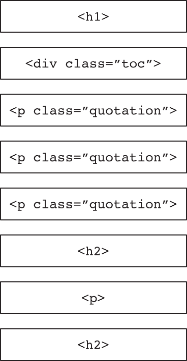
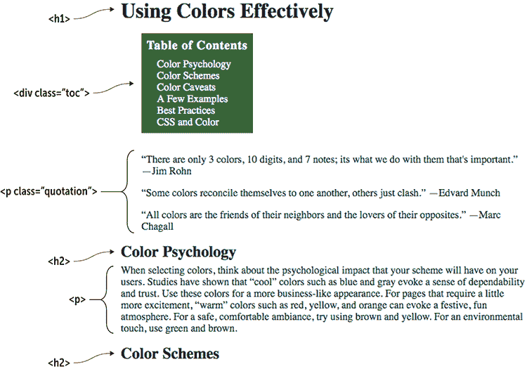
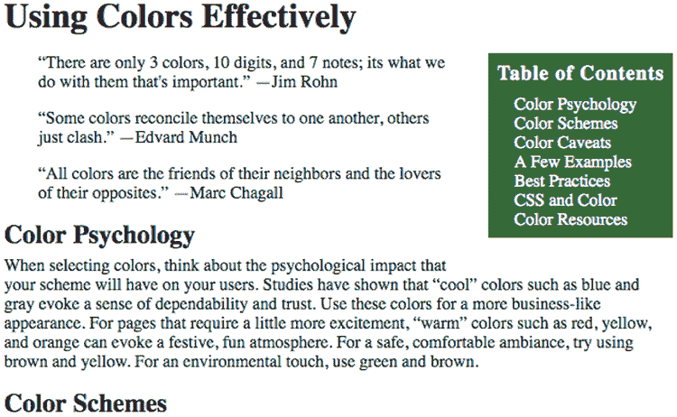
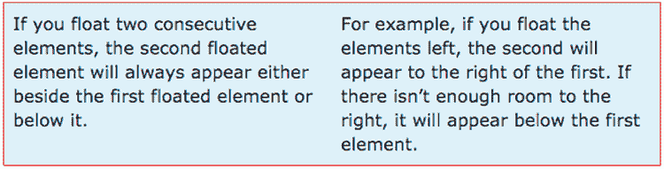
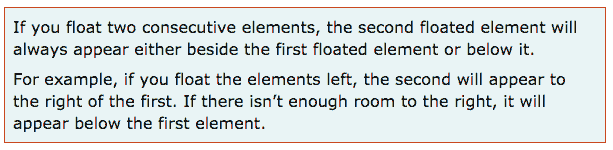
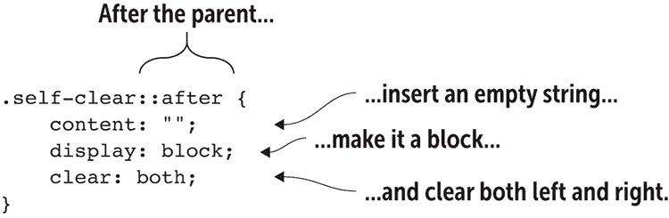
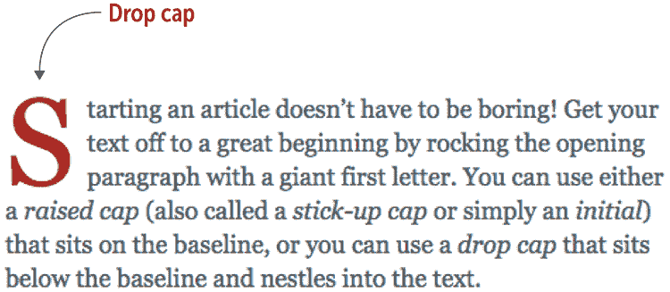
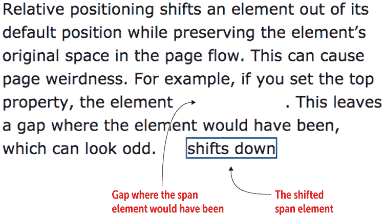
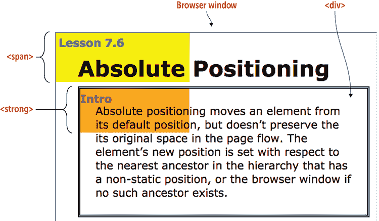

# 第八章 浮动和定位元素

> 浮动属性是任何使用 HTML 和 CSS 的网页设计师/开发者宝贵的强大工具。 ——Noah Stokes

**本章涵盖**

+   学习元素如何在页面上下流动

+   通过浮动元素中断正常流程

+   使用浮动创建首字下沉和引文

+   通过定位元素中断正常流程

如果浏览器自行决定，它会对你的网页施加一个不可变的结构，你的网站可能会变得无聊（至少从设计角度来看）。为了避免这种情况，你需要掌握你的页面元素，并摆脱浏览器关于如何布局的固定想法。你可以通过运用网页设计师工具箱中最强大的两个 CSS 工具来实现这一点：浮动和定位。有了这些工具，你可以打破浏览器的默认元素流程，构建有趣、富有创意的页面，人们会迫不及待地想要访问。本章将告诉你需要知道的一切。

## 理解默认页面流程

当你向网页添加元素时，浏览器会根据以下规则按照它们在 HTML 文件中出现的顺序来布局这些元素：

+   块级元素垂直堆叠，第一个元素在最上面，第二个元素在它下面，以此类推。

+   每个内联元素都在其父块级元素内从左到右（在英语和其他从左到右的语言中）渲染。

图 8.1 展示了几个块级元素的示意图，按照浏览器渲染的方式堆叠。图 8.2 展示了添加了内联元素的相应网页。

图 8.1 浏览器将块级元素一个堆叠在另一个上面。



图 8.2 来自图 8.1 的块级元素，填充了内联元素



## 第 8.1 课：浮动元素

涵盖：`float`属性

在线：[wdpg.io/8-1-0](http://wdpg.io/8-1-0)

你可以通过将一个或多个元素浮动到左侧或右侧来中断元素的上下流程。*浮动*意味着浏览器将元素从常规流程中取出，并将其放置在其父元素中尽可能远的左侧或右侧（取决于你提供的值），尽可能高（取决于其他内容）。然后，页面的其余内容围绕浮动元素流动。

你可以通过设置其`float`属性来浮动一个元素：

```
*element* {
    float: left|right|none;
}

```

精通

由于附近的非浮动页面元素围绕浮动元素包裹，你应该通过在浮动元素周围添加边距来确保它们之间有足够的空白。

记住

与非浮动元素不同，浮动元素的上下边距不会合并。参见第九章了解关于边距合并的更多信息。

例如，在图 8.2 中，如果目录可以被推到右边，而引用围绕它流动，页面看起来会更好，空间利用也会更合理。这可以通过`float`属性轻松实现，如下例所示。

#### 示例

在线：[wdpg.io/8-1-1](http://wdpg.io/8-1-1)

此示例使用`float`属性将目录浮动到右边。

#### 网页



#### CSS

```
.toc {
 float: right;    ① 
    margin-left: 2em;
    margin-bottom: 2em;
    etc.
}

```

①  应用于`toc`类的`float`属性

#### HTML

```
<h1>Using Colors Effectively</h1>
<div class="toc">    ② 
    <h3>Table of Contents</h3>
    <div>Color Psychology</div>
    <div>Color Schemes</div>
    <div>Color Caveats</div>
    <div>A Few Examples</div>
    <div>Best Practices</div>
    <div>CSS and Color</div>
    <div>Color Resources</div>
</div>
<p class="quotation">
“There are only 3 colors, 10 digits, and 7 notes; its what we do with them that's important.” —Jim Rohn
</p>
etc.

```

②  这个`<div>`标签使用了`toc`类。

常见问题解答

*我能否只浮动**块级元素**？* 不，你还可以将`float`属性应用于内联元素，例如`span`。但是，当你这样做的时候，浏览器会将该元素从正常流程中移除，将其转换为块级元素，然后再进行浮动。

谨慎

如果你浮动一个内联元素，务必给它一个宽度，这样浏览器就知道为该元素分配多少空间。

播放

你可以浮动多个元素。在线：[wdpg.io/8-1-3](http://wdpg.io/8-1-3)

### 清除浮动元素

在前面的示例中，请注意，不仅三个引用围绕了浮动的目录；第一个`h2`元素（“色彩心理学”）及其后的部分段落也是如此。这种行为通常是您想要的。但如果是出于美学或其他原因，您更希望`h2`元素及其文本**不**围绕目录折叠？

你可以通过告诉浏览器你希望`h2`元素**清除**浮动元素来实现这一点。**清除**浮动元素意味着浏览器在浮动元素之后渲染该元素。你通过设置其`clear`属性来清除元素：

```
*element* {
    clear: left|right|both|none;
}

```

你使用`left`来清除`*元素*`中任何已经左浮的元素，使用`right`来清除`*元素*`中任何已经右浮的元素，或者使用`both`来清除`*元素*`中左右浮动的元素。为了清除示例中的`h2`元素，我会使用以下代码：

```
h2 {
    clear: right;
}

```

图 8.3 显示了现在清除浮动目录的`h2`（色彩心理学）页面。

图 8.3 现在色彩心理学的`h2`元素清除浮动目录。



### 防止容器塌陷

浮动元素有几个需要注意的问题。最大的问题是，在特定情况下，一个浮动的元素可能会溢出或直接从其父容器中掉落。为了理解我的意思，请看以下代码（见图 8.4），它有两个`<p>`标签在一个带有浅蓝色背景和红色边框的`<div>`容器中：

CSS:

```
div {
    border: 1px solid red;
    background-color: lightcyan;
}

```

HTML:

```
<div>
    <p>
        If you float two consecutive elements, the second floated element will always appear either beside the first floated element or below it.
    </p>
    <p>
        For example, if you float the elements left, the second will appear to the right of the first. If there isn’t enough room to the right, it will appear below the first element.
    </p>
</div>

```

图 8.4 `<div>`容器内的两个`<p>`元素



图 8.5 显示了当我使用宽度并左浮动`<p>`标签时的结果：

CSS:

```
.col {
    float: left;
    width: 300px;
}

```

HTML:

```
<p class="col">

```

图 8.5 当我浮动`<p>`元素时，`<div>`容器会自己收缩。


奇怪的是，`<div>`容器几乎消失了！顶部的那条红线就是它留下的全部。发生了什么？当我浮动`<p>`元素时，浏览器将它们从页面的正常流程中移除。`<div>`容器看到它不再包含任何内容，因此它自己收缩了。这种情况总是发生在父元素只包含浮动子元素时。

为了解决这个问题，你可以告诉父元素清除它自己的子元素，从而防止它收缩。图 8.6 显示了一个执行此操作的类。

图 8.6 一个允许父元素清除其自己的子元素的类



记住

这种解决方案有时被称为*clearfix*技巧。

精通

一些网页开发者更喜欢使用更语义化的类名，例如`group`。

这个类告诉浏览器插入一个空字符串，将其渲染为块级元素，并使其清除左右浮动的元素。以下示例显示了修复的效果和完整代码。

#### 示例

在线：[wdpg.io/8-1-5](http://wdpg.io/8-1-5)

这个示例通过告诉父元素清除它自己的浮动子元素来修复收缩父元素的问题。

#### 网页


#### CSS

```
div {    ① 
 border: 1px solid red;    ① 
    background-color: lightcyan;
 width: 675px;    ① 
}    ① 
.col {    ② 
 float: left;    ② 
 width: 300px;    ② 
}    ② 
.self-clear::after {    ③ 
 content: "";    ③ 
 display: block;    ③ 
 clear: both;    ③ 
}    ③ 

```

①  这个规则样式化`div`元素。

②  这个类为元素添加宽度并将其浮动。

③  这个类防止父元素收缩。

#### HTML

```
<div class="self-clear">
<p class="col">
If you float two consecutive elements, the second floated element will always appear either beside the first floated element or below it.
</p>
<p class="col">
For example, if you float the elements left, the second will appear to the right of the first. If there isn’t enough room to the right, it will appear below the first element.
</p>
</div>

```

### 浮动下沉首字母

浮动有许多用途，但其中我最喜欢的是创建一个*下沉首字母*，这是一个段落的大写首字母，位于基线以下，并“下沉”几行到段落中。技巧是使用`::first-letter`伪元素选择开头的字母，并将其浮动到段落的左侧。然后你通过调整字体大小、行高和填充来得到你想要的效果，如下面的示例所示。

#### 示例

在线：[wdpg.io/8-1-6](http://wdpg.io/8-1-6)

这个示例使用`float`和`::first-letter`伪元素来创建下沉首字母。

#### 网页



#### CSS

```
.first-paragraph::first-letter {    ① 
 float: left;    ② 
 padding-top: .1em;    ③ 
 padding-right: .1em;    ③ 
 color: darkred;    ③ 
 font-size: 5em;    ③ 
 line-height: .6em;    ③ 
}

```

①  1. 选择第一个字母。

②  2. 向左浮动。

③  3. 根据个人喜好进行样式设计。

#### HTML

```
<p class="first-paragraph">
Starting an article doesn’t have to be boring! Get your text off to a great beginning by rocking the opening paragraph with a giant first letter. You can use either a <i>raised cap</i> (also called a <i>stick-up cap</i> or simply an <i>initial</i>) that sits on the baseline, or you can use a <i>drop cap</i> that sits below the baseline and nestles into the text.
</p>

```

精通

如果你更喜欢凸起的首字母而不是下沉的首字母，你可以修改示例代码以适应这种偏好。你需要移除`float`声明以及`padding-top`和`padding-right`声明。

### 浮动引言引用

浮动元素的一个很棒用途是为文章添加一个引言引用。一个*引言引用*是从文章中摘取的简短但重要或富有启发性的摘录，它从常规文本中突出显示。一个精心挑选和设计的引言引用可以吸引那些可能不会阅读文章的网站访客。

你可以通过在元素（如`span`）周围包围摘录的文本，然后浮动该元素（通常向右），来创建引用引语。现在根据需要样式化元素，以确保它与常规文本区分开来：顶部和/或底部边距、不同的字体大小、样式或颜色等。以下是一个示例。

#### 示例

在线：[wdpg.io/8-1-7](http://wdpg.io/8-1-7)

本例使用`浮动`来创建引用引语。

#### 网页


#### CSS

```
.pullquote {
 float: right;    ① 
 width: 50%;    ② 
 margin: 1.25em 0 1em .25em;    ② 
 padding-top: .5em;    ② 
 border-top: 1px solid black;    ② 
 border-bottom: 1px solid black;    ② 
 font-size: 1.05em;    ② 
 font-style: italic;    ② 
 color: #666;    ② 
}
.pullquote::before {    ③ 
 content: "\0201c";    ③ 
 float: left;    ③ 
 padding: .1em .2em .4em 0;    ③ 
 font-size: 5em;    ③ 
 line-height: .45em;    ③ 
}
```

①  此代码使元素浮动。

②  此代码为引用引语添加样式。

③  创建一个可选的大引号。

#### HTML

```
<p>
A <i>pull quote</i> is a short excerpt or an important phrase or quotation that has been copied (“pulled”) from a piece of text and displayed as a separate element between or, more often, to one side of the regular text.
<span class="pullquote">    ④ 
It’s the job of the pull quote to entice the would-be reader.    ④ 
</span>    ④ 
It’s important that the pull quote be styled in a way that not only makes it stand apart from the regular text (with, for example, a different font size, style, or color), but also makes it stand out for the reader. After all, it’s the job of the pull quote to entice the would-be reader and create a desire to read the article.
</p>

```

④  引用引语元素

尽管存在诸如父元素塌陷等令人挠头的表现，但浮动元素对于将其从默认流中分离出来以实现有趣的布局和效果非常有用。浮动让浏览器做大部分工作，但如果你想要对页面外观有更多的控制，你需要通过指定元素的定位来更多地参与其中。

## 第 8.2 课：定位元素

涵盖：`position`属性

在线：[wdpg.io/8-2-0](http://wdpg.io/8-2-0)

我在本章前面提到，浏览器为页面元素使用的默认布局按照它们在 HTML 文件中出现的顺序渲染元素，堆叠块级元素，并允许内联元素从左到右填充其父块。这个系统很少产生令人信服的布局，因此除了浮动元素之外，你还可以使用另一种技术（即定位一个或多个元素），通过使用 CSS `position`属性结合一个或多个 CSS 偏移属性来自定义流：

```
*element* {
    position: static|relative|absolute|fixed;
    top: *measurement*|*percentage*|auto;
    right: *measurement*|*percentage*|auto;
    bottom: *measurement*|*percentage*|auto;
    left: *measurement*|*percentage*|auto;
    z-index: *integer*|auto;
}

```

对于前四个偏移属性—`top`、`right`、`bottom`和`left`—你可以使用在第七章中学到的任何 CSS 度量单位，包括`px`、`em`、`rem`、`vw`和`vh`。你也可以使用百分比或`auto`（默认值）。`z-index`属性设置元素在堆叠上下文中的位置，这定义了当元素重叠时，元素是如何层叠在彼此之上和之下的。`z-index`值较高的元素会覆盖`z-index`值较低的元素。

对于`position`属性，以下是对四种可能性的快速总结：

+   `静态定位`—忽略偏移属性（这是浏览器使用的默认定位）

+   `相对定位`—将元素相对于其默认位置进行定位，同时保持元素在页面流中的默认位置

+   `绝对定位`—将元素放置在最近具有非静态定位的祖先元素中的特定位置，同时从页面流中移除该元素

+   `固定定位`—将元素放置在浏览器视口中特定位置，同时从页面流中移除该元素

接下来的几节将更详细地介绍相对、绝对和固定定位。

### 相对定位

当你相对定位一个元素时，元素的默认位置仍然保持在正常页面流中，但元素会根据你指定的偏移值或值进行偏移：

+   如果你提供一个 `top` 值，元素会向下偏移。

+   如果你提供一个 `right` 值，元素将从右侧进行偏移。

+   如果你提供一个 `bottom` 值，元素将从上方进行偏移。

+   如果你提供一个 `left` 值，元素将从左侧进行偏移。

记住

这些偏移假设你为每个属性提供正值。允许使用负值（并且在网页设计领域经常使用）并且会导致相反方向的偏移。例如，负 `top` 值将元素向上偏移。

浏览器保持元素的默认页面流位置可能会导致一些不寻常的渲染，如下面的示例所示。

#### 示例

在线：[wdpg.io/8-2-1](http://wdpg.io/8-2-1)

此示例将 `span` 元素设置为具有 `top` 偏移的相对定位。

#### 网页



#### CSS

```
span {    ① 
 position: relative;    ① 
 top: 3em;    ① 
 border: 2px solid blue;    ① 
}    ① 

```

①  将相对定位和顶部偏移应用于 `span` 元素

#### HTML

```
<div>
Relative positioning shifts an element out of its default position while preserving the element’s original space in the page flow. This can cause page weirdness. For example, if you set the top property, the element <span>shifts down</span>. This leaves a gap where the element would have been, which can look odd.    ②  
</div>

```

②  `span` 元素

播放

使用相对定位将水印文本添加到段落中。在线：[wdpg.io/8-2-2](http://wdpg.io/8-2-2)

你可能不会经常直接使用相对定位来布局页面元素，但正如你在下一节中看到的，当你想要准备元素以使用绝对定位时，它非常有用。

### 绝对定位

当你绝对定位一个元素时，浏览器会做两件事：它将元素从默认页面流中移除，并相对于其最近的非静态（即定位）祖先定位元素。如果你想要正确地使用绝对定位，找出这个祖先至关重要：

+   向上移动到元素的父元素、祖父元素等。第一个其 `position` 属性设置为非 `static` 的元素就是你要找的祖先。

+   如果找不到这样的祖先，浏览器将使用视口，这意味着元素的绝对位置是相对于浏览器的内容区域设置的。

找到祖先后，浏览器将根据以下方式设置元素的绝对位置：

+   如果你提供一个 `top` 值，元素将从祖先的顶部向下移动。

+   如果你提供一个 `right` 值，元素将从祖先的右侧向左移动。

+   如果你提供一个 `bottom` 值，元素将从祖先的底部向上移动。

+   如果你提供一个 `left` 值，元素将从祖先的左侧向右移动。

记住

与相对定位一样，允许使用负值，并将元素定位在相反方向。例如，负 `left` 值将元素相对于祖先的左侧向左移动。

#### 示例

在线：[wdpg.io/8-2-3](http://wdpg.io/8-2-3)

此示例将 `span` 元素和 `strong` 元素都设置为绝对定位。

#### 网页



#### CSS

```
h1, div {
 position: relative;    ① 
    z-index: 2;
}
span {
 position: absolute;    ② 
 top: 0;    ② 
 left: 0;    ② 
    z-index: 1;
    padding: 0.25em 6em 3em 0.25em;
    background-color: yellow;
    color: blue;
}
strong {
 position: absolute;    ② 
 top: 0;    ② 
 left: 0;    ② 
    z-index: -1;
    padding: 0.25em 5em 2.5em 0;
    background-color: orange;
    color: purple;
}
```

①  `div` 元素是非静态的。

②  `span` 和 `strong` 元素被绝对定位。

#### HTML

```
<h1>
Absolute Positioning
</h1>
<div>
Absolute positioning moves an element from its default position, but doesn’t preserve the its original space in the page flow. The element’s new position is set with respect to the nearest ancestor in the hierarchy that has a non-static position, or the browser window if no such ancestor exists. <strong>Intro</strong>    ③  
</div>
<span>Lesson 8.6</span>    ④ 

```

③  `strong` 元素

④  `span` 元素

看看它

要查看此示例中浏览器定位元素的动画，请打开 Web 设计游乐场中的示例并点击“看看它”按钮。在线：[wdpg.io/8-2-3](http://wdpg.io/8-2-3)

精通

此示例还演示了 `z-index` 属性。`h1` 和 `div` 元素已被赋予 `z-index` 值为 2。`span` 元素被赋予 `z-index` 值为 1；因此，它出现在 `h1` 的后面。`strong` 元素被赋予 `z-index` 值为 -1；因此，它出现在 `div` 的后面。

在此示例中，有两个元素被绝对定位：

+   `span`—此元素没有非静态定位的祖先元素，因此它相对于浏览器窗口进行定位。当您将 `top` 和 `left` 都设置为 0 时，`span` 元素移动到窗口的左上角。

+   `strong`—此元素嵌套在一个相对定位的 `div` 元素中。因此，`strong` 元素的绝对位置相对于 `div`。在这种情况下，当您将 `top` 和 `left` 都设置为 0 时，`strong` 元素移动到 `div` 的左上角。

### 固定定位

我将要考虑的最后一个 `position` 属性值是 `fixed`。这个值与 `absolute` 类似，除了两点：

+   浏览器始终相对于浏览器窗口计算位置。

+   元素在浏览器定位后不会移动，即使您滚动页面的其余内容。

如您所想象，这个值对于添加固定在屏幕顶部的导航栏或固定在底部的页脚非常有用。您可以在第十五章中看到后者的一个示例。

常见问题解答

*你为什么给 `strong` 元素的* `*z-index*`* 设置为 -1*？`strong` 元素是 `div` 元素的子元素，在 CSS 中，使子元素在堆叠上下文中比其祖先元素显示得更低，唯一的方法是给子元素一个负的 `z-index` 值。

播放

您可以使用绝对定位为您的链接添加 *工具提示*（弹出描述）。在线：[wdpg.io/8-2-4](http://wdpg.io/8-2-4)

## 摘要

+   在默认页面流中，块级元素垂直堆叠，内联元素在其父块内从左到右渲染。

+   要将元素从默认页面流中拉出，将其 `float` 属性设置为 `left` 或 `right`。

+   要定位一个元素，将其 `position` 属性设置为 `relative`、`absolute` 或 `fixed`；然后使用 `top`、`right`、`bottom` 和 `left` 指定新位置。

+   使用 `z-index` 属性在堆叠上下文中设置元素的位置，该属性将值较高的元素层叠在值较低的元素之上。
