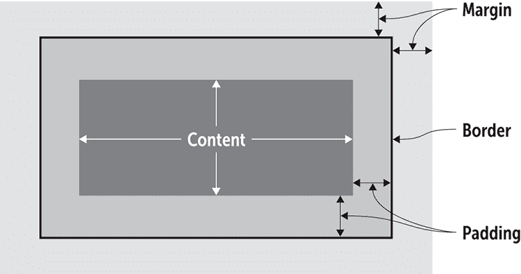
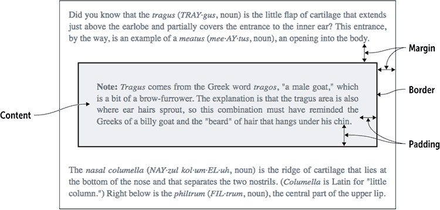
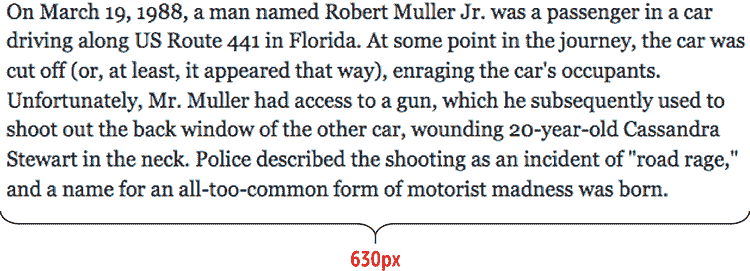
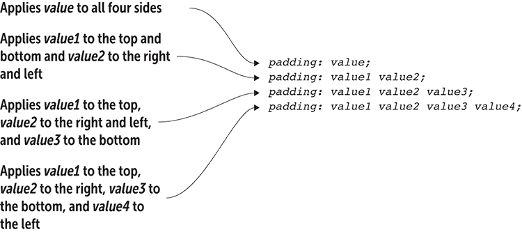
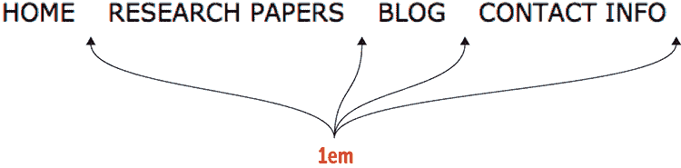
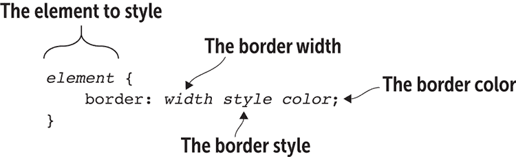
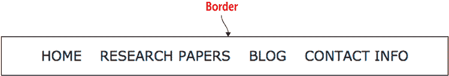
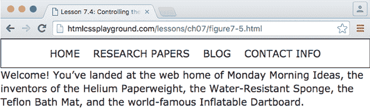
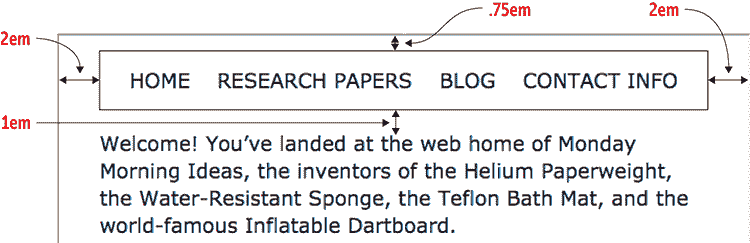
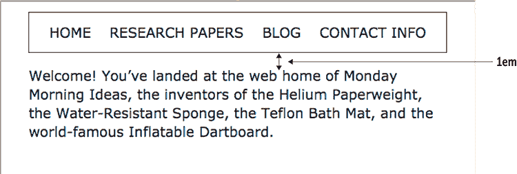

# 第九章  设置大小、边框和边距样式

> 理解 CSS 盒模型对于使你的设计按预期表现至关重要。*—克雷格·坎贝尔*

**本章涵盖**

+   理解 CSS 盒模型

+   设置元素的宽度和高度

+   在元素内容周围添加填充

+   为元素应用边框

+   在元素周围添加边距

当你学习设计时，第一个出现的概念之一是邻近性原则：相关项目应彼此靠近，不相关项目应分离。这种做法为设计提供了清晰的视觉组织，使得读者更容易理解和导航设计。邻近性原则也适用于你的网页设计，但有一个问题。如果你坚持使用浏览器的默认样式，你的网页元素将没有邻近性结构；没有元素被分组或分离，因此没有组织。幸运的是，CSS 提供了一套强大的属性，使你能够通过调整页面上的元素大小、间距和分离来应用邻近性原则。你将在第三部分认真学习网页布局，但本章将介绍一些重要的基础。

## 元素框的解剖结构

使你的网页内容按照你的意愿弯曲的关键在于理解，你添加到页面上的每个元素——每个`<div>`、每个`<p>`、每个`<span>`，甚至是每个`<strong>`和每个`<em>`——都被一个不可见的框所包围。为什么那是一件大事呢？因为你可以使用 CSS 来控制该框的许多方面，包括其高度、宽度、间距、边框和页面上的位置。要达到这一点，你需要熟悉框的各个部分。

图 9.1 提供了基本盒部分的一个抽象视图，而图 9.2 展示了这些相同的部分如何影响一些实际的页面内容。

图 9.1 元素框的主要部分



图 9.2 元素框的各部分及其在真实页面内容中的显示



> 在避免重复自己的风险中：*网页设计中的每个元素都是一个矩形框*。这是我顿悟的时刻，它帮助我真正开始理解基于 CSS 的网页设计，并完成我想要完成的布局。*—克里斯·科伊尔*

每个元素框有四个部分：

+   *内容* —这个区域是框的内矩形，由框内包含的内容（如一些文本或图像）组成。

+   *填充* —这个区域位于内容和边框之间，代表在内容区域的顶部、右侧、底部和左侧边缘之外添加的额外空白。

+   *边框* —这一部分沿着填充区域的边缘运行，并用线条包围内容和填充。

+   *边距* —这个区域是框的外部矩形，代表在顶部、右侧、底部和左侧边框之外添加的额外空白。

在 CSS 领域，内容区域、填充、边框和边距的组合被称为 *盒模型*。令人惊讶的是，这个盒模型不仅适用于常见的块级元素（如 `<div>`、`<h1>` 和 `<p>`），也适用于所有内联元素（如 `<span>`、`<em>` 和 `<a>`）。为什么盒模型如此重要？主要有两个原因：外观和定位。

外观至关重要，因为盒模型允许你控制围绕内容的 *空白* ——填充和边距。正如任何设计师都会告诉你的，充分利用空白是任何成功布局的关键部分。

定位至关重要，因为 CSS 还提供了相当多的控制元素框在页面上的位置的能力。CSS 提供的与盒模型相关的属性，让你可以将每个框移动到你想要的布局位置，而不是默认的——并且 *无聊* ——布局，即一个元素堆叠在下一个元素上，一直延伸到页面底部。

在尽可能记住所有这些的情况下，现在是时候将你的注意力转向那些有用且强大的 CSS 属性，这些属性使你能够操纵任何元素框。首先：更改盒尺寸。

## 第 9.1 节：设置宽度和高度

覆盖内容：`width` 和 `height` 属性

在线：[wdpg.io/9-1-0](http://wdpg.io/9-1-0)

当网页加载时，网络浏览器会进行大量的自动计算。其中两个自动值是页面中每个元素框的宽度和高度，这些值根据以下指南设置：

+   每个元素框的宽度设置为元素容器的宽度，默认情况下是浏览器窗口的宽度。

+   每个元素框的高度设置为足够高的值，可以包含所有元素的内容。

记住

我应该在这里澄清，这些计算仅适用于块级元素，如 `<div>` 和 `<p>`。内联元素，如 `<span>` 和 `<a>`，与文本一起流动，因此忽略 `width` 和 `height`。

精通

如果你想要处理内联元素的 `width`、`height` 和其他与块相关的属性，但保持元素内联，请将 `display: inline-block` 添加到元素的 CSS 中。要使元素成为真正的块级元素，请添加 `display: block`。

良好网页设计的主要原则之一是，你应该覆盖这些和类似的浏览器默认设置，以便你对页面外观和布局有最大程度的控制。要使用任何块级元素框的尺寸，请使用 CSS 的 `width` 和 `height` 属性。这些属性可以采用你在第七章中学到的任何 CSS 测量单位，包括 `px`、`em`、`rem`、`vw` 和 `vh`。你还可以将 `width` 或 `height` 设置为百分比或 `auto`（默认值，允许浏览器自动设置尺寸）。

小心

你很少，如果有的话，应该设置元素的高度属性。设置高度对于图像很有用，但与文本相比，有太多的变量，无法确定所有内容是否都能适合你指定的宽度。让内容自然地创建元素的高度。

到目前为止，你可能正在问自己一个重要的问题。当你设置宽度或高度时，你是在调整元素框的四个矩形区域中的哪一个——内容、内边距、边框还是外边距？直观地，你可能猜测是边框，因为该区域包含内容和内边距，或者感觉像是元素框的“内部”。令人惊讶的是，情况并非如此。默认情况下，`width` 和 `height` 属性仅应用于 *内容* 区域。这真是太不幸了，因为当你调整元素的大小时，为了得到其在页面上渲染的真实大小，你必须加上其内边距和边框的值。如果这听起来像是一种不必要的复杂方法，你是对的。相反，你可以将元素的 `box-sizing` 属性设置为 `border-box`：

```
*element* {
    box-sizing: border-box;
}

```

精通

而不是对单个元素应用 `box-sizing`，你可以通过使用通用元素（`*`）一次性分配它，它将应用于每个元素。此外，如果你希望将某个元素恢复到默认的尺寸行为，请使用声明 `box-sizing: content-box`。

这段代码告诉网页浏览器将 `width` 和 `height` 值应用到元素框的边框（包括边框）上。请注意，外边距不包括在宽度和高度内。

`width` 属性对于设置文本行长度以实现最佳阅读效果非常有用。对于理想的屏幕阅读，你的正文文本块每行应包含 50 到 80 个字符（包括空格和标点符号）。在大多数情况下，大约 65 个字符的行长度是最理想的，但如果你使用较大的字体大小，可以设置更长的行，如果你使用较小的字体大小，可以设置较短的行。你通过调整文本块的 `width` 属性来设置行长度。考虑图 9.3 中显示的文本。

图 9.3 在大屏幕上的默认宽度下，这段文本的行长度太长，难以舒适阅读。


游戏

如果你设置了元素的高度，你可能会发现其内容溢出了元素框。为了控制这种行为，你可以使用 `overflow` 属性。在线：[wdpg.io/9-1-4](http://wdpg.io/9-1-4)

这段文本的行长度超过 150 个字符，很难阅读。你可以通过调整文本包含元素的宽度来解决这个问题，如下面的示例所示。

#### 示例

在线：[wdpg.io/9-1-1](http://wdpg.io/9-1-1)

这个示例将包含 `div` 元素的宽度减小，以便更容易阅读行长度。

#### 网页



#### CSS

```
div {
 box-sizing: border-box;    ① 
 width: 630px;    ② 
}

```

①  应用了 `border-box`。

②  宽度设置为理想的行长度。

#### HTML

```
<div>
On March 19, 1988, a man named Robert Muller Jr. was a passenger in a car driving along US Route 441 in Florida. At some point in the journey, the car was cut off (or, at least, it appeared that way), enraging the car's occupants. Unfortunately, Mr. Muller had access to a gun, which he subsequently used to shoot out the back window of the other car, wounding 20-year-old Cassandra Stewart in the neck. Police described the shooting as an incident of "road rage," and a name for an all-too-common form of motorist madness was born.
</div>

```

游戏

您可以使用`max-width`属性为元素指定最大宽度；同样，您可以使用`min-width`属性设置最小宽度。在线：[wdpg.io/9-1-3](http://wdpg.io/9-1-3)

## 第 9.2 课：添加填充

涵盖：`padding-*`属性

在线：[wdpg.io/9-2-0](http://wdpg.io/9-2-0)

在元素框中，填充是添加到内容上方、下方、左侧和右侧的空白。如果您为元素添加了边框，如第 9.3 课所述，则填充是内容与边框之间的空间。填充为元素在其框内提供了一些呼吸空间，确保内容不会被其自身的边框或附近元素拥挤。

您可以通过为四个边分别应用一个值来设置填充：

```
*element* {
    padding-top: *top-value*;
    padding-right: *right-value*;
    padding-bottom: *bottom-value*;
    padding-left: *left-value*;
}

```

每个值都可以采用任何标准 CSS 度量单位，包括`px`、`em`、`rem`、`vw`和`vh`，或者您可以将值设置为百分比。以下是一个示例：

```
.pullquote {
    padding-top: 1em;
    padding-right: 1.5em;
    padding-bottom: .75em;
    padding-left: 1.25em;
}

```

您还可以使用`padding`简写属性通过单个声明设置所有填充值。您可以使用此属性的四种语法，如图 9.4 所示。

图 9.4 `padding`简写属性的语法



您可以通过以下简写语法复制先前的规则：

```
.pullquote {
    padding: 1em 1.5em .75em 1.25em;
}

```

要了解如何使用填充使您的网页更易于阅读，请考虑以下简单的导航栏，如图 9.5 所示。

图 9.5 没有任何水平填充的导航栏


精通

此示例通过以下两个操作将无序列表转换为导航菜单：将`ul`元素的`list-style-type`属性设置为`none`以隐藏项目符号，并将`li`元素的`display`属性设置为`inline-block`，这告诉浏览器将项目视为块，但以行内方式显示。

最大的问题是，仅凭外观无法判断有多少导航项。您可能有多达六个（主页、研究、论文、博客、联系和信息）或少至三个（主页、研究论文博客、联系信息）。为了解决这个问题，您可以使用填充在项目之间添加一些水平呼吸空间，如下例所示。

> 在导航项之间具有紧密间距的水平导航是一个常见问题，我在设计良好的网站上经常遇到。如果没有足够的填充，导航项开始聚集在一起，变得难以快速扫描。*——杰里米·肖夫*

#### 示例

在线：[wdpg.io/9-2-1](http://wdpg.io/9-2-1)

此示例使用`padding-right`属性在导航菜单中的元素之间创建空间。

#### 网页



#### CSS

```
ul {
    list-style-type: none;
    text-transform: uppercase;
}

li {
    display: inline-block;
 padding-right: 1em;    ① 
}

```

①  `padding-right`应用于`li`元素。

#### HTML

```
<ul>
 <li>Home</li>    ② 
 <li>Research Papers</li>    ② 
 <li>Blog</li>    ② 
 <li>Contact Info</li>    ② 
</ul>

```

②  `li`元素

看看这个

要查看浏览器在上面的例子中如何添加填充的动画，请打开 Web 设计游乐场中的示例并点击“查看”按钮。在线：[wdpg.io/ 9-2-1](http://wdpg.io/9-2-1)

## 第 9.3 课：应用边框

覆盖内容：`border-*`属性

在线：[wdpg.io/9-3-0](http://wdpg.io/9-3-0)

在元素框中，`border`是定义四侧（顶部、右侧、底部和左侧）填充外边缘的线条。这样，边框位于元素的填充和边距之间。边框是可选的，但通常对于为读者提供视觉指示，表明封装的内容与任何附近的内容是分开的非常有用。

使用方法

给一个元素添加边框，以提供视觉指示，表明内容是自包含的或与周围页面内容分离。

要创建一个基本的边框，请使用`border`属性，如图 9.6 所示。

图 9.6 `border`属性的语法



`*宽度*`值可以接受任何标准的 CSS 度量单位，包括`px`、`em`、`rem`、`vw`和`vh`。你也可以将值设置为以下任意一个关键字：`thin`、`medium`或`thick`。对于`*样式*`值，你可以使用以下任意一个关键字：`dotted`、`dashed`、`solid`、`double`、`groove`、`ridge`、`inset`或`outset`。对于`*颜色*`参数，你可以使用你在第四章中学到的任何颜色名称。

这里有一个例子：

```
.pullquote {
    border: 1px solid black;
}

```

此规则定义了`pullquote`类，具有一像素宽、实线、黑色边框。

以下示例从第 9.2 课的导航列表中添加了边框。

#### 示例

在线：[wdpg.io/9-3-1](http://wdpg.io/9-3-1)

此示例在导航菜单周围添加了边框。

#### 网页



#### CSS

```
ul {
 border: 1px solid black;    ① 
 padding-top: .75em;    ② 
 padding-bottom: .75em;    ② 
    list-style-type: none;
 text-align: center;    ③ 
    text-transform: uppercase;
}

li {
    display: inline-block;
    padding-right: 1em;
}
li:first-child {    ④ 
 padding-left: 1em;    ④ 
}

```

①  边框

②  顶部和底部添加填充

③  项目居中。

④  左侧额外填充

#### HTML

```
<ul>
    <li>Home</li>
    <li>Research Papers</li>
    <li>Blog</li>
    <li>Contact Info</li>
</ul>

```

> 当你需要将内容分成逻辑部分，并且你的设计需要内容分离，且没有它设计看起来会杂乱无章时，请使用边框。*——安德鲁·斯托克*

一个奇怪的小细节可能会让你皱眉：`li:first-child`元素有一个`padding-left`值为`1em`。怎么回事？回想一下第 9.2 课的例子，你需要添加`1em`的填充来分隔菜单项。你是通过使用`padding-right`属性来做到这一点的，但这样做也意味着在“联系信息”项目的右侧添加了`1em`的填充。为了补偿右侧的额外填充，你需要添加相同数量的左侧填充，以便菜单正确居中。`li:first-child`规则为第一个`li`元素添加了所需的填充。

演示

CSS 盒模型一开始可能有些令人困惑，因为它难以可视化围绕每个元素的框。为了帮助理解，可以使用`outline`属性，该属性在框边框的外侧边缘添加一条线。`outline`属性使用与`border`属性相同的语法。在线：[wdpg.io/9-3-3](http://wdpg.io/9-3-3)

## 第 9.4 课：控制边距

涵盖：`margin-*`属性

在线：[wdpg.io/9-4-0](http://wdpg.io/9-4-0)

在元素框中，*边距*是添加到边框上方、下方、左侧和右侧的空白。边距让您能够控制元素之间的空间。例如，正值边距可以防止页面元素相互碰撞或重叠，并防止元素触及浏览器视口的边缘。另一方面，如果您的设计需要元素重叠，您可以通过使用负值边距来实现这种效果。

您通过设置一个或多个元素的四个方向的值来应用边距：

```
*element* {
    margin-top: *top-value*;
    margin-right: *right-value*;
    margin-bottom: *bottom-value*;
    margin-left: *left-value*;
}

```

每个边距值可以使用任何标准 CSS 度量单位，例如`px`、`em`、`rem`、`vw`和`vh`。您还可以使用百分比或`auto`关键字（让浏览器自动设置边距以适应可用空间）。以下是一个示例：

```
.pullquote {
    margin-top: 1.5em;
    margin-right: 2.5em;
    margin-bottom: 2em;
    margin-left: 3em;
}

```

精通

正值边距用于将元素从周围元素（或浏览器视口的边缘）推开。有时，您可能希望将元素*靠近*，您可以通过设置负值边距来实现这一点。在线：[wdpg.io/9-4-5](http://wdpg.io/9-4-5)

使用它

边距对于建立页面文本块之间的间距，尤其是段落之间的间距非常有用。为每个段落设置间距的一个好规则是将底部边距设置为`1em`。

与`padding`一样，`margin`简写属性允许您通过单个声明应用边距。图 9.7 显示了您可以使用此属性的四种语法。

图 9.7 `margin`简写属性的语法可能性


您可以通过使用如下简写语法重写前面的规则：

```
.pullquote {
    margin: 1.5em 2.5em 2em 3em;
}

```

重要的是要记住，网络浏览器通过使用其内部样式表为所有元素设置默认边距。这听起来很方便，但网络设计的一个关键原则是通过自己设置样式来获得对页面外观的最大控制。朝着这个方向迈出的重要一步是在样式表顶部添加以下代码：

> 我们认为我们的 CSS 是修改文档的默认外观——但使用“重置”样式表，我们可以使默认外观在浏览器之间更加一致，从而减少与浏览器默认设置斗争的时间。*——埃里克·迈耶*

```
html, body, abbr, article, aside, audio, blockquote, button, canvas, code, div, dl, dt, embed, fieldset, figcaption, figure, footer, form, h1, h2, h3, h4, h5, h6, header, iframe, img, input, label, legend, li, nav, object, ol, option, p, pre, q, section, select, table, tbody, td, tfoot, th, thead,  tr, ul, video {
    margin: 0;
    padding: 0;
}

```

此代码移除了浏览器默认的所有这些元素的边距和填充，使您能够根据需要自行调整页面上的这些设置。如果您的页面较小，您可以使用以下简化版本：

```
* {
    margin: 0;
    padding: 0;
}

```

注意，然而，你确实需要设置你的页边距。为什么需要这样做，图 9.8 展示了当页边距被重置为 0 时的简单导航栏。

图 9.8 没有任何页边距的导航栏



播放

你也可以使用一个页边距技巧来在父元素内垂直居中子元素。在线：[wdpg.io/9-4-4](http://wdpg.io/9-4-4)。

如你所见，导航栏被渲染得紧贴浏览器的顶部、右侧和左侧边缘，导航栏底部和文本之间几乎没有空间。为了解决这个问题，你可以设置导航栏的页边距，在其周围添加一些欢迎的空白，如下面的例子所示。

#### 示例

在线：[wdpg.io/9-4-1](http://wdpg.io/9-4-1)

这个例子使用`margin`属性在导航菜单周围创建空间。

#### 网页



#### CSS

```
ul {
    border: 1px solid black;
 margin-top: .75em;    ① 
 margin-right: 2em;    ① 
 margin-bottom: 1em;   ① 
 margin-left: 2em;     ① 
    padding-top: .75em;
    padding-bottom: .75em;
    list-style-type: none;
    text-align: center;
    text-transform: uppercase;
}
div {
 margin-right: 2em;    ② 
 margin-left: 2em;     ② 
}

```

①  应用于`ul`元素的页边距属性

②  应用于`div`元素的页边距属性

#### HTML

```
<ul>
    <li>Home</li>
    <li>Research Papers</li>
    <li>Blog</li>
    <li>Contact Info</li>
</ul>
<div>
Welcome! You’ve landed at the web home of Monday Morning Ideas, the inventors of the Helium Paperweight, the Water-Resistant Sponge, the Teflon Bath Mat, and the world-famous Inflatable Dartboard.
</div>

```

播放

如果你已经设置了元素的宽度，你可以通过使用声明`margin:` `*top/bottom*` `auto`快速水平居中元素，其中`*top/bottom*`是顶部和底部页边距的值。在线：[wdpg.io/9-4-3](http://wdpg.io/9-4-3)。

## 小心页边距塌陷！

在前面的例子中，我在`ul`元素上添加了`margin-bottom: 1em`以将其与`div`文本分开。假设我决定我想在这两个元素之间有`2em`的空间，所以我调整了`div`规则如下。图 9.9 展示了结果：

```
div {
 margin-top: 1em;    ① 
    margin-right: 2em;
    margin-left: 2em;
}

```

①  添加到`div`元素的顶部页边距

图 9.9 添加了`1em`顶部页边距的`div`文本



不，你的眼睛并没有欺骗你：导航栏和`div`文本之间的空间与之前完全相同！这里发生的是一种巧妙的 CSS 现象，称为*页边距塌陷*。当一个元素的底部页边距遇到另一个元素的顶部页边距时，浏览器不会像你预期的那样将两个值相加。相反，它确定两个值中哪个更大，并使用该值作为两个元素之间的垂直页边距。它丢弃较小的页边距值，从而将两个页边距合并为一个值。

精通

如果你确实想在两个元素之间增加额外的垂直空间，你可以增加两个值中较大的一个（例如，在`ul`元素上设置`margin-bottom: 2em`）。或者，将塌陷的页边距改为填充（例如，通过在`div`元素上用`padding-top: 1em`替换`margin-top`属性）。

记住

左右页边距永远不会塌陷。此外，对于浮动或绝对定位的元素，不会发生页边距塌陷（见第八章）。

如果您发现一个或多个页面元素的上边距或下边距表现异常——也就是说，比您想象的要大或小——那么折叠边距很可能是罪魁祸首。

## 摘要

+   CSS 元素框的四个主要部分是内容、围绕内容的填充、围绕填充的边框以及围绕边框的外边距。

+   您可以通过设置元素的`width`和`height`属性来指定元素的尺寸。

+   您可以通过使用四个填充属性：`padding-top`、`padding-right`、`padding-bottom`和`padding-left`来在元素内容周围添加填充。或者，使用`padding`快捷属性，例如`padding:` `*top*``*right*``*bottom*``*left*`。

+   简化的边框语法是`border:` `*width*``*style*``*color*`。

+   您可以通过使用四个外边距属性：`margin-top`、`margin-right`、`margin-bottom`和`margin-left`来在元素周围添加外边距。或者，使用`margin`快捷属性，例如`margin:` `*top*``*right*``*bottom*``*left*`。
