# 第十章 *项目：创建一个着陆页*

> 在在线营销领域的一个关键特性是着陆页——这是（希望是欢迎的）通往你的在线商店的门道，你将向你的网站访客展示。*——马丁·哈伍德*

**本章涵盖**

+   规划和绘制你的着陆页

+   为页面选择字体和颜色

+   理解和实现带状内容

+   添加图片和文本

好的，你已经完成了这个冒险的第九章，你已经走了很长的路。在这里，仅第二部分，你就已经掌握了使用图片和媒体；制作样式表；使用类；浮动元素；使用绝对和相对定位；以及调整大小、边框和边距。这已经很多了，而且（最重要的是）这已经足够你开始构建一些令人惊叹的页面。作为证明，在这个项目中，你将把所有这些 HTML 和 CSS 技能运用到极致，为产品或服务的营销活动创建一个看起来专业的着陆页。如果这个项目听起来超出了你的能力范围，不要担心：你知道足够多的东西来完成这个任务，而且我会在你身边构建我的（正如你将看到的，相当愚蠢的）着陆页。如果你遇到困难，我（或者至少是我的代码）会立即出现帮助你或者给你正确的方向。

## 你将构建的内容

在最一般的意义上，一个*着陆页*是访客在导航到（着陆在）你的网站时首先看到的页面。这通常是你的主页，但也可能是任何通过谷歌搜索或其他人发布到社交媒体的链接而遇到的页面。

但这个术语的更具体含义与本项目相关。在这个意义上，一个*着陆页*是当人们点击广告、博客文章或社交媒体更新中的链接时看到的第一个页面，这些更新是针对特定产品或服务的营销或意识活动的一部分。着陆页的职责是解释产品或服务，并诱导用户执行某些操作，例如购买商品、订阅服务或注册通讯。

本项目将你在前九章中学到的 HTML 和 CSS 技能展示给你，教你如何使用它们来构建一个产品或服务的简单着陆页。它包括图片、描述性文本和“行动号召”按钮，这些按钮会要求读者执行某些操作（如购买或订阅）。页面的总体结构使用了一种流行的现代布局，称为*带状内容*，其中文本和图片以水平条带的形式出现在浏览器窗口的全宽范围内。随着你的学习，我将基于一本我“出售”的虚构书籍构建一个示例着陆页，但当然，你也会想要用你自己的文本和图片构建你自己的页面。

## 绘制布局草图

由于您可能已经见过一两个着陆页，您可能对您想要的着陆页的外观有一个合理的想法。如果是这样，太好了！您在这个项目阶段已经领先于大多数人。但请相信我，仅存在于您脑海中的设计很难转化为 HTML 和 CSS 代码。为了使从设计到代码的过渡更加容易，您需要将这个设计从您的脑海中提取出来，并转化为具体的形式。您可以使用 Adobe Photoshop 或 Illustrator 等图形程序来完成这项任务，但我更喜欢用铅笔和纸张绘制页面的基本组件。

如图 10.1 所示，您的草图不需要是一件艺术品，甚至不需要非常详细。绘制页面的主要部分，并包含一些描述每个部分内容的文本。

图 10.1 在开始编码之前，拿一支铅笔和一些纸张，快速绘制页面布局和内容的草图。

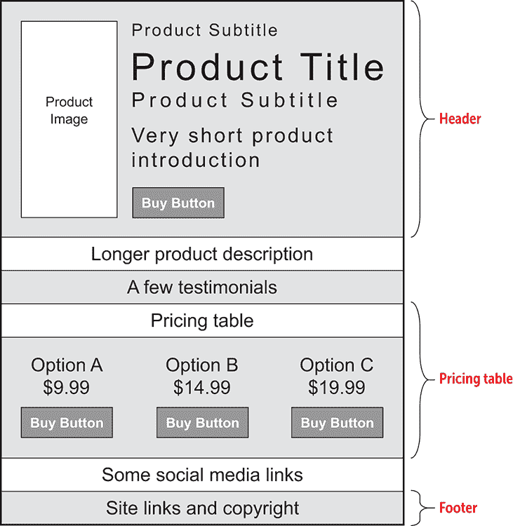

您接下来的页面规划任务是决定您想要用于着陆页的字体。

## 选择字体

通常情况下，着陆页不应该让用户承受大量文本的负担。您想要突出产品或服务的关键特性，给用户一个想要它的理由，然后给他们一个获得它的机会。所以如果您正在构建一个没有大量正文内容的页面，您的字体需要清晰易读，而且不应该吸引过多的注意力（从而转移对产品的注意力）。

在这种情况下，无衬线字体通常是最佳选择，因为衬线的缺失使得这些字体看起来更干净。无衬线字体也比衬线字体更具现代感，这为您提供了额外的优势，使您的产品看起来更新潮、更清新。

我最喜欢的系统字体之一是 Optima，这是赫尔曼·察普夫（您可能从大多数 PC 上可用的著名 Zapf Dingbats 字体中认识他）设计的一款漂亮的 sans-serif 字体。唉，尽管 Optima 安装在所有 Mac 计算机上，但在 Windows PC 上却很少见。因此，作为 Windows 的备用字体，我还会指定 Calibri 字体，它具有相似的特征。在我的 CSS 中，我将使用以下规则将这些字体族应用于所有页面文本：

```
body {
    font-family: Optima, Calibri, sans-serif;
}

```

记住

当您在`font-family`属性中指定多个字体时，网络浏览器会检查它们是否按出现的顺序安装在每个用户的计算机上，并使用它找到的第一个字体。

在绘制了页面布局并选择了字体后，下一步是挑选配色方案。

## 选择配色方案

由于着陆页使用单一字体，您需要转向其他页面元素来增加一些活力和对比。一个很好的地方是配色方案：

+   *强调颜色* —这种颜色用作页面元素（如行动号召按钮和确保读者不会错过的文本）的背景。因此，它应该是一个醒目、不容错过的色调，能够脱颖而出。

+   *二级颜色* —这种颜色主要用于一些内容带的背景。它应该与强调颜色相似：足够醒目以告知读者内容的重要性，但又不至于与强调颜色冲突或盖过它。

+   *三级颜色* —这种颜色用作不太重要的内容的背景。

学习

如果你不太擅长选择颜色，一个叫做 Palettable（[`www.palettable.io`](https://www.palettable.io)）的在线工具可以帮助你。输入你的初始颜色，Palettable 会建议一个兼容的颜色。点击“喜欢”以保留它，或者点击“不喜欢”以尝试另一个。

图 10.2 显示了为我着陆页选择的颜色。当然，你应该选择一个适合你风格的配色方案。

当页面布局就绪，并且你已经选择了字体和颜色后，是时候通过添加一些 HTML 和 CSS 代码将所有内容整合在一起了。

图 10.2 我的着陆页配色方案

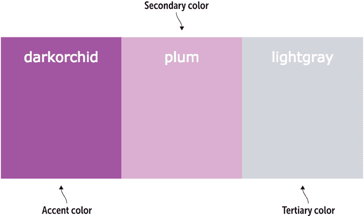

## 构建页面

要构建你的着陆页，从我在第一章中介绍的基本代码开始。然后，逐节进行，添加文本、HTML 标签和 CSS 属性。

### 初始结构

要开始，从第一章的基本页面结构中获取，并为页面每个主要部分添加标签、占位符图片和一些占位符文本。

#### 尝试这个

在线：[wdpg.io/projects/landing-page/1](http://wdpg.io/projects/landing-page/1)

这里是构成着陆页初始结构的元素。

#### 网页

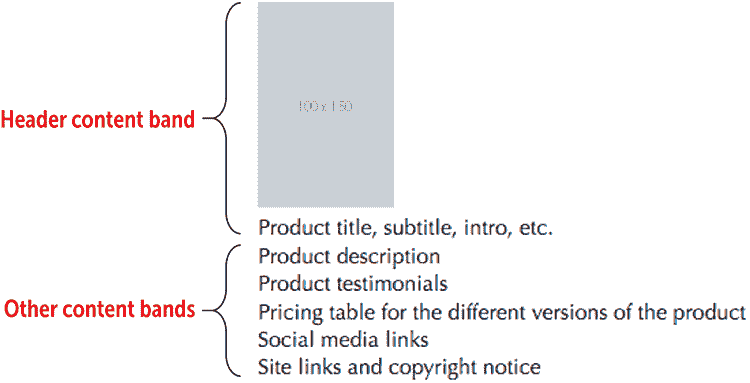

#### HTML

```
<div class="header">    ① 
 <div class="header-image">    ① 
     ① 
 </div>    ① 
 <div class="header-info">    ① 
 Product title, subtitle, intro, etc.    ① 
 </div>    ① 
</div>    ① 
<div class="description">    ② 
 Product description    ② 
</div>    ② 
<div class="testimonials">    ③ 
 Product testimonials    ③ 
</div>    ③ 
<div class="product-versions">    ④ 
 Pricing table for the different versions of the product    ④ 
</div>    ④ 
<div class="social">    ⑤ 
 Social media links    ⑤ 
</div>    ⑤ 
<div class="footer">    ⑥ 
 Site links and copyright notice    ⑥ 
</div>    ⑥ 
```

①  标题内容带

②  描述内容带

③  推荐内容带

④  定价表格内容带

⑤  社交媒体内容带

⑥  页脚内容带

在初始结构中使用的 HTML 标签有一些需要注意的事项：

+   页面被分为六个部分：标题、描述、推荐、定价表格、社交媒体和页脚。

+   每个部分都嵌入在一个`<div></div>`块中。

+   每个`div`元素都被分配了一个类，这使得你可以将 CSS 属性应用于该部分内的所有内容。

### 标题

标题可能是着陆页上最重要的部分，因为它是访客到达时看到的第一个部分。你希望标题不仅要有影响力，还要开始推销你的产品的工作。项目标题通过包括以下功能来实现这些目标：

+   *英雄背景图片* —这张图片应该是视觉上引人注目的，或者应该讲述与你的产品相关的故事。无论如何，确保图片不会干扰标题文本的可读性。

+   *产品图片* — 此图片应是一个简单的插图或照片，使潜在买家能够看到产品的样子。

+   *产品信息* — 至少，这些信息应包括产品名称或标题、简短（两到三句话）的介绍以及价格。我还选择包括一个副标题（例如“现在可用！”或“特价优惠！”）和一个子标题。

+   *行动号召按钮* — 用户点击此按钮执行您想要执行的操作，例如购买、订阅或下载产品。

由于页眉对于落地页的成功至关重要，请慢慢来，一次添加一个功能，从英雄背景开始构建页眉。

### 英雄背景图片

你可能还记得第六章中提到的英雄图片是一种引人注目的照片或插图，当你首次进入页面时，它占据了整个浏览器窗口的宽度，有时甚至占据整个高度。以下示例展示了带有英雄背景图片的虚构产品页眉。

#### 尝试以下操作

在线：[wdpg.io/projects/landing-page/2](http://wdpg.io/projects/landing-page/2)

此示例展示了带有英雄背景的落地页页眉。

#### 网页


#### CSS

```
.header {
    background: url(/images/landing-page-header-bg.jpg);
 background-attachment: fixed;    ① 
    background-position: right center;
    background-size: cover;
    padding-bottom: 1em;
    width: 100vw;
    height: 100vh;
}
```

① 防止英雄图片随内容滚动。

#### HTML

```
<div class="header">
</div>

```

记住

我添加了 `height: 100vh` 定义，以给页眉一些高度，因为它没有内容。稍后，在我添加页眉内容后，我会移除该定义。

这张照片（你几乎认不出它是夜景城市场景的模糊图像）使用了在第六章中学到的标准英雄图片代码。我添加了 `background-attachment: fixed` 属性，以防止图片随页面其他部分滚动，这是一个很好的效果。

### 产品图片

接下来，添加展示产品的照片或插图。此图片应大小适中，足够让读者了解产品外观，但不要太大，以免压倒英雄背景。以下是一个示例。

#### 尝试以下操作

在线：[wdpg.io/projects/landing-page/3](http://wdpg.io/projects/landing-page/3)

此示例将产品图片添加到落地页的页眉中。

#### 网页

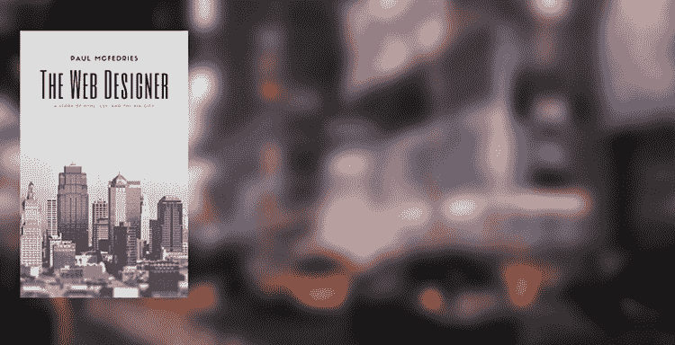

#### CSS

```
.header-image {    ① 
 float: left;    ① 
 width: 33%;    ① 
 margin-top: 3em;    ① 
 padding-right: 3em;    ① 
 text-align: right;    ① 
}
```

① 图片的 CSS 代码

#### HTML

```
<div class="header">
 <div class="header-image">    ② 
     ② 
 </div>    ② 
</div>
```

② 图片作为标准的 HTML `img` 元素添加。

图片向左浮动，并设置了边距和填充，以提供与其他内容的分隔。

### 产品信息

现在是时候将产品信息添加到页眉中了。同样，这些信息至少需要包括产品标题和简要介绍，但请随意添加如副标题和子标题等元素，如下例所示。

#### 尝试以下操作

在线：[wdpg.io/projects/landing-page/4](http://wdpg.io/projects/landing-page/4)

此示例将产品信息添加到落地页的页眉中。

#### 网页

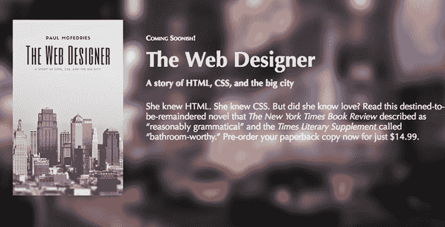

#### CSS

```
.header-info {    ① 
 float: right;    ① 
 width: 67%;    ① 
 margin-top: 4em;    ① 
 color: white;    ① 
}
```

① 产品信息 `div` 的 CSS 代码

#### HTML

```
<div class="header">
   <div class="header-image">
     
   </div>
 <div class="header-info">    ② 
 <div class="surtitle">Coming Soonish!</div>    ② 
 <h1 class="title">The Web Designer</h1>    ② 
 <h3 class="subtitle">    ② 
 A story of HTML, CSS, and the big city</h3>    ② 
 <p class="intro">    ② 
 She knew HTML. She knew CSS. But did she know love? Read this destined-to-be-remaindered novel that <em>The New York Times Book Review</em> described as &ldquo;reasonably grammatical&rdquo; and the <em>Times Literary Supplement</em> called &ldquo;bathroom-worthy.&rdquo;    ② 
 </p>    ② 
 </div>    ② 
</div>
```

② 信息添加在 `div` 元素内。

包含所有产品信息的 `div` 元素向右浮动，并设置了一些边距。各种产品信息——副标题、标题、副标题和简介——出现在它们自己的块级元素中。为了节省空间，我没有显示应用于这些块级元素的 CSS 属性，但它们包括边距和字体大小等样式。（请参阅示例的在线版本以获取完整的代码。）

### 召唤性用语按钮

标题部分的最后一部分是读者可以点击的号召性用语按钮，用于订购、订阅、下载或执行你在着陆页上偏好的任何操作。此按钮应易于找到，因此请使其可见并加粗，如下例所示。

#### 尝试这个

在线：[wdpg.io/projects/landing-page/5](http://wdpg.io/projects/landing-page/5)

此示例将号召性用语按钮添加到着陆页标题中。

#### 网页

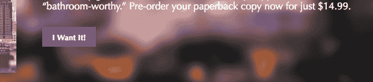

#### CSS

```
.btn {    ① 
 max-height: 2.5em;    ① 
 border: none;    ① 
 padding: .75em 1.25em;    ① 
 font-family: inherit;    ① 
 font-size: 1em;    ① 
 font-weight: bold;    ① 
 color: white;    ① 
 background-color: darkorchid;    ① 
}
```

① 按钮的 CSS 代码

#### HTML

```
 <button class="btn" type="button">I Want It!</button>    ② 

```

② `button` 元素

我使用 `<button>` 标签创建按钮，然后应用各种样式使按钮突出，包括我的强调颜色（`darkorchid`）作为背景和加粗白色文本作为前景。

### 产品描述

着陆页的下一个元素是对产品的简要描述，这是你第一次尝试向用户推销你的产品或服务。你如何进行取决于产品以及你在扮演推销员时的舒适度，但这里有一些想法：

+   一个简单的段落，解释产品

+   产品主要功能的列表

+   一个段落或列表，告诉用户为什么产品适合她

+   一个段落或列表，简要概述一系列问题并解释产品如何解决这些问题

对于我的着陆页，我选择了对书籍情节的简要回顾，如下例所示。

#### 尝试这个

在线：[wdpg.io/projects/landing-page/6](http://wdpg.io/projects/landing-page/6)

此示例显示了添加到着陆页的产品描述。

#### 网页

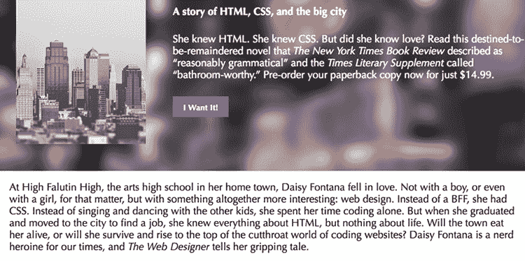

#### CSS

```
.description {    ① 
 width: 100%;    ① 
 padding: 1em 0;    ① 
 font-size: 1.25em;    ① 
 background-color: white;    ① 
}

```

① CSS 中 `description` 类的代码

#### HTML

```
<div class="description">
At High Falutin High, the arts high school in her home town, Daisy Fontana fell in love. Not with a boy, or even with a girl, for that matter, but with something altogether more interesting: web design. Instead of a BFF, she had CSS. Instead of singing and... 
</div>

```

### 设置内容带

在构建着陆页的这个阶段，你遇到了一个问题。在前面的示例中，描述中的文本横跨整个浏览器窗口宽度，这使得行长度过长，不便于阅读。解决方案是通过使用具有两个特征的内容水平带结构化着陆页：

+   一种背景颜色或图像，横跨整个浏览器窗口。

+   前景内容，具有最大宽度以保持可读性。此内容通常出现在浏览器窗口的中心。

然而，根据浏览器窗口的宽度和你分配给内容块的宽度，该块只占据窗口宽度的一部分。那么问题就是如何让背景扩展到整个窗口宽度，同时将内容限制在宽度的一部分。

答案是使用两个 `div` 元素来结构化每个内容带：

+   一个外部的 `div` 元素，它跨越浏览器窗口的宽度，并使用你想要与带区一起使用的背景颜色或图像进行样式化

+   一个嵌套的 `div` 元素，它包含内容，被赋予一个最大宽度，并在浏览器窗口中水平居中

在以下示例中，我已经将嵌套 `div`（使用名为 `container` 的类）应用于页眉和产品描述。

#### 尝试这个

在线：[wdpg.io/projects/landing-page/7](http://wdpg.io/projects/landing-page/7)

此示例显示了将包含每个内容带内容的嵌套 `div` 元素。

#### 网页

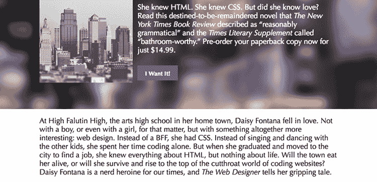

#### CSS

```
.container {    ① 
 max-width: 800px;    ① 
 margin: 0 auto;    ① 
 clear: both;    ① 
}
.container::after {    ② 
 content: "";    ② 
 display: block;    ② 
 clear: both;    ② 
}

```

①  内容容器的 CSS 代码

②  此 CSS 使容器能够清除其自身的浮动。

#### HTML

```
<div class="header">
 <div class="container">    ③ 
 ...    ③ 
 </div>    ③ 
</div>
...
<div class="description">
 <div class="container">    ③ 
 ...    ③ 
 </div>    ③ 
</div>
```

③  包含带内容的嵌套 `div` 元素

`container` 类做了三件事：

+   它使用 `max-width` 来设置内容的最大宽度为 800 像素。

+   它使用 `margin: 0 auto` 简写来水平居中元素。此声明将顶部和底部边距设置为 `0`，将左侧和右侧边距设置为 `auto`。后者告诉网络浏览器根据元素宽度自动设置边距。因为左右两侧都一起设置，浏览器将相同的边距大小分配给每一侧，从而实现元素居中。

+   它使用 `clear: both` 来放置在文档流中位于其之前的任何浮动元素之后的元素。

`container::after` 伪元素使用了你在第八章中学到的 clearfix 技巧，使元素能够清除它包含的任何浮动元素，并防止容器塌陷。

### 产品评价

总是在你的着陆页上添加一些第三方正面评价是个好主意，比如来自媒体的闪耀评价，来自另一个网站的正面用户评分，或者直接从产品测试者或用户那里收到的正面反馈。以下示例展示了添加了一些评价的我的着陆页，以及相关的插图。

#### 尝试这个

在线：[wdpg.io/projects/landing-page/8](http://wdpg.io/projects/landing-page/8)

此示例将评价部分添加到着陆页中。

#### 网页

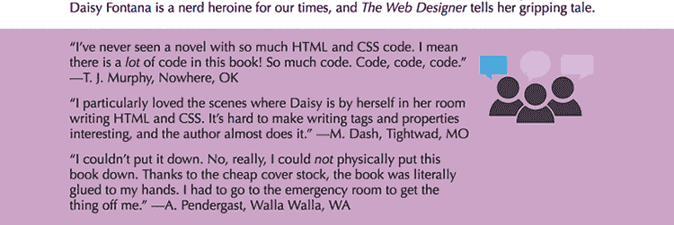

#### CSS

```
.testimonials {    ① 
 width: 100%;    ① 
 padding: 1em 0;    ① 
 font-size: 1.25em;    ① 
 background-color: plum;    ① 
}
.testimonials-text {    ② 
 float: left;    ② 
 width: 75%;    ② 
}
.testimonial {    ③ 
 margin-bottom: .75em;    ③ 
}
.testimonials-image {    ④ 
 float: right;    ④ 
}

```

①  评价内容带的 CSS 代码

②  评价文本容器的 CSS 代码

③  单个评价的 CSS 代码

④  评价图片的 CSS 代码

#### HTML

```
<div class="testimonials">    ⑤ 
<div class="container">
<div class="testimonials-text">    ⑥ 
<p class="testimonial">“I’ve never seen a novel with so much HTML and CSS code. I mean there is a <em>lot</em> of code in this book! So much code. Code, code, code.” —T. J. Murphy, Nowhere, OK</p>    ⑦ 
<p class="testimonial">“I particularly loved the scenes where Daisy is by herself in her room writing HTML and CSS. It’s hard to make writing tags and properties interesting, and the author almost does it.” —M. Dash, Tightwad, MO</p>    ⑦ 
<p class="testimonial">“I couldn’t put it down. No, really, I could <em>not</em> physically put this book down. Thanks to the cheap cover stock, the book was literally glued to my hands. I had to go to the emergency room to get the thing off me.” —A. Pendergast, Walla Walla, WA</p>
</div>
<div class="testimonials-image"    ⑧ 
alt="Illustration of people talking">
    ⑧ 
</div>    ⑧ 
</div>
</div>

```

⑤  评价内容带元素

⑥  评价文本容器

⑦  单个评价

⑧  评价图片

在这个例子中，内容带是一个名为`testimonials`的`div`元素，它使用`plum`背景颜色进行样式化。在内容容器中有一个向左浮动的`testimonials-text`元素和一个向右浮动的`testimonial-image`元素。

### 定价表

在理想的世界里，访问你着陆页的人会对你的产品或服务如此着迷，以至于他会点击你放在页面标题中的行动号召按钮。如果那样做不成功，你需要给这个人第二次购买或订阅的机会。做到这一点的一个最好的方法就是创建一个*定价表*，概述你产品的版本以及每个版本的价格。如果你的产品没有版本（甚至如果有），你可以创建包含其他项目的套餐，例如配套电子书、时事通讯订阅、未来购买的折扣券等等。

定价表应该至少有两个版本或套餐，但通常不超过四个。其中之一应该是你的首选版本——你理想中希望每个人选择的版本。这个版本可能是能为你带来最多收入、为用户提供最佳价值或相对于其他版本有其他优势的那个。这个首选版本应以某种方式突出。例如，你可以在它上面添加“最佳价值！”标题，或者使用你配色方案中的粗体强调颜色。

使用它

在大多数着陆页上，首选的选项是能带给卖家最高净利的那个。你可以使用其他标准来确定你想要推广的选项，例如最受欢迎的、最具性价比的以及最佳整体价值。

在我的个人着陆页上，我在定价表之前放置了一个内容带，它充当一种标题，但实际上是敦促用户选择一个套餐，如下面的例子所示。

#### 尝试这个

在线：[wdpg.io/projects/landing-page/9](http://wdpg.io/projects/landing-page/9)

这个例子在定价表之前添加了一个内容带。

#### 网页

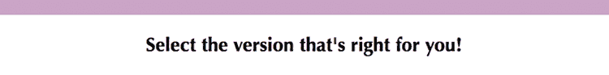

#### CSS

```
.product-versions-title {    ① 
 padding: 1em 0;    ① 
 font-size: 2em;    ① 
 text-align: center;    ① 
}

```

①  内容带段的 CSS 代码

#### HTML

```
<div class="container">    ② 
 <h2 class="product-versions-title">Select the version that's right for you!</h2>    ② 
</div>    ② 

```

②  内容带的 HTML 代码

对于定价表本身，标准格式是将每个版本或套餐放置在一个垂直列中，告诉读者她需要知道的一切：标题、价格（如果有）和功能。然后在列的底部添加一个行动号召按钮。以下例子展示了我虚构的着陆页上的定价表中的一个列。

#### 尝试这个

在线：[wdpg.io/projects/landing-page/10](http://wdpg.io/projects/landing-page/10)

这个例子添加了定价表的第一列。

#### 网页

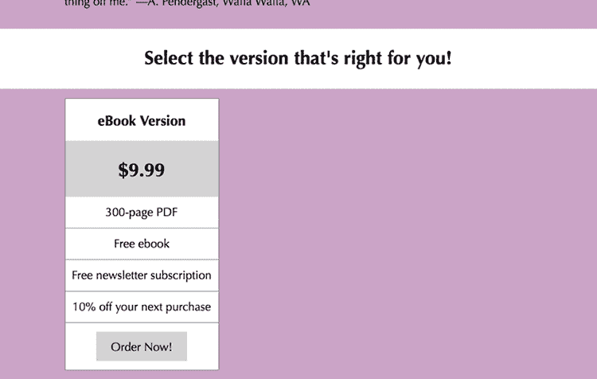

#### CSS

```
.product-versions {
    padding: 1em 0;
    background-color: plum;}
.product-version {
    float: left;
    width: 33.33%;
    border: 1px solid gray;
    text-align: center;
    background-color: white;}
.version-title {
    padding: .75em 0;
    font-size: 1.5em;}
.version-price {
    padding: .75em 0;
    font-size: 2em;
    background-color: lightgray;}
.version-item {
    border-bottom: 1px solid gray;
    width: 100%;
    padding: .75em 0;
    font-size: 1.25em;}
.version-item:last-child {
     border-bottom: 0;}
.btn-plain {
    font-weight: normal;
    color: black;
    background-color: lightgray;}

```

#### HTML

```
<div class="product-versions">    ① 
 <div class="container">    ② 
 <div class="product-version">    ③ 
 <h3 class="version-title">eBook Version</h3>    ④ 
 <h4 class="version-price">$9.99</h4>    ⑤ 
 <div class="version-item">    ⑥ 
                300-page PDF
 </div>    ⑥ 
 <div class="version-item">    ⑥ 
                Free ebook
 </div>    ⑥ 
 <div class="version-item">    ⑥ 
                Free newsletter subscription
 </div>    ⑥ 
 <div class="version-item">    ⑥ 
                10% off your next purchase
 </div>    ⑥ 
 <div class="version-item">    ⑥ 
 <button class="btn btn-plain" type="button">Order Now!</button>    ⑥ 
 </div>    ⑥ 
        </div>
    </div>
</div>

```

①  内容带

②  内容容器

③  产品版本容器

④  版本标题

⑤  版本价格

⑥  版本项目

这里使用了七个类，它们的作用如下：

+   `product-versions`—这个外部的`div`创建了内容带。它被赋予了`plum`背景。

+   `container`—这个类是内容`div`。

+   `product-version`—这个`div`创建单个版本或包的列。它向左浮动，因为有三列，所以被赋予了 33.33%的宽度。

+   `version-title`—这个`div`包含版本或包的标题。

+   `version-price`—这个`div`包含版本或包的价格。对于大多数版本，价格被赋予了朴素的灰色背景。

+   `version-item`—这个类包含版本或包中的其余项目，每个功能有一个`div`，底部还有一个用于行动按钮的`div`。

+   `btn-plain`—这个类用于不需要突出显示的行动按钮。文本被赋予正常重量；文本颜色恢复为黑色；背景设置为浅灰色。

要完成定价表，你添加版本或包，使用与之前相同的样式，但以突出显示的方式为读者设置你的最佳版本，如下一个示例所示。

#### 尝试这个

在线：[wdpg.io/projects/landing-page/11](http://wdpg.io/projects/landing-page/11)

这个示例完成了定价表，包括一个突出显示版本供读者查看的列。

#### 网页

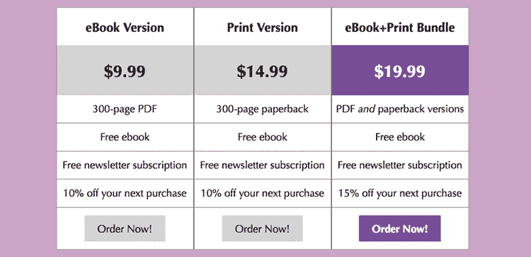

#### CSS

```
.version-price-featured {    ① 
 color: white;    ① 
 background-color: darkorchid;    ① 
}

```

①  突出显示项目价格的 CSS 代码

#### HTML

```
<div class="product-version">
    <h3 class="version-title">Print Version</h3>
    <h4 class="version-price">$14.99</h4>
    <div class="version-item">
        300-page paperback
    </div>
    <div class="version-item">
        Free ebook
    </div>
    <div class="version-item">
        Free newsletter subscription
    </div>
    <div class="version-item">
        10% off your next purchase
    </div>
    <div class="version-item">
        <button class="btn btn-plain" type="button">Order Now!</button>
    </div>
</div>
<div class="product-version">
    <h3 class="version-title">eBook+Print Bundle</h3>
 <h4 class="version-price version-price-featured">$19.99</h4>    ② 
    <div class="version-item">
        PDF <em>and</em> paperback versions
    </div>
    <div class="version-item">
        Free ebook
    </div>
    <div class="version-item">
        Free newsletter subscription
    </div>
    <div class="version-item">
        15% off your next purchase
    </div>
    <div class="version-item">
        <button class="btn" type="button">Order Now!</button>
    </div>
</div>

```

②  突出显示价格的 HTML 代码

记住

当你在元素上指定两个类（就像我在以下示例中的第二个`h4`元素中做的那样）时，网络浏览器会将这两个类的属性应用到该元素上。

精通

如果你的 CSS 在元素上指定了两个类，并且这些类有一个或多个共同的属性，那么第二个类（即在 CSS 文件中较后出现的类）中的属性将具有优先权。

### 社交媒体链接

着陆页上的下一个内容带是一组社交媒体链接，它们在页面上居中显示，每个社交网络的图标用作链接。以下示例显示了我在着陆页上设置的链接。

#### 尝试这个

在线：[wdpg.io/projects/landing-page/12](http://wdpg.io/projects/landing-page/12)

这个示例将社交媒体链接内容带添加到着陆页上。

#### 网页

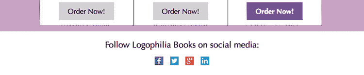

#### CSS

```
.social {    ① 
 padding: 1em 0;    ① 
 font-size: 1.5em;    ① 
 text-align: center;    ① 
}    ① 
.social-links {    ① 
 margin-top: .75em;    ① 
}    ① 
.social-link {    ① 
 margin: 0 .25em;    ① 
}    ① 

```

①  社交媒体链接的 CSS 代码

#### HTML

```
<div class="social">    ② 
 <div>    ② 
 Follow Logophilia Books on social media:    ② 
 </div>    ② 
 <div class="social-links">    ② 
        <a href="#" class="social-link"></a>
        <a href="#" class="social-link"></a>
        <a href="#" class="social-link"></a>
        <a href="#" class="social-link"></a>
 </div>    ② 
</div>    ② 
```

②  社交媒体链接的 HTML 代码

这里使用了三个类：

+   `social`—这个外部的`div`创建了内容带。它被赋予了`white`背景，并且`text-align`属性被设置为`center`。

+   `social-links`—这个`div`创建了所有链接的容器。

+   `social-link`—这个类用于设置单个链接的样式。

注意，在这个内容带中你不需要`container`元素，因为文本和链接在页面上是居中的。

### 页脚

着陆页的最后一个元素是页脚。正如以下示例所示，我使用了页脚来显示版权声明和我的联系信息（包括我的电子邮件地址）。请随意使用页脚添加任何你认为合适的信息，例如“感谢阅读”的信息、标语或喜欢的格言，或额外的联系细节。

#### 尝试这个

在线：[wdpg.io/projects/landing-page/13](http://wdpg.io/projects/landing-page/13)

这个例子通过使用浅灰色背景、较小的字体大小和斜体来将页脚文本与正文文本分开。

#### 网页


#### CSS

```
.footer {    ① 
 padding: 1em 0;    ① 
 font-variant: small-caps;    ① 
 text-align: center;    ① 
 background-color: lightgray;    ① 
}
.footer-links {    ① 
 margin-bottom: .75em;    ① 
 font-size: 1.5em;    ① 
}
.foote r-link {    ① 
 margin: 0 .5em;    ① 
}
.copyright {    ① 
 font-style: italic;    ① 
 font-size: 1em;    ① 
}

```

①  页脚的 CSS 代码

#### HTML

```
<div class="footer">    ② 
 <div class="footer-links">    ② 
 <a href="#" class="footer-link">About</a>    ② 
 <a href="#" class="footer-link">Contact</a>    ② 
 <a href="#" class="footer-link">Site Map</a>    ② 
 <a href="#" class="footer-link">Privacy</a>    ② 
 </div>    ② 
 <div class="copyright">    ② 
 Copyright 2018 Logophilia Books    ② 
 </div>    ② 
</div>    ② 
```

②  页脚的 HTML 代码

这里使用了四个类：

+   `footer`—这个外部的`div`创建了一个内容带。它被赋予了一个`lightgray`背景，并且`text-align`属性被设置为`center`。

+   `footer-links`—这个`div`创建了一个用于所有页脚链接的容器。请注意，每个链接的 URL 都指向`#`，这是一个占位符，当点击时，会将用户带到页面的顶部。在生产着陆页面上，你会将每个`#`替换为你网站上某个文件的 URL。

+   `footer-link`—这个类样式化了单个页脚链接。

+   `copyright`—这个类样式化了版权声明。

再次强调，在这个区域中，你不需要`container`元素，因为内容已经居中在页面上。

## 从这里开始

考虑到你这本书只读了一半，我必须说，最终版本的着陆页面（我的版本在图 10.3 中展示）是一个看起来很棒的网页。它易于阅读，易于理解，并且不会令人感到无聊。（如果你对你的着陆页面像我认为你应该那样满意，并且期待着将你的代码上线，请查看附录 A 以获取详细信息。）

图 10.3 我这本书的着陆主页

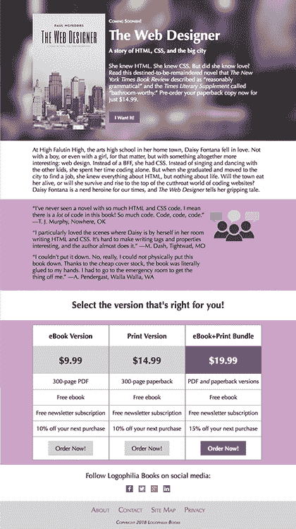

如果着陆页有问题，那是因为我们不得不使用大量的填充和边距调整（以及其他 CSS 技巧）来使事物排列得相对整齐。这种烦恼发生是因为我们没有使用真正的页面布局。由于我们的元素在这里和那里浮动，我们几乎进入了布局领域，但还不是。但那不是问题，因为页面布局是第三部分的主题，所以你很快就会学到你需要知道的所有内容，以创建你着陆页和其他页面的稳固布局。

## 摘要

+   绘制你想要构建的页面。

+   选择文本的字体。

+   选择一个配色方案。

+   构建初始页面结构：基本的 HTML 标签和全局 CSS 属性。

+   逐个填写和样式化每个部分：页眉、描述、推荐语、定价表、社交媒体链接和页脚。
