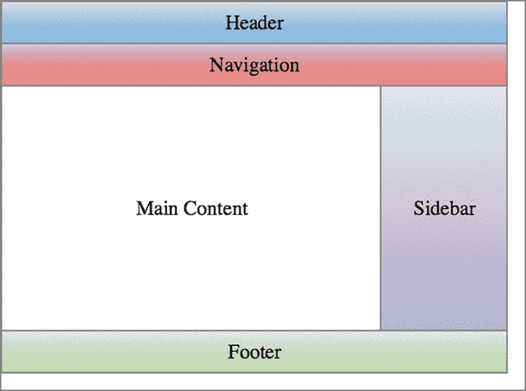
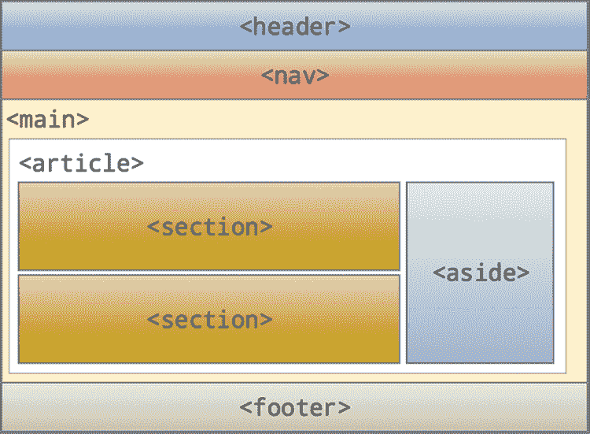
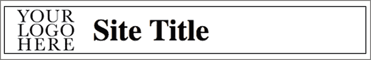
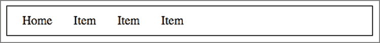
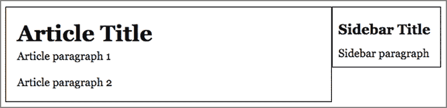
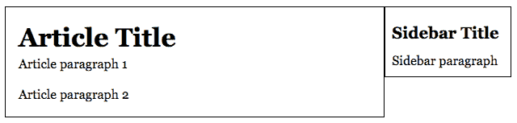
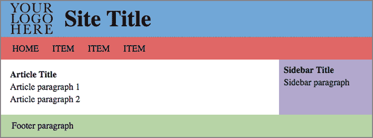

# 第十一章  学习页面布局基础

> 别让我思考！*——史蒂夫·克鲁格（克鲁格可用性第一定律）*

**本章涵盖**

+   理解网页布局类型、技术和策略

+   了解 HTML5 语义页面布局元素

+   检查现代、现实世界的页面布局

这本书的前半部分旨在为创建网页打下坚实的基础。当你掌握了 HTML 和 CSS 的基础后，你学习了文本标签、字体、颜色、CSS 类、盒模型、浮动和定位元素以及图像和其他媒体。因此，恭喜你：你已经从仅仅能够*构建*网页到能够*设计*它们了。

唉，你将没有太多时间去享受你新获得的荣耀，因为这一章将直接深入到网页设计的下一阶段。在这里，你从 HTML 标签和 CSS 属性的“树木”中退后一步，去审视页面布局的“森林”。这指的是网页的整体结构和组织，如果这听起来微不足道或不重要，那么考虑一下：每个访问你页面的人，无论是有意还是无意，都会提出一堆问题。这个页面是关于什么的？我对它感兴趣吗？这个页面有我想要的信息吗？如果是的话，我能在哪里找到它？

所有这些问题——至少，*应该*可以通过查看你的布局来回答。如果你的结构混乱或组织杂乱无章，我保证你，大多数人会在几秒钟后离开。避免这种命运意味着花点时间去计划和编写一个布局，以展示你的内容在最佳、最友好的方式。

## 圣杯布局

为了帮助你学习各种网页布局技术，我将使用所谓的*圣杯*布局的一个版本，它由以下部分组成：

+   页面顶部的页眉

+   页眉下方的导航栏

+   由左列的主要页面内容和右列（有时是左列）的相关内容侧边栏组成的两个全高列

+   页面底部的页脚

根据你想要如何严格定义布局，这个主题有许多变体。例如，你可能想在导航栏和页脚之间想要三列而不是两列。另一个常见的变体是，如果内容没有延伸到那么远，页脚会出现在浏览器窗口的底部。

使用它

圣杯布局对于博客文章、文章、论文、教程和类似的内容导向页面非常有用。

图 11.1 展示了你将要构建的布局示意图。

图 11.1 圣杯网页布局的一个版本



要构建这个布局，你需要了解可用的页面布局方法。

## 理解网页布局方法

正如我在第七章中提到的，默认情况下，网络浏览器以它们在源文档中出现的顺序堆叠块级 HTML 内容。在每个块内部，文本从左到右运行（对于阅读方式为从左到右的语言）。对于最简单的网页（例如你在第五章中构建的个人主页），这种默认布局是足够的，但在这个阶段，你的网页设计生涯已经远远超出了这个水平。在这个层面上，你需要知道如何打破这种默认布局，以获得对网页上显示的网页内容的一些控制。

幸运的是，你有许多方法可以做到这一点，但你需要了解三种主要方法：

+   *浮动* —正如你在第八章中学到的，你可以使用`float`属性将一个元素从正常的页面流程中分离出来，并将其发送到其父容器内的左侧或右侧。通过这种方式处理多个项目，你可以将内容组织成列和其他复杂的页面布局。本章后面的“使用浮动创建页面布局”中将有更多介绍。

+   *内联块* —`display: inline-block`声明将块级元素从默认的垂直页面流程中移除，并将其添加到其他内联元素的水平（通常是左到右）流程中。这创造了许多有趣的页面布局机会，你将在本章后面的“使用内联块创建页面布局”中了解到一些。

+   *Flexbox* —这个强大但使用较少的 CSS 模块允许您以灵活的方式组织页面内容，这些容器可以包裹、增长和收缩。参见第十二章了解它是如何工作的。

谨慎行事

另一种常见的页面布局技术是一个名为 Bootstrap 的前端库([`getbootstrap.com`](https://getbootstrap.com))。该库包含预制 HTML、CSS 和 JavaScript 组件，可以帮助您快速启动项目。然而，大多数现代网页设计师却放弃了像 Bootstrap 这样的复杂解决方案，而是选择自己编写网页代码。

你应该使用哪一个？我建议你不要使用浮动或内联块。我确实建议你学习浮动和内联块如何进行布局——这就是为什么我在本章中讨论它们的原因——因为你需要了解许多旧网站使用的技巧，你可能会发现这些技巧对于小型页面组件很有用。这留下了 flexbox，你将在第十二章中学习它，并在第十五章的项目中加以有效利用。

> Flexbox 确实是你应该认真对待的东西。它为现代内容布局风格铺平了道路，并且它不会很快消失。它已经成为一个新的标准。所以，张开双臂，拥抱它吧！*——欧汉斯·埃马纽埃尔*

## 学习 HTML5 语义页面元素

在开始之前，你需要了解页面布局的最后一块拼图是 HTML5 元素集合，这些元素使你能够创建语义布局。为什么这很重要？因为每个上传到网络的页面都将以某种方式被自动化过程读取和解析，例如搜索引擎爬虫和为残疾人设计的屏幕阅读器。如果你的页面只是一系列匿名的`<div>`和`<span>`标签的集合，那么该软件不太可能分析页面以找到最重要的内容。

为了帮助你解决这个问题，HTML5 提供了一系列语义元素，你可以使用这些元素来指定页面每个区域包含的内容类型。这些元素有很多，但以下七个是最重要的：

`<header>`

`<nav>`

`<main>`

`<article>`

`<section>`

`<aside>`

`<footer>`

接下来的几个部分将解释这些元素。

> 正确的语义可以提高可访问性，因为辅助技术，如屏幕阅读器可以更好地解释我们内容的意义。*——安娜·莫纳斯*

### `<header>`

你使用`header`元素来定义包含介绍性内容的页面区域。这种内容通常是网站标题（应该使用标题元素，如`h1`进行标记），但它也可以包括网站标志等内容。以下是一个示例：

```
<body>
    <header>
        
        <h1>Semantics Depot</h1>
    </header>
    etc.
</body>

```

### `<nav>`

你使用`nav`元素来定义包含导航内容的页面区域，例如指向网站其他部分的链接或搜索框。此元素可以在页面的任何位置出现，但通常出现在页面主要`header`元素之后：

```
<body>
    <header>
        
        <h1>Semantics Depot</h1>
    </header>
    <nav>
        <a href="#">Home</a>
        <a href="#">Blog</a>
        <a href="#">Contact</a>
        <a href="#">About Us</a>
    </nav>
    etc.
</body>

```

### `<main>`

主元素被用作当前页面独特内容的容器。而`header`、`nav`、`aside`和`footer`元素通常在网站的所有或大多数页面中都是通用的，`main`元素旨在标记独特的内容。`main`元素通常出现在`header`和`nav`元素之后：

```
<body>
    <header>
        …
 </header>
    <nav>
        …
    </nav>
    <main>
`*Unique content goes here*`
    </main>
    etc.
</body> 
```

### `<article>`

`article`元素被用来标记一个完整、自包含的组成。这里的模式是报纸或杂志文章，但这个元素也可以应用于博客条目、论坛帖子或论文。大多数页面都有一个`article`元素嵌套在`main`元素内部：

```
<body>
    <header>
        …
    </header>
    <nav>
        …
    </nav>
    <main>
        <article>
 *Article content goes here*
        </article>
    </main>
    etc.
</body>

```

然而，在单个`main`元素内拥有多个`article`元素是完全可接受的。此外，如果这样做在语义上合适，也可以在`article`元素内部嵌套一个`header`元素：

```
<article>
    <header>
        <h2>Isn't It Semantic?</h2>
        <p>By Paul McFedries</p>
    </header>
 *Article content goes here*
</article>

```

### `<section>`

你使用`section`元素来包围页面中你希望出现在页面大纲中的任何部分。也就是说，如果页面的某个部分由一个标题元素（`h1`到`h6`）和一些文本组成，你将使用`<section>`标签包围标题及其文本。这通常发生在`article`元素内部，如下所示：

```
<article>
    <section>
        <h3>Introduction</h3>
 *Introduction text*
    </section>
    <section>
 <h3>Argument</h3>
 `*Argument text*`
    </section>
    <section>
        <h3>Summary</h3>
 `*Summary text*`
    </section>
</article> 
```

### `<aside>`

你使用`aside`元素来标记与页面独特内容不直接相关的页面区域。一个典型的例子是包含最新网站新闻、Twitter 流等的侧边栏。`aside`元素可以出现在`main`元素内的任何位置（实际上可以在页面上多次出现），但最佳实践是将`aside`放在页面的`article`元素之后，如下所示：

```
<body>
    <header>
        …
    </header>
    <nav>
        …
    </nav>
    <main>
        <article>
            …
        </article>
        <aside>
            …
        </aside>
    </main>
    etc.
</body>

```

### <footer>

你使用`footer`元素来定义包含结尾内容的页面区域，例如版权声明、地址和联系方式。

这是典型 HTML5 页面的语义布局：

```
<body>
    <header>
        …
    </header>
    <nav>
        …
    </nav>
    <main>
        <article>
            <section>
                …
            </section>
            <section>
                …
            </section>
            <aside>
 …
            </aside>
        </article>
    </main>
    <footer>
        …
    </footer>
</body> 
```

### 圣杯布局，再访

之前，你学习了圣杯布局，我可以在 HTML5 语义页面元素的环境中重新介绍它。图 11.2 显示了你在图 11.1 中看到的相同示意图，但使用 HTML5 语义布局标签标识每个部分。

图 11.2 带有 HTML5 语义标签的圣杯网页布局



这里是布局的裸骨 HTML 代码：

```
<header>
    
    <h1>Site Title</h1>
</header>
<nav>
    <ul>
        <li>Item 1</li>
        etc.
    </ul>
</nav>    
<main>
    <article>
        <section>
            <h2>Article Title</h2>
 <p>Article paragraph</p>
            etc.
        </section>
        <aside>
            <p>Sidebar paragraph</p>
            etc.
        </aside>
    </article>
</main>
<footer>
    <p>Footer paragraph</p>
    etc.
</footer> 
```

## 使用浮动创建页面布局

我有些简化，但使用浮动元素构建页面布局包括重复以下三个步骤：

1.  让元素以默认方式流动。

1.  当你需要两个或更多元素并排显示时，将它们浮动（通常向左浮动）。

1.  当你想恢复默认页面流时，清除浮动。

如果你查看任何具有并排内容或按列排列内容的页面的源代码，大多数情况下该网站使用了浮动元素来实现效果。话虽如此，但对于渴望更直接和稳固布局方法的网页设计师来说，浮动正在失去青睐。这种方法有一天将是 flexbox 与一种称为 CSS Grid 的新技术的结合，但在那一天到来之前，你应该熟悉基于浮动的布局，因为它们仍然被广泛使用。

学习

要了解 CSS Grid 基础，请参阅 Web 设计游乐场上的教程“CSS Grid 入门”。在线：[wdpg.io/grid](http://wdpg.io/grid)

## 第 11.1 课：使用浮动创建圣杯布局

覆盖：使用`float`属性进行布局

在线：[wdpg.io/11-1-0](http://wdpg.io/11-1-0)

圣杯包括三个并排内容实例：

+   在页眉中，你通常希望在网站标志旁边有一个网站标题。

+   在导航栏中，你通常希望导航项以一行显示。

+   侧边栏必须出现在主要内容右侧。

所有这些实例都需要使用`float`属性将元素从默认页面流中移出并并排渲染。

从以下示例中的页眉开始。

#### 示例

在线：[wdpg.io/11-1-1](http://wdpg.io/11-1-1)

这个例子向你展示了如何使用`float`将页眉标志和标题并排显示。

#### 网页



#### CSS

```
header {
    border: 1px solid black;
    padding: .25em 0;
}
header img {
 float: left;    ① 
    padding-left: 1em;
}
h1 {
 float: left;    ② 
    padding-left: .5em;
}
.self-clear::after {    ③ 
 content: "";    ③ 
 display: block;    ③ 
 clear: both;    ③ 
}

```

① 将`img`元素向左浮动。

② 将 `h1` 元素向左浮动。

③ 使用清除浮动来防止标题塌陷。

#### HTML

```
<header class="self-clear">
    
    <h1>Site Title</h1>
</header>

```

记住

我在这里使用类型选择器（如 `header img`）来使代码尽可能简单。实际上，通常更好的做法是为每个元素分配类，然后在您的 CSS 中选择这些类。

如您所见，`img` 元素和 `h1` 元素都被分配了 `float: left`，这使得它们在 `header` 元素的左侧并排排列。因为这些元素超出了默认的页面流，所以您通常需要调整填充或边距才能将它们放置在您想要的位置，就像我在示例中所做的那样。

现在按照以下示例浮动导航栏的项目。

#### 示例

在线：[wdpg.io/11-1-2](http://wdpg.io/11-1-2)

这个示例展示了如何使用 `float` 使导航栏项目并排。

#### 网页



#### CSS

```
nav {
    border: 1px solid black;
    padding: .5em;
}
nav ul {
    list-style-type: none;
}
nav li {
 float: left;    ① 
    padding-right: 1.5em;
}
```

① 将 `li` 元素向左浮动。

#### HTML

```
<nav class="self-clear">
    <ul>
        <li>Home</li>
        <li>Item</li>
        <li>Item</li>
        <li>Item</li>
    </ul>
</nav>

```

在这种情况下，`li` 元素被分配了 `float: left`，这使得它们在 `nav` 元素的左侧并排排列。同样，我又使用了填充来调整元素的位置。

接下来，将 `main` 元素的 `<article>` 和 `<aside>` 标签浮动，以创建两列内容布局。以下示例展示了如何实现。

#### 示例

在线：[wdpg.io/11-1-3](http://wdpg.io/11-1-3)

这个示例展示了如何使用 `float` 在两列布局中使 `article` 和 `aside` 元素并排。

#### 网页



#### CSS

```
article {
 float: left;    ① 
 width: 75%;    ② 
    border: 1px solid black;
}
aside {
 float: left;    ③ 
 width: 25%;    ④ 
    border: 1px solid black;
}

```

① 将 `article` 元素向左浮动。

② 设置 `article` 元素的宽度。

③ 将 `aside` 元素向左浮动。

④ 设置 `aside` 元素的宽度。

#### HTML

```
<main>
    <article>
        <h2>Article Title</h2>
        <p>Article paragraph 1</p>
        <p>Article paragraph 2</p>
    </article>
    <aside>
        <h3>Sidebar Title</h3>
        <p>Sidebar paragraph</p>
    </aside>
</main>

```

在这种情况下，`article` 元素和 `aside` 元素都被分配了 `float: left`，这使得它们在 `main` 元素的左侧并排排列。（您也可以将 `aside` 元素向右浮动以获得相同的布局。）您还需要为每个元素分配一个 `width` 值来设置列的大小。

您列的宽度取决于您将如何使用它们。一般来说，如果其中一列是侧边栏，它不应该占用超过可用宽度的 25%。请注意，如果您已应用 `box-sizing: border-box`，则列百分比可以相加至 100 以填充主元素的宽度。

注意，两列的底部边框没有对齐，因为没有 CSS `height` 声明，浏览器会根据其内容的宽度为元素分配一个高度。这个问题在浮动列中很常见，但在下一个示例之后，我会向您展示一个解决方案。

最后，您准备好添加 `footer` 元素，如下面的示例所示。

#### 示例

在线：[wdpg.io/11-1-4](http://wdpg.io/11-1-4)

这个示例展示了如何通过清除浮动列将 `footer` 添加到页面底部。所有元素都添加了颜色，但在代码中大多数都没有显示。

#### 网页


#### CSS

```
footer {
    padding: .25em 1em;
    background-color: #b6d7a8;
}

```

#### HTML

```
<footer class="self-clear">
    <p>Footer paragaph</p>
</footer>

```

游戏

你会如何修改这个布局，以在右侧而不是左侧显示侧边栏？在线：[wdpg.io/11-1-6](http://wdpg.io/11-1-6)

游戏

你会如何修改这个布局，以显示三个内容列：在`article`元素的左侧和右侧显示侧边栏？在线：[wdpg.io/11-1-7](http://wdpg.io/11-1-7)

注意，在此示例中，`article`和`aside`列具有相同的高度。我是如何做到这一点的？我通过使用称为*伪列*的技术来伪造它。以下是它是如何工作的：

1.  在`article`和`aside`元素周围放置一个包装元素。

    在此示例中，`main`元素可以充当包装器。

1.  将相同的背景颜色分配给包装元素和`aside`元素。

    在示例中，我将颜色`#b6d7a8`分配给两者。

1.  将不同的背景颜色分配给`article`元素。

    在示例中，我将`article`的背景颜色指定为`white`。

因为包装元素和`aside`元素使用相同的背景颜色，所以侧边栏看起来一直延伸到页脚。以下是代码的骨架版本：

```
<main class="self-clear">
    <article>
    </article>
    <aside>
    </aside>
</main>
<footer class="self-clear">
</footer>
<style>
    main, aside {
        background-color: #b4a7d6;
    }
    article {
        background-color: white;
    }
    .self-clear {
        content: "";
        display: block;
        clear: both;
    }
</style>

```

使用浮动布局网页内容是一个老式的、常见的 CSS 技巧。然而，正如你在本节中看到的，它有一些问题。你必须记住在需要的时候清除你的浮动，例如；边距往往会塌陷；你通常不得不求助于诸如伪列等笨拙的技巧来使事物看起来不错。你可以通过使用内联块来解决这些问题，我将在下一节中介绍。

## 使用内联块创建页面布局

使用内联块元素构建页面布局与使用浮动类似：

1.  让页面元素以默认方式流动。

1.  当你需要两个或更多元素并排显示时，将它们显示为内联块。

注意，使用内联块的一个主要优点是你不需要显式清除元素。

## 第 11.2 课：使用内联块创建圣杯布局

覆盖：使用`inline-block`属性进行布局

在线：[wdpg.io/11-2-0](http://wdpg.io/11-2-0)

如前所述，圣杯布局包括三个需要内容并排显示的实例：页眉、导航栏和内容列。所有这些实例都需要使用`display: inline-block`声明来将元素从默认页面流程中取出并并排渲染。默认情况下，内联块是从左到右显示的（或根据默认的内联方向），因此它们类似于声明`float: left`。

我从以下示例中的页眉开始。

#### 示例

在线：[wdpg.io/11-2-1](http://wdpg.io/11-2-1)

此示例向您展示了如何使用内联块将页眉标志和标题并排显示。

#### 网页


#### CSS

```
header {
    border: 1px solid black;
    padding: .5em 0 .1em 1em;
}
h1 {
 display: inline-block;    ① 
    padding-left: .5em;
    font-size: 2.5em;
}

```

①  将`h1`元素显示为内联块。

#### HTML

```
<header>
    
    <h1>Site Title</h1>
</header>

```

记住

我在这里使用类型选择器（如`header img`）来尽可能简化代码。在实践中，通常更好的做法是为每个元素分配类，然后在 CSS 中选择这些类。

默认情况下，`img`元素是内联块，我已经声明了`h1`元素使用`display: inline-block`，这使得这两个元素从左到右并排显示。

现在将导航栏的项目转换为内联块，如下例所示。

#### 示例

在线：[wdpg.io/11-2-2](http://wdpg.io/11-2-2)

这个例子展示了如何使用内联块使导航栏项目并排显示。

#### 网页


#### CSS

```
nav {
    padding: .5em;
    border: 1px solid black;
}
nav ul {
    list-style-type: none;
    padding-left: .5em;
}
nav li {
 display: inline-block;    ① 
    padding-right: 1.5em;
}

```

①  将`li`元素显示为内联块。

#### HTML

```
<nav>
    <ul>
        <li>Home</li>
        <li>Item</li>
        <li>Item</li>
        <li>Item</li>
    </ul>
</nav>

```

在这种情况下，`li`元素被声明为`display: inline-block`，这使得它们在`nav`元素的左侧并排显示。

接下来，将`main`元素的`<article>`和`<aside>`标签转换为内联块，这为您提供了两列内容布局。以下示例显示了如何操作。

#### 示例

在线：[wdpg.io/11-2-3](http://wdpg.io/11-2-3)

这个例子展示了如何使用内联块在两列布局中使`article`和`aside`元素并排显示。

#### 网页



#### CSS

```
article {
 display: inline-block;    ① 
    width: 75%;
    border: 1px solid black;
}
aside {
 display: inline-block;    ② 
 vertical-align: top;    ③ 
    width: 25%;
    border: 1px solid black;
}

```

①  将`article`元素显示为内联块。

②  将`aside`元素显示为内联块。

③  将`aside`元素文本与顶部对齐。

#### HTML

```
<main>
    <article>
        <h2>Article Title</h2>
        <p>Article paragraph 1</p>
        <p>Article paragraph 2</p>
 </article><aside>    ④ 
        <h3>Sidebar Title</h3>
        <p>Sidebar paragraph</p>
    </aside>
</main>

```

④  列元素之间没有空格

在这种情况下，`article`元素和`aside`元素都被分配了`display: inline-block`，这使得它们在`main`元素的左侧并排显示。您还需要为每个元素分配一个`width`值来设置列的大小。

注意，在 HTML 代码中，我将`</article>`结束标签和`<aside>`开始标签紧密地放在一起，这样它们之间没有空格。当使用内联块时，这是非常重要的，因为否则浏览器在渲染元素时会在它们之间添加一些空间，这可能会搞乱你的宽度计算。

你无疑已经注意到，与浮动一样，两列的底部边框没有对齐。您将使用相同的解决方案来解决这个问题。

最后，添加`footer`元素，如下例所示。

#### 示例

在线：[wdpg.io/11-2-4](http://wdpg.io/11-2-4)

这个例子展示了如何将`footer`元素添加到页面底部，尽管在这种情况下，没有必要清除任何内容。所有元素都添加了颜色，但大多数在代码中并未显示。

#### 网页



#### CSS

```
footer {    ① 
    padding: 1em;
    background-color: #b6d7a8;
}

```

①  内联块不需要清除。

#### HTML

```
<footer>
    <p>Footer paragaph</p>
</footer>

```

播放

你会如何修改这个布局以将侧边栏放在左侧而不是右侧？在线：[wdpg.io/11-2-6](http://wdpg.io/11-2-6)

播放

你会如何修改这个布局以显示三个内容列：在`article`元素左侧和右侧的侧边栏？在线：[wdpg.io/11-2-7](http://wdpg.io/11-2-7)

就像我在使用浮动布局时做的那样，我通过使用伪列使`article`和`aside`列看起来具有相同的高度。（注意，这些伪列只有在`article`元素比`aside`元素高时才能正常工作。）

尽管您可以通过轻松创建相当复杂的布局来使用内联块来布局网页内容并不常见。内联块当然有其缺点。您必须注意您的垂直对齐；您通常必须确保块之间没有空白；并且您不能像使用`float: right`一样将元素发送到父元素的右侧。为了解决这些问题并获得对布局的额外控制，您需要摒弃这些旧技术，转而使用最新的布局技术：flexbox。您将在第十二章中学习您需要知道的一切。

## 摘要

+   您可以通过使用 HTML5 页面布局标签来使您的页面更具语义性：`<header>`, `<nav>`, `<main>`, `<article>`, `<section>`, `<aside>`, 和 `<footer>`.

+   要使用基于浮动的布局，让元素以默认方式流动；然后，当您需要两个或更多元素并排显示时，将它们浮动（通常向左浮动）。记住，当您想要恢复默认页面流动时，清除浮动。

+   要使用基于内联块的布局，让页面元素以默认方式流动；然后，当您需要两个或更多元素并排显示时，将它们显示为内联块。
