# 第十二章 使用 Flexbox 创建页面布局

> Flexbox 是第一个适用于现代网页的 CSS 布局技术。*——Paddi MacDonnell*

**本章涵盖**

+   理解 flexbox 的工作原理

+   学习与 flexbox 容器和项目一起工作的技术

+   使用实际想法充分利用 flexbox

+   使用 flexbox 构建神圣布局

在第十一章中，你看到浮动和内联块可以完成任务，但不是没有遇到问题、怪癖和解决方案，如清除浮动、创建假列和避免空白。即使有了所有这些，这些布局策略也无法实现神圣布局的一个特性：如果页面内容没有填满屏幕高度，则在屏幕底部显示页脚。

本章的布局策略避免了所有这些怪癖，解决了页脚问题，并具有现代技术的清新吸引力。我所说的就是 flexbox，在你开始使用它进行布局之前，你需要了解它是什么以及它是如何工作的。接下来的几节将解释你需要知道的一切。

## 理解 Flexbox

Flexbox 是这种方法繁琐官方名称的欢迎简写：弹性盒子布局模块。Flexbox 背后的基本原理是提供一种绕过浏览器处理内容块僵硬、繁琐方式的方法。默认情况下是堆叠。考虑以下`div`元素集合：

```
<div class="container">
    <div class="item itemA">A</div>
    <div class="item itemB">B</div>
    <div class="item itemC">C</div>
    <div class="item itemD">D</div>
    <div class="item itemE">E</div>
    <div class="item itemF">F</div>
</div>

```

这里没有展示我应用给每个项目元素的独特背景颜色的类，图 12.1 显示了结果。正如你所看到的，`div`元素是堆叠的，并扩展到浏览器窗口的宽度。

图 12.1 `div`元素的默认浏览器布局

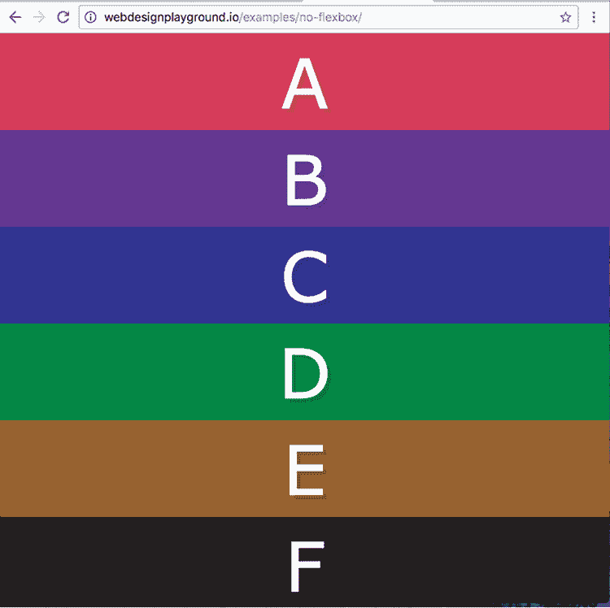

即使你使用浮动或内联块打破了这种默认的流动，浏览器仍然负责并按照*它*认为的位置来调整你的块，这种感觉仍然不舒服。是的，你可以通过恰当地样式化你的浮动和内联块来在一定程度上驯服浏览器，但这些调整是脆弱的。试着想象一下，如果侧边栏文本比文章文本长，浮动和内联块的神圣布局会发生什么。（提示：结果并不美观。）

Flexbox 通过提供简单但极其强大的方法来布局、分配、对齐、调整大小，甚至对父容器中的子元素进行排序，从而拯救了布局问题。名称中的*flex*部分来源于这项技术的主要原则之一：容器中的子项应该能够通过扩展以填充空余空间（如果空间过多）或通过收缩以允许空间减少来改变尺寸（宽度和高度）。无论内容量是否改变，还是屏幕大小（如最大化窗口或更改设备的屏幕方向）是否改变，这种情况都会发生。

那么，flexbox 是完美的吗？不，它不是。它有两个主要缺点：

+   它的继承灵活性意味着它有时会以看似不合理的方式表现。一开始可能会让人抓狂，但当你使用它几次之后，你开始看到 flexbox 为什么会有这样的行为。

+   它不适合大规模布局。Flexbox 非常适合页面组件——例如页眉或侧边栏——并且对于小规模布局（例如神圣的实践布局）来说很好。但对于大型、复杂的项目来说，flexbox 几乎总是处理不过来的。（如果你有时间，等待 CSS Grid Layout 获得足够的浏览器支持。）

学习

要现在学习 CSS Grid 基础知识，请查看我在 Web Design Playground 上的教程“CSS Grid 入门”。在线：[wdpg.io/grid](http://wdpg.io/grid)

当你使用 flexbox 时，你处理两种页面对象：容器和项目。一个*flex 容器*是任何类型的父块级元素——`div`、`p`、你在第十一章中学到的任何 HTML 语义页面元素，甚至是`body`元素——它包围一个或多个元素。这些子元素被称为*flex 项目*。

好了，理论就到这里。现在是时候开始学习 flexbox 是如何工作的了。

### 与 Flexbox 容器一起工作

在你可以使用 flexbox 之前，你需要决定哪个块级元素将成为 flex 容器。当你这样做之后，你只需通过一个 CSS 声明将该元素转换为容器：`display: flex`。以下规则将`header`元素转换为 flex 容器：

```
header {
    display: flex;
}

```

容器的子元素自动成为 flex 项目；不需要额外的规则或声明或代码。从那里开始，你可以开始自定义你的 flex 容器及其项目以适应手头的任务。

我发现了解和使用 flexbox 的最佳方式是问自己一系列问题——一套针对容器，另一套针对项目。以下是容器问题：

+   你希望容器的项目沿哪个方向运行？

+   你希望项目沿主轴如何排列？

+   你希望项目沿交叉轴如何排列？

+   你希望项目是否换行？

+   你希望多行沿交叉轴如何排列？

（如果你不确定我所说的*主轴*和*交叉轴*是什么，所有答案将在下一节中揭晓。）接下来的几节将询问并展示对这些问题的可能答案。

#### 你希望容器沿哪个方向运行？

Flexbox 的第一个灵活性在于它不指定容器项目的唯一方向。尽管浏览器的默认布局严格强制垂直方向，尽管浮动和内联块仅水平工作，但 flexbox 乐于任一方向。使用 flexbox，*你*来决定。

可能最重要的 flexbox 概念是，flexbox 容器始终有两个轴：

+   *主轴*——与容器项目方向相同的轴

+   *交叉轴* —垂直于主轴的轴（交叉轴也称为 *次轴*）

您在设置容器上的 `flex-direction` 属性时确定主轴方向：

```
*container* {
    display: flex;
    flex-direction: row|row-reverse|column|column-reverse;
}

```

+   `row`—将主轴设置为水平，项目从左到右运行（默认）

+   `row-reverse`—将主轴设置为水平，项目从右到左运行

+   `column`—将主轴设置为垂直，项目从上到下运行

+   `column-reverse`—将主轴设置为垂直，项目从下到上运行

使用本章前面 图 12.1 中显示的 `div` 元素，以下是您如何通过使用从右到左（`row`）方向将父 `div` 转换为 flex 容器的示例：

```
.container {
    display: flex;
    flex-direction: row;
}

```

记住

`row` 是默认值，因此声明 `flex-direction: row` 是可选的。

游戏

您可以在游乐场交互式地尝试所有 `flex-direction` 值。在线：[wdpg.io/12-1-2](http://wdpg.io/12-1-2)

图 12.2 显示了结果，而 图 12.3 显示了使用 `flex-direction: row-reverse` 时会发生什么。

图 12.2 带有 flex 容器和应用 `row` 方向的 `div` 元素

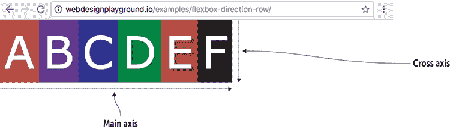

图 12.3 带有 flex 容器和应用 `row-reverse` 方向的 `div` 元素

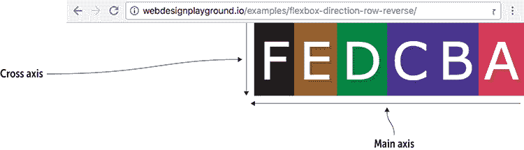

记住

如果您将 `flex-direction: column` 应用于此示例，您将得到本章前面显示的 图 12.1 中的布局；主轴将从上到下运行，交叉轴将从左到右运行。如果您应用 `flex-direction: column-reverse`，您将得到相同布局，但 `div` 元素的顺序相反；主轴将从下到上运行，交叉轴将保持从左到右。

图 12.2 显示了使用 `float: left` 或 `display: inline-block` 的相同结果，而 图 12.3 显示了使用 `float: right` 的相同结果（并且不能与内联块一起使用）。然而，使用 flexbox，您只需向容器添加几个声明即可获得结果，而不是像使用浮动和内联块那样为每个子元素设置样式。一开始，您就可以看到 flexbox 更容易且更高效。

游戏

您将如何使用 flexbox 以倒序显示编号列表？在线：[wdpg.io/12-1-4](http://wdpg.io/12-1-4)

#### 您希望项目沿主轴如何排列？

当您使用 `flex-direction` 为容器设置主轴时，您的下一个决定是您希望如何沿该轴排列项目。在容器上使用 `justify-content` 属性：

```
*container* {
    display: flex;
    justify-content: flex-start|flex-end|center|space-between|space-around;
}

```

+   `flex-start`—将项目放置在容器的开始处（默认）

+   `flex-end`—将项目放置在容器的末尾

+   `center`—将项目放置在容器中间

+   `space-between`—将项目放置在容器的开始处，将最后一个项目放置在末尾，其余项目在两者之间均匀分布

+   `space-around`—通过为每个项目在两侧提供相同数量的空间，在容器内均匀分布项目

谨慎

`space-around`值并不完全符合预期，因为你在第一个项目之前和最后一个项目之后总是得到更少的空间（参见本章后面的图 12.5）。这是因为每个项目在两侧都分配了一定的空间，所以内部项目之间有两个单位的空间，而第一个项目之前和最后一个项目之后只有一个单位的空间。

记住

`flex-start`值是默认值，因此声明`justify-content: flex-start`是可选的。

图 12.4 展示了当主轴水平时，每个值对容器内项目排列的影响。（请注意，我在每个容器周围添加了轮廓，以便你可以可视化其边界。）

播放

你可以在 Playground 上交互式地尝试不同的`justify-content`值。在线：[wdpg.io/12-1-5](http://wdpg.io/12-1-5)

#### 你希望如何排列交叉轴上的项目？

在主轴上排列项目后，你的下一个任务是选择交叉轴上的排列方式。你可以通过使用容器的`align-items`属性来设置：

```
*container* {
    display: flex;
    align-items: stretch|flex-start|flex-end|center|baseline;
}

```

+   `stretch`—沿交叉轴扩展每个项目以填充容器（默认值）

+   `flex-start`—沿交叉轴的开始对齐项目

+   `flex-end`—沿交叉轴的末尾对齐项目

+   `center`—沿交叉轴中间对齐项目

+   `baseline`—沿 flex 容器的基线对齐项目

记住

`stretch`值是默认值，因此声明`align-items: stretch`是可选的。

图 12.4 `justify-content`值的应用

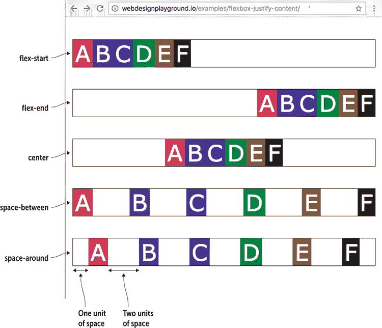

图 12.5 展示了当交叉轴垂直时，每个值对容器内项目排列的影响。（我在每个容器周围添加了轮廓，以便你可以可视化其边界。）

图 12.5 `align-items`值的作用

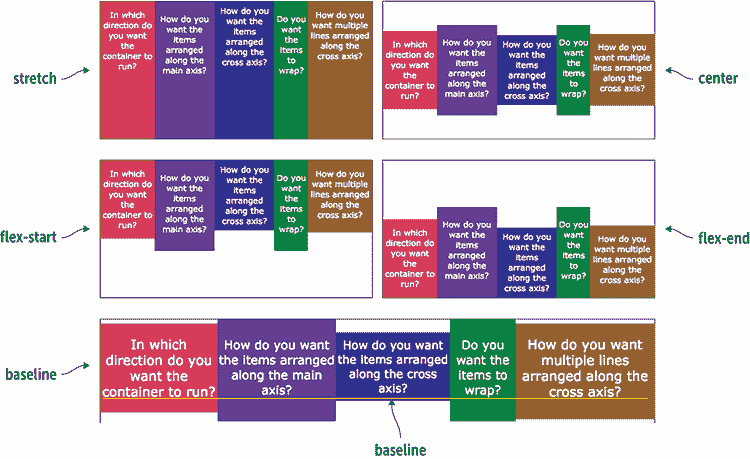

播放

你可以在 Playground 上交互式地尝试不同的`align-items`值。在线：[wdpg.io/12-1-6](http://wdpg.io/12-1-6)

常见问题解答

*这些对齐选项是不是让人困惑，还是只有我这样？* 几乎每个刚开始使用 flexbox 的人都会发现对齐是最让人困惑的部分。将主轴视为*对齐轴*可能会有所帮助，因为你在该轴上使用`justify-content`属性来排列项目。同样，将交叉轴视为*对齐轴*，因为你在该轴上使用`align-items`属性来排列项目。

#### 你希望项目是否换行？

默认情况下，flexbox 将容器视为单行（如果你已将 `flex-direction` 声明为 `row` 或 `row-reverse`）或单列（如果你已将 `flex-direction` 声明为 `column` 或 `column-reverse`）。如果容器的项目太大而无法适应行或列，flexbox 会沿着主轴缩小项目以使它们适应。或者，你可以强制浏览器将容器的项目折行或折列，而不是缩小它们。你可以通过使用容器的 `flex-wrap` 属性来完成此操作：

```
*container* {
    display: flex;
    flex-wrap: nowrap|wrap|wrap-reverse;
}

```

+   `nowrap`—不折行容器项目（默认）

+   `wrap`—根据需要将项目折行或折列

+   `wrap-reverse`—在交叉轴的末尾折行项目

记住

`nowrap` 值是默认值，因此声明 `flex-wrap: nowrap` 是可选的。

图 12.6 展示了当主轴为水平时，每个值对容器内项目排列的影响。（我在每个容器周围添加了橙色轮廓，以便你可以可视化其边界。）

图 12.6 `flex-wrap` 值的工作原理

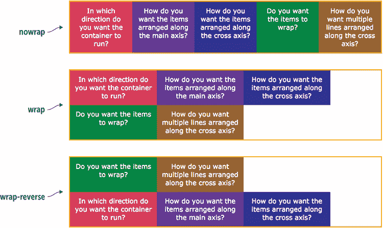

游戏

你可以通过在 Playground 上交互式地尝试这三个 `flex-wrap` 值来理解这三个值。在线：[wdpg.io/12-1-8](http://wdpg.io/12-1-8)

#### 你希望沿交叉轴排列多行吗？

你最后的容器相关决定是希望多行——即多行或多列——沿交叉轴如何排列。这与沿主轴排列单个 flex 项目类似，但在这里，你处理的是整个项目行。你可以通过使用容器的 `align-content` 属性来控制这种排列：

```
*container* {
    display: flex;
    align-content: stretch|center|flex-start|flex-end|space-between|space-around;
}

```

+   `stretch`—将折行沿交叉轴扩展以填充容器高度（默认）

+   `center`—将行放置在交叉轴的中间

+   `flex-start`—将行放置在交叉轴的开始处

+   `flex-end`—将行放置在交叉轴的末尾

+   `space-between`—将第一行放置在交叉轴的开始处，将最后一行放置在末尾，并将其余行均匀分布在两者之间

+   `space-around`—通过为每行提供两侧的固定空间量，在容器内均匀分布行

小心

与 `justify-content` 类似，`space-around` 值在第一行之前和最后一行之后提供一单位空间，但在所有其他行之间提供两单位空间。

记住

`stretch` 值是默认值，因此声明 `align-content: stretch` 是可选的。

图 12.7 展示了当主轴为水平时，每个值对容器内行排列的影响。（我在每个容器周围添加了橙色轮廓，以便你可以可视化其边界。）

图 12.7 使用 `align-content` 值

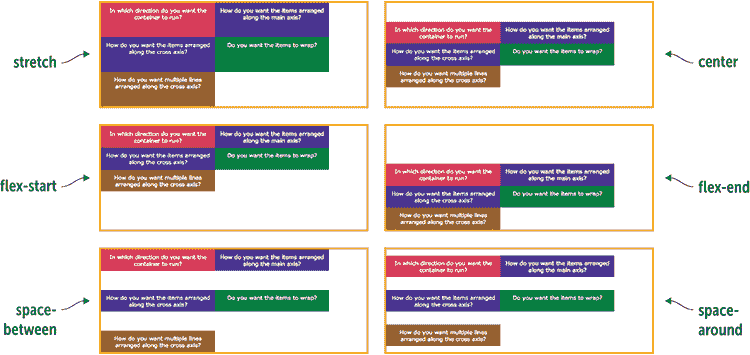

游戏

你可以在 Playground 上交互式地尝试所有`align-content`值。在线：[wdpg.io/12-1/10](http://wdpg.io/12-1/10)

## 第 12.1 课：使用 Flexbox 实现元素居中

覆盖内容：`flex`和其他 flex 容器属性

在线：[wdpg.io/12-1-1](http://wdpg.io/12-1-1)

与网页布局相关的问题中，最常见的一个问题看似简单：我如何水平和垂直居中一个元素？也就是说，你如何使用 CSS 将元素放置在浏览器窗口的中央？多年来，已经创造了许多巧妙的方法来实现这一目标，其中大多数都使用了高级和复杂的 CSS 规则。幸运的是，你不必担心这些，因为 flexbox 让你只需四行 CSS 就能将任何元素居中，如下面的示例所示。

#### 示例

在线：[wdpg.io/12-1-1](http://wdpg.io/12-1-1)

这个示例向你展示了如何在浏览器窗口中水平和垂直居中`h1`元素。

#### 网页

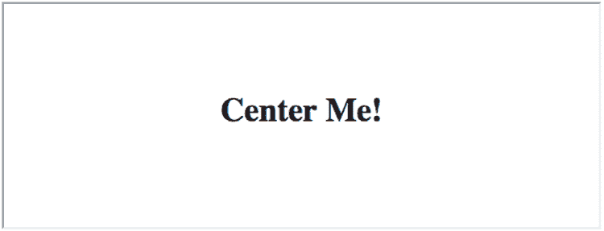

#### CSS

```
div {
    display: flex;
 justify-content: center;    ① 
 align-items: center;    ② 
 height: 100vh;    ③ 
}

```

①  水平居中`h1`。

②  垂直居中`h1`。

③  将`div`的高度设置为窗口的高度。

#### HTML

```
<div>
    <h1>Center Me!</h1>
</div>

```

这个示例通过将`div`元素转换为 flex 容器来实现，这会自动将`h1`元素转换为 flex 项目。通过将`justify-content`和`align-items`都设置为`center`，并给`div`赋予浏览器窗口的全高（默认情况下，它是浏览器窗口的宽度），你就可以在窗口中居中`h1`。

### 与 Flexbox 项目一起工作

现在你已经了解了关于 flexbox 容器值得知道的一切，现在将你的注意力转向这些容器内部的 flex 项目。就像以前一样，了解和使用 flex 项目最好的方法是通过提出一系列问题：

+   如果有额外空间，你希望项目增长吗？

+   如果空间不足，你希望项目收缩吗？

+   你想要为项目提供一个初始大小吗？

+   你想要改变项目的顺序吗？

+   你想要覆盖项目的对齐方式吗？

接下来的几节将讨论这些问题，并提供一些答案。

#### 如果有额外空间，你希望项目增长吗？

如果你回顾一下图 12.4，注意在`flex-start`示例中，flex 项目在容器的开始处聚集，在右侧留下了一块空白空间。这种效果可能是你想要的，或者你可能更喜欢让项目填充这块空白空间。你可以通过将`flex-grow`属性应用于你想要扩展的项目来实现这一点：

```
*item* {
    flex-grow: *value*;
}

```

默认情况下，所有 flex 项目都被赋予`flex-grow`值为`0`。要将项目增长以填充容器的空白空间，你应将这些项目的值设置为正数，如下所示（参见图 12.8）：

+   如果你将任何正数分配给容器中的一个 flex 项目，容器中的空白空间量将添加到该项目中。

+   如果你给容器中的多个弹性项目分配相同的正数，容器中的空余空间将平均分配给这些项目。

+   如果你给容器中的多个弹性项目分配不同的正数，容器中的空余空间将按比例分配给这些项目，比例基于你提供的值。如果你给三个项目分配值`1`、`2`和`1`，那么这些项目分别获得 25%、50%和 25%的空余空间。

精通

要计算分配给每个项目的空余空间的比例，将给定容器的所有`flex-grow`值相加，然后将单个`flex-grow`值除以这个总和。例如，值`1`、`2`和`1`的总和为`4`，所以百分比分别是 25%（1/4）、50%（2/4）和 25%（1/4）。

图 12.8 不同`flex-grow`值的影响


游戏

你可以在 Playground 上交互式地尝试不同的`flex-grow`值。在线：[wdpg.io/12-2-2](http://wdpg.io/12-2-2)

#### 你希望项目在空间不足时缩小吗？

将弹性项目扩展以填充容器的空余空间的问题的相反问题是当容器没有足够空间时缩小弹性项目。这种缩小默认情况下是激活的，所以如果浏览器检测到弹性项目太大而无法适应容器，它会自动减小弹性项目以适应。

每个项目缩小的程度取决于其与其他项目的大小关系以及容器的大小。假设你正在处理一个水平的主轴（即`flex-direction`设置为`row`），并且容器宽度为 1200px，但其中的五个项目每个宽度为 400px。总共是 2000px，所以浏览器必须减小项目宽度 800px 以适应容器。在这种情况下，因为所有项目的宽度都相同，浏览器将每个项目的宽度减少 160px。

如果项目有不同的宽度，计算会变得更加复杂，所以这里就不详细说明了。只需知道每个项目的宽度减少量取决于其初始宽度。初始宽度越大，项目缩小的越多。

学习

Mike Reithmuller 在这里对计算项目缩小涉及的数学进行了清晰的解释：[`madebymike.com.au/writing/understanding-flexbox`](https://madebymike.com.au/writing/understanding-flexbox)。

而不是让浏览器决定每个项目减少多少，你可以指定某个项目比其他项目减少更多或更少。你通过将`flex-shrink`属性应用于项目来实现这一点：

```
*item* {
    flex-shrink: *value*;
}

```

默认情况下，所有弹性项目都被赋予`flex-shrink`值为`1`，这意味着在计算缩小因子时它们都被同等对待。要自己控制缩小因子，按照以下方式给这些项目分配正值（参见图 12.9）：

+   如果你将 `flex-shrink` 设置为一个大于 `1` 的数字，浏览器会根据你提供的值按一定比例减少该元素的大小，比其他元素减少得更多。（再次强调，这里的数学计算相当复杂。）

+   如果你将 `flex-shrink` 设置为一个大于 `0` 但小于 `1` 的数字，浏览器会减少元素的大小，但比其他元素减少得少。

+   如果你将 `flex-shrink` 设置为 `0`，浏览器不会缩小元素。

注意

浏览器不会将元素缩小到小于显示其内容所需的最小尺寸。如果你继续增加元素的 `flex-shrink` 值，而元素拒绝变得更小，那么该元素可能已经达到了其可能的最小尺寸。

图 12.9 不同 `flex-shrink` 值的效果。每个元素大小为 300px，容器大小为 600px。


游戏

你可以在游乐场交互式地尝试不同的 `flex-shrink` 值。在线：[wdpg.io/12-2-5](http://wdpg.io/12-2-5)

#### 你想为元素提供一个初始大小吗？

你已经看到，弹性元素可以根据它们在容器中的适应情况而增长或缩小，你可以通过 `flex-grow` 和 `flex-shrink` 属性来控制这个过程。但是，当我说弹性元素可以增长或缩小，它们是从哪里增长和缩小的呢？这取决于：

+   如果元素有一个声明的 `width` 值（如果 `flex-direction` 设置为 `row`）或一个声明的 `height` 值（如果 `flex-direction` 设置为 `column`），元素会从这个初始尺寸开始增长或缩小。

+   如果元素没有声明宽度或高度，浏览器会自动将元素的尺寸设置为适应内容所需的最小值。元素可以从这个初始值增长，但不能缩小到更小的值。

后者情况——即没有声明 `width`（对于 `flex-direction: row`）或 `height`（对于 `flex-direction: column`）——会导致两个问题。首先，它阻止元素缩小到小于其内容的大小。其次，初始大小（即显示内容所需的最小尺寸）可能比你需要的要小。你可以通过声明一个 *flex basis* 来解决这两个问题，这是对元素的建议大小。你可以通过应用 `flex-basis` 属性来实现这一点：

```
*item* {
    flex-basis: *value*|auto|content;
}

```

+   `*value*`——为宽度（在 `flex-direction: row` 时）或高度（在 `flex-direction: column` 时）设置一个特定的尺寸。你可以使用在第七章中学到的任何 CSS 度量单位，包括 `px`、`em`、`rem`、`vw` 和 `vh`。你还可以将 `*value*` 设置为百分比。

+   `auto`——允许浏览器根据元素的 `width` 或 `height` 属性（默认值）设置初始值。如果没有声明宽度或高度，`auto` 与 `content` 相同，将在下一节讨论。

+   `content`——根据元素的内容设置初始宽度或高度。

#### 使用弹性简写属性

你应该知道，弹性框提供了一个简写属性用于 `flex-grow`、`flex-shrink` 和 `flex-basis`。这个属性名为 `flex`，它使用以下任何一种语法：

```
*item* {
    flex: *flex-grow* *flex-shrink* *flex-basis*;
    flex: *flex-grow* *flex-shrink*;
    flex: *flex-grow* *flex-basis*;
    flex: *flex-grow*;
    flex: *flex-basis*;
}

```

这是一个使用每个属性的默认值的示例声明：

```
flex: 0 1 auto;

```

此示例将 `flex-grow` 设置为 1，将 `flex-shrink` 设置为 0：

```
flex: 1 0;

```

此最终示例将一个项目的固定大小设置为 10em：

```
flex: 0 0 10em;

```

#### 你想改变一个项目的顺序吗？

弹性框提供的最令人惊讶——并且非常实用的技巧之一是能够改变容器中项目的顺序。你会在什么情况下使用这个功能？以下有两个常见的场景：

+   可访问性的一个重要原则是将页面的主要内容尽可能放置在页面的顶部。如果你在左侧边栏中有广告或其他非必要内容，那么这些内容在源文档中必然是首先出现的。然而，使用弹性框，你可以将边栏的代码放在主要内容之后，然后改变其位置，使其仍然出现在页面的左侧。

+   移动网页设计的一个重要原则是将主要内容放置在移动用户看到的初始屏幕上。如果你不想为桌面用户重新结构内容，你可以添加一个 CSS 媒体查询，使用弹性框根据所使用的设备改变内容顺序。

你可以通过使用 `order` 属性来改变弹性项目的顺序：

```
*item* {
    order: *value*;
}

```

默认情况下，弹性容器中的所有项目都被赋予 `order` 值为 `0`。你可以按照以下方式操作项目顺序：

+   项目 `order` 值越高，它在容器中出现的越晚。

+   `order` 值最高的项目在容器中最后出现。

+   `order` 值最低的项目在容器中首先出现。

精通

允许使用负 `order` 值，因此将一个项目的 `order` 值设置为 -1 是将其移动到容器前面的一种简单方法。

图 12.10 展示了几个 `order` 值的运行情况。

图 12.10 不同 `order` 值的效果

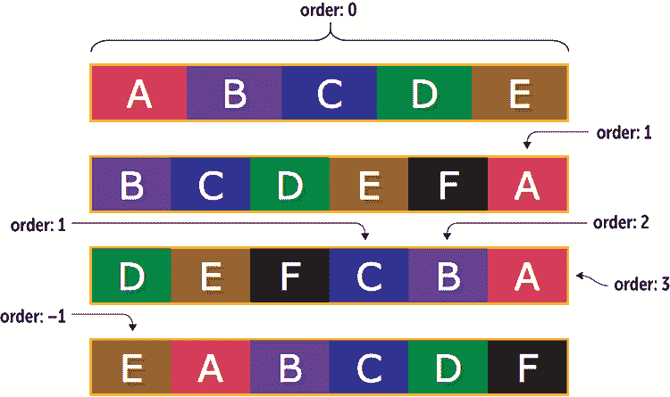

游戏

你可以在游乐场中交互式地尝试一些 `order` 值。在线：[wdpg.io/12-2-6](http://wdpg.io/12-2-6)

#### 你想覆盖一个项目的对齐方式吗？

你之前已经看到，你可以使用 `align-items` 属性来沿着容器的交叉轴排列项目。与其将所有项目以相同的方式对齐，你可能更喜欢覆盖这种全局对齐并给一个项目分配不同的对齐方式。你可以通过设置项目的 `align-self` 属性来实现这一点：

```
*item* {
    align-self: stretch|flex-start|flex-end|center|baseline;
}

```

可能的值与之前概述的方式相同（见“你希望项目如何沿交叉轴排列？”）。你还可以将值 `auto` 分配给项目，以将其重置为当前的 `align-items` 值。图 12.11 显示了一个将 `align-items` 设置为 `flex-start` 但最后一个项目的 `align-self` 设置为 `flex-end` 的容器。

Figure 12.11 你可以使用`align-self`来覆盖容器的`align-items`值。

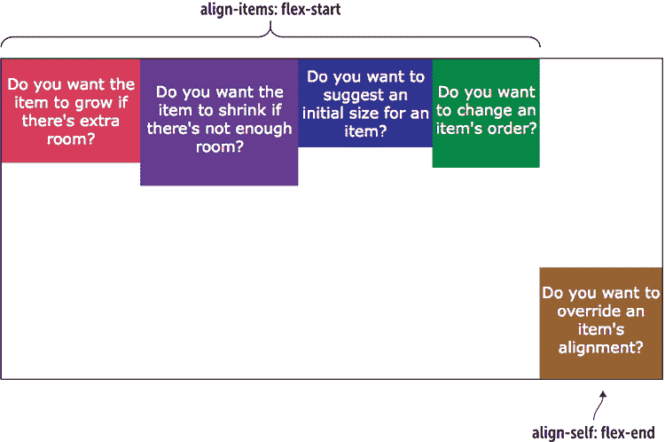

### Flexbox 浏览器支持

关于 flexbox 浏览器支持的好消息是它在所有当前浏览器中都有效。实际上，它甚至在绝大多数最近发布的浏览器中都有效，所以大部分情况下你不需要担心使用浏览器前缀。

如果你必须支持旧版浏览器，那么为了使 flexbox 正常工作，需要一些前缀。这些前缀可能会变得复杂，因为 flexbox 语法在不同版本之间有所变化，所以支持旧版浏览器意味着要支持这些旧语法。与其逐个列出所有这些前缀，我宁愿将这个任务交给一个叫做 Autoprefixer 的出色工具（[`autoprefixer.github.io`](http://autoprefixer.github.io)），如图 12.12 所示。你将你的非前缀代码粘贴到左侧面板，完全前缀的代码会自动出现在右侧面板。它还附带一个过滤器框，你可以使用它来指定你希望浏览器支持的范围：

+   输入`last` `*x*` `versions`以支持所有浏览器最近发布的`*x*`个版本（例如`last 4 versions`）。

+   输入`>` `*y*``%`以支持至少拥有`*y*``%`市场份额的浏览器（例如`> .5%`）。

Figure 12.12 使用 Autoprefixer 的在线版本为你的 flexbox 代码添加浏览器供应商前缀。

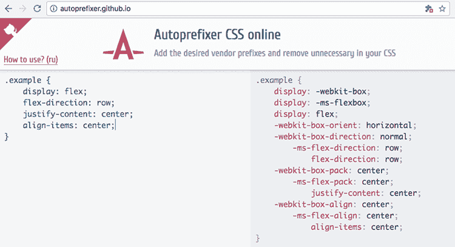

## 第 12.2 课：创建缩略图列表

涵盖：`flex-grow`和`flex-shrink`属性

在线：[wdpg.io/12-2-0](http://wdpg.io/12-2-0)

一个常见的网页组件是一个简单的缩略图列表，左侧有一个缩略图图像，右侧有描述或其他信息。这些元素用于相册、用户目录、书单、项目摘要等等。使用常规 CSS 让图像和文本表现良好是棘手的，但使用 flexbox 则非常简单，如下面的例子所示。

#### 示例

在线：[wdpg.io/12-2-1](http://wdpg.io/12-2-1)

这个例子展示了如何使用 flexbox 创建一个缩略图列表。

#### 网页

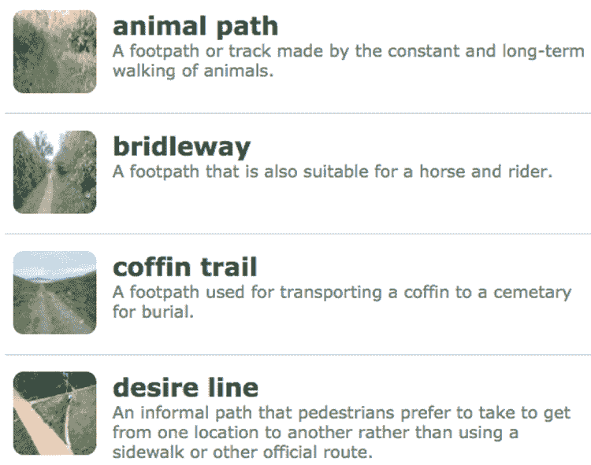

#### CSS

```
.dictionary-container {
    list-style-type: none;
}
.dictionary-item {
 display: flex;    ① 
}
.dictionary-image {
 flex-shrink: 0;    ② 
}
.dictionary-entry {
 flex-grow: 1;    ③ 
}

```

①  每个`li`元素都变成一个 flex 容器。

②  防止缩略图缩小。

③  允许文本使用容器的剩余空间。

#### HTML

```
<ul class="dictionary-container">
    <li class="dictionary-item">
        <div class="dictionary-image">
            
        </div>
        <div class="dictionary-entry">
            <h4>animal path</h4>
            <p>A footpath or track made by the constant and long-term walking of animals.</p>
        </div>
    </li>
    etc.
</ul>

```

## 第 12.3 课：使用 flexbox 创建圣杯布局

涵盖：使用`flex`和其他 flexbox 属性进行布局

在线：[wdpg.io/12-3-0](http://wdpg.io/12-3-0)

好的，现在你可以将注意力转向使用 flexbox 构建圣杯布局。和之前一样，圣杯布局包括三个需要内容并排显示的实例：页眉、导航栏和内容列。在这三个实例中，你将元素放置在具有水平主轴的 flexbox 容器中。

然而，首先请注意，您希望这些元素堆叠，这意味着它们需要一个使用垂直主轴的弹性容器。`<body>` 标签做得很好，所以将 `body` 设置为具有垂直主轴且内容从顶部开始的弹性容器：

```
body {
    display: flex;
    flex-direction: column;
    justify-content: flex-start;
    max-width: 50em;
    min-height: 100vh;
}

```

注意，我还指定了容器的最大宽度和最小高度。当我谈到稍后添加页脚时，您将看到我为什么使用 100vh。

现在处理标题，如下例所示。

#### 示例

在线：[wdpg.io/12-3-1](http://wdpg.io/12-3-1)

此示例向您展示了如何使用弹性盒模型将标题标志和标题并排排列。

#### 网页


#### CSS

```
header {
 display: flex;    ① 
 justify-content: flex-start;    ① 
 align-items: center;    ① 
    border: 1px solid black;
    padding: 1em;
}
header img {
 flex-shrink: 0;    ② 
}
h1 {
 flex-grow: 1;    ③ 
    padding-left: .5em;
    font-size: 2.5em;
}

```

①  将 `header` 元素显示为弹性容器。

②  防止标志缩小。

③  让 `h1` 元素使用标题的剩余空间。

#### HTML

```
<header>
    
    <h1>Site Title</h1>
</header>

```

在此代码中，我将标题元素转换为弹性容器，其中项目从容器的开始沿主轴（水平）排列，并在交叉轴（垂直）上居中。

现在将导航栏转换为水平弹性容器，如下例所示。

#### 示例

在线：[wdpg.io/12-3-2](http://wdpg.io/12-3-2)

此示例向您展示了如何使用弹性盒模型将导航栏项并排排列。

#### 网页

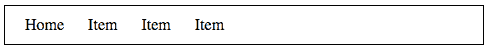

#### CSS

```
nav {
    padding: .5em;
    border: 1px solid black;
}
nav ul {
 display: flex;    ① 
 justify-content: flex-start;    ① 
    list-style-type: none;
    padding-left: .5em;
}
nav li {
    padding-right: 1.5em;
}

```

①  将 `ul` 元素显示为弹性容器。

#### HTML

```
<nav>
    <ul>
        <li>Home</li>
        <li>Item</li>
        <li>Item</li>
        <li>Item</li>
    </ul>
</nav>

```

在这种情况下，`ul` 元素被转换为弹性容器，这意味着 `li` 元素成为从容器开始水平排列的弹性项。

接下来，将 `main` 元素的 `<article>` 和 `<aside>` 标签转换为弹性项，这为您提供了两列内容布局。以下示例显示了如何实现。

#### 示例

在线：[wdpg.io/12-3-3](http://wdpg.io/12-3-3)

此示例向您展示了如何使用弹性盒模型在两列布局中并排排列 `article` 和 `aside` 元素。

#### 网页

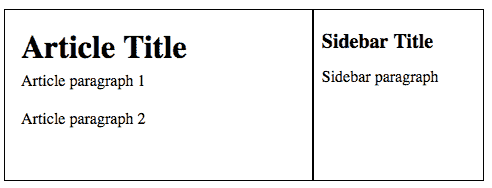

#### CSS

```
main {
 display: flex;    ① 
 flex-grow: 1;    ② 
}
article {
 flex-grow: 3;  ③ 
```

```
    border: 1px solid black;
}
aside {
 flex-grow: 1;    ④ 
    border: 1px solid black;
}

```

①  将 `main` 显示为弹性容器。

②  让它垂直增长。

③  让 `article` 使用三个单位的空间

④  让 `aside` 使用一个单位的空间。

#### HTML

```
<main>
    <article>
        <h2>Article Title</h2>
        <p>Article paragraph 1</p>
        <p>Article paragraph 2</p>
    </article>
    <aside>
        <h3>Sidebar Title</h3>
        <p>Sidebar paragraph</p>
    </aside>
</main>

```

这里正在进行一些有趣的事情。首先，请注意，`main` 元素承担双重职责：它作为 `article` 和 `aside` 元素的弹性容器，*并且*它也是 `body` 元素弹性容器中的一个弹性项。将 `main` 元素的 `flex-grow` 设置为 `1` 告诉浏览器在 `body` 容器中给 `main` 所有空的垂直空间。同样，您为什么要这样做将在您到达页脚时变得明显。

对于 `article` 和 `aside` 弹性项，我分别分配了 `flex-grow` 值为 `3` 和 `1`，这意味着 `article` 获得了可用水平空间的 75%，而 `aside` 获得了剩余的 25%。

精通

注意，`article` 和 `aside` 元素的高度相同——这是由于 `body` 容器默认的 `align-items` 的 `stretch` 值带来的一个令人愉快的额外功能。您得到一个真正的全高侧边栏，而无需求助于伪列。

最后，以与第十一章中使用的浮动和内联块布局相同的方式添加 `footer` 元素。图 12.13 显示了结果。

图 12.13 使用 flexbox 的完整圣杯布局

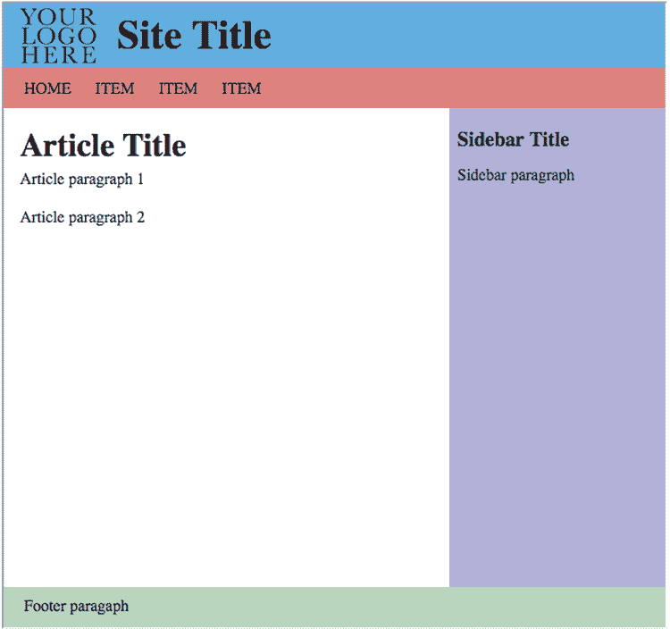

你能看到什么不同吗？没错：`footer` 元素出现在浏览器窗口的底部，这正是真正的圣杯布局中它应该出现的位置。你通过以下三个步骤实现了这个优雅的细节：

+   将 `body` 元素转换为具有垂直主轴的 flex 容器

+   在 `body` 元素上声明 `min-height: 100vh`，这将强制 `body` 元素始终至少与浏览器窗口一样高

+   在 `main` 元素上设置 `flex-grow: 1` 以强制它使用 `body` 容器中可用的任何可用空垂直空间

播放

你如何修改这个布局以将侧边栏放在左侧而不是右侧？在线：[wdpg.io/12-3-5](http://wdpg.io/12-3-5)

播放

你如何修改这个布局以显示三个内容列：在 `article` 元素左侧和右侧的侧边栏？在线：[wdpg.io/12-3-6](http://wdpg.io/12-3-6)

## 摘要

+   你希望容器向哪个方向运行？使用 `flex-direction`。

+   你希望项目沿主轴如何排列？使用 `justify-content`。

+   你希望项目沿交叉轴如何排列？使用 `align-items` 属性。

+   你希望项目是否换行？使用 `flex-wrap`。

+   你希望多行沿交叉轴如何排列？添加 `align-content` 属性。

+   如果有额外空间，你希望项目是否增长？使用 `flex-grow`。

+   如果空间不足，你希望项目是否收缩？使用 `flex-shrink`。

+   你想为项目提供一个初始大小吗？你可以使用 `flex-basis` 属性。

+   你想改变一个项目的顺序吗？你可以使用 `order` 属性。

+   你想覆盖一个项目的对齐方式吗？使用 `align-self`。
