# 第十三章  设计响应式网页

> 而不是为不断增多的各种网络设备量身定制独立的设计，我们可以将它们视为同一体验的各个面。我们可以设计出最佳的观看体验，但将基于标准的科技嵌入到我们的设计中，使它们不仅更加灵活，而且更能适应渲染它们的媒体。简而言之，我们需要实践*响应式网页设计*。*——伊森·马科特*

**本章涵盖**

+   学习为什么你应该避免固定宽度布局

+   创建流动和灵活的页面布局

+   使用媒体查询构建适应屏幕尺寸变化的页面

+   首先为移动屏幕设计布局

我将从定义我所说的“响应式网页”开始：一个*响应式*的页面是指它能够自动调整其布局、排版、图片和其他内容以适应访问页面时使用的任何屏幕尺寸。换句话说，页面内容应该在任何显示它的屏幕尺寸下都是可用的、可读的和可导航的。

响应式网页设计——或简称 RWD，在网页设计社区中通常这样称呼——如果只有少数网站用户使用智能手机或平板电脑上网，那它就不会成为一个大问题。然而，在 2014 年左右，全球使用移动设备的网络用户比例*超过了*使用桌面浏览器的用户比例。

> 网页设计就是响应式设计。响应式网页设计是正确的网页设计。*——安迪·克拉克*

有许多原因说明为什么使所有页面都响应式是一个好的实践，随着你通过本章的学习，你会了解到其中许多原因。但可以说，最重要的原因也是最基础的：

*在阅读网页时，没有人应该需要水平滚动。*

虽然确实有一些页面是为从左到右滚动导航而设计的，但绝大多数页面是垂直方向的，因此你从顶部到底部阅读或扫描它们。最令人烦恼和沮丧的网页体验之一就是当页面宽度不适应你的屏幕时，要看到所有内容就需要向右滚动，然后回到左边，再向右滚动，如此循环。这是令人沮丧的，也是人们几秒钟内就会离开网站——任何网站——的可靠方式。

## 第 13.1 课：为什么固定宽度布局是敌人

涵盖：固定宽度页面布局

在线：[wdpg.io/13-1-1](http://wdpg.io/13-1-1)

为什么网页不能适应它们显示的任何屏幕？在大多数情况下，罪魁祸首是使用大型的固定宽度元素。这些元素无论在多宽的屏幕上显示，大小都保持不变，所以如果它们的宽度大于屏幕宽度，就会出现令人讨厌的水平滚动条。为了理解我的意思，请考虑以下示例。

#### 示例

在线：[wdpg.io/13-1-1](http://wdpg.io/13-1-1)

这个例子展示了典型固定宽度布局的简化版本。

#### CSS

```
body {
 width: 960px;    ① 
}
header {
    padding: 16px;
}
article {
    float: left;
 width: 640px;    ② 
    padding: 16px;
}
aside {
    float: left;
 width: 320px;    ③ 
    padding: 12px;
}
footer {
    padding: 16px;
}

```

①  `body` 元素使用固定的宽度为 `960px`。

②  `article` 元素使用固定的宽度为 `640px`。

③  `aside` 元素使用固定的宽度为 `320px`。

#### HTML

```
<header>
    <h1>Responsive Web Design</h1>
</header>
<main>
    <article>
        <h2>A Brief History</h2>
        <p>Early in the new millennium, etc.</p>        
    </article>
    <aside>
        <h3>Links</h3>
        etc.
    </aside>
</main>
<footer>
    <p>&copy; Logophilia Limited</p>
</footer>

```

这个例子是一个基本的两列浮动布局，其中 `body` 和页面的两列——`article` 和 `aside` 元素——都使用了像素值固定的宽度。如果浏览器视口至少有 960 像素宽，这个网页显示得很好，如图 图 13.1 所示。但当页面通过较小的屏幕访问时会发生什么？如图 图 13.2 所见，纵向模式的平板电脑不够宽，因此一些内容被裁剪掉，并且出现了水平滚动条。更糟糕的是，如图 图 13.3 所示，智能手机屏幕上的页面甚至更少的内容可见，这意味着读者需要更多的水平滚动。

图 13.1 网页适合桌面屏幕。

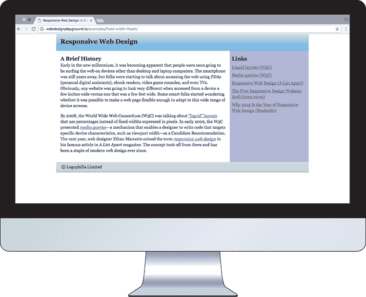

图 13.2 网页宽度对于平板屏幕来说略宽。

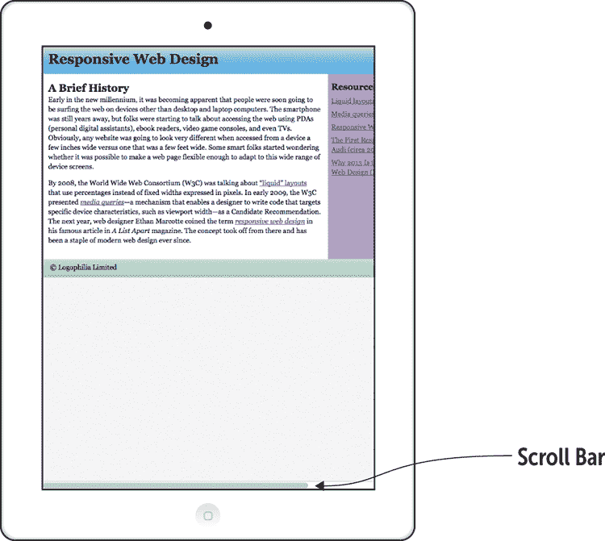

图 13.3 网页宽度对于智能手机屏幕来说太宽了。

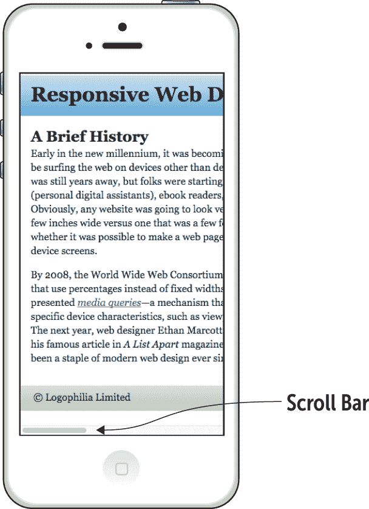

> 开发固定大小的网页是一种根本性的错误做法。这不仅会导致网页无论用户浏览器大小如何都保持恒定的大小，而且未能充分利用媒介的灵活性。*——吉姆·卡尔巴赫*

## 创建响应式布局

现在你已经知道固定宽度布局是糟糕的，你可以采取措施确保你的布局在任何尺寸的屏幕上都能良好显示。你有几种方法可以实现这种响应式理想，接下来的几节将带你了解这些方法。但首先，你需要处理一些先决条件。

首先，你需要确保所有你的块级元素都被调整到边界而不是内容，这是默认的调整方式。正如我在第九章中解释的，这样做最简单的方法是在你的 CSS 顶部包含以下规则：

```
* {
    box-sizing: border-box;
}

```

其次，你需要配置浏览器视口的默认宽度和缩放，通过在页面 `<head>` 部分添加以下标签来实现：

```
<meta name="viewport" content="width=device-width, initial-scale=1.0">

```

通过设置 `width=device-width`，你告诉浏览器将页面宽度设置为与显示页面的设备宽度相同。通过设置 `initial-scale=1.0`，你告诉浏览器初始时不放大也不缩小地显示页面。

添加了这些调整后，你就可以准备实现响应式布局了。

## 第 13.2 节：创建流动布局

涵盖：使用百分比进行流动布局

在线：[wdpg.io/13-2-0](http://wdpg.io/13-2-0)

如你之前所见，固定宽度布局的真正问题是将 `width` 属性设置为绝对值，例如 `960px`。你可以通过将你的绝对 `width` 值转换为使用百分比而不是像素的相对宽度来解决这个问题。这种解决方案通常被称为 *流动布局*。

记住

使用相对测量单位（如百分比）的布局称为*流动布局*。

将固定宽度布局转换为流动布局通常是一个三阶段的过程。第一阶段是决定布局的最大宽度。流动布局的目标是在面对较小的屏幕尺寸时允许内容缩小，在遇到较大屏幕时允许内容放大。然而，大多数情况下，您不希望内容变得太宽，因为这可能导致阅读时文本行太长。检查您的内容，然后确定一个最大宽度，这个宽度仍然允许良好的阅读和导航。有了这个数字，将`max-width`属性应用于最外层容器（如`body`元素）。以下示例将`body`元素的最大宽度声明为 960 像素：

```
body {
    max-width: 960px;
}

```

第二阶段是确定其余元素要使用的百分比宽度。默认情况下，任何块级元素都占用其父元素宽度的 100%，因此您只需要计算您想要使用小于父元素全宽度的元素的百分比。如果一个`article`元素宽度为 1,000 像素，并且一个子`div`声明了`width: 75%`，那么这个`div`宽度为 750 像素。如果屏幕大小调整，使得`article`元素宽度为 800 像素，那么子`div`会自动缩小到 600 像素宽。

记住

当使用百分比设置宽度时，请记住 CSS 不是基于视口宽度来计算这个百分比的。相反，它是基于元素父元素的宽度来计算这个百分比的。

要将固定宽度元素转换为百分比，您需要将以下公式应用于每个元素：

```
element percentage = (element fixed width / parent fixed width) * 100

```

在本章前面 13.1 节中展示的示例有两个固定宽度组件：

+   一个宽度设置为 640 像素的`article`元素。因为父元素（`body`元素）宽度为 960 像素，所以`article`元素的百分比宽度值为(640 / 960) * 100 = 66.67%。

+   一个宽度设置为 320 像素的`aside`元素。同样，父元素（`body`元素）宽度为 960 像素，因此`aside`元素的百分比宽度值为(320 / 960) * 100 = 33.33%。

将固定宽度布局转换为流动布局的第三阶段是将相同的公式应用于布局中的任何其他水平元素，例如边距和填充。如果一个元素声明了`padding: 12px`，并且其父元素宽度为 960 像素，那么流动边距宽度变为(12 / 960) * 100 = 1.25%。

以下示例展示了如何将之前的示例转换为流动布局。

#### 示例

在线：[wdpg.io/13-2-1](http://wdpg.io/13-2-1)

此代码展示了将固定宽度布局转换为流动布局的过程。

#### CSS

```
body {
 max-width: 960px;    ① 
}
article {
    float: left;
 width: 66.67%;    ② 
 padding: 1.67%;    ④ 
}
aside {
    float: left;
 width: 33.33%;    ③ 
 padding: 1.25%;    ④ 
}

```

①  `body`元素现在的最大宽度为`960px`。

②  `article`元素现在的宽度为`66.67%`。

④  `padding`属性现在是百分比。

③  `aside`元素现在的宽度为`33.33%`。

#### HTML

```
<header>
    <h1>Responsive Web Design</h1>
</header>
<main>
    <article>
        <h2>A Brief History</h2>
        <p>Early in the new millennium, etc.</p>        
    </article>
    <aside>
        <h3>Links</h3>
        etc.
    </aside>
</main>
<footer>
    <p>&copy; Logophilia Limited</p>
</footer>

```

播放

你可以在 Playground 上练习将固定宽度布局转换为流体布局。在线：[wdpg.io/13-2-2](http://wdpg.io/13-2-2)

在设置了流体布局后，你可以在图 13.4 中看到，纵向模式的平板可以完全显示网页内容。看起来不错！图 13.5 显示智能手机屏幕也可以显示内容，而不需要读者水平滚动。很好。但你也可以清楚地看到，生成的列非常窄，这使阅读变得困难。要解决这个问题，你需要学习另一种响应式设计技术。但在那之前，让我们先谈谈视口单位。

图 13.4 在流体布局中，网页完美地适应了平板屏幕。

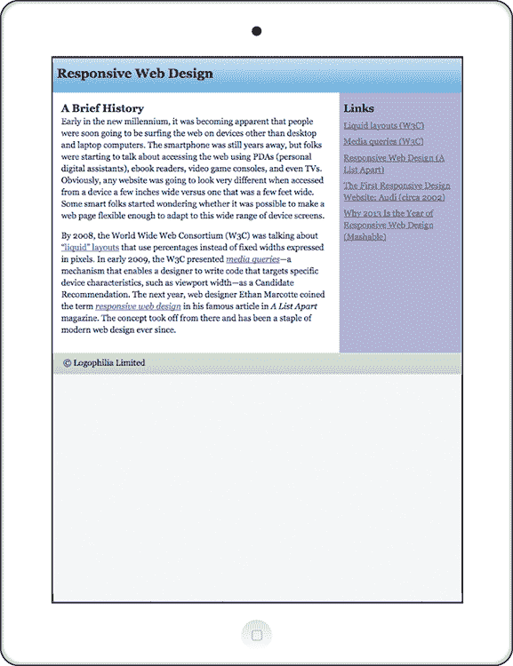

图 13.5 流体布局也适合智能手机屏幕，但代价是列太窄。

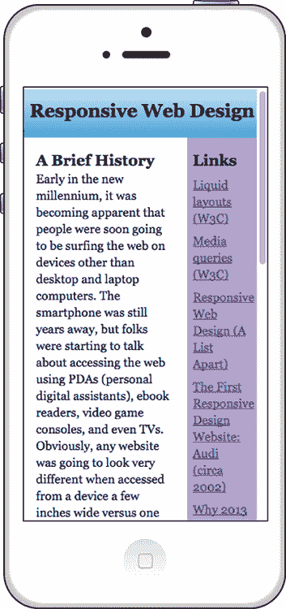

### 使用视口单位的流体布局

当处理百分比单位时，重要的是要记住，将百分比宽度分配给一个元素意味着你正在将该元素样式设置为其*父元素*宽度的百分比。如果父元素宽度为 800 像素，你在子元素上声明`width: 75%`，则该子元素宽度为 600 像素。浏览器屏幕宽度是 2,000 像素并不重要；该子元素在屏幕上仅占用 600 像素。

如果你想让子元素宽度为屏幕宽度的 75%，而不是其父元素宽度，那么在这种情况下，你需要从百分比转换为视口单位，这些单位类似于百分比单位，适用于整个浏览器视口。你可以使用的四个单位是

+   `vw`—视口宽度单位，其中`100vw`等于当前视口宽度的 100%。如果视口宽度为 1,600 像素，则`1vw`相当于`16px`。

+   `vh—`视口高度单位，其中`100vh`等于当前视口高度的 100%。如果视口高度为 2,000 像素，则`1vh`相当于`20px`。

+   `vmin`—视口最小单位，其中`100vmin`等于两个视口尺寸中较小的 100%。如果视口宽度为 800 像素，高度为 600 像素，则`1vmin`相当于`6px`（因为在这种情况下，视口高度是两个尺寸中较小的一个）。

+   `vmax`—视口最大单位，其中`100vmax`等于两个视口尺寸中较大的 100%。如果视口宽度为 1,200 像素，高度为 1,024 像素，则`1vmax`相当于 12`px`（因为视口宽度是两个尺寸中较大的一个）。

假设你想显示一个图像，使其自动占据视口的整个高度。你可以通过将以下规则应用于图像来实现这一点：

```
.image-full {
    height: 100vh;
    width: auto;
}

```

我添加了`width: auto`声明来告诉浏览器根据高度自动计算宽度，这保持了图像的原始宽高比。

播放

你可以在 Playground 上尝试这种全高图像技术。在线：[wdpg.io/13-2-4](http://wdpg.io/13-2-4)

## 第 13.3 课：创建弹性布局

涵盖：使用 flexbox 包裹元素

在线：[wdpg.io/13-3-0](http://wdpg.io/13-3-0)

当屏幕变得太窄，无法有效地并排显示内容时，是时候改变你的布局了。具体来说，你需要你的布局停止使用并排列，并切换到一个更垂直的布局，使每个元素都能占据整个屏幕的宽度。

在下一节中，你会看到 CSS 提供了一种技术，允许你直接访问当前设备的宽度。这个工具非常强大，但对于许多布局来说，它可能有些过度，因为你有方法让元素自动换行并创建所谓的*弹性布局*。

记住

当没有足够水平的空间来并排显示元素时，元素会自动换行，这种布局被称为*弹性布局*。

一种可能性是将你的浮动转换为内联块。当你将宽度设置为百分比并添加一个`min-width`声明以确保你的块始终大于或等于某个最小尺寸时，你的块将在视口没有足够的水平空间来显示块时自动换行。不幸的是，如果你使用了我在第十一章中提到的假列技巧，在特定的宽度下块会换行，但你仍然可以看到假列的一部分，这看起来很不好。内联块只适用于你没有使用假列技巧的情况。

播放

你可以在 Playground 上看到内联块技术的实际应用。在线：[wdpg.io/13-3-2](http://wdpg.io/13-3-2)

一个更好的解决方案是 flexbox，它提供了`flex-wrap`属性来激活容器内的换行。它还允许你使用`flex-grow`来确保你的块使用你想要的比率，并且你可以通过添加`flex-basis`值并将`flex-shrink`设置为`0`来建立最小块宽度。

以下示例使用弹性布局更新了之前的例子。

#### 示例

在线：[wdpg.io/13-3-1](http://wdpg.io/13-3-1)

这段代码展示了将流动布局转换为弹性布局的过程。

#### CSS

```
body {
 display: flex;    ① 
 flex-direction: column;    ① 
 align-items: center;    ① 
}
.container {
    display: flex;     
 flex-direction: column;    ② 
 max-width: 960px;    ② 
}
main {
 display: flex;    ③ 
 flex-wrap: wrap;    ③ 
 flex-grow: 1;    ③ 
}
article {
 flex-grow: 2;    ④ 
 flex-shrink: 0;    ④ 
 flex-basis: 300px;    ④ 
}
aside {
 flex-grow: 1;    ⑤ 
 flex-shrink: 0;    ⑤ 
 flex-basis: 150px;    ⑤ 
}

```

①  `body` 元素是一个列弹性容器。

②  `container` 元素是一个列弹性容器。

③  `main` 元素是一个包裹的弹性容器。

④  `article` 元素可以从 300px 的基础值增长，但不能缩小。

⑤  `aside` 元素可以从 150px 的基础值增长，但不能缩小。

#### HTML

```
<div class="container">
    <header>
        <h1>Responsive Web Design</h1>
    </header>
    <main>
        <article>
            <h2>A Brief History</h2>
            <p>Early in the new millennium, etc.</p>        
        </article>
        <aside>
            <h3>Links</h3>
            etc.
        </aside>
    </main>
    <footer>
        <p>&copy; Logophilia Limited</p>
    </footer>
</div>

```

在这里，我使用`body`元素作为列 flex 容器，这使我能够通过使用`align-items: center`水平居中`div`。`main`元素也被设置为 flex 容器，并声明了`flex-wrap: wrap`。`article`和`aside`元素（作为 flex 项目）分别具有`flex-grow`值为`2`和`1`，这是从液体布局中 66.67%和 33.33%的`width`值的 flex 等效值。在两种情况下，我还为每个元素添加了`flex-basis`（分别为`300px`和`150px`）并将`flex-shrink`设置为`0`，这为每个元素创建了一个最小宽度值。

> 我认为，网络的最大的优势通常被视为一种限制，一种缺陷。网络的本质是灵活的，作为设计师和开发者，我们应该拥抱这种灵活性，制作出通过灵活性对所有用户都适用的页面。*——约翰·奥尔斯普*

图 13.6 展示了在智能手机屏幕上出现的灵活页面布局。如果你向下滚动，如图 13.7 所示，你会看到`aside`元素在`article`元素下换行。

图 13.6 在智能手机屏幕上查看的灵活页面布局的顶部部分

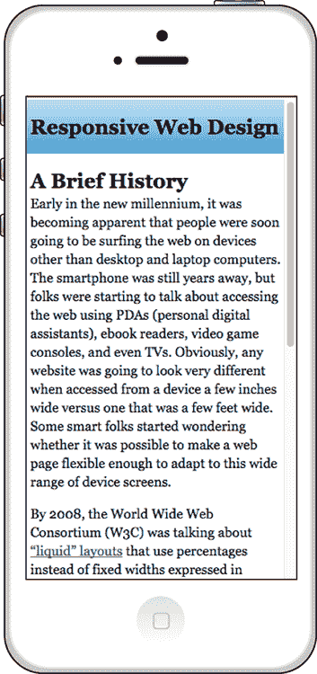

图 13.7 灵活布局的底部部分显示`aside`元素在`article`元素下换行。


## 第 13.4 课：创建自适应布局

涵盖：使用`@media`查询

在线：[wdpg.io/13-4-0](http://wdpg.io/13-4-0)

在第 13.3 课中，你学习了如何使用 flexbox 使液体元素在设备视口变得太窄而无法容纳元素的最低宽度时进行换行。这个技术很实用，但并不总是可以依赖，因为可能有些时候你不能使用 flexbox（例如，你需要支持旧版本的 Internet Explorer）。

在另一个但相关的方面，回顾一下图 13.6。看看页面标题（响应式网页设计）几乎适合智能手机视口的宽度吗？如果这个元素再大几像素或者再长几个字母，它就会换行，看起来会很糟糕，如图 13.8 所示。

图 13.8 稍微增加页面标题的大小，设计就会破裂。

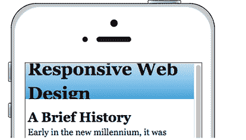

这些场景是如何相关的？你可以通过询问浏览器视口宽度的问题来解决潜在的问题：

+   视口宽度是否小于 450 像素？如果是，从元素中移除浮动，以便它们以默认堆叠布局显示。

+   视口宽度是否小于 350 像素？如果是，将页面标题的字体大小减少到 24px。

+   视口宽度是否大于 1,024 像素？如果是，显示`aside`元素。

你可以通过在 CSS 中定义 *媒体查询* 来提出这些问题以及许多其他类型的问题。一个 *媒体查询* 是一个表达式，后面跟着一个包含一个或多个样式规则的代码块。该表达式调查屏幕的某个特性，如其宽度。如果该表达式对当前设备为真，则浏览器应用媒体查询的样式规则；如果表达式为假，则浏览器忽略媒体查询的规则。使用媒体查询的布局通常称为 *自适应布局*，因为它会根据显示它的屏幕进行自我调整。

记住

使用媒体查询根据屏幕特性（如宽度）调整页面元素和属性的布局称为 *自适应布局*。

这里是一般语法：

```
@media (*expression*) { 
*selector* {
 *declarations*
    }
    etc.
}

```

记住

从技术上讲，`@media` 规则可以跟一个关键字来指定媒体类型，例如 `print` 或 `tv`。默认关键字是 `screen`，然而，这是你希望在网页上使用的值，所以你可以省略这一点。

`*expression*` 最常见的是 `min-width` 或 `max-width`，后面跟一个冒号和一个值。

如果你想在屏幕宽度不超过指定值的情况下应用样式，请使用 `max-width`。以下代码告诉浏览器，当屏幕宽度小于或等于 350 像素时，以 `24px` 的字体大小显示 `h1` 元素：

```
@media (max-width: 350px) {
    h1 {
        font-size: 24px;
    }
}

```

如果你想在屏幕宽度至少与指定值相同的情况下应用样式，请使用 `min-width`。以下代码在屏幕宽度大于或等于 1,024 像素时，将 `display: inline-block` 应用于 `aside` 元素：

```
@media (min-width: 1024px) {
    aside {
        display: inline-block;
    }
}

```

学习

你将要编写的绝大多数媒体查询都使用 `min-width` 或 `max-width` 在表达式中。但你可以查询其他几个媒体特性，包括高度、分辨率和宽高比。要查看完整列表，请查看 Mozilla 开发者网络页面 [`developer.mozilla.org/en-US/docs/Web/CSS/@media#Media_features`](https://developer.mozilla.org/en-US/docs/Web/CSS/@media#Media_features)。

以下代码更新示例，使用一个媒体查询，在屏幕宽度降至 450 像素或更少时移除 `article` 和 `aside` 元素的浮动。

播放

给定一个三列弹性盒布局，编写一个媒体查询，在较小屏幕上首先显示中间列。在线：[wdpg.io/13-4-3](http://wdpg.io/13-4-3)

为了保险起见，媒体查询还执行以下操作：

+   它将 `article` 和 `aside` 元素的宽度设置为 `100%`。

+   它将 `h1` 元素（即页面标题）的字体大小减少到 `24px`。

+   它将 `main` 元素的背景颜色更改为白色，这有效地关闭了假列效果，因为当 `aside` 元素未浮动时，你不需要它。

#### 示例

在线：[wdpg.io/13-4-1](http://wdpg.io/13-4-1)

此代码使用媒体查询从 `article` 和 `aside` 元素中移除浮动，并执行一些其他任务，如注释所述。

#### CSS

```
h1 {
    float: left;
    font-size: 32px;
}
main {
    background-color: #b4a7d6;
}
article {
    float: left;
    width: 66.67%;
}
aside {
    float: left;
    width: 33.33%;
}
@media (max-width: 450px) {    ① 
    article {
 float: none;    ② 
 width: 100%;    ② 
    }
    aside {
 float: none;    ② 
 width: 100%;    ② 
    }
    h1 {
 font-size: 24px;    ③ 
    }
    main {
 background-color: white;    ④ 
    }
}

```

① 媒体查询适用于屏幕宽度最多为 `450px`。

② 从 `article` 和 `aside` 元素中移除了浮动。

③ 页面标题缩小到 `24px`。

④ 将 `main` 元素的背景颜色更改为白色。

图 13.9 展示了屏幕宽度大于 450 像素时页面布局的外观。然而，如图 13.10 和 13.11 所示，当屏幕宽度为 450 像素或更小时，布局会发生变化。

图 13.9 这是屏幕宽度大于 450 像素时你看到的页面布局。

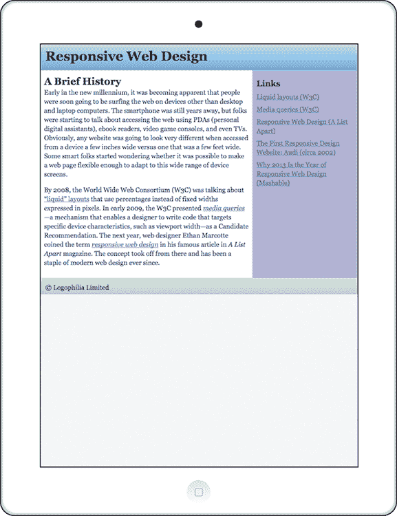

图 13.10 这是屏幕宽度小于 450 像素时页面布局的顶部部分。


图 13.11 屏幕底部部分确认了已从 `article` 和 `aside` 元素中移除了浮动。

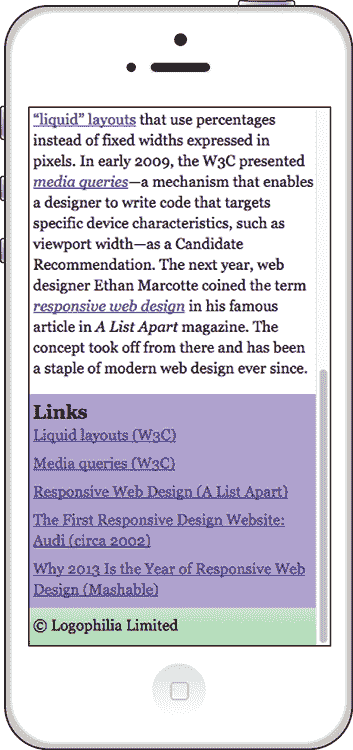

播放

给定一个示例布局版本，其中 `aside` 元素默认隐藏，编写一个媒体查询，当视口宽度至少为 1,024 像素时显示 `aside` 元素。在线：[wdpg.io/13-4-2](http://wdpg.io/13-4-2)

### 关于媒体查询断点的说明

你可能会想设置媒体查询以针对特定的设备宽度，例如 320px 针对 iPhone 5 及更早版本，400px 针对 Galaxy Note，768px 针对 iPad 4 及更早版本，等等。然而，这条路是疯狂的道路。有太多不同宽度的设备，你不可能希望针对它们全部。即使你能够以某种方式做到这一点，你的代码也会在一天结束时过时，因为不断有新宽度的设备被发布。忘掉它吧。

相反，最好让内容决定你在媒体查询中使用的 `min-width` 和 `max-width` 值。例如，在桌面屏幕上，你可能确定你的文本行在每行大约有 75 个字符时最易读。如果你在容器元素宽度为 600 像素时能够达到这个行长度，那么将这个元素的 `max-width` 属性设置为 `600px` 是有意义的。假设你还确定你的行在每行大约有 50 个字符时仍然可读，并且当容器元素宽度为 400 像素时达到这个行长度。

尝试不同的屏幕宽度，以查看容器宽度何时低于这个 400 像素的阈值。这取决于你的整体页面布局，但假设当屏幕宽度低于 550 像素时发生这种情况，因为你将容器浮动在宽度为 150 像素的侧边栏旁边。当宽度低于这个值时，你的页面可读性会降低，因此设计在 550px 处断裂。这个值成为媒体查询的 *断点*：

```
@media (max-width: 550px) {
    .container {
        float: none;
        width: 100%;
    }
}

```

通常，你改变浏览器窗口的宽度，并注意设计断裂的宽度：文本行变得太短或太长，字体大小变得太大，块元素最终出现在奇怪的位置，等等。然后使用这个宽度作为媒体查询的断点。

## 第 13.5 课：创建移动优先布局

包括：使用 `@media` 为非移动屏幕

在线：[wdpg.io/13-5-0](http://wdpg.io/13-5-0)

在第 13.4 节中，你看到了如何使用媒体查询来针对移动屏幕并调整布局功能，如移除浮动。这没问题，但有一种网络设计思想认为，所有 CSS 都应该是累加的，而不是减法的。也就是说，你的 CSS 应该添加或修改属性值，而不是删除它们。为什么？在某种程度上，CSS 就像烹饪；添加盐和其他调味料比移除它们要容易得多。在你的网页设计厨房里，始终最好从最简单的布局开始，然后添加内容。

在几乎每一种可想象的网页场景中，最简单的布局是专为在最小的设备上工作而设计的，这些设备如今意味着智能手机。因此，你的想法是构建你的页面，使其在最小的智能手机屏幕上看起来和工作得很好（通常是 320 像素宽）。然后你才为更大的屏幕添加和修改布局。这种布局被称为 *移动优先* 布局，它是当今响应式网页设计的核心。

记住

你不一定必须从 320px 这样小的宽度开始。如果你可以访问你的网站分析数据，它们应该告诉你访客使用哪些设备。如果你发现所有或大多数移动用户都在至少 400 像素宽的设备上，你应该从这里开始。

记住

一种从为移动设备设计的结构开始，并在屏幕足够宽时增加复杂性的布局被称为 *移动优先布局*。

移动优先设计的一个原则是在初始的以移动为中心的布局中只包含对用户页面体验至关重要的页面元素。许多移动用户使用缓慢的连接和有限的数据计划上网，因此作为一名负责任的网页设计师，你的任务是确保这些用户不会得到任何无用的内容。什么算是“无用的”或“非必要的”往往是一个棘手的问题，因为对一个人来说是微不足道的，而对另一个人来说可能是至关重要的。你在这里需要做出一些判断，这也是他们付给你高薪的原因。

> 移动设备要求软件开发团队只关注应用程序中最重要数据和操作。在 320x480 像素的屏幕上根本无法容纳多余的、不必要的元素。你必须优先考虑。*——卢克·沃罗布列夫斯基*

为了说明这一点，假设你修改了示例页面，使其包含一个左侧的第二个 `aside` 元素，你将使用它来显示与响应式网页设计相关的引言。这个细节很好，但不是必需的，尤其是在网页的正常流程中，这个元素会出现在 `article` 元素之前。如下面的代码所示，添加这个新的 `aside` 元素并使用 `display: none` 声明来默认隐藏它。然后使用媒体查询在至少 750 像素宽的屏幕上显示该元素。

#### 示例

在线：[wdpg.io/13-5-1](http://wdpg.io/13-5-1)

此代码使用媒体查询在至少 750 像素宽的屏幕上显示其他隐藏的 `<aside class="quotation">` 元素。

#### CSS

```
.quotation {
 display: none;    ① 
}

@media (min-width: 750px) {
    .quotation {
 display: block;    ② 
    }
}

```

①  `quotation` 类默认是隐藏的。

②  在至少 `750px` 宽的屏幕上，元素会被显示。

#### HTML

```
<header>
    <h1>Responsive Web Design</h1>
</header>
<main>
 <aside class="quotation">    ③ 
 <h3>Quote</h3>    ③ 
 etc.    ③ 
 </aside>    ③ 
    <article>
        <h2>A Brief History</h2>
        <p>Early in the new millennium, etc.</p>        
    </article>
    <aside>
        <h3>Links</h3>
        etc.
    </aside>
</main>
<footer>
    <p>&copy; Logophilia Limited</p>
</footer>

```

③  新的 `quotation` 元素

图 13.12 显示，在智能手机上，布局不包括引用侧边栏，但它会在如图 13.13 所示的平板电脑等更宽的屏幕上出现。

图 13.12 引用侧边栏在窄智能手机屏幕上不会出现。

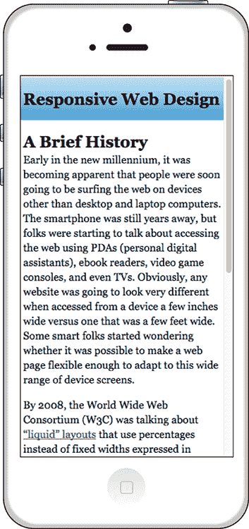

图 13.13 引用侧边栏在更宽的屏幕上（如平板电脑）会出现。

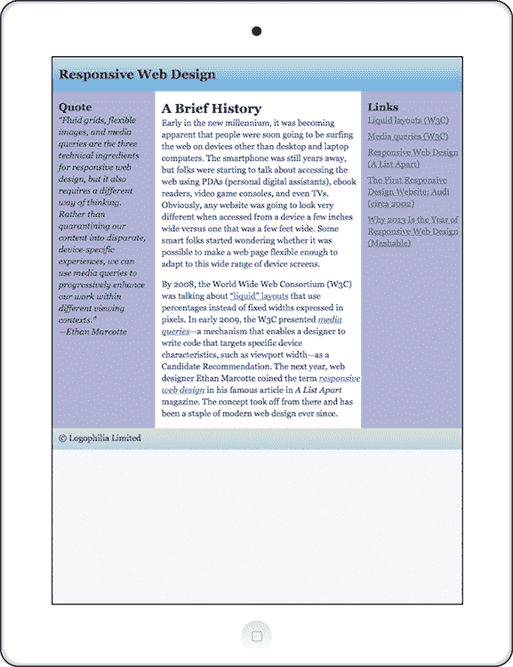

### 哪种布局是响应式的？

这是一个很好的问题。答案是，它们**全部**加起来构成了现代响应式布局的概念：一种使用相对度量、灵活的网格和媒体查询的布局，所有这些都以移动优先的方法呈现。如果你将这些概念融入你的页面，你将走在通往最终目的地的路上：一个完全响应式的网页设计。

记住

使用相对度量单位、灵活的网格、媒体查询和移动优先方法的布局被称为**响应式布局**。

但你还没有完全到达那里。为了完成这段旅程，你需要知道如何让你的图片和文本响应式。你将在第十四章学习如何做到这一点。

## 摘要

+   避免使用固定宽度布局，其中页面元素的大小是通过使用像素等绝对度量来确定的。

+   使用流体布局，其中水平度量（如宽度、填充和边距）以百分比表示。

+   如果这样做适合你的设计，使用 flexbox 或内联块来创建一个灵活的布局，允许页面元素在屏幕尺寸变小时进行包裹。

+   为了创建自适应布局，使用媒体查询调整元素大小、更改布局，并根据屏幕大小隐藏或显示元素。

+   使用移动优先的方法，其中你的初始页面布局针对智能手机优化，并使用媒体查询根据需要为更大的屏幕添加功能和更改布局。
