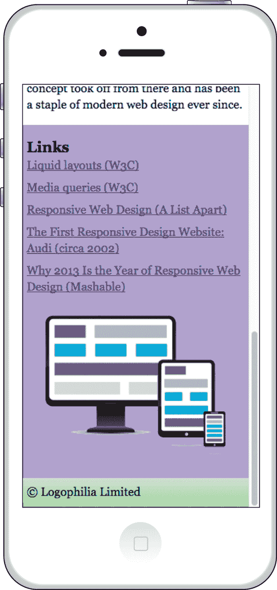
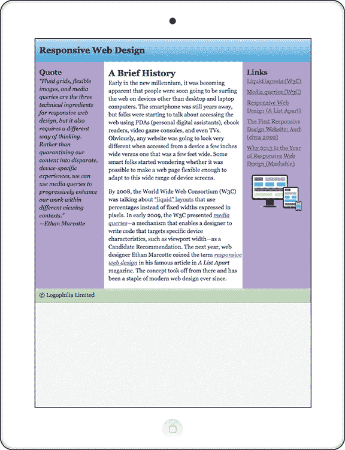
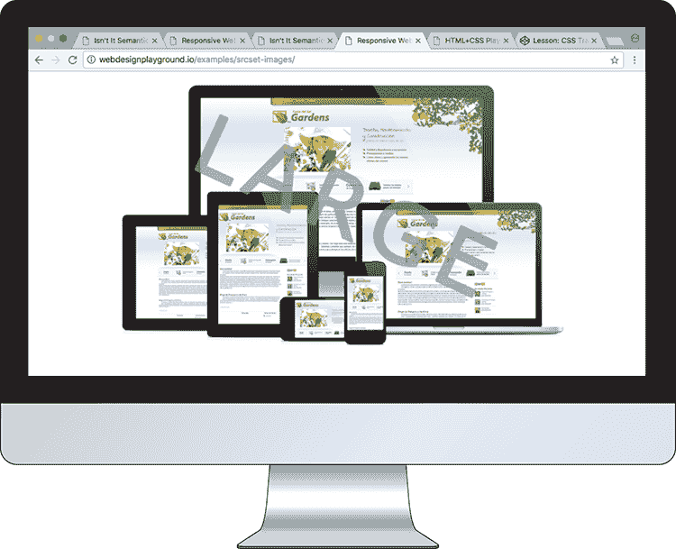
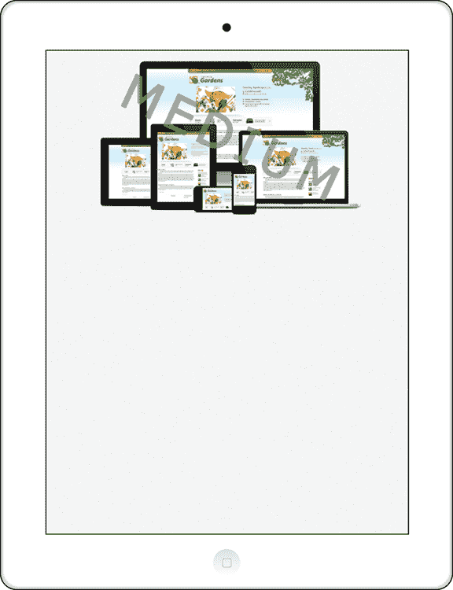
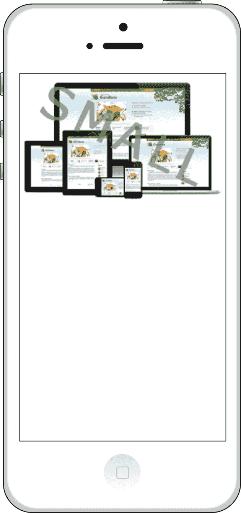
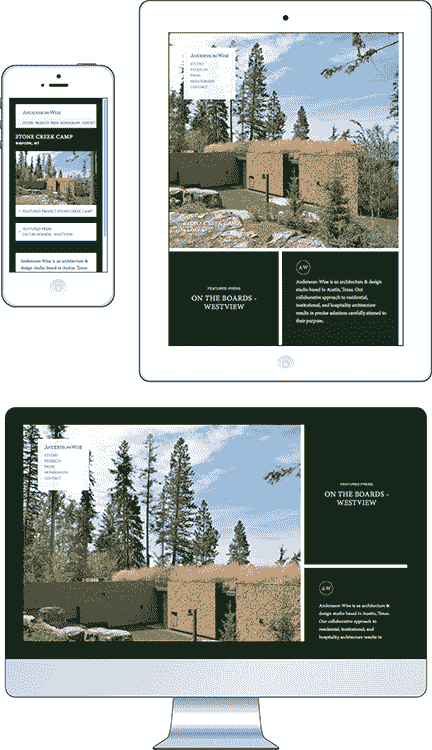
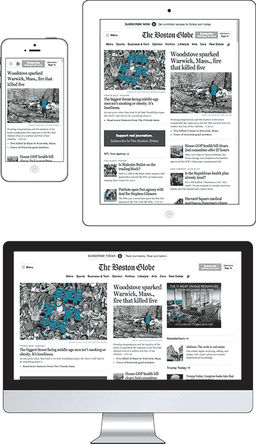
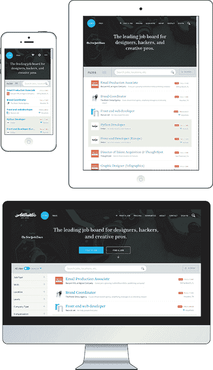

# 第十四章  使你的图片和排版响应式

> 响应式设计最重要的特点是 *灵活性*。一切都必须是灵活的：布局、图片大小、文本块——绝对一切。灵活性给你的网站提供了所需的流动性，使其能够适应任何容器。*——尼克·巴比奇*

**本章涵盖**

+   制作响应式屏幕尺寸的流体图片

+   根据用户的屏幕尺寸提供不同大小的图片

+   通过指定响应式字体大小使文本适应屏幕尺寸

+   通过指定响应式度量使其他页面元素适应屏幕尺寸

在第十三章中，你不仅学习了为什么不应该使用固定宽度布局，还学习了为什么（以及如何）应该使用既灵活又适应的响应式布局。在屏幕尺寸千差万别的今天，让页面布局根据不同的屏幕宽度变化是必不可少的，但这只是响应式设计的部分内容。为了让你的页面真正适应任何设备，你需要对你的页面图片和

使用响应式像素魔法对页面排版进行样式化。你需要根据屏幕宽度对图片进行缩放或缩小，根据屏幕大小提供不同的图片，并使用响应式字体大小。你将在本章学习这些以及其他强大的响应式技术。

## 制作响应式图片

使图片响应式是网页设计师面临的最大挑战之一。挑战的规模来自于与使图片响应式相关的两个问题：

+   使固定大小的图片适应具有流体尺寸的容器。宽度为 600 像素的图片可以很好地适应宽度为 800 像素的元素，但如果该元素缩小到 400 像素宽，则会溢出。解决这个问题需要使图片变为流体，以便其大小根据屏幕大小的变化进行调整。

+   提供适合用户屏幕尺寸的图片版本。向桌面用户提供 2,000 x 1,500 像素的图片是一回事，但向智能手机用户发送相同的图片是浪费上传时间和带宽。

下两个课程将向你展示一些基本方法来克服这些问题。

## 第 14.1 课：创建流体图片

覆盖内容：为响应式设计样式化 `img` 元素

在线：

一张图片带有预定的宽度和高度，乍一看，似乎无法克服这些固定尺寸。幸运的是，`` 标签是页面元素之一。是的，默认情况下，图片会以全宽度和高度显示，就像 `div` 或其他任何块元素一样。但就像你可以通过使用百分比使块元素变为流体一样，你也可以使图片变为流体。

在处理图片时，你需要稍微小心一些：

+   在大多数情况下，你不想让图片放大超过其原始大小，因为对于大多数图片来说，这种缩放会导致难看的像素化和锯齿边缘。

+   如果你改变图片的一个维度，它几乎肯定会看起来是倾斜的，因为它的原始宽高比——图片宽度与高度的比例——已经被改变。因此，你必须成比例地改变宽度和高度以保持图片的原始宽高比。幸运的是，你可以让浏览器为你做部分工作。

为了处理这两个问题，你可以创建一个响应式图片，通过应用以下规则来响应屏幕大小的变化：

```
img {
    max-width: 100%;
    height: auto;
}

```

设置 `max-width: 100%` 允许图片根据其父容器大小的变化而缩小或放大，但同时也指定图片的宽度永远不会超过其原始宽度。设置 `height: auto` 告诉浏览器通过根据图片当前宽度计算高度来保持图片的原始宽高比。

播放

在某些情况下，你不想让图片的高度超过其原始高度，因此需要在图片上设置 `max-height: 100%` 和 `width: auto`。在线：

以下代码展示了示例。

#### 示例

在线：[wdpg.io/14-1-1](http://wdpg.io/14-1-1)

此代码创建了一个响应式图片，当屏幕大小变化时，图片会相应地缩小或放大，但不会放大超过其原始尺寸。

#### CSS

```
img {    ① 
 max-width: 100%;    ① 
 height: auto;    ① 
}

```

①  使图片流动的规则

#### HTML

```
<header>
    <h1>Responsive Web Design</h1>
</header>
<main>
    <aside class="quotation">
        <h3>Quote</h3>
        etc.
    </aside>
    <article>
        <h2>A Brief History</h2>
        <p>Early in the new millennium, etc.</p>        
    </article>
    <aside>
        <h3>Links</h3>
        etc.
     ② 
    </aside>
</main>
<footer>
    <p>&copy; Logophilia Limited</p>
</footer>
```

②  添加到 `aside` 元素中的图片

图 14.1 和 14.2 展示了当其父 `aside` 元素的宽度变化时，图片大小如何变化。

图 14.1 当其 `aside` 父元素被赋予智能手机屏幕的全宽时，图片的显示效果



图 14.2 当 `aside` 元素以较窄的宽度显示时，图片相应地缩小。



## 第 14.2 课：响应式图片交付

覆盖：`sizes` 和 `srcset` 属性

在线：

响应式图片的另一面涉及向用户交付一个适合设备屏幕大小的图片版本。你可能为智能手机屏幕提供图片的小版本，为平板电脑提供中等版本，为桌面电脑提供大版本。在过去，你需要一个脚本来处理这个任务，但在 HTML5 中，你可以通过两个新属性 `sizes` 和 `srcset` 在 `` 标签中完成所有操作。

`sizes` 属性类似于媒体查询，你使用一个表达式来指定屏幕特性，例如最小或最大高度，然后指定你希望在匹配该配置的屏幕上显示图片的宽度。你可以指定多个表达式-宽度对，用逗号分隔。以下是通用语法：

```
sizes="(*expression1*) *width1*,
       (*expression2*) *width2*,
       etc.,
*widthN*" 

```

谨慎

当你通过改变浏览器窗口大小来测试 `srcset` 属性时，你可能会发现浏览器并不总是下载不同大小的图片。尽管浏览器可能会根据 `srcset` 值检测到应该使用较小的图片，但它可能会选择调整现有图片的大小，因为它已经下载了该图片。

记住

默认图像，即使用`src`属性指定的图像，是作为不支持`srcset`属性的旧浏览器的回退图像显示的。良好的移动优先实践是将默认图像设置为你希望提供给移动用户的图像。

注意，如果最后一个项目没有指定表达式，则指定的宽度适用于任何不匹配任何表达式的屏幕。假设你想要图像在屏幕小于或等于 500px 时以 90vw 的宽度显示，在其他所有屏幕上以 50vw 的宽度显示。以下是设置方法：

```
sizes="(max-width: 500px) 90vw, 50vw"

```

接下来，向你的``标签添加`srcset`属性，将其设置为以逗号分隔的图像文件位置列表，每个位置后跟图像宽度和字母`w`。以下是通用语法：

```
srcset="*location1* *width1w*,
*location2* *width2w*,
        etc."> 

```

此代码为浏览器提供了一组图像大小选择，并根据当前设备的屏幕尺寸和你在`sizes`属性中指定的首选宽度选择最佳图像。以下是一个示例：

```
srcset="/images/small.tif 400w,
        /images/medium.tif 800w,
        /images/large.tif 1200w"> 

```

以下示例将所有内容组合起来，向你展示如何响应式地提供图像。

#### 示例

在线：[wdpg.io/14-2-1](http://wdpg.io/14-2-1)

此示例使用``标签的`sizes`和`srcset`属性，根据浏览器视口大小响应式地提供图像。

#### HTML

```
    ③ 

```

① 为旧浏览器提供的默认图像

② 显示图像的大小

③ 浏览器可以选择的图像

图 14.3 至图 14.5 展示了浏览器提供的图像如何随着屏幕大小的变化而变化。

图 14.3 宽浏览器视口获取大图像。



图 14.4 平板尺寸视口获取中等图像。



图 14.5 智能手机尺寸视口获取小图像。



## 使排版响应式

你的目标是要激怒访问你网站的一些人吗？我想不是，但如果你为你的网站排版使用像素，你可能会这样做。像 Google Chrome 和 Mozilla Firefox 这样的网络浏览器允许用户指定默认字体大小，在所有现代浏览器中默认设置为`16px`，但视力逐渐衰退或视力受损的人经常将其增加到`24px`、`32px`甚至更高。如果你为页面正文使用`font-size: 16px`这样的声明，*所有*访问者——特别是那些增加了默认字体大小的人——将看到以该大小显示的文本。愤怒的导火索。

记住

要在 Chrome 中进行自己的测试，请通过打开设置、点击自定义字体，然后使用字体大小滑块设置你想要的字体大小。

幸运的是，通过将 `font-size` 值切换为相对单位，可以轻松避免这种情况。一种可能性是 `em` 单位，其中 `1em` 对应浏览器的默认字体大小——或者，更重要的是，*用户* 指定的默认字体大小。如果默认值为 `16px`，则 `1.5em` 对应 `24px`，而 `3em` 对应 `48px`。如果默认值为 `24px`，则 `1.5em` 将渲染为 `36px`，而 `3em` 将渲染为 `72px`。

那种解决方案看起来似乎是完美的，但在这个响应式汤中有一个继承的飞虫。首先，让我指出，*继承* 意味着对于某些 CSS 属性，如果父元素使用 `font-size` 属性进行了样式设置，其子元素和后代元素将自动以相同的方式样式化。（参见第十九章了解更多关于这个重要 CSS 概念的信息。）为了看到这个问题，首先考虑以下 HTML 和 CSS，然后回答一个问题：如果默认字体大小是 `16px`，则 `h1` 元素的字体大小是多少像素？

HTML:

```
<body>
    <header>
        <h1>What’s My Font Size?</h1>
    </header
</body>

```

CSS:

```
body {
    font-size: 1em;
}
header {
    font-size: 1.5em;
}
h1 {
    font-size: 2em;
}

```

你的直观猜测可能是，因为 `h1` 元素声明为 `font-size: 2em`，它必须以 `32px` 渲染。唉，情况并非如此，要了解原因，你需要知道 `font-size` 属性是继承的，这导致了以下序列：

1.  `body` 元素的字体大小（`1em`）被设置为 `16px`。

1.  `header` 元素从 `body` 元素继承了字体大小，因此 `header` 元素的字体大小（`1.5em`）被设置为 `24px`。

1.  `h1` 元素从 `header` 元素继承了字体大小，因此 `h1` 元素的字体大小（`2em`）被设置为 `48px`。

当使用 `em` 单位时，这并不是一个破坏性交易；你需要意识到这个事实，并考虑继承的字体大小。

如果你不想做数学运算来成功使用 `em` 单位，有一个替代方案：`rem` 单位。`rem` 是 *root em* 的缩写，指的是页面根的字体大小，即 `html` 元素。有两点需要注意：

+   因为根的字体大小与默认字体大小相同，并且因为 `rem` 单位以与 `em` 单位相同的方式缩放，所以 `rem` 单位是响应式的。

+   因为 `rem` 单位始终只从 `html` 元素继承其字体大小，所以没有继承的陷阱需要担心。声明为 `font-size: 2rem` 的 `h1` 元素将始终以默认字体大小的两倍渲染。

这并不是说你应该总是使用 `rem` 而不是 `em`。可能存在一些情况，你*希望*子元素的字体大小相对于其父元素的字体大小，在这种情况下，`em` 单位是最好的选择。

## 第 14.3 节：使用响应式字体大小

覆盖内容：使用 `rem` 单位设置 `font-size`

在线：

以下代码将示例页面更新为将 `font-size` 属性的绝对 `px` 单位替换为相对的 `rem` 单位。

#### 示例

在线：[wdpg.io/14-3-1](http://wdpg.io/14-3-1)

此代码将示例页面更新为将 `font-size` 属性的绝对 `px` 单位替换为相对的 `rem` 单位。

#### CSS

```
h1 {
 font-size: 2rem;    ① 
}
h2 {
 font-size: 1.5rem;    ① 
}
h3 {
 font-size: 1.25rem;    ① 
}
@media (min-width: 750px) {
    h1 {
 font-size: 2.5rem;    ② 
    }
    h2 {
 font-size: 2rem;    ② 
    }
    h3 {
 font-size: 1.5rem;    ② 
    }
}

```

①  标题元素设置了移动优先的`rem`字体大小。

②  标题元素也设置了大屏幕的`rem`字体大小。

## 第 14.4 课：使用响应式度量

涵盖：使用`rem`单位进行度量

在线：

不幸的是，使用绝对单位如`px`导致的糟糕设计结果并不仅限于字体大小。为了说明我的意思，考虑以下代码，其结果如图 14.6 所示：

```
HTML:
<header>
    <h1>Responsive Web Design</h1>
</header>
CSS:
header {        
    height: 64px;
}
h1 {
    font-size: 2rem;
}

```

图 14.6 `h1`文本在`2rem`时看起来不错。


看起来不错！但是，当我将我的网络浏览器（Firefox）中的默认字体更改为 30px 时会发生什么？图 14.7 展示了这个悲伤的故事。

图 14.7 当使用较大的默认字体时，元素渲染效果不佳。


记住

这个例子是人为的，因为在实践中，你很少会显式设置元素的高度。相反，总是让内容自然地决定元素的高度更好。

在较大的默认字体大小下，标题比包含它的`header`元素要大，导致文本整体显得拥挤，并且（更糟糕的是）切断了`p`和`g`的下降部分。

为什么会发生这种情况？标题元素的`height`属性使用的是绝对值`64px`。无论你使用什么默认字体大小，这个高度都不会移动一个像素。但是，考虑以下修改后的代码和图 14.8 中显示的结果：

```
HTML:
<header>
    <h1>Responsive Web Design</h1>
</header>
CSS:
header {        
    height: 4rem;
}
h1 {
    font-size: 2rem;
}

```

图 14.8 现在标题元素的`height`属性使用相对的`rem`单位，随着默认字体大小的变化，标题会随着文本一起缩放。


我所做的唯一改变是在`header`元素上声明`height: 4rem`。使用相对单位使高度响应式，因此当默认字体值更改时，它会增加（或减少）。

你如何使用相对单位进行度量取决于许多因素，其中最重要的因素之一是你试图实现的设计效果。然而，可以提出一些指导原则：

+   对于垂直度量，如`padding-top`、`padding-bottom`、`margin-top`和`margin-bottom`，使用`rem`单位。

+   对于横向度量，如`width`、`padding-right`、`padding-left`、`margin-right`和`margin-left`，使用百分比。

BEware

因为百分比是相对于父元素而言的，你可能发现使用百分比来设置填充或边距会导致意想不到或奇怪的结果。在这种情况下，你应该切换到`rem`单位以获得更多控制。

+   对于你想要对`width`、`max-width`和`min-width`等属性有更多控制的横向度量，使用`rem`单位。

+   对于你想要相对于视口高度进行缩放的垂直度量，使用`vh`单位。

+   对于你想要相对于视口宽度进行缩放的横向度量，使用`vw`单位。

#### 示例

在线：[wdpg.io/14-4-1](http://wdpg.io/14-4-1)

此代码更新示例页面，将所有绝对`px`度量替换为相对`rem`或百分比单位。

#### CSS

```
.container {
 max-width: 60rem;    ① 
}
header {
 padding: 1rem    ② 
1.67%;    ③ 
}
h1 {
 padding-left: 1.67%;    ③ 
}
.quotation {
 padding-right: 1.67%;    ③ 
}
article {
    flex-basis: 20rem;
    padding-top: 1rem;
    padding-left: 1.67%;
}
p {
    margin-bottom: 1rem;
}
aside {
    flex-basis: 10rem;
    padding: 1rem
 1.67%;
}
div {
    padding-bottom: .5rem;
}
footer {
    padding: 1rem
 1.67%;
}
```

①  用于更大控制的`rem`单位

②  所有垂直度量使用的`rem`单位

③  所有其他水平度量使用的百分比

## 响应式网站画廊

Hicks Design ([`hicksdesign.co.uk`](https://hicksdesign.co.uk)) 提供了一种类似画廊的布局，它呈现出干净、整洁的外观，能够完美地适应任何屏幕尺寸。


当 Andersson-Wise 网站([www.anderssonwise.com](http://www.anderssonwise.com))从桌面版本缩放到平板电脑和智能手机版本时，它优雅地重新构建了其布局。



波士顿环球报首页([www.bostonglobe.com](http://www.bostonglobe.com))能够响应式地从桌面上的三栏布局变为平板电脑上的两栏布局，再到智能手机上的单栏布局。



Authentic Jobs 网站([`authenticjobs.com`](https://authenticjobs.com))在智能手机尺寸的屏幕上显示简单的职位列表，并在屏幕尺寸增加时逐步添加更多详细信息。



## 摘要

+   通过使用声明`max-width: 100%`和`height: auto`来使您的图片流动。

+   在您的``标签中，添加`sizes`和`srcset`属性以缩放并传递适合任何屏幕尺寸的图片。

+   在设置字体大小时，避免使用绝对像素值，而是使用`rem`单位。

+   在设置垂直度量（如高度、填充和边距）时，也使用`rem`单位。
