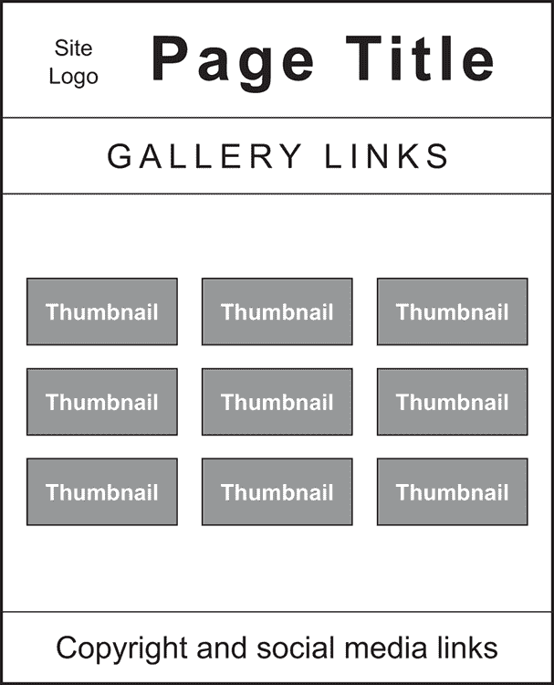
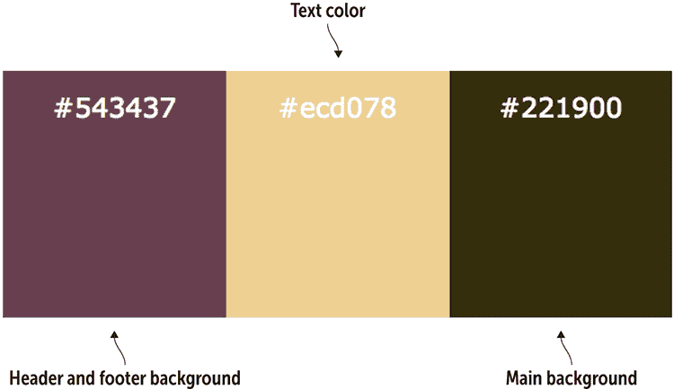
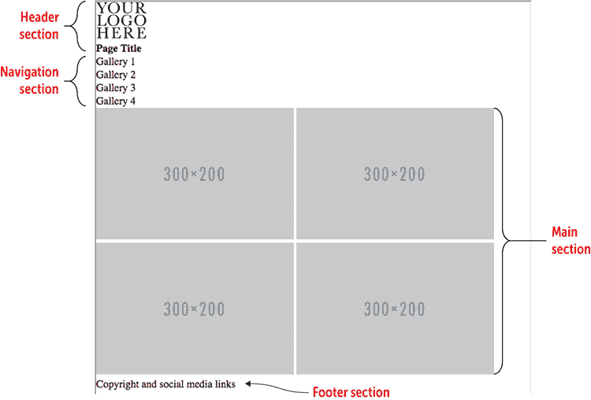
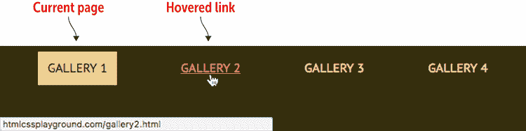
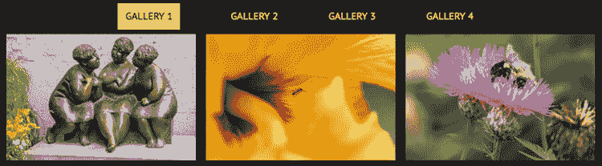
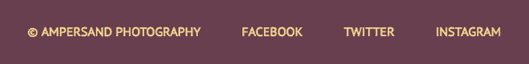
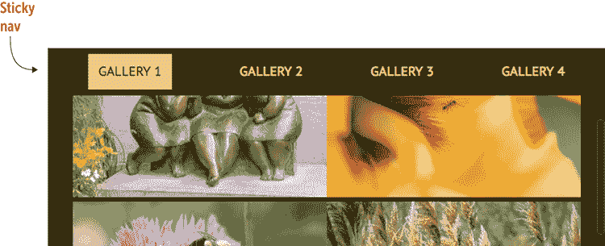
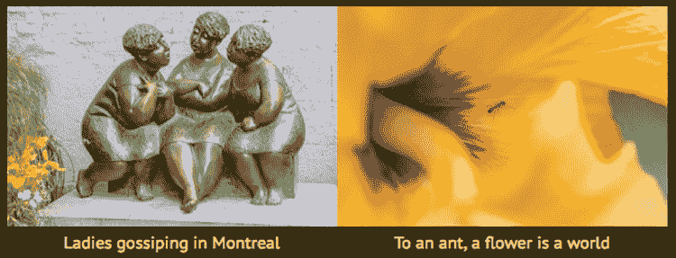
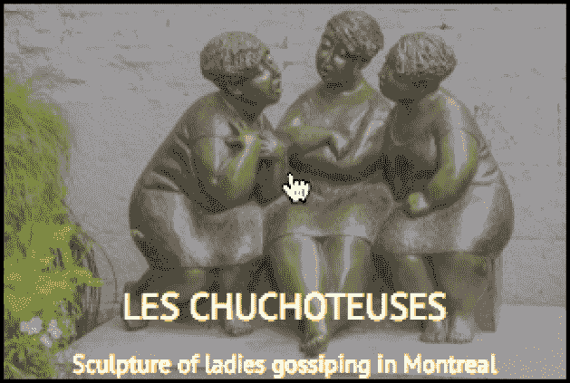
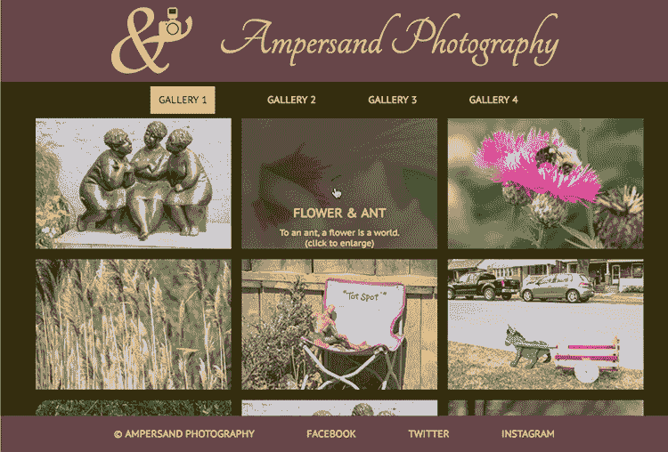

# 第十五章  *项目:* 创建一个照片画廊

> 人们喜欢照片。如果你开始发布照片，它们很快就会成为你网站最受欢迎的部分。*——布莱恩·贝利*

**本章涵盖**

+   规划和草图你的照片画廊

+   为你的页面选择字体

+   添加页眉和导航链接

+   添加图像缩略图

+   添加动态标题和链接到全尺寸图像

与你在第五章中构建的个人主页和第十章中构建的着陆页不同——你现在已经具备足够的知识来创建一个看起来像是专业人士设计和编码的页面。如果在这个网页设计旅程的这个阶段，这对你来说似乎有些难以置信，这一章将证明我是对的。在这里，我将带你通过构建一个功能齐全的照片画廊，包括动态生成的标题、链接到每个缩略图的全尺寸版本以及更多内容。你将利用到目前为止学到的许多工具和技术，包括类选择器、CSS 盒模型、图像（当然）和布局。让我们开始工作吧！

## 你将构建的内容

这个项目是一个在线画廊，用于展示你的照片。页面将至少包含半打*缩略图*，这是你图像的缩小版本。想法是，网站访客应该能够点击其中一个缩略图来显示图像的全尺寸版本。每个缩略图还应显示一个简短的标题，描述图像。

表面上看，这个项目很简单。说实话，生成的页面看起来也很简单。它看起来很*不错*，但给人的感觉是简单。然而，这个网站看起来不复杂，并不意味着它就是这样构建的。正如你很快就会学到的，这个页面在引擎盖下有一些令人惊叹的技术，包括基于 flexbox 的布局、基于视口的尺寸和复杂的定位技术。

## 准备你的照片

你应该开始这个项目，至少准备一些你的照片以供使用。你将想要使用 JPEG，因为它们在保持良好的照片质量的同时提供了更小的文件大小。你还需要每个图像的两个版本：一个常规尺寸版本和一个缩略图版本。在我的页面布局中，所有缩略图都需要相同的大小。你使用什么大小都无关紧要，但在我的项目中，我将所有缩略图的大小调整为 300 像素宽和 200 像素高。全尺寸版本可以是任何你想要的大小。

小心

你的全尺寸图像理论上可以是任何大小，但请记住，大照片可能重量达到数十兆字节。你不想对这些版本进行过多的压缩，所以请保持大小在合理范围内。在我的项目中，我使用了 2048x1365 像素的图像。

大师

如果你不确定想要使用什么大小的缩略图，可以先使用一张图片，并在整个画廊中重复使用。当你确定了理想的大小后，你可以处理你想要使用的其余照片。

## 绘制布局草图

正如你在前面的项目中看到的（见第五章和第十章），你的网络项目应该从铅笔和纸开始（或者你最舒适的任何变体）。你正在学习如何设计网页，任何值得称道的作品总是从快速草图开始，以获得对页面尺寸和组件的整体感觉。“快速”是关键词。你不需要创建最终页面的艺术家渲染图。如图图 15.1 所示，你需要布局页面的主要部分，并指出每个部分的近似位置、大小和内容。

图 15.1 显示了具有以下四个部分的页面布局：

+   包含网站标志和标题的页眉

+   包含链接到其他画廊页面的导航区域

+   包含图像缩略图的主要页面部分

+   包含版权声明和社交媒体网站链接的页面页脚

在处理完这些之后，现在是时候将你的注意力转向你想要用于页面的字体或字体组合。

图 15.1 在深入研究页面 HTML 和 CSS 细节之前，使用铅笔和纸来感受整个页面的布局和内容。



## 选择字体

这个页面字体很少，所以选择字体不应该占用你太多时间。有三个地方你的字体选择会发挥作用：

+   *标题* —看起来像是手写的样式会很不错。对于我的项目，我将保持简单，并使用默认的`cursive`字体。对于在 Windows PC 和 Mac 上都有良好覆盖率的字体，你可以选择 Brush Script MT。

+   *导航和页脚* —这里的文本主要由链接组成，所以一个漂亮、干净的无衬线字体是个不错的选择。对于我的项目，我选择了预装在大多数 Windows PC 上的 Calibri 和预装在大多数 Mac 上的 Optima。

+   *缩略图图像标题* —这些标题相对较小，所以我建议使用即使在小型尺寸下也能保持可读性的字体。我将坚持使用 Calibri 和 Optima 来制作标题。

在我的 CSS 中，我将使用以下声明来指定这些字体族：

```
font-family: cursive;
font-family: Optima, Calibri, sans-serif;

```

现在将你的注意力转向照片画廊的颜色方案。

## 选择颜色

这个页面在颜色上很简单，所以你不需要构建一个复杂的颜色方案。事实上，在我的这个项目版本中，我仅使用三种主要颜色：

+   *页眉和页脚背景* —当页眉和页脚颜色相同时，这种设计看起来很平衡。因为主要背景（接下来讨论）应该是相对简单的，以展示缩略图，所以页眉和页脚背景给你一个机会选择一些带有一点活力的颜色来活跃页面。

+   *主要背景* —这个区域占据了页面的大部分空间，用于显示图片缩略图和导航链接。黑色或深灰、棕色或蓝色的深色调最适合这个用途。

+   *文本* —这种颜色需要在页面的三个部分：页眉、主要内容和页脚中都能很好地阅读。假设这些部分使用深色背景，则类似于`#eee`的浅白色或不太明亮的黄色会很好。

图 15.2 展示了我为项目选择的颜色。

图 15.2 我项目的配色方案



当页面布局草图和你的字体和颜色选择确定后，是时候通过将一切转换为 HTML 和 CSS 代码来使事情更加具体（从虚拟意义上讲）。

## 构建页面

要构建你的照片画廊，从我在第一章介绍给你的基本代码开始。从那里开始，逐节添加文本、HTML 标签和 CSS 属性。

### 初始结构

为了开始，从第一章的基本页面结构添加画廊布局。我将使用 HTML5 语义元素：

+   页面页眉部分使用`header`元素，它由两个项目组成：一个用于网站标志的`img`元素和一个用于网站标题的`h1`元素。

+   导航部分使用`nav`元素，它由指向画廊其他页面的链接的无序列表组成。

+   主要部分使用`main`元素，它由几个`img`元素组成，每个元素都指向一张照片的缩略图版本。

+   页面页脚部分使用`footer`元素，它包括版权声明和指向几个社交媒体网站的链接。

#### 尝试这个

在线：[wdpg.io/projects/photo-gallery/01](http://wdpg.io/projects/photo-gallery/01)

这里是构成照片画廊初始 HTML 结构的元素。

#### 网页



#### HTML

```
<header>    ① 
     ① 
 <h1>Page Title</h1>    ① 
</header>    ① 
 <nav>    ② 
 <ul>    ② 
 <li>Gallery 1</li>    ② 
 <li>Gallery 2</li>    ② 
 <li>Gallery 3</li>    ② 
 <li>Gallery 4</li>    ② 
 </ul>    ② 
</nav>    ② 
<main>    ③ 
     ③ 
     ③ 
     ③ 
     ③ 
</main>    ③ 
<footer>    ④ 
 <p>Copyright and social media links</p>    ④ 
</footer>    ④ 
```

①  页眉部分

②  导航部分

③  主要部分（图片缩略图）

④  页脚部分

记住

初始页面布局还包括一个 CSS 重置，将边距和填充设置为`0`，并将框大小设置为`border-box`。

目前这个画廊看起来并不怎么样，但很快你就会解决这个问题。你首先设置页面的整体布局。

### 整体布局

在第十二章花了那么多时间学习如何使用 flexbox 之后，你可能会很高兴地听到，你将在这里把那些努力用到实处，因为这个项目使用 flexbox 进行所有布局。

通过设置初始 flexbox 容器来开始操作。`<body>`标签非常适合这个目的，您将使用它作为单列容器，这为您提供了一个垂直主轴。您希望项目与该轴的起始位置对齐（即页面的顶部）。您还希望所有内容在水平方向上居中，并且希望页脚出现在屏幕底部，即使没有足够的内容填充页面的其余部分。以下示例显示了如何设置一切。

#### 尝试此操作

在线：[wdpg.io/projects/photo-gallery/02](http://wdpg.io/projects/photo-gallery/02)

此示例向您展示如何将`body`元素配置为整个页面的 flexbox 容器。

#### CSS

```
body {
 display: flex;    ① 
 flex-direction: column;    ① 
 justify-content: flex-start;    ① 
 align-items: center;    ① 
 min-height: 100vh;    ② 
 font-family: Optima, Calibri, sans-serif;    ③ 
 background-color: #221900;    ③ 
 color: #ecd078;    ③ 
}
```

①  设置 flexbox 容器。

②  设置最小高度。

③  应用字体堆栈以及背景和文字颜色。

记住

Flexbox 现在几乎在所有浏览器中都得到了支持，因此为了使代码简单且不杂乱，这里和 Playground 上的代码没有包含任何供应商前缀。然而，如果您需要支持旧浏览器，则可以使用 Autoprefixer ([`autoprefixer.github.io`](https://autoprefixer.github.io))来生成前缀。

我在这里要添加的一个评论是关于`min-height`属性。通过将此属性声明为`100vh`，您正在告诉浏览器`body`元素始终至少与浏览器视口的宽度相同。确保`body`元素的高度大于或等于视口的高度，以确保即使没有足够的内容垂直填充视口，页脚部分也会出现在屏幕底部。

### 页眉部分

页眉部分由一个包含两个项目的`header`元素组成：一个用于网站标志的`img`元素和一个用于网站标题的`h1`元素。您还希望页眉具有以下功能：

+   由于页眉背景与页面背景不同，因此如果页眉扩展到浏览器窗口的宽度，则看起来最佳。为此，在`header`元素上声明`width: 100%`。

+   网站标志和标题应在页眉中水平和垂直居中。将`header`元素配置为具有水平主轴的 flexbox 容器，并将`justify-content`和`align-items`都设置为`center`。

以下示例显示了用于实现这些目标并样式化页眉其余部分的 HTML 和 CSS。

#### 尝试此操作

在线：[wdpg.io/projects/photo-gallery/03](http://wdpg.io/projects/photo-gallery/03)

此示例将照片画廊的页眉部分样式化为一个 flexbox 容器，该容器水平和垂直居中网站标志和标题。

#### 网页


#### CSS

```
header {
 display: flex;    ① 
 justify-content: center;    ① 
 align-items: center;    ① 
    padding: 1em 0;
 width: 100%;    ② 
    background-color: #542437;
}
h1 {    ③ 
 padding-left: .5em;    ③ 
 font-family: cursive;    ③ 
 font-size: 3em;    ③ 
}
```

①  页眉是一个 flexbox 容器。

②  页眉使用整个窗口宽度。

③  网站标题的样式

#### HTML

```
<header>
    
    <h1>Ampersand Photography</h1>
</header>

```

### 导航部分

页面的下一个区域是导航部分，它包含指向其他画廊页面的几个链接。此部分使用`nav`元素，并包含一个链接的无序列表。以下是你要为此部分实现的目标列表：

+   链接应在导航部分内水平和垂直居中。将`nav`元素设置为 flexbox 容器，具有水平主轴，并将`justify-content`和`align-items`都设置为`center`。

+   链接应显示为不带项目符号的水平项目符号列表。为此，将`ul`元素配置为 flexbox 容器，并将`list-style-type`属性设置为`none`。

以下示例展示了我用以实现这些目标并美化其余导航部分的 HTML 和 CSS 代码。

#### 尝试以下操作

在线：[wdpg.io/projects/photo-gallery/04](http://wdpg.io/projects/photo-gallery/04)

此示例将照片库的导航部分样式设置为作为显示水平无序列表项的 flexbox 容器。

#### 网页


#### CSS

```
nav {
 display: flex;    ① 
 justify-content: center;    ① 
 align-items: center;    ① 
    width: 100%;
    background-color: inherit;}
nav ul {
 display: flex;    ② 
 list-style-type: none;}    ② 
nav li {
 padding: 1em 2.5em;    ③ 
 text-transform: uppercase;}    ③ 
```

①  `nav`是一个 flexbox 容器。

②  `ul`是一个 flexbox 容器，并且其项目符号被隐藏。

③  `li`元素的样式

#### HTML

```
<nav>
    <ul>
        <li><a href="gallery1.html">Gallery 1</a></li>
        <li><a href="gallery2.html">Gallery 2</a></li>
        <li><a href="gallery3.html">Gallery 3</a></li>
        <li><a href="gallery4.html">Gallery 4</a></li>
    </ul>
</nav>

```

你应该立即看到导航链接的两个问题：

+   链接文字是浏览器用于链接的标准蓝色。默认情况下，链接不会继承父级的文字颜色，因此你需要告诉浏览器为链接使用该颜色。在大多数情况下，最简单的方法是在`a`元素上声明`color: inherit`。

精通

你可以明确声明页面的文字颜色，但如果你决定稍后更改文字颜色，你必须在两个地方进行更改：`body`元素和`a`元素。当你使用`inherit`时，`a`元素会自动获取你在`body`元素文字颜色中做出的任何更改。

+   没有任何指示表明当前显示的是哪个画廊页面。为了解决这个问题，为当前页面的导航文本应用特殊样式。我创建了一个名为`current-page`的类，并使用它来将当前`li`元素的后景和文字颜色切换。

以下示例展示了修改后的导航链接。

#### 尝试以下操作

在线：[wdpg.io/projects/photo-gallery/05](http://wdpg.io/projects/photo-gallery/05)

此示例将导航链接的样式设置为使用`body`元素的文字颜色。它还向当前页面项添加了一个名为`current-page`的类，以使用反向文字。

#### 网页



#### CSS

```
.current-page {    ① 
 padding: .75em;    ① 
 background-color: #ecd078;    ① 
 color: #221900;    ① 
}    ① 
a {
 color: inherit;    ② 
  text-decoration: none;
}
a:hover {    ③ 
 color: #d95b43;    ③ 
 text-decoration: underline;    ③ 
}
```

①  `current-page`类创建了一个反向文字效果。

②  `a`元素继承了`body`的文字颜色。

③  链接的悬停样式。

#### HTML

```
<nav>
    <ul>   
        <li><span class="current-page">Gallery 1</span></li>
        <li><a href="gallery2.html">Gallery 2</a></li>
        <li><a href="gallery3.html">Gallery 3</a></li>
        <li><a href="gallery4.html">Gallery 4</a></li>
    </ul>
</nav>

```

### 主要部分

照片画廊的真正内容当然是照片本身。画廊的基本思想是显示原始照片的缩略图，并允许访客查看原始照片。最简单的方法是将每个缩略图设置为链接，指向原始照片，就像我在以下示例中所做的那样。请注意，我还将`main`设置为弹性容器，该容器水平居中缩略图并允许它们换行。

#### 尝试以下方法

在线：[wdpg.io/projects/photo-gallery/07](http://wdpg.io/projects/photo-gallery/07)

此示例将`main`元素设置为弹性容器。弹性项是照片缩略图，每个缩略图都链接到其原始照片。

#### 网页



#### CSS

```
main {
 display: flex;    ① 
 justify-content: center;    ① 
 flex-wrap: wrap;    ① 
 max-width: 960px;    ② 
    font-family: Optima, Calibri, sans-serif;
}
```

① `main`元素是一个弹性容器。

② 设置最大宽度。

#### HTML

```
<main>
 <a href="/images/image01.jpg" target="_blank">    ③ 
    
    </a>
 <a href="/images/image02.jpg" target="_blank">    ③ 
    
    </a>
 <a href="/images/image03.jpg" target="_blank">    ③ 
    
    </a>
    etc.
</main>

```

③ 在新标签页中打开每个链接图片。

### 页脚部分

照片画廊页面中的最后一个元素是页脚部分，您将使用它来显示版权声明和社交媒体网站的链接。为了水平垂直对齐这些项目，请将`footer`元素配置为弹性容器。

记住

在本项目的`main`元素中，次要轴是垂直的，因此声明`align-content: flex-start`告诉浏览器将所有缩略图与`main`元素的顶部对齐。

请注意，您希望`footer`元素出现在页面底部，即使`main`元素没有垂直填满浏览器窗口。您需要将`main`元素的`flex-grow`属性设置为`1`以强制其填充空间。然而，该解决方案会在缩略图中创建奇怪的垂直间距。为了解决这个问题，请向`main`元素添加`align-content: flex-start`。以下示例展示了如何操作。

#### 尝试以下方法

在线：[wdpg.io/projects/photo-gallery/07](http://wdpg.io/projects/photo-gallery/07)

此示例配置`footer`元素为弹性容器，并为`main`元素添加属性以强制其填充`main`和`footer`元素之间的任何空隙。

#### 网页



#### CSS

```
main {  
    display: flex;
    justify-content: center;
    flex-wrap: wrap;
 align-content: flex-start;    ① 
 flex-grow: 1;    ① 
    max-width: 960px;
    font-family: Optima, Calibri, sans-serif;
}
footer {
 display: flex;    ② 
 justify-content: center;    ② 
 align-items: center;    ② 
 width: 100%;    ③ 
    padding: 1em 0;
    text-transform: uppercase;
    background-color: #542437;
}
footer p {
    padding: 0 1.5em;
}
```

① `main`元素现在填充到`footer`下方。

② `footer`元素是一个弹性容器。

③ 页脚使用整个窗口宽度。

#### HTML

```
<footer>
    <p>&copy; Ampersand Photography</p>
    <p><a href="#">Facebook</a></p>
    <p><a href="#">Twitter</a></p>
    <p><a href="#">Instagram</a></p>
</footer>

```

谨慎行事

当添加版权声明时，您可能会想包括单词*版权*和版权符号（©），但使用两者是多余的。使用其中一个或另一个，但不要同时使用两者。

## 添加一些技巧

按照现状，您的照片画廊是一个看起来不错且运行良好的页面。这可能就是您所寻找的，如果是这样，您无需继续阅读。然而，如果您认为画廊有点平淡无奇且普通，接下来的几节将向您展示如何为画廊添加一些动态和实用的功能。

### 使页脚固定

之前，你设置了布局，使得页脚部分即使在主部分内容不足以填满浏览器窗口的情况下也会显示在屏幕底部。当`main`元素的内容多于浏览器窗口能容纳的内容时，它会将页脚向下推，用户必须滚动才能看到它。如果你更喜欢页脚始终可见怎么办？

你可以实施以下操作：

+   将`footer`元素的`position`属性设置为`fixed`。

+   将`footer`元素的`bottom`属性设置为`0`，这告诉浏览器将页脚固定到视口的底部。

+   给`main`元素的底部添加一些填充，以确保其内容的最后部分不会被固定的页脚遮挡。将`padding-bottom`的值设置为与`footer`元素的高度相同（在这个例子中是`3.5em`）。

以下示例显示了完成所有这些任务的附加代码。

#### 尝试这个

在线：[wdpg.io/projects/photo-gallery/08](http://wdpg.io/projects/photo-gallery/08)

此示例将`footer`元素固定到视口的底部。

#### 网页


#### CSS

```
main {
    display: flex;
    justify-content: center;
    flex-wrap: wrap;
    align-content: flex-start;
    flex-grow: 1;
    max-width: 960px;
 padding-bottom: 3.5em;    ① 
}
footer {
    display: flex;
    justify-content: center;
    align-items: center;
 position: fixed;    ② 
 bottom: 0;    ③ 
    width: 100%;
    text-transform: uppercase;
    background-color: #542437;
}
```

①  `main`元素的底部填充等于`footer`的高度。

②  页脚是固定的。

③  页脚位于视口的底部。

### 使导航栏粘性

你可能对拥有一个固定的页脚不感兴趣，但将导航栏始终显示在屏幕上是一个常见的布局请求，无论用户滚动多远。然而，在这种情况下，你不能使用之前章节中用于页脚的相同技术。如果你固定了导航栏的位置，你也必须固定头部；否则，你最终会得到一些难看的滚动效果。但固定头部是浪费屏幕空间，所以你需要一个不同的解决方案。

一种可能性是交换`header`和`nav`元素的位置。现在`nav`元素位于屏幕顶部，你可以在`nav`元素上声明`position: fixed`和`top: 0`，并给`body`元素添加`padding-top: 3.5em`。

播放

固定`nav`元素的完整代码可在 Playground 上找到。在线：

那个解决方案很好，但如果（像我一样）你更喜欢`nav`元素出现在头部下方呢？在这种情况下，你可以转向一个相对较新的 CSS `position`值，称为`sticky`。结合特定的`top`或`bottom`值，`sticky`告诉浏览器在元素滚动到指定位置之前正常滚动，然后固定在原地。

为了为你的导航栏设置此功能，你需要做以下事情：

+   将`nav`元素的`position`属性设置为`sticky`。

+   将`nav`元素的`top`属性设置为`0`，这告诉浏览器当导航栏滚动到视口顶部时将其固定。

+   将`nav`元素的`z-index`属性设置为正数（例如 10），以确保当其他页面元素滚动时，导航栏始终位于顶部。

谨慎

`sticky`值正处于成为 CSS 完整成员的早期阶段。当我写这本书时，它被 Google Chrome、Mozilla Firefox、Apple Safari（桌面和 iOS）、Microsoft Edge 以及 Android 的 Chrome 的最新版本所支持，但不支持 Internet Explorer。

记住

要在桌面和 iOS Safari 中使元素粘性，你需要使用`position: -webkit-sticky`。

以下示例展示了你需要添加的代码来实现这一点。

#### 尝试这个

在线：[wdpg.io/projects/photo-gallery/10](http://wdpg.io/projects/photo-gallery/10)

#### 网页



#### CSS

```
nav {
    display: flex;
    justify-content: center;
    align-items: center;
 position: sticky;    ① 
 top: 0;    ② 
 z-index: 10;    ③ 
    height: 3.5em;
    width: 100%;
    background-color: inherit;
}
```

①  使`nav`粘性。

②  当它滚动到顶部时粘性。

③  确保它始终可见。

### 添加动态标题

你的照片画廊缺少的是缩略图的标题。添加标题的一个直接方法是将每个缩略图包裹在一个`div`中，并将该`div`配置为 flex 容器，`flex-direction`设置为`column`。然后你可以添加标题，比如作为一个`figcaption`元素，它将出现在缩略图下方。以下示例演示了这项技术。

#### 尝试这个

在线：[wdpg.io/projects/photo-gallery/11](http://wdpg.io/projects/photo-gallery/11)

此示例展示了在每张缩略图下方添加标题的一种方法。

#### 网页



#### CSS

```
.image-thumbnail {    ① 
 display: flex;    ① 
 flex-direction: column;    ① 
 align-items: center;    ① 
}    ① 
```

①  一个 flexbox div 包装器包围着每张图片和标题。

#### HTML

```
<div class="image-thumbnail">    ① 
    
    <figure>
 <figcaption>Ladies gossiping in Montreal</figcaption>    ② 
    </figure>
</div>
<div class="image-thumbnail">
    
    <figure>
 <figcaption>To an ant, a flower is a world</figcaption>    ② 
    </figure>
</div>
```

①  一个 flexbox div 包装器包围着每张图片和标题。

②  标题

该解决方案效果良好，但我想要展示一个更高级的技术，它具有相当大的“哇”效果。在这个技术中，你保留`figcaption`包装器，但添加`image-caption`类，并使用`p`元素扩展它，这些元素可以用于标题和标题本身：

```
<div class="image-thumbnail">
    
 <figcaption class="image-caption">    ① 
 <p class="caption-title">Les Chuchoteuses</p>    ① 
 <p class="caption-text">Sculpture of ladies gossiping in Montreal</p>    ① 
 </div>    ① 
</div>

```

①  标题和文本包含在这个 figcaption 中。

你的目标是隐藏标题，只有当用户将鼠标悬停在缩略图上时才显示它。在你的 CSS 中，你设置`image-thumbnail`类使用相对定位，宽度和高度等于缩略图的实际宽度和高度：

```
.image-thumbnail {
    position: relative;
 width: 300px;    ① 
 height: 200px;    ① 
}

```

①  将其设置为与缩略图相同的尺寸。

现在既然`image-thumbnail`已经定位，你就可以在`image-caption`类上使用绝对定位。这很重要，因为你想要使用与缩略图相同的宽度和高度来样式化这个类，并将其定位在左上角（即`top: 0`和`left: 0`），这样当显示它时，它就会覆盖缩略图。以下是这个类的完整 CSS：

```
.image-caption {
 display: flex;    ① 
 flex-direction: column;    ① 
 justify-content: flex-end;    ① 
 position: absolute;    ② 
 left: 0;    ② 
 top: 0;    ② 
 width: 300px;    ③ 
 height: 200px;    ③ 
 background-color: rgba(32, 32, 32, 0.75);    ④ 
    color: #ecd078;
 opacity: 0;    ⑤ 
}

```

①  标题是一个 flex 容器。

②  绝对定位在左上角

③  与缩略图相同的尺寸

④  深灰色，略微透明的背景

⑤  默认隐藏

注意，你已经设置了一个具有垂直主轴和项目通过 `flex-end` 对齐的弹性容器，这样它们就会出现在容器的底部。背景色设置为略带透明的深灰色，这样你仍然能够看到缩略图。最后，标题的 `opacity` 设置为 `0`，这意味着它默认是隐藏的。

要显示它，向 `image-caption` 类添加 `hover` 伪类，并使用它将 `opacity` 设置为 `1`：

```
.image-caption:hover {
    opacity: 1;
}

```

图 15.3 展示了一个示例。

图 15.3 将鼠标悬停在缩略图上以查看标题。



播放

本例的完整代码可在 Playground 上找到。在线：

## 从这里开始

相册的最终版本（我的在 图 15.4 中展示）是展示你照片的绝佳展示。（如果你想尽快将你的代码放到网上，请查看附录 A 的详细信息。）

图 15.4 一个功能齐全的相册



即使你已经构建了一个功能齐全的相册（尤其是如果你添加了上一节中的额外功能），你仍然有很多方法可以添加或修改相册。你当然可以添加更多图片，如果你有很多照片要展示，你可以添加更多相册页面。你还可以更改颜色，尝试不同的字体和字体大小，等等。

## 摘要

+   准备好你想要展示的图片的缩略图和全尺寸版本。

+   绘制你想要构建的相册草图。

+   选择页面标题和文本的字体类型。

+   选择颜色。

+   构建初始页面结构：基本的 HTML 标签和应用于 `body` 元素的全球 CSS 属性。

+   添加弹性盒布局。

+   逐个填充和设计每个部分：页眉、导航、主体和页脚。

+   可选地添加一些技巧，例如固定页脚、粘性导航栏和动态标题。
