# 第十六章  为网页设计师提供更多 HTML 元素

> HTML 只有几十个元素，但我们忙碌的开发者经常忘记使用正确的标签来完成工作。当有更适合的替代品时，添加`<div>`或`<span>`真是太容易了。*——克雷格·巴克勒*

**本章内容涵盖**

+   检查一些使用较少但重要的 HTML 元素

+   链接到网站上的文件

+   链接到页面上的特定元素

+   添加特殊字符和注释

你可能已经注意到，在本书早期章节中有关 HTML 的相关活动之后，随后的章节明显带有 CSS 的味道。这并不令人惊讶，因为在你了解一些基本元素，如`<div>`、`<p>`和`<span>`之后，你可以在它们上面挂很多 CSS 的负担，并创建一些看起来很棒的网页。但 HTML 不仅仅是这些基本元素。你在第十一章中看到了一些有用的页面结构元素，但在这个章节中，你将通过从缩写到变量、`<a>`元素的扩展用途、向页面添加非键盘字符以及添加注释来使代码更易读等方式，进一步扩展你的 HTML 知识。这是一个常规的 HTML 盛宴！

## 第 16.1 课：你应该了解的其他文本级元素

涵盖：文本级元素

在线：[wdpg.io/16-1-0](http://wdpg.io/16-1-0)

我在这本书中提到过几次，构建网页代码的 HTML 部分在语义上是很重要的。也就是说，你应该使用能够告诉网页浏览器——当然还有阅读你代码的其他网页设计师和开发者——每个元素在页面上下文中的含义的元素。这在页面的整体布局方面尤其重要；正如你在第十一章中看到的，像`<header>`、`<nav>`和`<article>`这样的标签可以使你的代码更容易理解。这些元素是块级元素，但你也可以使用内联元素并对它们进行语义标记。HTML5 定义了相当多的此类文本级元素，尽管你可能很少使用它们，但你应该知道它们是什么以及它们打算承载的语义负载。

### <abbr>

此元素将文本标识为缩写或首字母缩略词。添加`title`属性来告诉浏览器缩写的完整版本或首字母缩略词的完整扩展。大多数浏览器在将鼠标指针悬停在元素上时，会在`title`值上显示工具提示。一些浏览器（尤其是谷歌 Chrome 和 Mozilla Firefox）会在文本上添加点划线。

#### 示例

在线：[wdpg.io/16-1-1](http://wdpg.io/16-1-1)

#### 网页

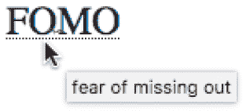

#### HTML

```
<abbr title="fear of missing out">FOMO</abbr>

```

### <cite>

使用`cite`元素标记对创意作品的引用文本，例如书籍、文章、论文、诗歌、博客文章、推文、电影、电视剧、戏剧或艺术品。大多数浏览器将以斜体显示引用文本。

#### 示例

在线：[wdpg.io/16-1-2](http://wdpg.io/16-1-2)

#### 网页

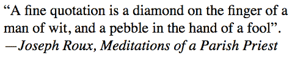

#### HTML

```
<q>A fine quotation is a diamond on the finger of a man of wit, and a pebble in the hand of a fool</q>. —<cite>Joseph Roux, Meditations of a Parish Priest</cite>

```

### <code>

此元素将文本标识为编程代码。大多数浏览器以等宽字体显示标记的文本。

#### 示例

在线：[wdpg.io/16-1-3](http://wdpg.io/16-1-3)

#### 网页

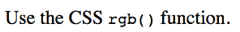

#### HTML

```
Use the CSS <code>rgb()</code> function.

```

### `<dfn>`

您可以使用此元素标记术语的初始或定义实例。大多数浏览器以斜体显示文本。

#### 示例

在线：[wdpg.io/16-1-4](http://wdpg.io/16-1-4)

#### 网页

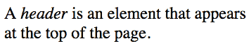

#### HTML

```
A <dfn>header</dfn> is an element that appears at the top of the page.

```

### `<kbd>`

您可以使用 `kbd` 元素来指示通过键盘输入的文本（如键入的字符或按下的键，如 Enter 或 Return）或更一般地，指示任何类型的用户输入（如语音命令）。大多数浏览器以等宽字体显示文本。

#### 示例

在线：[wdpg.io/16-1-5](http://wdpg.io/16-1-5)

#### 网页

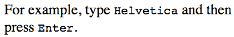

#### HTML

```
For example, type <kbd>Helvetica</kbd> and then press <kbd>Enter</kbd>.

```

### `<mark>`

使用 `mark` 元素突出显示对读者有重要意义的页面文本，类似于您在书中使用荧光笔标记文本段落的方式。大多数浏览器以黄色背景显示文本。

#### 示例

在线：[wdpg.io/16-1-6](http://wdpg.io/16-1-6)

#### 网页

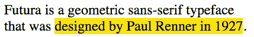

#### HTML

```
Futura is a geometric sans-serif typeface that was <mark>designed by Paul Renner in 1927</mark>.

```

### `<pre>`

`pre` 元素在 HTML5 中没有语义用途，但它经常与其他语义元素一起使用，例如 `code`。显示编程代码和类似文本的一个问题是难以显示结构元素，如缩进，因为网页浏览器会忽略此类空白。然而，当您使用 `pre`（即*预格式化文本*）元素标记代码时，网页浏览器会保留所有空白字符，包括多个空格和换行符。浏览器还会以等宽字体显示文本。

#### 示例

在线：[wdpg.io/16-1-7](http://wdpg.io/16-1-7)

#### 网页

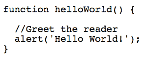

#### HTML

```
<pre><code>
function helloWorld() {
 //Greet the reader
 alert('Hello World!');
}</code></pre>

```

### `<s>`

使用 `s` 元素标记不准确的文本、过时的文本或以其他方式不正确的文本。为什么不删除文本呢？有时，您可能希望保留不准确的文本以供比较，例如显示更正、更新信息或修订价格。网页浏览器通过使用删除线效果来标记此文本。

#### 示例

在线：[wdpg.io/16-1-8](http://wdpg.io/16-1-8)

#### 网页

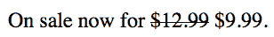

#### HTML

```
On sale now for <s>$12.99</s> $9.99.

```

### `<samp>`

`samp` 元素允许您将一段文本标记为来自计算机程序或类似系统的示例输出。网页浏览器使用等宽字体显示此文本。

#### 示例

在线：[wdpg.io/16-1-9](http://wdpg.io/16-1-9)

#### 网页

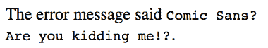

#### HTML

```
The error message said <samp>Comic Sans!? Are you kidding me!?</samp>.

```

### `<small>`

您可以使用`small`元素将文本标记为正文的旁白，尤其是与人们通常所说的细印有关的内容：版权或商标声明、免责声明或披露、法律权利或限制、警告或注意事项，或来源归属。网络浏览器通过使用比正文稍小的字体大小来显示此文本。

#### 示例

在线：[wdpg.io/16-1-10](http://wdpg.io/16-1-10)

#### 网页

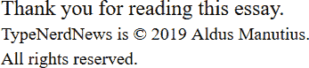

#### HTML

```
Thank you for reading this essay.<br>
<small>TypeNerdNews is &copy; 2019 Aldus Manutius. All rights reserved.</small>

```

### <sub>

`sub`元素将文本标记为下标，这对于需要化学或数学公式的网页很有用。网络浏览器通过使用设置在常规文本基线部分以下的小字体大小来显示此文本。

#### 示例

在线：[wdpg.io/16-1-11](http://wdpg.io/16-1-11)

#### 网页

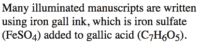

#### HTML

```
Many illuminated manuscripts are written using iron gall ink, which is iron sulfate (FeSO<sub>4</sub>) added to gallic acid (C<sub>7</sub>H<sub>6</sub>O<sub>5</sub>).

```

### <sup>

`sup`元素将文本标记为上标，因此它通常用于数学公式，但许多网络作者也用它来指定脚注标记。网络浏览器通过使用设置在常规文本基线部分以上的小字体大小来显示此文本。

#### 示例

在线：[wdpg.io/16-1-12](http://wdpg.io/16-1-12)

#### 网页

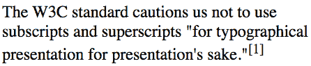

#### HTML

```
The W3C standard cautions us not to use subscripts and superscripts "for typographical presentation for presentation's sake."<sup>[1]</sup>

```

### <time>

您可以使用`time`元素来指示特定的文本片段是日期、时间或两者的组合：

```
<time datetime="*machine-value*">*human text*</time>

```

想法是用两种方式表示日期和/或时间：

+   `<time>`和`</time>`标签之间的文本是以人类友好的方式显示日期或时间，例如 2019 年 8 月 23 日下午 1 点。

+   `datetime`属性的值是日期和/或时间的机器友好版本，例如 2019-08-23T16:00:00-05:00。要使用的通用语法在图 16.1 中显示。

图 16.1 `<time>`标签的`datetime`属性要使用的语法

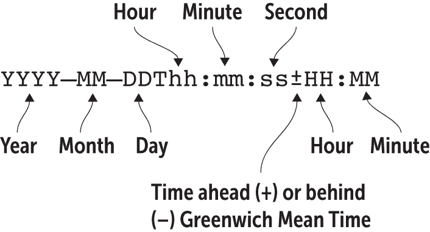

网络浏览器不会以特殊方式格式化日期/时间。相反，您可以使用`time`元素来为浏览器和访问您页面的其他基于软件的访客提供有意义的、可读的日期和/或时间。例如，包含页面创建或最后编辑的日期和时间通常很有用。

您可以使用`time`元素来指示特定的文本片段是日期、时间或两者的组合。

#### 示例

在线：[wdpg.io/16-1-13](http://wdpg.io/16-1-13)

#### 网页

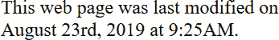

#### HTML

```
This web page was last modified on <time datetime="2019-08-23T09:25:00-05:00">August 23rd, 2019 at 9:25AM</time>.

```

### <u>

我无法辨别`u`元素有任何语义用途。万维网联盟（W3C）标准表示它“代表一个带有未阐述的、但明确呈现的非文本注释的文本范围。”我完全不知道这是什么意思。W3C 不友好地建议可能的使用可能是“将文本标记为拼写错误”，但这似乎很可疑。

`u`元素真正的问题在于，所有网络浏览器都将文本渲染为下划线，这意味着每个访问你页面的人都会认为文本是一个链接，而且很大一部分访问者会尝试点击它（当什么也没有发生时会感到沮丧）。你可能认为下划线有助于强调文本，但这是`<em>`标签的作用。简而言之，你没有使用`<u>`标签的好理由，有很多不使用它的好理由。我之所以在这里提到它，是因为你可能在查看某些（无疑设计得很差的）网页的源代码时遇到它。

#### 示例

在线：[wdpg.io/16-1-14](http://wdpg.io/16-1-14)

#### 网页

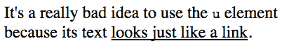

#### HTML

```
It's a really bad idea to use the <code>u</code> element because its text <u>looks just like a link</u>.

```

### `<var>`

`var`元素允许你标记一个单词或短语作为占位符。这个占位符可以是编程变量、函数参数，或者用来表示一类事物的单词或短语。网络浏览器通过使用斜体来显示这个文本。

#### 示例

在线：[wdpg.io/16-1-15](http://wdpg.io/16-1-15)

#### 网页

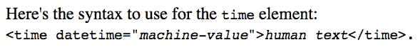

#### HTML

```
Here's the syntax to use for the <code>time</code> element:<br> <code>&lt;time datetime="<var>machine-value</var>"&gt;<var>human  text</var>&lt;/time&gt;.</code>

```

## 更多关于链接的信息

当我在第二章中向你展示如何使用`<a>`标签时，你了解到创建链接只是将链接地址设置为`<a>`标签的`href`属性值这样一个简单的事情。就这个层面来说，这是真的，但`<a>`元素还有更多内容，因为你的网页链接可以是以下三种类型中的任何一种：

+   网站外部的远程链接

+   网站内部其他网页的本地链接

+   当前网页其他部分的页面内链接

你在第二章中学习了远程链接，你将在下一节学习页面内链接。但现在，我要谈谈指向你其他网页的本地链接。

### 链接到本地文件

首先要注意的是，对于本地链接，URL 不需要协议或域名。使用内部链接时，浏览器假定协议是 HTTP（或如果你在网站上使用 HTTP 的安全版本，则是 HTTPS），域名是你的主机服务器的名称。这很简单，但在继续链接课程之前，我想短暂地带你了解在互联网世界中目录是如何工作的。

当你注册一个将托管你的网页的公司时，该公司会在其服务器上为你提供一个自己的目录。如果你只准备几个页面，这个目录应该足够了。然而，如果你正在构建一个更大的网站，你应该考虑如何组织你的文件。为什么？想想你自己的电脑。你不太可能把所有东西都塞在一个目录里。相反，你可能为使用的不同程序有单独的目录，还有其他目录用于你的数据文件。

没有任何理由你不能在你的网站主页上制定一个类似的方案。然而，在这种多目录设置中，如何链接到其他目录中的文件可能会有些棘手。例如，考虑一个有三个目录的网站：

```
/    ① 
articles/    ② 
journal/    ② 

```

①  这是主目录。

②  这些是主目录的子目录。

有三种情况需要注意：

+   *在同一目录中引用文件* — 这种情况是最简单的，因为你不需要包含任何目录信息。假设你正在处理的 HTML 文件位于`journal`目录中，而你想要引用同一目录中名为`rant.html`的页面。在这种情况下，你只需使用文件名，如下所示：

    ```
    <a href="rant.html">

    ```

+   *从主目录引用子目录中的文件* — 这种情况很常见，因为你的主页（几乎肯定位于主目录）可能包含指向子目录中文件的链接。假设你想要链接到你主页`articles`子目录中的`design.html`页面。你的`<a>`标签如下所示：

    ```
    <a href="articles/design.html">

    ```

+   *从不同子目录引用子目录中的文件* — 这种情况是最复杂的。假设你有一个位于`articles`子目录中的页面，你想要链接到`journal`子目录中名为`poem.html`的页面。这是`<a>`标签的示例：

    ```
    <a href="/journal/poem.html">

    ```

在上一个例子中，前面的斜杠（`/`）告诉浏览器首先进入主目录，然后进入`journal`目录以找到`poem.html`文件。

## 第 16.2 课：链接到同一页面

覆盖内容：页面内链接

在线：[wdpg.io/16-2-0](http://wdpg.io/)

当网民点击一个标准链接时，页面会加载，浏览器在窗口中显示页面的顶部部分。然而，你可以设置一种特殊的链接，强制浏览器显示页面的其他部分，例如中间的部分。

你什么时候会使用这样的链接？你的大部分 HTML 页面可能都很短小精悍，访问网页的网民也不会有困难找到他们想要的内容。但对于较长的页面，你可以设置链接到页面的各个部分，这样读者可以直接跳转到某个部分，而不是滚动整个页面。

要创建这种类型的链接，你必须设置一个特殊的标识符，标记你想要链接的位置。要理解页面内链接是如何工作的，想想你如何在阅读一本书时标记一个位置。你可能需要折角页面，贴上便利贴，或者放在两页之间（例如书签）。页面内链接标识符执行相同的功能：它标记网页中的特定位置，你可以使用`a`元素直接链接到该位置。

要设置一个页面内链接的标识符，你需要在标签中添加一个`id`属性并为其提供一个值：

```
<h2 id="best-practices">Best Practices</h2>

```

分配给`id`属性的值必须满足以下标准：

+   它必须在网页中是唯一的。

+   它必须以字母开头。

+   其余字符可以是字母、数字（0–9）、连字符（-）、下划线（_）、冒号（:）或点（.）的任意组合。

你如何设置内页链接取决于它是否位于链接所在的同一页或不同页。如果标识符和链接在同一页上，你可以通过使用前面带有哈希符号 (`#`) 的 `id` 值来链接到它：

```
<a href="#best-practices">Go to the Best Practices section</a>

```

如果标识符定义在单独的网页中，你的链接的 `href` 值是那个页面的 URL，后面跟着一个哈希符号 (`#`) 和 `id` 值：

```
See my <a href="organization.html#best-practices">primer on best practices</a>

```

以下示例展示了页面内链接的实际应用。

#### 示例

在线：[wdpg.io/16-2-1](http://wdpg.io/16-2-1)

此示例展示了一个使用一些页面内链接的页面。

#### 网页

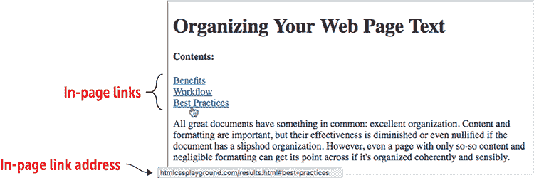

#### HTML

```
<h1>Organizing Your Web Page Text</h1>
<h4>Contents:</h4>
<a href="#benefits">Benefits</a><br>    ① 
<a href="#workflow">Workflow</a><br>    ② 
<a href="#best-practices">Best Practices</a>    ③ 
<p>
All great documents have something in common: excellent organization. Content and formatting are important, but their effectiveness is diminished or even nullified if the document has a slipshod organization. However, even a page with only so-so content and negligible formatting can get its point across if it's organized coherently and sensibly.
<h2 id="benefits">Benefits</h2>    ④ 
There are many reasons to organize your web page text, but three are the most important: narrative flow, accessibility, and search engine optimization.
Narrative Flow</h3>
Research has shown &mdash; and poets and storytellers have known for thousands of years &mdash; that humans have an innate hunger for story. We learn better and take in data more effectively when it's organized as a narrative.
<h3>Accessibility</h3>
Visually impaired visitors to your web page will often use special screen readers to read aloud the page contents. These tools are designed to look for and read web page headings so the user can quickly get an overall sense of the page structure.
<h3>Search Engine Optimization</h3>
Most search engines include page headings as part of their algorithms for determining where a page should rank in the results. In general, text that resides higher up in the page hierarchy is given more importance in the search results.
<h2 id="workflow">Workflow</h2>    ⑤ 
<h2 id="best-practices">Best Practices</h2>    ⑥ 

```

①  收益标题的链接

②  工作流程标题的链接

③  最佳实践标题的链接

④  收益标题的标识符

⑤  工作流程标题的标识符

⑥  最佳实践标题的标识符

播放

设置以下地址的外部链接：[`www.w3.org/TR/html5/text-level-semantics.html`](https://www.w3.org/TR/html5/text-level-semantics.html)。在同一页面上设置指向名为 `the-a-element` 的标识符的内页链接。在线：[wdpg.io/16-2-4](http://wdpg.io/16-2-4)

## 插入特殊字符

你的 HTML 和 CSS 文件仅由文本组成，但这并不意味着它们只包含你可以用键盘输入的字母、数字和其他符号。如果你的网页文本需要破折号（—）、版权符号（©）或带有重音符号的 *e*（é），你可以通过使用称为 *字符实体* 的特殊代码将这些元素添加到你的页面中。这些实体有三种形式：十六进制代码、十进制代码和实体名称。十六进制和十进制代码是数字，而实体名称是更友好的符号，它们描述（尽管通常是隐晦的）你想要显示的字符。例如，你可以通过使用十六进制代码 `&#x02122;`、十进制代码 `&#8482;` 或实体名称 `&trade;` 来显示注册商标符号（™）。

记住

如果你将 `<meta charset="utf-8">` 标签包含在页面头部，你就可以直接在代码中输入诸如破折号（—）和版权符号（©）等字符。例如，在 Windows 上，你可以通过按 Alt+0151 来输入破折号，在 macOS 上，可以通过按 Option+Shift+-（连字符）来输入。

注意，所有三个引用都以一个 ampersand (`&`) 开头，以一个分号 (`;`) 结尾。在使用字符实体时，不要忘记这两个符号。图 16.2 展示了一些常见的字符实体。

图 16.2 一些 HTML5 字符实体及其代码

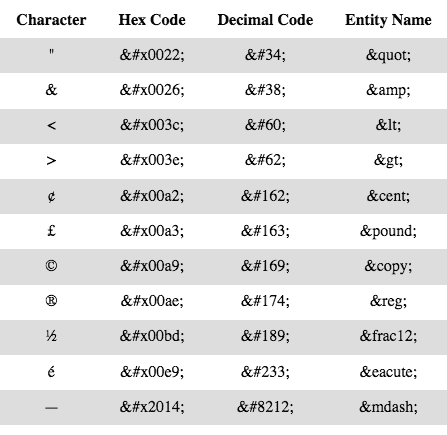

## 使用 HTML5 实体浏览器

HTML5 定义了近 1,500 个字符实体，因此使用字符实体时遇到的最大挫折之一是知道哪些字符可用以及找到所需的字符。我自己也多次经历过这种挫折，因此我决定做些什么。为此，我构建了 HTML5 实体浏览器，它按类别组织字符实体（因此您可以轻松地看到可用内容），并提供搜索功能（因此您可以快速找到任何字符）。以下是它的工作原理：

1.  在[Web 设计游乐场](https://webdesignplayground.io)中，选择菜单>HTML5 实体浏览器。

1.  使用类别列表选择您要查找的实体类型。

    应用程序会过滤实体列表，只显示您选择的类别中的实体，如图图 16.3 所示。

    图 16.3 使用 HTML5 实体浏览器，选择一个类别以过滤实体列表，如图所示，或搜索实体。

    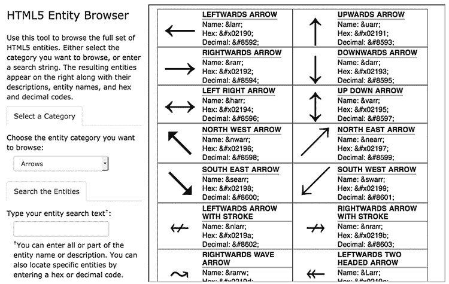

1.  要搜索实体列表，请使用“搜索实体”文本框输入实体名称或描述的全部或部分。

    如果您想查看特定的实体，您可以输入该实体的十六进制或十进制代码。

## 添加注释

*注释*是一段文本，尽管它位于您的 HTML 文件中，但会被网页浏览器跳过，因此在页面渲染时不会显示。这种行为可能让您觉得奇怪，但注释有很多很好的用途：

+   您可以在页面代码的特定位置添加注释，例如添加注释`Here’s where the logo goes when it’s finished`。

+   您可以添加描述页面部分的解释性文本。如果您有一个包含页面标题的章节，您可以在章节前添加注释，例如`This is the start of the header`。

+   您可以跳过页面中问题部分。如果您有一个工作不正常或尚未设置的链接的章节，您可以将文本和标签转换为注释，以免对浏览器或用户造成问题。

+   您可以为查看您的 HTML 源代码的人添加版权声明或其他信息。

将任何文本转换为注释，只需将其包围在 HTML 注释标签中。具体来说，您需要在注释前加上`<!--`，并在其后加上`-->`，如下所示：

```
<!--This text is a comment-->

```

小心

虽然注释文本在浏览器中不显示，但通过查看页面源代码，其他人很容易看到它。因此，不要在注释标签内放置敏感信息。

## 摘要

+   如果您要链接到同一目录中的本地文件，请将`<a>`标签的`href`属性设置为文件名；否则，您需要将目录名放在文件名之前。

+   要创建页面内链接，请将`id`属性添加到链接位置；然后设置`<a>`标签的`href`属性为`id`值，前面加上一个井号（`#`）。

+   要指定一个特殊字符，如果可能的话，直接输入该字符，或者使用十进制代码、十六进制代码或实体名称，每个都以一个和号（`&`）开头，以一个分号（`;`）结尾。

+   要在代码中添加注释，将注释文本用`<!--`和`-->`包围。
