# 第十七章  为你的网页设计添加色彩

> 在黑白世界中大胆地成为一抹亮色。*——凯特·史密斯*

**本章涵盖**

+   学习一些颜色基础知识

+   理解 CSS 如何使用颜色

+   将颜色应用于元素

+   添加背景颜色

+   创建颜色渐变

CSS 提供了你添加颜色到标题、文本、链接和背景所需的所有工具。你将在本章中学习如何使用这些工具，以及如何使用一些特殊的 CSS 工具来构建颜色渐变，这将提高你页面的“哇”效果。

## 理解颜色

关于在网页设计中理解颜色的好消息是，你不需要了解太多。是的，关于色彩理论已经写出了整本书，但你不需要精通光学物理就能创建出美丽、引人注目的网页。你需要知道的是两件事：如何和谐地搭配颜色以及颜色是如何产生的。对于前者，请参阅本章后面的“选择和谐的色彩”；对于后者，请继续阅读。

> 在网络上，颜色是免费的。虽然白色背景上的黑色文字没有问题，但使用不同的颜色不仅能为页面增添一些戏剧性，还能为内容创建层次。*——埃里克·斯皮克曼*

你可以使用两种方法来创建任何颜色。第一种方法利用了这样一个事实：你可以通过混合三种主要颜色（红色、绿色和蓝色）来创建光谱中的任何颜色，因此这种方法有时被称为*RGB 方法*。画家在调色板上进行这种混合，但你在数字领域，所以你使用数值来混合颜色，为每种颜色提供一个介于 0 到 255（或介于 0 到 100 的百分比）之间的数字。数字越低，颜色越不鲜艳，数字越高，颜色越鲜艳。

精通

对于三种颜色中的每一种，都有 256 个可用的值，你可以在超过 1600 万种颜色中进行选择。

表 17.1 列出了九种常见颜色及其相应的红、绿、蓝值。

表 17.1 九种常见颜色的红、绿、蓝值

| **名称** | **红色** | **绿色** | **蓝色** | **颜色** |
| --- | --- | --- | --- | --- |
| 红色 | 255 | 0 | 0 |  |
| 绿色 | 0 | 255 | 0 |  |
| 蓝色 | 0 | 0 | 255 |  |
| 黄色 | 255 | 255 | 0 |  |
| 青色 | 255 | 0 | 255 |  |
| 青色 | 0 | 255 | 255 |  |
| 黑色 | 0 | 0 | 0 |  |
| 灰色 | 128 | 128 | 128 |  |
| 白色 | 255 | 255 | 255 |  |

精通

当红色、绿色和蓝色值相等时，你会得到一个灰度颜色。数值越低产生越深的灰色，数值越高产生越浅的灰色。

如表 17.1 所示，当只指定一种颜色（即，值大于 0）时，你得到的是纯色，但当指定两种或更多值时，你得到的是这些颜色的混合。为了帮助您可视化这个混合过程，我在 Web Design Playground 上制作了一个简短的动画。选择菜单> RGB 可视化器（或直接访问[wdpg.io/rgbvis](http://wdpg.io/rgbvis)），您将看到三个圆圈——一个红色，一个绿色和一个蓝色——慢慢靠近彼此，然后重叠。当重叠发生时，如图 17.1 所示，请注意以下四点：

+   红色和蓝色的重叠产生洋红色。

+   红色和绿色的重叠产生黄色。

+   绿色和蓝色的重叠产生青色。

+   三种颜色的重叠产生白色。

图 17.1 在 Web Design Playground 上，选择菜单> RGB 可视化器，可以看到三个圆圈聚集在一起，重叠产生这里显示的混合颜色。

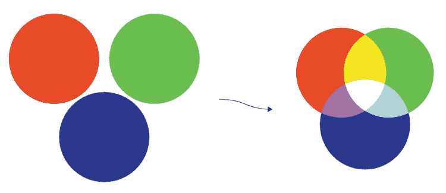

创建颜色的第二种方法涉及为三个称为色调、饱和度和亮度的属性提供数值，因此这种技术有时被称为*HSL 方法*：

+   *色调*——这个值（大致等同于术语*颜色*）衡量的是色轮上的位置（以度为单位），在 0 到 359 之间，如图 17.2 所示。较低的数字表示接近红色端的位置（红色等于 0 度），而较高的数字则穿过光谱的黄色、绿色、蓝色和紫色部分。

图 17.2 色调指的是在色轮上的位置，从 0（红色）开始，经过 120（绿色）和 240（蓝色）。

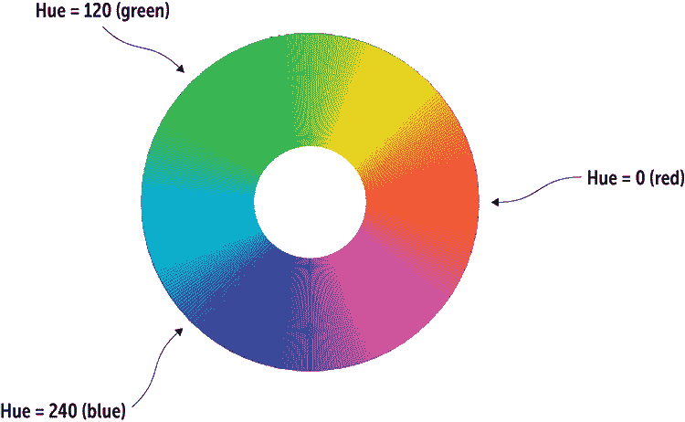

+   *饱和度*——这个值是一个百分比，并衡量给定色调的纯度。饱和度为 100 表示色调是纯色。如图 17.3 所示，较低的数字表示与色调混合的灰色更多；在 0%时，颜色成为灰度的一部分。

图 17.3 饱和度是衡量颜色纯度或灰色混合多少的度量。图 17.2 中的色轮设置为 100%饱和度。饱和度百分比越低，颜色看起来越灰。

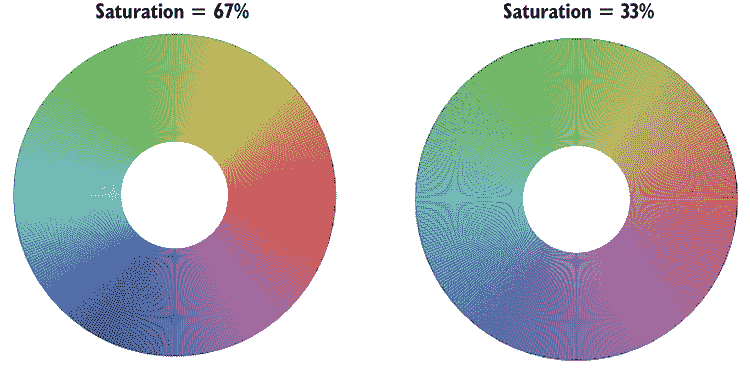

+   *亮度*——这个值（也称为*亮度*或*光亮度*）也是一个百分比，并衡量颜色的明暗程度。如图 17.4 所示，较低的百分比颜色较暗（0 产生黑色），而较高的百分比颜色较浅（100 产生白色）。

图 17.4 亮度衡量颜色的亮度。图 17.3 中的色轮设置为 50%亮度。较高的百分比产生较浅的颜色，而较低的百分比产生较深的颜色。


应该使用哪种方法？答案取决于各种因素。如果你想指定单一颜色，RGB 方法更为直接，但如果你想选择和谐的色彩——例如互补色或类似色——HSL 方法则更为合适。在你做出决定之前，你需要了解你在 CSS 中应用颜色的具体细节。

## 使用 CSS 添加颜色

在样式表世界以及网页设计中，颜色的重要性不仅体现在 CSS 提供了至少六种定义看似简单的颜色值的方法。每种方法都有其用途，所以你将在接下来的几节中学习它们。

## 第 17.1 课：使用 rgb() 函数指定红色、绿色和蓝色

涵盖：`rgb()` 函数

在线：[wdpg.io/17-1-0](http://wdpg.io/17-1-0)

之前，你了解到你可以通过指定颜色红色、绿色和蓝色成分的值在 0 到 255 之间来定义超过 1600 万种颜色中的任何一种。在 CSS 中实现这一点的其中一种方法就是使用 `rgb()` 函数，如图 17.5 所示。

图 17.5 要指定颜色的红色、绿色和蓝色成分，可以使用 `rgb()` 函数。

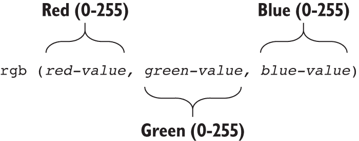

要使用此函数，将 `*red-value*` 替换为 0 到 255 之间的数字以指定红色成分；将 `*green-value*` 替换为 0 到 255 之间的数字以指定绿色成分；将 `*blue-value*` 替换为 0 到 255 之间的数字以指定蓝色成分。例如，你可以通过使用 128 作为红色，0 作为绿色，128 作为蓝色来生成紫色。以下示例展示了如何使用 CSS 将紫色文本显示在所有的 `h1` 标题上。

#### 示例

在线：[wdpg.io/17-1-1](http://wdpg.io/17-1-1)

此示例使用 `rgb()` 函数将紫色分配给 `h1` 元素。

#### 网页

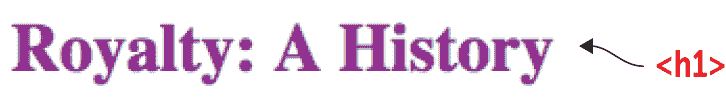

#### CSS

```
h1 {    ① 
 color: rgb(128, 0, 128);    ② 
}

```

①  指定 h1 元素进行样式化。

②  使用 rgb() 函数设置颜色属性值。

#### HTML

```
<h1>Royalty: A History</h1>

```

Play

你会如何使用 `rgb()` 函数将红色应用到元素上？在线：[wdpg.io/17-1-2](http://wdpg.io/17-1-2)

你也可以使用百分比来指定 `rgb()` 函数的 `*red-value*`、`*green-value*` 和 `*blue-value*` 参数，其中 `100%` 表示颜色的完全强度（相当于十进制中的 255 值），而 `0%` 表示颜色的最低强度（在十进制表示法中相当于 0）。表 17.2 是 表 17.1 的重复，其中十进制值被它们的百分比等价值所替换。

表 17.2 九种常见颜色的红色、绿色和蓝色百分比

| **名称** | **红色** | **绿色** | **蓝色** | **颜色** |
| --- | --- | --- | --- | --- |
| 红色 | 100% | 0 | 0 |  |
| 绿色 | 0 | 100% | 0 |  |
| 蓝色 | 0 | 0 | 100% |  |
| 黄色 | 100% | 100% | 0 |  |
| 品红色 | 100% | 0 | 100% |  |
| 青色 | 0 | 100% | 100% |  |
| 黑色 | 0 | 0 | 0 |  |
| 灰色 | 50% | 50% | 50% |  |
| 白色 | 100% | 100% | 100% |  |

播放

你会如何使用 `rgb()` 函数将浅灰色应用到元素上？在线：[wdpg.io/17-1-3](http://wdpg.io/17-1-3)

这里是紫色 `color` 定义转换为百分比的示例：

```
color: rgb(50%, 0, 50%)

```

## 第 17.2 节：使用 hsl() 函数指定色调、饱和度和亮度

覆盖内容：`hsl()` 函数

在线：[wdpg.io/17-2-0](http://wdpg.io/17-2-0)

如果你心中有一个特定的色调，你可能更喜欢通过指定颜色的色调、饱和度和亮度成分来定义你的 CSS 颜色。要在 CSS 中这样做，请使用 `hsl()` 函数，如图 图 17.6 所示。

图 17.6 要指定颜色的色调、饱和度和亮度成分，请使用 `hsl()` 函数。

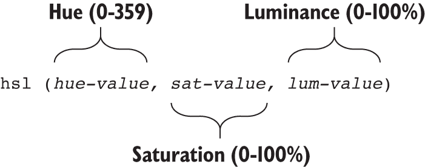

要使用此函数，将 `*hue-value*` 替换为介于 0 和 359 之间的数字以指定色调成分；将 `*sat-value*` 替换为介于 0 和 100 之间的百分比以指定饱和度成分；将 `*lum-value*` 替换为介于 0 和 100 之间的百分比以指定亮度成分。以紫色 `h1` 文本示例为例，以下展示了如何使用 CSS 通过 `hsl()` 函数显示所有 `h1` 标题的紫色文本。

#### 示例

在线：[wdpg.io/17-2-1](http://wdpg.io/17-2-1)

此示例使用 `hsl()` 函数将紫色分配给 `h1` 元素。

#### 网页


#### CSS

```
h1 {    ① 
 color: hsl(300, 100%, 25%);    ② 
}

```

① 指定要样式的 `h1` 元素。

② 使用 `hsl()` 函数设置 `color` 属性值。

#### HTML

```
<h1>Royalty: A History</h1>

```

播放

你会如何使用 `hsl()` 函数将蓝色应用到元素上？在线：[wdpg.io/17-2-2](http://wdpg.io/17-2-2)

播放

你会如何使用 `hsl()` 函数将白色应用到元素上？在线：[wdpg.io/17-2-3](http://wdpg.io/17-2-3)

### 关于透明度的一个快速说明

在大多数情况下，你希望网页上的文本看起来是实心的且易于阅读。然而，有时为了增加页面的视觉吸引力，你会故意牺牲一点可读性，使文本略微透明。这意味着文本后面的任何内容——无论是纯色、图像还是其他文本——都会显示出来。

你可以通过使用 rgb() 和 `hsl()` 函数的变体来控制文本的不透明度（也称为 *透明度*）：`rgba()` 和 `hsla()`。

你可以使用这些函数，就像 `rgb()` 和 `hsl()` 一样，不同之处在于你还指定了一个名为 *alpha 通道* 的第四个参数。*alpha 通道* 是一个介于 0.0 和 1.0 之间的数值，其中 1.0 表示文本完全不透明，而 0.0 表示文本完全透明。

### 简要介绍十六进制数

接下来我要告诉您的下一个 CSS 颜色工具使用的是十六进制数，它使用的是 16 进制而不是常规十进制数使用的 10 进制。如果您了解十六进制数，请随意跳过本节；否则，在继续学习 CSS 颜色之前，您需要短暂但必要的进入十六进制领域。

十六进制值是高效的，因为它们使用单个字符符号来表示从 0 到 15 的所有值。具体来说，它们使用 0 到 9 来表示前十个值，就像在十进制中一样，但它们使用字母 A 到 F 来表示 10 到 15 的数量。图 17.7 展示了 0 到 15 的数量在十进制和十六进制中的等效值。

图 17.7 十六进制使用 0 到 9 与十进制相同，但它使用字母 A 到 F 来表示 10 到 15 的数量。

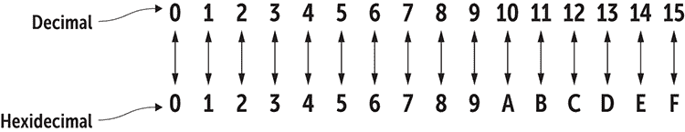

对于两位数，十进制数有两个部分：左边的十位和右边的个位。数字 10 可以读作“一个十和零个一”，而 36 可以读作“三个十和六个一”。两位十六进制数也有两个部分：左边的十六位和右边的个位。十六进制数 10 可以读作“一个十六和零个一”（使其等同于十进制的 16），而 5C 十六进制可以读作“五个十六和 C（十二）个一”，使其等同于十进制的 92。图 17.8 展示了一些示例。

图 17.8 就像两位十进制数由左边的十位和右边的个位组成一样，两位十六进制数由左边的十六位和右边的个位组成。

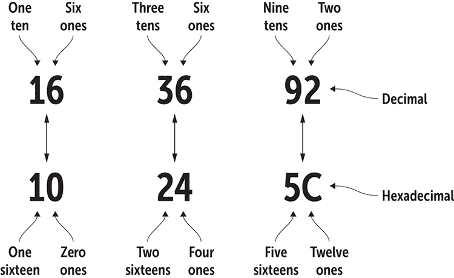

## 第 17.3 节：使用 RGB 十六进制代码

涵盖：RGB 十六进制代码

在线：[wdpg.io/17-3-0](http://wdpg.io/17-3-0)

而不是使用 rgb() 函数来指定颜色的红色、绿色和蓝色成分，您可以使用 CSS 基于十六进制的方 法，如 图 17.9 所示。

图 17.9 您可以使用代码 `#rrggbb` 来指定颜色，其中 `rr` 是红色成分的十六进制值，`gg` 是绿色成分的十六进制值，而 `bb` 是蓝色成分的十六进制值。

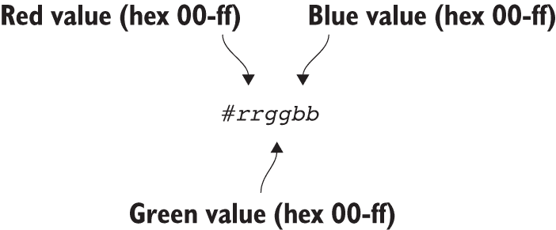

这些 RGB 十六进制代码始终以井号符号 (`#`) 开头，后跟红色成分的两个十六进制值，绿色成分的两个十六进制值，以及蓝色成分的两个十六进制值。在每种情况下，允许的十六进制值范围从 `00` 到 `ff`。因为这些代码由三个十六进制值组成，所以它们通常被称为 *十六进制三元组*。表 17.3 列出了用于之前在表 17.1 和 17.2 中显示的九种常见颜色的 RGB 十六进制代码。

表 17.3 九种常见颜色的 RGB 十六进制代码

| **名称** | **红色** | **颜色** |
| --- | --- | --- |
| 红色 | `#ff000` |  |
| 绿色 | `#00ff00` |  |
| 蓝色 | `#0000ff` |  |
| 黄色 | `#ffff00` |  |
| 品红色 | `#ff00ff` |  |
| 青色 | `#00ffff` |  |
| 黑色 | `#000000` |  |
| 灰色 | `#808080` |  |
| 白色 | `#ffffff` |  |

以下示例显示了如何使用此方法将紫色应用于 `h1` 文本。十进制 128 的十六进制等效值是 80，因此对于 `color` 值，红色部分是十六进制的 80，绿色部分是十六进制的 00，蓝色部分是十六进制的 80。

#### 示例

在线：[wdpg.io/17-3-1](http://wdpg.io/17-3-1)

此示例使用 `#rrggbb` 将紫色分配给 `h1` 元素。

#### 网页


#### CSS

```
h1 {    ① 
 color: #800080;    ② 
}

```

①  指定要样式的 `h1` 元素。

②  使用 `#rrggbb` 设置 `color` 属性值。

#### HTML

```
<h1>Royalty: A History</h1>

```

播放

您会使用什么 RGB 代码将蓝色应用于一个元素？在线：[wdpg.io/17-3-2](http://wdpg.io/17-3-2)

播放

您会使用什么 RGB 代码将最浅的灰色应用于一个元素？在线：[wdpg.io/17-3-3](http://wdpg.io/17-3-3)

在某些情况下，您可以使用更短的代码。如果 `rr`、`gg` 和 `bb` 的每个值都使用重复字符——例如 00、66 或 ff——则可以为每种颜色使用重复字符之一。以下两个代码是等效的：

```
#3366cc
#36c

```

### 使用颜色选择器

处理 RGB 代码、HSL 值和十六进制值对计算机来说可能很方便，但对于人类来说，这些数字与特定颜色之间的联系并不直观。颜色关键字更易于理解，但它们代表的颜色种类太少。为了使您更容易查看并最终选择在网页上使用的颜色，网页设计沙盒提供了一个名为颜色选择器的工具。此工具提供了一个颜色调色板控件，允许您选择预设颜色或任何色调、饱和度、亮度和透明度的组合。该工具不仅显示结果颜色，还显示 `rgb()` 函数（十进制和百分比）、`hsl()` 函数、RGB 十六进制三元组、颜色关键字（如果适用），以及设置了透明度时的 `rgba()` 和 `hsla()` 函数。

下面是如何使用颜色选择器工具：

1.  在网页设计沙盒中，选择菜单 > 颜色选择器（或直接访问 [wdpg.io/colorchooser](http://wdpg.io/colorchooser)）。

1.  点击颜色控件以显示调色板，如图 图 17.10 所示。

1.  要选择预设颜色，请点击控件左侧的任一色块。

1.  要指定颜色，请使用文本框输入 `rgb()` 函数、`hsl()` 函数、RGB 十六进制三元组、颜色关键字、`rgba()` 函数或 `hsla()` 函数。

1.  在大色块中，水平拖动设置饱和度，或垂直拖动设置亮度。

1.  使用垂直框设置色调，使用水平框设置透明度。

1.  完成后，点击关闭。

学习

要了解如何使用透明度修改颜色，请参阅沙盒中的“修改透明度”课程。在线：[wdpg.io/17-7-0](http://wdpg.io/17-7-0)

图 17.10 使用 Web 设计游乐场的颜色选择器工具选择颜色并查看其各种 CSS 代码。

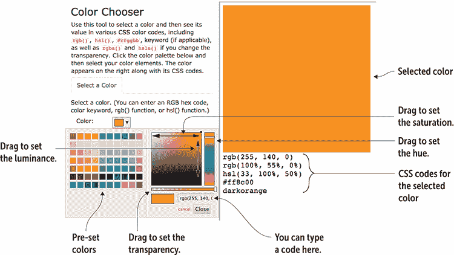

## 选择和谐的色彩

现在你已经知道了如何将颜色应用到你的页面元素上，但这只是战斗的一半。搭配不当或应用不当的颜色可能会使页面看起来更糟，而不是更好。本节将探讨在页面设计中有效使用颜色的一些基本要点。

首先，由于有如此多的颜色可供选择，人们往往会过度使用，每个页面使用十多种色调。然而，使用过多的颜色可能会让用户感到困惑，甚至导致视觉疲劳。尽量坚持使用最多两种或三种颜色。如果你必须使用更多，尝试使用两种或三种色调的不同色调。

在选择颜色时，考虑一下你的配色方案对你的用户的心理影响。研究表明，“冷色”如蓝色和灰色会唤起可靠性和信任感。使用这些颜色来营造商务外观。对于需要更多活力的页面，可以使用红色、黄色和橙色等“暖色”，以营造节日和愉快的氛围。为了营造安全和舒适的环境，尝试使用棕色和黄色。为了增添环保的感觉，使用绿色和棕色。

最后，你需要思考一下你的颜色是如何相互搭配的。有些颜色天生相冲，当它们一起使用时，会使你的页面看起来很糟糕。幸运的是，每种色调都有一到两种与之搭配得很好的颜色，从而产生令人愉悦的和谐设计，让你的访客眼睛感到舒适。请注意，和谐并不意味着无聊！根据你选择的颜色，结果可以是任何从舒缓到鲜艳的，所以你选择的配色方案反映了你希望你的网站传达的信息。

幸运的是，你不必猜测哪些颜色会起作用。你可以使用以下列表中描述的技巧：

+   *选择互补色。*互补色在色轮上彼此相对。在`hsl()`函数中，互补色是指色调值相差 180 度的颜色。红色——`hsl(0, 100%, 50%)`——是青色的补色——`hsl(180, 100%, 50%)`。一般来说，在任何互补色方案中，通常最好将一种颜色用作页面的主色调，另一种颜色用作强调色，尤其是对于你希望用户注意的元素，如订阅或购买按钮以及类似的号召性用语对象。请参阅本章后面的“配色方案画廊”，以查看使用互补色的示例网页。

+   *选择类似色。类似色*位于色轮上的相邻位置。在`hsl()`函数中，类似色是指与主色相差±30 度的色调值。红色—`hsl(0, 100%, 50%)`—与`hsl(30, 100%, 50%)`和`hsl(330, 100%, 50%)`类似。如果你更喜欢更少的对比度（你想要颜色更接近），你可以通过使用相差 15 度的颜色来创建类似色方案。如果你选择对比度更高的方案，通常最好选择一种颜色作为页面主色调，并使用其他两种颜色用于按钮、边框和其他强调。

+   *选择三色相颜色。三色相颜色*是位于色轮上等距离的三种颜色。在`hsl()`函数中，三色相颜色是指色调值相差 120 度的颜色。红色—`hsl(0, 100%, 50%)`—与`hsl(120, 100%, 50%)`和`hsl(240, 100%, 50%)`三色相。三色相颜色通常具有相似的水平活力，因此它们感觉平衡和谐。许多使用三色相方案的网站会选择一种颜色作为页面背景，另一种颜色用于页面内容和导航，第三种颜色用于边框和其他强调。

+   *选择分割互补色。分割互补色*方案类似于互补色方案，不同之处在于，你不在色轮上使用相对的色调，而是使用位于相对色调两侧 30 度的两种颜色。红色—`hsl(0, 100%, 50%)`—与`hsl(150, 100%, 50%)`和`hsl(210, 100%, 50%)`分割互补。实施分割互补色方案的一个好规则是使用原始颜色作为页面的主色调，并使用其他两种颜色用于内容、导航和强调。

## 使用颜色方案计算器

如果你知道你想要用作页面主色调的颜色，计算其余的颜色方案就很简单：

+   *互补色* —增加或减去 180 度。

+   *类似色* —为一种颜色增加 30 度，为另一种颜色减去 30 度。

+   *三色相* —为一种颜色增加 120 度，为另一种颜色减去 120 度。

+   *分割互补色* —将色调增加 180 度；然后为一种颜色减去 30 度，为另一种颜色增加 30 度。

如果你只知道 RGB 代码，数学计算可能会相当令人畏惧。不用担心：我在网页设计游乐场中放置了一个颜色方案计算器。以下是使用方法：

1.  选择菜单 > 颜色方案计算器（或导航到[wdpg.io/colorcalc](http://wdpg.io/colorcalc)）。

1.  在“颜色方案类型”选项卡上，选择你想要的颜色方案类型：互补色、类似色、三色相或分割互补色。

    此外，还有一个单色方案，它生成五种具有相同色调，但饱和度和亮度值不同的颜色。

1.  使用颜色选择器选择你的初始颜色。

    你可以点击你想要的颜色，或者使用文本框输入 RGB 十六进制三元组或 `rgb()` 函数。（你也可以输入颜色关键字或 `hsl()` 函数。）计算器显示颜色方案，并显示每种颜色的 RGB 代码、`rgb()` 函数和 `hsl()` 函数，如图 17.11 所示。

    图 17.11 使用 Web 设计游乐场的颜色方案计算器为给定的 RGB 代码生成颜色方案。

    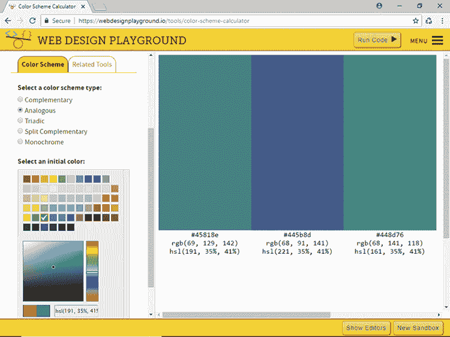

## 颜色方案画廊

该网页使用两种互补颜色来处理大部分的颜色负载，证明你不需要 dozen 种颜色就能创建一个引人注目的设计([`www.upstruct.com/work/amandus-film-festival-2015`](http://www.upstruct.com/work/amandus-film-festival-2015))。

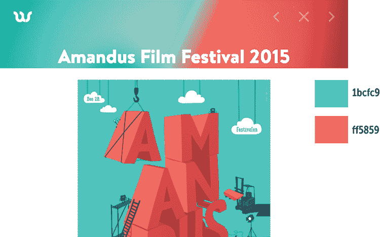

该网站使用类似方案创建了一个五彩斑斓、引人入胜的着陆页([`toriseye.quodis.com`](http://toriseye.quodis.com)).

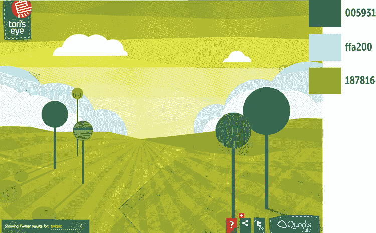

该网站使用其三色色相方案来设置背景和文本([`crayola.com`](http://crayola.))。

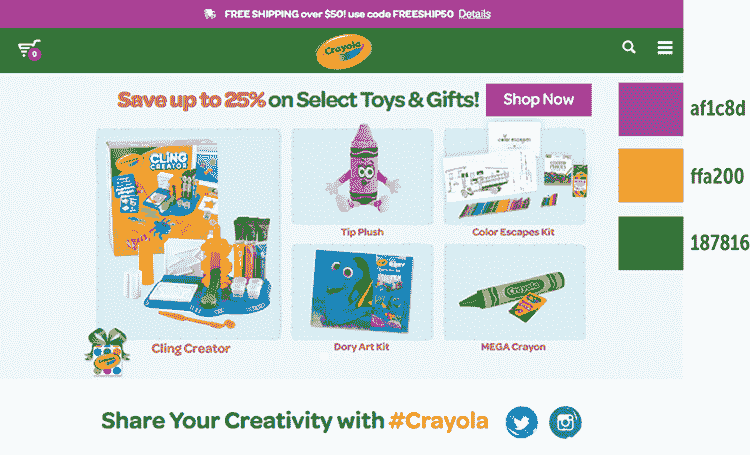

一个使用分割互补色相方案（其中最暗的颜色提供背景，最亮颜色提供引人注目的强调色）的网站示例([`udoncampus.com`](http://udoncampus.com))。

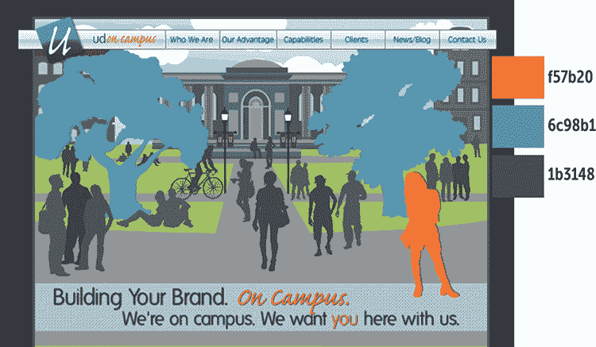

## 应用颜色渐变

到目前为止，你使用的所有颜色都是单一色调——有时是浅色、深色或更透明，确实如此，但仍然是单一色调。然而，通过使用渐变的概念，可以给单个页面元素使用多种颜色。渐变是两种或更多颜色的组合，其中一种颜色逐渐（有时很快）过渡到下一种颜色。当适度使用时，渐变可以成为为网页添加视觉兴趣和活力的有效方式。

在开始编写 CSS 之前，你需要了解一些事情：

+   渐变是网络浏览器自动创建的图像。

+   渐变只能作为背景应用，尽管广泛范围的元素支持背景图像。

+   你可以使用两种类型的渐变：一种 *线性渐变* 沿着直线从一种颜色过渡到另一种颜色；一种 *径向渐变* 从一个点向外以椭圆或圆形的形状过渡到另一种颜色。

在接下来的几节课中，你将学习线性渐变和径向渐变的 CSS。

## 第 17.4 节：创建线性渐变

覆盖内容：`linear-gradient` 函数

在线：[wdpg.io/17-4-0](http://wdpg.io/17-4-0)

要指定线性渐变，你需要将 `linear-gradient()` 函数应用于你正在样式的元素的 `background-image` 属性。图 17.12 展示了要使用的通用语法。

图 17.12 要定义线性渐变，使用 `linear-gradient()` 函数指定角度和颜色停止点。

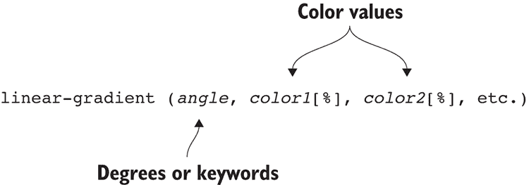

`*angle*`值可以是 0 到 359 之间的数字，后跟`deg`单位，或者后跟表示水平方向（`left`或`right`）、垂直方向（`top`或`bottom`）或对角方向（`top left`、`top right`、`bottom left`或`bottom right`）的关键字`to`。颜色值（`*color1*`、`*color2*`等）可以是本章前面学到的任何颜色值。百分比指定了*颜色停止点*，即前一种颜色结束和下一种颜色开始的位置。第一个默认颜色停止点是`0%`（即从开始处开始），最后一个默认颜色停止点是`100%`（即到结束处），因此您不需要输入这些值。

以下示例显示了一个使用线性渐变样式的空`div`元素。

#### 示例

在线：[wdpg.io/17-4-1](http://wdpg.io/17-4-1)

此示例显示了一个使用从黄色到蓝色过渡的线性渐变样式的`div`元素。

#### 网页

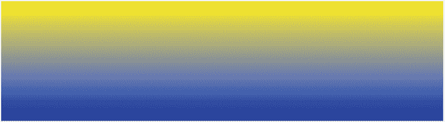

#### CSS

```
div {
 background-color: blue;    ① 
 background-image: linear-gradient(to bottom, yellow, blue);    ② 
 height: 175px;    ③ 
 width: 100%;    ③ 
}

```

①  为不支持渐变的（罕见）浏览器提供的备用样式

②  从顶部到底部运行的线性渐变，颜色从黄色过渡到蓝色

③  应用于 div 元素的多种样式

#### HTML

```
<div></div>    ④ 

```

④  div 元素

游戏

创建一个从左上角到右下角运行的线性渐变。使用`#76a5af`作为起始颜色，`#073763`作为结束颜色。在线：[wdpg.io/17-4-2](http://wdpg.io/17-4-2)

游戏

创建一个以 60 度角运行的线性渐变。对于第一种颜色，使用色调 191，全饱和度和半亮度；对于第二种颜色，保持相同的色调，但使用四分之一饱和度和 15%亮度。在线：[wdpg.io/17-4-3](http://wdpg.io/17-4-3)

在示例中注意，我首先设置了背景颜色，然后应用了渐变。添加`background-color`声明是针对不支持渐变的浏览器的备用方案——主要是 Internet Explorer 9 及更早版本。这些浏览器会渲染背景颜色，但会忽略渐变样式。幸运的是，所有现代浏览器都支持渐变，因此只有越来越少的旧版 Internet Explorer 需要这种备用方案。

游戏

确定与颜色`#674ea7`相匹配的类似色方案中的两种颜色。创建一个使用这三种颜色并从右下角到左上角运行的线性渐变。在线：[wdpg.io/17-4-8](http://wdpg.io/17-4-8)

如果您在渐变中使用三种或更多颜色，您需要考虑每种颜色想要停止的位置以及下一种颜色开始的位置。如果您没有指定任何停止位置，浏览器会为您完成这项工作，并假设过渡发生在两侧颜色之间的中间位置。如果您指定了三种颜色，中间颜色的过渡位置是在 50%，位于第一种（0%）和第三种（100%）颜色之间。以下示例显示了一个其中第二种颜色开始得稍早的线性渐变。

#### 示例

在线：[wdpg.io/17-4-5](http://wdpg.io/17-4-5)

本例展示了使用三种颜色线性渐变进行样式的`div`元素，其中中间颜色（白色）的过渡比正常情况开始得早（在 25%标记处）。

#### 网页

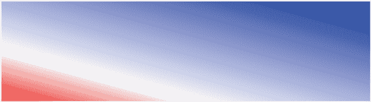

#### CSS

```
div {
 background-color: blue;    ① 
 background-image: linear-gradient(to top right, red, white 25%, blue);    ② 
 height: 175px;    ③ 
 width: 100%;    ③ 
}

```

①  不支持渐变的（罕见）浏览器的后备样式

②  从左下角到右上角运行，在 25%处从红色过渡到白色，然后过渡到蓝色

③  应用于 div 元素的多种样式

#### HTML

```
<div></div>    ④ 

```

④  div 元素

## 第 17.5 课：创建径向渐变

涵盖：`radial-gradient`函数

在线：[wdpg.io/17-5-0](http://wdpg.io/17-5-0)

要指定径向渐变，你需要在元素的`background-image`属性上应用`radial-gradient()`函数。图 17.13 显示了通用语法。

播放

创建一个从左到右运行的五色线性渐变。五种颜色（及其停止点）是`#ffff00`（0%）；`#05c1ff`（20%）；`#274e13`（50%）；`#05c1ff`（80%）；`#ffff00`（100%）。在线：[wdpg.io/17-4-6](http://wdpg.io/17-4-6)

播放

使用线性渐变和 CSS 的`background-size`属性制作吸引人的重复背景图案。在线：[wdpg.io/17-4-7](http://wdpg.io/17-4-7)

图 17.13 使用`radial-gradient()`函数定义径向渐变，指定形状、范围和颜色停止点

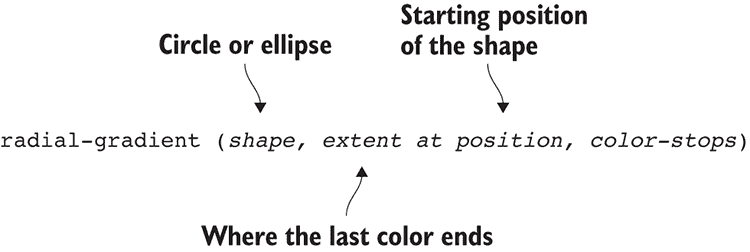

`*shape*`的值可以是`circle`（默认值，因此可以省略）或`ellipse`。`*extent*`的值是一个关键字对，告诉浏览器你希望最后一种颜色停止在元素的哪一侧或角上。可能的值有`closest-side`、`farthest-side`、`closest-corner`和`farthest-corner`。`*position*`的值指定形状的起始点；它可以是 x-y 点的集合（例如，`45px 100px`）或一个关键字对，它将水平位置（`left`、`center`或`right`）与垂直位置（`top`、`center`或`bottom`）结合起来。颜色值和停止点与线性渐变相同。

`*extent*`的默认值是`farthest-corner`，而`*position*`的默认值是`center center`（可以简写为`center`）。最简单的径向渐变规则是`radial-gradient` (`*color1*`, `*color2*`)，它创建一个居中的圆形渐变，从`*color1*`过渡到`*color2*`，直到元素的远角。

以下示例展示了使用径向渐变进行样式的空`div`元素。

#### 示例

在线：[wdpg.io/17-5-1](http://wdpg.io/17-5-1)

本例展示了使用径向渐变从黄色过渡到蓝色进行样式的`<div>`标签。

#### 网页


#### CSS

```
div {
 background-color: yellow;    ① 
 background-image: radial-gradient(ellipse farthest-corner at left top, yellow, blue);    ② 
 height: 200px;    ③ 
 width: 100%;    ③ 
}

```

①  不支持渐变的（罕见）浏览器的后备样式

②  从左上角到右下角运行，从黄色过渡到蓝色的径向渐变

③  应用于 div 元素的多种样式

#### HTML

```
<div></div>    ④ 

```

④  div 元素

## 第 17.6 课：渐变与旧浏览器

包括：添加渐变回退颜色

在线：[wdpg.io/17-6-0](http://wdpg.io/17-6-0)

`linear-gradient` 和 `radial-gradient` 属性在所有现代浏览器中都受支持，但并非所有人都在使用现代浏览器。好消息是，所有主流浏览器已经完全支持渐变有一段时间了，因此你不需要供应商前缀。然而，为了安全起见，你应该包含一个*回退颜色*，这是 `background-color` 属性的默认值。

播放

创建一个以顶部和左侧各 100 像素为中心的圆形径向渐变。使用颜色 `#c27ba0` 和 `#3c78d8`。在线：[wdpg.io/17-5-2](http://wdpg.io/17-5-2)

播放

径向渐变的关键字 `closest-corner` 和 `farthest-corner` 之间有什么区别？我在 Web 设计游乐场设置了一个练习来帮助你找出答案。在线：[wdpg.io/17-5-3](http://wdpg.io/17-5-3)

列表 17.1 展示了你应该用于线性渐变的跨浏览器代码。

列表 17.1 线性渐变的跨浏览器 CSS

```
background-color: *color*;    ① 
background-image: linear-gradient(*angle*, *color-stops*);    ② 

```

①  不支持渐变的浏览器的回退颜色

②  W3C 标准语法

跨浏览器代码以回退颜色开始，以防你的页面被使用不支持渐变的浏览器的用户访问。接下来是 W3C 标准代码，以便支持它的每个浏览器都能实现。以下是一个示例：

```
background-color: cyan;
background-image: linear-gradient(to top left, red, cyan);

```

列表 17.2 展示了你应该用于径向渐变的跨浏览器代码。

列表 17.2 径向渐变的跨浏览器 CSS

```
background-color: *color*;    ① 
background-image: radial-gradient(*shape*, *extent*, *direction*, *color-stops*);    ② 

```

①  不支持渐变的浏览器的回退颜色

②  W3C 标准语法

与线性渐变一样，这个跨浏览器代码包括一个回退颜色来覆盖旧浏览器，然后是 W3C 标准代码。以下是一个示例：

```
background-color: #fff;
background-image: radial-gradient(ellipse farthest-corner at center, #fff, #00f);

```

### 使用渐变构建工具包

渐变是 CSS 中最吸引眼球的特效之一，但也是由于所有关键字、颜色和停止点而变得相当繁琐的特效。为了使你在自己的页面上实现这一重要功能更加容易，Web 设计游乐场包括一个渐变构建工具包，它允许你使用表单选择渐变的所有元素。当你构建渐变时，你可以看到确切的结果，CSS 编辑器会显示你可以复制并粘贴到项目中的跨浏览器代码。

这是使用渐变构建工具包的方法：

1.  在 Web 设计游乐场中，选择菜单 > 渐变构建工具包（或直接导航到 [wdpg.io/kits/gradient](http://wdpg.io/kits/gradient)）。

1.  选择你想要创建的渐变类型的单选按钮：线性或径向。

选项选项卡中的控件会根据你的选择进行更改。

1.  选择你的线性或径向渐变的选项。

1.  在颜色选项卡中，选择你的颜色和停止点。

    渐变构建工具显示渐变，并在 CSS 编辑器中显示跨浏览器规则，如图图 17.14 所示。

    图 17.14 使用 Web 设计游乐场的渐变构建工具通过几次鼠标点击构建线性或径向渐变。

    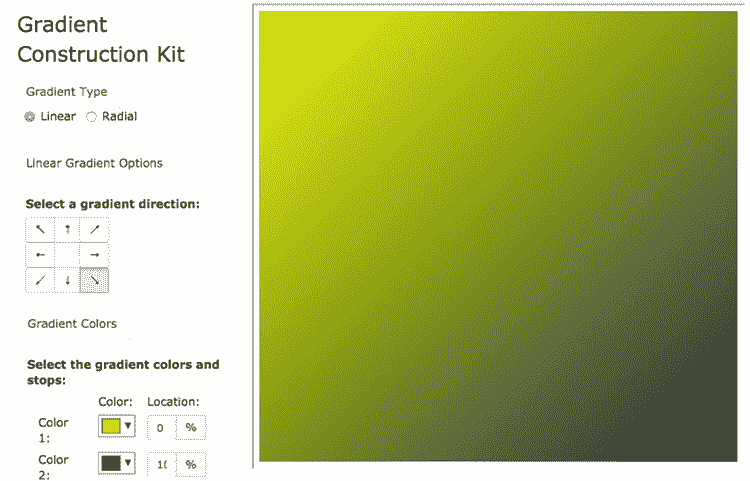

1.  要选择预设颜色，点击控制面板左侧的任一色卡。

1.  要指定颜色，使用文本框输入`rgb()`函数、`hsl()`函数、RGB 十六进制代码、颜色关键字、`rgba()`函数或`hsla()`函数。

1.  在大色块中，水平拖动以设置饱和度，或垂直拖动以设置亮度。

1.  使用垂直框设置色调，使用水平框设置透明度。

1.  完成后，点击关闭。

学习

要了解如何使用透明度修改颜色，请参阅游乐场上的“更改透明度”课程。在线：[wdpg.io/17-7-0](http://wdpg.io/17-7-0)

## 摘要

+   除了你在第四章中学到的颜色关键字外，你有五种方式来指定 CSS 颜色：`rgb()`函数、`hsl()`函数、RGB 十六进制代码、`rgba()`函数和`hsla()`函数。

+   要为元素的文本着色，使用`color`属性。

+   要为元素的背景着色，使用`background-color`属性。

+   要将线性渐变应用于元素的背景，使用`linear-gradient()`函数；如果您更喜欢径向渐变背景，则使用`radial-gradient()`函数。
