# 第十八章  使用排版增强页面文本

> 90%的设计是排版。*——杰弗里·泽尔达曼*

**本章涵盖**

+   设置字体

+   使用 Google 字体

+   样式化网页中的文字和段落

你想知道优秀网页设计的秘诀吗？具体来说，你想知道几乎所有最佳网站共有的一个设计元素吗？几乎每个杰出网站共享的隐藏在明显之下的设计秘诀可以总结为仅仅两个词：

*排版很重要。*

排版——应用于增强文本的可读性、可读性和外观的样式——是网络的秘密酱料，它的魔法尘埃。当你遇到一个有美学吸引力的网站时，很可能这个吸引力的很大一部分来自于网站对字体、文本大小和样式、间距以及其他排版事项的使用。该网站具有文本吸引力。

如果你想在你的网页上获得同样的吸引力，你只需要记住这两个至关重要的词：*排版很重要*。字体很重要。字体大小和样式很重要。间距、对齐和缩进很重要。幸运的是，正如你在本章中看到的，CSS 提供了一套庞大的排版工具，你可以使用这些工具来美化你的文本。不，你不会像在桌面页面布局程序中那样获得控制权，但 CSS 属性和值足够多，可以向世界展示你关心你的网页文本。

## 指定字体类型

要将你的排版提升到高速档，你需要超越我在第四章中提到的通用和系统字体，并接受字体堆栈和网页字体的强大概念。

## 第 18.1 课：使用字体堆栈

涵盖：`font-family`属性

在线：[wdpg.io/18-1-0](http://wdpg.io/18-1-0)

你可能还记得在第四章中提到，当你使用`font-family`属性时，你可以使用多个字体家族，只要你在所谓的字体堆栈中用逗号分隔它们。

为什么你会指定多个字体家族？在少数例外的情况下，你无法确定系统字体是否安装在了用户的设备上。例如，虽然无衬线字体 Helvetica 安装在 100%的 Mac 上，但它只安装在 7%的 Windows PC 上。同样，衬线字体 Cambria 安装在超过 83%的 Windows PC 上，但在 Mac 上只有大约 35%可用。当你指定一个字体堆栈时，浏览器会检查列表中的第一个字体家族，看它是否已安装。如果没有，浏览器会尝试列表中的下一个字体家族，这个过程会一直持续到浏览器找到一个已安装的系统字体。如果没有找到，在字体堆栈的末尾包含一个类似的通用字体家族始终是一个好习惯。例如，如果你的系统字体是衬线字体，那么在堆栈的末尾包含`serif`通用字体。

除了通用字体外，是否还有其他可以包含在字体堆栈中的稳妥选择？唉，实际上并不多，尽管一些字体至少安装在 90% 的 Mac 和 Windows PC 上。无衬线字体包括 Arial、Arial Black、Tahoma、Trebuchet MS 和 Verdana。衬线字体包括 Georgia 和 Times New Roman。等宽字体是 Courier New。

学习

要获取许多流行系统字体的安装百分比以及每个字体的建议堆栈，请参阅 [`www.cssfontstack.com`](https://www.cssfontstack.com) 上的 CSS 字体堆栈。

另一种字体堆栈策略是按照以下顺序包含字体家族：

+   您首选的字体

+   偏好字体的精确复制品

+   在 Mac 和 Windows 中几乎通用的类似字体

+   同一风格的通用字体

下面是一个示例：

```
font-family: "League Spartan", Futura, Tahoma, sans-serif; 

```

以下示例创建了两个字体堆栈：一个用于 h3 元素，另一个用于 p 和 li 元素。

#### 示例

在线：[wdpg.io/18-1-1](http://wdpg.io/18-1-1)

此示例展示了应用于 h3 元素的基础衬线字体堆栈，以及应用于 p 和 li 元素的基础无衬线字体堆栈。

#### 网页

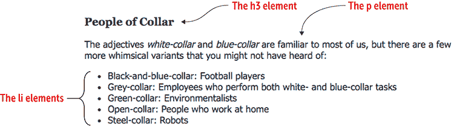

#### CSS

```
h3 {    ① 
 font-family: "Lucida Bright", Georgia, serif;    ① 
}    ① 
p, li {    ② 
 font-family: Tahoma, Helvetica, Arial, sans-serif;    ② 
}
```

①  h3 元素使用基于衬线的字体堆栈。

②  p 和 li 元素使用基于无衬线的字体堆栈。

#### HTML

```
<h3>People of Collar</h3>
<p>The adjectives <i>white-collar</i> and <i>blue-collar</i> are familiar to most of us, but here are a few more whimsical variants that you might not have heard of:</p>
<ul>
    <li>Black-and-blue-collar: Football players</li>
    <li>Green-collar: Environmentalists</li>
    <li>Grey-collar: Employees who perform both white- and blue-collar tasks</li>
    <li>Open-collar: People who work at home</li>
    <li>Steel-collar: Robots</li>
</ul>

```

当您为您的网页设计构建字体堆栈时，以下是一些需要注意的要点：

+   如果您想尝试不太流行的系统字体，请将其放在堆栈的起始位置。如果您将其放在安装在例如 99% 的设备上的字体之后，不太流行的字体很少会被使用。

+   如果可能，尽量在堆栈内匹配字体特征。例如，不要在同一堆栈中包含 Arial 这样的窄字体和 Verdana 这样的相对粗字体。

+   总是以同一风格的通用字体结束字体堆栈。

### 指定网络字体

依赖于系统字体是提高浏览器默认字体排版的简单方法。但系统字体有两个明显的问题：可用的系统字体数量有限，并且您不能确定特定的系统字体是否安装在使用者的计算机上。后者是一个大问题，因为它意味着您不能确定您的网页将如何显示给每个用户。如果您认为字体排印很重要（您应该这样认为），这种不确定性是一个主要的设计障碍。

幸运的是，您可以通过在页面上实现网络字体来跳过这个障碍。*网络字体*是托管在网络上并由特殊 CSS 指令 `@font-face` 引用的字体文件。网络浏览器使用该指令来加载字体文件，从而确保每个用户都能看到相同的字体。

您有两种方式来托管网络字体：

+   使用第三方托管。

+   在您的网站上托管字体文件。

下两个课程将提供每个方法的详细信息以及优缺点。

## 第 18.2 节：使用第三方托管字体

覆盖内容：`link`元素

在线：[wdpg.io/18-2-0](http://wdpg.io/18-2-0)

实现网络字体的最简单方法之一是链接到第三方网站托管的字体。有许多字体托管服务可供选择，包括 Fonts.com ([`www.fonts.com`](https://www.fonts.com)) 和 Adobe Typekit ([`typekit.com`](https://typekit.com))。在大多数情况下，你可以直接购买字体或支付月费，这让你可以访问到各种各样的字体。然而，大多数新网络设计师使用 Google Fonts ([`fonts.google.com`](https://fonts.google.com))，它提供了数百种免费的网络字体。

使用第三方的优点是已经清除了使用网络字体的所有权利。字体是知识产权，因此你需要从创作者那里获得使用许可，尤其是在网站上。字体托管者已经获得了必要的许可证，所以他们的字体没有麻烦和罪恶感。

> 网络字体服务……处理了大部分的许可和托管工作，让你专注于你最擅长的事情——构建令人惊叹和美丽的网站。*——丹·爱登*

使用第三方的主要缺点是字体文件位于远程服务器上，因此你的字体有时可能需要额外的时间来加载。你链接的字体越多，加载时间就越慢。然而，大多数大型字体托管服务已经优化了交付机制，所以这种字体延迟通常不是大问题。

指定你想要使用的字体的方法取决于服务，但一般程序通常是这样的：

1.  在字体托管网站上，找到并选择你想要使用的字体。

1.  通过添加额外的字体，如斜体、粗体和可能的粗斜体来定制字体。

    * * *

    谨慎

    记住，你添加的字体越多，你的网页加载速度就越慢。只链接到绝对需要的字体。除了常规字体外，大多数网页只需要斜体和粗体。

    * * *

1.  复制字体托管生成的`<link>`标签，并将其粘贴到网页的头部部分（即在`<head>`和`</head>`标签之间）。

    此标签从主机加载一个包含所需字体代码的 CSS 文件。以下是 Google Fonts 为 Lato 字体生成的`<link>`标签（其中`400`代表常规字体，`400i`代表常规斜体，`700`代表粗体）：

    ```
    <link href="https://fonts.googleapis.com/css?family=Lato:400,400i,700" rel="stylesheet">

    ```

    * * *

    常见问题解答

    *400 和 700 这样的数字代表什么？* 它们代表字体的粗细，其中 400 代表常规字体，700 代表粗体字体。参见第四章。

    * * *

1.  将字体添加到你的样式表中。

    以下属性告诉网络浏览器使用 Lato 字体家族来显示所有段落文本（如果第三方字体文件无法加载，将添加一个通用字体名称来显示）：

    ```
    p {
        font-family: Lato, sans-serif;
    }

    ```

#### 示例

在线：[wdpg.io/18-2-1](http://wdpg.io/18-2-1)

这个例子展示了两个文本片段。第一个不在`<p>`标签内，因此使用浏览器的默认字体，而第二个在`<p>`标签内，因此使用 CSS 部分显示的属性指定的字体家族。

#### Web Page

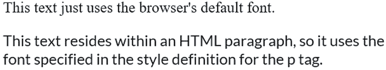

#### CSS

```
p {    ① 
 font-family: Lato, sans-serif;    ① 
}    ① 
```

①  p 元素使用 Lato 字体家族。

#### HTML

```
<link href="https://fonts.googleapis.com/css?family=Lato:400,400i,700" rel="stylesheet">    ② 
This text just uses the browser's default font.    ③ 
<p>    ④ 
This text resides within an HTML paragraph, so it uses the font specified in the style definition for the p tag.    ④ 
</p>    ④ 

```

②  告诉浏览器从 Google 下载字体

③  未指定 p 元素，因此使用默认字体。

④  这段文本位于 p 元素内，因此使用 Lato 字体进行格式化。

## 第 18.3 课：托管您自己的字体

覆盖内容：`@font-face`规则

在线：[wdpg.io/18-3-0](http://wdpg.io/18-3-0)

播放

使用 Google Fonts 生成一个定义 Merriweather 字体族常规字体的`<link>`标签的样式表。设置一个将常规字体应用于所有页面文本并包含一个通用字体名称作为后备的样式。在线：[wdpg.io/18-2-2](http://wdpg.io/18-2-2)

使用第三方字体托管是摆脱默认字体惯例并让你的页面闪耀有趣字体的最简单方法。然而，一些网页设计师不喜欢将他们页面的外观置于某个远程服务器之上，该服务器可能运行缓慢或根本无法运行。在这种情况下，设计师会选择自己托管字体的方法，其中实际的字体文件位于与网页相同的服务器上。

常见问题解答

*本地字体文件是否总是比远程字体文件更快？* 并不一定。许多字体提供商使用非常快速的内容分发网络（CDN），因此延迟通常可能小于本地文件。

不幸的是，您必须为托管自己的字体所固有的速度和可靠性付出代价：复杂性。使用第三方托管字体是一个简单的过程，只需生成并使用一个指向远程样式的`<link>`标签，而托管自己的字体有两个主要因素会提高复杂性水平。

第一个复杂因素是字体许可。大多数商业字体都附带了防止它们在网络上使用的许可。在您自己托管字体之前，您必须购买一个在网络上使用该字体的许可（假设提供了此类许可），或者您可以寻找允许网络使用的开源字体。

对于后者，这里有一些字体集合可以尝试：

+   Font Squirrel ([`www.fontsquirrel.com`](https://www.fontsquirrel.com))

+   Fontspring ([`www.fontspring.com`](https://www.fontspring.com))

+   Fontex ([www.fontex.org](http://www.fontex.org))

+   Open Font Library ([`fontlibrary.org`](https://fontlibrary.org))

小心

字体是知识产权，应如此对待。在您的网站上托管任何字体之前，请确保您有使用该字体进行个人和/或商业用途的许可（根据您网站的性质而定）。

第二个复杂因素是众所周知的字体文件格式混乱。您可能认为您需要上传单个字体文件到您的服务器，但字体艺术的状况并不那么简单。实际上，有三种文件格式：

+   *EOT (Embedded Open Type)—*由 Internet Explorer 支持，并且是版本 9 之前 Internet Explorer 支持的唯一字体文件格式。

+   *WOFF (Web Open Font Format)—*由 Internet Explorer 9 及更高版本、Mozilla Firefox 3.6 及更高版本、Google Chrome 6 及更高版本支持。一个名为 WOFF 2.0（或 WOFF2）的新版本由 Microsoft Edge 14 及更高版本、Chrome 36 及更高版本、Firefox 39 及更高版本、Opera 23 及更高版本、Safari 12 及更高版本、iOS Safari 10.2 及更高版本以及 Android 62 及更高版本支持。

+   *TTF/OTF (TrueType Font/OpenType Font)—*除 Internet Explorer 8 及更早版本外，所有浏览器都支持。

好消息是，您不再需要这些格式中的大多数。EOT 已经过时，因为很少有人还在使用 Internet Explorer 8 或更早版本，而 TTF/OTF 是多余的，因为它们包含在 WOFF 和 WOFF2 格式中。（第四种格式，称为 SVG，现在被认为是过时的。）简而言之，您只需要担心两种字体文件格式：WOFF 和 WOFF2。还不错！

小心

仅使用 WOFF 和 WOFF2 可能意味着您网站的一小部分访客将看不到您的字体，包括运行以下（以及每个版本的早期版本）的用户：Android 4.3、Chrome 4、Firefox 3.5、Internet Explorer 8、iOS 4.3、Opera 10.1 和 Safari 5。如果这种情况是问题，请使用如[wdpg.io/18-3-3](http://wdpg.io/18-3-3)中所示的完整`@font-face`语法。

理论上，想法是您下载您的授权字体文件，该文件可能为 TTF 格式，然后您以某种方式使用该文件生成其他格式。实际上，这样做很难，所以大多数人使用 Font Squirrel 提供的一项服务，即 Webfont Generator（[`www.fontsquirrel.com/tools/webfont-generator`](https://www.fontsquirrel.com/tools/webfont-generator)），该服务将您的下载字体文件自动创建一个包含其他文件格式的包。

精通

与当前字体文件格式现实相匹配，Webfont Generator 默认只生成 WOFF 和 WOFF2 字体。如果您需要其他字体文件格式，请务必激活专家单选按钮；然后使用复选框选择您想要的格式。

更好的是，Webfont Generator 包包括使用您网站上字体的必要 CSS 代码。此代码使用`@font-face`规则，其通用语法如下：

```
@font-face {
    font-family: '*Font Name*';    ①  
    src: url('*font_filename*.woff2') format('woff2'),
         url('*font_filename*.woff') format('woff');
}

```

①  带有空格的字体名称必须用引号括起来。

记住

为了获得最佳的跨浏览器效果，请设置`@font-face`规则，使得 WOFF2 字体格式在 WOFF 格式之前出现。Webfont Generator 应该会自动完成这项操作。

要应用`@font-face`规则，请使用其`font-family`值作为您想要样式的元素的`font-family`属性。

#### 示例

在线：[wdpg.io/18-3-1](http://wdpg.io/18-3-1)

这个例子为 Bree Serif 字体设置了一个 `@font-face` 规则，并将其应用于 `ul` 元素。

#### 网页

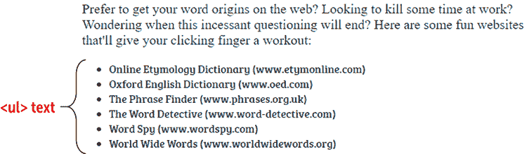

#### CSS

```
@font-face {
 font-family: 'Bree Serif';    ① 
    src: url('/fonts/breeserif.woff2') format('woff2'),
         url('/fonts/breeserif.woff') format('woff');
}
ul {
 font-family: 'Bree Serif';    ① 
}
```

①  使用字体族名称将字体应用于元素。

#### HTML

```
<p>
Prefer to get your word origins on the web? Looking to kill some time at work? Wondering when this incessant questioning will end? Here are some fun websites that'll give your clicking finger a workout:
<p>
<ul>
    <li>Online Etymology Dictionary (www.etymonline.com)</li>
    <li>Oxford English Dictionary (www.oed.com)</li>
    <li>The Phrase Finder (www.phrases.org.uk)</li>
    <li>The Word Detective (www.word-detective.com</li>
    <li>Word Spy (www.wordspy.com)</li>
    <li>World Wide Words (www.worldwidewords.org)</li>
</ul> 

```

在使用与 `@font-face` 规则的文件名相关的目录时，以下是一些需要注意的要点：

+   如果字体文件位于 CSS 文件（或包含 CSS 代码的 HTML 文件）所在的目录中，则不需要目录：

    ```
    url('breeserif.woff2')

    ```

+   如果字体文件位于存储 CSS（或 HTML）文件的位置的子目录中，请在文件名前加上目录名和一个反斜杠 (/)：

    ```
    url('fonts/breeserif.woff2')

    ```

+   如果字体文件位于网站根目录的子目录中，请在文件名前加上反斜杠 (/)，目录名，然后再加上一个反斜杠 (/)：

    ```
    url('/fonts/breeserif.woff2')

    ```

## 处理文本样式

当你选定了字体（或字体族）并且可以用不同的字体大小来格式化它们时，你已经在制作具有排版美感的网页的道路上走得很远了。但要使你的网页在众多网页中脱颖而出，你需要了解一些更多与文本样式相关的 CSS 属性。

## 第 18.4 课：格式化小写字母

涵盖：`font-variant` 属性

在线：[wdpg.io/18-4-0](http://wdpg.io/18-4-0)

使用它

小写字母也常用于使全大写文本（如缩写）与周围文本更好地融合。

当你想让某些页面文本引起注意时，大多数情况下你会转向加粗或斜体来完成这项工作。然而，对于一些稍微不同的事情，尝试使用小写字母。小写字母是一种全大写风格的文本，其中小写字母被转换为略小于正常大写字母的大写等效字母。（原始大写文本保持不变。）

你可以通过使用 `font-variant` 属性并将其值设置为 `small-caps` 来将文本格式化为小写字母。

#### 示例

在线：[wdpg.io/18-4-1](http://wdpg.io/18-4-1)

这个例子使用了设置为 `small-caps` 的 `font-variant` 属性来将文本中的名字格式化为小写字母。

#### 网页

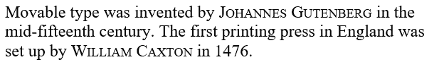

#### CSS

```
span {    ① 
 font-variant: small-caps;    ① 
}    ① 
```

①  这个样式将 span 元素格式化为使用小写字母。

#### HTML

```
Movable type was invented by <span>Johannes Gutenberg</span> in the mid-fifteenth century. The first printing press in England was set up by  <span>William Caxton</span> in 1876\.    ②  

```

②  使用小写字母格式化 span 元素内的名字。

## 第 18.5 课：设置行高

涵盖：`line-height` 属性

在线：[wdpg.io/18-5-0](http://wdpg.io/18-5-0)

精通

另一种操纵文本大小写的方法是使用 `text-transform` 属性。将此属性设置为 `lowercase` 以将文本转换为小写字母，或设置为 `uppercase` 以将文本转换为大写。你还可以使用 `capitalize` 仅将每个单词的第一个字母转换为大写。

使你的网页文本在排版上看起来稳固的最后一大因素是行高，即两行文本基线之间的距离。对于给定的一行文本，基线是诸如 *o* 和 *x* 这样的字母似乎坐落在上面的不可见线。

您可以通过使用名为 `line-height` 的 CSS 属性来设置行高。您可以分配给此属性的值类型在表 18.1 中概述。

表 18.1 可应用于 `line-height` 属性的值

| **值** | **描述** |
| --- | --- |
| `number` | 输入不带单位的数值。计算出的行高是当前字体大小乘以该数值。 |
| `length` | 输入带有单位的数值，例如 `em`。 |
| `percentage` | 百分比值。计算出的行高是当前字体大小乘以百分比。 |
| `normal` | 一个关键字，告诉浏览器根据当前字体大小自动设置行高。 |

行高对于可读文本至关重要，正如您在图 18.1 中所看到的。左侧的文本行高设置为 0.75，导致行距过于接近，难以阅读。右侧的文本行高设置为 2，导致行距过大，阅读不舒适。中间的文本行高设置为 1.2，看起来恰到好处。

> 字体排印是二维结构，基于经验和想象力，并受规则和可读性的指导。*——赫尔曼·察普夫*

图 18.1 当行高过小（左侧）或过大（右侧）时，文本难以阅读。

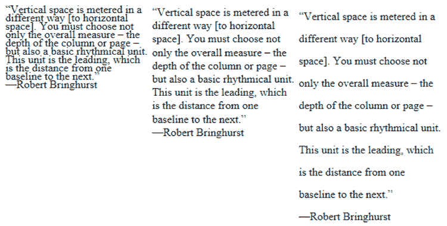

#### 尝试以下操作

在线：[wdpg.io/18-5-2](http://wdpg.io/18-5-2)

此示例将 `p` 元素的 `line-height` 属性设置为 0.9，导致所谓的 *紧密行间距*。尝试大约 1.2 的 *正常行间距* 值，以及 1.5 或更高的 *宽松行间距* 值。

#### 网页

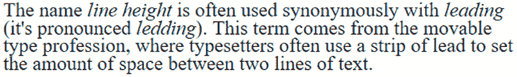

#### CSS

```
p {
    font-size: 1.5em;
 line-height: 0.9;    ① 
}
```

①  调整 p 元素的行高值以创建紧密、正常和宽松的行间距。

#### HTML

```
<p>
The name <i>line height</i> is often used synonymously with <i>leading</i> (it's pronounced <i>ledding</i>). This term comes from the movable type profession, where typesetters often use a strip of lead to set the amount of space between two lines of text.
</p>. 

```

## 第 18.6 节：使用简写字体属性

覆盖内容：`font` 属性

在线：[wdpg.io/18-6-0](http://wdpg.io/18-6-0)

如您在本书中迄今为止所见，CSS 字体排印有六个主要的字体相关组件：字体族、字体大小、加粗、斜体、小写字母和行高。这些组件分别由 CSS 属性 `font-family`、`font-size`、`font-weight`、`font-style`、`font-variant` 和 `line-height` 表示。方便的是，您可以通过使用 `font` 简写属性一次性应用这些属性中的任何或所有属性，该属性采用如图 18.2 所示的语法。

图 18.2 您可以使用 `font` 属性同时应用多达六个字体属性。

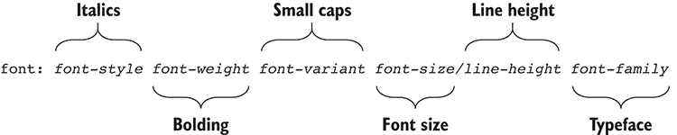

此语法是您迄今为止所学内容的直接重复，尽管您需要记住以下注意事项：

+   您可以使用一些或所有这些值，但至少必须提供 `*font-size*` 和 `*font-family*` 值，顺序如下。

+   您可以以任何顺序添加`*font-style*`、`*font-weight*`和`*font-variant*`值，只要它们都在`*font-size*`值之前即可。

+   你无疑已经注意到了，并且对语法中的`*font-size*``/``*line-height*`部分非常好奇。那个斜杠是从传统的印刷排版中借用的，其中作为缩写，人们可能会说文本是“12/18”排版，这意味着它使用 12 磅的字体和 18 磅的行高。

#### 示例

在线:[wdpg.io/18-6-1](http://wdpg.io/18-6-1)

此示例设置了`div`、`dt`和`span`元素的`font`属性。

#### 网页

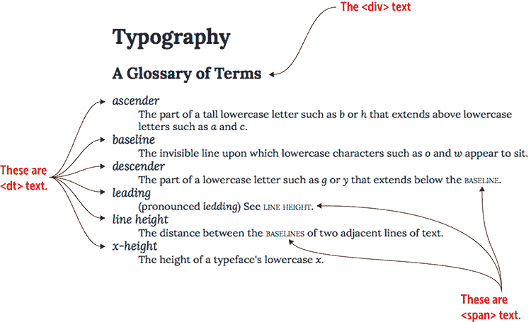

#### CSS

```
div {    ① 
 font: bold 1.5em/1.3 Lora;    ② 
}    ① 
dt {    ② 
 font: italic 1.1em/1.25 Lora;    ② 
}    ② 
span {    ③ 
 font: small-caps 1em Lora;    ④ 
}    ③ 
```

①  `div`文本是加粗的 Lora 字体，字号为 1.5em，行高为 1.3。

②  `dt`文本是斜体的 Lora 字体，字号为 1.1em，行高为 1.25。

③  该段文本使用的是小写字母的 Lora 字体，字号为 1em。

#### HTML

```
<link href="https://fonts.googleapis.com/css?family=Lora:400,400i,700,700i" rel="stylesheet">    ④ 

<h1>Typography</h1>
<div>A Glossary of Terms</div>
<dl>
<dt>ascender</dt>
<dd>The part of a tall lowercase letter such as <i>b</i> or <i>h</i> that extends above lowercase letters such as <i>a</i> and <i>c</i>.
<dt>baseline</dt>
<dd>The invisible line upon which lowercase characters such as <i>o</i> and <i>w</i> appear to sit.</dd>
<dt>descender</dt>
<dd>The part of a lowercase letter such as <i>g</i> or <i>y</i> that extends below the <span>baseline</span>.
<dt>leading</dt>
<dd>(pronounced <i>ledding</i>) See <span>line height</span>.</dd>
<dt>line height</dt>
<dd>The distance between the <span>baselines</span> of two adjacent lines of text.</dd><dt>x-height</dt>
<dd>The height of a typeface's lowercase <i>x</i>.</dd>
</dl>

```

④  此元素嵌入来自 Google Fonts 的 Lora 字体。

## 网页排版画廊

Anchor & Orbit 网站([www.anchorandorbit.com](http://www.anchorandorbit.com))使用三种字体的组合：P22 Underground 用于标题，Caslon 用于正文文本，Cotoris 用于标志。

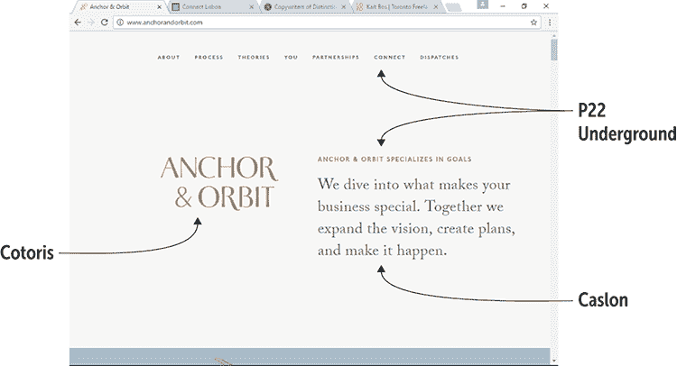

Scytale 网站([`scytale.pt`](https://scytale.pt))使用 Flama Medium 字体作为标题，Adelle Light 字体作为正文文本。

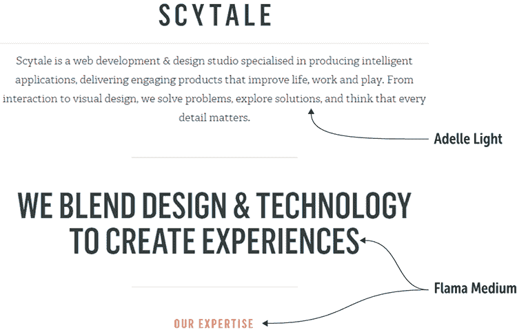

设计师 Kait Bos 的网站([www.kaitbos.com](http://www.kaitbos.com))使用 Capriola 字体进行导航和正文文本，Archer Light Pro 字体用于主要标题。

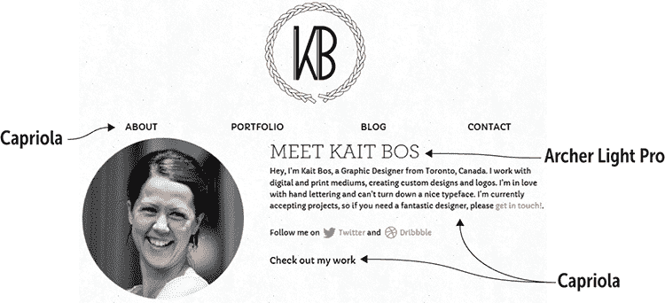

Rule of Three 文案工作室的网站([`rule-of-three.co.uk`](https://rule-of-three.co.uk))使用单一字体 Sorts Mill Goudy，在不同字号中应用。

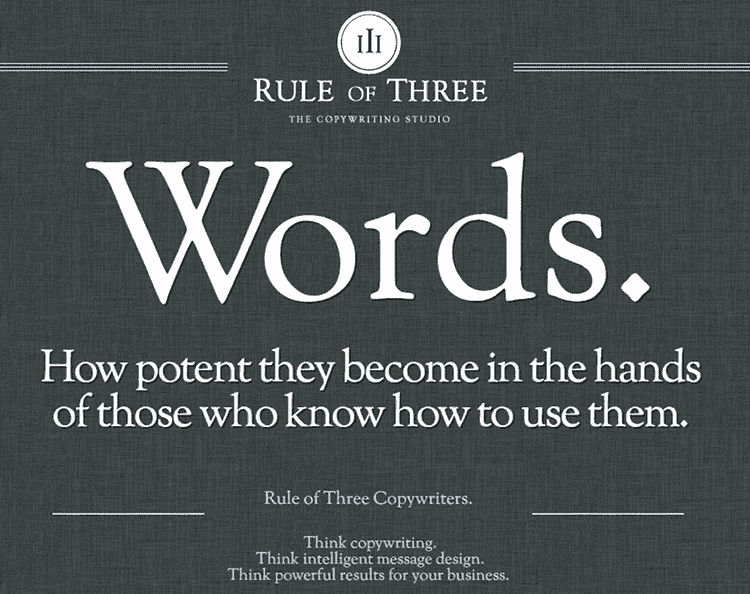

## 摘要

+   使用托管或本地字体文件，而不是依赖系统字体。

+   选择一种适合您的文本和整体信息的字体。

+   使用`font-variant: small-caps`作为强调或突出文本的另一种方式。

+   通过设置`line-height`属性，在文本行之间留出适当的空间（但不要太多）。

+   通过使用`font`属性作为缩写来节省时间。
