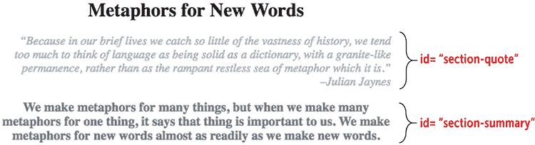
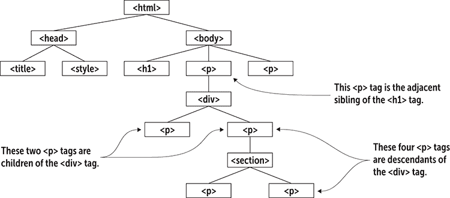
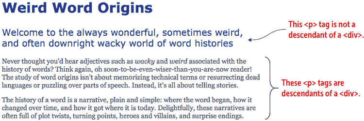
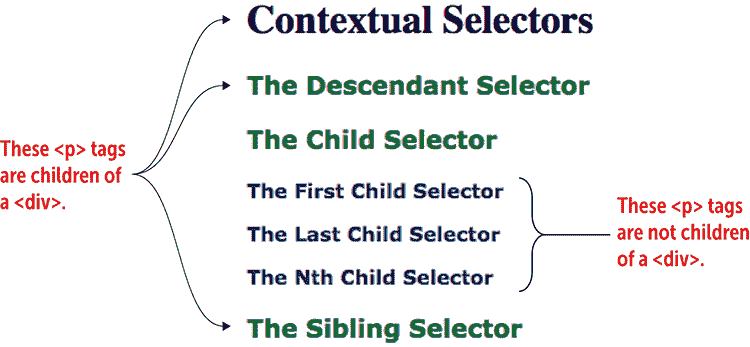
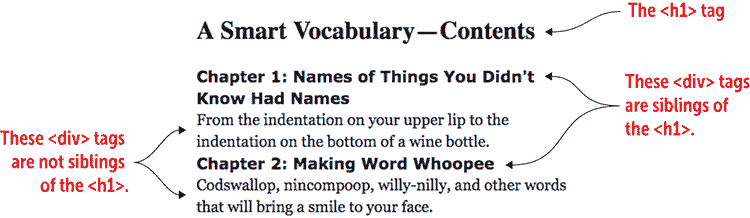
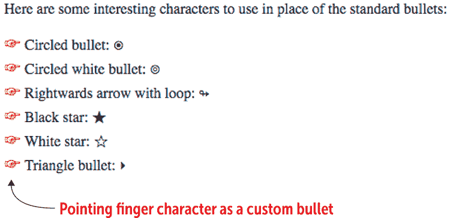
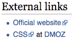
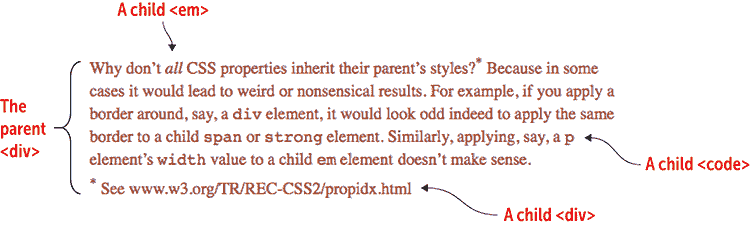
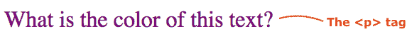

# 第十九章  学习高级 CSS 选择器

> HTML 元素使网页设计师能够标记文档的结构，但除了信任和希望之外，你对自己的文本外观没有任何控制权。CSS 改变了这一点。CSS 让设计师成为驾驶员。*—— Håkon Wium Lie*

**本章涵盖**

+   学习强大的 ID 和通用选择器

+   通过后代、子代和兄弟选择器提升你的样式游戏水平

+   通过组合两个或更多选择器来定位你的样式

+   通过理解 CSS 继承、层叠和特定性成为样式大师

表面上，CSS 看起来像是一个简单的话题：你给一些属性赋值，将它们组合成一个规则，然后将这个规则应用到页面元素上。重复几次，哇哦：你的页面就变得美丽了。但 CSS 的表面简单性只是肤浅的。在声明和规则的直接实现之下，隐藏着复杂的洞穴和深不可测的动态深度。本章作为对这个隐藏世界的介绍，这个世界是许多最强大和实用的 CSS 概念的家园。

## 使用 ID 选择器进行操作

在第七章，我向你介绍了 CSS 选择器，它使你能够指定你想要样式的页面对象：

```
*selector* {
*property1*: *value1*;
*property2*: *value2*; 
    ...
}

```

到目前为止，你已经了解到这个 CSS 规则中的`*选择器*`部分可以是 HTML 标签的名称（一个*类型选择器*）或 CSS 类的名称（一个*类选择器*）。CSS 选择器有很多，然而其中许多选择器相当晦涩，但更常见的选择器确实是强大的工具。本章的教程介绍了这些选择器中的五个，从 ID 选择器开始。

学习

我的 WebDev Workshop 包括所有 CSS 选择器的完整概述，以及示例。查看：https://webdev.mcfedries.com/code/selector-reference/。

## 第 19.1 课：使用 ID 选择器

涵盖：`#`和`*id*`选择器

在线：[wdpg.io/19-1-0](http://wdpg.io/19-1-0)

回到第十六章，你学习了你可以通过给页面中的特定元素添加`id`属性，然后在链接地址中包含`id`值来链接到网页中的特定元素。你还可以使用元素的`id`值来应用 CSS 样式到该元素。要在内部或外部样式表中这样做，你需要在`id`值前加上一个井号符号（`#`）来创建选择器：

```
#*id-value* {
*property1*: *value1*;
*property2*: *value2*; 
    ...
}

```

记住

与类名一样，你的`id`值必须以字母开头，可以包含任何组合的字母、数字、连字符（-）和下划线（_）。

小心

同样，像类名一样，`id`值是区分大小写的。

以下示例展示了 ID 选择器的实际应用。

#### 示例

在线：[wdpg.io/19-1-1](http://wdpg.io/19-1-1)

此示例给两个`<div>`标签——`section-quote`和`section-summary`——添加了 ID，然后使用相应的 ID 选择器应用规则到每个`div`元素上。

#### 网页



#### CSS

```
#section-quote {    ① 
 color: darkgray;    ① 
 font-size: 1.25em;    ① 
 font-style: italic;    ① 
 text-align: right;    ① 
}    ① 
#section-summary {    ② 
 color: dimgray;    ② 
 font-size: 1.5em;    ② 
 font-weight: bold;    ② 
 text-align: center;    ② 
}    ② 
```

①  章节引用`id`的规则

②  章节摘要`id`的规则

#### HTML

```
<h1>
    Metaphors for New Words
</h1>
<div id="section-quote">    ③  
“Because in our brief lives we catch so little of the vastness of history, we tend too much to think of language as being solid as a dictionary, with a granite-like permanence, rather than as the rampant restless sea of metaphor which it is.”<br>–Julian Jaynes
</div>
<div id="section-summary">    ④  
We make metaphors for many things, but when we make many metaphors for one thing, it says that thing is important to us. We make metaphors for new words almost as readily as we make new words.
</div>

```

③ 将 section-quote id 分配给 div 元素

④ 将 section-summary id 分配给 div 元素

### 最佳实践：类与 ID

你应该在何时使用 ID 选择器而不是类选择器？问问自己以下问题：

+   我想要的样式是否只应用于一个且仅有一个元素？

    如果是这样，就使用该元素的 ID 选择器。

+   我想要的样式是否应用于多个元素？

    如果是这样，就使用每个这些元素的类选择器。

+   我想要的样式现在是否只应用于一个元素，但将来可能应用于其他元素？

如果是这样，现在就使用该元素的类选择器。你总是可以在以后需要时将类选择器应用于其他元素。

谨慎

ID 选择器，因为它们只应用于单个元素，使得你的 CSS 代码更难维护和调试。当我在这章后面讨论特定性时，你会明白原因。因此，关于 ID 选择器的真正最佳实践是永远不要使用它们。

## 网页家谱：父母、后代和兄弟姐妹

在继续学习选择器之前，你需要简要地了解网页的层次结构，这样你就可以学习一些关键概念。图 19.1 展示了一个典型网页的层次结构。

现在遍历这个（颠倒的）树结构：

+   `html` 元素是结构的根。

+   `html` 元素有两个主要分支：`head` 和 `body`。

+   `head` 元素有两个分支：`title` 和 `style`。

+   `body` 元素有三个分支：一个 `h1` 元素和两个 `p` 元素。

+   第一个 `p` 元素有一个 `div` 分支。

+   那个 `div` 分支有两个 `p` 分支。

+   那些第二个 `p` 分支有一个 `section` 分支。

+   `section` 分支有两个 `p` 分支。

在这个层次结构的基础上，我可以定义一些有用的术语，以便你理解接下来的 CSS 选择器：

+   *父元素* — 包含一个或多个其他元素的元素。在 图 19.1 中，`html` 是 `head` 和 `body` 元素的父元素，而 `div` 元素是两个 `p` 元素的父元素。

+   *曾祖父母* — 包含第二级元素的元素。在 图 19.1 中，`html` 是（包括）`title` 和 `h1` 元素的曾祖父母，而 `div` 元素是 `section` 元素的曾祖父母。

图 19.1 典型网页的树结构



+   *祖先* — 包含一个或多个元素级别的元素。在 图 19.1 中，`html` 是所有其他元素的祖先，而 `body` 元素是 `div` 元素及其包含的每个元素的祖先。

+   *子元素* — 被包含在其层次结构中位于其上方一级的元素中的元素。也就是说，该元素在结构中有一个父元素。在 图 19.1 中，`title` 是 `head` 的子元素，而 `div` 是其包含的 `p` 元素的子元素。

+   *后代* —一个元素包含在位于层次结构中高于它的一个或多个级别的元素中。也就是说，该元素在结构中有一个祖先。在图 19.1 中，`title`是`html`的后代，四个`p`元素都是其包含的`div`元素的后代。

+   *兄弟* —与另一个元素处于同一级别的元素。在图 19.1 中，`body`元素的三个子元素——即，`h1`和两个`p`元素——都是兄弟。特别是要注意，紧接在另一个兄弟之后的兄弟被称为*相邻兄弟*。

## 使用上下文选择器

考虑到上一节中的术语，我现在想谈谈如何使用网页层次结构通过使用三个*上下文选择器*（之所以这样命名，是因为它们定义了元素在网页中的上下文）来构建一些强大的 CSS 规则。

## 第 19.2 课：后代选择器

覆盖范围：`*x y*`选择器

在线：[wdpg.io/19-2-0](http://wdpg.io/19-2-0)

一个常见的 CSS 场景是将样式规则应用于包含在其他元素（即，是其后代）中的所有元素。为此，使用*后代选择器*，它用空格分隔祖先元素和后代元素，如下面的语法所示：

```
*ancestor* *descendant* {    ①    ②  

 `*property1*`: `*value1*`;    ③ 
 `*property2*`: `*value2*`;    ③ 
    ...
}

```

①  元素的父元素

②  您想要样式的元素

③  您想要应用的样式

记住

在 CSS 术语中，您放置在两个元素之间以形成选择器的字符（例如，在后代选择器中使用的空格）被称为*组合器*。

精通

是的，空格是一个令人挠头的字符选择，用于定义 CSS 选择器，但最新的 CSS 规范引入了一个显式的后代组合器：双大于号（`div >> p`而不是`div p`）。目前还没有浏览器支持这个，但将来都会支持。

您的页面可能有一些`p`元素在开头，用作页面的摘要，以及相当多的`p`元素包含正文。假设您想将摘要文本与正文文本样式区分开来，通用的`p`选择器将不起作用。如果您相反，将所有正文`p`元素包裹在一个`div`元素中，您可以使用以下选择器来针对所有`p`元素：

```
div p

```

小心

后代选择器非常强大，因为它针对祖先的每个后代，无论这些后代在层次结构中位于多远。为了避免意外结果，如果您想针对祖先下方的一级后代，您应该使用子选择器（在第 19.3 课中讨论）。

以下示例使用后代选择器来样式化页面的正文。

#### 示例

在线：[wdpg.io/19-2-1](http://wdpg.io/19-2-1)

此示例使用后代选择器`div p`来仅针对包含在`div`元素中的`p`元素。

#### 网页



#### CSS

```
body {    ① 
 color: blue;    ① 
 font-family: Verdana, sans-serif;    ① 
 font-size: 1.2em;    ① 
}    ① 
div p {    ② 
 color: #444;    ② 
 font-family: Georgia, serif;    ② 
 font-size: 0.75em;    ② 
}    ② 

```

①  应用于所有文本的样式

② 仅应用于是 div 元素后代的 p 元素的样式

#### HTML

```
<h2>Weird Word Origins</h2>
<p>Welcome to the always wonderful, sometimes weird, and often downright wacky world of word histories</p>
<div>
    <p>Never thought you’d hear adjectives such as <i>wacky</i> and <i>weird</i> associated with the history of words? Think again, oh soon-to-be-even-wiser-than-you-are-now reader! The study of word origins isn't about memorizing technical terms or resurrecting dead languages or puzzling over parts of speech. Instead, it's all about telling stories.</p>
    <p>The history of a word is a narrative, plain and simple: where the word began, how it changed over time, and how it got where it is today. Delightfully, these narratives are often full of plot twists, turning points, heroes and villains, and surprise endings.</p>
</div>

```

## 第 19.3 节：子选择器

涵盖：`x` `>` `y` 选择器

播放

创建一个规则，将绿色和 1.2em 字体大小应用于任何是 `<div>` 标签后代的 `<code>` 标签。在线：[wdpg.io/19-2-2](http://wdpg.io/19-2-2)

在线：[wdpg.io/19-3-0](http://wdpg.io/19-3-0)

与选择指定元素的每个后代相比，你通常只需要定位其子元素。为此，使用 *子选择器*，它使用大于号 (`>`) 将父元素和子元素分开，如下所示：

```
*parent* > *child* {    ①    ②  

 `*property1*`: `*value1*`;    ③ 
 `*property2*`: `*value2*`;    ③ 
 ...    ③ 
}

```

① 元素的父元素

② 你想要样式的元素

③ 你想要应用的样式

参考图 19.1，你可以使用以下选择器来设置 `div` 元素的两个 `p` 子元素的样式：

```
div > p

```

精通

要选择其父元素的第一个子元素，使用 `*element*`:first-child 伪类。同样，要选择其父元素的最后一个子元素，使用 `*element*`:last-child 伪类。在线：[wdpg.io/19-3-4](http://wdpg.io/19-3-4)

精通

另一个强大的子伪类是 `:nth-child(``*n*``)`，其中 `*n*` 指定你想要选择的子元素。使用 `:nth-child(odd)` 选择奇数（第一个、第三个等）子元素，或使用 `:nth-child(even)` 选择偶数（第二个、第四个等）元素。在线：[wdpg.io/19-3-5](http://wdpg.io/19-3-5)

以下示例使用子选择器来设置那些是 `div` 元素子元素的 `p` 元素的样式。

#### 示例

在线：[wdpg.io/19-3-1](http://wdpg.io/19-3-1)

本例使用 `div > p` 子选择器，只为那些是 `div` 元素直接子元素的 `p` 元素设置字体大小为 1.25em 和深绿色。

#### 网页



#### CSS

```
p {    ① 
 color: darkblue;    ① 
 font-size: 1em;    ① 
 font-weight: bold;    ① 
}    ① 
div > p {    ② 
 font-size: 1.25em;    ② 
 color: darkgreen;    ② 
}    ② 
```

① 所有 p 文本的样式

② div 元素子元素的 p 元素的样式

#### HTML

```
<h1>Contextual Selectors</h1>
<div>
 <p>The Descendant Selector</p>    ③ 
 <p>The Child Selector</p>    ③ 
        <section>
            <p>The First Child Selector</p>
            <p>The Last Child Selector</p>
            <p>The Nth Child Selector</p>
        </section>
 <p>The Sibling Selector</p>    ③ 
</div>
```

③ 子 p 元素

## 第 19.4 节：兄弟选择器

涵盖：`x` `~` `y` 选择器

播放

给定一个嵌套在另一个编号列表中的编号列表，使用子选择器创建一个规则，将嵌套列表的样式设置为使用小写字母而不是数字。在线：[wdpg.io/19-3-2](http://wdpg.io/19-3-2)

在线：[wdpg.io/19-4-0](http://wdpg.io/19-4-0)

而不是选择一个元素的子元素或后代，你可能需要定位其兄弟元素。为此，使用 *兄弟选择器*，它使用波浪号 (`~`) 将参考元素和兄弟元素分开，如下所示：

```
*element* ~ *sibling* {    ①    ②  

 `*property1*`: `*value1*`;    ③ 
 `*property2*`: `*value2*`;    ③ 
 ...    ③ 
}

```

① 参考元素

② 你想要样式的元素

③ 你想要应用的样式

在 图 19.1 中，你可以使用以下选择器来设置 `h1` 元素的同级 `p` 元素的样式：

```
h1 ~ p

```

以下示例展示了兄弟选择器的实际应用。

#### 示例

在线：[wdpg.io/19-4-1](http://wdpg.io/19-4-1)

此示例使用 `h1 ~ div` 兄弟选择器，只为那些是 h1 元素兄弟的 `div` 元素设置无衬线字体堆叠和粗体字体重量。

#### 网页



#### CSS

```
div {    ① 
 font-family: Georgia, serif;    ① 
 font-weight: normal;    ① 
}    ① 
h1 ~ div {    ② 
 font-family: Verdana, sans-serif;    ② 
 font-weight: bold;    ② 
}    ② 
```

①  所有 div 文本的样式

②  h1 兄弟元素的样式

#### HTML

```
<h1>
    A Smart Vocabulary—Contents
</h1>
<div>    ③ 
    Chapter 1: Names of Things You Didn't Know Had Names
    <div>From the indentation on your upper lip to the indentation on the bottom of a wine bottle.</div>
</div>
<div>    ③ 
    Chapter 2:  Making Word Whoopee
    <div>Codswallop, nincompoop, willy-nilly, and other words that will bring a smile to your face.</div>
</div>

```

③  兄弟 div 元素

大师

要选择元素的相邻兄弟，将波浪号改为加号：`*元素*` `+` `*兄弟*`（例如 `h1 + p`）。在线：[wdpg.io/19-4-4](http://wdpg.io/19-4-4)

## 通过组合选择器提升事物到一个新的层次

CSS 选择器是有用的工具，因为它们使你能够定位你想要样式的网页区域。通过指定特定的类或元素的后代，你可以获得更多控制页面展示的能力。但如果既需要使用类选择器又需要使用后代选择器，那会怎样？也就是说，如果你想定位的不是被分配了特定类的元素，而是它的后代，那会怎样？表 19.1 展示了结合 CSS 选择器的一些方法。

表 19.1 一些组合选择器的方法

| **示例** | **描述** |
| --- | --- |
| `<div class="sidebar alert">` | 将名为 `sidebar` 的类和名为 `alert` 的类同时应用于 `div` 元素 |
| `p.footnote {``*styles*``}` | 将规则应用于那些被分配了名为 `footnote` 的类的 `p` 元素 |
| `p.footnote > a {``*styles*``}` | 将规则应用于那些被分配了名为 `footnote` 的类的 `p` 元素的子 `a` 元素 |
| `p.footnote a.external {``*styles*``}` | 将规则应用于那些被分配了名为 `external` 的类，并且是那些被分配了名为 `footnote` 的类的 `p` 元素的后代 `a` 元素 |
| `#payables-table li:nth-child(even) {``*styles*``}` | 将规则应用于列表中具有 ID `payables-table` 的偶数编号 `li` 元素 |

当我在谈论组合事物的时候，我应该提到，将单个样式规则应用于两个或更多选择器是完全有效的 CSS。你可以通过用逗号分隔选择器来实现这一点，如下所示：

```
*selectorA*,
*selectorB* {
*property1*: *value1*;
*property2*: *value2*; 
    ...
}

```

假设你有一个名为 `pullquote` 的类，你用它来样式化网站新闻文章中的引用，还有一个名为 `sidebar` 的类，你用它来样式化网站教程页面中的侧边栏。如果这两个类使用相同的规则，你可以将它们组合起来：

```
.pullquote,
.sidebar {
    color: #444;
    background-color: #ccc;
}

```

## 第 19.5 课：::before 和 ::after 伪元素

覆盖:`::before` 和 `::after`

在线：[wdpg.io/19-5-0](http://wdpg.io/19-)

在 CSS 中，您可以创建不属于页面层次结构的网页对象，这些对象被称为 *伪元素*。两个常见的例子是 `::before` 和 `::after`，您分别用于在指定元素的内容之前和之后插入内容。在 CSS 中，这种内容被称为 *生成内容*，因为您自己没有输入内容；它是浏览器自动创建的。以下是语法：

```
*element*::before|after {    ①    ②  

    content: *value*;    ③  
 `*content_styles*`;    ④ 
}

```

①  网页元素

②  您想要添加内容的位置

③  您想要插入的内容

④  应用于插入内容的可选样式

记住

要插入特殊字符作为自定义内容，请使用字符的十六进制代码，前面加上反斜杠（\）。例如，声明 `content: '\0266f';` 指定音乐升号（♯）作为自定义内容。使用 HTML5 实体浏览器 ([wdpg.io/charent](http://wdpg.io/charent)) 查找字符的十六进制代码。

您偶尔会看到单冒号的变体 `:before` 和 `:after`。网站使用这种较旧的语法来为 Internet Explorer 8 提供支持。因为现在该浏览器的全球使用率大约为 1/10 的 1%（并且还在下降），世界已经转向了您在这本书中看到的双冒号标准。

您可以使用以下规则在每段后面自动添加一个段落符号（¶），也称为段落标记：

```
p::after {
    content: '¶';
}

```

`::before` 伪元素最常见的一个用途是将无序列表中的默认项目符号替换为自定义项目符号。以下示例展示了如何实现。

#### 示例

在线：[wdpg.io/19-5-1](http://wdpg.io/19-5-1)

本例使用 `list-style-type` 从 `ul` 元素中移除项目符号，然后使用 `li::before` 添加一个自定义的符号字符——一个指向的手指（十六进制代码 261e）和一个非断行空格（十六进制 00a0）。

#### 网页



#### CSS

```
ul {
 list-style-type: none;    ① 
 margin-left: 0;    ② 
 padding-left: 1em;    ② 
 text-indent: -1em;    ② 
}

li::before {
 content:'\261e\00a0';    ③ 
 color: red;    ④ 
 font-size: 1.1em;    ④ 
}
```

①  移除默认的项目符号

②  确保项目符号文本正确换行

③  添加一个指向的手指和空格

④  自定义项目符号的样式

#### HTML

```
<div>
    Here are some interesting characters to use in place of the standard bullets:
</div>
<ul>
    <li>Circled bullet: &#x029bf;</li>
    <li>Circled white bullet: &#x029be;</li>
    <li>Rightwards arrow with loop: &#x021ac;</li>
    <li>Black star: &#x02605;</li>
    <li>White star: &#x02606;</li>
    <li>Triangle bullet: &#x2023;</li>
</ul>

```

播放

CSS 提供了 `counter-increment` 属性，允许您为编号列表设置计数器。如果您将 `ol` 元素的 `list-style-type` 属性设置为 `none`，则可以使用 `ol::before` 为列表创建自定义数字。在线：[wdpg.io/19-5-2](http://wdpg.io/19-)

播放

一个 *外部* 链接是指向不同网站上资源的链接。创建一个 CSS 规则，自动添加一个图标来表示外部链接，就像维基百科所做的那样（见 图 19.2）。在线：[wdpg.io/19-5-3](http://wdpg.io/19-)

图 19.2 维基百科使用图标标记外部链接。



当我在谈论伪元素时，值得提一下，你可以使用`::first-letter`伪元素将一个或多个样式应用到文本块的第一个字母上。例如，`div::first-letter {font-size: 1.5em; color: red;}`将每个`div`元素的第一个字母样式化为 1.5em 大小和红色。要样式化文本块的整个第一行，请使用`::first-line`伪元素。

## 使用通用选择器重置 CSS

*通用选择器*（`*`）适用于网页上的每个元素，这似乎是一种奇特的方式来处理样式。毕竟，一组特定的样式在页面上适用于每个元素的情况有多常见？几乎从不。然而，当涉及到*CSS 重置*——一种移除浏览器默认样式的方法，以便你可以应用自己的样式而不必担心与浏览器的冲突时，通用选择器是有用的。以下是一个基本的 CSS 重置：

```
* {
    font-size: 100%;
    margin: 0;
    padding: 0;
}

```

此重置定义了默认的字体大小，并移除了浏览器默认的边距和填充（这两者你都在第九章中学过）。

精通

这里还有一些其他的常见 CSS 重置声明：`border: 0;font-family: inherit;font-style: inherit;font-weight: inherit;vertical-align: baseline;`

## 样式：他们编织了一个多么错综复杂的网页

你迄今为止所使用的绝大多数样式声明和规则都独立运作。你用一个字体大小来样式化`h1`元素，用一个对齐方式来样式化`p`元素，而网页浏览器独立地应用这两个规则。然而，在现实世界的网页设计中，这种简单性是罕见的。我指的是极其罕见。对于除了最基础的网页之外的所有网页，你的样式几乎肯定会相互混合，有时甚至相互冲突。这是一片混乱，但通过理解三个关键的 CSS 机制：继承、层叠和特定性，你可以恢复一些秩序。

## 第 19.6 课：理解继承

涵盖：CSS 继承

在线：[wdpg.io/19-6-0](http://wdpg.io/19-6-0)

在本章前面关于祖先、父代、子代和后代的讨论之后，你可能会惊讶地了解到 CSS 提供了一种方法，可以将特性从一代传递到下一代。这种方法恰当地被称为*继承*，这意味着对于某些 CSS 属性，如果父元素使用该属性进行了样式化，其子元素和后代元素将自动以相同的方式进行样式化。

在下面的示例中，一个`div`元素被分配了`intro`类，该类使用`1.1em`棕色的文本样式该元素。请注意，`div`元素的子元素——`em`、`sup`和`code`元素，以及嵌套的`div`元素——都以相同的方式进行了样式化，因为在每种情况下，它们都是从父`div`继承了这些样式。

播放

`a`元素继承了如`color`之类的样式属性，但你看不到这种继承；浏览器会覆盖继承，以便你的链接与常规页面文本区分开来。你能想出一个方法来强制子`a`元素的文本使用与父元素相同的颜色吗？在线：[wdpg.io/19-6-2](http://wdpg.io/19-6-2)

当我说只有某些属性是可继承的时，我的意思是什么？尽管许多 CSS 属性会被子元素继承，但并非所有属性都是。如果你要在前面示例中的父`div`元素周围应用边框，那么相同的边框样式不会应用到其任何子元素上，因为在一个`em`或`sup`元素周围有边框看起来会很奇怪。

#### 示例

在线：[wdpg.io/19-6-1](http://wdpg.io/19-6-1)

这个示例通过展示父`div`元素的样式如何传递到子元素，如`em`、`code`和嵌套的`div`，来演示继承。

#### 网页



#### CSS

```
.intro {    ① 
 color: saddlebrown;    ① 
 font-size: 1.1em;    ① 
 line-height: 1.4;    ① 
}    ① 
```

①  `intro`类的样式

#### HTML

```
<div class="intro">    ① 
Why don’t <em>all</em> CSS properties inherit their parent’s styles?<sup>*</sup> Because in some cases it would lead to weird or nonsensical results. For example, if you apply a border around, say, a <code>div</code> element, it would look odd indeed to apply the same border to a child <code>span</code> or <code>strong</code> element. Similarly, applying, say, a <code>p</code> element’s <code>width</code> value to a child <code>em</code> element doesn’t make sense.    ②    ③  
 <div>    ④ 
 <sup>*</sup> See www.w3.org/TR/REC-CSS2/propidx.html    ④ 
 </div>    ④ 
</div>

```

①  父元素`div`

②  一个子元素`em`

③  一个子元素`code`

④  一个子元素`div`

## 第 19.7 课：学习关于层叠

涵盖：CSS 层叠

在线：[wdpg.io/19-7-0](http://wdpg.io/19-7-0)

学习

互联网名称与数字地址分配机构（W3C）维护了一个完整的 CSS 属性列表。在众多细节中，该列表有助于指定每个属性是否可继承。请参阅[`www.w3.org/TR/REC-CSS2/propidx.html`](https://www.w3.org/TR/REC-CSS2/propidx.html)。

除了样式通过继承从父元素传递到子元素之外，CSS 还定义了样式传播的方式。这种定义被称为*层叠*，如果继承是样式传播的“是什么”，那么层叠就是“怎么做”。（在继续之前，让我回答你心中无疑的问题：是的，层叠是为什么样式集合被称为*层叠样式表*。）要了解层叠是如何工作的，请考虑以下代码：

```
<style>    ① 
 div {    ① 
 color: red;    ① 
 }    ① 
</style>    ① 
<div style="color: blue;">    ② 
    What is the color of this text?
</div>

```

①  内部样式表

②  内联样式

在这里，一个内部样式表告诉`div`元素使用红色文本，而一个内联样式将`<div>`标签的文本颜色设置为蓝色。在`<div>`和`</div>`标签之间的文本是什么颜色？也就是说，浏览器将如何解决内部样式表和内联样式之间的冲突？

为了回答这两个问题，你需要知道层叠是如何工作的。首先，你已经知道有三种主要的方式来指定 CSS：内联样式、内部样式表和外部样式表。这些方法共同构成了 W3C 所说的*作者样式表*（因为它们是由编写网页的人创建的；就是你）。但是，当网页加载时，还会应用两种其他样式表：浏览器的默认样式（称为*用户代理样式表*），以及浏览器用户的自定义样式（称为*用户样式表*）。

级联将这些五个样式数据来源组织成以下层次结构：

+   用户代理样式表

+   用户样式表

+   外部样式表

+   内部样式表

+   内联样式

记住

一般而言，样式声明离实际元素越近，其权重就越大。

这些来源按*重要性*（在 CSS 术语中为*权重*）的*升序*排列。如果浏览器看到特定的样式规则在两个或多个这些来源中定义，它将通过应用权重最大的来源来解决冲突。对于我之前展示的代码示例，你可以看到内联样式胜过了内部样式表，因此`<div>`和`</div>`标签之间的文本将显示为蓝色，如下例所示。

#### 示例

在线：[wdpg.io/19-7-1](http://wdpg.io/19-7-1)

这个示例演示了 CSS 的级联，其中`div`元素的内联样式被渲染，因为它比内部样式表中的`div`类型选择器具有更高的权重。

#### 网页


#### HTML

```
<style>    ① 
 div {    ① 
 color: red;    ① 
 }    ① 
</style>    ① 
<div style="color: blue;">    ② 
    What is the color of this text?
</div>
```

① 内部样式表

② 内联样式

## 第 19.8 课：介绍特定性

覆盖：CSS 特定性

在线：[wdpg.io/19-8-0](http://wdpg.io/19-8-0)

主样式

你需要了解的第六个样式来源是：在任意样式声明的末尾添加`!important`关键字。这个关键字具有最大的 CSS 权重，因此可以覆盖任何其他来源。在线：[wdpg.io/19-7-2](http://wdpg.io/19-7-2)

你可能想知道当两个样式都来自同一来源且针对同一元素时，CSS 级联会发生什么。考虑以下代码：

```
<style>
    p.colored-text {
        color: purple;
    }
    .colored-text {
 color: blue;
    }
 div p {    ① 
        color: green;
    }
 p {    ② 
        color: red;
    }
</style>

<div>
    <p class="colored-text">What is the color of this text?</p>
</div> 
```

① 后代选择器

② 类型选择器

样式表包含四个规则，所有这些规则都针对`p`元素。第一个规则选择所有使用`colored-text`类的`p`元素；第二个规则选择所有使用`colored-text`类的元素；第三个规则选择`div`元素的后代`p`元素；第四个规则选择所有`p`元素。浏览器将渲染`<p>`和`</p>`标签之间的文本颜色是什么？仅凭级联本身无法回答这个问题，因为所有规则都来自内部样式表，因此它们被赋予相同的权重。

为了确定这场 CSS 战斗的胜者，你需要了解一个称为*特定性*的概念。特定性是 CSS 中最复杂的概念之一，但为了本章节的目的，我可以这样描述它：一个特定的选择器在网页上针对某个特定内容越具体，当浏览器计算应用哪些规则时，它所赋予的权重就越大。你可以通过将以下配方应用于选择器来判断选择器针对内容的特定性：

1.  计算元素（如`p`或`div`）和伪元素（如`::before`）的数量，并为每个分配 1 分。

1.  计算类和伪类（如`:hover`）的数量，并为每个分配 10 分。

1.  数一下 ID 的数量，并为每个 ID 分配 100 分。

1.  如果选择器是内联样式表的一部分，则分配 1,000 分。

记住

通用选择器（`*`）不会对特定性分数做出贡献（它值 0 分）。如果你将`!important`关键字添加到一个声明中，则将特定性分数增加 10,000 分。

谨慎

在本章的早期，我警告过你避免过度使用 ID 选择器，现在，你看到了谨慎处理它的主要原因。此选择器远超过元素、伪元素、类和伪类。

分配的点数表示每个选择器的权重。回到示例，数一下点数：

+   `p.colored-text`—此选择器包含一个元素和一个类，总共有 11 分。

+   `.colored-text`—此选择器包含一个类，总共有 10 分。

+   `div p`—此选择器包含两个元素，总共有 2 分。

+   `p`—此选择器包含一个元素，总共有 1 分。

你可以看到`p.colored-text`选择器得分最高，所以`<p>`和`</p>`标签之间的文本被渲染为紫色，如下面的示例所示。

#### 示例

在线:[wdpg.io/19-8-1](http://wdpg.io/19-8-1)

此示例演示了 CSS 的特定性，其中选择器`p.colored-text`比其他选择器更具体，因此浏览器将文本渲染为紫色。

#### 网页



#### HTML

```
<style>
 p.colored-text {    ① 
        color: purple;
    }
 .colored-text {    ② 
        color: blue;
    }
 div p {    ③ 
        color: green;
    }
 p {    ④ 
        color: red;
    }
</style>
<div>
    <p class="colored-text">What is the color of this text?</p>
</div>
```

①  特定性 = 11 分

②  特定性 = 10 分

③  特定性 = 2 分

④  特定性 = 1 分

> 选择器的不同权重通常是你的 CSS 规则没有应用于某些元素的原因，尽管你认为它们应该被应用。为了最小化你花费在查找错误上的时间，你需要了解浏览器如何解释你的代码。而为了理解这一点，你需要对特定性如何工作有一个牢固的理解。*—Vitaly Friedman*

## 摘要

+   *ID 选择器*将 CSS 规则应用于任何使用指定 ID 值的元素。

+   要定位一个父元素内包含的所有元素，请使用*后代选择器*，它是通过空格分隔的父元素和后代元素名称。

+   要定位一个父元素内包含的所有子元素，请使用*子选择器*，它通过一个大于号（>）将父元素和子元素名称分隔开来。

+   要定位某个其他元素的兄弟元素，请使用*兄弟选择器*，它是两个元素名称通过波浪号（~）分隔。

+   将`::before`或`::after`附加到选择器上，以在元素内容之前或之后插入生成内容。

+   许多 CSS 属性是从元素的父元素继承的。

+   继承是通过层叠发生的，它赋予来源更接近元素的声明更高的重要性。按升序排列，这些来源是浏览器默认样式、用户自定义样式、外部样式表、内部样式表和内联样式。

+   对于来自同一来源的声明，具体性指示浏览器从更具体的选择器中渲染样式。按升序排列，这些选择器包括元素和伪元素、类和伪类、ID、内联样式以及`!important`关键字。
