# 第二十章  *项目：创建作品集页面

> 在线作品集是一个伟大的品牌工具，每个求职者都应该拥有。这是候选人区分自己、深入了解他们个性并展示他们才华的绝佳方式。*——亚历山德拉·贾内维* 

**本章涵盖**

+   规划和绘制你的作品集页面

+   为你的页面选择字体和颜色

+   添加页面文本和图片

+   添加联系信息

如果你从事创意工作——插画、写作、音乐、美术，甚至是网页设计——那么你欠自己和你的职业生涯一个展示自己的机会，告诉全世界你有多有才华。你该如何做到这一点？社交媒体是当今吹嘘自己的标准方式。这很好，但当你使用他人的平台来吹嘘自己时，你正在放弃对自己展示方式的许多控制权。始终控制自己的信息是更好的选择，而做到这一点最好的方式是建立自己的在线存在。对于创意人士来说，这个在线的立足点应该包括一个展示你最好或最新作品的个人作品集页面。

本章将带你完成构建简单作品集页面的过程。我将专注于你在第四部分学到的许多技术（如页面内链接、排版和颜色），但到最后，你将看到如何构建一个复杂的作品集页面，这将展示你最好的创意。

## 你将构建的内容

这个项目是一个基本的作品集页面，它指的是一个设计用来展示一些（甚至全部）你的创意作品的页面。它是那些多年来从赞助人到赞助人、从雇主到雇主拖着硬拷贝作品集的饿艺术家在线上的等价物。作品集页面的主要目的是向可能想要购买它或可能想要雇佣你来做你的创意工作的人展示你的创意作品。如果你的创意工作是一个爱好，那么无论如何，你都可以使用你的作品集页面向任何你能说服停下来的人展示你的副项目。

## 绘制布局草图

你现在已经完成了这本书中的几个项目，所以你知道流程：首先，用笔或铅笔在一张纸上绘制基本布局。这个草图为你提供了一个蓝图，当你开始使用 HTML 标签和 CSS 属性时可以使用。

图 20.1 展示了我将为我的作品集页面使用的示例。这个页面是一种有时被称为 *五个盒子* 的布局的变体：一个大的盒子用作你的介绍，随后是四个较小的盒子，你可以在其中填充你的作品集图片。

图 20.1 展示了包含以下六个部分的页面布局：

+   包含标志、页面标题和指向其他页面部分的几个链接的页面标题

+   对作品集的简要介绍

+   包含我四个作品示例的作品集

+   一个介绍我和我的工作的页面部分

+   一个允许读者联系我的页面部分

+   带有版权声明和社交媒体链接的页面页脚

你待办事项列表上的第一个任务是选择你想要用于页面的字体或字体组合。

图 20.1 在你开始编写 HTML 和 CSS 之前，快速绘制页面布局和内容的草图。

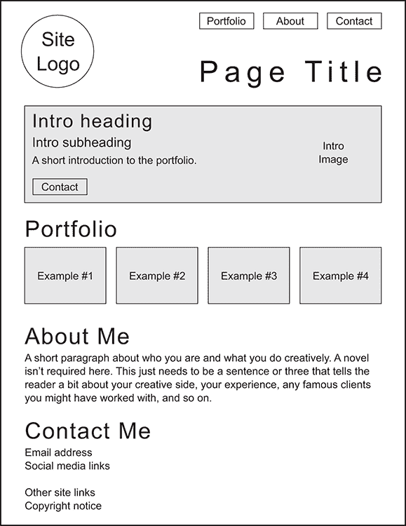

## 选择字体

尽管你的作品集本身由图像组成，但你的作品集页面包含相当数量的文本，包括标题和*正文*——非标题文本的大块，构成了你作品集大部分的文字。由于你的大部分观众将在笔记本电脑、平板电脑和智能手机的屏幕上阅读你的页面，因此提前花点时间选择在这些较小屏幕上可读和易读的字体是很重要的。

你可以访问 Google Fonts ([`fonts.google.com`](https://fonts.google.com))，查看一种字体，输入一些文本，然后观察结果以查看其外观如何以及阅读是否容易。但如果你想要更系统化一些，某些标准对于在小屏幕上渲染良好的字体是常见的。以下是在 Google Fonts（或你使用的任何字体提供商）上试听字体时需要寻找的四个方面，每个方面都在图 20.2 中得到了演示：

+   *大计数器* —*计数器*是字母如 *A*、*R*、*d* 和 *g* 内部的封闭负空间。大的计数器增强了字符的可读性。

+   *大开口* —*开口*是字母如 *C*、*S*、*a* 和 *e* 内部的部分封闭负空间。大的开口也增强了可读性。

+   *中等至大型 x 高度* —*x 高度*是从基线到小写字母如 *x* 和 *o* 的顶部，或者到有升笔（如 *d* 和 *h*）或降笔（如 *g* 和 *y*）的字母的碗顶的距离。一个合适的 x 高度（比如说，字体大小的一半或更多）通常会导致大的计数器和开口。

+   *低至中等笔画对比度* —极细的笔画在小屏幕上可能会丢失，使得文字难以阅读。寻找那些最细和最粗笔画之间差异最小的字体。

master

注意到字母如 *a* 和 *e* 既有计数器也有开口，这意味着较大的计数器意味着较小的开口，反之亦然。为了确保这些常用字符在屏幕上渲染良好，寻找一个 x 高度超过字体大小一半的字体。

你可以用单一字体来构建你的页面，但混合两种字体——一种用于标题，另一种用于正文文本——可以为页面增添活力和对比。我偏爱的使用方式是使用无衬线字体作为标题，有衬线字体作为正文文本，但在我这个项目的版本中，我将反转这些偏好。对于你自己的作品集页面，你可以自由地使用两种有衬线字体或两种无衬线字体。唯一需要考虑的标准是两种字体能够和谐搭配，这意味着它们具有相似的易读性特征：笔画、开口、x 高度和笔画对比。最后，确保你选择的每种字体都包含你需要的字体，这通常至少意味着常规、斜体和粗体字体。

图 20.2 在决定一种即使在小型显示器上也能良好渲染的字体时，寻找较大的笔画、开口、良好的 x 高度和低笔画对比。

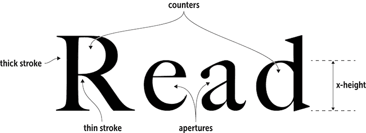

Google Fonts 提供了数百种字体，其中数十种即使在最小的屏幕上也能很好地工作。你如何选择？在网站上玩玩当然很有趣，但如果你需要一个起点，表 20.1 列出了六种正文和标题字体搭配，它们工作得很好（以及一个用于标题的替代无衬线字体）。

表 20.1 推荐的 Google Fonts 标题和正文字体搭配

| **标题** | **正文** | **正文（替代）** |
| --- | --- | --- |
| Playfair Display | Open Sans | Raleway |
| Merriweather | Fira Sans | Merriweather Sans |
| Source Serif Pro | Source Sans Pro | Lato |
| Domine | Roboto | Open Sans |
| Lora | Varela Round | Lato |
| Roboto Slab | Roboto | Raleway |

对于这个项目的标题，我将使用我最喜欢的文本字体之一：Playfair Display。这是一种非常漂亮的字体，提供了很好的大笔画和慷慨的 x 高度。它具有高笔画对比，但这不应该是我将要使用的较大标题大小的大问题。Playfair Display 有六种字体，因此它适合每一种场合。对于正文文本，我将使用 Open Sans，这是网络上最受欢迎的无衬线字体之一。它是一种坚固的字体，具有大笔画和 x 高度，以及最小的笔画对比。一个不太受欢迎但仍然出色的替代品是 Merriweather Sans，它是 Merriweather 的无衬线伴侣。

要使用 Google Fonts 链接到 Playfair Display 的粗体和粗体斜体字体，以及 Open Sans 的常规、斜体和粗体字体，我将使用以下 `<link>` 标签：

```
<link href="https://fonts.googleapis.com/css?family=Playfair+Display:700,700i|Open+Sans:400,400i,700" rel="stylesheet">

```

在我的 CSS 中，我将使用以下声明来指定这些字体族：

```
font-family: "Playfair Display", Georgia, serif;
font-family: "Open Sans", Verdana, sans-serif;

```

记住

虽然谷歌不太可能无法交付你的链接字体，但在字体显示之前可能会有延迟。为了确保浏览器在等待时不会显示默认的有衬线或无衬线字体，请将系统字体添加到你的堆栈中。Georgia（用于衬线字体）和 Verdana（用于无衬线字体）几乎安装在新电脑上。

在确定了页面布局并选择了字体之后，你的下一个任务是挑选一个配色方案。

## 选择配色方案

你选择的颜色取决于你想要突出的作品集类型以及你想要传达的整体形象。我将使用一个假设的书籍修复和修复服务的例子。我想使用散发出温暖感的颜色（因为足够喜欢旧书以至于想要修复的人往往都是温暖、温柔的人），以及安全感（因为这些人不想把他们的珍贵书籍交给任何人）。深棕色可以非常有效地设定这两种情感基调。使用 Web 设计游乐场的配色方案计算器（见[wdpg.io/colorcalc](http://wdpg.io/colorcalc)），我选择了一个基于颜色值`#77613c`的单色配色方案，如图 20.3 所示。

图 20.3 基于十六进制颜色值`#77613c`的单色配色方案

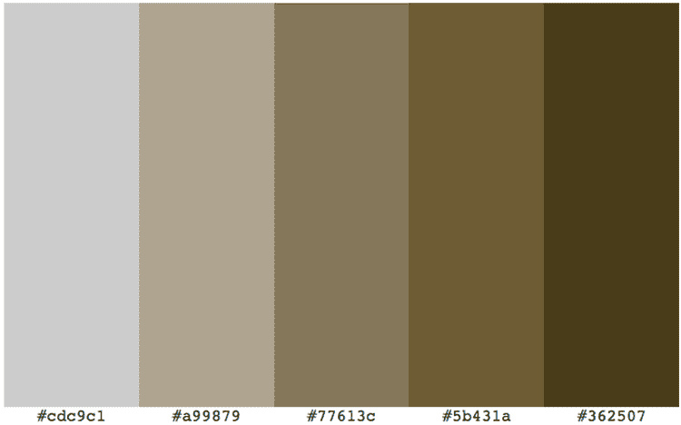

在确定了页面布局、选择了字体和颜色之后，现在是时候将这个草图翻译成精确的 HTML 和 CSS 代码了。

## 构建页面

要构建你的作品集页面，从我在第二章中介绍的基本代码开始，然后逐节添加文本、标签和属性。

### 初始结构

首先，从第二章的基本页面结构开始，添加作品集布局，使用 HTML5 语义页面布局标签：

+   页面页眉部分使用`header`元素，它包括三个项目：一个用于网站标志的`img`元素，一个使用`nav`元素并包含指向页面其他项目的链接的无序列表导航区域，以及一个用于页面标题的`h1`元素。

+   主要部分使用`main`元素，它由几个`section`元素组成，每个元素都是页面不同部分的容器。

+   页脚部分使用`footer`元素，它包括版权声明和链接到几个社交媒体网站。

#### 尝试这个

在线：[wdpg.io/projects/portfolio-page/01](http://wdpg.io/projects/portfolio-page/01)

这里是构成作品集页面初始 HTML 结构的元素。

#### 网页

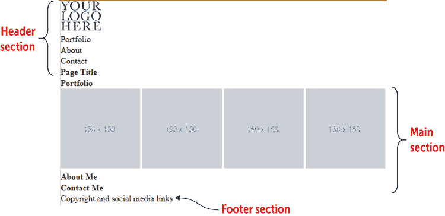

#### HTML

```
<header>    ① 
     ① 
 <nav>    ① 
 <ul>    ① 
 <li>Portfolio</li>    ① 
 <li>About</li>    ① 
 <li>Contact</li>    ① 
 </ul>    ① 
 <h1>Page Title</h1>    ① 
 </nav>    ① 
</header>    ① 
<main>>    ② 
 <section>>    ② 
 <h1>Portfolio</h1>>    ② 
 >    ② 
 >    ② 
 >    ② 
 >    ② 
 </section>>    ② 
 <section>>    ② 
 <h1>About Me</h1>>    ② 
 </section>>    ② 
 <section>>    ② 
 <h1>Contact Me</h1>>    ② 
 </section>>    ② 
</main>    ② 
<footer>    ③ 
 <p>Copyright and social media links</p>    ③ 
</footer>    ③ 
```

①  页眉部分

②  主要部分

③  页脚部分

记住

初始页面布局还包括一个 CSS 重置，它执行了多项任务，包括将边距和填充设置为 0，以及字体大小设置为 100%。

目前，作品集页面几乎是最简化的页面，但这种情况不会持续太久。我现在将转向构建页面的整体布局。

### 整体布局

如你所想，一个被称为“五个盒子”的布局显然需要一个基于 flexbox 的结构，这就是你在这里要添加的。你希望内容在浏览器窗口的中间对齐。为了完成这个任务，使用两个主要的 flexbox 容器来构建整体结构：

+   初始的 flexbox 容器将是`body`元素。通过使用`flex-direction: row`和`justify-content: center`配置此元素，你将创建一个单行容器，其中所有内容都水平居中。

+   对于内容本身，在`body`元素内部嵌套一个`div`元素。这个`div`是一个 flexbox 容器，具有`flex-direction: column`和`justify-content: flex-start`，这为你提供了一个单列容器，内容与容器的顶部对齐。

以下示例展示了如何设置一切。

#### 尝试此操作

在线：[wdpg.io/projects/portfolio-page/02](http://wdpg.io/projects/portfolio-page/02)

此示例展示了如何配置`body`元素和嵌套的`div`作为整个页面的 flexbox 容器。

#### CSS

```
body {
 display: flex;    ① 
 flex-direction: row;    ① 
 justify-content: center;    ① 
    min-height: 100vh;
    margin-top: 1rem;
 font-family: "Open Sans", Verdana, sans-serif; >    ② 
 background-color: #cdc9c1; >    ② 
 background-image: radial-gradient(circle farthest-side at center top, hsl(0, 0%, 100%) 0%, #cdc9c1 100%);>    ② 
 color: #362507;    ② 
}
.container {
 display: flex;    ③ 
 flex-direction: column;    ③ 
 justify-content: flex-start;    ③ 
 max-width: 60rem;    ④ 
}

```

①  设置主要的 flexbox 容器。

②  应用字体堆叠以及背景和文字颜色。

③  设置内容的嵌套 flexbox 容器。

④  为内容设置最大宽度。

#### HTML

```
<body>
    <div class="container">
    </div>
</body>

```

记住

Flexbox 现在几乎得到了所有浏览器的支持，因此为了保持代码的简洁和清晰，这里和 Playground 上的代码没有包含任何供应商前缀。如果你需要支持旧浏览器，请使用 Autoprefixer ([`autoprefixer.github.io`](https://autoprefixer.github.io))来生成前缀。

### 标题部分

标题部分由一个包含三个项目的`header`元素组成：一个用于页面标志的`img`元素，一个用于导航链接的`nav`元素，以及一个用于页面标题的`h1`元素。我还希望标题具有以下功能：

+   页面标志应与内容容器的左侧对齐，导航和标题应与内容容器的右侧对齐。

+   所有标题内容应在标题内垂直居中。

最简单的方法是使用 flexbox，因此将`header`元素配置为 flexbox 容器，具有水平主轴和`align-items`设置为`center`。对于水平对齐，使用`div`元素将标题分为左侧和右侧部分。

以下示例展示了我所使用的 HTML 和 CSS 代码，以实现这些目标并对剩余的标题布局进行样式设计。

#### 尝试此操作

在线：[wdpg.io/projects/portfolio-page/03](http://wdpg.io/projects/portfolio-page/03)

此示例添加了标题的 HTML 代码和标题结构的 CSS 代码。

#### 网页

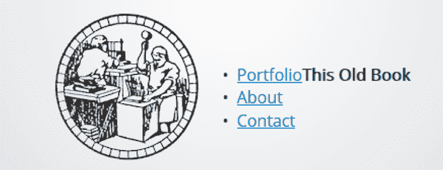

#### CSS

```
header {
 display: flex;    ① 
 justify-content: center;    ① 
 align-items: center;    ① 
    padding: .5rem 0;
    width: 100%;
}
.header-left {
 flex: 1 0 33%;    ② 
    text-align: left;
}
.header-right {
 flex: 2 0 67%;    ② 
 display: flex;    ③ 
 flex-wrap: wrap;    ③ 
 justify-content: flex-end;    ③ 
}
```

①  标题是一个 flexbox 容器。

②  左侧标题占三分之一的宽度；右侧占三分之二。

③  右侧的标题是一个 flexbox 容器。

#### HTML

```
<header>
 <div class="header-left">    ④ 
     ④ 
 </div>    ④ 
 <div class="header-right">    ⑤ 
 <nav>    ⑤ 
 <ul>    ⑤ 
 <li><a href="#portfolio" class="btn">Portfolio</a></li>  ⑤ 
 <li><a href="#about" class="btn">About</a></li>    ⑤ 
 <li><a href="#contact" class="btn">Contact</a></li>    ⑤ 
 </ul>    ⑤ 
 </nav>    ⑤ 
 <h1>This Old Book</h1>    ⑤ 
 </div>    ⑤ 
</header>
```

④  标题的左侧

⑤  标题的右侧

在设置好标题结构之后，你可以着手调整标题元素的样式。标志保持原样即可，但你需要将导航链接转换为合适的按钮，并对页面标题进行样式设计。以下示例展示了我所使用的 HTML 和 CSS 代码。

#### 尝试此操作

在线：[wdpg.io/projects/portfolio-page/04](http://wdpg.io/projects/portfolio-page/04)

此示例样式化了标题元素。

#### 网页

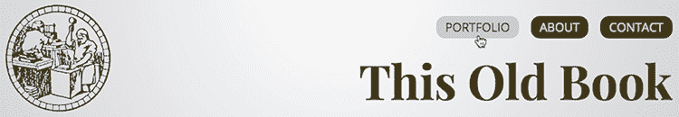

#### CSS

```
h1 {    ① 
 padding-top: 1rem;    ① 
}    ① 
.btn {    ② 
 background-color: #362507;    ② 
 padding: .25rem .75rem;    ② 
 border-radius: .75rem;    ② 
 font-size: 1rem;    ② 
 color: #cdc9c1;    ② 
 text-transform: uppercase;    ② 
}    ② 
nav ul {    ③ 
 display: flex;    ③ 
 list-style-type: none;    ③ 
}    ③ 
nav li {    ③ 
 padding-left: 1rem;    ③ 
}    ③ 
a {    ④ 
 text-decoration: none;    ④ 
}    ④ 
a:hover {    ④ 
 color: #362507;    ④ 
 background-color: #cdc9c1;    ④ 
}    ④ 
h1 {    ⑤ 
 font-size: 4rem;    ⑤ 
 font-weight: bold;    ⑤ 
 font-family: "Playfair Display", Georgia, serif;    ⑤ 
}    ⑤ 
```

①  `h1`元素添加了一些填充。

②  此类将导航项转换为合适的按钮。

③  此 CSS 样式用于导航项列表。

④  此 CSS 样式用于链接（常规和悬停状态）。

⑤  此 CSS 样式用于页面标题。

特别需要注意的是`btn`类，您之前在`nav`部分的`<a>`标签中看到过它。每个`a`元素都是一个项目符号列表项，`btn`类的目的是将每个`li`元素（链接文本）的内容转换为合适的按钮。以下是`btn`类所做的工作：

+   它添加了背景颜色。

+   它在文本周围添加了填充。

+   它使用`border-radius`属性来使角落圆润。

+   它设置字体大小和颜色，并将文本转换为大写。

精通

`border-radius`属性使元素的角落圆润。您可以指定一个测量值（值越高，角落越圆润），或者您可以输入一个百分比（例如，50%的值将边框圆润成圆形）。

### 章节介绍

章节介绍的作用是通过提供您所做创意工作的快速概述，将读者引入您的页面。它应该有一个标题，也许还有一个副标题，一个简短的段落，以及一个链接到您的联系部分。

在以下示例中，我使用深棕色文本（`#362507`）、`h2`标题、`h3`副标题、一个可点击的按钮以及一个相关的图像来装饰页面介绍，以保持一切整洁有序。为了使一切看起来都很整洁，我设置了一个名为`intro`的类作为 flexbox 容器。

#### 尝试这个

在线：[wdpg.io/projects/portfolio-page/05](http://wdpg.io/projects/portfolio-page/05)

此示例向作品集页面添加了介绍。

#### 网页

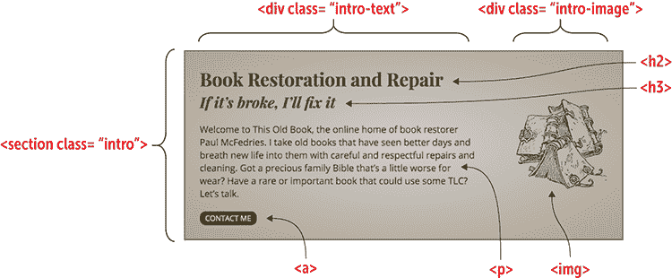

#### CSS

```
.intro {    ① 
 display: flex;    ① 
 align-items: center;    ① 
 margin: 2rem 0;    ① 
 width: 100%;    ① 
 border: 3px solid #77613c;    ① 
 color: #362507;    ① 
 font-size: 1.25rem;    ① 
 background-color: #a99879;    ① 
 background-image: radial-gradient(ellipse closest-corner at center,    ① 
#cdc9c1 0%, #a99879 100%);    ① 
}    ① 
.intro-text {    ② 
 flex: 2 0 67%;    ② 
 padding: 2rem 0 2rem 2rem;    ② 
}    ② 
.intro-text p {    ② 
 margin: 1.5rem 0;    ② 
}    ② 
.intro-image {    ③ 
 flex: 1 0 33%;    ③ 
 padding-right: 2rem;    ③ 
 text-align: right;    ③ 
}    ③ 
h2 {    ④ 
 font-size: 2.5rem;    ④ 
}    ④ 
h3 {    ④ 
 font-size: 2rem;    ④ 
 font-style: italic;    ④ 
}    ④ 
h2, h3 {    ④ 
 font-family: "Playfair Display", Georgia, serif;    ④ 
}    ④ 
```

①  `intro`类的 CSS 样式

②  `intro-text`类的 CSS 样式

③  `intro-image`类的 CSS 样式

④  标题的 CSS 样式

#### HTML

```
<main>
    <section class="intro">
        <div class="intro-text">
            <h2>Book Restoration and Repair</h2>
            <h3>If it’s broke, I’ll fix it</h3>
            <p>Welcome to This Old Book, the online home of book restorer Paul McFedries. I take old books that have seen better days and breath new life into them with careful and respectful repairs and cleaning. Got a precious family Bible that’s a little worse for wear? Have a rare or important book that could use some TLC? Let’s talk.
            </p>
            <div>
                <a href="#contact" class="btn">Contact Me</a>
            </div>
        </div>
        <div class="intro-image">
            
        </div>
    </section>
</main>

```

### 章节集

接下来是页面的真正内容，即您的作品集——一系列展示您作品的图片。在决定展示多少内容时，您有三个选择：

+   *展示您所有的作品。* 如果您的作品集很小，这个选项是最佳选择。如果您有一个庞大的作品集，您可以展示它，但可能更好的做法是只展示一部分，然后链接到另一个页面，展示所有内容。

+   *展示您最新的作品。* 如果您认为您最新的作品特别出色，或者您的风格最近有所改变，或者您获得了知名客户，这个选项是个不错的选择。

+   *展示您最好的作品。* 如果您想真正展示您能做什么，请选择这条路线。

一个典型的作品集通常有一到三行，每行有两到四张图像。你可能会想在作品集之前加上一个标题，也许是一两句话作为引入。作品集本身应该配置为 flexbox 容器，以使一切看起来整洁。以下示例显示了我在我的作品集页面上是如何做到这一点的。

#### 尝试这个

在线：[wdpg.io/projects/portfolio-page/06](http://wdpg.io/projects/portfolio-page/06)

此示例将作品集添加到页面中。

#### 网页

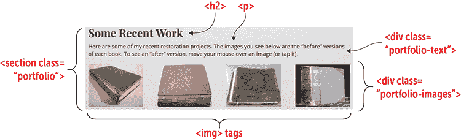

#### CSS

```
.portfolio {
    margin-bottom: 1rem;
}
.portfolio-text p {
    margin: .5rem 0 1.5rem; 
    font-size: 1.25rem;
}
.portfolio-images {    ① 
 display: flex;    ① 
 justify-content: space-between;    ① 
}    ① 
.portfolio-image {
    position: relative;
    cursor: pointer;
    margin-bottom: 1rem;
}
```

①  作品集图像位于一个 flexbox 容器中。

#### HTML

```
<section class="portfolio" id="portfolio">    ② 
 <div class="portfolio-text">    ③ 
        <h2>Some Recent Work</h2>
        <p>Here are some of my recent restoration projects. The images you see below are the “before” versions of each book. To see an “after” version, move your mouse over an image (or tap it).</p>
    </div>
 <div class="portfolio-images">    ④ 
        <div class="portfolio-image">
            
            
        </div>
        <div class="portfolio-image">
            
            
        </div>
        <div class="portfolio-image">
            
            
        </div>
        <div class="portfolio-image">
            
            
        </div>
    </div>
</section>
```

②  作品集容器是一个具有 `portfolio` 类和 id 的 `portfolio` 元素。

③  作品集文本容器是一个具有 `portfolio-text` 类的 `div` 元素。

④  作品集图像容器是一个具有 `portfolio-images` 类的 `div` 元素。

作品集内容位于一个我分配了 `portfolio` 类的 `section` 标签中。注意，我还分配了 id `portfolio`，这设置了此 `section` 元素作为之前看到的标题导航链接的目标。

作品集文本位于一个具有 `portfolio-text` 类的 `div` 中。它包括一个 `h2` 标题和一个用于引入句子的 `p` 元素。

作品集图像位于一个具有 `portfolio-images` 类的 `div` 中。它由几个 `div` 元素（具有 `portfolio-image` 类）组成。对于大多数作品集，你只需要在每个这些 `div` 元素中包含一个 `img` 元素。然而，在我的项目中，我想展示前后图像，后者在用户将鼠标悬停在图像上（或在便携设备上轻触图像）时出现。为了做到这一点，我添加了一个具有 `image-overlay` 类的第二个 `img` 元素。以下是该类的 CSS：

使用它

在你的作品集中拥有前后图像的想法对许多创意追求都很有用，包括家具维修、艺术修复、健身训练、发型设计和室内装饰。

```
.image-overlay {
  position: absolute;
  left: 0;
  top: 0;
  width: 200px;
  height: 156px;
  z-index: 1;
  opacity: 0;
  transition: opacity 1.5s ease;
}
.image-overlay:hover {
  opacity: 1;
}

```

该覆盖层使用与之前图像相同的尺寸，并且相对于 `div` 元素（具有 `portfolio-image` 类，它使用相对定位为后续图像设置定位上下文）绝对定位在左上角。覆盖层被赋予 `z-index` 值为 `1` 以确保它出现在之前图像之上，并且被赋予 `opacity` 值为 `0` 以防止它在页面首次加载时出现。然后 `hover` 事件将 `opacity` 值更改为 `1` 以使图像出现。`image-overlay` 类中的 `transition` 属性动画化覆盖层的出现。

### 关于部分

作品集页面的下一个元素是关于部分，你可以用它以任何你觉得舒服的方式吹嘘自己。你可以谈论你的教育、工作经验、任命、奖项等等。使用任何有效的方法为你的作品集提供说服潜在客户、雇主或赞助商你有他们寻找的创意技能的凭证。

关于部分很简单：一个标题后跟一段自我吹嘘的文本。以下是一个示例。

#### 尝试这个

在线：[wdpg.io/projects/portfolio-page/07](http://wdpg.io/projects/portfolio-page/07)

此示例将关于部分添加到投资组合页面。

#### 网页

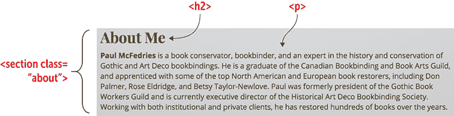

#### CSS

```
.about {    ① 
 margin-bottom: 1rem;    ① 
}    ① 
.about-text p {    ① 
 margin: .5rem 0 1.5rem;    ① 
 font-size: 1.25rem;    ① 
}    ① 

```

① 关于部分的 CSS

#### HTML

```
<section class="about" id="about">    ② 
 <div class="about-text">    ③ 
        <h2>About Me</h2>
        <p><b>Paul McFedries</b> is a book conservator, bookbinder, and an expert in the history and conservation of Gothic and Art Deco bookbindings. He is a graduate of the Canadian Bookbinding and Book Arts Guild, and apprenticed with some of the top North American and European book restorers, including Don Palmer, Rose Eldridge, and Betsy Taylor-Newlove. Paul was formerly president of the Gothic Book Workers Guild and is currently executive director of the Historical Art Deco Bookbinding Society. Working with both institutional and private clients, he has restored hundreds of books over the years.
        </p>
    </div>
</section>
```

② 关于容器是一个具有类和 id about 的章节元素。

③ 关于文本容器是一个具有类 about-text 的 div 元素。

关于内容使用带有`about`类的`section`元素。我还分配了 id `about`，这使该元素成为页眉中关于导航链接的目标。

### 联系部分

投资组合页面主要部分的最后一个重要元素是联系部分，这是你提供给感兴趣访客一种或多种联系方式的地方。至少，你应该提供一个电子邮件地址，但你几乎总是想包括一个或多个指向你的社交媒体个人资料的链接。

常见问题解答

*我能否让人们通过表单联系我？* 表单是一种获取消息的好方法，但对于大多数新网页设计师来说并不理想，因为它需要脚本处理表单数据。然而，网络上的某些服务不仅允许你构建表单，还能为你处理数据。查看 TypeForm ([`www.typeform.com`](https://www.typeform.com)) 和 Wufoo ([`www.wufoo.com`](https://www.wufoo.com))。

联系部分很简单：一个标题，一个引言段落，以及你的电子邮件地址和社交媒体链接。以下是一个示例。

#### 尝试这个

在线：[wdpg.io/projects/portfolio-page/08](http://wdpg.io/projects/portfolio-page/08)

此示例将联系部分添加到投资组合页面。

#### 网页

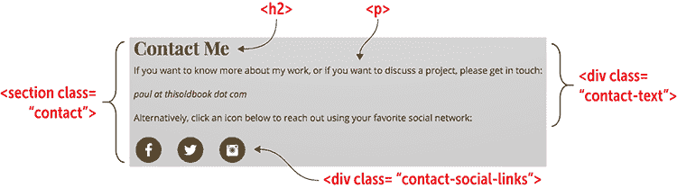

#### CSS

```
.contact {    ① 
 margin-bottom: 1rem;    ① 
}    ① 
.contact-text p {    ① 
 margin: .5rem 0 1.5rem;    ① 
 font-size: 1.25rem;    ① 
}    ① 
.contact-social-links a {    ① 
 margin-right: 1.5em;    ① 
}    ① 
```

① 联系部分的 CSS

#### HTML

```
<section class="contact" id="contact">    ② 
 <div class="contact-text">    ③ 
        <h2>Contact Me</h2>
        <p>If you want to know more about my work, or if you want to discuss a project, please get in touch:</p>
        <p><i>paul at thisoldbook dot com</i></p>
        <p>Alternatively, click an icon below to reach out using your favorite social network:</p>
    </div>
 <div class="contact-social-links">    ④ 
        <a href="#" class="contact-social-link"></a>
        <a href="#" class="contact-social-link"></a>
        <a href="#" class="contact-social-link"></a>
    </div>
</section>
```

② 联系容器是一个具有类和 id contact 的章节元素。

③ 联系文本容器是一个具有类 contact-text 的 div 元素。

④ 联系社交媒体容器是一个具有类 contact-social-links 的 div 元素。

记住

当你在联系部分添加你的电子邮件地址时，确保不要以纯文本形式显示地址，以免地址被垃圾邮件收集者捕获。相反，以一种欺骗垃圾邮件收集者机器人但仍然对人类来说容易解码的方式混淆地址。

联系内容使用带有`contact`类的`section`标签，并将`id`值设置为`contact`，这使得该元素可以作为页眉中联系按钮和投资组合介绍中“联系我”按钮的锚点。

### 页面页脚

投资组合页面的最后一个元素是页脚。正如以下示例所示，我使用了页脚来显示版权声明以及指向网站其他部分的链接。

#### 尝试这个

在线：[wdpg.io/projects/portfolio-page/09](http://wdpg.io/projects/portfolio-page/09)

此示例将页脚添加到投资组合页面。

#### 网页

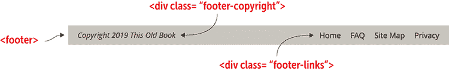

#### CSS

```
footer {    ① 
 display: flex;    ① 
 padding: 1em 0;    ① 
 border-top: 1px solid #a99879;    ① 
}    ① 
.footer-copyright {
    flex: 1 0 50%;
    text-align: left;
    font-style: italic;
    font-size: 1.25em;
}
.footer-links {
    flex: 1 0 50%;
    text-align: right;
    font-size: 1.25em;
}
.footer-links a {
    color: #362507;
    margin-left: 1em;
}

```

①  页脚被设置为 flexbox 容器。

#### HTML

```
<footer>
 <div class="footer-copyright">    ② 
        Copyright 2019 This Old Book
    </div>
 <div class="footer-links">    ③ 
        <a href="#">Home</a>
        <a href="#">FAQ</a>
        <a href="#">Site Map</a>
        <a href="#">Privacy</a>
    </div>
</footer>
```

②  页脚版权声明是一个具有 class footer-copyright 的 div 元素。

③  页脚网站链接容器是一个具有 class footer-links 的 div 元素。

页脚内容使用了一个配置为 flexbox 容器的`footer`元素。版权声明（具有 class `footer-copyright`）是一个向左对齐的 flexbox 项目，而网站链接（具有 class `footer-links`）是一个向右对齐的 flexbox 项目。

小心

当添加版权声明时，不要同时添加“版权”一词和版权符号（©），因为这会显得重复。使用其中一个即可，但不要同时使用两个。

## 从这里开始

资料页的最终版本（我的在图 20.4 中展示）为宣传你的创意作品提供了一个坚实的基础。

图 20.4 一个准备上网的资料页

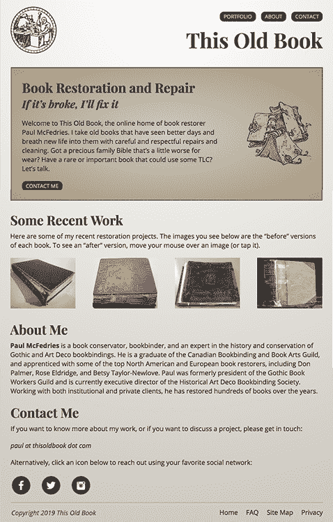

资料页最大的不足是响应性。在桌面网络浏览器中看起来不错，甚至在某些平板电脑的横屏模式下也如此，但在小屏幕上设计会破裂。我将留给你一个练习，添加媒体查询断点（见第十三章），以帮助页面在小到智能手机的屏幕上看起来都很好。

这是本书的最后一章，但这并不意味着它是你网页设计教育的终结。远非如此。请务必访问 Web 设计游乐场([`webdesignplayground.io/`](https://webdesignplayground.io/))，那里有大量的示例、练习和教程，可以帮助你磨练技能并扩展知识。在那里见！

## 摘要

+   绘制你想要构建的页面草图。

+   选择标题和正文文本的字体系列。

+   选择一个配色方案。

+   构建初始页面结构：基本的 HTML 标签和应用于`body`元素的全球 CSS 属性。

+   设置你的主要 flexbox 容器。

+   逐个填充和设计每个部分：页眉、资料介绍、资料本身、关于部分、联系部分，以及页脚。
