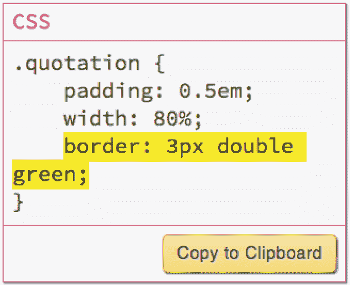
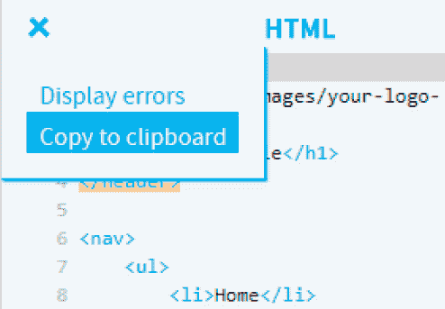
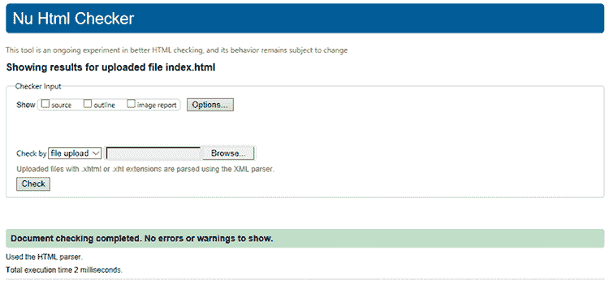
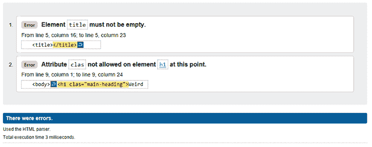
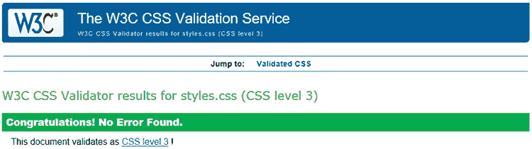
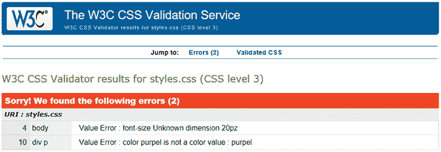

# 第 章 从操场到网络：将您的页面上线

> 当网络这样的创造性媒介如此之有创意时，其限制就是我们的想象力。*—蒂姆·伯纳斯-李*

**本附录涵盖**

+   从网页设计操场下载页面文件

+   验证 HTML 和 CSS 语法

+   理解和选择网络托管服务

+   将页面文件上传到您的网络主机

您在这本书中已经覆盖了很多内容，毫无疑问，您已经用电子版的“唾沫和抛光”来打磨您的网站页面，使其呈现出令人印象深刻的光泽。但在您可以将“制作网站”从待办事项清单中划掉之前，您需要执行几个相关的任务：为您的网站找到一个网络家园，并将您的网站文件移动到那个新家。本附录将帮助您完成这两个任务。首先，您将学习如何在网络上找到一个位置，让朋友、家人，甚至来自遥远角落的陌生人都能看到您的作品。然后，您将学习如何将您的网页从其原生地（网页设计操场或您的硬盘）迁移到新世界（网络）。您将学习如何最好地准备您的页面以进行旅行，选择一种运输方式，并在到达后安顿下来。

## 从这里到那里：保存您的操场工作

如果您一直在使用网页设计操场进行一些实验，甚至建立了一些沙盒（我在操场项目上使用的名称），下一步就是将您的代码从操场复制到您的计算机。您有两种方法可以做到这一点：复制代码和下载代码。首先，我将向您展示如何从操场复制代码。

### 复制操场代码

网页设计操场充满了 HTML 和 CSS 代码：它在课程页面中，它在 HTML 编辑器中，它在 CSS 编辑器中。将代码复制到您计算机的一种方法是从这些操场位置之一复制它。当您这样做之后，您可以使用您最喜欢的文本编辑器将代码粘贴到现有文件中。

网页设计操场提供了三种复制代码的方法：

+   *在课程中* —当课程页面提供 HTML 或 CSS 代码片段时，您会在代码下方看到一个“复制到剪贴板”按钮，如图 A.1 所示。点击该按钮将代码复制到您的计算机剪贴板（用于存储最近复制或剪切的数据的内存区域）。

图 A.1 要从操场课程中的 HTML 或 CSS 代码片段中复制代码，请点击“复制到剪贴板”按钮。

+   *在 HTML 编辑器中* —HTML 编辑器包含当前课程的 HTML 代码、您已修改的现有 HTML 代码，或者您添加到沙盒中的自定义 HTML 代码。无论来源如何，您都可以通过点击 HTML 编辑器左上角的面板图标，然后点击“复制到剪贴板”，如图 A.2 所示。这一步会将完整的 HTML 代码复制到您的计算机剪贴板中。

图 A.2 要从 HTML 编辑器复制代码，点击编辑器的菜单图标，然后点击复制到剪贴板。

+   *在 CSS 编辑器中* —CSS 编辑器包含当前课程的 CSS 代码、你已修改的现有 CSS 代码，或者添加到沙盒中的自定义 CSS 代码。要将这些 CSS 代码放入计算机的内存中，请点击 CSS 编辑器左上角的菜单图标，然后点击复制到剪贴板，如图 A.3 所示。此步骤将完整的 CSS 代码复制到计算机的剪贴板中。

图 A.3 要从 CSS 编辑器复制代码，点击编辑器的菜单图标，然后点击复制到剪贴板。

当你运行复制到剪贴板命令后，在文本编辑器中打开你的 HTML 或 CSS 文件，将插入点定位到你想要复制代码出现的位置，然后运行文本编辑器的粘贴剪贴板数据命令。在大多数编辑器中，你通过选择编辑 > 粘贴或按 Ctrl+V（Windows）或 Cmd+V（Mac）来实现。

### 下载游乐场代码

与复制粘贴 HTML 或 CSS 代码片段相比，你可能更喜欢获取 HTML 和 CSS 编辑器的全部内容。如果你想从特定课程中获取所有代码，或者你创建了一个沙盒并填充了自定义 HTML 和 CSS 代码，这就是你要走的路。

这里是你要遵循的步骤：

1.  在网页设计游乐场中，打开包含你想要代码的课程，或者创建一个包含自定义代码的沙盒。

1.  选择菜单 > 下载代码。

    游乐场将代码收集到一个 zip 存档文件中，并告诉你的网络浏览器下载该文件。

1.  定位下载的文件，文件名为 webdesign.zip。

1.  双击 webdesign.zip 存档以打开它。

    在出现的文件夹中，你看到两个文件：

    +   `index.html`—此文件包含一个基本的 HTML 页面结构，其中 HTML 编辑器的内容插入在`<body>`和`</body>`标签之间。它还包括在`<head>`部分中引用`styles.css`文件的`link`元素。

    +   `styles.css`—此文件包含 CSS 编辑器的内容。

1.  将这些文件复制或移动到存储你其余网页文件（如页面图像文件）的文件夹中。

现在你已经将游乐场的代码安全地存储在 Mac 或 PC 上，你差不多准备好将这段代码放到网上。然而，在这样做之前，你需要完成一些额外的任务来使你的文件准备好上传到网络。这个待办事项列表的第一项是在你的计算机上设置网页文件夹。

## 设置您的文件夹

当你注册一个家庭存储你的网页文件时（参见附录后面的“获取网络主机”），你将获得自己的文件夹来存储服务器上的文件。这个文件夹被称为你的网站*根*文件夹。你现在需要问自己一个看似简单的问题：我需要在根文件夹内创建一个或多个子文件夹吗？

我在这里使用“显然”这个词，因为并不总是清楚您是否需要子文件夹。检查可能的情况：

+   *包含单个文件的单一网络项目* —最简单的网络项目是由单个 HTML 文件组成。该文件只包含文本、HTML 标签、内联或内部样式表（即在``标签之间）插入的 CSS 样式，以及使用远程引用（即指向其他网站上文件的引用）的媒体（如图像）。在这种情况下，您可以将该文件存储在根文件夹中，并且不需要任何子文件夹。

+   *包含少量文件的单一网络项目* —大多数简单或初级的网络项目只包含几个文件：一个 HTML 文件、一个 CSS 文件和一个或多个图像文件。在这种情况下，使用子文件夹几乎肯定是不必要的，因此您应该将所有文件存储在根文件夹中。

+   *包含大量文件的单一网络项目* —大型项目拥有多个 HTML 文件、几个 CSS 文件以及大量的媒体文件，尤其是图像，这种情况并不罕见。在这种情况下，将所有 HTML 文件放在根文件夹中是可以的，但为了保持整洁，您应该为其他类型的文件（如 CSS、图像等）创建单独的子文件夹。

+   *多个网络项目* —如果您稍微涉足网页设计，您会发现您不能只创建一个项目。多个项目是常态，在这种情况下，您应该通过将每个项目存储在其自己的子文件夹中来保持项目分离。如果某个项目很大，您可能需要创建子子文件夹来存储项目的各种文件类型（CSS、图像、媒体等）。

为什么现在要担心这些？如果您在注册了网络主机后，将您电脑的本地文件夹结构设置为与您远程设置的相匹配，那么您的网页设计生活将变得无比轻松和高效：

1.  首先，指定一个本地文件夹作为您网页文件的存储区域。

    该文件夹将是您在网络上主机根文件夹的本地等效文件夹。

1.  如果您将从事多个网络项目，为每个项目设置一个子文件夹。

1.  如果项目足够大，需要为某些文件类型创建子文件夹，请在项目文件夹内创建这些子文件夹。

1.  当您从游乐场下载文件（如前文所述），或者当您创建自己的 HTML、CSS 或图像文件并首次保存时，请确保将它们存储在适当的文件夹中。

完成所有这些后，您的下一个任务是确保您的代码通过验证。

## 验证您的代码

你在这本书中看到，尽管 HTML 标签和 CSS 属性并不复杂，但它们可能会有些挑剔。如果你忘记了一个闭合标签或大括号，遗漏了一个引号或逗号，或者拼写了一个标签或属性名错误，那么你的网页很可能无法正确渲染。在某些情况下，错误是明显的（例如，页面什么也不显示），但很多时候，错误是微妙的，难以察觉。

无论哪种方式，你都不希望向公众展示一个充满错误的页面，因此除了仔细检查你的 HTML 和 CSS 代码外，你还可以通过将代码提交到可用的验证服务之一来在线获得一些帮助。

### 验证 HTML

万维网联盟（W3C）托管了一个标记验证服务，可以检查你的 HTML 代码并告诉你是否包含任何错误或警告。以下是使用方法：

记住

另一种运行验证的方法是复制你的 HTML 代码从你的文本编辑器，选择“通过直接输入验证”选项卡，将你的 HTML 代码粘贴到文本框中，然后点击检查。

1.  使用网络浏览器访问 https://validator.w3.org。

1.  点击“通过文件上传验证”选项卡。

1.  点击浏览（Windows）或选择文件（Mac）。

    网站会提示你选择要验证的文件。

1.  定位并选择你想要检查的 HTML 文件；然后点击打开。

    网站上传文件。

1.  点击检查。

    标记验证服务检查 HTML 代码并显示结果。

    理想情况下，你会看到“没有错误或警告显示”的消息，如图 A.4 所示。

图 A.4 HTML 验证幸福：`没有错误或警告显示`。

如果你的 HTML 文件未通过验证，你会看到一个或多个错误或警告消息，如图 A.5 所示。

图 A.5 HTML 验证痛苦：`存在错误`。

### 验证 CSS

W3C 还提供 CSS 验证服务，它可以浏览你的 CSS 代码，并提醒你任何错误或警告。以下是使用方法：

记住

另一种 CSS 验证方法是复制你的 CSS 代码从你的文本编辑器，选择“通过直接输入”选项卡，将你的 CSS 代码粘贴到文本框中，然后点击检查。

1.  使用网络浏览器访问 https://jigsaw.w3.org/css-validator。

1.  点击“通过文件上传”选项卡。

1.  点击浏览（Windows）或选择文件（Mac）。

    网站会提示你选择要验证的文件。

1.  定位并选择你想要检查的 CSS 文件；然后点击打开。

    网站上传文件。

1.  点击检查。

    CSS 验证服务检查 CSS 代码并显示结果。

    理想情况下，你会看到“未发现错误”的消息，如图 A.6 所示。

图 A.6 CSS 验证喜悦：`恭喜！未发现错误`。

如果你的 CSS 文件包含无效数据，则该服务会返回一个或多个错误或警告，如图 A.7 所示。

图 A.7 CSS 验证错误：`我们发现以下错误`。

当你修复了代码中的所有错误后，你的 HTML 和 CSS 文件就准备好进入网络的黄金时期。不过，首先你需要找到一个放置这些文件的地方。简而言之，你需要找到一个网络主机。

## 获取网络主机

在第一章中，你了解到网页存储在一种称为 *web 服务器* 的特殊计算机上，它接受并响应对网页及其相关文件的网页浏览器请求。在其他人可以查看你的网络项目之前，你需要将其文件放在网络服务器上。为此，你需要注册一个提供其服务器空间的服务。因为该服务实际上充当了你的文件的主机，所以这样的服务被称为 *网络托管提供商*，或简称 *网络主机*。

当你评估一个网络主机时，你应该使用什么标准？答案取决于你想要设置的网站类型，但以下标准是最常见的：

+   *最大带宽* —每月主机将传输到网页浏览器中的数据量上限。在大多数情况下，超出每月最大数据量的数据需要额外付费。一些网络主机提供无限带宽。

+   *总磁盘空间* —你在网络服务器上获得的硬盘存储空间。至少，总磁盘空间通常是几百兆字节，这对于一个简单的网站来说已经足够了。

+   *网站数量* —你可以设置的根文件夹数量。

+   *电子邮件地址数量* —包含在托管服务中的电子邮件地址数量。

+   *域名主机* —网络主机是否也托管你之前从域名注册商那里购买的域名。一些主机销售域名，而另一些则提供形式为 *yourdomain*.*webhostdomain*.com 的免费子域名。

+   *FTP 支持* —对文件传输协议的支持，这是你用来将文件传输到网络主机的互联网服务。几乎所有的网络主机都支持 FTP，但一些只提供专有文件传输服务。

通常情况下，网络主机越便宜，你获得这些功能就越少。在你开始寻找网络主机之前，列出这些功能并决定你需要什么以及什么是可以选择的。对于像最大带宽这样的东西，这可能现在很难决定，因为带宽部分取决于你的网站有多受欢迎，但你现在可以尽力为每个功能做出最佳猜测。

当你在寻找网络主机时，你有三种主要选择：

+   *你的互联网服务提供商(ISP)* —你用来访问互联网的公司或机构也可能提供网络托管服务。许多 ISP 为简单的个人网站提供免费网络托管，一些组织网络包括你可以使用的网络服务器。在大多数情况下，托管包括带宽和磁盘空间等低端功能。

+   *免费网络托管提供商* —许多服务将免费托管您的网页。但是，您通常对大多数托管功能有相当严重的限制，尤其是带宽和磁盘空间，并且您几乎总是只有一个网站。一些免费网络托管商也会显示广告，尽管现在这种情况越来越少了。

+   *商业网络托管提供商* —如果您想为您的网络存在获得合理的一组功能，您需要向商业网络托管提供商支付费用以租用空间。请注意，我并不是在谈论大笔的钱。像 Bluehost（https://www.bluehost.com）、GoDaddy（https://www.godaddy.com）和 HostGator（http://www.hostgator.com）这样的流行提供商通常每月提供功能齐全的托管服务，价格低于 5 美元。如果您认为您将涉足网页设计，而不仅仅是创建一个基本的家庭页面，那么您绝对应该考虑使用商业网络主机。

当您注册了网络托管商后，通常需要几分钟到几小时的时间才能准备就绪。当您的托管服务准备就绪时，那么就是时候将您的文件上线了。

## 上传您的文件

当您的 HTML 和 CSS 文件编码并验证后，您的支持文件（如图片）已就绪，您的文件夹已设置，您的网络托管商准备将您的文件提供给等待的世界时，剩下的就是将您的文件从您的计算机发送到网络托管商的服务器——这个过程称为*上传*。

您上传文件的方式取决于您的网络托管商，但以下三种方法是迄今为止最常用的：

+   *FTP* —大多数托管商提供对 FTP 上传的支持。首先，您需要为自己获取一个*FTP 客户端*，这是一个软件程序，可以连接到您的网络托管商的 FTP 服务器，并提供一个用于基本文件任务（如导航和创建文件夹、上传文件以及删除和重命名文件）的界面。流行的 Windows 客户端有 CuteFTP（https://www.globalscape.com/cuteftp）和 CyberDuck（https://cyberduck.io）。对于 Mac，请尝试 Transmit（https://panic.com/transmit）或 FileZilla（https://filezilla-project.org）。下载软件后，请查看您的网络托管商的支持页面，获取有关如何连接到主机 FTP 服务器的信息。

+   *cPanel* —许多网络托管商提供一种名为 cPanel 的管理工具，它提供了一个简单的界面来处理诸如电子邮件和域名管理之类的托管任务。cPanel 还提供了一个文件管理器组件，您可以使用它上传文件并执行其他文件管理任务。

+   *专有* —一些网络托管商提供他们自己的界面来上传和处理文件。请参阅您的主机支持页面以获取说明。

无论哪种方法可用，都将所有网站文件和文件夹上传到您的主机根目录。然后，将您的网站加载到您最喜欢的网络浏览器中，以确保一切正常工作。尝试在几个不同的浏览器和设备上测试您的网站，以确保它对广泛的用户都能正常工作。欢迎来到网络世界！

## 选择文本编辑器

您可以使用网页设计游乐场来实验和玩转 HTML 和 CSS，但到了认真对待代码的时候，您会想在电脑上编辑它。为此，您需要一个文本编辑器，最好是专为网络编码设计的编辑器。这样的编辑器包含诸如语法高亮（为便于阅读，将某些语法元素着色）、行号、代码补全（当您开始输入时，编辑器会显示一个可能的代码项列表，以完成您的输入）、文本处理（如自动缩进代码块、将制表符转换为空格及其相反、左右移动代码块、删除行尾不必要的空格、隐藏代码块）等功能。

在这里，按字母顺序列出了一些提供所有这些功能（通常还有更多）的编辑器：

+   *Atom* —适用于 Windows 和 Mac。免费！https://atom.io

+   *Brackets* —适用于 Windows 和 Mac。也免费！http://brackets.io

+   *Coda* —适用于 Mac，售价 99 美元，但提供免费试用。www.panic.com/coda

+   *Notepad++—*仅适用于 Windows。另一个免费工具。https://notepad-plus-plus.org

+   *Sublime Text* —适用于 Windows 和 Mac，售价 80 美元，但提供免费试用。www.sublimeext.com

+   *TextMate* —仅适用于 Mac，售价 48.75 欧元（约 57 美元），但提供免费试用。http://macromates.com

## 摘要

+   从网页设计游乐场将代码复制粘贴到您的电脑，或者下载 HTML 和 CSS 编辑器的内容。

+   在您的电脑上设置您的网站文件夹。

+   使用 W3C 的在线验证服务查找您的 HTML 和 CSS 代码中的错误。

+   注册一个网络托管服务提供商。

+   将您的网站文件上传到您的网络主机。
